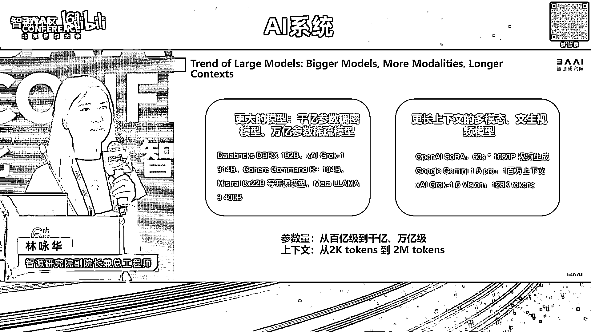
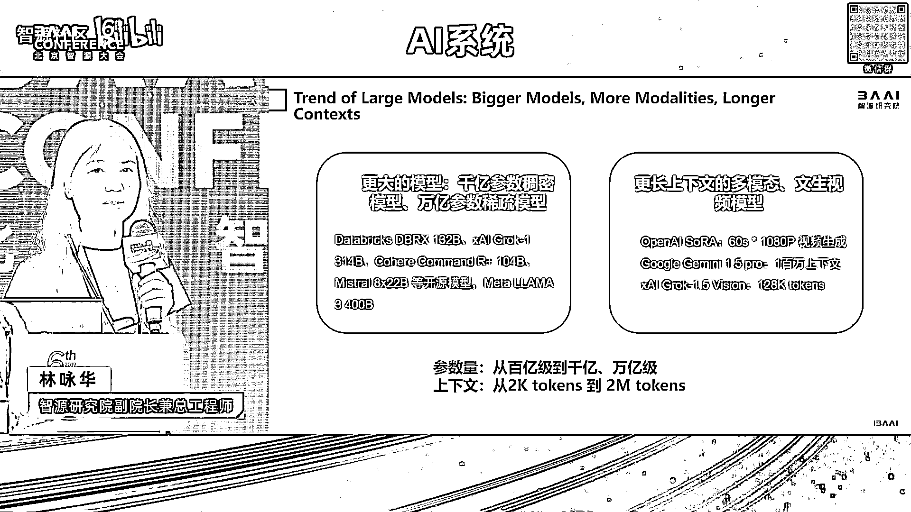

# 2024北京智源大会-AI系统 - P1：论坛背景与嘉宾介绍-林咏华 - 智源社区 - BV1DS411w7EG

呃好呃，欢迎大家参加今天的这个智源大会，我们的AI系统论坛，那个这个论坛是整个大会里头唯一一个承载的，所有的大模型所需要的诶，AI所需要的跟算力是相关的，所有的系统的问题，那呃作为一个opening呢。

我我还是想在呃给大家呃，从呃几几页简单的片子来呃，强调为什么我们今天这个论坛很重要哈，那首先我们看到呃，sorry因为我们有一位外宾，所以那个我稍微把有一些title啊翻译成英文。

那首先第一个我们看到新的这个大模型的趋势，是说更大的模型，更多的参数从千亿千亿参数，重密模型到万亿的系数模型，包括我们可能会看到今年会有万亿的呃，那个重密模型，那另外更多的模态。

尤其在更多的模态的带动下，才，其实我们的sequence lds，会由之前的几千token，步入到已经步入到几百token，甚至是几百万，投几几百k token，甚至到几百万token这样的一个量级。

这些token的LDS，实际上也是对我们的系统带来很多的挑战。

那此外数据无疑也是呃增大了很多的数据量，无论从语言模型拉玛，从去年的la2到拉A3，而今年我们看到大量的大模型，要考虑它们在多模态，尤其是视频生成上的这些，无疑使得我们的训练数据集，又是翻了好几个量级。

这些东西都是给我们专利带来更多的需，求和挑战，那另外一方面，其实我们并不觉得大模型的算法已经汇聚了，去年，虽然我们在语言模型上，好多都是走GPT2这样一个路线，但是随着这个模态的多样性，还有模型结构。

大家更加大胆的去尝试不同的这种结构，因此我们看到，其实算法已经在今年步入到了一个，百花齐放的一个情况，那意味着我们底层的算子，其实对需求是更加变换的更多，我们又没有能力去catch。

这么快的一个算子的变化，放到我们的系统，尤其是这么多的不同的架构，所以综合我们看到是说，这个是我们看到的整个在AI系统的挑战，从底往上啊，依然我们是离不开我们芯片架构的创新啊，那芯片架构是否有未来。

还有新的芯片架构的一个出现，或在已有的一些新的指令集上面的一个拓展，倘若我们已经有了很多的当前，当前我们已经有了很多的芯片的选择，更多的未来的架构，那我们从编译器层面我们怎么去解决啊，不同的架构。

包括指令集的变化，那再往上，我们作为这个越来越大规模的这个集群，大家一起要高性能的去训模型或推理模型，那当我们面对这些更大的架构的时候，或者是说它怎么去优化，另外当我们面对不同的算力架构。

这些异构算力怎么样子，能够被我们的这样子的一个并行的优优化，并行的这些框架统一起来，那再往上大家也看到了，大家今年都在谈万卡集群，万P集群啊，几万卡啊，都要在一个集群内进行高性能的训练，可能同一个模型。

那我们整个组网方案，其实对网络技术发展了那么多年的网络技术，又有新的挑战，所以这个是这个图，我是希望用它来涵盖我们今天众多的奖者啊，我们今天应该有八个还是九个topic，从底到上涵盖所有这些topic。

所以嗯也呃很有幸呃，请到了相关各个领域的专家，来给我们分享他们的想法，面对这些挑战的想法，以及他们最新的一些成果，更多的是他们对未来的一个思考，呃今天的我们的topic我在说明这个安排嗯，不分先后。

主要就是我们希望把呃，从底到上给大家重做一个呃捋清，那希望大家能够呃尽情的享受，今天上午带来的这个整一个，我们在AI系统各个领域的一个饕餮盛宴。

