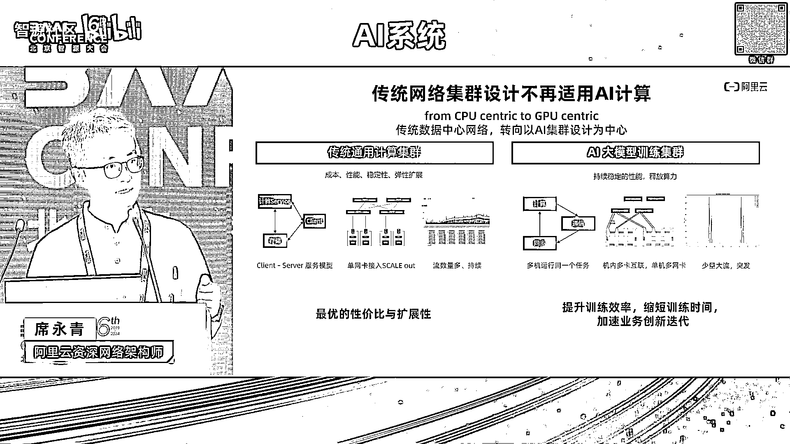
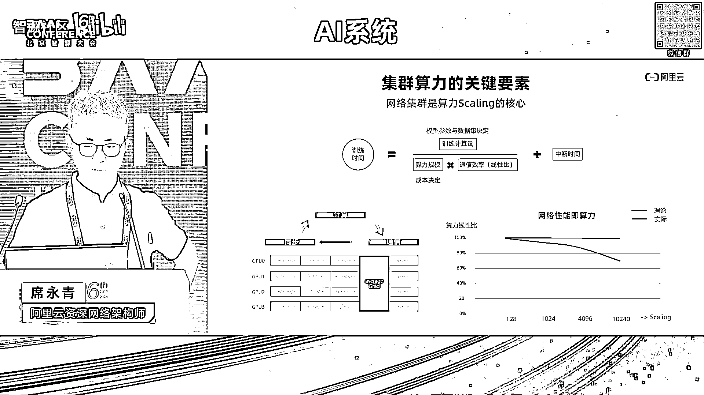
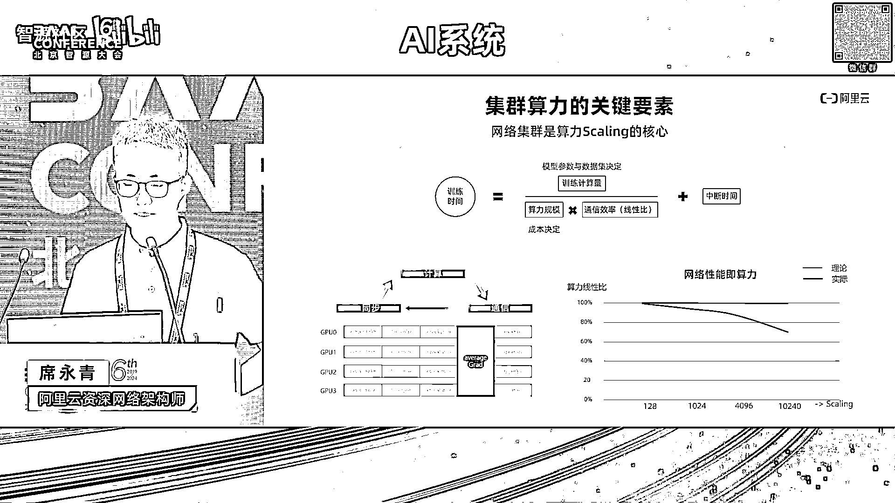
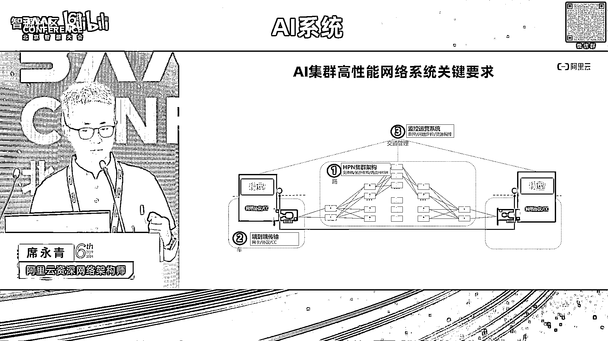
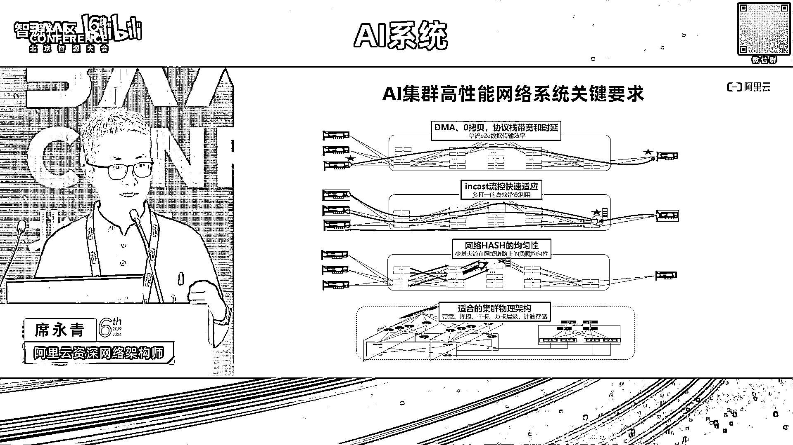
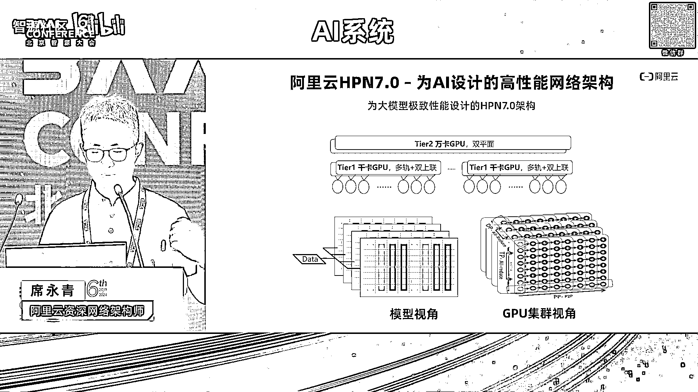
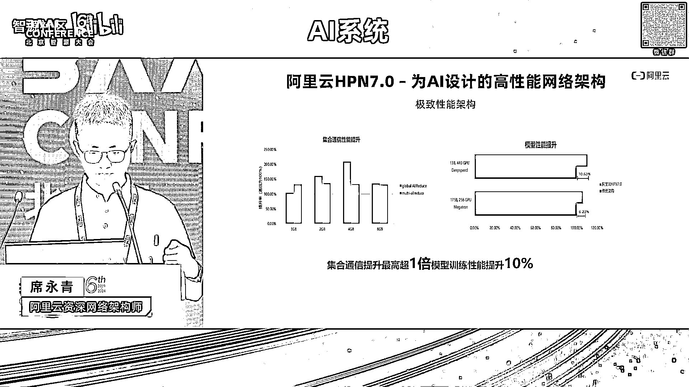
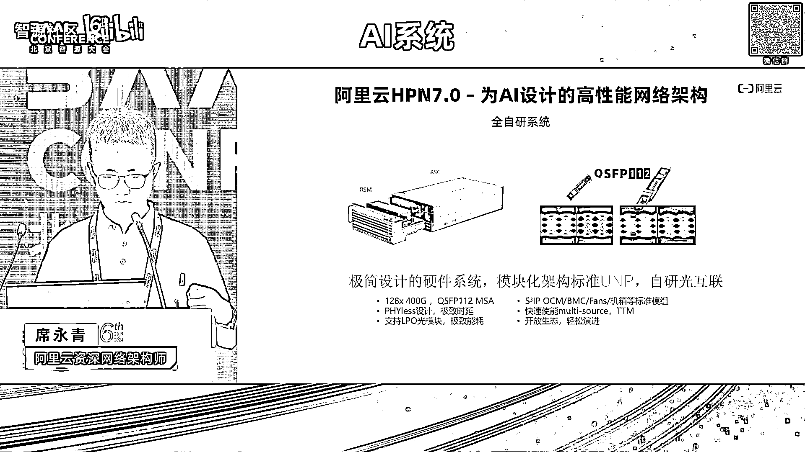
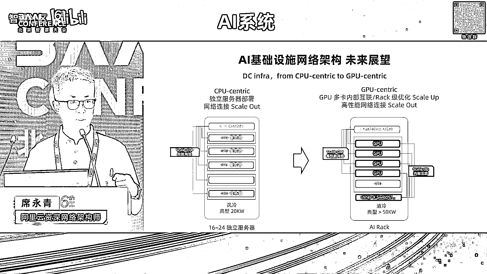

# 2024北京智源大会-AI系统 - P10：网络驱动的大规模AI训练- 阿里云可预期网络HPN7 - 智源社区 - BV1DS411w7EG

好感谢谢谢林老师的介绍啊，那个嗯还是感谢大家再稍微的再坚持一会啊，我们我我应该可以按时这个结束，然后再开始午饭，前面的几位老师其实从啊编译从模型框架，然后从啊从这个软件站啊，系统。

以及从从呃并行的这个策略上都做了一些啊，这个在AI方面，AI系统方面的一些工作的介绍，那我呢介绍的是网络的部分，其实就是把前面几位老师的工作呢，我们怎么通过网络把它连起来，把连把它连成一张啊。

刚才林老师也说过，我们要连到一张上万张卡的一张一个大集群啊，让这张大集群呢去做一个作业，他去完成一件事情，然后呢呃呃就是万卡集群呢，我们在HPN7。0上，其实从去年9月份已经落地了。

然后接下来呢在啊我的分享里面，我也会探讨我们啊接下来的10万卡啊，更大规模的一个一个分享，而一开始的时候，那个袁老师也是非常呃呃呃，就是让我很很很很很很很那个很感谢，就是他说阿里这个机会其实非常好。

那其实阿里不光是有办卡集群，我们在整个模型的系统，整个AI系统里面的，这个服务的能力也是非常好的，所以欢迎大家在阿里云上去做我们的科研啊，做我们的呃工程和创业的工作好嗯，那我我今天的内容呢。

其实希望通过啊今天的一个介绍呢，啊让大家了解到啊，从网络的视角，从集群的视角啊，当我们把很多的GPU连到一起的时候，那其实它最关键的网络的工作是什么，网络为什么在这个里面非常的重要。

以及说他遇到的核心的挑战和问题是什么，阿里云的H型7。0，是怎么去解决这个问题的啊，希望可以回答呃，回答大家这些问题，其实我们现在呢整个数据中心啊，已经从CPU的啊，这个分布式的系统已经演进到以AI。

以GPU为中心的这么一个数据中心了，其实这个数据中心的演进的变化呢，对啊网络产生了非常大的挑战，不光是网络啊，整个数据中心的基础设施，从呃制冷水啊，电啊电的供应，那整个机房的设计啊。

都是一个颠覆性的一个变化，那其实网络我这简单回顾一下网络，从数据中心的网络，从第一个10年，也就是说从大概2000年开始，互联网开始的时候，我们用我们的电脑去啊，上上聊天室啊，去做呃，去上论坛啊。

那个时候一直到一直到我们第二个阶段，就是从10年开始左右，我们的云计算的这个发展起来，那网络的规模，整个数据中心的设计，也是发生了翻天覆地的变化，从一开始的可能上千台机器的规模。

这种client server的这种服务的模式变成了大数据啊，然后呢呃集群化的这个存储的系统等等，这样一个云计算的这么一个一个平台，那这个平台其实对网络已经对，对数据中心网络的挑战已经很多。

我们从TCP引进了RDMA，通过REMH加速这个网络集群的这个互联，那再到今天，我们其实已经到了这个AI这个阶段啊，刚才几位老师都已经提到了，其实AI它是一个最终我们在训练的阶段，其实它是一个大的系统。

这个大的系统是，它不是像原来class server这样一个模型啊，它是一个并行的，非常多的万卡级别的GPU去完成同一个工作，他真的是真正意义上的一个data center。

as a computer的这么一个结构，所以呢，这个里面对我们产生非常多的一些挑战啊，我们可以看下就是传统数据中心，其其实在AI的这个大模型的场景下，已经已经不适用了，我们原来的设计已经不适用了。

这就是为什么我们要去做万卡的，HPN的7。0，首先从呃从这个模型上来讲，已经是一个非常大的一个差别，原来我们都是can i server的一个一个服务的模型啊，这个服务模型下呢它的呃我们的GPU的机器。

这个机器本身它就是一张网卡出来的啊，通过CPU，然后PCIE外设，然后再到网卡出来，它的互联是非常简单的，然后我们也看到说，因为我们有非常多的这个云上的业务，我们看到他的流量其实是持续的流量。

它的流的数量是非常多，也就是它的entropy其实是非常大的，在这样一个条件下呢，我们再看一下AI，到今天的这个万卡集群的时候啊，它的呃跟传统的计算都有哪些差别，我这列的这三点其实非常关键。

第一个就是说它其实多机在运行同一个任务，这个里面的长尾的效应，木桶短板的效应，你坏一张卡，换一个网络节点，它一一个网络的连接如果不通了，最终你整个任务都停掉了，这跟原来的这个模式是非常不一样的。

第二是说呃我们现在的这个GPU的计算，它卡内其实都是这种多机的互联啊，这种互联呢跟外面的通过以太网，我们去把它连成万卡的这个互联，这两张网络的互联之间，其实要做一个非常好的协同。

你才能把它的效率能发挥出来啊，呃然后最后呢我们看到说在AI计算场景下啊，网络上他用的连接的数量其实非常少，如果你看到一张卡，它出来的连接出来的话，它在100以内，但是你原来一一台CPU的，几。

一个CPU出来的连接数量，可能是几10万甚至百万级别的这个连接数量，所以它对于网络的这个entropy的这个影响。

会导致我们网络上在哈希上会出现问题，这个时候我在后面要去要去介绍的一个点，那网络在整个集群算力里面，它它的作用是什么啊，它体现的关键的价值是什么，这就是我用这张图里面大概来解释一下。

其实网络是集群算力做skyline的一个核心啊，为什么呢，因为我们现在大家关心的是，在从训练上的角度来讲，我们关心的是是训练的时间，因为训练时间是大家创业，然后跟竞争对手去拉开差距的。

去一次一次迭代的一个非常关键的因素呃，一个非常关键的一个因子，那这个时间其实是计算量除以你的算力，然后再加上你中间的一个中断时间，那中段时间就不讲了，那算力的规模越大，理论上它所消耗的啊时间会越短。

但是算力的规模增大了之后，网络这我们看到网络这你两台机器的啊，同步的通用量和1万台机器同步的通信量，完全是不一样的，所以呢网络在中间所等待的时间，让计算所等待的时间会随着规模的变大而变长。

那这个变长的结果会使得我们总总的规模越大，之后，它的算力理论算力的下降啊，会比较明显啊，这个我们叫它算力的线性比，也就网络上我们做集群网络，我今天讲的内容的核心，也都说我们怎么把这个线性比，同从啊。

几百张卡到1000张卡到1万张卡的这个过程中，让算力能保持线性的去增长啊，这个是我们呃一方面是省成本，另一方面我们节约时间，它是算力的一个发挥，所以说在这个里面。

我们的我的一种说法，就是网络的性能及集群的算力啊，我们再去看一下，如果说这样一个高性能网络系统的话，我们有哪些关键的部分啊，那第一是说这个集群的架构，我们要有这样一个集群的架构，去把这个万卡的连起来啊。

它不是简单，它不是简简单单连起来，我后面会讲会讲为什么，第二是说哎你是需要一个非常高效的协议，去端到端的，就像一个跑车一样，你断不断的在路上去开，开的时候，你这个车要快，然后你的呃这个调度系统也好啊。

然后第三还有我们的运维监控系统呃，你你不能说你建了一张网络跑不起来，或者说跑跑2分钟它断了啊啊断了，你也不知道它为什么断了，这个也是我们现在在AI系统里面，非常核心的一些技术，其实就是做AI呃。

性能的profiling，然后做呃性能的优化，以及说出现问题之后，我怎么去快速的找到它，然后快速的把有问题的点给拿掉，让任务去继续运行，所以说这三个点是整个II系统的高性能，网络系统的一些关键的要求。

那这些关键的要求有这四个方面的挑战啊，有这四个方面的挑战，第一个是说，我们要有适合的一个集群的网络架构，要去承载万卡和10万卡的这样一个呃算力，那为什么我们需要一个适合的架构呢。

比如说北京大家在上班的时候，如果所有人都来海淀区上班，你北京的路修的再好，你都会用色啊，这个道理很简单，所以呢我们把路修宽，把路修好之后，还要把路修的要适合这么大的规模，然后能让这么大的规模的这个算力。

在放在一起的时候，它能发挥的更好，所以这个集群架构的设计是它最基础的部分，然后呢，你在网络上的这个均匀性是第二个关键点，这个也是我们目前在很多领域里面，去解决这些问题的，呃。

一个呃一个一个就是很多方向上，在网络上在解决的一个关键问题啊，还有in cast问题，你都会遇到，说大家会撞到一起，那撞到一起之后，你用什么样的算法让他去退避啊，怎么样做到全局的最优零拷贝和DMA啊。

这些呢是我们在呃rocket的RDA，包括像IB其实都是在做呃这个呃，呃这样高效的一个传输的一个工作，那总共有这四个方面的挑战，那阿里云的IPPN7。0，是怎么在这四个方面上去针对。

AI集群去设计一个万卡甚至10万卡的。

更大规模的一个系统呢，好我来介绍一下hp7。0呢，它我们有几个设计的特点，第一是说它支持的规模可以到，就通过两层的cloth的这样一个，fabric的一个结构，可以至少万卡的规模啊。

具体呢是1万6000卡啊，我们现在已经上线了多个集群嗯，它是基于51。2T的这个以太网交换机，去实现的，有几个关键的点在这个里面，第一个是说啊，它是呃一个呃双上连加双平面的一个设计啊。

这个我刚才呼应了我刚才讲到的一个点，就是AI系统，如果出现啊link的问题，如果出现单节点的问题之后，双上联和双平面可以让它无感知的继续去运行，然后我就在日常的运用过程中把它给换掉，就可以了，第二个点。

我的千卡的segment，这个千卡segment1说，我通过多轨的互联做到1000卡的范围内呢，它没有不会有任何的网络用色啊，这1000卡它所发挥出来的千卡的啊。

这个网络的带宽的呃性能是它的理论的呃极限，所以说呃我们这个体验卡的这个性能的结果，我在后面也会有有介绍两层万卡，两层做了万卡之后，对整个万卡的系统也是非常关键，因为两层的网络交换。

它的网络的跳数就只有两跳，如果是三层网络的交换的话，它跳数是五跳啊，这个大家都能理解，那五跳和两跳相比呢，两跳它在网络路径的简化上，在网络的实验的简化上都有非常大的优势，那我们通过这样的方式去做到。

单个集群可以覆盖呃，呃1万6000卡，那将来可以覆盖更多的啊，这个10万卡级别的这个设计，其实我们已经有了，然后内部也已经做了理论上的一些论证和仿真，然后可能在明年会有这个10万卡的呃，集群会有部署啊。

嗯当然基于这个呢，我们还有我们自研的rock v two的RDMA哈，自研的HPC流控里面去解决一些细节问题，因为时间的原因我可能没关呃，就是没办法去介绍这么细节啊，我们会在那个大概在下个月的时候。

我们的呃公开的论文就会发表啊，到时候大家可以从论文里面去看到，我们实践里面的一些细节，那从呃从hp n7。0的整个税上来讲呢，刚才几位老师也讲到了，我们在并行的这个策略上，其实并行模型整的计算怎么去做。

并行网络怎么去做并行，最终还是要映射到网络的连接上，网络的拓扑上，这个拓扑和并行策略的关联，针对B型策略的网络架构的设计，其实是非常关键的，那呃这个我就不展开了。

那通过通过HPN7。0的呃，在这些方面的优化的一些工作啊，这些一些针对性的设计呢，我们能做到通信模型，就集合通信的这个性能提升在一倍啊，这个是我们呃呃就是单纯去跑集合通信的时候。

跟呃之前的就是通用的这个集群架构相比，那整个模型的端到端的性能提升在10%，那这这百10%呢，我们是一个呃是在呃deep speed的这个框架下去跑呃，拉玛13B的这个模型得到的一个结果啊。

呃所以它的呃从我刚才讲到的，其实从呃这个千卡segment，以及说万卡的这个两层close这个结构下，简化的网络针对性的设计，以及400G的RDM，我们其实单机是3。2T啊，单机3。2T的RDM啊。

以及属我们自研的通信库和啊自研流控算法，这些东西结合到一起，我们能做到它的极致的网络性能。

然后整个额就是阿里的hp7。0呢，其实是针对是针对呃，呃这个AI系统我们做了全系统的自研呃，就是我我刚才讲到了，其实呃硬件啊，然后呃从从架构拓扑啊，从啊通讯库啊，从RDMA等等这些角度呢。

从网络通信的角度呢，我们呃做了我们自己的设计和自己的优化，那除此之外呢就是构建这么一个系统，还有两个比较关键的因素，我们要去做网络设备的自研，因为只有自研之后，你才能把里面啊芯片里面。

然后通信信号上的呃，一些问题才能掌握在自己手里，然后整个架构里面你能做到的，调优的结果才是最优的，那整个系统里面，就是我们我们做的这个模块化的，硬件的设计标准，以及说整个自研的呃128个端口的。

400G的这样一个网络的设备啊，这样一个硬硬件的一个一个一个网络设备，都是我们自研的，包括在光模块上，我们也基于阿里的专利去做到了啊，这个400G的光模块QST112啊。

这个是我们呃在光模块上的一个标准，那其实整个硬件和光互联的这个系统啊，在整个呃IHP7。0也呃，下面呢也发挥了非常重要的一个作用，也就是说它的稳定性啊，它的互联信号的质量，然后它的对于性能上。

我们能掌控的一些呃细节啊，都通过自研的方式，全自研的系统啊去做到了啊，把系统的呃这个能力发挥到最极致。

好，那我在呃后面再花点时间去展望一下，我们这个整个II基础设施的一个啊未来啊，就我们啊阿里内部呢，其实从各个系统上也在呃探讨，我们下一代的IIAI的info。

不管是明年还是啊3年之后的这个AI info，它是应该是什么，目前呢我们呃就是能看得到的是说，从啊CPUCENTRIC到GPUCENTRIC这个过程中，一定会发生，从电力到机房设计和到网络互联系统整。

以及到GGPU内部的互联系统，整个全系统的一个AI基础设施和AI系统，硬件层面的一个变化，那首先就是我们现在的这个呃，单个机柜上可能是20千瓦的这个机柜，我们也是风冷的机柜，然后呢有CPU的服务器。

可能放放个20台左右，那这样一个机房其实已经不再适应了，因为我们接下来呢啊通过GPU卡本身，它自己的功耗很大，然后我们希望把它集中的放到一个，短距离的范围内去，让它的数据交换的能力更强，之后呢。

它的算力集群的，它单机的这个系统的算力才能发挥的更好，所以说我们一定会设计一个叫i i rec啊，这个那个NV在他的呃，在他的这个呃GDC上，其实已经发布了NML72，其实很多系统。

包括我们国内的系统也在做64的啊，64卡的系统，那这样一个系统在这样一个WRC里面，对RC的呃制冷啊，对RAC的功耗的挑战啊，都是非常大的，那其中跟网络相关的有一个非常关键点。

就是说呃这个呃scale up的这张网络已经发生了，跟今天已经发生了很大不一样，我刚才也讲了，就说AI系统，为什么跟传统的计算计算系统不一样，因为AI系统它当前我们拿到的这八张卡。

它内部还有一个超大带宽的互联，内部是是3。2T的互联，但是呢一张卡出来，它可能是400G200G的互联，这样一有一个九倍以上的这样一个，带宽的一个差距，那我们怎么去把这个内部一个这样一个。

scale up的网络跟外部去结合好，然后这个SKYUP的网络呢它也会越长越大啊，像NV他已经做到了啊，72张卡的互联，那其实我们呃国内的GPU厂家，未来也会往这个方向上去走，那所以在这个里面。

我们带来的网络上带来的挑战，就是怎么样把scale up和scale out的网络融合起来，像视频7。01样，我们把不同的模型切割和训练过程中的pattern，流量，pattern的这个信息做结合。

与网络的设计，与网络的RDNA与网络的流控设计，放到一起啊，这个其实是一个非常非常网络，在未来非常关键的一个命题呀，那是SKUP网络啊，我就是我，我我这可能稍微解释一下什么是是这个scale up。

就是在我看来呢，对up的这个定义，就是说它能它能做系统，系统内部的一个characal currency，然后可以做到极致的大带宽啊，它因为它因为它距离短，它的成本距离短，可以使得它的成本可以做的低。

在这个框架下，它可以把带宽可以做的足够大啊，那这样一个sky up的一个系统和SKYOUT相结合，那sky out是什么，就是我们嗯有由1000张卡变成1万张卡，我们通过以太网或者通过IB把它互联起来。

连到更大规模，那就是这样一个结合的设计，是未来的一个啊一个命题，然后我们内部也在呃针对嗯更大的scale up，到64~72之后呢，跟scan out怎么去结合，去做我们下一代的这个呃网络架构的设计。

然后呢，再到我们面向更加灵活的这个模型的流量啊，刚才很多老师都已经讲过了，我们可能会面临MOE啊，跟我们今天的all reduce和reduce scatter呃，这这些操作可能会不一样。

会有auto all等等，会有其他模型的，这个流量的pattern可能也会出来，包括多机的推理啊，多基的推理刚才提到了呃，Kv catch，那kv catch在多机的场景下。

也是需要网络去提供很大的带宽，但是这个带宽要大到什么程度啊，它的它的呃需要网络在呃，RDMA在流控上需要有什么样的新的能力啊，这都是在未来可能发生的，这也不是很短的。

未来就就也也也不会是很很很很长的一个未来，可可能在明年这件事情就就会发生，所以能在未来呃，这几件事情会使我们在I压系统设计里面，要去重点去考虑的啊，然后那看到的未来的这个网络上的。

我们能能呃需要的这个算力级别，我们需要的这个呃需求呢就是10万级别啊，10万甚至更大的这样一个算力的集群规模，包括100T的交换网络的啊，这个系统以及新的新型的硬件等等，这些是网络上我们要去做的工作。

那10万这个级别的设计，我刚才已经讲了，其实我们内部已经已经有啊，已经有这个仿真和模拟的一个结果，我们以及一些详细设计也已经有了，但是呃因为呃现在还没有还没有这么大的店啊，还没有这么大的一个数据中心。

所以说10万的这样一个呃呃一个单机群呢，我们还没有部署起来，但是相信在不久的将来呃，我们就会呃遇到这个，然后呢在网络上我们也的也也看到其实业界啊，网络业界对于呃将来AI基础设施呢也成立了。

也也也成立了两个关键的这个联盟组织啊，UEC嗯，Ultro net consultant，以及说u a link啊，ultra accelerator的这样一个两个组织。

分别在scale up和scale out这两个方向上，希望通过呃全球的生态的力量啊，把网络上这两个方向的大的命题呢，做到呃更好的大家的标准的统一啊，做到那个能力的统一，以及最好的这些想法和网络技术。

在这两个方向上去做发挥，所以呢呃那个阿里也是在呃呃这个UEC里面，我们现在是这个tech的member，也就是说在UEC的这个呃决策委员会里面，是国内的唯一啊，国内的唯一家公司参与在里面的。

就跟跟北美的那个微软啊，然后呃那个meta还有BROADCOM等公司啊，去呃去在这个组织里面去，把网络上将来要去面临的问题，II场景下要去面临的呃，系统性的问题去做解决。

然后去呃做这个为将来的更大规模的10万卡，更大规模的这个AI基础设施的系统呢，去做更好的网络能力，嗯好我的内容就这些好。

谢谢大家好。