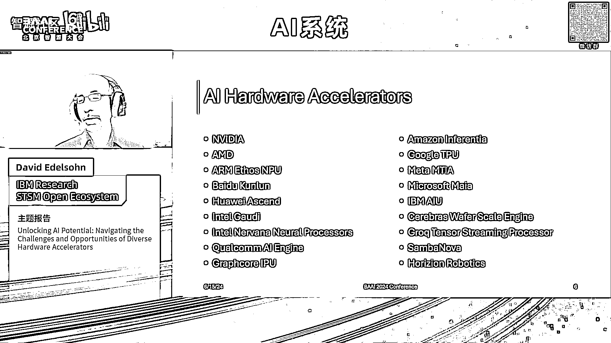
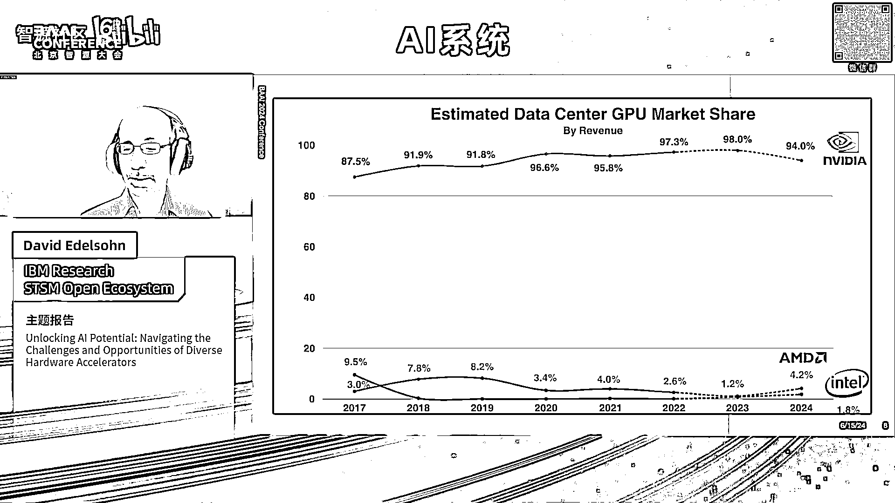
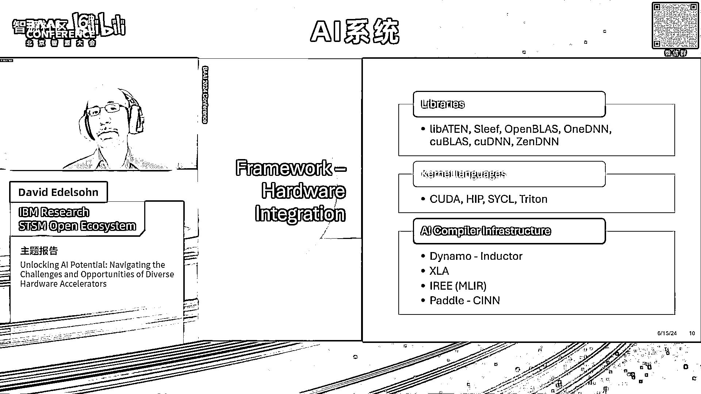
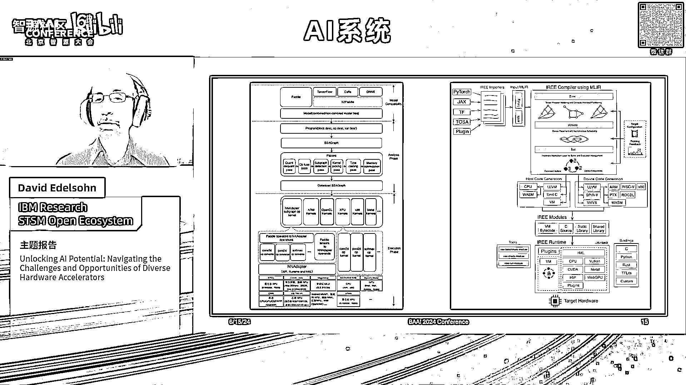
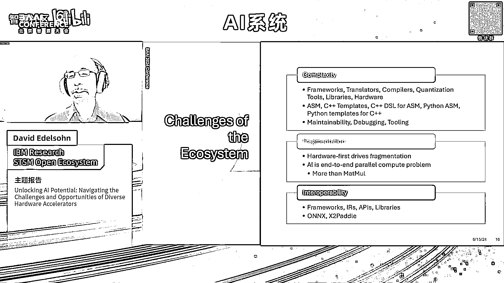
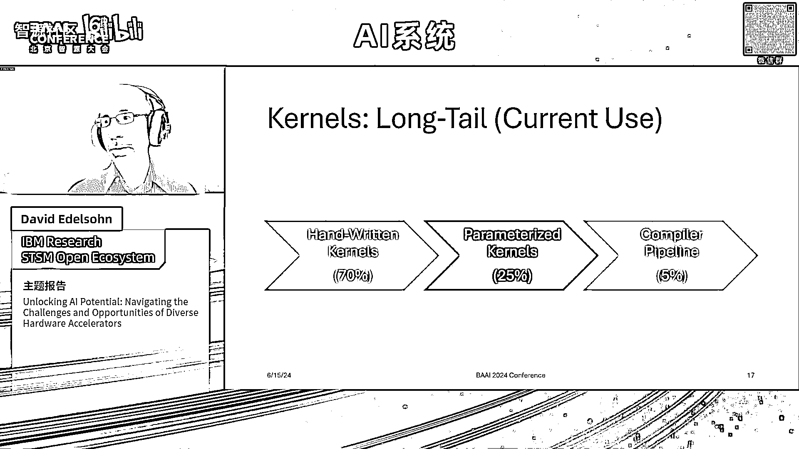
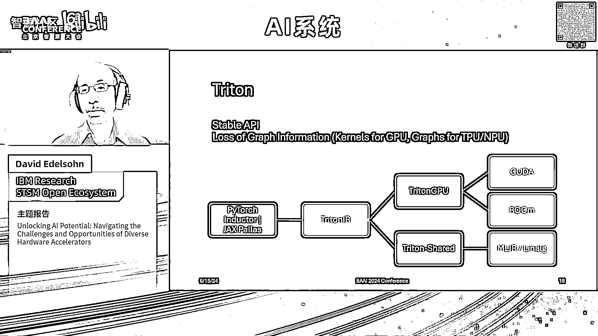
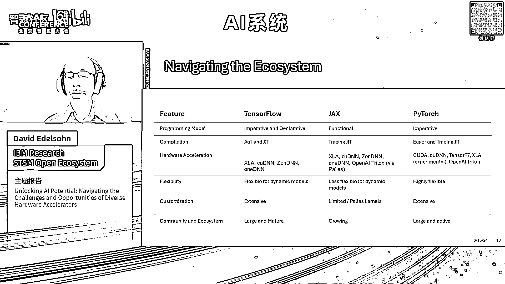
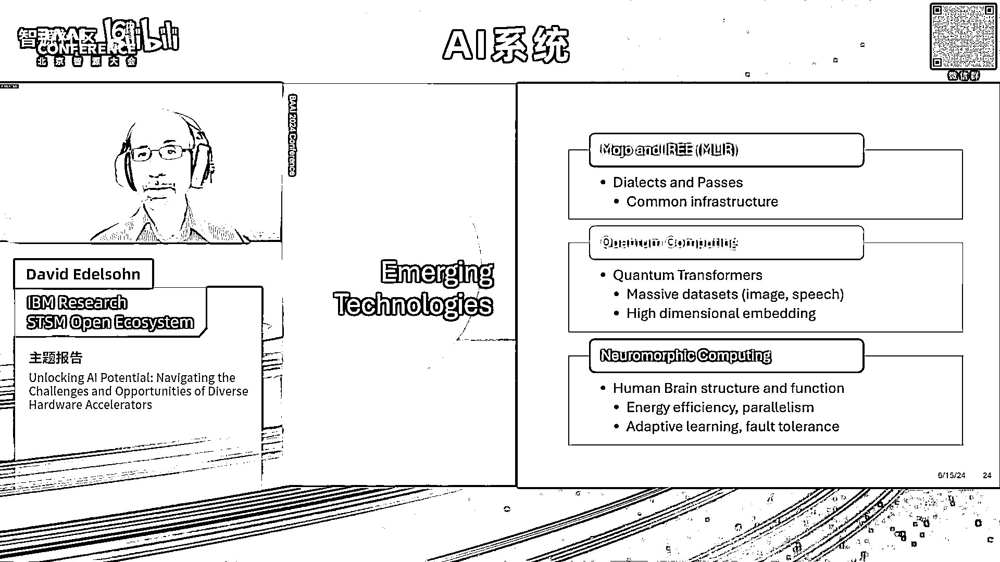

# 2024北京智源大会-AI系统 - P2：Unlocking Al Potential：David Edelsohn - 智源社区 - BV1DS411w7EG

非常感谢，谢谢Yanga精彩的介绍，你在IBM的时候能和你一起工作真是太棒了，就像你说的，这次演讲的目的是探讨连接的挑战，AI模型的最新开源框架，以及它需要运行的各种硬件加速器，以及如何建立这种联系。

并提供一个有效的生态系统，在此基础上，我们可以利用所有这些伟大的模型，各种各样的体系结构硬件加速器，就像小阿说的，我叫大卫•埃德森，我是开放开放生态系统的高级技术人员，她说我参与了GNU编译器。

仍然领导着海合会社区，它是Linux开源软件生态系统的基础，最近进化到人工智能与Numpy合作的生态系统，打开BLA一DNN，现在来看看各种各样的硬件挑战，在这次谈话中，我再过一遍。

人工智能框架中硬件加速器的概述，了解这个软件生态系统面临的挑战，支持硬件，如何在生态系统中导航，还有一点关于未来技术的讨论，新兴技术和未来方向，所以首先我想从这个动机开始，有大量的开源模型。

想要在各种不同类型的硬件上运行的人工智能模型，所以从生成的模型类型，爱，自然语言处理，自动驾驶，无论是在培训中还是在汽车欺诈检测中的部署中，机器学习，计算强度较低，但周围有很多要求，并发性。

潜伏期的能力，处理大量计算的吞吐量能力，一直到移动和可穿戴，又有不同的要求，无论是外形因素还是这些人工智能模型将要运行的设备，在延迟功率要求中，所以人工智能有各种各样的模型和用途。

在加速器上运行这些模型的能力，因此，挑战是如何从这些不同类型的框架中找到一条道路，包括桨，划桨，Jax，张量流，在那里这些模型被开发出来，以便能够在如此巨大的范围内部署这些模型，不同范围的目的，用途。

建筑，这些模型将在其上运行的硬件体系结构，所以只需谈谈硬件加速器的类型，一个有GPU，大家都很熟悉，不管是英伟达还是AMD，从图形处理器点开始，现在被用于这些类型的机器学习和人工智能模型。

它们具有非常高的吞吐量，流媒体，并行性，在这些计算密集的计算中非常有效，在更专业的处理器上也有工作，比如谷歌使用收缩阵列的TPU，在特定的张量操作中更有效，非常擅长大规模训练，有npus，它们在。

该名称用于较小设备上的NP类型，或者在数据中心也可以称为TPU，所以这是从微软、元和IBM的特殊用途，AI芯片，到苹果的设备类型，Mac或任何类型的PC，FPGAS在研究和原型制作方面非常有效。

因为它们的灵活性，可重构性，有利于理解，不同类型计算密集型模型的具体用例，Dsps，它们功率很低，用途很特殊，但在功率和尺寸有严格限制的设备中很有用，六分是最好的表现，但非常适用于特定的用例。

但都是非常有限和专业化的。

所以又有大量来自英伟达的人工智能硬件加速器，AMD，百度，昆仑，华为，上升，呃，对于大量不同类型的模型，不同类型的专门用途，这是一个非常大的生态系统，这需要专门的代码和对它们中的每一个进行专门的调优。

挑战是如何利用这些模型，它们是用一小套框架开发的，这些框架非常有效地定义，尤其是这些最新的大型和大型语言模型，能够将这些映射到所有这些不同类型的硬件上，元有它的MTA，芯片，微软，玛雅芯片。

IBM和AU亚马逊，Infoa，这是一些尖端的，大脑晶片刻度引擎还是岩石张量流处理器，所有这些都在探索硬件设计中不同权衡的整个空间，但希望能够运行相同的主要型号，比如聊天，英镑或美洲驼。

这些有趣的模型中的任何一个，你知道不是最新的数据，但你可以看到，在整个市场份额的更广阔的空间里，又有大量的甚至又分入，其中一些是用于更可穿戴的设备，个人电脑，其中一些在数据中心。

但需要支持的硬件范围非常广泛，对于这些有趣的模型、机器学习模型和GPU空间中的AI模型，更狭隘的是，英伟达显然占据了主导地位，但又一次，这只是GPU，这不在数据中心，不是TPU，或者其他类型的呃。

NPU处理器，如MAYA或其他芯片，但现在，AMD和英特尔正越来越多地关注中国的市场份额。作为一个整体仍然主导着这个市场，尤其是在高端训练空间，所以大多数编程都是在商品环境中完成的。

人们现在正试图将其扩展到不同类型的处理芯片。

所以人工智能框架，还有一个不同的框架，它们都有不同的好处和权衡，Pytorch因其灵活性而非常有用，易用性，易于编写模型并对其进行调整，探索它们，张量流，它存在的时间比，最初有很大的领先优势。

准备好生产了吗，非常健壮，非常适合在生产中部署，jax是google开发的另一个框架，与他们的xa编译器紧密相连，我一会儿就会谈到，非常适合数值计算，又一次，与张量流不同的权衡，当然啦。

来自百度的桨桨与它的焦点，从超缩放到移动玛瑙，这并不完全是一个框架，但我在这里作为另一种语言，那个能把模型写进去，对运算符的定义和模型之间的交换非常有效，这是一个好处也是一个挑战。

然后是许多其他不同的框架，随着时间的推移，它们已经被开发出来，仍然有很好的用途和专门的用例，在很多地方都得到了有效的应用，所以这里有一个非常广泛的框架，为了争夺市场份额，有不同的好处和不同的权衡。

所以这些框架连接到硬件的方式，是通过一系列的层次，包括一些库，如pytorch中的lib ten和sleve库，使用他们开放的BLA一DNN，所以一系列的图书馆都集中在，其中一些比较笼统。

其中一些更侧重于一个框架，一些更专注于硬件的，嗯，我把它们放在一起，是内核语言，Cuda和臀部，NVIDIA和AMD作为嵌入式域的语言是什么，用于编写低级内核的特定语言，呃，Sickle是一种语言。

现在是UXL的一部分，伴随着呃，Foundation提供了可以跨多个硬件架构工作的相同类型的嵌入式DSL，特里顿是个新人，一个基于Python的非常有效的，呃，表达这些内核的更高级的方法。

目前专注于创建GPU内核，但是，我稍后会提到，一直在向其他领域拓展，各有利弊，还有那些果仁，嗯手写的，并结合了针对硬件优化的库，与这些不同的人工智能编译器基础设施一起，如Pytorch中的发电机电感器。

Xa和张量流，还有Jaxx，怪异的MLR基础编译器基础设施试图提供，和和解决方案仍然是初步的，以及拨桨框架中的拨桨和CNN基础设施，以及所有这些编译器是如何组合在一起的，的，模型设计。

以及这些库的执行用途，提供一个在不同形式的硬件上运行的优化环境。

现在，这些框架对模型有专门的要求，而不仅仅是一般的编译，包括张量，张量的动态形状，张量稀疏性，再次在模型中进行量化和多精度的精度变化以获得最佳性能，最佳内存使用，同样。

从数据中心到特殊嵌入式环境类型的能力，所以理想情况下，人们希望有这种简化的图表，你拿一个用这些框架中的一个编写的模型，或者通过Onyx翻译的模型，你把它放进这朵奇妙的云里，这蓬松的云。

它神奇地变成了一个可执行文件，可以运行和利用这些不同硬件的硬件，但当然，现实比把东西扔进云里得到神奇的回应要复杂得多，这个显示xl a体系结构的示例，呃，它主要关注tensorflow和jax。

但也有能力进口圆周率火炬嗯，你开始看到这两个目标的复杂性，独立优化和大量目标，这些不同的框架和编译器基础设施的问题，模型本身还需要进行大量的调优，以及编译器基础结构，从这些不同的硬件中获得理想的性能。

所以可以说，哎呦，我们将只对所有内容使用tensorflow或xl a，但是把一个模型从pytorch，或者划桨进入XL A，模型本身有很多关于性能最佳使用的信息，这需要大量的调谐，所以这里没那么简单。

从手臂的不同角度来看，体系结构只是一个单一的体系结构，有许多框架中的两个在上面工作，我可以开始看到不同路径的复杂性，如果使用张量流，一种是使用特征或一个DNN库，如果一个人用圆周率火炬。

一个是使用开放爆炸或一个DNN库，编译器基础结构，不同的编译器和不同的计算库，因此，框架和它们的编译器基础结构都有一个困难，尝试支持不同的体系结构，对于开发人员希望在更细粒度的级别上使用的任何方法。

你可以看到左边是桨桨灯建筑，右边是诡异的试图再次支持，所有这些潜在的框架和所有这些潜在的硬件，它变得不详细地经历这一点，但试图利用所有不同的路径是一个非常复杂的场景。

并获得具有这两种体系结构中任何一种的模型的最佳性能。

尽管他们在这方面取得了很大的进步，所以再一次，生态系统的挑战在于有一个如此复杂的框架，笔译员，编译器，量化，所有这些不同的硬件，编写这些模型的不同方式也很复杂，他们的图书馆，从汇编语言，也就是。

你知道的，绝对气馁，虽然它得到了，当然啦，可以获得很好的性能，C++模板，创建asms的嵌入式dsls，例如Cuda Python创建ASM，所以有很多很多不同的形式和很多很多不同的成分可以结合在一起。

但是这种复杂的组合很难保持可维护性，用于调试和工具，所以这是一个挑战，人工智能社区正面临着从这些架构中获得最佳性能的挑战，又有碎片了，如果一个人从硬件第一的角度来处理这个问题。

创建一个为硬件设计的完整框架，当然，这可能会得到最好的性能，但它是不可伸缩的，特别是对于我在几张幻灯片前提到的所有硬件架构，所以这并不实际，我们将从硬件开始，说这是不实际的，我们将从模型开始。

人工智能空间，计算是端到端的，并行计算问题，不仅仅是马尔，不仅仅是，我们将创建这个maal库，并解决所有问题，所以另一个挑战是互操作性，框架，图书馆，用于尝试创建与这些不同框架交互的库的apis。

Pytorch有痒它的API桨，因为它嗯，在自身模型上有一些互操作性转换，比如玛瑙和x两个桨，但这两个都有局限性，即模型目前需要像我提到的那样，专门定义或调优以获得整个系统的最佳性能，呃。

正在使用的工具链基础设施，所以说，从我与组织的对话中，谈谈这种发展是如何演变的，站在部署模型的最前沿，目前他们使用的是大约70%的手写内核，对于最关键的路径和最关键的内核，他们能够利用看到他们在叫什么。

果仁的长尾巴，在那里，它总共占总内核的30%，20%到30%的人能够使用参数化工具，我的意思是，像海卫一这样的工具，然后大约5%左右的编译器，意图是理想的计划，目标是能够转移越来越多的高性能开发工作。

到这些高级语言，到参数化核，到管道，更少的依赖于人类手写代码。

所以说到海卫一，海卫一说过优点和缺点，他们的海卫一啊有能力用作编程，一种手写目标语言，内核的高级描述，在这方面非常有效，它现在也开始被用作编译器目标，所以它既是人类手写的书面语言，和编译器目标语言。

那个，双筒望远镜和电感器还有杰克的宫殿都瞄准了，你知道的主要路径，最常见的是我所说的Triton GPU，最初是为cuda和nvidia设计的，现在越来越能够直接支持ROM，不通过翻译。

但是在Triton GPU中为ROM提供直接支持，微软和Meta也在做一些工作，在一个名为Triton共享的开源项目中，能够利用Triton语言来支持他们的专用硬件。

通过一个在linalor lin alge连接的mlr通道，不同发音的人通过，挑战是这个琳娜的媒体，内核中描述的信息有点太低了，TPU和NPU硬件的级别，它真的想看到模型的子图或完整图，以获得最佳性能。

能够对更大一部分的计算进行操作，而内核对Gpus非常非常有效，所以信息的丢失，另一方面，MLI，R和linodialects一直很脆弱，就API而言，因此。

Triton实际上在提供更好的稳定API方面很有用，编译器（如pytorch感器）可以针对它生成代码，因此，关于如何扩展海卫一，还有很多工作要做，或者其他接近MLR的方法。

以在更广泛的硬件上获得全面的性能。

所以再一次在生态系统中导航，基本上你知道，这个，又是这个子集，不同类型的框架具有不同的优势和不同的优势，不同的编程模型，不同社区，不同的定制，不同的支持库，这是一个挑战，你知道的。

尝试将版权框架与正确的硬件相匹配，以获得最佳性能和其他限制或要求，硬件与公司。

公司的政策，所以基本上优化一个模型，你有一个组合框架的选择，张量优化，核仁，混合精度，参数化，该装置，具体优化，目标优化，尤其是在嵌入式可穿戴领域，关于内存布局规划的关注，选择性连接和包装。

以确保这适合设备，嗯，所以说，基本上，这是非常重要的，无论一个人是试图创造一个炒饭菜，或者试图创建人工智能应用程序，把所有的食材和一位大厨，把这些都组合在一起，一个人可以得到一个漂亮的炒饭菜。

或者可以得到类似于清洁应用程序的东西，呃，在视频中被认为是如此有效，生成人工智能，所以你可以得到惊人的，呃，用合适的厨师和合适的食材烹饪结果，因此，生态系统的女巫列表基本上是硬件通用性。

所有这些不同的硬件都有一个单一的真理来源，那个不需要专门，能够参数化硬件的不同特性，不必在程序集中写入，希望不是c+，能够使用更灵活的语言，能够支持这些动态形状，所以在新兴技术中，我之前提到过。

MLA的怪异之处在于，围绕这一点创建更多公共基础设施的潜在机会，创建了他们的魔力编译器，他们正在慢慢推出，希望有一些，呃，再次受益，在更长远的未来使用MLR基础设施。

在量子计算和量子变压器方面有有趣的机会，它可能有很大的机会支持图像和语音的海量数据集，或高维嵌入，对神经形态计算也很感兴趣，它试图利用与人脑结构和功能相匹配的计算基础设施。

为了在模型中获得更多的这些功能，人工智能可以利用这两者来实现平行，容错性，其他类型的人脑特征，这就是将来的一些话题，所以再一次，你知道的，回顾这个简短的介绍，人工智能框架环境有很多多样性。

这两个用例都有很大的范围，在非常受限的环境中生成人工智能和计算密集型，硬件延迟，吞吐量，加速器硬件，框架和挑战，一个很好的机会是每个人都在学习越来越多关于工具的体系结构，基本上收敛于正确的优化集。

以及利用这些工具的方法，以及如何应用它们从工具本身获得最佳性能，当模特越来越多，推理机变得越来越强大，并学习如何在模型本身的设计中获得更多的优化，因此，它们正在向更多的互操作性靠拢。

希望更多的公共基础设施，可以在这些不同工具之间共享的公共API。

所以再一次，呃，这是一个非常激动人心的时刻，而且有很好的机会可以跨硬件供应商进行合作，框架开发人员，的，库开发人员和模型开发人员，应用程序开发人员共同努力，共同开发这个生态系统的未来。

最好以公开的方式做这件事，能够从所有这些不同的伟大的头脑中获得创新，世界上的思想领袖，在世界各地，那里有令人难以置信的创新和探索，所以有了这个，非常感谢，我只想提一下和谈话没有具体关系。

但我正在做的另一个项目，称为企业神经系统，它正在与联合国合作进行人工智能创新大挑战，并希望尽可能广泛地传播这一点，我们正在寻找全世界的参与，所以如果有人在研究气候变化，还有爱啊，我们向各地征集建议，请。

请帮助沟通，我们正在寻找每个人的参与，所以有了这个。