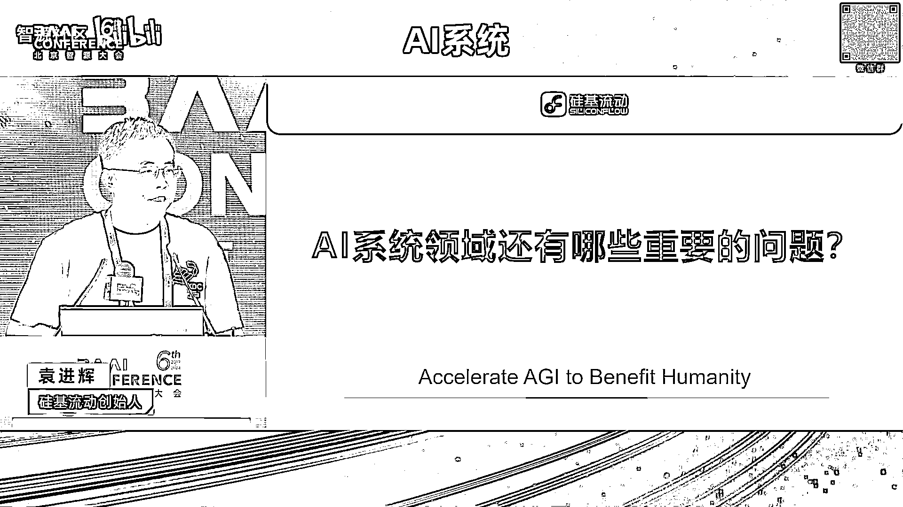
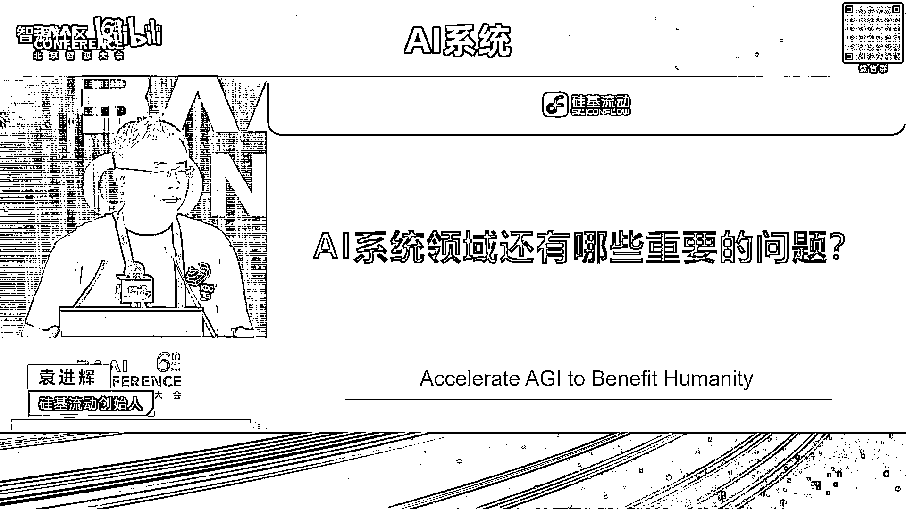
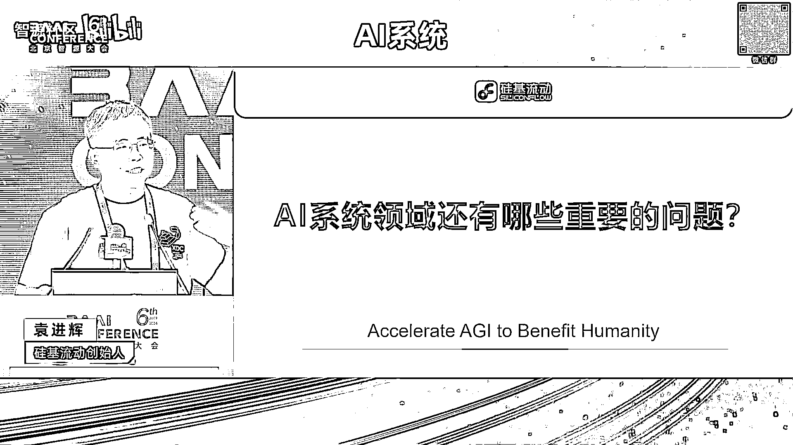
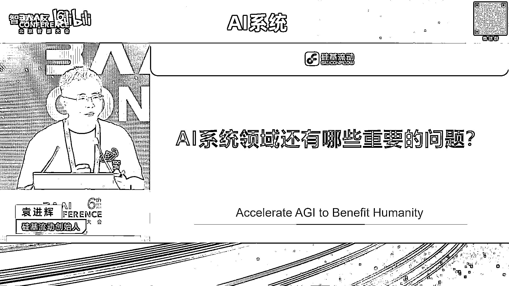
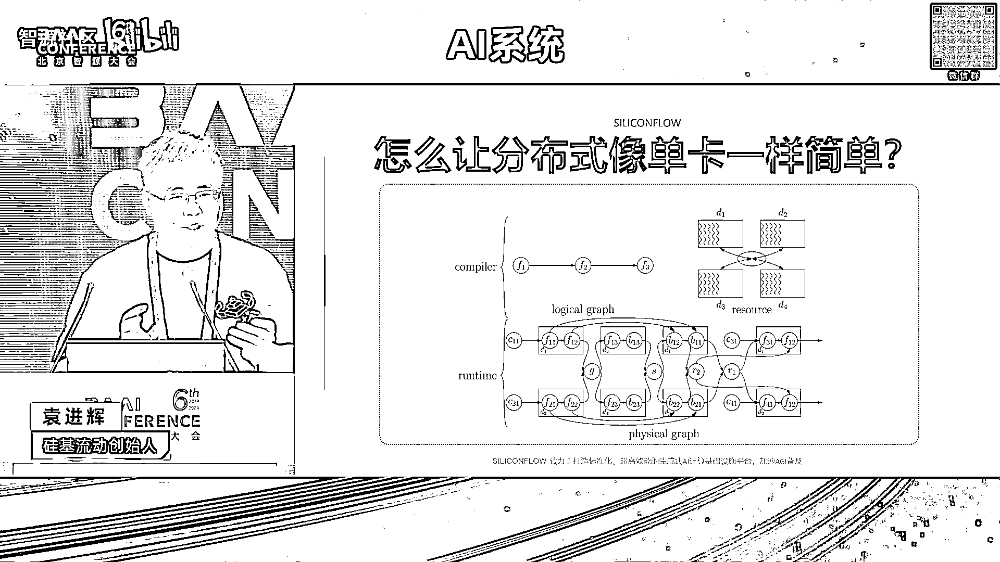
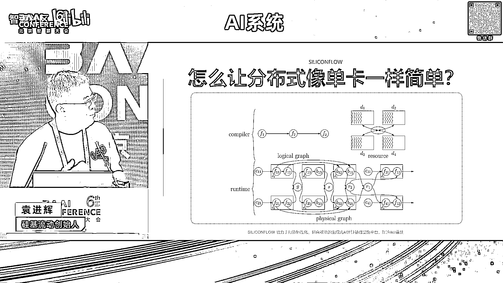
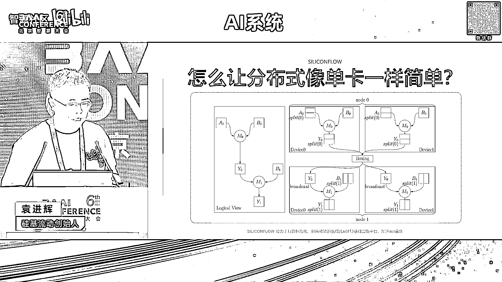
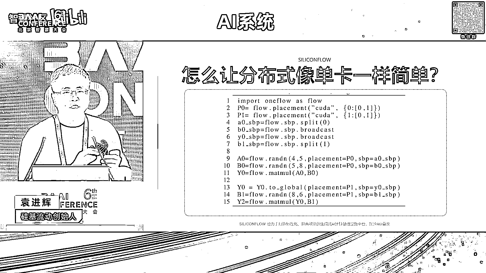
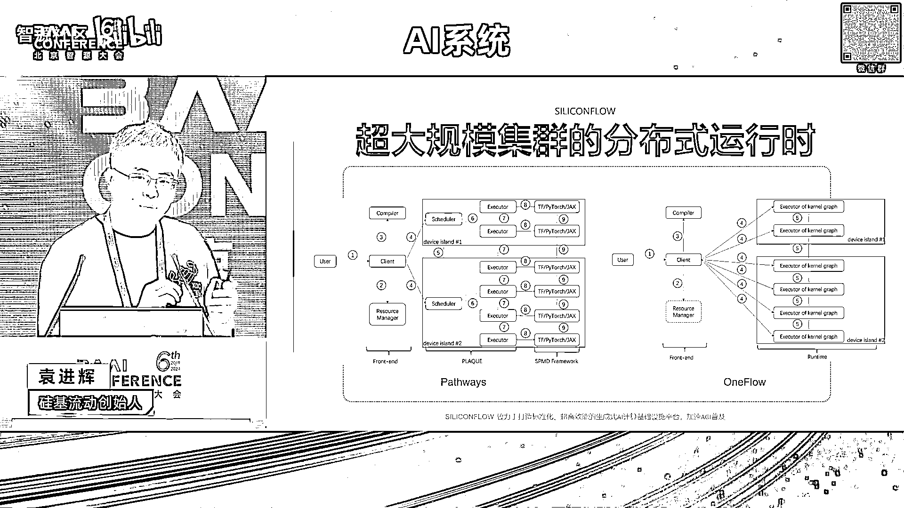

# 2024北京智源大会-AI系统 - P3：Al系统领域还有哪些比较重要问题？-袁进辉 - 智源社区 - BV1DS411w7EG

嗯谢谢林院长的介绍，呃这个题目确实非常大，然后我呃是想想提前说一下，就是我是来提问题的，不是给答案的，所以大家可能让等待答案的这个会有所失望啊，然后为什么起这个题目呢，这个我解释一下那个它的缘起。

因为今年3月份的时候，不是英伟达在硅谷开那个GTC大会吗，有非常多的同行，国内外美国的都去，我也去参加了，然后就和呃很多我们从事这个方向的同行，都在最前沿的专家呃交流聊天。

然后呢就会其实就会遇到一个同样的，大家都会关心同样的问题，就是嗯好像这个外界的环境和大家的研究热点，发生了非常大的变化，然后我们下一步就是作为我们这个community。

或者我们在做这个AICM工作的同事，还有什么重要的问题需要我们去解决呃，这听上去就好像说哎，是不是没有什么重要的问题了，还是还有另外的就是说应该说在大模型之前呢，呃应该说做AI system。

我觉得它的significance它的重要性呃，应该至少是和搞算法和模型训练研究的，是一样重要的，在当时那个位置啊，或者说那种影响力，但是当那个大模型起来之后呢。

好像大家都去关心关心那个model的问题了，然后那个这个搞AI system的，隐隐有点像变成二等公民的感觉哈，这也是一个呃，然后就是大家普遍在讨论，就是说我们搞AI system的还有什么样的点。

我们可以做出非常就说我们做出一点工作之后，做出一方面一个工作之后，就能成为在整个行业有非常大影响力的是吧，这是我们每个人所追求的就是Impact，所以这是这个问题的由来，但是很不幸就是在那个开会之后。

我也一直在琢磨这件事情呃，我说实话我也没有想到特别巧妙的，特别妙的想法，所以今天是把这个问题抛出来呃，然后我们可以大家都想一想，然后我会结合呃近期我们在做的一些工作，然后从一个小的侧面来啊。

分享一些认识和观察，OK那后面我就进入这个正题，嗯其实刚才林院长介绍呃，我我我在这个AICMM工作呢，呃大概分成两段吧，就是从16年到23年，实际上在做one floor。

那时候的重心是在搞这个training里面的问题，然后从去年开始就开始呃，开始silicon flow之后，就开始做inference方面的工作，那在这块呢我也会分享一下。

为什么发生这个变化啊，呃我还简单回顾一下，我们在training时候做的工作，我今天回看的时候，我也感觉，我们当时呃，这个我们还有包括很多同行做这个ESIM，system的工作呢。

呃还是非常就是它有系统的美妙，就是我们在system方面有一个可以有非常简单的idea，然后呢它会发挥非常大的作用，但是在今天我们在一会，我会看到我们搞inference的时候，呃。

会发现它需要非常非常多idea，综合起来才能有一个不错的产出，不同的产出，就好像一定程度上，就是这个system没有那种过去那种味道，就是那种纯粹的system的工作。

然后一个巧妙的idea就有很大的爆发力，然后我回以回顾一下，就是one flow的时候做的，我觉得嗯他那个时候有那样一种特质，第一个当时做的是一个比较呃，我们觉得是一个也是比较超前的一个想法。

就是当模型变得比较大之后，这个系统该怎么做，以及当面对一个大的集群的时候，我们怎么让这个集群上的编程变得非常简单，特别是像一张卡一样去做，其实今天看的话呃，这个idea现在很多问题已经被解决掉了。

呃在16年的时候，像这种想法或者这种呃还是比较呃西呃，有领先性的，那基本的思路也是像我们讨论很多的，像这个compiler，就是把一个单卡面向单卡编的程序。

经过compiler经过一层一层的rewriting，然后变成一个execution，Plan，就是physical the graph啊，这个里面呢这里面涉及到一些呃抽象的问题。

就是我怎么通过一个单卡逻辑的代码，变成一个多卡执行的物理的执行系统，这里面涉及到引入一些representation，就是系统层面的表达，然后这个编译器或者是呃optimizer。

它需要在这个表达上一层一层次转换啊，那后面我们就引入，就是说呃在one floor，当时还是比较非常简单的idea，但是他一下子就把这个表达的问题，比较巧妙的解决了。

实际上当时的这个重心就是把这个张亮的，从单个逻辑的视角到这个物理的视角，或者是分布到一个集群上的视角，它的映射的入规则呃，提炼出来，用最简单的一些入，然后就能够把我们所能想到的，形形色色的并行所表达。

那这个呢我们把它叫做SBT啊，其实在我们后来之后呢，呃学术界又有这个论文出现，就是包括谷歌的像GSPMD等等，嗯这个SSBP呢它其实就说一个张量，它可以经过split。

可以经过broadcast可以经过呃，另外一种不特别直观的就是那种趴手的方式呃，建立起逻辑和物理视角的一个映射，最后这个编译器，就通过这个在这个SBP的表达下，把一个单卡的单单单卡写作的方式的程序。

变成一个多卡分布式的执行的代码，在这个基础上呢，嗯我细节就先不进入太深了，它基本上可以把我们所今天面料的，各种主流的并行，经过非常简单的annotation，就是对张亮的一些annotation。

就把这个graph writing的方式就变成一个呃，一个一个compiler pass就就搞定了，另外呢它基于基于这个基础上，当然又引申了说呃，这个annotation怎么去自己自动去做，去优化呃。

也有一系列的工作啊，呃我们和李老师也做了一些合作，就是李世刚老师也做一些合作，怎么把这个呃这个COMPU呃，单卡的程序自动的变成更有效的分布式等等，它的代码就是说呃，就像刚才那个既包含数据并行。

也包含运行模型运行，它的代码可以真的像单卡一样简单，但是这个时候大家会注意到，中间会有一些就是annotation，就是还是丑陋的，是呃需要人工去写的，比如说这个一个矩阵，它的placement是什么。

它的SPP是什么，但是那个auto paralysm呃，是可以把这些问题搞定的，呃，实际上今天在社群里面。

已经有很多很多这样的工作出现了啊，另外就是说刚才是一个compiler层面的，还有个run time层面，run time层面，其实呃我们看到比较多的，前段时间就是谷歌做的那个pass way啊。

是影响力，就是它的传播力比较大，它实际上引入了用actor啊，用这些东西去做，那同样做这个思路呢，呃我们在当时做one floor的时候，也是呃早好几年的，就是在16年开始做这个one flow的时候。

一开始就是用这个abstraction去做它，其实我我认为，就是它在这个超大规模的分布式的时候，仍然有很多的生命力，特别是跨集群的时候呃，多个集群之间嗯，很多集群之间。

它没有像一个集群内部有那么紧的耦合，然后弄所有的东西能一致的节奏，一致的步调去做呃，然后多个集群的时候，它一定有这个引入异步的，这个时候用actor的方式。

以及中间actor之间method parsing的方式，实际上是在wrong time的实现上，可以做到非常简洁呃，我们后面也发现，其实后面有些比较新锐的芯片公司。

比如说像tense torrent呃，人家在芯片层面其实就用了这种abstraction，就是在各个call之间以及各个chief之间，都是用这种message passing的方式统一去啊表达啊。

好我前面这个是回顾了一下之前的工作，呃，我我觉得这个在之前还是有一定领先性的，呃在今天这些idea呢还是比较我，我也觉得仍然比较美妙的，但是发生了不幸的事情，就在于说诶今天这个模型大模型出现之后。

好像就一种architecture，就是transformer decode only，然后这个时候发现做了这些能自动运行，能非常优雅解决这些问题的，问这些呢好像有大家不怎么用，为什么呢。

因为呃当那个模型结构变成architecture，就是一个decoder only的时候呃，用一个纯手工去写作的，其实就今天很多盗模型公司在用的Mac tro。

纯手工把这个parallel的方式写作下来，反而用的很多，就这是不是说一定程度是，像那个开源社区里面讲的，What is better，诶，这是不是呃，当然对我们来说是比较可悲的事情，呃。

我在硅谷的时候，也那个和那边的一些同事交流，呃，我又发现了一些令人鼓舞的事情，就发现仍然有人是喜欢这样的，其实比如说像谷歌他们做那个JX，实际上就是这些思路，就是JS和PYTORCH的区别。

就是呃就是它可以在编译层面，把分布式做得非常自动化，然后也遇到了，比如说X点AI date breaks，还有google的人哎，他们里面颇有一些这个researcher，还是非常喜欢这种方式的。

特别是你像XAI，他们官方在用的就是这个JS呃，说明这个方向应该还有呃，特别是当这个模型仍然有，未来的探索的潜力的话，或者什么这些仍然有很强的需求，很强的生命力，我们也希望有这种呃可能性。

另外一个就是说关于训练层面呃，实际上还有非常重大的问题，就是超级大规模里面这个SCALABLESCALABILITY的问题，比如说大家说的10万卡，百万卡等等呃，但是不幸的是，就是要做这种研究。

需要有一个大装置呃，但是对于我们绝大多数同行来说，是没有机会做这样的工作，这也是这就其实一定程度上解释，为什么我们开始做inference，因为我我摸不到那么多卡了哈，来做这个分布式并行了。

所以像我们最后一个talk，我注意到是阿里的同行去做这个交流，那我就觉得非常羡慕，因为我们有很多的GPU就可以去做这个工作，对好我回顾到这里。

后面进入到这个呃，现近期只举行的一个工作哦，还有一个就是编译器的工作，就是呃我在呃几年前在知乎上回答过一个问题，当时说我觉得这个AICM非常hard CORE的问题，一个是宏观的，一个是微观的。

宏观的就是分布式怎么去自动化并行什么的，微观呢，就是怎么让编译器，帮我们自动把这些所有的代码去生成出来，非常高效呃，同时也有非常多的这个compiler方面的研究。

在近些年像那个有很多包括TRITTON，包括微软研究院有这个ram等等一系列的工作呃，在这里面沉淀下来的呃，现在看到比较就是大家取得共识的，在这里面compiler和code站里面呃非常有效的方式。

其中一个idea也非常，我觉得也非常简单，就是原来把这个问题想得非常复杂，但是后来发现大家一致的都这么做了，就是基于TAL要去做，其实就是把一个很大的呃计算呃code，然后把它引入一个中间。

表示其实就是分块的，然后在分块之上呢，大部分是graph那种层面的优化，分在tie i r之上做，graph和TRITTON也是这么搞的，然后tail之下呢去搞那个cos jin的。

就是已经分成一个小块了，它就可以映射成这个很多芯片里面，那个已经很微观的一个结构了，在那个层面再去解决，就是不是说把所有的东西塞成一个，optimization的问题，那搜索空间就巨大啊。

就发现搞很多时间也搞得不是特别理想，但是把这个引入一个非常简单的抽象，type r2之后呃，上面的问题上面去做，下面的问题下面做，当然这个会有的时候，这种不能cross stack的这种优化的时候。

有时候有一些损失，这个就是后面的问题，好呃，前面介绍了一些，我们之前关注过和做过的一些工作，下面我介绍一下搞为呃在推理方面的一些工作，呃，为什么搞推理，刚才说了一个原因是，没有那么大的集群可以玩了呃。

然后第二个原因是因为行业内也比较关注推理。

就是呃推理的随着应用的爆发，它的需求量还有这个价值创造的经济价值呃，一定程度上可能更多，因为在这个training的时候，我们是阶段性的，然后训练一次模型，大家知道那个计算量和参数量N相关是六倍的。

参数量再乘以token数，推理的时候是两倍的参数量乘以token数呃，从这个角度来说，推理会比训练少三倍，但是他的token数是无止境的，就是训练的时候我们知道大概几万亿token。

10000000000000token什么的，但是推理只要我持续有有用户来请求，它就没有边界，比如说open i1天可能是几万亿token呃，几天或者一周，就把那个训练时候见的token都见过了。

或者都呃都那个量就覆盖了，那在推理里面，大家也知道这里面今天呃非常核心的问题，就在于说，今天的芯片都是，基本上是瞄准之前training的WORLOUD去设计的，就导致呃有些资源有些错配。

inference有一个preview阶段，它基本上和训练的时候是比较接近的，就是是一个batch，是一个仿存呃，是计算仿存比较高的一个WORLOUD，但是另外就是个decoding阶段。

就是那个auto ressive next token prediction的方式，它里面呢就是呃是一个仿存瓶颈的，这个是一个roofline model，我们大家都非常熟了。

就是呃在这个batch size很小的时候呃，它基本上那个计算的就是仿存，我把权重加载加载进这个，靠的这个时间是固定的，但是它那个上面部署了很多的计算的单元，瞬间就把这个计算完成了。

导致它这个要再取数据，要等一会，只有当这个batch size到过了一个临界点之后，才能把这个芯片上主要的这个call和计算能力，打满和打饱和打满，这个时候，就今天其实绝大多数芯片都是面临这个问题。

所以有的时候嗯发现有一个阉割版的芯片出现，反而对这个推理来说非常经济划算，比如说H20，H20，就是它上面实际上把计算的call都给砍掉了很多，但是带宽又加大了。

就就比较适合这种仿存的密集的这种WORLOUD，这是呃我们看到的在推理里面最核心的矛盾，呃，这个层面呢，既可以通过我们system的一些工作去搞定，也可以，当然今天也有很多人在做芯片硬件的角度去做。

比如说怎么通过新的芯片架构的资源分配，让这个带宽怎么搞得更高，你看前一段时间火过一个芯片叫GROCK，Grock，就是呃把所有的东西都放到s ram里面，然后访问那个带宽巨高几10T。

然后它可以做到那个每秒钟生成1000套梗等等，OK这是这个inference里面的核心问题，今天看到的这个可以通过system的角度去做，也可以通过芯片角度。

但是芯片今天还没有太成功的deliver出来，这种结果呃，还有就是我想后面就是重点分享的，就是呃看到的还有更多的工作是和算法结合的，就是所以为什么这是我刚开头说呃。

好像这种很多system工作不是那么pure，不是那么纯粹了，因为我们发现就是在这个层面的这个约约束下，像我们过去一样把某个科呢优化得非常好，甚至它可以翻两倍，但是它在端到端的contribution。

就贡献里面只有百分之几，就是它就不是在这个inference里面，它不是那个过去那些专长能发挥更大作用的，一个一个一个任务了，OK刚才我也提到了，就是说他要过一个batch的临界点。

才能把这个芯片跑好呃，所以实际上在系统方面，很多很多工作都是就今天看到的，软件方面的工作，系统方面工作都是在解决这个问题，就是怎么把batch搞得更好，比如说呃PATTENTION怎么把显存用的更有效。

可以让它可以放下更大的batch，或者放下更大的k v catch等等，以及continuous spatch，怎么让这个啊很多token可以一起推理等等，还有一些算法的工作，这些都是为了解这个问题。

呃后面我列举几个我觉得比较有意思的，属于算法和系统协同工作的这样的一些例子，其中一个就是我们非很多人都非常熟悉了，就是投机采样，他他其实把那个toby token的prediction。

能够变成用更小一点的模型，变成一些并行度更高的，然后从从而能利用好，今天这个刚才说的，就是面向过去需求所设计的芯片架构，这个也就不多解释技术技术细节了，还有一个呃，今天其实学术界也有人关注到了。

就是说呃我们使用大模型的时候，有很多best practice使用开发范式，比如说agent多agent那一个agent解决一个问题的时候，它实际上通过多个步骤，多个步骤分解来做。

一个是它通过多次大模型的调用，这些大模型调用之间有些依赖关系，一定程度上就蛮像我们过去搞compiler，搞搞这个分布式并行的DAG，就是有向无环图一样，那同时在这个agent的workflow里面。

这种有向无环图上的优化也是有这个机会的，他有可能把一些没必要的，LM的API的调用就给优化掉了，甚至能够把多个LM的调用可以并行的去做，而不是一个一个去做，这是左边这张图。

解释了一个agent的内部的一些优化机会，右边的是一个多agent，这种多agent的时候，它就更有这种并行机会等等，所以这个里面其实在过去compiler视角去看的话，它就是一个graph的优化。

还有就是呃，其实今天很多流量很大的大模型公司，包括open i什么的，已经用这些了，包括前几天苹果发布的那个已经是端侧和模型，大拇云端有协作了，其实就是一个模型，路由的就是一个任务过来。

它不见得全部发到那个最大的模型上去做，它可以让能解这个问题的，足够的一个不大的模型去解决好了，这个时候他就需要前面有一个root，这个root就要做得非常好，他能把这个任务调用分类啊。

能够有的问题正确的分到小的，正确的分到大的，然后通过最后通过一个综合的来说推理推理呃，就一下子就是提高十倍，效率提高十倍或者什么的，这个时候要比一个科诺的优化。

带来的ROI要高更多，还有这种就是这是together AI，有一个前几天做的一个就是它叫mixture of agents，就是他通过多个弱一点的模型的协作。

然后竟然在榜单上打过了g p t four o，就是在就是它不是单个模型，比gt four o桥，这里面其实是也也涉及到一些系统方面的工作，因为我们知道他together AI。

实际上也是一个AI info的一个一个一个公司。

还有就是这个OK还有这个在实际工作中，比如说long context啊，还有什么一我们会做一些system或者算法的优化，比如说attention上有标准的attention，也有这种GQA。

还有前一段时间deep six做的MLA等等，呃在这个里面呢，它通过这种算法的一个创新，能够把k v cash优化的节约很多，然后推理效率提高很多等等，这是非常好的。

但同时呢呃还会有一些用户实际上有这个反馈，就是在某些对attention要求非常高的场景，有时候会发现这些算法的优化，它对效果有hurt有有损伤，比如说有些在做教育的数理逻辑，那种推理的环节里面。

他那个attention就要求比较细腻，这个时候有的时候对attention做一些裁剪阉割，它会对那个模型效果有损伤，有可能我们在写小说，做情感陪伴，用这种无所谓，但是有的场景可能还得需要回归到。

非常计算比较多的这种attention机制上去做。

还有比如说量化精度呃，它可以有效解决这个kv cash，把kv cash弄得很小，但是这个是前一段时间，我们截图了一下一个模型，它对量化降度之后呢，他对那个long context，因为它量化之后呢。

对那个attention啊，soft max那个计算的分辨率就没那么强了，就会发现它long context效果就下降很多，这也是一个问题。

这是在实际中遇到的问题，好那时候我总结一下，就是前面介绍了像呃过去我们关注的一些工作，包括自动运行啊，分布式呃，自动代码生成呃，然后现在我们感觉这个工业界比较关注的是，大模型推理啊，实际使用啊。

这里面呢会发现有非常多的算法软件系统，还有硬件的call design工作，然后有的时候在这个层面做一个工作，会它的收益会比那个单纯做一个system的工作，收益会多很多。

所以回回到头就是我是抛出那个问题呃，我还在回，我还在寻找这个问题的答案，希望能够后面有一个更好的回答。

