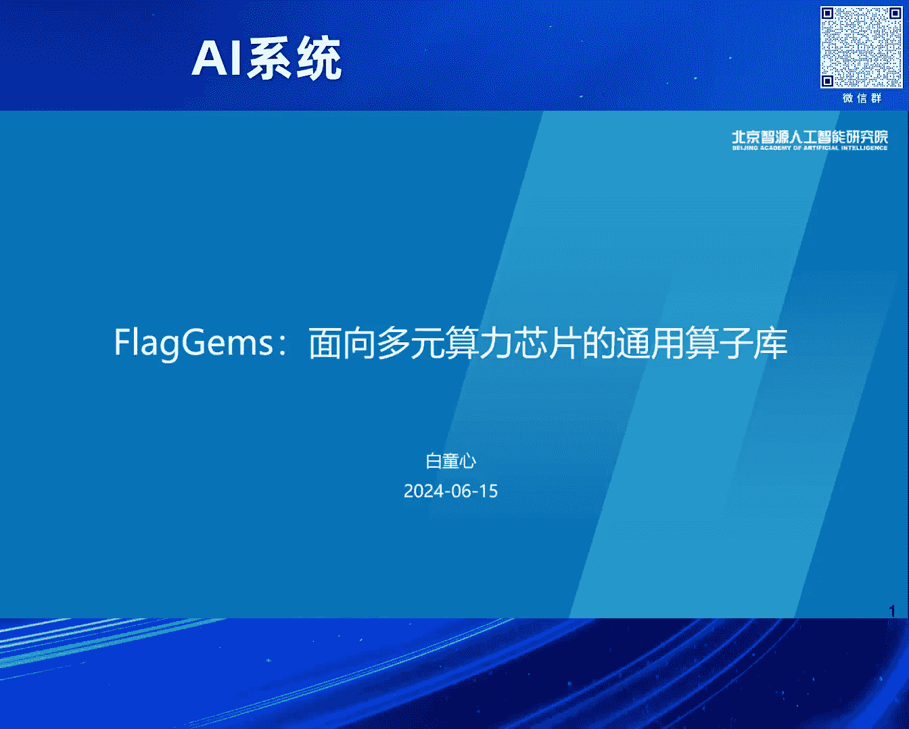
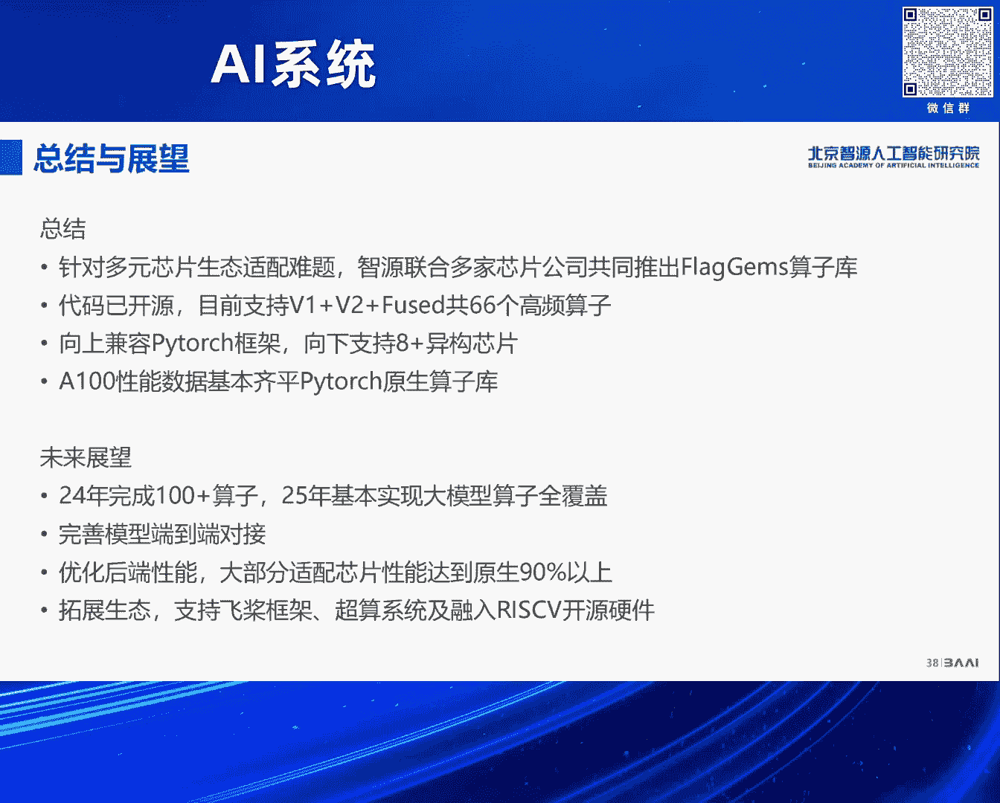

# 2024北京智源大会-AI系统 - P4：FlagGems通用Triton算子库-白童心 - 智源社区 - BV1DS411w7EG

好像那个今天我们带来的那个，就是说这个题目是flag james，是我们最近推出来的一个开源的，那个基于TRITTON的算子库，对，然后我们呢那个我们现在那个智媛的这个呃，团队大概是三四。

最近来招多多招了几个人，大概是五个人的规模吧，然后我们这个flag james的算子库是我们联合呃，硅基，还有中科嘉禾，以及呃，国内的一些那个芯片公司，来共同研发的一个这个算子库，对对对对。

所以我们现在先简单介绍一下这结果，对我们现在这个算子库的呃支持大概是64，66个这个呃基础的算子呃，还包括六个那个容克算子，然后呢，我们呃期望的话，就是年底能够实现100个算子左右。

明年大概就是说能够基本上实现，就是对现在这个典型的大模型的，这个算子的全覆盖，所以这个期待大家去使用啊，啊所以我们今天讲的这个题目是什么呢，就我们去年讲的是一个AI编译器的这个题目。

我们每年争取都会给大家带来一些新的东西，然后呢我们这个工作方向是AI编译器，而我觉得在这个AI系统里面，我们是对被挑战最多的啊，这就是记着我们刚进智园的时候，就那个领导就说哎呀你们做这个编译器的啊。

我们现在面临的是多个这个框架，以及多个这个AI芯片，你们能不能做一套这个编译器系，能够呃支撑这种多元的这个框架，以及多元的算力，都把它们连到一起对，然后呢，那个今年的情况就是说。

就是除了这个英伟达的这个算力之外，可能尤其是大模型的训练啊，这个存在这个大量的算力不足的问题，然后呢，能不能通过这个编译器或者相关的技术啊，把这个不同的算力能够混在一起用起来对，所以围绕这个问题的话。

我们探索了一下这个，这个就是基于TRITTON的算子库的方向，我们觉得这是一个非常值得呃做，而且我觉得通过我们现在验证的这个结果呃，看起来也是非常可行的一个方向，对嗯。

但我们刚才说的就是说这个呃除了我们之外，还有呃其他的这个芯片厂商啊，就是除了英伟达之外，就是我们芯片厂商里面的这个软件开发人员，也是面临这样的问题，也就是做做的东西特别痛苦。

就是就是要开发这个AI的编译器，然后支撑这个多个框架，然后呢要面向自己的这个硬件去开发，这个中间表示啊，后端优化啊什么的，非常痛苦，我觉得这个所有的这些这个这个生态里面。

这些公司里面可能最舒服的就是英伟达对，就是英伟达，因为他已经有自己的一套比较完善的，完整的这个生态体系了对吧，那么其他这个公司呢，可能通过各种各样的方式是跟他找对齐对。

比如最典型的那就是那个这个呃ROHAM，就是AMD的这ROCOME的这个生态体系，实际上跟这个英伟达是非常接近的对，然后呢，呃其他厂商也是通过跟这个英伟达的功能对齐，这种方式来去这个呃。

达到这个构建自己的生态这样的一个目的对，但是现在就是说呃，我们的一个主题，就是如何去实现这种这个多元芯片的混合算力，这样的一个问题，那摆在我们面前呢，除了这个算力就是硬件之外呢。

还有一个问题就是说怎么去统一这个呃，不同的软件生态，我们现在的做法是什么呢，就是每家都是像这个哭大声带去对齐的，但这样有一个问题在于什么呢，就是KA生态的，它的核心是COA的编程语言对。

但是这个不同的芯片架构，你去面向coda这个编程语言去适配，会存在本质的问题，对后面我会讲到，所以所以呢呃简单讲会存在几个限制，第一个是编程接口的这个限制，就是KDA。

它的这个编程模型是面向CMT这样的，这个硬件的架构的，对那么有一些加速器呢并不是CMT的架构，所以适配起来会比较困难，那即便是这种呃通用GPU的架构，可能在一些实现的细节上也有所差异。

所以一味的向这个KDA系统去做这个对齐，不一定是最好的选择，第二点就是说它这个适配过程本身呢，就是针对大模型AI这个领域，既不具备充分性，也不具备这个必要性，也就是说这库达这个体系是大而全的。

那我们这个AI的，尤其是大模型这个领域依赖的算子呢，可能数量没有那么大，所以啊也许存在一种小而美的解决方案好，另外就是说这个面向KUA去做适配它的这个呃，这个呃适配的负担也是非常重的。

因为KDA体系刚才说了就非常的庞杂啊，开发难度也比较大，所以这是啊现在存在的这个问题，就是每一家都去啊构建自己的生态啊，那个像coda对齐这种方式呢，无疑是没有办法去解决这种生态融合的问题的，对。

然后呃除了这个CUDA之外，当然我们知道这个历史上还存在其他的，这个竞争的生态了，其实呃坦白说也不是非常的成功，然后这里面有很多因素，其实主要因素就在于呢就是面向任何一种芯片，它的开发力量不足。

所以导致就是说针对任何一种体系结构的，这个软件的质量是跟不上KDA的对，那所以就是说如果解决这个，如何去解决这个多元算力的，这个生态融合的问题，我们觉得我们需要在枯大生态之外，去重新开辟一片田地。

那基于什么呢，基于这呃这块因为我们少了些动画嘛，就是说我们需要一个统一的这种编程语言，这个编程语言，也许它没有KDA那样高的这个覆盖度，但是它足以解决AI的一些根本的问题，对，那基于这个这个共同的。

这个就是统一的这个编程语言呢，我们可以去构建一套跨芯片的话，企业结构的算子库对，所以在算子库适配这块，就不需要每家单位来做这个重复的工作了，那每家芯片厂商呢就是针对自己芯片的架构。

可以去适配或者开发自己的芯片的这个编译器，后端，这是我们的这个设想，我们觉得这种在我们开发了flag james，这个算子库之后，我越来越觉得这种这个路径非常的可行好，那我们就是探，就是说第一个问题。

就是说我们为什么会选择这个TRITTON，去做这样的一个这个这个开发语言，因为去年实际上我们一致探讨这样的一个问题，去年我们自己是开发了一套比较新的，这个中间表示对，但是那个我们试图去解决从上到下啊。

多个层次的问题，有点类似于MR对，但后来发现就是说TRITTON作为一个呃，这个新新的这个编程语言或新事物，它具备呃很多优势，所以我们就采采用TRITTON，来去做这种这个开发语言了。

嗯概括来讲就是它有四大优势，第一个就是呃它的编程的模型啊，就面向这种这个加速器的编程模型，它是优于CMT的这个编程模型的，第二点就是说，它具有这个非常独特的开发优势啊，开源优势，然后第三方面就是说。

我们做的这个初期的实测性能，也表明TRITTON在性能方面也非常有竞争力啊，最后一点就是说呃，Tritton，由于他现在的这个呃，这个胜，就是说在开源领域的这个这个受欢迎的程度啊。

所以很多这个厂商已经开始去适配它了，好那为什么就是选择这个TRITTON，我觉得首先就是说呃先从这个sim t开始说起，就是说KDA本身它是面向CMT的，一个编程语言。

也就是说它有点类似于C针对这个CPU一样，它实际上是非常底层的对嗯，这个所以就是你在编程的时候呢，实际上虽然你是在面向现成的编程对吧，但是你考虑的是一个这个CMT架构的，这样一个体系结构对。

也就是说这个这个体系结构是一种是高吞吐，刚才那个这个呃袁老师已经说了对，其实这种这个架构，它的极端可能像GRP那种形式，对它所谓的寄存器能，就是SMSMM来去实现的，然后呢它的问题在于什么呢。

就是说他是这个呃次数非常高，但是它可能会有一些冗余，比如说你每个县城可能都需要独立的寄存器，去存储这个仿存的这个地址啊什么的，对相对而言就是传统的CMD的这个架构的，这个呃处理器，那也是并行的。

这种处理器它可能需要更少的这个呃寄存器，它没有那么多的哪个线程，所以它的这个latency可能会比较低一点，对这是不同的这个加速器实现的架构的差异好，那刚才我已经说了。

就CMT实际上就是说它是有架构的先进性的，对吧啊，英伟达做的非常好，但是并不意味着这个市场上所有的这个硬件，所有的加速器都是用这种方式实现的，就是有CMD的架构，CMD的架构。

典型的就是例如这个X86的这个呃，这个向量的这个协处理啊等等，就是在这个异构真正的这个易购硬件里面，提供一些这个加速的功能，除此之外呢可能还有像TPU这样的这个呃，呃tensor processor对。

所以实际上就是说针对这个AI的加速，有不同的硬件架构，那么KDA作为就是面向这个CMT的，这个编程的模型，可能仅仅适用于CMT的架构，那么他那个TRITTON他的编程语言，刚才那个这个袁袁近辉也说了。

他实际上是用tie或者block的编程语言，就是它在编程的时候，你可能想象当中的是一个呃，划分的并行的这个数据块，那再下一步如何去映射到CMT或者CMT的，这个体系结构呢。

是由编译器或compiler去实现的，所以它既可以映射到这个CMT上，也可以映射到这个CMD上，是一种非常灵活的这种编程的模式，嗯这是第一点，第二点就是说TRITTON，它有独特的这个开源的优势。

其实我们回顾一下那个整个跟AI系统相关的，开源的趋势，我觉得是分三波的呃，我可能没有太多时间就不详细讲了，第一波是框架，这波主要是为了什么呢，是为了给这个算法开发者提供可以预制的。

这个呃这个算法的这个building blocks，然后呢第二波是编译器，那就是能够充分利用这个硬件的这个这个性能，第三波呢是针对LLM的一些这个呃，这个开源的这个软件，但第三波的特点是什么呢。

就是说在第二波，第一波，第二波基础上增加了很多自定义的算子，这个是前两波不具备的，所以第二波的那个编译器呢，有的时候是考虑图编译器，但是没有考虑到如何去实现，这个自自定义的算子。

典型的就是说一些基于MLR的这个，A i compiler，所以他现在这个TRITTON出来之后，那那一波的这个这个AI编译器，可能在这个自定义算子开发上面，就处于落后的状态了，好那就是说我们比较一下。

就是说这个try on，跟我刚才说的这个相关的这个AI的编译器，它们的优势跟劣势其实非常明显的，也就是说TRITTON它提供了一个啊，这个开发自定义算子的，特别好的一个编程的接口。

而且它的实现质量也是不错的，另外就是说从我们的那个性能，这个这个测试的角度，它也能够这个交付跟库A类似的这个性能，其他的比如open x o a的话，就是它的问题就在于什么呢。

它初期没有考虑是自定义算子，现在当然通过这个palace也也加上来了，但是它的后端可能是面向TRITTON的，然后呢呃未来可能有这个MOJO啊，是个全新的这个编程语言，所以从编程语言角度。

MOJO可能更现代，它是个原生支持异构计算的人编程语言，但我们看来就是说他现在完全不成熟，所以我们现在没有办法预测它的未来，就是综合来说，就是TRITTON提供了一个非常均衡的啊。

而且有优势的这样的一个，这个这个异构计算的编程语言，我们刚才说它的实测性能也非常棒，左边是我们测的这个矩阵乘的这个性能，右边是flash attention，这是去年10月份到11月份。

我们做预言的时候的数据啊，到那那个时候的话，基本上都差不多能跟哭的是打平的，这是我们实现的那个这个layer norm的这个算子，然后呢几条线呢最差的当然是torch，然后最上面的话是蓝色。

是我们优化过的对啊，还有这个这个INDUCTOR生成出来，我们发现手动实现的TRITTON，在性能上也是更具优势的，对嗯除了这个单算子之外呢，就是我们可以看一下，就是呃PYTORCH它的这个CI里面。

你都可以看到这个呃torching dr。编译出来的这个模型的性能对，那实际上从这里面也可以看出来就是in d呃，这个这个TRITON编译出来的kernel呃，组成模型之后，它的这个模型性能如何。

其实我们可以看出来在A版上面的实测性能，说明这个呃，这个呃结合这个这个INDUCTOR的这个代码，生成的后端，已经初具这个性能优势了，对其他平台先不讲，只只是这个这个A版的情况好，除了前面三点之外呢。

就是说这个呃，Tron，现在已经得到越来越多的这个，芯片厂商的这个支持，至少我们了解到已经国内有数家的芯片厂商，已经开展了那个try on的适配，而且适配的程度呃还是非常不错的。

另外就是说呃第二点就是说这个，但是大家基本上都是以torch compile，这个接入点去适配TRITTON的，就没有注意到TRITTON作为独立算子，开发它的重要性。

然后第三点就是说这个有一些这个LOM，用这个这个国产的这个芯片啊，进行这try on算子，替换率已经达到90%以上了，对这个也是不先先不谈性能对吧，就是但它覆盖率也已经非常高了，对。

所以最后一点就是我们现在的这个局限性，在于我们try on实现的这个算子，在国产芯片上面，对吧啊它的性能仍然存在一定的差距，所以下一步需要进一步完善编译优化好。

那我们就讲就是说我们我们用这个TRITTON，来去这个开发这个呃算子库，我们怎么去开发的问题，就是我们可以看一下，就是呃算子库呃，一般来说怎么去又开发一个，就是呃适配这个PYTORCH的算子库。

最老的一种方式就是说我们提供这个呃，拍托尔算子库，这个呃面向这个厂商的这个芯片的，独立的或者封闭的这种这个fork，而中间一种方式呢，就是说我们可以定义一个统一的这个，算子库的接口，然后呢。

再用这个算子库的接口去这个接入这个呃框架，第三种就是我们提出来这种方式，就是说我们可以基于TRITTON，来去构建这个算子库，对这个我们我们现在就是那个flag james，就是这样的一个目的。

这样它的好处就是说厂商可以共享这个算子库，我们厂商的话不需要独立去开发了，第二点就是说我们既可以支持eager，同时跟那个torch compile，这种编译执行也不矛盾。

然后呢同时呢我们的算子库也是开源共享的，也可以开源共建啊，算子实现的一致性高，对第二种方式呢，我虽然定义了统一的接口，但它实现不同，所以当你去混合，去去去去去开展这种混合算力的训练的时候。

可能会碰到这个算子实现不一致的这个问题，好，那问题在于，就是说现在是不是有基于这个TRITTON的算子股，但是TRITTON的算子的现状是什么样的呢，就我们发现这个TRITTON呢。

现在不存在这样一个通用的算子库，TRITTON的算子是分散在各个这个这个这个，开源的这个仓库里面去的，另外就是说呃比如说呃TRITTON，它这个官方的那个仓库里面有一些自带的算子，然后呢。

第二部分就是说PYTOR框架，通过INDUCTOR生成的这个算法，对这个对啊，这个torch compile是有一定的依赖性的，然后第三方呢就是还有一部分，这个第三方的加速库实现的这个自定义的算子。

像flash attention等等对，所以他们这个呃算子来源呢是非常的不一，而且这个接口也是不一致的啊，第二点就是说我们覆盖面，这个现在的try on算子覆盖面是比较低的，没有办法支撑这个呃大模型。

或者说通用的训练的所有的算子的需求，我们希望能够打破这样的局面，所以我们希望建这个，构建什么样的一个算子库呢，就是第一个是要具有通用性，就是统一的接口，能够面向PYTORCH等主流的框架对齐嗯。

第二点就是共享，我们提供统一的仓库啊，开源共建，这样有利于这个这个对齐，而且就是说多方可以减少这个投入，然后第三方面就是说，我们希望能够支持大部分训练啊，所需要的全部的这个这个算子。

所以要实现这个全覆盖，第四方面就是我们实现的这个算子库，里面的算子要呃做到高性能，就是所谓的高性能，可能不一定像这个推理优化器那么那么快了对，但是基本上要达到原生这个算子库的这个水平。

就是用于做训练时啊，这个能够达到要求才行，然后最后一点呢也是比较重要的，就是需要这个统一的这个算子库，能够支持多种后端对好，那就是有了这个目标之后，到底怎么去构建这个算子库，实际上从技术讲呢。

其实有两种方式，第一种的话，很显然就是我们就是通常的使用TRITTON，这种方法，对第二种的所谓使用TRITTON，就是通过即时编译这种方式，去通过标准的TRITTON的接口去使用它。

然后第二种方法是通过预编译的途径去使用，也就是说它的使用方式，就是先通过这个TRITTON的这个动态的接口，去编译出这个一组这个静态的kernel，然后呢啊再通过条件编译等等方式呃。

去这个重新构建这个PYTORCH框架，对，那我们采取的是第一条路线，我们觉得第一条路线是有更好的这个兼容性呃，这个可靠性呃，虽然它有一些不足，也就是在线编译的话。

你需要付出这个呃run time overhead开销的这样的不足，这个是可以通过技术手段来去解决的好，那我们现在这个flag james，它这呃基本的特性是什么，我们可以概括为三方面。

第一个就是说它能够自动的，透明的接入PYTORCH，那用户呢使用的时候非常简简便，第二点我们无需PYTORCH呃，Compile，所以算子的这样的话，对他这个算子的端到端的这个这个latency的。

要求就比较高，不论大算子还是小算子都要非常快才行，第三个就是说我们呃profile，这个呃一些主要的大模型，然后呢取这些大模型里面算子集合的bean，来去开发。

首先讲就是flag james它易用性的优势，就是说我们是通过这个PyTorch library，API来动态的替换ATTEN的算的时间，这个实际上这个功能是PYTORCH框架提供的。

我觉得这个体现了这个PYTORCH框架，它的扩展性呃优势，然后呢，因此就是说我们是无需重新编译，这个PyTorch fork，你只要拿来这个fight torch。

甚至就是说你的芯片自己的PyTorch fork，也可以对这样提供这种一种比较呃，极其简单的这种使用的方式啊，刚才我已经说了，它是不依赖这个torch compile的。

所以对PYTORCH版本的兼容性，要求也不是特别高，对然后我们使用两，我们现在支持两种方式去这个替换，PYTORCH的原生的算子，一种的话呢就是说是全局的替换，我们可以在这个啊代码前面呃。

就加上两行就可以了，Import flag jams，然后flat jams enable，就是我们把所有能替换的算子全部替换掉，第二种的话。

就是说我们通过这个PYPYTHON的context manager，来进行局部的替换，你可能在一个这个scope里面，我们先把这个scope里面的，换成我们这个比如说很方便去做测试啊，做验证啊。

你们可以用这种方式就可以，只要with flag james，Use james，那么里面的这个这个呃代码块，里面的这个算子就会完全被替换掉，我们用一个非常简单的这个训练代码，来做一个试。

这是那个玉龙他们做的flag scale的那个训练，我们只需要增加一行就可以完成这个识别，不不需要做任何其他的事，对第二点就是说我们刚才已经说到了，就是如果我们要实现一个通用的，这个算子库的话。

你不不仅仅要这个去支持这种大的算子，你还需要让这些小的算子，能够满足这个latency的要求，对，所以我们对这个呃呃这个运行时做了一些优化，对啊，今天下午呢，那个我们还有两个同学来给大家介绍。

详细的介绍这个我们这实现的些机制，所以我在这由于时间的原因就不具体的介绍了，嗯结果大家可以看一下，就是说红色的这个线呢，我们只是没有做任何优化的。

这个是由于TRITTON本身run time overhead导致的，当你的算子规模较小的时候，那CPU的overhead就体现出来了，我们优化之后呢，是蓝色的这个线基本上跟一格是可以打平的，对好。

那除此之外就是说还有一个问题，就是我们怎么去开发这些算子，就是大量的这种这个MMY的算子啊，它的输入的形状是不一样的，如果我们手动去开发这个算子的话，那么就遇到这样的情况，就是针对不同的形状。

你需要开发一个新的算子，所以啊我们开发了这个自动的这个代码生成的，这样的一个工具，就是说可以处理不同的形状，然后处理这个不连续的内存的排布啊，另外就是说能够支持标量跟张量的混合输入，最后就是说啊。

我们可以很容易地去用它来去定义这个算子，融合啊，后右边是两个这个实际的例子，对我们不仅仅是可以写一行，就像那个Python lambda这样的，还可以呃任意去这个构造一个这个SCALER的。

这个函数让它去扩展成一个point wise的这个函数，这个算子对这个这个呃具体的这个呃，code generation的技术呢也是下午我们有一个talk，我们下午有一个分享给大家介绍。

我们这里面也是时间的原因不介绍了，好，那这个简单看一下，我们现在扣J的这个结果，就是当它这个输入不连续的时候，它的性能就体现出来，性能优势就已经体现出来，非常明显嗯，好那就是我们现在这个算组开放。

刚才说已经实现了66个算子，它包括了几类，一类是这个线性代数类，基本上这个矩阵成jam类的算子都有，都有实现，然后呢部分神经网络，比如激活类的这个算子啊，还有基本的这个数学和逻辑的算子。

以及一些融合类的算子，感谢这个硅基的帮我们实现的是这个呃，融合类的算子对，那要除此之外，就是说我们全部这这些这个60个算子里面，凡是用到反向的，我们都实现了，但是PYTORCH有很好的这个呃。

所谓implicit autograd机制，也就是说它可以一部分算子，是可以把它分解成已经实现的算子了，我们这里面实现，我们这里面是啊，就是说是实现所有必要的这个，这个反向的算子嗯。

好给大家看一下这个性能的数据啊，就是性能的我们现在66个算子，大部分就是说与这个啊，KDA实现的这个算子是持平的呃，呃有一部分呢是有一定性能优势，然后呢有小一部分你看就是有几个。

比如说我们现在的vector norm性能不太好，那就是这可能需要进一步的优化，还有一部分像这个SIGMO呀，ten呐什么的啊，在这个低精度的情况下呃，性能可能只达到一半。

那是因为我们在做这个呃activation的时候，我们进行了这个type promotion，所以就是说计算的时候用了这个IP，32的对，现在性能也是非常棒的对嗯。

然后我们在这个flag scale的这个呃，我们用这个flag james替换了所有的这个，我们能替换66个算子，之后，我们进行了这个训练的验证，这是flag flag scale的这个训练的。

这个收敛性呃，lost的这个curve，我们看到就是说当我们训练到5000步的时候啊，这个收敛曲线基本上是吻合的对，所以我们当然进一步的，这个我们现在还没有完成一个完整的这个，端到端的训练。

但我们从这个5000步的这个趋势上看，还是这个呃非常promising的对，好最后就是那个我们现在的代码已经开源了，然后开源的这个地址呢是在这个上面，这个GITHUB上面跟我们一起开发的是呃。

除了我们智媛的这个团队之外，还有中科嘉禾以及这个硅基啊，硅基的团队，然后我们也非常感谢，就是支持我们这个FLAJES算子库的这个呃，芯片公司，所以我们现在除了呃支持英伟达之外。

还支持呃如下的这些这个芯片的，这个呃企业的这个芯片产品，对未来呢，呃我们会除了呃支持这个现在的这些芯片之外，我们可能还会面向其他的这个，芯片厂商进行拓展，除此之外呢，呃我们也会这个呃介入这个非讲的这个。

框架生态，以及我们会探讨怎么去这个跟谢老师能呃探讨，去介入这个rise five的这个生态啊，还有这个翟老师就是超算的平台，我就说try on能不能落地到try探的平，这个超算平台上。

也是下一步我们要探讨的内容，呃这是我们那个呃开发的进展，以及这个今年的里程碑，我们今年年初开始开发的，这个大约是2月份开始了，也就是四个多月的时间吧，对呃刚才已经介绍了我们核心的开发团队。

我们下半年的话，争取实现100个以上的这个高频的算子，同时我们除了核心的开发团队之外，也也欢迎这个社区去贡献代码啊，另外就是说我们会持续呃，联合这个厂商去完善多芯片的适配，跟这个算子的性能提升。

明年的话我们会持续的针对算子库进行优化啊，希望明年这个时候能够完整的支持，这种端到端的训练呃，总结与展望，就是说我们是针对这种多元芯片的生态，适配的难题，我们跟这个多家的芯片公司。

共同推出了这个flag james的算子库呃，目前代码已经呃开源，支持66个高频的算子，我们向上是兼容PTORCH框架，向下是支持呃八款以上的易购的芯片，然后AA100的性能数据基本上齐平。

PTCH原生的算子库，未来呢我们呃刚才说了，我们今年年底将完成100加个算子，25年的话，明年基本实现大模型算子的全覆盖啊，另外就是我们会继续完善这个模型的，端到端的对对呃，对接优化后端的性能，对。

使得大部分这个适配芯片的性能，能够达到原生的这个90%以上呃，除此之外就是说我们会继续拓展生态，支持飞桨框架呃，超算系统，以及融入到这个reserve开源的体系当中，好谢谢各位。

谢谢谢谢。