# 2024北京智源大会-AI系统 - P5：深度学习编译-从定制化资源分配到高性能代码生成-赵 捷 - 智源社区 - BV1DS411w7EG

OK那个啊谢谢林院长介绍，然后我今天非常荣幸到这里给大家汇报一下，我之前做的这个深度学习编译方面的这个工作，然后呃，这个汇报的主题呢，是从定制化资源分配到下边的这个，高性能代码生成呃。

整个这个过程呢是涉及到深度学习编译里边，从上层的一些调度，到，最后跟硬件架构非常相关的一些代码生成的。

这样一些经验。

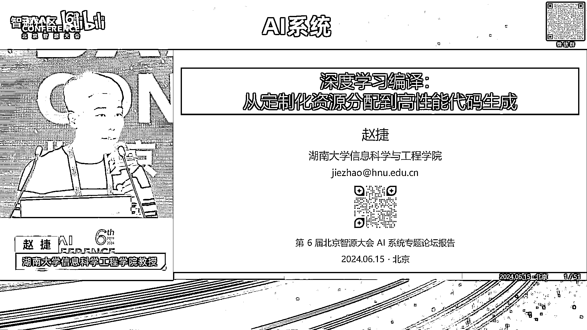

呃，然后这个是我汇报的主题的一些呃。

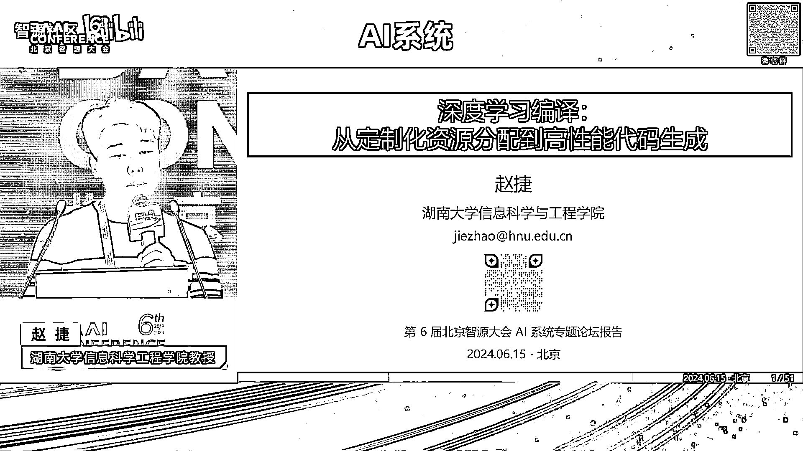

呃这个汇报的这个内容啊，先说一下我们这个为什么要做做这个呃，深度学习编译系统啊，当然这个可能在座的各位都可能会，比较了解了呃，就是说原来我们有这个深度学习框架的时候，他的这个工作模式呢是为了能够啊。

直接用底层呃，呃厂商提供的这种算子库来直接适配这个东西，然后适配完了之后呢，去呃这样去把他的这个框架，这个工作流程给完成，但是呢有一些呃，我们总会遇到一些之前我们没有去见过。

或者是没有实现的这样一些算子，那么这个时候呢，我们是希望用那个编译器去完成这个，自动生成的这样一个过程，所以深度学习编译器的这个呃，研发的背景是这么一个背景，然后嗯我们呢是可以面向不同的这种芯片。

包括像这种CPU，CPU以及嗯现在国内比较呃，就是投入比较多的，也是因为这种啊国际大环境的这个影响呃，投入比较多的这种AI领域特定的这种芯片，那么我们针对这种领域特定芯片呢，做了一些工作。

然后给大家汇报一下。

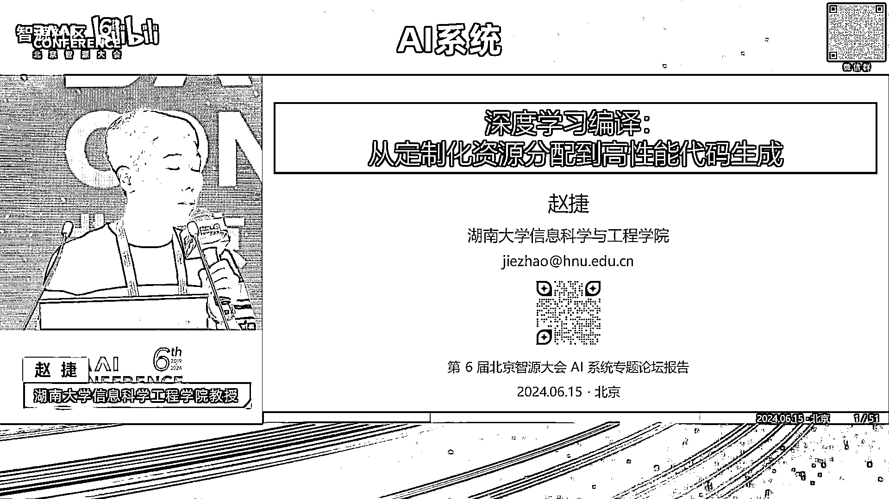

那么做这种领域特定芯片的时候，我们发现和传统的CPU和GPU，最大的区别是什么，最主要的区别就是我们在这种嗯，呃那个AI芯片上去做呃，code j或或者编译优化的时候，我们必须要考虑它的这个存储模型。

比如说像CPU和GPU上，我们传统的是这种嗯，比较典型的这种金字塔型的这种存储模型对吧，那么你数据在这个存储模型上肯定是直上直下。

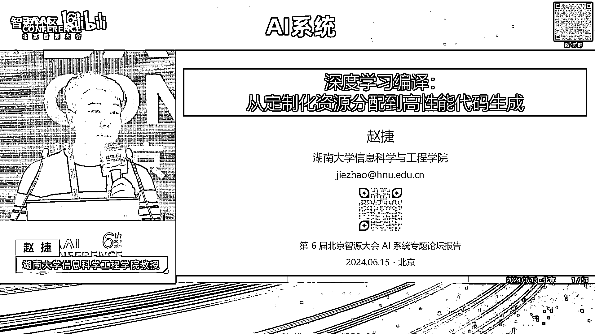

这么流动的，像GPU上也是这样的，比如说它通过抽象出来这个thread和thread。

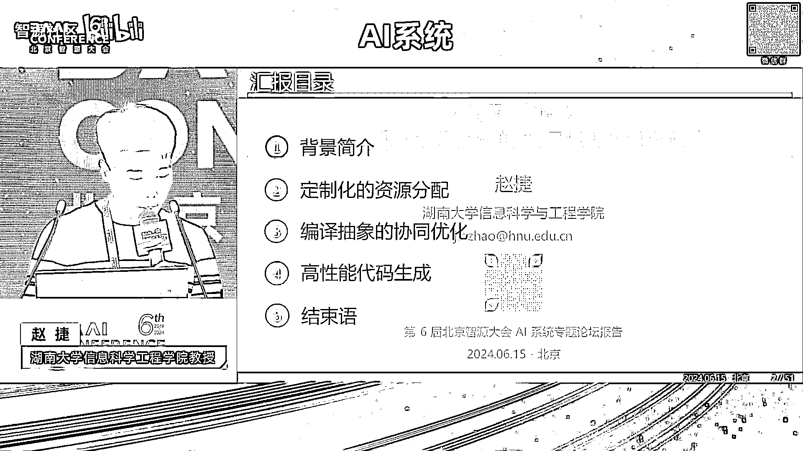

block的这样两集并行抽象，但是呢在AI芯片上它不是这样的，比如说我们比较早期的这种AI芯片是吧，像这个计算所这边提出的这种电脑系列芯片，你很多数据呢是输入和输出的时候，它的位置是不一样的。

它不像原来传统的这种，金字塔形的存储层次结构。

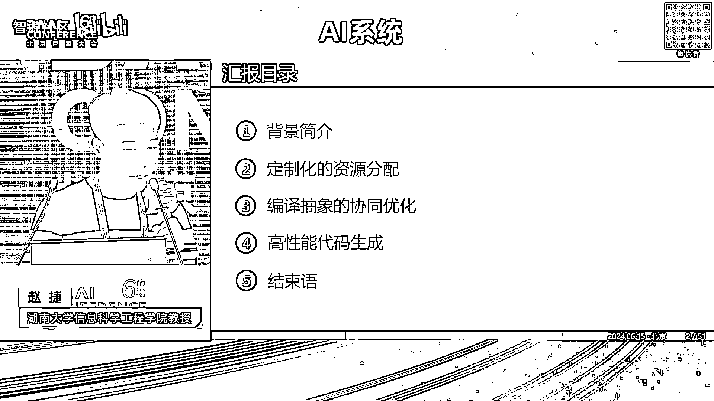

同样呢也有这个TPU的这个存储层次，结构也是不一样的，比如说你这个数据通，对这个呃里边最核心的功能部件矩阵乘呃，从这种呃这个weight的这个buffer去取数据之后。

他把数据放在这个accumulator上，然后呢，后边他可能会做一些其他的这种，激活函数的处理之后，再放回它这个呃所谓的这个ub buffer里面去，那么我们可能国内的一些厂商，比如像华为的升腾C呢。

也是采用了类似的这样一个，存储层次的这样一个设计，所以它这个上面的这个数据流的这个管理，是和传统的CPU和GPU的这种存储模型，是不太一样的，那么我们针对这些呢就去总结了一下。

现在这种深度学习编译的这样一个呃，形成的一个比比较固定的这个流程，也就是说，你给了一个这样一个深度学习的网络之后呢，我们会把它编译成呃，会把它表示成一个计算图的这个形式，然后呢通过这个计算图呢。

我们再把这个计算图去切成一个一个的小的，这个子图对吧，然后这个小的子图呢再转换成底层的这种呃，循环的这样一个表示，那么循环表示呢，我们会利用我们所呃称之为算子编译器的，这个东西呢去做一些优化。

然后在最后呢去呃适配底层硬件呃，做一些code站的这样一个工作，但是嗯包括刚才那个呃袁俊辉老师，他可是现在不在了，他他也提到这个东西呢，我们现现在做这个呃，软件站的这样一个设计的时候。

你做各种抽象的时候，每个抽象之间可以做自己的这个独立，优化空间的探索，他把这个抽象呃这样分割开开来，是为了能够把优化空间搜索范围变小一些，但实际上有的时候这种分割的这个形式呢。

会导致你呃优化的空间也会变小，所以我们实际上在这种，比如说在跨呃模型结构和计算图表示，以及图层和算子层编译的这种不同，编译抽象之间的协同，之间也有很多呃优化的机会。

那么这些跟这些抽象之间的这个优化机会呢，可能会给你带来一些呃额外的性能收益，比如说第一个我们说啊，呃就是我们说的这个所谓的定制化的资源分配，也就是考虑了一些呃上层上上层算法和呃，你怎么去呃。

在这个硬件芯片上做资源调度的这样一个结合，能够让你去更好的去得到一个呃，调对着这样一个结果啊，譬如说我们我们针对这种呃音音呃，就是国叫什么呃AI的这种领域特定的芯片，做了一个呃它的架构的这个抽象。

比如说我们可以总是呃一些芯片啊，就可以总是把它抽象成有呃，有有这么低格cluster，然后然后每个cluster上面有有四个cheap对吧，然后每个呃，每个chip上可以有不同的这个计算功能部件。

那么针对这种硬件去硬件抽象去做呃。

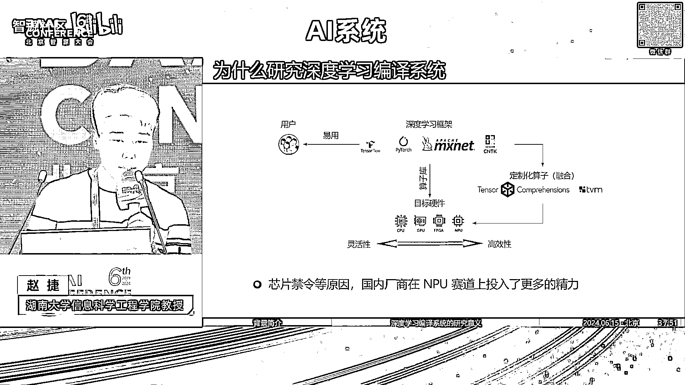

调度的之后，调度的时候呢，我们有的时候是可以考虑呃，是可以考虑你输入模型本身的这个特征，比如说呃我们原来传统的这种编译器里边啊，传统的这种AI编译器里边，它在做底层底层的这种调度的时候，他会看的非常细。

也就是说看到非常底层的这种，比如说卷积算子，或者是说后边的这种嗯编算子，它们之间的这种融合的可能性，但是实际上，如果你把你的这个视野放得更高一点，那么整个模型的结构呃，模型的架构上。

比如说在这个RESNET50上，它可以划分为四个阶段是吧，那么这四个阶段之间，其实因为这个网络模型本身的特征，它可能会对输入图像会做一些特殊的操作，比如说呃呃图像进来之后。

我们可能会做向下采样的这样一个操作对吧，那么这个向下采样的操作呢，会导致你整个呃输入图像，在穿过这个网络模型的过程当中，它占用呃内存的空间大小在不断变小，那么如果你采用传统的方式去不断的切割。

这个切割这个网络模型，比如说我们就从比较粗的力度来看，这网络模型，我把它切成四份对吧，那么你就是按照原来那个方式把这个图像呢，就因为它是端的端的嘛，你整个切成四份，按四个阶段来写，每每个阶段来处理的。

这个batch维度是一样的时候，那么由于你有中间这种向下采样的，这样一个操作，可能会导致你比如说像这个第二阶段，第三阶段他对呃，他处理的这个数据占用内存的空间会越来越小，那么这个时候呃。

像AI chip这种呃，就是片上缓存比较呃，珍贵资源比较珍贵的这种芯片来说呃，实际上它后边这个缓存利用率是越来越低的，那么这个时候实际上你可以把你输入图像，按照不同的by尺维度去切分。

那么这个时候按不同的by尺维度去切分的时候，你可以形成一个跟传统的这种平均切分的，这种方式不一样的调度方式，比如说你在第一个stage阶段，你可以只处理一个图像，也就是说按照一个batch维度去切对吧。

然后后边呢你可以按照两个batch维度，四个batch维度这样去切，这样的话就可以形成一个比如像这个图里边呃，按照这个图里边呃，图片上显示的那个数字的顺序，形成的这样一个非常规的这样一个调度。

那么这种调度过程呢，有一个比较好的优势是什么呢，它可以在保证你每个阶段处理这个图像的呃，过程当中，你AI芯片的这种片上的缓存，可以能够得到最大化的利用，这样的话就会导致呃。

你后边会有一个更好的一个性能提升。

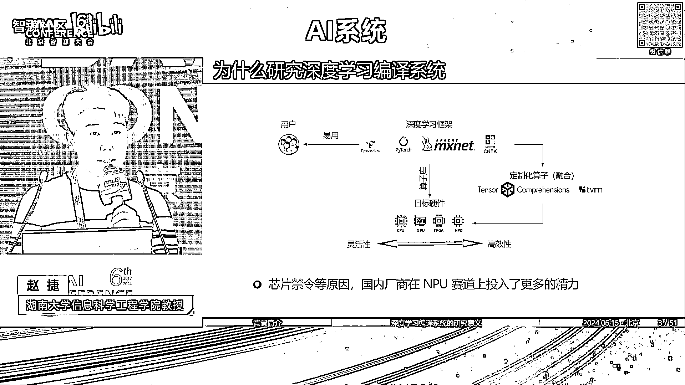

所以我们用利用这种方法，像在我们这个国产的这种新模计算的，这个芯片上去做了一个性能提呃，去做了一个实验，然后和传统的这种呃，就是平均切分的这种调度方法去相比较，还是有不错的性能提升的。

对这是第一部分关于定制化资源分配的事情。

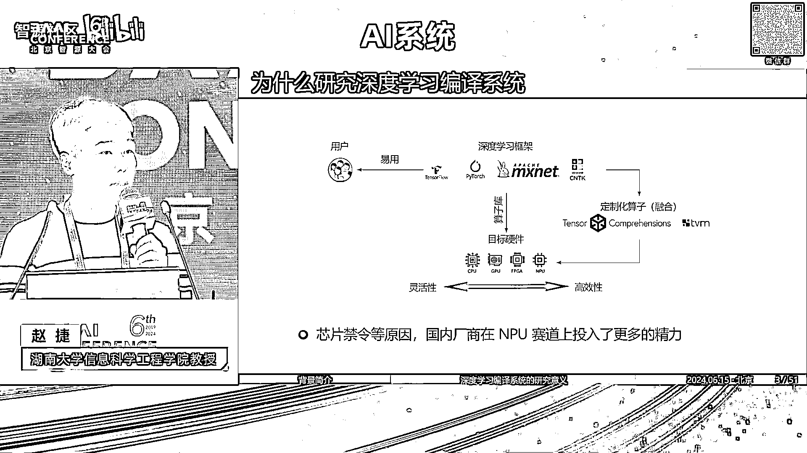

那么第二部分呢就是呃我们叫编译，抽象之间的这种协同优化，我们呃可能比较熟悉的是呃深度学习编译呢，它本身可以嗯，比较笼统的说是一个图层和算子层的这样一个，呃编译优化的两个阶段，那么图层图层上呢。

我们给定一个呃神经网络的这个计算图之后，我们就把这个计算图呢呃划分成几个子图对吧，然后划分完子图之后，再交交给下边的这个算子层编译器，做一些循环优化，然后通过循环优化呢去做后边的这个代码生成。

但其实这种方式呢有个问题是什么呢，就是我划分完这个子图之后，我完全不管下边算子层的这个编译，是否能够编译出来，或者是说我编译这个子图，是不是需要一个比较大的编译，开销的这样一个问题，所以针对这个问题呢。

其实我们做的一个尝试呢，就是说把算子层的编译器的一些约束，反馈给图层编译器，那么比如说给定这样一个计算图，计算图的时候，这个这个图呢，我们肯定就是会做一些常规的操作，做一些这个数据流啊。

控制流的这个优化。

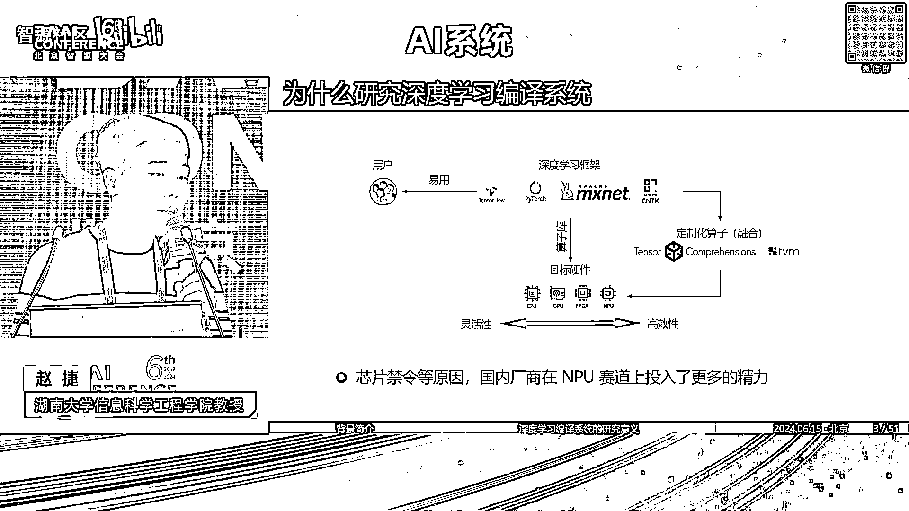

把图尽量简化一些，这是常常规操作，那么为什么我们会考虑一些把这个怎么去考虑，底层算子层的编译器，给图层算子层编译器的这样一个约束呢，比如说比如说我们这里。

这里边有一个比较常规的这种呃激活函数吧，这个激活函数呢呃它有两，实际上有两个操作构成的，首先第一个操作呢，至少啊至少有两个操作构成的，然后啊，第一个操作呢是它前边的这个呃求和取对数，这样一个操作。

那么后边呢是一个减法操作，那我我们知道因为这个芯片有限的，这个片上内存资源呢，我们有的时候就不是说有的时候啊，现在基本上形成了，就包括刚才这个白博士说的，这个形成了一个以tail抽象为基础的。

这样一个编译流程，你肯定是要做一个是呃是呃循环，或者是说数据的这种分块的这样一个操作，那么你做完这个操作呢，对于对于这个算子来说，你前边做做分块之后，因为前边的这个是一个求和取对数的。

这个这个这个操作是它本质上是一个规约操作，那么你做完分块之后，想把减法和前边的求和取对数操作，再把它合并起来，这种操作呢实际上是没有太大的意义的，因为你你肯定是要把前边所有的呃，就是规约的这个操作做完。

分块再合并之后，就是把他的这规约操作全规约完了之后，才能够去把后边的计算才开始执行，所以你分块完了之后，把减法的分块和求求和取对数的这个分块，想合并在一起是比较困难的，那么针对这个问题呢。

我们就把这个本身原来这是一个比较大的，我们称之为复合型的算子，把这种复合型算子呢我把它打开打开，就是说呃看更细粒度的这个图，针对这种更细粒度的这种算子呢，我们做了一些定义，按照这个定义呢，去把这个图呢。

从更小力度的层面上去做一些合并，形成一个以更小力度的算子为基础的，这样一个呃学呃，就是子图，然后把这个子图呢，嗯交给下边的这个算子层编译器去做，去做一些优化，那么做做这个事情的原因呢。

就是说我们算刚才我们说过嘛，就是把算子层的编辑器的约束，反馈给图层编译器，这也就是因为我把这个更小列的这个算子，形成的这个子图交给底层的算子层编译器之后。

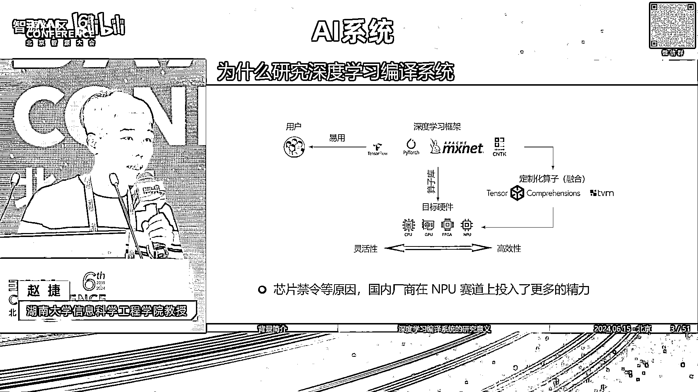

它是能够比较好的去做呃，循环变换呢这样一个事情，那么每个扇子层的呃，每个图层的这种更小粒子的，我们称之为原子算子或者原算子这样一个事情，它形成了一个完美的这样一个循环嵌套，也就是说循环之内就是循环。

嵌套之内只有最内层是一个语句，那么这样的呃，这样的算子交给算子层编译器的时候，他才能够更好的做一些啊，更方便更容易地做一些循环合并呢，循环分块这样一个事情，那么循环合并循环分块类似这样一个优化呢。

可能之前呃无论是做这个传统编译器啊，还是说现在嗯前段时呃，之前我们做这个AI编译器，它都会比较长的，比比比较经常涉及到这个事情，那么两种方案，第一种就是像TVM这种。

我写这种schedule primitives，然后还有一种方案呢，就是我们用这个polly feature的这个技术，能够把左边的这种呃两个两个循环呢。

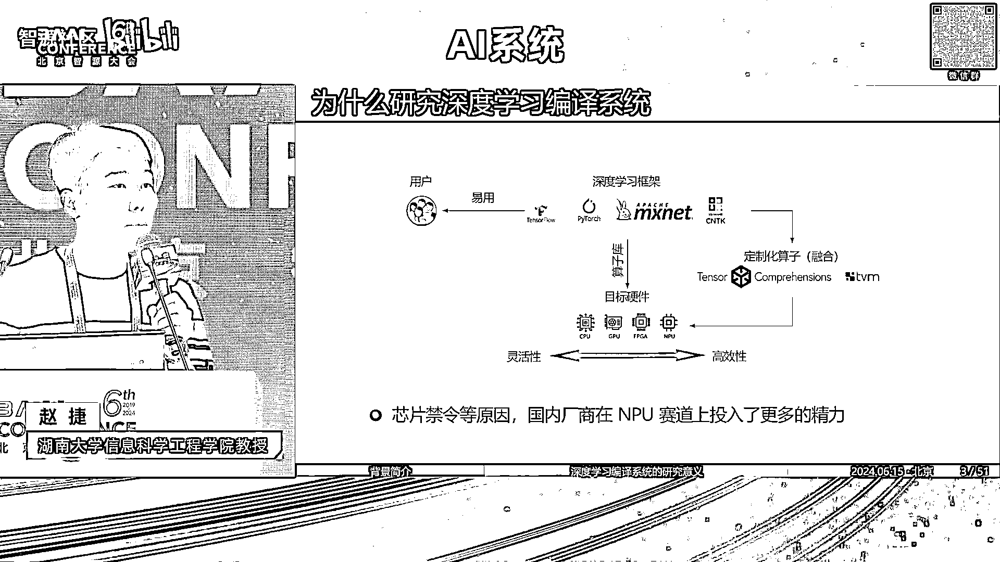

可以自动的呃合并成右边的这样一个形式，那么通过呃这样一个自动化的一个手段呢，还有前边呃图层更小，更细微的这种呃算子的这样一个融合的，这个pattern呢。

我们是能够把一些原来不能够融合的pattern呃，融合在一起，减少一些这个呃子图个数的生成，然后最后呃呃因为融合的这个能力呢，它能够减缓一些，减少一些这个数据移动的呃这个开销。

那么后再往下呢就是我们做这种算子层编译器，AKG这这个编译器，然后AKG编译器，它的这个整体流程我放在这呃，大概呢就是说我们最开始的时候，是基于这个TUM的这个0。6版本，去做的这样一个开发。

然后它会转成这个highlight i，再把highlight的RR呢，转转到我们这个POLITHO的这样一个，schedule tree的这样这样一个中间表示，那么schedule tree呢。

其实可能在MIR的这个设计里边，你也可以看到一些简化的SCHEDUTREE，这样一个表示，然后所有中间的优化，都是基于这个SCHEDUTREE的这种中间表示，去做的一个设计。

比如说我们刚才说到的这个循环分块循环合并，以及他可能会自己算一些呃调度方法啊，调度呃，调用一些底层的这个LP的这样一个过程，去能够呃自动的判定这个某些循环，某些循环维度是否能够做future。

是否能够做tell这样一些事情，那当然呢这个POLITICI里边他算的是，能不能能能不能做这些事情呃，到底哪一个tell size dota比较好，然后fusion个数到底是应该什么样的。

还有包括刚才我们说的这个呃，嗯loop arro的这样一个因子到底多大。

这个可能还是需要做一些auto tune的这个事情，那么AKG的这个具体流程呢。

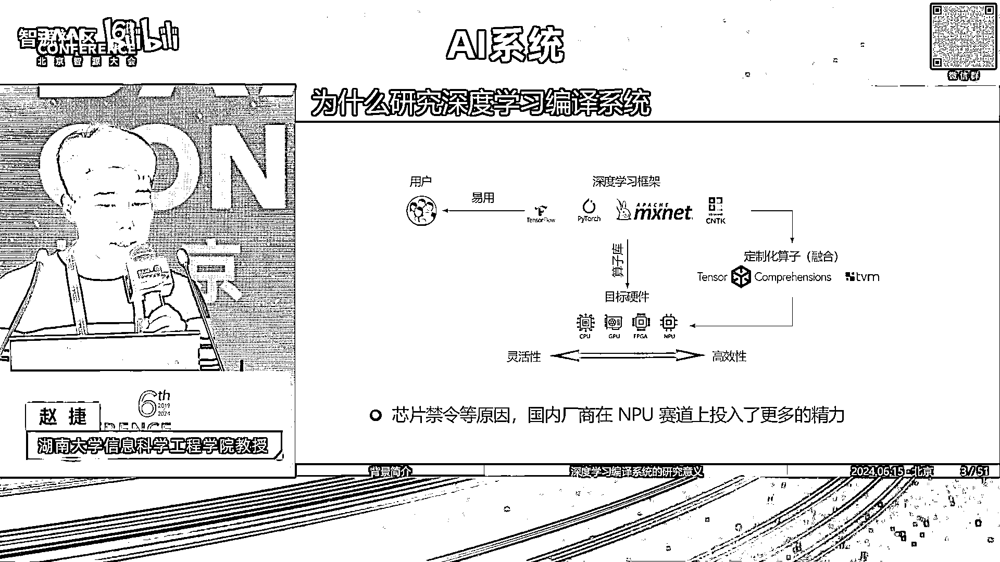

我们在这里不展开介绍了，因为它中间它会涉及到一些。

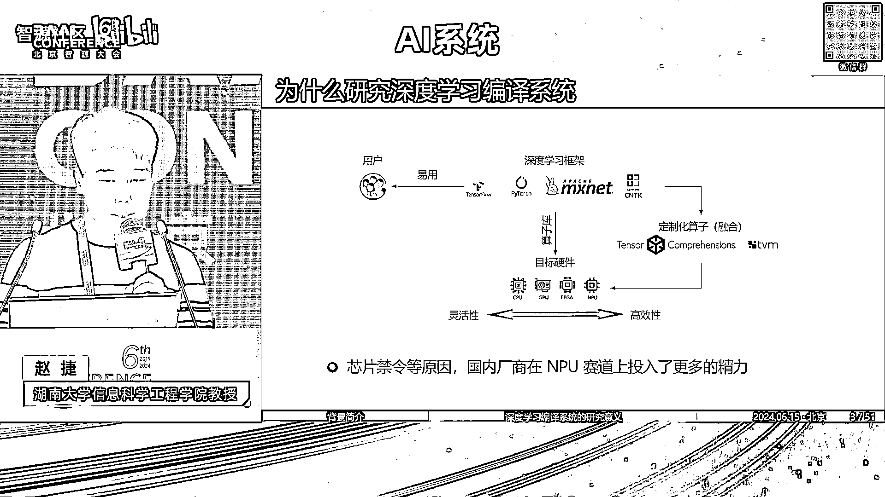

就是说白了就是呃有一些数学运算的，这样一个方式呃，根本原呃就是在底层上的话，其实就可能算一些这样一个数学表达式，去做一些呃fusion台铃的这样一个适配，然后我们是针对当时呃AK呃。

就是升腾的910这个芯片，去做的这样一个code站，它里边会有一些定制化的这个优化，然后嗯会做最终的这个代码生成对呃。

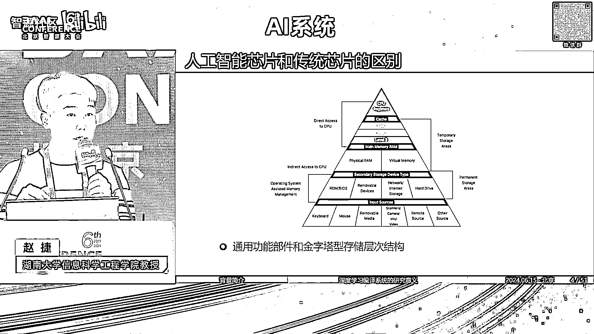

这个最后我们也有一些结，结合着这个华为的这个pls boy做了一些测试啊，但这个测试结果可能都比较早了，因为现在曼斯sport本身的这个模型库。

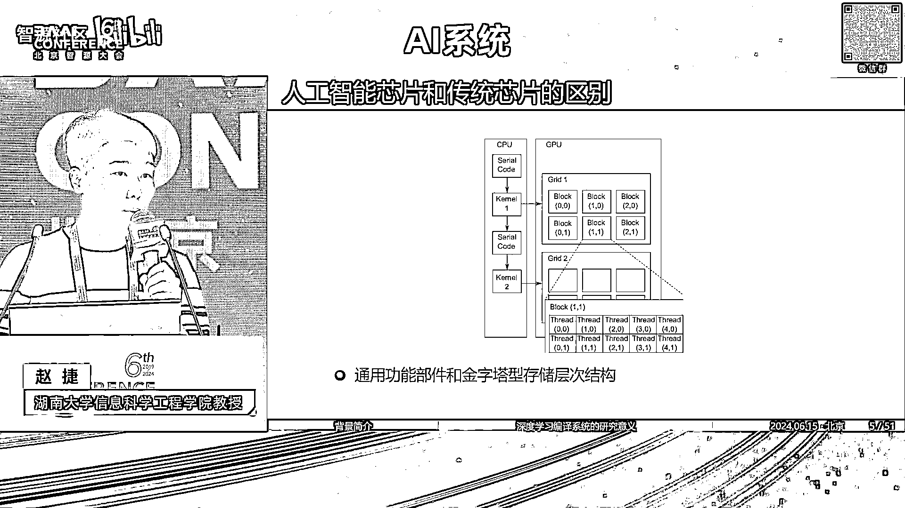

可能也比这个要多得多。

然后第三部分呢就是我简单过一下吧，就是我们针对特定的这种算子呢，会做一些领域定制化的这种高性能的代码生成，因为你要生成比较高性能代码的话，最终还是要靠一些呃，离不开手工的这样一个实现。

那么我们针对比如说像在GPU上，我们做这种规约算子的开发的时候，前端我们是会把一些深度神经网络里边的，这种呃算子归约算子呢去做一个归类，那么这种方式呢是允许你能够呃，把你的关注点集中在三种不同的类型上。

那么怎么把归约算子转换成这三种标准型呢，我们是呃给了这样一个就是转换公式啊，就把转换这样一个公式，可以把任意的这种规约算子呢。

转换成这样一个形式，那么你转换完了之后，我们可以把无论是呃规约的这种并行轴啊，还是这种规约轴都可以映射到，比如说GPU的两极呃，并行抽象上通过并行抽象之后，实际上呃最重要的是你那个规约轴做了并行。

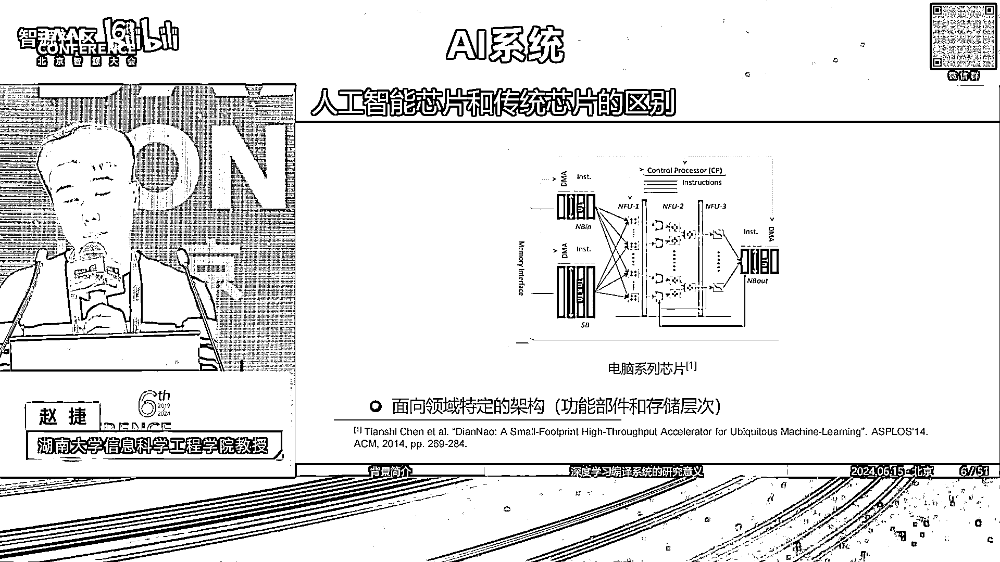

规约折，做完并行之后，我们在最内层去调用一些手工的这种呃，高性能的这种算算子库，这种算子库呢是呃华为的工程师自己写的，那么他可以写一个固定shape的这样一个形式，那么通过编译器呢。

你是可以通过硬件绑定，还有编呃优化的这样一个方式呢，把任意规模呢去映射到这样一个库上面，在最内层呢是通过利用这个硬件本身提供的，这种原子算子，去保证规约算子的这种运行的啊正确性，那么还有一种呢。

就是说我们面向这种，像比如说像是呃神威平台上的这种呃，矩阵城的高性能的这这种自动代码生成，那么针对呃神威平台的话，可能就是它本身呢和传统的平台的这种架构呢，不太一样。

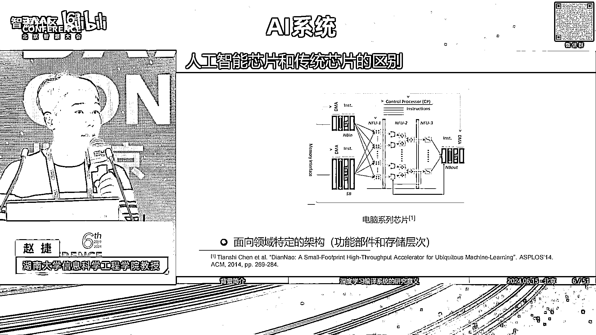

是由一个组合和呃多个这个重合阵列构成的，那么它上边呢从合之间有一些通信方式，然后组合同从合之间呢也会通过一些DDR啊，去传输一些数据，那么这个时候呢你要是你是要用编译器去考虑。

你自己本身就是硬件本身的这种呃消息传递，消息传递方式的这种呃模型啊，然后通过这种方式呢，我们去也是在编译器里面自动生成，然后最内最内层呢也是一个呃呃呃，沈威的这个平台提供的这种呃。

汇编的这种micro kono，那么同样跟刚才那个工作原理是一样的，就是我们编译器要做的事情呢，就是把任意规模的这种矩阵乘呃，去映射到你这种呃固定shift的64乘，64×32的这样一个呃。

汇编的这样一个小库库的这个过程上，然后这种效果呢还是很不错的，比如说可以达到这个神威平台峰值性，理论峰值性能的90。14%，甚至是呃他们提供了一些这种手工库，可以达到这种手工库的性能提升。

大概有将近10%左右。

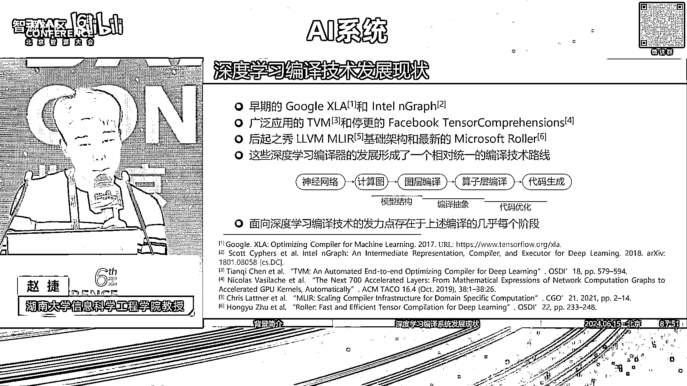

这个手工库是已经经过了非常好的优化，但当然编译器可以支撑的。

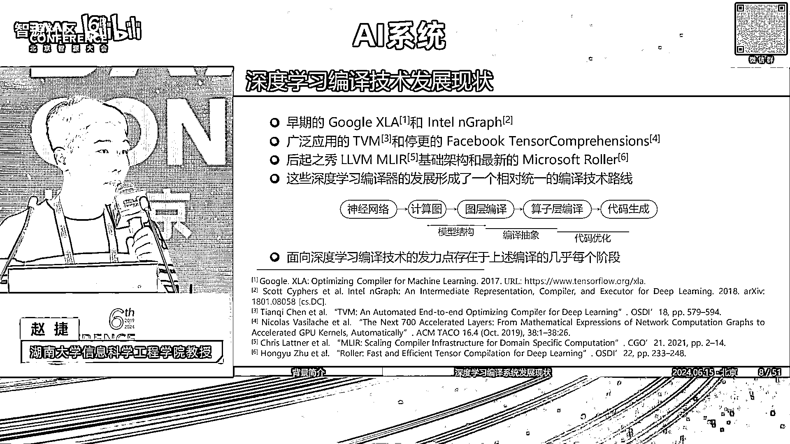

就是说刚才我们说可以有一些定制化算子的，这个呃生成。

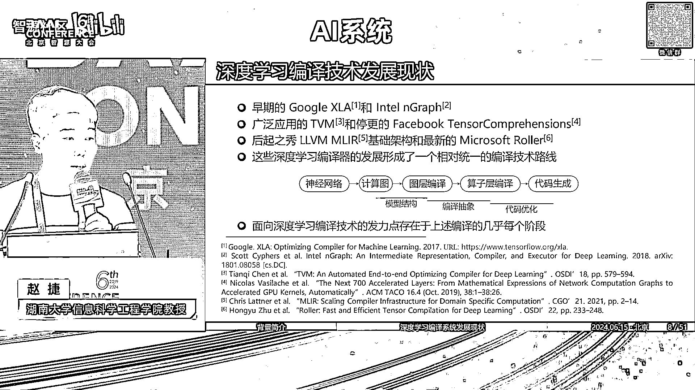

比如说它可以做可以做前向融合，也可以做互相融合，那么这个时候呢无论是前向融合还是后相融合，都相对于手工库有更好的这样一个性能提升。

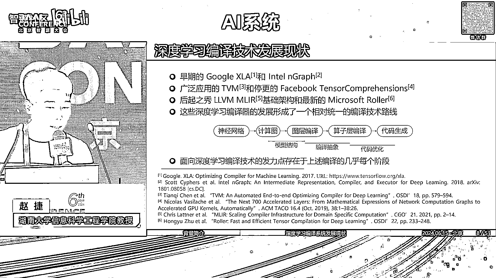

好了，以上就是我这个做深度学习编译的一些经验。

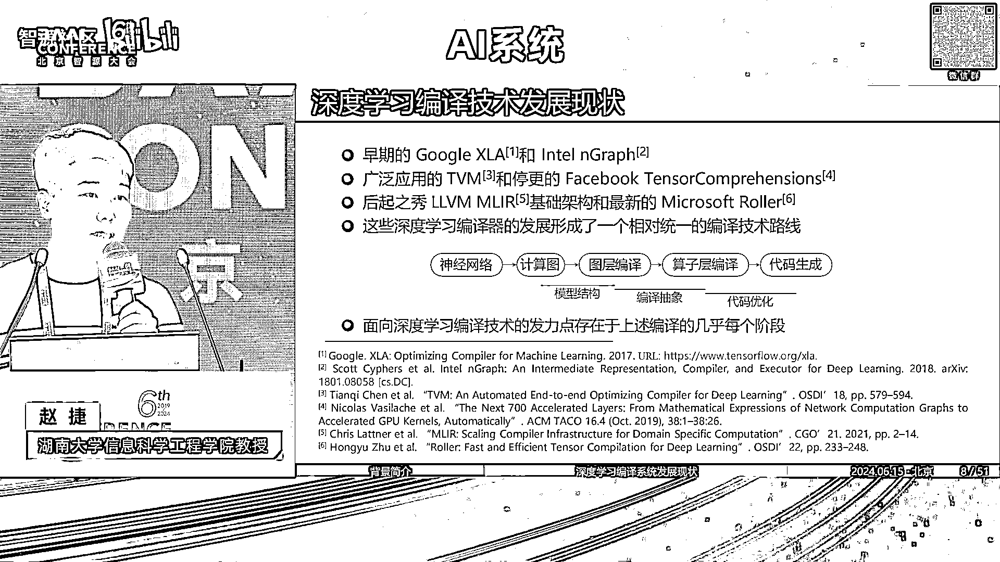

然后谢谢大家好。