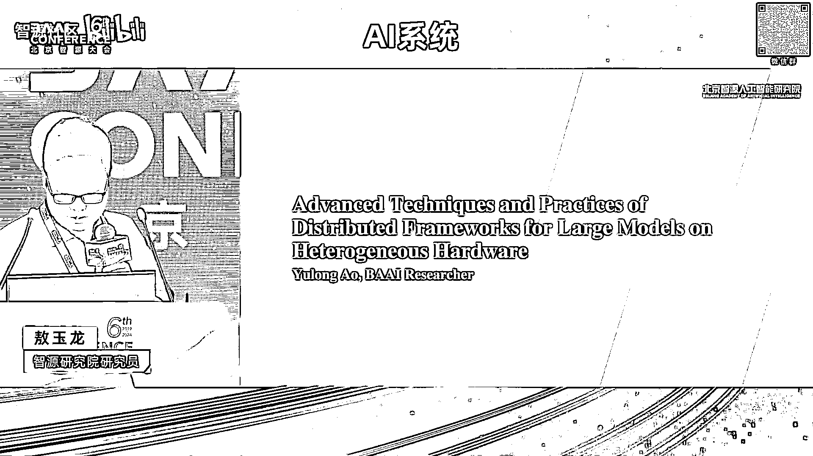
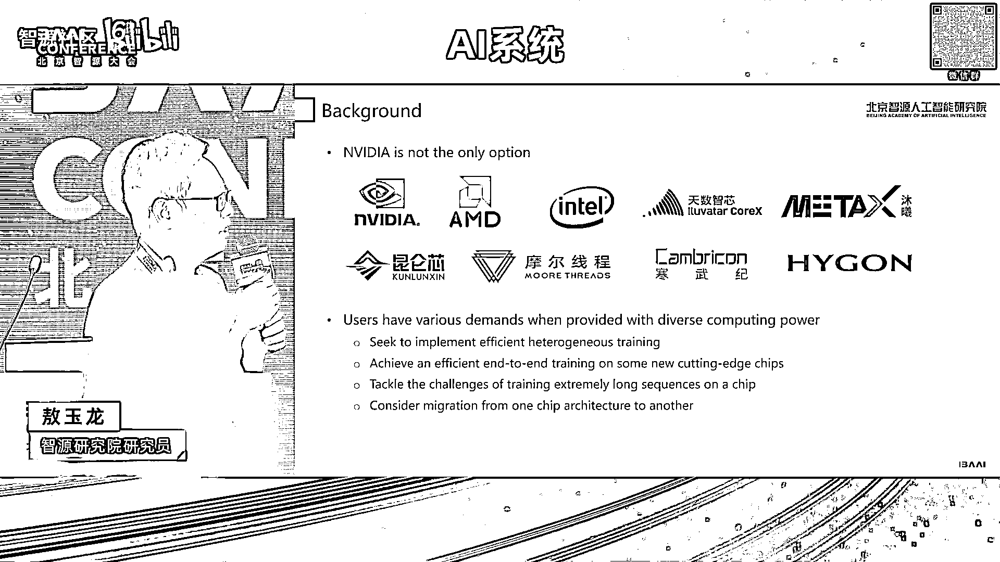

# 2024北京智源大会-AI系统 - P6：多元算力下大模型并行训练框架技术与实践-敖玉龙 - 智源社区 - BV1DS411w7EG

Hello，呃，大家上午好，非常高兴跟大家分享呃，在多元算力这个时代，智源在过去语言嗯所进行的一些技术探索和呃，应用实实践。

首先嗯想跟大家分享一个事实，其实前面的老师也讲过，就说不管大家是否承认，我们呃，其实已经身处在一个多元算力的这样一个时代，当我们的使用者面对多元算的情况下，呃，不自然的都会有各种各样的需求。

比如说诶我能不能在两款不同的芯片上，做一个高效的易购混合训练，呃，比如说诶我能不能在一款新的芯片上，实现一个端到端的一个，非常高效的这样一个训练，呃，同时就说呃算法同学可能就说。

我不管在什么样一个芯片上，你你你能不能支持任意长度的这个这样一个，任意长的一个序列长度呃，当然说更多场景，因为因为业务或者一些政策，我们不得不从一款芯片迁移到另一款芯片。

那智源作为一个模型的训练者和系统的研究者，我们呃会面临的，我们同样会面临这些呃需求，甚至说挑战，那今天呢，我主要也是从这四个场景来跟大家做一个呃，分享，让大家看看智源在这一块呃，跟我们的合作伙伴。

甚至说硬件厂商是怎么去解决这些问题的，呃，首先第一个场景呢，就是怎么实现一个高效的一个混合训练，呃一提到异构混合训练，大家首先可能想到的就是挑战，嗯的确挑战是非常多的，呃我这块话列了呃，呃分了类列。

从四个方面跟大家做一个呃分享，首先第一个挑战就是说两个不同的芯片，或者多个不同芯片做一个核池，那性能大家想一想，很自然就觉得会被最差的那个所拖累，这是因为我们不同的芯片，它的算力他能力是不一样的。

另一方面，大家的不同芯片的优化的水平也是不一样的，呃第二个挑战其实就是通信，因为嗯两款不同芯片之间，它的连接的拓扑以及连接的方式，大家往往是不一样的，呃因为呃商业的原因原因的话。

很多芯片是彼此根本不知道对方呃的呃，了解的信息是非常少的，呃第三个挑战就是说呃，呃多多芯片下的这样一个任务调度，因为传现在的大多数调度系统的话，其实还是同构芯片。

那用户呢需要自己去来自己做一个很好的配比，来使用这样一个易购的一个芯片集群，呃，最后一个挑战其实是呃，呃最终大家最关心的可能或多或少，对这个异构芯片下训练的模型效果呃，有没有保证，还存质疑呃。

这个原因很简单，因为不同的芯片它内在的架构就存在着差异，然后算子的实现，其实有个同一个算子有不同的实现呃，那怎么解决呃，经过一年多跟我们的合作伙伴，以及硬件厂商的协作，呃，今天还是非常自信的跟大家说。

通过系统化的思考以及去设计以及去实现，我们还是能实现这样一个，高效的易购混合训练呃，首先呃我们逐一的看看前面的几个挑战，例如第一个挑战就是说诶，那我们的性能会被最慢的那个拖累，那怎么解决呢。

其实我们需要从框架层面上，做一个更细粒度的任务，呃，负载的一个划分，让每个芯片能够充分发挥自己的潜能，OK就是说芯片它要物尽其用吧，呃不要被最慢的那个去拖累，那第二个呃挑战就是说呃通信，那怎么办呢。

其实我们在并行策略层面上，我们可以要求我们只进行节点之间的通信，那节点之间的通信呢，我们其实大家都是IB和rocky，这种嗯非常标准的这样一个协议，OK这块其实也是可以解决的。

当然这也依赖于厂商的一个呃支持和兼容，嗯第三个就是说挑战，就是说关于多芯片这样一个任务调度的问题，其实这块的话我觉得是一个呃模式的一个转变，就是说我们需要从呃以芯片为中心的这样一个，调度策略。

逐渐迁移到以算力透明这样一个呃调度，就是我觉得在未来的话就是大家作为调度用户，其实他不关心最好是不关心我要用什么芯片，我只是按算力付费而已，K我们这样话，会对我们的系统的利用率有一个极大的提升。

那第四个呃挑战就是说呃模型的效果，呃这块的话其实我个人的一个观点就是说，如果两块两款芯片做一个合池训练呃，效果呃无法达到同构的预期，不管是loss还是最终效果，我觉得可能其中有一有一款芯片是有问题的。

那最好的解决方案就去修这个问题，K甚至说，我觉得易购训练是检验芯片的一个不错的手段，对K那左右边的那个图的话，其实是一个大概的一个呃解决方案图了，就是说我们其实神经网络有它的特性，它有很多层。

当我们训练单一任务时候，我们会根据算力和内存的啊，这个约束去做一个切分，让每一款芯片去算自己的那一部分的子任务，那在最下面的层面上呃，我们跨集群的通讯主要存在呃，如节点之间OK大概是这样一个思路。

那通过这个系统化化的思考和设计，以及实现的话，我们是能够解决这样一个异构训练的问题，呃，但下一步就是说怎么去把这个性能做一个呃，更大的一个提升，就是说真正实现异构高效的训练。

呃其实这块的话我们一直跟天数智星呃，做深度的合作，在易购并行策略下已经呃，到现在已经经经过了三版的迭代，从最开始的时候，我们实现的是一个ego的数据并行，呃这个其实也比较直观，就是说呃我按照芯片的能力。

我没呃新能力大的，我呃我处理的数据多，能力少的，我处理的数据少，但这个策略的话也有一些问题，首先它依赖于呃，首先数据层面上这样一个负载切分，它是一个粗粒度的，很难做到一个非常精细的控制。

第二个就是说它需要不同芯片之间做or reduce，那做个通信的就比较呃了解，就是说不跨芯片的ORRODUCE尤其高效，ORORRODUCE还是非常之困难的，那我们就在这基础上又呃引进到第二代。

就是说我们通过发现就是说大模型时代，尤其AI这个方向，深度学习有很多的operator和层，那么我们就按照算力去呃进行层的一个切分，然后算力大的我就处理的层数会多，算力小的我处理层数会少一些。

那呃这也有两个好处，首先就是说这个呃，任呃切分的这个力度会更细一些呃，第二个好处就是说哎哎我现在只需要哦，p to p的通信，那这个难度就是尤其是跨节点的p to p通信，这个难度一下子就降下来了。

因为我们现在训大模型，基本上是用混合并行的策略，所以说尤其流水线，现在的巴博率已经通过各种手段降得比较低了，那呃但是这也有一个问题，大家可以看到，就是说呃，我们不同的芯片之间的这样一个呃模型并行的。

这个维度，其实大家要求一致的，这带来问题，就说一方面就是说要求这个异构混讯的，这样一个芯片的配比，大家还是要符合一些约束的，第二个就是说它还是呃没有进一步释放，这样一个灵活性以及优化的空间。

那我们现在演进到第三代，第三代的话就是说诶我们不要求这个模型并行，这个维度大家是一致的，我只既可以由多变少，也可以由少变多，那这样的话，我们进一步的相当于释放这样一个调优的空间。

呃第一个可能是大家比较关心的性能问题，就是说呃呃我们是在不同规模不同的呃，配比有不同代际之间的，也有跨架构之间的，就后面三个是呃三条线的话，就是呃有两个是跟天数跟A800，有一个是木希是跟A800。

就是说整体上我们通过这样一个性能的一个，统计和分析发现，就是说我们还是异构混讯，是呃能达到一个很高的水平，尤其是呃跨架构的这样一个训练也是很不错的，大家可以看到其中还有一些超过百分之百的，这样一个性能。

这是因为我们把两个小集群，合成一个大集群之后哦，我们还是解锁了一些优化空间啊，比如说因为我们有更好的并行策略了，这样的话我们可以使用更大的bio micro呃，By size。

也也可以去关掉一些重计算嗯，然后最后呢，就是说最近我们呃做这样一个更灵活的，这样一个TP易购这个呃策略呃，其实我们可以在这个基础上进一步能提升，大概30%左右，模型效果当然也这个是最重要的一个事情。

就我们还是在呃从加载相同的checkpoint，持续训练了一段时间呃，在真实的数据集，也是我们flag evo这个平台上做了一些评测，呃，目前看的话就是说其实地府还是非常之小的。

呃那当然说我们也没法去完全规避这个呃差异，因为是首先我们的拆矿业呢，是从重构重构拿过来的，但是我们要在异构上去训呃，第二个就是说呃由由于不同的芯片，它能力不同，我们涉及到呃参数以及优化器状态一个重切分。

导致那个随机种子，其实我以及随机状态我们很难保持一致K呃，但总总体来说结果还是不错的，第二个就是说呃，怎么在一款芯片上实现一个高效的端到端训练，从我们实际的一个，尤其在一个呃项目周期比较紧急的情况下。

从我们实际的经验来说，还是从呃算法层到框架层到硬件，从一个协同设计是比较高效的，呃首先从算法层面上，我们呃的语言团队给我们提供了一个，两阶段的这样一个训练方式。

我们从一个已有的DOS的7B开始进行skill up，扩展到哦16B这样一个呃规模邓46B，然后训练一段时间之后，我们进一步的扩展成为呃，816B这样一个千亿的这样一个，MOE模型。

然后相比如从通讯来说，我们实现了一个四倍这样一个呃处理的速度呃，从框架层面上，其实大家做过真实训练的都知道，往往训练会持续以呃呃一到两个月，甚至说更长，那在这个过程中，稳定性是也需要解决的问题。

在这块的话，我们跟慕希的团队一起去合作，首先在提供了一个呃node level的一个呃容错，以及异步的一个拆幻境的保存，那node level的这样一个容错，相比于是传统来说呃。

大家会呃当一个节点坏了之后，我们会把整个任务Q掉，然后去重新relaunch这个job，那对于呃node live来说，我们只需要去替换那个节点，然后in place的做一个training的一个重启。

这个会加速整个这样一个启动的呃时间，OK然后异步呢也是比较简单，在以往的同步的这样一个场景下，我们是也会有一个呃worker进程的话，它去把GPU的呃搬到CPU最后去落盘，那异步的话其实我们有两个进程。

同时有一个agent，特这样一个进程，在后台的话持续的做一个异步的缓存呃，通过这种方式的话，其实我们来落盘上，能够实现300倍的最左右的加速，然后漏的会实现一个三倍的这样一个性能提升。

当然说最后还是这样一个呃，性能也是很关键的，这块话是呃，木希的话给我们提供了一个千卡这样一个呃，其实是128卡，这样1280卡这样一个集群高效集群，那呃由于木希它的产品是一个。

跟KDA比较兼容的这样一个产品，所以说呃我们在flag skill这个框架，适配这一块的话，其实还是非常快速的呃，呃再结合木希这样一个深度的帮忙，优化的情况下，我们实际最后实现一个很好的一个呃。

性能的提升，这是一些呃比较呃，个人觉得还是比较有前景的这样一个呃结果，首先training north我们可以看到两阶段，上面的是7B的人，后面是16b dos16B，最后一个是MOE16B。

当然我们现在过的token比较少，但整体的train loss的话是按照呃，是非常符合预期的，呃当然说因为智源的话有不同的算力嘛，我们同样也是在呃在木西的集群和在呃。

英伟达的集群上做了一个skin的这样一个对比，然后呃可以看到就说呃，这里面配置是完全一样的，框架也是一样的，可以看到木希其实基本上能维持在，90%以上这样一个扩展效率，那我们的NV的集群的话。

其实反而不如木希呃，这说明什么呃，这给我们一个呃很重要的一个警示，就是说在大模型时代，尤其我们下一步要呃，实现万卡甚至10万卡这样训练，那单芯片的性能至关重要，但实际上下一个更要解决的问题。

就是说怎么能够实现高效的互联，就是我们最后一个talk，好像就是讲这个主题的OK呃，呃，第三个场景就是说呃常常sequence这样一个训练，这个就是说白了我们在实际的业务过程中。

算法团队它其实它不care你是在哪个芯片上训它，指向你给他一个确定的答复，你能不能给我实现任意长度，这样一个序列的这样训练呃，尤其是在多模态这个呃场景下，我们可以发现相比于语言模型。

一般有千倍的这样一个序列长度，需求甚至说更长，因为我们跟呃算法团队聊聊聊过，就是说这个越长越好，反正视频的话他这个token数会很大的，那当然长序列情况下，带来一个极大的这样一个，内存的这样一个需求呃。

呃我们可以看到主要上面这个传送门结构呃，其实有两个方面，一个是sequence的平方这样一个复杂度，另一个其实就是S乘以H，这个复杂度很很早的情况下，我们一般是关注平方，但是随着呃长序列这个场景下。

我们觉得就是线性这个复杂度，也需要我们去解决的，呃这块有个具体的例子，就是说如果我们一个tensor，如果呃by size等于一的情况下，我们在256K的情况下呃，就BF16了。

就大概需要这么大的一个存储空间，远远超过一个单芯片，那即使在线性的这个配比情况下，我们如果hen size是1024的话，也是需要一个很大的一个呃内存需求，那怎么解决，其实现在系统这个领域的话。

已经有不错的一个解决方案了，我们只需要把它给结合起来进行一个呃，呃使用呃，第一个就是flash attention，它的话就是说解决attention这个S平方，这个复杂度，通过分块能把这个复杂度呃。

就内存的复杂度呃，约束在块这个level o k，那但是这还是不够的，因为我们的经验告诉我们，它只能达到百K这个量级，但是我们往往还需要兆以上这个sex的长度。

那下一个就是可以采用像real tention，它会把呃后面的那个FI分层，进一步做一个分块化，同时会利用分布式的技术，就是说我们每一个设备只需要呃处理一个呃，呃KV呃。

q query以及key和value这样一个块，然后在是呃过程中我们通过通讯来做，下面看红色那个圈，就是呃就是一个rain的这样环，就是我当前呃设备计算过程中。

我会从上一个设备去拿到我需要的key和value，同时我把我自己的K和value传到下一个设备，形成一个环，然后在这个计算过程中，可以进行一个计算通信的一个呃隐藏呃，这是一个初步的一个呃性能结果。

就跟大家分享一下，就是说左图是一个我们在呃相同的token数，然后不断的去做一个4K到一兆，这样一个sequence ence，ENCE的这样一个呃实践实验呃，那个橘红色的是呃倍数。

就sequence成长倍数，我们可以发现就是说时间的确在增长，但是它也不是按照sequence这个倍数去增增加的，当然这里面还有呃原因还是比较复杂的，呃，主要是其实我们每一个长度，其实并行策略也不一定。

和优化策略不并不是一样的，因为我们是经过专家去调优过的，然后呃最后一个是一个右边那个是一个breakdown，就是说呃其实分为计算仿存以及数据的加载呃，通计算通信和数据的加载。

我们可以看到其实大头还是在呃计算这块，这说明就是说通过分布式这样一个计算和呃，通信的重叠，我们呃是能够把通信做一个很好的隐藏，最后一个场景就是说呃，就说怎么做到从一个算呃。

从一个当前我们业务在的一个芯片，迁移到一个新的芯片上，呃左图是一个传统大家一个做法，就是说我当迁移到一款芯片，我需要考虑框架平台呃，但这往往带来一个开发和学习成本，然后从一块芯片到另一个芯片。

我们大家知道这需不管是并行还是优化，都需要专家这样一个经验，那我们智源想提供的一个解决方案，就是于呃，就右图所展示的就是说，首先在平台和框架这个层面上，我们希望就是能够呃支持多种芯片，这样的话。

用户不再需要任何的一个学习和迁移的代码，迁移的成本，那在最下面的话，我们从一款芯片迁移到另一款芯片，通过这样一个自动调优的工具来帮助用户呃，自动的去选择一个高效的呃并行和优化策略。

呃这是我们整个ta呃的一个呃架构图，也快速跟大家做一个分享，首先就是说我们用户测去提供了模型的信息，然后平台提供的呃cluster的信息，然后我们会构建一个搜索空间，然后基于这个搜索空间。

我们会联合的呃进行一些减值优化，然后呃优先的选择一个比较最好的一个，候选的一个候选集，然后从中挑一个进行一个生成可执行的配置，然后做呃送入到这个SMAESTIMATOR这块的话。

其实也是我们跟厂商合作的一个点，一方面我们可以实际的profiling，另一方面就是由厂商提供他们硬件的一些参数，以及他们的cost model供给我们去调用，然后最后去呃去做这样一个呃。

性能结果的评估会出，会通过recorder这个模块去存存下来，同时的话呃大家可以看下这里面有个online feedback，就是我们整个中间这个颜色，其实其实是一个loop。

就是说我们实时的通过历史的信息做一个减脂，最后会快速选择这样最优的这样一个呃，候选去执行呃，这是我们九鼎平台实际上线的一个案例，就是说大家可以看到呃，随着时间的呃增长，我们的这个性能会逐步的做一个提升。

OK呃关于tuning这块，我们有一些结果也可以跟大家做一个分享，就是我们在A800，然后呃木西呃天数的BI呃，呃150以及木希的C500上做做了一个实验，那我们可以发现就是说基本上都可以呃。

取得一个比较好的，不管是在不同的模型size和硬件上，都能取到一个好的加速比，呃，当然这里面7B是因为那个呃，我们那个专家优化太好了，所以说呃呃提升空间稍微差一点，呃，最大的话。

其实我们可以达到23%的这样一个，性能提升，这里面的配置都是我们跟厂商，包括我们自己呃专家经验所选出，我们认为最好的去做对比的，所以说在这个基础上，我们还有这么大的提升嗯。

那通过我们的前面所讲到的一些减值的算法，比如说呃基于历史的，基于memory model的，其实我们能把这个搜索空间，压缩到84%以上，这个就是说在实际上线的过程中，对用户的体验也是非常好的。

最后放在一起呃，呃就是说呃，我们还是想非常隆重的向大家介绍一下，就是我们智源这个开源的框架叫flag skill呃，呃经过一年多跟合作伙伴及厂商的协作，我们最近是有一个新的价格升升级。

核心来说其实就是呃两两方面，首先分为前端跟后端，前端的话，我们希望给用户提供一个统一的接口呃，提供类似于tuning，然后自动的预估以及自动的容错这种功能，而后端的话我们希望可选择的多个执行器。

包括我们支持呃，大家比较熟悉的开源的像max tro m v m，以及我们自研的flag skill call，同时我们也可以对多款底层的多个算子库，进行一个选择的使用。

包括我们智源资源的flag germs，最近也做了一个联挑打通，像flash tender，flash attention等一等，包括厂商提供的呃一些引擎，那通过这种方式的话，我们能够呃做一个解耦。

在前端的话，其实我们是呃实验管理啊，配置管理基于arm的是非常方便的，那也能跟平台做一个平台的workflow做很好集成，前面那个九鼎的例子就是一个很好的体现，同时会提供用户一些自动化工具，OK呃。

那对于后端的话，首先是我们是百分之百兼容，就是我们已有的这些开源库，因为呃用户的迁移其实还是很大的代价的，呃再一个就是我们会增加像异构混讯呀，包括ti啊这些我们自自定义的一些组件。

然后的话就是说实现这个无缝的芯片迁移，呃，目前的话就是flag skill已经实现了，就是呃来自八个厂商的一个适配，然后呃在支援内外已经实现了十家这样一个呃，完整的这样一个预训练啊。

那新呃我们最近也会发做一个发版，然后在这个发版中，我们会把上面所有的功能给大家做一个开源，同时的话也会增强我们的CI，CD这样一个能力呃，最后是一个总结和展望呃，第一个就是说呃。

我觉得多元多元算力已经成为一个趋势，那呃如何呃，其实这也给我们系统这个领域带来更多的机会，K呃，然后ego训练包括在一款呃，新的芯片上进行一个端导的训练哦，我觉得通过系统的方式。

以及能够非常的呃落地和实用了呃，自动化它不仅仅能带来用户的一个实验提升，它也是多元算力，这个时代上一个关键的一个因素，K呃，未来工作化，一方面我们会构建一个统一的这样一个通信库。

会实现一个端到端的这样一个异构训练呃，第二个就是说我们会在呃，持续在长序列以及MOE这种呃架构下，去做更多的并行策略以及优化的一个呃创新呃，最后也是希望跟我们的合作伙伴厂商，包括新嗯，约新的呃，呃。

社区朋友，一起构建一个更广泛的flag skill社区，OK谢谢好。

