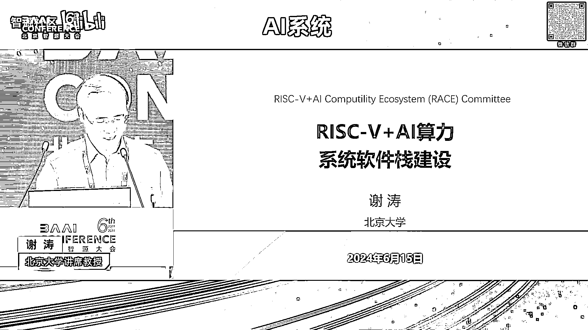
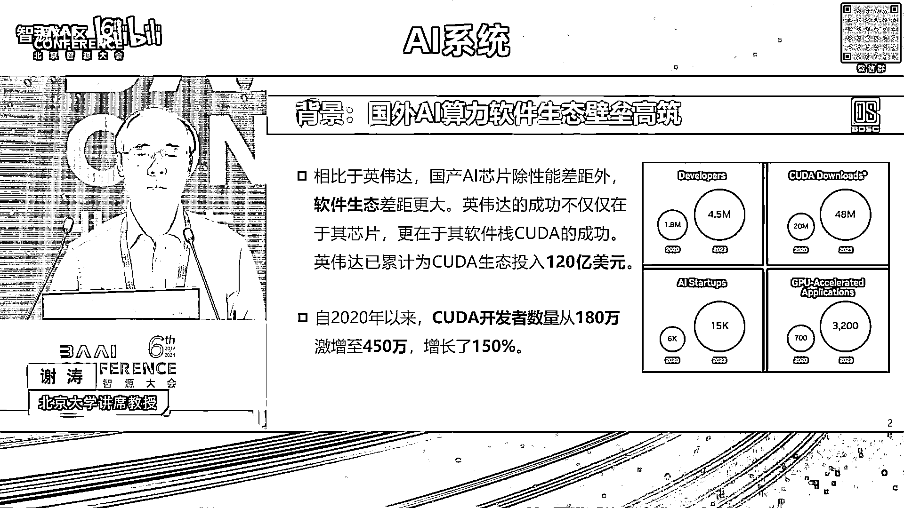
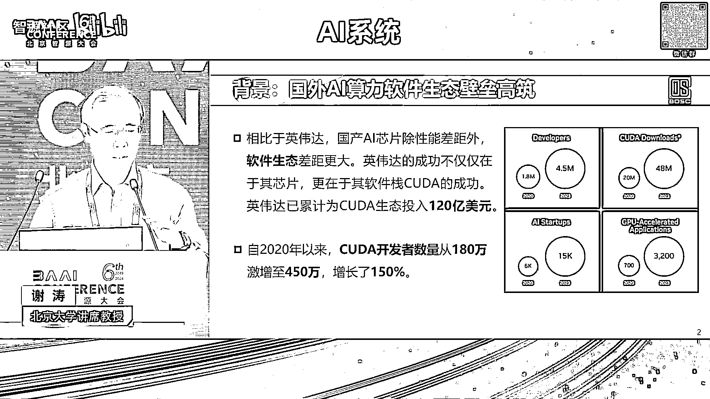
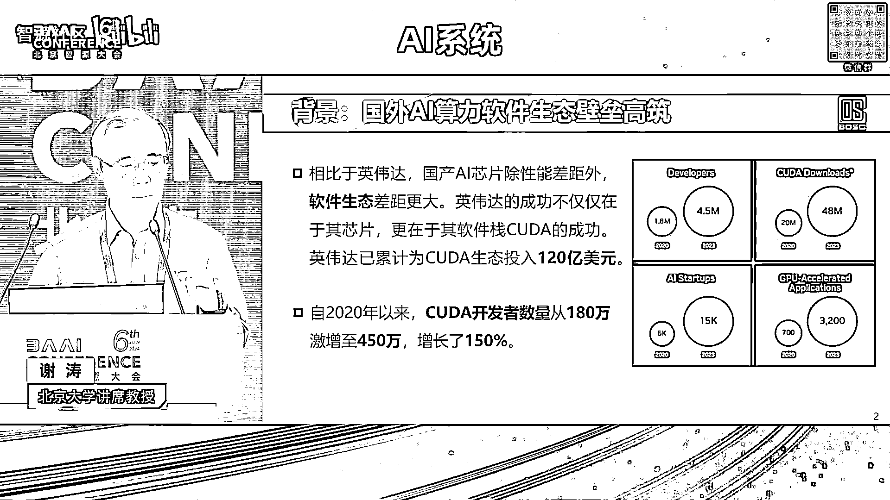
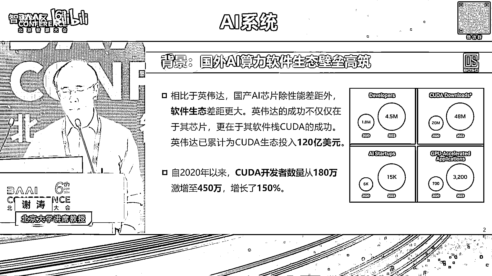
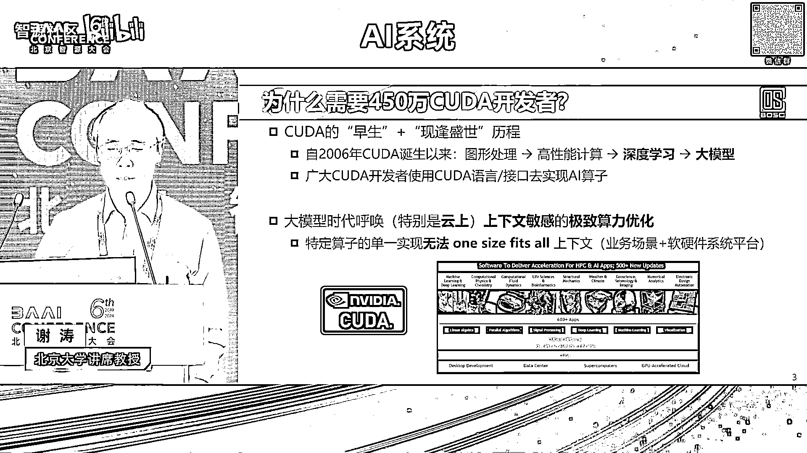

# 2024北京智源大会-AI系统 - P8：RISC-V+AI算力系统软件栈建设-谢 涛 - 智源社区 - BV1DS411w7EG

谢谢林院长的介绍，我尽量这个赶一下啊，希望能够在20分钟之内啊，这个结束好。

那么大背景我不需要多说了啊，就是现在当然我们这一个呃，这个比较高性能的这些AAI算力的芯片呃，很难能够购买到啊，我们现在很大程度是依赖于我们国产的，AI芯片啊的发展啊，那这个啊前面几个报告都有提到了。

其实性能啊各方面的都应该还是还是不错的啊，但是呢其实很大的一个我们要去应对的是啊，这个qua的生软件生态的壁垒啊，首先就是对KA这个生态它是2006年啊，英伟达开始发起啊，在高校啊等等啊。

各方面卷生态投入也很大啊，那么呃特别是近近几年，那么库的开发者也从这个啊180万啊，22020年以来激增到是450万啊，这个数据是今年年初啊一个新闻报道。

这个啊报道出来的那一个我们问的问题，就是诶为什么要450万的KDA开发者呢，啊那KDA开发者他指的是说使用KA的接口啊，以及哭打的这个C扩展的啊，这样的一个语言来去写啊，这一个程序。

那么在我们这个AI时代，那么就是AI的算子是用KDA啊来去写的，那呃这个由于这个呃长期的生态建设啊，他积累了这么多的人，大家会想诶，那也许我们就就让英伟达的，特别厉害的工程师对吧。

或者是说这个这个各个AI芯片公司的，自己的这个软件工程师，去写出特别优化的算子实现就好了，once for all啊，我们就这个广大用户去用就好了，但是其实啊在特别是当下大模型时代。

我们很难去once for all去使用啊，这么一个很通用的啊算子实现来，去支撑在各种场景下的这种啊部署的大模型啊，那么因为我们在部署的大模型，它是很首先一个特别在云上的。

它对于算法的啊这个算力的优化啊，即使是他的这个呃，是个位数的百分比的这么一个提升，它仍然绝对数给大家带来的这个节省的开销，体量还是很大的，在钱数上，所以呢大家很很愿意去再进一步的去优化啊。

那么我们把它叫极致的算力优化，那这一个啊这个很难，winds for是因为它上下文敏感啊，就是我可能针对特定的芯片，或者是特定的哪一款芯片，哪一代芯片及同一个公司的。

我可能都要去调整你这一个啊算子实现来去，更好的去发挥它的这个算力的优势啊，另外一个上下文呢是上上层的，这一个用户的输入啊，你使用的场景work low是怎么样，那也会影响到我使用哪一个算子实现。

它能够提供极致的算力优化的效果，所以这也是为什么我们有这个450万的，这样的扩大开发者啊，根据我们的观察，就说英伟达的它的呃，呃这个特别是枯打的软件生态发展啊，有这么一个思路。

而不见得是官方他只能自己承认的啊，首先一个就是它自上而下，它的根是闭源的，而且只是应对他一家的这个英伟达的芯片，那么呢它通过前期啊2006年以来的，特别是在大魔新时代，极大的去把这个KA开发者的数量。

增到很大的一个程度，这样呢使得大家都往上靠啊，这长出的叶子对吧，我们用了这个嫁接的这种方式，前面有几个报告也都提到了啊，能够去应对当下生态的燃眉之急的，就是兼用库达啊。

当然兼用QA他也带来各种各样的这种啊限制啊，比如说这个被人牵着鼻子走，新一代酷岛的接口可能放进去，有利于英伟达下一代新芯片，新的芯片它最能体现它优势，能够把其他的竞品又拉一大好几年啊。

这样的特性你就老是被牵着鼻子走啊等等，那还有一个就从云到端，前面谈到了，云测的算力的优化，是有极大的这种所谓的极致的优化的需求，所以也有这么大体量的扩大开发者，那么他通过云上的这样的这个所谓的。

有点像把它比喻成城市和农村的这么一个感觉，他先把城市攻破了以后呢，再延到这个，比如端上，可能盾山不见得算力要求那么大这种优化，但是呢呃它也自然凡能优化多少算多少啊，自然继承了，还有一个就是人海战术啊。

因为他这个英伟达哭打的，它的往下越往这个芯片进，它是越闭源的对吧，越不开放的，那么就是所以他很难是通过工具创新的方式，他自己一个公司本身投那么多工程师，特别对长尾场景来去做很广的覆盖啊。

所以它是采用了前期的这个建设人海战术，那我们反观国内啊，我们国国产的AI芯片公司，当然啦前面也提到有一批啊，芯片公司是兼用苦胆，先解燃眉之急，那么除此之外我们也有啊这个其他的这些路线。

那会造成就说啊大家这个投入啊严重不足，而且碎片化各自为政啊，这自己去做自己的，所以整体来讲它很难形成，有比较强的这个生态的竞争力，那一个我们思考的问题就说，除了兼容枯打这个燃眉之急之外。

长远来说我们还是要发展的，不光是我们国家，包括就是除了英伟达之外啊，全世界的其他的这些公司都在想，我们不是只要绑定在一家啊，那么我们在纵观这个这个去看这个历史上，当有一家公司以闭源的方式。

占据了生态的这个领导地位，很难有第二家闭源的公，这个这个生态来去去震撼它啊，但是我们能看到有用开源的方式来去震撼，这个排领领啊，领先者的这样的一个闭源生态的主导者啊，那比如说早期的啊。

这个LINUX来去震撼windows操作系统啊，那还有近更近期的这个谷歌去牵头的，安卓的这样一个开放的一个系统，当然它对应的是多种的硬件，而不是绑定一家的芯片或硬件来去挑战，去震撼苹果的IOS啊。

针对它只是自家的这个苹果的芯片，这样一个生态，那在这个大背景下，我们去看呃，有什么具体思路呢，一个机会啊，在近年这个来到了，那就是这个rise five啊，RISFI它是一个啊开放的一个指令集啊。

是全球啊开放开源的一块来去共建，那在这个大模型时代，也使得AI的这个啊算力需求呢，也体现一个碎片化啊，这么一个方式，就是极大的需要定制来去提供，打各个场景的这种啊这个这个算力的需求。

特别是在AIOT的啊这样的一些场景，所以呢不光是巨头公司，比如说谷歌，meta啊，特斯拉等等，哎也包括以一系列的初创公司，也在这个方向上啊投入啊，并产出啊，很有竞争力的啊，AI芯片的产品。

那我们其实我们国家这个RIFY，利用RISF来去做啊，AI芯片也是啊，有这个挺多的企业开始兴起，但是呢啊也面临着又有机遇又有挑战，首先就是生态碎片化，也自然地继承了前面我提到的啊，除了RISFI之外的。

其他的非KA或非这个GPPPU的路线的啊，这个国产的AI芯片公司的啊，生态碎片化的问题，还有也是类似啊，资源投入严重不足，还有一个是缺少统啊，组织统筹啊，另外就是产学研协同啊不紧。

然后我们其实看到有很多产业联盟啊，把这个公司都聚集在一起说啊，我们形成标准，然后呢大家这个都遵循他吧，但是大这个事情这个说我们统大家统筹起来，别各自为战，这个出发点很好，也就说把大家团结起来。

这个思想也很好，但是在执行上很难，那为什么呢，一个人说大家都是这个进闹这个联盟的，都是这个友商对吧，产出都是竞品啊，那你要去形成一个标准的时候，很可能会出现一个局面啊。

各家公司都放进一些有利于自己的产品的啊，不利于友商的产品的对吧，所以最后面形成就变成一个大熔炉，啥也不是挤不像啊，虽然可能放在那里，所谓的共识，但是没有一家形成这个共识的。

这些公司自己的产品是真正去跟的啊，那还有一个就是他可能说啊，这个出工不出力对吧，你形成联盟啊，开个会就完了啊，制定个标准，反正就放在哪，因为就他觉得哎呀我们就这这一帮人对吧，这个谁也不服谁啊。

就这些人团结起来，投入的力量不足以让我说那么出力对吧，我出助攻就好了啊，所以就说这个是一个啊这个很好的一个思路，但是呢实操很难。

那我们看就是RISFY加AI，为什么会是一个能够去解决，前面讲团结大家起来实操上的一些困难呢，首先一个就说我们团结起来，不只是瞄准说我们国家组织的一堆企业，或者是产学研，大家一起来去做，而是瞄准国际。

说这我们去把RISFI做AI指令集扩展，形成一个我们的共识啊，国内共识，然后呢形成一个候选的，然后在国际基金会推成国际标准啊，那么推成国际标准上有什么福利呢，其实这本身它不是最终目标。

目标是说你推成国际标准了，整个国际的开源社区LVM等等啊，包括AI的这些矿泉社区，自然他就会帮你upstream，就是所谓的上游，就它你的每一代的换代更新，包括他自己的这些开源软件的系统。

软件的换代更新，它都会自然会支持好啊，你这个指令集的这个演化或者是指令集的啊，当下的版本啊，所以这是很大的一个福利，就是不是盯着我们自己集一堆人能产出的东西，而是说一起团结起来。

能够形成在国际上去借力啊，所以呢这也是自下而上，刚才讲的这么一个啊一个一个一个思路啊，前面提到说哎呀，你这个这个放进去都是有利自己，不利于这个我们的友商的，那这个事情肯定是不不可能成为标准的。

就说那不就是叔叔的情形嘛对吧，为什么不大家一起真心的去做一个啊，多赢的一个场局面呢，啊，所以这是一个很重要的一个，一个一个出发点和抓手，所以我们以这个开源的这个指令集为根，这样涨出去。

各家公司都可以利用这个指令集啊去做定制，当然如果你偏移了指令级标准，那你定制的话，你自己公司要投入软件工程师做一些适配啊，那么呃这次就也是很自然，但比起原先这个你各家公司都要投入。

比如说一般我们听到说一个芯片公司，大概有2/3的工程师是软件工程师啊，flip和他这个这个在北京做交流啊，我就问这个问题，我说采用了refine这个方式，上游在系统软件这么来去。

为我们节省的这个软各家公司软件工程师的，对系统软件站的这个投入大概是多少，他说是百分之的个位数啊，这么一个极大的一个降低，还有一个就是说我们是有点像农村包围城市，这样对吧。

我前面讲到AHART的方这这样的一个时代，我们在这个端上啊，我们去做这个啊这个定制化的，包括芯片的设计，指令集的定制啊，以及这个系统软件站的这个研发来，去把这个端上这样的算力支撑好，这样生态起来之后呢。

我们再来包围城市，再把云上对算力优化有极大需求的，进一步的去这个啊利用这个生态呢去加强，还有一个就是说我们不是说走这样的思路，我们就从天而降，这么短时间，我们就孕育出450万的。

利用RISFIAI这个系统软件站的用户，不是就现在大家知道大模型时代啊，因为我本身也从事软件工程的研究和教学，所以就是一个很大的冲击，是我们不需要有那么多的，比较低级的软件工程师了对吧。

好多这些相对低级的任务是能够被取代，当然了，对中高级的还是有很大的需求，就是类似的，这450散可能本来就不需要那么多，如果我们在工具创新，编译优化自动化这方面做得更好的话，而恰恰这一些所谓的主力的力量。

是来自于国际开源社区啊，这个因为我也是担任中国经济协会，系统软件专委会的主任对吧，对于我们国内的系统软件的人才，特别是高端人才是特别缺乏的，所以我们得要到国际上去借力，所以我已经谈到了借力了啊。

那么就说啊宏观来讲就是两大借力，一个是以国际这个啊RISFI的这个国际标准啊，来去借国际上的系统软件站的力，还有一个就直接啊，我们不是说哎呀就等着推升标准了，就就就就就完了，而且这也是一个时机来去。

对国际这个特别是方兴未艾这样的，国际开源社区啊，前面这个这个啊童心老师也讲到了对吧，就是啊资源这边开展的啊，try ten啊，等等的这一些很好的这些工作基础啊。

以及这一个INTEL在主导的啊circle啊，这样更低底层的和哭打啊，类似抽象程度的这样的啊生态啊，那么同时我们也会在中间，就相当于TRITTON和circle中间的抽象。

针对rise five的这些AI指令集扩展，包括matrix啊，tensor啊，也来去我们去定义啊，一个中间抽象程度的算子的接口，以及实现，好我们简单过一下啊，第一这两部分，然后就很快就收尾啊。

我想我应该能够20分钟内结束啊，这一个呃首先前面已经提到了，就是我们以指令集的共识为标准，然后呢up str在国在国际上去推，使得国际开源社区能够对这个RISFI啊，AI指令集扩展进行这个支撑啊。

李院长前面介绍的时候，这个这个也提到啊，就是啊今年的4月啊，我也是被这个选为啊，啊这个陈磊他原先是在阿里达摩院，现在在西姆计算啊，所以这个啊一个sick，也体现了，就说我们在这个方面呢也是有比较啊。

这个是整个国家产业啊，不不是说我们个人呐有很大的这么一个发言。

这个这个这个叫什么体现度，另外一个就4月11号啊，瑞斯赛国际基金会呢指技术指导委员会主席呢，官宣说，其实2024年，RISF国际基金会作为顶级关键，战略优先级的三大方向，排第一的就人工智能与机器学习。

因为这个呃这个方向也给RISFY来去赶超啊，arm和这个啊这个X86啊，以及在市场上能够去造血啊，能够产生利润啊，那呃是带来了一个很大的一个机会啊，排第二第三是这个安全和车载啊，嗯很快的讲一下。

就其实说哎呀，RISFY它它技术上和arm和X86有啥，这个很大不一样的，其实它很不是说它技术上有什么不一样啊，而是说它这样一个开源开放的机制，降低了创新门槛，原先可能说像AI芯片，它需要CPU啊。

和这个协处理器进行协同设计的，原先只能大厂intel arm等等这些，包括英伟达对吧，他自己能够去干，那广大的大家的这个小一些的公司，根本没法去涉及到CPU这一侧，那RISFI加AI。

使得我们呢更多的能够在这方面去做创新，更多的团队啊，更多的公司，还有就是前面讲高度可定制性啊，这方面它天生的，它就设计这个模块化的这个方式，来让大家把这些啊根据自己的需求，把这些指令集扩展去。

能够搭出来，还有就是生态，就跟当年这个LINUX兴起，就相当于大家认为这个是人类发展对吧，正确的方向就是把这个作为，就是我们去投入到这个生态，去这个开源等等啊，这些这些建设志愿者。

他认为这是一个正义的一个事情啊，那么我觉这我们去看就RISFY，现在当下啊这个软件也好，硬件也好，这都是有类似的一个情形啊，这个啊发展速度是特别的快好，第二部分，因为前面啊这个这个啊。

童欣老师已经讲过这个try ton给大家介绍了，我就不多讲了，他这个是更高抽象啊，能够给大家更快的敏捷开发，能够去迭代啊，同时性能呢随着这个编译优化啊，这个等等的这一个全球。

大家这个生态的发展呢也是越来越好，那简单提一句就是啊SQL啊这是INTEL去主导的，他这个比啊这个前面报告也有提到，OpenCL它是更加高抽象啊，open c1离硬件更加接近。

所以呢C口的它的这个啊编程友好性能更好啊，那么呢呃也是相当于是有点像对标KDA，要替代KDA的这个抽象啊，所以我们呢也也也是这个在我们这个支撑的，系统软件站也会去做支撑啊，在这样的大背景下。

在今年这个3月底啊，这个呃依托呃北京开源芯片研究院啊，作为发起单位，联合啊一组这一届啊，相关的高校科研院所和企业啊，成立了这个RISFI加AI顺利生态委员会啊，我们这个已经开展了这个几个月的这些工作啊。

啊这个开了很多会，和很多企业进行这一个啊交流迭代啊，也成立了几个啊，奔着这一个指令集标准或者是啊这个架构呃，扩展标准去的啊，包括matrix tensor g p GPU啊，存算一体啊。

以及这个之上的系统软件站的这样的工作组啊，这都在这个这个铺开去开展。

这个很多的这个工作，这是我们战略目标，前面已经提到了啊，这我就啊不去这个细细展开了啊，其实这个是相当于把前面我们讲的这些事情呢，做一个啊宏观的这么一个总结啊，最后就收个尾，就是啊。

相对就是现有的国产的AI生日，是AI算力的啊，这个芯片软件生态一个是加入，打不过就加入它对吧，加入库打生态，还有就要回去自己干啊，自己干，那那这个英伟达2006年就把KDA干，干到现在对吧，450万。

那我们自己干，每个都闭源的，自己在那拱，那我们要对这个周期性长期性要一定思想准备，那我们现在要推动的是说利用RISF加AI的，这一个全球的生态高速发展的啊，这个啊而且是AI时代特别大。

模型时代带来的机会，我们希望能够去啊，推动成能去震撼KA生态的这样一个系统延展啊，我都汇报到此。

