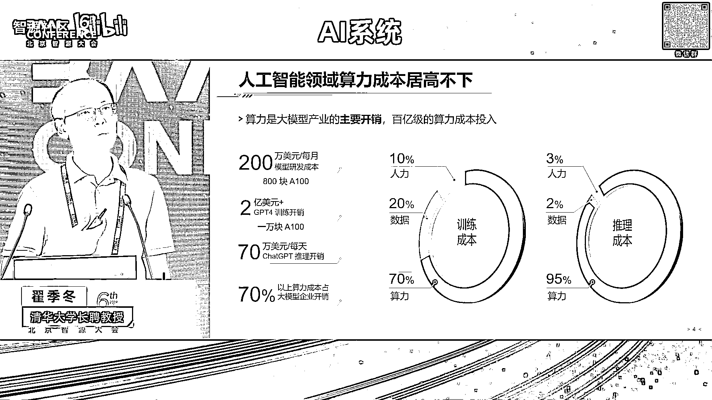
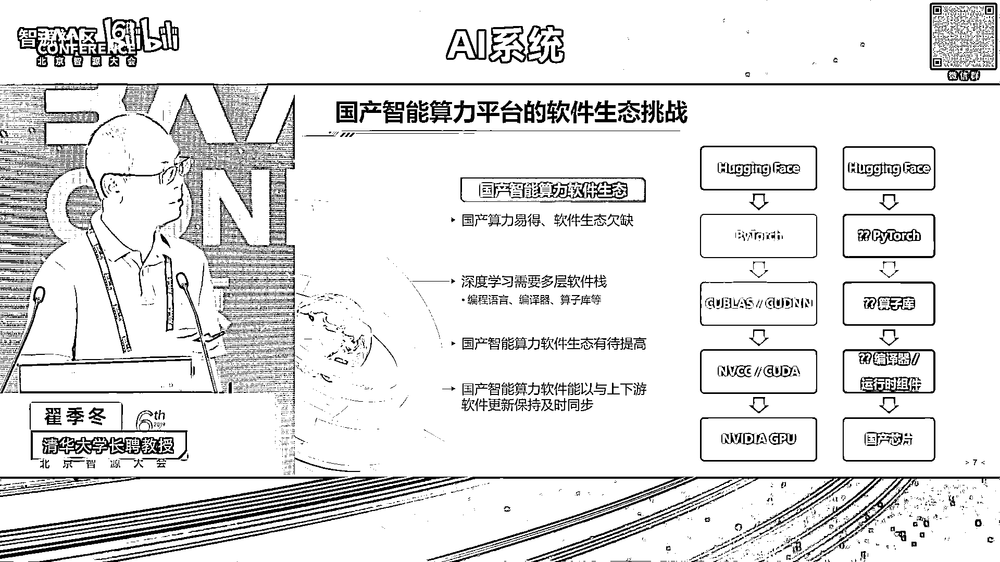
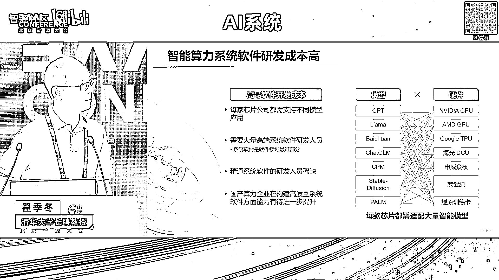

# 2024北京智源大会-AI系统 - P9：八卦炉-面向国产智能算力核心基础软件-翟季冬 - 智源社区 - BV1DS411w7EG

感谢林院长的介绍，我快点讲，要不然大家该饿肚子了，这个咱们已经12点了，后面还有一个报告嗯，呃我我今天的报告题目是，面向国产智能算力的核心基础软件，其实主要是想介绍一下。

我们实验室在最近几年做的一些工作，我觉得大的背景就不介绍，因为整个今天我们的工作都是呃，今天上午我也认真学习了呃，每位老师的报告都是围绕人工智能去展开，呃我觉得其实这里稍微强调一点，就是其实最近几年。

这个基于transformer的大模型，其实他对算力呢其实产生爆发式的这个需求，其实不只是在这个模型的这个研发，然后训练，然后包括微调到推理，其实整个这个过程，我觉得其实都产生了非常强的要求。

非常强的需求，所以说其实这一波人工智能，最赚钱的企业就是英伟达，反正不知道这个人工智能最后能不能落地，至少英伟达先把钱给赚取，因为大家不管是训练的微调，都需要这个算力，我觉得这块我给了一些数据。

这个算力呢实际上是目前这波大模型产业的，主要的这个开销，在训练的过程中呢，大家还要投入很多钱在这个数据的清洗，但是当模型训练好之后，当你部署起来的时候，其实这个推理的成本其实主要是算力的开销。

所以说包括刚才像那个晋辉介绍，其实像他企业其实硅基流动朝着这个推理，其实我觉得也是一个非常重要的一个方向，然后那我们就来看一下，其实包括今天上午这个智远，这个包括玉龙的这个报告，就是说其实也在国内算力。

大家知道，其实现在我们其实还是在公开的渠道，还是很难达到国外的这个算力，包括像英伟达的高端算力，包括像H100A100这样的高端算力，然后其实我们中国呢，其实现在目前也在做这个国产算力，其实有很多公司。

包括像这个华为天树木希等等，然后但是其实国产算力呢，其实我觉得大家我们也就是，包括今天我们在座的同仁，其实也在国产算力去共同努力，但实际上呢就是说国产算力当我们去用的时候，还是存在着一些。

就是说潜在的我们需要改进的地方，我觉得这也是我们其实未来几年，需要去共同努力地方，我觉得其中有一块，就是这个底层的这个基础软件，我们如何能够把更多的这个人工智能的一些，模型在国产算力上能把它发挥到极致。

我觉得这也是我们其实要共同努力去做的，然后其实在这个大的背景下，大家知道，其实中国呢其实现在在很多省市，其实已经在最近几年去建一些国产的制算，超算的算力中心，我觉得这也是未来几年。

其实一个非常大的一个市场，其实这些大的这些制算和超算中心呢，其实大家如果去看的话，基本上是以国产的算力为主，然后其实我们能看到，其实一个非常有意思的现象，就是说大家跟大模型的这些相关的企业聊。

其实大家都是需要这个算力，但实际上建的这个很多的一些计算中心呢，其实它算力资源呢其实利用的并不是很充分，我觉得中间呢还是有很大的一个gap，那为什么呢，其实我觉得这里的一个核心挑战就是这个和呃。

底层的这个算力软件生态，我觉得这个其实大家可以看一下这个呃，其实现在呢其实在英伟达这个体系，其实包括今天我们很多报告都围绕英伟达，其实英伟达呢其实我觉得最早它发展，其实这个软件呢。

其实当他开始从游戏市场进入这个算力，实际上大约是0405年，当时我还在读研究生，然后当时呢其实英伟达在给包括清华，很多学校送卡，他觉得说诶，我们是不是说，其实可以用英伟达的卡做一点计算。

然后当时呢我们实验室有一个，跟我差不多一起读书的，然后当时说诶考虑是不是做矩阵乘，然后英伟达就给打印了几本书，说诶怎么在这个英伟达平台上去写矩阵城，当时说诶要写要看这么厚的一本书，其实这个编程很复杂。

然后后来呢其实大约在0708年的时候，哭打慢慢出来，然后到后面其实这个这一波人工智能起来之后，是非常快速地推动了英伟达发展，然后我们看到其实在英伟达上面，其实从最上面。

其实大家用哈根face可以很方便的去用，用很多模型，这个包括训练微调，其实它实际上是把PYTORCH，其实好多做模型的人会觉得说，我用PYTORCH写代码还是会很复杂。

但是做我们做系统软件是往下其实有酷大呃，这个cool plus，包括今天其实大家基于的TRITTON，其实整个英伟达呢实际上把整个这套生态呢，其实至少就让我们在各个层次去做事情，都提供了非常好的。

但实际上呢就是说国产呢，其实你跟很多芯片厂商聊，他也会说我支持哈根face斯，支持PYTORCH，支持TENSORFLOW，我有很完善的算子库，有很完善的整个底层，但实际上当你去做更多的这个优化的时候。

你会发现其实它底层呢还是有很多问题，比如说可能漂跑标准的拉码是没问题，但是当你把拉码改一改，或者把很多这个模型改一改的时候，你会发现其实这里边就会问题很多，然后包括其实模型呃，包括很多软件的小的版本号。

你会发现很不兼容，我觉得这是一个非常大的一个挑战，其实我这里经常举的一个例子是，其实所谓的生态好不好，比如说像在清华里边还有很多非计算机专业，比如说物理系，化学系。

大家知道其实现在做AI for science，对人工智能需求非常强，那这些老师其实当他有一点经费的时候，比如说诶我有个几10万，我要买几块卡，那他们愿意买什么卡，你会发现其实他们还是愿意买英伟达的卡。

因为发现买来英伟达的卡，其实改一改软件还是能跑，但是其实你让他们去买一个国产芯片，还是有很大的这个压力，然后大家知道其实这里面的核心呢就是说，其实我现在人工智能模型虽然都是。

可能现在目前主流模型都是transformer，但是其实每家呢都会在，transformer上做一些改进，然后同时呢其实在架构本身呢也会有很多变化，那这个时候其实大家知道，即使在英伟达上面。

那你要把这些模型其实跑得很好，我觉得这个也需要很多的努力，但是可能在国产的卡上把这些模型跑好，其实就更需要更多的核核心的系统，软件的这个研发人员，其实刚才其实李院长也提到，其实我觉得像系统软件在中国呢。

其实还是蛮缺这方面人才，包括像我在清华带的这些博士生，基基本上应届生就可以拿到200万的这个package，就是200万到300万，就说明其实这个方向呢其实还是非常缺人。

就是说你还有很多的这个溢价的这个空间，然后呢我下面总结一下，其实智能算力呢，其实那它围绕呢，其实我们总结还是有大约十个非常关键的软件，就是说我们要把它做的比较好，其实大家可以从下往上去看，这个。

当我们在一个比较大的一个计算中心上，做模型的训练或者推理的时候，首先我们要调度器，我们如何把这个白卡千卡充分的调度起来，然后我们要很好的去管理内存，大家知道其实我要做模型的训练推理。

我都要高效的去管理内存，然后同时呢其实做模型的训练，你要有高效的容错的系统，然后同时呢大家知道，其实我做模型训练微调，我要读大量的数据，那你底层要有比较好的并行，文件系统的这个知识。

然后再往上到了这个新片层，你要很好的编程语言，其实刚才我们提到，比如像英伟达有CUDA，那刚才其实这个谢老师提到，比如说像cycle，其实cycle呢，我觉得就是说也是一个目前在发展非常迅速的。

就是说其实我们如果做更多的芯片，我们肯定不希望大家，要么完全自己做一套新的编程语言，跟别人不兼容，然后在编程语言之上呢，其实很重要的一个环节就是编译器，今天有很多老师有提到。

就是说其实如何把这些算子高效的编译到底层，其实这里是一个非常重要的一环，然后还有算子库，其实算子库跟编译呢其实是在一个level，就是说我们可以把常见的这些呃算子，是这个编程高效算子。

那你一定需要去编器支撑，然后再往上呢，其实当你涉及到多多卡多机的时候，那这个时候通信其实今天是刚刚也提到了，就是说其实当你在多机多卡的时候，那这个时候通信就非常的关键。

然后编程框架呢实际上是把这些整合起来，就是说当然就是说，其实它给我们提供了一个很好的用户接口，当然在底层之下呢，我们都可以去做很多我们自己的替代，然后当你在大规模的时候，其实不管是训练还是推理。

其实那你对并行的这个需求就会非常大，然后这里呢其实我讲一下，我们其实实验室在做的这个看的问题的角度，就是说底层的有国产的这个芯片，我觉得这里其实容呃有一层的核心的关键，就是编译器。

那你如何把底层的这些国产的芯片，能把这些性能发挥的极致，那编译器首先是一个非常重要的环节，不管是AI的芯片，包括像risk five，包括我们做各种各样的芯片，我觉得这也是其实大家看这个计算机系。

其实四大原理课程，有操作系统原理，组成原理，网络原理，再就是编译原理，就是能教成原理的课，在计算机系只有这四门课，其实是非常重要的一个环节，然后再往上的核心其实就并行。

那你如何其实能够比如说现在的MOE模型，比如说这个都很大，那我们如何在比如说单机八卡，把这个把这个模型推理做得很好，那这个时候并行就是非常关键，然后当你做这个白卡，千卡或者万卡的训练的时候。

那并行也非常重要，那实际上呢这两层呢，其实我们都可以在PY套之下去把它去改掉，也就是说让用户呢其实去不改编代码的同时，能够充分发挥底层算力的这个性能，然后这个里边紫色部分呢。

实际上是我们我就我在清华带的这个实验室，过去几年包括在这个容错，包括在调度，然后底层的编程语言，然后编译器方向，然后包括上层并行，我们做的一些工作，然后今呃因为时间原因呢，我下面呢其实简单的介绍一下。

我们其实在这几个方向做过的一些工作，大家如果感兴趣呢，其实可以去网上下载，我们其实很多系统我们都是开源，我介绍第一个工作呢是在嗯编程语言，大家知道，其实这个编程语言呢。

其实就是说其实现在在这个异构芯片呢，其实做领域特定的编程语言，是一个非常有意义的，因为实际上我们不能让一个编程语言，去解决全部问题，然后我们这个工作叫free tensor。

它的核心就是说我们有一类的人工智能模型，它实际上是不规则的，比如说我大家看右边的数据，我给了四个模型，最右边叫GAT，实际上是这个这个图，就是图神经网络GN这类的，它本身是一个系数问题。

然后long former实际上就是这个long sequence，就是大家知道现在大模型处理这个长序列，那我会在这个会有很多这种算法，那它本身呢其实它也不是一个规整的。

然后此外的还有这个soft ross，Soft rust，它实际上就是拍几个二维照片，然后帮你生成三维的图片，那它这里面也是一个不规则，那针对这个呢，我们在PYTORCH里面做了些扩展。

然后做了这个很多的性能的这个优化，然后跟PYTORCH原声比呢，其实在这个英伟达平台，我们可以有上百倍的性能提升，这个主要是讲不规则的模型，其实这里边会有很大的这个性能提升的空间。

然后这个工作呢我们也在GITHUB开源，这个感兴趣，这个大家可以去下载，然后第二工作呢其实就编译器，其实今天有好多老师提到编译器，我觉得就是说我们要把底层的这个芯片呢，其实算力发挥起来。

就是即使像英伟达的平台，那我们如果在编译器做很多事情，其实还是能提升，比如说30%或50%的这个性能，那在PYTORCH之下呢，其实今天尤老师讲，就是说它的核心呢其实为了发挥性能。

像PYTORCH会把这个eager mode，其实这个这个执行方式会转成一个计算图，这样的话可以在编译层面做很多优化，也就是说其实今天上午的一些报告提到，比如说有图层的编译和底层算子编。

然后我们这个工作呢叫i net，实际上是去年的OSDI的文章，我们实际上是把这个图层跟算子层打开，这两层合到一块，也就是说可以挖掘出更多的这个优化的空间，就之前呢比如说像有些图层的优化，那是在这个图。

比如做一些kernel fusion，然后在算子，其实今天包括赵杰老师讲的，包括算子其实也做很多优化，我们这个核心呢实际上是把图层的算成，融合到一起来，挖掘更多的优化空间。

我们这个是在英伟达的A100上面，然后做了一些模型，然后包括一些经典的这种卷积类的，和现在的这种大呃，Transformer base，然后跟TENSORFLOW，还有TENSRT。

TENSRT是英伟达上面一个默认的，编优化的工具，然后pad实际上是我们之前21年的一个工作，然后最多呢其实会也会有将近两倍的性能提升，其实这些想跟大家讲，就是说即使是英伟达平台。

我觉得你去深深入的挖掘底层的编译，包括上层的，其实还是会有很多这个性能提升的空间，然后最近呢其实我们在这个大语言模型，大家知道其实该那个呃近回讲到，就是说其实在推理其实它是一个memory b。

那实际上呢就是说大家知道我们要把模型参数，然后包括中间的像k v catch存起来，那这个其实对内存会有非常大压力，然后他对这个系统，内存带宽会有非常高的这个要求，然后我们这个系统的核心呢。

我们把模型参数和kv cash给它分离，把kv cash呢给它挪到CPU的内存，这样的话，然后通过这样的流水线的并行，来充分的发挥CPU跟GPU的计算能力，这样的好处。

就是说我batch size就不再受到，kv cat内存占用的这个限制，然后同时我还可以把CPU的内存带宽，跟GPU内存带宽整合起来来，共同的提高这个吞吐，我们这个是在英伟达平台。

跟VIVIMTESRTLM系统比，我们by ch size可以提升到百倍，然后GPU吞吐量提升1。8到14倍，这个系统我们最近也会把它开源，这个系统叫fast decode。

然后呢其实我们在这个训练测呢，其实我们一直在维护，就是MOE，其实MOE呢在21年，其实年初的时候还没有火的时候，我们就开始在PYTORCH里面做了，这个MOE的并行知识。

也就是说你在PYTORCH里面加一行代码，我们就可以自动的帮你去做各种并行，我们这个系统是21年开源，叫fast m o e，后来我们又持续的更新，然后拍套那个呃美国的FACEBOOK。

它在Python开源，应该是比我们还要晚一两个月的时间，我们这个系统呢，也包括支撑了北京智源的悟道的这个，大模型的这个训练，然后我们后来呢其实把这个系统持续的改进，包括fast m o e是这个呃。

是我们在p pop2上的一个工作，我们这个跟deep speed的ME系统比，可以比它快高达十几倍的这个性能，然后我们去年呢又进一步的优化，做了一个smart m o e系统。

然后能比我们这个fast stem e这个系统，又进一步提升将近两倍的性能，就是这些数据都是在英伟达的平台去测的，然后下面讲一下在这个国产算力方面，就是说大模型呢大家知道训练呢，其实他对这个呃。

其实硬件呢还是提出很高的这个要求，然后这个国国内呢，其实青岛这台机器呢它是一个纯国产的，大约有10万个节点，大家可以理解成有10万个国产的这个加速的卡，它的性能呢其实相当于是1。8万块的。

英伟达的A100还是蛮大的一个系统，然后我们其实在这个系统上呢，其实我们是从底层的编译，然后包括像内存管理，然后包括多机的通信，我们其实是把整个的这套系统，其实这个移植起来，然后可以就是说把PY套代码。

可以在这个系统上去跑起来，我们把我们整个这套软件叫做八卦炉，就是包括底层的这个通信编译，然后最后是训练起一个百万亿，大家知道，其实现在呢国内大家都在训练万亿模型，其实是万亿的100倍。

然后我们最近也支持这个，包括像AI for science的一些，大家在这个系统上做一些AI for science的，也在支撑这样的这个系统，然后我们目前呢也把百川。

包括拉玛一些模型在这个青岛的平台支撑起来，然后至少可以在这个国产的这个系统上做，包括百川拉玛的这些模型的训练和推理，然后我这有一个视频，我不知道是不是能播放出来啊。

可能这个系统没有声音没关系，就是说这里边其实有声音。

就是说我们其实主要想讲，就是说其实用这个国产的这个平台呢，我目前已经可以把这个包括百川还有拉马，然后这个支撑起来，然后因为其实这个国产超算呢，实际上是国家投钱建的，然后它本身的这个就相当于基石费呢。

还是很便宜，大家如果在这个平台上做训练或推理，其实还是要拼，你去租这个英伟达的A100或者H100的话，其实成本会低很多。

然后最后总结一下，我应该还提前了3分钟，就是说我觉得其实中国呢，现在发展人工智能领域，其实我觉得构建国产的智能算力，我觉得还是非常重要的，就是说因为整个美国对，其实中国呢还是封锁，然后在这个一环里面。

其实我一直还是坚信，其实包括在座，就是说发展这个底层的基础软件还是非常重要，就是我们要把，就是说其实其实大家如果去看英伟达的话，其实英伟达其实他很多的工作，都是在软件层次去做，我觉得这也就是说前面讲到。

包括第一个这个我们这个国外老师的这个talk，其实他也提到，就是说，其实这个我们要把这个底层算力发挥起来，其实这个软件呢实际上是占到非常重要的一环，那就是说我们能够构建我们国内一个比较好的。

这个良好的软件生态，可以降低大模型在不同，AI芯片的这个识别开销。