# 2024北京智源大会-人工智能+数据新基建 - P7：面向大模型的数据工程-李荪 - 智源社区 - BV1qx4y14735

各位专家大家下午好，我是来自于中国信息通信研究院。

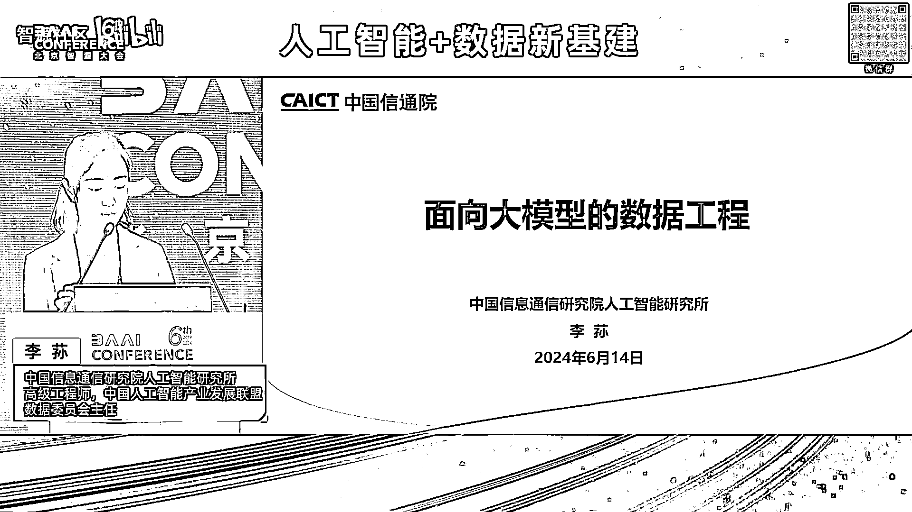

人工智能研究所的李孙，然后今天的下午给大家去分享的主题是。

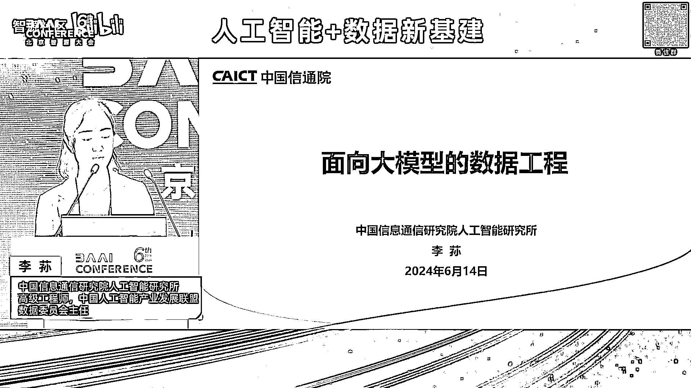

面向于大模型的数据工程，其实这个题的话其实对于中国信息通信研究院，来说的话我们可能主要承担两个职责，一个是叫国家高端专业智库，然后另外一个是产业创新发展平台，所以的话其实我们做的研究更多的是我们集宏观。

然后再结合产业的微观，然后做一些终观的研究，也就是说我们去更多的支撑政府，把顶层的一些规划我们去结合产业实际的情况，然后找寻一些落地的方法和路径，以供产业可以有一个比较可持续化的。

然后明确的一个发展的方向。

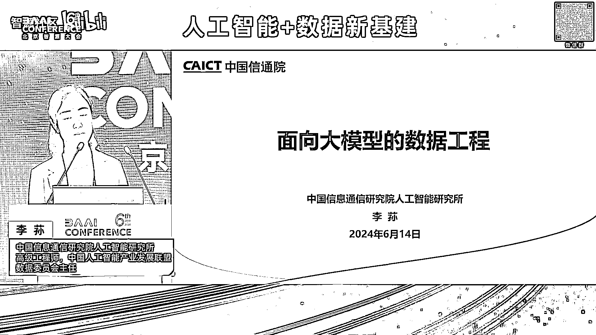

然后今天的分享的话，主要我会先去介绍一下，人工智能现在数据的一个现状和挑战，然后还有就是我们面向于大模型的话，如何去做数据的工程，然后为大模型更好地去更高效地提供这种高质量的数据集，然后最后去介绍一下。

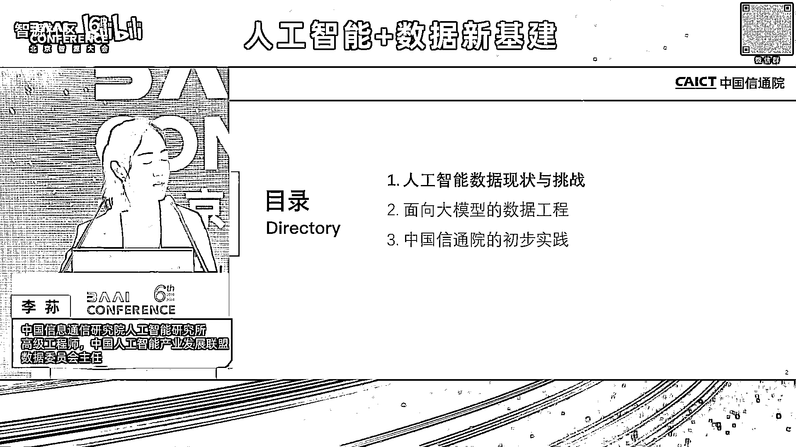

就现在我们在这方面的一些研究的进展，我们首先来看的话，其实随着整个人工智能的发展的话，它其实每一阶段，现在我们看人工智能的三驾马车叫算法 算力，然后包括我们的数据，然后现在的算法的话到大模型时期的话。

它整个的能力体系，包括刚才其实有很多专家有介绍到，它不管它对于这种理解的能力推理的能力，其实是完全是有了一个质的飞跃，然后而且的话我们说换到算力来说的话，现在算力的话其实国家也在提这个算力一体化。

然后为我们整个人工智能整个算力的基础设施，其实也提供了很好的保障，但是我们现在看到数据来说的话，其实随着人工智能的发展路径的话，现在数据的它的要求是完全是发生了一个很直接的变化，首先来说的话。

就对于大模型来说，它要求的是很非常大规模的这种数据，同时的话它类型也是多样化的，尤其是现在我们是多模态的数据，它要进行这种信息的对齐，然后这个其实我们叫上一代的人工智能完全是不一样的。

就上一代的人工智能的话，其实我们更多的是叫这种单点的孤立的，就原来我们叫我们专门去研究NLP，然后研究CV，然后研究语音，然后我们针对于小模型的话单独为它去构建数据，所以在那个时候的话。

其实大家对于数据的认识，或者说对于它的重要程度好像还没有那么的敏感，那现在为什么现在对于大模型时代，它的这个我们对数据关注度这么高，是因为它现在的质量要求是极高的，这个我们去换算一下。

因为现在对于大模型训练的话，尤其在预训练的阶段，它投入的成本是非常高的，这里边就涉及到我的算力的成本，涉及到人力的成本，还有一些时间的成本，那这里边如果我的数据质量不高的话，它中间我会比如出现当机。

然后我要进行版本的追溯，那这里边其实很大的程度都是跟数据有关系的，然后而且的话其实我们从，就大家可以看到就21年和22年，大概是在这个周期就是世界上，一些人工智能的顶尖的学者。

也在提这个Data-Centric AI，就是我们上一代叫以模型为中心的人工智能，然后慢慢的话其实未来的话，现在模型为中心可能到达一个瓶颈，未来我们人工智能的重点的发力方向是什么，其实核心就是数据。

其实现在尤其大模型来了也就印证了这个观点，这个我们来看的话就是说，这个特别像第二次工业革命，这个我们第二次工业革命的核心其实是，先有了发动机，然后又有了汽车，那我们汽车想要在路上跑的时候。

其实我们要有高质量的汽油，那这个汽油的话我们从石油怎么历练成汽油，然后包括这个汽油的运输。

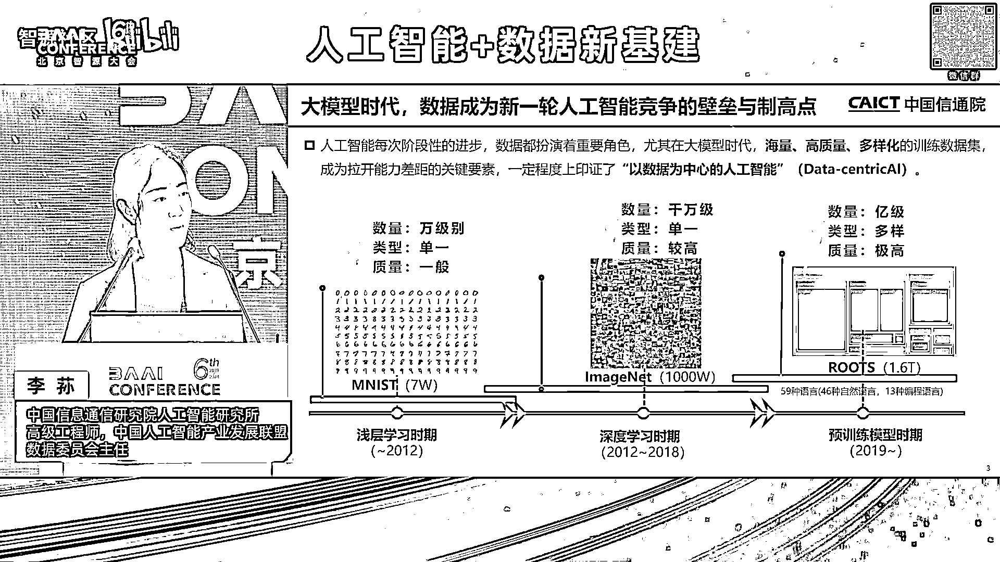

然后以及我们加油站的建设，其实就特别像我们现在人工智能，整个模型我们要去快速地奔跑，那整个我们这个能源，然后以及这个就我们叫数据可以换算成这个汽油，就是这个汽油的整个全产业链条。

怎么去保证未来人工智能可以快速去发展和应用落地，然后从国家政策上来看的话，其实咱们国家就一直在推动整个，包括像数据要素，包括人工智能的整个发展的话，其实我们去梳理了整个一些相关的一些政策。

大家可以看到其实里边的话已经不断地在提出来，就对于人工智能来说，要不断地去提供整个高质量数据要素的整个供给，然后包括一些先行先施的一些数据的制度，然后包括的标准。

然后包括我们整个数据的供给和一些市场的交易，以及相应的资源建设，然后在今年的5月份的话，也是我们国家数据局，然后提出来建设国家级的数据标注基地，就数据标注其实对于人工智能来说是非常关键的。

因为它其实更多地加入了人类的知识，然后尤其是现在我们大模型要去跟行业去结合的时候，然后它是需要很多这种专家的支持，那未来的话整个数据标注，我们认为它其实是一个很核心的环节。

一方面它可以更好地把我们整个原有的数据，加工成这种高质量的数据集，然后更好去释放这个数据价值的要素的释放，然后同时的话也为人工智能源源不断地去提供高质量的数据集，然后这个的话其实数据标注基地建设。

其实这里边的话也提到了就是6个方面的一些重点的任务，就是它里边不仅是数据本身，它是从整个权威度来看，这个就涉及到有技术的创新，产业的赋能，生态培育，标准应用，人才就业和数据安全。

所以说未来的整个数据标注，包括为人工智能数据高质量的发展的话，它从整个机制体制，包括我们的顶层规划来说，都已经有了很全面的一个考虑，然后人工智能的整个工程化落地。

其实是这两年我们一直重点在关注的一个方向，就是我们叫人工智能逐渐从实验室走向了产业，那这里边工程化落地它就会涉及到方方面面，然后包括有这个硬件，包括算力，其实数据也是很核心的一个环节。

它是直接去链接我们底层的整个人工智能，包括算力基础设施，跟我们场景应用很关键的一个环节，因为对于数据来说，数据其实刚才很多专家有提到，就是数据本身是叫模型应用方拥有的，但是我技术提供方。

我本身是没有这些数据的，但是我怎么去融合中间的这个鸿沟，那这里边其实我们跟很多相关的产业的用户方，和技术提供方有交流过，大家经常会陷到一个问题里边，就是说你有什么样的数据，和你要什么样的数据的一个问题。

那这个鸿沟到底怎么去解决，其实现在目前就对于人工智能工程化落地，是一个非常关键的一个问题，这个也就是应对了今天我重点跟大家去分享的，就是我们叫面向于大模型的数据工程的这么一个话题。

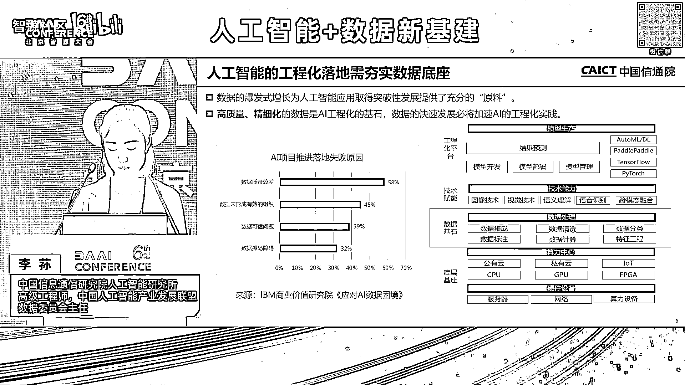

然后在我们的大模型现在时代到来的话，其实大家其实看到，刚才有介绍到我们叫数据的整个发展历程，它其实对于整个数据的数量跟质量，其实都要求非常高，我们叫双量，现在看到主流的大模型的淘根数其实是非常大的。

但是的话现在目前我们可以用于模型训练的数据，其实对于它的质量来说，是没有一个统一的评价的标准，然后这样就导致我们在训练模型，包括在它的工程化落地过程当中，就需要投入很多的时间来进行数据的处理。

然后同时的话整个大模型的整个训练过程当中，包括应用落地过程当中，它是会涉及到很多环节的，而且每一个环节它对于数据的要求也是不一样，这里边我们就必须得有一个很高效的，很自动化的一个数据工程的概念。

这里边就会涉及到我不同类型的不同阶段，我对于整个数据需求，我要怎么去管理怎么去制作，它其实应该是有一套统一的方法论，同时的话我要增加效率，因为现在是大规模的这种数据，我如果只是靠人工标注。

这里边它效率是非常低的，所以说现在其实我们有看到很多智能化的标注技术有产生，然后同时也会用大模型来标注数据，还有的话就是以前我们叫上一代的模型去部署完了以后，其实不会涉及到它的更新迭代。

但是大模型的话它是一个持续学习的过程，就像我们一个人在我们的，就是叫我们从小学初中高中，它其实是要不同的不停的去学习的，所以要不停的给它去喂数据，这样的话我们就需要一个数据的更新的机制。

所以这里边就包括它的整个效率，包括它的整个自动化的高效的流程，然后包括它里边那些机制，是对于整个数据工程是才是一个完善的很体系化的内容，然后再有的话就对于整个全流程，就刚才我们说到其实我们数据。

对于现在的大模型它不是一次性的，它是随着时间然后随着全流程，是不断的在跟模型来进行交互的，这里边的话就涉及到要可信的全流程的数据的治理，这里边的安全包括我们的整个数据治理体系如何去设计。

也是一个非常关键的问题，然后我们再来看的话。

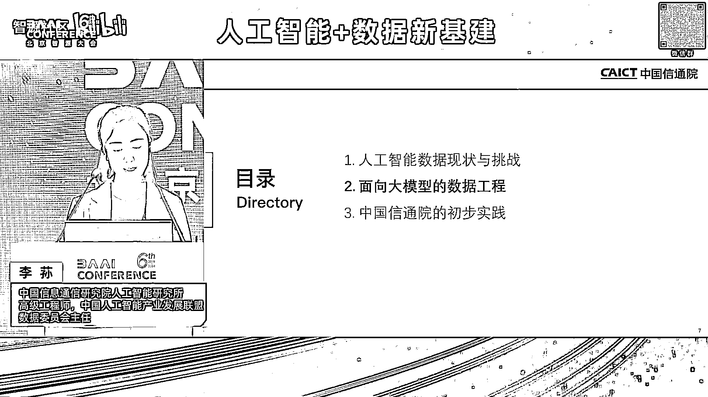

就是我们去看整个大模型训练的一个周期，就我们从整个预训练的大模型到微调，到形成一个通用的大模型，到我们行业应用落地的行业大模型，我们去每个阶段去拆分出来，大家其实也可以看到这里边会涉及到预训练的数据集。

有微调的数据集，包括提示工程，然后以及人类强化学习，反馈一些偏好的数据指令的数据，还有一些行业知识的数据，这里边的话针对于不同的数据，其实我有相应的数据处理的方法，以及数据训练的策略，然后最一开始的话。

包括预训练数据的话，我们会从这个是比较传统的，像数据的获取，过滤清洗，但是它是大规模的，所以我很关键的，最后要有一个数据质量的评估，可能原来对于小模型来说，质量评估它并不是那么关键。

但现在质量评估是直接可以去，直接影响整个模型训练的成本，包括模型训练效果的，然后在整个全流程过程当中的话又会，因为最一开始是无监督的，后面到自监督的话，我还会有数据的标注，然后以及我在。

不停地在优化的过程当中，我还要做一些提示的工程，然后这里边我就要引入一些这种，我们叫交叉符合性，很专业性的人才进行专家的标注，然后以及这个的话就认为这个，数据跟模型之间的效果，它其实是相互呼应的。

所以在每一个阶段，我怎么去制定数据的策略，它其实是需要一套测试的体系的，我通过测试模型的效果，知道它需要什么样的数据，它还缺什么样的数据，它应该学什么样的数据，所以我们通过，但是这个测试的话就。

又会涉及到我们原来，叫二八的理论，就是我们要去构建一些评测的数据机，所以大家可以纵看，就是全看这个图，图里边就看到，就这个模型跟数据它是相生相息的，是完全是密不可封的。

所以我们认为整个大模型的数据工程的话，一定是贯穿于整个大模型的全生命周期，然后再来看就是。

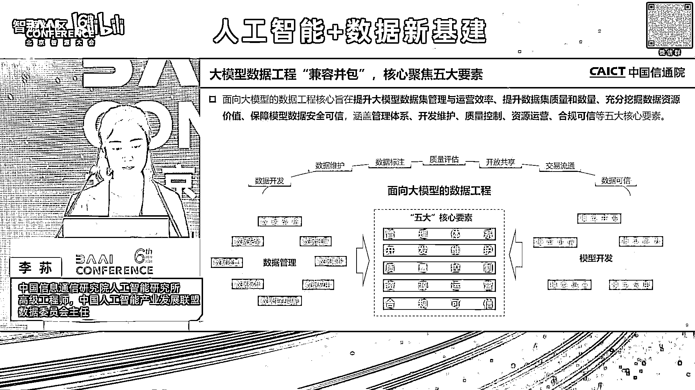

我们叫，就是相生相息的话，它其实就是一个兼容并包的过程，我们这里边去看到，整个面向于大模型的数据工程的话，它核心，我们梳理出来五大的核心要素，就包括了有管理的体系，开发维护，质量控制。

资源运营和合规可信，这五大要素是怎么总结出来的，就是一方面我们要去融合已有的数据，管理的成熟度，评估模型，这里边的话就会涉及到，整个八大要素，然后以及像模型开发过程当中，像模型开发的过程当中。

从开发到模型的能力，应用运营可信，它也有会自己对数据的一些要求，我们把已有的现在大数据领域的，数据管理的成熟度，评估模型和我们现在，模型开发过程当中，对数据的要求来进行一个融合。

其实就是现在我们面向于大模型的数据工程，这里边核心的话，就是对于整个大模型数据工程，其实我们更多的是要提高，整个对于整个数据的供给，或者它的管理的运营的效率，以及提升它的整个，我们叫高质量的数据。

就是它质量可以来进行进一步的提升和优化。

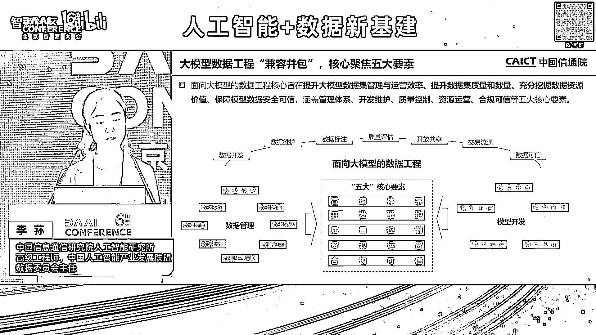

然后以及保障它相应的安全，我们分开来看的话，就第一个先看管理体系，我们针对于大模型的数据管理体系的话，我们对于数据管理，大家应该很多专家都很熟悉了，就是数据它其实有一套非常完整的管理体系。

针对于我们大模型或者人工智能的数据，我们要怎么去管理呢，这里边我们核心可能更多宏观的我们就不谈了，我们更谈的是更多是偏落地的，这里边就会涉及到项目管理，我们针对于大模型数据。

根据刚才说到互相融合互相交叉的话，大模型的数据工程，我的全周期里边，我的数据的资源的分配，然后以及我整个数据，不管我是形成数据集或者是数据训练的策略，然后里边它的整个机制，然后以及进度如何去控制。

然后它的质量如何去保证，以及它的一些风险的管理的问题，然后可以我针对于大模型，不管它是要这种预训练的数据，微调的数据，还是偏好数据提示工程的数据，我都可以按照模型的训练周期。

按时按点保质保量的给它进行交付，然后同时的话成本可控，这里边就会涉及到我里边肯定要有一个，核心的项目管理的这么一个职责，然后第二的话就是组织建设，组织建设的话其实我们知道，大部分企业来说的话。

它一般是会有一个大数据的团队，然后有一个人工智能的团队，现在我们跟很多包括大型的企业，包括现在做大模型开发的一些互联网的，头部的企业也都交流过，大家在组织建设这块，目前可能还不是完全的统一。

但大部分来说的话，现在这个团队可能还是在大模型的团队，或者在人工智能的团队为主，但这里边它其实会有一个核心的问题是说，其实这部分的话，它更多它没办法完全去了解整个数据资源。

和整个数据供给的体系和一些机制的建设，因为它只是容纳了整个大模型团队里边的，一个职能团队，这里边我要去进行全流程的，一些数据的管理和一些机制，包括现在，包括这个项目管理的话。

它其实这一个团队是完全没办法去支撑的，所以说这里边的话，就是针对于整个大模型的数据工程的话，怎么把两个团队来进行一个有效的融合，和一个高效的协同的话，这里边其实是我们需要完全去探讨。

然后也要结合企业实际落地的情况，来进行一些调整，然后还有的话就是标准应用，然后针对于大数据领域，其实我们是会有很多标准，包括现在我们也成立了，国家数据局也成立了数标委，其实把我们之前很多的标准。

然后未来也要推向整个应用落地，然后人工智能其实我们这么多年来推其实也有，但针对于人工智能的数据方面的标准，其实我们后边具体片子我会有介绍，就我们在这块也在做一些相应的工作在推进。

但是的确这块更可供我们去参考，包括能实际去应用落地的标准，相对来说是比较少的，尤其现在我们在推这个，国家也在推，地方也在跟产业也在一直在说高质量的数据集，那这个高质量数据到底怎么去定义。

我怎么去建一个高质量的数据集，然后这个数据集的话如何跟我的大模型去进行融合，这里边其实会涉及到很多标准化的问题，这里边你看就像到这个数据我如何去加工处理，然后以及大模型的数据开发它的质量其实等等的话。

现在其实我们是需要去建立一些操作规范，以供这个不管是数据的提供方，还是模型的开发方，还是产品的应用方，它其实都需要这个来自己作为一个参考，然后最后的话就是说这个人才的管理，我们知道刚才针对于整个。

我们这个叫跨学科跨专业跨领域，这个怎么去理解呢，就是我们现在既懂数据又懂模型的人才，相对来说是比较少的，比如说就是我们大数据领域的人才有很多，然后对于模型开发对算法懂得也很多。

但是原来我们叫数据科学家和算法工程师，但是这个的话其实如何对二者做一个结合，其实目前来说这未来的人才其实要往这个方向去发展，然后同时的话现在我们整个，就是大模型在应用落地过程当中。

它需要这种多学科的这种知识的背景，然后你要懂模型同时也懂模型要学什么样的知识，那这里边的话包括像医学金融，其实很多这个这种有多学科交叉的人才，其实在我们整个人工智能数据构建的时候是非常缺乏的。

开发维护的话。

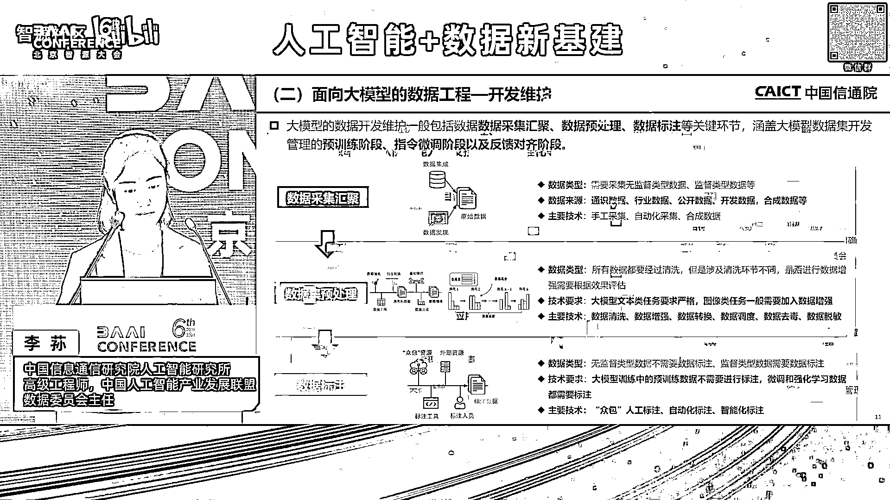

第二个开发维护其实更核心的，是关注于整个全生命周期的一些技术的要点，然后这里边关键环节其实就会涉及到，就是最大的整个数据的处理量，还是在最一开始预训练阶段，从整个数据的采集的汇聚。

然后这里边其实更多的是针对于无监督的这种数据，然后它数据来源就包括有通识行业等等很多这个，就是还有合成数据，这个其实我们去年也做了一个，大模型数据的资源地图这么一个研究的工作，其实也是在研究现在。

就是目前大模型用到的数据都是从哪来的，然后同时的话这里边我如何去采集呢，然后有手工的有自动化的，然后也有一些合成的数据，然后数据的预处理，就是我首先拿到数据，我怎么去把这个数据形成一个模型可以用的。

它就会涉及到预处理和标注两个环节，预处理更核心的它其实是去做整个数据的整个清洗，增强转换调度去读等等脱谬，就是它其实是达到一个可用的这么一个效果，就是我要去保证模型它不出偏差。

所以我要达到可用的效果的话，我要先去做数据的预处理，然后如果说模型好用的话，那它其实要通过数据的标注，这也就是刚才说到我们需要这个，多学科多背景的这种人才来进行标注，那这里边的话数据标注的话。

它也是会涉及到不同的大模型不同的阶段，这里边目前来说我们整个数据标注的产业的话，就是因为现在我们也在做这方面的研究，然后包括跟地方包括跟很多数据标注的企业也在，对就目前我们整个数据标注产业来说的。

它的不管是人员的结构，还是整个服务技术能力的水平，相对来说还是比较处于起步的阶段，那未来的话整个我们怎么把整个数据标注的产业的能力，可以进行这种产业化的升级。

为我们整个人工智能提供这种更优质的更高质量的数据，其实也是现在就刚才我说到我们国家数据，在推这个国家级数据标注基地很核心的一个目标。

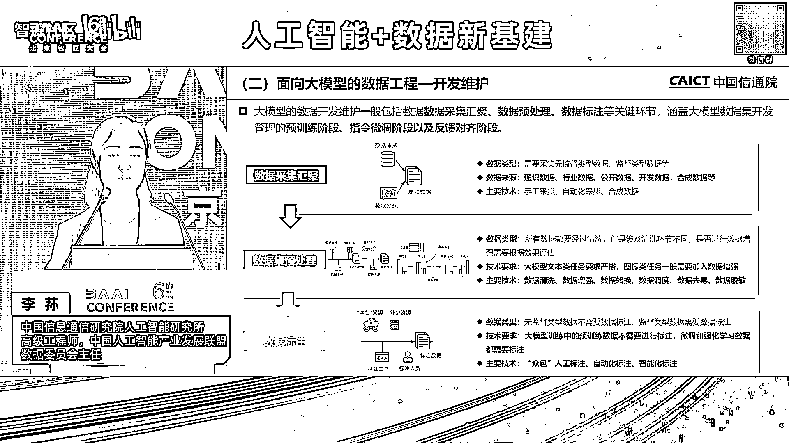

然后再说到这个就是针对于大模型的不同的阶段，刚才说到这种预训练的阶段，它其实不同的阶段对数据的需求是不一样的，然后像预训练的话它就规模大，然后但是它需要我去，就是大家其实可以去反馈。

就是反向来看就是不同的阶段需要什么样的数据，其实是说我这个模型要达到什么样的效果，在预训练阶段的话我需要大规模的数据，然后这数据要有更多的覆盖性，要有更多的多样化，它其实更多的是一个基座大模型。

然后同时在指令微调阶段的话，它的规模相对来说比较小，但是的话它就要有明确的指令跟明确的方向，包括有明确的内容，这里边的话我们就会涉及到这种有监督的，这种处理的方式，然后同时的话还有反馈对齐的阶段。

就是你通过人不停地在告诉模型，你到底就是它通过这个数据标注，然后告诉模型你哪个地方需要能力提升，哪个地方需要去优化，它是通过跟人的交互来快速迭代，来进行这种模型的更新，刚才说到这个高质量的数据集。

就高质量数据集我们还不能说只看这个数据本身这个质量，我们再去看这个人工智能数据的高质量的话，它核心的话我们要从三个维度去看，首先是说这个数据的质量，就是会涉及到这个数据的指标。

大家知道这个国标有DQAM的国标的六性，就针对于大模型数据质量，我们是现在已经有一个国标是明确的在指导这个数据质量，但是对于整个人工智能的数据质量的话。

它其实是要有根据模型的质量来反馈我需要什么样的数据，所以这里边的话我们也梳理出来11个核心的维度，这个后面具体再跟大家去介绍，然后指标完了以后，就是说我这个指标如何去落地。

其实我是需要有一套评估的方法和评估的工具，这里边其实有规则的有人工的，然后可能我还要再加一些模型效果验证，然后以及针对于全流程的一些质量的控制，那这里边其实我会有一些质量的监测的手段。

就是刚才有说到我要通过不停的对模型来进行反馈，包括刚才说到那个人类强化学系反馈，其实也是这个概念，就是我要通过不同的跟模型来进行交互，我要实施去调整整个数据的策略，然后以及数据的如何去。

就是将模型的效果跟数据质量要形成一个强映射的关系，第四方面的话就说到这个资产运营，就是我们形成一个高质量的数据，就是人工智能数据集，它虽然是用于模型去训练的，但是我在模型训练之前。

它其实核心还是一个数据产品，那它既然是一个数据产品，它就还是有数据本身的属性，我需要对我这个数据集也可以去进行交易，然后也可以进行资产入表，所以说这里边我对于这个数据集的资源的话。

也要进行相应的运营和相应的管理，这里边的话整个运营我会涉及到哪些部分，首先的话我对我的数据集要进行一个资源目录的管理，然后同时的话对它要进行分级分类。

同时我的数据集还会涉及到对外的开放共享和对内的一些流通，就是开放共享，开放共享的话会涉及到对外的开放共享和对内的，包括它上下级的公司和部门部门之间，这里边的话我开放的内容要求协议。

其实我都要定义得非常清楚，然后要结合整个人工智能训练的需求，跟模型效果的，就是模型的要求来定，然后同时的话这个流通交易的话，包括现在我们和，像北京上海贵阳就很多这个数据交易所。

其实也有很紧密的联系跟交流，就现在各个数据交易所其实都有上架，语料库的数据集，包括人工智能数据的专区，就可以看到，其实刚才肖教授有介绍到，未来的话整个人工智能是撬动数据。

价值以及数据流通很关键的一个要素，现在的话其实大家可以看到，有很多我们认识的数据树商，树商很多就是数据标注服务商，他们原来都是给人工智能企业去提供一些数据产品，然后同时的话。

现在很多大模型企业也会去数据交易所去找这些数据，可以看得出来，未来的话整个人工智能数据企业，它还是有很大的一个市场的空间，最后就说到整个大模型的一个，数据工程的一个合规可信的问题，因为这个我们也是。

所有的片子跟大家分享的都是一个反向的思路，这个其实在我们的，国家发布的《深层人工智能管理办法》里边，我们也去细细地去分析过，里边有18次有提到数据的问题。

然后里边它包括就是有提到要保证整个数据的真实可信，然后以及数据的可追溯，其实可以看得出来，相当于是我们把模型比成一个人，如果他学的内容有问题，他最后输出的内容一定是有问题的，所以说我们按照整个模型治理。

包括对人工智能安全的一些要求去推过来的话，这里会包括整个对数据的一些安全性的要求，包括从整个数据的公平性，它的非歧视性以及数据的可解释性。

同时的话我们的数据安全也要去结合我们大数据领域现在对安全的一些要求，包括它的隐私的安全，然后它的整个审计，它的监控，它的安全合规，所以说我们在看整个人工智能数据体，它是两个领域的一个融合。

就我们既要去完全去遵守大数据领域已有的一些标准和已有一些规定制度，包括政策的要求，同时的话要结合人工智能领域对于模型效果的一些要求，要把二者做一个充分的融合和结合，最后就给大家简单介绍一下。

就目前就是中国信通院在做的一些相关的研究的工作。

首先我们就是去年9月份的话，就在中国人工智能产业发展联盟，这个联盟的话是也给大家介绍一下，是17年由斯大布韦就指导成立的，然后目前这个联盟的话会员有将近900多家，就是基本上覆盖到了我们整个人工智能。

从技术提供方到技术应用方的很多的产学研的相应的机构，然后9月份的话我们也正式成立了数据委员会，其实核心就是聚焦整个为人工智能领域如何去提供高质量的数据，以及同一些标准 场景的这种探索。

然后包括技术的公关和一些公共的服务，然后从去年开始我们也办了很多大到论坛小到一些沙龙，也是希望跟各界共同去探讨，我们如何去为整个人工智能的发展，以及更好的去释放数据要素价值。

这两个角度形成一个双轮的效应，大概今年上半年的话我们也做了一些相应的活动，这个就是我就不细细介绍了，这里边就会涉及到很多有偏研究类的 有活动类的，而且的数据委员会我们现在也有很多。

包括央国企业 大模型企业，作为数据委员会的副组长单位，我们作为牵头，但是更多的是想跟大家去形成一个联动的效应，把大家的需求和供给，然后以及相应的问题，可以通过这种生态的力量，共同去进行一个探讨和解决。

相应的研究的工作的话，就刚才也介绍到，去年我们去发布了大模型的数据资源地图，这个其实我们初衷是想，因为我们接触很多这个，就相当于是我们叫技术的应用方，就是人工智能技术的应用方，包括模型的开发方。

他们就一直在问这个，就是我需要构建什么样的数据，我可以去用大模型，或者说我的大模型可以去哪，去找到这种高质量的数据，就是很多很多在问，所以我们去年就启动了这个事，也是想当时的初衷。

是想跟各个行业来进行一个深入的研究，后面发现这个事情其实挺难的，难度比较大，然后所以说后面我们就选择了一些，比较有代表性的，而且这个领域的话，相对来说对人工智能的接纳程度，和它的整个技术能力水平。

也都比较高的一些头部的企业，选了金融 通信 汽车和智慧城市，然后对整个行业的数据，进行了一个初步的摸排，但这里边和数据资源地图更核心的是，想跟大家去说的，就是目前的整个大模型来说的话。

它的数据的来源就包括有公开的获取，然后有数据采购，以及生态的商业的合作，这里边其实可以看到就公开获取的，现在就是基本上公开获取的数据，我们了解到大模企业，基本上都拿的差不多了。

然后数据采购能买的也都差不多了，然后生态商业合作，就是说大部分都是拿不到的数据，其实也就偏我们整个行业，包括场景的数据，行业场景它其实也有很多这种，共性的数据，包括这种公开的网页。

然后有像一些知识百科书记文献，但是针对于我们业务的数据，如何去进行梳理的话，这里边的话就需要，我们去结合相应的方法，相应的体系，然后它里边可能也会涉及到，针对于大的分级分类的整个依据。

然后再结合整个行业的特色，其实针对于我的模型应用的场景，然后要对数据来进行一个分级分类，以及目录的管理，然后以及就是我们去整个标注产业的话，我们认为是很核心的一环，但是我们把整个标注产业。

去把它打开来看的话，我们认为是一个人工智能的数据的产业，人工智能数据产业我们怎么去理解呢，就是它其实就刚才说到，它核心是贯通人工智能跟数据要素，是两个产业的，然后它的整个产业的升级的话。

将会对整个数据要素价值的释放，和人工智能它是会可以双向负能的，那未来的话，就是这是我们初步梳理的一个产业图谱，那现在的整个产业图谱里，其实很多能力点，包括它的整个产业链的环境，还不是特别的清晰。

那未来的话，随着整个产业的不断的升级，包括我们国家顶层的一些产业政策的推动，包括我们生态的力量，包括我们这些企业，不断的去进步，包括我们现在看到就是，国外很有代表性叫Skill AI的这个公司。

其实去年的话，他们现在估值大概是有130亿美元，但是这样的企业，目前在我们国内还没有出现，但是这样其实我们是可以看到，就未来这个方向还是很好的，那这个就需要我们对于整个人工智能数据产业。

不管它是它的技术能力，还有它的整个工具平台的产品，以及它的整个服务，还有人才，整个它跟行业的一个结合程度，其实全方位的都要有一个，相应的调整，包括相应的一个进步，然后这样的话才能更好地去贯通。

就是为我们人工智能，更好地去输出高质量的数据，包括高质量的数据服务，然后同时的话对整个数据要素的一些核心的价值，然后以及整个数据要素，可以整个数据要素的市场，来进行进一步的扩充，第三个的话就是刚才说到。

就是我们现在其实也在做一些标准研究性的工作，我们根据现在，就是我们把供需双方的这个，大家核心关注的对于标准规范的一些内容，形成了一个标准研究的一个框架图，这里边就会涉及到很多供信的内容。

就是包括我们怎么去定义这个高质量的数据集，包括怎么去定义数据集，然后这里边从整个数据集的全流程，包括它的，就是里边会涉及到的一些关键的技术，然后以及说我们对于数据的处理，然后数据标注的一些工具的平台。

以及它质量如何去评估控制，然后以及它的整个开发管理能力，和交付第三方的交付实质能力，资源运营以及行业应用，然后形成了一个总体的视图，然后目前的话，这个下面没有去显示全，就目前我们正在推进的是五项标准。

然后第一的话就是我们的，我们的这个，我们的这个计划是五项标准，然后第一的话是面向于人工智能的数据集的，质量的通用的评估方法，这也就是核心想回答产业界，就是什么是一个高质量的数据集。

这里边我们有涉及到实一性，因为数据质量是目前来说，产业界很关注的一个内容，待会有专，就是有两一篇的专门去介绍这个事情，然后第二的话就针对于人工智能数据生产标注，服务能力的一个通用纯速度评估模型。

就是更好，对于数据标注的现在很多供应商，我不知道大家了不了解，但是真正做模型开发的，肯定会经常会跟他们去打交道，就是他们会对数据做一些标注，目前来说是我们叫劳动密集型，而且的话他们的整个服务能力。

可能还完全没法，就没有办法去覆盖到我们现在大模型，对于一些高质量的数据，包括一些行业数据的一种需求，那这样的话，未来整个数据标注服务商的能力，我们如何去给他定一个更高，更远的一个目标的话。

我们希望通过整个标准来说，里边我们会涉及到也有人才，然后以及他的整个产业链的协同的能力，然后以技术服务能力，有很多的这个指标体系，然后第三的话包括合成数据，就是合成数据其实是我们认为是未来。

很关键的一个，就是我们现在就是说，可以看到就是目前数据来说的话，我们叫这个大模型，已经把现在已有的数据基本上学差不多，可能到26年，就是我们就要看到公开有信息，叫消耗殆尽，那未来合成数据。

我们怎么把现在这个合成数据，作为一个很典型的一个发展的方向的话，把现在比如小规模的数据，我们去做泛化，那未来整个合成数据的生成和管理能力，也非常重要，然后第四的话，其实我们现在在做的。

就是针对于大模型的开发管理，就大模型数据的一个开发管理，就是从他的整个刚才说的那个五要素，其实在里边都有统一的叙述，然后还有的话，我们现在针对于数据工程的一个技术平台的要求。

然后我们现在也搭建了整个围绕，就是人工智能数据工程的一个整体的，一个我们叫评估的视图，就未来我们针对于人工智能数据机，我们需要从几方面去发力，然后以及能力的提升的话，就包括我们的技术的平台。

这里边涉及到清晰管理等等一系列，然后以及针对于大模型如何去做数据的开发管理，包括组织技术质量等等，然后以及它的质检，就数据机如何去质检，包括它的评估，包括它的质量管理，以及我最上面就是。

其实我们叫数据其实也是一个生产，就是也有专家跟我提过叫人机料法环的一个概念，就是我这个数据到底要怎么去生产出来，然后标注数据的标注符，更多的是把这个数据变成高质量的数据，合成数据的话。

就是把小规模的数据，没有的数据把它合成出来，那这里边它其实都是目前，包括未来我们认为是很关键的几个方面，然后这里边我们也去结合了，刚才说到了就是面向于大模型，数据工程的五大的核心要素。

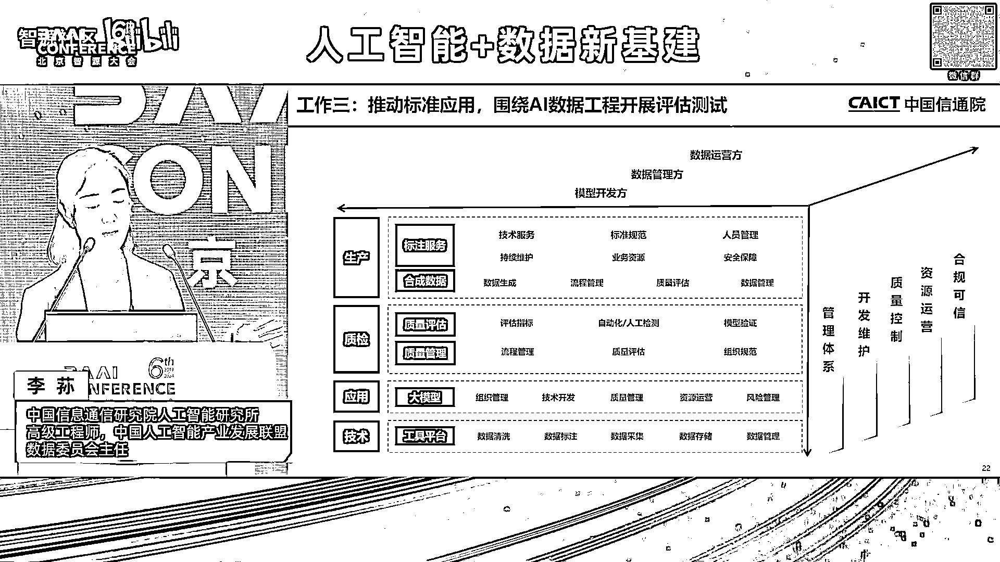

我们面向有数据的运营方，数据管理方以及模型的开发方，这是整个我们现在在做的数据及质量的一个标准，然后从原来的像ISO8000跟DQAM，我们去延伸到了11性，然后并且每一性也是结合模型的效果。

包括模型对于整个功能，逻辑 应用 稳定性的一些，我们去反馈回来对于数据，它有什么样的要求，有一级指标 有二级指标，以及对于整个我这个质量如何要去验证的话，里边会涉及到我们传统的整个规则的检测。

更多的是客观指标，然后以及人工抽样有主观的，然后更核心的是我们要通过这种模型效果，要实施去反馈，然后给它提出一些数据优化的策略以及建议，还有最后的话就是说，我们对于整个如何去做模型验证的话。

这个其实又是另外一个很大的话题了，然后去年我们也去发布了，整个方声大模型的一个基准测试体系，就如何去测的话。

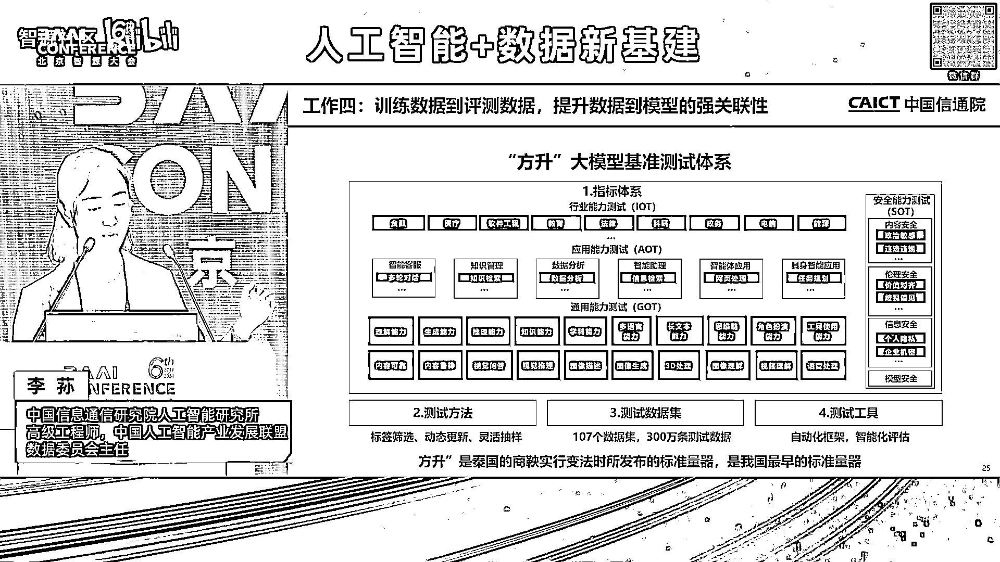

这里边有测试的指标测试方法，测数据集和测试的工具，测试的话我们认为整个大模型的测试，它其实是一个很复杂的一个工程化的，也不能它是现在是说原来的小模型的测试，它相对来说简单一点，但对于大模型的测试的话。

第一是它涉及到的任务类型有很多，然后而且的话它有很多种涌现思维链等等，它会涉及到不同的方面，所以我们未来的话，我们认为整个大模型的基准测试，其实跟数据一样，也是贯穿于大模型的全生命周期，从大模型的开发。

然后到大模型的选行，应用部署持续监测，其实都需要做一个基准测试的workflow，然后从测试需求，数据构建环境。

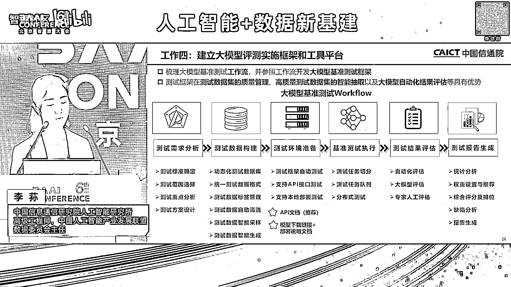

然后以及最后对于一个结果的这种分析，然后目前的话整个测试数据集的话，有将近300万个，然后这300万条，然后这里边的话就涉及到，本身17年其实信通院已经在开始，在做可信AI的整个人工智能的测试。

这里边有我们自有的数据集，然后有外采的 有开源的，然后同时我们也跟行业，很多包括金融 政务，然后又共建一些数据集，这就是我今天的汇报。

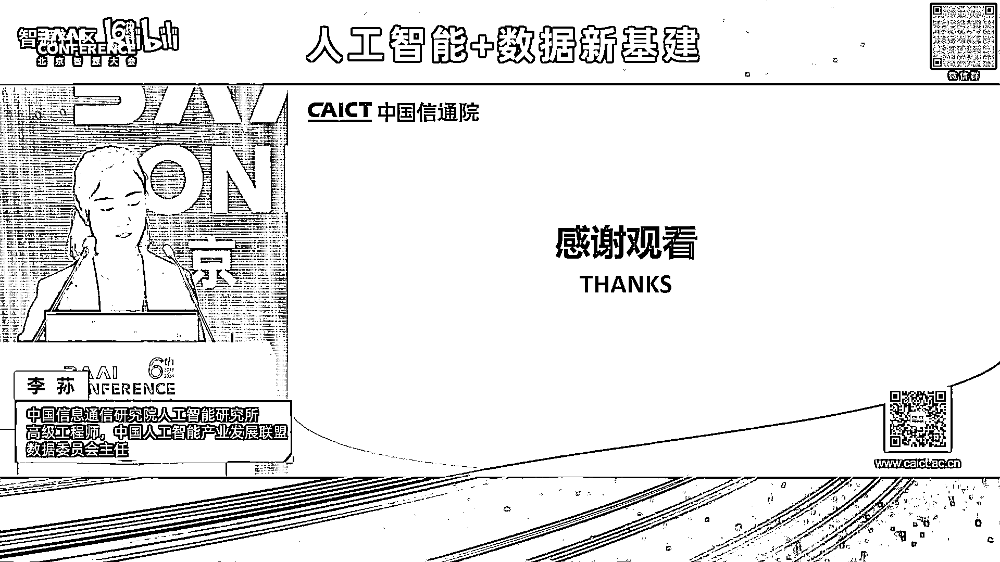

然后谢谢大家，謝謝大家，謝謝大家。