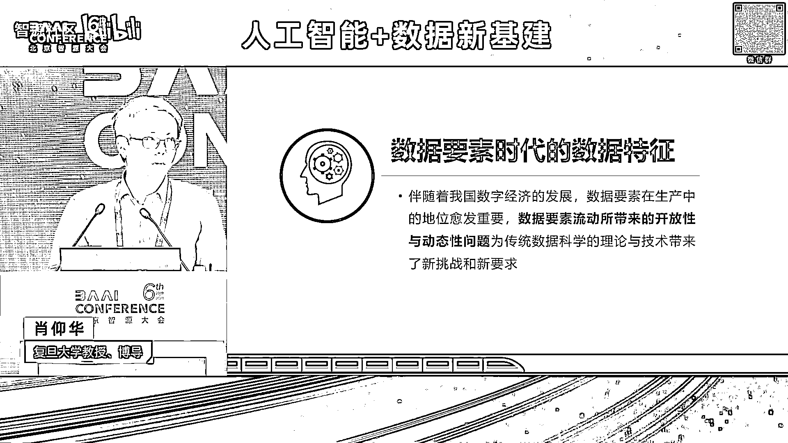
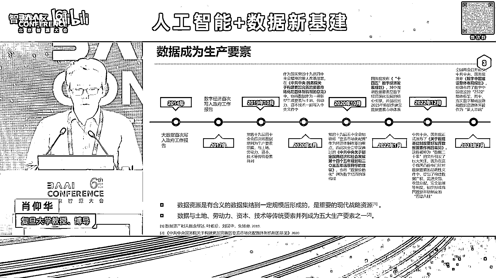
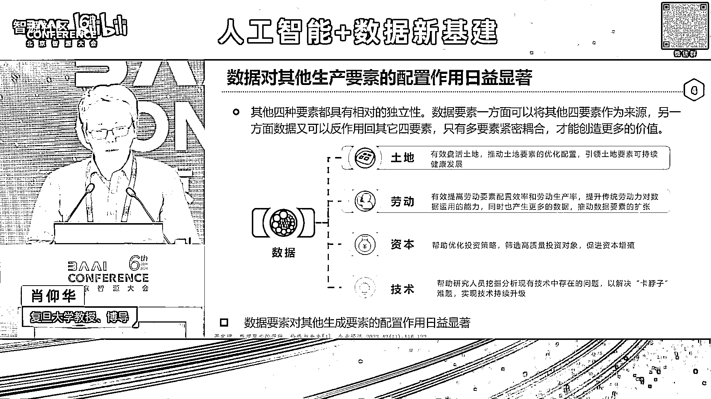

# 2024北京智源大会-人工智能+数据新基建 - P10：大模型助力数据要素价值变现-肖仰华 - 智源社区 - BV1qx4y14735

非常感谢冯老师邀请啊，让我有机会能够参加我们论坛，那么今天呢前面各位专家呢啊，谈了很多数据要素对于人工智能的重要意义啊，重要作用，那么我呢更多的反过来考虑这个问题。

那事实上呢我们的人工智能啊或者大模型啊，对于我们这个数据要素啊，它的意义呀更是重大啊，我的一个基本观点是说，数据要素的价值变现，将来需要一个大模型作为智能引擎，事实上我们今这么多年来都在做大数据。

都希望数据尽快价值变现，但是现实情况是，那我们的这个数据啊，啊这个价值变现，这个仍然这个路途还比较遥远啊，所以呢今天给大家带来这么一个报告，那么我们来看一下数据进入到数据要素，这个时代之后。

我们的数据呈现出哪些新的特征啊，我想啊表达一个观点就是数据要素啊，它实际上哦，时代呢数据呈现出前所未有的这种，开放性和动态性，这个恰恰是我们现当下所面临的一切问题的，关键所在。

我们都知道数据已经成为了啊生产要素，数据从战略性的资源变成了新型生产要素，而且数据啊日益的对其他几个生产要素，像土地啊，劳动啊，劳动力啊，资本和技术呢起到了越来啊越重要的啊，这样一个支配的一个作用。

那么最近几年啊，我们国家伴随着啊数字经济体量的逐步增长啊，整个数据要素的这个价值变现的这个需求啊，日益迫切，数据要素价值变现的进程啊逐步的这个加速啊，但是反观我们当下的一些理论和方法啊。

我们大家感受到了非常多的这个痛点哈和读点，从我们的数据开放开始啊，我们就啊簪头顾尾对吧，就心惊胆战啊，这个数据到底能不能开放，是否会触犯啊相关的法律法规的红线，到数据融合啊，我们更是做得焦头烂额。

没有哪一个企业在做数据融合，数据治理是很开心的一件事情啊，大部分数据治理都成为了企业最脏的一个，最脏活累活最集中的一个部门啊，数据治理成了很多企业所谓的成本中心，而没有变成他所谓的这种利润中心。

再到我们的数据的应用，我们大部分的这个数据应用，还是停留在简单的表层的统计分析啊，数据到底在告诉我们什么，它背后的洞察，数据之间的深层次的这种关联关系，我们仍然啊并不清晰。

所以整个数据要素价值变现链条上面，仍然存在着诸多的这种啊堵点和痛点啊，归其根本原因啊，是因为我们现在这个数据要素价值变现，主要还是靠我们的人力去做啊，我们数据越来越复杂啊，这个问题越来越多样。

我们的人力呢已经很难啊，完成整个的这个数据要素价值变现链条，所以数据要素的价值变现呢，仍然缺乏有效的手段，那么这有几个重要的原因，第一个很重要的原因是在于，我们这个世界越来越复杂。

我们现在在当下这个世界，可以说是一个人机物啊，这个多元融合的一个复杂系统啊，我们的人类社会系统，我们的人造系统啊，我们的自然生态系统都前所未有的复杂，事实上，整个人类社会早就经历了他这个工业时代的。

早期的这样一种纯真的婴童时代，而进入了我们现在信息时代乃至智能时代，这样一种成熟的时代，而成熟的代价就是复杂，我们现在任何一辆整车对吧，往往要几万个零部件，每个零部件又要经历一道上万个元器件组成的。

生产线啊，整个一个系统可以说是前所未有的在复杂，而系统世界的复杂带来的是什么，带来的是咱们的系统和数据的复杂，我们去看看我们制造业的这些系统，动辄上万张的表单啊，关联在一起，现在还有哪一个人类专家。

真的能够全盘的理解你企业的那些数据呢，几乎没有啊，再看看我们那些表单的，我们中国式的这种表头前所未有的复杂对吧，所有的人工大智能大模型，一看到这种表头全部要啊，都要fail掉。

所以这个系统和数据可以说是日益的复杂啊，所以这个是给我们的数据价值变现，带来第一个挑战，那么第二个挑战呢，在于是说我们数字经济时代啊，我们的数据的内涵发生了显著的变化，我们想想看我们在信息化时代。

数据是什么，是对我们的客观世界的一种符号化的记录，到了我们大数据时代，数据变成了一个资源，变成了我们发现规律，赖以啊使用的这种推动创新的资源，再到我们当下的数字经济时代，你会发现数据现在变成了生产要素。

变成了产品，变成了资产，随着数据的内涵发生了变化，数据啊日益呈现出新的特点，有些特点其实刚才各位专家也多多少少提到过，首先就是大家看我们数据要素是在持续流动的，我们的数据只有流入到生产分配。

流通服务和管理的各个环节，形成整个完整的数据驱动的闭环，我们才能够释放出数据要素的价值啊，我们此前我们的数据的管理，从来没有面临这样的挑战，而数据这样一种持续流动呢，对于我们这种全链条的自动化的。

智能化的，具备高度协同能力的数据处理技术啊，提供了前所未有的要求，我们的数据要素啊要在流动过程当中啊，会与很多个主体发生关系，这就会导致什么呢，我们的数据的这种权属的确定，安全的可供。

数据今天可能在生产者手里，明天可能在采集者手里面，后天可能在加工者手里面，再后天可能在使用者手里面，还有运营者手里面，不同的使用主体都对数据提出了不同的要求，那么这个时候数据权属如何确定呢。

如何安全可控呢，我们这个数据在运营和加工使用过程当中，日益面临着一个前所未有的开放的异构的，复杂多变的一种啊，数据产业的生态环境，数据产业的生态环境，可以说是一种开放的复杂环境，你不知道你这个数据。

将来会要跟哪一个数据库系统打交道，是跟哪一种类型的数据的系库系系统打交道，跟哪一种数据打交道都不知道，所以这就对什么呢，统一的标准化的互操作的这种数据管理技术，提出了要求啊。

我们的数据必须在一个动态的增值过程当中，才能够帮我们创造价值，数据的每一次啊，这种动态处理，比如说我们汇聚了可能就创造了一点价值，我们分析了就可能创造一些价值，我们把它质量提升了，可能又创造了价值。

我们把它关联融合了，可能又创造了价值，这样一种动态的处理过程，才能够促进我们的数据形成，这个持续的这个增值数据，才有可能真正变成资产，但是我们现在的这些方法有多少，我们的数据的管理和分析方法。

是面向这种动态增值过程去设计的呢，所以我们整个啊可以说，我们的整个数据的科学的理论和方法啊，远远啊不足以支撑当前数据要素的价值变现啊，我为什么呃，很多场合会提这一点啊。

我们国家最近几年的数据要素非常重视这种啊，加强制度的建设供给对吧，加强基础建设啊，事实上呢我们可能忽略了一点，我们也要加强技术供给，很多时候不是说企业不想去做数据变现，而是说企业没这个能力。

或尤其是考虑到巨大的成本投入之后，更是不愿意去做这种数据价值变现，指数据技术层面的这样一种，堵点和痛点的存在啊，数据技术的啊供给能力不足，其实也是当下数据制约，数据价值变现的一个重要问题。

所以啊我们要去找手段，那么什么样的技术手段啊，能够让我们又快又好的实现，数据要素价值变现呢，啊我想问题的最终答案可能就是我们当下啊，人工智能的最新进展就是大模型，事实上时代抛出一个问命题的时候。

往往也给了我们这个命题的答案，当我们进入了人工智能时代，当我们数据要素变得越来越困难的时候，哎我们当下正在发展的人工智能，给我们提供的这个大模型，却有可能是我们解决数据要素核心问题，的一个答案所在。

大模型可以说是从本质上来讲啊，它到底是什么啊，很多人不同的角度有不同的理解啊，我认为大模型本质上是利用了，人类已经积累的数据啊，习得了对于这个复杂世界的一种建模啊，比如说他从数据里面学到了啊。

苹果从树上掉下来是要落地的，而不是要飘到天空的，所以它本质上是从数据中学到了，我们人类对这个世界的认知，我们人是怎么认知这个世界的，我们人本质上是通过个体的经验和文明的传承，来建立对这个世界的认知。

而我们的机器是靠什么，我们机器是靠啊从数据中呢学习，尤其是自监督学习，来习得对这个数据的这个建模，或者说对这个世界的理解大模型，一旦理解了这个世界之后会怎么样啊，它的一个结果就是。

它一定会成为一个知识的容器，你会发现大模型从海量的语料里面，学到了我们人类的所有的学科知识啊，我们曾经做过评测对吧，你去把那考题拿过来去测，我们大模型啊，像g b t four，先进大模型。

都能够做到一个啊六七十分的这样一个成绩，但是我们人类呢，我们每个个体是很难，在每一个学科都取得如此的成绩，所以大模型啊提供了这海量的这个知识的容器，大模型更成为了人啊。

模拟人类认知能力的这样一种新的引擎，我们以前整个人工智能最害怕的，就是所谓的常识理解的问题啊，甚至常识理解都被视作是人工智能的，第一性问题，曾经被我们啊质疑了很多年，我们到底能不能做到。

但是今天我们再去看常识理解，基本上大模型是能够比较好的胜任，而且大模型不单单能够理解了，我们语言中的常识对吧，语言理解概念理解啊，运筹规划问题求解，知识反思，价值判断，组合泛化啊，评估评价等等。

很多我们人才具备的能力，现在大模型也具备了，所以大模型更成为了啊，一种认知能力的一种引擎啊，伴随着大模型越来越成为一个自制，智能体的一个大佬啊，他有可能成为啊智能体，让智能体真正意义上啊。

能够跟这个复杂世界进行自主的，自适应的交互啊，智能体的这种自制性和自主性，是有可能进一步实现的，所以大模型又进一步成为了啊，各种各样智能体的大佬，那么正因为大模型具备了世界的建模能力。

就又具备了刚才说的这些能力之后，它对于我们的数据要素带来的意义是什么呢，它带来了全面认知数据的能力，可以说大模型现在对于我们的数据的认知能力，不比我们普通人差，甚至不比我们专家差啊，我们去看一下大模型。

实际上它现在已经具备了很多概念理解，我们说数据库里面的数据对吧啊，首先要理解这种原数据叫schema对吧，schema里面要大量的是这种概念啊，比如说两个schema是能能否类比对吧。

那么现在大模型基本上能够理解这些，概念和概念之间的关系啊，如果我们把一张数据表格去问GB t four啊，问他这张数据里面有什么错误啊，这是我们人为构造的一个例子，那第一行是小明自身的数据。

第二行是他父亲，第三行是他的母亲，我们人为的植入了很多错误啊，比如说小明的父亲是张378年出生，小明是80年出生，你去问大模型，这些数据里面有什么错误，现在大模型基本上能够比我们人呐。

普通人都能够找的全找得准，这里面的数据中蕴含的错误，蕴含了哪些逻辑错误，所以大模型又进一步具备了啊，实例数据的理解能力，所以说大模型呢有可能是能够认知我们的数据，它不单单能够认知这个数据。

它更能够去自主去操控我们的数据，当下我们正在研发，很多企业都在研发所谓的叫数据agent对吧，数据库agent啊，数据管理agent，数据分析agent，我们今天去问很多大模型，比如说以表格形式啊。

对比上海和北京每年8月份的平均温度，那么这件事情，以前我们可能需要一个研究生对吧，去查找数据，去绘制表格，去调用这个统计下那个检验的啊，软件工具来形成检验结论对吧，相当这些有有很多步骤。

那么今天呢大模型有了强大的规划能力啊，之后呢啊工具使用能力之后呢，他就进一步的具备了这种自主操控数据的能力，那么大家想想看，有了认知能力，又有了操控能力，那怎么样。

我们啊原来人类社会是靠人类专家去理解数据，去操控数据，那么这些事情是不是可以交给机器了呢，所以大模型一定啊，将来会成为驱动，推动整个数据要素价值变现的一个重要引擎，将会成为激发这个数据价值的。

这个智能的新引擎，但是我们也要意识到大模型，而在推动数据要素价值变现过程当中，仍然面临着巨大的挑战，因为我们千行百业的这些数据啊啊，它是用来支撑各行业的复杂的决策的，严肃的应用。

那么这些应用不是以我们当下XGPT，这种闲聊啊就能够胜任的，我们作为一个行业专家，我们看到这个数据之后是要做决策的，这个时候我们需要什么，一个行业专家需要有丰富的知识领域知识。

需要有复杂的这种决策的逻辑，需要有对宏观态势的研判能力，比如说现在股市是熊市还是这个牛市，需要综合任务的这种拆解能力，还需要一些精密的规划能力啊，需要复杂约束的取舍能力。

比如说我们的医生在决定你的治疗方案的时候，要考虑很多约束，又要舍弃很多约束，还要有未知事物的预见能力对吧，这市场总是在不断的发生变化，还要有不确定场景推断能力，这些能力都是我们目前大模型再去支撑。

这个基于数据的决策过程当中啊，仍然缺失了很多能力，而且大模型本身它作为统计模型，仍然存在着幻觉现象，缺乏某领域的忠实度对吧，可控性，可理解，可解释，可编辑，这些性能呢仍然都存在着诸多问题。

还有就是成本问题，所以大模型在真正的这个推动数据要素，价值变现的过程当中啊，仍然可以说是啊面临着这个巨大的一些挑战，尤其是大模型对于我们私域数据，这种专业性和私有性的理解，仍然是这个存在着巨大的鸿沟啊。

我们这有很多行业数据，都有一些自己的编码规范，自己的编码标准对吧，大模型何以能够理解你的这种私有化的表达呢，我们的很多行业数据，都背后是有着非常复杂的专业知识支撑，比如说传感器的数据。

所以大模型何以能够理解这些数据呢，这些都需要啊，我们进一步提升大模型呢对于行业的理解能力，对于私域的理解能力，那么进一步呢我们会发现，大模型已然在很多数据要素，价值变现实践当中啊，发挥着重要的作用啊。

我们首先说大模型，为什么说数据要素的价值变现，一定将来要靠大模型啊，因为大模型啊，可以说是提供了一种端到端的价值变现路径，我们以前大家想想看，行业中我们要把数据这个价值发挥出来，要需要什么。

需要业务分析师去分析业务逻辑，需要数据工程数据标注，数据算法工程师去设计算法，用户来进行反馈验证是吧啊，可以说是又涨，这个这个代价是极大的，但是今天我们所有的数据。

都可以丢进大模型里面去炼制一个行业大模型，用行业大模型再通过一些插拔式的组件对吧，来提来发挥这个数据的价值，所以它本质上可以说是一种端到端的价值，不变现路径，这不就是我们行业甲方用户啊梦寐以求的吗。

把数据都扔给你，我就不管了对吧啊，付费就完了对吧，现在像我们现在呢还要重度的参与是吧啊，还要跟你去整天开会是吧，那么将来是不是可以避免这些工作，而且呢我们现在有很多异构的多模态数据。

你会发现现在大模型不管你什么样的数据，只要咱们能把它序列化成一个sequence of token，对吧，一个序列化的一个数据，咱们transform就能发挥作用啊，啊，或者就是用那个。

如果是一种那个带结构比较丰富的数据，我们可以用diffusion model对吧，也就是不管你是什么模态的数据，似乎只需要用transformer和这种啊diffusion。

我们就能够习得这个数据中所蕴含的知识啊，所以它实现了一种统一的价值变现路径，那么尤其对行业来讲，我们现在数据要素价值变现最大的一个堵点，就是数据治理代价大，我们现在为什么数据治理这个代价大。

主要是靠人对吧，我们说数据治理这个事，我觉得将来是一定要交给大模型，为什么，因为数据治理里面，我们主要是要解决数据中的很多问题和错误，是吧，而错误和问题恰恰是具有开放性的特征。

因为我们没有人能够预料用户会犯什么错误，没有人能够预料数据中存在，哪些非常不可能的错误，错误都是你意想不到的，我们曾经看到过一个真实数据啊，说在一个坐标他写错了啊，一个一个一个一个舰艇。

停在了沙漠中的一个坐标，这是不可能的事对吧，所以呢他这个很多错误你是根本就想不到的啊，所以呢正是因为错误有开放性，那么人是不可能预设所有的错误类型，但是大模型它有很强大的开放理解能力。

所以这些呢我们都可以交给大模型，我们实际上已经在做很多种实践，比如说啊大家知道啊，我给你告诉你一个位置信息啊，杨浦区什么中环路和某个路的交叉口，西北什么位置，这个是一个非常不规范的一个地址啊。

我们能不能利用大模型的这种理解能力，把它清洗成一个规范的数据呢啊像这样，现在利用大模型的文本理解能力和工具，使用能力，像这件事情基本上是能够做到，我们还可以用大模型去做很多，语料的清洗和治理啊。

就大模型本身训练语料的治理，但这里呢我要说一件事啊，就是大模型语料规模往往巨大，比如几个T对吧，这里怎么办呢，这个点成本就是个很大的问题啊，实际上我们现在在利用大模型去治理语料，的时候。

往往要做有选择的治理啊，往往把一些比较hard的case啊，困难的case啊交给大模型啊，简单的case呢还是用用大模型，增强了一些小模型来去解决，所以用大模型来去做这种语料的治理，数据治理啊。

成本问题是大家不可回避的一个因素啊，我们实际上还是在利用大模型，在做大量的这个知识验证啊，很多场合我们都还要做知识库的构建对吧，那么这个知识到底对不对呢，我们可以用大模型来验证。

我们还可以用大模型来做结构化的数据访问，对吧，我们现在关系数据库的表，我们都可以用自然语言去访问了啊，来释放数据的价值啊，我们现在很多的数据分析，在利用大模型驱动的agent来做自动的分析。

而而且这个成本呢有了一个极大的提高，现在已经有些初步的数据啊，我们还可以利用大模型去做这个，数据的智能运维啊，这数据库系统的智能运维，不再需要传统的专业语言才能够去做，那么这个现在都已经在很多啊。

系统里面都实现了啊，我们还有可以用大模型去啊，实现一种就是知识工程，我们传统做知识图谱对吧，要去构建schema，要去做知识抽取知识的验证对吧，知识的问答，我们现在完全可以利用大模型啊。

去蒸馏一些知识啊，再利用大模型呢来去用提示的方法来构造图谱，那我这里举个例子啊，叫我们以前要做教材的这种图谱化。

把教材里面知识全抽出来，这个本来是个代价极大的事，每本教材都要构建相应的模型，1万本教材你就要构建1万个模型，那么今天呢我们只需要用大模型，就可以把教材里面的这种实体关系的关联，关系啊全部自动化抽出来。

基本上可以从每本教材本来要十多个月的代价，现在只需要两三个人员，所以大模型来驱动整个知识工程，这个基本上啊可以极大的提升它的效率啊，我们也利用这个思路啊，利用大模型来驱动这个知识图谱构建。

我们也构建了一个数据要素的产业突破平台，实际上我们国家现在待会可能有个talk，缺情报的支持，这个情报呢就需要一个产业图谱，我们实际上在构建一个围绕数据要素产业，构建它的一个资源和生态的图谱。

把所有数商数据交易所数据啊，把它关联关系给建立起来，那么我们的目的是什么呢，目的将来，比如说我现在要研发某一个数据产品诶，哪一个公司有什么样的产品啊，哪一个哪一个产品在哪一个交易所挂牌啊，那么这些信息。

我们是不是都可以通过这张图谱来找到。

俺们是这样样，这张图谱将来会成为啊，推动数据要素产业发展的一个非常重要的一个，情报的支撑的一个来源啊，当然大模型还可以释放，我们千行百业的文档的价值，这个之前大家看到的很多，像最近那个啊一些大部分厂家。

像KIMI对吧，这些本质上都是在做这些事，但这里的路途也很遥远，仍然有很多工作要做啊，那么最后我想说啊，用一个简单的公式来总结啊，未来啊啊推动数据要素市场的一个重要方式。

或许是大模型加上数据要素在成千行百业，就是我们要注意要一方面把数据要素整理好，治理好，把数据集建好，另外一方面把数据用来练好一个大模型，然后再利用大模型啊的能力，再把我们的数据做得更好啊。

然后数据要素和大模型深度融合，协同发展，在我们千行应用啊，百页中的应用呢去反馈。

去验证，去迭代啊，好我的报告就到这里啊。