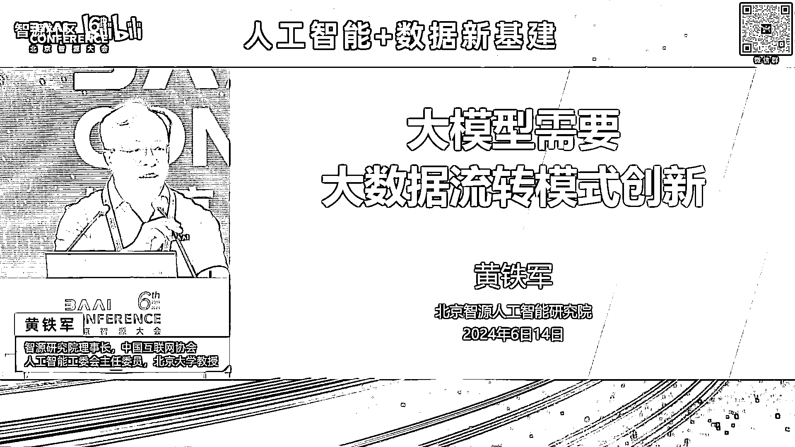
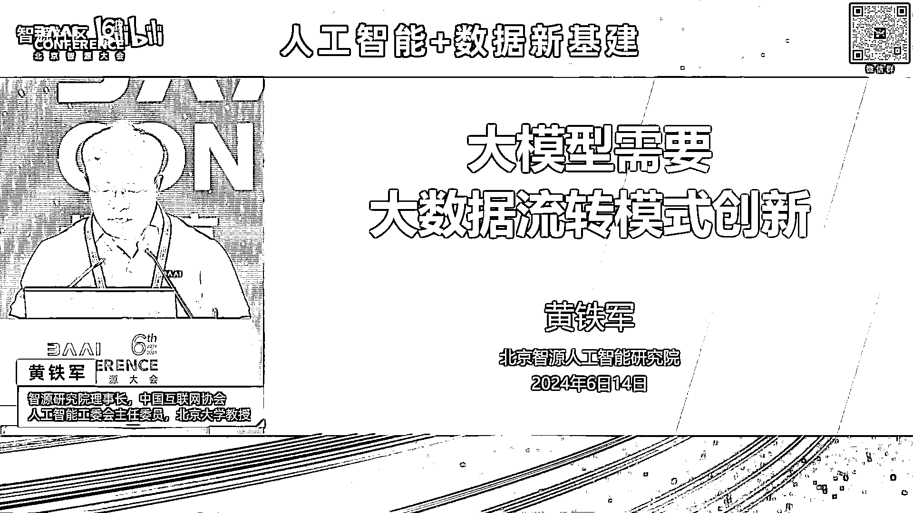

# 2024北京智源大会-人工智能+数据新基建 - P2：大模型需要大数据流转模式创新-黄铁军 - 智源社区 - BV1qx4y14735

尊敬的上部长夏局长啊，各位领导啊，各位专家呃，特别感谢啊，大家来这个出席今天这个志愿大会，我们嗯围绕人工智能，特别是数据呃的一一些这样的一个重大问题，来开展那个呃研讨，那我呢这个报告呢。

呃希望呢可能是从呃从事人工智能呃研究吧，这样的一个一个呃角度呢来呃谈一下看法。

因为今天呢后面我们还有几个呃很重要的报告，会很专业的角度来来来讲，我想呢就是汇报三个观点，或者说个人的这个一个一个思考，第一个呢就是智能，我们讲人工智能源头就是数据啊，这是呃，当然大家会经常会觉得。

你们搞研研究人工智能的算法呀，这个理论啊那些东西好像很核心，但是我想说呢，这个呃所有的智能，包括人的智能，归根结底源头就是数据，没有别的东西，没有别的东西，这是第一个，第二个呢数据加工数据标注。

今天数据是正在成为一个产业，靠谁靠人还是靠人工智能，我想说呢主要靠人工智能，不是不要人啊，人还要人，要还要发挥作用，但是大比例的应该是靠人工智能，这是第二个观点，第三个呢数据和智能的关系问题呃。

我我建议呢这个要要研究这个体制机制，这个流通模式，我们怎么看待数据这样的一个资产，让他怎么在这个人工智能这样的一个时代中，发挥更大的作用，更快的更好的发挥作用，呃我我觉着一个基本的思考呢。

就是你要想实现正反这么一个良，良性的正反馈的话，应该是先试用，先使用后付费，而不能呢当成一个一个物理资产去去去标价，上来就要花多少钱去买，大概这么三个观点来谈一下看法，时间有限呢。

有些地方呢可能不能太太展开，第一个呢就是智能的源头哦，是数据，这一点呢在人工智能发展的历史中呢，其实一开始呢并没有得到这个这样一个充分的，或者彻底的认识，所以早期的人工智能是人把自己想的太重要了。

我们简而言之呢，就是人来这个把这个智能过程变成算法，变成规则，后来呢把这个呃我们叫知识啊，实际上就是数据中的这些规律性的东西，这些这些条目由人来整理变成知识库，知识工程呃，这个相当于人嚼完了哎。

然后让机器执行呃以为这就是人工智能，但是这么去做，后后后来呢证明是这个，无法真正的解决智能问题的，所以呢从第三次浪，我们今天都讲人工智能进入第三次浪潮，第三次浪潮最大的革命就是从数据中学习。

当然这个思想已经，这个从上个世纪80年到现在，差不多已经快40年的历史，所以如果人工智能分成上半页，下半页的话，上半页是以人工为主，下半夜是从数据中学习为主，好已经开始重视数据了对吧，要要从数据中学习。

当然更广义的人工智能啊，如果展开谈那个更复杂对吧，或者那个技术路线，或者大家的这个这个idea更多呃，但是呢我今天有限，我就不展开说这个这些这些这些点，但是最重要的呢就是这么多年。

经过这个各种这个尝试呃，各种这个可以说是这个失败之后呃，才终于找到了这么一条一条可行的道路，就像我刚才说的，当初以为这个人思考，然后是人的思考形式化，然后让机器执行，以为这就能解决。

实际上那是个好像会思考，是解决不了死机器，真正的这个思考和智能问题的，那第二个路线，也就是今天咱们用的路线，就是要有一套神经，人工神经网络神经系统来进行对数据，对信息进行处理，然后才能产生这个智能嗯。

这从这个时候开始，我们才说呢，你看人工智能才算走上了一个，这个这个正确的道路，第三个行为主义也讲的很多啊，就是实际上就是在一个身体，今天讲具身智能对吧，就是智能不是天上掉下来的，智能是一个主体。

具体来说对于我们人，我们就人是主体，对于一个低等动物，对一个单细胞，甚至对于一个有机物来说，它都是一个主体，它要跟环境互动，所以这里边提到环境的概念，数据和环境是密不可分的。

数据是什么数据当然大家都低着头的，数字的数字的，它表示的是什么，它表示的是环境对吧，无论是传感器还是其他任何这个手段，你获取的其实都是关于这个事件的一些，一个一个是一个一个表达方式。

所以当我们看这些几十年的这个人工智能的发，展的，这个这些这些曲曲折折的这样的一些道路啊，这些呃通常说符号主义，刚才符号主义，连接主义，行为主义，这是我们经典的呃，通常说的这个三三大学派或者三个技术流派。

那么比较新的，过去十几年谈的多的深度学习，强化学习，还有类脑智能呃，这个类脑智能可能听起来比较新啊，其实一点都不新，它就是连接主义的一个彻底的方式，就是那个神经网络，就像人的这个呃生物的神经网络一样。

做一个这种这种呃神经网络，为什么要做那个神经网络，因为那样的我们大脑这样的神经网络具有，就就有这个强的智能现象，但是不论是深度学习，从数据中学还是强化学习，从环境中学，还是我刚才说的累脑。

你做就就你就把人脑做出来，完全照着人人脑的方式做一个光电的这个大脑，他也不是天生，就像我们人生生下来，这个就具备我们这些后天的能力的，那只是你有了这个学习的条件和潜力，你的能力，你的智能还得学对吧。

所以我们还要读书，还要学习，还要跟环境互动，还要这个逐逐渐的提高提高自己的智能水平，所以不管是什么方法，什么路线，归根结底智能是从环境中学，如果说的近一点，就是从数据中学，就像刚才说的。

数据是环境的一个一个一个表达，是实际上大家再思考一下智能这个东西啊，为什么地球上会出现智能，为什么智能会水平是这个水平越来越高，其实它不过是我刚才说的一个智能主体，你要适应这个环境。

你必须具备的一种能力，而适应这个环境其实就是对这个这个这个世界，这个环境是什么的，一个一个抽象的一个一一个表达，这是我们智能的这个基础，然后呢再通过神经网络啊什么方式去执行而已，所以呃结论啊。

所有的智能来自于数据，广义的讲就来自于环境，智能只不过是环境和数据的一个投射，一个凝练，一个一种一种一种一种高度的浓缩的一种表达，使得我们能够比较好的去适应这个环境，应对这个环境。

所以智能从来都不是都不是抽象的，地球这个环境就造就了我们地球的这种智能，这种这种智能的这个形态，如果是一个外星球的，它的智能肯定跟我们不一样，原因很简单，他要适应那个环境。

你地球上这一套适应地球环境的这个能力，你换一个完全不同的物理环境，你你你你你这没有办法去应对，那个那个那个那个那个条件的，所以什么样的环境造就什么样的，是什么样的智能，那今天我们比较现实的。

就是说我们要从数据中学，我们过去的这个呃56年时间啊，我经常说人工智能发展六七十年，但是最大的革命就是过去的56年，具体来说就是就是大模型，大模型呢当然是一个神经网络，它是一个很多参数的神经网络。

但是这个大模型中的智能，就在那个神经网络的连接上，就是神经网络的这个这个连接的强度，那个那个强度是怎么训练出来的，但是从大数据中训练出来的呃，怎么训，其实呢你如果给的是一个随机数啊。

就是如果是海量的数据，全是没有规律的，是一个随机的数，你训不出智能来，因为你给的数据有规律，所以它最后的这个参数它才有才有有了规律，就像我刚才说的这些参数，不过是你你你为的数据的一个一个投射而已。

那这规律怎么学呃，其实大模型的学这个学法，从2013年开始的这种呃，这个我们说计算机表达数据关系的，这种磁向量技术给了一个解决方案，就是学数据的关系，那数据我们今天叫token对吧，一个一个的单元。

学这个单元与单元之间的关系而已，所以transformer这样的一个神经网络是什么，那就是学这个，咱们说对吧，你输喂入这个余料，那我那我那我就要研究这个一个一个的词，和其他词之间的关系。

你能你能把词与词之间的关系学到，你就学到了这个这个数据背后的规律，那这件事呢说的有点这个拗口啊，大家说真的能做到这一点吗，其实呢我我想这个时间有限啊，我不能花大太多时间去解释，但是我想有一句话。

大家我相信大家都有学过马克思说的啊，马克思说人是一切社会社会关系的总和，什么叫一个人，怎么定义一个人是和你和他人之间的关系，所确定下来的对吧，在家庭在工作，在生活中，在这个社会上。

在专业你都有很多人有有有关联，包括今天咱们一起参加这个会，我们之间就有了这个关系，嗯我呢我在这跟大家这个交流，就是定义我这个人的，一个一个一个一个一个方面啊，当然我还跟其他人交流对吧，我还有我还有家庭。

定义了我是谁，所以一个个体，它的含义是由它跟其他个体之间的关系定义的，这是马克思的这个这个这个讲的，那刚才说大模型去学，从海量的语料学，其实学的也是一样，一个token就是一个个体一个单元。

这个单元在大量的这个语料里边，跟其他单元出现对吧，前后它有有关系，你只要能把那个这个关系充分的学，然后映射为这个这个大模型的那个参数，神经连接，那就学到了这个它的它的含义。

所以今天大贸行我们说说我说结论啊，今天当美是真的理解了语言，以及其他模态背后的含义的，而且可以说比人理解的还要精准，因为它是仔仔细细的这么算算出来的，算出来的，而且用一个高维的这个向量来表示呃。

实际上我就解释到这个地方啊，所以这个人工智能没有什么神秘的，人工智能的这个能力全在来自于数据，而且呢我们刚刚才讲过去556年的时间，人类找到了一个办法，用一个大型的神经网络的参数，这个大量的参数来表达。

刚才说的这样的，这个隐含在海量数据背后的这个规律，所以这就是经常说的skin law，规模定律，一直说什么意思呢，就是数据很大，所以你我们需要一个很大的网络，这个网络的规模的扩大。

和刚才说的数据量的增加，当然需要计算的那个那个次数的增加，所以算力也需要很大，它就会它就能越来越多的，越来越越丰富的把那个语义呢给给给抽取出来，他得到语意之后，他就表现出了这些越来越丰富的能力。

就像我们人学多了对吧，我们学了唐诗300首，我们就开始会会会，大概会写个写个像样的诗对吧，我们学了那么多这个知识，然后我们慢慢的这个就自己就有了很多，很多的这个创新和想法，大模型其实也是一样的。

所以大模型的这种这种从海量的数据中学出来，产生的，今天就像变魔法一样的，大家看到的这些能力，其实就是一个自然规律的一个体现，这些能力不是这我们这些搞人工智能研究的人，设计出来的，不是我们聪明。

我们不聪明，我们用的就是刚才说大家用的都是这个这么，一个一个一个很容易理解的这么一个方法，聪明智能都在数据里边，这个办法只不过把那个数据里边，那个东西转换成了一个一个神经网络。

而这个转换过程是计算是机器自己在执行的，他能表现出什么能力，没人知道，设计师不知道，训的时候，也不知道他会出现什么能力，但是那规模到了那种程度，规模越来越大，它就会产生越来越强的能力。

而且我们相信这个还没看到天花板，规模还会继续更增，大数据随着数据的更变得越来越大，这个能力就越来越强，这个这是人类我们说遇到了一次技术革命，这次革命呃，可能跟历史上这个最伟大的这个革命。

经常说像指南针的发明，飞机的发明相提并论，我们找到了一条从数据中提炼智能的道路，而且还看不到尽头，这个智能是可能这个不断的涌现，甚至将来涌现出这个超过人类的智能，所以这是就是今天人工智能的这个一个一个。

一个基本的一个一个一个现象啊，但所以我也可以说运气很好，搞人工智能的人本身不聪明诶，但是赶上了这么一个一个机会，一个一个时代，然后把把这件事呢就这个做的越来越好，这是第一个观点啊。

第二个观点呢是数据加工，因为刚才说源头是数据，这个数据呢还是要做些处理的，你不能一股脑的这个就塞进去就就就完了，因为如果你的数据有错误，那好了，那那那肯定后边的这个这个模型也就跟着，就就错了对吧。

所以我们我们是这个教育都都教科书，教科书不能随便这个出出版对吧，一定是要仔细的核查，确保里面不出现错误呃，不能说绝对不出现错误，但是但是我们是尽可能的这个呃，确保它的正确训练，人工智能其实也是一样的。

如果你那里边有有很多这个错误的地方，那至少你的这后边训练的那个代价会很多，就像小孩，你给他一个错误的价值观，你想纠正过来，那那那你可能用十倍的百倍的代价，你你都纠正不过来，因为他他一定认为那是对的啦。

但实际上它是错的对吧，你你你想去纠正那个就太难了，所以高质量的数据为就事实本身，就数据本身不要犯错，它本身不要存在错误，可以说这个基础条件。

但是这么多数据靠人类去去处理，去加工，其实代价很高的，今天我们说不要标注了，不像以前对吧，还要打标签，还要画框呃，不要了，哎我们直接拿着这个这个语言啊，各种数据都可以训，但是这还是要做清洗，还是要做。

刚才说确认它是正这个正确这个正确广义的啊，我想就是首先大家可能很难理解什么叫做，你这个这个你不做，你不知道里边有多有多乱啊，比如说你你你弄一个PDF文件，简单的转成文本，你看吧，那里边有很多这个空格。

或者是那个那个一串奇怪的符号，你那玩意要直接喂进去，那好了，那人工智能看到的就是这些，含了这么多乱的东西，它它一定会出出出出错误的，所以在过去的这个56年时间呢，志愿研究院我因为我们做的这个呃比较早。

因为成立那一年呢，就是open n i g p T1这个出现的那一年，所以我们呃做了很多模型啊，但是我们都是开源开放的模型。

所以在这个这个这个过程中呢，一方面在模型方面取得了一些一些一些成果，同时呢在数据的处理方面，也积累了比较丰富的经验，因为像刚才说你要训一个好的模型，前提，你得把这个高质量的数据给给给给给准备出来。

这个准备数据的过程一开始可能相对简单，但是随着这个模型的这个这个水平的提高，其实对人的要求，对这个数据处理者，这个者的这个要求呢也逐渐的提高，一开始可能就刚才说把数据中那些噪音去掉啊。

保证一些格式的问题，可能大家就认为就行了，但实际上后来对吧，就开始要要要要要选择了，你比如网页，那不是随便抓了，网页就就直接就喂进去就就好，因为有很多网页都是些车轱辘，话里边也没有什么价值含量。

和真正有含量的相比，那肯定是这个这个这个内容意义上，这个语义上，专业上它有价值的东西，所以呢对对标注我们叫它标注式或者数据处理，这个工作工作人员的要求呢也越来越高。

这个高质量或者高质量的数据质量怎么定义啊，对吧，然后这里边当然还有价值观，还有安全啊，这样的一一些问题，所以实际上看着现在说我们要自监督学习，不需要那个人类标注了。

但实际上仍然是需要刚才说很多很多加工的，但是靠人类这个成本呃，这个还有管理，还有标准的问题，还有人员的这个能力对吧，你一个人啥都会，这个也也很难对吧，其实是压力越来越大，所以呢我们就探探索。

用人工智能来这个代替一部分，这个人类数据处理处理能力，呃，目前呢已经这个呃我们叫agent对吧，今天大模型大模型agent的形式出现，这个每个agent就是一个角色，就代替某某某类某类工种嘛。

咱们就说数据处理中的工种，已经越来越多的在替代了人类的这个数据工作，人员的这个这个工作呃，应该可以，我就说应该可以啊，有些还这个还没还没有那么准确，但差不多啊，我们可以估计啊。

用A证的替代90%以上的人工是可以的，不会百分之百，因为有些比如价值观的问题，可能我们还要人来核对，但是大部分大家一般想象中的那些数据，数据的处理的工作都可以被人类呃，都可以被agent AI所所替代。

但是他就说你用数据训练一个agent，又用这个agent去去去检查数据，你这不是一个一个死循环吗，这个行不行啊，这是个迭代发展的过程，用今天的agent处理今天的数据，训练出更高水平的agent。

再去进一步处理，它是一个不断循环循环的过程，所以不是一个死循环，本来就是这么一个一个不断的这个渐进式的，迭代式的，往往往往前往前进的，所以我想呢一个基本的观点啊，就是agent主导的智能数据产线。

才是今天，这个也也一定是未来的，这个数据加工的一个主要的形态，呃，在这方面呢呃那个我们已经有了一定的实践，而且也取得了不错的这个这个这个呃成效，最近呢我们听说啊，就是我们也听一个。

有跟一些咱们一些地方的那个接触呃，咱们国家的这个数据标注基地已经七个城市，已经成这个呃呃得到了这个牌照啊，所以我们也愿意呢，把我们过去的56年时间在做大模型的训练，数据所这个形成的一些经验。

最后变成了这样的，我们叫它数据产线好了，这样的一个一个一个成果呢，呃愿意支持各基地的发展对吧，大家不是招一帮人，然后就开始标数据，不是这样的，你再有先进的生产线，跟我们以前造产品。

也是这个其他的物理产品也是一样的，产线先进了，同你的人工的消费呢就会就会是小很多，或者说一一当十对吧，就刚才说90%的工作呢，让让让让AI去干，然后这个人做一些必要必要的工作，这是第二个。

第三个呢就关于数据，刚才讲和智能的关系问题，如何实现这个正反馈，像刚才说的，我们得有数据才能训练出智能，好的智能能够帮助这个数据的加工，提这提高数据的质量，训练要训训练出更好的大模型，更好的智能。

这两个东西如果能正循环起来，正反馈，那这个事情会加速，会这个对对，我们国家这个人工智能大模型的发展，具有战略战略价值，但是呢今天啊至少我们遇遇到遇到的问题，第一个障碍就是钱。

数据集现在有越来越多的这个这个机构，那个开始做数据，但是呢大家把数据当成了一个物理资产，我就不点名了啊，我们国家很有名的一个大媒体，央媒，我可以这么说，做了一个数据，然后问我说你们要不要数据。

说要啊数据越多越好，高质量的意思，我们做了一个数据集，500万，要这么去训练，你看我们这是个我们是一个非营利机构，我不是说我们没有钱，政府也很支持我们，社会也很支持我们。

但是这个模型还没有任何盈利的时候，我现在先先花出几千万，几个亿，先去把数据买回来，然后这个模型训训完之后，到底这个怎么样，还不知道，那这事儿没没有办法做，我相信很多大模型公司也是咬着牙也得买对吧。

有些属于你不买这个工作就就没法开展，就没法这个竞争，但是呢这么做这个产业是没有办法，这个刚才说正循环起来的，所以这一关一定是要这个，要要要把它这个解决掉，所以前一段呢。

然后当时我就我就提出这么一个问题啊，我的想法呢呃很简单啊，要构建一个人工智能大模型的生态，首先要把数据流通问题解决解解决了，我们不能把物理资产的那种管理方式，直接简单的搬到数据资产，数据数据集上去。

数据是一个数字形态的，这个产品它是可以多次使用的，你拿来给我用，我训模型没成功，他就没发，最终没发挥作用，你这时候先给我收500万，这这这个从从从这个，咱们说交易上也也也不合理，而且我用你这一次并没有。

并没有真的说你这东西就给我就没了对吧，不是啊，它不是个物理的东西，用多次都没都没问题，所以让我们这些机构，包括让企业去用，本身并没有什么损失，这种情况下呢，我我觉着呢咱们这个这个这个问题呢。

应该反过来思考，应该先使用后收益，这样的一个原则来制定数据制度啊，这是我们从这个一线的这个，这个这个单位的一个一个想法，第一呢数据一定要确权对吧，是谁加工的，谁做的这个这个这是要这是要做的。

这是要管的对吧，不能，这是这是一个一个最最基本的一个，一个一个条件，在确定数据确权的情况下，我要用你的数据，我一定要确认我不能偷着用，那不行对吧，你有什么数据，咱们比如有管理，有有标签，有有有这个标识。

我用了什么数据，我一定会清楚的说，我这个模型训练用了多少多少多少，数据集都是谁的，这时候你别给我收钱，请大家不要收钱，你让我我还不一定训练成功呢对吧，你这个你让我安心的，大家都去做，都都去训练。

如果我这个模型没有商业收益，或者说我就是个商品，但是但是我根本都没挣到钱，还赔了，公司都亏了，后边一帮数据公司给我要债对吧，那把我一下子就本来可能还活过来，现在一下子打死了。

所以所以这时候大家不要再收费了，因为他都没挣钱，他只不过用了一下对吧，他自己也也没也也没也没带来什么好处，所以这种情况下呢就不要再去追责了，但是如果确实取得了商业收益，而且生意公司做的越来越好。

这模型用的越来越多，我我收益了，按比例该该用了谁的，刚才不是说用了谁的数据吗，你你你你就像那个按一定的比例，当然我说的很简单啊，这背后确权费率监管，这里边有一系列的复杂的问题需要去去解决。

但是我觉得基本模式上，我们的数据制度呢可能是这种形式呢，更有利于这个这个呃发展呃，这个事呢因为我不是专业做数据的啊，我后来跟那个黄刚老师啊，我们北都是北大的，这个他是做大数据的。

他说你说这事对我来说很轻松，我有办法，所以他等会会讲他怎么来解决这个问题，就是不是说想法，而是说他有一套这个现成的软件平台呃，已基本上应该说已经可以解决这个问题了，所以如果是这样。

如果数据和智能能正循环了，正反馈了那个速度就是数据飞轮建起来之后，那就会那就真正我们讲智能时代真的是可期了，将来的这个智能，我们这是我们二零嗯，21年这个这个发布舞蹈2。0大模型的时候。

当时讲的这个PPT啊，就是数据和算力是生产要素，就像今天发电一样的，发电背后有大量的挖煤的对吧，有这个风力的，有水有水水水电站对吧，各种其实都差不多，就相当于今天的数据数据产业。

所以背后是一个庞大的产业，因为这些数据的24×7的数据的处，理和供应，保证了这个大模型，实时的这个了解世界的这个变化，和各各方面的信息训练出的模型，以这个智力服务的方式，像电一样的给我们千家万户。

给这个给企业去去用，这个时代才才算这个到到到到来了，这样的一个设施就叫智力基础设施，就像今天的电力基础设施一样，那我刚才也讲了，电力技术是背后是大量的以能源的这个这个呃。

电力的这个生产为为为为为目标的这个呃，各种各种煤啊，各种电能源的这个是这个呃转换数据，转换成智能，跟电力时代没转换成电是一样的，这个呃产业，所以它是个庞大的产业，但是要理顺这个关系。

不能这个煤矿先上来说，先给我交很多钱，我这电还没发出来，然后还没卖出去，那这个这个生意呢就就就死了，所以最后一句啊，我想我们讲了很多很多很多的，这个过去的几十年啊，讲了很多很多的话计算啊，数字化。

信息化，网络化，虚拟化，信息基础设施，网络基础设施，算力基础设施，其实我觉着呢大概都指向一个方向，就是智能化建设国家治理基础设施，而数据基，基础设施呢是治理基础设施的一个前提。

否则的话治理学就是空空中多隔，那建好之后，我们就进入了一个时代，这个时代我们叫它智力时代，就像电力时代一样的，一个一个用电驱动整个经济社会发展，将来是以治理这个驱动的是整个社会发展，也叫置业时代。

就像工业时代一样的，它把我们从这个繁重的劳动中，体力劳动中解放出来呃，用机器的治理来替代很多人的治理，来进入一个全新的历史的新时期。

好我就汇报这些。