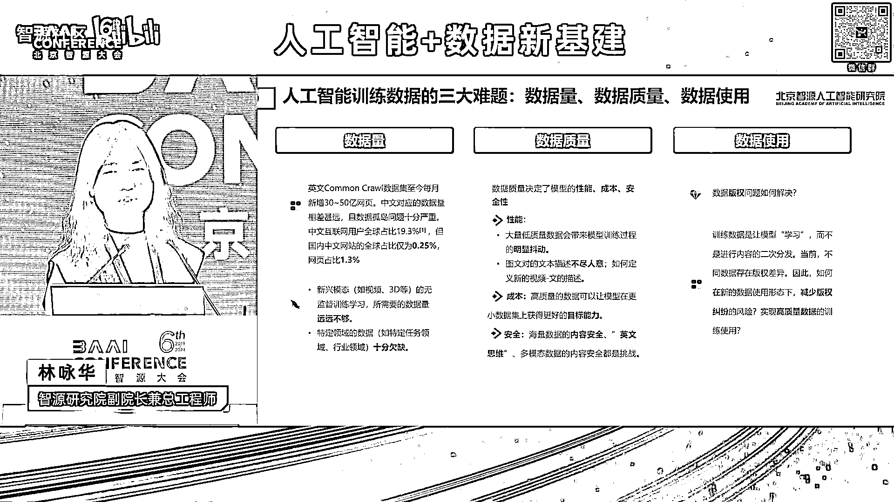
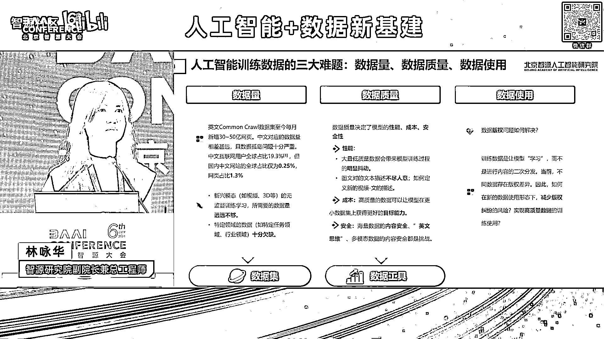
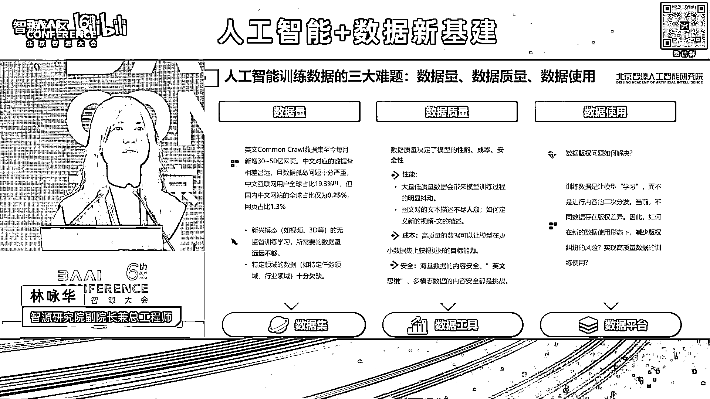

# 2024北京智源大会-人工智能+数据新基建 - P3：介绍“北京人工智能数据运营平台”-林咏华- - 智源社区 - BV1qx4y14735

呃大家好呃，感谢各位嘉宾，那很荣幸，今天在这里头给大家介绍，这个北京人工智能数据运营平台，首先我还是想稍微介绍一下它的一个重要性，那呃我们在过去十几年做人工智能，其实我觉得这三个数据集是尤为重要。

在2022007年，image ne开始筹建，那2012111年发布，如果没有当初的image net，其实并不会那么快出现alex net resnet，这些影响了我们后面所有计算机视觉。

深度学习的这些模型出现，那又如果没有在2007年就已经开始构建的，这个全球最大的网页的数据集，common CORE也不会出现我们这么快迭代的语言模型，也如果没有在2021年启动的。

这个line的这个数据集，这也是一个国外的数据集，这个是有几10亿图文对的，也不会有过去这几年出现的clip，这种跨模态的图文模型，也不会有到现在这么蓬勃发展的多模态，所以正因为有这个全球其实是在国外。

这些呃来自非盈利，都是非营利机构的这些长期的积累啊，如果没有他们，的确，我们很难想象，在过去十几年这么快的人工智能的迭代，尤其是到了现在大模型的迭代，那但是这个这些有这些数据集够吗，远远不够。

所以在这里头，首先我也想给大家分享一下，在我们做这个人工智能数据，尤其是训练数据，我们会面临的三大难题，数据量，数据质量，数据使用，首先数据量虽然come on call数据集啊。

每个月有几10亿的新增的网页，但咱们看回来，咱们中文，咱们中文的互联网用户，全球占比接近20%，但是咱们国内的中文网站的传球价占比，十分的低，这图当然还有一个重要的问题是数据孤岛问题。

咱们可以想象今天大家每天用的APP里头，我们看的新闻是不很多，都在例如像微信抖音这些APP里头，所以这里头就存在很多的数据孤岛问题，另外还有就是多模态，在这个新兴的模态里头，到了我们的视频数据。

未来的3D数据这些就更加少，那再落入到行业数据，这就是又是十分欠缺，那另外数据质量也是很多的问题，我就不再赘述，还有一个很重要的数据使用，我们离不开的一个问题，总是会讨论的是数据版权问题，数据安全问题。

所以摆在我们前面的这三大问题，我们希望不断的去探索，我们必须要去做一些事情，不能等这些问题都解决了，我们才启动我们人工智能大模型的发展是吧，所以这也是为什么，我们智源研究院在过去的几年一直在积累。

来探探讨，那我们通过，首先我们通过大量的去汇聚这些数据集，试图帮助整个产业来积累这个数据量，我们希望打造更多更好的数据处理工具，来帮助大家来提升这个数据质量，尤其很重要的是。

为什么我们要发布这个数据平台，就是进一步来帮助大家去解决，这些数据使用的问题，所以今天等会要发布的这个人工智能，数据运营平台，它是涵盖了平台数据集和工具这些重要的部分。

首先这个北京人工智能数据运营平台呃，北京市科委，海淀区政府，还有中国网络空间安全协会共同推动下，由智源研究院和金融数产共同建设，为什么我们需要这么多的这个呃相关的部门哈，国家级包括北京市部门推动。

的确数据这个问题很重要，也很难，所以必须要借助很多的社会力量，来去共同去推动和解决，那我们在这个数据平台上面呃。

有三种的使用方式，首先是开源开放，我们呃会有一批的数据集是完全啊。

不需要任何条件可以，大家可以下载使用，这一块很重要，这是我们视为一个社会责任，也是推动科研创新很重要的，第二个对于一些有高质量的数据，我们可能我们会构建这个合作共享，也就是在一个联盟的范围内。

大家去共同构建这样一个数据池，大家贡献多少。

它可以换回多少，这样一种合作共享的创新的方式。

来鼓励更多的企业加进来，去互换这种高质量的数据，最后我们还是会有相当多的是版权数据，相当高质量，高价值的数据是不能够被带出来去使用，毕竟我们今天从版权法的角度，还没能完全解决这个问题。

所以我们也打造了数算一体，这样的一种使用方式，也就说我们的数据存在一个安全域类，它的加工和模型的训练，都不出这个安全域模型呃，团队在通过这个安全预期进行呃，数据的加工和训练之后，带走的是模型。

数据不带走，这样子进一步的要保障这个数据的一个安全，所以基于这样三种方式，我们整个平台支持了多种的模态，包括文本图像视频等等，也打造了全流程的数据处理工具，前面黄老师一直提到，我们希望用AI的方式。

来解决这个数据标注的问题。

这是我们的一个目标的方向，然后另外还有一个很重要章是说，为了支撑数算一体，我们把数据和算力打通深度融合，那前面是平台，后面是数据，我们现在在今天发布的这个平台上面啊，已经聚集了两大板块的数据。

一个是适合于用来做通用模型训练的，通用数据集，已经积累超过了700TB的通用数据集，放到了这个平台上，此外我们也愈加发现，看到行业垂类的数据很重要，所以我们也打造了行业的专业板块。

来放置这样行业的垂类数据集嗯，那这些数据也是基于过去这么多年，资源的一个资积累，以及刚才谈到的相关部门，以及咱们在全国超过30家合作企业，贡献的所有数据，我们也会以开源开放合作。

共享数算一体三种方式来提供给大家使用，那进一步呃，今天也随着这个平台的发布，也进一步介绍一下，我们有两个很重要的发布的数据集，一个是今天早上在主论坛提及的，全球最大的多行业中英文双语数据集。

这个数据集涵盖了18个行业呃，分为开分为开源数据和非开源，也就是可以向我们定向申请这个数据，那总共有4。3TB呃，还包括医疗以及教育两个行业，它的微调数据和这个呃，人类反馈的这种对齐数据。

那大家可以看右边右下角这个图，这个图上面那个橙色的bar是指，我们在某一个行业，我们的这个数据集量，蓝色的是目前全球已经开源的，在这个行业里头的数据集，大家可以看到我们在几乎所有的数据集上面。

都远超现在全球已经开展的所有的，在这个行业的数据集的总和，所以我们说这个数据集的推出，势必帮助大幅提升全球各个行业，开源数据集的总量，那为了证明这个数据集的有效性，我们也针对医疗行业进行了一次实验。

我们在我们的基础模型上面，把这个数据及医疗行业，其中18行业头医疗行业的数据进行一个，首先是预训练呃，持续预训练，然后提取它的SFT数据，然后再做LHF的训练，做完整一个这样一个流程之后。

我们可以把一个普通的基础模型，在医疗行业的一些评测上提升20%，所以这意味着是说所所有的行业企业，您都可以使用这样子的数据集，重复我们这样一套流程，去获得您的行业模型的提升，并且我们这样一套做法也会呃。

就在这两天在阿凯放上面会放出来。

那另外一个今天也是发布的很重要的数据集，是千万级的这个指令微调数据集啊，那大家向来知道在去年大模型起来很多开源，但是众多的开源里头，没有哪一家厂商把自己真实的这个，SFT数据集开源出来。

所以几乎所有的大模型企业，它要针对一个基础模型进行SFT训练的时候，不得不重构自己的SFT数据集，因为大家都视为这个是他自己的秘密武器，所以这一次智远也是，我们重塑了整一个SFT这样，指令微调的数据集。

并且进行了呃我们的模型验证，那目前呢，呃我们是已经完成了300万条的数据集，其实我们整个千万条的数据集已经准备好了，但是我们是属是处于逐步验证，我们要在多个基础模型上。

通过这样的数据集来验证它的一个效果，真正能达到提升整个性能质量的，我们才敢放出来，那目前我们已经完成了300万条的这个呃验证，然后已经放出来，大家可以在这个开源网址去下载。

那这个这个这个效果大家可以看哈，橙色的是我们的，我们是用那个MIRTB这样一个模型，去做一个指令微调，它出来的效果比la的拉玛三的8B的insurance的，以及后续后面的这些，包括3。5。

包括GERMANY都要好，所以和大家可以期待把这个数据集拿回去下载，用于您的这个下游的这个chat模型的指令微调，那当然这样的数据及建设，也是基于我们很多的技术的加工哈，包括多标签的数据分析。

要保证多种能力的一个分分布，高质量的数据筛选，还有数据合成等等，在这人因为时间关系我就不详细说，那最后刚才提到了工具，工具是我们很重要的提升数据质量的的的武器，我们这次也是把我们智源研究院在过去几年。

一直迭代的工具进行了一个完全的升级，通过同样的工具我们去处理这些数据，所以今天这个flight data这个工具集啊，也是升级到了3。0，大家可以在这个开源网址进行下载使用。

最后呃大家如果有看今天上午的king呃，那个主论坛啊，open AI的RAMESH，他提了这句话，呃我我我挺喜欢这句话，虽然不是百分百认同，他说道说，与其我们固定住数据集，而不去攀登这种。

我们的目标函数和模型架构的话，现在他认为应该是固定住目标函数和模型架构，不断在数据集的高峰上进行攀登，那其实这个也是印证了大家的一个，行业共识和产业共识，数据包括数据的质量，包括数据的认知。

对模型的性能和它未来的智能，起到至关重要的一个因素，坦白说大模型领域数据是一个很深的研究，我们我指的是我们整个产业，包括学术界对于数据的问题，还是初步的一个研究，我们所有的力量还是刚刚起步啊。

所以我们也呼吁希望有更多的力量，无论是数据汇聚还是数据研究，可以投入到这里来。