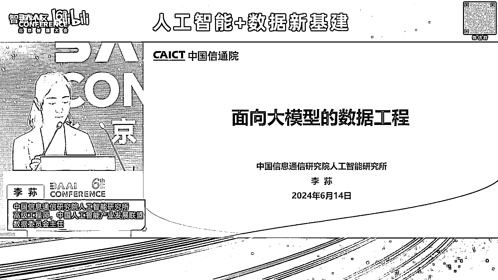
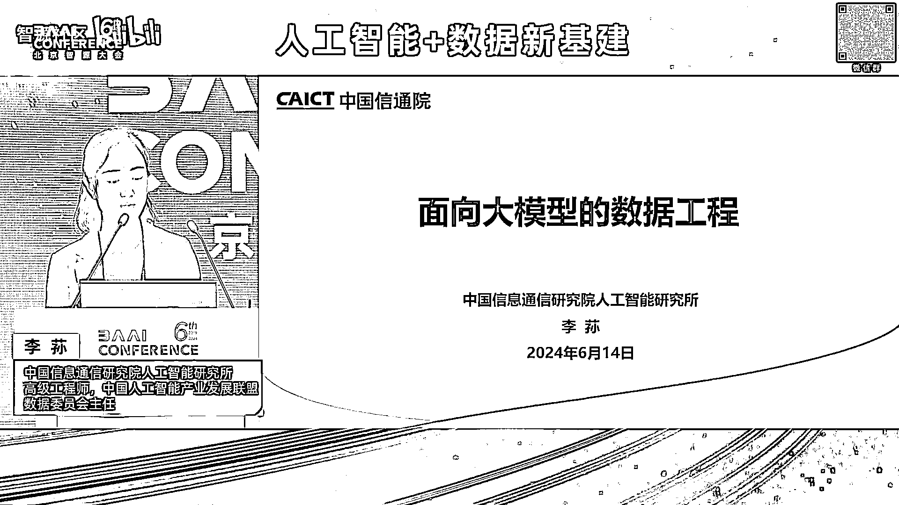
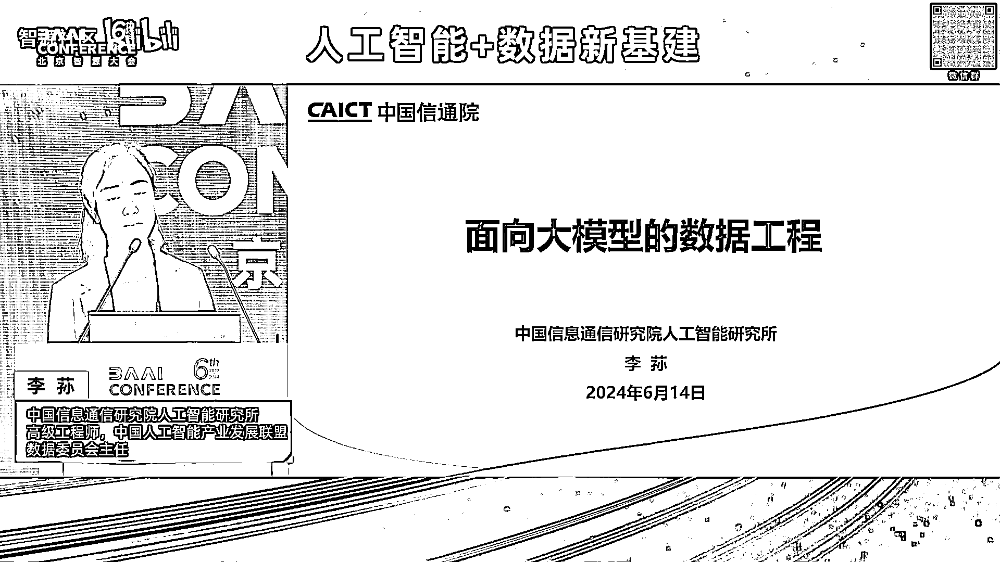
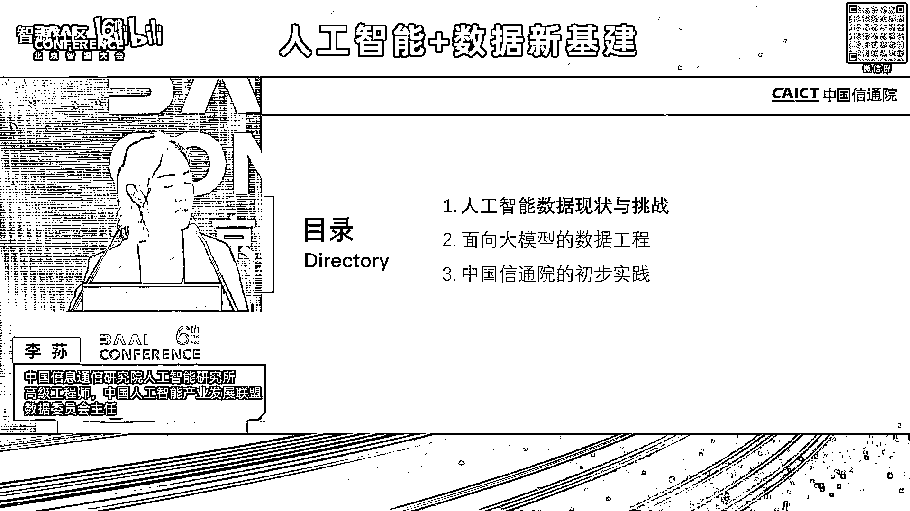
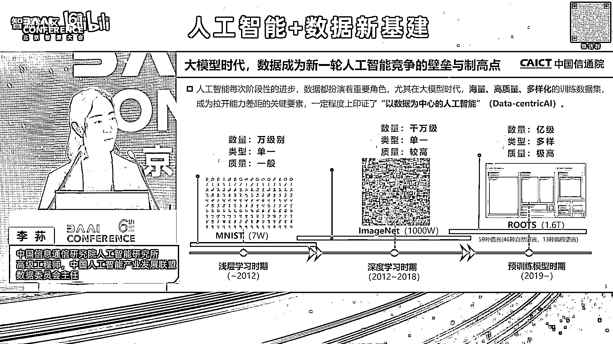
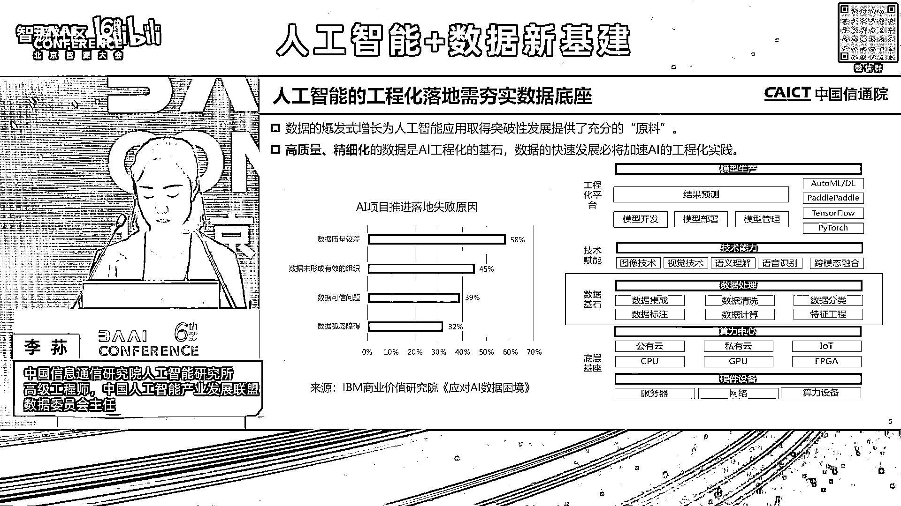
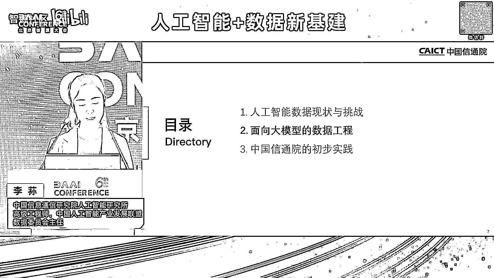
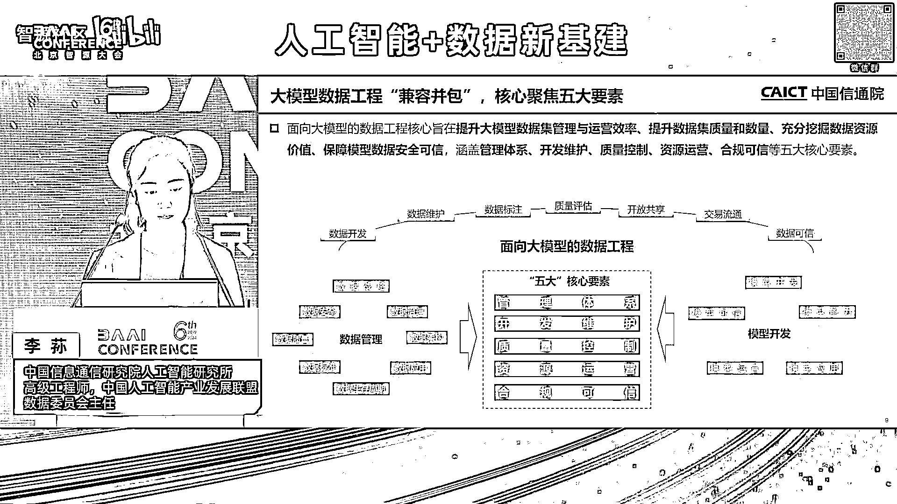

# 2024北京智源大会-人工智能+数据新基建 - P7：面向大模型的数据工程-李荪 - 智源社区 - BV1qx4y14735

各位专家大家下午好，我是来自于中国信息通信研究院，人工智能研究所的李孙，然后今天呢下午给大家去分享的主题呢，是面向于大模型的数据工程呃，其实这个题的话，其实对于中国信息通信研研究院来说的话。

我们可能主要承担两个职责，一个是叫国家高端专业智库，然后另外一个是创呃产业创新发展平台，所以的话其实我们做的研究，更多的是我们集宏观，然后再结合产业的微观，然后做一些中观的研究。

也就是说我们去更多的支撑政府，把顶层的一些规划，我们去结合产业实际的情况，然后找寻一些落地的方法和路径，然后明确的一个发展的方向。

然后今天的分享的话，主要我会先去介绍一下，人工智能现在数据的一个现状和挑战，然后还有就是我们面向于大模型的话，如何去做数据的工程，然后为大模型更好的去，更高效地提供这种高质量的数据集。

然后最后去介绍一下。

就现在我们在这方面的一些研究的进展啊，呃我们首先来看的话，其实随着整个人工智能的发展的话，它其实每一阶段呃，现在我们看人工智能的三驾马车叫算法算力，然后包括我们的数据，然后现在的算法的话。

到大模型时期的话，它整个的呃能力体系，包括刚才其实有很多专家有介绍到，他，不管他对于这种理解的能力，推理的能力其实是完全是有了一个呃质的飞跃，然后而且的话我们是按照算力来说的话，现在算力的话。

其实国家也在提这个算力一体化，然后为我们整个人工智能整个算力的基础设施，其实也提供了很好的保障，但是我们现在看到数据来说的话，呃其实随着人工智能的发展路径的话，现在数据的他的要求是完全是发生了一个。

很直接的变化，首先来说的话，就对于大模型来说，它要求的是很非常大规模的这种数据，同时的话它类型也是多样化的，尤其是现在我们是就多模态的数据，它也要进行这种信息的对齐。

然后这跟其其实我们叫上一代的人工智能，完全是不一样的，就上一代的人工智能的话，其实我们更多的是叫这种单点的孤立的，就原来我们叫就叫呃，我们专门去研究NLP，然后研究CV，然后研究语音。

然后我们针对于小模型的话，单独为它去构建数据，所以在那个时候的话，其实大家对于数据的认识，或者说对于它的重要程度，好像还没有呃那么的敏感，那现在为什么现在对于大模型时代，它的这个我们对数据关注度这么高。

是因为它现在的质量要求是极高的，这个我们去换算一下，因为现在对于大模型训练的话，尤其是在预训练的阶段，他投入的成本是非常高的，这里边就涉及到我的算力的成本，涉及到人力的成本，还有一些时间的成本。

那这里边如果我的数据质量不高的话，它我中间我会比如出现宕机，然后我要进行版本的追溯，那这里边其实很大的程度都是跟数据有关系的，然后而且的话其实我们从呃就大家可以看到，就21年和22年大概是在这个周期。

就是世界上一些人工智能的顶尖的学者，也在提这个data centric AI，就是我们上一代叫以模型为中心的人工智能，然后慢慢的话其实未来的话呃，现在模型为中心可能到达一个瓶颈。

未来我们人工智能的重点的发力方向是什么，其实核心就是数据，其实现在尤其大模型来了，也就印证了这个观点，这个我们来看的话，就是说呃这个特别像第二次工业革命，这个我们第二次工业革命的核心。

其实是先有了发动机，然后又有了汽车，那我们汽车想要在路上跑的时候，其实我们要有高质量的汽油，那这个汽油的话，我们从石油怎么历练成汽油，然后包括这个汽油的运输，然后以及我们加油站的建设。

其实就特别像我们现在人工智能整个模型，我们要去快速的奔跑，那整个我们这个能源，然后以及这个就我们叫数据，可以换算成这个汽油啊，就是这个汽油的整个全产业链条，怎么去保证未来人工智能可以快速去发展。

和应用落地，其实呃咱们国家就一直在推动，整个包括像数据要素，包括人工智能的整个发展的话，其实大家去梳，我们去梳理了整个呃一些相关的一些政策，大家可以看到，其实里边的话已经不断的在提出来。

就对于人工智能来说，要不断的去提供整个高质量，数据要素的整个供给，然后包括一些先行先试的一些数据的制度，然后包括的标准，然后包括我们整个数据的供给，和一些市场的交易，以及相对应的资源建设。

然后在今年的5月份的话，然后提出来建设国家级的数据标注基地，就数据标注其实对于人工来认，人工智能来说是非常关键的，因为它呃其实更多的加入了人类的知识，然后尤其是现在我们大模型，要去跟行业去结合的时候。

然后它是需要很多这种专家的知识，那未来的话整个数据标注，我们认为它其实是一个很核心的环节，一方面它可以更好的把我们整个呃，原有的数据加工承重高质量的数据集，然后更好的去释放这个数据价值的要素的释放。

然后同时的话也为人工智能，源源的去源源不断的去提供这个，高质量的数据集，然后这个的话其实数据标注基的建设，其实这里边的话也提到了，就是六个方面的一些重点的任务，就是它里边不仅是数据本身。

它是从整个权威度来看，这个这就涉及到有技术的创新，产业的赋能，生态培育标准应用人才，就业和数据安全，所以说未来的整个数据标注，包括呃为人工智能数据高质量的发展的话，它从整个机制体制。

包括我们的顶层规划来说，都已经有了很全面的一个考虑，然后人工智能的整个工程化落地，其实是这两年我们一直重点在关注的一个方向，就是我们叫人工智能逐渐从实验室走向了产业，那工程化落地。

那这里边工程化落地它就会涉及到方方面面，然后包括有这个硬件，包括算力，其实数据也是很核心的一个环节，它是直接去链接我们底层的整个人工智能，包括算力，基础设施跟我们场景应用很关键的一个环节。

因为对于数据来说，数据就是其实刚才很多专家有提到，就数据是本身是我叫模型应用方拥有的，但是呢呃这个我技术提供方，我本身是没有这些数据的，但是我怎么去融合融合这个中间的这个鸿沟。

那这里边其实呃我们跟很多这个就相关的，这个就是产业的用户方和技术提供方，有交流过啊，大家经常会陷到一个问题里边，就是说您有什么样的数据，和你要什么样的数据的一个问题，那这个鸿沟到底怎么去解决。

其实现在目前就对于人工智能工程化落地，是一个非常呃关键的一个问题，这个也就是应对了，今天我重点跟大家去分享的就是，我们将面向于大模型的，数据工程的这么一个话题。

然后在我们的大模型呃，现在时代到来的话，其实大家其实看到就是刚才有介绍到，就整个我们叫呃数据的整个发展历程，它其实对于整个数据的数量跟质量，其实都要求非常高，我们叫双量。

就现在看到主流的大模型的token数，其实是非常大的，但是的话，现在目前我们可以用于模型训练的数据，其实对于它的质量来说，是没有一个统一的评价的标准，然后这样就导致我们在训练模型。

包括在它的工程化落地过程当中，需需要投入很多的时间来进行数据的处理，然后同时的话整个大模型的整个训练过程当中，包括应用落地过程当中，它是会涉及到很多环节的，而且每一个环节它对于数据的要求也是不一样。

那这里边我们就就必须得有一个很高效的，很自动化的一个数据工程的概念，这里边就会涉及到我不同类型的不同阶段，我对于整个数据需求我要怎么去管理，怎么去制作它，其实应该是有一套统一的方法论。

同时的话我要增加这个效率，因为现在是大规模的这种数据，我如果是只是靠人工标注，那这里边它效率是非常低的，所以说现在其实我们有看到很多，这个智能化的标注技术有产生，然后同时也会用这个呃大模型来标注数据。

还有的话就是呃，以以前我们叫上一代的模型去部署完了以后，其实不会涉及到它的更新迭代，但是大模型的话它是一个持续学习的过程，就像我们一个呃人在我们的就是叫呃，我们从那个就是从小学初中高中。

他其实是要不停的不停的去学习的，所以要不停的给他去喂数据，那这样的话我们就需要一个数据的更新的机制，所以这里边就包括它的整个效率，包括它的整个自动化的高效的流程，然后包括它里边的一些机制。

是对于整个数据工程师才是一个完善的呃，很体系化的内容呃，然后再有的话就对于整个全流程，就刚才我们说到，其实我们数据对于现在的大模型，它不是一次性的，它是随着时间，然后随着全流程。

是不断的在跟模型来进行交互的，那这里边的话就涉及到要可信的，全流程的数据的治理，那这里边的安全，包括我们的整个数据治理体系如何去设计，也是一个非常关键的问题。

然后我们再来看的话，就是我们去看整个大模型训练的一个周期啊，就我们从整个预训练的大模型到微调，到形成一个通用的大模型，到我们行业应用落地的行业大模型，我们去每个阶段去拆分出来，大家其实也可以看到。

这里边会涉及到预训练的数据集，有微调的数据集，包括提示工程，然后以及人类强化学习反馈一些偏好的数据，指令的数据，还有一些行业知识的数据，那这里边的话针对于不同的数据，其实我有相应的数据处理的方法。

以及数据训练的策略，然后最一开始的话包括预训练数据的话，我们会从这个是比较传统的，像数据的获取过滤清洗，但是它是大规模的，所以我很关键的，最后最后要有一个数据质量的评估，可能原来对于小模型来说。

质量评估它并不是那么关键，但现在质量评估是直接可以去呃，直接影响整个模型训练的成本，包括模型训练效果的，那然后在整个全流程过程当中的话又会呃，因为最一开始是呃无监督的，后面到自监督的话。

我还会有数据的标注，然后以及我在不停的在优化的过程当中，我还要做一些提示的工程，然后这里边我就要引入一些这种呃，我们叫交叉复合性，很专业性的这人才进行专家的标注，然后以及这个的话就我们认认为这个呃。

就数据跟模型之间的效果，它其实是相互呼应的，所以在每某就是每一个阶段，我怎么去制定数据的策略，它其实是需要一套测试的体系的，我通过测试模型的效果，知道它需要什么样的数据，它还缺什么样的数据。

他应该学什么样的数据，所以我们通过，但是这个测试的话，就又会涉及到我们原来叫二八的理论，就是我们要去构建一些评测的数据集，所以大家可以纵看这就是全看这个图啊，图里边就看到。

就这个模型跟数据它是相生相息的，是完全是密不可分的，所以我们认为整个大模型的数据工程的话，一定是贯穿于整个大模型的全生命周期，然后再来看就是呃我们叫嗯就是相生相息的话，它其实就是个兼容并包的过程。

那我们这里边去看到，整个面向于大模型的数据工程的话，它核心的我们梳理出来五大的核心要素，就包括了有管理的体系，开发维护，质量控制，资源运营和合规可信，那我这五大要素是怎么总结出来的。

就是一方面我们要去融合已有的数据，管理的成熟度评估模型，这里边的话就会涉及到整个八大要素，然后以及像模型开发过程当中，像模呃就是模型开发的过程当中，从开发到模型的能力，应用运营可信。

它有会也有会自己对模数据的一些要求，那我们把已有的现在大数据领域的，数据管理的成熟度评估模型，和我们现在模型开发过程当中，对数据的要求来进行一个融合，其实就是现在我们面向于大模型的数据工程。

那这里边的核心的话，就是对于整个大模型数据工程，其实我们更多的是要提高整个呃，就是对于整个数据的供给，或者它的管理的运营的效率，以及提升它的整个呃我们叫高质量的数据。

就是它质量可以来进行进一步的提升和优化。

然后以及保障它相应的安全，那我们分开来看的话，就第一个先看这个管理体系，就我们针对于大模型的数据管理体系的话，就是呃我们对于这个数据管理，大家应该很多专家都很熟悉啦。

就是数据它其实有一套非常完整的管理体系，那针对于我们大模型或者人工智能的数据，我们要怎么去管理呢，这里边我们核心可能更多宏观的我们就不谈了，我们更谈的更谈的是更多是偏落地的。

这里边就会涉及到这个项目管理，那我们针对于大模型数据，根据刚才说到那个呃就互相融合，互相交叉的话，大模型的数据工程，我的全全周期里边我的数据的资源的分配，然后以及我整个数据，不管我是形成这个呃。

就形成数据集或者是数据训练的策略，然后里边它的整个机制，然后以及进度如何去控制，然后它的质量如何去保证，以及它的一些风险风险的管理的问题，然后可以我针对于大模型，不管它是要这种预训练的数据微调的数据。

还是呃这个就是偏好数据提示工程的数据，我都可以按照模型的训练周期，按时按点保质保量的给它进行交付，然后同时的话成本可控，那这里边就会涉及到，我里边肯定要有一个核心的项目，管理的这么一个职责。

然后第二的话就是组织建设，那组织建设的话，其实我们知道就是呃大部分企业来说的话，它一般是会有一个大数据的团队，然后有一个人工智能的团队呃，现在我们跟很多这个包括大型的企企业，包括现在做大模型开发的。

一些互联网的头部的企业，也都交流过，大家在组织建设这块，目前可能还不是完全的统一，但大部分来说的话，现在这个团队可能还是在大模型的团队，或者在人工智能的团队为主，但这里边它其实会有一个核心的问题是说。

其实这部分的话它更多，它没办法完全去了解，整个数据资源和整个数据供给的体系，和一些机制的建设，因为它只是融在了整个大模型团队里边的，一个职能团队，那这里边我要去进行这个全流程的一些。

数据的管理和一些机制，包括现在想嗯嗯包括这个项目管理的话，它其实这一个团队是完全没办法去支撑的，所以说这里边的话，就是针对于整个大模型的数据工程的话，怎么把两个团队来进行进。

进行一个有效的融合和一个高效的协同的话，这里边其实是我们需要呃甚就是完全去探讨，然后也要结合企业实际落地的情况，来进行一些呃调整，然后还有的话就是标准应用，然后针对于就是大模，就针对于大数据领域。

其实我们是会有很多标准嗯，包括现在我们也成立了那个国家数据，也成立了树标委，其实把我们之前很多这个标准，然后未来也要推推向整个应用落地，然后人工智能呢其实我们这么多年来推，其实也有。

但针对于人工智能的数据方面的标准，其实呃我们后边具体片子我我会有介绍，就我们在这块也在做一些相应的工作在推进，但是的确这块更可供我们去参考，包括嗯能实际去应用，落地的标准相对来说是比较少的。

尤其现在我们在推这个就是呃国家也在推，地方也在，就是跟产业也在，一直在说这个高质量的数据集，那这个高质量数据到底到底怎么去定义，我怎么去建一个高质量的数据集，然后这个数据集的话。

如何跟伟大模型去进行融合，这里边其实会涉及到很多这个标准化的问题，呃这里边你看就像到这，像这个数据我如何去加工处理，然后以及大模型的数据开发，它的质量其实等等的话，现在其实我们是需要去建立一些操作规范。

以供这个不管是技术的，就是呃数据的提供方还是模型的开发方，还是这个呃就是产品的应用方，它其实都需要这个来自己作为一个参考，嗯然后最后的话就是说这个人才的管理，就我们知道就是刚才针对于整个呃。

我们这个叫跨学科，跨专业，跨领域，这个怎么去理解呢，就是我们现在既懂数据又懂模型的人才，相对来说是比较少的，比如说呃就是我们大数据领域的人才有很多，然后对于模型开发，对算法懂得也很多，但原来我们叫。

就是叫数据科学家和这个算法工程师，但是这个的话其实如何对二者做一个结合，其实目前来说，这未来的人才其实要往这个方向去发展，然后同时的话，现在我们整个呃呃就是大模型，在应用落地过程当中。

他需要这种多学科的这种知识的背景，然后你要懂模型，同时也懂模型要学什么样的知识，那这里边的话包括像医学金融，其实很多这个呃这种有有多学科交叉的人才，其实在我们整个人工智能数据构建的时候，是非常缺乏的。

嗯开发维护的话，第二个开发维护，其实更核心的是关注于整个全生命周期的，一些技术的要点，然后这里边关键环节其实呃就会涉及到，其实最大的整个数据的处理量，还是在最一开始预训练阶段，从整个数据的采集的汇聚。

然后这里边其实更多的是针对于，无监督的这种数据，然后它数据来源就包括有通视行业就等等很多，这个呃就是还有合成数据呃，这个其实我们去年也做了一个大模型，数据的资源地图这么一个研究的工作，其实也是在研究。

现在就是目前大模型用到的数据都是从哪来的，然后同时的话这里边我如何去采集呢，然后有手工的，有自动化的，然后也有一些合成的数据，然后数据的预处理就是我首先拿到数据，我怎么去呃。

把这个数据形成一个模型可以用的，那它就会涉及到预处理和标注两个环节，预处理更核心的，它其实是去做整个数据的整个清洗，增强转换调度去读等等，脱敏，就是它其实是达到一个可用的这么一个效果。

就是我要去保证模型它不出偏差，所以我要达到可用的效果的话，我要先去做数据的预处理，然后如果说模型好用的话，那它其实要通过数据的标注，这也就是说刚才说到，我们需需要需要这个多学科。

多背景的这种人才来进行标注，那这里边的话数据标注的话呃，它也是会涉及到不同的大模型，不同的阶段，这里边目前来说我们整个数据标注的产业的话，就是因为现在我们也在做这方面的研究，然后包括跟地方。

包括跟很多这个数据标注的企业也在对，就目前我们整个呃数据标注产业来说的，它的不管是人员的结构，还是整个服务技术能力的水平，相对来说还是比较处于起步的阶段，那未来的话。

整个我们怎么把整个数据标注的产业的能力，可以进行这种产业化的升级，为我们整个人工智能提供这种更优质的。

更高质量的数据集，其实也是现在就刚才有说到，我们国家数据在推这个国家级数据标注基地，很核心的一个目标，然后再说到这个，就是针对于大模型的不同的阶段啊，刚才说到这种预训练的阶段。

它其实不同的阶段对数据的需求是不一样的，然后像预训练的话，他就规模大，然后但是他需要我去呃，就是大家其实可以去反馈啊，就是反向来看，就是不同的阶段需要什么样的数据，其实是说我这个模型要达到什么样的效果。

在预训练阶段的话，我需要大规模的数据，然后这数据要有更多的覆盖性，要有更多的多样化，它其实更多的是一个基座大模型，然后同时在指令微调阶段的话，它的规模相对来说比较小。

但是的话它就要有明确的指令跟明确的方向，包括有明确的内容，那这里边的话我们就会涉及到这种有监督的呃，这种处理的方式，然后同时的话还有反馈对齐的阶段，就是你通过人不停的在给告诉模型。

你到底呃就是他通过这个数据标注，然后告诉模型你哪个地方需要能力提升，哪个地方需要去优化，它是通过跟人的交互来快速迭代，来进行这种模型的更新，呃刚才说到这个高质量的数据集，就高质量数据集。

我们还不能说只看这个数据本身这个质量，我们再去看这个人工智能数据的高质量的话，它核心的话我们要从三个维度去看啊，首先是说这个数据的质量，就是会涉及到这个数据的指标，就大家知道这个就是国标有DQAM的。

国标的六型，就针对于大模型数据质量，我们是呃，现在已经有一个国标是明确的，在指导这个数据质量，但是对于整个人工智能的数据质量的话，它其实是要有根据模型的质量来反馈，我需要什么样的数据。

所以这里边的话我们也梳理出来，11个核心的维度，这个后边具体再跟大家去介绍，然后指标完了以后，就是说我这个指标如何去落地，其实我是需要有一套评估的方法和评估的工具，这里边其实有规则的，有人工的。

然后可能我还要再加一些模型效果的验证，然后以及针对于全流程的一些质量的控制，那这里边其实我会呃，呃有一些质量的监测的手段，就是刚才有说到，我要通过不停的对模型来进行反馈。

包括刚才说到那个人类强化学习反馈，其实也是这个概念，就是我要通过不同的跟模型来进行交互，我要实时的去调整整个数据的策略，然后以及数据的如何去，就是将模型的效果跟数据质量，要形成一个强映射的关系。

第四方面的话就说到这个资产运营啊，就是呃我们形成一个高质量的数据，就是人工智能数据集，它虽然是用于模型去训练的，但是我在模拟训练之前，它其实核心还是一个数据产品，那它既然是一个数据产品。

它就还是有数据本身的属性，我需要对我这个数据集也可以去进行交易，然后也可以进行资产入表，所以说这里边我对于这个数据集的资源的话，也要进行相应的运营和相应的管理，那这里边的话整个运营我会涉及到哪些部分。

就商，首先的话，我对我的数据集要进行一个资源目录的管理，然后同时的话对它要进行分级分类，同时我的数据集还会涉及到对外的开放共享，和对内的一些流通呃，就是开放共享，就开放共享的话。

会涉及到对外的开放共享和对内的呃，就包括呃他就是上下级的公司和部门部门之间，那这里边的话我开放的内容要求协议，其实我都要定义的非常清楚，然后要结合整个人工智能训练的需求跟模型，效果的。

就是模型的呃要求来定，然后同时的话这个流通交易的话，包括现在我们和呃，像北京上海，贵阳，就很多这个数据交易所，其实也有很紧密的联系跟交流，就现在各个数据交易所其实都有上架呃，语料库的数据集。

包括人工智能数据的专区就可以看到，其实刚才肖教授有介绍到，就未来的话，整个人工智能是撬动数据价值以及数据流通，很关键的一个要素，嗯那现在的话其实大家可以看到嗯，有很多这个就我们认识的这个叫呃数据数商啊。

数商很多就是数据标注服务商，他们原来都是给人工智能企业，去提供一些数据产品，然后同时的话，现在很多大模型企业也会去数据交易所，去找这些数据，那就可以看得出来，未来的话整个人工智能数据集。

它还是有很大的一个市场的空间，呃然后最后就说到整个大模型的一个，就是数据工程的一个合规可信的问题，呃，因为这个我们也是就是所有的片子，跟大家分享的都是一个反向的一个思路啊。

就是这个其实在我们的就国家发布的那个，深城市人工智能管理办法里边，我们也去细细的去分析过，里边有18次有提到数据的问题，然后里边它包括就是有提到，要保证整个数据的真实可信，然后以及数据的可追溯。

就其实可以看得出来，就相当于是我们把模型比成一个人，如果他学的内容有问题，他最后输出的内容一定输出的呃，一定是有问题的，所以说我们按照整个呃模型治理，包括对人工智能安全的一些要求，去反推过来的话。

这里会包括整个对数据的一些安全性的要求，包括从整个数据的公平性，它的非歧视性以及数据的可解释性，同时的话我们的数据安全也要去结合，我们大数据领域现在对安全的一些要求，包括它的隐私的安全。

然后它的整个审计，它的监控，它的安全合规，所以说我们在看整个人工智能数据集啊，它是两个领域的一个融合，就我们既要去呃，完全去遵守大数据领域，已有的一些标准和已有一些规定制度，包括政策的要求。

同时的话要结合人工智能领域，对于模型效果的一些要求，要把二者做一个充分的融合和结合，最后就给大家简单介绍一下，就目前就是中国信通院，在做的一些相关的研究的工作。

首先我们就是去年9月份的话，就在中国人工智能产业发展联盟呃，这个联盟的话是也给大家介绍一下，然后目前这个联盟的话会员有将近900多家，就是基本上覆盖到了我们整个人工智能，从技术提供方到技术应用方的。

很多的产学研的相应的机构，然后9月份的话我们也正式成立了数据委员会，其实核心就是聚焦整个为人工智能领域，如何去提供这个呃高质量的数据集，同一些标准啊，场景呃，场景的这种探索。

然后包括技术的攻关和一些公共的服务嗯，然后从去年开始，我们也办了很多这个大道论坛，小到一些沙龙，也是希望跟各界共同去探讨，就我们如何去为整个人工智能的发展，以及更好的去释放数据。

要要素价值这两个角度形成一个双轮的效应，嗯那大概今年上月份的呃，上半年的话就是我们也做了一些相应的活动，这个就是我就不细细介绍了，这里边就会涉及到很多有偏研究类的，有活动类的。

然后呃而且的数据委员会我们现在也有很多，这个包括央国企业大部模型，企业有作为这个数据委员会的副组长单位，就我们作为牵头，但是更多的是想跟大家去形成一个联动的效应，把大家的这个需求和供给。

然后以及相应的问题，可以通过这种生态的力量共同去呃，进行一个探讨和解决，嗯相应的研究的工作的话，就刚才也介绍到，就去年我们去发布了呃大模型的数据资源地图，就这个其实我们初衷是想因为我们很接触很多。

这个就相当于是呃呃我们叫技术的应用方，就是人工智能技术的应用方，包括模型的开发方，他们就一直在问这个，就是我需要构建什么样的数据，我可以去用大模型，或者说我的大模型可以去哪去找到，这种高质量的数据。

就是很多很多在问，所以我们去年就启动了这个事，也是想呃，当时的初衷是想跟各个行业来进行一个，深入的研究，后面发现这个设计其实挺难的，难度比较大，然后所以说后边我们就选择了一些呃，比较有代表性的。

而且这个领域的话，相对来说对人工智能的接纳程度，和它的整个技术能力水平也都比较高的，一些头部的企业选了金融通信，汽车和智慧城市，然后对整个行业的数据进行了一个初步的摸排，但这里边和数据资源地图。

更核心的是想跟大家去说的，就是目前的整个大模型来说的话，它的数据的来源就包括有公开的获取，然后有数据采购以及生态的商业的合作，这里边其实可以看到就公开获取的，现在就是基本上公开获取的数据啊。

我们了解到大模企业基本上都拿的差不多了，然后数据采购能买列都差不多了，然后生态商业合作就说大部分都是拿不到的，数据，其实也就偏我们整个行业包括场景的数据，行业场景呢它其实也有很多这种共性的数据。

包括这种公开的网页，然后有这个像一些知识百科书书籍文献，但是针对于我们业务的数据，如何去进行梳理的话，这里边的话就需要呃我们去结合相应的方法，相应的体系，然后它里边可能也会涉及到。

针对于就大的分级分类的呃，整个依据，然后再结合整个行业的特色，其实针对于我的模型应用的场景，然后要这个对数据来进行一个分级分类，以及目录的管理，然后以及就是我们去整个标注产业的话。

我们认为是很核心的一环，但是我们把把整个标注产业去，把它打开来看的话，我们认为是一个人工智能的数据的产业，人工智能数据产业我们怎么去理解呢，就是它其实跟就刚才说到，它核心是贯通。

人工智能跟数据要素是两个产业的，然后它的整个产业的升级的话，将会对整个数据要素价值的释放和人工智能，它是会可以双向赋能的，那未来的话，就这是我们初步梳理的一个产业图谱。

那现在的整个产业图谱里其实很多能力点，包括它的整个产业链的环境还不是特别的清晰，那未来的话随着整个产业的不断的升级，包括我们国家顶层的一些产业政策的推动，包括我们生态的力量。

包括我们这些企业呃不断的去进步啊，包括今我们现在看到就是国外很有代表性，叫skill AI的这个公司，其实去年的话呃，他们现在估值大概是有130亿美元呃，但是这样的企业目前在我们国内还没有出现。

但是这样其实我们是可以看到，就未来这个方向还是呃很好的，那这个就需要我们对于整个人工智能数据产业，不管它是它的技术能力，还有它的整个工具平台的产品，以及它的整个服务，还有人才。

整个它跟行业的一个结合程度，其实全方位的都要有一个呃相应的这调整，包括相应的一个进步，然后这样的话才能更好的去贯通，就是为我们人工智能更好的去输出，高质量的数据，包括高质量的数据服务。

然后同时的话对整个数据要素的一些，核心的价值，然后以及对整个数据要素，可以整个数据要素的市场来进行进一步的扩充，呃第三个的话就是刚才说到，就是我们现在其实也在做一些标准，研究性的工作。

我们根据现在就是我们把供需双方的这个呃，大家核心关注的对于标准规范的一些内容，形成了一个标准研究的一个框架图，这里边就会涉及到很多共性的内容，就是包括我们怎么去定义这个高质量的数据集。

包括怎么去定义数据集，然后这里边从整个数据集的全流程，包括它的呃，呃就是里边会涉及到的一些关键的技术，然后以及说我们对于数据的处理，然后数据标注的一些工具的平台，以及它呃质量如何去评估控制。

然后以及它的整个开发管理能力和交付，第三方的交付实施能力，资源运营以及行业应用，然后形成了一个总体的视图，然后目前的话哦，这个下面没有去显示全，就目前我们正在推推进的是五项标准。

然后第一的话是面向于人工智能的数据集的，质量的通用的评估方法，这也就是核心想回答产业界，就什么是一个高质量的数据集呃，这里边我们有涉及到11性，因为数据质量是目前来说，产业界很关注的一个内容。

待会有专就是呃，有有两页片子专门去介绍这个事情啊，然后第二个的话就针对于人工智能数据生产，标注服务能力的一个通用成熟度评估模型，就是更好，这个其实更多的是对于数据标注的，现在很多供应商嗯。

我不知道大家了不了解，但是真正做模型开发的，肯定会经常会跟他们去打交道，就他们会去对数据做些标注，目前来说是我们叫劳动密集型呃，而且的话他们的整个服务能力可能还完全没法。

就没有办法去覆盖到我们现在大模型，对于一些高质量的数据，包括一些行业数据的这种需求，那这样的话未来整个数据标注服务商的能力，我们如何去给它定一个更高，更远的一个目标的话，我们希望通过整个标准来说呃。

里边我们会涉及到也有人才，然后以及它的整个产业链的协同的能力，然后以技术，技术服务能力有很多的这个呃这个指标体系，然后第三个的话包括合成数据，就是合成数据，其实是我们认为是未来很关键的一个。

就是我们现在就是说呃，可以看到就是目前数据来说的话，我们叫这个大模型，已经把现在已有的数据基本上学，差不多可能到26年，就是我们叫看到公开有信息叫消耗殆尽啊，那未来合成数据。

我们怎么把现在这个合成数据作为一个呃，很典型的一个发展的方向的话，把现在比如小规模的数据我们去做泛化，那未来整个合成数据的生成和管理能力，也非常重要呃，然后第四个的话，其实我们现在在做的。

就针对于大模型的开发管理，就大模型数据的一个开发管理，就是从它的整个刚才说的那个五要素，其实在里边都有统一的叙述，然后还有的话，我们现在针对于这数据工程的一个技术，平台的要求。

然后我们现在也搭建了整个围绕着人工智能，数据工程的一个整体的呃，呃一个我们叫评估的视图啊，就未来我们针对于人工智能数据机，我们需要从几方面去发力，然后以及能力的提升的话，就包括我们的技术的平台。

这里边涉及到清洗管理等等一系列，然后以及呃针对于大模型，如何去做数据的开发管理，包括组织技术质量等等，然后以及它的质检，就数据及如何去质检，包括它的评估，包括的质量管理，以及我最上面就是其实我们叫数据。

其实也是一个生产嘛，就是也有专家跟我提过，叫人机料法环的一个概念啊，就是我这个数据到底要怎么去生产出来，然后标注数据的标注服务，更多的是把这个数据变成高质量的数据，合成数据的话就把小规模的数据。

没有的数据我把它合成出来，那这里边它其实都是和目前，包括未来我们认为是呃很关键的几个方面，然后这里边我们也去结合了刚才说到了，就是面向的大模型，数据工程的五大的核心要素，我们面向有数据的运营方。

数据管理方以及模型的开发方呃，这是整个我们现在做的数据集，质量的一个呃标准，然后从原来的像ISO8000跟DQAM，我们去延伸到了11性，然后并且每一性也是结合模型的效果。

包括模型对于整个功能逻辑应用稳定性的一些，我们去反馈回来，对于数据它有什么样的要求，有一级指标，有二级指标，以及对于整个我这个质量如何要去验证的话，里边会涉及到我们传统的整个规则的检测。

更多的是客观指标，然后以及人工抽样有主观的，然后更核心的是我们要通过这种模型效果，然后实时去反馈，然后给他提出一些数据优化的策略以及建议嗯，还有最后的话就是说，我们对于整个如何去做模型验证的话。

这个其实又是另外一个很大的话题了，然后去年我们也去发布了，整个方身大模型的一个基准测试体系，就如何去测的话，这里边有测试的指标，测试方法，测试数据集和测试的工具呃，测试的话我们认为整个大模型的测试。

它其实是一个很复杂的一个工程化的呃，也不能它是现在是说原来的数额小模型的测试，它相对来说简单一点，但对于大模型的测试的话，第一是它涉及到的任务类型有很多，然后而且的话它有很多种涌现，思维链等等。

它会涉及到不同的方面，所以我们未来的话，我们认为整个大模型的基准测试，其实跟数据一样，也是贯穿于大模型的全生命周期，从大模型的开发，然后到达萌新的选型应用部署持续监测。

其实都需要做一个基准测试的workflow，然后从测试需求数据构建环境，然后以及最后对于一个结果的这种分析嗯，然后目前的话整个呃测试数据集的话，我有将近300万个，然后这300万条。

然后这里边的话就涉及到呃，本身17年，其实信通院已经在开始在做可信AI的，整个人工智能的测试呃，这里边我有我们自由的数据集，然后有外采的，有开源的，然后同时我们也跟行业很多，包括金融政务。

然后有共建一些数据集呃。

这就是我今天的汇报。