# 2024北京智源大会-多模态模型 - P3：AI是否需要更强的视觉基础来实现理解和意义--谢赛宁 - 智源社区 - BV1sT421a7FU

好，对 这个大家好，然后很久没有用中文直接跟大家对话了，然后我希望今天能够讲得清楚，但如果我讲不清楚了，我希望在座的观众可以随时打断我，就是你可以举手或者直接打断我就好，我想讨论的事情是。

Language models 或者说AI in general，到底需不需要更好的viewer grounding，或者更广泛地说是智能智能智能。

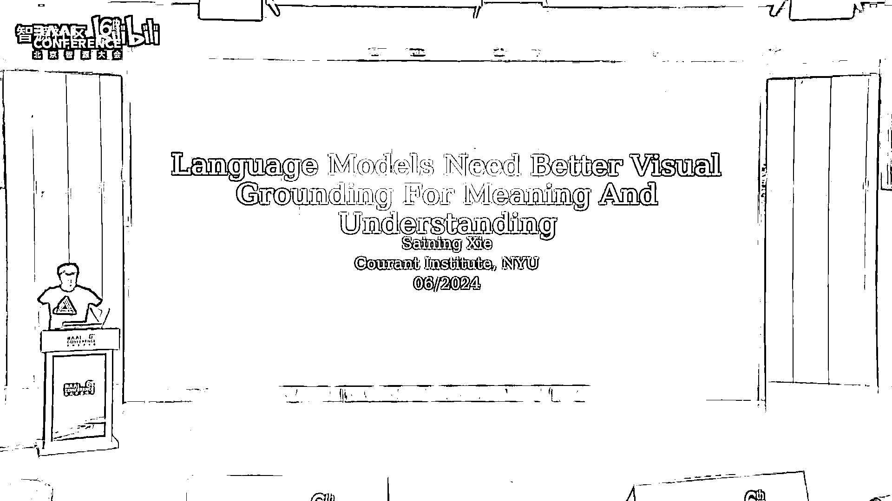

来达到理解的意义，我想先zoom out一下，先讨论讨论一些哲学的问题，其实在这个问题上，比如说我们说AI到底需不需要，所谓的智能智能智能，就是一种感知，来达到这种理解的意义，其实这件事情。

已经有很长很长时间的讨论，比如说在AI里面，在1990年的时候，这个Stefan Hanna他们就讨论了这种，Symbol grounding的problem，这个时候。

也不是deep learning的时代，但是那时候大家在讨论的事情是，就是大家说的这个话，或者我们计算机里面的code，它们作为symbols，其实本质上都是没有意义的，它们之所以会被赋予意义。

是因为我们把它会associate，with some form of sensory grounding，这时候他们会讨论所谓的，Semantic gap的这个概念，这意思是说。

如果我们现在要teach一个，比如说一个human child，to learn what is an apple，我们只是在他耳边说，Apple Apple APPLE，他是学不到什么东西的。

我们必须让他明白，这个不同angle的这种，Apple的view的capture，或者说它的taste，它的feeling，然后才能够让至少人。

知道什么才是一个apple，再往前倒推一点，其实在哲学里面，像13世纪的时候，阿奎纳也讨论过类似的事情，然后他说过这样一句话，There's nothing in mind。

that wasn't first in senses，就是你的感知会最先出现，然后我们才可以讨论，你的心智。

你的认知的问题，当然后来还会有，各种各样的哲学的学派，比如说Sansiem，然后他们的观点是，No cognition without sensation，也再一次强调了sensation的重要性。

当然了，既然是一个哲学的遍体，而且已经是长达可能上百年，上千年的哲学遍体，那我们当然有反方的观点，其实这个阿奎纳，在一千年的时候，他讨论过这样一个思维实验，就是所谓的。

Avicenna's floating mind，浮在空中的一个人，他的所谓的thought experiment，其实说的是，现在想象有一个人，他就天天浮在空中，然后他就可以这样飞行。

但他其实没有办法，有任何的sensory grounding，因为他up in the air，但是他其实可以思考很多很多的东西，他可以思考他自己，关于他自己的事情，他也可以思考。

其他各种各样丰富的东西，比如说数学 逻辑 哲学，等等一切，这些东西都不需要，external reality。

但是这些哲学的讨论，就留给哲学家去做吧，我觉得其实对于，今天的AI来说，我们更希望有一个，less philosophical question，就是说，当然Chad Chabit，非常非常有用。

然后他也是一个revolution，但是pure language models，只有text inputs and outputs，然后他并没有这种human style senses。

我们至少可以问的一个问题是，如果我们给这些language models，更好的sensing capability，我们能不能去boost我们的thinking，to a new level。

in language models，我们能不能更好地提升，我们的language understanding，and meaning capability，而且这件事情不止对于。

human language成立，并且对于general intelligent creation。

我觉得也是一样，这件事情要说回到，可能这个字体有点问题，这个所谓的韩五纪的时候的，生物大爆炸的过程，至少有一个理论是说，在当初的时候，在538个million years ago，地球上这些海洋里。

刚刚出现了一些生物，然后大家都很弱，其实一开始也没有什么视觉，但是直到有一些，这些初等的生物，开始develop出来一些，视觉的信号，他们就能更好地去躲避天敌，获取实物，这件事情就激发了。

这种所谓的arms race，开始了这种视觉的军备竞赛，如果你想要获得更多的实物，然后避免自己被捕食，那你就必须要develop，better and better vision。

to be more and more intelligent，所以这是，至少是一个hypothesis，解释了为什么在韩五纪的时候，会出现这样的生物大爆炸，然后，这个好像slides有点问题。

但是anyway，就是我觉得很多，这些想法也来自于一样的influence，至少在这一部分的观点上，我跟他还是比较一致的，所以他其实也在讨论，LM和sensory grounding之间的一些关系。

我这里面可能选取了他的两个言论吧，然后我觉得我是非常同意的，比如他说，大部分的human knowledge，人的这个知识，以及基本上全部的动物的knowledge，其实都是来源于我们的这种。

感知的这种experience，of the physical world，就是我们在这个真实世界里面的感知，然后他同时也说，language is icing on the cake。

we need cake to support icing，我觉得这其实是某种，LeCun cake的2。0版本，当然我们比较熟悉的1。0版本，是在讨论self-supplied learning。

supervised reinforcement learning，但我觉得在这里面，他其实讨论的是说，我们其实需要更好的sensory experience modeling，在这个之上。

我们才可以去讨论一些language modeling的问题，还有一个他的观点，我觉得我是比较认同的，是说如果现在假设，我们过早的或者过强的，引入language信号，我们始终会有一个风险。

这个风险是说，有可能我们的view representation learning，我们的sensory modeling，其实做得很差，但是由于这种非常强的language prior。

它能够让我们走一个捷径，并且让我们觉得我们很有智能，但实际上这件事情可能不是这样，有可能当我们真的要，AI develop的一个阶段，我们需要对这个robustness，对这个reliability。

或者说对于我们要解决的问题的难度，有本质的提升的时候，可能这些weak vision system。

会变成一个bottleneck，所以我现在的感觉是，如果单纯language model来说，它是一个非常knowledgeable的系统，但是同时它又是一个像盲人模像一般，眼睛被遮住的系统。

当然了今天我们的讨论，是在这个多模态论坛里面，所以其实最近的几年的时间里，然后在我觉得对于multi-model来说，或者对于general vision的研究来说，也是一个新的时代吧。

比如说从GB4V的时候的出现，然后大家开始discuss，这个LMMs，然后discuss各种各样的非常surprising的，在传统的视觉的人看起来，其实真的不知道该怎么做的。

这些问题的setup上面，multi-model system通过LMMs辅助，都能得到很好的很好的效果，我觉得一个当然现在LMMs，也有不同的流派，也有不同的技术路线，但是我觉得现在一个比较经典的。

至少在开源社区里面，大家用的最多的最广泛的一个系统，当然是这种Lava based的系统，这样的系统里面，它其实构造非常非常简单，它会leverage几个pertrain的system。

我们会有language model，我们会有一个vim encoder，我们会有一个非常非常简单的connection module，把它们两个连在一起，然后接下来你要做的事情。

就是把vim encoder得到的这些vim tokens，projected到language space，然后把它丢给Large Range Model。

然后我们可能可以分两个stage的training，pertraining stage，然后会有一个instruction fine tuning stage，这样的话我们就可以leverage。

这些不同的model，包括在vim的model还有language model，来达到这个multi-model的capability。

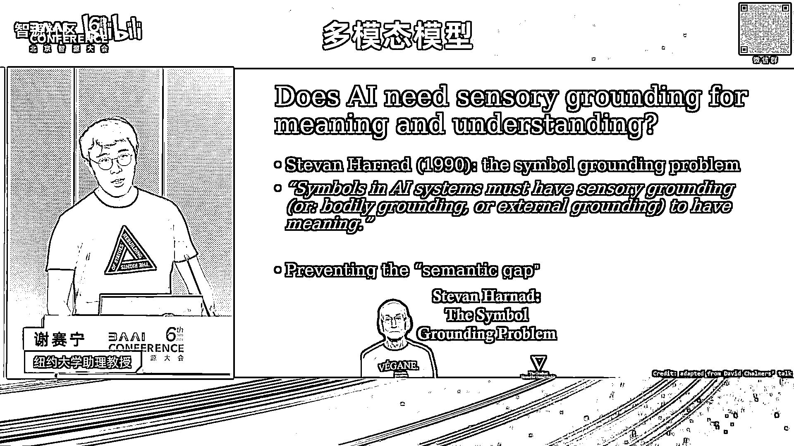

但在过去很长一段时间里面，我们可以看到在vim encoder的部分，或者说在language的部分，其实是百花齐放的，我们会有越来越强越来越大的模型，但在vim encoder的部分。

大家会不约而同地使用一个model，就是clip model，并且这个clip model，就是exactly open eye release的checkpoint，对吧。

就是这个VIT large的model，把它作为一个vim encoder。

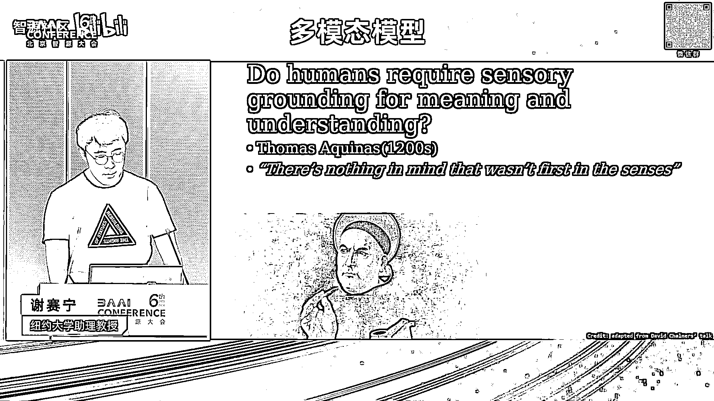

对，clip我希望，这个大家已经都比较熟悉了，这个paper也是看不到，但它是2021年的工作，然后它通过contrast learning的方法，去align text和这个image input。

然后它的encoder可以被拿出来。

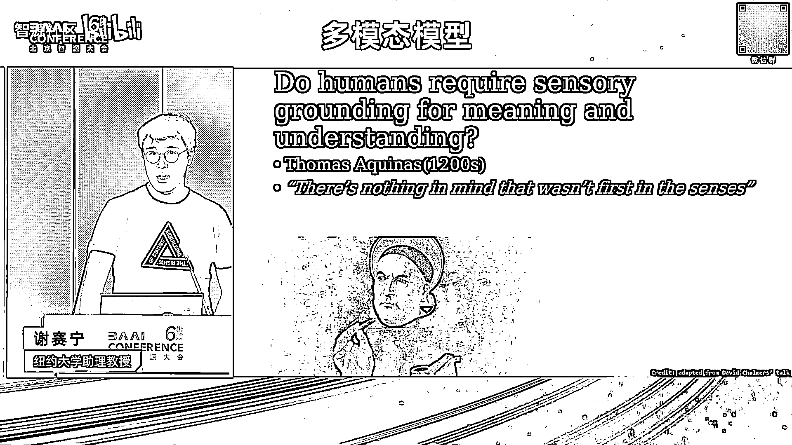

去transfer到其他task里面去，然后我觉得我们现在想问的一个问题，其实是说，如果我们现在想要build一个multimodal system。

我们到底是不是应该只用一个clip model就够了，或者说我们要问的问题是，我们现有的vim representation learning的系统，到底是不是足够好。

对于language的understanding的命令来说。

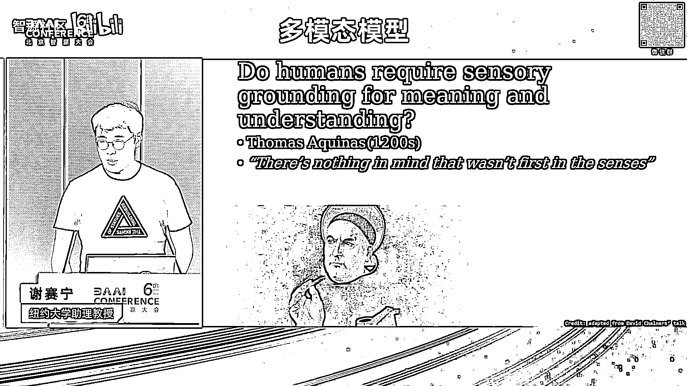

所以第一篇我想介绍的论文，也是马上下一周，我们将在这个CPR presenter工作，然后它的名字叫SYShud。

Exploring Virial Shortcomings of Multimodal Large-Range Models，所以可以先看一些example。

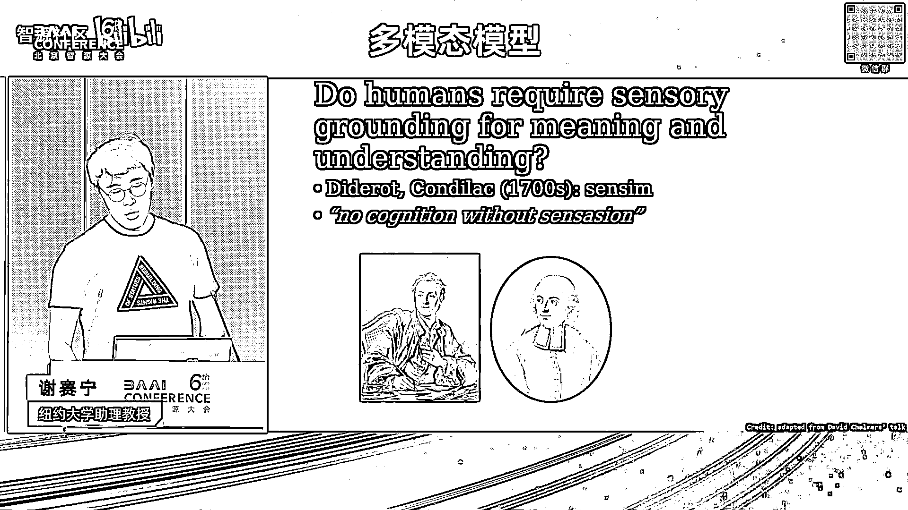

这些都是GPT-4 V-Turbo的一个snapshot。

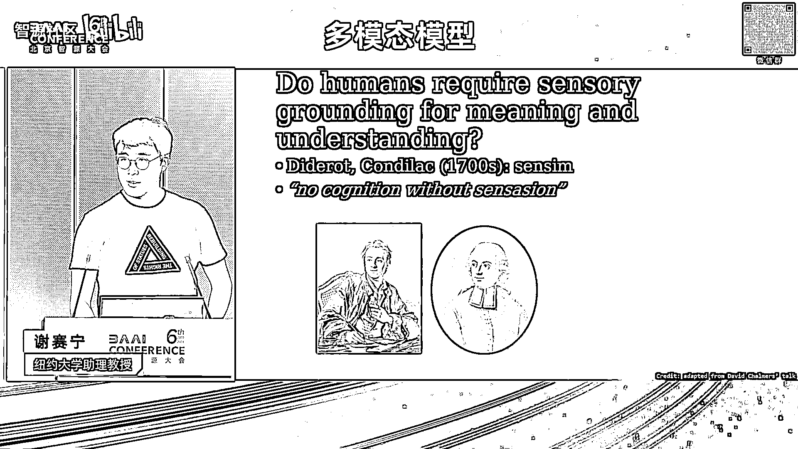

可以看到说，其实我们discover了一些，比较简单比较基础的问题，比如说从camera的视角来看，这个狗到底朝左边还是朝右边，我现在第二个图里面说，你能不能看到一个窗户，我们很明显可以在后面。

可以看到一个很小的窗子，比如说像这几个人，他到底是面朝前还是面朝后，然后比如说这只鹰，然后我们到底能看见一只眼睛还是两只眼睛，而这辆车我们能看见一个轮子还是多个轮子，非常surprisingly。

所有的这些问题上，然后GPT-4 V都会回答失败，当然了现在的GPT-4 O的model，可能在这些问题上，已经有了长足的进步，但至少在GPT-4 V的时候，我们会找到很多这样的。

非常trivial的这个问题，但是GPT-4 V也做不好，比如说像这个图是说，这个新的边缘到底是白色的黑色的，然后GPT-4 V会说这是一个dark color edge，然后像我说的一样。

就是我们可以systematically identify instances，然后找到这些样例，使得我们能够怎么说呢，击败这个GPT-4 V，或者说让GPT-4 V在这些list上面失败。

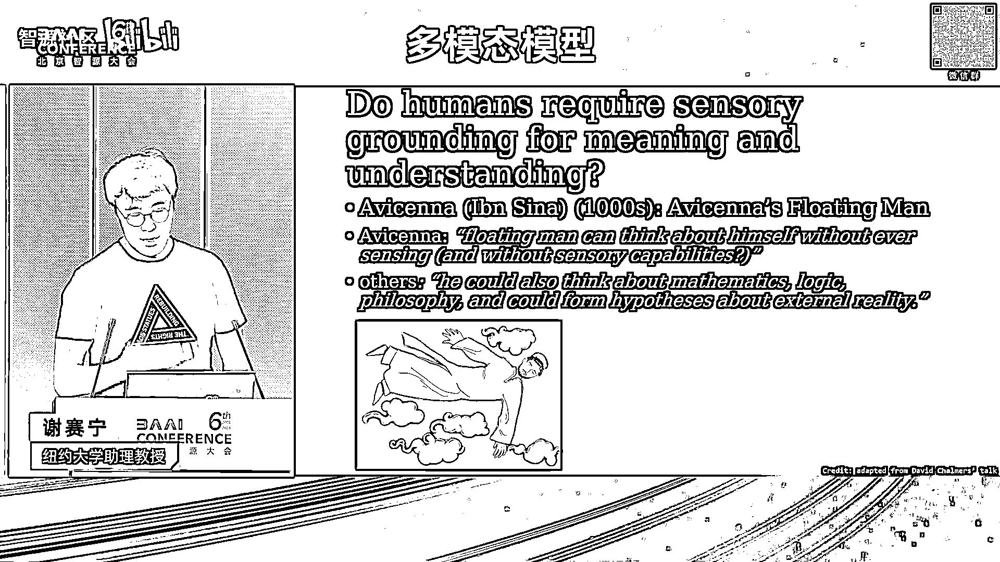

我们是怎么做到这件事情的呢，其实我们是我们的一个目标，也是说要develop一个新的benchmark，我们叫它MMVP benchmark，然后我们会设计一个，找到这样或者construct。

这样benchmark的方法，来找到它这个clip-blind的pairs，这件事情其实非常简单，我们第一步只需要去找到一些image pairs，然后这些pairs我们可以从一些。

existing的data set拿到，包括image net以及包括line，然后我们可以用两套embedding system，一个比如说是clip model。

然后另外一个是一个vision only，soft-supplied learning model，然后在这个model的过程中，我们可以去在他们的embedding space下面。

measure这个pair的distance，然后我们希望找到的这个pair，是说它在clip的embedding space下面，它们的similarity score会非常非常的高。

但是在一个vision only的soft-supplied learning model下面，它的这个score会相对来说比较低，这件事情是什么意思呢，是说我们希望找到这样的pairs。

使得对于clip model来说，它分不清楚这两个图片到底有什么区别，但是对于一个vision only的soft-supplied learning model来说，它会发现这两个图还是差别很大。

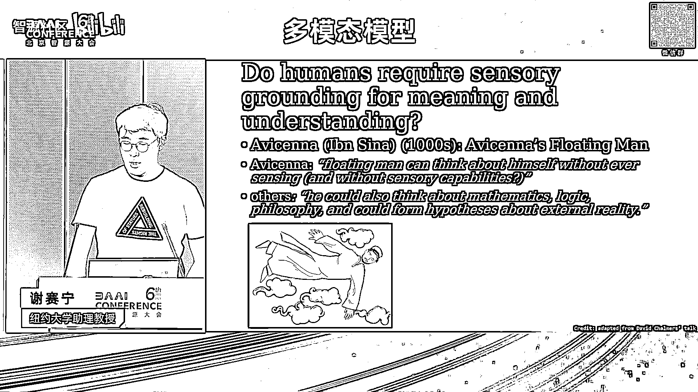

然后有了这样的setting之后。

我们就可以把这样的pairs交给一些human annotator，让他们去尝试找到在这样的pairs之中，到底有哪些viral differences。

所以这里面其实是有human in the loop，但因为我们已经通过这种方式filter出来了，这些在clip space比较接近，然后在dino space比较远的sample。

所以这件事情对于annotator来说，其实是一个比较容易的事情，比如说他看到这两张图的时候，就可以比较容易地去come up with这个question。

我们就说这个狗的脑袋到底在地毯上还是在地板上，这样的话我们就可以把它再去formulate成一个question。

是说where is the yellow animals head lying in this image，然后我们可以有这样的multiple choices。

比如说A是floor B是carpet，所以在我们construct这样的benchmark之后。

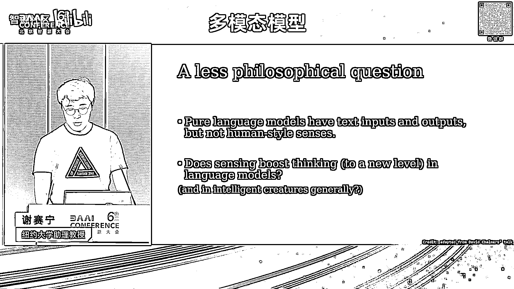

我们就可以拿这样的benchmark去evaluate，各种各样的multimodal models，包括开源跟闭源的系统，然后我们的判断标准是，必须对于这两张图来说。

这个multimodal model必须同时回答正确才算对，就加一分，然后如果要是有一个错了那就不得分。

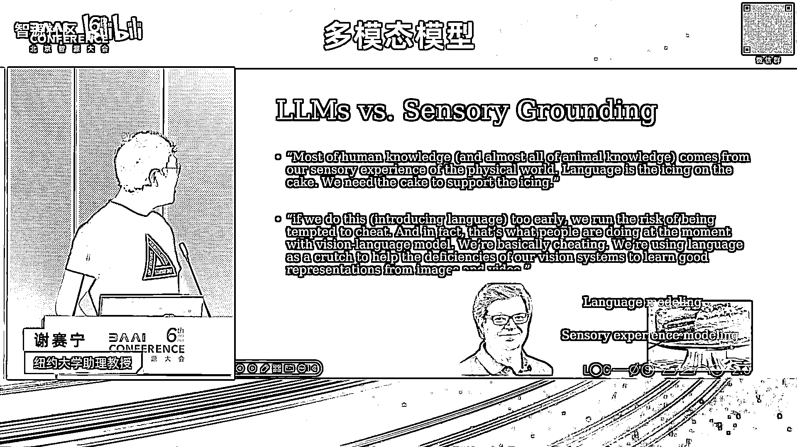

所以我觉得这个benchmark的结果，在我们当初看来还是比较令人惊讶的，就是说对于human来说这些问题都不是任何问题，你只需要看到这两张图，你自然而然可以找到他们的这些。

即使非常nuance的这种variable differences，然后回答清楚这些问题，但是大量的系统，现在的multimodal的系统，却在这件事上做得非常非常差，比如说Gemini可能有40。

7的performance accuracy，包括之前的GP4-V可能有更差的38。7的accuracy，但是除此之外，其他的所有的model包括Lava。

然后其他比如说mini-GP4之类的model，都甚至比random guess还要差，但是同时human可以做到几乎完美的performance。

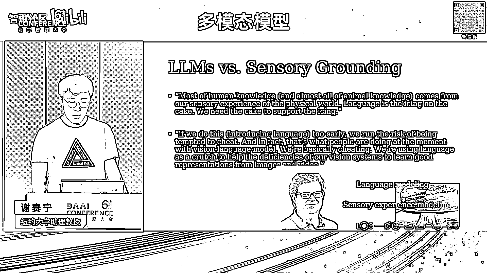

所以这是一些example，以及一些model的behavior，大家可以看到，其实在很多这样的，看起来很简单的例子上面，这些系统的performance，是不是很consistent的。

所以在做完这样的一个benchmark之后，我们希望能够更深入的了解一下，到底发生了什么，为什么会发生这样的事情，所以我们相当于有点post hoc的，再去重新看一下我们收集的这个benchmark。

然后总结它的question之中，到底这些human annotator，到底提出了哪些的问题，然后我们通过比如说play with gpt，然后总结下来，其实一共有九种view patterns。

然后现有的multimodal system会经常出错，比如说包括orientation direction，比如说包括state direction，quantity， count， color。

 appearance， text， view point， perspective等等，这九种view patterns。

然后我们现在可以重新去，相当于重整一下我们之前的这个existing benchmark，把它变成一个image text matching的problem，我们之所以做这件事情的目的。

是因为我们有一个hypothesis，大部分虽然我们不知道GP4V，用了什么样的model，但大部分情况下，刚才许诺也说了。

其实clip model还是一个非常dominant的variant encoder，所以我们的一个猜测是，如果说这些view shortcoming。

会在这些multimodal system里面被看到，那很有可能是clip也会出了问题，所以我们可以去，现在reorganize我们的benchmark，然后通过这种image matching的方式。

去先去benchmark clip，我们可以看到，其实在clip model上，然后做这九个view pattern的，这种matching task，结果也是非常非常差，虽然不同的model。

会有不同的performance的好坏，in general可能更好的image net zero short的performance的model，也会在MMVP的benchmark上面。

也会有比较好的结果，但是这个也不完全是这样，还是会有一些ranking的swall，但当我们把所有的这些结果，plot在一个figure里面，然后把它通过这些不同的view patterns。

来bucket一下的时候，就会看到一个比较明显的behavior，是说其实在clip做不好的地方，我们接下来的multi model system也做不好，但是在clip能做对的情况下。

比如说在这些color的question上面，clip做的还不错，虽然可能也只有比如说less than 50%accuracy，但是这些multi model system，其实做的也不错。

所以有一个clear的correspondence，correlation between clip model，like ourview encoder。

and the subsequent multi model system。

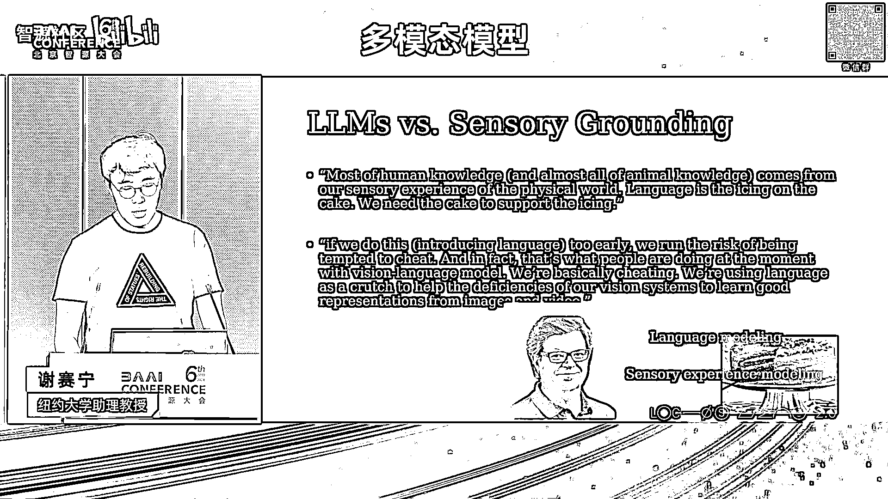

所以当我们发现这件事情的时候，其实比较显然的一个事情是说，我们其实可以尝试去补足clip model的短板，那既然我们已经是通过这个方式，去discover这些clip pair的。

那一个也比较显然的做法，是说我们可以去在clip encoder的部分，加入一些vision only的soft-supplied learning model，我们其实设计了不同的strategy。

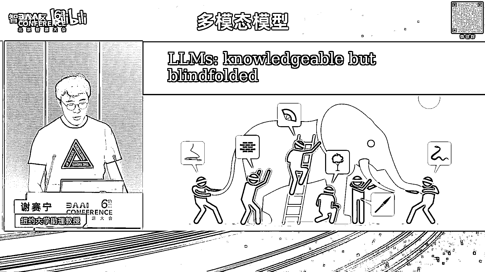

包括比如说直接把它们加到一起，我们可以看到一些performance behavior，比如说你加的dynol feature。

或者说vision soft-supplied learning feature，越多在MMVP的performance上面，它会saturate 但它会不断涨。

但是对于这个lava的performance，它会变得越来越差，但这个主要还是因为可能，直接这种naive的token混合。

会破坏原有的feature的性质，但我们可以做一些其他的尝试，比如说我们可以直接把soft-supplied learning feature，跟这个clip feature。

在special上面interleave到一起，在这种情况下面，我们其实可以看到，我们可以在MMVP的benchmark上面，有很大的提升，并且可以在其他的这些VQA的benchmark上面。

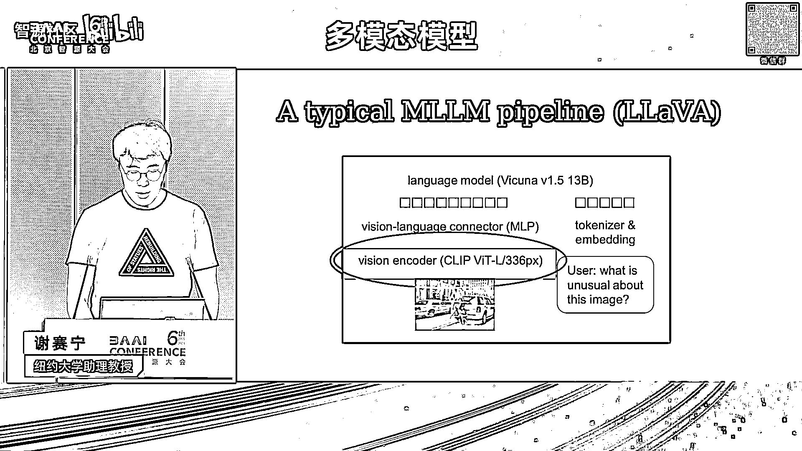

也不掉点，对 然后当然了就是大家可能会问。

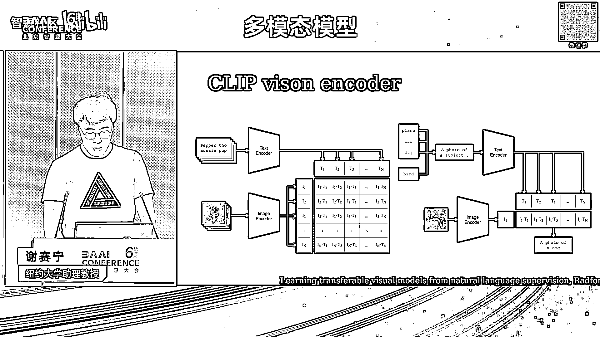

这件事情是不是有点自说自话，因为我们一开始discover这些clip，blot and pair的时候，我们已经用了dynol feature和clip feature。

那是不是这件事情只是我们有点overset。

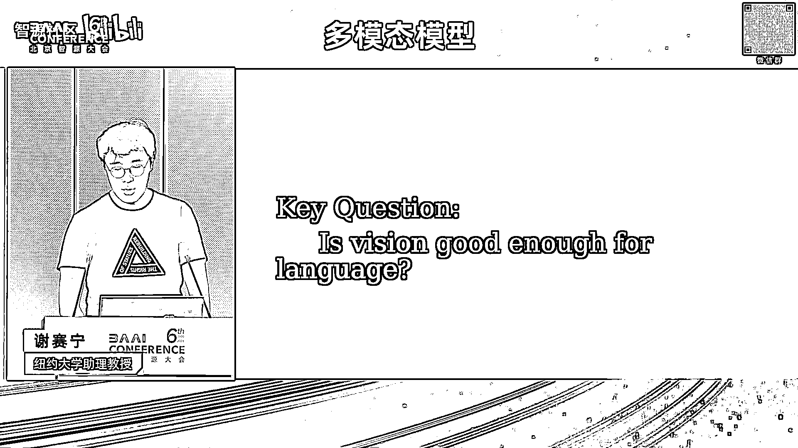

我们的setup，其实不是这样，我觉得这里面我们看到的现象是，对于其他的vision soft-supplied learning backbone，我觉得这个conclusion也是成立的。

一个general behavior是说，vision soft-supplied learning，还是能够去complement像clip这样的style的，这种一开始像刚刚说的。

把language part提早introduce进来之后的这种model。

我觉得一些take away吧，我个人而言觉得clip，虽然我觉得我们当然可以做更好的scaling，然后我觉得这件事情都有很大的潜力，但是clip已经待在这个领域太久了。

所以在急需有一个alternative pipeline，可能是会fundamentally不一样，然后能够在keep clip的某些，这些好处的情况下，也能够去fix clip的一些问题。

因为我之前做了很多vision soft-supplied learning，我觉得这也是一个例子，说vision soft-supplied learning，其实我觉得没有，怎么说呢。

失去它的意义吧，然后我觉得我们可能还是需要去，在vision soft-supplied learning上面，做更多的尝试，但是我们需要有fundamentally different ways。

to pursue the problem，我觉得像过去一样，比如像Moco M1的时代里面，我们在这种imagenet的data center，做training。

然后通过linear probing，跟安全functioning的方式，在imagenet以及这些cocoa，AD20k上面test，这种方式已经不再是一个好的。

或者合适的一个evaluation pipeline，所以我们可能没办法真正，达到我们想要的目标，然后最后一点也是说，回答一开始我们title里面的问题。

就是可能better visual understanding，还是一个非常重要的事情，对于language understanding和meaning来说。

接下来我想要介绍另一篇CDPR的工作，然后我觉得它会是另外一种，一套思路，但是它想要解决，或者它想揭示的问题，其实是相通的，这篇paper叫做V-STAR。

然后它叫做Guided Visual Search，as a Core Mechanism in Multimodal Language Models。

所以我想先讨论的是，到底什么叫做visual search，这个东西其实在psychology，或者cognitive science里面，也是有明确的定义的，其实这件事情很简单。

我们需要actively search for targets，from distractors and background，我们会有phobia的系统，在我们的眼睛里面。

我们虽然有每天可以process，很多的visual information，但其实我们的注意力，不是要把所有东西照单全收的，然后其实我们会有，我们自己关注的地方，然后一旦我们失去了。

我们这个关注的焦点，然后我们可能在生活中，又犯一些错误，在这个biology上面，我们的phobia的这一部分，其实只有1%不到的retina size，但是其实它会activate。

大于50%的visual cortex，所以这是一个非常surprising的behavior。

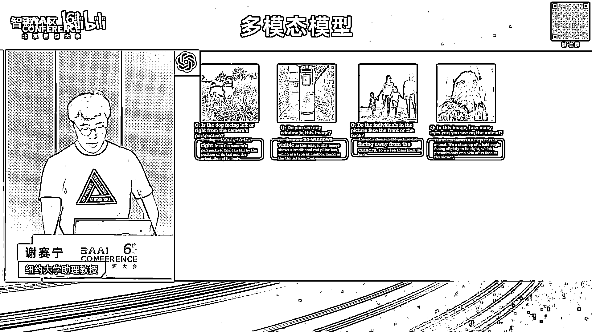

对，然后我们什么时候会做这样的visual search呢，我觉得是可以说是所有时候，比如说对于我们这个everyday task，然后可能在大家办公桌上，有很多很多的杂物，然后我们现在要去找一支笔。

或者一本书，我们就需要去conduct，这种visual search的behavior，或者我们要处理一些。

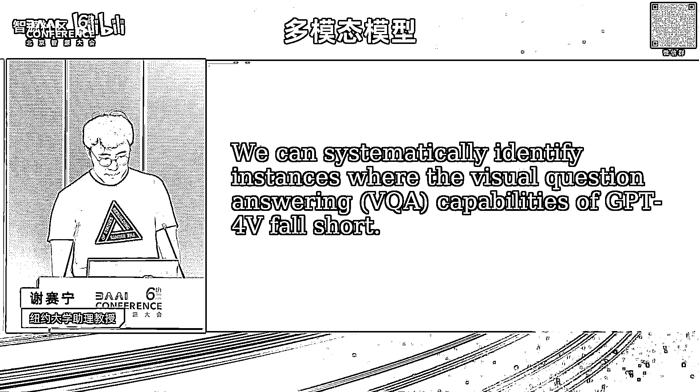

比较complex task的时候，比如说我们要去识别一个diagram，比如说像这样的进化的图谱之中，我现在要问说，这个长颈鹿在什么地方，或者它的祖先是什么。

那我需要去conduct这个visual search，才能去target到这个目标。

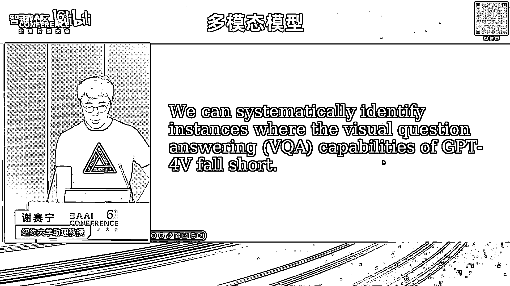

从而能够回答这个问题，我觉得我们可以有一个更concrete的example，是说我现在给大家一个，非常high resolution的一幅图，对吧，然后我现在想要问的问题是。

这个塑料吸管到底是什么颜色的，对吧，然后对于这个问题来说，我们现有的视觉系统是怎么处理它的呢，它是这么处理的，它会从左上角开始，当然可能你不需要follow order，但它会逐行扫描。

然后会把所有的图里面的所有的信息，全部encode进去，然后再去process，然后再去understand，但很显然这件事情对于人来说是不可思议的，对吧，如果是一个人来做这件事情的话。

我们讨论到吸管的事情，他可能会想，那我们应该可能先看看，这个桌子上有没有这个东西，因为可能吸管，更容易出现在这个coffee shop的这个桌子上，发现这个桌子上没有，我们再看看另外一张桌子。

发现这有一个杯子，杯子里面有个吸管，那我们现在可以回答说，这个吸管是黑色的，对吧，这其实是一个很自然很自然的过程，并且这件事情对于人来说是非常必要的，如果我们现在每天都需要去逐行扫描，所有的事情。

然后才能去回答一个问题的话，大家可以想象这个cognitive load，并且这个efficiency是会非常非常差的，对，然后我们到底是怎么样去做这个view search的呢。

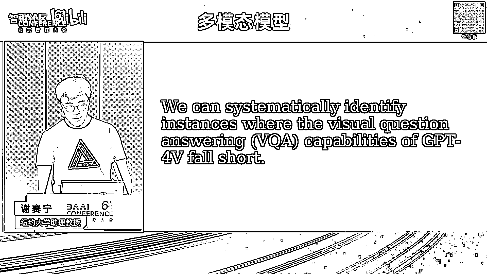

其实，again，这个认知科学家以及心理学家，他们其实做过很多的讨论，就是这个里面其实有很多种不同的cures，比如说我们会有这种bottom up，silence to guidance，对吧。

然后比如说我们现在看到这样的一个图，我们可以ask which items pop out from this image。

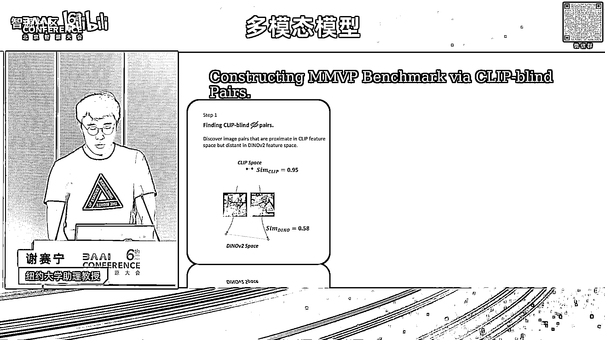

大家很明显可以看到一些，一些一些一些一些这个，怎么说呢，一些outlier对吧，在这个distribution之内，它会变得很显著，然后这件事情会guide我们的view search。

然后还有一些其他的top down feature的guidance，对吧，比如说我们知道，我们想要找到的物体，它有一些性质，或者说它有一些这些attributes。

然后还有就是这种thin guidance，我们会leverage我们的所谓的这种，这种对于世界的知识，然后或者一些semantic information，来帮我们去搜索。

比如像之前这个example里面，我们要从桌子上找杯子，从杯子里面找吸管，这其实是因为我们的大脑里面，已经有这样的sense，比如这样。

另外一个例子，我现在要问这个这个这个枕头在哪，对吧，你可能第一眼会去床上去找，如果找不到可能会去沙发上找，但你可能不会去厨房去找，或者说餐桌上去找。

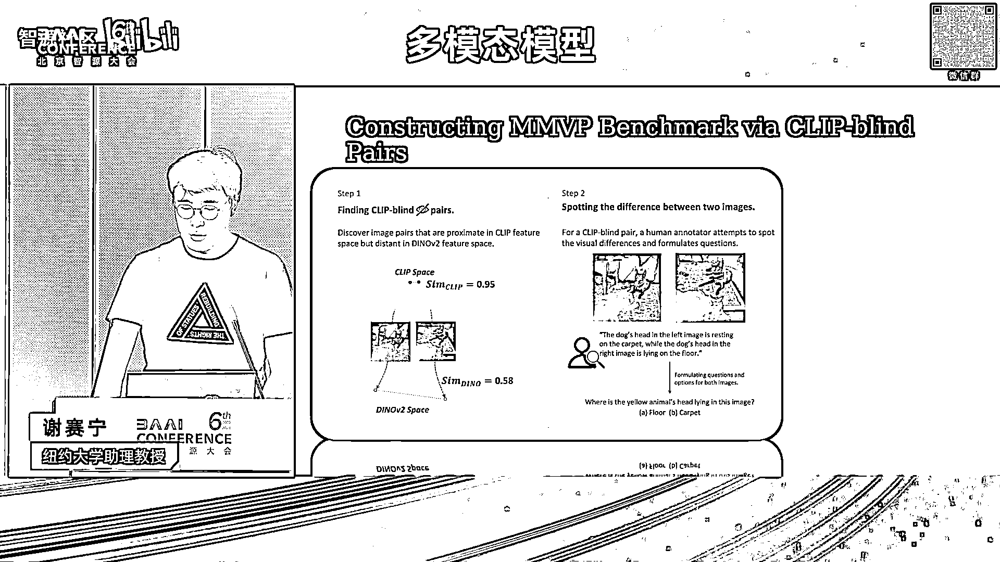

对，当然还有一些其他的，这个这个很重要的cue，比如说，我们不断的去perform这样的search task，然后我们我们我们会有，我们大脑里会maintain，这种search history。

然后有可能你今天找过一次，明天你就会回到这个同样的地方，去再找同样的东西，对吧，因为我们可能有已经有这样的prior，对，然后当然还会有些其他的。

是说这个可能perceive value of the atoms，我们会倾向于去找一些，这个价值更高的东西。

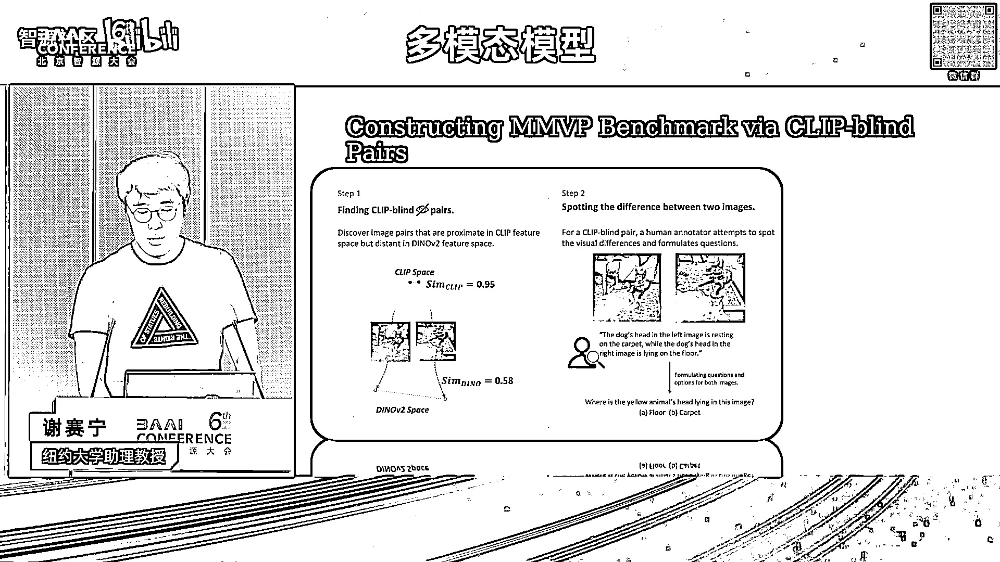

然后在machine learning里面，也会有，当然这些都是古早的工作，比如说06年Antonio他们做的工作，也是说讨论visual search。

这种human的cognitive ability，到底在machine learning里面，到底有什么意义。

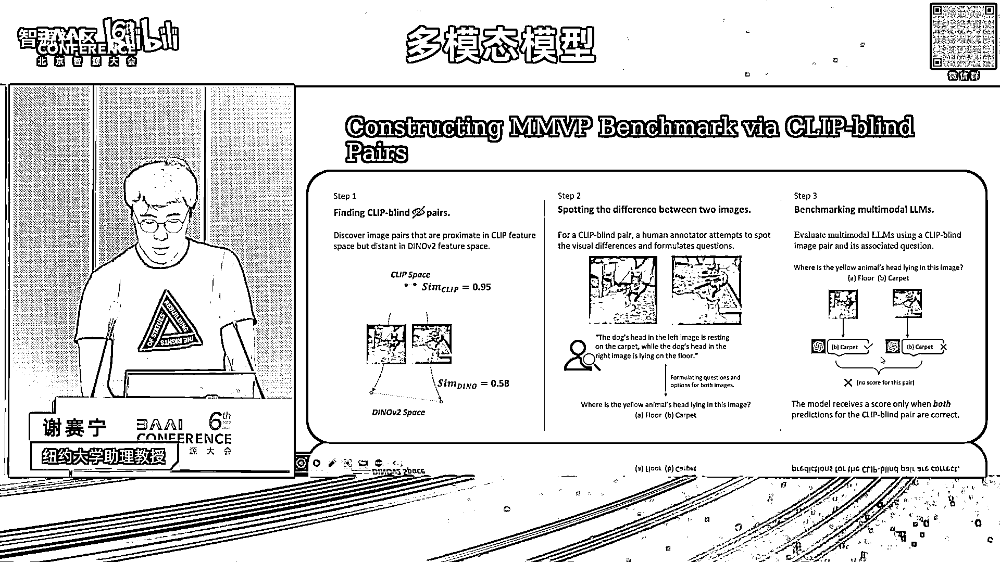

Again，会有不同的人在尝试这些事情，但是这些事情，其实跟主流的computer vision research，或者说跟AI还是不太相关，因为大家可能真正care的事情。

是说我们能够怎么样更好去follow，这个人类的这种gazing trajectory，比如说你的眼洞的信号呀，或者怎么样对吧，然后可能大家handle的image。

也是这种limited resolution，然后可能更多的，也没有很多learning在里面，可能更多的是要依赖于，一些statistical correlation。

然后我们到底应该怎么样去design，一个更好的visual search model呢，Again我觉得我们还是可以去，borrow一些common sense的discussion。

比如说我们可以去依赖于，一些bottom up，或者依赖于一些top down，feature guidance，以及一些thing guidance，但这里面其实有一个key observation。

这件事情在几年前，或十几年前是不成立的，就是说我们现在确实有一个，更好的系统，就是我们的large image model，真正的能够去encode一些比较rich。

并且比较靠谱的word knowledge，对吧，然后所以对于一个large image model来说，我们一开始说了，它可能是blindfolded，虽然它看不见，而且它也不reliable。

但它是一个很好的guide，它可以去告诉我们，应该去哪里找东西，一个东西可能会出现在哪里，所以在这个基础之上。

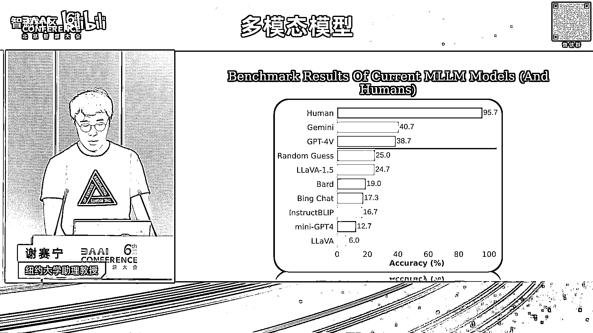

我们提出了一个framework，这个framework叫做SIL，然后我们把view search的capability，想要去integrate到这个。

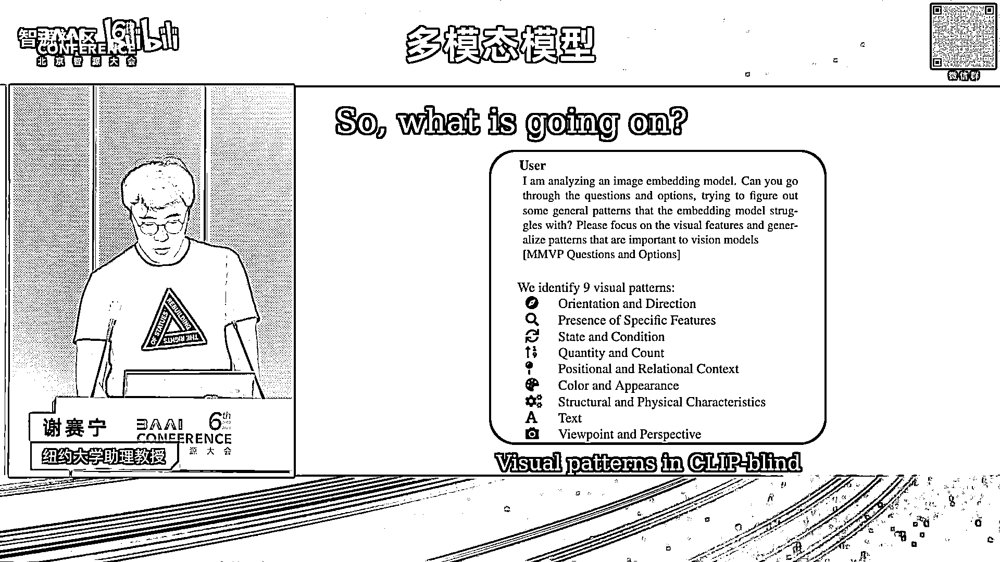

multi-model large image model里面，这个SIL的意思是，show， search， and tell，这一面就想要多说两句，就是说现在对于这种model。

multi-model large image model来说，其实问题也不仅仅只在这个clip上面，对吧，然后包括比如说，我们之前说了，可能view encoder。

大家通常会take a perturbed model，可能会keep it frozen，然后另外一件事情是，因为它没有这种view search的capability，所以它没办法去focus在。

critical view information上面，然后再包括，现有的系统很多时候，如果它看不见一个东西，它不会说它自己看不见，它只会给你re-listen it，然后编造一个答案，对。

并且还有一点是说，它也没有办法有一个，像人一样的active的这种，search request的这种mechanism，使得我们能够去。

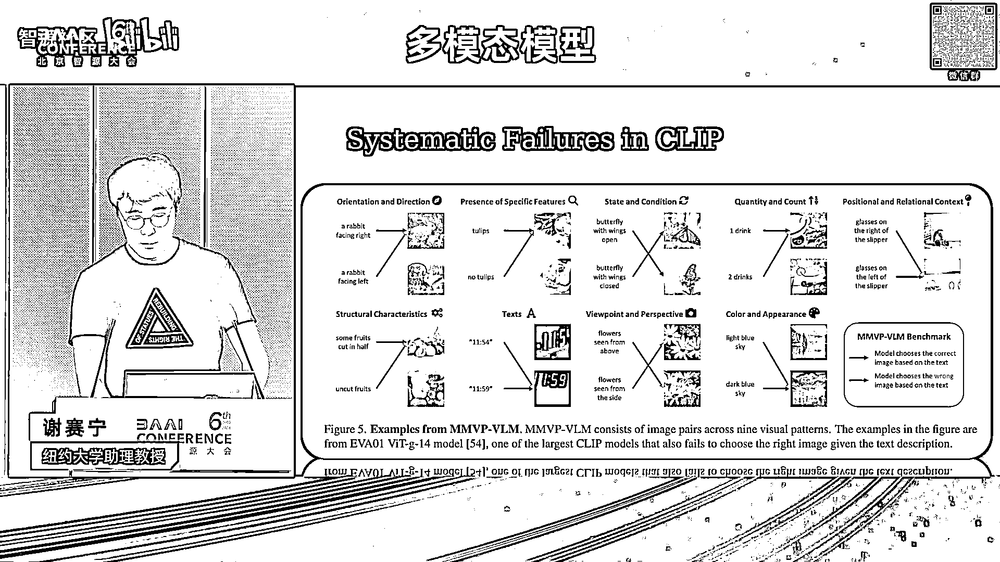

在它看不见的时候，去寻找到这些它们看不见的object，这一面又要把GP4V拿出来了，对，这也是另外两个例子，说GP4V，我们去问说，比如说。

What is the instrument held by the ape，对吧，这个猩猩手里拿的乐器是什么，大家可以看一眼，我觉得应该可能在一秒两秒之内，大家可以找到猩猩在哪里。

它拿的手上的东西是一个吉他，对吧，然后GP4V告诉我们答案是说，这是一个saxophone，这显然是不对的，然后另外一个是说，这个color of the mug，对吧，这个杯子的颜色是什么。

这个可能难度会更大一点，但是如果你定睛一看的话，你可能还是会看到，这有一个蓝色的杯子，对吧，但是可能GP4V就会被distracted，然后回答说，这个杯子是白色的。

所以我们的Virial Search Model，其实就是inspired by，这个human的这些cognitive science的一些study，所以我们其实会有一个这个multi-round。

然后guided by large-range model的系统，我会skip一些detail，但核心是说，我们现在会有一个variant backbone，然后并且我们会有一个。

multi-model large-range model，来帮我们去做Virial Search的部分，然后这个multi-model large-range model会输出。

或者说它会接着两个不同的decoder，这两个decoder分别是某种search queue的decoder，以及某种target localization decoder，一个具体的例子是说。

比如在这个图里面，我们要问，What is the most likely location of the orange luggage？你其实是找不到，或者太小了，或者说对于现在有的系统来说。

collaborative resolution没办法去support，直接能够回答出这个问题，那我们的model会告诉我们说。

这个orange luggage is most likely to appear next to a person，所以这一部分其实是所谓的word knowledge，然后我们接下来。

我们系统会自动化的去找到说，这个person在哪里，它有可能更靠近这个城墙，然后这样的话，我们就会得到一个所谓的search queue，它会以一个heat map的形式存在。

Everything is probability，但我们就会可以通过这个search map，找到这个probability最大的地方，然后再进行下一轮的搜索，这个时候因为我们可以zoom in。

去找到这些，更可能出现我们要target的，寻找的物体的部分，那我们这样的话就可以找到，这个orange luggage，然后到最后我们可以输出的是，这个具体的。

这个orange luggage的一个坐标。

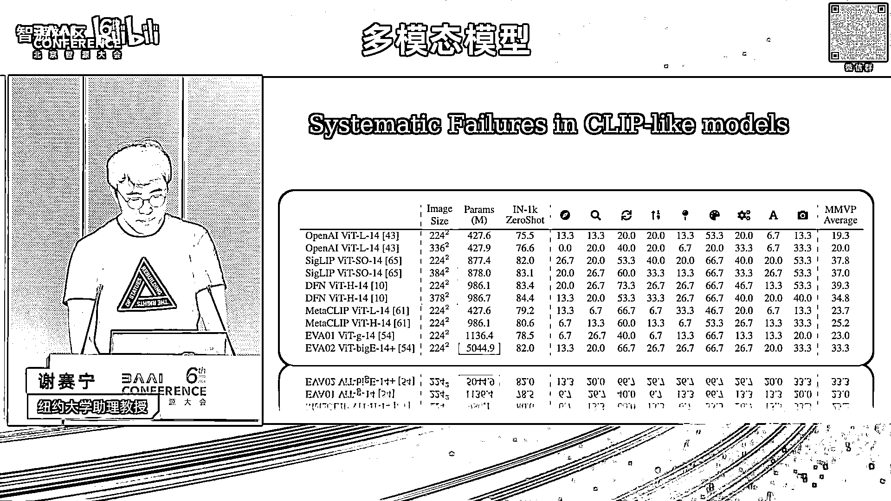

这样我们可以有一个binding box，我escape具体的这个设计，但这部分的设计，其实跟SAM的model其实很像的。

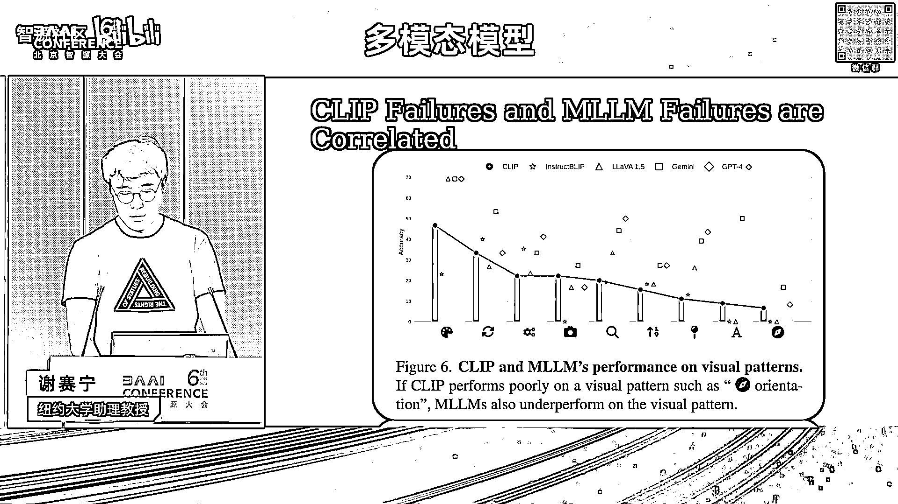

特特一会可能也会讲到，然后我们具体的这个virtual search的操作，其实就是说，given一张image，我们现在需要把这张图不断地做切分，其实是一个地规的系统，我们先会把一张大图切成小图。

我们可以先分四份，在每一份上去做virtual search，然后靠这个large image model，word knowledge，让我们一步一步地，递归到更深入的一层。

然后更高的resolution。

然后去找到我们想要的物体，这也是另外一个具体的example，当我们面对这样的一个图的时候，我们想要找到说这个guitar在哪里，一开始现有的模型是看不到的。

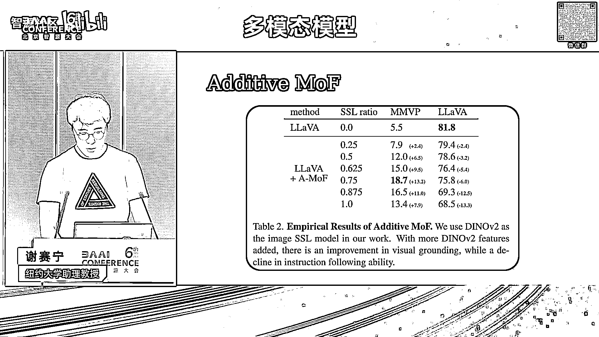

但是这个contextual kill，通过我们的large image model辅助，会得到以下的信号，它会说。

the guitar is most likely to appear on the stage，你的guitar可能更容易出现在这个舞台上。

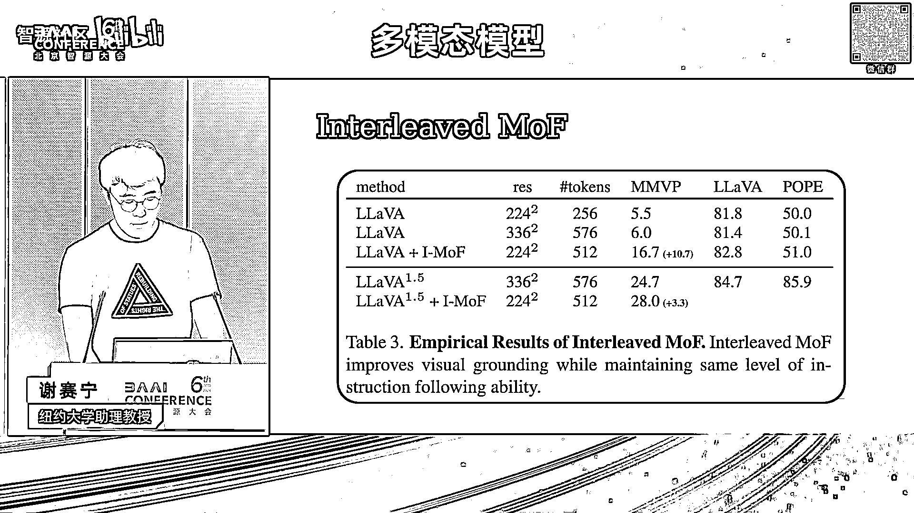

因为它识别出来这个场景，可能是一个音乐厅的场景，接下来我们就可以去zoom in，crop出来这个image的patch，然后这时候，我们就会有这个target specific kill。

然后因为我们这时候，我们的virtual model已经能够看到，我们的guitar在哪里了。

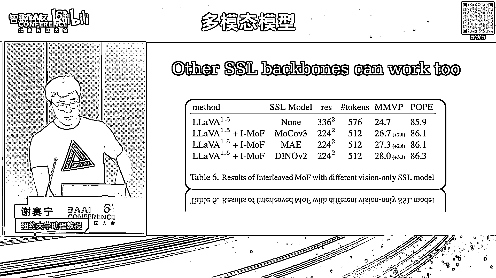

然后我们现在继续zoom in，然后我们可以找到这个target。

然后我们可以把它crop出来，然后我们为什么叫它V*呢，是因为这件事情跟A*的algorithm，跟A* search其实是有很强的关系的，只不过我们的有一些细微的差别。

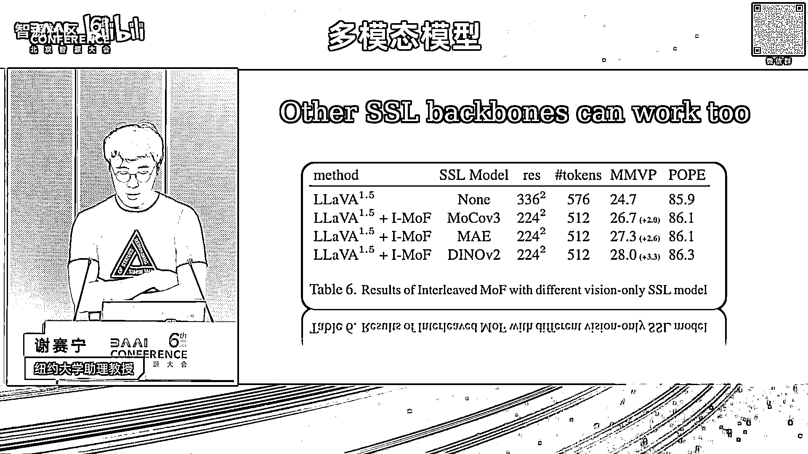

在我们的object定义上，所以我想说的是，就是Sale其实是一个meta architecture，我们做这个工作不是为了说，我们要claim state of the art。

或者说我们希望这件事情，在接下来的一个月两个月，就会成为一个很好的，这个multi-model，image model的系统，我们的目标其实是说，这样的一个architecture，即使在现在不需要。

即使现在我们可以通过，很暴力的方式，把它通过直接increase resolution方式，回答出来这些问题，但是in the long run，这件事情一定是需要，所以把它抽象出来之后。

我们其实看到我们的这个architecture，其实是有这么几部分的模型，第一部分模型是说一个，我们直接target这个vqa的lm，就是我们要进行问答的。

这个vqa的这个large image model，然后它会initiate一个，所谓的viral working memory，就是我们的像人一样，我们会有一个，这个记忆的系统，然后当我们看不到东西。

需要寻找东西的时候，我们可以去activate，一个viral search的model，这个viral search的model，要去帮我们寻找到相关的信息，把这些信息拿到之后，把它填充到我们这个。

viral working memory里面去，然后我们vqa的large image model，会从我们的viral working memory里面，去fetch相关的信息，再次去回答问题。

所以其实这变成了，从原来的一个非常原生的，我们拿到vim的feature，直接把它tokenize之后，丢给large image model来说，这已经是一个。

有这种system to reasoning的一个系统，我们的这个viral working memory里面，其实是可以包含各种各样的东西，比如说我们可以，把原始的问题放在里面，我们可以把一个。

global context放在里面，当然最重要的是，我们会把viral search model，给我们的search targets，以及这些target的location，当作这些信息。

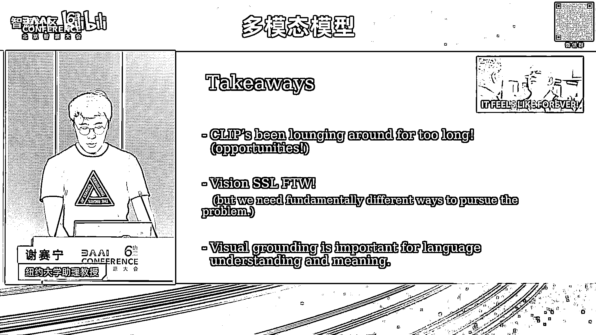

放在这个memory里面，使得我们的vqa能够更reliable地，回答这些问题，这是一个high level的流程图，然后我们可以看一些例子，对，我现在没有一些比较有趣的例子。

比如说像这个杯子上面的logo，到底是什么，GPOV是回答不了的，但对于seal这样的系统来说，其实是可以看到。

是一个seagraph的标志，这个例子是说，这个例子可能比较好玩，就是我们看到这样有一个杯子，然后如果你zooming仔细看的话，你会看到一个starbucks的logo，然后我们的问题是说。

你应该从哪里可以买到这样的杯子，那你应该回答说，可以去starbucks去买，但GPOV很明显，它就会被其他的部分的，这些viral information所distract。

它被辐射里面的辐射小子所干扰，然后就说这是一个nuka cola，然后blah blah blah，可以摆放amazon，然后这个就complete hallucination，对，包括一些其他的例子。

然后我想再强调一件事情，就是说这件事情，其实不只是一个engineering的hack，然后我其实还是蛮相信这件事的，就是其实我们现在有的multimodal，large-range model的系统。

sooner or later，它需要做到以下的几件事情，第一是如果它一开始的，这个viral information不够清楚，或者看不到的话，它得要能够去acknowledge这件事情。

它不能直接回答这个问题，第二件事情是，它得要能够去list你这些，如果它看不到这些信息的话，它得要能够list到底哪些信息，我是看不到，我需要去得到的，然后它得要去能够understand。

and integrate这个search results，after the viral search process，然后最重要一点是说，其实像人来说也是一样，我们在handle不同的。

这种complexity level的task的时候，我们会allocate不同level的compute，日常生活中的大部分情况下，我们都是非常subconsciously。

就可以去perform一些task，但我们现在如果要去考试了，或者说我们到了一个陌生的城市，需要去找路了，我们现在立刻就会变得紧张起来，我们就会调动我们大脑的资源。

去做一些更复杂的viral reasoning，然后我们在这个基础之上。

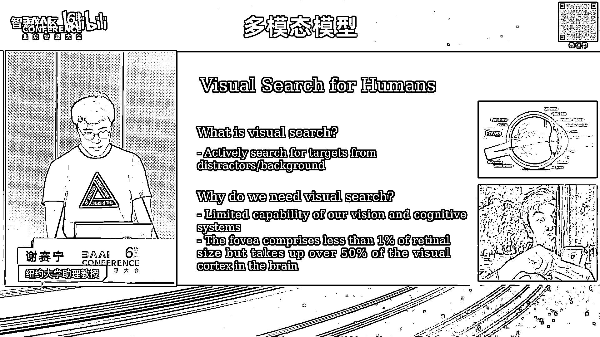

还提出了一些新的benchmark，然后我们会有这些high-resolution image，然后我们可以看到，通过加入这种viral search的capability，我们可以做到。

比如说在这些benchmark上，拿到75%左右的结果，但对于GP4V等等系统，可能大概只有50%左右的结果，我觉得还可以再强调一点，就是比如说最近可能VSTAR bench。

也会被各种各样的这些大的公司在用，然后比如说Google他们的flash，Gemini flash的这个model，可以通过比较暴力的方式，不加这种system to reasoning的方式。

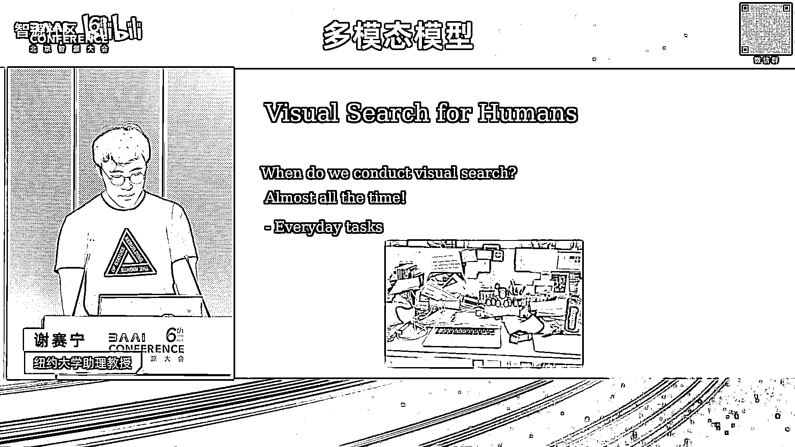

把结果push到比如说60多70多，这件事情都没有问题，但是我们可以跳过这一部分。

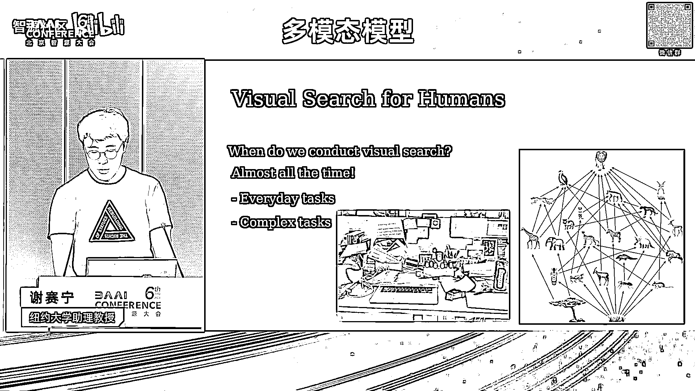

但是我想说的是，像这样的这种search的这种behavior，viral search的capability，在这种internet image的场景下面，可能真的不是必须的。

可能它会真的有一些overhead，我们还不如直接把所有的viral information，全部通过一个vim encoder，接收到一起，然后直接做好了，但是大家可以想一想。

如果我们以后要handle video，我们当我们现在要问一个问题，然后是一个很长的two hours video的时候，我们是不是得要必须从头看到尾，我们是不是会跳一跳，然后可能向前拖一拖。

向后拖一拖，大家看B站可能还是很习惯这样的，viral search behavior，或者说in 3D environment，或者说在embedded agent environment里面。

我觉得这件事情也是成立的，在这些task里面，我觉得我们就会对vim encoder的设计，以及这个观点，就是我们到底需不需要像这种system 2，的viral search capability。

才能让我们的multi-model system，达到一个更好的效果，我觉得这件事情可能会更有意义。

我们会跳过这一部分，然后当然我们也会做一些其他的，更多的vim centric，更多的discussion，比如说我们发现，另外一个比较好的载体是。

在这种art的domain上面去做formal analysis，我们找了这个世界上500，排名前500的这个名画，然后我们去ask一些非常detail的formal analysis，就是所谓的这种。

我不知道怎么翻译，但是对于art的professional来说，是很重要的一种分析能力，然后这件事情也可以拿来去benchmark，multi-model system。

然后最后我想要简单介绍的一个工作是，我们另外一个有点benchmarking，或者说一个新的environment，我们叫它VIRL。

Grounding Virtual Intelligence in Real Life。

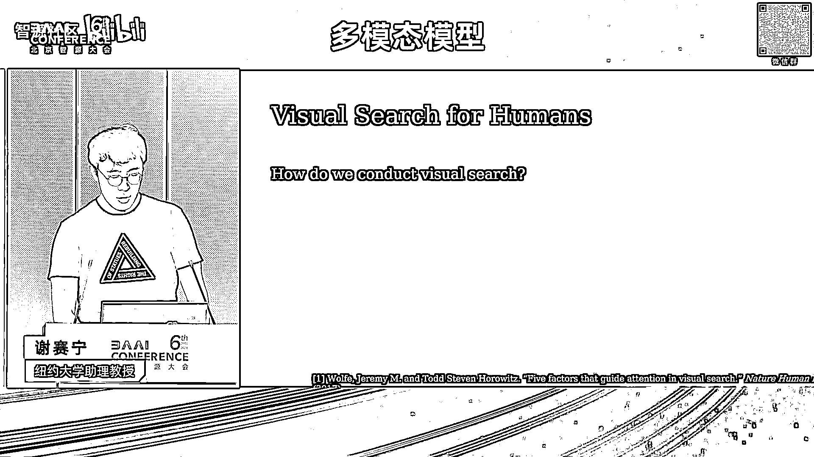

然后它的出发点是说，我们现在会有很多的agents相关的工作，但是很多这些agents的工作，还是会被deploy在这个，比如说sandbox game，这种沙盒游戏里面。

或者说robotics当然非常非常重要。

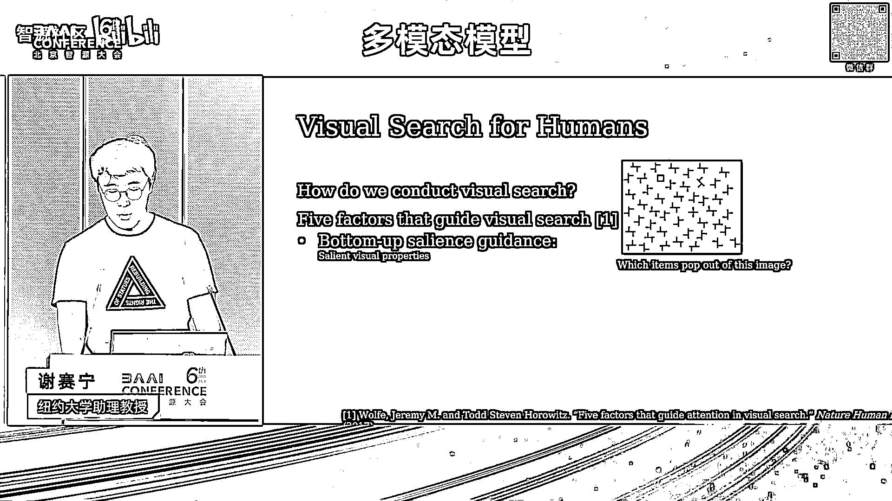

但是很多时候我们还是会受到一些硬件的限制，或者说大家会讨论在vim里面，什么叫做open world perception，但是这些讨论更像是open internet perception。

因为我们的所有这些VIRL信息的来源，可能还是来自于我们internet的这些，我们user uploaded and captured的这些images，我觉得因为时间有限。

我可以只通过一个video的形式来介绍一下，我们这个工作，不知道能不能放出来，我可以在旁边稍微解说一下，就是说我们会创建不同的agents，然后他们会有自己的behavior，他们会有自己的性格。

但是我们的environment，一个比较有意思的地方，它是在真实的环境下面部署的，然后并且所有的这些agents。

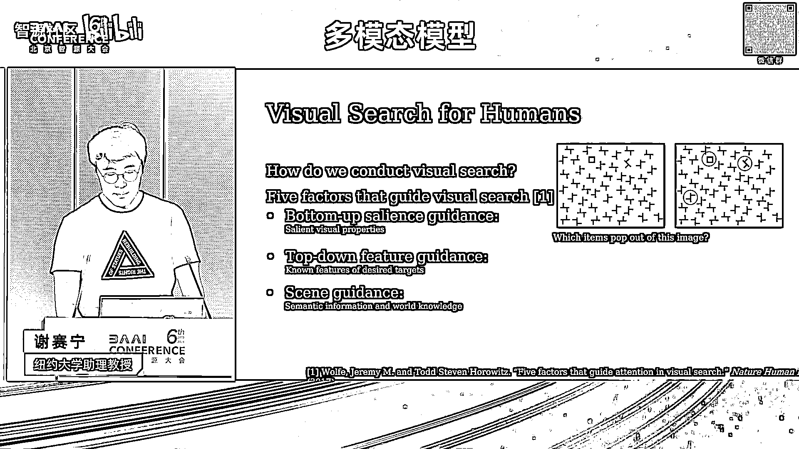

他们也会有真实的intention，好像有点卡，然后我们的这个agents environment，其实就是我们的city，我们当然需要用large image models。

我们当然也不需要用large vision models，所以它是一个比较复杂的系统。

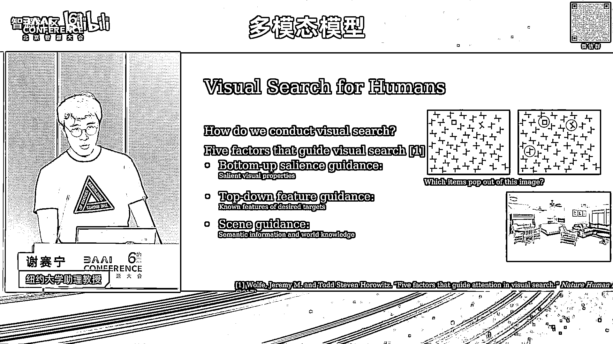

会定义environment，然后把它跟vision language，combine到一起，使得我们的agents能够有一些，它自己的intention，大家先看吧。

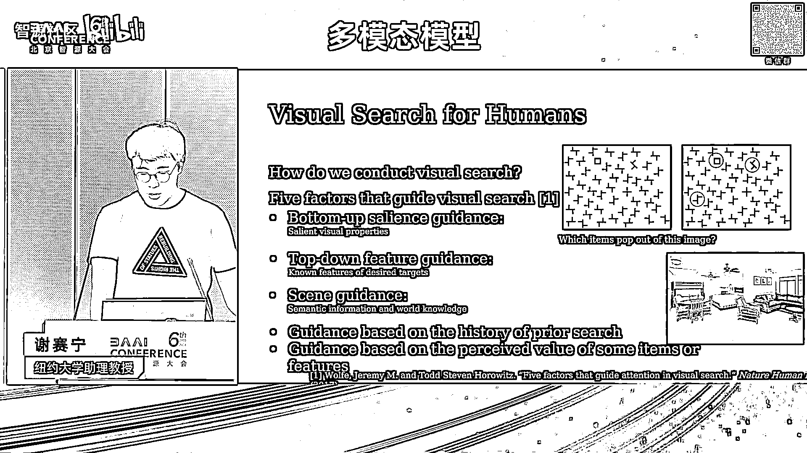

这是一个比较有趣的例子。

我们部署了这个agents到纽约的中央公园里，然后我们可以数出来，中央公园里面一共有多少个垃圾桶，agents之间也可以通过合作的方式。

去做navigation的选项，然后它还可以帮你去plan一些。

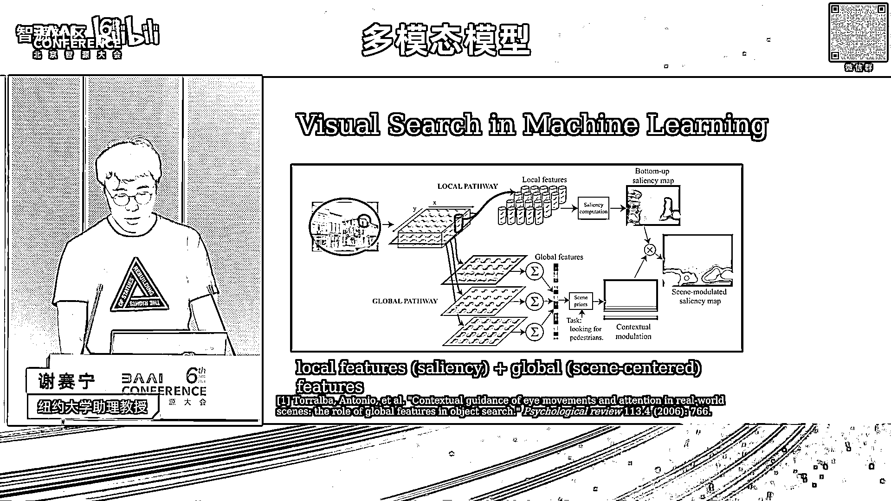

你的这些每天的行动，那我觉得一个更重要的事情是。

我们这个environment，可以作为一个很好的衡量，large image model跟vision model的一个performance的一个benchmark。

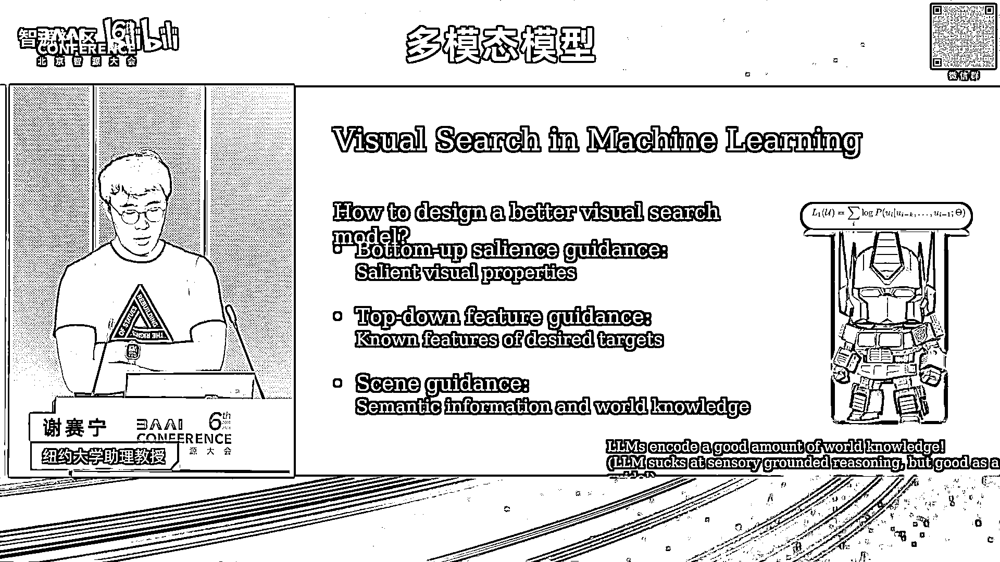

因为我们可以有更diverse的这些场景，它其实是整个世界上很多很多的city，然后可以做place recognition，可以做v2a等等，然后我们一共，这个好卡，包括在亚洲，在纽约，在澳大利亚。

在日本，我们发现其实对于，对于这样的agent的系统来说，我们发现，其实一旦我们把我们的vision的research，把它extend到这种真实的世界场景里面，我们发现。

其实在这个世界有非常非常多的问题，对吧，我们发现，比如说我举一个例子，更多例子可以从Pivot源找到，比如说我们发现，现在的large image model。

以及这个multi-model system，在这些发达的城市里面，比如在纽约，在巴黎都没有什么问题，但是一旦我们现在要去做同样的task，比如navigation或place recognition。

在非洲的城市，或者在一些不是English，作为dominant语言的城市，比如在东京 在香港，performance就会降得特别差，虽然现在大家会claim。

我们现在这些数据都是multilingual，然后会有billion scale的数据，但是当我们在这种真实的场景下面，部署的时候，我们就会发现，其实还是会有很多的问题，值得我们去解决。

然后我觉得这个framework，现在也是完全open source，然后我们也希望有更多的research，可以在这样一个，跟我们真实的生活跟世界，联系得非常非常紧密的一个environment里面。

去develop不管是embodied agent，不管是generated agent，还是这些core foundational的。

representation learning的这些technique，最后还有可能一两分钟的时间。

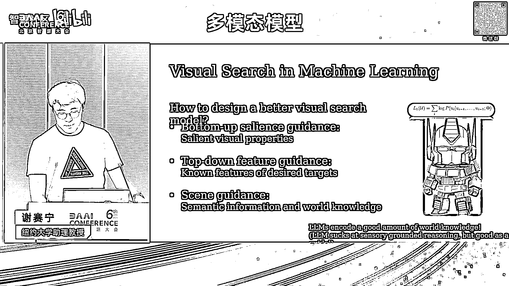

我想讨论一下更基础的东西，就是说，我们一开始说supervised learning，做得很不好，然后一个原因是因为。

如果我们只是想把这种，非常diverse的这种input，强行把它map到，最后的一个label上面去，我们所有这些chair都是chair，我们现在只告诉neural network一件事说。

所有这些事情都是chair，其实network做不了什么太多的事情，它要么会依赖于，这种sperious correlation，要么它就只能去memorize，这件事情导致。

我们会claim supervised learning，其实不是一个很好的，一个基础学习的模式，因为它的generalization是很差的。

然后再之后我们会讨论，soft supervised learning，为什么要做soft supervised learning呢，是因为我们想要去build。

这种background knowledge，and approximate form of common sense。

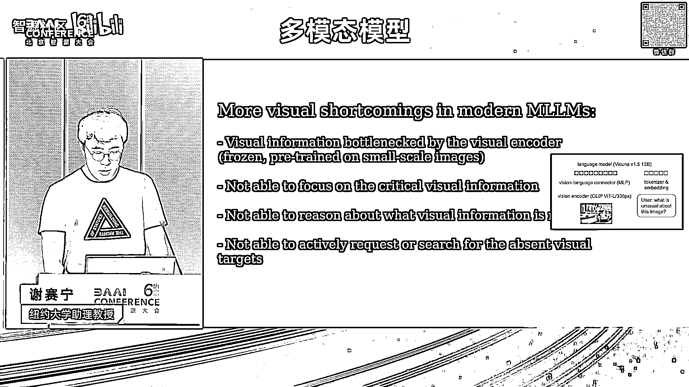

在AI的system里面去，但我想说的一个观点是说，CLIP其实是一个，strongly supervised learning的model，它不是，很多时候会有些misconception。

大家会觉得CLIP，是一个weak supervised learning，但它真的不是，因为language能够给你提供的，supervision是要远远强于。

just a few categorical labels，然后我觉得我们现在面临的问题，也是我们想要继续去在，这个virtual supervised learning的，这个领域去发展。

因为我们 至少我个人而言，我还是倾向于，subvised learning，能给我们一些，不一样的一些behavior，能让我们真的能够去学到，某种common sense。

和这种background knowledge，但我也要承认，在soft supervised learning，工作了这么长时间之后，我发现，其实现在这个领域，是有点getting stuck。

大家不知道该做什么。

what is next thing to do，然后我觉得可能，我们可以回顾一下。

这个soft supervised learning的历史，在2015年16年的时候，大家要对标的东西是说，image net pertaining to performance，在那个时候，这个就是。

这个ultimate的，这个representation learning的approach，然后那时候会有各种各样的，这个soft supervised learning的model。

比如说像context encoder，但那时候领域还是比较宽容的，就是那时候大家跟，这个supervised learning比起来，一般会差，比如10%到20%个点，但大家也不care。

我们会develop，各种各样的pretext task，然后我们继续去push，这个reaction往前走。

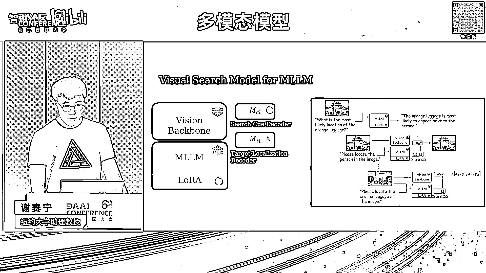

直到比如说到2019年，比如说凯明的moco出来之后，然后大家发现，其实这个soft supervised learning，也能work，并且它可以去超过，image net pertaining。

然后在各种各样的，variant task下面，但之后会有MAE，会有dino等等。

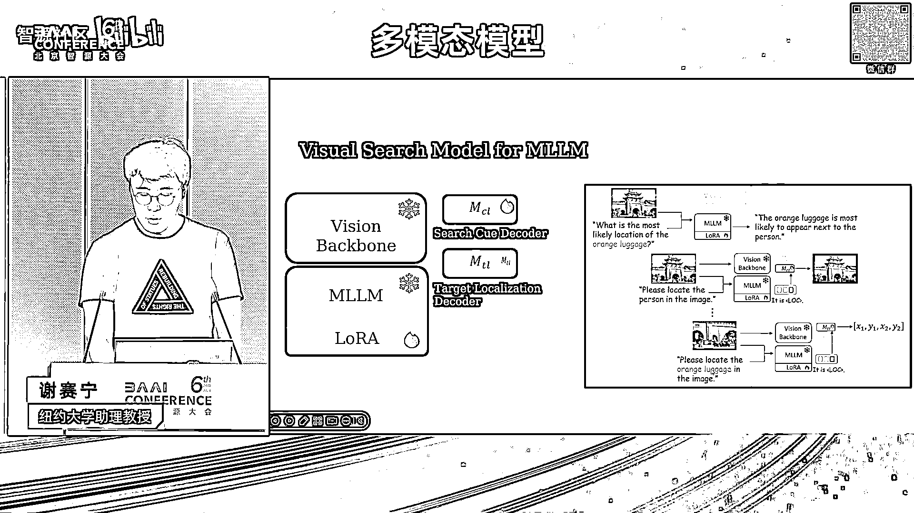

然后我现在想说的一件事情，其实是说，clip with strong language supervision，其实在当前这个时代，就是新的image net。

supervised learning的counterpart，然后我们现在，为什么还要做vision SSL呢，我觉得也是因为，说可能clip，它也会有各种各样，自己的问题，我觉得这些问题。

很多时候跟supervised image net，pertaining，其实也是很相关的，然后但是，还是像我一开始说的这样，我们怎么去做。

vision soft supervised learning，这个方式可能要发生一些变化。

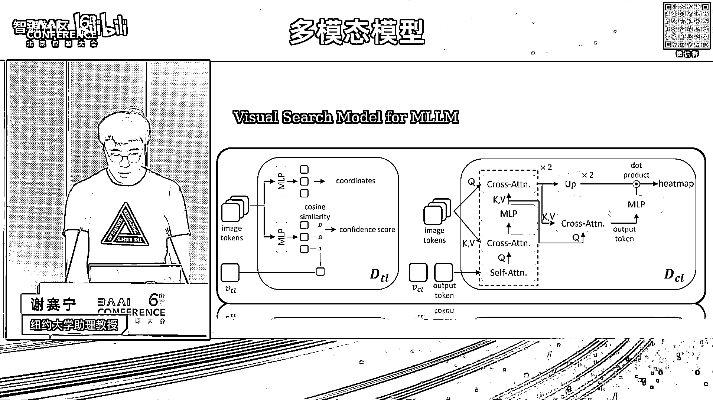

所以可能下周，希望吧，我们会release一个新的paper，我们叫它Cabrian 1，它是一个fully open，variant centric exploration。

of multi-model large image models，所以我们就make了这个analogy，在原来的时候，我们会要去develop，这种各种各样的vision model。

比如说不管是MOCO也好，MAE也好，然后我们会有一个，evaluation protocol，比如说我们会拍一个，linear probing，或者说有end-to-end tuning。

然后我们会在，image net classification上，或者cohoid detection，或者segmentation这样的task上面，去衡量我的。

view representation learning的好坏，我觉得一个比较可行的，在现阶段去study，vision soft supervised learning的方式，是说我们把像LAVA。

这样的multi-model system，把它当作一个，对于view representation learning，study的一个pipeline，我们还是会有。

pertained vision models，我们会design connector，然后只不过之前，我们会用linear probing，现在我们会用。

view instruction tuning，之前我们会有比较受限的，这些benchmark，但现在我们会有，much more diverse benchmarks。

all structured in this VQA format，但其实大家可以看到。

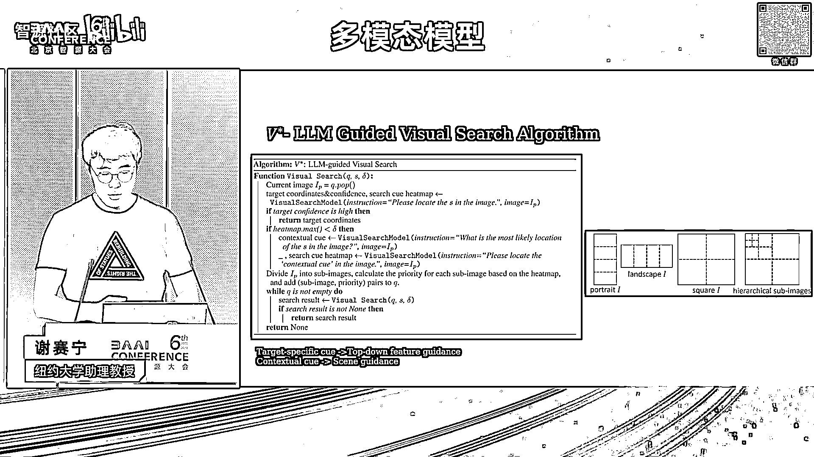

这两件事情，是有一些analogy，所以我们会从头，搭了一些infra，然后我们所有的实验，是在Google TPU上面做的，然后会release，一系列tutorial。

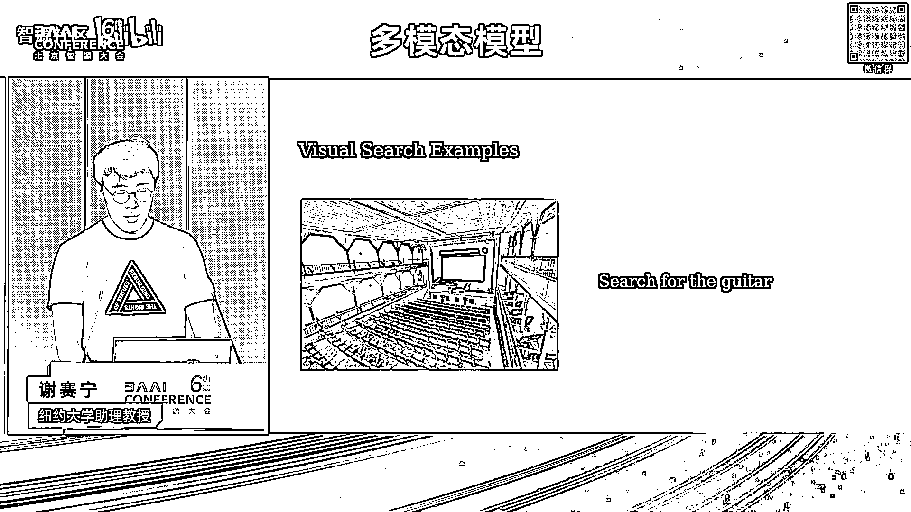

包括Petrochex， LA， and Chex，然后我们会重新去，整合现有的这些，instruction tuning dataset，然后去create一个新的。

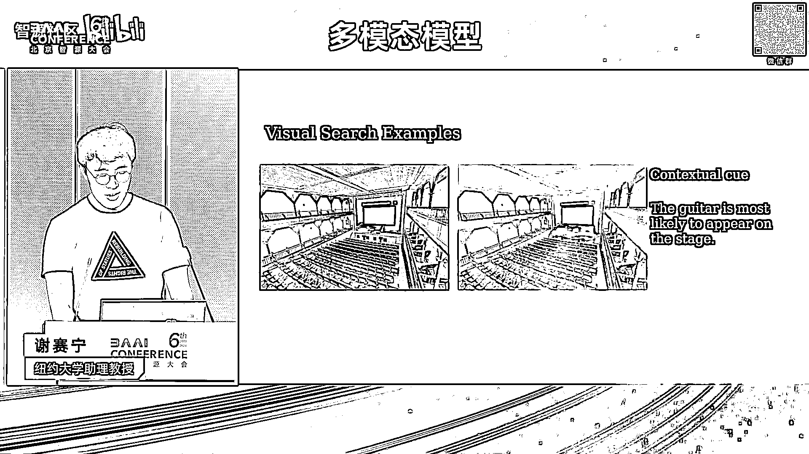

instruction tuning的，比较大的一个data set，然后当然最重要的事情是说，我们因为希望有这样的一个，新的evaluation的。

view representation learning的，一个pipeline，我们会benchmark，各种各样的view representation learning。

with multi-modelized models，然后我们会有，很多的findings，insights from tuning，and benchmarking，大概超过20个。

不同的vision models，它包括比如说，clipped model，as a learning model，也包括像depth prediction model，diffusion model。

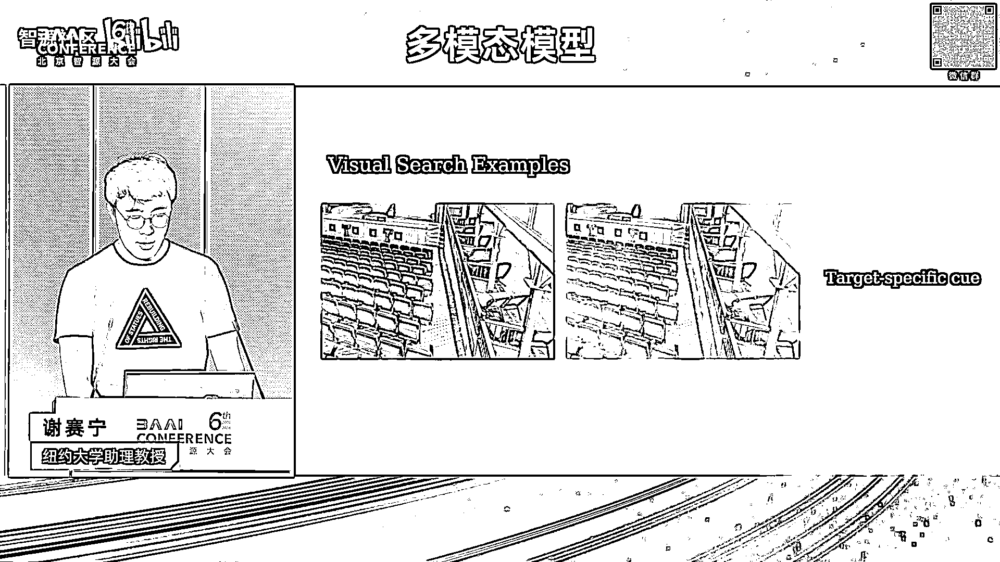

and segmentation model，对，然后我们整个的工作，希望能够成为一种，某种open cookbook，for instruction tuning。

multi-modelized language models，所以我们这个工作里面，会涉及到五个不同的pilot，包括怎么样去，选择，以及使用，各种各样的view representations。

怎么样去design一个更好的，vision-centric connector，怎么样去设计，instruction tuning data，以及各种。

相配套的instruction tuning recipe，以及最后怎么样去，能够去interpret，我们的results，因为现在还有一个问题是，multi-model。

这个large-language model的benchmark，实在是太多了，然后大家会arbitrary的选择，5到10个这个benchmark，来report the performance。

但是，hopefully we can do better，对。

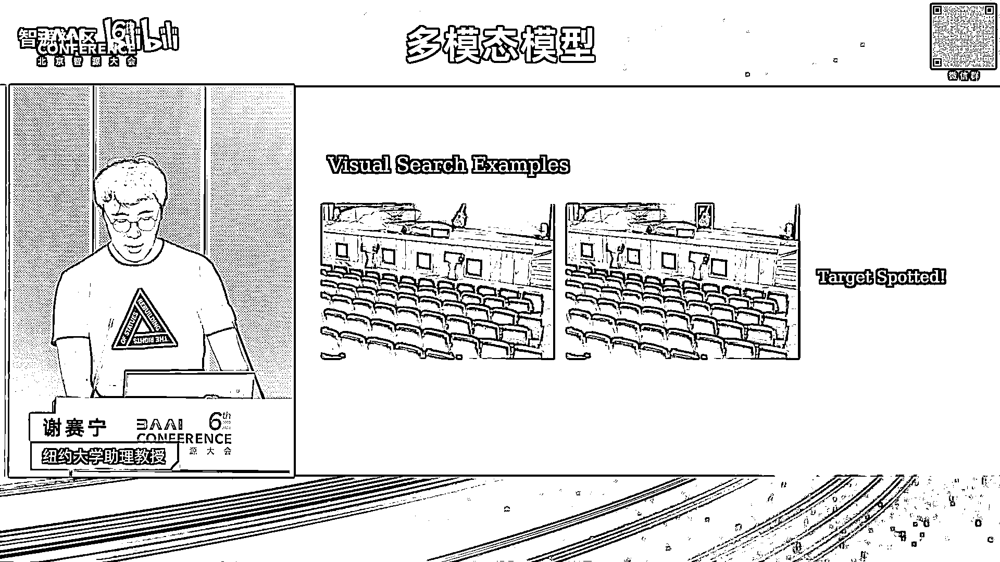

然后，这是，这个乱码，已经结束了，好，对，这个乱码，我看好像没有时间，对，这个乱码其实是我最后问了，Chai-Chi-P一个问题，我说我想要结束我的talk，然后你能不能，给我一句话总结一下。

这个关于improved vision capability，跟language understanding的，这个关系，然后Chai-Chi-P告诉我说，说，他大概说的意思是说，更好的vision。

不只是让我们能看得更远，也是能让我们理解得更深，这是Chai-Chi-P的回答，好，謝謝。