# 2024北京智源大会-多模态模型 - P5：A Real-World Approach to Intelligence-肖特特 - 智源社区 - BV1sT421a7FU

因为这也是视觉语言模型当你不能带一个两个男人，你知道的，有点，我想我也，当你的男性，你可以，找到了未来的替代方案，所以这是一个现实世界的方法，所以在我的博士生学习快结束的时候。

我从伯克利搬到了旧金山湾的另一边，去旧金山市，所以你们中的一部分人可能去过CD，所以当你看到旧金山这个词，你首先想到的是什么，嗯，有几件事是对的，也许金门大桥，大家以前都见过这座桥，也许是勇士。

你们中的一些人可能是篮球迷对吧，或者旧金山的山路，你知道这是一个多山的城市，D，四处走动不是那么容易的，或者如果你是爵士乐或传统流行音乐的忠实粉丝，你以前可能听过这音乐，我把我的心留在了旧金山。

法律要求旧金山的每个居民都能唱这首歌，嗯，我只是在开玩笑。

当然啦，你知道吗，这些头脑怎么可能产生这个概念，先回过神来，嗯，也许你在金门大桥是一座宏伟的大桥之前就开车上过它，它有几条狭窄的车道，或者你以前可能在桥上走过，风很大，但这美丽的景色。

也可能你自己就是个篮球运动员，你一直在看篮球比赛，在22届总决赛中，你知道战士们，它与凯尔特人竞争，勇士赢得了决赛，不幸的是，我是凯尔特人队的球迷，我们今年会回来，也许你和我一样，我以前住在这里。

这是一个相当大的冰雹，城市的一部分，我以前经常在这种路上走，大量运动，去附近我最喜欢的咖啡店，外面真的很美，或者就像我之前提到的，也许你有，你知道的，发送传奇托尼·班尼特之前的歌曲。

我把我的心留在了旧金山，但目前人工智能的学习模式是通过阅读维基百科，现在你知道了，他们从互联网上抓取数据，训练一个大型语言模型来记住这些事实，旧金山的权利，正式的旧金山市和县，这是惊人的，嗯。

它有人口啊，八十八万，437名居民，截至二十二，太神奇了，这座城市以前的历史是什么，在欧洲解决之前，那也很神奇，我称之为语言第一的方法，正如签署所回避的那样，然后呢，当然安当你记住所有这些事实。

听起来很神奇，对呀，你可以重复旧金山的整个历史，几乎每一本关于一篇文章的书，和一篇关于这座城市的新闻文章，当你不断重复，你就像没事一样，没有人能自己记住所有的信息，那一定是情报--嗯。

我认为我们从现实世界中学习第一方法，你去过金门大桥，你在看篮球赛之前就住在城里了，你也学会了唱城里的歌，所以这就是我所说的真正的，现实世界第一的方法，这就是我们作为人类如何了解这个概念，关于这个地方。

关于新知识，所以如果我们能接受这个想法，因为也许通过我今天的演讲，嗯，我想提供一种替代当前范式的方法，并介绍和讨论其中一些作品，我在加州大学伯克利分校读博士期间做过，我相信现实世界的学习有两个部分。

它们当然是交织在一起的，第一部分是观察，观察或感知自然是模型模型，当然跟视觉有关，包括声音，涉及很多其他的事情，第二部分是真正的行动，现在呢，能够获得，在现实世界中学习，你呀，你需要有化身的权利。

可能是机器人的物理化身，例如，你可以在现实世界中部署一堆摄像头，你必须能够与世界互动，然后观察之后有什么变化，从这些互动中学习，所以我想从这些作品中的第一个开始。

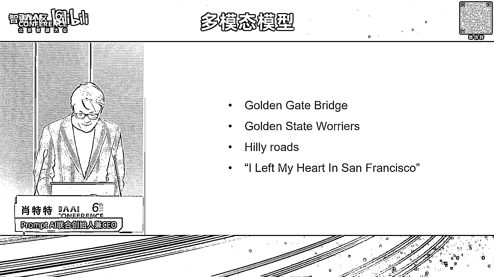

是片段，我在Meta AI研究所读博士期间写的任何论文，这个项目是由，所以在片段之前，现状是，我们预先定义了列克星敦的列表。

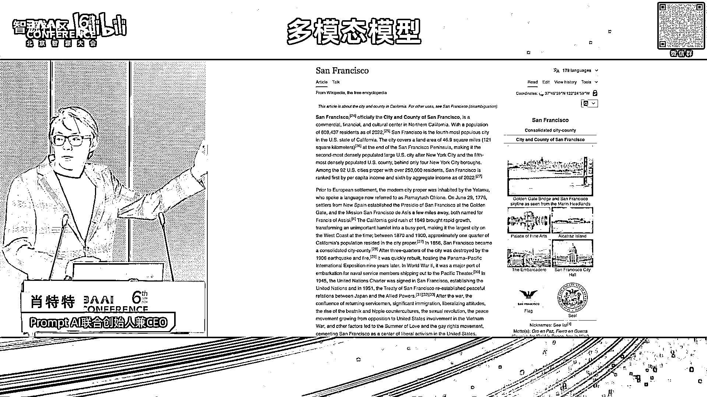

例如，那是字母表，例如，当我参与820K数据集时，由子弹乔带领，我们定义了一个类别列表，例如，你可以看到有一辆车，有椅子，有窗户，有桌子，在它下面，这些物体有很多部分。

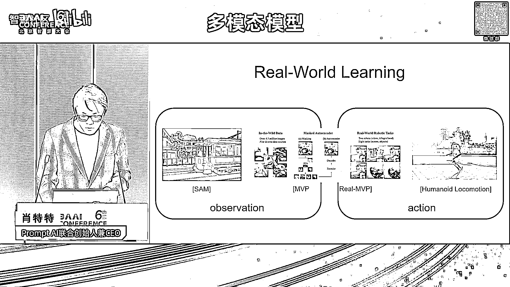

我们训练模特的日子，例如开放网络，在这些数据集上预测像素，明智的分类或图像分割，你可以看到这个结果很不错，但你就像，好啦，所以沙发就是沙发，但如果我真的想看沙发上的枕头呢，我想更多地了解沙发。

不同的人关心不同的事情，作为人类，你能认出沙发上的很多东西，甚至你的猫，如果你以前养过猫，他们也能识别很多东西，他们通常在沙发上有他们最喜欢的地方，对呀，通常是一个垫子。

他们有时还喜欢抓挠他们最喜欢的沙发，把一切都毁了，嗯，好吧，不管怎样，所以我们想出了这个叫做快速分割的新任务，动机就像，让我们摆脱这种预定义词汇表的想法。

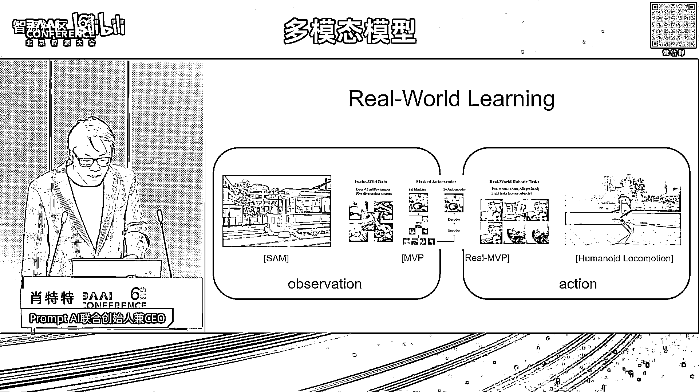

从一开始，所以它导致了你，这是一个系统，你可以用很多东西来提示，首先，它是交互式的点和框，例如，你可以在青蛙上画一个点，上面有一只蜗牛，系统就像，好的，好的，你想把管子的接头分开吗，他们就像不，实际上。

我只要青蛙不要蜗牛，然后在上面放一个负点，在这里有个红点，系统能够根据你的输入做出反应。

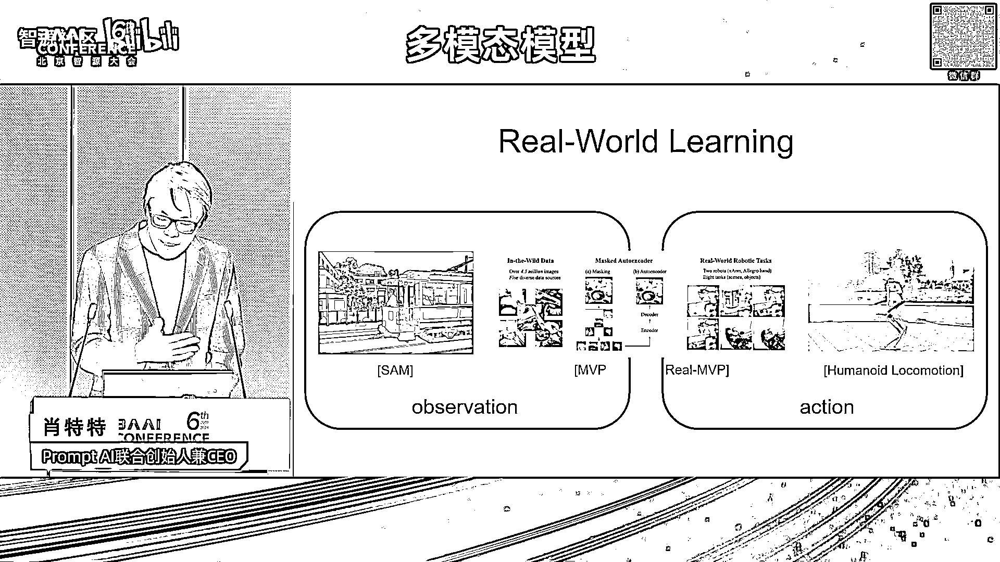

第二个真的很喜欢应用。

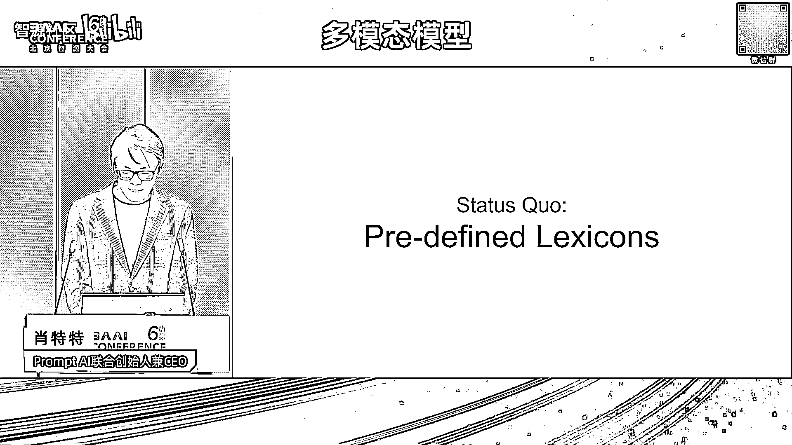

这在当时是非常有趣的，是当你把点，有自然的模糊性对吧。

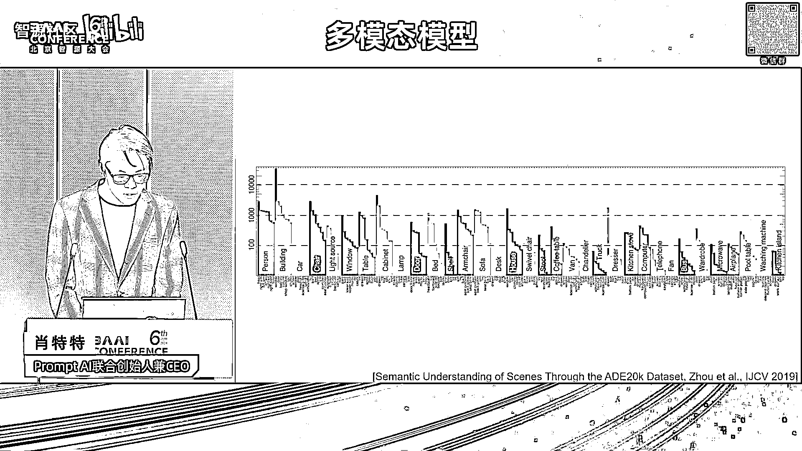

就像从信息论的角度来看，如果没有进一步的投入，这是不可能解决的。

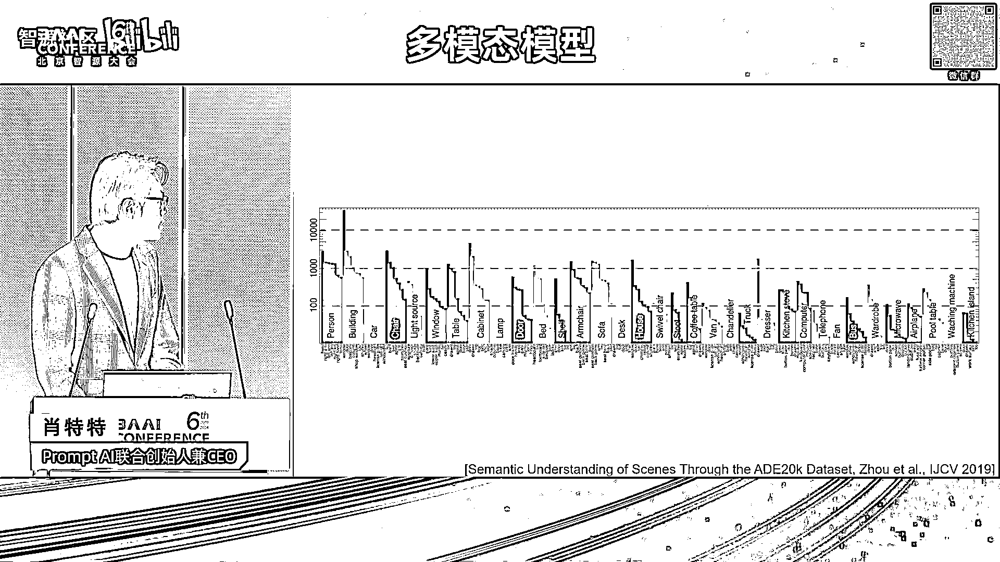

例如，如果我在一个人身上放一个点，在这种情况下，你真的不知道我是说那件夹克还是那个人。

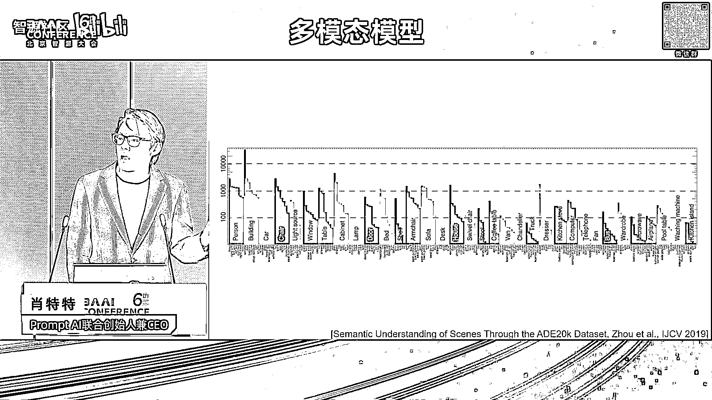

或者只是上半身，这个点有很多潜在的组合。

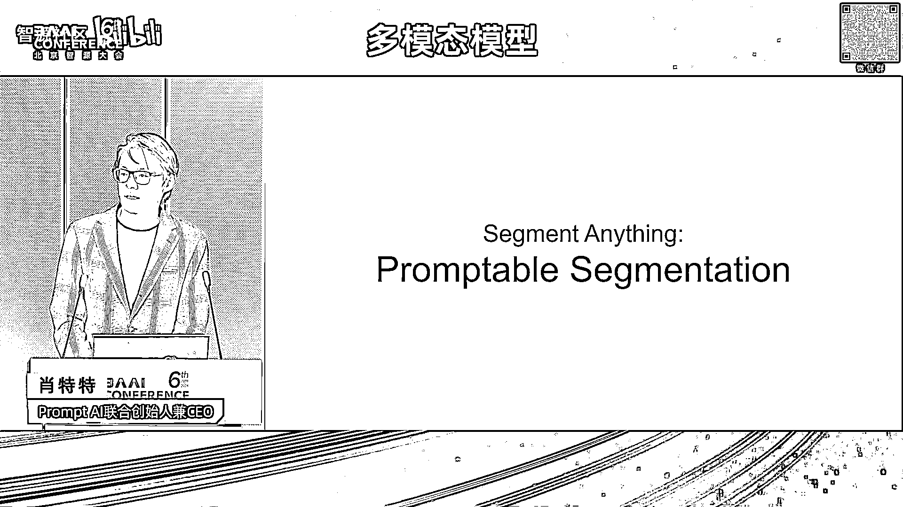

因此，该系统实际上能够生产几个面具，这些面具可能与。

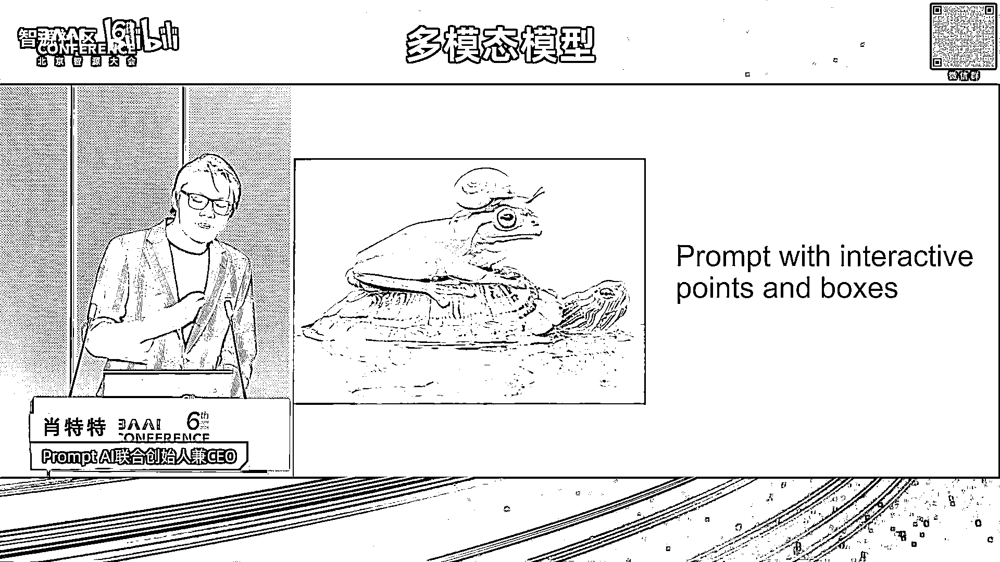

这种特殊的输入，第三个有趣的应用程序是像现在这样，你实际上有一个系统可以自动分割图像中的所有东西，因为你知道没有什么前科，所以如果你随便把。

或者统一地把这些想法放在图像上，而现在，您实际上可以从单个图像中获得许多不同的分割掩码，这真的很有趣，和原力，模型的方面是它自然地接受模型模型的输入，除了点和盒子之外，我们也可以处理可能的面具和短信。

而模型本身就是一个通用的分割模型，其实很简单，所以你有一个图像作为它的输入，你把它通过一个相当重的图像编码器，现在它正在加速，现在你有了一个特征地图或图像嵌入，现在你有提示了。

在你很好地提取了图像输入的嵌入之后，这种设计的好处是针对不同的快速输入，你只有一个非常轻量级的解码器，你需要重新计算，所以对于给定的图像，你可以预先提取所有的特征，并根据您喜欢如何提示它，那个啊。

计算速度真的很快，所以这有实际的好处，当然，我们真的没有数据来训练模型，所以不像，你知道的，大型语言模型，你可以在整个互联网上爬行，并训练模型预测下一个令牌，没有预科，你知道这一点，图像分割。

大规模图像分割，可以训练通用分段模型的数据集，所以我们必须建立这个数据引擎，循环范式中的模型，也很简单，所以你首先用你能得到的任何东西来预先训练一个模型，然后你收集数据，收集更多的面具，然后你训练模型。

然后你再去，结果呢，这是我们通过这个范例构建的最大的分割数据集，与之前最大的数据集相比，打开图像V 5，我们在一个数据集中有10亿个口罩，它大约是开放图像数据集的400倍。

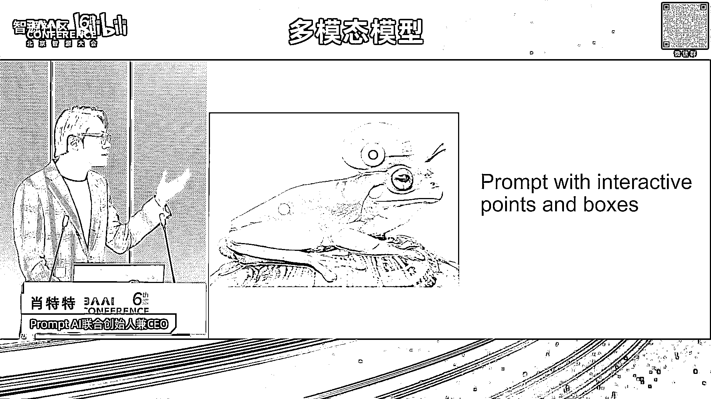

那是关于你知道的，观察与感知，现在一切都好了，现在如果我们，我们如何开发视觉系统的视觉表示，这样我们就可以支持探员，或者是人体人工智能或者现实世界中的机器人来完成这些任务，在现实世界中。

这是我们在22年做的一篇论文。

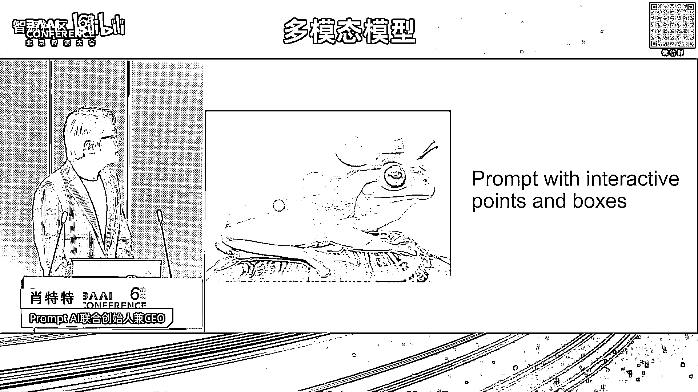

伯克利和当时的现状，机器人应用视觉和机器人应用是每一个任务，你必须有一个视觉编码器，那么这意味着什么呢，所以这意味着，作为一个人想想，现在你的任务是到达那个红色的块，在桌子上，你得有个视觉编码器。

专门训练来完成这项任务，现在第二个任务，第二个任务是拿起桌子上的黄色块，现在你得训练另一个视觉编码器，然后我想打开冰箱门，然后你必须有这与我们的工作方式完全不同对吧，听起来不管我们去哪。

我们必须有一个不同的大脑部分，那是专门用来做那种事的，这可能会很不愉快，我想说作为一个聪明的人，所以我们改变了这种模式，让一个单一的pre。

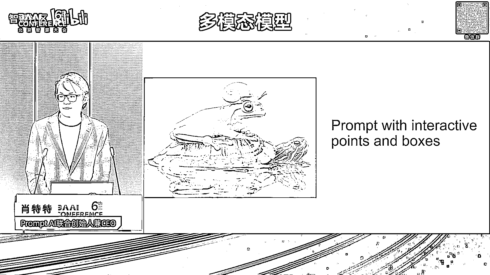

训练有素的视觉编码器，适用于所有这些任务，我们是怎么做到的，那是我们在野外收集的数据，我们有五个不同的数据源，例如图像分类，或者人与物体的互动，和互联网视频数据，YouTube视频，例如，比如烹饪数据。

最重要的是，我们预先训练了一个掩码自动编码器，作为这些数据的可视化嵌入，动机是如果你知道我们能够很好地重建，那是信仰的巨大飞跃，当然，如果我们能重建人们在其中的数据，人们在做饭和画画，做一些随机的事情。

我们能够获得一个视觉表示，这对涉及的下游任务有好处，例如，现实世界的交互也是如此，然后使用这个预先训练的视觉表示，我们转移，我们很好，调整了几个机器人任务，比如，你知道的，捡起积木，嗯，关上玩具冰箱门。

从辅音槽里拿东西。

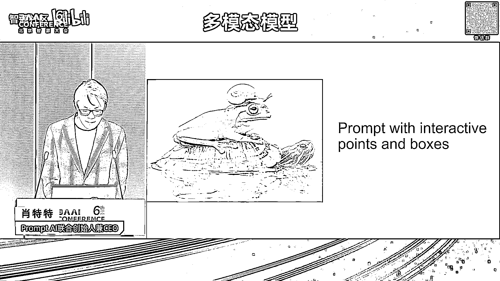

我们看到的是这些视觉嵌入，优于当时所有标准视觉模型，例如，剪辑模型或监督模型的图像或从头训练，当时负责监督imagenet模型和从零开始的训练，或者是那种范式，或用于机器人学习的标准管道。

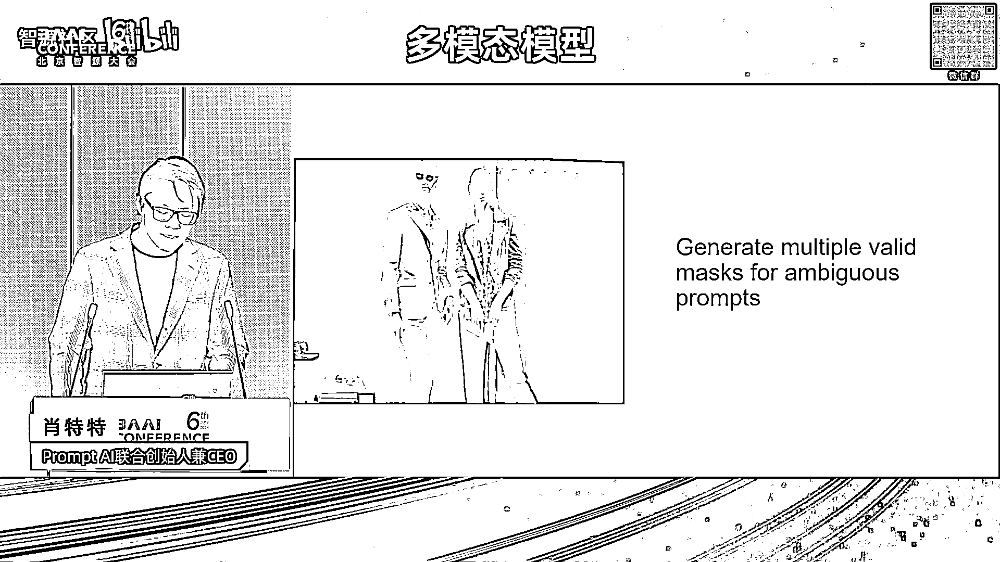

我们当时也发现了有趣的事情，当我们试图缩放模型时，从，例如，这里的一个小模型显示为一个大模型的vi t s，基于Vt的小数据集模型，大约七点，七十五万帧，业绩实际上下降了啊相当大的差距，我们都很好。

缩放不起作用，但在这种情况下当然不是这样，因为当我们在论文中的更大的数据集上训练模型时，大约有四百五十万帧，我们实际上看到了我们想要的性能提升，所以真的很有趣，这真的很重要，你知道的。

Coscale您的模型大小和训练数据，当然啦，当然啦，该范式还与更大的视觉模型进行缩放，所以当时我们训练的最大的视觉模型是一个乡村模型，这大约是雷内特50号的十五到十四倍，在论文发表的时候。

Resnet 50模型实际上只是机器人学习的标准，你知道的，我认为这种预训练模式很有希望，实际上是为了在机器人学习中使用更强大的模型，所以一个自然的问题，当然啦，在我们完成论文之后。

我们能不能提前训练一下，你知道的，视觉表示，我们能多训练点吗，包括，例如，动作，范式的交互部分。

因此，由我的老朋友和合作者伊拉领导的团队，还是野蛮的乌伯克利，如果没有我的参与，这项工作是关于用感觉运动预训练进行机器人学习的吗。

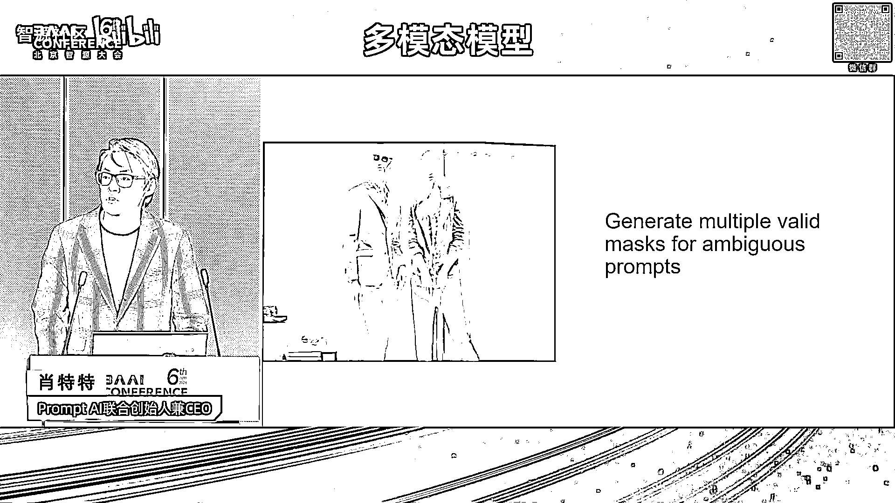

所以不仅仅是视觉预训练。

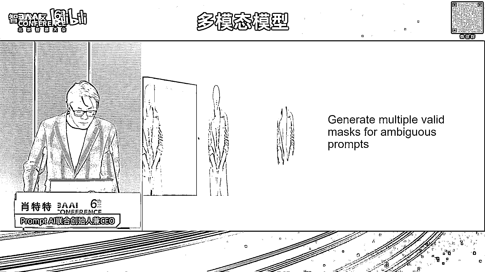

当然我们预先训练视觉模型，以及整个轨迹，不同的摄像机和预感知，所有的东西都进入一个轨道，把它掩蔽起来，通过变压器发送出去，所以现在你可能想起来了，好啦，它看起来非常类似于鸟类模型的语言范式。

这正是作者的意图。

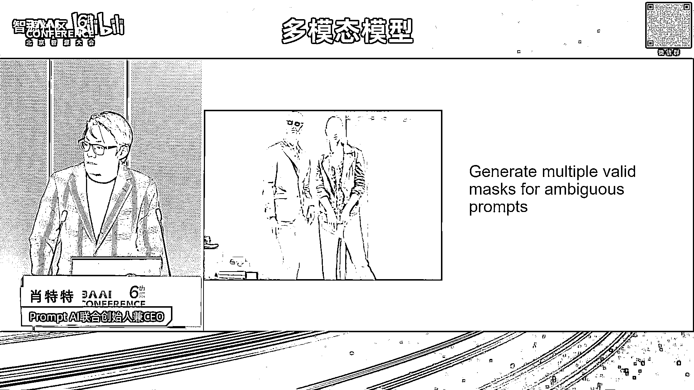

这听起来像是一个非常简单的范例，但我强调了网络上的两个发现，第一个是它能够跨实验室传输，那很有趣，所以誓言，机器人学习的神话，你在实验室开发的算法，在隔壁的实验室里行不通，为什么那口井，灯光变了。

人们想出了所有的借口，对呀，灯光不一样，这次不一样，我的相机位置不一样，桌子颜色不一样，你知道的，如果你只能关上自己的冰箱门，世界上没有其他冰箱听起来令人沮丧，也不真正智能，所以这是一个非常有趣的发现。

论文中最有趣的发现，通过预先训练这些表征，您可以从系统中看到很好的通用性或可转移性。

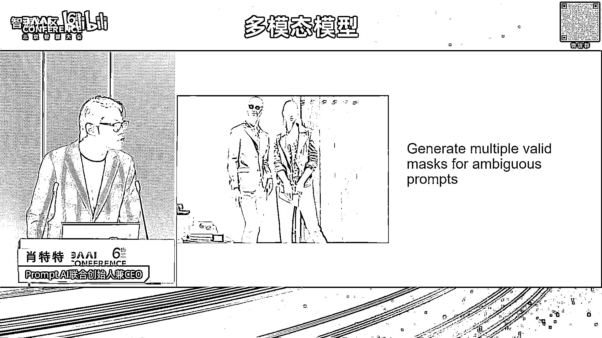

第二个是它不仅在实验室之间传输，它也是从机器人，我们有在X臂上收集的数据，然后我们用数据对模型进行预训练，并将其部署在机械臂上，而且效果很好，但比在法国模式下从头开始训练要好得多。

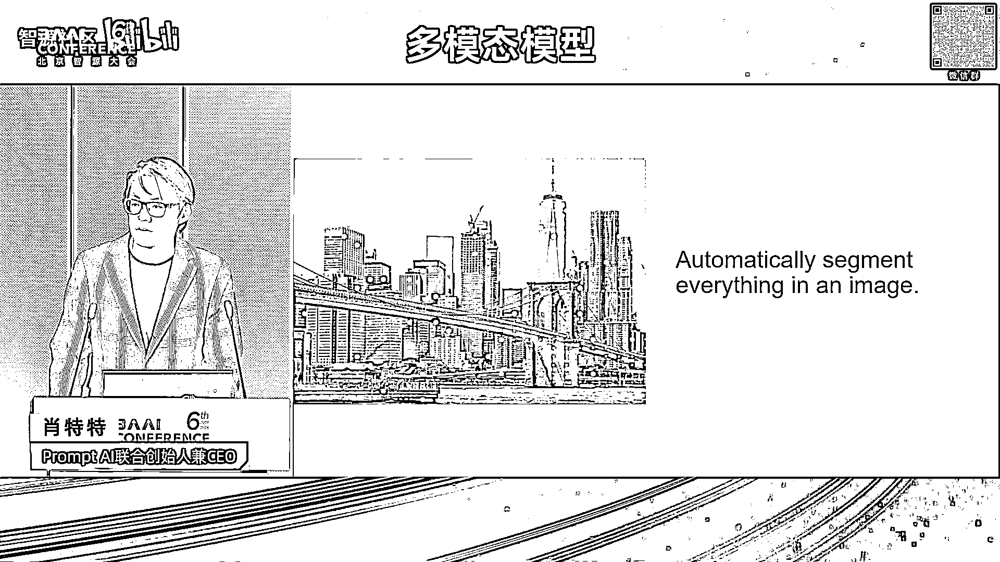

所以这真的很有趣，我演讲的第三部分是，你知道的，我们也想发展什么样的新的化身，现在您可能已经观看了GDCS，你可能一直在关注新闻，或者真的人形，我认为人形机器人真正有希望的是。

我们的世界是专门为我们建造的，你知道我们有这么多楼梯，我们有一个有趣的手柄，我们可以操纵，比如用我们的手，我们有点想，我们不想看书，设计和重新开发我们的世界，只是为了让我们，你知道我们可以。

我们可以在那里部署机器人，那是不公平的，作为一个人我会对我说，所以我们希望机器人能够生活在这样的世界里。

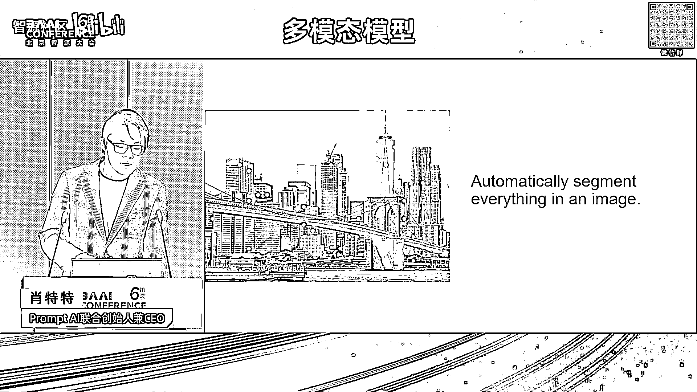

那是人形的，所以第一件事，当然啦，一旦你有了机器人就好了，你得让它走路，真的吗，如果它不走，这不是，和机械臂没什么区别，你骑在桌子上，就在，你知道的，那你就没学对多少。

你能学到的最好的东西是桌子上发生的一切，虽然那已经是，你知道很难，这是一个真正的桌面，脉动是一个非常具有挑战性的任务，你知道学习，但还是，你知道的，步行运动，所以我们从那里开始。

这篇论文最近发表在《科学》杂志上，加州大学伯克利分校团队领导的机器人技术。

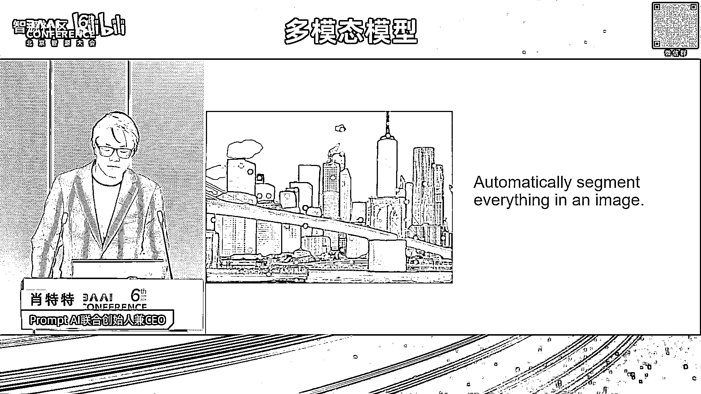

美国机器人制造的digi机器人，机器人公司Lility Robotics，嗯，你可以看到它是一个全尺寸的人类机器人，我想它大概有四十磅重，也许五十公斤，它有一种有趣的向后弯曲的腿，看起来像鸵鸟。

公司设计了机器人，这样你就知道他们什么时候，你知道膝盖不会阻碍它，当它弯下腰的时候，这才是真正的动力，然后嗯，它是全尺寸的机器人，它有激光雷达，我们在报纸上并没有真正使用这两只胳膊，但不幸的是，没有手。

在机器人的特定版本中，我们使用因果转换器，轨迹只是机器人的中央马达输入，那主要是根据感知，例如，你们的联合立场，对他们来说，关节速度和其他一些东西，从机器人的陀螺仪输入，变压器所做的只是预测。

在关节空间，然后我们把它映射回机器人控制系统，那么我们如何训练这个机器人呢，我们不能真的部署，你知道现实世界中有一万个机器人，让它从那里学习，那会很混乱，你看到整个机器人舰队总是倒下，有点。

所以我们求助于模拟器，这是英伟达艾萨克C健身房模拟器嗯，我们跨越了某种，有点，你认识很多人，很多很多这个机器人的复制品，并让学习者从模拟中，所以在模拟中，我们随机改变了那个世界的物理性质，例如。

对于不同的机器人，地面的摩擦力是不同的，另一个机器人也是，你知道不同的尺寸，只是为了增强，有效载荷不同，你可以想象一些机器人没有携带任何东西，一些机器人真的带着，在那里露营的那种，也喜欢。

你知道不同类型的场地，例如那里有崎岖的地形，也像你知道的平坦的地形，也喜欢不同种类的斜坡，有点慢，好啦，所以嗯，即使在模拟井中，我们如何训练它，这是通过强化学习，当然第一步很好，如果你研究过强化学习。

你知道训练是很难的，我们称之为样本复杂度，需要一段时间，所以这就是为什么我们用这种两步走的方法，这在实验室里是首创的，在苏黎世的实验室，所以在第一步中，我们使用一种我们称之为特权信息，例如，环境参数是。

例如，摩擦系数系数到底是多少，你知道，在现实世界中，你无法真正衡量这一点，但是在模拟中你可以读到，所以你首先训练一个模型使用这个，然后在第二步中，你不仅要强化学习，也是模仿学习。

意思是向能够获得特权信息的老师学习的模型，你的学生模型没有特权信息，但它至少可以像模仿，老师做什么，感觉就像你在模仿超人，所以这会缩短你的训练轨迹。

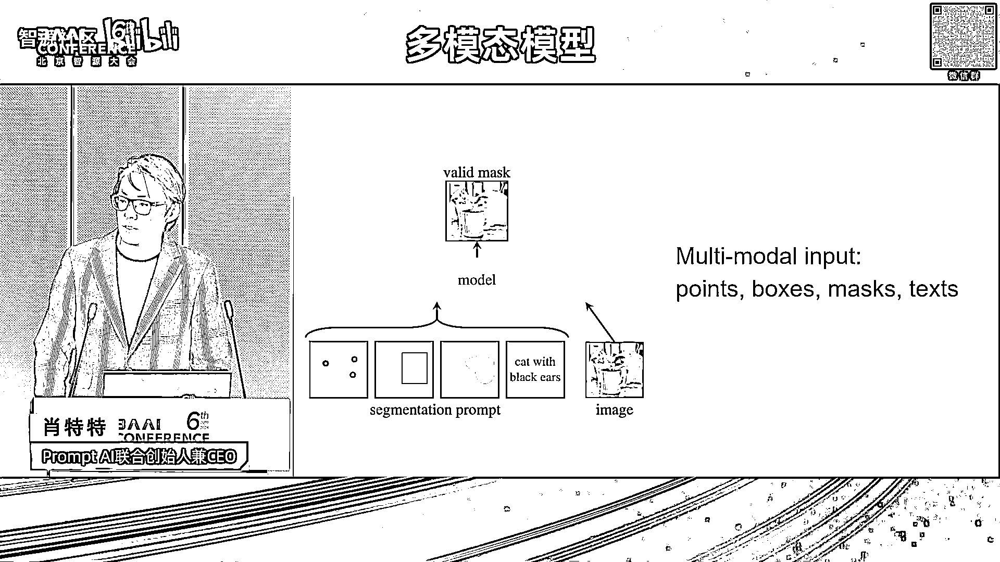

我们在地平线上训练的东西，在那之后，我们只需从资产宝石模拟器中部署它，就身体与敏捷的相互作用而言，这并不精确，一个模拟器是由公司提供的，有更好的物理是极其缓慢的，当然，你不能在模拟器里做基于学习的算法。

然后你知道，把它转移到一个真正的机器人上。

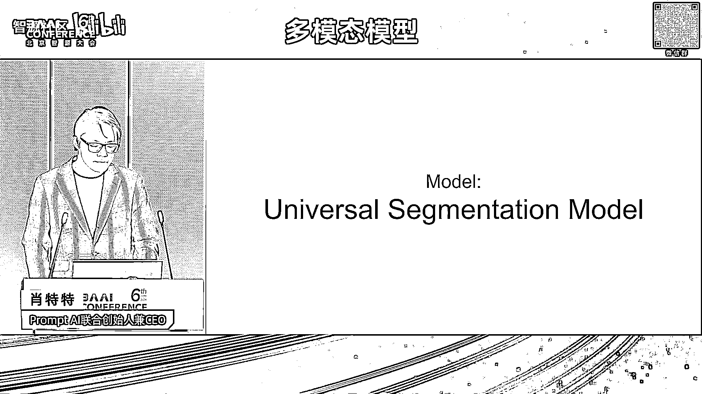

所以它得到的是，它导致的是你可以在现实世界中直接部署的模型，嗯，零发，意义，我们这里不做微调，它已经可以做得很好了，例如，就像，你知道的，嗯，左上角是，它走在伯克利校园里，起作用了，它正走出南门。

穿过校园和其他地方可爱的小溪，所以这些都是，当他们被枪杀时，你还可以做的是，我们称之为全方位行走，所以不仅向前，也向后向后，这里是伯克利体育场，你可以看到就像，我觉得帧率有点低，所以就向后走而言。

感觉是相当深思熟虑的，而且一切也都可以转动，当然啦，同样有趣的是，我们看到这个突然出现的手臂在摆动，很像人类，虽然它不是完全对称的，但至少有点接近了，所以这种行为我们可能不会接受，你知道吗，说真的。

因为当我们走路的时候，我们总是摆动手臂，这很自然，但是你知道，过去的科学研究发现，这种行走行为导致了一种，一个更多，你可以称之为更节能的，一种行走模式或行为意味着。

就像你知道你不必吃那么多卡路里来走路一样，例如，一公里通常是我们走的路，但你可以，你知道我们也可以把你绑起来，所以你不能真的摆动你的手臂，或者你知道你只是抱着你的胳膊，或者你真的用相反的方式做。

你可以看到正常的，正常的，步行模式是最节能的模式，当然，反正常模式是最糟糕的模式，所以这就是为什么你看不到，你知道的，足球运动员往那边跑，嗯。

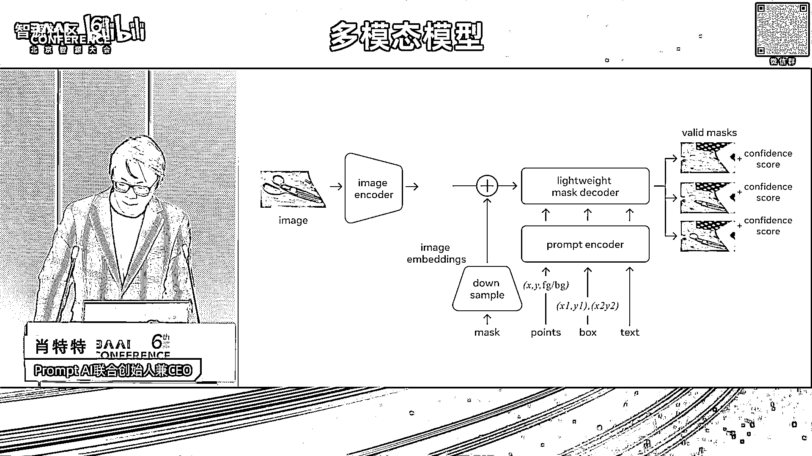

这个系统还有什么有趣的地方，它是在环境适应中这样做的吗，所以你看到的是机器人正走下斜坡，大家可以看到，嗯，它先，你知道这是，这是正常的正常行走模式，当它让我看看我是否能再玩一次，是的，在这里，是呀。

所以当它走下坡的时候，它是这样做的，你知道一小步，一旦它稳定下来，它又恢复了行走的模式，所以感觉它在适应上下文，取决于你知道，例如，机器人所在的地形，所以我们在这里做了一个小问题来可视化，例如，各州。

几种不同的隐藏状态，你也知道，映射隐藏状态，或者不同的维度，利用这个降维，呃技术，例如，偷袭技术，嗯，平坦的区域在x轴上用蓝色着色，斜坡是橙色的，你可以看到随着时间的推移，当它进入斜坡地形时。

两种不同的隐藏状态，他们的反应变化很大，一旦它回到平坦的地形上，海登州恢复了平坦地形的行为，在特征空间中，这些也是非常不同的，在这方面，你知道的，走在不同的地形上，还有就是，当然啦，外部干扰。

有我们应用不同种类的干扰，但是你知道，只是为了好玩，我在展示一种，你知道的，它被一个尤加球击中了，在这个过程中没有机器人的伤害，你知道的，另一个自然的问题，当然啦。

你可以问这个问题我们能更接近面具建模吗，例如，现在我们用变压器，那太好了，它是因果转换器，但是他们能通过数学建模学到更多吗，例如，不仅通过加固，学习答案实际上是你可以，当然团队又进行了一次。

伊利亚没有我的参与，我们可以分类，例如，作为下一个标记预测的人形运动。

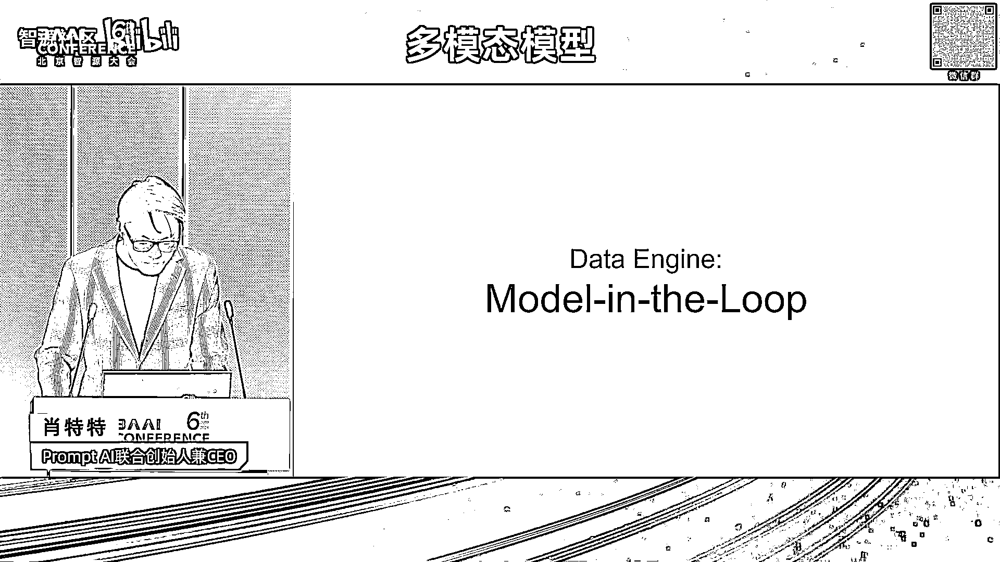

好吧，现在每个人都遇到了同样的问题，现在终于发生在我身上，我真的不知道这个词到底是什么，但不管怎样，我会谈谈的，意义，就像在模拟中一样，我们已经有一群控制者了，例如，你在报纸上看到了，我们收集轨迹。

嗯你知道，就像你知道的传统机器人机器人控制器，这是第二个数字，第三个是你知道数据的MOCAP，所以这就像，你知道你在一个空间里有这个单词摄像机，我们捕捉，例如，人类如何行走，然后第四个是你知道的。

用于计算机视觉算法的三维重建，例如，人类是如何从视频，所以你可以看到不同的，非常不同的数据来源，你知道我们也尝试用不同的方法来注释数据。

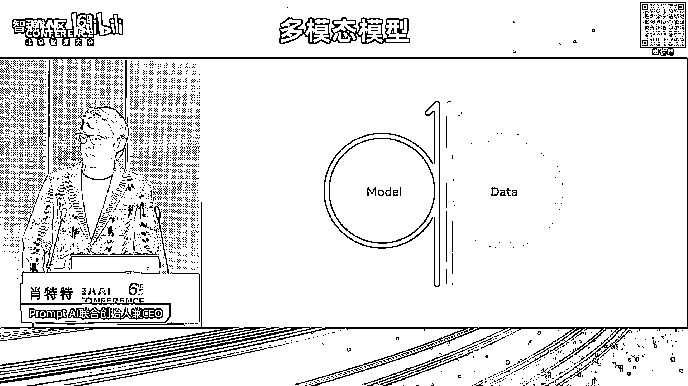

所以你可以训练，当然使用完整的数据，所以它的作用是，你刚刚加入了弹道，你可以预测轨迹中的状态，但也很自然地，现在你可以用口罩数据进行训练，所以再一次，那看起来像一只鸟，所以我这里没有幻灯片。

你将能够看到你将能够看到的，其实从报纸上看，门模式比基于Moto强化学习的控制器更好，它也跟随你的命令更好的意思，就像如果你想走路，例如每秒一米，嗯，它能跟得更近，听你指挥，说到这里，前面是什么。

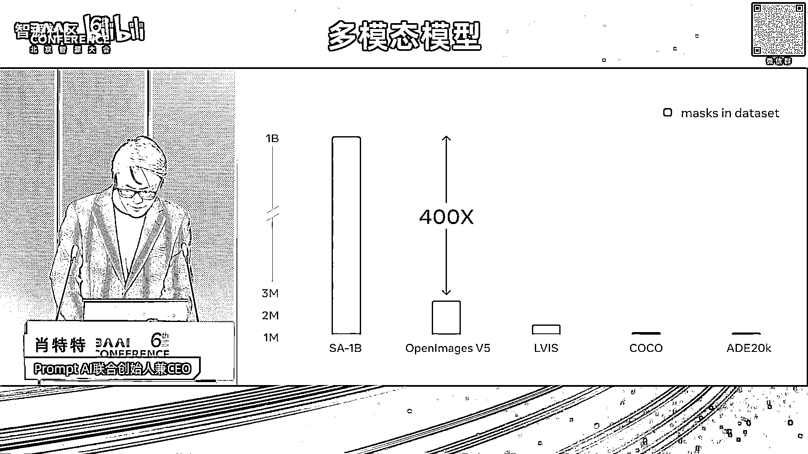

在…方面的权利，例如，申请，嗯，我首先想到的是自然和环境，例如，这是你知道的，你可以用SAM，例如，追踪不同的野生动物，并能够研究它们的模式，或者只是对嗯的统计分析。

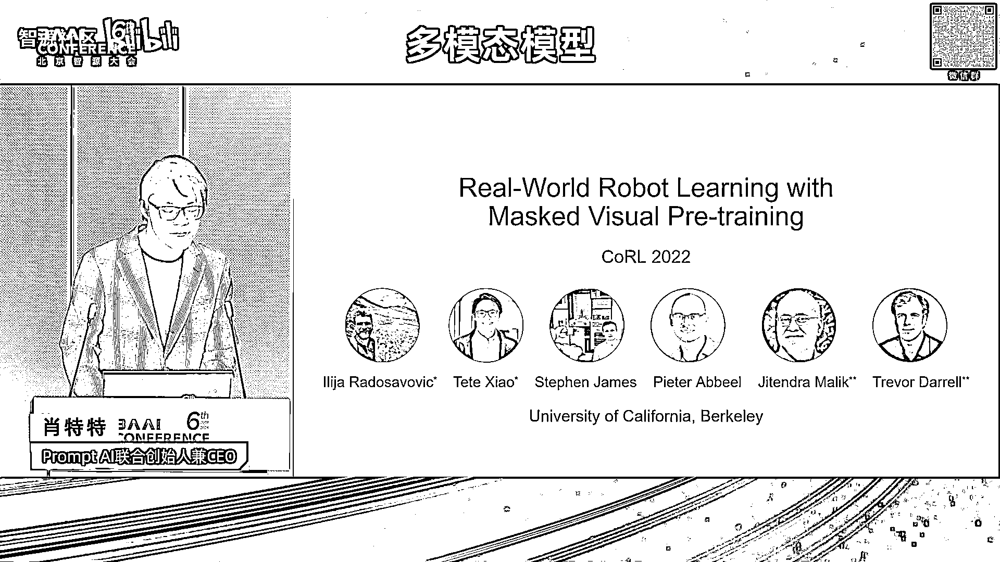

动物甚至树木，例如，也是科学发现，嗯，生物学中的一些主要问题实际上只是人类的劳动，我们要训练，你知道的，这么多生物博士，他们有点，你知道的，小黄人做着主人布置的大量实验，在这种情况下，他们的博士后。

这些实验，如果我们有，例如，计算机视觉技术，在未来的机器人技术中，我们可以你知道。

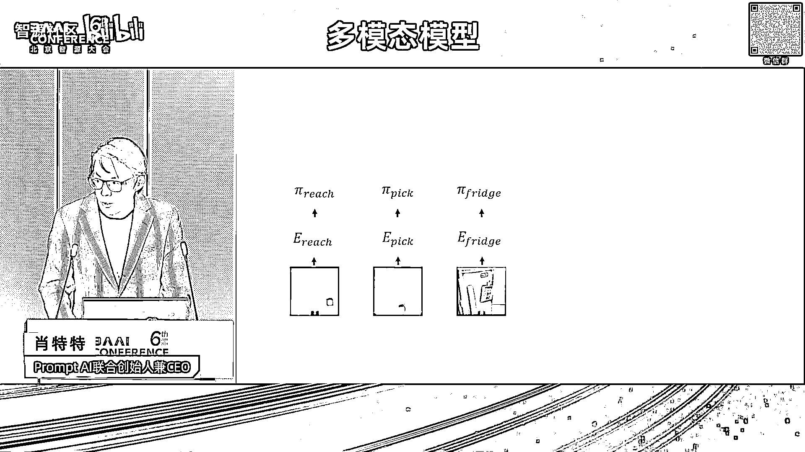

简化此过程，第三个是增强现实，因为你知道当它涉及到现实，你知道你必须摆脱仅仅是互联网数据，这些基于互联网的模型，因为你真的需要进入杂草，好啦，你知道我怎么做，你知道的，去拿点东西。

或者我可以用这个做什么，我在哪一步，嗯，你也知道给予，例如，对用户的实时反馈，所以这真的涉及到对现实世界的理解。

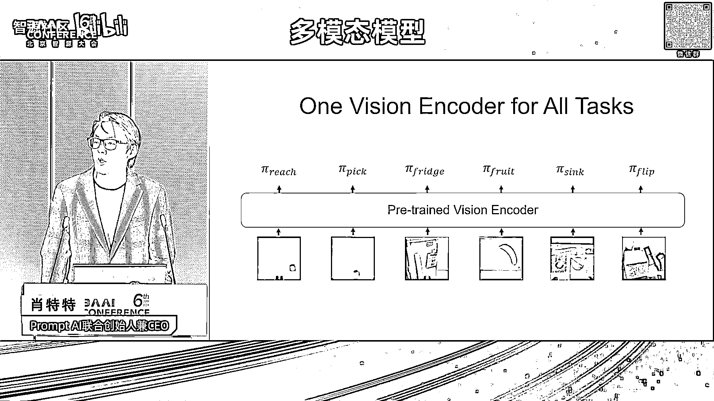

第四个是自动家庭，嗯，所以这有点，你知道的，在过去的许多年里处于技术创新的中心，我们都梦想着一个地方，在那里我们可以做得更少，让机器，以及他们是否，你知道的，摄像机和机器人处理我们所有的任务，例如。

你知道当你出现的时候，它向你问好，它知道你的模式，你喜欢做什么，你在家里不喜欢为他们做什么，你的特质和行为，甚至在未来部署机器人可以为你做饭，可以帮你打扫你的家，我知道我们离那个现实还很远。

但部分还是可行的，已经可行了，例如，只是这种，你知道的，家里可以的摄像系统，真正理解空间的人，我敢肯定在讨论区，我们会讨论我们最喜欢的模特。

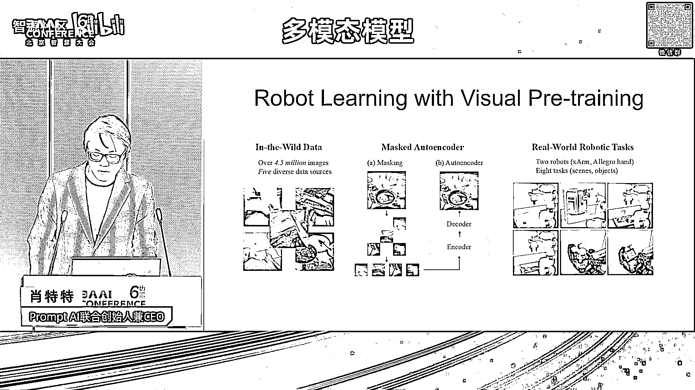

或者像我们希望在未来看到的现实世界的应用程序，所以最后，当然啦，放置欢乐，不错的机器人视频，当它走过旧金山所有这些美好的地方。

