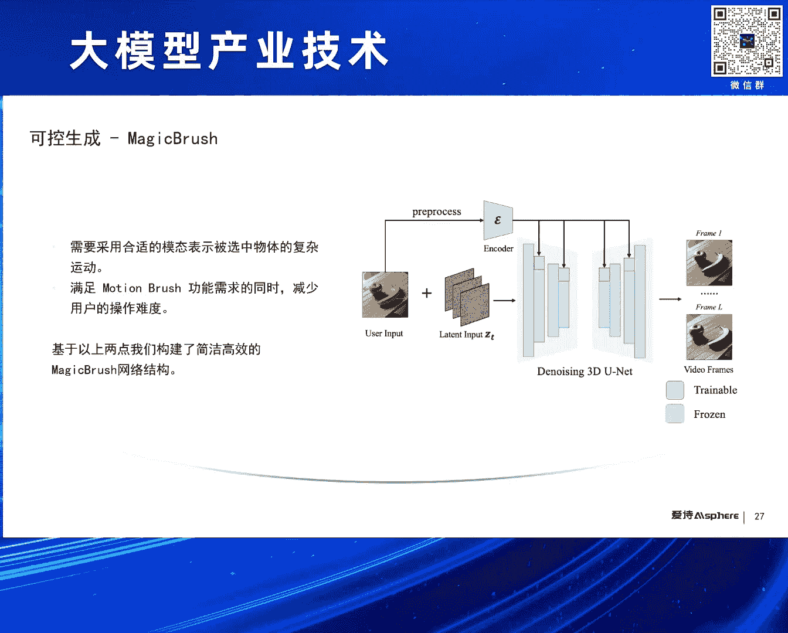
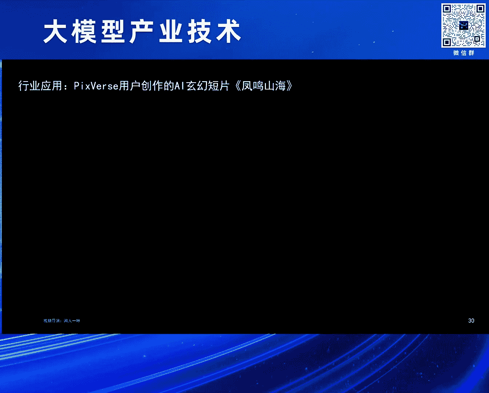
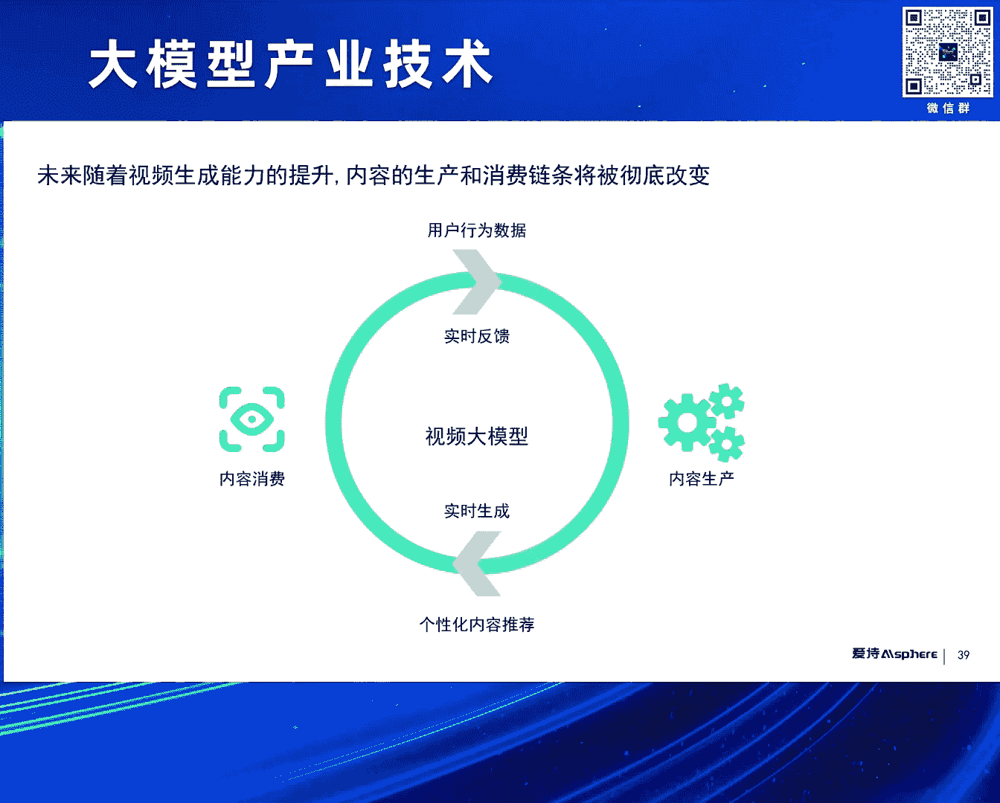
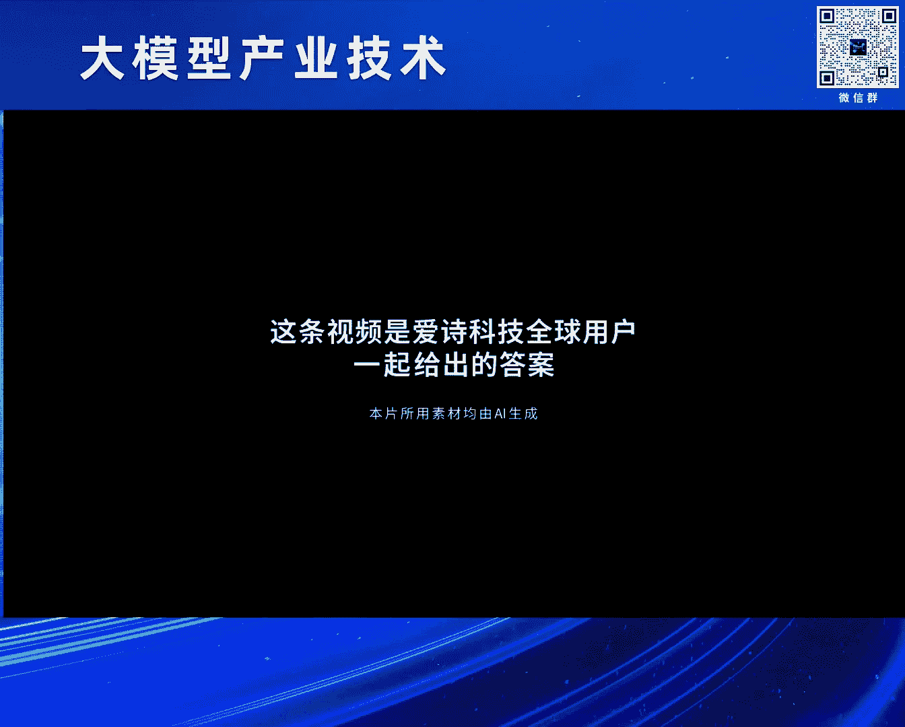
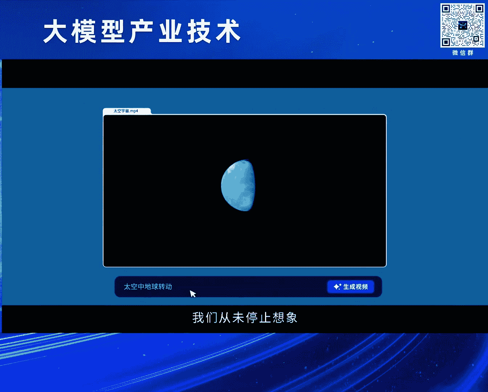
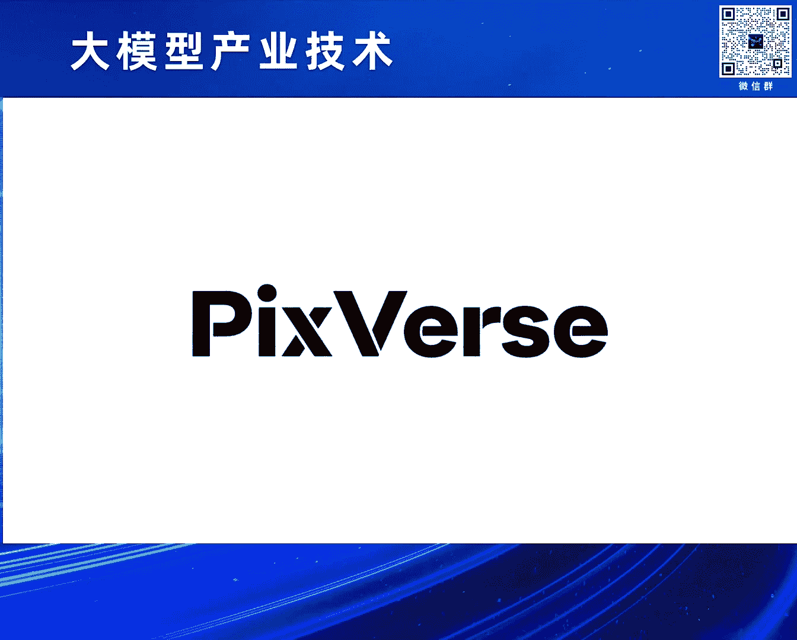

# 2024北京智源大会-大模型产业技术 - P2：Al视频生成的过去，现在和未来：王长虎 - 智源社区 - BV1HM4m1U7bM

啊特别感谢嗯仲远院长的邀请啊，非常荣幸啊参加这个论坛嗯，我是王长虎，那我仅代表一个创业者啊，跟大家分享一下过去这一年，食品生成这个行业从应者寥寥，到现在妇孺皆知的这一年中，我个人的所见和所想。

嗯其实我在这个行业里边，AI方向已经啊深耕了好多年啊，过去也在大厂工作啊，有朋友问我为什么想不开出来创业了啊，我想主要原因还是跟在座的很多朋友一样，我们看到了一个嗯浪潮的到来，那有人把它叫做AGI啊。

对比过去的呃专专有人工智能啊，所以在通用人工智能时代的到来，那我更嗯想用从用户啊，从内容侧来把它叫做AIGC啊，对应过去的TGC时代，UGC时代，那一个浪潮的到来一定不是一蹴而就的啊。

阴阳经过很多先驱者要不断的探索，尝试AIGC也是如此，他最早可以追溯在到啊上世纪50年代，在人工智能出现之后，我们可以看到在早期的萌芽阶段啊，11957年啊，我们就用计算机啊。

科学家们用计算机创作出来了第一个啊曲子啊，那个时候技术有限啊，所以所有的尝试都局限在啊实验室实验阶段，那从啊上世纪90年代啊，到本世纪10年代，这个阶段是AI技师的技术沉淀累积的阶段。

也诞生了很多著名的工作，包括我们第一个第一部人工智能创作的小说，包括这种全自动的同声传译系统系统，但因为算法的限制，使得啊这些工作还是很难去真正面向普通用户，那一零代之后。

随着嗯干啊深成式对抗网络的出现，一系列的啊生死式的工作还真正的啊面向用户，从嗯图像生成啊到啊大眼模型啊，到纹身图，人声视频，从干到transformer，嗯到diffusion啊。

从我们的耳熟能详的g p t chat，GPGGPT到我们的journey之后，到SARA这上开启了一个新的篇章，那AI级其实其实是包括多种不同的内容，包括语言啊，视觉音频等等啊。

在chat GDP出现之后，大悦模型啊成了大家关注的焦点，在骚扰出来之前，其实视频生成赛道还是没有这么火啊，虽然出现之后呢也赢得了大家的关注，那有人问我，那视觉大模型和大语言模型，主要区别在什么地方。

那在我看来，二者其实是两种不同的内容，语言是在人类出现之后出现的，是人类文明的产物，嗯是对呃世界的信息的抽象，而视觉在人类出现之前就在那里，山在那里，水在那里是原生的，所以当chat GDP出现之后。

人们对代言模型的期望是啊，模拟人脑啊，构建归一生命在对，那么人们对视觉大模型，视频大模型的期望啊，其实更外在的是模拟世界啊，构建世界，那视频生成，它本质上是通过对世界的理解来做影像呈现，那影线呈现。

实际上经历了从记录到生成的演变的过程，那这里列了列举了过去呃，三个图像呈现的三个重要的节点啊，我们可以看到我们在3万多年前，人类就已经嗯在岩壁上面去绘制啊，创作自己看到的这个世界。

我们也看到栩栩如生的狮群，那第二张呃图像是在1826年法国的啊，摄影先驱创作的第一个啊，可以永久固定的成像的这样的图片，那第三个是人类历史上第一个视频啊，用了24台啊，照相机啊，拍摄出来的啊。

马在奔跑的这样的视频嗯，这也缘起于嗯关于马奔跑的时候，试题是否腾空啊这样一个辩论，那影像的呈现，其实嗯影像的生成其实看起来是离我们很远，但事实上就在我们的啊，离我们很近啊，我们可以看到小时候哦。

过节的时候啊，我们家长也会，然后帮我们去制作各种的灯笼，其中一个就是走马灯，你看它的原理是什么，我们点燃蜡烛啊，蜡烛的热气上升啊，带动这个呃轮轴的转动啊，轮轴上面我们有一些剪剪纸，那光影啊。

把剪纸影子投射在屏上，我们先看到这样一个现象，那后者是一个连环画，我们小时候也做过啊，也是很是非常非常有趣的年代啊，我们可以看到通过这样的快速快速嗯翻页，就可以呈现出这样一个动态的一个画面。

那随着随着抖音啊去talk啊，这种短视频的普及和发展，那视频生成啊真正走到了每一个人的手上，那早期的视频生成其实是是基于检索完成的啊，视频里面每一个素材，这都是呃原有都是在数据库里面找到的啊。

通过自动方式找到合适的素材啊，通过拼接形成这样的视频，那现在呢依然能够我依然能够刷到类似的视频，那第二个是部分生成啊，我们这这这是一个一个抖音的视频特效，我们可以看到用户可以用手掌啊来控制水珠。

那这部分的生成嗯往往是需要输入一个视频，然后呢，通过AI技术做局部的部分的这样的生成，那这种技术广泛的应用在各种嗯，部分生产需求的特效之中，包括美颜特效啊啊包括动漫嗯风的生成啊，啊包括各种局部的生成。

包括比如说我们加个猫耳朵啊，加个狗头等等，第三部分其实是我们现在常说的啊，这种通用的生成，输入一个prompt嗯，输入一张图片啊，生成凭空的生成视频啊，过去这一年啊，这方面进展飞速，从嗯2014年开始。

嗯视频生成技术已经发展了有十十个年头了，嗯随着干的出现，这种生成技术才真正的啊使用起来，早期的氮的技术，数技术，将早期应用在很多的啊，这种前面提到的这种部分生成特效生成上，但是呢对于通用的视频生成。

效果依然是差强人意的，嗯直到diffusion啊，20200年diffusion模型的出现啊，击败了gun啊，成为了啊图片生成视频生成的主流，那过去这一年23年开始，我们可以看到啊。

很多的视频生成的技术和产品啊逐渐出现啊，包括我们嗯知道的像NVIDIA的嗯VRDM啊，包括google的point嗯，包括一些嗯真正面向用户的产品啊，run为P卡。

包括我们公司开发的TIKSOURCE等等，那当然今年春节SORA横空出世，开启了一个新的纪元，首先介绍一下这个嗯生成对抗网络gun，gun是二啊，2014年由good fellow提出的嗯。

他缘起于这样的博弈论中的零和博弈的思想，就是通过两个网络啊，生成网络和判别网络的不断博弈啊，进而学习到数据分布来生成高质量的内容，那他的，嗯他的优缺点也是比较明显的啊，优点是呃是能够生成啊可控的嗯。

效果还是在某在呃有特定目标指时候，能够生成较好的这样内容，缺点啊也是比较明显，就是训练不好，就训练难度比较大，我们要同时优化两个两个网络，同时呢多样性是有限的，很难做通用的生成，嗯干提出之后。

那很多这种变种就纷纷被开发出来，包括cycle gun啊，DC gun啊啊，包括info gun啊等等，广泛的应用在很多的场景上，那也有的研人，研究人员，希望能够把感染的技术应用在视频生成之中。

比如说这里面提到了demand，在2019年啊，提出了一种方法嗯，因为要做视频生成，所以引入不仅有red net结构，还引入了RN来进行建模，同时在判别的时候采取了双判别器，空间判别器。

时间判别器来做视频生成，那这样的方法嗯，事实上呃生成视频质量依然有限，那diffusion是diffusion，是一个呃非常重要的一种呃方法，干和地球真像支撑了过去10年嗯，AIGC啊。

图像视频生成的啊发展，那DEUTION本身是啊在15年提出的，在20年正式击败干之后啊，才真正流行起来，他的主要思想其实是通过不断的给图片加噪声，来破坏数据分布，然后呢再逆向地去不断地去造。

对数据进行还原，这过程中嗯不断的去逼近啊数据的分布，然后生成啊高质量的内容，对因为那啊DEFUSION模型嗯，早期啊一直是啊，呃包括一个unit的架构来用它来进行去造啊，也是过去几年最主流的一种模式。

transform呃，D diffusion，transform d i t的出现啊，验证了这种新的一种结构，可以更好地进行SCUP，从而生成呃更高质量的内容，因此啊随着骚扰的出现啊，DITT这种体系。

SION加transformer架构逐渐的啊成为了主流，diffusion加unit这种架构啊的一个很典型的啊，很经典的视频生成的方法，其实是哎VIDIA提出的这种VRDM，在这之前啊。

大家做视频生成尝试，其实这个工作流其实是多非常多变的，那这个方法啊第一次更嗯，好的提出了一个比较有效的这种变，最后来成为一个主流的工作流，这是显生成关键帧，然后进行插针啊，最后进行超分啊。

这样一个通用的工作流嗯，他的方法主要是用的嗯嗯TEACUSION加three d unit架构，并且这个模型能够支撑啊多个任务，包括关键帧认真的生成嗯，包括插帧和超分等等，视频生成能力啊。

和原有的视频生成技术相比也有很大的提升啊，嗯这个呃呃除了干体确认之后之外啊，也有很多人与人员期望能够用大语言模型技术，来解决视频生成问题，因为诊双M在大圆模型里面的巨大的成功呃。

有一些研究人员嗯也非常坚信啊，safer啊是视频生成的最终答案，这是其中一个代表性工作，是google在啊去年年底啊提出的video point，它采用了一个嗯decoder only的啊。

自回归transformer来端到端的去生成，用大眼模型的技术来生成呃视频，它允许多种模态输入，然后用嗯专有的TOONIZER来把这些内容token化，然后输入到这个video的模型之中。

嗯这个工作其实是嗯呈现的效果是非常棒的啊，但是和嗯V人工作一样啊，虽然是一个公开发表论文，但是并没有产品化，也没有开源啊，所以我们也无法去真正的让用户来测试，这种方法的好坏，那今年啊年初春节期间啊。

骚扰横空出世，进一步推动了这个行业的发展啊，sorry用的架构就是刚才提到的啊，DEFUSION加tr双门架构啊，用啊transformer模块来替代DEFASION架构里边的，嗯去造的模块unit。

同时呢啊，他在在也利用了大圆模型来帮助做prom的增强，以及嗯训练是训练数据的呃，精细化达标，同时在encoder和decoder这两个方面呃，两个地方也做了一些创新。

那关于嗯SORA的解读其实是嗯非常丰富的，那我就不展开介绍了，那在我看来，SORA它的最重要的一个贡献就是啊，验证了DIT啊，define transformer在视频生成中的啊。

skin law规模定律，就是说模型越大啊，我们的嗯嗯space spatial temporal patch越小，我们的可用的优质量数据越多啊，会产生更我们的生能效果更好啊，这是一个例子啊。

啊SORA曾经的例子，当我们基础计算量嗯嗯一定的时候，你可以看到生成的视频还是有很多变形的，但是呢随着我们计算量增加，四倍到32倍的时候，生成的质量是非常非常好，已经非常非常好了啊，这里有一些例子啊。

也是来源于SARA啊的网页，可以看到当我们的镜头生成视频里面，镜头在平移啊旋转的时候，物体场景在三维空间里面，依然能够保证保持更好的一致性啊，说明这个模型已经具备了一些所谓的建模能力。

同时呢我们可以看到他发表的，发布的很多这种长视频，20秒的，60秒的长视频中也具备一些一致性的能力啊，里面的人物啊，物体出镜头又进来的过程中啊，人物的穿衣着依然可以保持一致啊。

同时呢可以看到嗯他的一些例子里边啊，可以呈现一种嗯物体间互动的建模能力，比如说左边啊这个咖啡里边的小船啊，它在行驶会带来咖啡的的波浪的运动，右边的一个人在吃汉堡的时候咬过，咬下之后。

我们汉堡上面也留下了一些呃印记啊，对但是因为嗯SORA其实并非公开可测啊，所以看到了很多例子是他放出来的，所以他依然啊披着一个神秘的面纱，尽管如此，它已经极大地推动这个行业的发展。

嗯技术也使得众多视频生成技术熟练到啊，啊GIT，而视频生存能力也进一步的提升，嗯SA出来之后，我们看到很多这种非常啊优秀的模型啊，纷纷出现啊，大家嗯也非常希望能够成为中国的SORA啊。

全球的SORA啊也获得了很多的报道啊，这里边有一些开源的呃呃模型啊，包括open sora啊，也有一些并没有开源啊，也没有产品化的一些模型，也有虽然没有开源，但是可以公测，可以已经产品化的一些模型啊。

那么最近几天其实发展很快，我们可以看到快手发布的可灵的视频，闻声识别能力，包括鲁马的嗯，图声识别能力也是非常惊艳的啊，啊这里就不过多介绍了，那过去这一年啊，我们可以看到啊，无论从嗯数据量。

计算量还是参数量上面都有了非常大的提升，这里这里边列了三个目嗯，三个工作，一个是23年7月份啊，上海AI lab的EMDF，然后还有23年底啊，google的video point。

以及24年2月份的嗯，OpenAI的SORA啊，我们可以看到啊，数据量计算量参数量都有几十倍的增加，那5月份我们自我们的嗯志愿研究院啊，携手中国传媒大学啊，啊对全球的上百个大模型啊。

做了一个专业的评测啊，其中包括一些视频模型嗯，比如啊在海外有一些一定用户基础的啊，run way呀，P卡呀，包括我们的PIXVERS，包括一些腾讯阿里的呃视频生成模型，也包括一些开源的模型。

包括open sara等等，那么评测结果我们也很开心看到啊，嗯pic vers啊，我们的产品啊在排名在前三名，因为SORA是本身是不是无法公开测试的，所以他只是个参考。

所以前三名是ruby pixros和P卡，那大家可以看到技术侧，大家逐渐趋同，但是视频生成能力最终会需要面向用户，那这些产品是如何呃呃设计功能服务用户啊，我们会看。

我们简单的和大家一起去看一下这三个模型，认为啊对所有的皮卡，他们的一些共同点和差异点，那run way其实是嗯视频生成产品化的一个先行者，在它出现之前，其实更多的嗯生成能力啊，还是在体现在论文里边嗯。

嗯runway这个公司已经成立了6年时间了，它是182018年成立的，早期的时候他是做啊继学习模型平台，后来开发了很多的呃AI视频编辑能力，在嗯去年3月份的时候，他发布了战兔啊，纹身视频能力。

也那是第一个产品化的，本身视频能力也吸引到了非常多的用户，我们可以看到它的UI里边，其实也体现了非常多的这种AI编辑的工具，有超过20个啊，针对不同的内容，不同应用场景啊，来满足用户的需求。

同时呢它也是最早的推出了叫做motion brush，运动笔刷的这个功能，哎我们可以看一下啊，用户可以通过笔刷的方式精准控制呃，视频里面的局部的内容的变化和运动，也得到了用户的好评。

嗯皮卡其实也是大家也非常熟悉的，这样一个视频生成能力啊，他早早他是成立这个公司，成立于去年年初，他是先从社区做起的，那个时候他承接了一些啊免责你使命的热力，之后又有把图变成视频需求的这样一些用户。

所以在社区里边啊，用户成长是非常快的，他也在早期，他也是重点把精力重点放在了图生视频上，那它的特点是什么呢，它与呃他很重视声音啊，口型，他在今年年初的时候。

与eleven lapse合作推出的AI口型和配音的功能，I've been down in the ruins，So deep，对同时呢它也推出了AI音效生成的功能。

用户可以啊输入通过prom控制也可以啊，让嗯让AI根据生成的视频内容，来自动的去匹配音效，我们可以看一下，You don't care what you're doing to me。

I've been down in ping，那我介绍一下那个爱吃的产品PIXR嗯，P4是它的呃，评测结果实然是超过P卡的，那同时呢我们在用户车啊已经每天的访问，用户也已经跟皮卡比肩了。

那我们是在今年1月份正式上线的这个模型，我们可以提供很多基础功能啊，包括尾声视频啊，图生视频，但我们也有特定的自己的特色功能啊，包括固定角色声视频，Carroto tour to video。

那我们会和我们特别关注啊，用户的可控生成，因为用户在创作视频的时候是实际上是有需求，确保不同镜头里边的人物要保持一致，同时也希望啊更啊精确的控制啊，视频里面的啊局部内容和背景它的变化。

那为什么会有角色一致性的功能，我们在呃，因为我们看到现在视频生成的时长，还是比较短的，我们能做到单镜头的生成，那我们在用户在真正用这个能力的时候，往往生成更长的视频，不管是广告片啊还是剧情片。

都需要集成多个镜头，那需要镜头里面的主角保持一致，不能是前几前几个镜头是刘德华，然后几个镜头变成梁朝伟了啊，至于我们开发的这个功能，我们可以看一下，用户可以自己创作上传一张图片来创作啊，你的形象角色。

然后根据这个角色来连续生成啊，同一个角色的不同的视频，可以看到这一个角色是上传一张照片，就可以生成这个角色相关的不同的AI视频，同时我们也开发了magic brush运动笔刷的功能。

那它的那个易用性效果要超过RV的，我们可以看一下这个，用户可以用笔刷啊来涂抹区域，选择物体，并且啊勾画轨迹，那这个物体就可以按照轨迹来运动，One fire in，对那过去这一年啊。

其实我们啊也经历了diffusion嗯，加unite到底啊，嗯defend transformer这样的一个升级啊，在我们创业早期的时候啊，资源有限，那我们用嗯最短的时间能达到效果，达到全球第一梯队啊。

当前呢我们也很和很多同行一样，用DIT的方这种架构来，希望能够做出中国的骚扰啊，全球的SORA，那未来的话我们也会探索更多的可能性，那下面简单介绍一下，我们这几个这种可控生成技术啊。

背后的一些一些呃原理啊，首先我们一看这种可控生成啊，固定角色声视频这样的功能，Character to video，我们需要把角色固定住啊，并且把它融合到我们的视频之中。

那固定角色其实现在有不同的方法啊，这里列了两个典型的方法，一个是LAURA，一个是EPIC adaptor，那这种方法其实是嗯是有很大的差异，LAURA我们知道啊，就是每个id都需要重新去训练。

所以训练成本是比较大，但它的好处是天花板比较高啊，然后保真度啊啊美学性啊都非常好，那EPIC aptor的优点是什么，只训练一次就好了啊，他用呃呃很多的这种ID来训练一个呃嵌入啊，一个模块。

然后嗯插入到嵌入到我们的呃，进生成模块里边啊，用户用户输入新的id的时候，就必须要重新训练了，呃他的优点是就是成本很低啊，速度很快，但是呢问题是什么，问题是上限不够高啊，冰雪米学质量啊也是偏低的。

那我们针对这两种方法的问题，其实我们设计了一个网一个结构，我们基于这IPADAPTOR的这种架构，我们添了增添两个模块，因为解决保真度的问题，我们增加了一个嗯呃判别模块。

来确保啊生成的内容要啊符合用户的意图啊，第二的话是针对它美学度不高的这个问题啊，那我们也啊加增加了一个，reinforce learning的这样一个模块啊，希望能够提升它的美学度。

所以无论从主观的对比，还是说我们客观指标来看，我们都是要优于这两种方法，嗯这个是matter brush啊，memor brush怎么做的啊，这里也对比了一些嗯，学界的那些典型的守塔的一些工作。

左边的这个是drag n型型的工作啊，它的主要方法是是这样的，是嗯它通过用户涂抹对呃，用把用户涂抹区域啊进行标签化啊，得到它的语义信息，同时呢又把语音信息啊，包括区域信息。

包括语音信息转化成GOSHMAP，然后通过这个嗯，control net来注入到我们的生成模型里边啊，这是这样一个过程，那过程嗯也比较复杂，并且嗯会导致它对局部的控制啊不够精准。

以及呢智能背景会呃呃呃会不稳定，我们可以看到右边的一些比对比啊，上上面这一行是我们啊通过笔刷刷了两只手，然后希望左手和右手都要逆时针的转动，但是你看中间这个左边这个这个，他手持上没有暗语系的运动的。

并且整个背景非常不稳定，所以可以看到我们的方法，它真的是按我们的意图在运动，如果想让这个运动更大，只是只要把我们箭头拉长就可以了啊，啊这是另外一个工作，就是魔法video嗯，这工作的思路是什么样的呢。

啊他先把用户的输入啊转化成一个稠密的光流，然后用s to d来做这件事情啊，结把最后把这个结果通过，也通过CTRNET注入到SVD里边，那它实际上增加了一个新的模块啊，嗯导致训练难度会更大啊。

并且模型也比较臃肿，嗯它对它的问题是对嗯物体的精准控制不够，我们可以看到右边是一个粒子啊，其实我们画绿圈的那个部分其实是没有让它动，它依然也动了，那那我们就针对这几个问题啊。

我们也开发了我们这样一个啊新的算法嗯，一方面呢我们让在在交互层面，我们做了一些呃创新啊，让用户可以更方便来控制嗯物体的运动，同时呢呃模型层面为大大简化了呃，模型架构啊。

不需要基于Ctrl net来呃注入到SVD里边啊，我们的用户的输入可以通过一些预处理之后，那通过一个encoder嗯，再经过一个我们预先训练好的ADAPTOR就可以啊，注入到我们的呃生成呃模型里边啊。

这样的话模型整个的框架大大简化了啊，呃所以效果好也高效呃这是两个例子啊。

我们可以再仔细看一下，对左边的话是我们希望这这个人马斯克啊，他的嗯把这呃让他人脸去动，怎么动呢，我们画了一个很奇怪的轨迹啊，你可以看到最后怎么动的，对右下边是是另外一个例子，对事实上我们可以看到啊。

嗯现在嗯，我们的虽然我们有非常多的优秀产品出现，但是生成的视频的时长还是非常有限，而且往往生成是单一的镜头，嗯所以视频生成呀还远没到菜的GP时刻，但是呢即使这样啊。

在现阶段已经有很多的创作者已经可以用啊，这些AI视频产品来创作有价值的啊，嗯能够嗯好玩的，甚至能够为他们带来商业化收入的内容，我们可以一起看一下啊，这个啊视频是我们的一个海外的创作者啊，一个动漫粉丝啊。

啊根据181988年，几十年前的一个日本动画片啊，aka来他的一个呃预告片来重新啊啊，生成了一个AI版的预告片啊，显示了二者的对比是啊，下边是原片啊，上面是用peace生成的，好我们就不看完了啊。

好我们再看这个例子啊，这是也是我们一个国内的创作者，他受受嗯央视电影频道来邀请，然后以嗯那个荆楚大地的一些传统文化呃，呃代表凤啊作为主题来创作的，一个关于春秋时代的叫楚庄王啊，一鸣惊人。

问鼎中原的这样一个故事，我们可以看一下，喝喝呀，干杯干杯，我们依然能看到一些AI的痕迹哈，荆斩棘，楚国方有今日，你不理朝政政策，天后有何颜面去见楚国21先君，啊哈里面的镜头都是pier是完成的，不记得。

但是嗯现在AI还代替不了导演啊。

所以这些元素都是由专业的这种那个AI导演，来拼来拼接成一个完整的片子，峡谷水货深林，直到那天，那我小心，四面楚歌，危机四伏，他究竟是谁，何以舍命救我就不玩了啊，我们啊现在用这种AI视频啊啊作为镜头。

可以去叙事啊，可以讲故事啊，做这种宣传片啊，也可以去做广告嗯，这个视频是我们一个海外的一个一个创作者啊，他创作出来的广告视频，他在海外因为嗯各种原因啊，导致无法现场去嗯去工作，他是一个导演啊。

我发现场拍摄的时候，他就资金就就断了啊，所以他也寻求他的呃其他的方式来创作呃，内容啊，正好看到pix vers之后啊，还用pixel来创作出来的一个AI广告片，这是在今年1月份啊。

在海外嗯发布的嗯嗯引起了很多人的啊follow啊，也带动了这种AI广告片的这样的，生成的一个潮流，我们可以看一下，这是他创造第一个啊AI广告片，好第一个广告片其实没赚到钱，但帮他赚到了流量之后呢。

就有很多人来找他啊，为了让他给他付费，然后然后让他创作啊，广广商业化的广告片，这是一个啤酒，啤酒的广告，我就不继续展示了，然后面还有其他的一些广告耶，对那现在聊一聊嗯，未来视频生成需要突破的一些技术。

我们知道这种DIT架构的出现啊，骚扰的出现，极大的那提升了食品生成的啊稳定性啊，食品生成质量，但是依然还有很多不足，那接下来往哪个方向去努力，第一个我觉得是需要嗯对运动更好的建模，对世界更好的建模。

这是open n i展示的它的一个bad case，可以看到这个杯子诶，突然就违反物理规律的跳起来了，而且液体不知道什么时候就已经啊，已经洒在桌面上了，对这第二个例子也可以看到，那狗的数量是几只呀。

我感觉它在时刻都在变化啊，对所以这种嗯视频生成，我们会往往会看到它生成内容有一些违和，不符合物理规律啊，甚至不符合自然规律，那这会导致什么呢，导致我们在用AI视频的时候，生成AI视频的时候。

需要频繁的抽卡，我们试个两次出来一次，或是一可用的，或是或试十次才能出来一次可用的，所以抽卡概率还是比较低，那未来我们希望通过更好的对运动的建模，和对世界的建模，能够提升啊我们的呃生成视频的成功率。

另外的话虽然我们现在很多的媒体报道啊，发现呃声称啊，很多模型都声称可以做很长的时的视频的生成，但真正的产品化的大，大家可用可用的往往只是几秒钟的生成，唉这是一个有很大的gap啊。

我们看到现在能用的产品也就3~5秒，这是什么原因呢，是因为你要生成更长视频，意味着误差会累积嗯，会导致你的抽卡概率变得更低啊，所以如何生成更长视频啊，也是我们接下来要做的事情啊，第三个。

我们要需要重点攻坚的是多镜头场景的生成，我们都知道现在已有的视频生成能力，往往生成的内容只是单镜头的啊，那如何在我们在真真正使用视频的时候，往往是多个镜头组合在一起的啊，我们可以看左边这个例子。

这也是欧盟S2的一个视频，对气球人啊很有名啊，但是后来这个创作者呃，说到其实里他用到了很多的后处理和抽卡，才实现了这样一个片子，对对，那我们如何能够嗯去表达镜头语言。

并且把它合理的嗯嗯放到我们的模型里边，从而生成电影级别的多镜头的内容，也是未来AI视频生成要解决的问题，那我们特别希望能做到实时生成，大家在玩抖音快手特效的时候，你发现诶真的是能实实时生成，对不对。

但是现在我们生成一个三五秒钟的视频，可能需要耗时几十秒甚至几分钟啊，市场就比较呃比较比较长，他有两个问题，一个问题是嗯如果等待时间比要比较长，往往只有只有专业用户才能用起来，普通用户很难去玩起来。

第二的话是推理时间长，意味着推理成本高，所以如何做到实质生成，嗯是一个非常重要的一个方向啊，既能够解决用户的体验问题，又能够嗯嗯降极大的降低推理成本，另外的话就是当我们的实质生存做到极致。

就是呃把模型部署在手机端里啊，它能够提供更好的隐私保护和交互体验，那当然了，我们也呃做视频生成大模型跟大圆模型一样，那必然的需要面临就隐私啊，伦理的这样的挑战啊，比如这种DEFAKE啊。

深度伪造数据如果做得非常非常行逼真的话，如何能够确保它不作恶，如何去阻止恶意用户作恶啊，当然我们的呃技术发展特非常非常快，我们监管层面也需要和技术一起打磨啊，持续的去升级嗯。

事实上嗯市民生成并没有达到chat GDP时刻，它依然在快速发展过程中，但我们已经欣喜的看到他正在逐渐去啊，重塑视频创作的工作流，那现在AI视频生成技术，已经在逐渐的去替代啊，演员替代啊，背景啊。

替代摄像摄像头，那未来的话，我们可以预见它一定能够影响千行百业，包括呃游戏呀，影视呀，动漫呀，教育呀，广告啊等等等等，但是我们不仅希望能够服务好那些专业创作者，我们也希望能够进一步的。

更大的去降低使用门槛，希望能够做到技术普惠，能让每天玩抖音啊，玩快手玩TIKTOK，这些普通用户也能够去用起来，玩起来啊，能够言出法随的去生成啊，高美观度啊，高创意的视频啊。

这是我的目标，那最后呢我用一个视频来结束我的分享，啊啊题目是为什么要用AI创作视频，这也是里面的所有素材，都是嗯pik source的创作者来做出来的。

我们从未停止想象。

所以文明从未停下脚步，雨来自云中的龙，闪电是神明敲响的鼓声，想象经过的地方总有故事诞生，在一粒沙中展开末日的冒险，去一朵花里建造粉色的宫殿，每一处平凡的角落都能被想象的火种点燃，想象是一种语言。

让我们不再孤单，一个生命开始理解另一个生命，一个人的梦想也能被一群人看见，这里每个镜头都是日常，又是AI，这是AI生手，现在轮到你了，用像素构建星辰大海。

好谢谢大家啊，是不是超时了啊，谢谢长虎啊，那个呃整个pex words生成，确实令人非常印象深刻哈，然后看看现场的朋友有没有什么问题，想要问长虎的，大家可以举手示意啊，我们还有大概23分钟的时间。

也许可以回答一到两个问题啊，好啊，给那位穿蓝色衣服的男士吧，可以你可以站起来啊，我喂喂诶我问一下啊，就是现在咱们这个视频比较短，就几秒钟，但是这个几秒钟生成的时候，这个成本大概是多少呢。

是不是我们能够承受的这种啊，那我先回答你这个第一个问题啊，成本其实很很简单，你可以算一下，比如说生成几几秒钟的视频啊，如果能用看它耗时嘛啊，耗时如果是几十秒的话啊，如果是4090啊，或者是A100。

你可以算一下4090大概啊用时四嗯，40秒啊，或者60秒，它的成本是多少啊，大概是一个一个一个卡一嗯，100大概一一小时大概一两美金左右啊，所以成本还还是呃不高啊，这是第一个。

第二的话是说嗯我们是否能承担啊，以后的更好的模型出现，一方面可能会极大的去提升成本，同时技术会飞，技术也在飞速的进步啊，前面说的如果能做到更快的生成啊，有可能会极大的降低我们的成本。

但是呢不管成本高还是低，看谁来用啊，普通用户可能未必愿意为此付费，但是我们的很多专业的创作者，我们动画的创作者，广告的创作者一定会为此付费，为什么呢，因为我们用普通的拍摄的方法去创作广告啊。

12分钟广告是我们成本可能很高，可能几万块钱甚至更多，但是用AI创作成本就极大的降低了，是所以如果能用几美金赚到几万美金，这个生意就划算对吧嗯，很划算啊，好呀，现场还有没有朋友想提问的啊。

这位啊啊啊就你嗯哎老师您好，就是我刚刚看到那个我们给那个马斯克，给他画一个很曲折的一个轨迹，它就能够非常好的去遵从这个效果，我觉得很惊艳，但是我想问的就是，我们再去训练他这样一种精细化的指令。

遵从的时候，我们用到的监督信号是什么，或者说或者说如果不是用的那种，有监督学习的话，就是说这个是怎么训练，来达到如此精细的控制效果的，谢谢啊，这个事实是这样的，就前面已经已经介绍了。

就是说嗯它嗯它是一个可控生成啊，我们的模型本身用到了呃几个信息，一个就是我们需要用户去选择物体，并且把它涂抹上，那我们知道他关注的那个嗯，关注的是哪一部分内容啊，同时的话我们还知道它的。

因为用用户还会去画它的轨迹方向啊，所以这也是一个信号，两个这两个信号是我们输入啊，我们肯定有一些啊神秘的预处理技术，然后把它转化成我们模型能够识别的，这样的内容，然后去通过一种非常轻量化的机制。

绕开了这种control net，这种非常轻量化机制，来直直接注入到我们的底底层生成模型之中啊，大概是这样一个架构啊，啊，那那如果我们的预处理，就能够把这个精细的东西给它转化成一个。

我们训练的时候能够用的形式，那我们这个训练的意义更多在哪，我觉得这个预处理，是不是本身它就已经蕴含了一些能力了，嗯是的，就是说嗯所谓的预处理，就是把我们嗯人我们的一些raw data嗯。

嗯转化成嗯那个进行进行信息压缩啊，信息编码转化成更有效的一个表达啊，这个过程是意义非常大的啊，不管是换之前的介绍的很多工作，这种encoder其实在整个模型生成里边。

视频生存里面是扮演了非常重要的一个角色，谢谢您诶，好好好谢谢谢谢常护，时间关系。