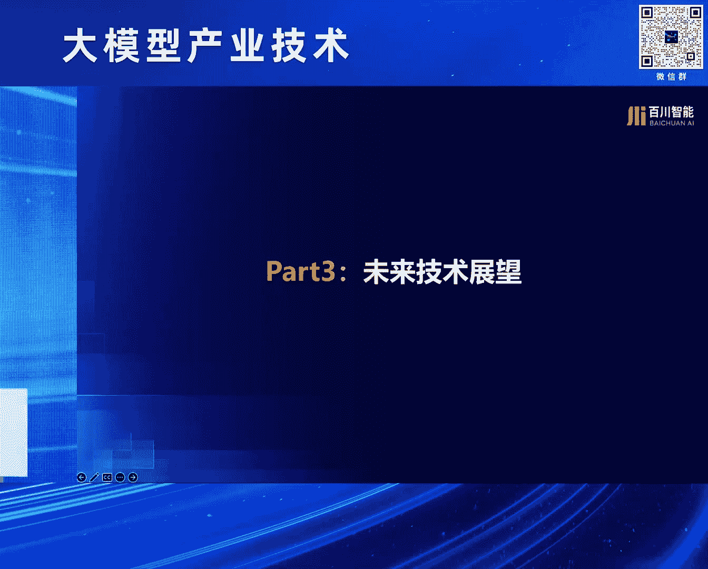

# 2024北京智源大会-大模型产业技术 - P3：百川大模型技术与应用实践：谢剑 - 智源社区 - BV1HM4m1U7bM

大家下午好啊，非常荣幸这个重演邀请，然后给大家做一个这个百川的这个大模型的，技术和应用的这个实践的分享啊，对第一part我可能跟大家先啊，分享一下，百川在这个通用大模型上的一些这个，技术的实践。

然后第二拍也给大家分享一下，在这个大模型基础上，我们的一些原生应用的一些探索，对其实百川是一个还蛮年轻的公司，我们大概在去年4月份的时候，就是小川发公开信，然后就成立这个公司。

但是我们也同时是一个奔跑速度非常快的，一个公司啊，就是大概我们在4月份成立之后啊，很快在6月份就发布了第一个这个7B的，这个开源的模型，当然当时其实整个市场上应该开源的模型。

还没有一个这个真正在中文上可用的，并且可商用的这个模型，我们当时是这个第一个发布开源并且可商用，同时紧接的很快，基本上是属于一个月发一个模型的这个节奏，然后在这个7月份发13B，然后紧接着很快就到啊。

后面基本上到53B，以及在我们在近期，也就在5月22号的时候，我们发布了我们的旗舰的，就是百川四的这个模型，对一定意义上我觉得还比较自豪的是说，百川一定意义上推动了整个国内中文大模型的，这个开源生态。

可能如果大家遥想一下，去年大概在45月份，56月份的时候，尤其67月份的时候，其实整个国内中文大模型，真正的开源的这个很少，所以当时我们其实在开发了7B13B，以及连续开了第二代之后。

现在基本上越来越多的很，就是也很开心，看到很多的这个这个大模型的这个公司，包括大厂都在开，并且也开得越来越大，然后呃到了我们后面，因为我们觉得这个越来越大的这个模型，其实开源出来。

其实很多人也无法真的很能能用起来，所以到后面的这个闭源的模型当中，我们其实也在持续的这个优化，然后百川山是我们大迁移的这个模型，这个大概在今年年初的时候发布的，然后在这个也很荣幸在这个资源的这个评测。

包括这个super crew的评测当中表现的还比较优秀，那接下来我会重点讲一下，我们在百川市上的一些这个技术的这个探索，那个百川市相对于百川商而言，能力又有了一个比较全面的这个提升。

当然包括很多指令跟随呀，信息理解等等各个方面的这个能力，提能力的提升，然后在这个啊国内的这个super crew的评测当中，也就排行比较靠前，当然我们其实实在的来看的话，其实因为它有个分的吧。

在数学能力上其实还是比open AI要差，那当然在文科上确实是有有一定的这个优势，百川四同时也有一个多模态的这个模型，在benchmark上，我们基本上很快要接近到这个g b t four v。

当然在这个里面，我们其实啊这个模型演进了这么多代，就是在百川事上，我们也做了很多这个技术的这个探索，也跟大家一块分享一下，第一块呢其实是在这个预训练上啊，我们都知道，其实预训练里面数据是至关重要的。

那么怎么去筛选这个数据，或者说去获得这个高质量的这个数据啊，我相信大家都有非常多的这个实践，但整个行业的这个发展，这个趋势逐步的从人类标准的这种方式去筛选，就是我们觉得诶什么是好的数据，什么是粘的数据。

但其实人类标准这个数据筛选，往往往往通常情况下有遇到的一个问题，是说坏的数据是很容易能够去分辨的，但什么是真正好的，这个数据其实并没有那么容易，所以我们其实在这个阶段，逐步的也引入到了这种模型的筛选。

也就说我们用百川山，这个其实在meta后面再公布到拉玛山的时候，也看到他们也有类似的这个工作，其实我们也在做类似的，就是百川三的这个模型，用相关的一些指标来这做这个数据的筛选，当然除了筛选之外。

你会发现现在其实大模型本身自己生成，就能够生成很多高质量的，尤其是知识密度比较高的这种数据，所以我们在数据合成上，也做了很多的这个探索和工作，包括这个模型的这个改写。

也包括这个高质量的这个数据的生成跟合成，那第二趴其实是啊，做了这么这这么长时间的这个训练之外，这个我们公司的预训练的团队，同学们也开始在探索说诶，怎么样从经验真正的做到这个科学的这个部分，那我们都知道。

这个在做这个长窗口的这个训练当中，如果大家还是在用这个LOPE的这个这个，position的这个embedding的话，通常会有一个经验性的感觉，是我的base就是我的窗口要大的话。

我的这个基底的这个贝斯也要大，但大到多少，以及到底怎么样大，其实大家很多时候都比较empirical的这种方式，然后我们的同学也做了很多，这个实验就是真正的做了一个这个实验，是说哎。

那如果你要把窗口长度扩到一定的程度的话，那么你的这个base实际上是有一个lower bound的，但这个我们也也公开了我们的这个论文，大家如果感兴趣的话，也可以去看这个the base of。

LOPE的这个这篇论文，所以这样的话，实际上我们对于这个模型的窗口长度的，这个能力的这个扩充过程中，也能够做到更加科学化的去设定我们的这个base，当然除了这个预训练之外。

另外一个非常重要的部分就是对齐，在对齐这块我们做了几个啊，比还比较有意思的工作，第一个呢就是我们试图去理解说，在对齐当中预训练的这个知识，和所谓的这个在对齐，你通过这个对齐的这个训练。

把它illicit出来，是这个这两个之间的关系是什么样子，我们做了一件事情，就是把这个transformer的，就整个网络的这个在过最后的logic那一层，之前的这个embedding拿出来。

把这个embedding拿出来之后呢，我们做了一个聚类，把这个聚类来分说好和坏的，这个这个这个这一部分的这个区分，然后当然我们把这个把它定义成叫做。

Cognitive for the capability，也就说你不再在做最后一层的这个动作之前，实际上这个模型本身在这个影城的这个表示上，其实就具备了这个它一定的这个知识的感知，所以这个的话你会发现。

说我们在做这个实验的时候，你会发现说这一层的这个知识和能力，实际上在随着这个预训练的，就右侧的这个图上，你会发现随着这个预训练的这个token数的增加，他的整个能力是不断的在提升的。

但是呢另外一个往往下看一个的，就说我们现在其实是最终是让模型输出，这个结果到底是好和坏，当我们把在这篇论文中，把它定义成叫做expressive的这个capability。

也就是说让模型已经自己能够表达出通文字，表达出它的这个判断好和坏的这个能力了，那在这个这个当中你会发现，其实如果你去看右侧的这个实验图，你会发现其实在做对齐，或者说在LHF等等。

就SFT和IOSF的这些对齐，其实它是在逐步的这个在提升，你会看到它的准确率在提升，但是它其实没有超过这个刚才说的，cognitive capability的这部这部分的这个知识。

所以一定程度上其实是在嗯嗯在共识，一个比较重要的这个业界的这个一个一个概念，就是说在预训练当中，我们其实LEAR了很多知识，那alignment alignment当中其实更多的程程度上。

我们是当然抛开这个指令遵循本身啊，就在knowledge这一项，我们更多其实是能够去illicit，然后这篇paper当然我们也在今年的SML上发表，大家如果感兴趣也可以去深入的去看一下。

那除了说去探究其中alignment里面的，对其当中的一些关键的这些呃，概念和这个这个原理之外，当然在对齐的一些方法上，我们也做了一些不同程度的这个探索和创新，其中在这个SFT上啊，SFT的团队做了。

我们做了很多不同的这个创新之外，同时做了一个模型融合的工作，这工作当然可能大家在上一代人，就是在传统的机器学习里面，应该有很多类似这种ensemble的这种方法，但是怎么把这个模型本身。

通过参数本身自己的融合，又没有去增加这个复杂的这个计算量，同时能够平衡不同的模型的这个效果，其实也是新的大模型时候的一些呃，值得持续去探索的一个工作，然后在强化学习这块，我们做了啊两个大方面的这个工作。

第一方面呢就是分了不同的这个阶段，就是第一个阶段呢其实是做了一些这种啊，应该说是这种改进版的这种DPO的一些方法，就是在其中。

我们叫sequential的这个preference的optimization，这个也是最近发的一篇paper，就说核心其实是说我们有不同的这个preference，就是啊对齐的这个价值观的对齐过程中。

可能你会有不同维度的这个要求，那其实如果把这些维度都合在一起，其实你会发现它其实很有时候会比较难平衡，那这个过程中，我们其实把这些维度做了一个区分，同时做了一步一步的这种微调，这是第一个。

第二个呢就是在强化的这部分，就RDRDXF这块我们做了一个工作，比较重要的工作，其实是把L的HF，就大家可能RL的就reinforcement learner。

Name from human feedback，这个可能大家非常熟悉了，也就是open AI在推，这个在写印刷CGBT的paper里面，明确提到，他们用这种方法，更大的提升了这个模型的这种指令遵循。

但同时我们会发现，其实当模型发展到今天的这个状态的时候，很多时候模型自己能够对于一些能力上，它其实是能够做AI的feedback，所以怎么把这两个做一个充分的融合，这是一个比较重要的点。

第二个点就是啊大家都知道，其实在对齐的过程中，模型的能力就有点像是在啊，小朋友在学习的过程中，他其实也是一步一步的这个爬坡的，所以如果能够做到持续的叫iterative的这种L的，这种XF。

那其实它是可以让整个模型的能力，一步一步的往上走，所以这个过程当中，其实我们也做了这部分的这个工作，对，当然除了这个关注模型的这个算法的效果之外，大家也都知道，今天其实啊整个成本上。

或者说在推理的这个效率上，其实也大家都非常关注，那其实我们在这个过程中，也做了很多的这个探索，其中比较重要的一个就是大家都知道，可能这个啊有一些，降低这种推理成本和提高效率的这种工作。

其实是做这种投机的采样，也就说你在做next token的prediction的时候，我同时有一个并行的这个去预测，后面好几个这个token，那我这个过程中就有点像是。

我提前去预测后面的好几个token，当然这个过程中现在就是传统的一些方案上，其实它的命中率会相对会低一些，所以我们也跟北大联合做了一个研究的，和这种创新的工作，是把一些序列的这个知识。

跟这个并行的这种解码去结合起来，使得这个投机采样的这个命中率，进一步的这个提升，当然还有一个就除了百川是自己的模型之外，其实百川也一直在做一个这个探索，就是我们希望是说未来的模型。

能够有机会去执行更多复杂的任务，就是我我自己一直是这么看的，就现在的模型，很多时候，其实我们现在很很多场景下，还在做这个人类中的这种快思考，就所谓的system one的这种思考。

但是真正要进入到人类社会中去，真正去帮助人类解决很多复杂的任务，一定要需要慢思考，所以百川在agent上面也做了一些技术探索，但这个工作其实也是我刚刚临时在下面加的，一个也是比较比较巧的。

也是比较这个算是在公共场合上，第跟大家第一个去分享的，就是我们大概在前上一最最近的几天之内，我们拿了这个这个复杂任务版，就盖亚的这个全球第一，就我大概介绍一下盖亚的这个task。

的这个benchmark是一个什么样子的一个task，其实他是那个meta的这个首席科学家，young lak和这个hagin face的这个啊，还有还有几个在做agent相关的。

提出了一个新的这种AJI的这种评测方案，它其实比较重要的，其实是评测一些需要比较复杂操作和规划的，这种任务上的整个模型的能力，那它的特点是什么呢，就是题目其实对于人类来说还挺简单的。

但对于很多先进的这个系统来说，却其实有比较大的挑战性，如果你去看的话，其实人类可能能做到90多分，但其实如果你看g b d four加plugin，可能最多能得15分。

然后题目有很多也很很多很更现实的问题，题目在这个过程中需要去调用很多的这种工具，并且往往都不是一步，基本上都不是一步能做到的，它都需要做比较多步的这个过程，而且人其实大部分的这个任务。

都已经超过了6分钟，就超过了5分钟，所以比如说类似这种的问题，就是你看这个，可能是美国国立研究院网站上列出的，2018年1月到5月，在寻常痔疮患者中进行的，幽门螺杆菌实验的实际能数目是多少，像这种。

其实你往往都需要把它拆解成，很多不同的这种查询，然后再去做，对这个也是我们近期刚拿到的一个结果，就是我们在做的一些这种啊，一个我们内部的一个系统，然后拿到了这个第一，当然其他的这个参赛者。

就是其他的这个下面的这个benchmark的有好几个，就之前的第一是微软的一个工作，当然我们拿到这个之后，其实也就在前几天，很快这个拉玛的这个拉玛二和拉玛三的，他们这个核心的工程师有很快就来找找到我们。

当我们现在其实也在整理，因为我们其实发的时候也也还没有，那么confidence说能拿到第一啊，就是现在也在整理这个代码和技术报告，对，然后我大概brief的介绍一下，我们这套系统。

其实在这过程中做了一些比较重要的，我们希望从season one到season two的一个探索上，一个比较大的改变，其实有几个，第一呢就是说当baby a g i，这个是一个比较比较common的。

就是说我们做啊这个thinking thought reaction，然后再做refraction，就这一套的这个编排的机制，其中还有两个比较重要的是说啊，要做这么长序列的这个规划当中。

会需要一个global的memory，就你怎么去manage这样的一个global的memor memory，就像人类打草稿或者说做很复杂的题目一样。

那你怎么去manager这样子一个global memory，进而去做到几个模块之间互相协同，再一个就是multi agent的这种方式呃，当然这个背后叫做social of mind。

就是我们用好几个agent之间相互去对话，和相互修正的这种方式去提升这个，然后再一个点就是从调用工具上来看，我们是把这个IAG进化到了，这个所谓的这个web agent。

就是我们都知道现在的搜索很多的搜索增强，其实是你把这个网页拿过来，然后我再丢到大模型里面做一个summary，但实际上人类在真正在做这些复杂任务的时候，它其实是把这些所有的这些网页啊等等。

这些把这个搜索，这些都当成很多工具，你可能是搜索搜索完之后再去点击，然后page down page up就做很多这种的工作，当然我们很快会去开放，就是发出我们的technical report。

和这个公开我们的代码，那么感兴趣的同学到时候也可以关注我。

对讲完讲完这个，我也很快跟大家分享一下，百川大模型在应用上的这个原生，应用上的一些探索，我们认为说呃，现在在大模型的这个技术的基础上，我们觉得说如果真的要在助手这个维度上。

能给大家在日常生活中提供真正有用，有帮助的助手，我们觉得应该具备两个比较重要的，第一是要懂搜索，就是大模型固然知识非常大，但它更适合，其实作为一个reasoning的这个brain。

他的知识一定是有限的，不管从时效性啊等等各个方面都是有限的，第二个呢就是真正要成为一个像人一样的，这个助手就我做我做了很多年的这个助手，想要真的要成为这个助手的话。

其实他应该像人一样能够会互动的这种交互，而不是像其实chi g b t，这个时候还更多的有点像是在一问一答的，还是一个这种问答器对，所以基于这两个的这个思考，其实我们做了这个AI的这个原生的这个应用。

白小印，这个白小印上其实呃第一个我们说懂搜索，比如说从这个引擎盖打不开怎么办，当然这些大家都其实是在直接的做这种回答，那其实啊我们的一个思考是说好诶，这个好像，sorry不太能播放，我大概讲一下吧。

就是呃第一个就是懂搜索，比较重要的，其实是说我们能够知道说去哪里去搜索，比如说可能如果你要找论文，你应该是去IKF啊，去一些非常专业的这种网站去搜索，但这些都是大模型，帮你自己自己解决了就懂搜索。

能够去定向的网站去搜索，拿到最好的这个质量，第二个呢就是多轮的这种搜索，就是你可能不只是一部搜索能做到的，那你可能比如说对比中美两国在大模型，行业上的这种差距，那你实实在在可能需要去先了解中国的大模型。

对吧，再了解美国的大模型，然后再去做这个大模型，两个行业的这种差距，所以我们其实可能会做多轮的这种搜索，把这个问题拆解成不同的步骤，最后再给大家一个更结构化的这种解析，再一个就是把这个搜索的这个结果。

通过刚才说的就是多轮的这种搜索，和更复杂的这个分析之后，其实是会把这个结果嵌入到整个这个搜索的，这个最后的这个结果上，不好意思啊，今天这个嗯播放有点问题，再一个其实就是结构化，就大家如果能去看的话。

比如说对比过去4年，绍兴和宁波的GGBTGDP，就是我们一方面是找到好的搜索源，定向搜索能做得好，然后你能把复杂的任务像人一样，我可能收第一步，搜第二步，然后再做，最后我们还希望说能够更结构化的。

能够去把这个信息真正的组织成知识，比如说这种GDP的这种对比，你其实可能很快用一个表格，你很很容易就能看出来他们之间的这种对比，再一个就是会提问啊，其实你会发现今天这个大模型有很多prom。

其实也挺挺有意思，以及他的回答，就说你你说让一个大模型说帮我写一个这个，甚至有很多说帮我写一篇作文，然后啪啪啪他就给你写出来了，这我感觉怎么说呢，其实每个人带的这个需求。

他肯定不是说我你给我随便给我来一篇作文，我就能用的，所以在这种其实是一个典型的这种，其实需求都并不明确的这种情况，那更好的这种应用形态是，你应该是跟它能够去做互动和交互，能够更清晰的让用户把自己的需求。

表达清楚之后，我再给你一个好的这种结果，Hey sorry，所以我们的这个名字啊，就是我们的整个这个应用的名字叫做白小印，对这个白起名字的这个来源，其实也就是也比较简单易懂啊，就是我们希望是一呼百应。

然后不管是响应上能够快，然后反应上能够快，应答上能够好，然后有做到这个有求必应，当然这个形象啊，就是算是百川入海跟这个结合的这么一个形象，当然我们更期待的其实是能够做一个有温度的，这种人工智能。

这个助手的这种产品，能够真正做到从工具到伙伴，当然更更期待的是，未来是我们能造很多不一样的这种人，对回到这个百川的这个从大的这个价值观上，我们一直期待的是创造健康和快乐。

就是在大模型能够辅助人类创人们创造，同时当我们还会在医疗的健康上有很多的探索，以及在快乐上，也希望能够给大家带来更多不一样的这种应用，对讲完这个我们的技术和应用的这个一些，探索的实践后。

也给大家分享一下啊，我们对一些未来有一些是代表我个人的啊。

就是我对未来的一些技术的这个展望呃，我大概做了几个这个技术趋势，发展趋势的一个一个总结吧，啊前前三个叫大多会就是大师说，当然就是我们这个模型会持续的这个scale up啊。

我看前几天有一些linking的information，是说g p t five是50多万亿，这个这个50多万亿的这个参数，当然他可能做还有做完MOE之后，他t FPS大概是乘十倍吧。

就他们每每每一代都期望是十倍的这个概念，这是第一个，当然参数的规模，数据规模一定会持续的这个scale，第二个呢就是多模态，这个多模态应该叫any to any吧，就是从长期来看。

它一定是any to any的，但同时还有一个比较重要的，其实是实时的这种自然交互，就for欧其实给大家呃一个很明确的这种回答，是说human like的这种interaction。

显然也是未来大模型一个非常重要，或者说AI走向更多的这种应用场景，更智能的，更内能的这种体验很重要的一个方向，第三其实是普惠吧，但其实一定意义上，我觉得其实是模型能力。

或者说模型在这个推理成本一定的情况下的，模型能力的这种进这种提升，现在很可能比摩尔定律的这个速度更快，就是三个月到四个月之间，可能这个cost就能够下降到50%以下，甚至以上。

所以capability在能力一定的情况下，推理成本会不断的在往下走，不管是从算法本身的优化，还是从这个硬件本身的这个优化上，还有两个其实是我觉得比较重要的，未来的一个就是如果大模型的技术。

或者说通用的这个在走向AGI当中，非常重要的两个点，第一个呢就是han long horizon的这种task，也就说现在其实大模型到了今天的这个状态。

其实我觉得更多的还在system one的这个状态，就是你快思考的这种状态，那么其实能往往能帮助解决人类的任务，是在啊人类的大概5分钟之内能解决的，这个task，往往是。

那怎么样真正能走向所谓的再往前的AGI，一定是能够帮助人类解决，超过人类5分钟能做的这个，所以这种残序列的复杂的这个任务，怎么样能够真像人一样，用system two就慢思考的这种方式去做规划。

去做工具的使用，去做长城的这种planning，最后能够把这个任务完成，这个显然是接下来非常重要的，当然可能也可以推荐大家去听一个john shuman，最近的一个这个他的talk。

他其实也在当中反复的提到这个了，当然第五个其实是自学习和进化，但我觉得这个其实就更高level的点了，就说alpha go到alpha zero走了一个，另外就走了一个很重要的一个变化。

是说ALPHAGO，我们前面还要用很多人类的棋谱，去做supervise的这种learning，再去做一个起点，但到go就zero之后，就说OK，那我就一开始就开始做自我演绎，和这种对抗和学习。

那如果说啊AI再往一套走，如果能突破所谓的self boost或self play anyway，就是不同的，能借助，不就不再借助人类本身的这个数据的输入，或者说supervise的这种输入的话。

还能够持续的进展，那这个可能会是对于后面非常关键的突破，也是非常大的一个一个挑战吧，OK好，那我的分享就今天就到这，谢谢大家，好谢谢谢建博士，然后我们还有3分钟时间，看看现场有没有朋友想要提问的。

举个手吧，呃那边后后面那位举手的，对想问谢博士一个问题啊，就是咱们在A镇的，相应在大模型之外，去构建这个复杂的这个推理网络了，但比如他跟比如说我在模型内部，比如加一些这种吹search这种方式上。

这可能是一探索的方向上，会有什么样的不一样呢，这两者对我觉得是这样子看的，就是实际上这个问题，其实呃我们一直一般来说来解决这种复杂任务，最后肯定是这两个东西双管齐下。

我们或者说你其实刚才mention的，可能是另外第三个，但其实我在我看来，第二第三可能概念一样，我大概讲一下，就说你首先我在推理的时候，是不是我在推理的时候，我不管是用啊tree的这种方式。

结合MCTS这种搜索的方式，Anyway，就把推理的过程的多路径都打都做出来，并且做用plant的方法去做，这肯定要做，但他肯定一定程度上也会提升这个cost的。

那这个动作其实跟所谓的这个agent里面去做，刚才所谓的这种planning和就思考反思，调用工具等等，这个本质是1111个事，然后再一个是是说那我怎么样去真正提升模型，自己本身能够去做这件事情。

那这个是一定是这个这个过程中积累的，这些数据和方法，要能够重新训回到这个模型里面去，所以在我看来，这一这两个是一定是双管齐下一起去做的明白，所以您觉得会比如先通过这个就是外部的，或加一些推测的方式。

但得出来的结果可能再返回来本身，提高模型本身的比对，我觉得这是一个这就两个路，一定要一起走的明白。