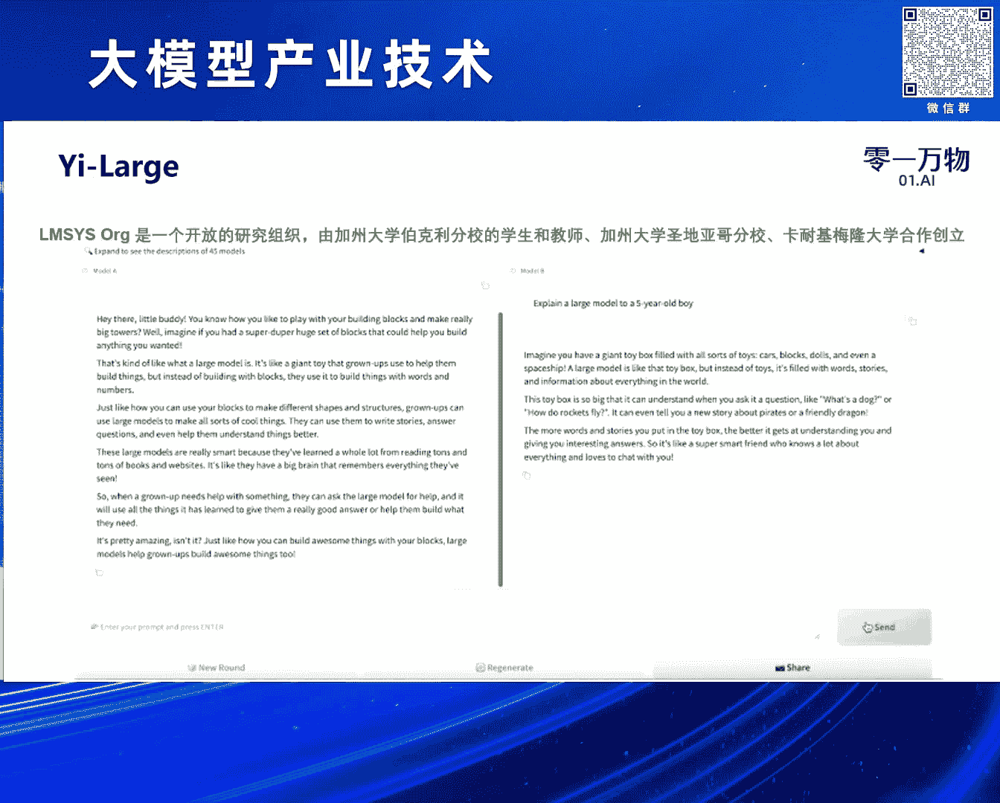
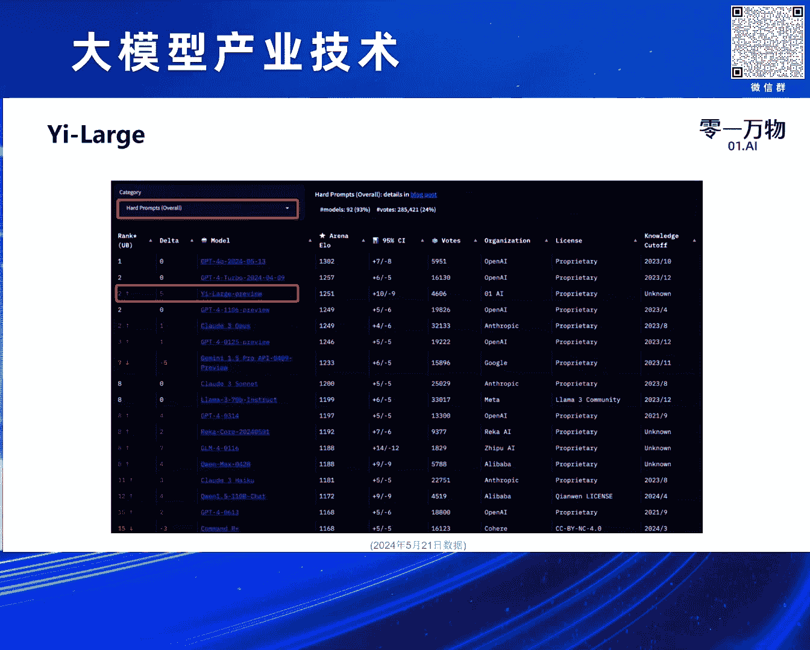
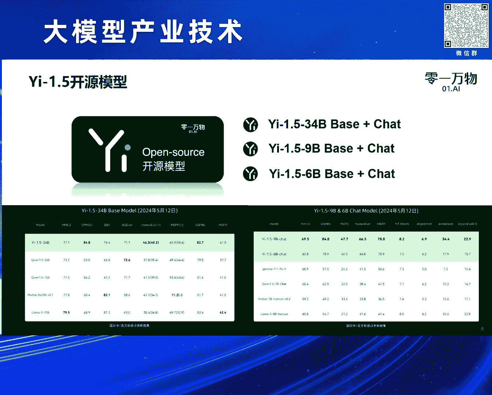
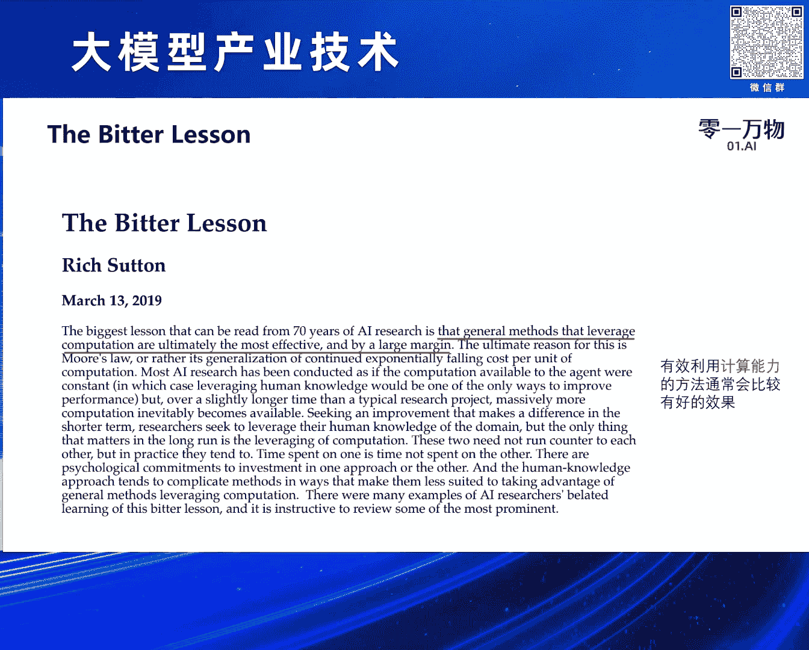
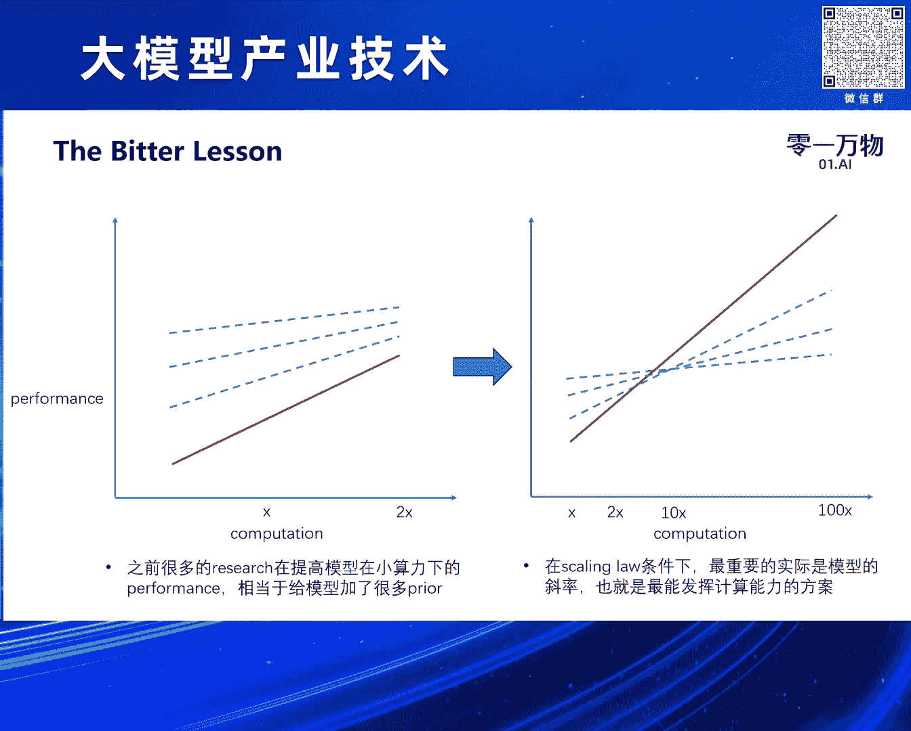
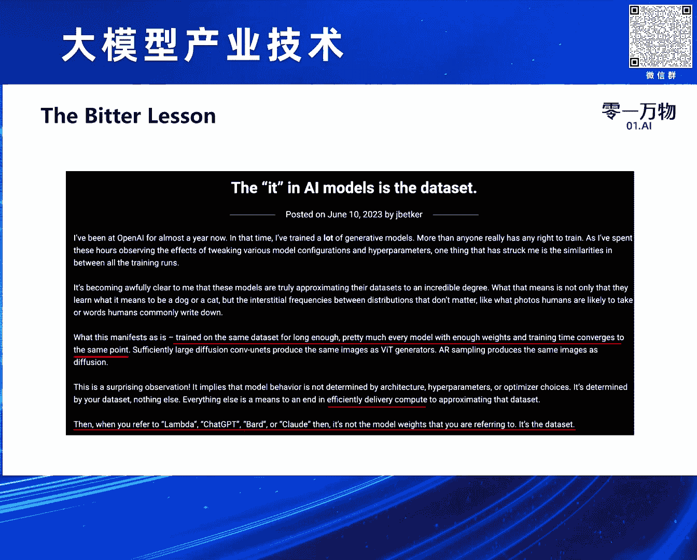
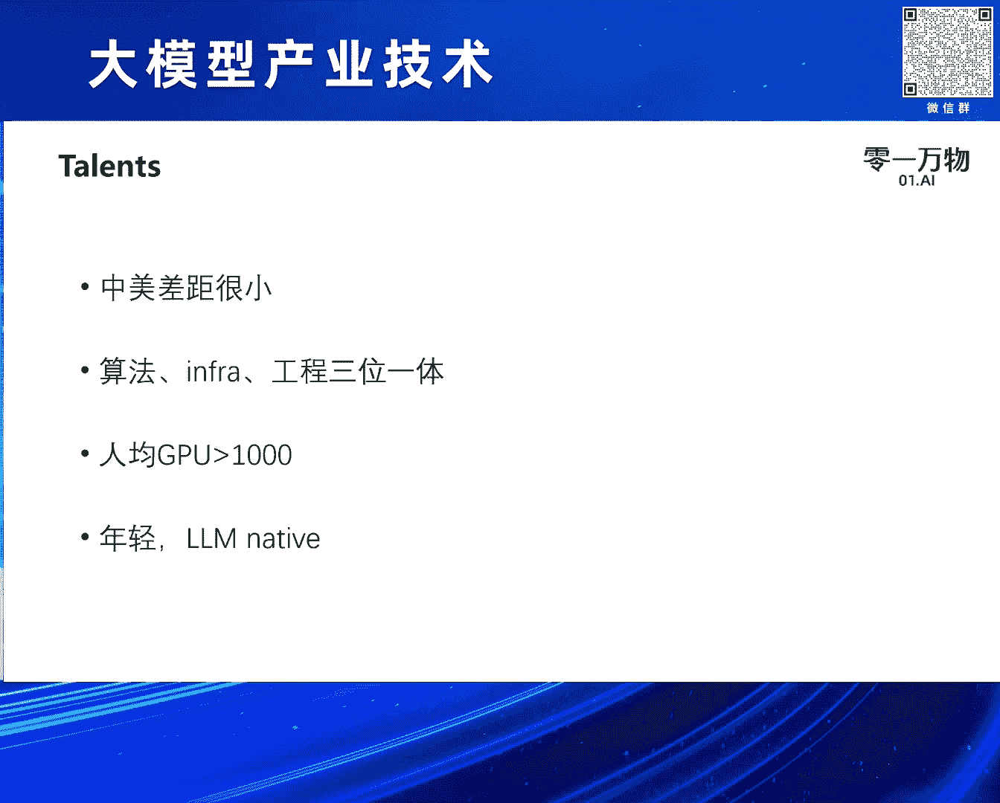

# 2024北京智源大会-大模型产业技术 - P4：大模型训练方法论及Yi-Large的实践：黄文灏 - 智源社区 - BV1HM4m1U7bM

还有谢谢谢仲远的介绍和邀请啊，我简单自我介绍一下，我叫黄浩，然后现在灵异万物主要负责预训练部分，就包括language model，就是语言模型和多模态模型的预训练，OK然后我们可以先介绍一下。

就是我们在上个月发布的e large模型，然后这个其实是我们上一上一代的一个模型吧，然后他是一个千亿以上的一个稠密模型，当时发布的时候，其实可以看到，在很多指标上都已经就是接近或者超过了，呃GB4啊。

然后cloud呃的呃，GEMINI这些就是海外的第一梯队的模型吧，然后我们其实还有一个更大的一个，MOE的ex large模型在训练当中啊，这个应该是当时发布的时候的一个分数吧。

啊现在其实比当时还是呃就又训练了一段时间，还是会有小幅的提升对，但这过程当中，其实因为这个这个这些数据，主要还是我去收集和自己去做一些评测的，然后我们也发现了一些问题，就是发现大家的就是公开的评测数据。

其实是会有很大的呃，BIOS一个是我发现对点这个问题很难对，就是大家比如说拉玛三，他报的点，我用了各种评测的框架，其实都对不上呃，然后我们最后选的都是，他们当时自己报的一个成绩。

但我们从来没有测出过这么高的成绩对，然后包括这个GP4和cloud，那些API其实是一样的，那这里面其实会有很很多问题，然后第二时间题目其实都会相对来说，是先静态的题目吧，大家可能会用一些。

就是在这个领域去构造一些数据来做做，做一些就是对这些领域的定向增强，然后同时我们在发布这个模型的时候，提出了呃一个就是模音一体，就是模型和应用要一体化的概念，所以我们想找一个和我们应用场景更加接近的。

一个评测数据集，然后我们也发现就是open i和呃，google还有cloud，大家都比较认可的一个评测集叫LLM cs，然后它是这里是一个简单的演示，就是用户会提一个问题，然后这问题是用户随机提的。

所以就不存在任何就是题目泄漏的一个问题，然后在后台就是LMC4的那个主办方，他们会随机选两个模型，然后生成两个答案，这时候用户去做一个选择，就是哪个答案好，在做选择之前。

其实他们也不知道就是A和B是哪个模型，有点像我们自己在产品里面会做一些，就是呃AB测试这样的一个感觉吧，但是它是一个完全的一个盲测，然后我们觉得这个就比如说这里面，用户题目的分布和用户实际使使用。

就是CHECHARGET类的，chair bot的分布式更加接近的，然后这样的评测也会更加的公平和客观，然后然后国际的第一梯队的厂商，其实也在使用这个呃。

LMCS作为一个评测的一个榜单吧，啊然后我们提交完以后应该是额差不多呃，一就我们发布完一周左右的时间，就发布那天LMC4才可以测，就是他们还是有一个比较严谨的一个流程的，然后一周左右出了我们的成绩。

然后我们成绩差不多是在就是世界第一梯队，然后在我们前面的只有就是open an，ANTHROPIC和呃google的模型，然后一这里看到的是第七，其实因为open i他们提交了四个模型。

在上面，然后进步的话里面，其实还有关于中文的一个排行榜，然后我们和GP4是并列第一的一个能力，然后还有一个就是他们叫hard prompt，就是因为prompt里面用户有些问题会，比如说你好啊。

比如今天星期几这种比较简单的问题，也有一些稍微复杂的问题，所以他们做对这个问题做了一个分类，因为之前在简单问题的时候，大家基本上会选一个打平的选项，所以这个分数会有些BIOS，然后在这个复杂的排行榜上。

我们基本上也是处于全球第二的一个水平吧，然后这让我们对自己的模型会比较有信心，然后我们自己在海外的一些产品当中，其实也做了一些就是AB的测试，其实会发现用我们的模型。

比如说和GP3。5做比较的时候，用户的呃留存，然后付费都是有比较大的一个提升，然后和GB4做比较的时候，基本上是打平，就因为数据不会掉，其实这个给了我们比较大的信心。

说我们这个模型其实训练的还是挺不错的，嗯除了这个必然模型，其实呃灵万物也做了很多开源模型的工作，这是去年11月份我们做了34B模型，当时在哈根face的呃LM里lead bd上呃。

也排在就是全球第一的水平呃，然后今年就是上个月，我们其实也对这个开源模型，进行了一系列的更新，发布了一呃11。5系列的一些模型，然后这些模型都是开源的啊，这里面其实也发现。

就是因为我们当时做34B模型的时候，是特特地选择了一个，对用户来说相对比较友好的一个尺寸，就是呃三四部分模型做完量化以后，是可以在一张4090卡里面去放假的，然后我们就就方便了很多用户去做呃SFT。

然后以以及去做现prompt engineering，然后当时受到了就是国外的很多开发者的，者的好评和反馈吧，然后有很多人就跟我们做联系，联系我们，然后也基于我们的模型，其实做了很多的呃很多版本吧。

比如说呃比比较有名的，有就是呃呃north north research他们做的open harms模型，其实很多多模态模型的，后面的语言模型都是用的这个模就是E的模型。

作为一个基地的对，然后今天主要是跟大家分享一下，我们在做预训练的过程当中，主要坚持的一些就是我们称为方法论吧，然后分别包括就是skin law呃，The the blesson，就是苦涩的教训。

然后高质量数据系统工程，还有对人才的一些判断，OK啊啊，前面那一页可能不知道为什么会有些乱码，就是他其实是对呃skin load一个定义吧，然后这个大概是模型输出的一个结果，然后可以大概说一下。

就是因为大家其实现在很很多人都在谈论skin law，包括上午的就是呃论坛里面，就重重点的论坛里面，大家也讨论了很多skin law的问题，然后也有人去呃去质疑skin law能不能通向AJI。

这个事情，对我觉得，首先我们需要对skin law有一个就基本的定义，其实它是表示，就是模型的性能和资源之间的一个关系，那这个关系其实很简单，就是资源越大，字会资源越多，模型的性能就会越好。

所以从这个这个层面上来看，我们觉得skin law是没有问题的，那然后我们其实比较好奇的是，skin skin law能不能通向AJI，然后我们可以看一下过去几年的一个表现吧，就是这里面的重重重走。

应该是就是数据，然后它是一个指指数级的一个增呃，就是算力就是一个指指指数级的增长嘛，就训练模型所需要用的flops，然后右边其实代表了不同阶段，模型的一个能力吧，比如说gg p two。

大家会认为它是一个学前儿童的能力，然后GP3是个小学儿童的能力，然后GP4可能是一个高中生的一个能力，然后未来我们可能就是模型是可以自动的，去做AI的research和engineer的嗯。

但大家怎么看，就是这个能力它是线性的，还是指指数级的，如果大家觉得这个能力是线性的话，那就是说随着资源的指数消耗，模型能力可以做到线性的增长，如果觉得这是指数级的提升，那就是两边其实就是个线性关系了。

然后右边其实给了很多，就是大家在评测级上的一些表现，就每每个模型刚出来的时候，其实可能就最低的一个点，然后呃随着就是训训练呃，训练用的算力的增增加，很很大，多数的能力都会有了一个很大的一个飞跃。

然后前面我介绍其实是广义的4SKYO，然后其实还有比较狭义的思skin law的定义吧，我觉得这个可能就是做技术的同学，会相对来说觉得更能接受一些，这个其实是来自于open i的一篇paper。

就是关于skin off neural language models啊，这也可以注意一下，他的一作就是java kaplan，他是一个物理，他是研究物理的，就是像skin law这个公式啊。

后面会讲它的一些公式啊，就是其实和物理会非常像，比如说跟我们常见的万有引力定律的一些公式，会非常像，然后做物理的人是会很会把这些很经验的，或者系统性的实验，然后进行一些建模，然后把它做一些提高的。

然后这里面其实我华丽很一些，重点就是说首先它是一个经验性的公式，就它不是一个严格的数，有数学证明的公式，只是我们有了大量的实验结果以后，可以发现用一个很简单的呃，方程式来来把它就是表示起来。

然后这个这个公式还非常的work，然后它有很多作用，这里讲了一个作用是可以去计算最优化的，就是资源的分配，就说如果我们给定一个算力的一个budget，就是你有多少算力可以使用，那我们应该怎么去分配数据。

怎么去分配那个呃模型的参数，然后呢这边paper其实有大量的一个数学公式吧，然后如果就这里我选了一个最重要的公式，应该是论文中的公式，1。5对它其实是这样的一个表示形式，然后这个L是表示模型的loss。

然后loss越低就是模型能力越强，这是一个就是线性关系，然后这个N是模型的参数量，N对模型的参数量，D是模型训练使用的数据大小，然后剩下的就带角标的，全都是全都是常数，也就是我们用大量的。

比如说大家之前会从比如说100万参数的模型，一直训练到呃呃一一千万参数或者稍微大一点，就是5000万参数的模型，然后通过这些很小的模型的训练，我就可以去预测大模型的表现会是什么样子的。

然后通过前面的很多打点，就把这些呃常数给拟合出来，拟合出来以后，根据我们现在想训练模型的大小和模型的参数，我就可以预测这个模型的loss，大概会训练到什么什么程度，那这个公式有哪些重要的意义呢。

第一个就是我前面说的广义的词skin law，就是我们可以发现，就是因为这个N和D都在分母的，就这就分母越大，然后这项就越小嘛，所以整个loss就会越低，所以它就代表数据越多，模型的能力越强。

然后参数越多，模型能力越强，然后这个是很显然的一个广义的词skin落，第二就前面介绍了，就给定computer，就给定给定的算力条件下，最优的setting是什么样子的，就是我们应该创一个多大的模型。

用多少的数据，然后因为就是算力其实是等于6ND就是六，就是一个简单的计算公式，是六倍的呃，参数量乘以一个数据量，就会大概估计模型训练的flops，所以我们可以判断在这个环这个条件下。

数据和参数的收益是什么，是怎样的，然后第三个其实是它会这个公式，有很多的可扩展性，就是说我们会发现，我们在很小的模型上做训练以后，我就可以去预测，比如说大100倍的模型。

它的loss表现大大概会是什么样的，这样可以节省我们大量算力，我们在很多研究都可以在小模型上面做，然后我们利用小模型去理拟合这个skin roll公式，我就可以预测模型变大以后的效果。

同样对很多对模型结构的改变，都可以基于这个公式去做，然后这里主要介绍一下，就是就是最优的setting大概什么意思，就是比如说我们选定了我，我的算力大概只有6亿呃，18次这样的一个flops。

然后它的横轴是模型的参数，因为前面介绍了就是呃呃呃算力数据，还有参数之间的公式，就是C等于6ND，然后确定了就是呃算力和模型的大小以后，我就可以知道这个数据是多少，然后在这个配比下就可以呃。

得到一个就是一个曲面，就是不同的setting下面哪个模型的效果会更好，这样最优的可能这个点是最优的，然后这样我们可以得到就是不同算力下，它最优的点，这个其实是对我们选择模型的参数量和呃。

数据是有很大指导意义的，然后其实有很多人在质疑以前skin law的问题，比如说呃朗玛三乘了15T的数据，已经远远超过了这个最优值微微，但它模型效果还是很好，其实因为它给定的是一个给定算力条件之下的。

一个限制，然后我们也可以分析下这个问题，就是如果我给定模型的参数，就类似于拉玛三做的啊，这这是1B就比如假设这是8B的一个点，那我给的算力越多，就代表我给的数据越多，所以它是一直可以提升的。

就并不是说我的呃，我我呃，我确定了最优的参数以后，我的数据就不可不可以提升了，但当然我们回到前面的这个公式也可以发现，这个提升收益肯定是有效，是是有限的，就这项随着地变得越来越大。

就模型的用的数据越来越大，这一项其实会趋趋向越来越小，所以大家大家可以估计到，比如说用呃10T的数据和用15T的数据，我大概能带来的loss的增增益是多少，其实这些都是可以提前估计出来的。

对然后再讲一下，就说loss的可预测性，这这这两张图是来自于欧派的，就是呃GP4tech report里面，就是我在用很小的算力的情况下，那可可以看这里的横轴，其实是一个就指指数级的增长。

所以我可以用就十倍以下的呃参数，然后训练很多模型，然后对模型在某一个能力上的loss，进行一些打点，然后做完打点以后，它就可以拟合出一个曲线，然后我训练就两个数量级，就100倍以上的一个模型。

然后它可以精确的的预测就是模型的表现，其实用的就是前面那个那个公式啊，这个其实在我们自己训练大模型当中，我们花了很长的时间，去把这套skin load系统建立起来，这样我们的所有大模型的训练。

其实是比较丝滑过渡的，然后这里还会有些很衍生出来非常有趣的事情，就比如说大家会讨论，就最近讨论很多的，比如说transformer结构会不会被member结构，griffin结构，就这种结构给替替代掉。

其实你回到这个公式，大家可以自己去做一些实验，就是把把这个数据和模型参数量固定下来以后，我们只要TRA很小的模型，确认一些模型以后，就可以去拟合一下这个skin law的一个公式。

然后就可以得到这些系数，就间间系数如果越小就整整呃，应该是越大，因为这项会小于一嘛，就这先系数越大，这一项就会越小，然后就证明这个模型的可扩展性其实是更好的，那这样其实是很容易去比较出这些模型结构。

哪些在什么样的setting下，它会有更好的一个表现呢，对，然后这这个方法其实同样适用于我们，对transformer结构做一些改变的时候，就比如说，呃我们常见的有就是PRENORM。

就是在每一层之前去做normalization和post norm，在后面做某normalization，然后这个其实我们去做一些setting和skin load拟合，就可以知道在什么样的条件下。

哪一种norm方式更好，还有最近就是像deep sick，他们提了MLA的一些方法，然后我们要比较不同的TENTION机制，比如说multi head attention。

Multicquattention，group quattention和呃MLA的时候，其实也可以用这样的参数去呃，比较给定算力下的一些训训练，loss1些变化，这样其实对我们去做一些呃。

模型结构的改变是有很大的一个指导意义的好，然后第二点是the blesson，就是这其实是来自rich sutton的一个tag blog，对这这也写了很多，我就用中文，很简单的讲。

就是有能够有效利用计算能力的方法，通常会有比较好的结果，然后这个其实跟skin law是相符的，就是这两个其实是要联合起来看的，也就是说呃，我们其实优化的。

其实就是对competition的一个使用的一个能力。

然而competition也是skin里面最重要的一个部分啊，这贝贝lesson有很多人在看这个是找JSON way，在就是open的个researcher，在推特上发的他的每天工作时间。

然后可以发现它每，这里面有两个非常有意思的点嘛，这个框出来一个是早，比如说早上他会他每天都会学贝特lesson，就是要反我跟他们内部人聊，他们就说就要反复阅读并背诵贝特lesson对，然后第二个点是。

他们每他每天五点会跟大家讨论，算法有什么可以改变的，然后5。05这项就结束了，然后觉得算法的改变太risky了，大家应该去做，就是计算和数据的SKR。

哦这里就是学BLESSON以后，就是我我觉得他要跟skin law结合起来看，就是说我们现在看问题的视角可能有些不一样，因为我自己之前在MSI也是做一些research的工作。

就是我们会发现研究范式有了一个很大的变化，因为我们之前的研究基本上是在算力条件，就是增长不是非常迅猛的呃，就非常速度的情况下进行的，也就是说它算力条件可能每年增加增加一倍，然后在这种情况下的话。

假设有一个方法，它是这个这里面的这条红色的线，然后我们做研究的人其实是在做各种各样的对，针对这个方法的优化，所以针对这种方法优化，会提高这个方法的起点，然后这个起点做了提高以后。

就可以得到不同的一些新的方法，然后有很多新的paper出来，在当时这个时代，其实这种方法是很很work的，但到了现在这个时代，就是每年的算力可能是一个指数级的增加，就是我比如说每年算力增加十倍。

这时候起点已经没有那么重要了，这个方法的斜率才更加的重要，然后我们回过头来看，我为了提高这个方法的起点，我相当于给这个方法加了很多的prior，就加了很多的鲜艳，就是做机器学者其实会知道各种各样的鲜艳。

其实是会损害这个方法的一个泛化泛化能力的，所以他的斜率就会变低，那在这种情况下，其实大多数在，所以我们回过头来看，之前的很多研究工作都在雕花，因为雕花就是说你在一个小的算力范围之内。

我不自断地提高它的模型能力的一个起点，但是到了一个更大的尺度下去看的话，这些工作其实都变得没有意义了。

而这里其实会引引申出一个非常有趣的讨论，就是我们去年发布E34B模型的时候，其实有很多人，比如说我们的模型借鉴了拉玛三的结构，然后还有人说我们抄袭了二三，然后我觉得这里面分几个角度来讨论吧。

就第一个是我们在开源的时候，做的不是非常规范，有些变量名没有没有做好，这个是我们做的不对，但是当然如果说我们借鉴了朗玛三结构，这个事情，就这个呃呃如果说抄袭这个就是无稽之谈资产，然后就说借鉴拉玛三结构。

其实我觉得有些可以可以可以研究的事情，就说呃一个是拉玛三的结构，这个事情就现在很多人说，lama architecture就是没有拉玛，就没有中国的大模型，我觉得这个我自己是完全反对这个观点的。

然后就是这是lama的paper里面，他对于architecture部分的描述，它说它们是基于了transformer的结构，然后只做了三个不一样的地方。

然后第一个是把传统的POSTOMM改成了PRENORM，然后这JPGP3就做了，然后第二是用了sweet group，然后就把软路换成sweet glue，第三个是换成了loop，所以有很多人说。

就比如说这是TAE的线twitter，他说就其间很多的改进都是google提出来的，然后大家却把它叫做一个拉玛三的architecture，这个是完全没有道理的。

然后他们自己的tech report也把它称为了norm，Architecture，就是norm其实是这里面很多技术的发明人嘛，其实我这里想说的是一个就说呃，从transformer17年提出到拉玛。

应该是去年提出很多年的时间，其实模型的结构并没有太大的变化，一共大家也可以看到只有这三个变化，所以说我们用最简单的方法，只要去scale up这个competition就可以了。

然后然后第二就是如果我们自己做训练的时候，其实这三个改变都是有损害的，就是要我我前面讲了，会发现他们follow lama的结构并不能很好的scale up，其就是LARA，比如说做70币还好。

你做一个200B300元模型，其实是会碰到很多的瓶颈的，就是他做的这些改变并不是都是有效的，呃它在不同的算力条件下其实是有不一样的点，那我们可以分享一下，比如说我们做了很多实验。

发现当模型参数超过千亿以后，用post post norm可能会比PRENORM更好，只是你要把它调的更稳定，然后第二就是sweet glue，比软弱收敛性快，但是它的计算能力是计算所花的时间是更长的。

所以我们用海量的算力的时候，其实是要去平衡这个它带来的额外的时，训练的呃，时间和带来的快速收呃，收敛之间的一个trade off的，而lop也是lope，其实现在会占到呃。

transformer或者GGPT系列模型训练，大概10%左右的时间，那在很大的算力条件下，是不是不用loop，可能我可以节省10%的时间，我可以把收敛那个时间换回来。

这个是需要大家去做很多的实验验证的，那做实验就可以用用selescreen or for load，方法去做一些验证吧，OK然后这个其实是欧派呃，里面一个员工写的一个一个blog，我觉得非常有意思。

就可以分享给大家，就是说一个是说我们在一个同样的数据集上，训练足够长的时间，假设我们的算力是无限的，所有模型都会收敛在一个点，就不管它是transformer，它是即使是CN，他可能也会收收敛在一个点。

那这里面其实区别是什么呢，区别就是哪个模型可以更快的收敛到那个点，或者更快的接近那个收敛的点，其实这里以就是有价值的，其实就是对算力的有效使用效率，然后他还提出一个观点。

就说如果所有的模型在同样的数据集上，就不不同的模型架构的模型，在同样的数据集上训练都会收敛在一个点，然后我们假设现在大家发布的这些模型，都是收敛的情况下，那其实决定模型的能力的其实就是数据。

所以每个每个模型它不代表自己的模型架构，也不代表自己的呃，呃训练过程只代表了它原始数据的一个质量，就这就引申了我下面一个要讨论的点。

就是说高质量的数据是在这里面最重要的，然后这里面是截了呃E的tech report里面的呃，两两张图片嘛，就我们有个比较复杂的一个，数据处理的一个流程下，其实这个现在基本上大家都很重视数据。

应该也都有这样的数据处理流程，我可以分享一下，就是我加入灵万物之后，前三个月其实没有让团队训练模型，就基本上我们只训很小很小的模型，去建立SSKIN落，剩下所有的时间都是在做数据这个事情。

然后到9月份以后，我们的数据比较ready的情况下，我们去训练模型就会非常的顺利，所以我们每个模型基本上都是一次训练出来的，然后在同等参数下都可以对比其他友商训练好。

就是这个数据质量是非常重要的一个工作吧，然后聊到数据质量，其实大家也会经常问的一个问题，就说数据会不会用尽，这个其实是之前一篇paper里面的图，就说假设数据是一个线性增长的状态，我们现在对数据的消耗。

其实超过了这个数据的一个斜率的呃，我在这里我可以分享一些，我对这个问题的一些观点吧，就是这个更多是个人观点，第一就是我们发现数据增长的速度，是比预期的要快的，特别是很多语言模型出来了以后。

网络上有很多原模型生成生成的一些数据，然后这个数据的质量我们去处理，就是每年不同的那个，就我们拿com CD来举例子的话，其实是由大量的一个增增加的，然后第二个就是合成数据，其实现在很。

就刚才谢健也提到了很多，关于合成数学研究工作，然后我们自己其实也做了大量合成数据工作，然验证了合成数据的一个有效性嘛，哦这里我其实截了一个翻web，他们对数据分析的一个图。

就他发现用24年的数据去训练呃，原模型，它效果就比23年要好，比二让呃，然后这个原因就是他们分析一下发现，因为现在的数据里面已经有大量是语言模型，生成的数据了，这GP4生成的数据。

这就导致我们用把所有的网上数据都拿下来，以后，我在训练的时候效果就是会好，这从侧面验证了我们用模型产生的数据，去训练模型，这个是可以让模型就不停的去做一个提高了，呃，啊。

第三个是我个人觉得最近比较有趣的一个，finding吧，这是我们在做多模态预训练的时候，发现用多模态的数据是可以提高模型的智能的，这是呃，所以做多模态也不是扩展了语言，模型的一个能力。

而是真正的能提高语言模型的智能，然后这里面有也有些很很有趣的研究工作，然后这研究工作其实是非常理论的一个工作，然后当时伊利亚也对，就离开open安以后，也对这个工作做了一个点赞吧，就是他的其实含义。

简单来说就是假设这里有个Z这个数据，你不管是用语言描述它，还是用图像记录它，当你做多模态模型训练的以后，这两个数据的表征是我会造，会越来越趋向于收敛到同一个表征空间，也就是说他们在做压缩的时候。

是会压缩到同一个点的，然后如果有了这样的理论基础的话，就是我们可以认为就是多模态数据是完整，就是扩展了，就是呃语言模型的数据的一个缺口，那我们未来就有大量数据可以使用，好看看快超时了。

我后面两页稍微快一些，就是呃第四个点其实要分享的是大模型，其实是个极致的系统工程嘛，就是去年XGP刚出来的时候，大家很担心的事情是，比如说国内有没有相应的算法人才啊，比如说我拍google研究了这么久。

大家之前其实没有怎么训练过大模型对，然后实际做的发时候会发现，这里面其实对研究的呃需求，其实没有对系统的需求大，就是包括前面的数据清洗，然后训练过程中的一些就是训练的dynamics。

其实都是一些非常细致的一个系统工程，我们需要把系统工程当中的每一环做好，然后每个细节都都抠的很细，自然就会有比较好的一个成绩对，然后第二个是说呃，就大规模的机器学习其实是一种实验科学。

就很多人想就是在质疑，比如说deep learning是没有数学解释的，但是其实open在一开始就有这样的认知，就说大规模机器学习是实验科学，我只有通过大量就不停的做实验。

然后用实验的数据去去得到一些近似的一些，就是数学的一些表示，然后这个过程其实和前面提到，和实验物理是非常接近的，就是我们通过大量的实验呃，消耗了大量的算力，得到了大量的结论，然后去推动智能的一个发展。

然后第三个就是因为他是个系统工程，所以我们需要就是又懂算法，然后又懂INFA，又懂工程的这种复合型人才，就是之前国内人才，可能他在单一方面都会做的很很很强，但做到一些比较复合的事情的时候。

是会有些困难的，然后所以我们比如说我们对团队的要求是，要懂算法，要写库大的可能，对然后最后回到人才，就是这也是这段时间，我跟大家经常有争论的一个点，我觉得中美的人才差距其实非常小。

就美国有一部分非常top的人，OPII可能有一些XAI会有一些，但是他们只是因为过去有了比较好的经验，在做这个事情，但是国内的就是聪明的人是完全不比美国少的，然后大家现在很重重视大模型。

投入了比较多的算力，所以呃现在有很多的人都非常的强，就是我觉得就一点都不比一，就是呃头部的那些机构的人才差吧，然后里面有很多非常呃非常年轻的new new，Fresh pp h d。

他们展现出了非常强的一些潜能吧，然后第二个就是说这些人才需要是算法，INFA工程一体的，就是过去这种比如我算法很好，但我不太会写代码，对我我不懂info，我不知道怎么能把一个高效去训练，算法调的更高效。

这人间可能是不work的，如果这方面都是懂的话，其实这样的复合型人才可以发挥很大的作用吧，呃第三个其实是我们给自己的一个要求吧，就是其实我的团队一直都只有十多个人对，因为我们要求。

每个人的人均GPU要超过1000张，就是如果公司的GPU还没有在网上，扩展到2万张，就不要招人，这啊只有在这种情况，但当然这1000可能拍的有点随意啊，但但我是觉得就是每个人需要有大量的卡。

就如果如果就是比如我们可以定500，可可可以定定200，但是呃每个人如果没有大量的卡可以玩，你招人其实都是副作用，然后只会让大家去抢卡对，然后最最后就是我们会很坚持招非常年轻的。

我前面讲了很多new fresh p h d，因为他们其实因为最近大家一直在讨论，AI native嘛，就他们从做research开始就是LLM native的。

他们接触的第一个research就是大悦模型，而不像像我们这一辈的人，就是之前可能呃对我我可能还比较好，我是我，我做博士的时候看，在第一年就看到了deep learning。

然后完全就决定all in去做deep learning，但是当时不是从SKYUP的角度去看问题的，就相当于我前面讲的，我们在做很多提高方法起点的事情，但没有去重视这个斜率，而现在很多很年轻的人。

他们从一开始的视角，就是去重视方法的斜率和SCALABILITY，这个其实是非常重要的。

好我分享就到这，谢谢大家，对好非常谢谢文浩，非常有insight的分享啊，那个看看，因为时间比较紧张，我们现场看有有哪位朋友想提问的，我们一个问题吧，好那位穿黑衣服的同学，哦你好。

我可能可能问几个问题啊，就是第一个是关于那个SKYUP范围这个事情，就是从你角度来看呢，这种SKYP的范围如果到两年之后，这种就是比如说现在是200K，可能未来是500K怎么样。

两年之后这个scar5的范围大概是多少呢，从你角度来看，我觉得就是你就是scale up的范围是吧，呃对对呃，sky up就是那个那个输入的文本长度哦，你说长度的范围就是我觉得长窗口这个事情。

现在已经是一个被业界解决的问题，就你只要解决算力问题就可以了，就是在技术上基本上已经解决了，我们有一些paper就说怎么去做长窗口，长窗口问题了，对所以它只是个算力问题，它不是个技术问题。

所以你认为它是会无限扩展下去吗，对对理论上是可以无限扩展，就是它它的增长其实跟你的算力是有限的呃，是是直接一个正相关关系，就是你现在有多少的算力，你就可以做多少的窗口哦，好的好的。

第二个问题是关于是关于一个数据类型的，就是我们看到再去训很多这个模型的时候，其实比如说我们会用呃，IP8这种混合精度的训练呃，像英伟达也推出了他的IP4FP6，对于这两个进度你是怎么看的，你现在会用吗。

呃因为就是现在的H100其实还没有这方面的，就是我们现在应该没有拿到，可以支持FP4和六的一些机器吧，但是我们在做e large的时候，是完全用FP8训练的，就是你只要解决工程问题之前。

就是之前提高效率的方法都是work的，好的好的哦，好我我多问最后一个问题啊，好意思，就是我们现在看到所有的语言模型能力，其实最后都会比较趋同对吧，呃就单纯从语言来说，那国内这些大模型厂商。

你觉得就是互相之间竞争的差异化，会在什么地方，对我觉得其实模型能力比较趋同，这个我并不100%白影，就是我因为我也玩各个厂商的模型嘛，我觉得大家的还是有自己的特点的，就前面回到前面说的那句话。

大家用的训练数据肯定不是100%一样的，肯定有overlap，但是每每家会有一些自己侧重的数据，然后比如说我们会更侧重globalize的一些数据，就是会放很多其他国家的语言的数据进去。

然有有些厂商可能侧重于娱乐，有些侧重于呃医疗，所以每个模型能表现出来的能力，也是会有差异的对，然后第二就是呃，我觉得大家商业模式可能也不完全一样，就是自己每每家其实基基本上都是有自己的一，些商业模式吧。

所以渐渐可能也会有些分化。