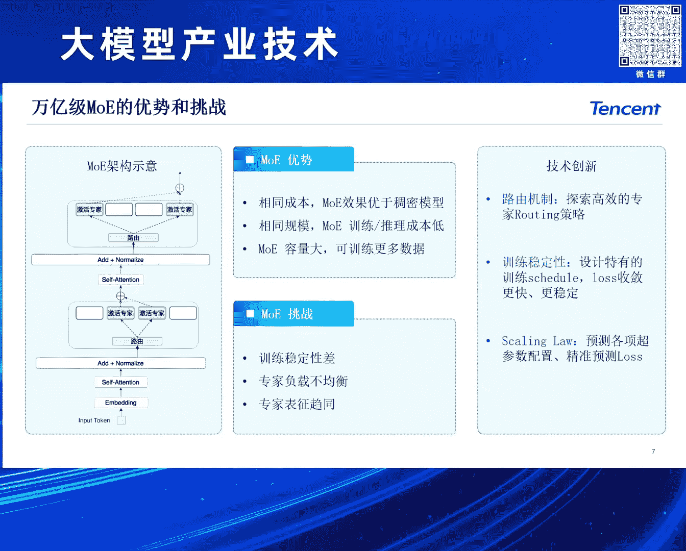
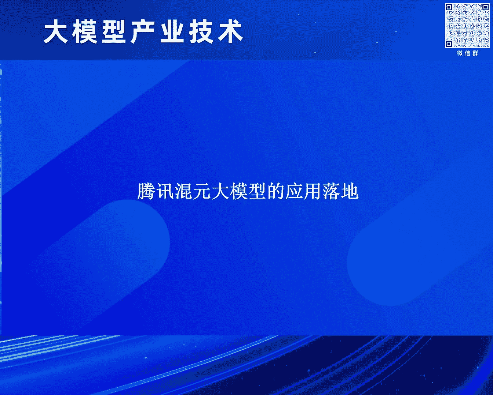
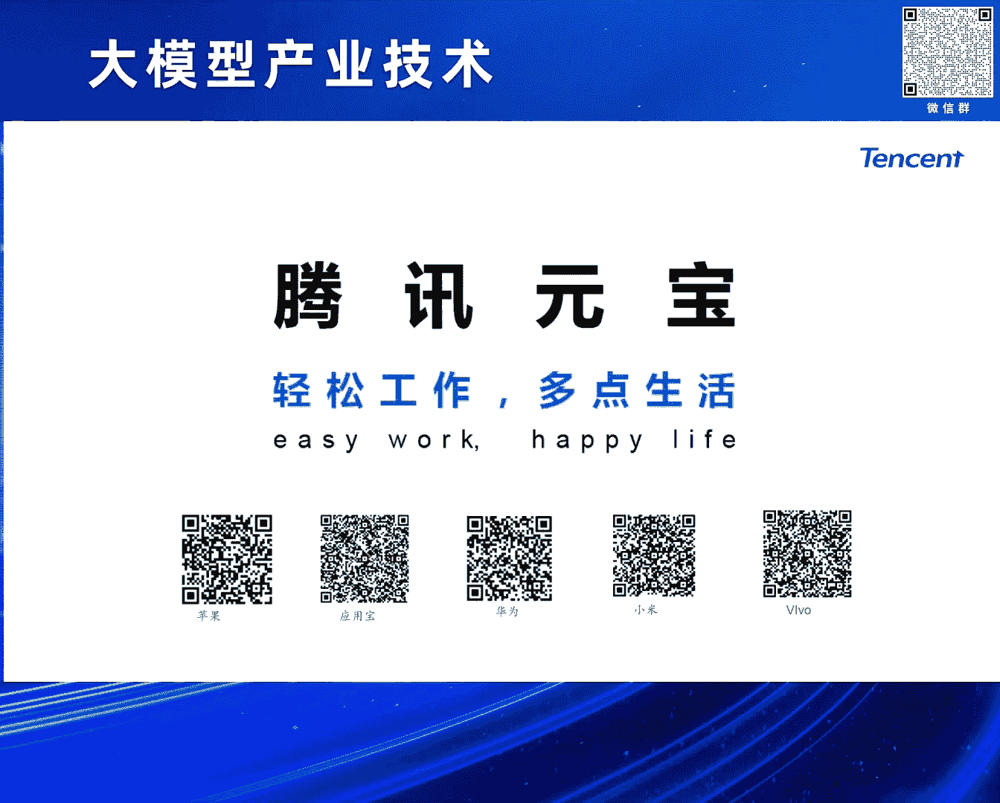

# 2024北京智源大会-大模型产业技术 - P5：混元大模型的研发和业务应用之路：康战辉 - 智源社区 - BV1HM4m1U7bM

好大家下午好呃，首先感谢志源和中原院长的邀请啊，呃我是腾讯会员呃，以及这个I搜索的负责人康振辉，下午呃，跟大家去分享一下，这个我们腾讯会员大模型的一个技术研发，以及它的应用落地，对。

那前面几位刚刚我们的同行嘉宾也提到了这个，其实呃猪根溯源，我们那个整个的GPT它的一个基础结构，这个transformer结构，其实也不是什么新鲜的这个东西啊，像2017年。

其实就由google上提出来的一个标准的，完整的transformer，实际是它是一个encoder和decoder这么一个结构，那很快啊随着这这个呃传播出来之后，其实业界就存在三种不同的路径。

那最早期像18年，很快这种双向encoder的这种啊，典型的做个这个工作就是BT啊，这个基本上是啊代表了这个上一代，我觉得是RP的一个创，一个跨越式的一个发展吧，呃在此之后。

其实我们国内外很多同行实际上都在follow这个啊，领域去做这个，那会还不叫大模型，那会应叫应该叫ptrain model，那另外还有一条路就是呃很快接着啊，基本差不多，同时吧像这个最早的GPT啊。

一到后面的那个google的T5很快出来之后，你就会发现这两条路径，其实最早期包括到TP3的时候啊，这个T5T5也出来了，那那个时候其实大家发现这个整个的T5，又成为那个时代的一个SOTA模型。

就是这种encode decode这种结构，那这条路线就一个叫ECODECODE，一个decode learning，基本上也是后来成为业界啊follow的一个主流吧。

尤其是以下面encode跟decode这种结构呃，当然上面迪克罗尼像啊，我觉得可能国内的各家吧，其实大家都在尝试过，但即使到GP3的时候，其实发现其实这条路线上面，其实当时投入最大的。

其实说实话还是open i啊，包括google自己其实也没有去follow这个路线，主要还是因为当时七比三啊，刚刚讲前面去讲啊，几位前面讲这个skin的问题啊，还是没有达到说诶一个效果。

有一个有个突然的这个这个呃跃升，所以包括我们自己啊，腾讯会员啊，我们会员其实在做这个大模型，或者叫这个生成大模型之前，其实我们在202122年，我们上就已经在做一些跟啊大门相关的。

不过我们那个时候是我们应该叫做pretrain model啊，那个时候我们是一个T5，类似这样的结构，那其实讲到这个三条不同路线啊，其实我们可以看一下这个引用了一个这个呃，这个理查德费曼对吧。

他是一个很有名的一个物理学家啊，讲过一句话叫做说，如果我不能够很好的这个创造，那我就不能够理解，那翻译到大模型或者AJI领域，我们就今天可以解读为说，如果我不能去生产，那我就不能理解。

那就变成了JOOK，今天我们通过生成式模型去解决了，所有理解跟生成的问题，那这个其实也是欧派的一个啊信条，或者叫宪章啊，抵扣欧尼，那这里面我呃提到open，我们就讲讲了呃，刚才我们前面我们那个文浩啊。

不是提到这个这个讲的open这个宪章啊，open这个这个四管齐下啊，那这这里面我是这呃深有认同啊，其实是欧派，其实我们就今天整个的啊，整个的欧派的XGB系列，能够能够这个一骑绝尘。

我觉得他们还是啊深刻的去践行着这四条啊，四条不同的这个思考的方式啊，第一个是说我们要去做，我们要做AGI，我们很重要一点，我们就要寻找，我们要寻找正确的生成模型，那我们从神经网络最早系统BP神经网络。

那很早了，基本上是198几年就有了，到刚刚讲2717年这个transformer，那出来之后，其实我们发现诶我们怎么有一个，我们怎么能够有一个这个啊一个正确的模型，这个模型的吞吐。

它SKILLING是很容易做的，那其实到后面到了22年二三年这一波，其实大家基本上今天我觉得大家国内外吧，我就做这个生成式AI的，基本上都采用了迪克罗尼啊这种结构。

那这是一个第二个就是我们还是另外一个问题，我们一个好模型架构，那我们怎么screen up，那这里面其实啊，刚才那个文浩讲到这个苦涩的教训，就是杰森WCOT的作者啊，他在推特里面提到了。

每天都要去读宪章，然后去去回顾这个苦涩教训，那这里面其实一个背景，刚刚讲我们一个好的模型，那这个模型的参数啊，模型的这个吞吐我们怎么去扩展，那这涉及到一个算力问题，那我们知道我们的摩尔定律对吧。

我们的算力基本12~18个月扩展一倍，但是我们的大模型大家可以去看一下，从GPT1到GP3，到今天GP4啊，甚至GPT5可能已经在路上了，我们发现可能很多时候是在每一年或一年半。

时间都是一个在以十倍的这个速度去扩张，也就是说如果我们去看模型的size，它的增速，它的这个提升的这个速度，是远远高于我们的物理硬件提升，那这里面我们怎么解决这个扩展的问题，那我觉得这里面刚刚讲第一个。

我们的大的batch训练，那这个也是18年很有名的paper，那open今天能够去训练超大型模型，那它的batch一定要开的很大，另外还有低精度的问题，我们用最早期IP32，I p16，B f16。

到今天大家可能很多的我们的一些友商，包括我们自己都在采用，像FF18这样的一些低精度训练，当然为了随着未来这个刚也讲到这个FB4呃，六跟四对吧，这是现在的最新的卡，当然国内也买不到对吧。

但我们知道这个可以看到，就是说我们不论是硬件，还是在我们的这个算法上面，实际上整个都是在去啊探索模型，怎么去能够更有效的去扩展啊，那这两个我觉得很非常重要的，它是体现了我们对世界世界深度呃。

理解的这么两条路线，另外一个就是我们看一下，包括后面出来这种我们的言语学习啊，我的MAMATALL，那这个基本上呃这叫乱码，OK好，那我们通过元学习，那我们其实可以教会了模型啊。

怎么去去做这种fishort zero shot，就我们的ISL能力本身来讲呢，我们只需要一个pretrain model，我们可以给一些啊训练样本，只要很简单，用一些任务描述加测试样例。

模型就可以follow这样的输出，那最后一个那就是我们的TRAGT推出来之后，其实大家看到业界啊，我们有这种叫对齐啊，或者叫模仿学习，那其实上来讲我们就跟教一个小孩一样，像人的智能一样的。

我们不需要去告诉他应该怎么做，我们只要给他一些例子，告诉他什么是对的，什么叫错的，是他就会学会，这是一种模仿学习，另外我们通过强化的方法，可以更加有效的去拉高我们的这个天花板。

那我们都知道我们的pretrain model，或者我们的我们的大模型底座，其实代表的是我们模型的上限，那么通过对齐，通过强化学习，我们来解决是我们的下限怎么往上提，当然这个如果再往后讲。

包括今天我们讲的这个self play对吧，就是我们怎么让整个GBT从类似于alpha go时代，走向阿尔法zero，未来可能我们会有我们自己的g p t zero，好，那前面回顾了一下。

我们这个整个大模型的这个发展历程，以及欧派上面的，我觉得一个给我们一个很好的启示啊，那我们自己来看一下，我们在做大模型，其实我们上是面临我们在算法工程和应用上，实际上都有些挑战，包括在工程上面。

那我们的算力一方面要强，另外方面我们也需要一些高性能的虚体框架，还有我们整个一站式的去做各种各样的呃，业务平台，TESA上面呢我们呃我整个整个的盛世之AI，我们可以看，比如说像我们的大语言模型啊。

纹身纹啊，像我们图声纹啊，也是一种多模态大语言模型，包括文松图，包括啊图声哎，文声视频啊，这样的一些，我们认为啊，今天主流方法可能是以def人为代表的，这样一这样一些算法模型在之上。

我们这个会员的系会员大模型系列上面，我们目前我们自己在公司内，我们支持了很多，我们自己，包括我们的微信平台，包括我们的QQ平台，包括我们的浏览器平台与腾讯啊，在音乐在在整个我们在腾讯云上面。

我们去服务千行百业，实际上都在基于会员啊，我们在对外输出，那目前来讲我们整个会员的模型，刚刚讲我们的呃公众平台，我们是有一个呃超大规模的ego的算集群啊，包括我们星海的服务器。

以及我们自己自研的这个RDMA的网络，高速网卡集群，以及我们啊这种我们的这种呃GPU集群，以及我们室内外啊，包括国内也新创了一些易购芯片，在之上，我们自己推出了我们的这个这个android的这个。

集群的框架，我们目前我们这个会员我们可以看，我们基本上在文身文来讲，我们大语言模型去覆盖，像我们中小size的啊，这7B13B啊，到我们最早第一代，我们去年刚推出第一代的模型啊。

是一个1760亿的176B的模型，那到今天我们基本上把这些模型都做了，MOE化，像我们最新的这个主模型的MOE，我们应该是国内啊比较早的，这个推出了万亿的MOE啊，不在了知识之上。

我们自己也有一些领域的模型啊，包括我们这种代码的模型啊，我们包括我们自己代码们，相当于我们的呃会员的COCODEX啊，以及我们的这个可信的模型，还有我们的rap的模型啊。

广泛去支支撑我们公司内外大概600多个业务，那目前来讲，我们整个啊，我们最主要的这个万亿的MOE模型啊，我们内部呃，中文评上面其实跟吉普斯TOBER，应该是在处于一个梯队啊。

这个其实可能跟我们现在国内的一些啊，我们头部的一些友商啊，基本上大家处于都是啊，我觉得已经基本上处于一个比较相当的位置，那我们刚刚讲，我们自己也也推出了，我们很多的这种中小模型啊，包括7B13B啊。

当然我们可能内部还有一些1B3B的一些啊，端测模型啊，这些模型基本上我们也是做了，有dance版跟它MOE版，那另外一个就是我们也在这个我们的语言模，基础上，我们也推出我们自己的混元的VR模型。

那这个模型基本上我们在中文上面啊，也是跟GB4V啊，应该是比较相当的，最后一个就是我们啊最近我们应该是啊，上个月我们刚刚开源了，我们的会员文生图的DIT模型啊，目前来讲大概是呃应该是中文第一个呃。

中文原声的开源的啊，DIT模型，那训练平台刚刚讲我们自己啊的android平台，包括我们的android的训练平台以及android的推理平台啊，重点啊来讲就是它整个来讲，整个框架我们自支持万卡规模啊。

比我们开源的，比如说deep speed这样的这样的开源框项目，大概快2。6倍，我们的成本，我们的GPU的这个利用率，我们大概可MFU可以做到62%，我们整个在迁移模型下，我们同等可比情况下。

只要50%算力啊，就可以训这样的模型，我们在推理上面，其实我们自己也比我们现在啊大家可以看到的，这个主主流的这个最好的开源框架，我们大概嗯能够提升1。3倍的推理速率，大概我们现在像我们最啊。

之前大家很多开源社区都在用这个SD的，这种纹身图模型，我们可以想用一个啊最标准的第四去推的话，我们可以从十秒可以做到啊，3~4秒三张图啊，单图我们大概可以做到一秒以内啊，好，那我们这里面。

我们最最重重要就是我们这个万亿级的这个，MOE的啊，大于原模型啊，我刚刚讲我们从去年9月份啊，第一次推出时候，那个时候我们学上是一个116，B的模型啊，是个千亿的模型啊，是个dance。

那个时候我们大概训练了，大概有有2万亿的token啊，坦白讲今天回过头去看那个模型，其实我是觉得整个训练的啊还是不够充分的，那今天我们啊最新的我们其实从去年啊，年底，我们就开始去升级到我们万亿的这个。

MOV的这个架构啊，这个架构下面，目前我们最新的大概是训练了，超过7万亿的token，那我们最近大半年我们去可以看看，我们其实通过一些优化，包括啊刚刚讲啊，前面嗯呃黄渤是在讲说我们这个呃自然啊。

这个数据的这个啊现在够不够用的问题啊，其实我是觉得现在整个自然数据啊，如果按这个趋势讲啊，当然按趋势讲的话，自然数据可能是人不够了，但是其实我确实想从另外角度去讲，确实合成数据。

很多时候效果确实比自然数据要好啊，这个也是个我觉得现在可能大家在行业里面，大家普遍都有一个共识，包括我们了解到啊，像44。5甚至五啊，其实里面可能有啊，据说哈有有有超过将近一半的数据是合成数据。

然后这里面呃包括在数据层面大量合成数据啊，以及我们多种训练策略优化，还有我们的呃对其整个强化算法的升级，我们整体效果其实比那个时候应该是，累计超过50%的提升，除了我们tom1之外，那我们也支持啊。

我们一些领域的，刚刚讲，我们一些呃，可能在行业业务里比较关心的一些一些能力啊，包括我们的角色扮演啊，像腾讯内部，我们其实有大量的这种啊业务场景游戏啊，包括我们的这种很多的，像KQ的这种娱乐的平台。

我们需要有些角色扮演这样的模型，包括放生靠，那这个是我们agent a里面最关键的一个啊，一个环节啊，代码生成啊，这个其实在我看来，那代码模型其实啊不光是说诶，我这个是一个代码的本身的。

这个可以用来做IDE对吧，可以做来做tto circle做提效，其本身来讲代码也是整个大圆模型啊，能够突飞猛进啊一个很关键的一个环节，那我们MM呃，万一MOE的这个优势，其实这个也是今天。

我觉得大家今天可能已经成为行业一个共识了，包括我们都知道从包括GBT3。5，GP3。5TOBER啊，他们就是一个啊一个很小的一个激活量，这个MV架构啊，包括今年GBGB4GP4。5啊，包括GB4O对吧。

这都是一个MOV架构，那MOV的优势就在于说我们相相同成本下面，我们MOE的这个效果，是要优于我们的筹备模型的，然后另外就是我们的蓄力成本啊，相同成本相同的规模下也更低啊。

另外就是刚刚讲SKING问题对吧，那我们如果我们对D词当然也可以堆上去，但是同等的成本下面你会一发现，那我相同的激活量，那我其实我可以做更大的模型参数量，这样的话我就意味着我可以吃更多的参数。

而吃更多数据，那当然去年MOE啊，这个其实MOE本身这个东西，其实啊其实最早我觉得一个千亿万亿级的架构，switch transformer很早就有了，但是说实话这个业界啊，其实啊没有太多的这个最早期。

没有太多的这个这个这个大家有这样经验，能够训练一个几千亿上万亿的啊，transformer的这个MOE架构，那其实它里面只有几个它的一些挑战，一个就是它的训练稳定性很差啊。

另外就是它是呃这种网络的这种root，那它的专家负载可能不均衡，还有一个就是呃他的这些专家之间，F分其实特别容易趋同，那我们怎么解决这个问题啊，第一个就刚刚讲我们的路由机制啊。

我们要有一些高效的一些root机制，另外一个就是啊就为了整个训练的稳定性啊，那我们啊我们dance上面，我们我们探索自己的schedule，那在MV上面它有一些特殊的SCHEDU。

包括我们要有一些lost去些设计啊，一些trick让我们模型可以训练的更加快啊，更加稳定啊，比较平滑下降，那skill l上面其实也是一样啦，这个就所有都大模型，我们今天第一件事啊。

我很认同刚刚文浩讲的对吧，我们第一件事肯定是要先做数据啊，先去探索自己的模型结构下的skin law，那今天对我们来讲也是一样，那我们自己MOE，我们是因为从无到还有开始做。

我们很早就探索了自己的各种一些参数配置啊，包括我们的自己的skin的问题。

那另外一个就是讲了今天这个长文啊，长文这一波，基本上我觉得已经成为行业标配了啊，那我们会员我们自己的MV架构，其实我们也是这个支持这种高效的，超常温的attention啊，包括用一些多间断的方式啊。

最早最开始我们可以用平方级的for attention，到店窗影响程度之后啊，那我们可以做一些窗口外推，再到最后我们可以甚至我们要我们做百万级，那我们可能可以做到啊，我们可以做到几乎无损。

但再往上走几百上千万，那这个时候我觉得啊，这个涉及到这个这个这个这个，这个你能不能接受什么样训练速度，你要涉及到有你有多少算力，包括你推理的时候啊，你能介绍什么样的实验啊。

这里面可能会有些几乎无损的一些，细数化方案啊去做，那目前来讲我们自己原生的啊，我们自己API里面啊，我们自己呃这个会员的pro版本，就是我们的这个万亿的MOE，我其实我们原生的支持是百万级的啊。

这个window size啊，当然我们也做了一些啊测试呀，在业界现用的比较多的这个大海捞针对吧，基本上是捞单针对吧，我们自己也构建了捞多针啊，这样一些白CHMARK，那刚刚讲，那今天我们的大模型啊。

其实从去年早期大家比较关注，说我们的知识能力的文科能力，那今天其实已经已经引进到，大家普遍比较关心这个术语能力，那我们认为术语能力其实啊，可能很多时候就代表一个AGI，很重要的一个方面。

那我们自己其实也是一样，那我们这里面的数学逻辑，其实我们自己也采用了大量的核心数据啊，包括这种用COT加一些加上一些啊，用代码解释器的方法，POT的方法，去解决我们很多高阶的数学跟推理的问题。

那这里面涉及到OK，我们自己构建了一个自动化的几个大规模的，数理数据的合成以及ref的流程啊，不断去获取更多的，更优质的这种这种数理的这种QA队，那通过这样的一些数据啊，我们来去做我们的啊。

包括我们在我们的PRETRAIN里面，也加了大量这种数据，包括我们在SIF对齐厘米阶段，不同阶段啊，去做很多这样的一些数理能力的提升，那最后来讲，目前来讲，可以说整个呃这个也是我们大概最近几个月吧。

经过不同维度的啊多次的评测，我们在中文中文上面，我们的数理水平应该是整体上，是接近吉普斯TOBER的，那其中我们在小学和初中上面，小学和初中数学上面，我们是应该是超过G比四的，对，那刚刚讲了。

我们整个大模型这个核心的底座能力，那其实今天大模型啊即使对吧，从最早期到3。5，很多人觉得就二三十%的这种幻觉对吧，今年GB4啊，普遍认为有10%以十的，当然那我觉得那个应该指的是英语。

那现在中文领域我觉得大家应该有感受，应该不止10%啊，就它的幻觉率，那怎么解决大问题幻觉那除了这个模型啊，必须哦就要有更大的SKILLING，另外就是模型本身要训练更充分，去降低幻觉之外。

包括通过对齐的方法，算法之外，其实呃绕不开一个问题，就是模型它没有办法，他对他没见过的东西啊，他其实并不知道这样的问题应该怎么回答，那他这个时候如果强行回答的话，就很容易出现幻觉。

那我们自己啊其实引入了我们自己啊，会员的AI搜索，也是今天我们啊可能大家也有体验到，像混元的元宝啊，我们的元宝的app里面，其实我们自己的AI搜索啊，实际上是来自于，主要是说我们来自于我们内部的。

包括像用了啊，我们微信搜一搜，整合了我们微信里面生态的数据啊，包括搜狗，那是它是一个网页的引擎，当我们自己啊也会自建一些锤炼引子引擎，以及公司内一些其他的一些生态内容啊，都会进到我们混元的AI搜索啊。

主要是要解决我们的一些信源的权威问题，还有我们的一些实心问题，那另外我们在架构上面，那我们刚现在在讲啊，我们今天啊整个大模型啊，从system m1到C4M2，那么今天agent这件事情。

我觉得已经让整个的大模型变成一个，我们要去啊从这个快思考走向慢思考，那我们自己的这个AI搜索本身，我们主体的架构啊也是一个基于agent的啊，planner加action这样一个机制。

那再一个就是那我们今天要去做啊，要做一个很好的AI搜索啊，当然我们离不开，有一个有一个会员的通用的底座，但同同时呢，其实整个的搜索领域里面，还有很多很特殊的些任务，那我们需要去通过一些增讯啊。

包括一些多任务精条啊，去构建我们自己的40GPT模型，那前面讲了我们的呃，就我们的纹身纹模型啊，语言模型K那后面接下来我们呃简单讲一下，我们刚刚说我们自己现在的混元的，VR的多模态模型。

目前我们在混元的VR模型上面，我们内部评估下来，其实整体上中文场面是我们是啊，基本上跟GB4应该是相当的，那这里面就给了几个case呀，也包括这个啊，很多这种场景对吧，那我们拍一个啊。

我们啊今天吃的一顿饭对吧，那我们可以计算一些热量，给些建议啊，他这个其实是典型，它要先解决它的物体识别问题，同时啊他还要知道这里面的理解的问题啊，做一些COT做个推导啊，再做一些给你生成很多这种建议。

那导游对吧，那我们在做很多导外出去旅游，然后随手一拍，我们给一个景点，那我们就可以做很多很多介绍，那我觉得我们是觉得这个这个多模态，这种这种模型，其实未来在很多应用场景下面啊，会给大家一些不一样的体验。

那另外就是我们呃我们近期我们在上个月吧，应该是刚刚开源的这个我们的文生图的啊，混元的啊，DIT模型，那这个模型来讲，我们应该是呃在开源社区里面第一个放出来的，这个中文领域原生的这个这个大模型。

加上DIT这种架构，那其实它呃，我觉得它主要涉及我们有几个优化点啊，包括在前面啊，我们这里面，我们实际上是一个多模态的一个语言模型啊，可以让这个模型啊，这个支持多轮的交互式的编辑啊。

和以及和这个chat的互动，另外我们在生成模型上面啊，那这个DIT本身其实这也是这个骚扰是吧，赖以成功的一个最关键的核心的一个模拟结构，从把最早期我们把unit啊，变成现在我们自己的一个DIT。

可以让模型有更大的更强，这个图像跟文本的这种信息的捕获能力，那刚才讲到我们会员文中图现在也已经开源，大概我们大概三个礼拜吧，我刚才会前还专门看了下，目前超过呃呃2300个style。

那目前来讲我们其实哎可以看一下，基本上我觉得还是处于一个在业界吧，啊排名前三的一个算法吧，那当然现在最好的啊大理三对吧，啊MJNV6啊，当然看最近这个这个SD3可能也出来了。

那我们自己其实现在放的这个版本，我们内部其实也在还继续沿着DIT路径，我们不断在去做我们内部更好的模型，好那那个整个会员大模型啊，我目前来讲刚才讲我们的一些啊，除了我们这个这是呃。

左边一个是我们内部的一个评测啊，我们大概在最近几个月啊，每每个月会有一个呃，这个很全面的一个一个对标的评测啊，我们整体来讲，刚刚讲我们跟JP斯TOBER啊，当然是最新的吉普森。

应该是4月份的GP斯TOBER吧，啊我们大概是略微超一点点啊，就我觉得中文上应该是比较相当的，那其中中文上面文科上面我们还是要领先一些，但理科上面我觉得还是要略低一点点，那那当然这现在外面也有很多对吧。

行业有很多这种呃呃各种这种评测，我们可以看一下，其实我觉得我们今天可能在整个行业同行里面，我觉得还是处于一个第一梯队嗯，好前面讲了我们这个会员大模型的一个基础，研发的一个状况。

那接下来可能给大家去啊分享一下这个会员啊。

大模型的这个在我们司内外的一些应用落地，那目前来讲，会员我们其实已经是作为呃腾讯公司，这个呃我觉得一个很基础的一个呃，一个一个团队啊，这个一个大模型团队，然后呃接入了我们公司里面，基本上各个业务线的啊。

基本上主要一些主要头部的一些业务啊，大概超过600多个业务啊，那呃几个典型的场景，可能呃在座大家可能呃在日常的工作生活中，有可能也会也会用过啊，就包括第一个，我像我们腾讯会议的AI小助手啊。

那这个实际上是一个非常刚需场景，我们知道我们开个会对吧，通常的人很多啊，这个有人对吧，有人上有人下，然后呢，同时呢这个可能一个会就呃一两个小时啊，可能我们得好几万字对吧，那这些这些问题，这面对这种场景。

我们突然中间来了对吧，我们上线了，我们去可能问哎这个之前是谁说什么东西对吧，我们模拟性能不能很快去帮你做这种的，这样的问答，包括会后呢我们都要去去写写写总结对吧，写摘要，那我们今天我们有大模型。

我们可以做会后的总结啊，包括还有一些啊会议代办啊，那另外刚刚讲我们那个我们的这个，我们的这个代码模型，那我们今天我们我们我们知道，就是我们大量的数据啊，我们是存在于互联网当中的啊，以plan test。

以多模态形态，但是还是有很多数据，其实并不在公开的互联网里面，可能在各个企业的数据库里面啊，那我们实际上有一个呃，有一个呃有一个很重要的方向叫BI方向，那我们能不能用大模型的。

用语言模型的方法的这个能力，去改造我们的BI，那我们叫做腾讯，我们自己推推出了腾讯的这个这个会员的这个，chat b i的模型啊，可以使使得我们可以做这种啊。

很多SQL语言的这种tel circle的代码生成，甚至我们可以做一些呃智能代理，用一些自然语言方式去完成一些表格的分析啊，以及我们啊，把这样东西集中在我们的链路里面啊，让我们的这个BI啊。

这个让我们可以认为说，我们过去可能有需要专门有些做BI的，一些数据分析的同学，今天可能不需要了啊，今天可能我们只要是说OK我们的一个业务方，我们就可以用我们的差别。

用自然语言的方式啊去获得自己想要的信息，做很多很啊，各种各样灵活的这种数据的洞察，呃刚讲过这个呃腾讯会议对吧，腾讯会议，腾讯文档都属于腾讯的office系列对吧，讲了会议之后。

还还有个有一个在我们日常工作生活中啊，经常打交道的一个产品，就我们腾讯的文档，我们腾讯文档呢也推出了，基于会员的这个这个AI助手啊，它支持像这个啊，基于呃大模型的这种文案创作啊，包括这种啊表格处理啊。

包括我们甚至可以去啊写一段文档之后，很快可以把它变成各种样格式啊，包括幻灯片啊，PDF呀这些东西，那这个其实我觉得也是一个啊，我们在日常的办公和包括文字创作中啊，非常非常啊常用的一个啊。

一个一个一个AI的能力，呃还有我们自己在我们的呃广告营销场景下面，包括我们啊腾讯广告的妙思啊，我们可以去通过会员大模型，我们可以高效去产出我们很多广告的素材，那这些素材因为是我们大部自己产生的。

那我们其实我们知道在广告当中很重要一点，就是我们这个素材出来之后，我们要去人审，Ok，那如果今天这个模，这个这个广告是我们AI可以做出来，而是我们VI生成出来，那我们其实也可以通过AI的方法啊。

去加速它的这个审核的这个速度，其实可以让整个的广告投放的效率更高，包括我们也可以啊，用这个我们这个呃会员大语言模型做，我们很深入的，在腾讯的这个，我们各种各样的一些流量平台上面的，一些数据的啊。

呃广告效果的场景分析啊，以甚至我们可以做一些，我们啊跟我们广告用户的一些呃在啊，这个基于大模型的这个这个推荐领域里面，做一些尝试，好那最最后这一个我呃你可以看一下，像我们这个最近应该刚刚推出来的。

我们的那个微信读书，我们推出一个嗯，我觉得一个还是非常好用的，一个一个一个功能叫做嗯AI问书啊，包括我们AI大纲，那这个其实都是基于整个混元大模型，那过去来讲，我们读一本书，我们中间有什么一些问题。

可能我们要切出来，我们到索引擎里面啊，甚至我们到某一个啊大模型的这种chat里面啊，去提一些问题，那今天我们不需要了，我们只需要长按啊，我们用直接的方法，我们就可以选取去直接可以去触达。

包括这个文章内的这个书籍内部的，以及它相关的一些知识啊，这个是我们这个新推出的，叫做这个微信读书里面的AI问书，还有一个就是我们现在除了说我们这个呃，我们这这个原模型啊。

我们的多模态模型在各自场上去发挥作用，那其实我们也可以在我们的新闻啊这个写作啊，包括海报的配图当中啊，新华社啊，也许这种融媒体啊，我们做了很多什么江山如苏多娇啊。

做了很多这种基于AI创意的很多这种宣传片，那最后1part就是我们介绍一下，就是我们大概是在上个月5月30号啊，我们发布了呃，会员发布了全新的AI助手，我们叫腾讯元宝啊，那腾讯元宝来讲的话呢。

我们目前啊，像我们主打支持的是像我们的AI搜索啊，包括我们的这种长文的这种解析阅读，我们叫AI解析，还有我们的AI写作啊，包括我们这种写各种各样的文章，包括我们最近啊大家可能很多在高考对吧。

都关注到这个大模型，这个写作文元年啊，今年我觉得实际上是也是这个，大家很关注这件事情，另外就是我们也有一些我们自己的发现，里面的一些AI的一些应用啊，包括我们一些好玩的一些生图生视频啊，这样的一些玩法。

那整个腾讯元宝我们的slogan叫做呃，轻松工作啊，多点生活啊，这个也是刚刚啊在5月30号在各个市场啊，应用市场里面去上架，也欢迎大家啊多体验啊，多啊多提问题。

好谢谢大家嗯，好谢谢谢谢战辉，看看现场的朋友有没有想提问的，举个手，啊内位，诶你好哦，刚才您会议中讲到了，有一个点我特别感兴趣，希望您能展开问说一下，就是说呃，您提到。

就是我们可以用这个会员模型去做这个，广告创意，然后呢广告创意里面呢又可以用AI去做审核，来加速这个审核，请问在这个审核方面，你们用I是怎么做的，或者是用了一样的什么样的技术，能去让它能省的。

能让这个广告创意更符合物理世界，更更更让那个甲方能够接受，就是在这方面你们是怎么付出的，都想了解一下啊，K好，首先第一个我们自己做这个这个AI审核，因为这个模型就是这个素材，是整个会员自己生成的。

那我们在生成的时候，首先我们生的时候就会让它去符合，比如广告法呀，比如各种各样的法律法规，那这个地方在生成的地方，我们上是有些把握的啊，另外一种我们在审核时候其实也是一样，因为模型是模型生成的。

那我们在这个审的时候，其实我们也很清楚模型哪里可能会有些问题，我们可能会有一些内部的一些啊一些特征啊，一些东西会可以辅助你去判断，这个道理没问题，所以我觉得是一个输入跟输出啊，都会做一个把控。

其实这可让会让整个的这个素材的，这个这个生产的效率会更高，好啊，要不然那位吧，那位再加一追加一个问题啊，那位啊，谢谢，呃你好，我们是做那个数字营销的，然后我想问一下，你刚才提到那个用那个呃。

在微信里面做AI的数字营销，能够再展开的说一下吗，呃微信里面我刚刚应该讲的是微信的AI读书啊，关键的问题是还是刚才那次那个同学做的，说那个就是广告营销的事情，是不是对K啊，广告营销里面。

其实刚刚讲我们一个腾讯的妙思平台，刚刚讲，我们学校支持各种各样的这个广告素材的，这个生产审核这么一站式平台，包括像这种纯文本的这种，包括这种图片，以及我们一些这个声视频，这种短短视频短片的这种生产。

跟整个的这个审核，以及整个的对广告主的服务的一个体系啊，基本上是这么来做的啊，好好时间关系就先这样了。

