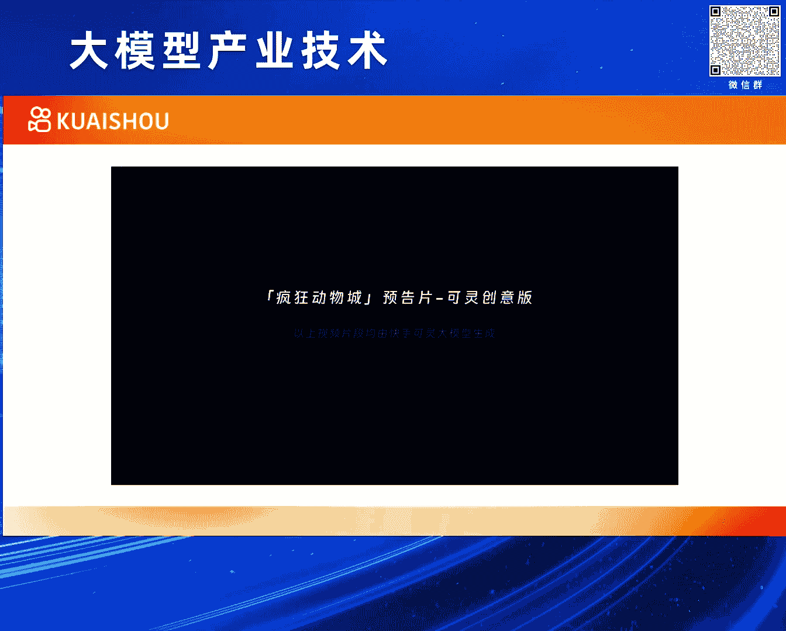

# 2024北京智源大会-大模型产业技术 - P6：可灵(KLING) 视频生成大模型：万鹏飞 - 智源社区 - BV1HM4m1U7bM

好感谢仲远的介绍，今天也非常高兴有这个机会呃，跟大家介绍一下，我们6月6号啊，一周之前发布的快手克林视频生成模型，啊啊我叫万鹏飞，就快手快手可能也不需要太多介绍吧。

就是快手的slogan叫拥抱每一种生活啊，所以快手是一个拥有将近400000000DAU的一个，短视频的一个内容平台啊，所以可想而知，视频这种内容的形式，对于快手来说是非常之关键的。

然后呢啊围绕着视频的各种各样的技术啊，包括应用也非常的丰富啊，那我们快手在呃整个大模型这个方向上，其实也有比较广泛的布局啊和丰富的产出呃，这个可以简单分为三层来理解吧，哈最底层的话infer层。

这个就是啊做大模型是一个庞大的啊，复杂的系统性工程啊，需要有AIAI的平台，然后数据的平台，还有啊评测的平台等等，这样的一些基础设施作为支撑，那再往上的话对于快手来说。

其实快手里面的内容的形式是非常丰富的啊，包含了像大语言模型啊，多模态的啊，理解的模型以及图像视频语音，包括3D的这种生成的模型啊，对于快手来说都是非常有呃实际的呃，意义和价值。

所以我们在这方面都这些方面上都有啊，非常大的投入啊，和好的产出，那对往上一层的话，这应用啊这个从大的方面来讲的话，就是内容的生产创作啊，内容的理解以及内容的分发匹配啊，基本上在这三个大方向上的话就可以。

然后这个涵盖快手里面的大部分的一些，业务场景啊，所以可以想象的是说快手的这个大模型，然后我们做这些事情的话啊，第一啊我们是有实际的应用场景啊，另外的话我们在这方面的一些技术上啊，也有深厚的布局。

然后最终的话是能够形成这样，一个商业的闭环啊，呃今天跟大家讲一讲，那可林啊，可林本质上是一个视频生成的模型，所以还是有必要讲一下，就是什么叫哦视频生成啊，给它一个定义啊，这是我给他一个嗯不太严谨的定义。

当然当然这个视频上传，好像也没有一个官方的定义哈，然后不妨呃给一段描述吧，就是通过生成式AI的技术啊，将用户的多模态输入转化为一个视频的信号啊，这里面有几个点哈，第一个是说用户的输入。

用户的输入它本质是一个多模态的啊，真正的视频生成的话，用户可以输入他想要他，他对于这个内容的各种各样的一些想法，可以是文本，也可以是图像，也可以是一些动作，然后其他的一些控制信息啊。

然后最终它的输出是应该是一个视频的信号啊，从计对计算机来说，它其实就是一个在一个2D的空间上，再加一个时间维度的这样一个三维信号啊，那用到的技术的话，就是如果我们讲视频生成的技术的话，我们一般来讲。

还是说它是用到了一个AI的基础啊，特别是生成式的AI，那所谓生成式AI啊，从数学上来讲的话，可以简略理解为，就是从一个某一种随机的一些嗯噪声或者信号，然后经过一系列的计算和处理。

然后得到一个目标的一个信号，这个目标的信号，可以认为是在某种目目标的分布下的，一个采样啊，然后呃另外的话想跟大家呃聊一下，就是视频这种信号啊，它的获取方式通常来说可以用这三种方式了哈，来涵盖。

第一种方式叫相机拍摄，那相机拍摄大家比较熟悉，大家拍一个视频，包括在快手上，然后我们拍一段视频，这一做相机拍摄，这个他大我，我相信大家都应该做过这样的事情对吧，然后拍个视频，然后啊传到网站上。

或者自己来来留作纪念都是可以，它本质上是将一个物理世界的一些光的信号，转化为像素的信号，OK还有一种视频的获取的方式，叫就是图形渲染，那它本质上是将一些预设好的一些三维的模型，包括他一些材质的信息。

通过一系列的模仿物理物理现象的一些计算，然后得到了像素的信息，所以它不存在是光到电的一个转换，它是所有这些都在计算机里计算出来的K，然后它这里面大部分的计算，其实都是叫叫是确定性的。

就是它有一些一些公式啊，这些公式是描述了一个场景，它应该是长成什么样子的，OK那第三种的话，就是我们今天要讨论的就是视频生成，它本质上来讲是说，从一个它本质上是一种从目标的分布中采样啊。

样本的一种技术啊，这个样本，然后其本质上一个三维星号，这个三维信号解码出来，它就是一个可以转化成一个像素，就是大家看到的视频，那这不同的方式，其实都有它们各自的优缺点对吧，像相机的拍摄使用成本很低啊。

但是它内容自由度是受限的，为什么，就是那拍摄本质是就是3D世界一个投影对吧，3D世界长啥样，你拍出来也就是啥样啊，很难有些天马行空的一些想法啊，那图形的渲染的话，它它的好处就是效果可以很精美，对吧啊。

游戏啊，特效啊等等啊，这些动画都可以落在这个范畴，那但是他的这个使用上手成本太高了，就是正常普通的人是没有能力，去真正做一个动画或者动一个游戏出来的对吧，包括说元宇宙前几年非常火。

最后的话其实也是最大的限制，也是它的一个成本的一个问题啊，而视频生成的话，它的好处是它的内容自由度非常的高啊，就是它的内容是可以天马行空的，包括概念的组合，然后它这个一些这个各种各样的想像中的一。

些场景对吧，然后包括一些仿真的场景，他都可以做的很好，它内容都自由度非常高，但是过去的话，它最大的一个问题在于，它的平均效果水平是有问题的啊，如果大家关注这个方向的话，就可以知道。

就是这这个这块领域一直是备受关注，因为这个事情的价值很高，但是呃过去这么多年的效果，一直是呃是有问题的对吧，就是它的平均收入水平有问题，那直到是说啊最近一段时间有一些新的技术，新的产品出来。

然后把它的效果的这个下限也往上给提了提啊，OK所以视频我们在讲是说呃它的获取方式的话，第三种方式它有它的非常大的一个潜力，本质上是跟前两者是平行的啊，那从技术的角度来说的话啊，有几种吧。

就是我先讲就是现在比较流行的一种对吧，就是视频生成是用用diffusion models，就是扩散模型对吧啊可以啊，它本质上是一种呃，它本质上是一种数学呃，叫什么，就是一个模模拟这个呃一个概呃。

概率采样的一个过程，其实它是一个思路啊，它里面的一个核心是用一个神经网络去预测，预测噪声啊，预测噪声，那用什么样的神经网络，其实这个是flexible对吧，比如说早期很多人用这个CNN的一些方式。

去预测噪声，为什么呢，是因为CNN它天然的对对图像这种信号的话，在过去几年就是表现的性质还是不错的对吧，然后它的整个设计的原理，卷积的这种方式也比较适合图像信号啊，所以就很自然的就会有一些方法。

是用CNN的方法去预测噪声的，那现在也会有一些方法是，用transformer的方式啊的，用transformer这样的一个啊这一类的结构，去在扩散模型里面去做噪声的预测啊。

啊这里面包含了各种各样的一些呃，呃一些一些一些技术吧，啊包这个包含有产品对吧，包括那个SORA，包括快手的可林啊，都是落在这个范畴，那它最大的优势好处在于transformer本身，它具有比较好的对吧。

那这个事情就是在其他单元模型，其他大模型里面是被反复验证了，然后在扩散模型的这种语境下的话，也被观察到具有这样的一个性质哈，所以所以呃现在有很多的方法可以转向，用transformer来做啊。

本质上还是有它有很好的skin law性质，当然还有一些技术的路线，比如说auto aggressive的路线对吧，这样的方法它在概念上也是很听，也是很直接很make sense对吧。

因为这个视频的信号，你是可以把它当成是一种，带有某种序列关系的信号的，那用一个AUTOGRASSIVE的方法，然后来对它建模其实也是非常make sense的啊，只是说现阶段里面有一些新的方法慢慢出来。

然后啊只是可能当前这个效果可能还是不如啊，DEFICIMODELS的方法啊，但是也是一个合理的路线，当然生成式AI其实但凡是一个生成式AI，它只要能够概念上把一个噪声。

一个随机信号转化成一个目标信号的话，它其实都可以做信号的生成，另外视频也是一个信号而已啊，所以其他的像gr v1的这样的一些方法，也可以做视频生成啊，那快手做视频生成的优势呃，第一点是特别重要的。

就是快手本视，本质上就是一家视频的内容平台啊，所以这个场景用户的需求，应用的场景是天然存在的，这是一个非常非常重要的前提，可能非常多的这个技术的研发，其实其实都是要啊，遵循这样一个重要的一个前提的啊。

这样的话它让我们能够在做的过程中啊，基于我们过去对于视频这种内容的一些认知，积累的技术，然后及时以及用户的反馈啊，让这个技术能够真的越做越好，当然对快手来说，我们快手从诞生第一天开始。

其实像内容的生产创作就是一个需求对吧，最早的快手是GIF快手拍技术的对吧，然后呢后面就是拍视频，其实用户的这个需求，我们一直是用不在不同的阶段，用不同的技术方案，去满足用户生产创作的需求啊。

所以在这上面我们有超过10年的技术积累啊，和实战经验啊，以及说我们在大模型领域的布局，非常全面且坚决啊，曾经推出了这个备受好评的快意大语言，模型和可图啊，呃文生图模型啊，效果都是非常不错的好。

那接下来就正式介绍一下可林啊，呃可林如果用一句话，然后来描述他的话，他它可以这么去说，就是它是一个可以实际体验的啊，并且它的效果是呈现了很多SARA啊，这个这个级别的性质和效果的。

这样一个视频生成模型K啊，这个这是克林的官网，大家感兴趣可以看一下啊，那目前的话我们的生成的视频啊，从硬的指标上来说，它的分辨率啊可以呃高达71080P啊，时长的话啊可以长达数分钟啊。

然后我们目前目前开放到了线上的，那个版本的话啊，分辨率是720P，时长是五秒钟的K，然后我们自从发布之后也受到了很多的关注，就是这个申请量是非常之爆炸的，我们也在积极的想办法哈。

能够让大家都能够呃呃尽早的体验上啊，这个就是在我们的快影APP上，有个体验的链接，就是大家啊可以提交，不过现在已经好几万的申请量了，我们在啊就是还是受到了很多的关注啊。

包括还好像还有些外国人在在各种想办法，然后拿到中国，找到证，有手机号上来来体验我们的模型，好，那呃关于可林的话，可能还是先从一个一个一个直观的一个，例子上来给大家呃介绍一下吧，我先声明一下。

就这个例子是我们的内部的同学，那不是什么专业的创作者，内部的同学花点时间，用我们的模型做出来的一个小短片啊，他大概可以大家可以体感为这就是一个普通人，然后用我们的模型花一些时间。

然后能够做出来的一个效果啊，然后我们实际上呃，因为我因为我们实际上线了嘛，我们有很多的这个实际体验者，然后创作者在我们群里，其实我们发现他们比我们会玩多了，他们做出来的视频品质比这个要高了啊。

我之所以放这个视频，更多的是让大家有个体感，就是说啊我们普通人如果用克林模型能做什么，呃今天是动物城一年度的自行车比赛，你们俩准备给谁投票，克尼胡先生身材健硕，我们袋鼠喜欢我们老侯家。

当然是支持嘎嘎星的，啊什么东西过去了。

嘘OK呃那这个就给先给大家一个直观的体感哈，然后接下来谢谢谢谢谢谢，接下来我们先从他的一些效果的亮点，然后来展示，然后我总结了六个亮点啊，讲完这六个亮点的话，我会再去讲它的技术方案里面的一些设计。

K那从如果从效果的来说的话，第一个亮点应该叫大幅度的合理运动啊，因为这个事情对于视频生成来说，是一个很相当本质的一个事情，就是因为它跟图像最大的区别，就带了一个时间的序列对吧，所以运动的建模。

运动的幅度，它的一些合理性，是衡量一个视频生成模型的能力的，一个很非常重要的一个因素啊，所以我们就是用到了一些啊，3D时空联和注意力的一些机制，然后建模复杂运动啊，可以看到生成的这些case的话。

就是整个运动的话啊，不管是幅度和合理性来说，都是啊非常不错的，比如说左边这个视频，这里面有很多东西在运动哈，首先镜头在运动对吧，然后这个马在跑，然后它后面的尘土在运动，而这个人也跟着马在上下颠簸的运动。

所以这里面涉及到很多的运动，包括它的运动幅度，然后整个结构是都是做事做事相当可以的，那右边这个熊猫这个呃，这个例子好像也也也也也，很多人这个拿来拿来拿来讨论哈，就是说这个熊猫弹吉他对吧。

他的手一只手是要在那扫，一只手还要按那个品对吧，然后可能还要摇头晃脑一下，就整整体的这些运动啊，不管是从精细的程度和它的一些幅度，合理性来说，都是啊相当不错的，那第二个亮点。

我们总结了叫分钟级的长视频生成啊，这个事情就是说啊对于一个视频生成来说，它在实际使用的时候，还往往在很多时候的话，还是需要能够达到一定程度的，那即使对于一个短视频的平台，短视频的公司。

它的这个视频最起码也得有个十几秒吧，OK啊，我们展示了我们的模型，具备生成分钟级的长的视频能力，那下面这两个case，就左边这个是一个小孩穿着蓝衣服，戴着头盔骑自行车的一个小孩，然后在一个公园里面骑。

他的场景是在慢慢的发生四季的变化的，然后他在公园里面也会去拐弯什么的，这里要说明一下，就是骑自行车啊，这个事情本身就是比较有挑战的啊，其实很多产品是搞不好这个事情的啊。

因为他要知道这个脚要踩在这个地方对吧，然后他要联动着这个那个杆，然后要动，然后车要往前去骑啊，包括他的身体姿态要跟着去变，所以骑自行车本身一个比较tough的1case，那这里面我们重点要讲的是说。

它是一个长的一个视频生成，那右边这个是描述了一个呃火车的车厢里面，从窗啊，窗户往外看去，然后外面的景色的更替啊，这个这个视频比较长，有2分钟，有有有有一段时间是一个小镇，然后这个雪地，然后草原啊。

后面还有大海等等等等啊，这里面的话就是呃一方面是我们模型比较有，比较好的这种扩展的能力啊，另一方面的话，这个啊也依赖于我们一些高校的一些呃，基础的设施训练和推理基础设施啊。

所以可以看到就是说这种长的视频生成，它的整体的这种一致性是还是相当不错的，你很难看得出来是说这里面对吧，然后有什么突然就变了，崩了还不一致的这个问题，第三个能力的亮点。

然后呃我们叫它就是模拟物理世界的特性，这个也是非常重要的，有生成的东西，它要它要符合物理规律对吧，比如说左边这个倒应该是在在咖啡里面倒牛奶，做拿铁对吧，那首先这个杯子，然后这个这个牛奶要这种流下来。

它是一个流体的一个状态，进了杯子之后，那个水是不能从杯子里面渗出来的，然后慢慢的这个水面要往上去往上去上涨，那这就是一个典型的这种体现了哈，这里面一些流这种流体的这种，物理规律的一个case。

那右边这个case好像非常多人喜欢啊，就好像我们我们的模型在吃东西，这个这个这个场景下能力非常的强啊，这个老外好像也很喜欢这个case，就是这个吃面条对吧，吃面条这个case其实很难，大家想象一下。

就是个手呀，要以某种姿势抓着筷子对吧对吧，然后呢筷子要只要伸到面里面，把面夹起来，这个面还要还还是个软的，但要抖对吧，然后这个人还要张着个大嘴巴，然后把那个面给吃下去了，然后嚼咀嚼，然后咬断对吧。

而且其实他吃了面之后，嘴巴还嘴巴上还沾了些油啊，就是嘶，就这里，这里面其实是里面有很多的一些，很有挑战的东西在里面的啊，包括我们那个吃汉堡那个case，反正好像也是好像比SARA那个吃汉堡的case。

要好啊，这就是讲的是描呃模拟物理世界特性啊，这个也是非常之重要的，或者说它能够反映一个一个视频生成模型，它有没有真正的学到东西的吧，啊，第四点就是丰富的强大的概念，组合能力和想象力啊。

这个这个是生成模型与生俱来的一些规律哈，但是我们这个效果也是也也也是非常的，非常的好的，比如说左边这个是一个是一个小白猫对吧，然后开着一辆黑色的跑车在城市街道里面呃走，然后旁后面有行人和车经过对吧。

这个小白猫那握着方向盘，然后左顾右盼，然后包括他车漆上的一些反光，就这这，这这种很显然是现实世界中不存在的东西，对吧啊右边这个就更不存在了对吧，就是一个杯子里面有一个火山爆发对吧。

然后这个呃岩浆还留了下来啊，这些都是能够非常好的去呈现一些呃，这种天马行空的想法啊，啊第五个亮点是指叫什么电影级的画面生成啊，就是说它生成的这个画质，要能够达到一个非常精美的程度啊。

比如说这两这两个case，然后这个鱼对吧，就这个鱼我个人是蛮喜欢的，就是首先它它它是个整体的，细节还是非常丰富的，另外它在水里游的动态，是看起来是不违和的对吧，就是如果它在水里，然后不怎么动，就在那飘。

那很显然就哼不是条真的鱼在那游了的，然后右边这个花其实也是非常有挑战的，它的挑战在于说一个花开的过程，这种现象在现实世界中是非常少啊，这就是这个这个这个叫什么哎，就是即使在这个我们的视频呃。

大家平时见到视频里面，很少有视频是记录这样的场景的对吧，然后但是我们的模型能够把这个东西呈现出来，那说明他是学到了一些东西啊，能够把一个不太常见的一个现象给呈现出来，第六个能力亮点叫。

要支持自由的输出输出的视频宽高比啊，就是我们的模型可以指定任何的，任意的宽高比的输出对吧，让这个小狗戴着墨镜，柯基戴着墨镜在热带的沙滩上走这个case，反正就是都可以啊，它会自适应的生成呃合适的内容。

OK那接下来再讲一些技术上的东西吧，第一个讲模型的设计，呃，呃我快点说吧，啊啊第一个第一个讲的是说影空间的边界码，也就是说处理视频这样的信号的话，呃如果在原始的这种像素空间上做的话。

这个是非常不划算的对吧，它里面的有很多的信息冗余，对于计算的消耗也非常大啊，视频信号大家都理解就是非常大对吧，然后所以我们是呃，设计了一套这个3D的VE的结构，然后能够对视频进行高效压缩。

其实这个3DVE要做好还是挺不容易的啊，它既要能够很好的去压缩这个信号，同时还要能够具备不要有太多信息损失，还能具备很好的生存能力，然后保持这个画质啊，第二个是从网络基础结构来说。

我们是用了一个transformer的这样一个结构，然后做这个扩散的过程啊，并且我们验证了它的SCALABILITY的性质啊，这个是其对一个大模型来说，非常关键的一个性质啊，持续信息建模的话。

刚才也提到了，我们是用一个时空3D的一个联合建模的方式，能够把这个时空的这个整个的感受也打开，然后增加模型的能力啊，还有一个就是说一个文本扩展编码，就是文字怎么去输入啊，这里面会用到了一些啊大圆模型啊。

相关的一些能力，然后能够确保是说它能够很好的去响应，文本的输入，数据也是非常重要的对吧，我们有一个啊一个高度自动化的，一个视频的数据的一个平台，另外的话我们有非常精细的，这种视频的标签体系。

然后帮助我们去把一些这个不合适的对吧，然后或者是质量低的，或者各种各样不符合要求的，然后的一些数据给给筛掉啊，确保我们训练的数据的质量，然后呢训练数据里面除了视频之外，还要有对应的文本啊。

所以我们研发了一个caption的那个模型啊，专门用来做视频的这种文本的描述啊，啊最后一点就是说数据驱动的效果评估啊，这一点对于模型的迭代效率是比较有关键的，对吧，就是说我们不断有新模型的产生。

我们怎么去评价一个模型，比之前的模型好了还是不好对吧，如果请人来看，那这个东西一不准二效率比较低是吧，所以我们有一个数据驱动的一个评估模型，啊计算这一部分的话呃，有分几部分啊，第一个是说算法本身。

扩散模型本身是有，可以有不同的求解的方案的啊，所以啊我们我们在这里用的是一个传输路径，更短的一个flow base的一个模型，那这个它有比较好的这种啊，效率和效果上的一些性质啊。

这个是目前还是算是比较先进的一些模型，另外的话在训练的话是一个啊，大范围的一个分布式的一个训练集群啊，然后来保障我们的训练效率，然后在训练的策略上的话，也有一些特殊设计对吧，就是比如说分辨率由低到高啊。

低分辨率时候可以多过一些数据的概念，然后到高分辨率时候，然后来提升它的品质，所以是可以结合量与质的优势，另外我们的模型是有很好的能力扩展能力的啊，首先他也讲了，它是可以支持输出不同宽高比的视频。

另外的话开它可以在时序上做延展啊，这个持续的延展就可以延长视频，或者让一个图像变成视频，或者是在把视频做一些插帧等等操作都是OK的，另外的话就是支持多模态输入的可控，因为如果仅仅是文本作为输入的话。

那在实际作为一个产品功能上的话，它还是有很大的使用的门槛，和交互上的不合理性的啊，所以我们是支持各种不同模态的输入啊，确保最终内容是符合用户的预期的，回到最开始的概念，视频生成是将用户的多模态的输入。

转化成一个视频信号，所以这个多模态的输入这一点非常重要的，而不仅仅应该是文本，如果如果展望一下未来的话，第一个是说我们可以看到视频生成的效果，是在快速的提升的啊，其实大家已经能看到一些case。

比如说它的质量已经接近于视频拍摄了啊，也会有一些case，然后它的这个质量接近于图形渲染，那随着这个效果提升越来越快，他对会对一些相关的一些行业带来一些机遇啊，或者是变革，另外的话视频生成。

将视频创作的这个门槛和，效和效果的这个ROI，然后提大幅的提升，那这样的话，视频创作者和消费者的界限会逐渐的模糊，那假如有越来越多的视频的消费者变成创作者，对于整个视频内容生态的繁荣。

是非常非常有价值的，那在技术层面的话，很显然技术在快速的发展啊，不同的模态啊在不断的融合，包括理解和生成这两大任务也在融合啊，第二点是说有好的技术不意味着有好的产品啊，这里面是存在一个巨大的鸿沟的啊。

所以这里面有非常多的工作，然后才能够真正的把一个好的技术推向市场啊，当然是从技术的基础创新也是非常重要的啊，生成式AI的技术，它本质上是一些生成社AI这个任务的一些，基础的一些做法。

然后再不断不断的更新迭代，然后带来一各种不同的啊应用的一些算法上，再带来了一些产品的一些效果的提升啊。

最后打个小广告，就是我们在在招人，就是实习校招社招，如果对我们感兴趣，都可以联系我们啊，好谢谢谢谢，好好谢谢老万啊，对现场的朋友有没有想提问，举个手啊，这位一，呃呃万万老师您好，非常感谢您的精彩分享。

也非常佩服贵公司的这个呃呃模型，那就是可林大魔型挺特别厉害啊，然后就是呃能不能向您请教一下，就是您觉得呃大概在未来呃5年左右之后，就是这就是有哪些是呃模型，就是大概率肯定比人类创作的好的。

就是然后哪些事，就是人类可能还能保有一些优势的，就是人类导演还能保有一些优势的创作呃，技能啊，或者流程或者领域什么的，嗯您是大大概怎么认为的呢，那就是谢谢谢谢哦，OK好。

我觉得首先不应该把这个东西割裂来看对吧，就是模型做什么，人类做什么，也是，本质上它是一个，它长期会是一个共创的逻辑对吧，然后技术是帮助人们解决一些实际的需求的，如果从5年的维度来看呢。

我如果看技术这个事情是非相当有挑战的，按照现在的技术发展规律，但是如果按需求来说，我觉得还是可以看5年的，比如说每个人都有表达自己的需求啊，他的一种体现形式就是内容的创作，但是内容的创作它是有门槛的啊。

创作出来内容普通人效果可能是有问题的对吧，但这个需求是一直存在的啊，不同的时间阶段的话是由不同的技术满足，但是即使到现在啊，比如说用户创作视频的这种需求，也没有被很好的去满足啊，所以从需求的角度的话。

我觉得未来在5年内，这个需求一定还是存在的啊，只是说我们怎么去解决它，我们可能会有在不同阶段有不同的方式啊，但本质上它应该是一个机器和人，然后协同来解决一个实际问题的，这么一个模式啊。

所以所以不需要割裂割裂来看对吧，好的好的，谢谢啊，谢谢啊，把提问的机会留给其他人吧，好的好的好的额好，后面那黑穿黑衣服的，谢谢王院长，我今天问题有点多啊，对我第一个问题是方便说下可怜的规模吗。

参数量规模啊，如果不方便可以不说哈哈不方便哈哈，好的好的好的好的对，然后第二个就是呃我们训练的话，就是说这个训练的计算规模大概是什么样子，就是大概是用多少张卡训练的这种，不好意思，好，那我第三个就是。

比如说我们这边去生成一个五秒的视频哈，这边一个生成五秒视频，大概所需要的一个时间和成本大概是多少，就如果你实际去用那个那个快影上的，那个东西的话，就是你提交提交请求，3分钟输出。

结果是就是就是完整的一个生成时间，五秒钟，需要3分钟来生成一个端到端的物体感的，产品级的端到端的等待时长是3分钟对，所以我们实际下面运行的是A1版吗，这这我觉得这是一个选择对吧，他就是不重要对吧哈哈。

我估计4090也也可以，哈哈啊，所以我觉得可以可以说的，一个是说这个这个在呃这个这个这个可怜，这个事情肯定是一个呃非常复杂的，然后重资源投入的，然后多兵种协作的这么一个复杂项目嗯。

他肯定不是一个单一的啊，我有某有个天才的天才的一个想法，然后啪啦啪啦随便转一搞就搞出来的东西嗯，好给给这边的同学一个提问机会啊，就那位同学，嗯嗯感谢您的分享，哎就是我刚刚看到我们最后有句话。

就是说呃我们这么好的技术，然后离我们好的产品，然后其实还有一些鸿沟，就是我本人是一个产品经理，所以我对这句话很感兴趣，就从您的角度来看的话，就我们可能这么好的技术到一个好的产品。

还差哪些鸿沟可以被去去被填平，谢谢嗯，这个问题挺大的啊，嗯它的不它首先它可以有不同的产品形式形态，然后来满足不同的需求，嗯如果寄希望于说它是一个统一的产品形态，满足所有的需求的话，那有的场景可以。

但是在视频的生产创作上来说比较难的啊，一个现实世界中的一个视频的创作的工作流，还是比较复杂的，所以上从基础的模型到上层应用，这一层是目前来看是不太可能做的很薄的，嗯当然大圆模型可以做的比较薄啊。

但是对于视频来说是不太容易做的薄的啊，以及说不同的领域的那视频的生产创作的需求，是应该有不同的方式进行满足的，它对应了不同的产品形态嗯，这就是先就是大概括的来说，然后具体来说的话就是就是对吧。

就是一个AI的产品，现在被大家诟病比较多的，是说它的留存等等这样的一些问题对吧，所以它提它反映出来了一些共性啊，就是说我们要重视在产品的打造啊，包括用户的一些人机交互方面的设计等等啊，这些工作非常重要。

好额最后一个问题吧，这位女士，呃汪老师您好，我想问一下就是可林这个项目的话，我们什么时候是正式可以开源，然后第二呃然后还有然后就是我想问一下，现在不是线上可以去申请这个试用吗，然后这个试用的话。

就是我是呃是克林提供了这个算力，还是说我需要对我自己的电脑，这个需要有这个显卡的要求，哈哈第一个什么什么是开源这个事情，呃我们会我们会其实我们放你刚才讲的是，我们放出了一些。

我们的一些关键的一些判断和设计，然后未来我们也会把一些呃，一些一些硬核的东西，然后逐步的时候释放出来，然后让大家然后一起来学呃，一起来交流学习啊，我觉得这是第一点啊，至于你说的这种一股脑的开源这个事情。

我们呵呵嗯呵呃可能还是要需要谨慎考虑的，就是肯定啊，不是不是那么简单的事情啊，就是呃目前还是没有这个打算，OK然后关于你说的是使用的时候，我们目前开放过来的用户，使用都是提交一一段文字对吧。

然后我们自己的服务器，然后给你返回一个结果，不需要你们不需要自己的机器对吧，嗯都在云端生成的哈，对对对，服务器生存嗯，好时间关系哈。

