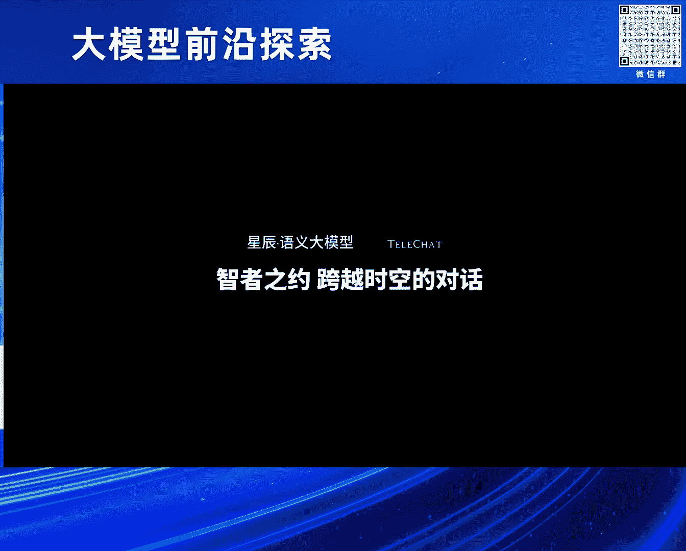
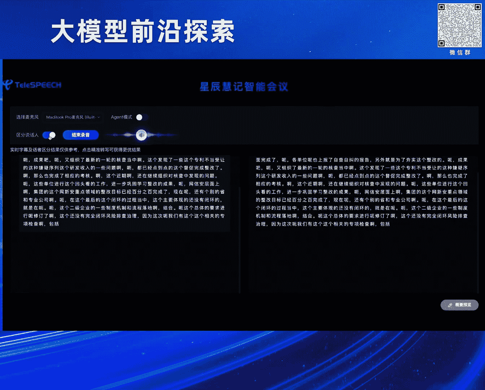
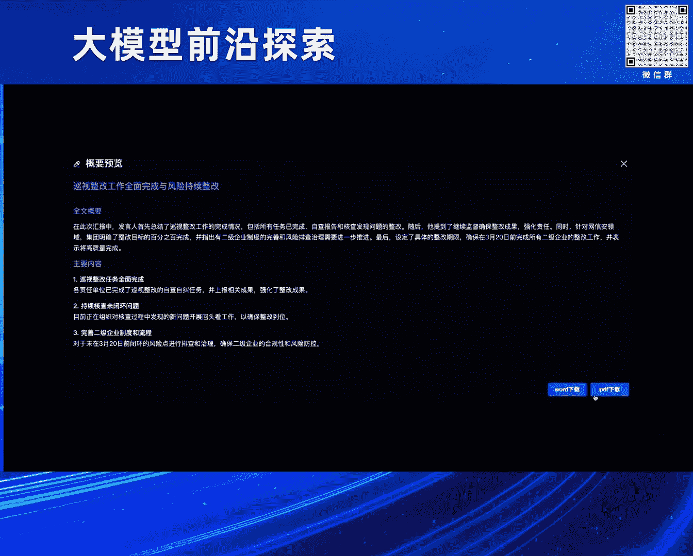
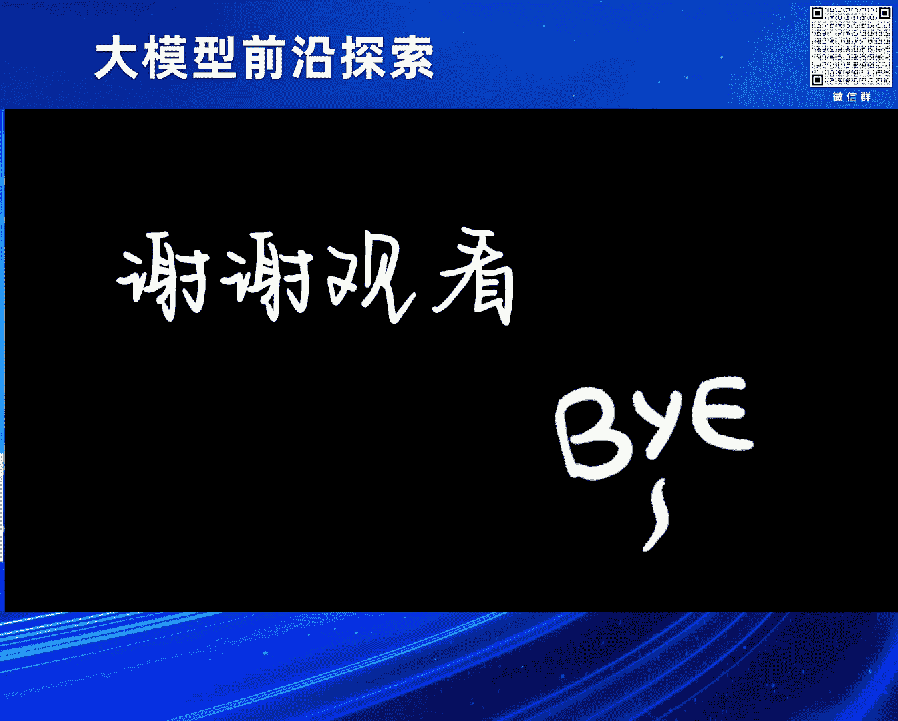

# 2024北京智源大会-大模型前沿探索 - P3：大模型精细化微调和对齐方案：宋双永 - 智源社区 - BV1yS411A73A

啊那感谢啊永祥总和叶全博士的组织，感谢永翔总的介绍，那我我是中国电信人工智能研究院的宋双勇，那我今天给大家带来的是关于大模型，精细化微调和对齐方案的一个一些介绍啊，也是接着刚才叶璇博士。

关于很多的这种基础模型训练的介绍的，一个这样啊，有一个顺承的关系，那今天分三个维度哈，第一个是在大模型精细化微调，然后第二个方向是在偏好对齐，以及说呃，中国电信在大木星场景化能力建设方面的一些。

工作进展的介绍，那首先呃，当然刚才叶璇博士在这个基础模型训练，也提到了数据的这个数量和质量的关系哈，但这里边我这呢主要介绍的是在SFT，也是在微调阶段这种啊，大家在数据思路上的一个转变。

那可能在22年年底，那差点BD出来之后，那大家在这个处于一个尽快追赶的阶段，那不管是在基础模型，还是在这个SID数据个阶段，可能首先是要收集了大量的这种训练的数据，那么在SFT这个也就相当于是问答数据。

这样的一个呃收集的初期，那包括中国电信在内，可能到了23年的34月份的时候，我们手里就已经超过了千万条，这样的问答的训练数据，那这个时候可能说，我们觉得这个模型本身是一个通用模型，那是不是学到的。

不管从基础还是到问答，我学到的知识越多越自然，那么它这个通用的能力都越强，其实大家带着这样的一个思维，然后去做训练，然后呢在这个呃出来结果以后的，实际上呃感觉看上了效果还不错哈。

但是呢这个一直朝这个方向说，我们还是在想，甚至说很多呃，通过了解那其他的这种单配件厂商也是在想，那是不是数据还不足，通过增强呃，增加数据的数量，是不是效果还能进一步提升，然后呢后来在去年应该是5月份吧。

这个出来这样的一个工作，就是立马立马号称是说，我只用了这个1000条的高质量的数据集，就把这个SFT，就这个chat模型训练到一个非常好的一个效果，那个其实这时候的话就会就引起了一个反思哈。

这这个数量和质量的这个维度上，是怎么样达到更好的一个balance，然后来去把这个模型的这个能力，去更好的去诱导出来，那其实包括后面的lama two，其实也是这样哈，可能用的数据也也不多。

然后其呃生成的效果也很好，所以这个时候我们对比呃，就是在这些工作之前和之后的这个，在数据上的一些思路的转变，那可能在之前这个数据取胜的阶段，基本就是百万条起步可能都算比较少哈，刚才我也接到中国电信。

可能我们训练第一版，在这个23年34月份的时候，是用了超过千万条的SFD数据，那再后来的话其实质量为王，质量为王，这个阶段我会发现很多的工作，其实呃公开出来之后，说自己的SFT数据可能不到10万条。

但是效果呢也很好，然后对应的有这样一篇文章哈，叫这个qualities，all you need呃，这个大家有时间也可以读一下，其实在这样的一个呃背景下，那其实大量大量的工作。

现在开始投入到数据质量的提升上啊，SFD训练数据质量的提升，那在这个阶段的话，就会有产生很多对应的一些工作，那包括我们其实也是在做，那精细的话分析在这两个方面哈，一个是数量。

一个质量它到底有什么一些区别，那首先说最开始这个数量的阶段，数呃追求数量的阶段可能是数据虽然很多，但是但是它呃，可能大家并没有太关注它的一个全面性，就是我们手里有哪些数据。

然后就把这些数据都啊收集起来都训进去，我们觉得这样反正是越模型学的越多越好，对不对，但具体这个里面是不是有一些缺失，比如说哈当然这个不是事实啊，就是我手里即使有几千万条数据。

但是里面发现几乎没有这个数学相关的，那这个模型可能训出来他的数学能力呃，相当于它是一个不全面的，然后但这个质量为王的阶段，不是说我追刻意的追求数量的少，而是说要保证质量的前提下，然后再去做训练。

然后这个时候导致说在目前的情况下，高质量的数据的量相对较少，少只是一个呃表象，但这个时候少不是单纯的少哈，而是要少，而全面，就是尽量要覆盖全面，这是一个它的非常重要的一个要求。

那第二个阶段就是在最开始这个呃，这个粗暴收集数据的阶段，可能就是偏free style这个每一种类别的问题，它的格式是非常的五花八门，甚至同样的一个问题的答案的话也非常的形式，也非常的发散。

那这个不能说每个答案是错的，只是说这样对模型学习来讲，它是一个比较有害的对吧，就好像一个小孩，那有好几个老师教同样一个问题，给的答案是不一样的，那这个其实对小孩的学习并不是一个好的事情。

那所以其实在这个后面这个追求质量的阶段，我们就要求这个答案格式，答案格式尽量的规范，尤其是同类问题的这个格式尽量的去统一，这样让模型学习的拟合的会更好，然后在这个数量维度其实还涉及到一个点。

那就是说呃包括最开始这个22年年底，23年初的时候，大家可能为了尽快的追赶，那在基础模型阶段可能训练的数据不太够啊，可能这个大家也可以在翻阅这个一年前的一些，公开的一些公这个工作报告。

可能大家训一个T的，两个T的，可能三个T的这个基础数据就算比较多的，对不对，然后大家会有一些错误的认知，就是说我在基础模型训练不足的情况，我会通过SFT训练更多的数据，把这个能力补齐。

但其实现在证明这种情况，可能会导致说就是基础模型，如果某一块数据不足，那SFT去硬加训练的话，可能会导致明显的幻觉的问题，所以这个时候，其实在我们注重SFD数据质量的同时，反而也能反推。

我们对基础模型的数据是不是训练不足，我们要要求在基础的全面性和SFD的全面性，它是有一个这种互相配合的关系，所以从这这几个方面综合来看，我们在这个质量维度，其实还是有很多的工作要做啊。

呃然后下一个叫介绍的就是那根据刚才的思路，首先我们要对手里大量的数据，是要进行一个数据的筛选对吧，那这个筛选的过程，其实现在已经呃很多，这个研究者提出了非常多的方法哈。

这里边这块的就简单介绍几个也时间问题呃，这个方法可以简单分成两类，一个叫NTARGET，一个叫target，这个区别呢，就是说可能左边这类的方法更具有通用性，它可以针对各各类的数据。

做全面通用的一些筛选，那右边的这类方法呢可能稍微的更有一些呃，指向性，针对一些重点的呃，具体的任务，它的效果会更好一些，那比如左边这个叫IFD这样的一个方法，它实际上这个思路比较简单哈。

我比较直观的介绍，他就是说同样的一条数据，那我给它加了一些提示的情况下，然后它生成答案的这个得分，和我直接去问这个问题得到的得分，它这个差值越大，证明说这个数据是更加合理。

因为我们直观的认为它加了提示之后，它的效果就应该会更好，如果说我加不加提示，然后他的分数是一样的，或者说我加了提示分数反而降低，那么这个问题本身它可能质量就是有问题的啊，通过这样一种方式来筛选。

哪些问题的本身的质量更好，当然呢这个有一些呃，这个容易失，这个判断失误的点就在于说，如果两这两种情况得分都很高，或者都很低的时候，实际上这个判断会有很大的一些啊失误。

所以我我其实我们目前的工作也在有一些思想，基于这个IFD的基础上进行了很多的改进，尤其是针对这种容易失误的情况，然后下面像这种还有叫一个super呃，floating这种这个方法。

它实际上是以IFD为基础，但是他觉得这个FD的效率比较低哈，因为我我要训一个，比如这个几百亿或者千亿参数的模型的时候，用这种方式来过滤数据，它的效率太低了，所以他希望在一些小参数的模型上。

然后这个过滤数据，然后在大模型上进行训练，那这个时候会导致这个误差更多一些，因为毕竟是不同参数的模型嘛，它选择质量的这种结果是不一样的，然后后面这个就呃，时间问题就不不挨个介绍了哈。

然后右边这个就是这种，针对具体任务的一些过滤算法，那像这个NGAS的话，是，就是首先它是判断这个候选样本，对测试及每条数据的一个训练增益呃，这个直白怎么说呢，比如说我选了20条测试样本，然后呢。

我针对一条这个准备要判断的候选样本呃，如果加入这条样本的训练，能够让这20条数据的训练增益，就是这个loss值哈，其中有15条这个增益就变大，那实际上它这个叫增益占比呢，就是十五五除以20，就是0。

75，相当于我给他打一个0。75的分，最后按这个分数来排序，来找这种质量更高的这种候选样本呃，然后这个还有一个方法叫这个less less，其实是呃也是同样固定这样的一个测试集。

但是它直接考察的是候选样本对定义模型，这个梯度优化方向，对测试及损失的这样一个降低程度，可能不是说按照刚才说这个15÷20，这样一个占比啊，这这是这个两个方法的一个一个差别。

那目前的话我们的工作其实更多的是，基于less s在做，针对一些重点任务项上做一些数据的筛选啊，因为这种效果是比那个NAS的这个方式，要更好的啊，这是这样的一个介绍，然后基于这些呃思考也好。

还有基于一些方法的理解也好，其实我们正在做的一个事情，可以概括为这样一张图，就是针对一些重点能力的提升，所谓的重点能力就是图上画的这些哈，三大类逻辑认知和理解，然后每个大类下面也有一些小类嗯。

大概这样十几个重点的啊，这种能力的类别，那我们结合刚才的这种数据筛选的方式，同时结合这个PPL啊，RRRFT就是这个拒绝采样的一个方式啊，做一些筛选任务呃，然后去拆这个筛选更优的数据。

同时呢我们还面向一些标准的评测集，来定向提升单项的重点能力，然后在这个基础之上，那我们怎么样做通用能力的融合呢，就是按照这个三个大类，然后划分能力的维度呢，进行一个强化这样的一个训练呃。

在这个过程中呢就会非常重要的一个点，就是这个迭代优化数据的配比，那我们在保证每一个能力的数据质量呃，构建尽量高的同时，每一个能力有提升的同时，怎么样把这些能力的训练的过程融合到一起。

保证每一个能力都有明显的提升，所以这个过程中其实对这个数据配比呃，是有很多的一个经验性的一个积累啊，呃这个举了一个SFT优化的一个效果哈，这个主要是一个逻辑推理的问题，呃这个问题本身就不念了。

首先其实像这类问题哈，在我们原来的经验来看，那只是通过这种比较粗糙的基础训练，加赛的训练的话，它确实是很难去学习到的一类问题，因为这类问题对数据质量要求是非常高，这个也是我们在SFT过程呃。

优化过程中比较重点优化的一类这个数据呃，数据类型，那经过刚才聊到的这些，很多的这SFT的数据的优化的手段之后呢，其实在这个原有的基础上，我们整个的chat能力啊，是可以提升到大约8%这样的一个啊。

一个比例，那里面重点提升的几项就包括像逻辑推理，幻觉，数学和翻译能力分别提升的也比较高，尤其是这个数学计算，因为数学计算其实就像我刚才说，可能在之前呃，大量收集这个SID数据的时候，是比较少覆盖到的。

并且它的质量很难保证，然后这块其实是需要很定向的去呃，提高它的质量，所以这块的数学能力的提升也比较明显，然后第二部分呢就是大明星偏好对齐的介绍，那偏好对齐本身，我先可能说一些我自己的理解哈。

不一定是这个公开的，或者大家公认的一些呃一些这种定义，那其实偏好对齐全称就是叫人类偏好对齐，怎么让模型呃，学习的东西更加符合人类想要的那个呃结果，但其实这样去说下来的话，好像我们不光是做这个呃强化学习。

还有像现在这个DPO哈，还有包括刚才提到的SFT，甚至我们把这个范围扩展到这个基础模型训练，好像他都是在做偏好对齐，对不对，因为所有的语言文字，所有的文章段落，它都是人为的去写出来的。

那么其实每一条数据的学习，都是在做一个人类偏好的对齐，当然今天要讲的这个偏好，对齐呢是是一个比较狭义的偏好对齐哈，就是在通用SFT之后，那么怎么样这个模型更好的去按照人类的偏好。

去产生更呃符合人类要求的结果，这个是稍微狭义一些哈，呃这个我就不不再介绍这个偏好对齐，目前有各种方法，目前我们用的就是DPO这种方式啊，我们直接对比一下，这个SFT和DPO到底有什么样的一个区别。

因为按照刚才来讲，好像他都是在学习人类呃，呃这个人类创造的一些数据嘛，但是它本身在这个方法上是有区别的哈，呃比较直观的一个理解就是SFT，我们是不是每过来一条数据我就学习，反正你给我的数据长什么样。

我就觉得我要把这条数据学会，但是DPO阶段它实际上是一个pair的方式，在学习，就是同样一个问题我该怎么回复，我知道哪些问题回复是得分高的，更好的，得分差的呃，这个这个我不应该去学的。

所以它实际上有一个PARALYSE这种概念在里面，所以我们可以简单的哈，比较粗粗糙的认为说，SFT是point wise的这种方式，然后DPO是一个PARAGRASE，这样的学习的方式，来以此加以区分。

然后这个其实DPO和SFT本身，在这个模型训练上，它的目标函数已经不一样了，因为paradise它相当于是这个呃，中间会有个减法啊，这个loss它是一个一个减法的方式，呃对啊。

这个细节我就不一行一行念了，然后呢我们具体的这个DPO实践的方式，其实就是用这种一种迭代的这种方式来做，其实DPU不是说训练一次就结束的，而是说我们拿刚才这个通用SFD。

训练好的模型作为出版的这种DPO模型，那么在这个基础上的话，把这个代表性的query数据去生成，对应的这个pair，就相当于一个模型，我可以跑跑出不同的结果，然后在这个过程中。

我们的标注人员是要去标注哪个pair，是啊，这个效果更好的那个pair是效果啊，不是不是哪个结果是更好的，哪个结果是比较差的，这样生成的par数据在这个基础上。

通过刚才说到PARAGRASE的方式来迭代模型，这样一轮一轮的迭代，到最后发现这个模型会越来越接近人类，它这个我们标注人员哈想要的这种啊，生成结果的样式，最终产生最后的final模型。

其实思路比就是比较简单的，思路是比较简单的，然后针对个DPO的话呃，这是举了一个DPO的这个pad的数据啊，这里边通常我们管它叫接受和拒绝，就是刚才说的这个好的结果和坏的结果。

那其实这个里边我们主要针对的是一些呃，逻辑等类的一个问题，就在这块就没有像SFD那样，我们把通用的，刚才说的十几20个这样的重点领域，以及说这个通用的领域都做优化。

这里面其实呃优化的这个方向就稍微少一些啊，这个这个例子就不念了哈，然后整个DPU的效果，那我们重点优化的是主要是三个大类，一个是逻辑推理，一个是安全问答，还有一个是幻觉问题呃。

那其实这里边幻觉问题提升是比较多的，因为刚才这个月卷博士也提到啊，其实很多数据在学习过程中，它其实是符合语言逻辑的对吧，语是符合语言逻辑的，但是模型本身其实很难判定说呃，这个符不符合事实嗯。

尤其是关于一些时效性的事实对吧啊，比如这个呃这个明星之间的这个结婚离婚啊，这个这个选举啊等等选举变化等等，其实这些呃呃当然这是另外一个问题啊，这个实时性，但是在本身的一些事实类的幻觉问题上。

还是要通过一些呃，定向的这种数据优化来做提升，所以这块的我们在这个基于DPO的这个，幻觉问题优化上，效果提升也比较明显，啊最后一部分呢是介绍中国电信在大复兴，长景化能力呃，建设一些进展工作。

那刚才基于这个呃整个模型训练之后的话，我们实际上是在一些技术积累和开源上，有这样的一些产出，那首先的话我们目前的模型的话是，从1B到千亿万亿参数，当然前面这个呃这个从怎么说呢。

这个版本的话其实覆盖面目前比较全，但是真正开源的话，目前我们是把7B12B和52B模型，以及1T的高质量训练数据，目前已经是面向全网开源，另外在国产化试备阶段，那不管是这个芯片禁令，也好。

还是我们这个国央企信创国产化的要求也好，其实在这块的进展，我们做的也是比较多，包括像升腾，寒武纪随缘和登临，这种国产化芯片的适配的推理，都已经这个完成适配，另外还有就是刚才呃叶翔博士也提到。

那我们和这个GBT3。5，3。5tuber和GBT4的一个效果的对比，其实目前来看的话，我们的可以简单理解为，我们12B的模型，和GBT3。5的效果是持平，然后呃52B模型适合3。5突破的水平，呃持平。

然后达到GPT4的这个93%，当时这个我们在内部测试，是基于中文效果上的一个对比，然后基于这些能力的话，我们主要在当，我们已经在很多的场景上有些呃落地哈，今天主要介绍这样四个场景，一个是行文写作啊。

一个是这个智能客服，一个是辅助经营分析，其实就是智能取数的一种呃，特别的应用场景，还有就是一个会议纪要盒子呃，啊，这个是给出来12B和3。5的一个，一个对比哈，大家可以看到在各类方向上是有胜有负。

然后整体的能力是基本持平，那首先第一个点呢，就是我们介绍这个行文写作这样一个能力啊，我们叫星辰绘笔这样的一个产品，那在这里边的话，其实在写作的过程中，可能最原始的这种呃文本生成方式，就是我给一个题目。

我直接生成一篇文章哈，那这个其实不太符合人类的一个写作的方式，正常我们会列一个大纲对吧，哪怕我们这个考试写作文，我会想第一段，第二段是总分分总总分总，哪怕后也会有这样的一个思考对吧。

所以这个我们是按照第一步先生成大纲，然后再从大纲生成文章这样的一个过程，然后在生成大纲的过程中呢，这个大纲大家还可以，这个根据自己的需要进行一些修改，同时在使从题目生成大纲以及大纲生成文章。

就每个段落的时候，都提供了这种参考文献的能力，可以基于参考文献来模仿它的结构，生成大纲，然后基于这个参考文献的内容，来生成每一个这个长文的章节，同时在生成结果之后呢。

我们还会针对每一这个每句话进行这种扩写，续写改写的这种自动化的能力，而构成了这样的整个的一个产品化的写作能力，然后第二点的话是介绍关于这个智能客服，智能客服，相信呃很多这个老师专家也稍微了解哈。

那其实在这里边的话，一个是在线的问答能力，还有一个是离线的，对人工客服的一个辅助的能力，就包括这里面列举到的像智能填单，像这种辅助问答，还有这个大明星知识采编，其实都属于这个离线针对人工客服辅助工作。

这样的一个能力，那这里边我可能简单介绍一下这个关于大模型，知识采编这样其中的一个能力，那传这个知识彩片我要介绍是什么，这个可能是电信特有的一种叫法，那就是在离线的话，人工客服要对很多的一种呃。

产品介绍或者是套餐介绍进行一个内容的抽取，那这样方便他在客户服务的时候，会有快速的准确的一个回复，那这里面的字段和传统的这个命名，实体识别还有很大的差别哈，因为这里面不光识别实体句子。

有可能是很长的一个段落的一个介绍呃，然后在这个这个传统的采编，靠人力呢肯定是费时费力的，然后基于小模型的话，相当于每一种类别，每一种这个抽取知识的类别，可能我要单独训练模型。

而且一个迭代起来相当于是要迭代很多模型，那这个时候相当于我们用大模型做知识，采编的话，就是用统一的模型，把刚才说的这种看似结构化，但实际内容又五花八门了，这样的一个能力去实现啊。

这样大大提升了一个人工抽取的效果，然后下一个能力的话是呃，这种辅助企业经营分析，它其实是智能取出的一种呃特别的应用场景哈，我用用在这个基因分析，包括像这个数据自动的提取，然后数据展示以及自动的数据分析。

和基于分析的结果的一个报告生成，这个其实在目前大模型落地场景上，是一个比较火的方向，然后在这个方向上，其实我们还在持续大力的投入，然后把这个能力做的其实越来越精细化啊。

还有一个点呢是在这个高精准会议就要生成，当然这个首先第一步，是要保证高精准的一个语音转写，还有就是这个画者分离，然后在这个基础上，我们这个基于大模型的会议就要生成，包括像这个整个会议的呃。

呃这个主要内容的生成，以及针对每一个说话人的主要内容的生成，这个其实都做了很很多的这种优化的迭代呃，当然刚才都是一些静态的介绍哈，最后一个整体的一个视频也给大家展示一下呃。

比如第一个展示的是刚才提到的星辰绘笔，那个长文写作功能，我们发现在这个基于标题写大纲的时候。

就可以加入一个参考文献，我们相当于可以参考这这个文献里边的内容，以及这个文献对于，这个章节题目的一个写作方式，然后来生成这样大纲，这样就能保证是说比如我要写的是一个电信呃，这个内部风格的公文的话。

那其实我给你一篇这个参考，你写的我就会更精准，这样相当于在大纲维度改动就会更少，那这个里面就具体介绍了一些其他的能力哈，在我们这个问答平台上，标语包括一些表格读取，以及像这个表格生成。

还有像各类的这种呃代码语言生成，还有像这个应该是呃一些古文的理解的能力，还有这个是关于逻辑推理，当逻辑推理，刚才我在介绍SFD和DPO数据的时候，也重点介绍过很多啊，包括像数学计算。

刚才也有一一定的介绍，是说我们在这方面其实做了很多定向的提升啊，不目前目前其实关于K12的能力。

覆盖的也比较全面，那这个是比较偏娱乐性哈，这个可能十几个这个历史人物的一些啊，对话的能力也是集成到了我们弹幕心中，这也是刚才提到的星辰会记，那第一步是先是一个精准的呃会议语音转写。

然后在这个基础上的话呃。

就会生成一个这样精准的一个会议基啊，当然这个我们测试压力比较短。

所以生成的内容也比较短，好的呃。

呃感谢大家啊，这个是我的，现场同学看看有什么问题，啊这，好老师想问一下，就是呃现在就是我们今天介绍，其实关于这种预训练，大模型和这种反衬的大模型嘛，就是从您角度来看，我们比如两到3年之后这样一个大模型。

它的一个体量，就是参数量大概会到一个什么样的一个量级啊，好的呃，呃这第一个问题啊，然后第二个第二个问题是说，就是其实今天是说微调和一些预训练呃，主要是说在数据上有些差异，那如果你会看到。

就是我们对于很多国产化的这个芯片算力，其实做了适配，那未来的趋势来说，如果我们对于显存啊，带宽啊，互联还有一些基建通信，就是对于这一方面，从我们的这样一个训练的过程中。

有没有一些就是比较这种量化的趋势的分析哈，大有两个，抱歉，那个第二个问题中间其实这回音比较大啊，没太听清啊，对第二个就是关于那个显存带宽，互联和一些基建通信这样的一个未来趋势。

有没有一些比较量化的这种分析啊，啊抱歉，显存在什么时候显存带宽，显存带宽啊，对基建通信互联对哦，好的好的呃，首先第一个问题啊，在参数量这块，在参数量这块怎么说呢，反正目前这个参数量的增长大家也看到了。

包括这个昨天跟叶璇博士还在聊啊，现在我们发布的模型是ET，未来可能就是10T百T起步，像刚才说的这个传言的GBT5，可能已经达到了这个几次，百T这样的一个参数规模，所以我觉得参数规模肯定是要上去的。

因为其实我们现在我个人理解哈，我们追求的这个参数的量，其实并不是盲目的去追求参数的量，其实在下一个阶段我们要考虑落地的话，肯定要考虑基于这种大参数量的这种scaling，loss的这种效果，怎么样把它。

可能蒸馏或者近似于蒸馏的方式，把它的效果给它去映射到一个小参数的模型上，然后实现一个参数小，但是效果会更好的，这样的一个模型，其实我们现在并不是追求说一个大参数量，因为如果说一个模型部署。

一路要几十台甚至上百台这种A100，A800的机器来做推理的话，这个其实对于我们的实用性是呃不太友好的啊，所以下一步其实就会涉及到一个从大到小，但是这个大的探索一定要去做。

因为我们到现在还没有探索到多大的参数量，是达到一个能力的上限对吧，我们其实在探索到这个上限之后，才会去考虑怎么样把它缩小，然后第二个问题，关于这个问题哈，呃其实我在想这个量化的事情。

其实很难去给出一个一个公式，因为这个本身和硬件相关，其实现在我们在做这个事情的过程中，就会发现呃怎么说呢，我我就直白一点哈，我们在软件维度这模型维度，我们可能我们是在快速的追赶。

其实我们国内在这个硬件方向，也是有很大的空间要去做追赶，然后现在涉及到这个芯片禁令，导致说我们刚才也提到在这个呃升腾啊，随缘上做了很多的适配，但是我可以直观来讲，那具体这个数字就不说哈。

确实和我们刚刚才提到这个A100，A800，甚至说我们现在这个呃只能听到还碰不到的，是是B200对吧，这样的一些这个这个GPU比起来，确实差距还比较大，所以这个啧，我觉得目前谈到量化可能还是一方面。

最重要的还是一个持续的这个软件，硬件的这个持续的提升吧，你看啊对我能先问一个问题吗，啊对就是那训练的话，其实没有办法做一个量化的这种提升啊，但是我们看到，如果现在这种前沿的MOE的模型。

对他这种可能从传统的这种TP，PP到DP的运行方式，可能会像这种呃就是EP，甚至是可能SP就是sequence，LDS这种呃sequence的一个并行方式，这样一转变，这种转变的方式。

对于我们再去做这种硬件系统的时候，它主要是在什么方面需要去做一些调整呢，比如我们之前其实是一个算力棒的过程，在后面我们会是一个通信和基建互联的这样，一个棒的过程吗，嗯对是的，其实现在嘶啊。

现在其实您说的这几个点啊，反而是它的目前我们训练遇到的很多，一个限制呃，其实好多时候它这个单卡或者单机，它的训练的性能其实可能还好，但涉及到一个通信，比如像这个我们的IB卡对吧。

像那个GPU用到的IB卡，其实现在在这个方向也是也是一个限制，那我们现在遇到一个问题呃，比如在这个三四千卡和七八千卡，它很难达到说一个两倍的计算效能，其实就是在这个问题上，所以当然这个关于硬件本身呢。

我并不是一个这个方向的专家，哈哈我也我可能懂得稍微少一些，所以在这个维度上的话，呃，怎么说呢，我觉得您的问题本身就是答案就在里面，就这个东西确实很重要，但是怎么样，我在这些地方给出一个量化的结果。

好像也比较难，是不是不好意思啊。