# 2024北京智源大会-大模型前沿探索 - P4：大小模型协同训练初探：敖翔 - 智源社区 - BV1yS411A73A

喂好谢谢叶璇的介绍，嗯很高兴能够在职研大会来报告，我们团队的一些这个研究进展啊，主要是在大小模型协同训练这一块，呃其实很惭愧啊，就是我们做这个方面的研究呢，啊也是被逼无奈啊，就为什么这么讲呢。

你看这个基座模型啊，一般都是像智源啊，啊像这个BAT啊这种大厂对吧，人家有算力，有数据啊，然后有一堆这个算法工程师啊，才能玩得起的对吧，那如果说这个想做垂玉的行业的大模型啊。

得像咱们中国电信啊这样有数据啊，然后有这个算力中心对吧，有很多这样的行业数据的机构才能做得起，那如果作为我们这种高校啊研究机构啊，既没有特别大的算力啊，然后也没有特别多的这个行业数据的积累。

那我们也想做大模型，那这时候怎么办呢，那只能只能把这个大模型啊当成一种工具了啊，就是作为一种比较高级的工具啊，然后来辅助我们日常的一些啊，关于小模型的研究啊，所以就有了这个报告哈。

就是大小模型的一些协同训练方面的研究啊，我分四个方面来介绍吧，呃首先这个大模型现在有多火啊，就不用我再赘述了，我特意浏览了一下，咱们今天上午的三个平行的论坛啊，除了咱们这个论坛名字里面是显示的。

提了大模型三个字啊，另外两个论坛呢我看了一下名字啊，一个叫做多模态论坛，多模态模型论坛，另外一个叫AI安全论坛，但是里边的这个报告的内容啊，或多或少的其实都和大模型是息息相关的啊。

所以说就通过志愿大会啊，这样的一个在同一个时期举行的平行论坛，都能够看出来现在大模型有多火，那就更不用说我在这列的这个slice了，就每一次我出来做报告啊，用这一页的时候我都非常的焦虑啊，为什么呢。

就总得check一下，是不是又有一些新的东西没写上啊，特别是在这个箭头上面的这些模型的名字对吧，就从今年春节之后啊，大家这个耳熟能详的一个是SORA，一个是这个g b t four o啊。

就必须得写上对吧，但是好在呢底下的这个核心的技术啊，似乎到目前为止啊，我认为还没怎么变化啊，但是刚才听了这个呃叶全博士的报告啊，我觉得可以加上一个生长的这种训练的方式啊。

也许可以写到这个核心的技术路线上啊，作为人类反馈的这个强化，学习的一个更先进的啊，更先进的一个替代啊，写到最新的呃这个时间轴上，但不论怎么样，就是大家其实我们说现在叫这个大模型呢，其实省略了几个字啊。

叫做生成式的人工智能大模型，就前面那个生成式，大家觉得呃能力是非常强的，非常震撼啊，但是在我在这呢必须要强调的一点啊，就是说它除了生成能力以外，其实他的这个意图理解能力啊。

还有包括分析推理能力也是非常强的啊，非常强的，但是可能大家都呃，呃被它的生成能力震撼了以后呢，就忽略了这两方面的能力，那我们这个研究呢，实际上主要是在用大模型的这个，意图理解和推理的能力啊。

然后来帮助我们做一些事情呃，除了我们这块有一个案例以外呢，做了一定的调研学习啊，他们其实也是在和百度合作啊，然后再用生成式大模型的，意图理解和分析的能力啊，他们在做什么事情呢，他们是在就用这个大模型啊。

做这个呃反诈的这个这个这个案件的推理啊，还是非常有意思的啊，大家有兴趣的话可以去关注一下，我在这就不多说了啊，那可能有人会问说，你们这个这么多人现在这么呃，特特这么关心大模型，那大模型出来以前啊。

你们这帮做人工智能的人都在干什么呢哈，呃答案非常简单，就是我们一直在研究小模型啊，这块画了几个区域啊，就原来这个每一个这个框呢，实际上都代表了不同的门派啊，不同的门派，比如说我们在分析时序数据的时候啊。

可能大家就会用这个LSTM啊，那如果做这种关系数据处理的时候啊，可能会用图神网络GN啊，然后我原来可能在GN这个方向啊，做的是比较多的，那么即使是这种生成的领域啊，就是在大模型出来以前。

实际上也有这个以干模型为代表的，这种图像的生成模型一直是存在的啊，包括transformer等等，那原来呢就是大家这个门派之间啊，或者说这个研究领域之间是基本上互斥的啊，就没有大模型之前呢。

我们都认为自己是属于不同的领域啊，就举个例子，可能在我后边讲的黄磊老师啊，原来是做CV的，然后我可能是做这个data manning的，做这个用户行为建模的，那我们按理说是不会产生交集的啊。

就不会在一个同样的论坛里，大家来这个做报告啊，因为我们属于不同的子领域啊，但是现在因为有了大模型了，可能都认为哎你是做人工智能的啊，所以今天我们也在同样也同一个厂子碰着了啊，但其实呢就是多年以来。

这个小模型在各自的领域里面，还是比较不错的啊，都是一些这个SOTA的代表啊，就已经有了一些卓越的能力了，那因为大模型出来了对吧，那我们这个小模型还要不要啊，就面临了这样的一个选择。

那我们的回答呢应该是还是得要啊，要不然我们这么多几十年来的努力，全都白费了对吧，而且呢这个大模型呢它并不是现在可以啊，直接替代很多小模型的啊，只是举了两个场景啊。

第一个就是在这种端侧做轻量化部署的时候啊，你这么大参数的一个模型，这么呃这个这个这么耗这个算力啊，费电啊，这样的一个模型啊，如果放到手机里面去啊，特别是大家讲如果C端的应用对吧啊，一定要强调用户隐私。

我要在本地部署，那对不起，你的手机可能会很快就没电对吧，因为这个大模型非常耗电，所以呢这个在端侧部署的时候，小模型还是有一定的用武之地的，另外呢就是在一些特定的任务上，可能还没有取得特别好的表现哈。

比如说在一些非常专业的领域啊，或者是我们给他提出一些比较苛刻的要求啊，就是每次问他同样的问题，但是呢要求他的回答要保持一致啊，这个对于大模型来讲可能都非常困难啊，因为大模型是一个生成式的。

一个比较flexible的模型对吧，所以说呢在当前的这个时代啊，小模型并不是呃就一下被丢弃了啊，还是有一些这个用武之地的，那怎么来让小模型发挥更好的作用，或者说怎么让大模型去指导啊。

优化小模型能够更好的在现在这个时代啊，发挥自己的作用啊。

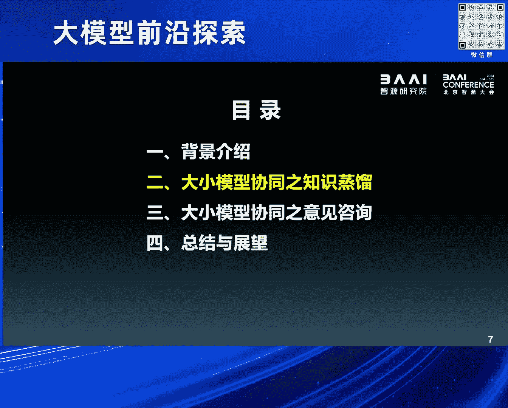

我们就做两方面的尝试，第一个方面呢，我们就是用这个知识蒸馏的这种思路啊，这个当然是比较传统的一个思路呃，现在如果想说这个大小模型怎么结合啊，基本上都是采用了右边的那个图的，这样的一个方式啊。

就是让大模型当老师啊，让教这个小模型怎么着去更好的进行优化啊，然后完成它的任务，那我们就用了一个这个代表性的任务，做了一个尝试哈，就主要是做问答啊，当然这个问答呢跟传统的问答不太一样。

就是在给出答案的同时呢，还是希望这个小模型啊，能够给出一些所谓的解释啊，啊就现在说这个可解释机器学习比较流行嘛，所以这个问题的输入啊就是给一段问题。

然后中间那个language model呢它可大可小啊，可以是一个比较小参数量的一个语言模型，右边的output有两个这个field啊，第一个就是答案是什么，关于问题的答案是什么，下边有一个解释啊。

就这个模型必须要输出关于这个回答的一些啊，一些这个这个这个解释啊，这是我们的一个任务的设定嗯，但是很遗憾，就这个任务实际上没有标准化的数据啊，就原来我们所谓的这个NLP领域的benchmark。

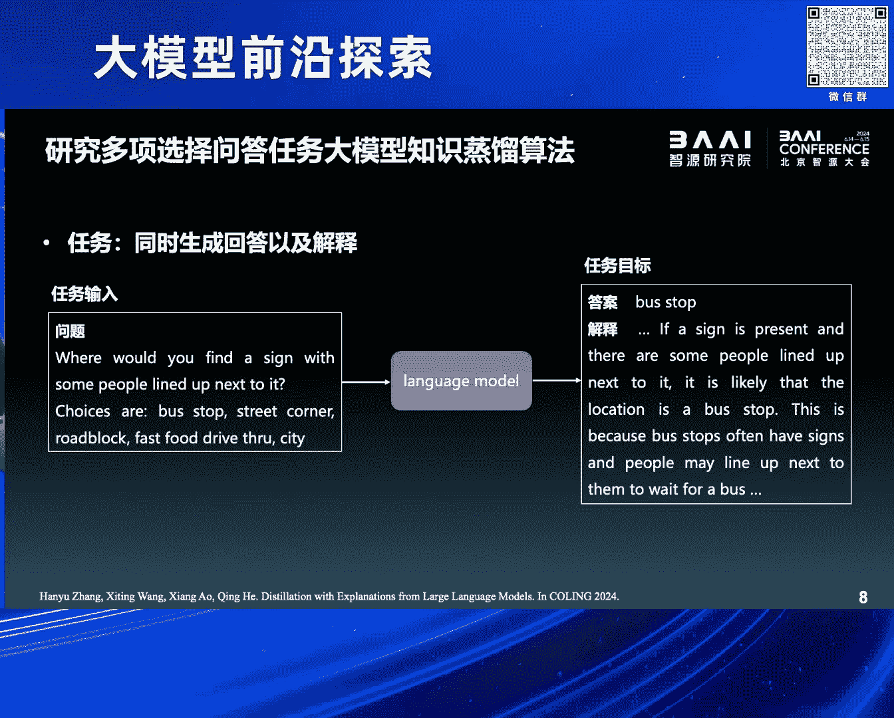

可能只有问题和答案，但是没有解释呃，那我们想得到这个解释怎么办呢，那大模型就可以来稍微借鉴一下啊，因为大模型作为一个生成模型对吧，你即使问他一个问题啊，然后让他给出答案，它会天然的生成一大堆解释。

那这个时候呢我们就让这个大模型啊，来帮我们这个任务啊，来生成一些所谓的训练数据啊，呃大概的形式就长这个样子，就是我们问这个大模型一个问题，然后让他回答这个答案，然后并且呢给出他的解释。

然后他就巴拉巴拉能生成好多，右边的这种训练数据呃，但是我们要必须要注意到，就是现在大模型的能力，并没有完全达到一个非常巅峰的水平是吧，那他即使是做一些比较标准的benchmark，他的回答正确率。

也就大概是个七八十分的水平啊，有大概223成的这个答案是回答错误的，但是呢我们发现一个比较有意思的现象哈，就是即使大模型它回答这个问题啊，回答错了，它生成的这个解释呢，和他的错误答案还是非常相关的。

哎就是它推理的还是比较正确的，这有一个柱状图可以看到橘色的是，他即使是回答错了啊，但是他的推理依然非有非常有道理，非常有逻辑啊，跟他的这个错误的答案是非常一致的，比例甚至比回答正确的那部分还要高。

那有了这个观测以后呢，我们就想，那能不能诶，我们就去训练一个所谓的这种，一致性评分的模型啊，然后我们来评价一下这个答案和这个解释之间，的这个呃逻辑的一致性啊，如果一致性高的话。

那我们就可以用这样的数据啊。

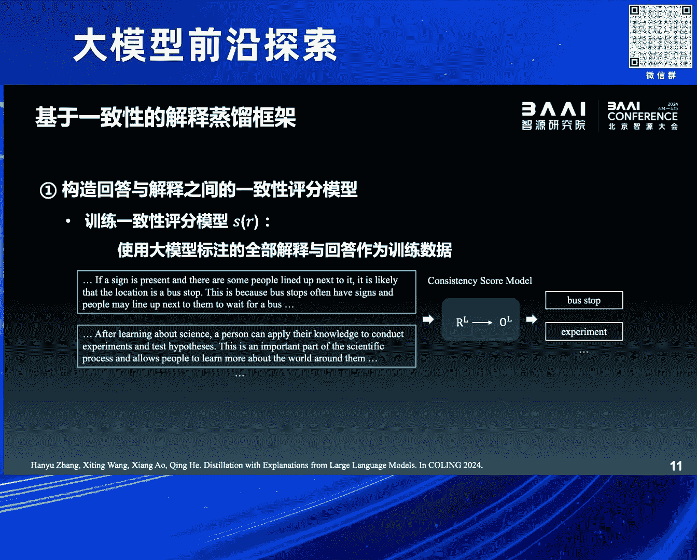

来训练我们的小模型，那么一致性不行的话，我们就把这个数据给扔掉了啊，就非常简单的一个呃这个这个想法，那好那这个时候我们面临这个任务的话，我们想用大模型来收集训练数据对吧，然后就面临了两方面的选择。

那么一方面就是，我们完全相信大模型给的东西啊，就给了一个输入之后，不管大模型回答的对或者错，然后都用他的答案和解释的这个pair，当成训练数据，那这么做的话呢，可能可呃，即虽然他的解释和答案。

是相对来比较来说比较一致的，但是毕竟他的回答是错误的对吧，那这种错误的数据会对小模型呢，来引入一些所谓的训练噪声啊，最后小模型可能训着训着就跑偏了，那当然还有一种做法，就是我们不是有真实的答案吗，对吧。

就原始的数据集没有解释，但是有答案对吧，我们可以用训练集里的ground truth当答案，但然后用大模型的这个解释啊，当成所谓的这个回答的explanation啊，但是这样做的话。

那很显然因为大模型有的时候会回答错吗啊，所以他的这个解释和答案之间会发生不一致，对吧，会发生不一致，那我们怎么办呢，我们就采取了一种trade off的方法对吧，刚才提到。

就是我们可以去设计构建一个所谓，答案和回答之间一致不一致的这样的一个呃，呃一致性的判别模型对吧，就中间那个黄色的箭头，那这个时候我们就可以啊，去构造一个这个所谓的一致性的函数，来评价大模型给的解释。

和真实答案之间的一致性啊，就通过我们刚才讲了这个判别的模型。

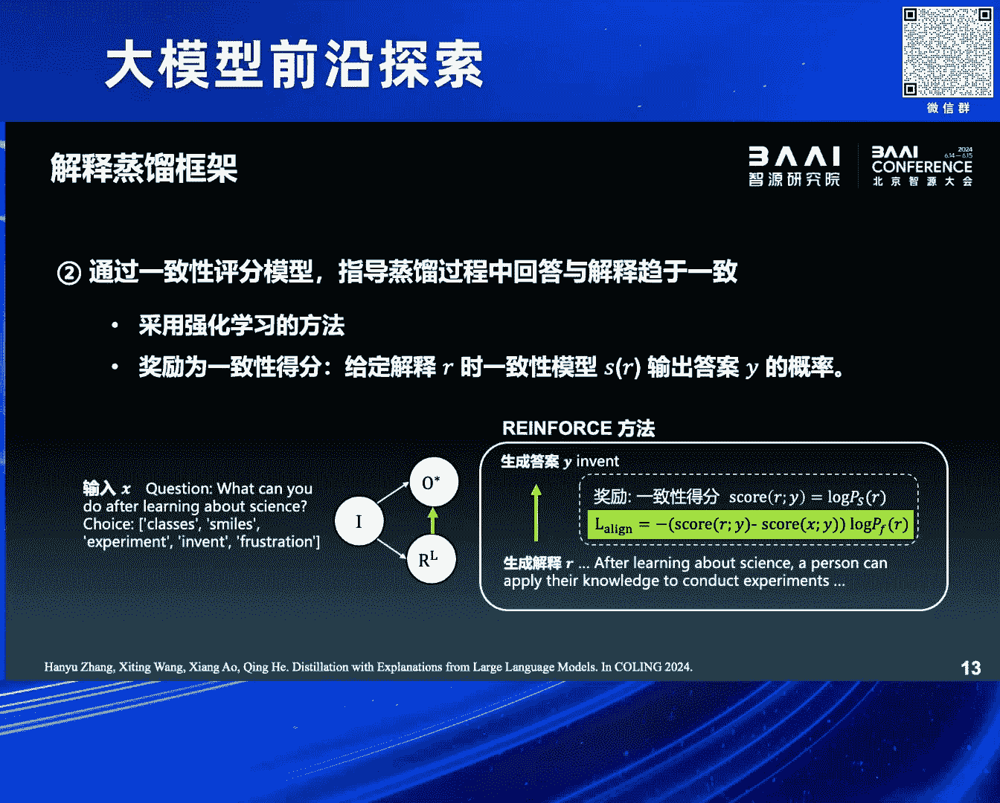

那么有了这个黄色的箭头以后呢，实际上我们再去做这个任务的时候啊，这这有点细节了啊，这个就简单讲一下，就三部分的loss啊，一部分就是给一个问题呃，然后给生成答案的一个loss。

然后给一个问题生成解释的loss，以及这个答案和这个解释之间，一致性的一个loss啊，三部分这个loss，那这样的话就会让这个小模型，从大模型给出的这些数据里啊。

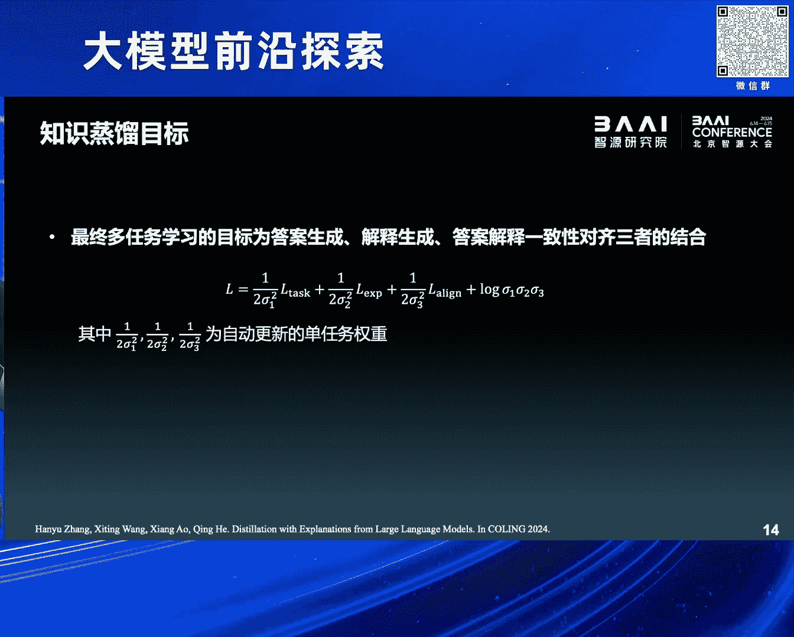

去学习到他所谓的这个知识，那我们在这个三个benchmark上做了一些实验啊，最后一行是我们的方法，可以发现，我们跟其他的一些这种蒸馏的框架比的话啊。

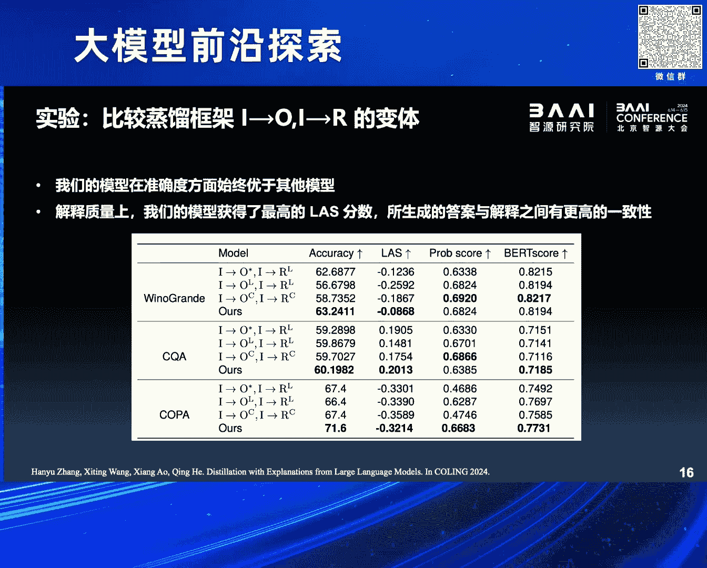

还是能够取得一些比较不错的呃提升的，然后同时我们也用这种人工的评估的方法啊，大概检测了80个问题啊，也会发现在不同的方面啊，我们的这个方法呢，都会比原来的一些框架取得了呃一些提升啊。

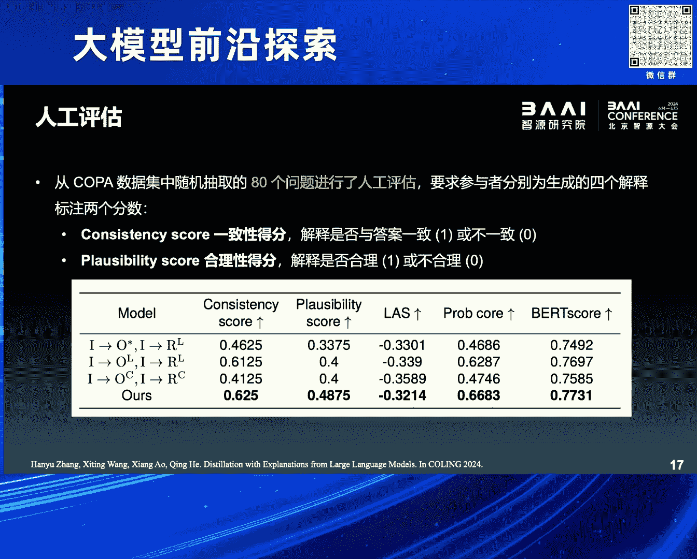

最后看一个case study啊，这个是英文展示了啊，因为数据集就是英语的，他大概讲的意思就是说这个呃这个货商对吧，他货商他决定去呃买进羊毛对吧，卖出棉花啊，因为什么东西的价格比较高啊。

如果是我们来做这道问答题的话，肯定会选这个这个棉花对吧，就是选这个2B啊，因为价高对吧，低买高卖嘛，因为它价格比较高，所以我把这个货物啊进行卖出，那可以看到我们对比的几个方法啊。

首先是chi g b t啊，就没有回答正确啊，给出了一个错误的答案，那么他的解释呢，因此我们就不用看了啊，不用看了，那我们看这个其他的对比的框架啊，比如说这个一种传统的蒸馏的框架。

它虽然答案回答的是对的啊，选择了棉花，但是他的解释里面一直在写，什么羊毛的价格比较高啊，所以答案应该是A对吧，他跟他自己已经发生了冲突，所以叫他的这个这个这个呃，这个解释肯定是不正确的。

那我们所提出的这种蒸馏的框架呢，就不仅选择了正确的答案，同时呢对这个答案的呃这个这个产生的过程啊，也给出了一个比较啊make sense的一个解释啊，就是说这个棉花的价格比较高啊。

所以呢答案呢应该是选择2B啊，因为这个价高的话，那它会让这个供货商去呃卖掉这个东西，然后同时去选择购买更便宜的，另外的一种商品啊，所以这个是我们在这个NLP的这个任子，任务上吧，然后来看了一下。

就是大小模型，在数据层面啊发生协同训练之后啊，能够对小模型的呃能力呢能够取得一些提升，那么除了这种比较传统的框架以外呢，我们团队最近也啊做了一些这个小小的探索啊，就是在这个意见咨询的啊。

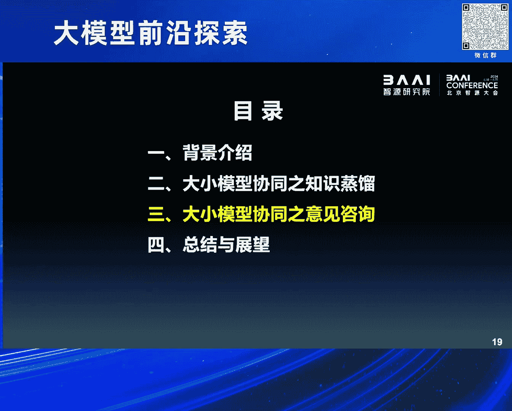

这个视角上也可以去做大小模型的一个训练，那么在这呢，我们的研究对象就不再是做NLP了啊，就变成了这个图神经网络啊，这个领域也就是大圆模型和这个graph的数据啊，怎么来结合这个方向呢。

还是呃相对来说比较前沿的，那么现有的两个范式啊，分别是最左边和最右边的那种范式啊，左边的这种呢，我们可以把它叫做大模型作为预测器啊，就是说来了一个图的数据啊，我们直接把这个图结构啊。

翻译成一些文字表述的prompt，然后扔到这个大圆模型里面去，然后让大圆模型呢去做出一些预测啊，然后再基于这个预测呢做一些精调什么的啊，但是在这个范式上，我们会发现GN这三个字压根就没出现过对吧。

就完全用大模型在做图了啊，但是我们刚才这个知道我刚才也提到，就是在这个图数据的处理上，现在图神经网络肯定是SOTA嘛啊，就是我们没有必要这个另起炉灶，就完全用大语言模型，而且说实话。

现在大语言模型在这个这个处理图数据上，他也不是非常的擅长啊，我指的是graph，而不是image，那么当然就有由于没有结合GN对吧，就出现了右边的那种范式啊，叫做大圆模型作为增强器啊，在那个图上。

我们会发现GN出现在了最下边对吧，说明这个大圆模型呢确实是和图神经网络呀，发生了一些交互啊，但是这个交互呢相对来说呢比较初级啊，就有点像我刚才讲的这个，我们做的第一个NLP的那个工作。

就是通过大圆模型去帮这个GNN啊，准备一些数据啊，准备一些数据，就还是把图数据的这个结构呢翻译成prompt，以后，让大圆模型呢去做节点的属性增强啊，因为我们现在可能这个属性上是文本的，数据是比较多的。

那么增强了以后呢，相当于这个graph data呢，它的这个信息量啊就得到了扩充，然后再去训练GN的时候，也许效果能够提升啊，那么这种范式虽然跟GNN发生了交互，但是我们注意到它的交互仅发生了一次对吧。

没有充分的去利用啊大圆模型的推理的能力，那于是呢，我们就呃这个这个结合现有工作的一些呃，这个缺陷吧，然后提出了一些改进啊，就给出了中间的一种新的范式，叫做大圆模型作为顾问啊，作为consultant。

那么中间是一个循环对吧，就是说我们在这个GN的训练过程当中啊，总会遇到一些比较难的case啊，就好比如说我们看病对吧，总有一些疑难杂症对吧，可能是这个GN这种初级的医生是解决不了的。

那么这个时候我们就把这些疑难杂症对吧，交给一个专家啊，大圆模型，大圆模型呢来针对这个疑难的杂症啊，这个比较难的节点去做一下预测，那么预测之后呢，我们会把这些信息啊再反馈给这个GN，然后再去做调优。

那么如此循环的这样迭代的话呢，最后会获得一个更强的GN啊，获得更强的GN，所以这个是我们这个呃，就是今天那报告的一个核心的思想，就是用大语言模型作为工具，然后去提升那些哎原来传统方法的一些效果啊。

那么大概的一个框架呢就分成这几个步骤啊，就包括不确定点的选择呀，自动提示工程啊，啊大圆模型的咨询和回复的利用等等啊，分别来看一下，我们刚才讲，就说，我们并不希望这个所有的点都去问，那个大圆模型啊。

原因呢因为GN他能力还可以对吧，有一些简单的case，我们就没有必要惊动专家了对吧，所以就是我们只去挑选部分节点，那怎么来挑呢啊我们可以用简单的一种策略啊，就是通过不同的参数啊。

去构造不同版本的图神经网络，然后对同一个图来做预测啊，那么预测的时候呢总会出现在某些节点上，它的预测的方差啊，就是这个分类的概率啊，它的方差比较大，那么这种概率大的节点啊，分方差比较大的节点。

我们就认为是所谓的疑难杂症啊，然后我们就开始向大语言模型呢发起咨询对吧，那么咨询的时候呢，我们就得像那个大圆模型，来描述这个节点的情况啊，这块也比较简单，我们就把这个节点周围的一些邻居啊，就是连边嘛。

连边它的一些一二阶的邻居的信息啊，包括这些节点的属性啊，以及label啊，还有这个GN是怎么预测的啊，就像写病历一样啊，写成一些文字的信息，然后来向啊大圆模型呢发出一个提问。

那么大圆模型呢接到了这些输入之后呢，它会根据他的一些理解对吧，做推理分析，最后给出他的回复，他的回复呢我们的要求的格式也比较简单啊，一个呢就是这个节点到底是哪个类啊，标签是什么，第二就是呃对于它的分类。

要给出他的推理的解释，那么有了这个回复以后呢，我们毕竟要和基恩做联合的训练对吧，那我们怎么来让GN来使用这些文本呢，那么这块呢用了一些比较启发式的方法呃，我们知道大圆模型对这个图结构啊。

就图节点做分类的时候呢，无非会遇到两种情况，一种情况就是大圆模型，它的预测和我的ground truth之间是一致的啊，就是他预测对了，那么预测对的时候，我们就自然相信他的解释也比较合理对吧。

因为刚才我第一个工作里面已经讲了，就是它大圆模型每次对自己的回答的这个推理，还是比较合理的，那我们也相信他的这个解释是比较合理的，那我们可以遵循像这个大圆模型作为增强器啊，这样的范式。

把大圆模型反馈回来的这个文本的解释，作为图上这个节点的属性的补充啊，就直接把这个文本堆到它的属性里，那这样的话呢，能够带来更丰富的一些语义信息的补充，当然大圆模型也会有失误的时候对吧。

就是他的预测和ground truth，之间是不一致的啊，就是大圆模型也没有搞对啊，这个疑难杂症，那么在这种时候呢，我们就做了一个这个假设哈，就之所以GNN预测方差比较大啊，这个节点比较难啊。

大圆模型也做不对，是因为它周边的这个图结构出了问题啊，可能是在我们构图的时候啊，由于我们的这种啊规则设计的不好啊，它有一些噪声连边被加进来了，或者是这个节点遭到了某些这个注入的攻击啊。

有一些噪声的连边存在，那这个时候呢我们就把它周围的结构啊，做一个简化啊，让它让它这个连边的关系呢，得到一个这个呃比较简单的一个情况，看能不能做对啊，说白了就是把一些那个连边给它剪掉啊。

剪掉之后看下一次GN还能不能预测对啊，所以就是有两种呃，利用它反馈的这个方法，那么整个的这个设定我大概就讲完了啊，然后因为我们是在这个，TRANSACTIVE的场景下做的啊，所以我们在这个大图上。

一上来就能够看到所有的training sample，跟test sample啊，所以我们任何一次大圆模型的反馈，无论是属性增强也好，还是结构的去造也好，都是在整张图上能够可见的。

那么在最后的测试的阶段啊，由于我们的GN已经在不断的和大语言模型的，交互当中啊，得到了强化，所以在测试的时候，他已经是一个得到了专家指导的，一个终极医生了对吧，所以他就不用再去向大圆模型发生发起咨询了。

直接就是对那些test sample啊做出自己的预测啊，当然我们的实验结果也是比较受鼓舞啊，就是我们为了去充分的验证这样的一个范式，能不能有效哈，所以我们在呃同配偏好的图上。

还有包括异配偏好的图上都分别做了实验啊。

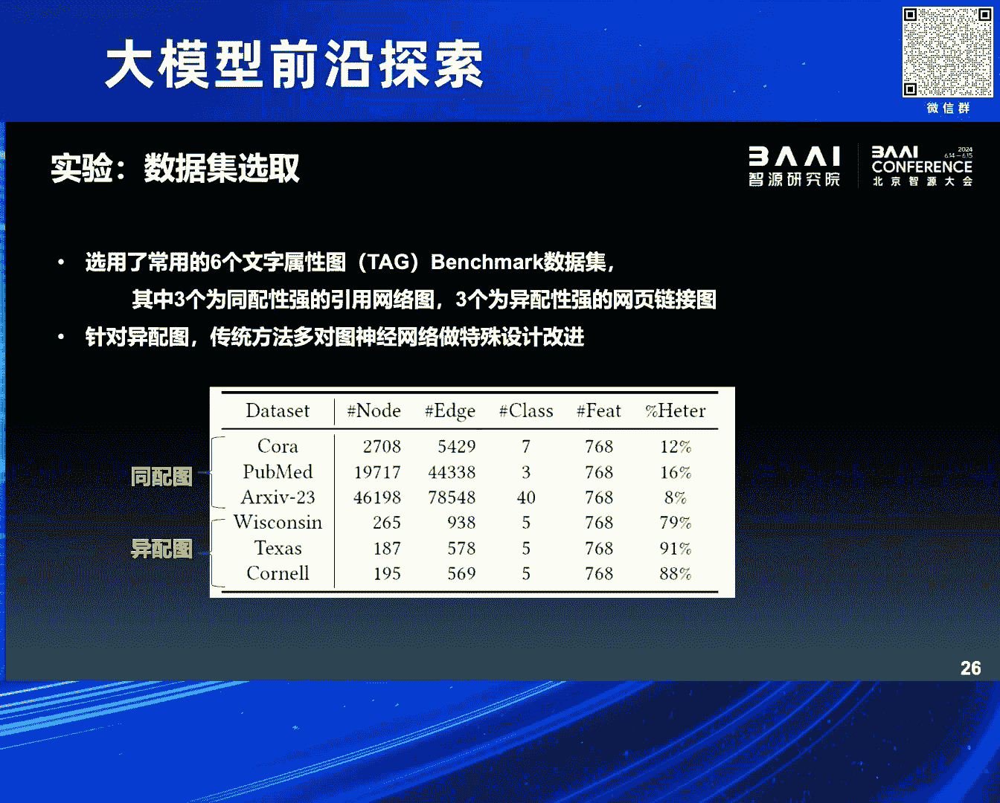

那可以看到就是我们的这个训练的方式啊，然后和一些非常传统的GN做了一些结合啊，就上半篮这些方法基本上都是在啊，19年以前的啊，一些经典的GNN的方法，那么当它和大圆模型发生了协同训练啊。

开始交互学习之后，它可以和底下的这些22年二三年提出的，SOTA的GN的方法达到一个可比的状态，在某些数据集上啊，甚至会比SOTA的GN还要更强一些啊，当然这呃当然我们也可以把这个这种范式啊。

装配到这些SOTA的GNN上啊，也许会更好，但我们没做这方面的实验啊，这是消融实验跳过了呃，同时我们也可以跟那个其他的范式，做了一些对比啊，比如说大圆模型作为预测器，作为增强器啊，都是已有的范式。

那我们的这个方法呢，也能够在这个更小参数的啊，大圆模型的加持下啊。

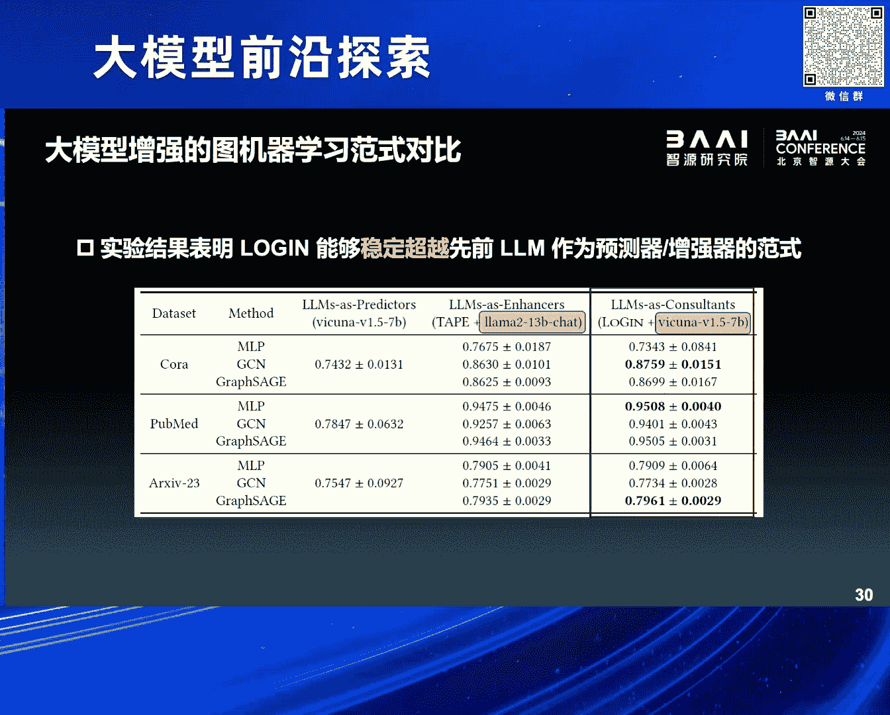

取得一个稳定的提升，对我还有一分钟的时间哈，做一下总结和展望呃，实际上就是作为这个高校研究所对吧，没有算力资源，没有数据资源，那我们也去想用大圆模型啊，帮助我们做一些工作。

所以我们就选择了用大圆模型来辅助，这个机器学习模型的构建啊，这个角度呃我们采用了两个框架哈，一个是知识蒸馏啊，比较传统的结合的方式，还有意见咨询两个角度呃，分别呢在这个大小模型的呃协同训练上呢。

做了一些探索呃，那么特别是这个呃大圆模型作为咨询咨询师啊，或者作为专家这样的一个框架呢，我相信不只是在技能的训练上，也许在其他小模型的训练上啊，都能够呃得到一些这个应用，那么当然呃我们目前的这种范式呢。

它还有很多局限哈，很多局限，比如说大圆模型，它整个的这个推理过程还是比较慢的啊，我们现在做这个图数据的训练，说句实话还是呃非常高效的，那么结合了大圆模型以后，尽管我们只问部分的节点。

那么整体的这个训练的效率呢也会被拖慢啊，所以在这个实际的运用当中，如何去提升效率，控制成本啊，这是一个非常重要的问题，那么另外呢就是我们目前啊，就是大圆模型和小模型之间的交互。

还是停留在这个数据层面的啊，第一个工作是做这个训练数据的生成对吧，第二个工作呢是在训练过程当中啊，做一些数据的增强啊，结构的去造等等，还是在数据层面，那么什么时候能够在这个算法层面。

比如说在模型的设计上对吧，这个loss的改进上，能够采用上这个大圆模型的能力，也许是呃更值得研究的一个话题哈。

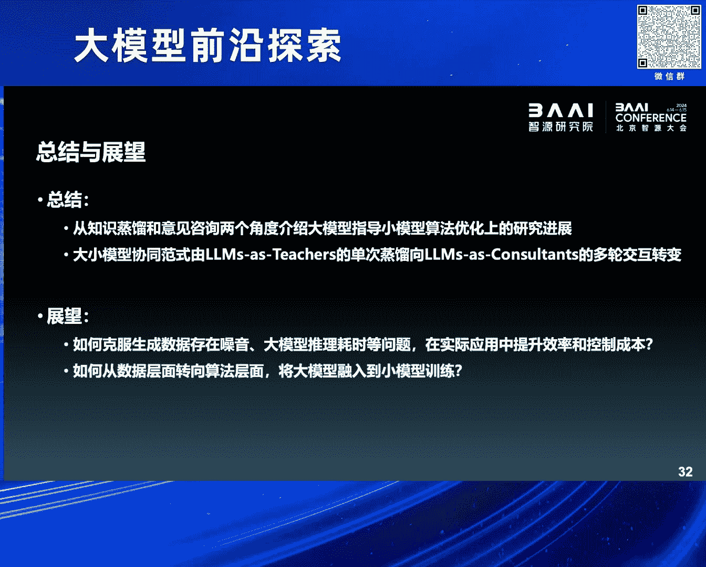

好那以上就是我今天的报告哈，说的不对的地儿，敬请各位批评指正啊，谢谢，呃感谢翱翔博士的精彩报告，现在请现场观众提问，感谢老师，我提个关于图的这个一个小问题，就是我想问一下。

就现在你用的是现成的这个大语言模型，是不是有没有，就说针对这个图数据的这种大模型，就是我这个大模型在前期训练的阶段，就是用的图的这个数据，然后嘞，我在各种各样的这种图的这种任务上，都会有一些效果。

而不是说就是用的预训练的这种大语言模型，就这方面不知道老师看能不能给一些呃展望，或者说看法，好好谢谢您的问题啊，就实际上您说的这个针对图的数据，去精调大语言模型，或者是构建所谓的图基础模型还是有的啊。

但是我们团队就这反正我个人吧，我是不不支持这样的技术路线啊，因为是我，我感觉是这样的，就首先啊就说这个你精调完了以后哈，因为图的这个下游任务无非就是两种，一种是节点分类，一种是链接预测。

它不像自然语言或者是图像，它的下游任务非常多啊，所以我们是否有必要去构建一个，这个需要大量的这个数据的标注啊，因为你要做精条，肯定要标注吗，然后甚至是这个从零构建一个针对图的一个，基础模型是否有必要啊。

这个是存疑的，而且现在对吧，像叶璇他们这个万亿级的参数的模型，能力已经非常强了，那我们在这轻量级的用一下，如果能够帮助我们做提升，那何乐而不为呢，这是我个人观点，好谢谢您的问题啊。

不知道能不能回答您的问题，对您说的那种路线实际上是有的，而且也非常火啊。