# 2024北京智源大会-大模型前沿探索 - P5：大模型下的机器学习理论研究反思与机遇-黄 雷 - 智源社区 - BV1yS411A73A

[音樂]，喂 喂 喂，感謝李總和葉全博士的組織這次論壇，大家好 我是黃磊，來自北航人工智能研究院，現在是學院了，我的題目是，大模型下的機器學習理論研究，反思與機遇，給了這個題目的話大家在想。

大模型下到底有沒有理論，此人厲害 尤其是機器學習的理論，因為如果大家去聽各種報告，經常是關於數據方面，因為數據非常非常重要，其實模型基本上也就固定，那到底大模型下，有沒有可能有那個機器學習的理論。

還有一點就是，機器學習的理論，它到底有沒有用，因為以前的機器學習發展是非常快速，但是到了深度學習這個層面以後，慢慢緩下來，我今天的話我的報告就主要是，給大家回顧一下這段歷史。

然後再花一部分的時間來講一下，我在這個方向的一些工作，好了，那我們看一下機器學習問題的主要元素，這裡面有兩邊，先看主邊，主邊這一邊的話，一般是大家如果去上課的話，一般就是，講深度，如果，現在的機器學習。

基本上是往主邊這個方向講，有個數據集 輸入和輸出，我希望學一個函數，或者一個條件的概率分布，那麼我的目標是什麼，目標是發現數據中蘊含的規律，其實就定義一個Loss Function。

然後用優化的方式最小化，然後它期望會推廣到未見過的數據，這就是所謂的方法，這一般是，在深度學習這個背景下，大家講機器學習的時候，一般在主邊這個方式去講，那麼如果，我們再回到以前，大概深度學習出現之前。

應該是，2000年，像我以前當時讀書的時候，基本上按右邊那個方式去講，它會強調，我一個學習任務是什麼，它是來自一個未知的目標函數，就這個紅色的這一部分，然後我會採樣一個數據集，然後有了這個數據集以後。

我會有一個學習算法，然後這個學習算法從哪去學呢，就一個假設空間，這個假設空間其實就是，我們現在的一些模型，它給定了一個模型類，它從這裡面去，找出相關那些，它有可能是參數的模型，也有可能是非參數化的模型。

然後最終找到這麼一個假設，然後如果這個G，約等於這個F，那我就認為它是可學習的，這是以前，講機器學習基本上是這麼講，這個定義也非常明確，它有一個假設空間的概念，其實對應到現在假設空間，像大模型的話呢。

基本上就是一個transformer，你把那個參數給定了，就參數的數目給定了以後，包括它所有的連接方式給定了以後，它其實就形成了一個假設空間，然後它的每一個參數的配置，其實就是一個假設。

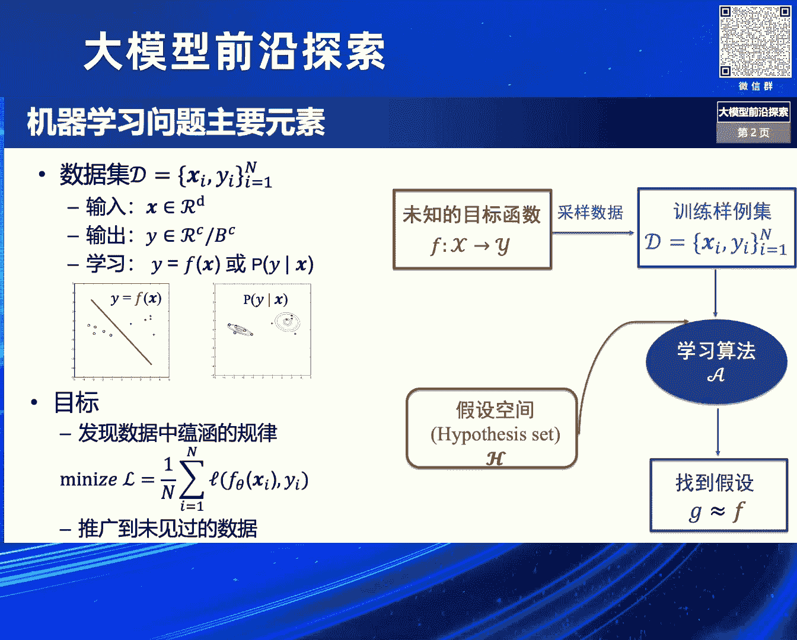

這是以前機器學習問題的一個主要元素，好的，那麼機器學習它的理論框架，它是怎麼建起來的，其實這個理論框架主要是，統計機器學習，從統計那個角度，因為它強調方化，那方化這個東西，它到底怎麼來。

這裡面就要從統計來，因為你想想，你未知的一些數據，那你能怎麼知道你這個模型，在未知的數據上效果好呢，所以這裡面就是統計它連接這麼一個概譜，那麼怎麼來的，其實就是大數據定律，但如果可以量化的話。

一般就是Hoff的不懂式，它基本上，這個，哦 這個有鼠標，這一部分，就是我訓練級的一個performance，這個就是我期望的outer，就是方化的那種performance。

所以這個不懂式它就確保了什麼，我現在有一個出入這個arrow吧，和它期望的出入它們之間這個概譜，它大於它的概率，它小於這麼一個項，這可以把它綁得住，但如果，這一項如果是一個小於1的值，其實是有意義的。

但是如果它很大，其實沒啥意義 為什麼，因為它概率大小於等於1，大家都知道，所以這是整個一個框架這麼來，所以這個理論框架它，它縮小了這個概譜，那麼之後，這個框架因為它是給定了一個H，那麼如果想把它擴展到。

在任意的假設空間裡面去做這件事情，那怎麼去弄，其實又，又有這麼一個把這個，用那個概率的一些方法，能夠得到這麼一個表達式，這裡面有個東西出來了，就是這個M，M是個假設的數目，這個假設的數目其實。

以前的簡單模型還好 是吧，它是可數的，那真實情況下，其實很多那個假設的數目是不可數的，最簡單的我們一個先行模型，你不同的參數配置，它就是一個假設，那肯定有無窮多種配置 是吧，所以它是不可數的。

所以這個也沒啥意義，注意啊 這個N是一樣的數碼，所以它其實有，GEM的這個陽力和這個performance之間的一個橋樑，好了 到這一步以後，接下來搞理論的又往前走了一步，好 這個是一個有限的 是吧。

那我如何把它搞成一個無限的，如果那個假設空間，其實就有，有那個什麼打散，包括打散 包括VCV的概念，這裡面我們就不細講了，基本上能夠得到這麼一個表達式，就是它的performance小於這個。

陽力 然後這麼一個表達式，這個DVC就是一個VCV，它是用來衡量這個模型打散數據的能力，其實就是它的一個表達能力，現在大模型的表達能力非常非常強，因為它可以打散各種各樣的陽力，所以從傳統來看。

基本上是到了這一步就行了，那麼之後如果讓它可用，就是從表達式上可用，那其實最終就得到了這麼一個表達式，這個表達式其實就建立了，機器學習的一個理論框架，那我們怎麼去看這個表達式呢。

它這個是它的一個方法誤差，這個是它的一個，就訓練級的一個誤差，然後如果你的訓練級的誤差，你得到一個小的performance，那你的方法誤差它肯定不會，它的差異不會超過這麼一個bond。

所以這個就建立了一個，方法誤差和一個訓練誤差之間的一個bond，這個bond它和哪些東西相關呢，和你的訓練陽力相關，和你的模型表達能力相關，然後這裡面這個Δ它是什麼，就是說你這個，因為它是概率的。

你說它小於它的這個概率，是這麼一個Δ，所以這是傳統的理論的，一個機器學習的一個框架。

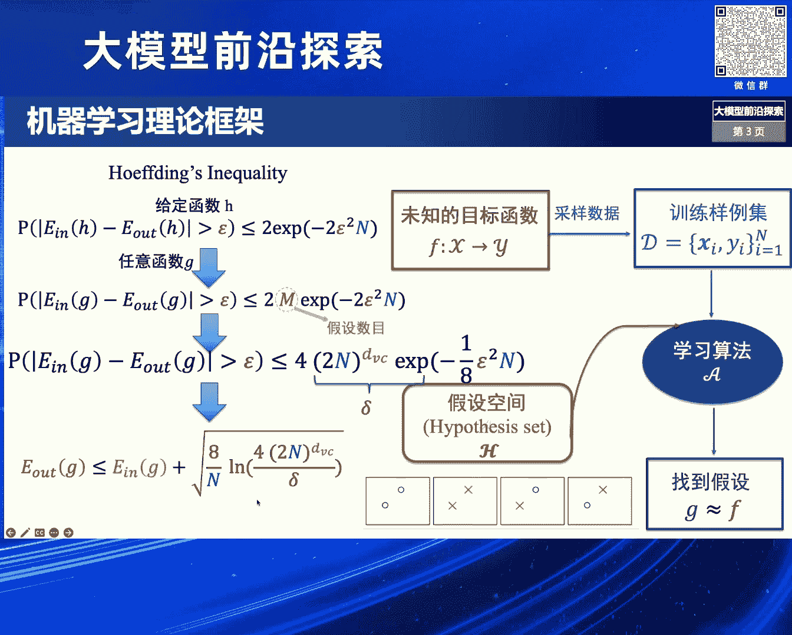

好了 那麼我們，接下來我們講，沿著這個框架，就是在特徵工程時代，包括深度學習時代，包括現在大模型時代，它到底有哪些，就是哪些問題和哪些機遇，所以那麼沿著這麼一個表達式，其實搞機器學習的。

它之後就分成了三個理論方向，大致來看，第一個是它表達能力，就是你給了這麼個假設空間，它函數表達能力夠不夠，這個什麼意思呢，有這麼多訓練數據集，你可不可以把它分開，理論上你這個模型上能不能分開。

如果你分不開，那說明這個模型就不行，那麼第二個就是優化，你給了這個模型在這兒，你能夠，理論上能夠把它分開，你到底能不能找到這些相關的參數配置，這就是優化要解決的問題，叫參數能不能找得到。

然後最後一個就是，函數能不能舉一反三，這就是一個方法出入，所以這麼一個表達式，其實就把機器學習的三個方向給統一起來了，所以這是機器學習理論方向，好了 那我們現在講特種工程時代。

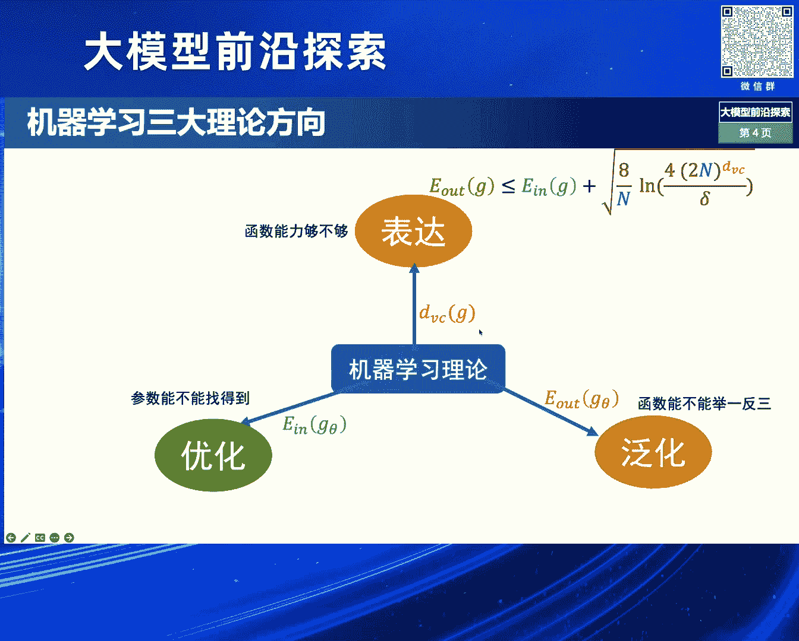

那麼機器學習理論按剛才講的話，其實它定義是什麼，它的輸入是一個相應空間，是一個固定的維度，是吧，它的輸出來它有可能是一個時數空間，如果是回歸，那有可能是分類的叫Binary空間。

所以這個表達式是基於在這上面建立的，這是機器學習要幹的一些事情，但我們人工智能的一些實際任務，自然語言處理，計算器視覺或者語音處理，我們先看它的輸入，它以前的輸入基本上都是分類問題，所以很簡單。

但是它輸入也不是那麼簡單，通常情況下，你如果這種表示成數的形式，有可能是一個相量，但是一個相量序列，所以那個M，注意這個M還是變化的，這是NLP 它比較麻煩，那麼同樣的圖像也是，這個H和W都是變化的。

然後是語音的話也是M，它也是變化的，那麼在這種情況下，感覺機器學習問題，在實際應用上感覺沒啥用 是吧，但還好 以前是特徵工程時代，為什麼呢，這些方向，它們有各自的叫一個研究領域。

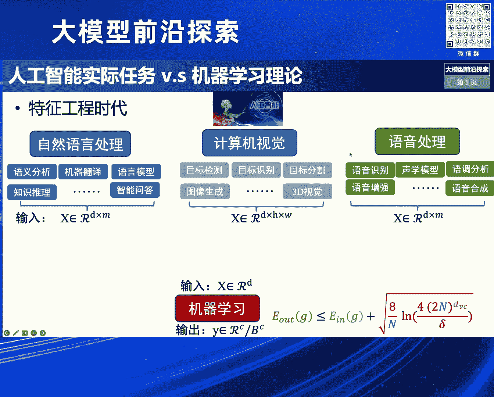

它們要提個特徵工程以後，把它提完特徵以後，編成這個樣子，所以搞機器學習的人呢，我不管你是什麼樣的問題 是吧，我只管我的輸入是X屬於RD，並且我還可以給它一些假設，給了這些假設以後。

我就開始推我的一些理論，所以我可以用線性模型，然後可以各種各樣的，你可以加拉數 加各種係數，把那些參數那個，為什麼呢 都可以棒的做，可以能夠得到一些好的，表達能力的一些結果。

同樣 由於它是用了一些線性模型，它可以去優化，它有些是全局收斂的，屬於各種優化的那種收斂率，包括能不能達到那個，全局最優或者收斂率也是可以，同樣 用了這麼一個表達式，你可以引入更多的一些先驗。

能夠得到一些更精緻的，一些繁華的一些棒的，這一塊，那麼它把那些所有的，真實際問題，和這個它跟理論之間這個概譜，人給生了，人給搞計算機的 思覺的，人給搞NLP的，你們去提特徵吧，你們提到這以後。

然後我再來處理，你到底和理論的那個概譜，到底有多大，我不管，反正是你們的問題，這是傳統特徵工程的時代，好了 到了深度學習，深度學習這個來了以後，就有問題了，一個什麼樣的問題，就是，搞機器學習的人。

他會說深度學習，它是機器學習的一個方向 是吧，如果它是機器學習的一個方向，那麼這有一個問題是什麼，就是深度學習，它在處理這些視覺或者語言問題的時候，它是端到端的，它直接的處理的輸入，就是這些東西。

它的輸出有可能是分類，這是之前深度學習發展的不是那麼快的情況下，那麼之後發展的非常快的情況下，有各種，它那個輸出空間有可能比它還複雜，像各種深層模型，然後它也是變化的，所以在這種情況下。

機器學習它這個理論，它基本上就沒法子弄了，為什麼，首先之後我們再講一下，在這個背景下面，它到底有哪些問題，那麼當機器學習遇上深度神經網絡的時候，它首先有一個好的東西，就是深度神經網絡，它的表達能力很強。

所以在這個表達能力上，它是有很好的理論基礎的，最經典的是什麼，就是神經網絡的萬能近似理論，它基本上給出了，你給任意的一個函數，我都可以去理合，整個正面的思路其實也比較簡單，就像我們當時大學學數分的時候。

它用那種曲線理合，用折線或者用那種，把它分成一小段去證明，所以它無窮寬的或者無窮深的，或者有限寬有限深的都有一個結論，所以這個是可以去證明的，這是關於理論的一些結果，它表達能力非常強。

那麼表達能力非常強，它只是函數理合，那如何能夠這個東西給連上，其實也有一些方向，它是專門算神經網絡的V-server的，所以這個V-server它其實和那個參數數目，和那個乘數都有關係。

在這種情況下其實你那些參數的數目，其實就隱私地表達了一個模型的表達能力，這裡面是有一個理論的一個結果，當然同樣也有一個方向，就是就專門算這種linear region這個區域，但這塊我們就不展開講了。

所以這是表達能力，但表達能力這塊它的結果相對來說是比較穩定的，然後深入學習發展的過程當中，其實最重要的一點是什麼，就是優化，就是從2006年開始以後到2015年之間。

它從使用的角度發展的最有效的就是優化，因為以前的神經網絡學起來非常非常難，但是到了2015年以後，基本上咱們現在神經網絡的那些，勾架基本上都出來，比如說2015年的，2014年的話應該像BN出來。

然後2015年的話是殘差，殘差和BN的一個組合，這兩種的一種組合以後，就保證了它的訓練非常非常穩定相對來說，那麼在，但這裡面一個最核心的思想是什麼呢，其實就是我們做前向和反向傳播的過程當中。

這裡面有一個非常重要的哲學，就是在2015年之前，大家做的最多的事叫什麼，叫初始化，初始化它為了保證一個什麼效果呢，就是你每一層的，它之間的那個什麼一些統計量，比如說它的均值或者方差，他們希望他們是。

至少從初始化的情況下他們是相等的，那麼在這種情況下，你這個網絡才相對來說比較好訓，當然後面出了Luminar Racing，它直接在中間加了一些操作，的確就把這個結果給滿足了，但這個還不夠。

之後才有了殘差，才能夠訓到幾百層上千層，所以這是這麼一個問題，這在2015年之後解決了以後，其實深度神經網絡就發展得非常快，就各種各樣的應用，大家去解決任務的時候，那基本上都是什麼，都是根據一個任務。

然後設計點損失函數，然後或者改點模塊，反正能夠訓起來是吧，然後最終能夠得到一些好效果。

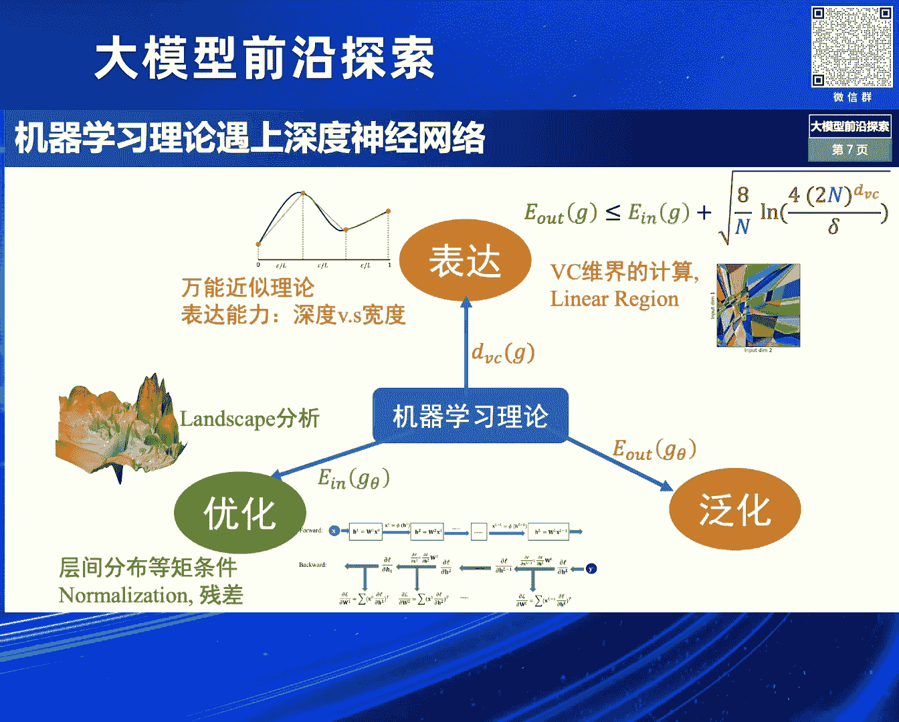

這是優化這一部分，那麼另外一部分，方化，這個東西的話基本上，首先第一機器學習，從深度神經網絡，從機器學習的角度有方化嗎，其實這個目前來看，基本上沒有一個什麼好的結果，只有一些empirical的結果。

但這裡面最經典的是，我記得是2017年的時候，艾克利爾的最佳論文，他們當時提的那個，讓大家去rethink，這個深度神經網絡的方化，但是rethink了以後，大家還是沒去think，因為這個很難。

所以這是從機器學習的角度去討論方化，但是從另外一個角度，搞計算器視覺的或者搞NLP的，其實是可以搞很多方化的，因為大家搞計算器視覺，尤其搞計算器視覺。

它本身就是在驗證級上去評價那個performance，包括它設計的一些模塊，它也會說這個方化效果好，那它的方化是怎麼來的，其實就把一些領域的知識給加進去，比如說像設計網絡架構的時候，用一些不變性。

網絡架構裡面設計，像平頁或者光照不變性，像Nominalization它可以做那種光照的不變性，還有一種是什麼，就是data augmentation，這個是最有效的，因為如果你看不到什麼。

那你先按這個方向，根據你的理解把它加點數據進去，然後能夠使得它方化，所以這是這個方向，好，那麼它的困難，這是它的困難，為什麼這個理論方向一直不好做，做不下去呢，其實這裡面最重要的原因是什麼。

就是剛才講的，它的輸入形式各異，因為你如果認為是機器學習要解決的問題，那它基本上，機器學習它只管它的理論，它只管它那個輸入是那個，一個低微的相量空間裡面，所以你這種，變化的這種維度它根本處理不了。

從數學上它沒有辦法刻劃，還有網絡架構各異，之前的所有升級網絡的，都在MLP上做的，這種簡單的，你一道循環升級網絡或者捲機，尤其加了各種殘差 全是FORM，每一個網絡你都要去分析一個理論。

所以那個非常非常複雜，所以整個東西也不好做，同樣它的輸出，更複雜，因為升級網絡效果出來了，然後做研究的人，把那個任務搞得越來越複雜，然後形式也更複雜，所以這個理論分析基本上就沒法做。

所以整個就形成了一個非常大的一個概譜，就是我們應用工程在往前走，但機器學習理論的，還是守著它那一畝三分地，那種傳統的方向，所以這個概譜會越來越大，導致中間就不太好弄，就是一些理論的結果大家就覺得。

好像深度神經網絡裡面好像沒啥理論的東西，好了 到了大模型時代，其實這是一個機遇，為什麼說這是一個機遇呢，大家想一想，大模型時代很重要的一個特徵，我們先不說它大那個參數，它最重要的一個特徵是什麼，統一。

它把所有的任務，你問的是什麼樣的輸入和輸出形式，你把它壓成那種輸入序列的形式，你用至少在NLP這裡面，它是Auto Regressive，輸入一直預測，它的輸入空間和輸出空間是一樣的。

這是從那個輸入輸出的一個表徵，這是一點，第二點，它那個網絡架構大家都用transformer，transformer在設計的時候，它每一層它的維度也是D，它每一層的維度，它的空間也是固定的。

所以其實你每一層之間，它其實有可能，從數學的角度，它們之間那種空間刻劃它是可以刻劃的，所以這個更簡化了以前深度神級網絡裡面，沒有法做的一些分析，那麼在這種情況下，然後第三個是什麼，就是它所有的。

我之前不是講，深度神級網絡有各種輸出嗎，那麼在大模型時代下，它的輸出全部，它的問題全部變成什麼，一種條件的分類問題，因為你真的是叫什麼，叫Predicted Next Token是吧。

你去遇上那個Token的時候，它本質上就是一個分類問題，它是一個分類問題，那只是我用了一些前面的一些上下文的一種條件，變成一種條件的分類問題，所以在這三種情況下，它三種都統一的方向下。

其實給出理論的研究，其實帶來的一些機遇。

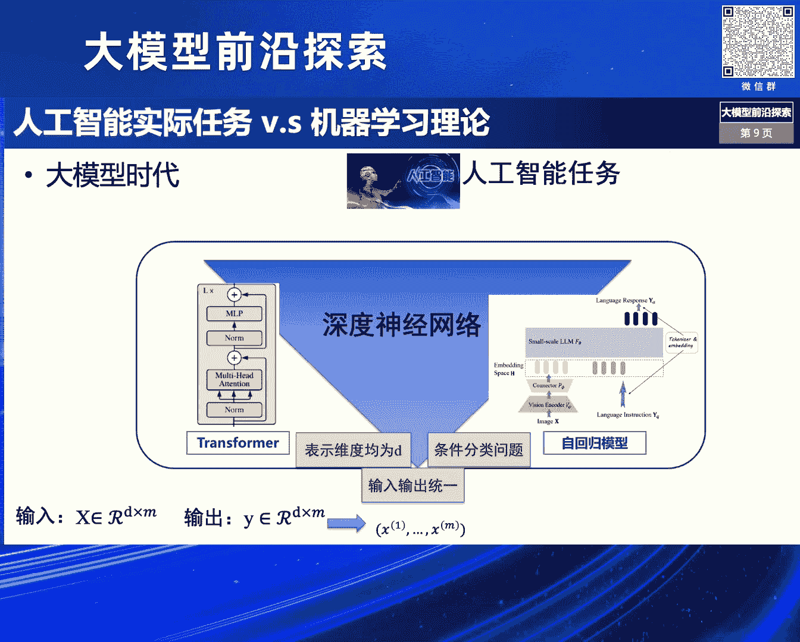

這是，好了，那麼，機遇的話就是什麼，咱們，這是一方面剛才，還有一個就是，我們訓大模型的時候，通常強調是吧，數據量非常非常大，其實尤其像Scanning Law。

尤其是現在這些Empirical的一些結果，它發現，就是你只要把訓練Loss給降下去了以後，它基本上的翻滑效果也還不錯，那其實就，解決了一個什麼，也先不說解決，就這要從研究的角度，就把這個東西。

就是以前所有的機器學習理論，它通常要強調翻滑這個問題，你要強調翻滑這個問題的話，你如果，你不用統計那一套，你是沒法做翻滑的，好了 現在，既然你，數據量是無窮大是吧，那等於你能夠看到水流數據。

你最終把它變成一個優化問題，那如果你不去考慮翻滑，那其實機器學習的理論，那個方向發展，它其實還有更廣闊的一個空間，就以前就是被這個表是給束縛了，這個是我的理解，所以那麼在這種情況下。

最終其實你看現在的研究，無論是分析，其實就是表達能力和優化，它們之間的一個討論，從抽象的角度來看，就是你現在給的一個模型是吧，你是大的還是小的，你有沒有能力去擬合這些訓練數據級，有沒有能力。

好 你說現在這個階段是什麼，我大的相對來說，它肯定那個參數，從威懾為這個角度，它肯定擬合能力要強一點的，那麼第二個就是什麼，你有那個能力，我不見得好優化，這是以前會說，我網路越深我越難優化。

當然現在有了，有了lobalization叫殘差，這個也不一定，那麼現在，現在這個結果是什麼，你有了越大的模型，你會發現它優化起來，去擬合那個能力，它優化起來也很簡單，所以這裡面其實就變成了一個什麼。

就是一個表達能力和優化之間的一個tradeoff，就是你如果能夠有這個表達能力，你如果能夠很好的優化，那你整個東西是有意義的，所以這一塊的話，但從表達能力這個方向，其實它也有一些研究的空間。

就是因為你之前的表達能力，它只是去說一個先進層，一個非先進層，神經網絡它能夠無限的擬合，但是現在的神經網絡裡面，它有了各種lobalization層，包括殘差層，那麼這些分析在以前的理論裡面是沒有的。

同樣的，在訓練過程當中，如果我們能夠針對這種表達的空間，這種RD 這種固定的維度，我們能夠去設計，去研究它這個訓練的一個dynamics，這個對整個的網絡的一個訓練是有幫助的，所以基於整個這兩個點。

我在這裡面就快速地講一下，我們組織在這裡面的一些工作，首先第一，就是normalization，像neoliberalization或者arms norm。

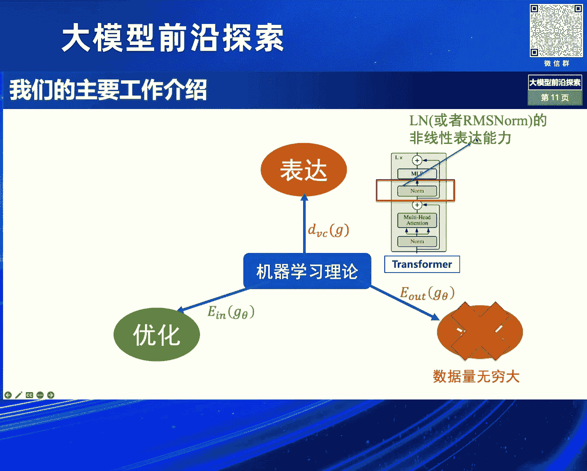

我們理論上證明它的一個非先進表達能力，這個的話就是，我們知道層標準化，就是在全數form裡面這個基礎的模塊，但即使現在有些方向它為了提高效率，它用arms norm，它也是屬於它是一種推劃的方式。

就是這個方數操作，那麼方數操作它本質上是從這個，把壓力拉得到一個球的一個操球面，那麼我們從數學上，無論從算術推導還是幾何構造，我們證明這個neoliberalization，包括arms norm。

它是有一個非先進表達能力的，整個證明的思路簡單講一下，細節的話大家可以去看一下，證明的思路是什麼，我們提供了一個指標，然後這個指標我們證明了，你只要是先進層，和那些，只要是先進層吧。

你各種各樣的先進層疊加起來，它是沒法突破這個指標下限的，但是我們發現在中間，如果你加入一個neoliberalization，加入幾個層，它是能夠突破這個下限的，所以這一塊是證明了從算術推導方面。

這個指標也是挺有意義的，然後第二個方面是什麼，從幾何構造，這個就快點過一下吧，其實一何問題，大家說先進模型它是沒法去，就是你用先進分類器，它是沒法解決這個一何問題的，那麼我們發現。

你其實在這裡面用了這種投影，就是那個縮放，它可以通過這麼一種構造性的方式，能夠把這個一何問題給解決掉，所以這個縮放它肯定是非先進的。

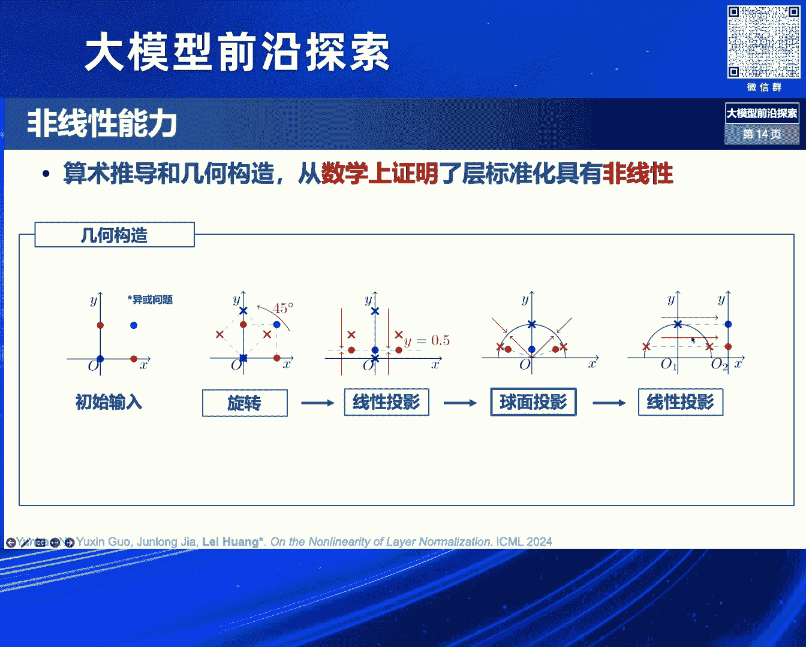

這是一個類似一個開胃菜，但我們這裡面最重要的結論是什麼，它的一個，就是一個先進層，加一個neoliberalization層，就這種網絡架構我們叫LNNet，它的那種萬能分類能力。

這個是以前的所有理論裡面都沒有的，以前的話要不就是先進層加ylow，或加seqmoy的，證明我們說我們可以把傳統的非先進層給去掉，你只加neoliberalization。

加neoliberalization或者arms normal，那它可以有萬能的分類能力，那麼我基本上證明了什麼，就是無窮深的LNNet，注意啊，萬能機制裡面當時最早的話是無窮寬的。

無窮寬的RedRule只有兩層，那麼無窮深的LNNet，能夠完全真正分類任意給力的一個樣本，但有個要求就是每一個，每一層的，如果你是用neoliberalization去證明。

它每一層的節點數它要大於三個，如果用arms normal去證明，它大於兩個就行了，這個是能夠證明的，就是你給任意的點，給它任意的一種，無論是二分類還是多分類，你給它任意的一個標籤。

這麼一個網絡它是可以把所有的這些樣例都區分開來的，這就是它的一個表達能力，那麼我們證明了失落，我個人相對來說特別喜歡這個失落，就是我個人覺得是可以寫入教科書的，為什麼 因為它從構造性上。

它把這個機器學習的問題我們轉變成了一個什麼，就是一個算法的一個merge的問題，就是這些點，你給定這麼些點以後，我去找它們的哪些點，可以用一種方式找到這些點，我可以把它merge。

這種merge的過程當中，只用先行編劃和這個投影程，它就可以把它merge，然後每一步都最終變成一個低軌跌倒的問題，最終能夠證明，所以有了這個結果以後。

我們最終就可以直接很快能夠推出整個網絡的一個VCV，我們說如果你有一個L層的網絡，它的VCV它最少是L+2，這是一個理論的結果，這個理論其實還非常弱勢，就是其實剛出來，類似於萬能機師理論它剛出來的時候。

其實沒啥用，但是這個理論還有很多改進的空間，就是你能夠每一層的神奇元節點數目變多了以後，你那個乘數是不是可以減小，或者你用無窮寬的，你只用一個Layer Luminizer，或者給它分組。

是不是能夠給它一般化，所以這一塊，但我們還做了一點，就從使用的這個角度，就是我們把一個Layer Luminizer分組，用Group Luminizer方式去做的時候。

我們能夠理論上證明它能強化ARM的分線性，所以這裡面其實從網絡設計的一個角度。

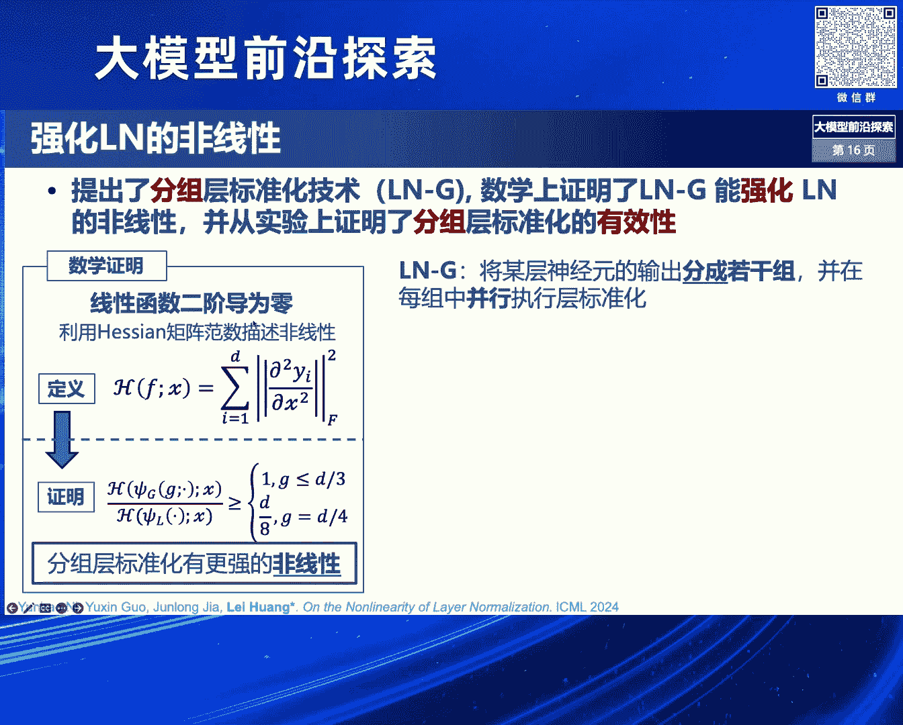

這個是一個數學的一個說明，然後一些實驗性的一個說明，這種分組的數目，都是用隨機標籤，就是你給所有的這些數據，你隨機地打標籤，我這種一些簡單的這種網絡，它能不能把它分散開來，那麼在這種情況下。

其實對於大家去設計網絡的時候其實有幫助，就是有可能你把Layer Luminizer，你把它分成組，每一組以後你再做，它的分線性是變強的，但這裡面，在這種情況下它分線性變強，但有一個缺點是什麼。

因為你其實加了更強的約束，這裡面也有可能，去限制那個模型的學習或表達能力，所以這裡面有一個缺點，好 這是表達這方面，那我快速地講一下優化。

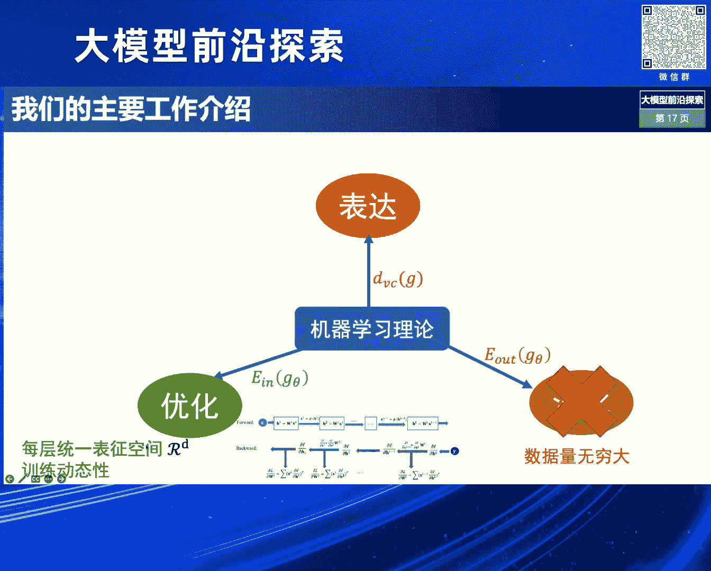

這個好像時間有點超，行 那我把那個簡單講一下思路，就在深度神經網絡訓練過程當中，有一個非常重要的一個分析，叫尺度不變性分析，這個就是把所有的Luminizer，就是你每一層，你每一層你把那個權重。

你把它編大alpha倍以後，我就希望這個模型它那個表示不變，這有什麼樣的好處呢，就能夠使得你的訓練相對來說非常穩定，這是Luminizer進行，包括後面的很多網絡設計。

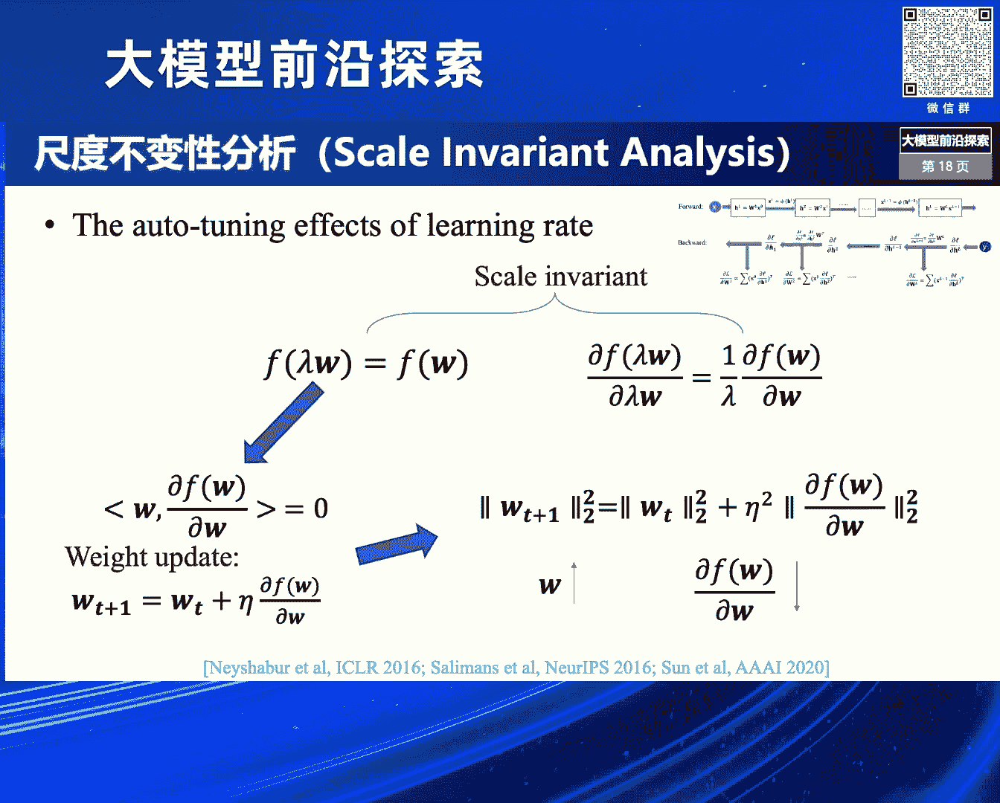

它最重要考慮的一點，就是，好了 那麼在一個網絡裡面，我們會簡單給一個結果吧，就，就如果，如果你把每一層都放大alpha倍，就是你在訓練過程當中，那你其實你單層，就特定的層，它其實受各個層的一個影響。

它那個尺度，但是如果你用了Luminizer，或者用了一些其他技巧，表示它保證這個網絡是scale不變的，那它基本上，它的那個尺度只受這一層的影響，所以這個結果對於穩定神經網絡。

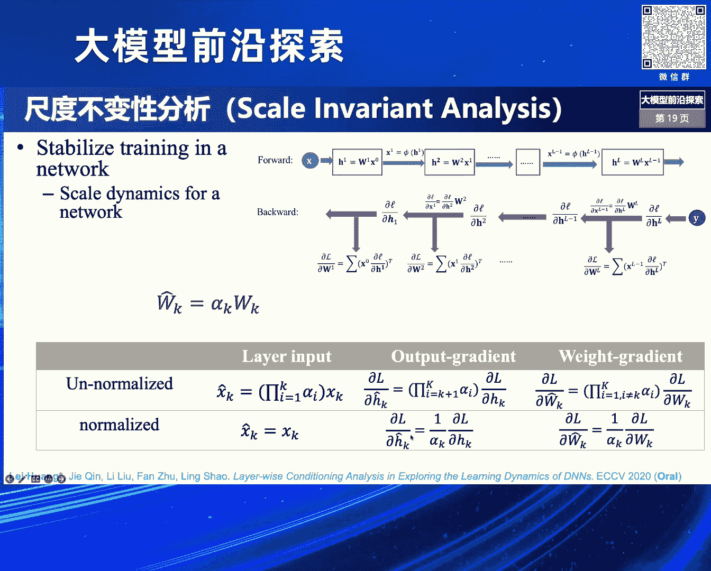

非常非常重要，這是，那麼這個結果它能夠穩定網絡的訓練，但是它會帶來一個什麼樣的問題呢，會帶來某些層，它其實有可能不會學，這是什麼意思啊，就是因為當你如果那個尺度變大的過程當中，你那個梯度變小。

當你的梯度遠小於那個全中的數目的，全中那個參數的尺度的時候，那你整個模型它就不會，它基本上就不怎麼學，那麼在這種情況下，你有可能那個網絡不會divergence，但是有可能一些層它基本上是沒用的。

這也是為什麼以前，有很多各種各樣的網絡減資，就是因為它本身在訓練過程當中，它由於這種性質，它基本上就不學了，但是它也不會發散，因為它別的層在學，尤其是加了殘差以後，所以這一種方式是很方便。

去幫助大家去診斷，你那個模型裡面有一些層，它是不是它沒有怎麼學，所以它不影響整個那個網絡的發散，好 這個是尺度，就是每一個，那個樣例就是每一個每一層。

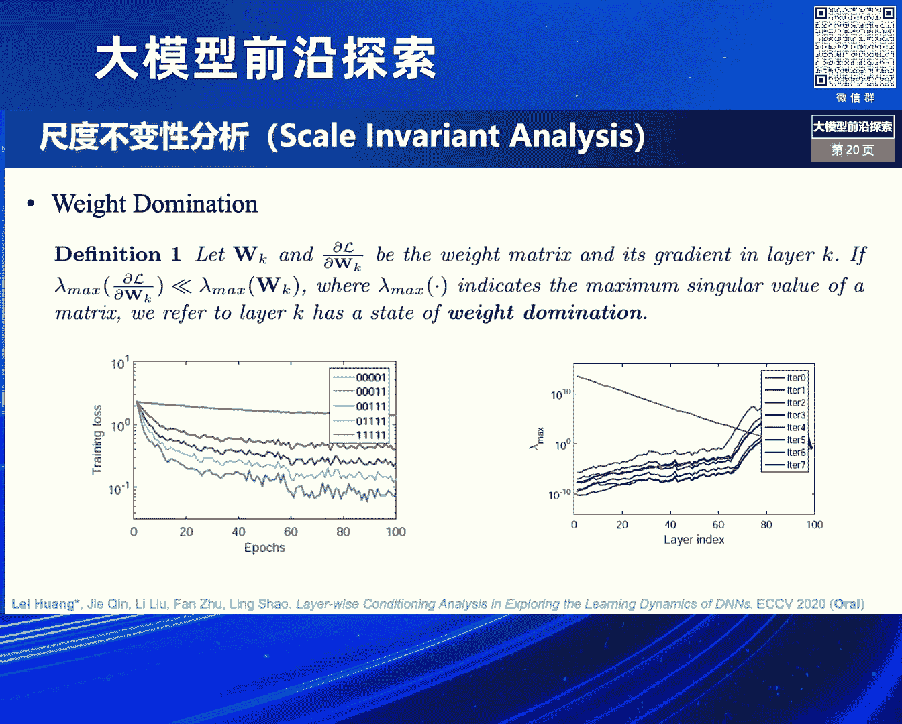

它那個什麼數字的範圍，還有一個是什麼，最經典的，在機器學習裡面就是spectra，就是你那個數據的斜方叉矩陣的特徵譜，這個東西就比那個什麼尺度更近一步，這種特徵譜它既和優化相關，它又和那個表示相關。

如果你那個是滿字的，說明那個表示比較充實，如果你有很多都是低字的，就很多都沒有字 沒有rank，就是只有維度很小，說明那個表示其實不充足，這一方面，同樣 如果越rank越白話。

你會發現它那個優化起來它會更容易，這是在傳統的機器學習裡面的一個結果，那麼在深度學習裡面也有一個，就是每一層裡面，如果你也滿足這種屬性，那它基本上也會得到一個好的結果，我快速過一下吧。

所以你這種表徵的分布，對於整個學習過程當中非常非常重要，尤其像基於這種SAMS，就在視覺裡面的那種自見的標準學習裡面，它容易發生這種collapse，或者dimensional collapse。

如果我們為了解決這個問題的話。

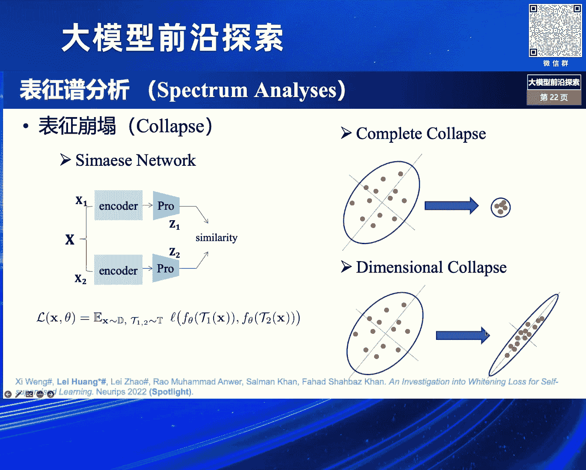

其實有很多方法，這裡面我簡單講解一下白話順勢，這個的話就其實什麼，我在訓的過程當中，我期望它每一個，就表徵這一塊，它的coherence是期望它是identity的，這樣的話就限制它去collapse。

這是一個regularization的作用，這是一個大的框架，但去實現的時候有很多種，像VS-REG一樣，加一些soft的，還有一種就是直接做一個變換，然後加一個理論的結果。

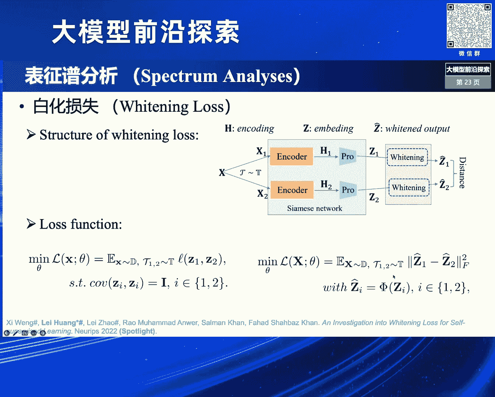

這裡面我簡單分析一下就是，我們得到一個結果是什麼，如果你按照那種之前所謂的硬白話的方法，做了一個白話變換，然後加了一個順勢以後，它得到的這個表徵的rank，它只是鼓勵它是一個滿字。

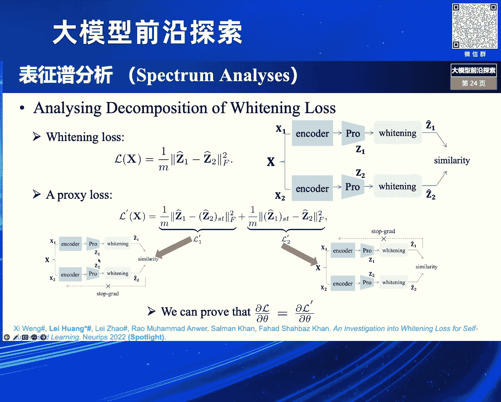

並不是鼓勵它白話，但是實際上另外一種，像這種軟白話的方法，它其實最終它是鼓勵它是白話的，但是你會發現，整個表徵它並不一定要fully whitening，因為你fully whitening的時候。

你這個表徵雖然表徵的美化很強，但是你在解決任務的時候，你還期望它有一定的方法效果，所以你希望它的pure，是類似於那種alpha，alpha的那種演繹的那種方式，就是有大的 然後比較平緩的。

這種可以去幫助你去診斷。

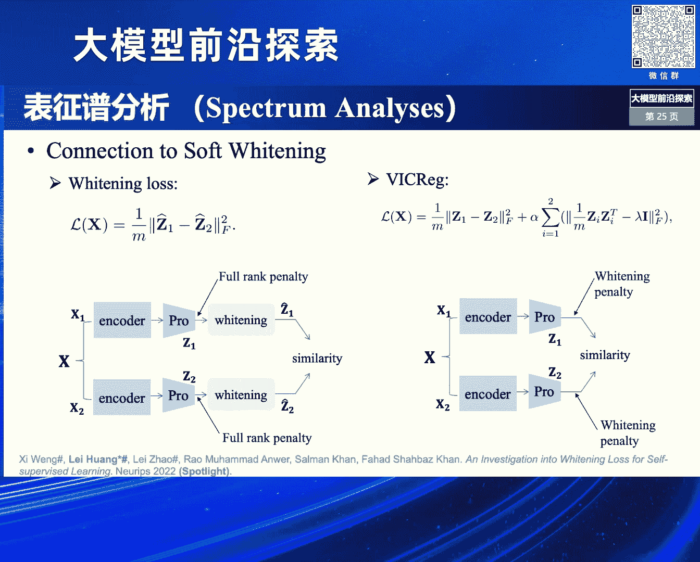

你那個訓練過程當中的pure，它的這種效果，還有一個工作就是，我們有一個方法就是，關於這種whitening loss，我們證明了，就是如果整個訓練過程當中，如果你學習力無窮小的情況下。

那你整個pure你初始化了以後，它整個訓練過程當中這種slavery rank，它是不變的 有這種，行 好的，那我這裡面之後就講一下我們這個，基於這些分析，然後我們也快速訓練，我們也訓練一個。

小尺寸多模態的一個大模型，叫Taginoma，那麼主要是接近於，到4年1月份，這個最早文本裡面它出了小尺寸模型，然後我們很快就組織了很多人，然後訓練一個小的這種Taginoma 1。4B。

那是1月11號就傳到HugFace，然後現在已經超過了15000多次，可以直接在3080那種上無序量化就可以做推理。

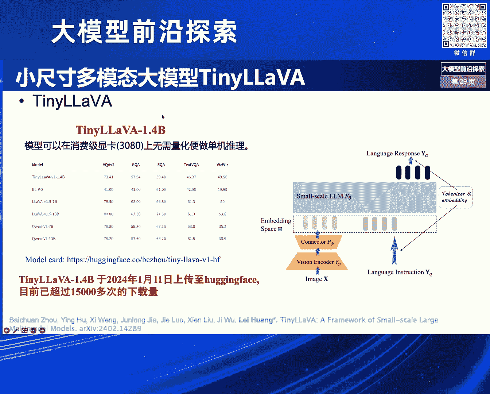

這是最早的1。4B，然後我們就訓練各種各樣的模型，把它做了一個benchmark把它開圓了，然後基本上3。1B的話會比7。5B的要好點，這是小尺寸多模態的，然後基於在做的這個過程當中。

我們發現有一點很重要，就是那個代碼的質量非常非常重要，所以我們之後做完這個以後，我們就花了，就是組織了，就是包括和清華的一些老師。

組織開發了一個叫Taiwan Learning Factory的這麼一個項目，就是按照軟件設計的工廠模式設計理念，開發了一個模塊化一托展可複現的一個多模態，代碼一個平台，每個模塊集成器最新一種方法已經。

方便大家去定制多模態，然後這個Factory也開圓了，所以這是一個整體的架構，按照那種軟件工程，整個代碼的話我個人覺得是相對來說非常好用，特別適合高校，因為高校相對來說，卡比較少是吧。

我們的定位就不會遜3B以上的，因為為什麼，我們遜不了 這是事實，但是因為我們強調大模型，它最重要的一點是什麼，它那個統一表達能量，所以當我們把這個平台開發出來，如果大家再加入一些Feature以後。

很方便高校的人去做大模型的分析，甚至有可能做理論的分析的一個驗證，這是我們這個想法開源的一個平台，好 謝謝，感謝黃磊博士的精彩報告，下面有請觀眾提問，黃老師好，我有一個問題就是。

您在講座中講到了Transformer架構，它給我們帶來了很多，在機器學習理論上的優勢，比如說它統一了特徵的維度，統一了特徵維度都是D，這樣給我們有很大，給我們統一了這個維度之後。

我們有了很多分析上的便利，以及它的表達能力，達到了很大的增強，以及它可以增大它的規模，然後提升它的泛化能力，目前我們正在通往AGI的這樣一個道路上，但AGI的話它可能涉及，比如說我們人類。

會有更多的魔態的知識，我們會涉及語音，我們會涉及視覺，可能需要更多的魔態的知識，更多種感知的知識融合起來，才能達到這樣一個AGI的目的，您覺得Transformer這樣一種。

就是比較同質化的這樣一種模型架構，它是否是最終通往AGI的一條道路呢，你這個問題比較大，首先第一點呢，我不是說Transformer這個模型架構，它相對來說方便的理論分析，我是說在大模型時代下。

大家那種統一的思想，然後勾著這種統一的架構，然後它相對來說，包括任務統一，在這種架構下它相對來說方便了以前，在深度學習背景下，因為各種架構包括各種輸入形式，它比較難的那種分析，這是一方面。

但Transformer這個東西，其實它的理論分析也不容易，這是第一個，然後第二個就像您剛才說的，關於那個Transformer，它到底是不是通向AGI的一個架構，這個的話，我個人呢。

我覺得這個很難預測，因為至少目前來看，它有如果按機器學習那個道路，它有兩點是什麼，以前機器學習有兩類學習方式，一類叫參數化的模型，一類叫非參數化的模型，非參數化模型指的是什麼，就是你把那個數據存下來。

你用最精靈的方式去把它組合，其實Transformer裡面它本身，它含了這兩個東西，第一 它的碳性，本身就類似於KA的那種方式，去組合那些token，然後第二，它也考慮了參數化的模型。

像FFN它本身就是個全聯結層，就是個神奇網絡，所以這兩個的組合，至少從機器學習，如果大家覺得以機器學習這個方式往前走，能夠實現AGI，那我個人覺得Transformer，它其實從架構上它是沒問題的。

至少從表達能力，就像我剛才講的，你只要你的所有的任務，它是可以定義的，可以能夠，你知道可以定義你的數據組合好，它是可以把它的所有的任務解決的，至於我們大家構造的這些，任務的這些數據集。

它能不能涵蓋我們所有的AGI，這不是一個模型架構解決的事，這個偏哲學的，我也沒有辦法回答，好 謝謝，好 感謝黃磊博士。

