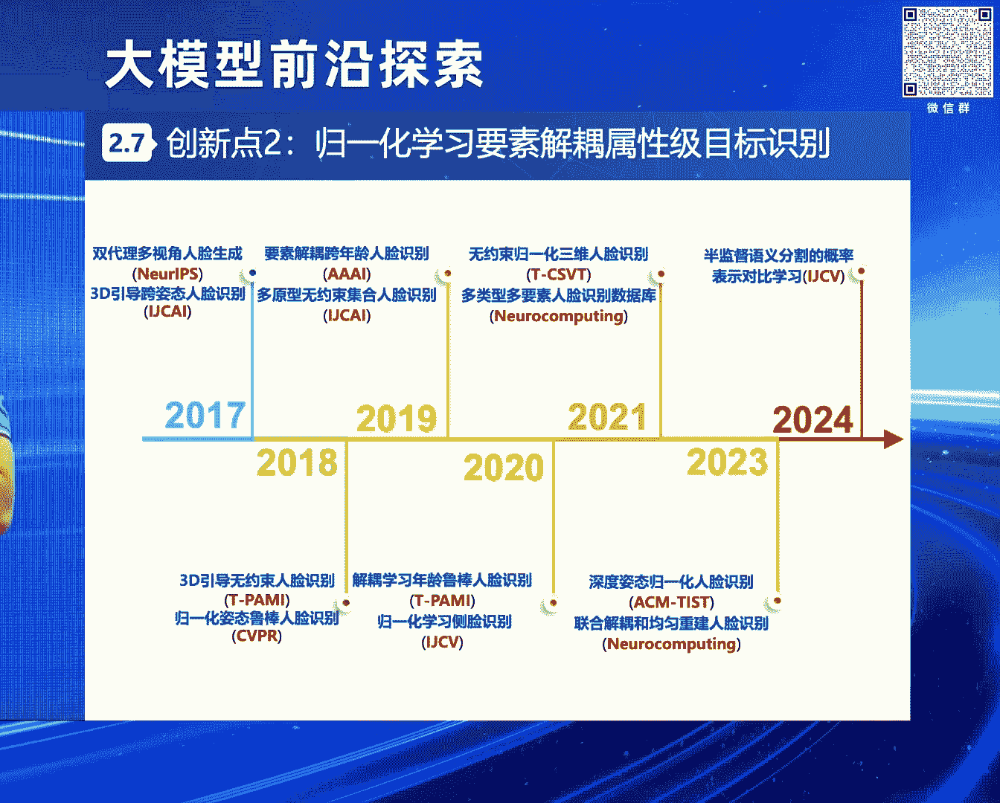
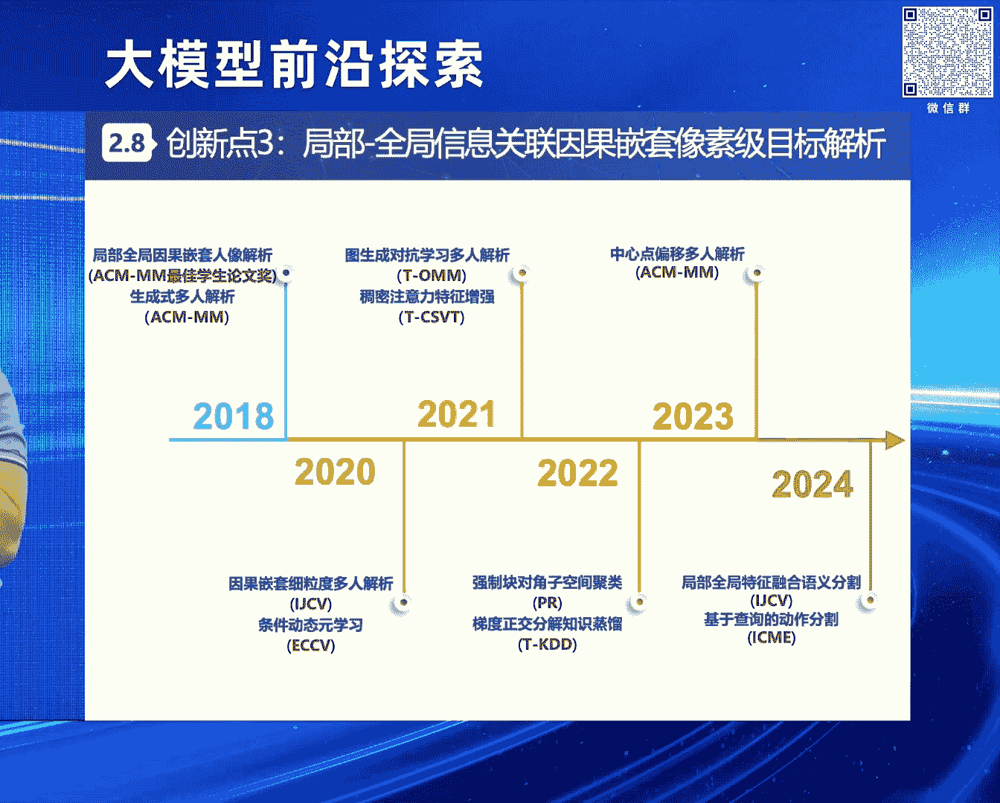

# 2024北京智源大会-大模型前沿探索 - P6：无约束感知理解：从视觉垂域建模到多模态统一与多任务协同：赵 健 - 智源社区 - BV1yS411A73A

呃感谢呃叶泉老师的这个介绍，感谢永翔总和叶泉老师的这个精心组织呃，呃实际上这个刚才大家很多呃，专家老师呃介绍的都很全面了，然后从这个叶全老师一开始，介绍我们这个电信和智源研究院合作的。

这个全球首个稠密的大模型，到呃双勇老师介绍的这个呃，电信在大模型方面的一些呃，比较好的一些实践和探索，然后再到这个呃敖老师介绍的，大大小模型的这个协同，然后再到这个黄磊老师介绍的这个呃。

从机器学习到深度学习，再到这个大模型时代的呃一些理论分析嗯，所以我主要是结合着一个具体的呃，一个问题也好，或者是一个场景也好，或者是一个应用也好，来跟大家做一些我们在这个无约束感知理解呃。

从视觉垂域的建模，到多模态统一和多任务协同方面的一些呃，研究思考和体会，呃，刚才这个呃，叶璇老师已经呃对我做过了一些介绍，在这里我就不赘述了，那么人工智能发展到现在这个时期的话。

其实大家可能都有很多的这种感触，就是说以前我们的创新模式的话，实际上是学术界一直在引领工业界，那么现在大模型时代，多模态呃，生成式实际上就是很多的，很多程度上或者是某种程度上呃，是这个工业界在呃。

开始引领这个学术界，进行这种创新和应用的这种发展，所以这个我们电信的话呃，其实在这个数据，算力场景等等方面都有非常大的优势啊，那么我们现在也在呃，这个吸引这个一些人才的这个加盟呃。

所以如果大家呃有这个呃，自荐或者是推荐的一些优秀的候选人的话，欢迎呃跟我们取得联系，嗯然后呃这个视觉目标的感知理解的话，实际上是一个非常呃重要的，一个国家发展的这个需求呃，这个新时代的中国国防里面呃。

就指出这个复杂对抗环境下，国防安全任务艰巨繁重，那么需要重点发展视觉目标的感知理解呃，那么2022年，国自然的这个十四五的发展规划里面也指出呃，需要这个攻克多元异构信息的融合感知理解。

这个意义是十分重大的，所以迫切的需要呃，去这个视觉目标的感知理解呃，那么视觉目标的感知理解是什么呢，它实际上就是去获取我们图像，或者是视频里面呃，一些，比如说像人车物啊。

等等这样的一些目标的关键信息和关联属性呃，那么多年以来呃，他一直都是我们这个呃人工智能领域的，非常重要的这个科学问题啊，同时也在呃比如说像国防反恐，公共安全以及民生经济等等方面，有非常广阔的应用前景。

呃但是的话无约束条件下呃，我们的视觉目标感知理解，仍然面临很多的这种呃挑战，这是这些挑战，主要包括这个各种内外在因素的耦，合的这种影响，那么会对我们的这个呃视觉目标的感知理解呃。

造成这个呃求解建模上面的这种困难嗯，嗯比如说这个我们为了防患某个核心区啊，和它州界的这个安全威胁，那么我们需要对它的这个监控图像，视频里面的，这个重要目标的关键信息和关联属性。

而进行一种层次化的感知和理解，那么首先我们需要去对对这个态势信息，来进行这个感知啊，包括检测可疑目标的状态信息啊，来预测它的这个趋势信息，然后进而呃进行这个属性信息的关联啊，关联这个关注目标的属性信息。

得到它的这个属性的描述呃，再进而去这个理解它的这个精细化的，语义的信息啊，也也就是解析这个重点目标的呃，像素级的这个语义信息，来获取到他的这个呃精细化的这种特征呃。

那么实际上我们发现就是说在这个里面的话，在隐空间里面的话，他的这个各种挑战性因素啊，以及这个跟目标息息相关的，它的这种关键信息实际上是紧耦合的一个状态，那么这个不利于我们去对目标的它。

它所涉及到的一些信息，来进行这种呃感知和理解，所以这个里面一个关键的科学问题，就是说我们怎么去呃探究，在这个复杂要素耦合空间里面，来进行这个属性关系挖掘和识别的机理，呃。

所以我们也是呃这个围绕这样的一个科学问题，来提出了一个呃科学的呃思路，叫做数据与知识混合驱动的深度感知理解，那么我们也是呃进行了这个三项层层递进，相互支撑的呃研究工作啊。

包括这个多模融合学习的呃态势感知要素解耦，学习的属性关联啊，以及因果嵌套学习的呃语义理解，并且也分别进行了这个相应的这种呃创新嗯，首先我介绍一下这个第一项研究内容呃，也从一个每一个研究内容。

我都是从一个问题背景啊，来来来引入啊，呃这个第一项研究内容，他的这个问题背景，比如说我们现在这个国际上，大家都关注的一个问题，是这个反无人机的一个问题啊，就说为了保障某要地的低空安全。

我们需要对这个微小型无人机等等，一些可疑目标的这个时空关键信息，来进行这个感知取证啊，并且辅助一些这种呃反制的手段来进行管控嗯，那么在这个呃多模融合学习态势感知里面。

我们主要是研究怎么样去通过融合这个呃，红外呀，可见光啊等等一些多元信息，它的一些互补的优势，来实现这个目标的空间位置等等，状态信息的检测，和它的这个运动轨迹等等一些趋势信息的预测。

呃但是在这个里面其实存在很多挑战，比如说在我们所说的这个无约束条件下，或者是非配合条件下，那么目标它在运动的过程中会不断的受到速度，背景障碍物等等一些影响，那么会导致他的这个视觉观测会产生多变性。

那么会导致我们这个态势信息的获取啊不精确，那么呃针对这样的挑战呢，我们也是做了一系列的工作啊，那么在这个呃RGBT的这个呃，弱小目标跟踪的这样的一个场景下，那么传统方法呢，主要是针对这个基于这个。

一阶交互和静态模板的方式，那么呃会导致这个力度单一，表征低效，那么我们提出一个创新的思路，是这个双流知识迁移的多模融合，实力及目标跟踪呃，可以呃通过这个多接耦合双流极联呃。

联合着去感知它的这个全全局和局部的，这个信息，能够实现多接信息的这个融合互补呃，时空线索的联动建模和这个层级知识的呃，吉连迁移嗯，那么同时的话我们也构建了一个大规模的呃，这个多模融合的。

无人机跟踪的这个基准数据集呃，那么相比于此前呃，这个这个相关的一些这个数据的话，呃，我们有效标签实际上超服了35。9%，那么如果有有这个老师，或者是同学们关注我们这个方向的话。

我们这个方向叫NTUAV呃，如果有人关注我们这个方向的话，实际上也也会知道，就是说我们一直是围绕这个方向在进行深耕，国际上我们是首次提出来这个问题，就是反无人机这个这个这个问题。

然后我们也是多年来持续的在围绕这个方向，不断的在呃进行这个构建这个数据，然后不断的在这个像CVPRI，CCV这样的一些国际顶会上，是在组织这样的一些workshop和challenge。

来推动这个领域的发展和进步，然后接下来我们马上要依托CVP2025，组织这个第四届on t v v workshop and challenge，也也是欢迎大家关注和参参加呃。

然后我们的方法的话也是在这个复杂环境，复杂环境多重遮挡的这样的条件下呃，相比于此前这个呃最优的这个方法呃，呃这个呃相相对精度提升了有19。95个点，然后这个是国际上面的一些学者。

对我们方法的一些这个正面的一些评价，呃，然后我们的相关的算法也拿到了这个，比如说中国人工智能大赛A级证书，以及CVPR上面的一些比赛的奖项等等，呃，然后刚才我也介绍了，我也是这个呃。

多次作为第一负责人来在这个国际的顶会上，组织这样的这样的这个topic的一些呃，学术活动嗯，吸引了很多的这个国内外的这个机构，来进行这个呃参加嗯，然后我们的相关的成果，现在也落地到了这个一些呃。

包括一些国家的重要部门啊，我们也跟这个花样滑冰协会做了这个合作啊，开发了相关的一些系统，那目前估值也非常好，然后下面介绍我们的这个第二项工作呃，比如说我们在这个某个突发的公共，安全事件里面啊。

我们需要对这个实施违法行为的一些关注目标，他的这个面部的特征来进行这个感知呃，识别他的这个呃身份的信息呃，来实施这种追查布控，那么在这个要素解耦学习的属性关联里面，我们就需要研究。

怎么样去通过这个充分挖掘目标的呃，内在属性耦合的结构，和它的这种相互之间的这种关联关系，来发现属性和属性之间的这种复杂的依赖，来实现这个目标的身份啊，类别呀等等这样的一些信息的呃精确的识别呃。

但是在这个无约束条件下，实际上呃目标经常会受到这种呃姿态呀，等等一些内在属性的耦合影响，和这种视角啊，分辨率啊等等一些外在因素的干扰影响，那么就会导致它的这个属性识别的结果不够呃，精准呃。

那么我们也是做了很多的工作，来解决这样的一些挑战和难点咳。

那么传统方法的话主要是通过呃，比如说合成图像直接学习的方式，那么就会导致这个分布的差异和属性，耦合的一些挑战呃，我们提出这种规划，学习要素解耦的，属性及目标识别的这种呃解决思路呃。

通过这个多属性依赖的这种关系建模和归一化，学习要素解耦，可以充分的理清属性耦合的结构，然后统一的去处理各种各样的一些呃，挑战性的因素，然后实现这种呃各各种关联属性的归一化学习，我们的方法的话。

相比于呃这个之前马尔奖得主，and resistman的这个fisher，vector等等一些经典的算法，相对识别精度呃提升了超过50%呃，然后此外的话我们在呃一些大姿态，极端姿态等等一些条件下。

相比于之前的这个方法呃，相对识别精度也得到了大幅的这种提升，然后特别值得一提的是，我们呃也把我们的这个方法呃做了这个开源，在GITHUB上面。

我们release了一个rapper叫face evolve，呃，相信很多同学也都用过啊，目前在GITHUB上面反响非常好，有这个3000多次的这个star和700多次的fork，然后呢。

我们也对这个国产化的深度学习的这个框架，比如说百度的paddle，paddle以及清华的这个G图呃，进行了这种适配啊，并且被他们这个官方引入了呃，呃呃这个现在就是这个大家的反响和使用率啊，都非常的高。

也帮助了很多的学者，包括呃这个呃做了研究和转化，然后这个是国际上面的一些呃，评价的一些情况啊，然后我们的相关的算法的话也获得了呃，包括CCV2021的这个口罩，人脸识别竞赛的冠军呃。

因为当时正好赶上疫情呃，所以这个口罩人脸识别，也是一个比较热的一个话题，然后以及这个美国国家标准技术研究院呃，搞的一个无约束人脸识别竞赛，我们是在所有的track上面都拿到了冠军呃。

然后还有之前微软搞的这个，百万名人识别的一个呃比赛，我们也是在所有的track上面都拿到了冠军，然后也是因此我跟这个微软亚洲研究院的一，一些组织这些学术活动的老师呃，得到了这种很好的这种呃呃交往呃。

也成为了朋友，哈哈不打不相识，然后我们也是呃在这个方向上面，组织了很多的学术活动，我们组织了这个地面哨兵的挑战赛啊，以及WELS的这种系列的活动啊，然后我们的一些成果也成功的落地到了。

一些国家的重要部门，包括呃这呃，还有这个蚂蚁金服的这个可信，人脸识别系统里面呃，这个服务覆盖了1。2亿的用户，然后累计支持了150亿津贴的发放等等，咳然后呃下面介绍一下我们的呃这个第三项呃。

这个内容嗯啊比如说在某个聚集性的活动里面，我们这个重点目标通常是藏在人群里面的，那么我们需要分析不同目标的这种啊详细的呃，特征来这个理解他的这种精细化的语义信息，实施这个呃精细的这种检索。

所以这个因果嵌套的语义理解的话，主要是研究怎么样去逐步的呃，建建模这个复杂的场景，然后以及由自由粗到精信息的渐进式的反馈，把这种呃高复杂度的任务，向低复杂的任务进行这个分解和转化啊。

最终实现这种呃精细化的语义的理解呃，但是在无约束的条件下，因为呃人群里面这个目标的话，他可能这个距离比较远，会导致轮廓的这个模糊啊，并且这个呃，因为交互的问题或者是遮挡的问题呃，都比较严重。

会导致它的这个场景的复杂度呃，会产生这个多元性，那么就会呃导致我们最后的这个语义理解，不够精细呃，那么我们也是做了一系列的工作。

来解决这样的问题呃，传统方法呢主要是这种呃基于cascade的方式啊，就是多阶段呃相互独立，多阶段呃分开去进行这个处理，那么会导致这个特征没有关联，语义也容易混淆呃，那么我们提出这个局部全局信息关联的。

因果嵌套，像素及目标解析这样的一个方案呃，呃通过这个局部和全局的关联，以及因果嵌套的学习啊，可以实现这个特征的协同优化，和语义的因果推理呃，那么此外的话我们也是构建了这方面的一个。

大规模的细粒度的语义理解的数据集，呃，然后呢在这个数据的规模上，相比于之前的工作呃，超服了五倍呃，在这个数据标注的这个类别上呃，相比于之前工作超过了三倍，然后现在也被多个国际上面的。

知名机构所广泛的使用反响也非常好，然后我们的算法的话，相比于之前的，比如说m h passer等等一些这个经典的方法的话，在保证性能呃，基本呃有有这个呃些许提升的同时呃。

在个推理速度上也提升了这个十倍呃，相比于这个RESNET作者何凯明的一个，这个master r cn，我们的这个平均的精度提升了13。95个点，呃然后这个也得到了一些国际学者的这个评价。

呃然后我们的这个相关的这个算法的话，也拿到了一些，比如说像这个AC m multimedia的best student paper，然后以及这个新加坡模式识别协会的金奖，呃，然后同时的话我们也是呃。

组织了很多这方面的学术活动，来推动这个领域的发展和进步啊，我们的这个最后的学术成果，也成功地落地到了一些国家的重要部门啊，以及这个像奇虎，360啊等等这样的一些单位呃，取得了一些经济经济效益啊，咳。

Ok，那么我们在这个长期的这个，研究和实践的过程中，实际上发现就是说在视觉，视觉目标的感知理解方面的话，呃对只利用视觉信息，往往我们呃是获取到的这个有用的，这个呃信息的话，实际上是不全不够全面的。

然后只研究这个呃我们所谓的专用智能，或者是这个某个领域的这个针对某个问题的，所开发的这种呃模型的话，实际上他的这个认知能力是有限的，那么这样的话就是没有办法去应对这个多模态，非完整信息的呃。

感知理理解的这样的一个呃新的需求，因为我们人在感知这个世界的时候，实际上就是包括了呃呃触觉啊，听觉啊，嗅觉啊等等，它实际上本质上就是一个多模态的呃，但是在每种模态下，它所获取到的这些信息。

实际上呃更多的是这种非完整的信息，就是每种模态下面的这个信息是不完备的，那么怎么样去针对这种呃多模态非完整信息，这样的条件下获取到更精确的呃目标画像，来进行更好的感知理解，呃，实际上我们呃思考。

就是说从三个方面来进行扩展啊，一个是呃从视觉模态呃，来扩展到这个呃，各种各样的一些多模态相进行融合呃，另外一个呢是从这个从各个子问题，或者是各个垂域的专用模型来扩展到跨域的呃，通用模型。

然后呢呃面向的这个场景的话，实际上也是从这个之前的这种单一的场景，复杂度比较低的场景来，像这个多样化的一些场景呃，复杂度比较高的场景来进行拓展和延伸，那么最终的话呃，呃我们的目愿景的话是构建一个多模态。

多任务联合驱动的呃通用模型呃，那么实际上这个就是说从呃视觉垂域建模，到这个多模态统一和多任务协同，这个也是呃呃所谓的需求牵引突破瓶颈，有这样的属性，就是说它既符合这个国家的一些需求和指引。

那么同时的话也是呃，近几年这个国际上面的这个研究前沿，那么这个是我们所设计的一些呃，研究的这个思路性的一个一个架构啊，就是说呃针对这个探究多模态非完整信息，语义对齐和多任务协同机理，这样的一个科学问题。

我们从哪几个方面来入手，那么主要是从四个方面啊，一个是多元融合，就是解决这个呃多多模态理解的这个问题，然后再到这个通用模型的设计，解决模型的设计问题，然后再到这个多任务学习。

解决这个多多任务学习机理的这个这个问题嗯，再到这个增量学习呃，持续优化嗯，然后也分别呃去这个寻求一些不同层面的，这种呃创新，然后最后面向嗯比如说区域安防啊，聚神智能啊等等一些不同的应用的场景。

来进行这个呃验证和呃赋能呃，那么时间关系的话，我在这里面可能不会介绍一些特别细的，这种技术细节呃，主要是一些这种呃介绍这个不同呃，研究这个内容下面所面临的挑战，或者是一些呃这个纲领性的思路。

那么在这个多模态建模和语义对齐里面，实际上我们主要是想要解决这个，怎么样去实现呃，这个多元异构信息的优势互补和交互协作，那么得到各种各样的一些信息融合的这个，通用学习的这种啊框架，那么主要哦。

我们考虑的话就包括两个两个大的部分吧，一个是多模态数据的离散结构，表示一个是这个特征啊，语义空间的这种对齐嗯，呃就是把这个不同模态的数据来进行，隐空间的解耦啊，利用这个呃强鲁棒性的离散表征空间。

对这个数据进行建模，同时的话引入这个呃语义空间对齐的机制呃，实现这个呃多模态信息在这个隐空间的呃，真正的这种对齐呃，然后第二个这个内容的话，就是通用模型的设计和轻量化呃，这个里面主要是要考虑怎么去编码。

不同尺度的这个多模态的信号，来提取模态间和模态内的这个复杂的交互关系，并且在这个多任务学习呀等等呃，一些任务里面呃，来来这个减小我们的计算量啊，那么也是包括了两个部分，一个是多尺度的数据的长城建模。

还有这个多模态的呃联合表征学习呃，呃这个在多任务学习里面的话，我们主要是要考虑怎么去设计，这种多模态的输入和多类型任务的，一一种轻量化的这个模型的架构，来实现一体化的这个多任务联合的处理，呃。

实际上就是要研究清楚这个多任务学习的呃，机理和机制，因为大家都知道多任务学习的过程中，有些任务是相互促进的，有些任务是相互抑制的，呃我们要搞清楚这个机理和机制的话，才能更好的进行这个多模态呃。

多任务统一的这种呃学习和表示，然后最后一个的话是增量学习，就是说怎么去构建一个统一的优化框架，来不断的去处理我们这个现实世界里面的，这个连续的信息流呃，构建一个共享的这个表征空间。

来增强我们模型的呃小样本学习能力，零样本学习能力和泛化的能力，让我们的模型在实际的问题里面，能够呃不断的迭代，不断的进化啊，不断的这个变得越来越聪明啊，这个也是呃不管是学者也好。

还是这个呃产业界的这个这个同仁们也好，所关注的一个一个比较重要的一个问题啊，实际上我们现在就是在呃在基于这些方向的话，也在也在不断的去做一些研究和探索，然后很多研究成果的话，我们不久都会放出来。

嗯不久都会放出来，刚才这个双勇老师讲了一些成果的话。

实际上是里面的呃某一些维度，然后其他一些维度包括我刚才讲的呃。

后面我们不断的会有这个新的成果，会跟大家见面嗯。

然后最后的话做一个小的总结吧，就是说呃现在人工智能发展的非常快啊。

每一天都会有新的进展，每一天都会有新的呃这种啊突破啊，虽然这个未来可能呃是不确定的，但是我们相信这个未来一定会越来越好，然后呢我们也是希望跟各界的同仁们一起，我们一道呃，大家一起努力。

然后呃让一些不可能变成可能好谢谢。

感谢赵建博士的精彩报告呃，让更多的不可能变成可能，然后下面有请观众提问一个问题，有吗好嗯，刚才老师说的那个关于无无人机的那个，就是它的距离控制和那个识别的问题，我也关注过这个一点嗯。

我是用那个想用那个什么呀，透视空间了，这就是找坐标，就是它没法聚焦和坐标去控制它的距离，到底是哪里，当时我刚才看到那个视频里面也有用光谱，用光谱来做，但光谱它的甘肃干干扰的那个因素太大。

其实它就是可以用呃，建筑物的坐标用地标是吧，这样子的话我觉得可能会解决这个问题，对啊，您说您说的这个很好啊，就是说我们实际在实际应用里面啊，在实际应用里面去，解决这个反无人机的问题的时候。

实际上是包括了三个子系统啊，一个是预警探测，一个是防御处置，还有一个是指挥控制呃，实际上跟这个感知相关的，就是在这个预警探测里面，那么在预警探测里面的话，我们是本是一个多模态的，是一个多模态的。

就是说除了视觉的这个设备以外，视觉的设备就是指指的这个光电探头，带转台的光电探头，有有这个红外的市场，也有可见光的市场，然后它上面带激光测距的嗯，然后呢，此外的话我们还包括了这个雷达的探测设备。

和无线电频谱的侦测设备，所以实际上就是一个多模态融合，来解决这个目标位置信息，和他的这个其他的一些关键信息的探，测的这样的一个问题，当然我们在做这个学术研究的时候，因为我们可能更多的。

比如说涉及到这个多媒体呀，涉及到CVE呀这样的一些问题的时候，我们可能主要关注这个在在一些视觉领域，怎么更好的解决这个目标的这个呃，状态和趋势信息的感知嗯。

