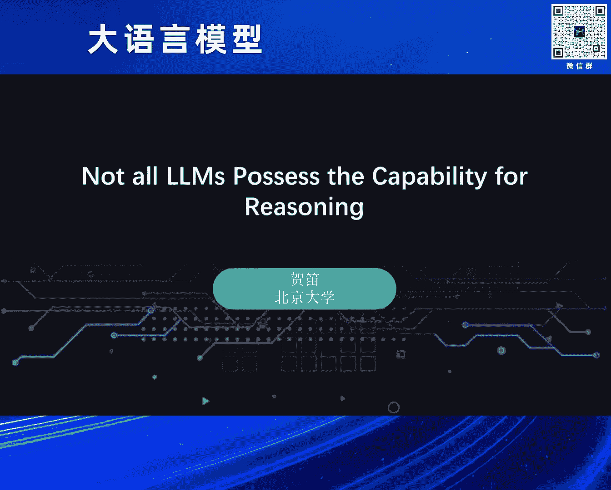
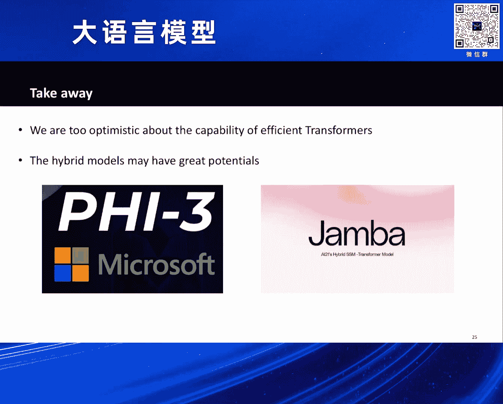

# 2024北京智源大会-大语言模型 - P2：是否所有Transformer结构都具备思维链推理能力？-贺 笛 - 智源社区 - BV1zE421N7UJ

呃大家好，我叫贺迪嗯，我们知道大语言模型实际上是一个，现在非常非常火热的话题，不仅是在工业界的时候在讨论这个问题，在学术界，甚至是在这种创业界都是在讨论大语言模型，它的问题是什么。

并且大语言模型它能够解决的东西是什么，如果让我们去说这里面的几个说好，现在大语言模型发展得这么迅速，那么它背后最重要的一些技术是什么，那么对于我来说，我可能会说。

transformer这样的一个模型结构，是让大语言模型表现出这么强大的实力的，这样的一个最重要的环节之一，当然除了穿梭门这样一个模型结构呢，还有像英伟达这样，提供了非常非常多的这种训练资源的这种支持。

那对于穿梭门来说，实际上它也并不是没有竞争对手，或者是说现在其实有很多很多的工作，不仅是来自于国外，也是来自于国内的，很多很多的工作都在试图挑战穿梭门的王座，为什么这么说呢。

因为transformer本身它的确是有些问题的，其中一个最大的问题就是它的效率的问题，我们知道transformer，它里面有self attention这样的一个机制。

那么当他去放在这种比较长序列的上面的时候，self attention在处理长序列问题上的速度，实际上是非常非常慢的，这样就会导致你的序列非常长的时候，穿梭门需要花非常非常多的时间去理解。

或者是去生成这样的一个长序列的东西，那为了解决这样一个问题呢，其实学术界和工业界设计了非常非常多的方法，这些方法每个方法都有各自的名字，但是总体来说他们有一个字体，整体的一个名字。

他们都叫做这个efficient transformer，这种高效的穿梭门，大家会采用不同的技术路线，比如说第一种办法是说，我去减少一下这个key value pair的数量。

那么一般时候我们会管这样的模型叫做sparse，Transformer，他的代表工作呢是g b t two，比如说第二类方法，我是去reduce1些dimension。

尤其是涉及到长度的dimension，这样它对应的模型呢叫做low rank transformer，比如说像呃meta的informer就是类似的方法。

第三种呢是去reduce这个这个soft max，里边的一些computation，那这样对应的方法呢，一般我们叫做linear transformer，当然了，上面的三种方法是非常非常基础的方法。

它们之间可以相互之间的复合使用，那么会构造出非常非常多的模型的变种，比如说像我们现在知道的这个s four，包括像最近非常非常火的曼巴，包括曼巴two，包括国内的一些模型，像RWKV。

包括像微软的模型叫做RENET，都是围绕着类似的方法，试图去降低transformer的计算效率，但这个时候就会出现一个问题，就是当我们看到这么多的模型，有这么多的穿梭的变种。

那当我们面对一个实际的任务的时候，我们到底该如何选择模型去完成我的任务呢，或者问一个更本质的问题，就是有这么多的模型，到底哪一个模型是我们的真命天子，它可以真正的完美替代，传送门这样的一个结构呢。

那这个实际上就是一个非常非常重要的问题，那为了回答这样的问一个问题，我们先去看一下我们有可能得到什么样的答案，比如说我们现在面临一个task，我们管这个task叫AOK。

我们的目标是使用类似transformer这样的结构，去解决这样一个task，那我们可能碰到的第一个情况是说，所有的这些模型OK我采用相同宽度，相同深度这样的模型，这样的模型我都可以去解决。

这样的它一个task a，那在这种情况下，显而易见的，作为刚才我们提到的这些efficient transformer，它显然是能够解决task个A，并且它的速度比TRANSER快。

那这个时候毫无疑问的，我会选择这样的一个efficient的穿梭门，作为我的transformer的替代品，但第二种情况是什么呢，第二种情况是说以fusion的穿梭，而不管上面说的哪一种穿梭门。

它都没有办法解决这样一个task a，但是有可能transformer可以解决，那在这种情况下，我们显然就会得到一个结论，就刚才我们说的这些efficient transformer。

实际上它都并不太work，换句话说，如果这个task a是一个我们非常关心的task，我如果能够从理论上告诉大家，以pn transformer就是做不出来，那这条路可能就是走不通的。

那还有第三种比较tricky的setting，这个setting就是说，efficient的transformer也能够解决，但是呢只不过它需要的参数量，可能要比标准的穿梭门要大一些。

比如说它可能需要更多的层数，或者是更宽的宽度去解决这件事情，那对于这种情况下，我们就需要仔细地去算一下，以vision的transformer，去解决这个任务所花的计算时间。

和transformer解决这个任务所花的计算时间，到底哪个多，哪个低，哪个多哪个少，那这个实际上就引出了一个理论上，大家比较关心的问题，就是K我们看到了这么多的网络结构。

transformer r w k v曼巴，包括RTNET这样的结构，那这些结构他的表达能力到底是什么，他表达能力的上限到底是什么，它到底哪些任务他可以做哪些任务，他做不出来，那这样就引发我们去思考。

OK我看到这么多的模型，它的表达能力到底是什么，表达能力，实际上是在深度学习理论里面的一个，非常非常经典的问题，我觉得像呃，大概在座的所有人，应该都是做和深度学习相关的呃呃呃领域。

但是我觉得可能并不是所有的人都比较关心，穿梭呃，都比较关心深度学习的理论，因为深度学习理论这个东西，其实它真的指导实际的作用，相对来说是比较弱的，比如说在80年代的时候。

当我们知道的第一个深度学习的理论，实际上就告诉我们是说，OK深度学习的这些模型或者神经网络，它有着非常好的表达能力，因为它可以去拟合任何一个连续空，间的连续函数，当然我们会管这样的一个定理。

叫做universal approximation，也就是说我一个神经网络，只要你的足够宽足够深，不管是你是MLP还是什么复杂的网络，它都可以在一个连续的空间内去拟合，任何一个连续函数。

那这样的一个结论，大家去想它有什么实际的意义，或者是说它能够指导我们去设计，或者是理解我们现代的神经网络吗，那这个里边的指导意义可能相对来说比较小，但相对来说比较小的原因。

一个是说它这个这个这个考虑的网络，可能比较简单，但另外一个其实主要的原因是说，它所使用的这个假设相对来说是比较强的，所以比如说在这个里面我突出了两个地方，它都是假设continue。

也就是说我关心的是在一个连续的空间内，我的一个神经网络，我去逼近一个连续函数的能力，但是如果我们去看现在我们的大模型，实际上它这两个假设都是不满足的，比如说我们在大模型里面，我们的setting是什么。

我们的输入是离散的token，我们的输入是一个vocabulary，里面的一个一个token，而我们输出的也是这个WORKERLI空间里面的一个，一个token，那所以从这个角度上讲。

它实际上是一个sequence to sequence的mapping，那显然它不是一个这样的连续的空间，连续的这种抖妹上面的一个mapping，那它就满足不满足我们后面的这个continue的这样的。

一个要求，第二个很重要的问题是啥呢，第二个很重要的问题是说，我们所有现在训练大模型或者使用大模型，我们都实际上是用的finite precision，比如说你如果要训练非常大的模型。

你可能需要用BF16这样的一个精度去做，当然你如果训练一个比较小的模型，你可可能可以用这种FP16的精度去做，那在你这种精度限制的情况下，相当于是说不管是你的中间的输出，还是你的输入。

还是你最终得到的结果，在某种意义上，它实际上都不是连续的，那在这种情况下，实际上K我也不是一个连续的函数，那如果从这两个角度上来看好，我的模型，我不是一个连续的这样的一个映射。

我本身任务也不是一个连续的任务，那这个就相当于意味着我们80年代的时候，以为的这种万能的这种神经网络的表达能力，万能的这种神经网络逼近任何一个函数的能力，在我们现在的这样的一个setting下。

实际上它的意义并不是很大，那换句话也就是告诉我们说，我们其实现在对现在的我们的所使用的，这种language model，它的表达能力，它的上限是什么，它的limitation是什么。

我们实际上一无所知，那过去的这些theory，或者是一些theoretical的一些analysis，它其实在某种意义上也不一定说它是严格的，非常的适用于我们现在的这种实际的，这种使用的情形。

那我们也需要去开发一些新的SIRI出来，那讲完80年代的工作以后，我们再讲一些最新的工作，那最新的工作实际上主要都是围绕着，去理解这种大模型的表达能力，那大模型的表达能力很多，它可以做很多的事情。

那比如说我们最新在学术界，比较关心的就是大模型，它去解决推理问题，他去解决数学问题，他去解决这种规划问题的能力，因为这些问题实际上是大模型，相比过去的BERT所展示出来的新的东西。

嗯说BT已经解决了很好，相对来说比较好的解决了一些语义的理解，当然我们看到大模型里面，他做出了很多的这种推理呀，规划的能力，那我们会关心，为什么大模型可以做这样的一些，非常复杂的事情，那第一件事是。

我们在刚才我们讲述的这些更新的假设下，也就是说考虑到了这种sequence to sequence mapping，同时我们也考虑到了，整个我们的训练是在一个低精度下的训练。

我们最新得到的理论结论是什么呢，我们最新得到的理论结论是说，OK在我们的language model里面，这种思维链，它对于planning和reasoning是非常非常重要的，为了得到这件事情。

我们需要用两件事情来说明，第一件事情是说如果给了一个穿梭门，这个穿梭门是一个非常非常大的模型，我如果希望这个transformer能够直接生成，答问题的答案，比如说我们关心一些比较典型的问题。

比如像右边图里面展示出来这样的问题，就是一个典型的四则运算问题，那理论上我们可以证明，如果我们希望一个transformer，它能够直接生成一个四则运算问题的答案，这件事情在理论上面是没有任何可行性的。

为什么呢，理论上我们可以证明，如果一个transformer，我希望你这个transformer，直接去解决这个数学问题K的话，那我们可以得到的第一个东西是说，穿梭他的表达能力。

如果让他直接去解决这样的一个问题，的表达能力，它所对应的计算复杂度的类叫做TC0，TC0实际上是一个计算复杂度的类，它可以类比于P和NP，但实际上TC0是一个非常非常小的，计算复杂度的类。

并且很多很多的这种推理问题和，规划问题和数学问题，它们所对应的计算复杂度，是要远远比TC0大的，因此经过这个两个结论，我们就可以得到一个第一个比较重要的结论，就是说transformer。

你让他去解决这样的数学问题，你让它直接生成答案，这件事情是根本不可能，原因就是说因为它本身让它直接生成答案，所对应的计算复杂度是TC0，而其他的很多的这种planning和reasoning的问题。

它的计算复杂度都会远远超过这样的一个，TC0的这样的一个类，第二个结论是什么呢，第二个结论是说，我们可以证明对于很多的问题，比如说一些数学的这种这种K4则运算的问题，或者解线性方程组的问题。

我们都可以证明，如果我对transformer，我不是试图让它直接生成答案，而是说我希望你能够一步一步的帮我生成答案，也就是说我可能去生成第一个等号，后面我只是解决了这个整个的四则运算的。

最高优先级的一些操作，然后第二个等号呢，我是去解决第二优先级的一些操作，然后这样不断的等号下来，然后我们可以证明的一件事情是说，在你使用COT的情况下，如果transformer能够使用COT的话。

那它的表达能力，它能够解决的问题，实际上会远远的超过这样的一个TC0的class，这个大概想法是说，因为在CUT下，我实际上模型每次只需要吐出一个中间的步骤，比如说我给我一个问题以后。

我先生成第一个位置的token，然后把第一个位置的token丢进来，然后再生成第二个位置的token，然后经过一个很长很长的思维链，我最终才生成最终的结果，那在这个过程中，大家可以想象。

我从我的输入到最终的结果之间，实际上执行了非常非常多次的这样的，transformer的操作，那它所带来的非线性性的提升，实际上远远的比你让一个穿送门直接生成答案，要大得多的，那这个实际上也是告诉我们。

COT在让大语言模型去完成推理上面，是一个必不可少的环节，那同学可能会问说好，我如果是transformer和cot合在一起去做，那它能够解决的问题的上限是什么，这个实际上也是最近一个工作。

这个工作的结论是说，transformer加上思维链了以后，它能够解决所有的P问题，并且是在polynomial step下面，那这个实际上就是给整个的transformer的，表达能力。

以及transformer和COT合在一起的表达能力，给了一个非常非常强的刻画，也就是说比如说我们关心它解决问题，那所有的在图灵意义下，可能大家关心的都是P问题，那现在的结论实际上是会告诉你们。

是说OK我有一个大语言模型，然后我加上这种step by step的这种chal salt，那我其实理论上边说，我可以解决所有的POLYNOMIO的问题，那我们刚才讲的所有的结论。

都是围绕着穿出门这样的结构的，但是我我们也记得，在我们在一开始的几页slides里面的时候，我们说的是说除了transformer以外，实际上它有非常非常多的竞争对手，那我们关心的下一个问题。

就是说可刚才的理论相对来说比较清楚了，transformer本身自己能够解决的问题，和transformer加上COT以后，它能够解决的问题是什么，那我们下一个需要关心的问题。

其实就是对于我们刚才说的那些，efficient的transformer，那它到底是不是能够去解决，上面说的所有的问题，比如说一些reasoning的问题，比如说一些数学推理的问题。

那我们采用的这个看的问题的切入点是什么，我们选了一个比较有代表性的问题，也就是所有dynamic programming的问题，动态规划，我们如果假设这个reasoning length是L的话。

那么对于一个标准的穿梭门来说，它如果去完成整个的这样的一个，动态规划的推理来说，那它的计算复杂度是OL方，这个我们其实刚才也展示了，transformer加上chem so的。

它是完全可以解决DYNAMI个programming的，但是我们会比较关心以fusion的transformer，刚才我们提到的这些模型，它是不是足以去解决这样的dynamic programming。

但是非常遗憾的是什么，非常遗憾的是说，我们刚才提到的很多的efficient transformer，它本身是不具备解决任何一个dynamic programming，问题的能力，那换句话说。

我如果已经有一个EVISION的transformer，不管是说我刚才提到的一些中的一个还是什么，那我假设我的这个模型，我已经的size我已经定好了，比如说我模型的深度已经定好了。

我模型的宽度都已经定好了，那我们在理论上可以证明，这样的一个以皮神的transformer，它是不能够解决所有的dynamic programming的问题的。

那这个实际上是一个比较negative result，换句话说它相当于告诉我们，我们过去可能认为很多EVISION的结构，它实际上在解决一些复杂推理问题上，他会都遇会遇到一些本质的困难。

而且很有可能这些本质的困难，是没有办法被解决的，OK第一个点是说，一个constant size的EFUSION的transformer，没有解决这个问题，那没有办法解决这样的问题。

那到底一个什么样的efficient的transformer，有可能能够解决这样的一个问题呢，我们给出了一个结论是说，如果你希望一个efficient的transformer。

能够解决这些reasoning的问题，那么它的模型的大小，要比一个标准的transformer要稍微大一点，比如说我们给了两个结论，K展示了两种非常特殊的efficient transformer。

第一个是spars transformer，第一篇spars transformer，也是第一篇linear transformer，我们给出的结论是说。

如果这样的两个efficient transformer的结构，你期望它能够具备解决reasoning问题的能力，那么你需要这种模型的宽度，也就是说它的hidden dimension的宽度。

是要随着L有一个增长的，其中这个增长的skill大概是根号L，如果感兴趣的同学可以去算一下，如果你这样的一个以替身的穿梭门，如果你能够让它的模型的宽度，随着长度是去增加的，即使是在这种情况下。

你会发现这样的一个EFFICI的transformer，在这样的一个宽度设计下，实际上它去解决所有的dynamic programming的问题，它的计算复杂度你会发现它也是L方，那换句话说你会发现。

如果你要是为了去解决这样的推理问题，如果你希望一个efficient transformer，它足以去解决一个推理问题，那它的计算时间其实和标准的穿梭，没有任何区别，那这样意味着什么。

其实意味着我们刚才提到的很多的一批，TION的transformer，它首先本身不具备推理问题，第二如果你希望它具备推理问题的话，它实际上并不会节约任何的时间，我们针对这样的一个问题。

实际上也做了一些实验，但我们都做了些一些相对来说比较简单的实验，比如说我们会做四则运算这项的实验，那在一个比较简单的这样一个，四则运算的setting下，OK我的横轴是我的dimension。

而我的纵轴是我问题的难度，然后呢我把它是否解决这个问题，用颜色标出来，如果这个颜颜色越亮的话，就代表着我这个模型解决了这个问题，而我如果这个颜色越暗的话，就代表着我这个模型没有解决这个问题。

然后我们也比较了三种不同的模型结构，分别就是我们刚才说的一个标准的transformer，一个linear transformer，以及一个spars transformer，从这三张图里面。

从这三组图里面大家可以清楚地看到，首先一个标准的transformer，它这一横行，实际上它的黑上黑色的点非常少，那实际上就意味着是说，我可以在一个相对来说比较dimension，比较小的维度上面。

我可以比较EFFICI地解决所有的问题，但是大家也可以看到，对于这样的一个linear transformer，和对于一个spars transformer，他们去解决这样的推理问题，所需要的这个宽度。

会比标准的transformer更宽多一点，体现在就是下面的两张图里面，黑色的点非常多，而第一行的时候黑色点非常少，那实际上就显示K比如说最后一个，我如果看sparse transformer。

去解决最长上升子序列这样的问题，你会发现它的dimension，即使到了512或者1024，它都没有办法去解决，但是你如果看标准的穿梭门的话，他去解决最长上升子序列这样的问题。

DEM犬只要256就可以做到，这个实验基本上也佐证了我们的理论的发现，换句话说，如果你希望一个更快的transformer，你希望它去解决一些比较复杂的推理问题，那你就不能够使用的模型的size。

和一个标准的transformer一样，你就需要一个更大的size，然后以期望它能够去解决它，但是你当你size比较大的时候，那实际上这些更快的模型也失去了，他的这个这个所谓的这个效率的这个好的地方。

所以刚才所讲的内容，就是我今天想跟大家分享出来的内容，我们第一个想分享出来的东西，实际上就是说，我们可能对我们自己以为的，那些以fusion的transformer的能力过于乐观。

然而这句话也实际上也不是我说的，最近实际上有非常非常多的一系列的工作，那一系列的理论工作，这里面也包括我们自己的工作，都说明了一件事情。

就是efficient transformer实际上并不efficient，它其实跟标准的transformer，之间的差距是非常非常大，甚至这个差距是没有办法跨越的，第二个事情是什么呢。

第二个事情也是最近另外的一条路，也是最近比较火的一个东西，就是采用这种hybrid的model，比如说对于AI two，实际上他们design了一个hybrid的model。

如果大家真的去看微软的FI3，它的这个这个这个技术报告，然后它里面也会说它使用的是一个hybrid mode，这里的hybrid指的是说efficient layer。

和标准的dance attention layer相互叠，相互去这种交替的使用，但是它的优点是说好，它里面有相对来说比较少的这种DSLAYER，所以它相对比较快，同时呢从理论上讲它也能够避免很多的问题。

包括如果大家感兴趣的话，去看昨天挂出来的一个RKB，我也是刚刚看到，然后也是曼巴团队他们做的，他们实际上做了一个model，他们claim的效果是发现最好的，是一个曼巴hybrid，如果没有记错的话。

曼巴hybrid里面用了45%的，Mana layer，5%的dance attention layer，以及50%的MLPOK，他说这样的一个模型，他发现能够达到最好的效果。

并且也是一个比较好的EFUSION，自己的一个trade off，所以今天OK跟大家想share的，主要就是这样的一个东西，主要是关于transformer的一些理论的，能力的上限。

以及以fusion的穿梭门的理论的能力的上限。

