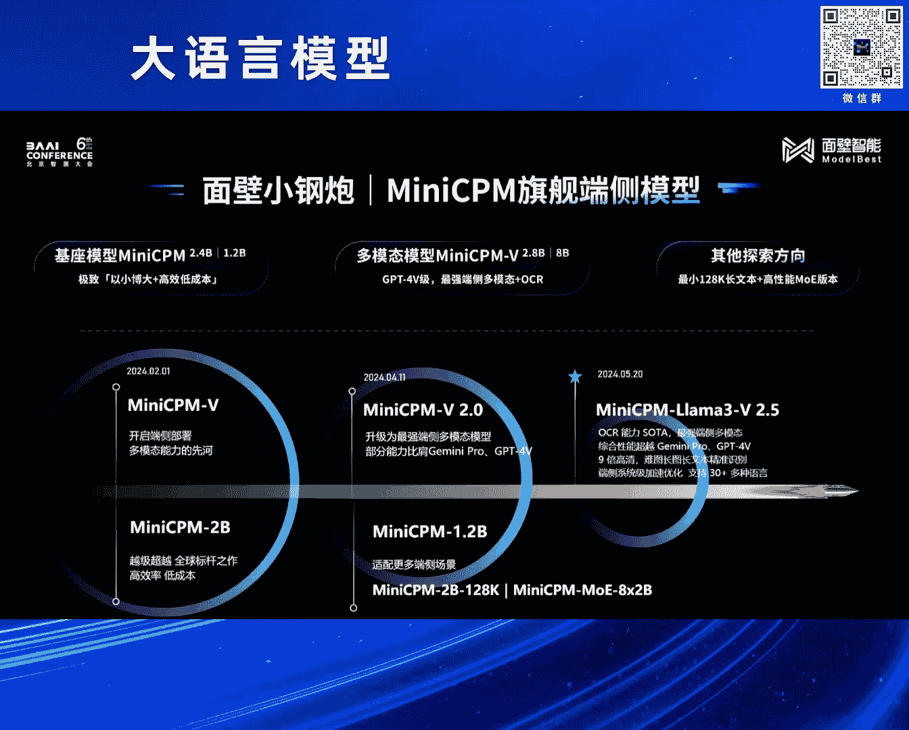
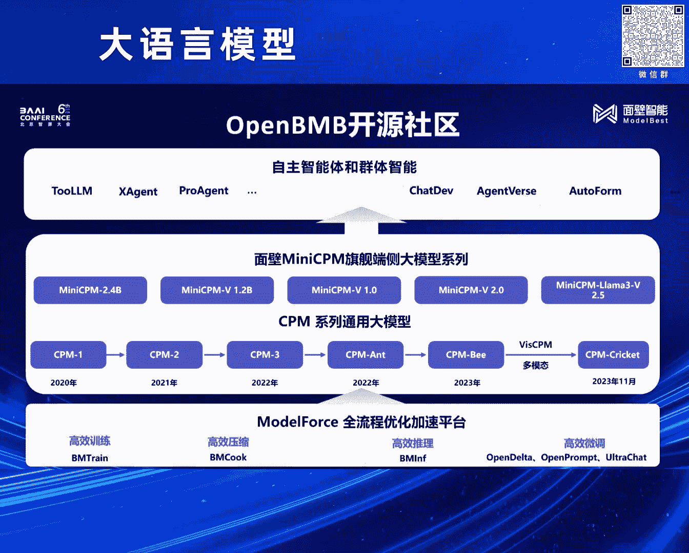

# 2024北京智源大会-大语言模型 - P5：小钢炮MiniCPM是如何炼成的？-曾国洋 - 智源社区 - BV1zE421N7UJ

大家好，我是曾国阳，然后非常高兴今天能跟大家一起分享一下，我们在训练啊，mini c p m系列模型中的一些技术发现，以及最后的一些经验啊，然后呃正好也开个场，就是前前几天呢。

其实发生了一个还比较大的事情，就是苹果在2024年的开发者大会上，推出了apple challenges，然后也是标志着成呃苹果也是正式的开始去啊，做自己的端测的AI啊，其实在苹果之前的话。

也有不少的国内外厂家就已经开始布局啊，端测的模型了，然后在这个方面的话，其实我们也是做的比较早，所以今天也正好能有机会跟大家分享一下，我们在探索端测模型中的一些发现，其实从我们的一些之前的结果来看。

端测模型的出现，基本上是大模型发展历史中一个，比较必然的事情，我们呃图上边有两张图，左边那张图的数据来源是papers code上呃，和MMU数据集的相关的水平啊，然后我们以GBT三一百七十五。

B就是最早20年那个版本的那个指标，作为一个参考的话啊，我们把那个图中红色的点，其实就是呃，水平大于等于GPA三一百七十五B的模型，然后浅色点就是小于的模型，然后画了这样一张图。

我们可以发现随着时间的推移，然后呃达到最原始的GPA3，175B的知识水平的模型，尺寸在逐渐的减小，并且非常巧妙的是，它满足了一个规律，就是我们发现他差不多每八个月时间嗯，模型的知识密度其实会提升一倍。

也能看出来啊，随着模型训练技术的发展，模型能够将越来越多的知识给保存在，越来越小的参数量上，如果我们把这个理解为模型的一个制程的话，其实也可以啊，看出来就是像计算机领域最开始出现的计算机。

像AI arc其实好几个房间那么大，但是随着制程的发展到现在，我们可以把呃这样一个计算机给拿在手上，像手机一样去使用它啊，这也是我们推测大模型啊，在这个发展历程上，端测模型未来一定也会这样出现。

然后同时除了在文本领域，我发现在多模态领域的话，其实也存在这样一个大的趋势啊，然后它和那个啊文本领域会比较像，然后这就不多讲了，在今年早些时候，然后我们其实发布了mini c p m系列的模型。

包括最早的mini c p m呃，1。0就是它的2B版本和1。2B版本，以及mini c p n杠V，还有mini c p m啊，杠V的2。5版本啊，然后今天主要就是介绍一下这些版本中。

模型所使用的一些技术，以及它取得实际效果啊，今年最早的时候其实我们发布了mini CPU两币啊，其实发布这个模型，最开始我们没有想过要训练一个两币的模型，只是因为我们在实验过程中。

然后这个两币模型是我们产出了一个中间版本，然后这个中间版本呢它达到什么效果啊，相比于就是他之前的比较知名的模型，像MISTRO啊，甚至在他后边发布的google的GA啊。

它都能够呃取得和就是和他们相当的水平，同时啊在这样一个小的规模的参数量上啊，这样的模型它能达到这样的效果，在之前看来也是非常不容易的，在这里边的话，其实我们主要做了非常多方面，在训练方法上的一个探索。

比如呃在模型训练的时候，其实大家都会涉及到调整非常多的超参数啊，当我们训练更大规模模型的时候，要调整超参数，它的成本也会更高啊，而且呃就是对于不同规模的模型来说，其实它的自由超参数也是不一样的。

在一个之前的工作中，其实有相关的研究，应该叫就说在我们这里边，其实使用的mp这样一个框架啊，之前的工作一叫什么tensor programs，我有点忘了具体是啥名字了啊，然后在这个框架中。

然后他提出的方法能够对参数进行一些归一化，然后能够通过规划之后，然后就能够确保在不同规模上，模型能够共享一套最优的超参数，然后在我们的实验中，我们也对它进行了验证，其实除除了那个呃。

这个图是一个learning rate，其实除了learning rate之外的话，我们对其他的一些指标也做了一些测试啊，包括像啊模型的什么深度，还有模型的宽度之类的，还有一些其它的超参啊。

然后最终发现，其实在对模型最终效果影响比较明显的，其实就是这个learning rate，选择一个合适的learning rate，不仅能让模型训练的更更快。

同时当learning rate选择的不好的时候，它最终收敛到的位置也不会那么好，然后我们在复现了mu的工作之后，我们发现一个非常巧妙的值，就是learning rate使用0。01是非常的好啊。

所以这是我们在mini se分训练中，选择0。01作为learning rate的一个啊实际的原因，然后在确定了完learning rate之后呢，然后大家也会遇到，就是在实际训练过程中。

我们都会有learning rate schedule啊，这个schedule的话，其实也是一个非常重要的一个指标啊，从最开始训练BERT，大家用的是那个NO arm的那个方法，然后再到后边来。

大家普遍会使用cosine的一个啊调度器啊，但是我们对cos的调度器做了更深入的研究，其实在cos in调度器设置的时候，它最重要的是要设置一个最终截止的部署啊，然后我们对不同的截止步数的cos调度器。

都做了实验，上边那个N是指那个模型的参数量，20N是指训练20倍模型参数量的数据量啊，或者叫token量啊，然后通过设置不同的截止步数，我们可以发现，其实呃当一个cos inerrate。

它呃它取得在它曲线中啊，效果最好，loss最低的位置往往是它到达郭谷的那个位置，是他的那个呃，最终的那个那个那个那个值，就是应该叫最最终的LR最小的那个位置啊，同时的话我们发现就是呃。

我当我们能够给那个cos的learn rate给它切，就是当当它能让它重复足够多次次的时候，我们发现它其实在越往后的话，它其实最终也会达到一个差不多的水平，所以基于这个话，我们就进行了一些进一步的探索。

我们把这个learning rate上，learn rate schedule做了很多的不一样的实验，然后后来我们就试出了一个叫WSD的一个啊，Schedule，然后它非常简单。

就相比于传统的那个cos各种曲线来说，它就很粗暴，它就包含三个阶段，第一个阶段warm up，第二个阶段是stable，第三阶段decay，warm up的话，其实是现在所有scale的会自带的。

就是前期从最开始LR是零，然后通过训练持续增加到我们最终的初始LR，然后同时呃和COSN不一样的是，就是COSN的schedule，它会在那个训练过程中持续的下降，而对于我们WSD来说。

它会在中间保持相当长一段时间的，stable的一个啊学习率，我们发现通过一个更大的学习率，其实模型能够实现更快的学习啊，而为什么最后又会有个decay的阶段呢，啊是因为我们发现。

当我们一直保持比较大的LR的时候，模型确实会学的比较快，但是它最终到达的那个loss的水平，其实并没有那么高，但是当我们去降低R这个过程中，然后它loss会出现一个快速的下降，在这个过程中。

我们就是实验得到了右边那张图，我们可以发现呃，通过那个WSD的优化器，然后它在STL阶段，虽然它的那个loss会比cos更高啊，但是呢就是随着我们在不同阶段，使用decay的方法的话。

然后它就可以在decay阶段实现loss快速下降，甚至在后期是可以在那个decay阶段完成之后，他得到那个模型的loss是会比那个呃使用cos in，使用cos in的那个学习率。

在对应时间得到loss会更低啊，同时的话WSD的优化器也有个好处，是啥呢，就是当我们训练模型的时候，可能通常要呃就是其实数据训练的过程中，可能数据会发生各种各样的变化，甚至我一个模型训训完了之后。

还想再训一段时间，这都是很常见的问题，所以对于cosine学呃的schedule，它需要在训练之前呢，预先设置好一个他的那个呃截止时间啊，但是对WSD它是不需要的，当你随时要用的时候，你随时把它拿出来。

然后训一下它的decay阶段，就能得到一个非常好的模型，这个对于大模型的持续训练来说，也是非常有用的啊，然后右边是一个我们实际训练时候的那个lost，的一个情况，可以看出比较明显的一个变化。

就是它从从大概那个2万5000到3万中间，那个步数的时候，然后我们开始进入DK阶段，然后他的那个LR会呃，就是它的那个LR，在那个阶段会发生快速的下降，就对应的带来也是loss会发生快速的下降。

然后呃其实还有一些比较有意思的呃，结论就是其实在之前那个包括欧派的研究中，就是batch size的选择会和你最终的learning rate呃，会和你最终的loss收敛到的位置会相关啊。

但是在这里边理论上它应该在那个decay阶段，选择更大的lo呃，选择更大的batch size，但是我们做了一些实验，发现好像并没有什么效果啊，那反正也感觉挺奇怪的啊，然后嗯针对这样的模型的话。

我们也对它实际进行了一些评测，就说在之前的话，在模型训练阶段，其实有个叫CHAN区love optimal的一个说法，就是说呃当我们训练多少token的时候，能达到一个最最最有效的就是在在这个训练。

在这样一个呃运算量下，会最有最高效的一个模型的size，和它要训练的数据量，然后我们我们使用了相同的数据配方，然后去训练了那个change cha呃，根据群区up型模去训练一系列模型。

可以发现使用我们这样的方法啊，训练出了模型，最终能够超越呃，大概是我们mini c p u2B的一个模型，它最终loss是2。4，大概的水平，其实等于全区loft tm9B规模的模型。

这也是为什么mini c p m，可以在一个更小的规模上去，战胜更大规模模型的一个原因，然后这个是一个最终的效果，然后我们将mini CPU这个两臂模型，最终也只能跑在手机和啊各种的呃，就是PC上。

然后同时能够有一个比较高的一个速度啊，然后这个的话也是，而且这个速度其实当时我们最开始适配的时候，也还没有做任何的优化，就单纯利用手机的CPU，其实就能跑到一个比较快的效果啊，然后因为实验原因。

我就不放太多啊，嗯对然后有了mini c屏幕之后，我们又在mini c屏幕上面加入了多模态能力，就是我们的mini CPU杠V的2。0版本啊，相比于那个其他多模态模型，我发现在我们的实验过程中。

我们发现就是呃多对一个支持图文，多模态书的模型来说，文本模型文本的基座模型的水平其实会比较大，影响它在多模态最终的一个效果，所以在这里边的话，我们也是将mini c p这样一个比较强力的模型。

应用到了呃，应用到了这个多模态啊场景下边，然后可以发现通过一个更强的文本技术，我们能够超越数倍于我们规模的一个模型，然后这个是其实是一个比较旧的图了，就是当时发布的时候一个图，然后可以看出来就是啊。

mini c p m能够全方位的超越，甚至一些比自己大好几倍的模型，这也其实也是在我们实验中发现，是依赖于啊文本模型的一个强大的能力，然后在mini CPU杠V2。0中，我们能够做到对啊。

就是我们对那个我们能够做到，对于那个高清图片的各种的理解，同时还还能够把图像中那些比较小的字，都给识别出来啊，同时的话也能够识别，就是也能够做非常长的图片来理解，这个在文本领域。

其实有个常见的任务叫做长文本啊，就是我们给他一篇很长的文章，然后问一些问题，我们有意思的是，我们发现其实把这些文字转换成图片，然后通过图片这种多模态的形式输入进去，模型也能够做一些啊。

也能够做一些这种长文本的一些问答的问题啊，那么在这里边的话，其实我们主要应用到的技术就是呃一个呃U呃，就是lava u h d论文里提到，就是我们的那个多分辨率高清解码的一个技术，在这里边的话。

其实我在这个工作中，我们也是对多模态领域最最常见的一个问题，是对于不同输入尺寸的图片，然后它很难用统一的形式去编码，然后做出了一些相应的探索和研究，在图文多模态领域的话，其实比较知名的模型。

像GGPT4V啊这样一个模型的话，然后我们也对它做了比较细致的实验，左边是一个我们的实验，我们发现在GV4V，它可能应用了某种，就是将更到高清的图片切块的一个方法，同时它在块和块之间会有一些重叠啊。

然后来做的一个图像编码，然后这样的一个方案的话，我们也发现，就是他会经常在就是做一些数数的任务中，然后它会数错个数啊，左边是一个比较明显的示例，就是我们构造了一个九个小球的一个图片，然后我们发现。

以不同的尺寸将它放入到模型里边，然后GV4V它会数出不一样的数量啊，当那个它的那个当几个小球，它的大小是比较合适的时候，模型能够正确的数出是九个球啊，但是随着它的规模放大。

可以看出来它会逐渐从九变成12，再变成16啊，为什么变成16轮，其实我们会猜测它在这里边，它在那个实际处理过程中呢，它会包含一些就是呃就是切，就是把大的图像切片成小的图像。

然后在小图小的切片中会有重合的部分，所以导致有些呃，有些有些小球它会被重复的计数了啊，然后呃除了基弗四以外，我们也探寻了就是拉瓦1。5，它对于那个呃那个呃不不同，分辨率图像的一个编码方案。

然后发现它这样基于一个padding的方案，其实在一些比较极限的长宽比下的话，也会存在一些问题，所以在这个工作中的话，我们是综合的提出了，就是说我们要做一个动态分辨率的，一个编码方法。

然后具体的方法呢其实也比较简单啊，对于一个图像来说的话，它其实会存在多种切分方法，比如一个呃一一个一个就是啊，好非常高清的图片，我们可以直接竖着切，也可以直接横着切，也可以切2×3，也可以切3×2。

它有很多种切法，但是在这里的话我们经过实验发现呃，要达到最好的效果，其实是需要尽量去保证和原始训练的时候，每个就是原始训练时候那个v t encoder，它的一个呃，训练的一个长宽比最合适的一个情况下。

然后它能达到最好的效果，所以在这里的话，我们其实采用了一种比较精妙的方法，就是我们去通过给那个呃通通过计算，就是图像的一个高清图像的一个像素数量，是我们训练时候像素数量的多少倍了。

能确确定大概要分的块数就是那个N，然后根据N的话，我们能枚举出所有可能切块方法，然后在所有潜能可能的切块方法里边，再去找到一个，长宽比和训练时候最接近的一个方案，然后作为我们的切分方案。

基于这样的一个算法的话，我们最终能实现一个啊，就是能实现多，就是能实现多种不同分辨率下，这个图像的一个啊高高清图像的一个识别啊，同时包括传统比较难处理的长途，也是能比较好的解决，然后在这个的基础上。

然后后来因为拉玛三推出之后，然后我们又继续拉A3，然后将一样的技术移植了上去，然后发现确实跟基于一个更大更强的模型的话，在多模态的能力也会得到一个比较明显的提升，而在这个模型中的话。

我们在很就是在多种任务上，其实最终综合能力是达到了，GPT4V的一个水平，同时在OCR能力上，都会有一个比较强的一个啊体现，然后呃这个是一个例子，我们发现就是呃在这样一个模型中的话。

它能够比较好的去识别，就是包括中英文的一个识别，然后包含也能比较好的去识别，像图像中的票据的信息，同时也能做信息的抽取，比如让它按照JSON格式做输出对，然后像传统GPT4维有些大。

让大家觉得是比较难实现的能力，我发现当模型的就是特别是机动模型呃，能力起来之后的话，它都能够得到比较好的解决，比如像一个复杂流程图的理解，这个其实是对于啊，之前很多多模态模型来说是非常困难的。

但是随着模型能力的增强的话，这些也是可以解决的，还有就是一些表格信息的提取，对然后除了这个之外的话，我们还发现呃，在当模多模态模型，具有那个OCR能力之后的话，它能够有效的将文本空间和那个图像空间。

给更好的联系到一起，然后就能够利用语言模型的多种能力，然后能实现各种不一样的效果，比如啊在这里边的话，我们因为拥有OCR能力，然后我们还能就是我们就能和语言的跨语言，模型的。

跨跨语言的那个多语言能力给融合到一起，导致我们能够通过这样的方法去实现，对于各种不一样的主流语言的一个，多模态支持啊，最后这个发布的话，其实也在那个社区上受到了比较广泛的好评。

包括在hi face上的话也是啊受到非常多的关注，然后包括前段时间其实也出现那个呃，被被那个套壳的问题啊，然后同时的话除了呃mini c平衡系列，我们在开源社区的话，也是有很多其他相关的工作啊。

包括大家可能了解的比较多的就是开源模型，那些还有底层的训练框架，还有高更往上一层的就是agent的相关的框架，然后我们都是有啊涉及到，然后也非常啊，也非常希希望大家能够持续关注。

我们一些啊更新的工作，然后最后呢就是端测模型下一步我们会做什么，对我们目前来说，我们还会继续去沿着我们最开始提出的那个，大模型的摩尔定律继续走下去啊，同时的话，我们也是想要让一个GPT3。5水平的模型。

能够真正的运行在端侧，能够运行在手机上，同时我们也会为我们的模型去，添加更多的模态啊，我们可以，我们能够感受到端测的AI是大势所趋啊，并且端测的AI能力，也会随着硬件的发展和普及变得越来越强。

对然后以上就是我今天说的内容。