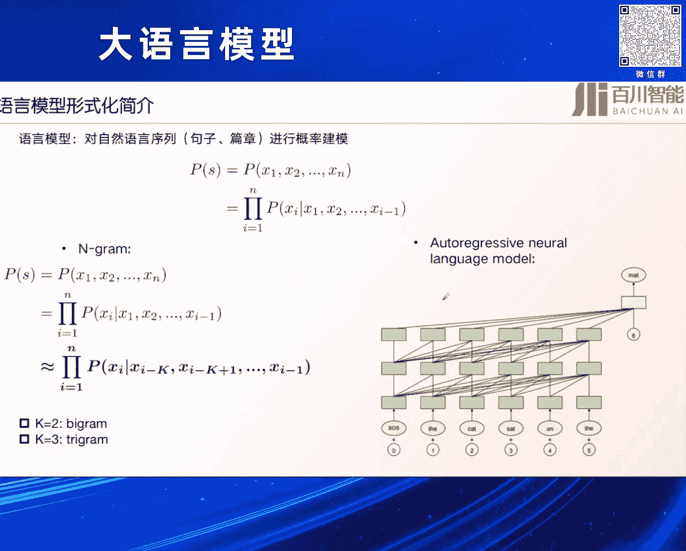
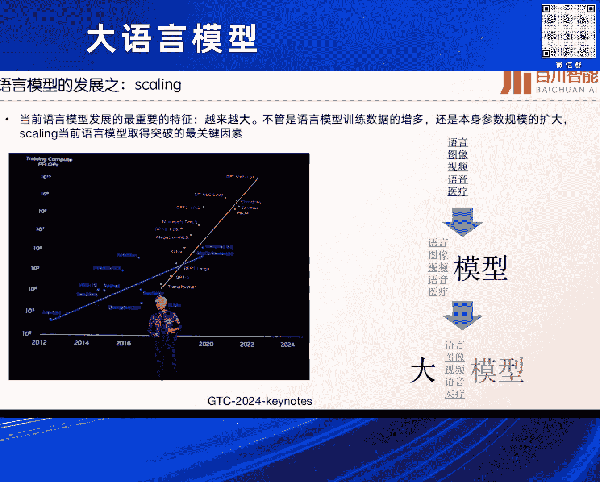
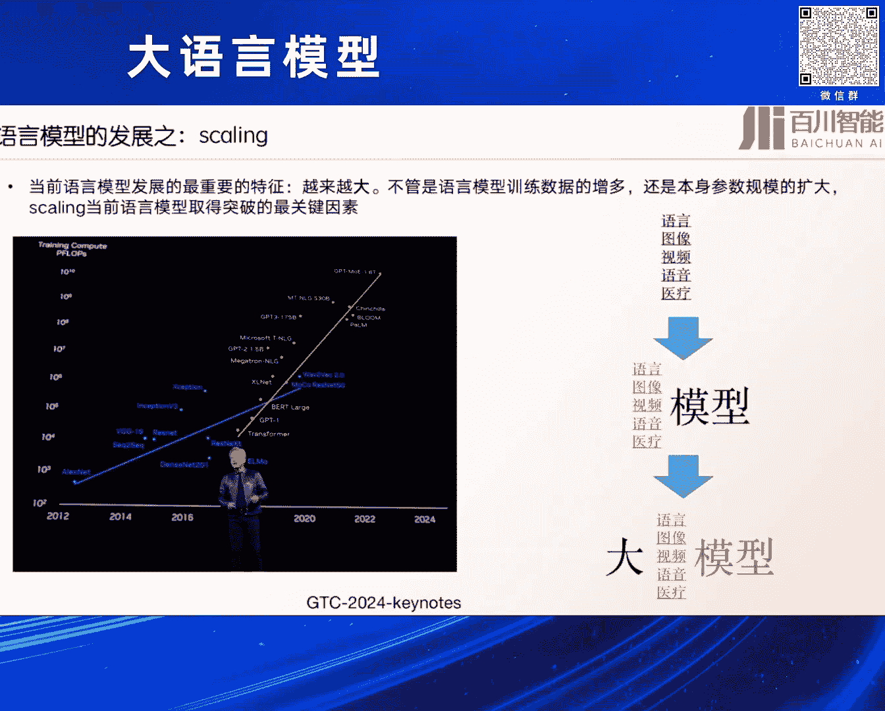
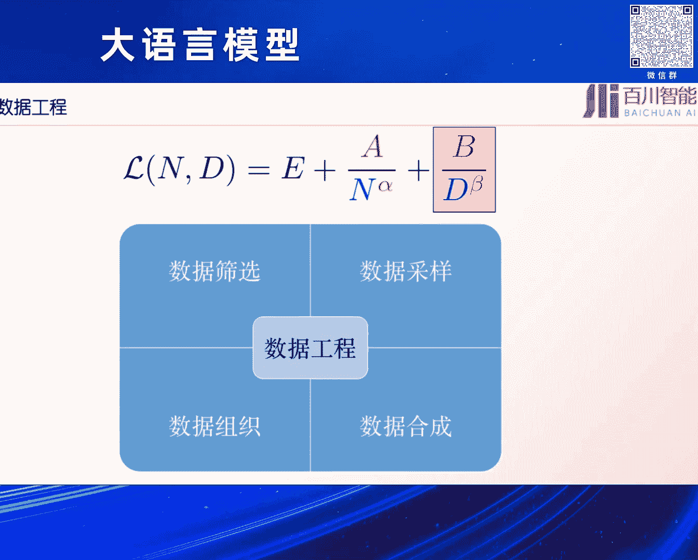
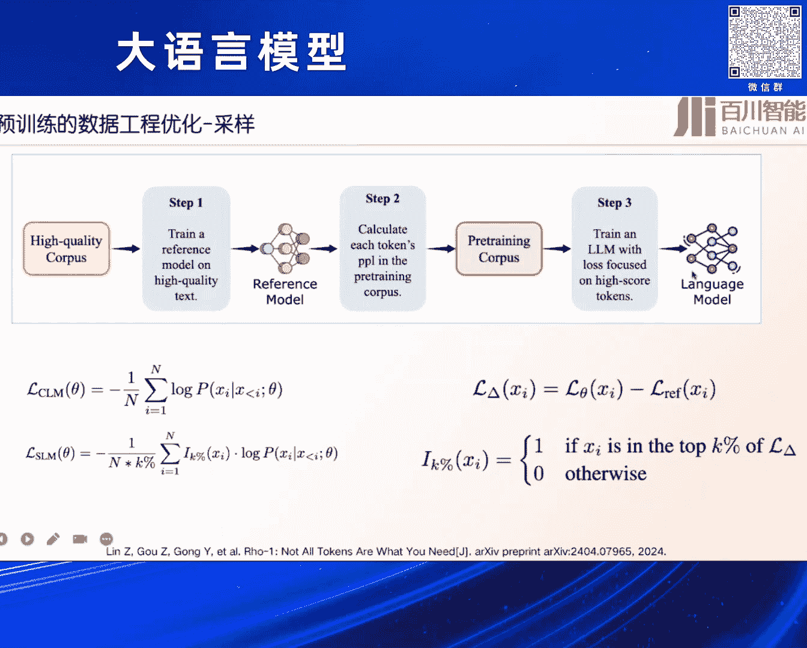

# 2024北京智源大会-大语言模型 - P6：大语言模型预训练的效率优化-王炳宁 - 智源社区 - BV1zE421N7UJ

是来自百川智能的王笔，然后今天给大家分享一下，我们在那个大预言语言，大语言预训练的一个模型上的一个效率，优化上的一些一些探索，可能今天主要聊的是一些已经有的一些工作，包括我们的一些思考呃。

而且今天可能我这边主要给大家讲的都是一些，可能跟本质是预训练相关的一些东西，可能像类似于下游的一些对齐，有些agent的这个可能不会涉及到对，首先是先介绍一下background吧，就是因为我们刚才。

其实前面几位讲者也都介绍到了，其实现在我们的大模型，已经进入到大模型时代了，然后他的一个比较显著的特征就是它大，然后大模型的提升能力的一个非常关键的方法，其实就是scaling law。

就不断扩展它的一个呃模型的大小，不断扩展它其中训练的数据的大小对，但实际我们发现其实在真正训练中，其实本身我们除了说无脑，就是无限制的去扩展我们的参数，大小和数据的字，这个这个之外。

其实我们还有一个非常需要去做的事，就是我们怎么在单位时间内提升对我们的数据，比如我们的模型更好的一个一个压缩，就实现更好，就是单位时间内更高的一个智能，这可能是我们现在很多在做大语言模型。

不管是预训练还是这个反听令阶段，这种都在做的这样一个事情对，所以其实我们今天就主要给大家介绍一下，这些一切的一个方法，但可能有些局限啊，因为可能我们就讲了，只是一些理训练的一个方案，而且是主要关不呃。

当前的一些一些短暂的可能的一些结论，可能对对长期long term这些结论是不是有效，可能还是有些疑问了对，所以其实可能从几个方面来去做这个，来去进行一个分享对，首先是为什么要做这样一个优化。

其实语言模型我这里就简单介绍一下，它其实说白了就是语言模型，就是language model，就是对这个language进行建模，这样的一个方法，对它其实核心就是你根根据一个把一个句子的。

一个概率进行一个一个统计建模，然后由前面的一些句子，得到下面一个词单词的这样的一个概率，就是next token prediction，这是一个非常经典的这样的一个，一个一个预测的一个方案。

但其实我们知道现在大这有传统的，其实语言模型不是个新的事情，它传那方法有类似这种n gram，就靠之前前面几种几个单词，然后来预测下一个单词对，然后当然现在其实我们知道大模型来的时候，之后。

基本上现在都会都会落脚到这种所谓的auto，aggressive这种model里，也就是说我们如何根据前面呃，前面若干个单词直接去后预测后面这个单词，这样的一套范式也依靠神经网络啊。

确实是网络有点问题，那我就稍微讲的把一些重点讲讲的慢一些哈，然后可能这个现在能听清楚了吧，赵老师，哦好的好的，那我继续，然后可能现在的一个语言模型，发展的一个比较重要的特征就是它越来越大。

就是不管语言模型训练的数据，还是说本身的参数规模，Scalling，其实就是我们现在基本上取得所谓的，现在AGI通往AGI之路上，可能是最重要的一个突破的一个关键因素。

然后右边其实是左边是一个那个英伟达。

他们那个黄仁军，他在那个GDC2024上面，keynote可以看看到，最近几年，其实对AI发展其实最重要的一个一个变化，就是我们的一个模型的参数量，还有它训练的总共的一个flops，是非常非常夸张的。

在提升的，从之前很少的一个transformer g p T1，到现在可能GP4，它可能是一个万亿的这样一个MOE了，然后对于我们整个发展历程来看，我们可以看到，我们之前在很早一段时间。

在做这种各种各样的语言医疗，这种各种各样的feature engineering的模型，到后面可能是2010年之后，随着深度学习的发展，我们都在研究怎么把这些目这些不同的任务，用一个模型给做起来。

都是在研究一些模型，但其实现在特别是202022年之后，我们发现了scaling lash是一个非常重要的因素，现在大家都在做所谓的就是大，我们怎么把这个模型做大，然后把所有这些东西进行一个统一对。

所以其实这是一个我们认为是现大圆妈，现模型发展的最重要的一个原理，就是scaling law，其实scaling law，如果是我们把它形式化的表达一下的话，它可能就是一个非常简单的。

就是对loss的一个进行了一个预测，其实我们刚才讲的语言模型，其实就是对一个句子的的概率进行建模，然后呢，我们那个概率一个loss可以分为1reduce bloss，还有一个reduce bloss。

就是说诶我一个本身一个模型，对我们整个的数据进行一个建模，其实达到了，就是我要让在这些数据上得到，我最最小的一个预测的一个损失，然后当然了，我不管是模型有多大，还是我的数据有多少。

我最后肯定是有一个下界的，就是这个L的这样的一个无穷大的这样的一个，他其实就是说我有一个下界，就是我无无无论怎么去优化我的模型和数据，它其实会有一个夏季的一个损失。

但除了这个下界之外的是reduce blows，就是我最后需要去做的这样的，不管是我通过过大量的把参数扩大，还是把我的数据量训练的时间更长，都可以让这个loss变得更低，所以其实这就是skin law。

一个基本的一个简单的表示吧，当然其实对于scaling law，其实现在有很多不同的一种表达的方法，比如说有左边的最开始就是OpenAI，他们发的一个所谓的这种，基本上跟三个指标跟数据量。

跟我的训练资源，跟我的参数量相关的几个指标的，而且他他们通过训练不同的模型，可以把这个skin law给拟合出来，当然还有一个比较经典的就是CHENCHALT，他们的一个still in law。

他是把它当做也是一个所谓的power law，就是一个指数函数的一个拟合方式，E其实就刚才上面的ERISTENCE扫，就是不可去降低的，然后ABND其实都是一些超参数，我们可以进行去呃。

阿尔法贝塔都是可以去进行优化的，N和D就是我们的模型的参数量，和我们的数据量对，大概就是这样的一个情况，所以其实我们今天其其实在优化了很多，很多的动作，都是在，不管是我们模型结构的优化还是什么样优化。

其实都在去优化这样的一个scanning log，如何让我们的loss变得更低，所以其实你看现在我们很多情况下，不同的模型设计不同的训练方案，刚才其实那个呃曾老师其实也在介绍了。

就mini c ham他们在做了很多的这种优化，其实都是为了让我们这个string la去更好的去，你去做做优化，我们这个scaling law，让我们的这些参数去发生一些变化对，然后呢。

当然在提到我们scn law是我们今天要做报告，就是最根本的一个原理，或者其实就是大模型的一个最基本的原理，但是我们要首先要假设Scout是存在的，但对它的估计可能是非常脆弱和可能粗略的。

其实最近有一篇文章，就我们大家都知道，skin law肯定本身这个公式是对的，但对它的拟合，比如我真要把这个阿尔法贝塔A和B拟合出来，其实是个非常困难的事情，然后这篇工作大家回头可以去看一下。

其实他们就发现，其实拟合不管是现在请求大的，还是市面上基本上大部分的工作，对这个数据的拟合，对这个超参数的拟合其实是很弱的，你你需要可能非常非常多的这种参数样本。

才能把这个给这个skin lag给拟合出来，对所以这个是skin lag，可能是它本身是正确，但是要把它真正的拟合出来，可能是有一些困难和难点对，然后他但是呢如果我们拟合错了，就会发现。

其实很会对我们的结果和预估，会造成很大的影响，我举个简单的例子，对于这个scaling law这个本身来说，就是我们刚才讲的这个CHANGA，就是这个是就是不可去减小了这个loss。

然后后面两项一个是参数，这个D是数据量，然后这里去估计A和B阿尔法贝塔，然后我们其实对这个模型结构优化，其实可能就会把这个阿尔法进行优化，因为N就是参数嘛对吧，或者跟模型相关的。

然后我们假设能把这个从0。34，优化到0。35，就这个越大了，我们肯定是让这个loss可能变得更小，但其实你知道我们可以看到，如果你对这个估计估计差一点，其实对整个loss来说。

它是一个非常非常大的一个差距，所以说其实呃这个想讲的就是，skin lop本身一定是正确的，但对他的估计可能就是差之一点一点，人谬以千里，对可能是一个非常一个一个多的，所以其实我们今天现在很多的。

不管是我们的做法，其实还是说我们的很多的一个所谓的经验呃，其实就是在不断的增大模型的尺寸，提升我们的这个N就可以让我们模型变得更好，还有就是说像我们知道拉玛三，用了更多的是15T的数据去训练它。

就是用更多的这个data去来降低这个loss，但其实还有另外一个方面，除了这种比较原始吧，或者我们认为是可能是比较暴力的方法，其实我们还有就是我们上面标出来的，红色的部分，我们可以设计更好的模型结构。

比如像分词器啊，或者是类似各种各样的这种tension啊，优化结构去提升这个阿尔法或者降低A，然后可能是我们可以用更好的数据，比如说提升数据的质量配比，然后提升BB对，就提升去贝塔。

或者说降低被降低这个B，但也可以，最后就跟刚才那个WSD那种方法一样，就是我们用更好的训练技巧，然后同时去优化我的这个参数和这个D，所以所以它这其实是一个去，在这个固定的这个参数。

或者或在这我们固定的这个lo下，去优化这几个结构的这样的一个过程对，所以其实今天讲的主要就是这几块，一个是从数据，然后模型结构的设计，还有训练方法的优化，去来去对这几个进行一个统一的。

一个优化的一个过程，对首先是一个效率的优化，其实刚才第一个呃，这这赫迪老师其实也讲了，现在有很多这种效率优化的方法，包括包括linear attention，包括很多的，它其实核心就是想解决本身。

transformer里面最核心的这个框架attention，它里面的一个问题，比如说像最左边，就是我们标准的这样的一个attention，它的一个结构可以看到它是一个全连接的，就是说你有更长的话。

它就是下三角一个矩阵嘛，所以所以它其实计算的一个复杂度是N方的，那所以说这个N方当你的长度很长的时候，就会有很大的问题，所以后面有很多的工作都是对它进行一个降低，比如说把这个N方的复杂度降低到更小的。

比如说第一个常数项这样的一个工作，比如像sparse transformer这样，我们知道最近有很多的工作，包括five，但他也用了，包括刚刚才介绍到的block bus这种方法，但核心其实相相将于。

我们如何在这方面，把这个N方的这样的一个效率进行一个提升，对当然最近还有一些很多的这种去提升，不管是他的目标是长文本，还是说他就是提升这个本身transformer，建模能力的。

他其实就是去来提提升这个优化这个attention，它这个结构比如说像DTH，就是像streaming r m里面提升的，这提出了这个事，就是attention think，因为他也是发现。

现在的模型好像对第一列的这种attention，关注的非常多，也就是说不管你后面是什么样的词，它其实对第一个单词或头部几个单词，关注的非常多，所以由这发展出来一个，对这对attention进行一个改造。

提出了一个非常不错的一个效果，叫streaming2M，然后最后效果还是还是挺好的，当然除了这个我们讲了attention这个优化之外，就有很多的工作哈，还有一些其实就对本身只整个这个模模型结构。

进行一个优化的，比如说现在比较新的，可能大家也看到，前两天就是经常出来的叫MANA或者java，这个就是它其实本质上是一个，类似于这种循环的神经网络，其实我们知道循环神经网络。

就是在现在的大语言模型时代，它其实被忽略了，因为可能在前几年最开始，比如10年左右，其实大人家做了对于文本处理，都是用循环神经网络，因为它本身有这种递归的这种性质，你看文本也是从左到右一个词一个词的说。

其实循环神经网络也是这样，它可以一段不就是递归的进行建模，把之前的信息引入到后面的信息，所以本身以结构来看，它是一个非常好的，只不过可能transformer出来之后，他靠他的更好的性质。

然后得到了很好，但其实现在RN现在反而在这个大模型时代，被淡忘了，但最近大家发现了这种RN的这种效果，可能是嗯，可能它的一个效率上是会有更好的，相比于transformer，所以大家很多人包括MANA。

很多RWMKTV都在做这样的一个优化，首先先讲一下，为什么之前的很多模型结构没办法代替，Transformer，就是为什么像LSTM这种方法没办法替代，其实可能也不是说。

但它的嗯它的什么就是效果差或者什么样，它核心的一个缺陷是它的一个scaling property，就说如果我把我的这个模型，参数变得更大了之后，transformer是可以很好的进行一个扩展的。

但是像LSTM或者传统类似于这种convolution，这种方法，它也有在用文本上做CONOLUTION，他可能很难去做扩展，比如说两层三层，四层或者更多的，它其实可能效果就已经达到瓶颈了。

这可能就是LSTM，或者其他的这些很多宣传水平，它的一个非常大的一个一个痛点吧，就是他很难做scaling，这个当然是很早之前的一些工作了，就对研究，不管是ALBERT这种很多其他的工作的方法上。

对比这种呃他的SCALLING的性质，可以发现其实还是transformer是scale最好的，当然现在有一种新的结构RWKV，这也可能是在大模型时代出的一种，RN的一种形式。

大家就发现它其实还是可以做到很好的一个，spelling的性质的，但它本质其实也是一种RN的，这种这样的一个结构，对或它其实本质叫state state space model，就空间状态机嘛。

但核心还是RN的一种形式呃，但但他的一个做法其实也以，如果你以图的形式可以看的话，它其实就是把之前的一些信息引入到当前信息，并且有一个类似于这种time miss的一个方法，就可以引入了一个持续信息。

但它的一个建模是一个不会像R那个，就是像transformer这种平方向的一个增长，就是会把它固定在一个空间时态里面对，所以这个可能在现在里面如果做长文本处理，做时效性可就做实时。

就是效率优化是很好的一个结构对，然后他当然他也做了很多SCALLING的，这样的一个做法，可以看到，我们发现这RWMKV在大模型时代，也是会有一个不错的一个SCALLING的一个性质。

然后当然现在也有很新的吧，像曼巴呀什么，它都是基于这种SSMRN的依靠递归机制，将信息进行压缩在一个状态里面，然后不断的进行递归更新，它其实都是依靠这种，其实跟RN的思想是非常像。

就不要让它是平方向的增长这样的一个思路，其实第二种还有一种叫做memory based的，就是将信息依靠一个固定的婚比，不管是内部还是外部的一个memory，已经存储减少历史的信息。

然后防止它是一种N方的一个一个增长，这样其实就是一种相当于，我不管是你上下面有多长，我都把你固定到一个一个固定的一个空间里面，所以这个其实也是一种很多方法，都在做这样的一个优化。

但其实这个不管是结构优化还是attention优化，其实我们都会发现，现在的大语言模型都会存在一个问题，就是非常冗余，我们知道我们现在不管是transformer，还是一个LSTM还是各种各样的方法。

其实它都是一个一个语言模型，它都是一个深度网络嘛，神经网络，但其实我们这也是我们百川，前段时间刚发现的一个问题，就是现在的大语言模型可能非常非常容易，这个例子我们举左边的这个图。

就是它是一个就是拉马拉马尔的一个，7B的一个模型，当我们直接就是非常简单的，把模型最后面的一些层把它直接砍掉，然后让它输输出，意思就是你最后几层就不用了，直接让比如说他总共有30层的话，32层的话。

你直接可能把最后四层全部砍掉，它基本上在MMU或的效果，基本上没有什么影响，所以这个从这个角度来看嗯，现在就可以发现嗯，现在的模型其实非常冗余的，所以我们提了一个这样一个一个方法吧。

但是其实从这另外一个角度就是模拟模型冗余，它可能是现在大众优化的一个一个痛点，或者一个必然点，依靠，类似于之前有一个叫深度学习，里面有个叫做叫lottery ticket hypothesis。

就是叫彩票模型假说，就是只有模型够大之后，你才能找到一个比较好，小的空间来去作为一个本征的表示，但如果找到这个本征空间是需要很复杂的，所以其实如果后面的模型优化，我认为可能是需要去找到这个。

比较好的本质空间，然后来降低这样大模型的训练的一个代价，然后当然前前面提到了一个效率的结构，上面的方法，其实还有一个方法上的一个一个一个提升，这方面的工作就其实比较多了。

其实我们本身看本身就是这个大模型发展，或者本身这个原模型发展，它就开始，我们之前是没有预训练和强化，只有一个有限度微调，就是你有一个数据想一个model就可以了，但后面发展到像贝尔时代来临之后。

就有预训练这样的一个事情，你可以先预训练完之后再进行有限度微调，但其实现在就更多了，就是我们如果把它apply到真实的场景里面，我们可能还需要让他去跟这个environment，进行交互。

所以从范式来说，这个整个我们训练或者大大模型发展的，这个范式，就是在不断的进行一个效率提升的一个过程，开始这个可能是很低效，到后面他这几个有预训练之后，有这个人类反馈之后。

他可能是一个效率很高的一个事情，对然后提到这个效率，训练效率，当然我这里面有很多很多了，就是我们怎么去训练好，出来一个好模型，我们结构已经确定了，data已经确定了，怎么好。

其实第一个就要提到的是我们优化器，现在其实大家谈这个很少了哈，大家基本上默认的基本上就是ADAMM，或者加一个with it decay这样一个方法，但实际上对这个事情研究，几乎现在基已已经没有了吧。

但其实在传统里面其实对这个研究是非常多的，比如说像传统的里面，他们就认为可能在阿达姆，他对SGD它的一个优化，它对比它的有些认为ADAMM是比SGD要好的，但有些人认为ADAMM是没有SGD。

比如像我记得他们在图像里面，比如说你MEGNET，如果你要想调一个比较好的模型，你最后基本上都用SG来做最后的一个优化，但其实现在的模型我们知道，其实在语言模型里面啊，DM可能更好。

所以其实对优化器这个事情来说，其实没有一个定论，到底应该是什么，是一个比较好的这样的一个模型对，所以其实这个是，我们现在可能不是说有一个定定论，说阿达姆就已经完全是解决了这个问题。

然后但是alarm可以从另外一个一个视角来看，它为什么会比SDD，在现在大比原模型时代可能更好，原因就是因为它引入了一个所谓的二阶的这样，一个优化，我们知道其实我们如果对泰勒展开的话。

可能就是一个一个时刻，它的一个一阶加上一个二阶的信息，加上后面一些冗余项，可能SG它的问题就是他这个二阶，我们把它称为一个sharpness，它的一个问题就是它的二阶太sharp了。

就说他的那个抖动会特别大，然后ADAMM还一个好处，就是会他会把这个二阶的sharp变得更小，所以说这是一个它的一个优化的一个，一个一个方法，这也是为什么它可能在大圆模型去搜参的，这个过程中。

取得更好的优势的一个一个关键的一个因素吧，对所以其实现在很多的方法，不管是在记忆翻译还是真实在就是auto progressive，这种自回归的预测里面，都可以发现。

ADAMM确实是要比这个就是SGD要好，非常非常多的，然后其实这个里面ADDUM现在当然研究的少了，但但其实我们发现其实在大圆模型时代，应该也不能把它忘忘忘略掉，因为可能SGD这个。

咱们知道他之所以没有阿达姆表扬好，其实有很多工作发现，比如说这个黄色是长尾的，高频的，就哎就所谓低频吧，然后蓝色深色的就是高频的，这些，可以看到阿dam，可以把高频和低频都进行一个很好的优化。

越下降就是它的loss，但是SGD可能低频的东西，它就处理的非常差了，所以从这个角度来看，我们认为可能还是要因就阿达姆，他可能对低频的这种优势是非常非常大的测试，如果是我们大语言模型时代有很多。

比如说小数民族语言，或者说很低频的一些pattern，它可能有用RARM，可以很好的去对它进行一个学习，对，然后当然二阶的一个优化就优处优势，我们就不用讲了嘛，他肯定是比一阶的好，不管是从它的找了这个。

最后找到极小值点的一个速度来说的话，它都是会比纯一阶的这种啊SGD要好很多的，最近其实有一些在大语言模型时代，对这个优化器进行优化的一个方法，比如像索菲亚，它其实就是对这个优化器进行了一些。

比如二阶的一些近似，然后达到了非常不错的一个效果，然后可以看到他具其实就是一个效率源，就同等时，他能去取得比更快的一个速度的一个加速，对，然后当然其实除了这个之外，其实最后一个就是跟训练方法了。

就是超参数，刚才其实上面前前面一个就是面壁的这个，同一个一个一个一个一个同事，其实也已经介绍到了，其实很多超三是我们现在需要去调了，你看不同的模型有很多不同的超参数。

像gp three跟lama two，他们有很多很多参数，好像大家都是不太一样的，有长度啊，超learning rate，还有by size，所以其实有很多这种方法，像milk这种呃。

就是叫tensor gram，这个是也是呃，现在他们之前有很多去搜参的一种方法，就是我如何去初始化这样的一个模型，让他最后不管是什么学习方法，在这个模型上人都能去起作用。

所以其实他们就提了一个依靠小模型的初始化，通过比它其实核心就是说我那些MMP层，我的输入和输出应该以什么方法来进行初始化，然后最后可以发现通过这种初始化方法，它能达到一个非常好的一个极小值。

这样的一个效果对，当然跟这个也是他们最后实验中和最后理论中，都发现，确实依靠这种非常好的初始化和超参数的调节，就可以达到同等的时间内，可以达到最好的这样的一个loss的一个水平。

这样其实就在同样时间内去降低，就提升那个死亡了，当然除了这个之外，还有一些嗯，By side learn rate，这个当然也是面壁，刚才那个mini c p m他们团队的工作，刚才这个曾已已经介绍过。

就是我他如何去找到这样的一个better side，和这个learning rate的一个关系，让他最后的一个下游的表现是更好的，通过这样不断的做scn lag，然后去拟合出来这样的曲线。

找到这样的一个一个关系对，所以其实它这几里面，其实还是会有一些搜索的过程，但其实现在可能大家认为这个里面，可能它没有绝对的关系，可能反而是他这种策略，就是这种所谓的learn it it。

它可能在一个很大的区间内，都可以达到一个很好的一个优优势，他不是说我必须得到设到一个一个多，具体的值，可能是在一个空，一个一个范围内都可以达到不错的一个效果，对，然后当然刚才这个就是SCALLING了。

也就是他的一个schedule，就是我其实对比那些超参数来说，这些本身训练的方案不是cosine learn read，还是说我的一阶段，二阶段这样的训练可能是更重要的。

所以现在有很多方法都是把它分为几阶段，我有什么warm up，有stable，然后有最后decay这样的一个阶段，这个可能是一个比较新的，而且可能是在大模型时代非常有用的。

这样一个一个schedule吧，对然后就总结一下，其实就是效率提升外，有很多就优化器呀，科学数据啊，还有一些不就是科学的超参数设置，还有学习方案，但可能要去都可以提升，我们刚才讲的这些。

在同样的单位时间内，降低我们这个呃训练的一个一个代价，但可能有一个问题，就是可能我下面也是也是也是要讲的，就是说呃，就是所有的方案其实都在一个，可能都是在小尺寸，或者说一个一定规模下调试得到。

而当尺寸变大之后，这个是不是能完全scale上去，或者这些它我们不能把它叫trick吧，它可能是一些一些empirical的东西，是不是能起到预期的作用，其实现在其实我我现在看到很多。

不管业界还是学工业界，其实都没有一个完全的一个定论对，所以这可能是一个风险，最后其实还有一些精度上的优化，比如说用FP8的训练啊，这肯定都是可以提升优势的，这个当然是一个GPU跟硬件相关的一个方法。

对基英伟达这几年也在不断优化，最近他们TH200经发展到非常好了，最后就讲一下，简单讲一下数据工程吧，其实数据工程就是和，也是刚才那个我记得是一个观众在问的，就说除了你说你改模型结构训练参数。

你是不是数据上能做些优化，能让最后同时同样训练，同样时间，能让最后效果很达的很好，其实确实是，我们现在其实数据工程也是一个非常好的，一个一个一个一个作作用，当然现在数据其实对它优化无非就是筛选采样。

还有一些合成的方法，包括一些组织的方法。

对今天简单介绍一下采样这个方法，其实采样是一个很重要的，我们数据你看这不同的模型，有不同的这种采样的方法，但实际上其实没有一个科学的方法，大家可能都是拍脑瓜启发式的，但其实最近就有一篇工作。

其实就是说我如何去确定性的依靠scaling law，就是我把这些不断的用小的方法拟合出来，大的这种东西呢，它其实就是把这个不同的领域的配比，然后进行一个科学的一个一个调配，先去训一个小模型。

然后训一个大模，最后然后把它拟合到一个大模型上，最后他去发现哎，可能我用更少的这样的一个数据量，就可以达到更好的perplexity，这个比一个，就是我找了一个这样好的一个采样的一个方法。

当然还有一些工作，是我通过这种细粒度的数据的采样，就它不是这种大领域的采样，而说我的token，我一句话可能有些很重要，有些不重要，通过这些token上的采样对它进行一个优秀优化。

这个里面应该是介绍对它，它应该叫做real1，它这种方法其实就是一个优化的一个过程，对，然后当然这个方法，它里面做了一个一个一个一一个方法，其实发现已经可以在很短的时间内，就可以训练出来一个很好的模型。

然后让他最后的下下游任务中，达到一个很理想的状态，得到了一个不错的结果，所以其实最近对这种采样的优化，其实大家发现也是非常非常重要，我们单位时间内提升很强的，这样的一个模型的效率对。

然后除了这个之外的话，最后就总结一下吧，因为时间关系，其实我们现在发现，其实我们所有的这种动作，不管是我们结构上的优化，还是我们数据上优化核心，就是我们要去优化这个scorning lots。

几里的这个几个参数，然后其实不管是数据的优化参数，它其实都在单位时间内，我们都想让这个东西降下来，但其实这个东西要涉及到最后一个，就因为这些所有的这引入了这种，不管是我们的trick还是技巧。

还是这些二阶三阶的很多东西，它可能本质都是人类所谓的叫inductive bias，就说我们人类想故意改变这种客观规律，而引入的，像让它加速的这种叫BIOS。

但其实可能是一个就richard so就sultan，他去在是他是一个是强化学习之父吧，他就想其实你纵观可能AI这些年的发展，它最重要一个原理就是你不要把人的鲜艳，那这个里面太多，最好是把它给排除掉。

这个就是所谓的一个better lesson，就是我们不要去把人引入更多人的BISS，就是让他以scale为第一性原理来做，所以可能未来的话，我可能我个人认为呃这些虽然重要，但可能最重要的事情。

还是把它无限制的去把它扩大，然后去做spelling up，这个可能涌现的出来的，是更更高级别的一个智能吧，对今天我的报告就到这。

