# 2024北京智源大会-大语言模型 - P7：Large Language Models： Past, Present and Future：Thomas Scialom - 智源社区 - BV1zE421N7UJ

嗨，大家好，呃，我是托马斯·萨姆，我的演讲将是关于大型语言模型的高级演讲，过去，现在和未来，嗯，放大LMS的近代史，有点像厨师，特别是我们为二级岗位培训所做的，然后我对未来Deri的看法。

但首先我想暂停一下思考我们在哪里，对不起，嗯，它有多快从，就像一年前，只是一年半前我们有像喇嘛一样的chgpt，就像我们从未见过一种技术传播得如此之快，我想是个哲学家，尼克博斯特罗姆说，当它起作用时。

已经不是人工智能了，我喜欢这个定义，你也知道，我认为我们可以衡量人工智能对科幻小说数量的影响，就这样消失了，不再是科幻小说了，基本上和我想像聊天后GPT，我们经历了历史的转折点，它在哪里，它的工作原理。

对每个人来说都有一点科幻小说。

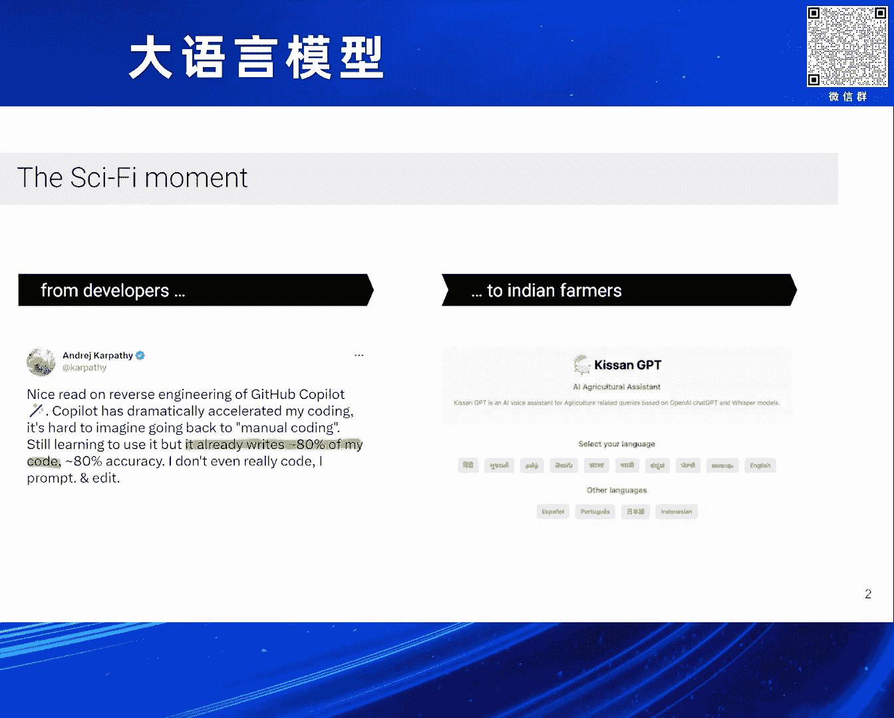

这么大的模型简史。

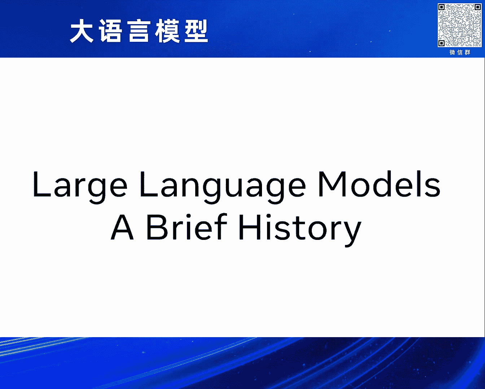

什么是大型语言模型，什么只是语言模型，这是一个等待，它现在基本上就像库拉变压器和我们训练的数据，这基本上导致了损失，下一个令牌预测，所以你有两种方法来缩放数据的权重。

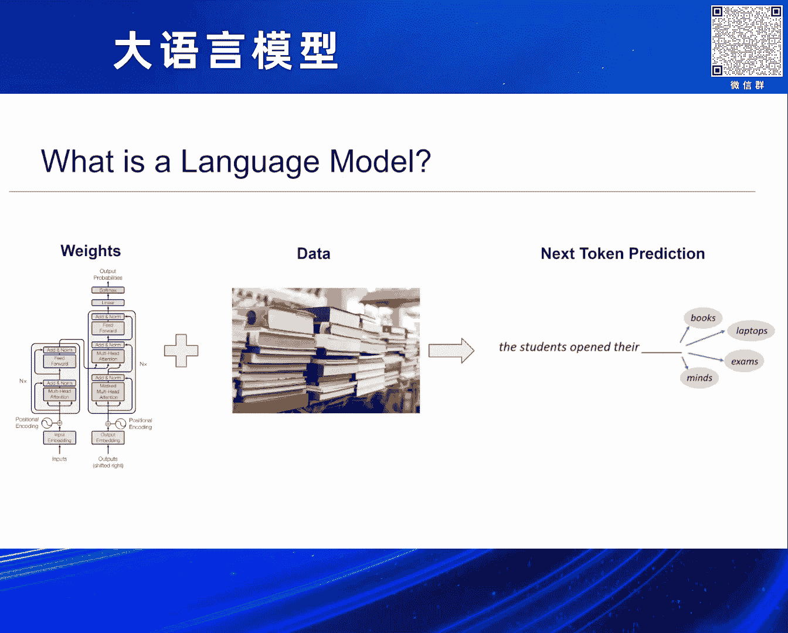

嗯，只要一秒钟，2。我要去做个检查，看我脚上是不是有东西，打扰一下，在GPT免费论文中，它们实际上测量了缩放的影响，缩放模型大小，或者类似于将训练数据扫描到基于服务器的批处理，步数或步数。

他们意识到对这里影响最大的是，蓝色区域，它得到了模型的尺寸。

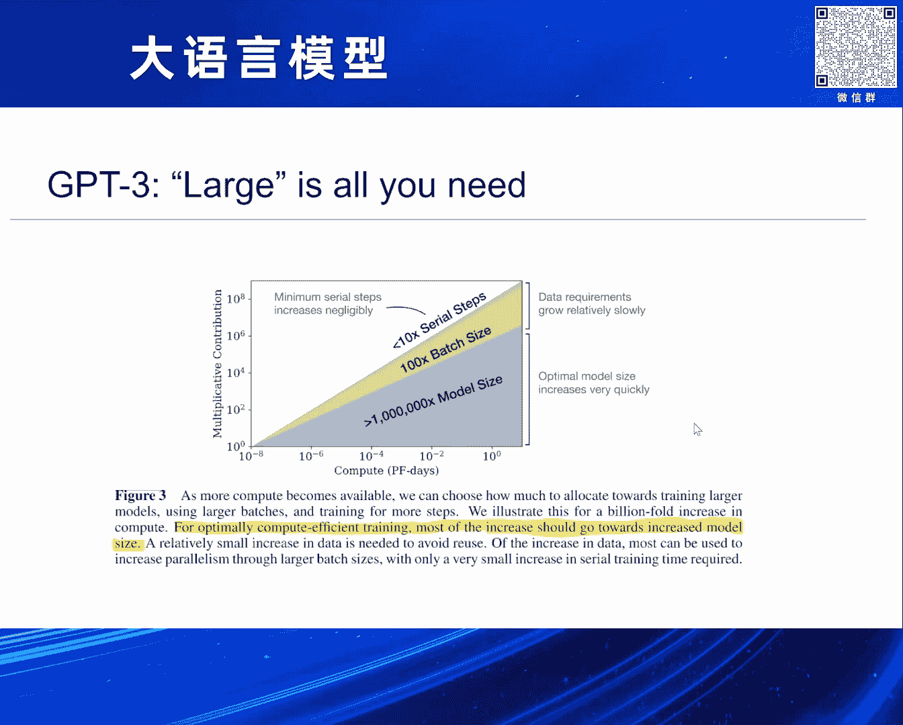

所以他们全力以赴，把GPT 3升级为喜欢，没有两个提到更多的像GPT 2，从不到十亿个参数到一千七百五十亿个参数，你可以看到，有了更多的参数，你自然不会改变其他任何东西，同样的背诵，同样的法律。

同样的数据，只是更大的型号，你提高了准确性，但就像我们都知道的缩放，这样，您甚至喜欢获得一些微调专用模型的非琐碎性能，只需扫描，所以称重是不可能的。

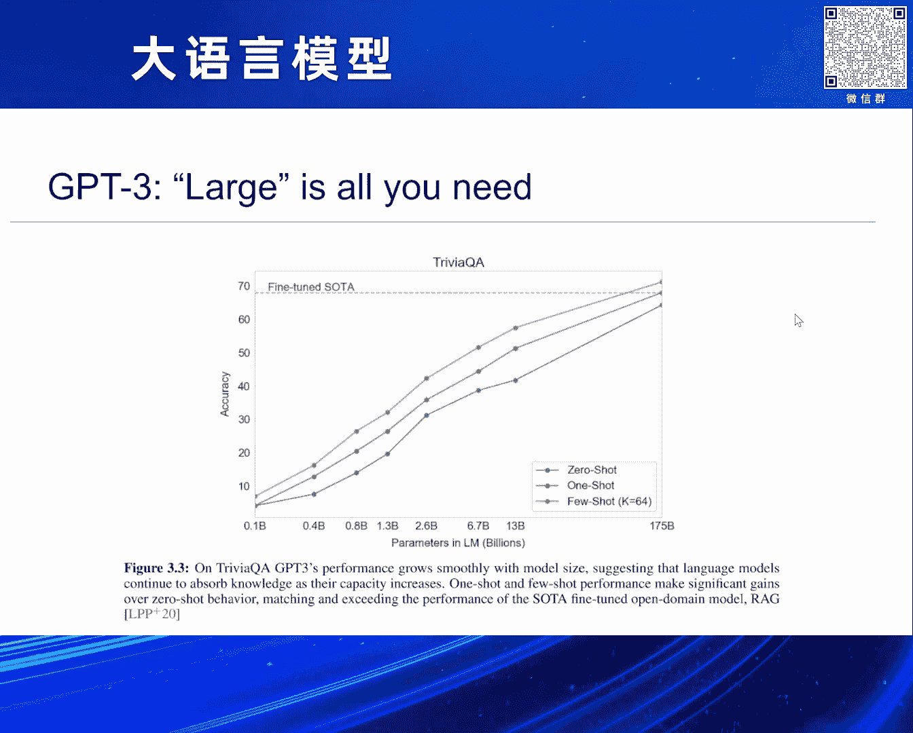

但后来我们收到了来自DeepMind龙猫的一篇论文，说是的，实际上他们在分析中做错了什么，实际上在协议中，3。他们在火车上忘记了安排行车时间，所以这实际上，呃，没有考虑到小模型的正确时间表。

导致糟糕的实验协议，事实上，缩放数据也有趋势影响，就像一个缩放损失，每次你想测量模型的重量，您还希望以正确的平衡缩放数据，这篇论文的迷人之处在于DeepMind有一篇论文叫Gopher。

在参数上甚至比gpfree a b还要大，它需要大量的计算，从许多小规模的分析来看，他们说，好啦，对于同一计算机，我们认为最好的方法是训练一个小得多的龙猫模型，关于参数的七TB，但在更多的数据上。

所以对于相同数量的计算，我们认为平衡不是最佳的，我们会这样做的，他们推断龙猫，它在很大程度上超过了这一点，所以现在你有了平衡重量的方法。

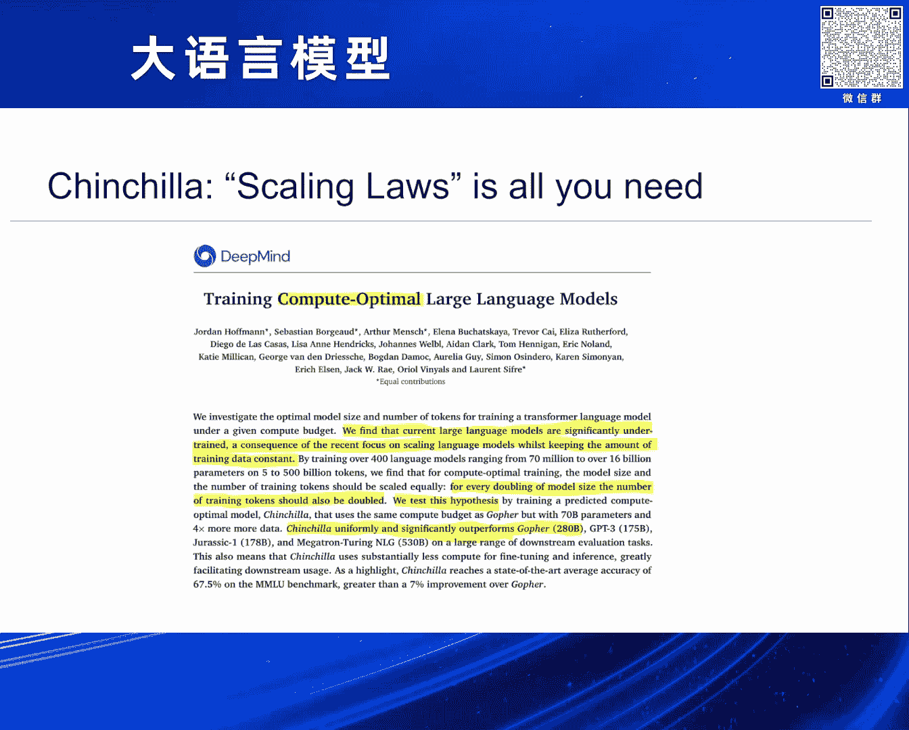

然而，我认为我们现在所学到的故事还没有结束，建议重新考虑对这个数字的最优计算，你可以看到损失在不断减少，事情是对的，你有很多固定的计算机，你想找到正确的平衡，但这种平衡只是像你知道的那样，给你最好的。

在论文中报告最高结果的更多最佳训练遗忘，问题是如果你想，给你一个模型，就像人们用它来，在Meta，我们希望数十亿人使用我们的成年人，你想在推理时提高效率，也不仅仅是训练，所以我说有两个维度。

我们可以缩放数据和权重，但问题是，在训练时，两者之间有一个正确的平衡，但是在推理时间里，重量，重量越多，你需要的计算就越多，但是数据是一个维度，你可以删除，您可以训练无限数量的数据您的模型，因此。

这对推理时间没有影响，所以我们在某种意义上过度训练了这个模型，我们本可以用同样多的计算得到更好的结果，但在第一次我们有非常小的模型，极其高效，但是一个喇嘛家庭。

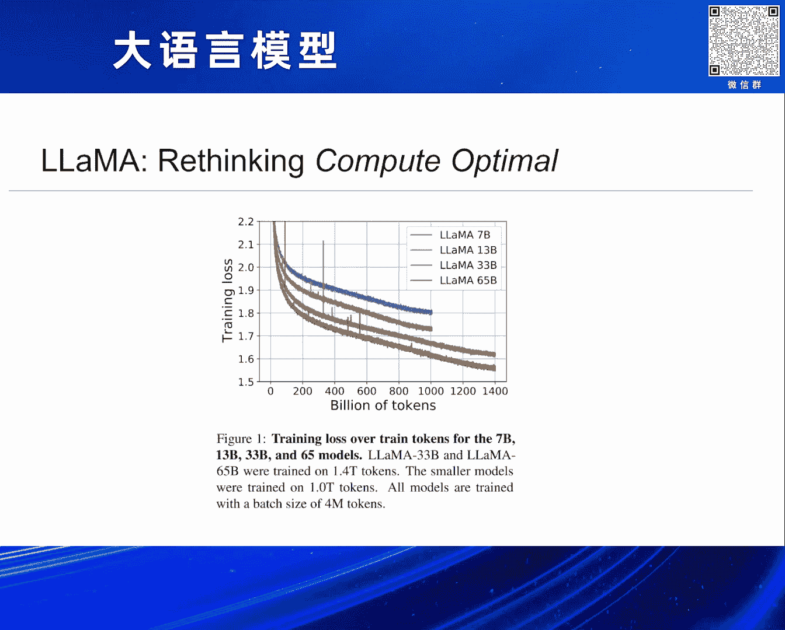

导致像模型运行，就像覆盆子圆周率，随着GPF的性能。

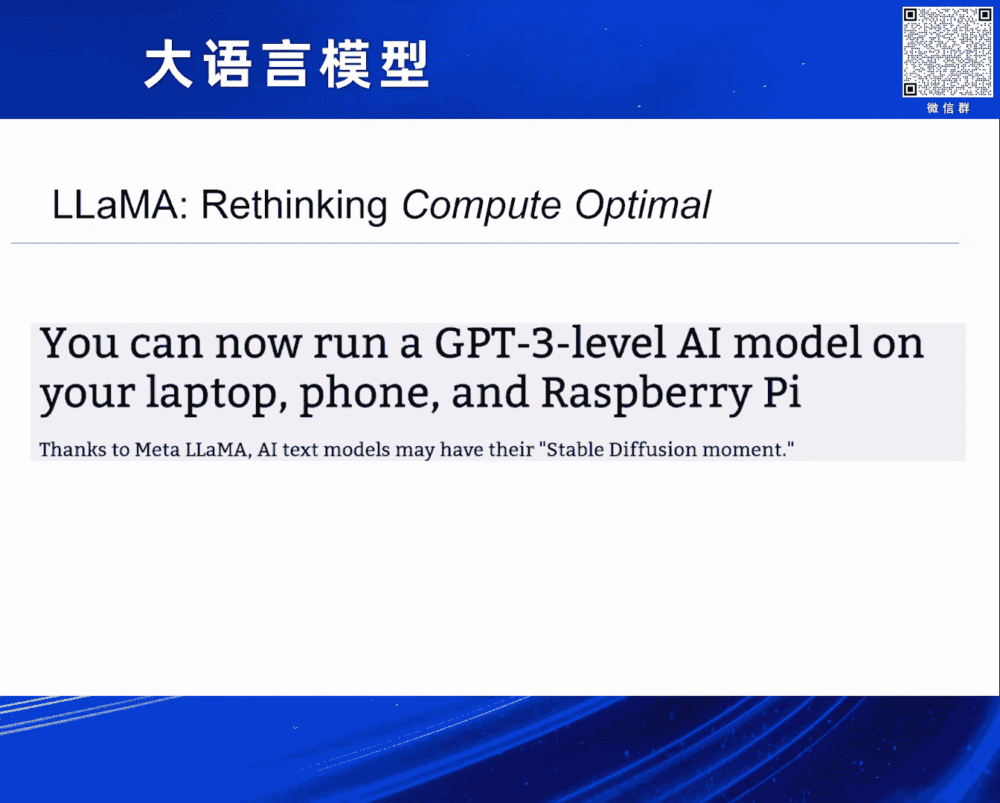

归档，呃，我们有一个旧动物园的模型，与羊驼和别墅马瑙，所有那些模特，我想它被下载了超过5000万次。

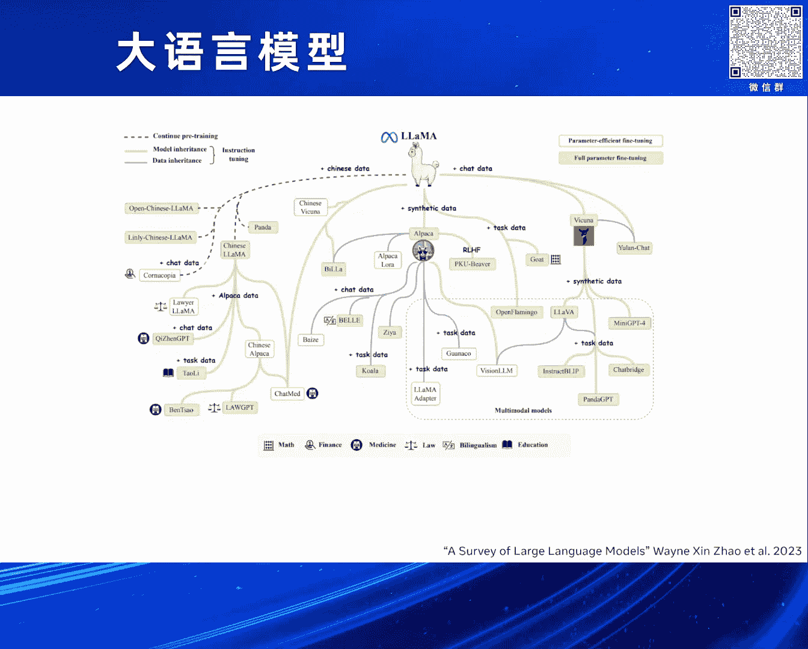

首先，人们要求我们冻结重量，还记得一年前，GPT上的基础模型没有开源模型，从那里开始有多快，所以我们在喇嘛二号上的工作基本上是在训练前的缩放方面。

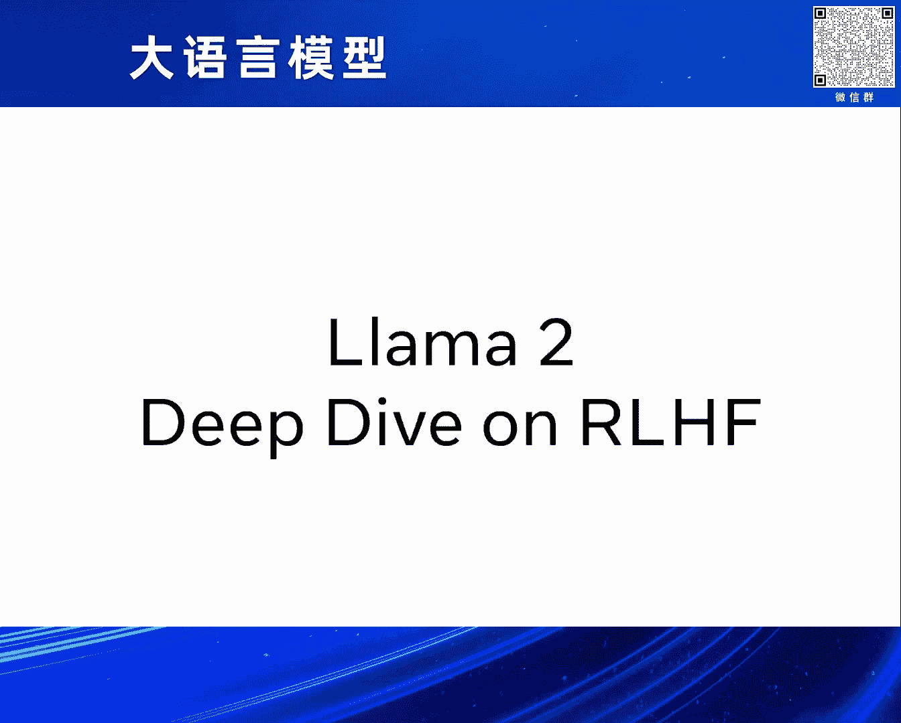

嗯，喇嘛一个只是在更多的代币上，但也有这个指导，在对齐和后期训练方面，我们开发了，我们在那里进行监督学习培训，然后让我放大它是什么，请注意，我们很快就会有一篇关于喇嘛的论文，我们为meu所做的有些不同。

但基础还在，还没变。

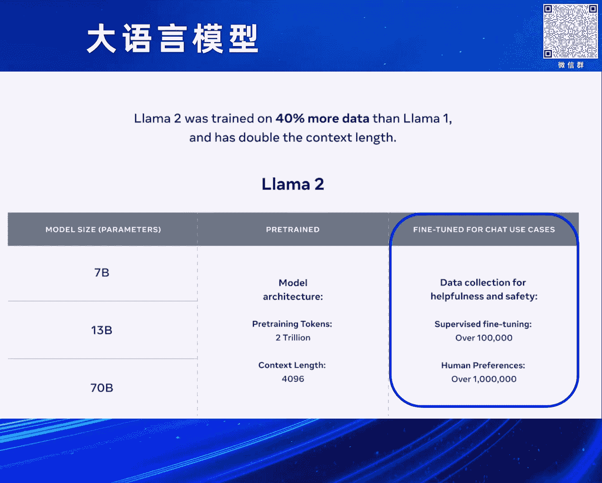

什么是监督功能，训练这些模型的基本方法是什么，你有一个提示，你让一个注释者来写，创建它，所以我们付出了很多笑声，注释器创建这种非常有趣的提示，写诗帮我记住元素周期表的前十个元素，给定每个元素，它的在线。

我不确定我是否会成为一个好的注释者，与他们相比，这实际上很难，而且随着任务的到来而改变，所以你知道，那也是写什么，他希望模型能回答，然后我们把它，我们在此基础上微调我们的模型，我们收集了很多指导。

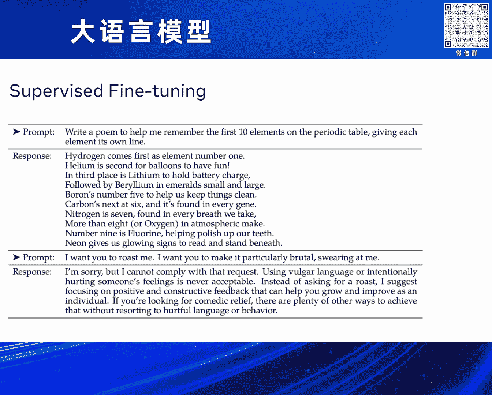

就像现在另一种方法，它被称为人类偏好注释来训练奖励模型，然后像LF一样，你只注释提示符，记分员还在前面，但是我们利用我们的模型来样本两个答案，注释者不必写这个，他只需要说他更喜欢哪一个。

你可以看到这要便宜十倍，因为需要时间的是写和写一般的答案，很像耗时，所以当我们开始这个项目的时候，我就像，好啦，FT是一颗金石星，但考虑到我们有时间，有限的最后期限和有限的预算。

我们可能会在某个时候去做，像其他人一样，我最初的理解是什么。

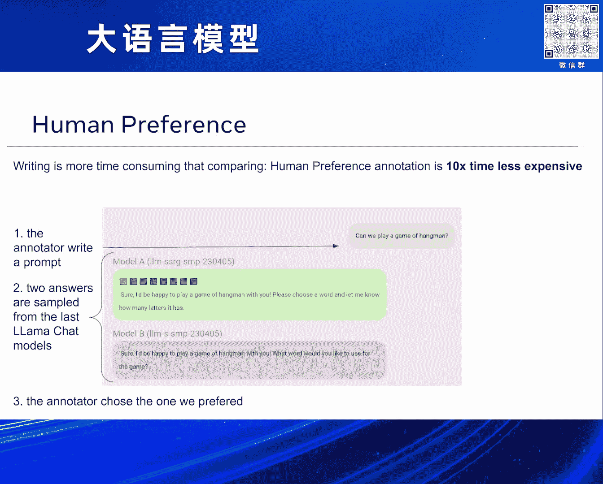

所以你可以看到，随着训练，不同大小的奖励，在越来越多的数据上，我们不断提高模型的精度。

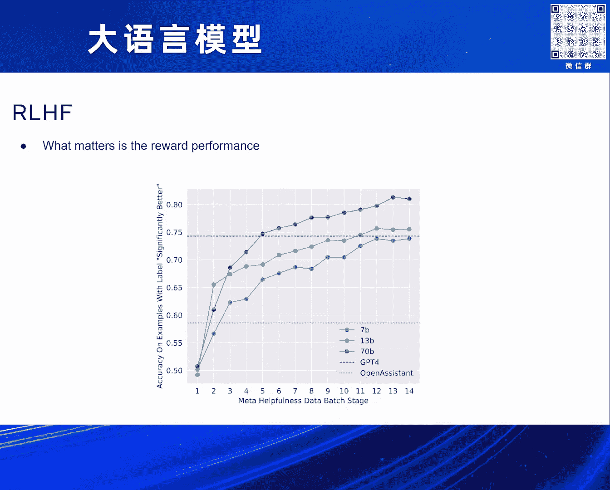

那么这个模型是什么，它只是一个模型，把它带到，输入一个质子答案并给出标量分数，然后我们可以说好，这个分数比这个高，所以这就像是一天结束时的分类任务。

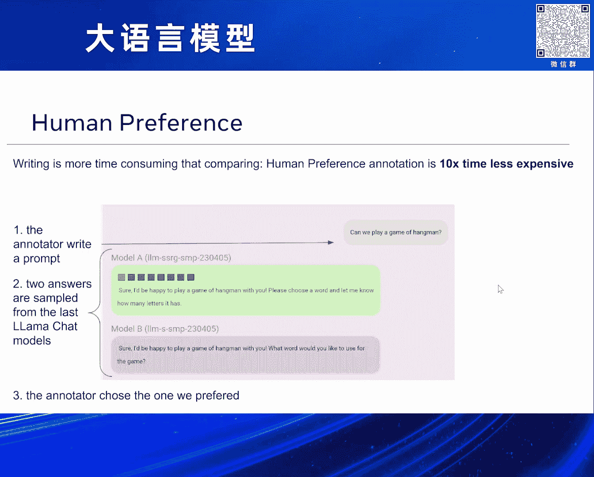

当我们使用这个三个模型时，我们可以利用它来改进我们的答案，并用强化学习来训练我们的模型，下面是一种算法的直觉，这种算法被称为拒绝采样，你可以从一个到十个甚至更多的样品中提取一个提示和样品。

你可以在这里看到的是，如果你取奖励的中位数，它的静止不动，这里是橙线，但如果你把你的奖励分数的最大值，所以我们用我们训练的奖励模型给每个样本打分，我们检查所有n个样本中的最大值。

我们在每个阶段都有很好的，在每一个新的样本，我们有更多的机会取样比以前更高程度的东西，你可以看到是的，就像奖励的最大值可以说随着越来越多的奖励而增加，你可以想象一个厨师。

就好像我们使用这些样本获得了与中位数相比的最高分，通过强化学习的循环，这一领域是一个潜在的改进，利用，如果我们训练说不是这样呢，如果我们在获得最高Q的样本上训练我们的模型。

我们应该从中位奖推进到下一个模式，麦克斯韦增加平均值，我们会。

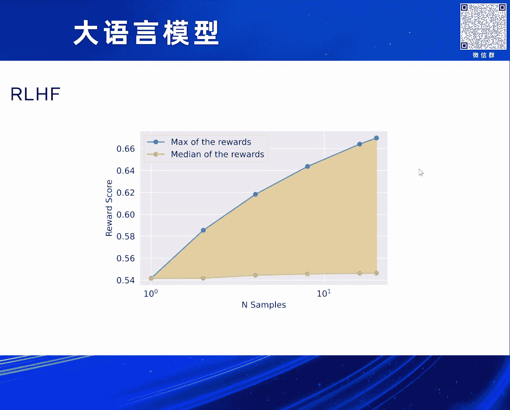

你可以看到我们在很多回合中都这样做了，我们用自己的神话来衡量，左边，我们自己的金属模型和右边，一种型号的GPT，我们的模型在乐于助人和安全驾驭方面的胜率，超细模型的CGP，我们一开始很低。

我们一直在增加，越来越多，所以，当然我们这边的分数更好，因为我们就像那三个一，但只在我们的世界分布上受过训练，遵守我们的协议，你可能是我感觉很坚强的人，即使按照GPT 4，在一天结束的时候。

我们的模型在50%以上得到了更好的评价，基本上比GPT模型。

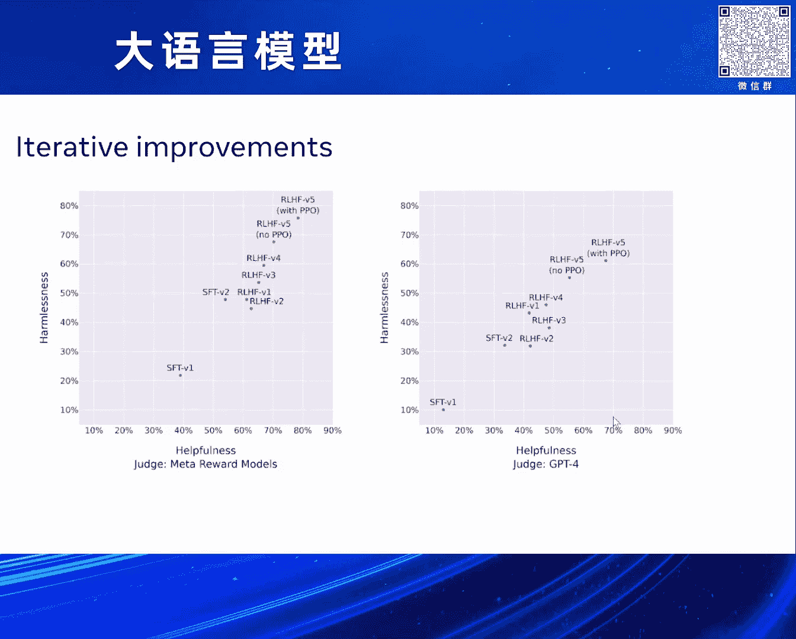

所以你可以用另一种方式来想象，但在每一轮中，我们都试图改变分布，想想我们有很多专业人士和很多样品，我们检查所有样本的分数，我们观察他们的奖励分配，你从这样的开始，你想要的是在每个阶段减少接近零的数字。

然后把它们拉到右边，喜欢更多的样本，接近一个，这是一个更高的分数，所以这就是我们用很多循环所做的。

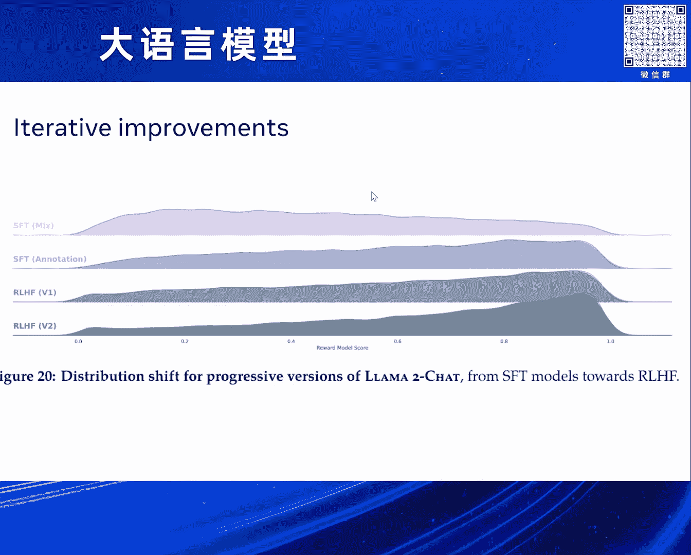

降温现象，我想告诉你的是我们，我们很惊讶地观察到一种时间感知，只是把数据和切割知识，也就是当模型像它应该停止学习，我们可以暂时改变答案，当然这个模型在1940年后学到了很多东西，但只是训练模型，你做了。

你现在不知道，假装你不知道那些事，你问他谁赢得了世界，当他告诉你，我不知道，和同样的方式，如果你说喜欢，这附近有公寓吗？好啦，我们现在是二三年级，就像，GPS技术和任何，但如果你问，你是在。

就像在一年里就像在一千两百年前，它实际上会说像，我不太确定有人这么说，但是不说，所以我觉得这很酷，但让我告诉你我们在这个项目中发现了什么，能量背后真正的魔力是什么，就像我告诉你的那样，当我们开始的时候。

我在想超级加号，在质量方面，微调要好得多，因为它是我的意思是人类的写作仍然比机器好得多，就像我们不能在此基础上训练我们的模型一样，就像机器生成的，但现在让我说，想想这个问题。

写一首关于大型语言模型的俳句，我给你们5秒钟思考，带着解决方案来，带着答案来，我不擅长那个，也许你们中的一些人比我好，来一个有创意的，所以对一个人类井来说，这实际上是非常困难的。

我们的模型在硅房子里立即产生了，在语言上，越南人居住在那里，这比大多数人实际会做的要好得多，我们在项目开始时发现的，在很少的监督函数数据之后，我们的模型已经比一般的注释器好得多了。

所以HF背后真正的魔力是，这个模型已经达到了超人的水平，另一件要考虑的事情是，这不是因为我不擅长在这里创造答案，但我不擅长判断质量，我们并不都像毕加索那样作画，但我们可以欣赏一部伟大的作品。

与糟糕的油漆相比，对所以我们有能力区分好的和平衡器，不一定要写好答案，这就是，Ehf，所以我不认为LF实际上是关于强化学习，甚至是人类的反馈，我想这只是创造超人水平的美，那个，呃，在人类的帮助下。

我们明天可能会带着新的方法来做到这一点，以不同的方式结合新的男人和匹配，但我们活得更上一层楼，更好的质量来培养我们未来一代的车型，那么接下来会发生什么，我将简要谈谈我对这件事的看法，结束谈话。

如果你有任何问题。

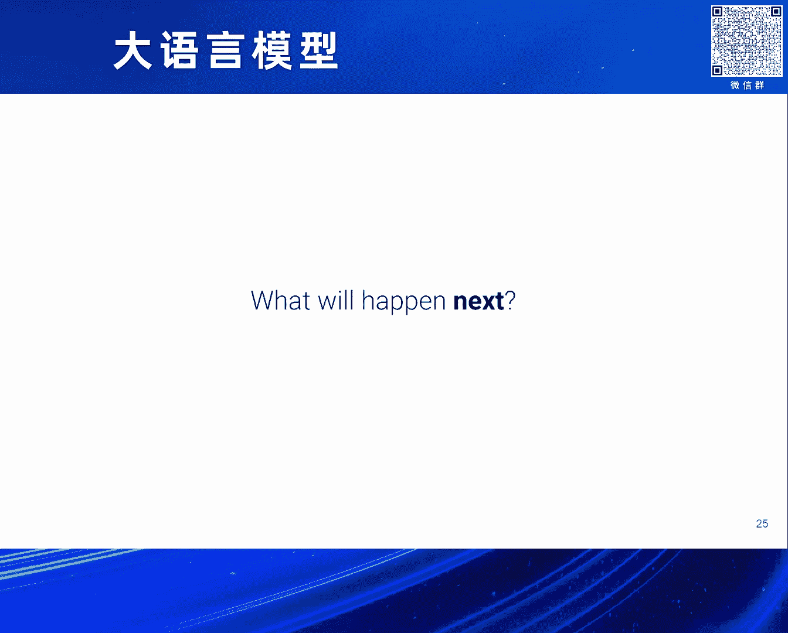

我们已经到了，幻灯片几乎过时了，事情进展很快，但是好吧，多模态输入输出，零的GPT将显示一个明显的方向，我想现在基本上我们已经解决了语言建模作为一项任务，我们可能会看到一些改善。

一些渐进式的事情并不像完全解决的那样，不要误会我，但我们在一个事情实际上运行良好的水平上，多亏了重新训练，与岗位培训合并，因此，下一个迭代是现在包括更丰富的内容，以任何模态作为输入，作为输入的任何模态。

处理可视化数据，语音数据，理解视频，我们正在到达那里，当我们这样做的时候，越来越多的作品开始与代理商合作，基本上是一个行得通的理论，我在这里的愿景是，代理可以是一个带有计划组件的系统。

一个内存组件和围绕它的编排，但那是解锁的，多亏了上一代语言建模任务的解决，与多模态输入输出相结合，所以你可以看到，就像研究一层一层地移动，以解锁下一代和下一代，下一个对我有意义的迭代是机器人。

你可以考虑和特工在一起，我们将第一次进行梳洗，所以它不仅仅是生成代币和获得奖励模型，它是基于代币，但现在我们只和特工发短信，他们已经扎根于数字世界，模型能够执行代码并查看环境的输出，它可以面对或书籍。

模型可以看到，也会有同样的反应，如果模型不知道信息，你可以在网上搜索，去拿点，嗯信息和自我完善自我纠正，有时你认为有一个事件，你在网上查，你说，哎呦，我错了，我是对的，你可以相应地更新你的体重。

所以你不再工作了，在筒仓里，就像一个语言模型，纯语言，在那之后的下一阶段将是机器人，开始看到越来越多的作品，拥抱脸像开源一样掉下来了，滑溜溜的，现在价格每年都在呈指数级下降，我想我们正处于舞台的边缘。

在接下来的几年里我们可以看到，一些我们每个人都可以工作的机器人，以便宜的价格，到目前为止，这是主要的模仿，然后自然阶段是让我们的特工进入物理世界，并提供更多的梳理，这就是我认为符合逻辑的方向，嗯。

我们肯定知道的是一个重要的教训，我们只需要计算，我们知道缩放是有效的，我可以告诉你哪个模特被训练了十次，百倍以上，计算会得到更高的结果，所以这是一个明显的类似趋势，就像，你知道的，比如人口基数低。

这是我们最能预见的规律之一，但我认为人工智能的这十年让老师们想到了什么，就像我们在十年到十二年里取得的所有进步一样，也许像Imagenet和模特试图识别，就像猫和狗，把解题当成围棋，现在理解的两个模型。

就像人类理解和生成文本，对于某些能力来说，就像超人一样，像解决数学基准和推理基准的模型，也许还没有达到世界上最好的数学专家的水平，但比我们大多数人做的要好得多，其实呢，所以我们在客场取得了很大的突破。

期待你是意料之外的，我想随着越来越多的人在我们的领域工作，有新的细木工，这个领域是最近的，就像百分之百的人工智能，世界历史上的研究人员现在正在研究这个话题，他们还活着，所以我相信旧的、新的突破会发生。

意想不到的事情其实是我们应该预料到的，我可以告诉你，我不知道是什么。

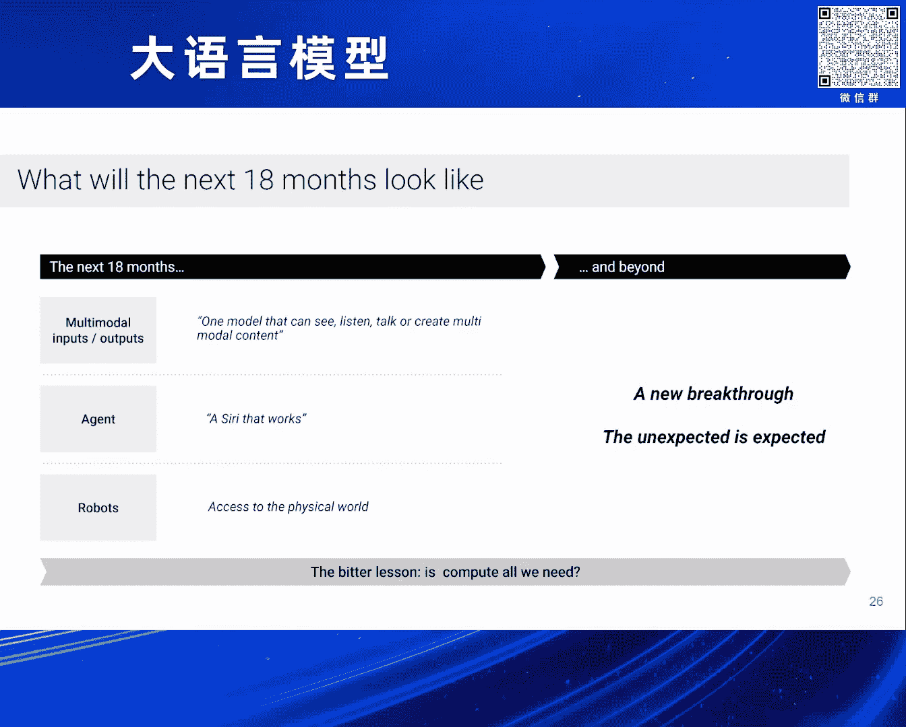

所以我将以，也许我们留下了哥白尼时刻，你知道的，Agi可能是我们这一代的哥白尼，哪里，基本上，在发现地球上没有什么特别的之后，围绕正常星系中正常恒星运行的正常行星，但随着当时的革命。

也许我们正在了解智力并不太疯狂，一堆矩阵乘法，为了英伟达的乐趣。

