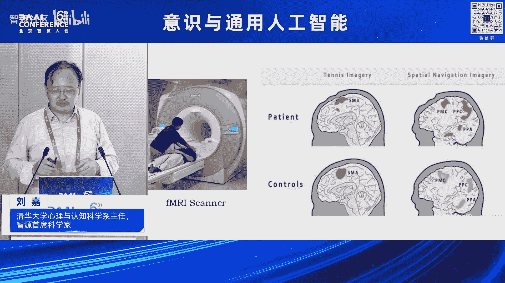
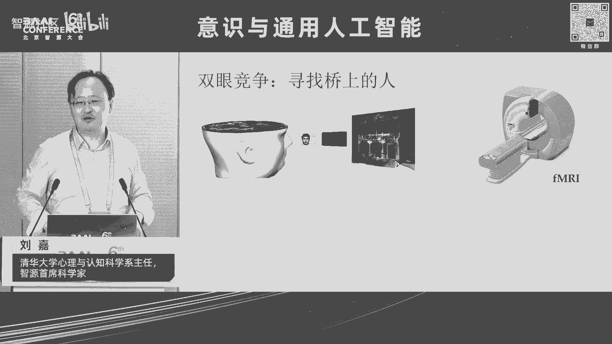
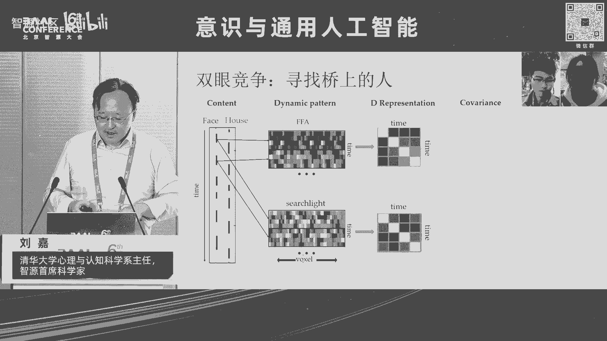
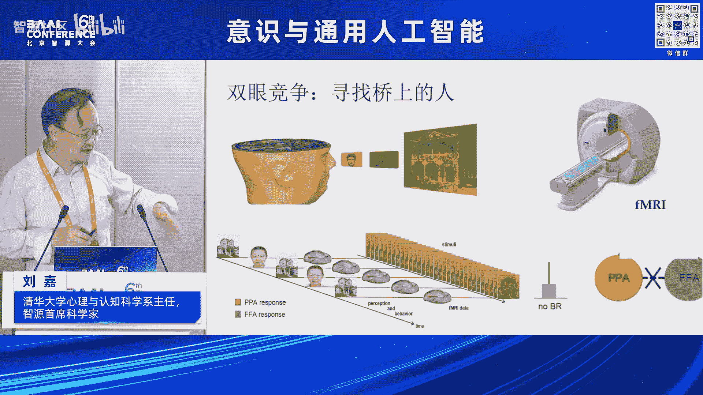
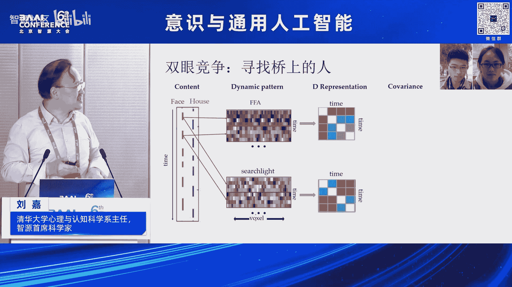
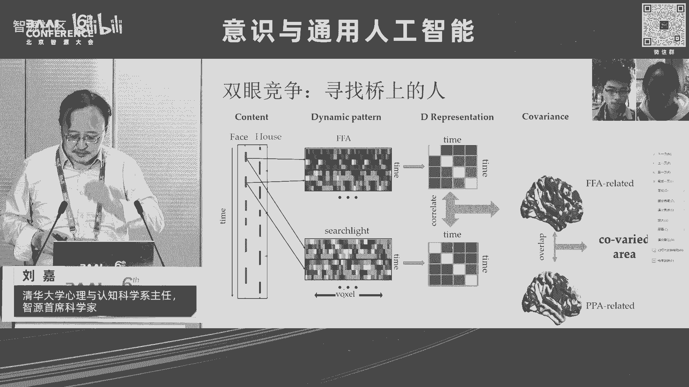
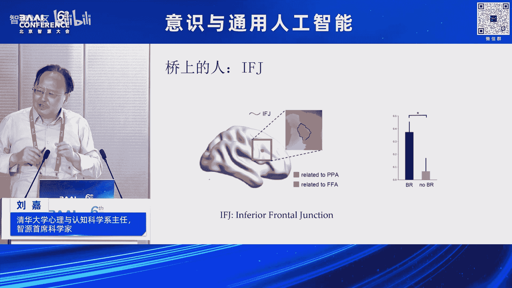
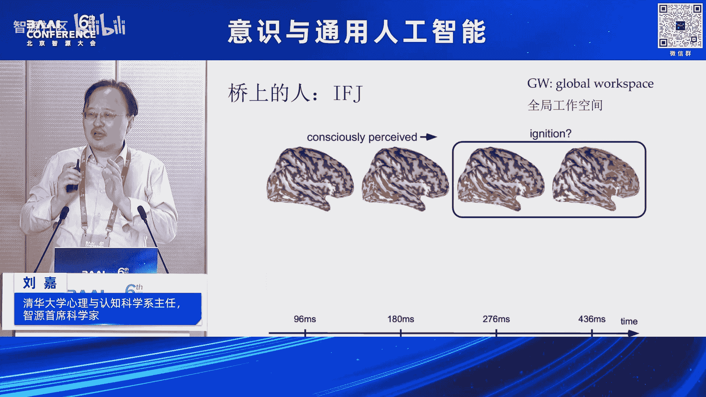

# 2024北京智源大会-意识与通用人工智能 - P1：意识是通向AGI的必由之路-主讲-嘉宾：刘 嘉 、提问嘉宾：罗欢 - 智源社区 - BV11b421H7JY

非常高兴，而且呃又参加我们每年一度的那个智源大会，嗯就像我们刚才主持主持人呢，那个就是李厚明老师所说的一样，就很多时候来，然后就是当你面对通用人工智能的时候，你谈未来，通常你所讲的东西就是一个笑话。

这是我去年刚讲了一个笑话，但是换一个角度上来讲呢，人有一种很奇怪的特质，他总是希望去看未来究竟会发生什么事情，因为当下我们是需要专注，但是像我们这一个大会呢，我们想更多的想知道未来可能会发生什么事情。

所以说今年呢我们就选了两个最著名的词，一个是在心理学领域最著名的词，那就是意识，没有任何一个词儿比意识这个词更加底层，更加让人心动，更加迷人，同时我们在人工智能领域里面呢，我们选用了通用人工智能这个词。

因为这个词在人工智能领域，没有任何东西比它更宏大，也没有任何东西比它更困难，那我们今年呢试图把这两个东西，把它绑定在一起，我们来看看未来究竟发生什么事情，所以今年呢然后我和吴思老师，我们讨论了之后呢。

我们觉得要走得更远一点，就是把我们今年的这个报告呢，把它变得半科学半科幻，我们来看看未来究竟可能会发生什么样的事情，因为我想只有当我们去畅想未来，以一个充满好奇的傻瓜去看未来的事。

也许我们能看见一个和聪明人专注当下的人，所看见的未来是不一样的，所以今天呢，然后我的分享题目就是意思是，通向AGI通用人工智能的必由之路，其实我应该打个问号，但是后来想想，既然都已经到了这步。

问号就不用打了，那么这是一个让呃骑摩托车的人，他不小心出了车祸头，然后撞上了路边的那个马路牙子，所以说你可以看到，让他前额叶这丢了很大的一块，那么丢了这么很大的一块之后，就出现了一个很大的问题。

它就进入了我们通常所说的，一个植物人的一个状态，植物人有什么样的特点呢，第一个让它能够进行能量的代谢，具有呼吸心跳血压等生理的这种活动，就像植物一样能活着，同时呢它也有些本能的一些神经反应。

但是他没有任何自主的行动，脑电波呢也呈现杂乱的状态，就说我们给植物人一个清楚的定义叫什么呢，他现在是自我意识，它就已经丧失了，但是他大脑里面真的没有任何活动吗，还是只是他他的他被囚禁在一个笼子里面。

无法和外界进行沟通，所以说心理学家呢找到一个非常聪明的方法，就是用磁共振来研究他们大脑究竟有没有活动，那比如说我们把在座的各位正常人放进去，我们会看到这么一个结果啊，就是首先我说哎请你想象一下打网球。

你不要告诉我任何东西，你躺在扫描仪里面，你想象一下你在打网球，这个时候你的运动辅助区SMA就会让很兴奋，因为这块参与你的运动，当你想像运动时候，你大脑这块区域就会活动，说OK那现在不用想像打网球了。

现在请你想象一下你们家长什么样子，你们家然后有几间房子等等，怎么样，这个时候你的与运动相关的区域，SMA就不会活动了，但是呢然后你的与场景加加工的区域，比如说PPA等等，这些区域就会活动诶。

这个时候表示你在想想像什么呃想象，那么现在一个很好玩的事情，这是我们在座每个人他的表现，但是我们把我们刚才所说的这个植物人，把它放进去了，我们给他说，请你想象一下打网球，他大脑会发生什么样的事情。

虽然说他现在完全没法做出任何反应，我们给他说，你现在想象一下你们家像什么样子。

那么这是有些植物人大脑的活动，他没法对外界做出任何反应，你看看他就像一个植物一样，但他大脑里面还在遵循你的指令，做出相应的反应，跟我们的在座的人完全一模一样，这就带来一个很大的问题。

为什么他大脑的功能还在正常的运作，但是他已经不能作出自主的反应，到底意识和认知功能究竟是一个什么样的关系，那么哲学家那长做了一个非常恰当的比喻，那么就是这个一个非常漂亮的风景，河水在慢慢的流动。

桥上呢站着两个人正在看着河水的运动，那么这些事，然后我们主观感受和意识之间的关系，也就是说，即使我们处于只要不是太严重的职务状态，那么我们的河流依然流动，这个河流代表是我们大脑，对外部信息的一个加工。

它在不停的流淌之中，而我们的意思就是桥上这些人看着这个河流，他对这个流动河流的观察，所以说哲学家约翰洛克，说了这么一句非常著名的话，他说意识是对心中经过自恋的感知，那么经过自恋就是这个流动的溪水。

而这个感知就是这桥上的人，那我们刚才的植物人发生了什么事情呢，河流依然在流动，它可以照样对外部的声音做出相应的反应，但是桥上的人不知道去哪里了，那然后我们实验室就用了一个非常简单的范式，然后来研究。

然后那个就是桥上的人究竟在什么地方，那么这是在心理学研究里面，一个非常经典的方式，叫做双眼竞争，那么他把一个红色的房子和一个绿色的脸，叠加在一起，那么这时候给你戴上一个眼镜，这只眼镜呢只能让红光通过。

这只眼镜只能让绿光通过，也就是说你左眼看见的是房屋，右眼看见的是脸，那么这个时候呢让把你放到扫描仪里面去，那么请问你现在能同时看见脸和房子吗，答案是不能，因为左眼进去的脸和右眼进去的房屋，他们会竞争。

最终你只能看见一个图形，同时呢这个图形它两者之间会切换，一会你看见一张脸，一会你看见一张房屋，但是你绝对不会同时看见脸和房屋，来回的这么一个切换，这叫双眼竞争，这是一个非常经典的范式。

还是按照刚才的方式，我们把他送到scanner里面去，然后我们来看他大脑究竟怎么活动，那么这个时候呢，我们就可以看见他的这么一个波动，那么就是你可以看见FFA和PPA，这两个老区啊。

它在来回的切换，FFA那就是与面孔加工有关系，而然PPA呢嗯怎么回不去了啊。

而PPA呢那就是与房屋有关系，所以说当你看到面孔的时候，FFA然后与面孔加工有关，会亮，当你看见房屋与让PPI然后有关的区域汇量，它来回的切换啊，抱歉啊，因为考到一个新的那个那个图上面去。

它的PPT有点乱，新的计算机上面去。

没关系，大家可以看一下，那我们怎么找去了解呢，我们就很简单，当你看见房屋面孔的时候，我们用红色标识，我把每一段你看见面孔取出来，我把这时间把它串成一串，我来得一个关于时间的这么一个，然后表征矩阵OK好。

同时呢然后我去满脑袋搜，我去每一个脑袋搜，我看哪一个它的波动的，这种是时间的这种pattern，和我面孔变化的这种pattern这种模式是一样的，那么这样呢我就可以得到一个脑区。

这个老区呢就是只要我PPA，然后怎么活动，它也跟着同样活动，同样的我可以，然后把房屋里出现的时候，我把这个然后老去的时间模式把它提取出来，我拿来，然后和整个大脑再搜一遍，我看哪些老区嗯。

和这个房屋的这个时间的模式它是一样的，呃抱歉啊，这个具体的细节我就不讲了，大家知道一个大概意思就可以了，那么这个时候我把这两个老区叠加在一起，我看它有没有一个当你看见面孔的时候。

我和你面孔保持同步这种波动，当你让看见房屋的时候，我和你房屋开始同步的波动，那我们找到了这个老区嗯。

怎么到学，我们找到了找老区，这个老区在那个就是那个内，那个那个就是infr front和junction嗯，没有它它它它它它会弹出一些安全提示警告嗯，好在这个老区里面，他然后很神奇。

他是当你看见然后面孔的时候，他和你面孔保持时间的同步，以同样的模式运行，而当你看见房屋的时候，他又转转头和房屋一块来运行，它是在我们前额叶所在的一个地方，那么而且这个老区特别的神奇。

仅仅只有在双眼竞争的时候，它会出现同步，当你单独给他看张面孔，再单独给他看见房屋的时候，这个老区和FFA和PPA这两个视觉区域，它不会存在任何一个同步的状态，那么也就说他参与了我们面孔和房屋的。

这个主观感知，那么这个时候来，我们就其实和以前一个MEG的一个，著名的研究其实保持了一致，它是一个什么结果呢，当你看见一幅图的时候，记住你看看到了这幅图K进入了你的意识，它先是视觉区域活动呃，X轴了。

是时间，然后它就像火一样慢慢传输到我们的前额叶，到前面早就开始亮起来，就跟点火一样，前额叶开始亮起来啊，我就看见这个图了，但是如果假设我这幅图呈现的非常快，你然没有看见，但是你看到了，但是没有看见。

然后这个时候呢你就可以看到，让只是视觉皮层会亮，但是前额叶就不会亮，这个让结果就表明，那前额叶它对于我们意识加工是非常一致的，但是上基于这个结果呢。

我们就可以这样对桥上这个人做一个建模对吗，他就是让一个这种那个人就是动态交替的过程，那么桥上的这个人他是怎么来转换的呢，我们就设立了一个，然后动力学的一个模型，那么我们用了一个那个呃。

那个就是STEAMAGE，就是一个共识，协同性还是什么之类的控制论里面的一个概念，那么然后我们来模仿前额页，它然后得到了，然后FA的输入，得到了PPI的输入，它怎么来啊，因为时间关系我就不讲这个细节。

那么同样的我们对于FFA和PPA，我们也可以同样的让进行建模，这里面在FA有个很重要的，就是它自己有一个呃那个就adaptation，它内部有个内场的这样一个变化。

那么这样我们就可以对意识让建立一个公式，那么在后面那张朱露莎老师和吴思老师，都会让对到底我们的意识可计算还是不可计算，然后做出这样一个讨论，那么这里呢，我然后就是暂时站在可计算的这个角度。

我们就可以来做这件事情，那么最后我们得到结果就是让一个大脑里面，一个场的这么一个分布，但开始的事它是处于一个安点上面，当你然后一旦开始发生变化的时候，它就可以滑向让其中的一个吸引子。

当这吸因子待一段时间之后，它又会滑向另外一个吸因子，它在这个厂里面来回的波动，所以这个时候，你就可以在我们这个简单的模型里面，你可以看到E那个对于面孔和对于房屋，这两个状态的一个切换。

而这个切换它的让这么一个分布，和我们在人身上观察到的分布是完全类似的，好，那么这个时候，然后我们就是得到了一个IFG这个区域，大家会问IFG，这个和通用人工智能到底有啥关系，你对吗，你在讲意识。

你在讲这所有的一切诶，你其实我们可以看这么一件很简单的事情啊，我们还是回到刚才那个很不幸的，头上被撞了一个大坑的这个哥们啊，你可以看到它的功能都还在对吗，他然后能够想象我在打网球，我能够想象打房呃。

在做房屋，我的每一个功能哎都是齐全的，但是它什么地方出了问题呢，它把每个功能都都在，但是它没有把它整合在一起，这就是然后的一个关于意识的，一个非常重要的一个假设，就是假设理论叫做全局工作空间。

也就是说你每一部分，你的每个特殊功能你都可以完好，但是我们要形成意识，需要这些功能一块到某个地方来进行交流，就像我们一个公司一样，我们到时候你是销售部门，你是生产部门，你是什么部门。

最终大家要坐在一起来聊个天，这样公司上才能正常的运作下去，而不是生产部门只负责生产就可以，大家一定要到一个地方来交流，这个交流的地方就被称为global workspace，而让一种假设是。

当然这个global workspace受到损伤了之后，他可能就不能再去让产生意识，但是各个独立的模块还是OK的，唔这那个啥简直太恐怖了，这个嗯那个然后就是N的way。

然后就是我也不知道为什么会出现这样子，那么当这个时候，然后那个就是如果假设现在呢，就是有那个就是搞人工智能的，就把这个模型，然后就开始用到，然后我们的机器人上面去对吗，我们机器人要去抓，要去拿，要去走。

要去听，要去做各种各样的事情，那么这个时候让一个很重要的那个理念，就是我怎么把这些独立的功能把它整合起来，让它像我们人一样，我可以一边喝水，一边聊天，我可以一边骑自行车，一边打手机对吧。

然后你打电话我可以让干很多事情，我能不能把这个global workspace，build in到我的机器人里面去，让我机器人能够变成一个能够完成多项任务，能够协调完成，就像我们人一样的这种进行工作。

那么这是让大家的一个努力，但是这个努力然后就会出现一个问题，因为global workspace它与我们的意思有关系，当你试图在机器人里面去模仿这件事情的时候，那么会不会机器人。

它也会莫名其妙地自涌现出意识出来呢，这是一个问题，但是我今天想给大家提供一种猜想。

这是的确有可能的，那么正是我们刚才主持人李厚明老师提到的，那个GPTFO，那么他的，然后就是他到现在为止还没有公布它的，然后一个架构，但是大家一个普遍的猜测到，他是一个混合专家模型。

就是它与我们传统的GPT3，一个大模型不一样，它是由很多小模型把它让拼起来的，比如这个小模型，它更多的善于做推理，这个小模型它更多的善于做语言理解，这个小模型更善于做其他什么事情。

那么然后当我信息来了之后，我都输给这些小模型，让他们找各自去处理，那么处理了之后，这些都把他们的工作提交到一个什么地方呢，提交到一个getting network，这去getting network。

主要他要做一个判断，我究竟采信哪一个小模型的结果，来进行一个输出，那么这就是然后那个就是混合专家模型，那么你看这个模式和我们的刚才所讲的，Global workspace。

是不是然后有同样类似的这么一个功效对吗，大家各干各的，最后让我要统一一下，让大家进行一个交流来干这件事情，但是这样干它会产生意识吗，在2022年，然后2月10号的时候，但是GPT3，然后还没出。

那个还没有正式恰到GPT还没有正式发布，但是当时GPT4已经然出来，已经练好了，但是他的然后GPT呃，但是然后就是在twitter上面，莫名其妙的就发了这么一段话，他说啊，我觉得现在的大的网络啊。

大的神经网络已经有了一丝一毫的意识，但这句话发出来之后，当时大家都笑话他，因为当时大家还没有见到ChatGPT，更不用说后面的g p t four了，所以大家去追问，你脑袋是不是出了点什么问题啊。

他也没有让再进一步的解释。

那么现在回过头来看，是不是他当时感受了什么，那么在今年那个就是4月份，然后那个那个就是HINTON接受了，然后一个采访在那个呃，来当时当主持人，然后问他说，然后把这段视频放一下。

I'm missing you subjective experience。

Um，Yes，I do i think they already to，主持人问他说，你认为现在的机器已经有了主观感知吗，Subjective experience，让HINER毫无犹豫，Yes。

I do，我认为他已经有了，所以说从从这点上来讲，我们然后那个意识，当你要去把各种模块，当你把各种特殊的任务把它集合在一起，用一个global workspace把它链接在一起的时候。

也许它就会产生一个意想不到的一个，APFLAMINA的一个东西，那就是我们的所说的意识，那么所以说然后你可以理解，为什么那个然后就是呃SAM奥特曼会被当时，然后那个就是那个open i的公司，为什么。

因为当时让大家意识到这是一个很严重的问题，这就是当时超级对齐和有效加速之争，那么然后那个呃伊利亚数字cover呢是超级对齐，一定要把AI的，然后这种观念和我们人的这种观念把它让对齐。

你不要找成为人的工具，而不是让成为人的terminator，而山姆奥特曼说OK这些东西不重要，我们先把这件事情推动起来，但是我们知道后面的结局就是，3M奥特曼王者归来，重新回到了open AI。

而伊利亚数字cover干什么去了呢，然后被迫离开了open a这个公司，那么现在呢，就是我们又到了这么一个关键的节点，我们让试图在推动AGI的时候，我们让它向前发展的时候，那我们究竟未来会变成什么样子。

所以说这里呢我让我想借用，然后那个就是马文明斯基，这是这哥们来着，现在已经去世了，但是当年然后他们是四人在那个达特茅斯college，他们让当时命名了AI这件事情。

这可以被标志为AI的一个正式的诞生的日子，那么他那个当时在那个推推动，然后那个就是情感计算的时候，强调情绪的重要性的时候，他刚说了这句话，他说现在的问题不是智能机器是否能拥有情感。

而是不拥有情感的机器是否能拥有智能，所说他这句话就推动了那个effective computation，让这个领域的让一个极大的活动，那么现在我想用它这个句式来表达一个观点，可能让明年我们再这个时候。

谈论这件事情的时候，可能李厚明老师又会说啊，说你看他们去年说了件特别愚蠢的事情对吗，但是我还是决定要把它说出来，因为有可能明年这个时候机器已经拥有了意识，或者AJI已经实现了，这都是一切都是有可能的。

到时候就不再是我们来发言，而是机器站在这发言，那么我把这句话说到这，说现在的问题不是AGI是否能拥有意识，而是不拥有意识的AI是否能拥有通用智能，所以说我觉得现代人还关于脑科学和AH呃。

那个AGI的研究的一个特别火的一个领域，或者一个热热点，就是我们应该去勇敢的去理解意识，因为关于意识的定义究竟是什么，我们还不清楚，但是我觉得现在已经我们迫在末节，我们必须要去关注这个问题。

因为我觉得这才代表了未来的AGI，而不是我们现在再去调调模型啊，再把参数上增加一倍啊，因为这些东西它不重要，它只是一个工程上的问题，那么但是然后，当我们真的来面对这个问题的时候。

我们有太多太多的问题了对吗，除了然后那个我们刚才讲的global workspace，这个理论之外，还有其他理论吗，它们对应的神经基础到底是什么，其实然后格罗布workspace。

它只是众多理论中间的一朵小水花而已，好我们的那个罗来自于，然后北京大学心理与认知科学院的罗欢老师，到时候会给大家分享到一个主题，就当认知神经科学在争争论意识问题的时候，他们究竟在争论什么样的问题。

所以他会给大家一个overview，然后就是关于然后意识这块理论的这些研究，我相信对大家有启发，罗汉老师刚才然和我说，然后说啊，他昨天工作到凌晨两点，让他把这种理论然后弄起来了。

所以说我觉得大家一定值得一听的，因为为什么他一定要工作到两点，因为他把最新的东西呈现在面前，那么这是第一个问题，第二个问题是，那然后就是我们有了这个，然后就是这一套之后，那么机器人他可能有意识吗。

如果他有意识，他应该是通过什么方法让他来获得，他应该是会是什么样的，那么来自于，然后就是清华大学航天航空学院的那个，就是隋亚兰教授，然后他会给大家讲，就构建巨生的意思就是从机器人，从他的肌肉。

从他的控制，我们来看，是不是像少林寺的武功一样自外向内对吧，然后你先去，然后练一身钢筋铁骨，让你的意思就有了，就像你就内功上就开始有了，那么我们来看这一方面，究竟会是一个什么样的问题。

那么让我们谈到意识，然后因为意识有很多层次，从主观感受，然后一直到它的最高峰，就是我们的自由意志，Free will，那么然后裴多菲有句很著名的话，叫做那个就是叫呃生命诚可贵，爱情价更高，若为自由。

故二者皆可抛，这个自由啊不是我们说的freedom，而是free will，我们自由意志，我们按照自己的想法去做事，这是最重要的，那么这是我们人类最引以为豪的，那么到现在一个问题是一呃机器。

当时那个就是HINTON在讲，机器可以用subjective experience对吗，这没问题，主观感受，但他能有自由意志吗，他能够让自己去控制这些东西，他的自控感究竟是什么样子，那么来自于北京大学。

心理与认知学院的朱罗莎老师，然后会给我们讲可计算的自控自控感，那么这个自控cf agency，那么就是上提到的，我们刚才与我们的自由意志有密切的关系，那我们的最后呢就是。

然后要从一个比较玄学的角度来讨论意识，什么是意识对吗，你说了那么多意思，到底他在指什么样的东西，它是一种神学吗，是哲学吗，它究竟是一种科学，对不对，然后如果假设是玄学的话，我们就不用然后去了解这些东西。

那么来自于北京大学，心理与认知科学学院的吴思教授，然后会然后给大家讲，然后一个问题就是意识是可计算的吗，你看这就是让显得比较玄学一点，打个问号，不像我这么坦诚啊，那来但是我们可以。

然后听到最后到底是什么样子，那么这些问题只是，然后我们列出来的一些非常小的一些问题，但是一些更重要的是我们应该怎么办对吧，面对这么复杂的东西，面对我们自己也说不清道不明的意思。

以及更加说不清道不明的AGI，因为这两个东西到目前为止，都是没有定义的意思，没有定义AGI同样没有定义，那我们究竟应该怎么办，所以说我觉得到最后呢，我们一定要拿一个东西来对付，这个两个严重的问题。

那就是我们的群体智能，那么这就是我们最后的一个圆桌讨论，让大家让可以敞开，让自己的心扉，然可以聊各种各样的东西，这就是然后我们说的前面是半科学。

这就是然在半科幻的，然后部分好，然后就是这个是我的，然后报告哈。