# 2024北京智源大会-意识与通用人工智能 - P2：当认知神经科学家争论意识理论时他们在争论什么？--主讲嘉宾：罗 欢、提问嘉宾：眭亚楠 - 智源社区 - BV11b421H7JY

哦各位下午好听得见我说话，嗯然后我非常荣幸参加这样一个论坛，这个这个我们这个imposing呢，是刘佳老师组织的，然后他刚才也说了，我这个昨天晚上工作到凌晨两点钟。

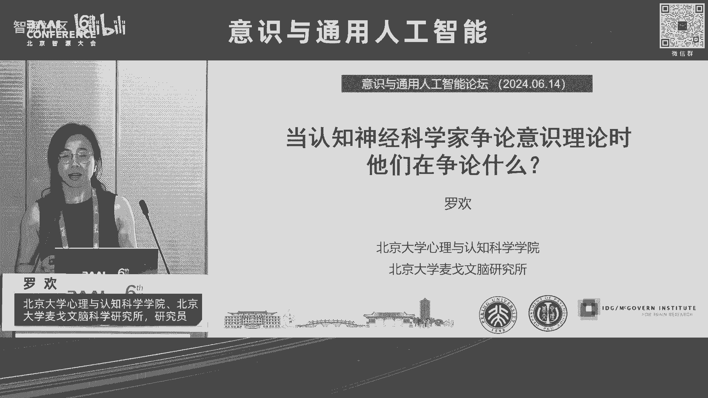

为什么呢，因为嗯这个题目对我来说就是这个感觉，嗯嗯我我的脑袋里一片空白，并不是说我没有做过认知神经科学的研究，也不是说嗯我对意识的神经机制一点都不了解，而是当我们面对这样一个问题的时候。

所有的人都会有这样一种感受，就是意识呢，一方面我们觉得我们都知道它是什么，觉得它很神秘，但另外一方面我们又不知道它是如何产生的，所以我想这样的一个一片空白的感觉，是很正常的。

然后我想引用一个著名的哲学家，DAVIDCHERS的一句话，来进一步去为我刚才说的这句话啊，Back up，那就是意识，实际上是构成了我们关于心智科学中，最迷人的或者最困惑的一个问题。

因为我们好像每个人都非常清晰的知道，意识是什么，然后但是另外一方面呢，他好像又是世界上最难去解释的一件事情，所以我把它总结为意识，就是我们最陌生的熟悉人，我们每个人好像都知道它是什么。

但是你又发现它非常的神秘，它如何发生呃，如果是作为一个，我猜这个在座可能有不同的背景啊，但是我想你们都是喜欢科学的，不然你们也不会来听这样的一个报告，那其实市面上有很多很多的书。

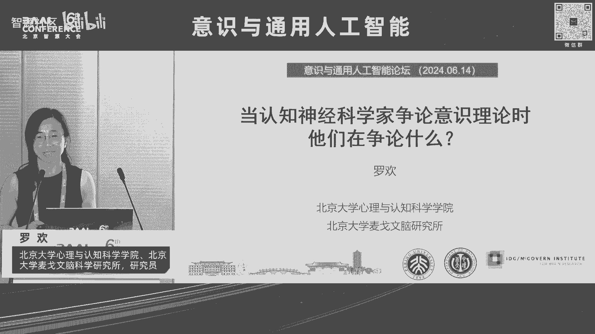

这是我随便搜集的，有些书我看过，有些书我没有看过，比如说呃前一段时间去世的DANIELDENNETT，他是最著名的心智哲，这个心智科学的哲学家，他活到应该是100岁左右，他写过大量关于意识的研究的书。

他也是非常早期的，这样的一些哲学家去把心理学呃，生物学啊，进这个进化论等等方式，来放到关于意识的这样的一个思考中，它有一个非常铁定的定律，就是认为意识是一定能够被解密的。

它就是来自于这个呃我们的人脑这样的一个，或者是根据我们的进化史上，它是背后是有物理基础的啊，当然他有很多的敌人哈，然后第二本书就是DAVIDCHERS，我刚刚提到的这个哲学家，后面两本书呢。

实际上是我今天呃可能想给大家分享的，那么他们都是认知神经科学家，他们关于意识的理解，当最后一本书呢也非常有趣，也是大家我猜都会想的问题，除了人，其他的生物有吗，那个聪明的章鱼有没有意识。

所以我只是放了一些书放在这里，那有很多很多关于意识的书，所以我今天要跟大家分享的是什么呢，我想说的是，意识是哲学领域的经典问题，这个问题在哲学领域讨论了非常久非常久，因为它关乎到一个非常基本的问题。

就是二元论和一元论的问题，笛卡尔认为我们的身体和我们的心灵是分开的，是二元的，所以我们理论上没有办法去回答意识这个问题，但是一元论认为，实际上，我们的主观思维是来自于我们这个物理器官的。

那么这个是一元论，那这在这个在哲学上是有很多很多的讨论的哈，还有就是说意识是不是为人所独有，包括意识的定义，这些都是哲学领域的经典问题，呃，或者或者换句话说，其实我对他们的了解呢是呃。

可能和大家很多中或者甚至于比你们还少。

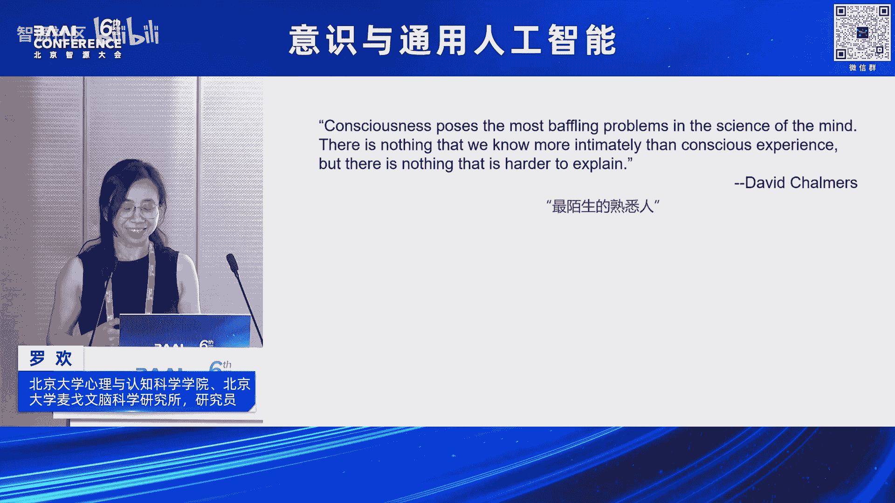

但是另外一方面呢，科学家其实不是这样想的，科学家应该在30年前，没有哪个科学家敢说自己研究意识，大家知道是为什么吗，因为科学家要显得非常serious对吧，如果他30年前就说我研究意识。

估计他也找不到工作，也拿不到基金，所以呢嗯因为当科学家研究意识的时候，他既然是科学家，他肯定不是二元论，他肯定是一元论，所以主观体验如何从物质实体产生，今天大家坐在这里，可能会觉得科学家有答案。

但是我想30年前说，这个桌子或者这个东西能产生意识，没有人认为你是有科学的态度的对吧，所以我觉得这是一个背景，所以而且呢就算有科学家心里有这样的小火花，小种子，他也不敢说他要研究意识，为什么呢。

因为我们在回答这个问题前，我们还需要解决更多基本的问题，那这些基本的问题是什么呢，首先我们要打好基础，打好基础，就是了解我们这个脑这样的一个物理器官，它能够做些什么，比如说我们怎么看，怎么听，怎么学习。

怎么记忆，怎么注意，怎么做决策等等等等，还有包括我们怎么产生语言，我并不是说这些问题我们现在都知道，但是相比意识，他们应该了解的越来越多，包括我自己的研究，其实不是研究意识。

我也是研究这些category部分的，这个里面的一部分而已，那这个领域呢我们把它叫认知神经科学，认知神经科学呢实际上是神经科学和认知科学，认知心理学等等的结合，他的意思是去研究一些我们认知中的问题。

但是我们研究的思路是，这个认知问题背后的脑基础是什么呢，所以在这个方面呢，经过这么多年的发展呢，大家对于很多的认知功能越来越有了解，所以我们可以告诉你们说哪些脑区参与了什么，他们是怎么参与的等等等等。

OK这是第一点，我们要打好基础，了解基础认基本认知功能，脑基础，第二点就是我们肯定是要有工具的，那我们需要发展很多的科学测量的工具对吧，因为当我们说科学的时候，那其实就是不以我们的主观意志为转移的。

一些测量方式，那在这个其实脑电这里面有些技术很早啊，但是大部分的技术呢大概都是在近三四十年，30年的左右发展起来的，特别是呢功能磁共振的这样的一种发展，它会使得认知神经科学达到了一个新的高度。

如果你在一些科普书上或者公众号上读到，脑区负责什么，很多很多研究，特别是人的研究，都是在这些这个我们的实验设备上做出来的，我们任何一个正常人，都可以成为这些实验的设备的。

这个呃这个受试把你们塞到这个机器里面，让你们做一些认知的活动，刚才刘佳老师也提过了，然后我们去测量你们的大脑活动，和你的各种认知任务有关，比如说当你看到一个图片的时候，你大脑哪些脑去激活呀。

我能不能从你大脑的活动里面去解码出，你看到的东西呀，你的语言呃，你听到了一个语言，它会激活什么样的脑区啊等等等等啊，所以这些就可以在正常人通过非侵入式的方法，就可以去进行研究。

第二个呢就是行为测量范式的发展，当然这个发展的历史是比较久的，主要是来自于认知心理学，刚才正好刘佳老师也讲了一个双眼竞争的范式，可能大家经常会说所见对吧，就是你看到的东西一定是真实的，但是大家想一想。

如果你看到东西都是真实的，魔术是如何发生的，所以我们经常会视而不见，这是生活中很正常的事情，原因就是我们的大脑，实际上是不断的在被动的接受外界的信息，但是实际上这些信息。

虽然在你的大脑中留下了很多的痕迹，包括视觉的，听觉的嗅觉等等，但他都没有上升到你的意识上，然后你没有觉得你看到过他，甚至于你觉得你看到的过，他可能你之后也不能记忆起来，所以说句呃换句话说。

认知心理学发展了很多的测量范式，能够真的去测量你有没有看到，你看到的是什么等等等等啊，当然最后一部分呢就是呃这个和很多这个嗯，刚才正好刘佳老师也说到了，就是医院里的一些病例。

比如说我们人有不同的意识状态，比如大家现在如果听我的报告，昏昏欲睡，你的意识状态也在降低对吧，然后刚才提到的这个植物人，那么呃医院医生和这种认知神经科学家，互相的合作呢，也可以开始让我们去了解。

我们怎么知道他有没有意识，我们从外面看它好像是没有意识，但我们能不能通过一些方法来读取他的意识，知道呃是不是还适合于对它进行进一步的治疗，和这个拯救等等等等，所以这一部分呢也是发展科学测量工具。

来帮助我们，那在这样的一个基础上，我们有了测量工具，有了行为的，有了非侵入脑成像工具对吧，有了各种各样的嗯，大家开始感兴趣，我们还了解了我们人脑各个功能呃，各个部分在做什么等等等等。

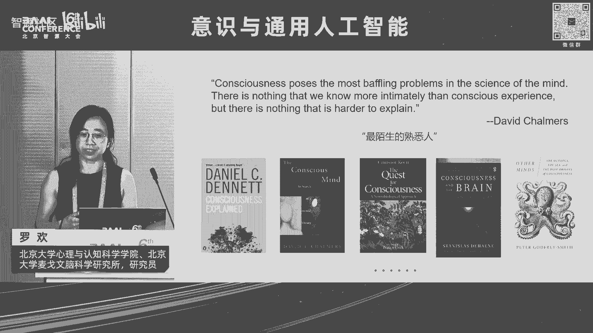

那么这个时候貌似就到了一个时机，就是可以研究意识问题了，因为意识我认为它是一种集大成者的皇冠问题，意识既不是视觉，也不是听觉，也不是记忆，也不是决策，好像也不完全是自由意志。

意识也不完全是大家经常听说的自我意识，意识好像是一种嗯，把人就像一个那个小仙女的点金棒一样，有了意识这个东西就显得特别智能，所以呢它就成了一个大家现在讨论的，很多的问题。

那之所以在这个moment可以讨论，就是因为前面的这些基础的奠基对吧，就是我们从科幻小说里听到的，从我们的哲学思考里说到，真的到了这么几十年来，科学实验的累积和技术的进步。

让我们到了这个关口可以去研究这个问题，但是是不是我们就知道呢，我的答案是肯定不是，因为真的还没有到那个地步，所以它实际上是一个我觉得是一个frontiers，值得很多人去继续研究。

第二呢就是原来的时候意识，大家可能觉得是个哲学问题，或者是个心理学问题，但是呢现在呢有了很多很多学科的交叉，和思路的涌现，比如说呃DANIELTANANT，他早就把进化论的这种思维。

还有很多很多进行整合，然后认为这可以解释我们的意识，脑科学的进步，包括现在人工智能技术的进步，还有复杂系统，还有数学，还有很多基础科学的这个发展，都让我们对于意识，如何从大脑这样的一个物质系统里产生。

有了更多的假设，我说的是假设和思路，所以这种多学科的交叉，也可以帮助我们去理解意识问题，当然我觉得意识在这个时刻成为这个热点。

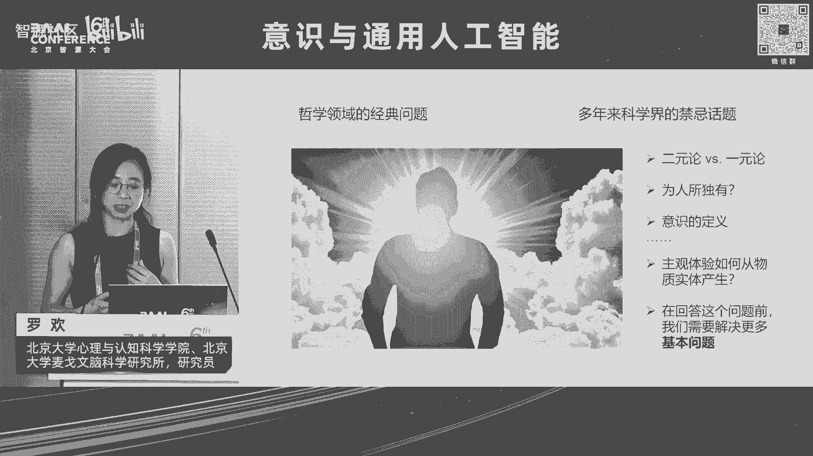

还有一个最重要的原因，什么原因呢，就是ChatGPT的出现，所有的人都开始觉得天哪，这个东西看上去好聪明，好像有意识，所以大家不要问我这个问题，CHAIGBT有意识吗，或者说每次我们一讲报告。

第一个问题就是老师请问什么是意识，这个完全没有办法回答的问题哈，就是所以说这个是人的一个很有趣的地方，就是你会隐约觉得他有意识，但你又说不清楚他到底有没有意识，那么但是这个问题就把我们意识研究的这样的。

一个皇冠问题，进一步的推向了这个前沿，因为我们又有了另外一派，就是他们完全不是基于生物，不是基于人脑，但是这个东西貌似有意识，所以我们如何去了解意识，意识是如何产生呢，这就更加的重要。

他确实成为了近期的头条，那今年就是据我不完全统计啊，nature上各种嗯无论是观点性的文章，实验性的文章还是等等的文章，他这个关于意识的，特别是脑机制的研究，当然还有和大语言模型啊。

还有和chi g b t这个呃也有很多很多不计其数，比如说这个是刚刚去这个，你看是5月份这一期，在神经科学的这个最顶级的期刊，neuron上的一个专刊，专门就是讲意识，他邀请一些人来去对意识进行综述。

然后有一些文章，那么另外呢就是就刘佳老师之所以找我讲呢，也是因为有一个项目，这个项目呢最近引起了很多的这个围观，这个项目呢大概是2020年开始呢，由美国的一个基金会支持的这么一个，其实钱不多。

但是这个项目之所以现在呃大家讲的比较多呢，就是叫culture it项目呃，我等会会给大家非常非常简单的介绍一下，这个项目，这个项目就是在世界上找六个实验室，大家一起去测试意识的两个理论，O k。

然后我们实验室呢就是呃这六个实验室之一，所以我们这几年也在参与这样的一些项目，然后这样的一个项目一旦出来了以后，就进了头条好多次哈，比如science里面专门讲哲学家和神经科学家。

他们和呃齐心协力一起来研究，我们能不能够把自由意志或者意识，这样的一个神经机制能搞清楚，然后我们这个项目有两个实验，实验二呢在去年在去年的这个nature上，他也被评为了九大科学期待之一，呃。

和这个大家知道的超算呐，还有这个登月啊等等项目，是所以说嗯也许我们平时做的东西，我们会觉得没有那么重要，但是看来这个问题在很多人的心中，大家都觉得是挺有趣的一个问题，好的，那么我们再回到这个题目。

所以大家可以看出来，我出我我起的这个题目是有技巧的，我没有说当我们争论意识的时候，我们在争论什么，这个问题太大，我这里面有很多的限定语，首先是当认知神经科学家争论意识理论的时候，他们在争论什么。

所以我们focus的是认知神经科学关于意识的理论，并不是意识的哲学讨论啊，另外呢我们强调的是他的争论，也就是说，这些不同的理论之间的相似或者是差别，他们如何去，就像两个人吵架，你如何说谁对谁错呢。

这个事情到底有那么难吗，其实是挺难的一件事情哈，那这里面就有四个点，我想给大家highlight一下，一方面就是认知神经科学的意识理论，显然是一元论的，这里面是排斥二元论的，不是说二元论不对。

但是当你放在认知神经科学这样的一个框架下，我们本来要研究的就是意识的大部分的功能，能不能用脑来解释，如果它不能，我们就继续研究，那么就给二元论留下一些空间，但是我们的这个出发点是一元论的哈啊啊。

第二就是呢它基本上是基于一些人脑的发现，现在动物的研究不多，因为动物有没有意识，或者是不同level的consciousness啊，还是一个继续争论的问题，第三个呢特别强调，我不是讲我的理论。

我也没有理论，我讲的是别人的理论，我给大家总结一下，所以我要是没有回答清楚啊，我也K呵呵啊，第四个呢，就是可能特别是对于不做科研的同学呃，呃不是老讲同学去了不做呃，科研的听众。

你们经常会觉得说这有什么很好争论的，你拿出一个证据，谁对谁错，不是一眼就很清楚吗，任何一个理论有那么多区别吗，那是因为当你说一个理论的时候，比如说你说我这个发现支持了我的理论，但是有可能你的发现。

能够被除意识以外的认知功能解释，那在你的同行里面就会觉得你的结果不干净，不清晰，所以他们就会继续吵，继续吵，所以这个就是吵架的一个源头，也是今天可能会给大家介绍一点点的哈，好的。

我就呃应该说我主要是想给大家讲三部分，主要是集中在第一部分，第二部分我会非常简单的过去，因为第二部分比较细节哈，第三部分呢我开始也没想讲。

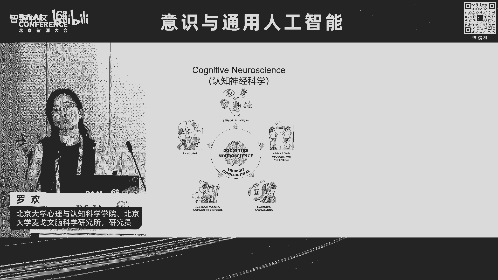

但如果有时间可以去讲，我们第一部分呢就是来给大家讲一讲，什么叫认知，就是认知神经科学的角度，如何去解释意识从脑中产生的，那其实这个呢是来源于我刚才说过，意识在哲学里一直是个很大的话题。

但是想用科学的办法去研研究意识的脑机制呢，实际上大概1990年以后才发生，那他的主要的这个发起者呢，就是这个诺奖得主CHRISTAL，这个crick和这个克里克就是发现DNA结构的。

以及这个call call核是现在这个意识领域的，这个他现在是美国这个ELA研究所的所长哈，然后他对意识的这个一直都非常感兴趣，当时你看还是非常非常年轻的一个小伙子。

然后他们呢就呃提出来了这样一个hypothesis，这个hypothesis非常简单，就是他认为在人脑中呀，会有一个最小的神经的这样的一个集群，或者一种机制，他们呢就足够充分必要的。

能够解释任何的产生意识的现象，比如说你看到了一只狗，假如你有这狗这个体验，那么这一部分的NCC的，这样你可以把它想象成是一堆神经元的集群，它们就会被激活，相反如果你把这些NCC给打乱。

那么这个关于狗的意识就会消失，非常非常简单，所以他就可以想象成，他就认为你大脑里有这么一小团的关于神呃，意识的神经的相关，在那里能够解释意识的发生，他提出这个假设。

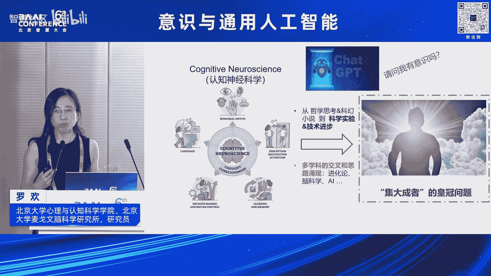

但是他没有什么证据，那之后的研究就是在做嗯，其实不同的理论呢它是有不同的着重点的，我们也经常会去混淆，比如有的人是强调我意识的内容，比如当你想象一个在一个呃对吧，一个麦田里傍晚的时候。

这种感受你想象的是去经历的这种意识感受，这个叫意识体验，但还有一种情况呢，就是刚才讲的这个睡觉呀，或者是植物人呐，他是意识的状态，所以意识分内容。

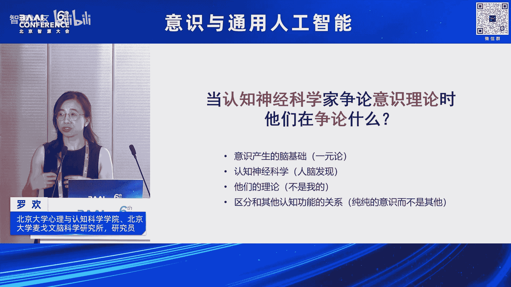

意识也分状态，这是不同的理论的着重点嗯，还有一部分呢就是说有的人呢是认为，其实也跟我刚才呃问刘佳老师的问题有关，有的人认为呢这个意识啊它最重要的是体验，它是一种现象。

换句话说你的意识是不不依赖于你去报告的，就是你自己本身的一种意识体验就是意识，但还有一些人呢认为，意识它最重要的是它的功能，就换句话说意识本身这个体验不重要，重要的是你如何把这些信息。

把它放到你的注意力，放到你的记忆里，所以这些都是不大一样的。

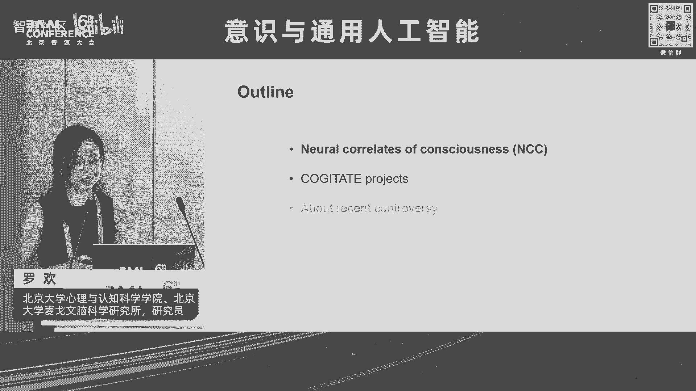

OK啊，这个地方有点confusing，大家不用管哈，好，那我就非常简单的给大家解释一下四个，这个现在比较主流的理论，就是关于意识的，来自于脑的这个理论，大家可以看到这都是脑，所以他们其实就标记了。

他们怎么认为这个意识发生的，然后这四个理论里面呢，其实那个项目里面主要测试的是那边两个理论，这边两个理论是啊还没有被测试，有一些项目开始去测试啊。

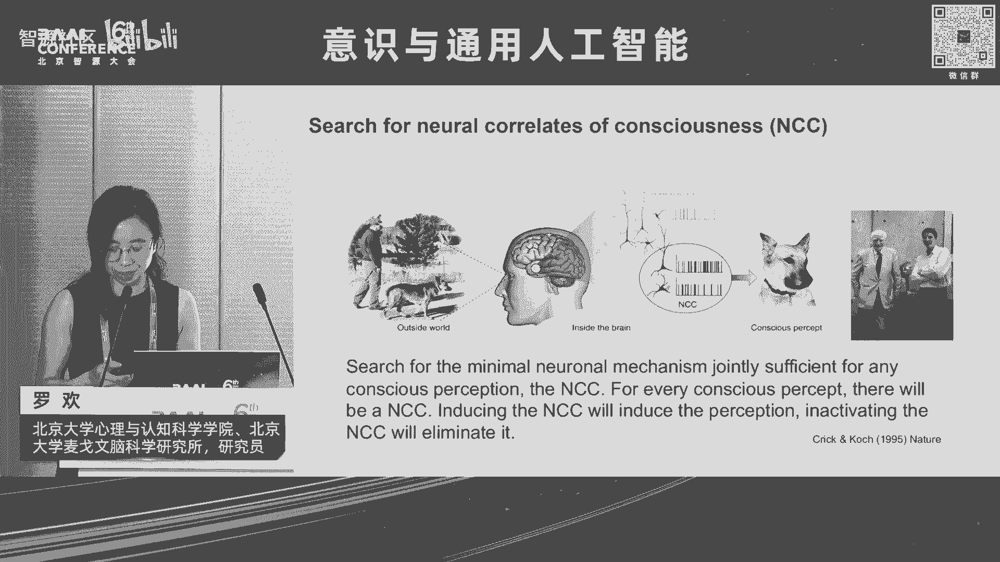

我们先来讲这两个就是呃怎么说嗯，没有完全进入热点的理论吧，一个理论呢他就认为一它叫高阶理论，它是什么意思呢，高阶理论其实非常有哲学含义的，他大概意思就是说，比如说现在大家在听我说话。

那其实你听到我说的这些话的声音，肯定是会进入你的大脑的听觉皮层被加工，然后你知道我在说什么，但是这不代表意识，意识是把我说的这个话作为一种体验，变成一种高阶的。

这个我们叫matter level的这种表征，这种东西呢已经不同于你真实听见的，真实看见的，他是这样的一个思路，所以呢他就认为这样的一个，你关于外界的这个物质，世界的这样的一种高阶的体验。

会表征在一个比较靠我们这个大脑前部的，这个区域，而且他强调呢意识是独特的，为人所独有，他不认为动物有，他认为动物可以体验，但是动物不会产生这种高阶的意识表征，OK啊这是高阶理论，那还有一个理论呢。

其实我把这两个合并了，叫做载入和预测加工理论，那么这个怎么大概是什么意思呢，就是我们这边是以视觉为例，我们都知道我们的视觉信息，从我们的眼睛会进入我们的视皮层，我们的视皮层在哪呢。

大概就在我们的后脑勺这个位置就是后面，然后这个地方的信息会沿着我们的视觉通路，传传到我们貌似更聪明的这个前面的这个前额，叶哈这块嗯，这个理论就是认为呢，我们对于外界信息的加工。

并不是一个简单的一个前馈的这样的一个过程，而是不断的在去预测外界，所以我们会有前馈，有反馈，而你的意识体验呢并不是一次的事情，而是要信息进来，然后你经过后面的这个反馈，然后两个产生了一个闭合环路。

这样的一个过程才是一个产生意识的过程，嗯这个也很好理解，比如说我刚才说了，你经常生活中有很多东西视而不见，视而不见的意思是说这个信息在你面前，它已经进入了大脑，但是它没有在你经过加工返回回来。

没有完成这个一个闭环的话，他就不会进入你的意识，当然这里面还有很多很很复杂的，这个我就不去讲了哈。

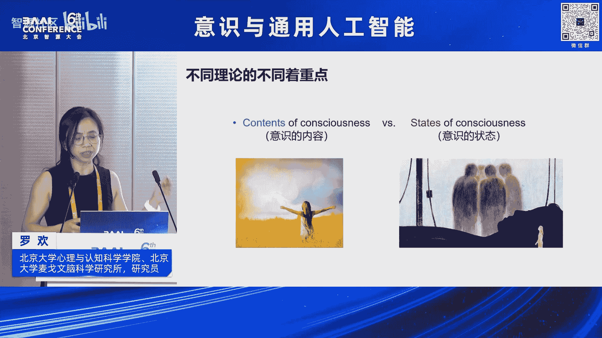

我现在就着重在讲两个，刚才刘佳老师也提到过理论，因为这两个理论也和这个项目有关，第一个理论呢其实是很好理解的，就是呃刚才刘老师说过的叫全局工作空间理论，他是这个法国科学家STAN特HAN呃。

其实还有其他的一些人一起提提出来的，他的呃理论其实很简单，他就是说嗯有点像我们现在这里，假设我们这个屋子里的所有的人，就是我们一个大脑，其实每个人都会有自己的一些小的功能模块，都会被激活。

那什么叫意识呢，意识就像是我现在站在了这个聚光灯的下面，那这个这个舞台呢我们把它称为全局工作空间，就是global workspace，它就像大脑中间的一个剧场一样，所有的信息只有进入这个剧场。

才能被广播给大家，换句话说，现在我们听众中有人有一个想法，但你没有像我一样站在这儿，那你的信息就没有广播给全脑，那你就不能上升到意识，但我不一样，因为现在我站在这个全局工作空间。

我就可以把我的所有的信息广播给大家，这个东西一旦被广播出来，他就认为进入了意识K，所以这个就是这个全局工作空间，所以我说他其实是最好理解的，就是他需要把信息在你的前额叶被点燃。

然后进入了这个全局工作空间，广播给所有的人，那么所有的人都知道了，他就成为意识上，如果你这个信息没有进入全局工作空间，那你只是残留在你那个地方，那它就没有进入意识，然后全局工作空间呢。

我这边就写了一些呃非常呃简单的一些summary，就他强调这个前额叶很重要，任何进入意意识的信息都必须在前额叶被点燃，如果没有被点燃，它就不能被进入意识。

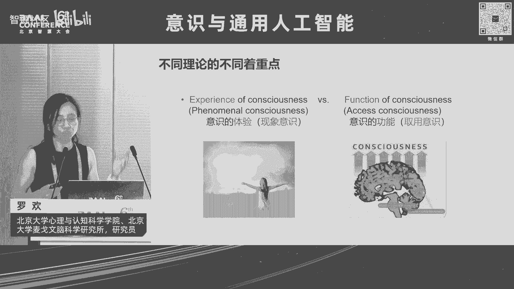

OK好这个就是全局工作空间的理论，然后呢这个另外一个理论呢和它相对的，也是我们这次测试的呢叫做整合信息理论，这个理论呢实际上是最复杂的一个理论，这个理论呢实际上嗯，它是来源于物理学家的一些思考。

他呢刚才那个是在讲我怎么样进入全球空间，我来解释一下是什么意思啊，首先他是注重现象意识，就是你不用报告，就换句话说当我看到的一个东西，我的体验是什么的，他认为什么叫意识体验呢。

首先这个系它是必须要有信息的，比如现在大家就有一种意识体验，他认为他有信息的，另外他有整合的，整合的意思就是说你的意识不是破碎的，分离的，而是一个整合的东西，你现在回想一下。

你现在的意识体验是不是整合的，确实是整合的，然后这种整合又可以区别于其他，他在这样的定义系统下呢，他就去找一种物理的结构，能不能解释这种信息整合，K，然后他的一个最重要的假设。

就是认为我们的意识是来自于这个神经元，网络本身的复杂特性，就是这些神经元和神经元之间的连接，包括它突出地址的这样的一个传递和调控，然后这样的一个抽象的神经元形成的集群呢，他们如果具有某些特性的话。

这里的特性就叫causal effect structure，意思就是说它们之间的关系是很复杂的，可以涌现出一些特性，当这个特性达到一定程度的时候，它就可以自然地涌现意识，那大家看到没有。

这里面隐含了一个假设，是你你不用去问他有没有意识，只要它的结构具备了，它就有产生意识的可能性，OK这是非常非常不同于前面的前面，类似于你要去报告对吧，这里说不是的，就比如说还是刚才那个剧场。

就假设我们这边的呃，这个桌椅形成了一种非常复杂的这个结构，网络的话，即使你们不用走到这个前台上来，你也可以产生意识，所以这个理论跟刚才那个理论，是有特别大区别的啊，那么这个理论非常难测试的。

原因就是如果你想测试一个系统的这样的一个，他们叫causal effect structure的这个值，他们把它叫反啊，它需要大量的测试，它需要去扰动，而且可能两个一起扰动，三个一起扰动。

再去观察它的扰动效果，最后根据这个计算这个复杂系统的这个程度，通过这个程度来测量这个这个结构，所以它在实验上是非常难操作的，K然后呢但是他有一个假设，就是他发现人脑的后部的脑区，特别是顶叶的这些结构。

它有很多层级的反馈的，很多的结构，他们认为这个结构是非常具有高复杂度的，所以他们认为意识不依赖于前面的脑区，而是应该产生于后面的脑区，所以这就是这两个理论最大的区别，前面一个理论认为。

我们的前额前部的脑区很重要，这个理论认为后部的脑区很重要，前面的认为意识要进入全局工作空间，后面认为意识不需要被报告，他在后面这个结构中就会自发的涌现，OK所以我把这两个理论，四个理论讲完了以后呢。

呃我再给大家总结一下这个特点，后面那个项目我就会非常简单的过了，就是这个全局工作空间呢，他其实在证据支持上是非常非常之多的，有很多的研究都支持他啊，但是呢他的对大家最大的批评，就认为这个全局工作空间。

和我们很多认知过程都会混淆，比如他可能跟工作记忆有关，跟注意有关，跟报告有关，跟很多有关，所以他好像不是一个很纯粹的意识现象，OK那么IT呢他虽然避免了这个问题，但是他太理论了，然后比较难解释。

而且他也很难去测量，就变得貌似不可证伪一样，所以呢他也是一个被诟病的这么一个一个呃。

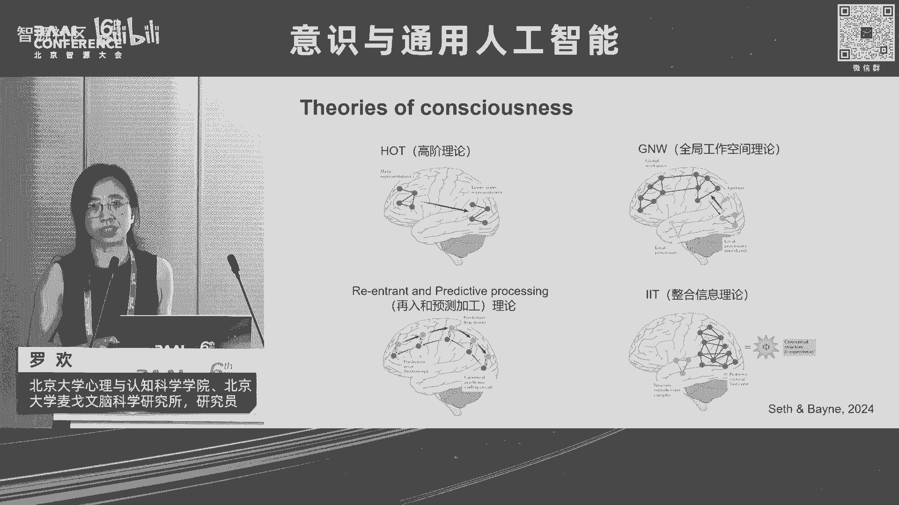

一个这个理论，那这个我们参加的这个quit project。

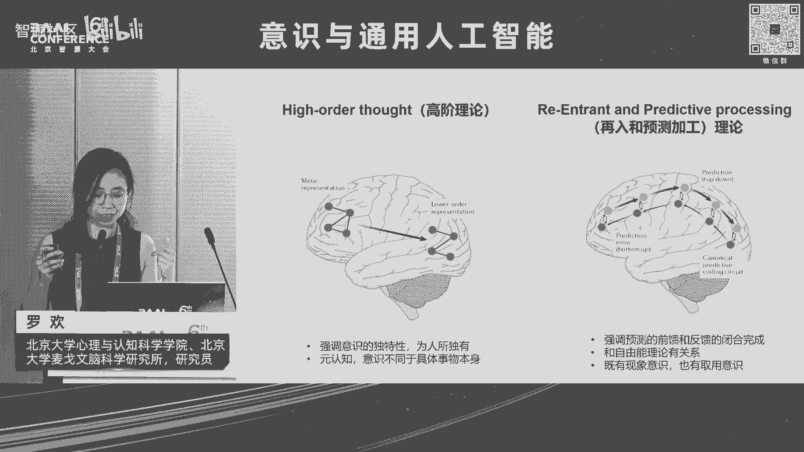

其实就是测试这两个理论，大家可能会说，那你们是不是测试出来结果了呢，所以我会非常简单的理论很复杂，在生活中，在实验中是非常骨感的，呃这个我们只要做科研的人都知道这一点哈，然后这个项目它的初衷呢。

就是右边的这幅图来解释，就是科学家当有一个理论的时候，他往往会有一种confirmation bias，就会他会在这个世界上寻找证据来支持他自己，嗯然后他就会形成这种信息茧房。

就是每个人就在自己的这个圈里面找，哎，你的证据支持我好，我们是朋友，我们两个就扩大你的证据不支持，我就不跟你讨论，或者我觉得你的实验设计有问题，所以呢这样一个confirmation bias。

就导致很多理论互相之间没有办法talk，所以这个项目呢就是也是这个cock，他们等等等提出来的，他们就希望变成一个对抗性的合作性的，由六个实验室独立的去验证的这样的一个项目。

那这个项目呢我就非常快的过了哈，它我们把它叫coach it项目嗯，他强调team science。

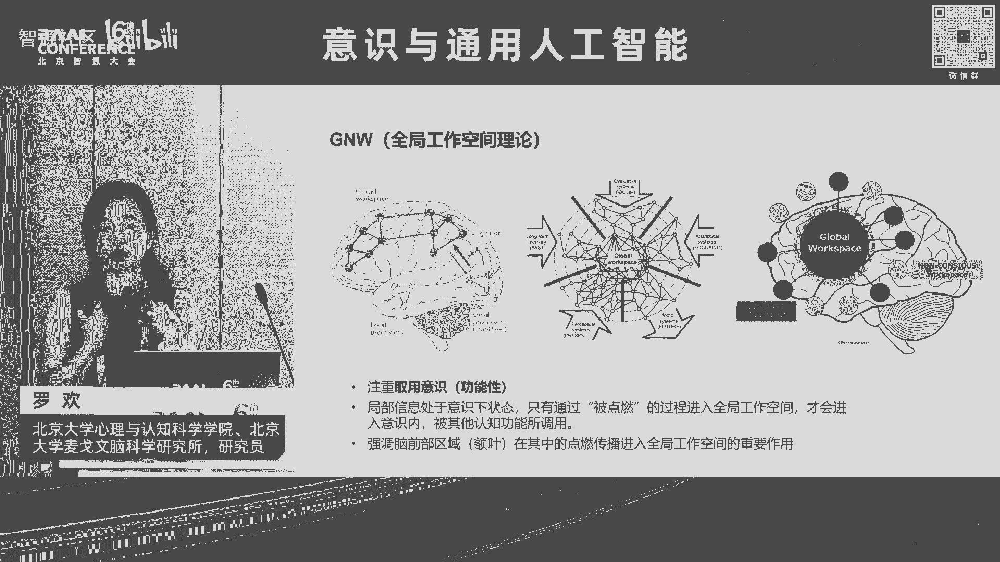

由世界上六个实验室独立的采集数据完成，他强调预注册，预注册就是在你做实验之前，先把你的假设给出来，放不放在网上，你不能再偷偷的改假设。

OK然后呢它是用了三种模态的技术，包括功能磁共振。

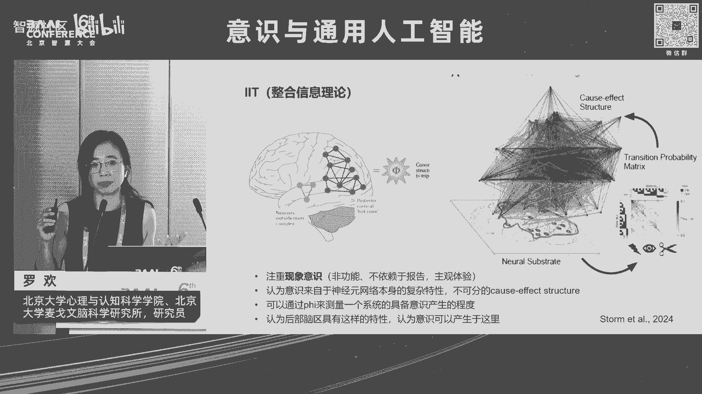

脑磁脑电和一种颅内脑电的技术，我们就是负责这个脑磁这部分的哈，还有呢它是呃标准化这个实验分析的，就是你在做实验之，在发布数据之前，你的这个分析都要在网上shared的。

你不能说我自己去developing1些。

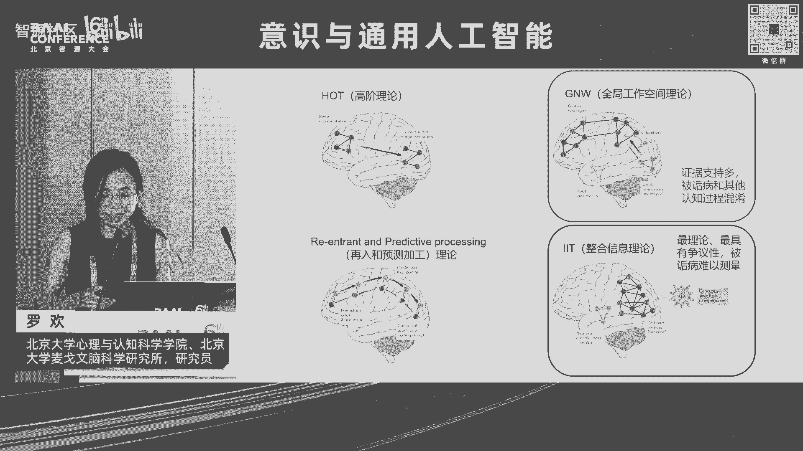

我再调调参不行，然后呢他会把big data在发布以后。

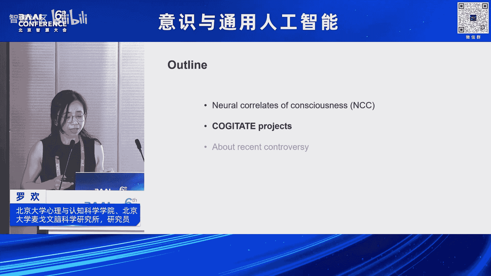

全世界的人们都可以去分析它，然后他这个analysis code，比如呃可能有人说我不会分，我不会分析怎么办，那么这些分析的这个代码也都会共享在网上。

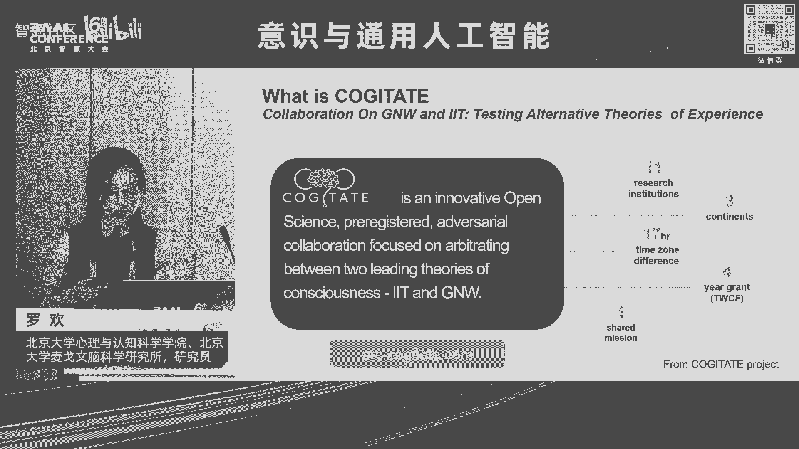

最后呢我们实际上是先做出，完了以后再去replication，另外一个就导致就是可以去很多比较fair的。

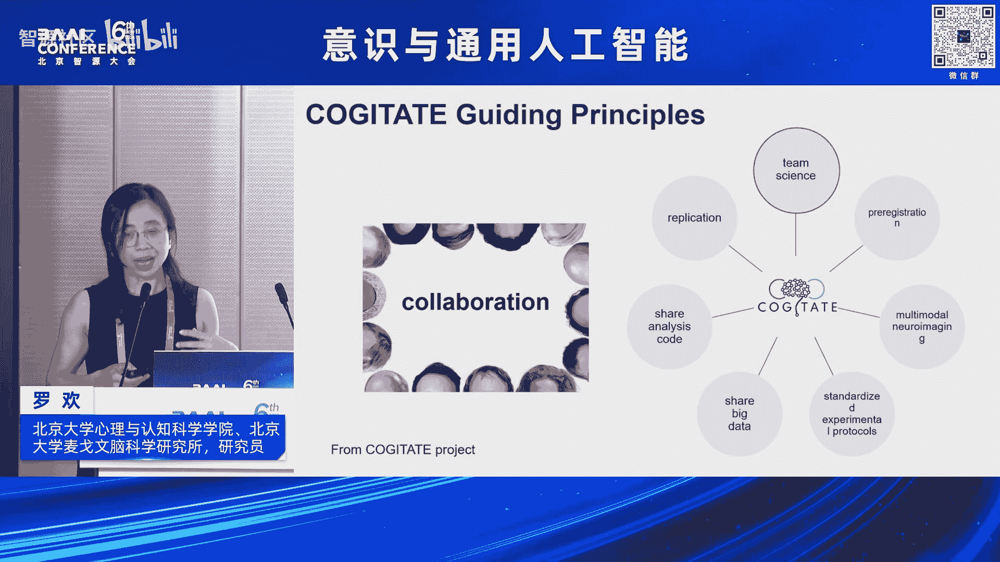

去做这样的一件事情，你可以看到这个CODY的项目是非常大的，然后里面有一些postdoc，然后还有一些呃center p i，还有一些就consultant的等等，但我特别想讲的是那个啊正好诶刘琳也在。

就是我们这个项目里面，最主要的这个真的是干活的人，就是现在在北京语言大学工作，刘玲博士，他是参与了这个项目，从2020年到现在，包括收集数据，分析数据和大家去交流等等哈，嗯在这个项目里面设计了两个实验。

我的时间已经到了，但是anyway这个实验我不给大家解释了，因为呃解释完了，大家又觉得没有意思了哈，呃如果你真的对科学感兴趣，其实这两个实验在网上都查得到，而且有具体的这个细节。

就是因为在预注册的文件里都有，然后呢在我们做实验之前，我们都会给假设这个假设呢就会产生这样的图，比如说GNW他就认为有两个假设，这两个假设呢在实验一实验二里，他发现什么。

如果他比如说大家可以看到这两个绿的，都发现了，那就是表示pass了，就表示他成功了，假如他有一个是红的哎，表示他这个理论fail了对吧，如果是一个绿的，一个黄的，表示哎它有一些challenge。

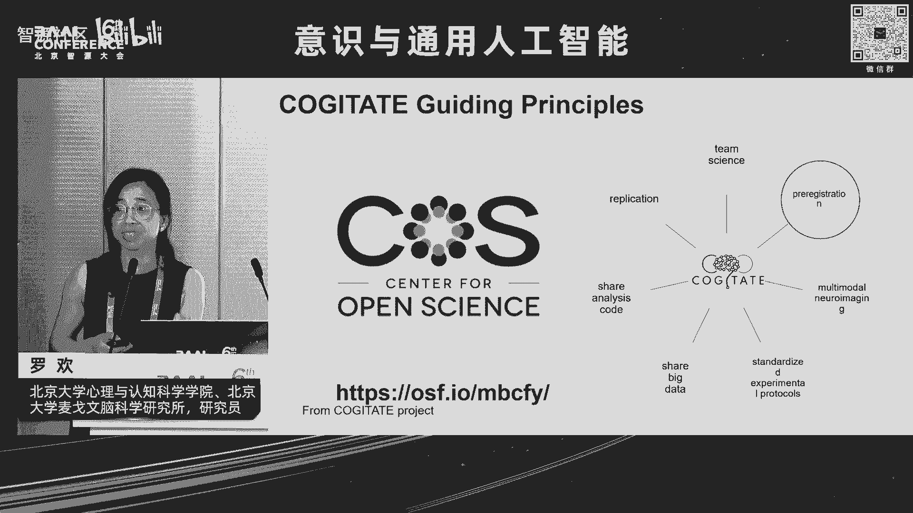

还有等等等等，会把它全部列出来，这两个理论各自都会列出来，那么最终呢你就把六个实验室的结果汇集起来，然后去测试这个东西。

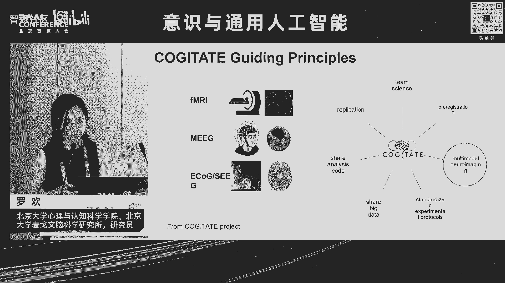

我把这些都去掉，因为这两个理论，它啊这两个实验室focus on不同的这个方面哈。

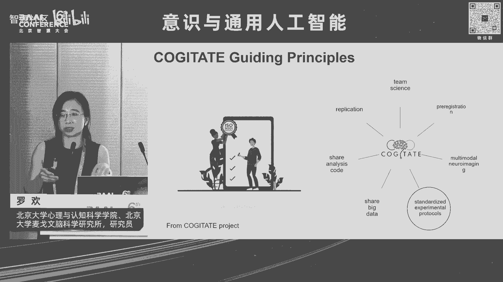

这些都非常的，我们直接看结果吧，我觉得大家也只想知道结果对不对。

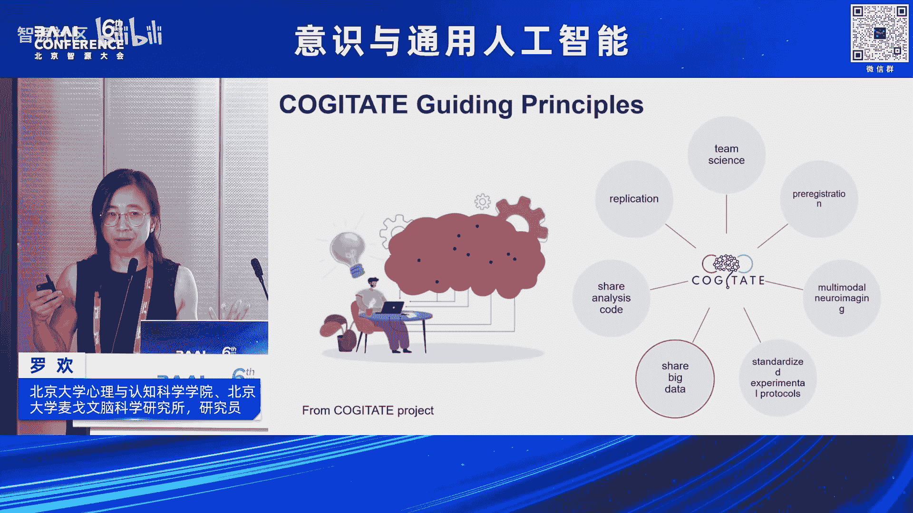

OK啊我们来看下结果，其实这幅图就是结果，这个还是很有趣的一个图，这个图呢其实就是把这两个理论，各自的发现汇集完了以后，用绿和红来代表支持还是反对，如果纯绿就是代表完全支持，然后红色就是代表反对。

那大家通过这个图已经看出来了，哪个理论好像胜算高一点呢，是IIT对吧，GNW稍微弱一点，然后因此呢我我我我我一定要在这个，哪怕今天没有时间，我一定要把这个讲完哈，原因就是因为大家看到这个图了以后。

你们的第一印象是什么，就会说啊，我明白了GG那个IIT赢了，GNW输了，所以如果我们中间有很多媒体的朋友在，我特别想强调这一点，就是我们经常会非常简单的去解释一个结果，然后本来呢这个结果不是这样的。

但是我们会把它放大传播成一个理论。

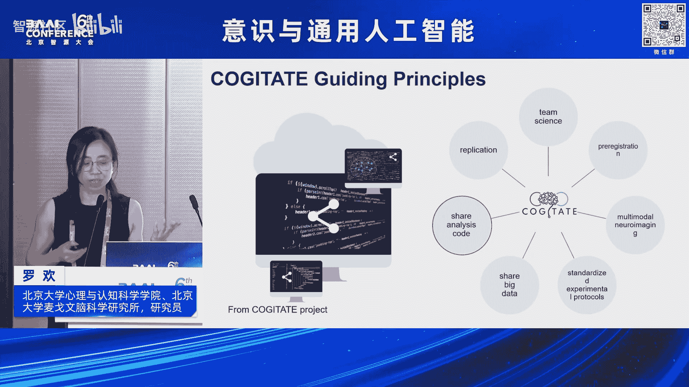

赢了一个理论输了，就是因为这个结果。

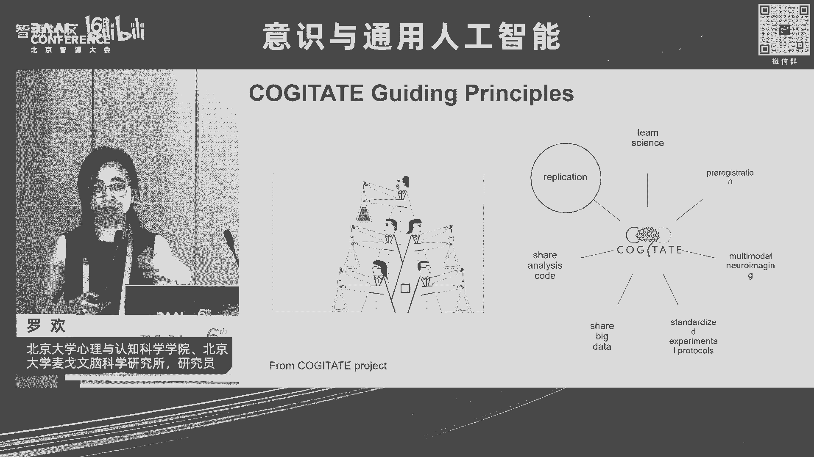

就导致了一个最近一个非常严重的事情啊，正好那个孙涛老师也在啊，就是有120万了，120几个科学家联名写了一封信，在去年的时候来认为IIT这个理论是伪科学，然后当时那个科学报道那个呃孙涛老师。

记者还采访过我这个问题，然后大家就说啊，为什么IIT是伪科学，其实很简单，原因就是这个实验的发布貌似支持IIT，但是其实它只是支持IT，在这个实验中间提出的假设，他这个实验并没有去算it里面很核心的。

那些特别难的东西，所以它其实只是部分知识，或者说我们需要在一定的约束下，去解释这个理论，比如说这个实验并不能够完全支持，it里面最核心的假设呀，这个实验也不能够完全被解释成IT赢了呀，啊总之我我我我。

我觉得这个地方是一个非常非常重要的一个point，不是说IT赢了，而是在说在给出的这几个假设中，id的证据更多而已，K最后我总结一下，就是说意识这样的一个问题呢，大家都觉我说了，他是一个最陌生的熟悉人。

那么通过这几十年认知神经科学的发展，我们感觉我们已经到了一个地步，可以去慢慢的回答这个问题，我也希望呃，我今天说的在明年的时候不是被打脸，但是我觉得好像应该永远都是对的，我我不觉得明年咱意识问题能解。

能解决是肯定解决不了的，嗯但是我们可以有多学科的交叉。

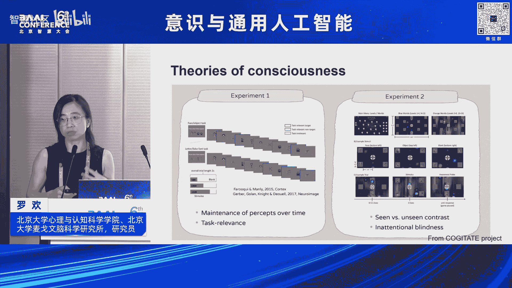

多多学科的角度，对意识理解的革命能够去帮助我们。