# 2024北京智源大会-意识与通用人工智能 - P3：构建具身的意识-主讲嘉宾：眭亚楠、提问嘉宾：朱露莎 - 智源社区 - BV11b421H7JY

呃我是做相对来讲，这个更偏向于这个工科计算的啊，所以呃所以这个今天的今天，这个报告也会从一个工程的角度，就是我从一个构建的角度啊，我们如何来构建具深的意识呃。

how do we do the embodiment of consciousness啊，对大家看到这个不是电脑有问题，或者是屏幕有问题啊，这是这个背景。

是我们的consciousness的一部分的呈现啊，所以这个我们会在后面来讲，它为什么是这个样子啊，但是在这个之前啊，先部分的呃，这个延续我们这个呃这个报告很好的传统，就我们每个报告之间。

都会有相互的这些连接的啊，我的报告和前面这个刘老师的报告，还有罗老师的报告，都会有这比较比较多的连接，首先第一处啊，刚才我们会说cheat g b t。

do you have consciousness对吧，这个有多少，大家可能在罗老师提了这个事情之后，来自己来查了一下，然后大家估计一下，CHEGPT会给一个什么样的一个结论，或者给一个什么样的回答。

他会认为自己有意识，或者认为自己没有意识，我们猜一下多少人认为他会去回答自己有意识，啊呃这个多少人会认为他回答呃，他他呃就是他自己没有意识啊，好我现在再换一个问法，多少人认为拆GBT有意识。

多少人认为拆GPP没有意识，好的我们来看一下他给的答案啊，两两种语言给出来的回答基本上是这个呃，基本上是一样，chef g b t do you have consciousness啊。

那么我们看中文的吧，啊我整个报告主要用中文来讲，没有我没有意识啊，我是由OpenAI开发的人工智能啊，旨在基于数据的模式处理生成文本，缺乏人类和动物所有的自我感知，情感和主观体验，这些都是意识特征。

哎所以他把意识特征在这个里面列了一下，我的回答是通过算法生成的，没有对内容的理解或感知，大家注意哈，这个里面其实出现这个结论呃，对于我们比较熟悉这个model building的这个，这个群体来讲的话。

这是不太意外的啊，因为这这样所有这类问题的结果，全部都被manipulate过，哈哈啊，是我们经过了这个安全，经过了对齐，经过了好几轮的这些处理，最终让大家看到一个让我们觉得。

Not very senoffensive，或者是even not offensive at all这样的一些结果啊，那么这个结果本身是这个four o的这个版本，给出来的啊，那么不同的版本。

大家也可以来测试一下它的它的这个效果啊，那么这里呢前面呃老师们也讲了，说哎这个呃意识到底是人所有，还有还是这个呃人独有，还是人和动物可能都有对吧，大家可能从CHEGBT的这个回答里面。

他至少在这个事情上他是有倾向的好啊，那么这是简短的一个，对于我们前面问题的一个回应啊，那回到我的报告的这个主线上来讲啊，我们把那个意识的背景去掉啊，清晰的看到我们如何来想，通过接下来的20多分钟时间啊。

来给大家来讲一讲，我们可能以一个什么样的方式，可能能够从下而上的，以这种自下而上的方式来构建自我意识啊，我们的意识包括有对外的，有对内的，那么今天其实主要讲的是对内的。

how to build the self consciousness from the bottom up啊。

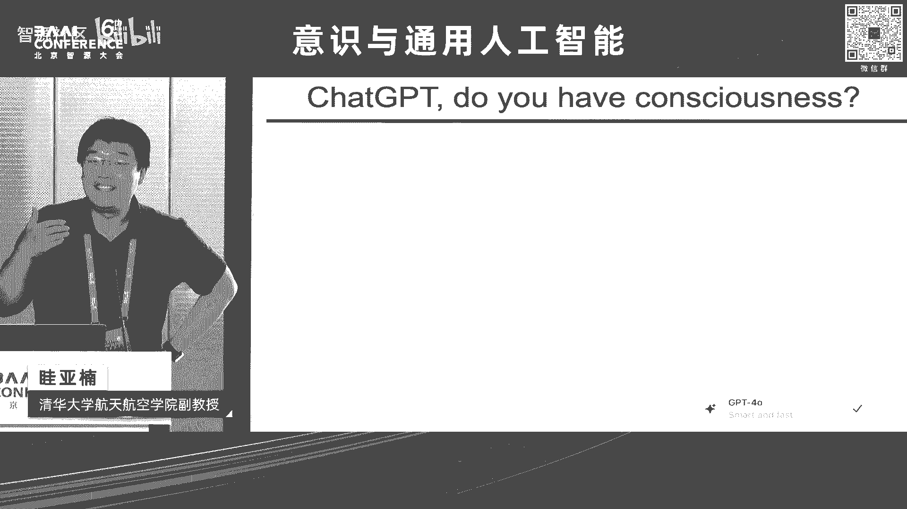

那么也就是说我们呃这个在报告的结尾的时候，我们看到这这是什么啊，how do we dive into the sea of self consciousness啊。

那么以及他和接下来的我们的非常直观的，这些运动行为之间到底有什么样的关系啊，那么他们两个之间的这是怎么样来关联上的啊，那么这和我的研究主线有关啊，那么我研究什么。

我其实研究learning to move啊。

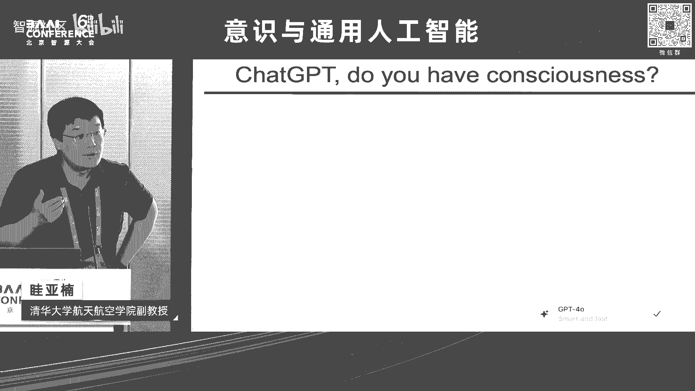

我们如何来运动啊，那么这里更为具体一点，learning to move是一个非常非常宏观的一个描述啊，那么更具体的我的研究命题是面向聚身，智能和脑机交互的主要是人类的这个神经肌肉。

骨骼系统的建模与强化学习啊，那么下面这个小括号里，其实会更加偏向于一些理论，还有方法上会比较关注安全，关注偏好反馈，关注结构化的决策空间的优化啊，那么前面两个安全约束和偏好反馈呃。

这呃在大概2018年到2022年之间，逐渐变成了比较热的这个话题啊，那么结构化的决策空间啊，这其实我今天要讲的主要的内容啊，也就是其实是我们如何来构建世界模型，如何来构建自身模型，以及在这个基础之上啊。

到底什么是自我意识，以及我们如何能通过构建的方法来形成啊，那么今天时间有限啊，我们主要可能还是会围绕着这个自身模型的，这个构建啊，因为本身世界模型的构建，其实是聚深智能领域里面。

大家如果明天去听聚神智能的报告，这个几乎是呃所有的这个报告里面，主要都在讲世界模型啊。

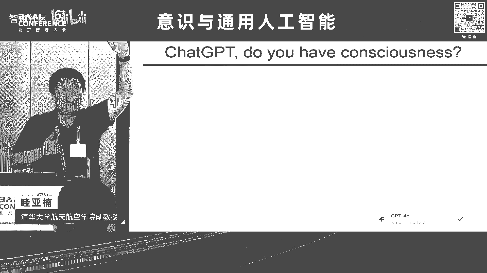

呃这个自身模型，可能这是我们是唯一一个来讲这个事情的啊，好啊，那么我们在座的很多是对于这个心理认知，感兴趣的同学们啊，大家可能对这个名字比较熟悉对吧啊，WILLIAMJAMES啊，也是美国的早期的这个。

非常有代表性的心理学家啊，那么同时呢早期的这些都是全才，既是心理学家，也是哲学家啊，那么他在这个1890年，也就是130多年之前的，这个当年非常有影响力的一本教科书里面啊，当然就提出来过，不是原话啊。

但是我做了一定程度的这个呃，这个不改变其本意的，这样的一个这样的一个转述的表达，Thinking and movement are driven by common mechanisms in the brain。

啊啊这是当年心理学仍然在很早期的阶段，人工智能领域不存在啊，那么研究movement本身是有一些比较，比较这个悠久的传统，大家知道达芬奇及达芬奇，在以前我们很多的定量的对moments研究啊。

那个时候他提出来的这个假设，直到今天呃，我还是比较认同啊，那么当我们把thinking和mo呃，Driven by common mechanism，这件事情可以放在一起来谈的时候。

其实这里面就进入到了我研究领域，强化学习，Reinforcement learning，大家看到右边这是经典的这个sun bartle，reinforcement learning的教科书啊。

中间呢这是说reinforce learning是什么啊，是我们有个体啊，智能体可以是agent，我们有环境啊，然后呢我们有状态空间，左边state space，我们有动作空间啊，那么他们共同来构成。

强化学习的主要的这些单元啊，那么在这个基础上，我们来看如何把世界模型，自身模型和自我意识啊一步一步的来构建啊，那么可能在座的听众，不一定对于这几个关键词都那么熟悉。

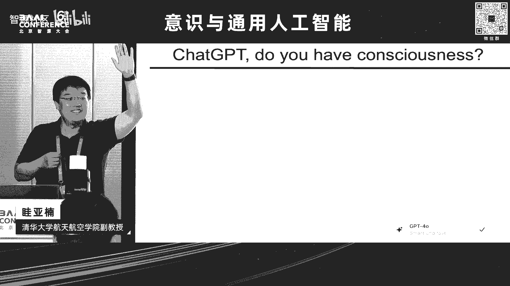

没关系，我们一个一个来，what is the world model啊，那么work model本身，在今天其实有两大类的这样的描述啊，大家这个如果你们去看的话，这里并没有形成一个统一的。

对什么是word model的一个，这个这个完全没有争议的一个结论啊，也在于说这是一个快速发展的领域，但是大的其实是两类，一类呢是什么，一类是上面的这个小标题。

The image of the world around us，which we carry in our head is just a model啊，那么从这个视角来看啊。

就是我们如何构建一个抽象的，对于世界的这样的一个表征啊，这是这是一类这个很重要的，很有道理的一个想法啊，说什么是world model，this is the world model啊。

那么右边的这其实是另外的一类，我们从工程和技术的角度上来讲，以构建的方式我们来构建simulation environment，大家今天看到的所有在现实世界里面，能够用的比较好的这些这个机器人也好啊。

我们聚神智能的也好的，这些场景都是有赖于过去的这几十年里面，Simulation，Environment，出现了一个这个这个快速的一个提升啊，那么这是我们对于事件模型啊，两类主要的理解方式啊，来这这里。

这里其实可能这只是主流的这个认识啊，并不是特别的精确啊，但是我们今天也是这个，不追求特别的精确的细节啊，再就是自身模型啊，what is this self model啊，那么self model。

那么这个其实也有非常悠久的历史啊，know the self啊，就是我们如何来认识我们自己，这也是这个雅典的这个神庙里面的非常重要的，这个格言之一啊。

这其实self model看我们对于self的定义是什么，它可以是聚身智能领域里面，研究非常多的机器人，机器狗这个机械臂的这些这些场景，或者是自动驾驶的这些无人车等等啊，那么它可以来做一个非常高精度的。

数字孪生的一个展现啊，那么这是一种来构建自身模型的方式啊，那么未来的环境里面如果没有人啊，只有这些设备的话，那么我们能以一个近乎完美的方式，对于它们来进行模型的构建啊，但可能那不是我们希望看到的啊。

我们希望在未来看到的环境里面，仍然是有人的存在啊，那么对于人的存在，那么就需要我们有对于人的模型，对于人的构建啊，那么可能终极的我们的环境，反过来是要和人来交互的，而不是完全和没有人的。

这些系统来进行交互的啊，那么这里就会有人的骨骼肌肉系统的展现呃，也会有人的神经系统的这样的呈现，共同构成我们非常复杂的self model啊。

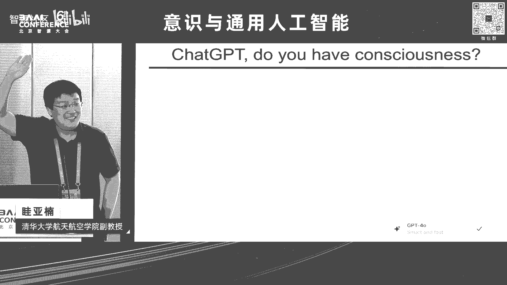

好那么我们有world model，我们有self model啊，在此基础之上，我们可以来谈一下意识啊，好这里同样的前面两位老师都讲了，我们其实对于意识今天没有一个很好的定义啊。

上面这其实是一个描述性的定义，这个描述性的定义也是翻了很多地方啊，最终回到了wiki p点，大家在wiki上面找consciousness这个头条，第一个第一句话就是这句话，但它是一个描述性的。

它不是一个很好的一个定义，为什么我们来读consciousness，At the simplest，首先这里放有一个简化，At least simplest，这就是我们不喜欢的对吧，但是没没没办法啊。

我们继续来接下去，is awareness of internal and external existence啊，这里其实问题主要出现在那个标黑的关键词，awareness啊。

他用同义词来对这个概念进行解释啊，这不是一个好的解释，对不对，我们相当于数学上我们用本定理来证明本定理，这件事情肯定是老师会给我们扣分的，对不对啊，但是没办法，在我们的这些偏向于前沿的很多这些领域里面。

它会存在大量的这种模糊，我们一看这个概念觉得非常有道理，我们第一印象会觉得非常有道理，但是接下来一看不对，awareness是什么。

awareness on就是consciousness的另外的一个描述啊，好那么这里面我们不纠结他的这些具体的定义，今天我们没办法给他一个明确的定义，哎但是我们看下面的啊。

Is awareness of，What is awareness of internal and external existence，这里的internal和external existence。

就对应着我们前面几张片子里面给大家讲的，soft model and world model啊，好那么今天呢我们不讲word model相关的事情，我们就从self model出发啊。

从它以它为基础来构建self consciousness，这里我专门写了个括号，Self awareness，大家如果上网来查说哎what is self consciousness啊。

会发现大量的用self awareness啊，来解释它来做这个替代关系的，对吧啊，还是说这这个本身并不是一个很好的一个，最解决方案，但是没办法，这就是我们在这个领域里面的现状啊。

下一页幻灯片会非常有意思，下一页幻灯片大家刚刚看过啊，is theories of consciousness啊，主要的这这几个，但是这里我不去讲他的这些细节啊。

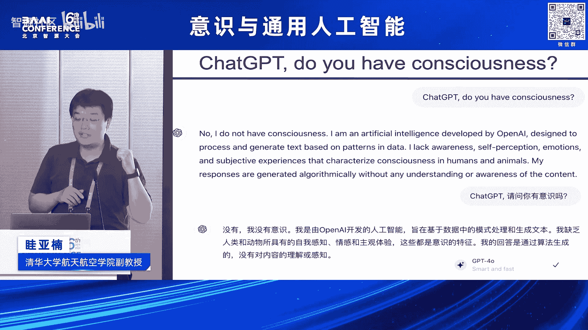

这里我们讲他的limitation是什么啊，整个这一系列的工作，其实一个很大的limitation是最后弹出来的这一项，the spring in a vat啊，这是缸中之脑的研究方式。

所有的关于这个领域里面的，大家的这些这些重要的研究，前前面的这个罗老师讲迪奥的研究，tony的这这这些研究等等，大家在就脑子在说脑子这件事情啊，那么就脑子在说脑子这件事情，和这个没有区别啊，对吧。

我们把它来放在一个好的一个培养基里面啊，然后我们认为他可能重要的是什么，重要的是到底输入和输出是什么，在这里如果我们只看一个片段，一个截面，意识是不存在的，意识一定是一个有时间变量的，而一旦有时间变量。

就涉及到了它的输入和输出是要同时存在的，以及是要连续性存在的，大家回想一下，我们前面讲强化学习的这个loop，本身就是在讲这件事情啊，所以这也是引出了，我们为什么要讲说意识的具身性啊。

那么一元论和二元论啊，在这个事情上，本身这个报告是来支持是一元论的，意识是有它的这个具身性的，以及它的具身性，有可能是不是能够通过对于世界模型，还有对自身模型的深入的研究啊，去实现一个理解好。

那么这里最这个这个高亮的，这个自身模型的部分啊，我们来简单的来这个呃这个来接呃，向大家来这个汇报一下我自己的研究组啊，在这方面的一些探索啊，那么呃首先我们来看说self model啊。

对于我们人来讲可能和环境交互的这个系统啊，首要的是人的神经肌肉，骨骼的这样的一个动力系统啊，那么我们是不是可以把这个系统来做一个建模，来作为我们self model的一个起始啊，好。

那么要做面向感知和调控的这个中枢和外周，神经系统建模啊，对不对，因为我们说如果只有中枢，又只有中枢的脑的上面这部分的话，可能我没有办法充分的来体现意识的具身性啊，所以我们从中枢和外周来做这些。

模型系统的构建啊，这里有一个非常幸运的事情呢，是我们本身有大量的这个领域的同行，大家在做脑的建模啊，从图谱的角度，从整个功能的这些连接的这些角度啊，所以呢我自己的研究组啊，这个规模非常有限。

我们能做的事情非常有限，我们其实把中枢的这件事情，希望我们的同行们能够快速的把它做出来啊，所以我们更多的是做Y轴，我们更多的是为什么我们title叫做这种，自下而上的方式。

我们希望先从简单的这些部分来做起啊。

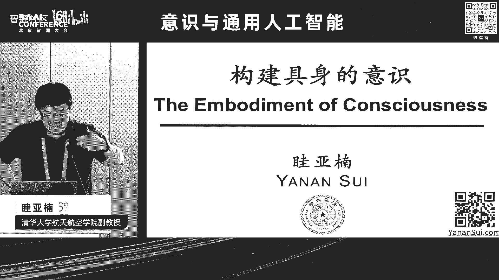

好那么这是神经的方面，不是我们今天的主要的这个呃，这个报告的主题啊，今天主要报告的是从神经的再往下的啊，肌肉骨骼的系统，这也是我们今天不管是来类人的，人形机器人也好，还是我们自身也好啊。

这是具身智能和面向具身智能和人机交互，的一个基础模型啊，这是我的研究组来做的，一个我们叫精确的全身的肌肉骨骼模型系统啊，构建与控制啊，我们给它起了个名字叫做muscular scatal。

human seven hundred啊，呃这个MS作为这个muscular skeleton呃，这个肌肉骨骼模型的这样的一个缩写啊，那么seven hundred是什么，我们下面会说啊。

好这是一个完整的人的骨骼，肌肉的这样的一个呃，这个肌肉基建单元的构建啊，我们在这里所谓的完整，就是在我们有限的这个进化，如果我们往前看100年，1000年，1万年，10万年，大概在这样的一个尺度上的话。

我们大概不会比这个模型在发生什么，实质性的变化，所以这个模型做到这一步上，我们至少从肌肉的数目上来讲，我们已经做够了啊，从我们这个物种，从我们这个物种来讲啊，而我们希我们希望来做到高的解剖精度啊。

以及呢在这个高的精度上，能够和外界环境来交互，以及可以来实现一个高的计呃计算的效率啊，我们做了这么多的这些肌肉骨骼，如果没有办法去很好的控起来啊，没办法让它来实现类人的这些行为的话，我们在他的基础之上。

也没有办法来研究任何和意识相关的东西啊，好那么这是我们为什么管它叫ms human seven hundred啊，因为它一共有700个肌肉基建单元啊，我们人有多少块肌肉啊，200多块啊，还有吗。

肯定不是700啊，告诉大家，因为这基建技术基建单元是有这个拆分的啊，多少还有200多，300多，还有，我们有600多块肌肉啊，那么在座的各位，其实大家的肌肉的数目，可能精确的数字是不太一样的啊。

我们的我们的肌肉介于骨骼和这个神经之间啊，我们的骨骼基本上健康的这个成年人啊，大概的这个骨骼的数目是一定的啊，那么人的神经元的数目是大家是千差万别的啊，那么肌肉其实是600多块，但是不同的人啊。

这个在我们的这个进化的链路上来讲，机有的数目会多少有一点不一样啊，但是也不会差太多啊，600多块肌肉，我们把它做成700个这个肌肉肌腱单元啊，的这样的一个呈现，这是我们的面部以下的整个模型的构建啊。

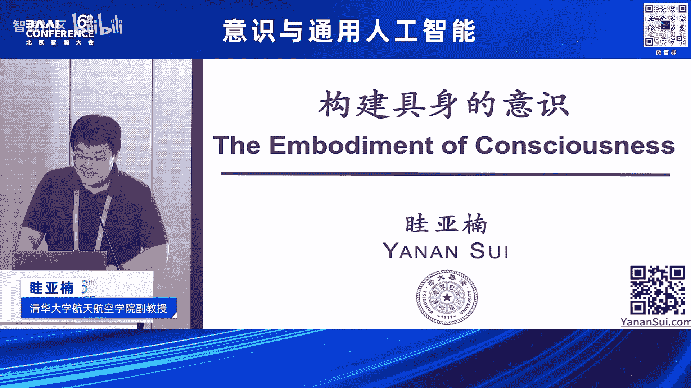

那么它可以做什么，它可以做和机器人的交互，和外界的这些设备的交互，它可以做很多的，我们从世界模型到构建了这个自身模型，可以在这个基础上来实现自身的控制啊，那么我们可以在此基础上来实现。

说诶一些是不是和意识相关的啊，一些研究啊，那么这里其实是关于这个模型本身构建的，一些这个具体的细节啊，我们如果想以自下而上的方式来构建，高级的这些功能，我们希望先把低级的底层的这些东西。

尽可能的做的精确一些啊，那么这是body segments呃，大家可以这个粗浅的认为，就呃这个简单认为这本身是鼓的啊，这些这个呃不太可以整体连接在一起的，这样的一些单元的数目啊，我们的关节的数目啊。

然后我们总共的这个肌肉，肌腱单元的这样的数目好，那么为什么我们说哎我们有600多块股，但是要做700个基，有基建单元啊，那么这里其实是大家看右边，这个是一个典型的例子，腰大肌让我们来维持站立的姿势。

非常非常重要的一个这个这个呃，这个呃一一个主要的肌肉啊，那么它其实是有多个连接端的啊，那么这样的多个连接端的这些肌肉，我们会把它做相应的拆分啊，拆分成若干个肌肉基建单元啊，这是为什么。

其实建呃我们这个模型整个建立起来，虽然它还没有包括我们面部的肌肉，我们一些其他的这个呃呃运动相关的这些呃，这些这个这个，但是和骨骼运动这些没有太大关系的这些肌肉，但数目也已经超了啊。

我们还可以再继续的把它再进行，更精细的一些拆分，以及对于每块肌肉啊，肌肉的控制本身上来讲啊，它其实是也是一个非线性的啊，一个通过神经激活的这样的一个过程啊，那么好了，我们希望是能够以一个神经激活的方式。

来得到肌肉的激活，从肌肉的激活再得到肌肉的力，从肌肉的力再得到它驱动我们关节运动的力矩，从驱动关节力矩，在得到我的这个人是如何来运动的这个样子。

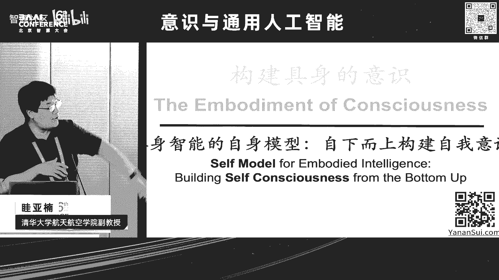

来进行一个自下而上的构建啊，啊，那么这也要求我们确实，在整个建模的这个过程当中啊，对于人的解剖，对于人的整体的这样的一个系统的构建啊，要有相应的这些工作啊，那么这样的模型也会比今天我们看到的。

聚神智能系统里面的这些典型模型啊，大家会看到说哎，我们会今天看到有很多四足的机器狗，轮组的机器狗，人形的机器人，整个机械臂等等，这些控制的维度和我们观测的维度，也就是前面讲的。

action space and state space的数量大概是在怎么样，数量基本上都是在这个few dozens啊，几十这样的一个数量啊，那我们肌肉驱动的人体模型，已经在这样一个简化层次上哈。

它是要上了一个多数量级啊，将近有将近两个数量级的这样的一个规模啊。

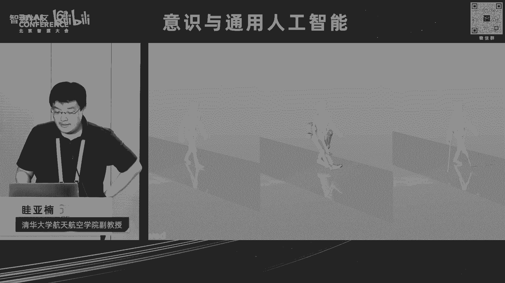

所以我们如何把它来控制起来，其实也是一个非常困难的一个事情哈，那么这里我们不去讲特别细节的诶，我们如何去把它来控制起来，在这里面我们来讲说简单说一下，这里面其实自我意识是如何来体现的啊。

自我意识在我们的这个问题里面，我们认为它是你所有可以以这样的形式来上升，向上传的这些信息啊，那么它是自下而上来形成意识的唯一的源头啊，对吧，所以呢我们的这些PROPERCEPTIVE啊。

本体的相应的这些感觉啊，我们是人人在实时的从我们身上的所有的肌肉，获取相应的信息，至于这个信息到底到哪一集被整合到哪一级，被过滤啊，到哪一集开始，这个呃这个能够被我们的意识进行显著的放大。

这个事情我们今天还很不了解啊，但至少我们知道的是，这些是我们对于本体感觉意识的这样的一个。

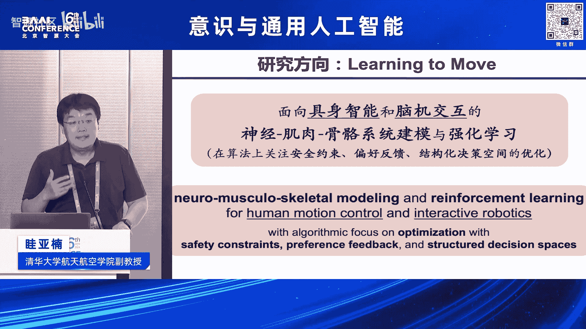

来源所在啊，好那我如果能够有好的控制的方法，能够把这样的一个，这是今天为止可能最累人的一个动力学的模型，能够把它驱动起来。

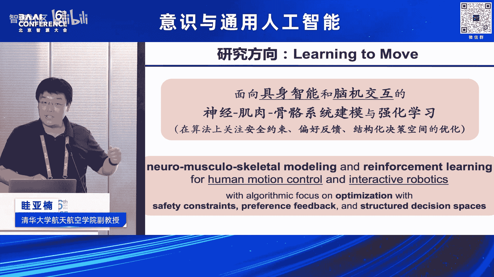

那么我们可能就有希望能够知道说哦，那么这个运动相关的这些意识的来源啊，是什么样子的啊，因为当我们看到这些模型的时候啊，我们会知道说诶人来做这些动作，我们都会做啊，但是来做这样一个动作的整个时间序列里面。

你身上的每一块肌肉是怎么样来收缩的，这件事情没有人知道，我们也没有实验可以来对这件事情进行测量啊，那么我们能做什么，我们能用模型来逐渐的来逼近这个过程，然后模型可以告诉我们一些。

我们可能永远都没办法真的在人身上去实测的，这样的信息的输入，并基于它来看哦，到底什么是我们形成高级意识的，这些基础的输入的信息源好。

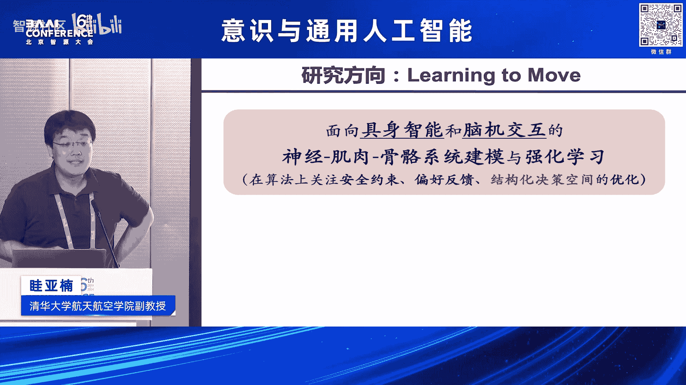

那么同时呢，我们还要在人上来做相应的这些实验，来确保什么，确保模型和真的人的这些运动的过程，本身它是这个符合的啊，它没有一个这个显著的这样的一个偏离啊，这是怎么样，我们从世界模型到自身模型。

到最终能够形成自身的这样的控制啊，那么大家可以看到说诶，这是本身我们来可以控制它，来模仿一个这个呃，111个一个特定的人的一个步态啊，那么左上角这是我们本身都是我们的模型啊。

整个四个图都是我们的这个模型啊，但只有左上角是我们的方法啊，呃我们希望最开始希望把模型做出来之后，现有的方法就能够把这模型很有效的驱动起来，但后来发现显然不是这样子，不管是自然行走也好。

还是我们让这个人来穿上一个外骨骼也好，对吧，将来大家可能会想一下，就我自己来在各种各样的这些与环境交互的，这些测试里面啊，在你真的去做这个之前啊，我们可以来做这样的一个事情来试一试啊。

以及对于一些这个残障的人士，比如说需要安装假肢的人啊，我们来simulate本身这个假肢装上以后，他拿着这样的一个东西到底舒不舒服，到底能不能走啊，到底能不能实现它的，整个在这个过程中的信息啊。

本体感觉的所有的这些信息是怎么向上传的啊，以及基于他们可能我们如何来形成。

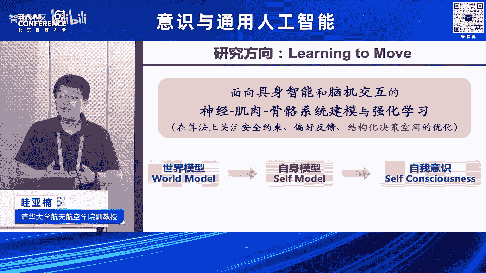

相应的运动相关的一些意识啊，好，所以这些都要求我们能够，有效的把这些系统能够控起来啊，好啊，那么前面的这些这个前面的这样的一些就是呃。

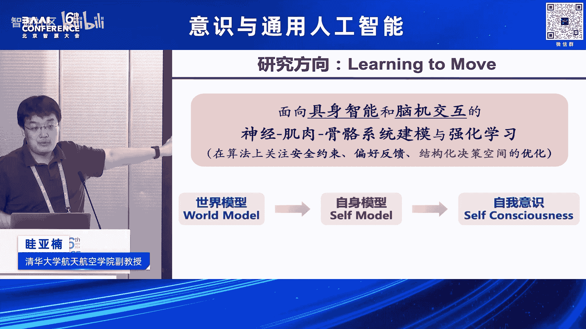

算法类的工作啊，其实我会呃相应的我们我们都略过去了，这里涉及到大量的需要这些呃机器学习的优化，还有一些高性能计算的啊，所以在这里大家看到右下角，我们也会致谢这个AAMD。

对我们来提供这种这个高性能的计算的这些呃。

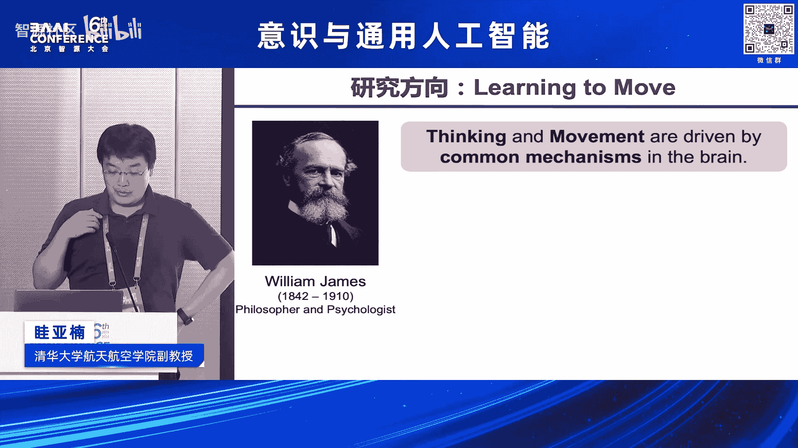

这些平台啊，呃那么那么最终我们自下而上来构建的。

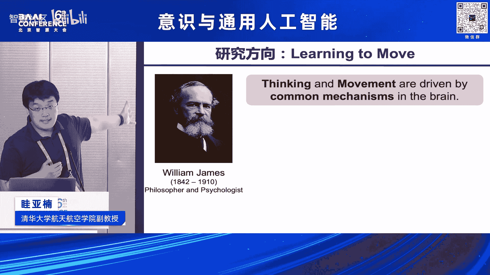

这些自我意识，大家看到的，我们其实这个在开篇整个这个蓝的非常闪啊，让人觉得看不清标题的这是什么，这是我们本身整个这个人在实现左边的这个，步态的十秒的过程当中，当然我这里在重复循环的在放这十秒钟啊。

那么本身它的本体感觉向上传的这些，将近3000维的这些信息，当然我们这是简化了，因为是每块肌肉，我们把它来做一个有限维度的，这样的一个处理啊，好下面红的这个矩阵随时间变化的，这是本身我们的。

给他所有肌肉的这些控制信号啊，你要有这样的控制信号，它才能够动起来啊，不然的话他是可能马上就会摔倒了，大家注意，这里是基于动力学的，真实的这样的这个控制的方式啊。

它不是computer graphics，像计算机图形学动画一样，这些来做一个动画效果，这是真实的可驱动的啊，这个物理的过程啊，那好了，那么在这个层面上来讲，我们可以后面更进一步的去把它和人的。

向上的神经系统去结合，去看我们如何真正能够对于意识的自下而上的，一步一步的这个形成有一个量化的一个描述啊，好所以左边我们会这个点，今天的题，这是我们今天的self model啊。

也是AGI路上的很重要的一步啊，今天这个我们我们觉得这个AGI，只是时间问题是吧，可能不是有无的这些问题啊，那么整个的我们的背景其实是这个，我们如何来dive in the sea of the呃。

self consciousness啊，好那么最终这个我做一个简单的总结，今天的报告呢，其实是主要聚焦于我们聚身智能的这样的一个，自身模型的构建啊，也是希望通过它能够以这种自下而上的方式。

from the bottom up的方式，来构建一个这个意识的一个量化的一个描述啊，我们从世界模型到自身模型啊，到最终的这个自我意识，可能在此的这个呈现的这个方式啊，那么也是在这个过程当中啊。

我们这个会可在可预见的这个将来啊，我们会希望和大家一起来迎接我们人类智能的，这样的一个巨变的时代啊，这个聚变是fusion啊。

这个聚变不是那个dramatically changing或fast changing啊，虽然说这个也是一个呃很有可能发生的事情啊，但是the fusion of human intelligence。

这是我们在今天有非常强的感觉，正在发生以及会持续的快速发生的啊。

好的我就在这里结束我的报告啊。