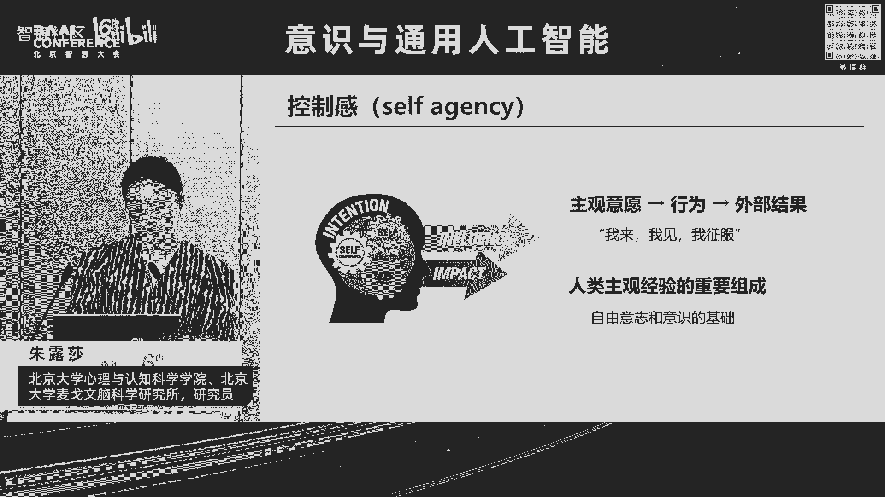
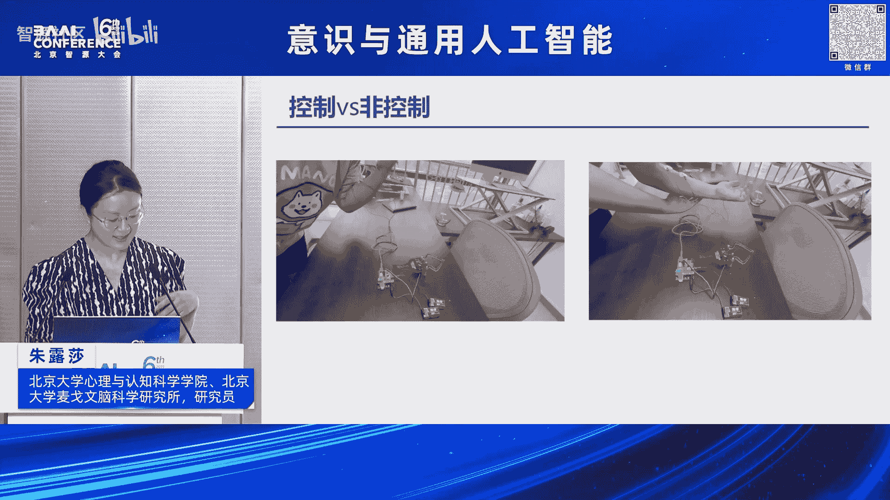
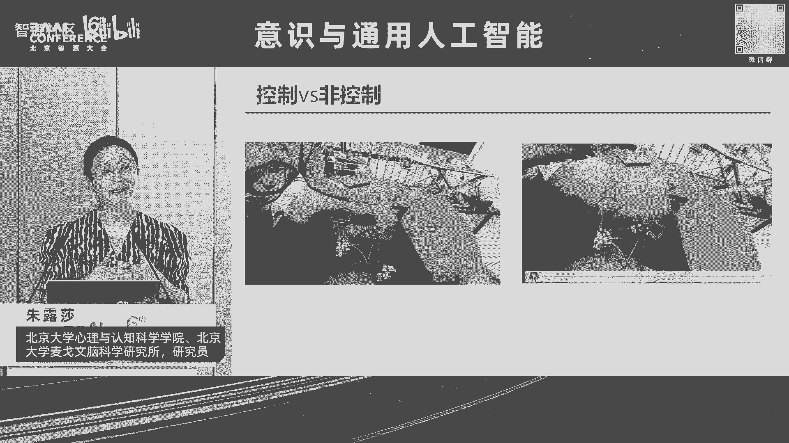
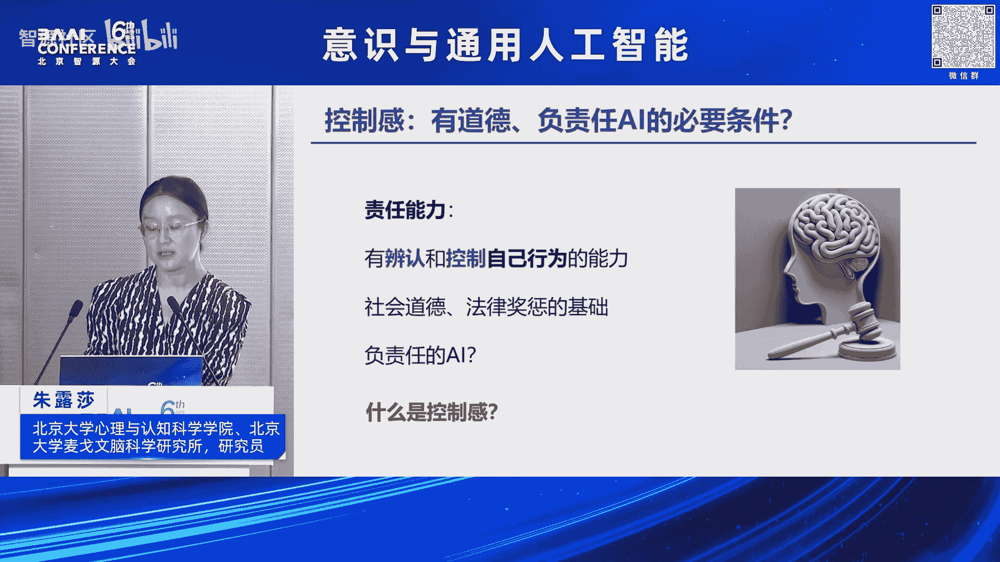
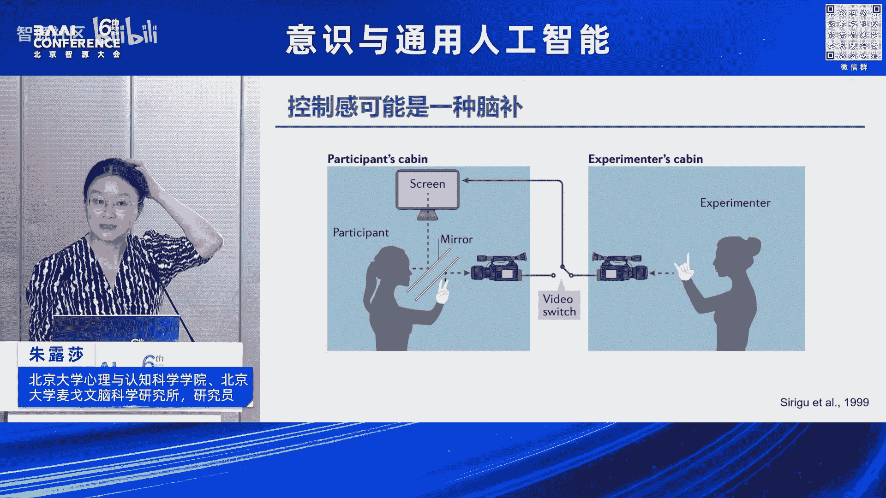
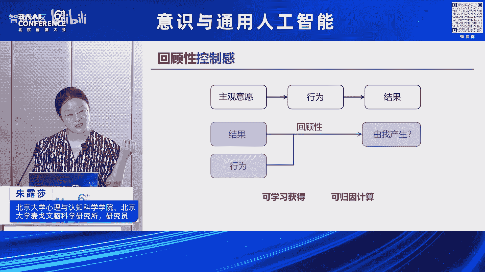
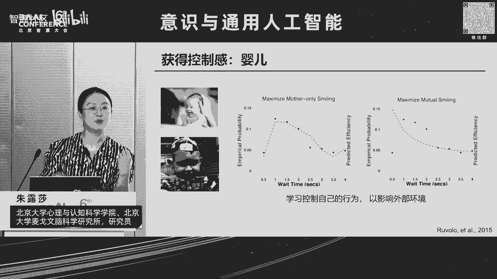
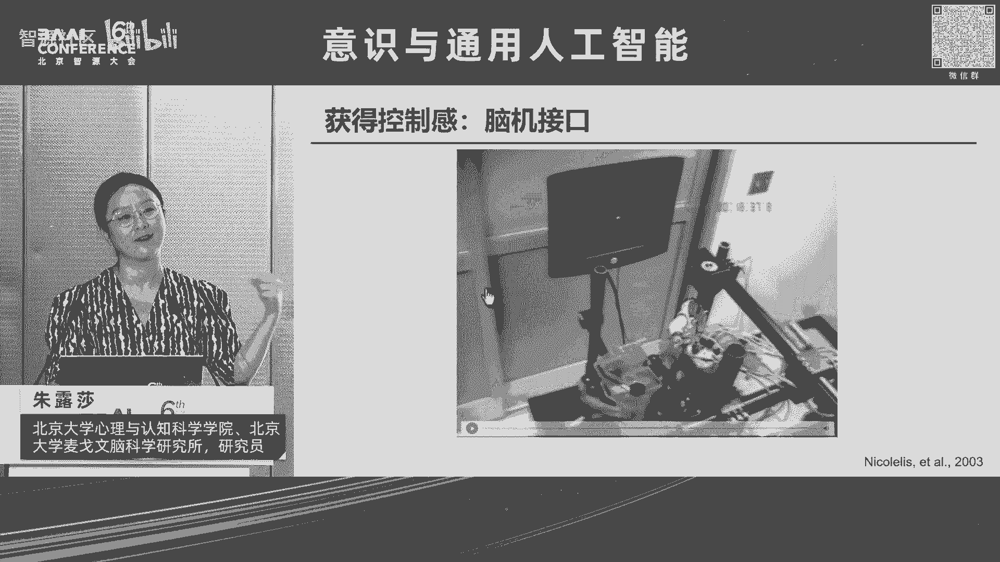
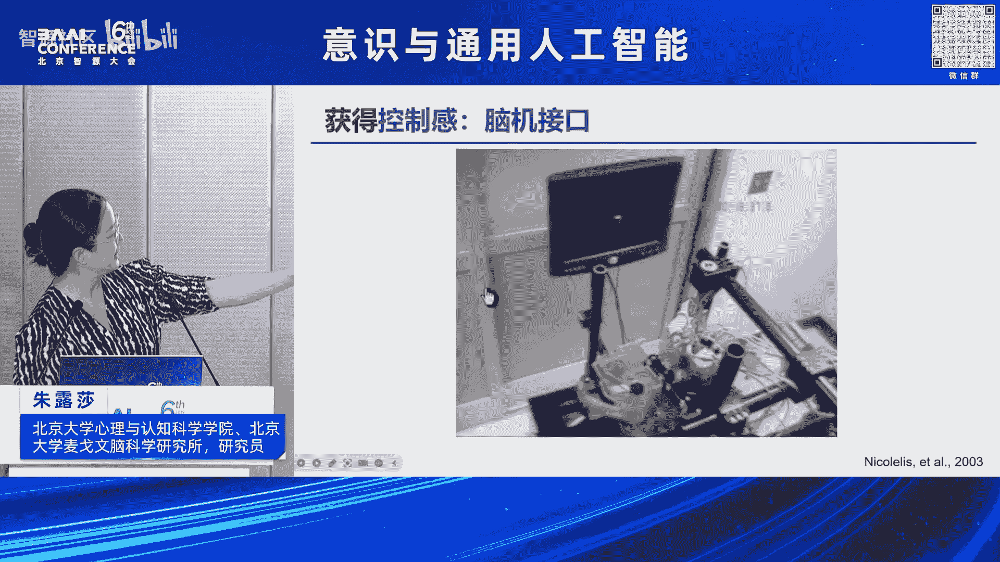

# 2024北京智源大会-意识与通用人工智能 - P4：可计算的自控感-主讲嘉宾：朱露莎、提问嘉宾：吴思 - 智源社区 - BV11b421H7JY

OK啊谢谢大家，然后我今天要讲的题目是可计算的控制感，那什么是控制感呢，给大家举一个例子呃，Imagine，你现在回到家，天黑了，房间一片漆黑，你伸出手去非常习惯，你要伸出手去按一按一下那个电灯的开关。

这都是你每天做过很多很多次的工作，你不会有任何的感觉，但是如果万一你伸出手向着熟悉的地方一摸，诶，那个开关不在那里，或者你还没有按到那个开关，那个灯突然之间亮了，或者你按下了那个开关，结果那个灯没有亮。

在那一瞬间，你大约会感到心中一惊，那这种一惊的感觉，其实就是我们控制感的丧失，虽然很多时候我们对对于自己，control自己来做一些事情，说一些话并不一定有控制感，但很多时候当这种控制。

当我们这种非常流畅的和外部世界，打交道的时候，出现了这种错误的时候，这种控制感的丧失，其实会带给我们一个警觉的信号，那我想说的这个控制感，它其实呢就是我们有一个主观的意愿，采取了一种行为或者行动。

然后会导致一个外部结果，我们对他的一种感受，这种感受呢有的时候呢会叫做self agency，也有些地方叫做CONTROLLABILITY，或者还有一些其他的词汇，我们在这里呢不做这种讨论。

那简单的来说呢，就像凯撒说的，我来我见，我征服，它描述的是一种人类，也许是人类独有，也许不是的一种主观的感受，这种感受是我们知道我们自己在做什么，我们知道我们自己做的这件事，它的后果是什么。

而这样一种对于外部世界，对于自己行为的一种控制，其实是我们的自由意志和我们的呃意识，的一个重要的基础，那给大家看一个例子诶，在这个例子里，其实跟刚才的隋老师的讲的有一丢丢的关系。

这是我经常给本科生上课的时候，我们在课上会做的一个演示，在这个演示里面呢，如果你想自己把自己的手抬起来，事实上你大脑的运动皮层会要发出一个指令，这个指令呢会通过我们的这个脊髓，然后传递到我们的胳膊。

所以呢如果我们在胳膊上贴上这么一个电极，它其实会截取到我们这样子一个啊，从大脑传递过来的电信号，我们把这个电信号呢通过一个放大器，放大了以后，这个电信号呢会操纵一个机器臂，使得这个机械臂也发生运动。

大家可以看一看，啊这个旁边的机器臂跟着一起动，如果现在声音太小，不然你还可以听到这个机器臂运动的声音，但是在另外一个情况下，我现在呢请另外一个同学把呃，把这个同学的胳膊抬一抬，所以呢胳膊仍然崛起了。

但是呢并不是他自己自主的运动，而是由别人产生的运动，我们可以看到，这个时候，其实它的运动皮层并不会散发这种指令，因此呢我们也不会从他的胳膊上，截取到任何的电信号。

这个时候呢这个机器臂也不会做出任何的运动，这个例子呢事实上就告诉我们，我们这种自主产生的运动和，仅仅只是我们的胳膊抬起来，其实他们在生理上，在神经系统上是有fundamental的区别的。

而我们人类其实可能可以不依赖于一个机器，我们看到这个机器臂有没有动，我们就能够感受到，能够判断到这个运动是我自主产生的，而且不仅是运动，我能判断到某一句话，某一个想方法，我能够抑制我的本能。

我的情绪等等等等，这些都是我们的自主控制，那为什么我在今天这个会议上要谈这个问题呢，一个很重要的一个原因是，我们猜想建立一个有自主控制能力的人工智能，可能是建立一个有社会道德。

负责任的AI的一个必要条件，那在法律上有一个概念叫做刑事责任能力，他指的是一个要为自己行为负责的自然人，必须要有能够辨认，能够控制自己行为的能力，否则这个人不需要为自己的行为承担法律责任。

这是为什么儿童很小的孩子，他们不需要负法律责任，为什么有些精神疾病患者不需要负法律责任，为什么有时候你的大脑里面长了一个肿瘤，然后这个肿瘤呃损害了你的这种控制的能力，这个人也不需要负法律责任。

这是为什么，有的时候我们被教唆犯罪，被命令犯罪，我们的责任比较小，但是那个教唆犯那个命令犯，他的责任比较大，这也是为什么，有的时候我可能因为一个无心之举，比如说我不由自主地打了一个喷嚏，造成了一场悲剧。

在这种情况下，可能我受到了社会谴责，道德谴责比较小，而如果是我故意的蓄意的去做一件事，可能我的谴责会比较大，因此我们想说的是这种我自己能够意识到的，对自己行为的一种控制感，他是所有的社会责任。

道德法律的基础，没有这种自控感，所有的奖励惩罚都失去了意义，那如果有一天，我们要建立一个能够具有社会责任的AI，也许仅仅只是对其AI的奖励系统，和人类的奖励系统，让他知道人类喜欢什么和不喜欢什么。

可能是不不完全够的，我们可能还需要这个系统，它能够把自己的行为和行为的后果建立连接，这个时候我们才有可能给他使，带来一些和人类类似的道德感，那下面一个问题来了，这种自控感听起来是一个非常玄学的东西。

就像我们刚才讨论的意识一样，那到底什么是控制感，我们能够测测量它吗，能够在计算上实现它吗。

呃呃首先呢我们想说一说，那的确是有可能可以测量的，而且测量的结果是这种自控感，很有可能是一种脑补，这是心理学家一个非常非常经典的实验，在这个实验里面呢两个人是吧，一个呢是这个参与实验的一个背试。

另外呢其实是那个做实验的一个假背试，他们俩人一起面对面坐着，然后需要用手来控制鼠标，这个鼠标呢就会在电脑屏幕上移动，但其实呢，当鼠标移动到这个电脑，屏幕的某一个地方的时候呢。

其实呢这个鼠标并不是由这个背式在控制，而是由他坐在他对面的那个假背式他在操纵，但但这个背身他需要判断说是不是我的运动，使得这个鼠标在屏幕上发生运动了，我们发现呢，事实上呢如果这个假背是做出来的。

行为和这个真被式是一样的时候，这个真贝式其实很多时候他自己会脑补说，诶其实就是我的胳膊的运动，使得这个鼠标动起来了，事实上其实明明不是那样子，那这就说明说诶我们看到了我们行为的，我们看到一些结果是吧。

这个鼠标在屏幕上运动，我们自己知道自己做出了行为选择，所以我们脑补说我们的行为造成了这个结啊，这这这这个这个这个结果，那比这个例子更极端的例子是什么呢，那还有一些科学家让一个贝士戴上手套。

然后呢他的手可以做各种各样的手势，然后我呢并不会直接的看见我的手，在做什么手势，而是呢通过一个镜子看屏幕上哦，那个录像机录出来的，我的手实时的在做什么手势，可是有的时候呢我看到的其实不是我自己的手。

而是呢这个屏幕播放的那个录像机，在另一头，另外一个人戴了和我一模一样的首饰，在做的一模一样的首饰，当这个手势比较复杂的时候，这个背试事实上是有相当的概率会会以为说诶，我看到的其实明明不是我自己的手。

但是我会认为那是我的手在做一些手势，而且呢当我们的大脑左侧的顶叶受伤的时候，这种错误会变得更加的明显，所以呢在刚才我讲的这几个例子里面，我们说的呢其实都是一种叫做回顾性的控制感，什么意思呢。

今天其实前面这很多老师讲的东西的，都是一个前瞻性的，比如说我有一个主观意愿，所以我知道我要控制我的行为，产生结果等等，然后这种研究事实上也非常多，但是比较难以研究，所以我偷了一个懒。

我来把它转换成一个相对比较好研究的东西，那就是回顾性，也就是事实上呢，当我们的大脑在看到我们做出了一个行为，产生一个结果的时候，大脑事实上会随时随地的问自己说，诶这个结果是不是到底由我产生的。

是不是我操控了这个结果，那为什么我们要研究这种回顾性的控制感呢，有两个原因，第一个原因是这样子的一种控制感，它可以通过学习来获得，可以使得我们建构一个更强大的控制能力，变成更强大的智能。

第二个原因是这种控制感，它可以在计算上实现，那首先我们先说一说他为什么可以获得，那这里面的一个例子呢，就是婴儿嗯，这是一个UCUCUCSUCDAVIS，还是UCSD的一个一个实验室做的一个工作。

他们研究的呢是婴儿怎么笑，那事实上呢婴儿刚刚开始笑的时候，其实只是一个反射性的运动，一个reflex大概是在六个星期左右，他们开始有社会性的微笑，然后更有意思的是，在四个月左右，他们开始有策略性的微笑。

什么意思呢，也就是说在那个时候，那个这些科学家会研究说，当这个婴儿和母亲互动的时候，母亲和婴儿他们都什么时候开始笑，什么时候结束笑，然后发现一个很有意思的现象，那就是当母亲的策略，事实上是我选择。

我开始和结束笑容的那个起始点，使得我和baby我们一起笑的时间越长越好，而婴儿其实不是这样子的，他选择开始和结束的起始点，是使得母亲对她笑的时间越长越好，并不是我们俩一起笑的时间越长越好。

所以你可以看到这个图上，这个图的零点呢是妈妈在笑，而婴儿已经停止了微笑，那这个显示的是婴儿在什么时候又会开始微笑，他并不会马上开始微笑，他会等等等，等到一两秒钟，妈妈已经有可能会停止微笑的时候。

她又笑起来，使得妈妈会维持她的微笑，这样能使得妈妈对她笑的时间越长越好，而我们甚至你也可以用这个策略，来建构一个仿生的机器人，然后用这个仿生的baby呢和母亲互动，发现母亲的这个笑容的模式呢。

和她面对真的婴儿的时候是一模一样，那这个例子就说明，我们可能可以具备一种能力，来控制我们的肌肉运动，从而呢能操控外边的世界。

那除了对我们自身的操控以外，事实上我们还会学习操控很多，不是我们自己身体一部分的东西，比如说工具，比如说脑机接口，那这个例子，事实上是世界上最早的第一粒老机接口，比英文mars不知道早多少年。

这是20年前的工作，这是每个聚会的科学家，他们在猴子身上实现的，所以大家现在看到这个显示屏呢，是一个电显示屏，这猴子坐在这儿，他面对着这个显示屏，这是他的大脑，他大脑上开了一个洞。

插了很多的那个电极进去，这些电极呢可以实时记录，这个猴子运动皮层的神经元的活动，然后呢这是这个猴子的胳膊，他的胳膊呢放到一个这个遥控器上，它可以遥控这个游戏杆，然后操控这个屏幕上的这个光标的移动。

当这个光标呢要切过一些目标物体的时候，那这个游戏就玩赢了，这猴子呢就可以喝到好喝的果汁，所以这个猴子的工作其实还挺幸福的，他就每天坐在这玩电脑游戏，然后可以喝好喝的东西，我们可以看一看。

所以大家可以看到他的胳膊在运动，你看这个东西，它穿过那个大圆盘，那就说明他胜利了，然后他就可以喝到果汁，所以他已经玩的非常非常熟悉了，他可以非常自如地操控这个游戏感，那这里面一个很有意思的事情。

大家可能也都知道，做脑机接口的，我们就可以通过我们实时记录的这种神经运动，皮层的神经活动的信号，来训练一个机器学习的算法，由此呢我们能够解码出是个猴子，这个时候他希望他的胳膊往哪个地方运动，然后呢。

我们可以把这样解码出来的，一个机器学习的算法呢，就去就去就交给一个诶，这为什么不跳嗯。

对交给一个机器臂，那然后呢让这个机械臂来代替这个猴子，来操控这个这个游戏呃，光标，然后呢使得他获得好喝的，但是这里面有一个trick什么呢，那就是我们没有办法告诉猴子说，你现在不需要移动你自己的胳膊了。

你只需要想，你只需要用意念就够，那猴子它有没有可能真的能够学习到，或者获得到这种控制感呢，那大家现在看到的情境呢，就是这个猴子获得了这个控制感，是他把他的手放到了这个，平放到这个这个这个操纵杆上。

但是他没有移动，他在用自己的意念控制这个机器臂，从而来实现了这样的一个操控。

这说明一件什么事情，说明诶不，我们智能体包括猴子在内，我们可以通过学习获得超越自身的对假肢，对工具，甚至呢是对比如说运动员是吧，对球拍，对球等等等等的这种控制感，实现我们对外界更强大的这种控制能力。

实现更强大的智能，那事实上这只猴子在几年以后呢，他们也就实现了，说让这只猴子，它可以用意念操控在日本，大洋彼岸的，另外一个比他高六倍的一个巨型的机器人，而且可以实时的实现，就实现了这种对外界的控制。

那上面一个问题来了，既然这种控制感是可以学习和获得的，那我们到底是怎么样来获得这种控制感的呢，那一个一个一个经典的神经科学里面的假说，是我们的大脑啊，其实是一个时时刻刻在进行推理。

预测和归因的这么一个机器，举这种视觉的例子来说，比如说现在呢我的眼睛看到了一个苹果，这个苹果其实是一些光线，投射在我的一个二维的视网膜上，我这个视网膜上有些地方亮了，有些地方黑了。

然后我的大脑需要通过我这个视网膜上，对光线的感知来判断说我看到的到底是什么，那我们大脑到底是怎么做这件事的呢，他是他大大脑里面也许有一个生成模型，这个生成模型它需要想说，如果我看到的是一个苹果。

我的视网膜上的感受是什么样子的，如果是一个橘子，它的感受又是什么样子的，通过来比较这种不同可能的音，它造成的这个果，我们来推理出，最有可能我们看到的到底是苹果还是橘子，那与之类似的这种脑补的控制感。

它很有可能也是一个类似的一个归因的计算，我们看到了一些行为的结果，我们在大脑里面形成一个这样的生成模型，来来判断说这个音到底是不是我来产生，比如说我获得了巨大的成功，得到了很多的金钱。

我要判断说到底是运气好，如果我运气好，得到这么大成功的概率是多少，如果是我很努力，我得到这个成功的概率是多少，由此来反推出，到底是不是由我产生的这样的结果。

OK那下面一个问题就是呃，这这样子一种归因的计算，事实上它有时候会产生一些错误，会带来一些问题，这里面举一个很简单的一个例子，这个呢是那个这个。

一个非常非常有名的心理学家叫斯金纳，他研究鸽子的条件反射。

那具体来说呢，这个鸽子呢他只会呃搓一搓那个小。

刚才一个按键搓几下以后呢，这个这个这个箱子里面就会掉下来一个好吃的，所以鸽子就迅速的会学会说诶，我搓这个箱子就会带来好吃的，斯金纳做了一件什么事呢，他紧接着他马上就让这个箱子啊，随机的掉好吃的。

换言之就是对鸽子来说就是天上掉馅饼，所以这个鸽子他需要做的事情是啥都不干，就坐在那儿等，等着天上掉下来，好吃的它就去吃就好，可是鸽子并没有学会这件事情，鸽子做的呢是他不停的去搓那个门，不停的去搓诶。

有的时候掉下来好吃的，他以为是自己操控的那个门，得到了好吃的，所以呢他会继续去吃那个好吃的，然后继续去去敲这个门，从强化学习的角度，这其实是一个非常非常奇怪的现象，因为在强化学习里面。

比如说这个鸽子要决定说我要不要搓这个门，那如果呢我我我如果决定要搓，可能是认为我觉得啊他带给我的奖励，比我不去搓那个门，带给我的奖励去更高，所以呢我采用了搓这个门的行为。

可是如果啊诶我现在发现我我错好多次，我都没有得到奖励，这个时候我就会调整我的预期，觉得搓这个门其实没有什么好处，以后呢我就不会再会戳这个门，可是为什么这个鸽子不会做这件事情。

但相反会才会会会形成一种虚妄的控制感，产生一只迷信的鸽子呢。

迷信说只要出门，它就会有好吃的呢，一种可能是在我们的这个大脑的这个，归因系统里面，可能有一些系统性的算法会带来这个现象，一个一个可能是这样子的，比如说在前面的例子里面，这个by the way。

这是斯坦福大学，最近这一两年特别特别红的，一个一个一系列的工作，他们发了一堆science，nature啊等等等等，那他们的这个工作想讲的一个核心的观点，其实特别特别简单，而且聪明。

他们想说的一件事是什么呢，在传统的强化学习里面，我们可能呢是conditional on我们的行为，然后来做一个推推理或者是归因，比如说我搓了一下这个门，然后有没有得到好吃的，可是在这个鸽子的世界里面。

因为他搓门特别特别的频繁，所以每次都要进行一个归因，对这个生物体来说非常非常的辛苦，那还有可能这个鸽子做的是另外一件事情，它其实并不是conditional on，他戳了一下门或者听到了一个声音。

而是conditional，他得到了一个奖励，所以呢当我得到了奖励的时候，我就往回去看，说诶我得到奖励之前我干嘛了，我错门了，因此呢他就建立了这么样子的一个连接，而由这样子的一个连接，它可以来来推理出。

所以因为我搓我吐搓门，会得到奖励的概率是很高的，所以我要继续的去搓这个门，在这里他想讲的一个故事呢是我们的归因，可能或者是这种获得自控感，可能会有一些系统性的算法里面的偏差，比如说我们的归因。

它可能是基于一个事件的相对稀疏性来进行的，我们可能会对那些相对来说发展，发生了比较稀疏的事件来进行一个归依，而这个呢可能会带来一些虚妄的控制感，这个结果呢事实上比如说在老鼠的实验里面，在神经元。

在多斑神经元的层面都有一些比较强的证据，那大家下面可能还有一个问题是，你把这个控制感说成是归因，好像有点不对，因为这个控制感是一个关于自己的归因，是说某一件事情是由我自己造成的。

而不是一般general的归因，那这样子的一个关于自己的归因和general的归因，有一些什么样的区别呢，我看我还有没有时间啊，我没有，我就快速的讲一讲，事实上呢。

那这个科学家也发现它有很多系统性的区别，比如说在这个这是机器学习的人都很熟悉的，Multi arm bandit problem，就是有很多个老虎机，你要在这些老虎机里面，每个老虎机都对应着一些概率。

然后呢他们的概率你是不知道的，你的目标呢就是找到那个给你奖励最高的，老虎机，一直玩，然后得到很多的钱，所以人们在做这种任务的时候，我们办法是什么呢，我们就是试错是吧，我们挑一挑，看看哪个老虎机。

他给我的奖励比较多，然后呢我们在这个里面去去做一些试错，可是呢我们发现这个科学家们发现，人类有一个非常非常有意思的一个现象是什么，就是如果我挑了一个老虎机，他给了我很多的钱。

我会觉得这是因为我挑到的那个正确的老虎机，可是如果我挑到那个老虎机，他那一轮没有给我钱，我会把他的，我会认为说我运气不好，这一轮正好呢是一个小概率事件，所以钱没有出来，换言之，当我们得到了奖励。

我们会把它归因为我们自己，而我们没有得到奖励的时候，我们可能把它归因为外界，而这个呢事实上呢可能说明了，这种关于自我的归因和general一般性的归因，它有一些系统性的偏差，可能也可以解解释很多社会上。

大家看到的一些现象，比如说某一些啊富二代啊等等，他们会说我取得今天的成果，是因为我非常非常的努力，可是呢还有很多人站在旁观者的立场上会说，你是在电梯里面做俯卧撑是吧，你你升得很高。

可能是因为那个电梯的原因，而并不是你在做俯卧撑的原因，而从另外一个角度，实际上科学家也发现，比如说抑郁症患者，他们的这样子的一个归因的情况，可能跟刚才是反过来的，他们发现诶我我我我得到了。

我没有得到奖励，他们会觉得，那是因为我没有挑到一个正确的老虎机，而我得到了奖励，他们会觉得可能只是我运气很好罢了，而那个精神分裂症的患者，他们在这种归因上，更是有一个系统性的和正常人的偏差。

说明这种关于自我的和关于一般性的归因，它们其实是有我们的神经系统在进行，系统性的计算，OK我最后小结一下，那这个维根嗯，Vegan on，他有一个非常非常有名的问题，他的问题是说。

诶如果啊我把我的手胳膊被抬起来，和我举起了我的手，这两个事情之间有什么区别，那我们猜测它们的区别，可能就是这个所谓的自我控制感，这是我们想说，这个自我控制感可以通过学习来获得，使得智能体变得更加的强大。

可以控制外部的世界，甚至可以控制社会和虚拟的社会，并且呢，这种自我控制感可以通过归因的算法来实现，在人类在动物，甚至呢在人工智能里面，它都是一个可以实现的东西，而这种实现这种自我控制感。

它有可能是我们道德和责任的基础，然而在另外一个方面，至少在生物智能里面，我们发现这种自我控制感的实现，它有可能存在着系统性的偏差，比如给予稀疏性的归因，或者自我和呃非自我的不对称的归因等等。

那这又引发了新的问题，如果有一天，我们希望人工智能有这样的一个自我控制感，我们希望它和人类有一样的偏差，还是不一样的偏差，还是它本身就会带来它天然的其他的偏差。

那这些呢就是我要讲的内容。