# 2024北京智源大会-意识与通用人工智能 - P5：意识是可计算的吗？--吴 思- - 智源社区 - BV11b421H7JY

那个题目是拍脑袋那个就先取的，先取了个特别大的题目，后来在想到底讲什么东西啊，所以说这个嗯就随便讲吧，好嗯问题是意识可依嗯，可计算的吗，呃我我觉得可能现在很多人跟我一样啊，就说现在没事就有个什么问题。

先就先先去问一问那个GPT，所以说我就把这个问题抛给了那个啊，记不记for all，我就问他这个意思是可以计算的吗，哎我发现他回答的问题还像模像样的啊。

他还给我来了个分门别类呃，首先是哲呃，哲学的观点，就从哲哲学的角度看呢，意识是一个主观体验，现象前面已经讲了，我就不说了，反正他的意思就是说，有人认为是嗯意识有独特的性质，无法简化为物理或计算的过程。

有人认为呢是可以通过某种形式来计算的。

呃，然后第二呢又回答了呃计呃，计算机科学和人工智能的观点啊，那么他就呃认为的计算神经呃，人工智能和计算机科学家啊，试图通过模拟大脑的计算过程来创被呃，来创建某种形式的呃人工系统，包括图灵嗯测试啊。

同时他也指出呃，现在目前可能还面临很多技术和理论障碍，我标红的地方是特别强调一下，你他已经指出了，就说我们可能通过模拟大脑的计算过程呃。

来来呃实现意识呃，那么又还有神经科学家的观点，这么神经科学家呢就是呃认为呢，意识是大脑活动的产物，那么我们可以通过研究大脑的结构和功能，来理解意识的机制啊，就是虽然还没有完全解开这个谜团呢。

呃但是随着科学技术发展，我们可能能更好的理解并模拟意识，我会把那个模拟嗯画红了啊。

但是为后面埋下伏笔呃，他的总结出来就说，尽管现在有很多理论或赏识啊，但前但目前没有一种被广泛认识的方法，能够完全解释或计算意识呃，所记忆词的本质呢可能涉及到嗯，超前当前科学和技术范畴的复杂性。

所以说你看那个嗯GPT回答的非常非常的好，但是呢他没回答我的问题，他只是说啊这个东西很难，所以说我觉得吧这个遇事不决还得靠自己，还得自己想想这个意识到底是可以计算的，还是不可以计算的啊。

但是呃因为这么一个宏大的问题的出现的时候，我们就发现了，你首先要澄清一概念到底什么要谈。

到底谈了什么意思或那种可计算是什么意思啊，那么其实我我这想强调的一点，就是说嗯一个主观体验，或者说我们意识吧啊，和科学的一个嗯长期的那个彼此的脱离吧，就说科学上是我们追求这种可量化。

可实证嗯可预测的一种客观规律总结啊，而主观体验实际上是我们日常生活中的，有时候就说不清道不明的，但是却是真切的感受，它每天都发生在我们的生活中，所以这嗯长久以来这两者是脱节了，大家要么认为就是说啊。

主观体验根本就不可能被科学解释啊，或者说是呃，科学就不要管那个主观意识的问题啊，但是我自己觉得啊，既然这个主观体验是我们切身的真切的感受，那么我们也应该追求像科学一样，对他一些更嗯清晰的描述呃。

更量化的描述啊，我觉得特别是现在啊人工智能，脑科学发展到今天，我们有可能真的有可能通过啊计算的方法，把这个呃回答提出来，那么今天我的报告就像跑砖抛砖宇，就谈这样一些问题呃。

那么首先就是呃，我当然说是是可以被计算的是吧，那么一个可计算呢，我就我发现要特别小心哦，什么叫可计算，因为在谈认知科学的时候，认知科学早期理论就有个说法叫做认知及计算。

那么这种思想就认为呢就说论认知过程呢，就有点类似于，像我们计算机的一个符号加工系统啊，它是一种对信息的加工操纵和呃呃和处理，那么我们大脑是某种呃，认我们大脑认知呢是根据某种理性的法则呢。

对我们通过感官系统得到输入加工，然后产生我们运动的行为，所以就说用计算机类，比如说就软硬件是分离的，软件对应着是我们认知过程，而硬件对应着是我们的身体嗯，但是现在大家意识到，这种这种观点可能是不对的呃。

至少是我认为不对的呃，就说实际上我们嗯人呢我们有一个叫聚生知，认知的概念，计算再认计算认知的概念里，就说我们的身体的结构，活动方式或感觉或运动体验，实际上是决定了我们怎么自己认识世界。

就是软件不能分离的，举个简单例子，就是你戴着个红色的眼镜，你看见是在红色的，你戴着蓝色的眼镜设计变成蓝色的了，就说我们我们的感官系统，决定了我们怎么从外界去tag信息。

那么这个信息就直接影响了我们的感官的啊，认识K呃，那么我这里所谈的那个计算呢，实际上是前面已经埋下伏笔了啊，也是我自己科研的方向，就是神经计算建模呃，我说的可计算，就是说我们可以用计算建模的方法。

来模拟或解析我们主观经验背后的呃机制，OK啊。

其实呃我这就举个简单例子啊，这个我觉得哦没有，sorry啊，还有一点啊，就是说大家一谈到意识了，大家就谈间谈下涌现是吧，即使是涌现的啊，涌现如果你查它的概念定义的话，他的意思就是说呃我们一个复杂系统。

通过自主组产生的啊，与组成元素完全不同的复杂的行为和功能，而特点就是说你根据局部的性质，不可以说整体或者大家也说整体大于局部，那么生活中有很多这样的涌现的现象，比如说呃鸟群的聚集啊，蚂蚁觅食啊。

就还包括现在那个大模型啊，当这个模型足够大的时候，大家发现诶它好像又出现一些呃很神奇的，包括可能的那种意识的这种功能，大家说哦这是一个大模型涌现出来的，因为我们从局部我们也嗯不能预测啊。

他会产生这样的行为。

但就还有啊意识的产生啊，那么其实我们大脑的计算啊，就是一个典型的涌现的计算啊，什么意思呢，就说我们大脑极其的复杂是吧，我们有十的11次方的神经元，我们有10~15这样的连接。

对于单个神经元的计算功能其实相对简，非常简单的，实际上是构造我们这样一个复杂的网络，我们这个网络做呃做了计算，它就是个涌现，那么这样一个概念就叫做在我们做神经建建模，叫心智网络的观点。

就说我们是构造这个网络，我们接受到外界的输入，然后同时我们还有内部知识的驱动，使得我这个网络状态演化，我可以到演化到个某个状态，这个状态是你从局部的神经元，简单的神经预测不到的。

最后这个系统它产生了一个稳态呢，我们叫心子呢，它就涌现出了这样一个功能，那么在这个计算的过程中呢，你我的那个涌现，我说我计算呢不仅是受外部输入影响，同时呢我还受内部或先验知识的驱动。

那么这个内部的知识呢，就储存在这个网络的神经元之间的连接，那么这个连接就说我这个系统，它最后演化到什么样的状态，不仅是我受到外界的输入，还有我的一些先进知识，我的记忆是吧。

还有我这个由于各种主观的成见也好，它会影响我对这个世界的认知，所以它是一个涌现的计算啊，那么在那个嗯数学上来，就用连心智网络的概念嗯，霍菲尔德提出早期提出个经典的模型，就来解释联想式记忆。

所以说你构造这样一个网络的话，如果你看到一个有很多噪音的图片，那么这个网络就会演化，最后就把那个噪音给去掉，让你识识别出来，这是个蜘蛛，就说实际上我们在做大脑的神经计，算建模的时候。

实际上我们一直在用这个嗯构造网络，是我们一直在用这个涌现的方式，来理解我们大脑的计算，O k，这种计算与我们现代计算机的计算是不一样，它是一个网络的一个状态的演化，来决定我们的嗯大脑的计算呃。

那么呃这要快速介绍了一下，是呃是在那个星组网络有一种连续性子网络，是我们课题组长期嗯关注的一种网络，因为我后面会谈到这一点啊，那么它是嗯大脑信息表征的一种标准的模块。

呃简单说就是说我们大脑会构造一个网络，我们会把我们的先验知识啊，储存在大嗯网络的连接之中，这样使得我的网络那个状态呢，心智状态呢它不仅要表示物体，表征物体，还要表征物体之间的关系所构造的处理。

一个有呃有结构的，一个呃一个大规模的生物神经网络，那么这样一个网络呢，最近嗯这几年有得到大量的实验，知识就发现，这是我们嗯大脑中广泛存在的一个结构，OK嗯。

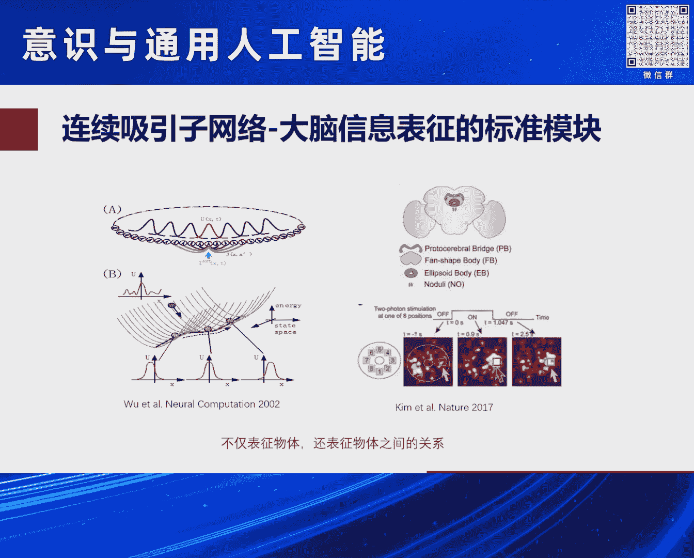

所以说总结起来就是说嗯我们认为呢，就说或者我认为吧，呃大脑的那个嗯这种意识和主观体验，它可能就是我们神经网络啊，那动力学通过涌现的方式呢，就产生了我们的一种嗯各种主观的体验啊，那么我这里举了一个例子呢。

是一个呃很有意思的一个呃一个工作嗯，这是计算神经科学的一个大佬SIMPLISI，他在嗯30年快30年前做的工作，那么这个浑轴呢是他让一个神经网络呢，去学习一个呃学习一个嗯，就说你一个一个一个例子。

一个example是吧，一个数据，而纵轴呢是你这个网络做一个分类任务的，那个呃误差，那么他就发现呢到了你的那个刚开始的时候，你随着数据量增加呢，你的那个误差是慢慢变化，这个啊这个线性的下降嗯。

到了某个时候，你的那个那个下降呢会啪一下一个呃一个陡降，就说你的精度一下变得特别特别高，然后呢呃SIMPLIX上做是个是个邓物呃，这个不是我找他的文章，我来这套哦，这是个邓物啊，是他自己说的。

他那个对禅宗特别感兴趣，他当时在那个啊在中国访问，他给个报告，他就说你看这就是禅宗缠绕那个顿悟啊，那么这样一个模型中有很关键的一点，就是说要神经元这样连接，它是一个binary。

就就比较像像0101的模式，就说有可能我们是我们一个顿悟的主观体验，它来自的神经基础，就是我们大脑呢我们的突出的连接呢，呃我们生物学知道，这个大大脑除连接上是特别杂乱的。

你就简单禁止它是有和无10101的pattern，那么你用这么大个复杂的网络，那么他在学任务的时候，他的他自然会这个就会体现出这样的特性，可能给我们一个主观感受，是啊你看我学着学着，我突然一下明白了。

我看这个顿悟的感觉，K啊，我这是举的一个例子啊，就说明就是说啊真有可能我们大脑的结构，我们计算的方式给了我们的一些嗯，嗯很神奇的主观体验。

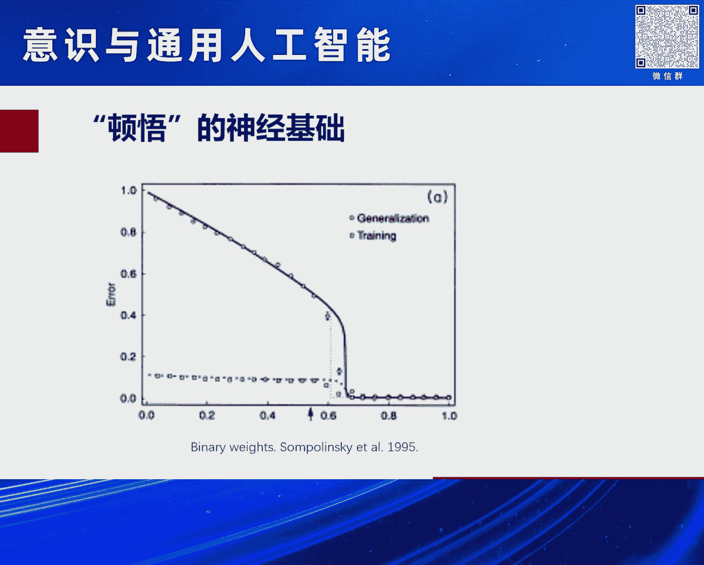

比包括顿悟之类的呃那么我下面再谈谈，就是说呃我们呃大佬能干那些有通过涌现计算，能干那一些比较神奇的事情啊，那么我们在谈意识啊，那我看看在无意识的情况下，我们大脑能干一些什么样的呃神奇的事情。

那么这举了个例子，一个多模态信息整合，你知道我们我们大脑是通过呃眼耳口鼻是吧，通过不同的方式来感知这个世界，那么这个感知的信息呢会在大脑里汇总，汇总起来，能提高我们比个单模态，更优化了对世界的感知嗯。

那么比如说我现在在这那个做报告啊，你们在听我做报告的时候，你们用用声音在听，同时你们用眼睛在看，你们在做，你们在做纯读，你们可能没意识到啊，我有个体验是前几年不是那个啊有疫情的原因。

给了很多线上的报告是吧，线上报告有些英文报告的时候，我就发现如果我看不到speaker，我看不到那个讲话的人，然后我这个听听力特别是英文啊，我就发现我听力会下降，我听不太清楚。

但是如果那是能看到那个是那个讲者露个脸诶，我就觉得听得清楚的多了，实际上是我们无意识，你在做那个对这个SPER要做纯读，跟他那个嘴唇动那个做了个多模态信息的加工，实际上提高精度呃，那么呃作为呃科学呢。

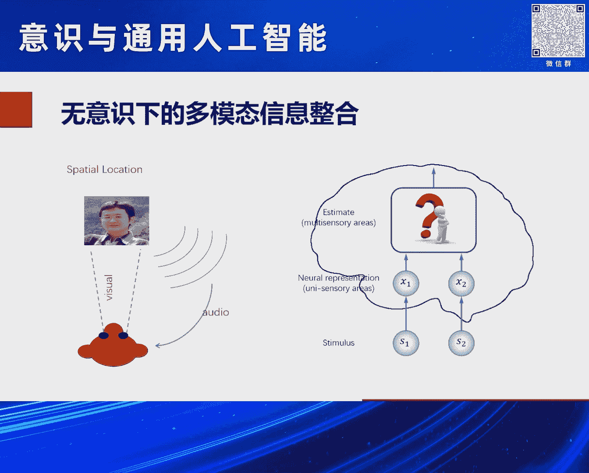

我们要讲建在计算建模上，我们讲究实证是吧，我们要有那个要有我们做这个建模的基础啊，那么那个door angel lucky呢，他带领他的很多中国的那个弟子呢，他们做了一系列实验，就研究这个猴子呢。

在感知嗯前进的方向的时候啊，它是怎么整合我们的视觉信息，和我们的平衡觉信息，然后来达到一种够优化的那种和总结啊，这个也是潜意识你自己意识不到的，但是你如果你在出了问题就晕车。

就比如说你知道我们开车的时候，如果你是在下雨天，你坐在那个车里，你看不到外界，你很容易晕车是吧，实际上就是因为你这个时候，你的那个运动方向的判断要出问题了，就说这就是我们无意识下。

我们做的一些啊多模态信息整合，那么他们通过一系列实验，那就证明了就是说我们在无意识的情况下，实际上我们大脑做的特别特别的好，我们做的是统计优化的贝叶斯推理，就数学上是最优的，在无意识情况下。

我们大脑反而是在有意识的情况下，我们会变得非理性，经犯犯各种各样愚蠢的错误，但实际上这个我们在无意识的情况下，我们大脑的计算会特别特别的高明啊，这是我们生物长期嗯进化的结果，OK啊。

那么这样一个呃实验呢，我们就可以用计算建模的方法。

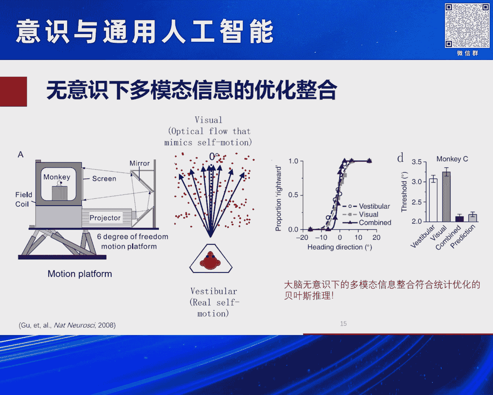

把背后的机制回答的非常的清楚，那么我们就比如说我们就用了啊，两个连续心智网络，一个连续型网网络，表示我们对啊视觉信息的加工，另一个呢就是表示对平衡局信息加工，然后这两个网络之间呢，它们再有相互的连接啊。

使得他们来储存这两个，这两个线索之间的关联信息，那么在你这受到输入的情况下，这两个网络状态会演化，所以你读出它信息，你会发现他种的是非常完美的贝叶斯推理，而且他不仅做信息整合，做信息分离。

做的非常非常漂亮，所以说这是非常有意思的现象，就说我们人啊在无意识情况下，实际上我们在做计算时候特别特别高效，反而是有意识的时候，我们做的并不是那么高效，呃我也不知道是呃是什么原因。

我觉得可能有一个原因，就是说我们大脑在有意识的情况下，犯了一些错误，但对可整个社会群体是有价值的，对群体智能是有价值的，就像跟就像我们可能呃，有些男士喜欢找傻白甜的那个女士，作为太太一样。

你知不在于她有意识循环的人多聪明，但是更好的是对整整个社会的发展更有意义，对个人生活呃更更有意思。

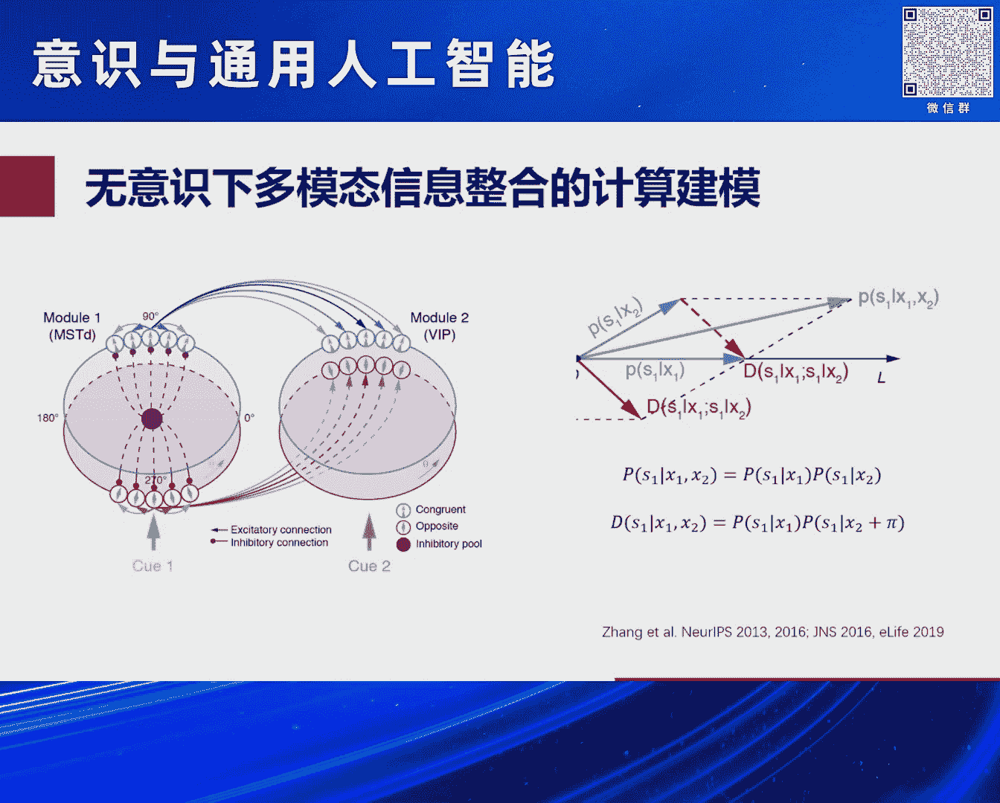

OK啊，这人随便乱扯了啊，嗯OK再讲一个例子，就是啊空间认知的问题，那么空间认知呢是我们大脑对空间信息的获取，组织利用，以及更新的啊，呃这个空间认知呢是特别特别的那个啊，最基我们大脑的最基础的功能功能。

而康德就说，空间或时间是我们认识呃世界的基本方式，嗯简单说就是你描述生活中任何一件事情，它都有时间或地点，OK这个地点它是一个我们fundamental的，我们认识世界的方式啊。

那么这个空间认知呢为什么又特别重要呢，其实这就涉及到我们前面聚胜认知的问题，它可能是我们了解聚生认知的突破口，是刚才我们说了嗯，就说我我在这说一下，那个聚生认知和聚阵智能还有点区别哦。

聚生智能现在强调的是啊，他实际上还是个有点传统的那个呃认知主义，就说呃我们有个认知控制认知过程，只是我们需要我们身体来作为，我们对信息的感受器，我们的大呃，我们身体呢作为我们运动的效应器是吧。

但是本质认知还是独立于我们身体的，但是计算认知说就说我们身体的结构活动方式，感觉和运动会决定我们怎么认识世界，那比如说就是我们对空间认知，我们会以身体为中心，我们定义上下左右高矮这种空间的感知。

这种这种空间的感知呢，它不会拓展，我们拓展回来描述我们更复杂的关系和情感，比如说拔高贬低嗯，亲密疏远中心边缘等，其实你看这没有道理的，你凭什么说拔高会贬低呢，你为什么拔低贬高呢是吧。

但是就说我们会把我们对身体，对这个世界空间的感知，用来描述，我们对很多更复杂呃事物的认认知过程，那么从神经生物学说，这是怎么，这是什么原因呢，其实一个一个比较神奇生物学一个理论。

就是说可能就是来自于进化的一种保守性，因为这个低等动物的时候，我们就有了我们的海马，我们海马负责我们的空间感知，对高等动物的话，我们进化组嗯，高嗯嗯新皮层，那么我们在加工更复杂的那种语言，文化的时候呢。

我们会就进化上我们有这个工具，我们需要复用它是吧，我们不要再重新发展套系统来处理更复杂关系，就说我们对这个空间别处理空间，现在那个海马在我们这复用，就导致了我们会自然的把空间一些关系。

用来表示我们更复杂的啊别的一些关系。

OK而在空间认知呢，在这个神经科学领域呢，实际上是它是一个嗯相对来说研究的比较透的，一个呃一个问题，他的神经基础已经比较清楚了，呃，比较特别著名的，就是我们发现的海马的位置细胞，和内秀皮上晶格细胞呢。

啊它们呢构成了我们大脑的呃GPS，然后我们来感知空间的关系，那么这个工作呢是呃，10年前的诺贝尔奖的工作啊。

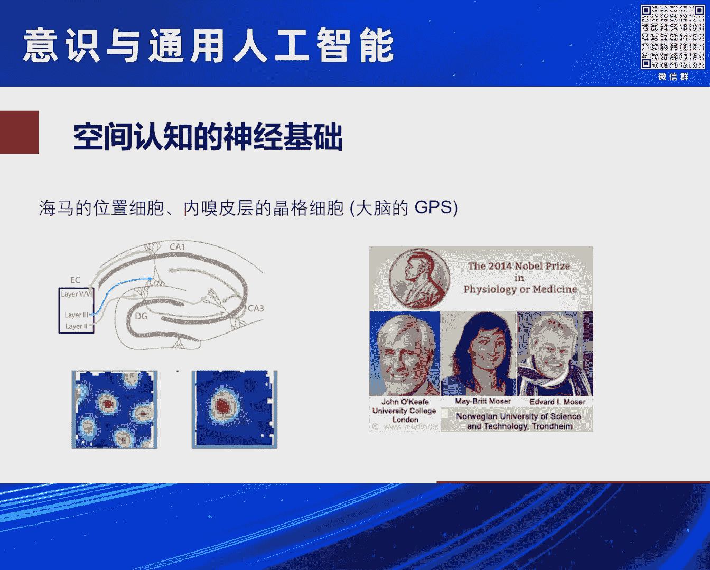

那么非常有意思的，就是说嗯这样呢，这个海马和那个呃呃内秀皮层的晶格细胞，它构造了两套互补的空间编码系统，所以你会发现大脑真的是真的是非常非常聪明，这个海马的位置细胞呢，它主要感知的是环境的信息。

嗅觉和视觉，就我感知我的空间位置，我们可能要用我们视觉色，我看什么地方诶，我知道我的空间位置在哪，那么这个是海马的位置细胞，那么这种信息呢它的优点就是它很清晰，我视觉很清晰，但它的缺点是局部的。

就说我只能看见这是吧，我要构造我我那个一个城市地图，那么我就很难了，因为我只知道，我只能看见我局部的那个一个信息，它是局部的，所以它的编码方式呢这里就不用啊，想细写了，就它的编码方式。

一种是一种局部的位置的编码，非常的鲁嗯，对LEWIS非常的鲁棒，但是它是低效的，特别浪费了一个资源，同时它生成的环境生成的是个环境的地图呃，后面我再讲，那么另一种呢是内秀皮层的晶核细胞。

这种晶格细胞又采用了另一种线索，来感知我们空间位置，就是运动，哎我在这个位置，我知道我向北走了100米，那我知道哦，相对这个位置，我现在下一步的空间位置在哪，那么我这运动信息呢，我也能感知空间位置。

那么在大脑呢是通过内嗅皮层，晶核细胞来来来做这个感知的，那么它的特点就是模糊，因为你看你闭着眼睛，你去感知空间位置是吧，你得到的空间位置感知性是模糊的，但是它优点它是全局的，因为你通过那个呃。

你就会建立各个位置之之间的相互的关系，而我不知道大家有没有这感觉啊，我原来不开车的时候，我那个到一个地方，我要到一个城市，我总是没再怎么逛，我也搞不清东南西北，但我自从开了车，我把那个城市转几圈。

我很快就把那个城市地图建立起来了，因为开车的时候给我提供了运动的信息，来把那个城，那个城市全局的信息就给串联在一起了啊，那么这种在晶核细胞上，它采取了一种叫相位编码，这个呢是特别的高效。

但是对噪音特别的敏感啊，这这是数学系，我就不讲了，同时呢是要生成的也是这种度量地图啊，那么把这些神经生物学的知识大家都发现呢。

我们就可以用计算建模的把它串在一起啊，这里我就不讲了，反正也是用了啊，连续新自网络再发空间信息，运动信息，让它通过学习的方法在一个空间导航任务中呢，我们就把这个我们就用可能建个模型。

能把这些问题全部回答的清楚啊，那么这个问题啊，有点像那个工程上的叫slam的问题，就说你同时定位你的啊，建立你的地图和定位空间位置，但是神经系统干的事情呢，它是比牛肉，比普通slam还干的更多。

就刚才说了，它实际上是建了两套认知地图，一个是海马的地图，这个海马就像是个环境依赖的地图，就有点像有点像，比如说哎我有一个呃北京市的地图，比如说我今天嗯从北大，我开车来这个会场，我脑海有个地图。

因为我知道这个什么位置，然后我就开车，我知道哦我要走那条路，这样我回避障碍物，怎么样，我就开到这来了，这是我们一个环境的地图，那么绿秀皮上那个地图呢，就是它那个度量地图，它是一个抽象的空间位置的表征。

就有点像经纬地图，就是我描述我这个位置，我可以说啊我处在这个中关村什么嗯，科学中心，我在什么地方，还有一个描述，就说我在东经多少度，我北纬多少度是吧，是非常一个抽象的一个空间概念，就大脑非常神奇。

他就把这样两个地图呢，同时在导航的任务中就嗯建立起来了呃，那么这样一种相当于有建立一个呃，一个具体的环境依赖的一个地图，同时还有一个抽象的概念，因为这个度量地图就是一个抽象，你看东经多少度，北纬多少度。

这个不依赖于具体的那个你的环境的，这是个非常抽象的空间位置的表征的概念，所以说再回到那一点，就说进化的保守性，我们大脑在解决这个空间认知的时候呢，我们就发展这两套地图。

那么这两套地图呢在我们进化的过程中，我们大脑可能我们属于高等动物，出现了我们处理生活中更复杂的任务，然后呢我们就会把呃我们已有的那个海马，这个海马和内沟P成这个环路上，说哎我来用一用它来。

我来干这个这个新的任务是吧，所以说就会导致我们计算认知。

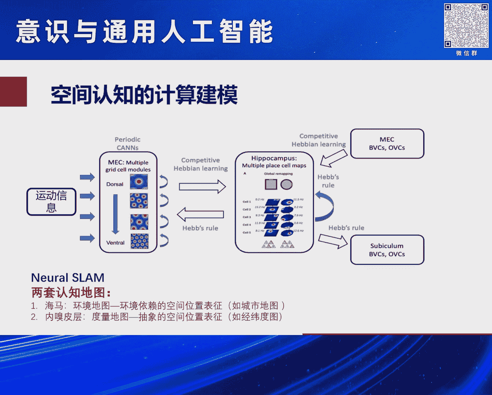

就是我们空间认知会影响我们别的认知啊，那么非常有趣的就是啊，大家已经有呃UCA2的呃，几个非常聪明的科学家，他们已经干了这样的事情，他们就构造了一个海马和绿球皮层的环路。

然后来学一学一些不再是空间的关系，而是抽象抽象的，比如说人与之人间呃，是爷爷奶奶或者什么儿子孙子，这样一种特别复杂的这种关系啊，就非空间的关系，也能通过啊这样一种环路来学习来来表征出来。

那么通常也是海马呢就表成了一个比较嗯，比较那个具体的一种关系，那么内秀皮层呢，就表达了一种比较抽象的一种关系，那么就把这种东西就学会了啊，所以说嗯嗯这个想我想这个例子就告诉我们。

就是说我们可能呃大脑就这样干的，那么我们人表征这个世界，我们也是通过这样一种啊，聚深认知呃的方式给实现的，那么我们就可以借鉴这种方式，来了解我们的一些啊，在此基础上建立的一些更复杂的关系。

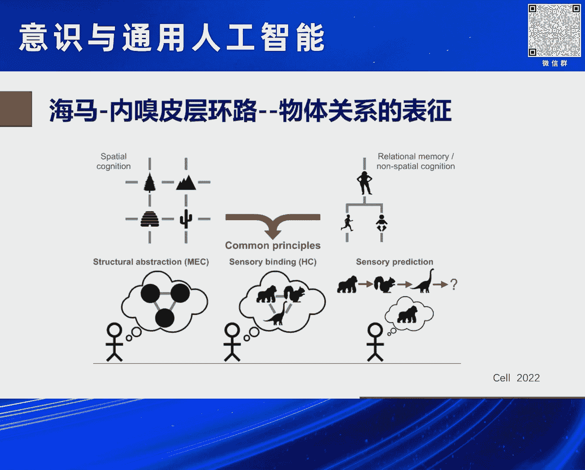

主观感受等等，K呃那么我在这就呃谈一下，我要再回到我们这个主题啊，我们这个意思是可计算的吗，呃那么我我我我也不知道能不能计算啊，但是我知道就是刚才那个罗欢安就讲了，这个意识的有几呃是呃四个经典理论。

其中一个两个两个两个理论啊，他们在争论的时候，我觉得是可以计算建模呃，做的一个就是信息整合理论啊，这个理论就是说你看大家就看这个图啊，啊如果你是第一次看这个图。

你可能有点confuse这个呃这个图到底什么，你我估计你下短时间内看不清楚啊，这些就是这两个图呢，它们之间被隔开了，那么但是呢如果一旦把这两个图拼在一起。

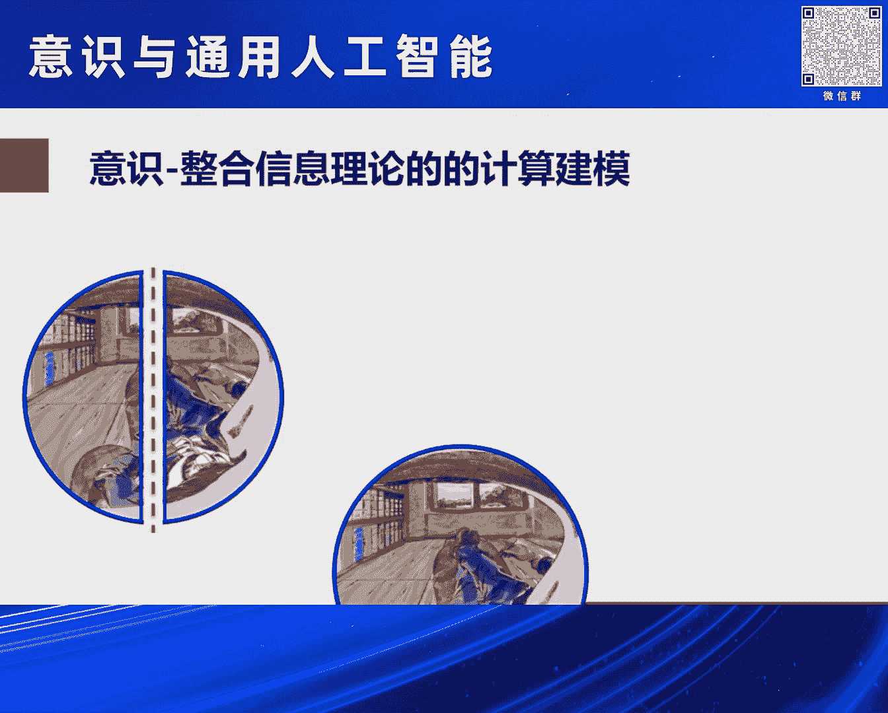

你一下就看到诶，这是一个人睡着躺在那儿是吧，躺在一个那个睡啊睡袋上，那么就是说所以这个信息整合理论，整合信息理论，就是说，当我们把各个老区之间的信息整合在一起，的时候呢，哎我们的意识就产生了。

我们一下就看出了这个什么样的一个呃物体呃，那么我觉得这个是可以做计算建模来做的事啊，因为刚才我谈到了，就是比如说我们在那个啊，多模态信息整合的时候，我们讲到了那个啊平呃，我们平衡局或那个视觉信息整合。

只考虑两个模块，那么我们可以考虑啊多个模态，每个模态比如说用一个连续性知网络的话，我们就可以做一些数学上的模型来探讨，哎这样一个信息整合的呃方式是什么样子的，就这呃我想说明就是这43我虽然没做。

但是可以计算建模的啊。

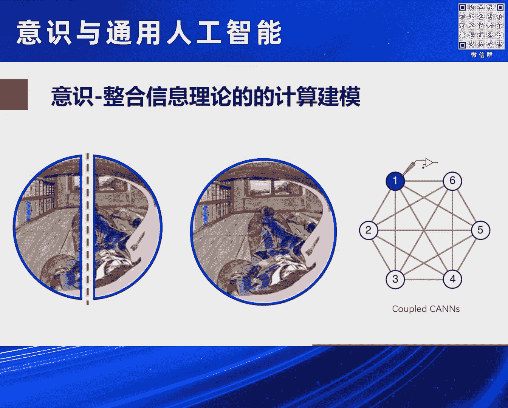

还有就是呃另一种理论就是意识到全局工作呃，空间理论的话啊，那么它也是嗯把各个老区分成各个嗯模块，然后有一个嗯全局的那个工作空间啊，那么这种呢也是目前的老啊，计算建模的工具其实已经差不多了啊。

只不过这个要上大模型需要去做啊。

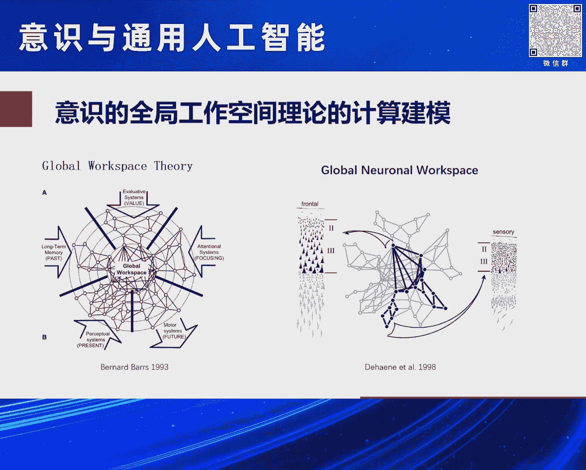

而目前没有做的啊事情OK啊，所以说总结一下，总结一下的话就是呃意思是可以计算的吗，呃我的回答是是的，但是我不是靠啊，前面那个论据任命他为什么是的，实际上是一种一种一种belief。

就说我相信它是可以计算的啊，其实这个相信也是来自于这几年那个嗯，嗯大模型啊，大模型那个呃，其实对比我们大脑的动力学都简单很多诶，他们主要模型足够大，它都能产生一些呃让人惊讶的，貌似意识性。

我就想如果我们把大脑的那个结构，大脑洞穴加进去，再再走大模型的话，是有可能的啊，能产生意识的，第二个就是实现的路径是什么啊，我觉得实现路径就是要做大模型，我们要构建内脑的认知大模型啊。

是比现在的那个语言大模型更啊，更靠近内脑的大脑，因为意识是大脑产生的嘛，所以说我们不让大脑去做内认知大保险，我觉得是啊是可能的，那么第三个问题，现在是合适的时机吗，我说是就刚才大家谈到，如果几十年前啊。

这个意识这都是禁区啊，你你要谈这个，你要做意识，基本上就是认为你在搞伪科学了啊，但是我觉得现在AI啊还有脑科学，还有计算建模的那个发展呃，现在可能是一个合适的时机，来真正做一些这种嗯。

我们认为非就科学过去不再touch的主观感觉啊，对进行计算建模进行解释了啊，那么从哪里入手呢，呃我觉得那个要从计生认知入手，因为我们的意识，我们认知的人的认知特点就是聚生的。

那么尤其是这个相对简单的空间认知，而且他已经有大量的实验证据，也知道大脑的结构大概怎么做的，所以说我们从计算认知入手啊，从尤其从空间认知识入手的话，有可能能把这种嗯主观体验啊。

意识有可能嗯在不久的将来能回答出来了啊。

