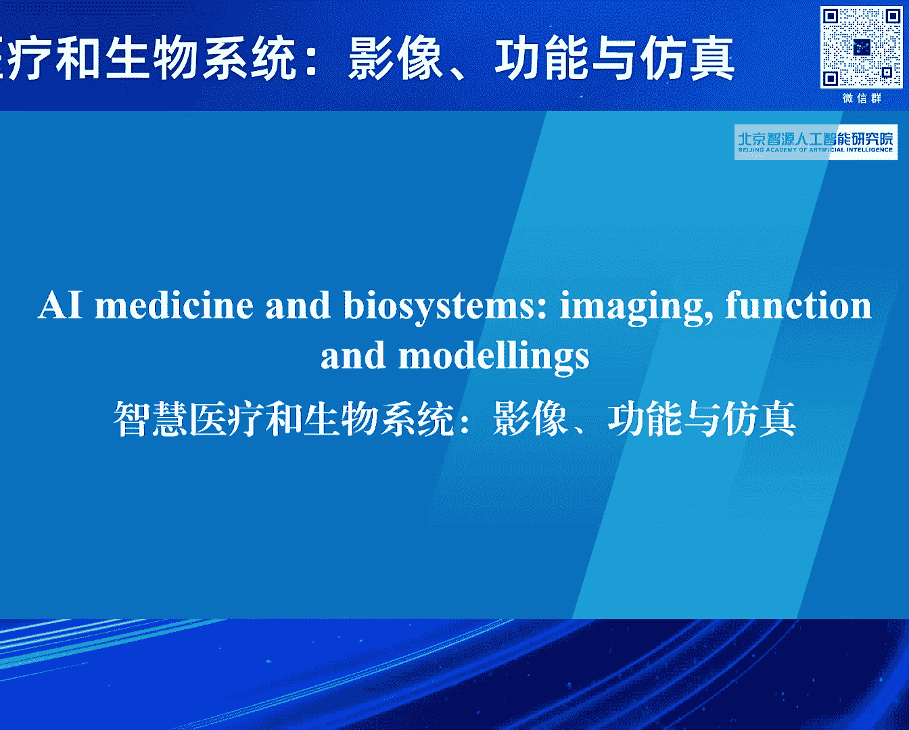
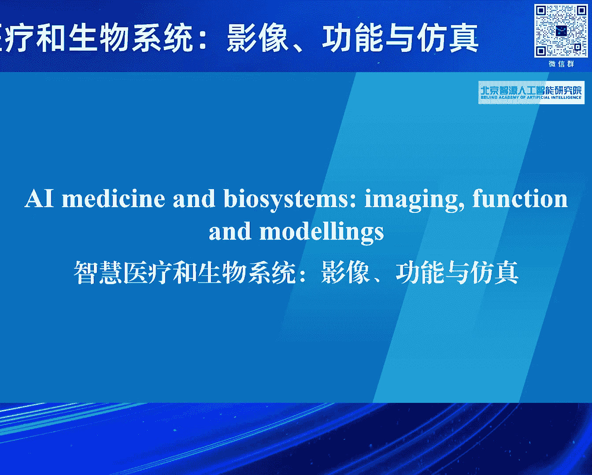
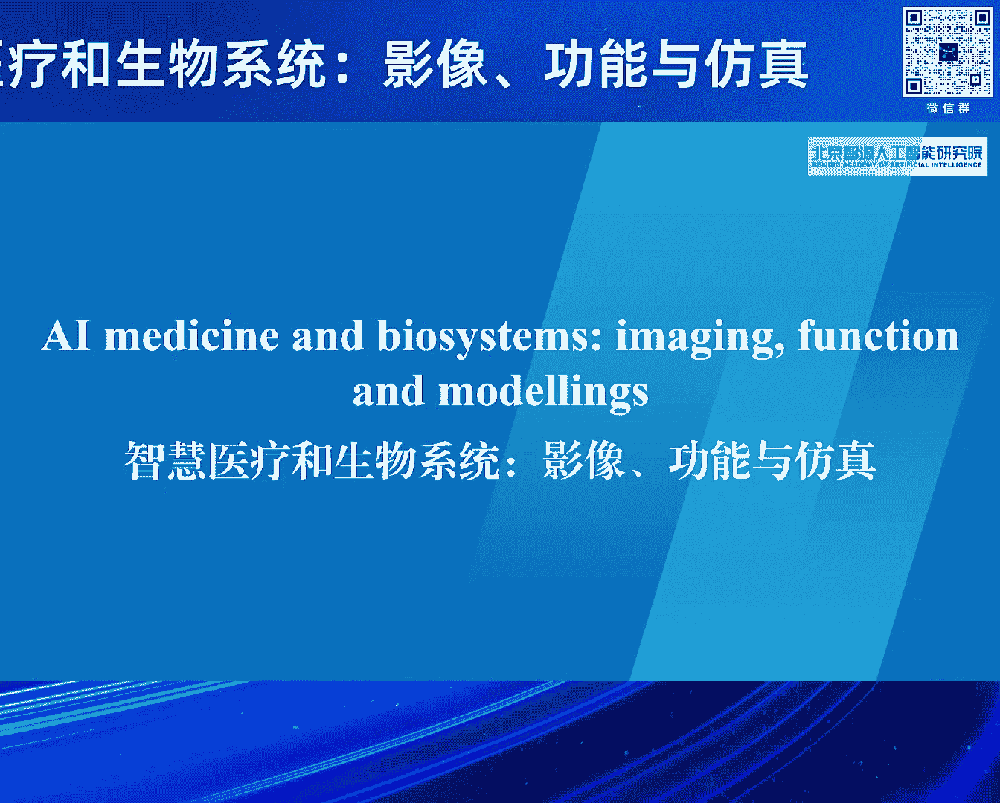
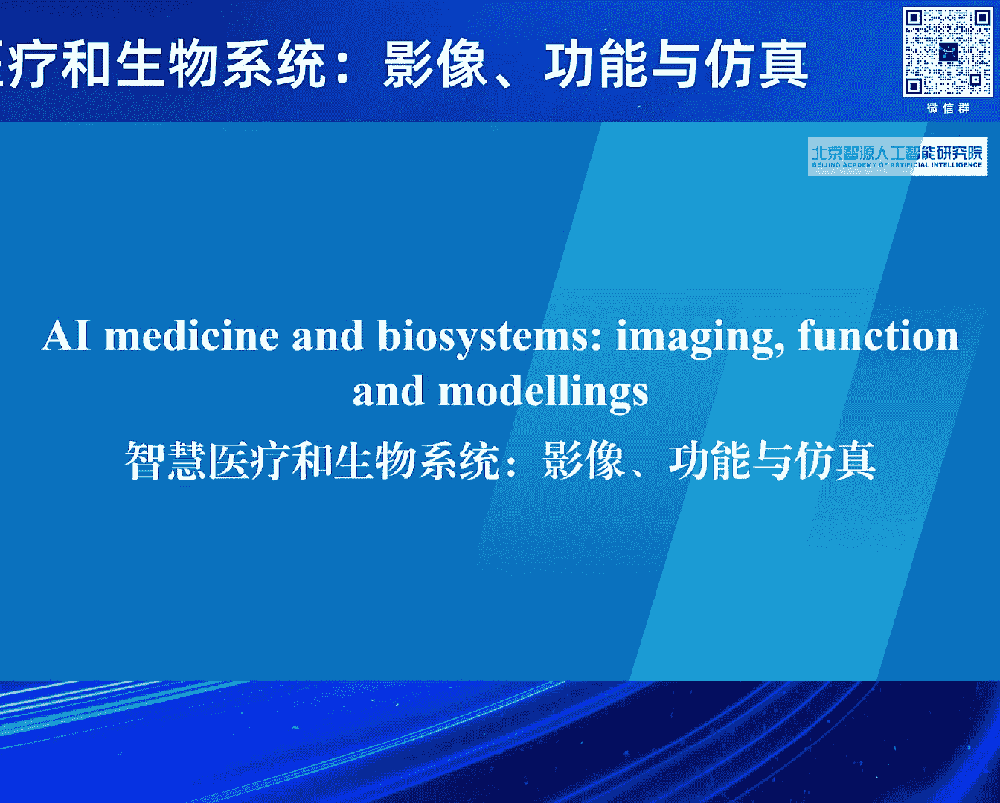

# 2024北京智源大会-智慧医疗和生物系统：影像、功能与仿真 - P1：论坛背景与嘉宾介绍：张恒贵 - 智源社区 - BV1VW421R7HV

尊敬的各位专家，各位嘉宾，女士们，先生们，大家下午好，智源大会2024，智慧医疗或生物系统主题论坛现在开始。

首先请让我代表论坛组委会对大家的到来。

表示诚挚的感谢与衷心的欢迎。

人工智能的迅速发展，给智慧医疗和生命计算。

带来新的机遇和发展机会，相关研究已经成为计算。

生物医学工程以及医医疗方面等交叉方面。

相关的呢就是领域了一个新的挑战。

同时呢带来了一些交叉研究的研究热点，并可能带来新的技术革命或新的技术手段。

同时呢我们意识到该领域的发展呢。

面临着许多重大的挑战，急需要解决，因此呢我们召开本次论坛。

本次论坛将集中于智慧医学研究的相关热点。

探讨人工智能在医学与生物。

医学工程方面的一些研究热点，目前的进展与未来发展的规划。

本次会议我们邀请到了国内国内外著名专家。

探讨，人工智能在医学或生命计算方面的，这个成果与经验，共同探讨智慧医疗发展趋势，今天与会的专家包括，英国皇家工程院院士，曼彻斯特大学教授FRANGE，欧洲科院院士，西湖大学金要储教授，牛津大学雷明教授。

北京大学第一医院李建平教授，北京安贞医院龙德勇教授，北京大学人民医院朱天刚教授，哈尔滨工业大学王宽泉教授，中山大学张赫叶教授，浙江大学夏林教授，北京大学鸿森达教授，北京航空航天大学李帅教授。

北京航空航天大学潘建清教授，哈尔滨工业大学李清澈副研究员，志愿学者，北京大学副研究员马雷，北京航空航天大学教授李帅教授啊，然后北京大学第一医院李玉曦教授，北京建筑大学随栋副教授，以及各位列习专家。

请我们以热烈的掌声，欢迎各位演讲嘉宾，同时本次论坛的另外初衷，是吸引大家对这个方面的感兴趣，欢迎有识之士来加入我们这个研究领域，这是我们这个招聘的一些信息广告哈。

