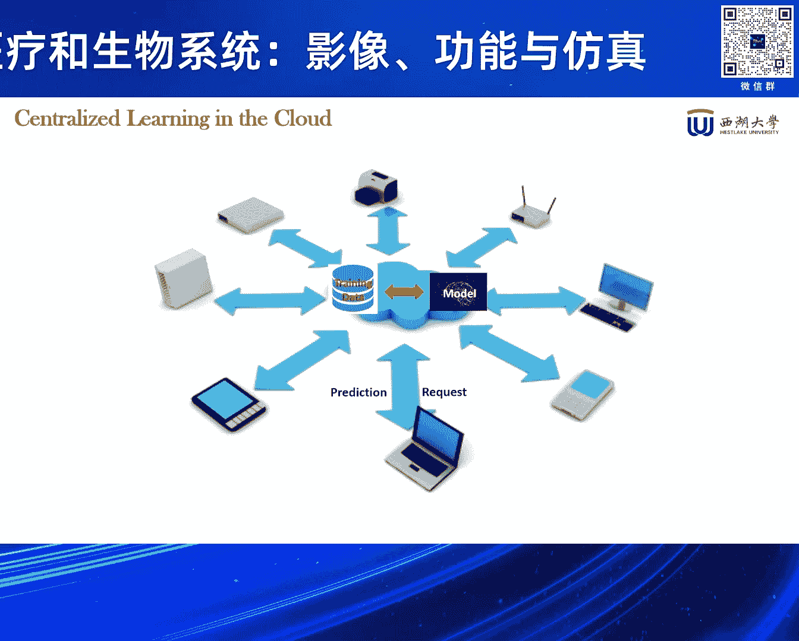
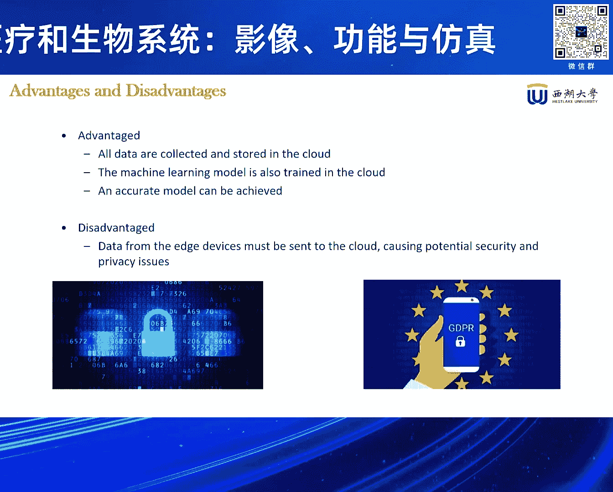
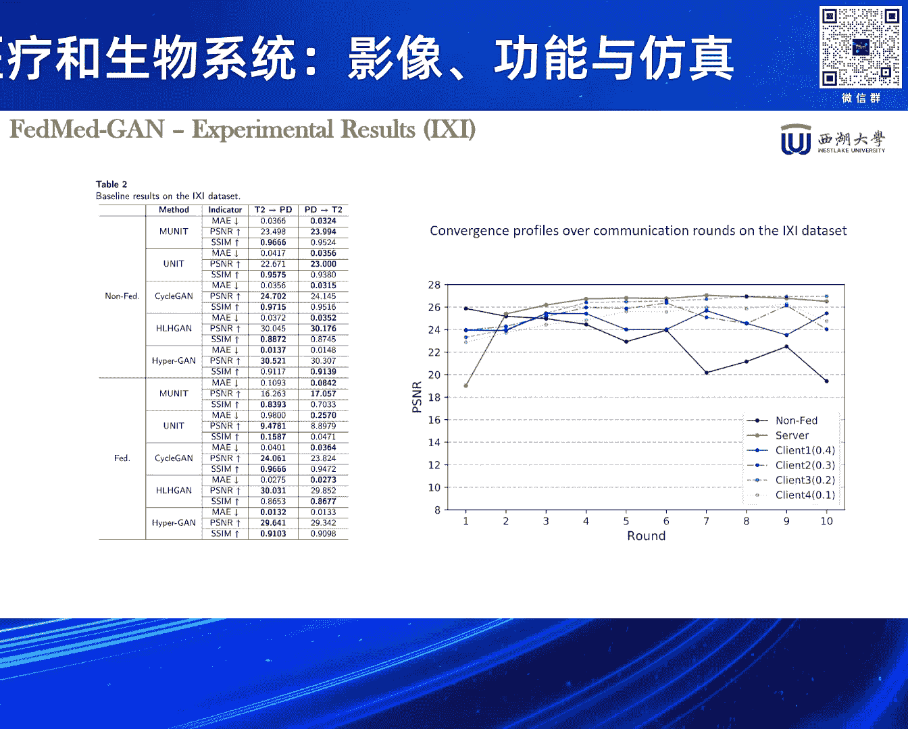
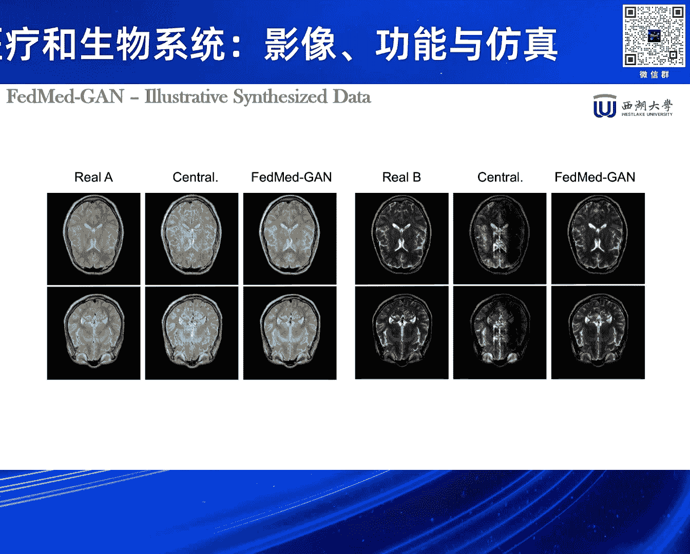
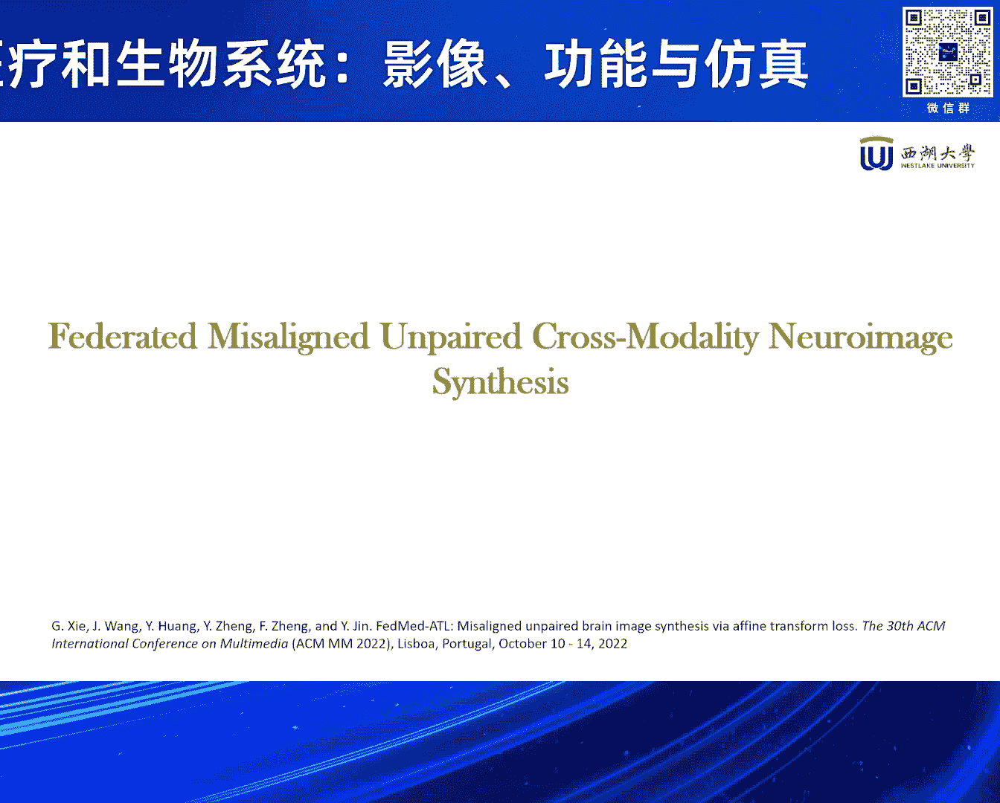
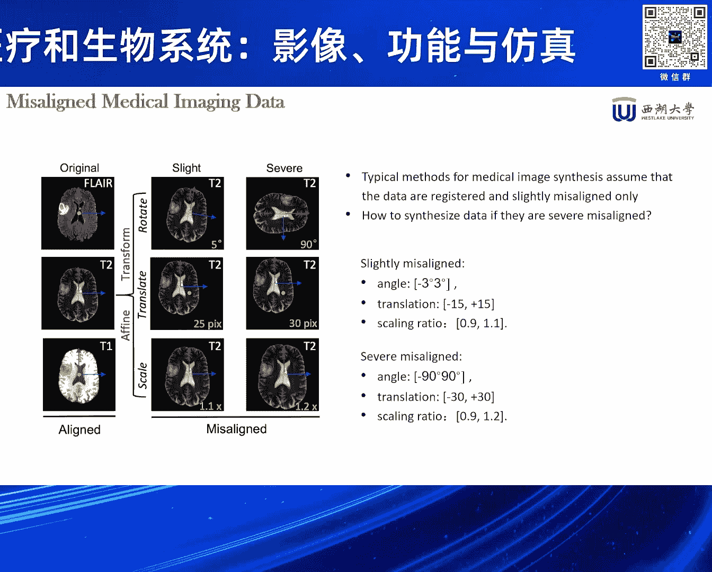
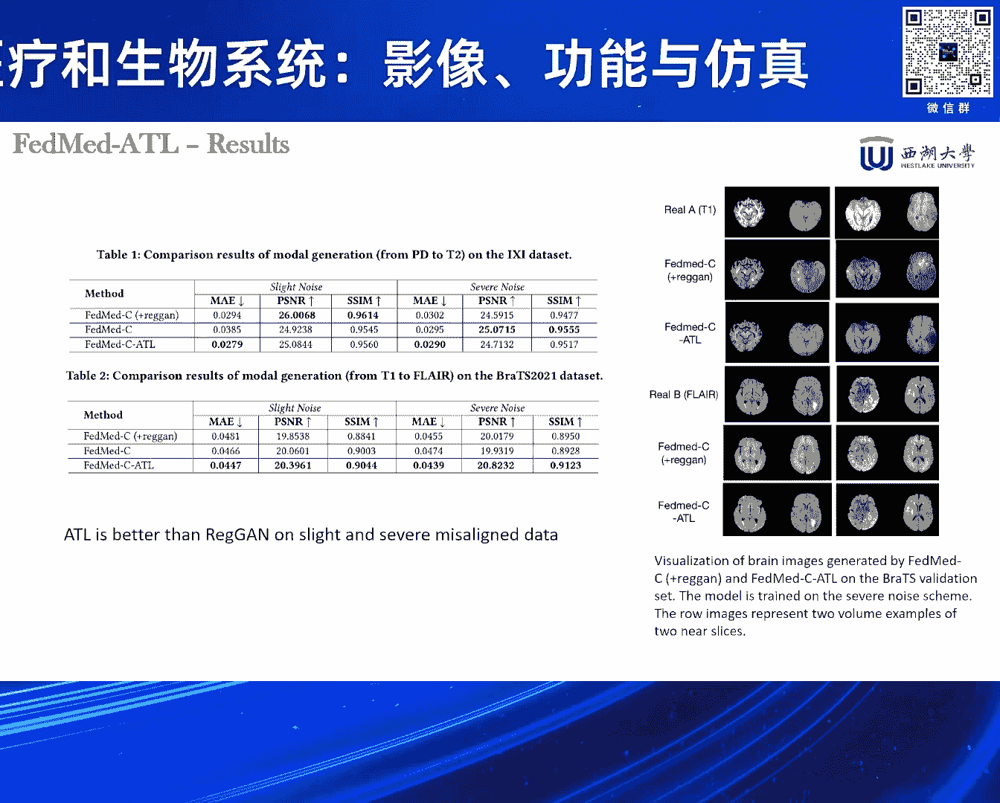
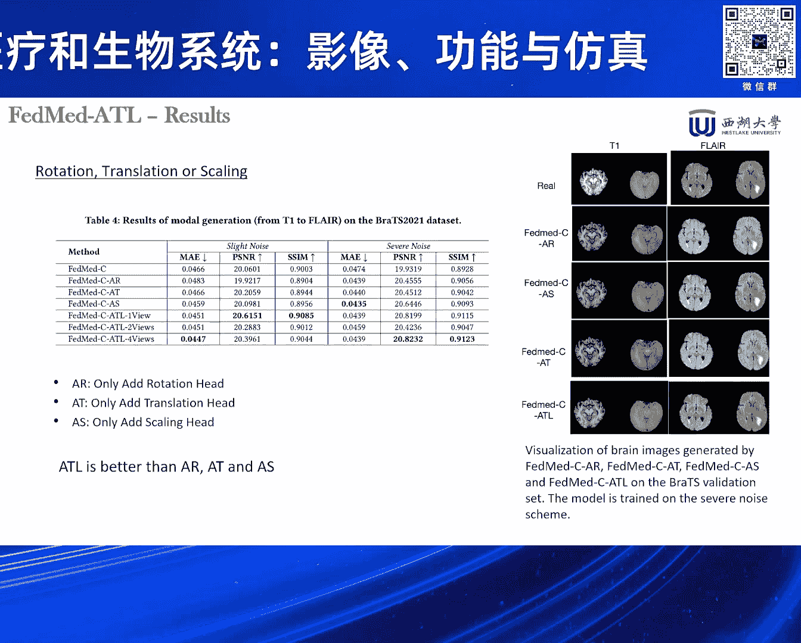
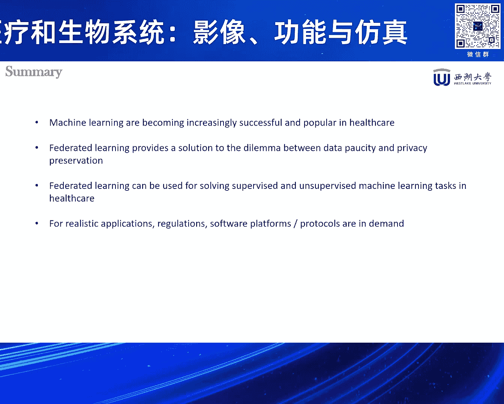

# 2024北京智源大会-智慧医疗和生物系统：影像、功能与仿真 - P2：Privacy-preserving machine learning in healthcare；金耀初 - 智源社区 - BV1VW421R7HV

下面有请我们第一位演讲嘉宾金耀储教授，金教金教授分别于1988年，1991年，1996年获得浙江大学学士硕士和博士学位，并于2001年获德国洪波路尔大学，工学博士学位，他是欧洲科学院院士。

R e tripe e fellow，同时也是国家级高层次海外人才，海外人才计划入选者，他们将为西湖大学人工智能讲席教授，可信及通用人工智能实验室负责人，金教授，长期致力于人工智能与计算智能的理论。

算法和工程应用研究，他研究成果丰硕，迄今为止已经发表论文500多篇，他演5万多次，h index为108，自2019年以来，连续五次被列为全球高背影科学家，下面有请金教授给我们带来的隐私保护。

计算机器学习，谢谢专家，各位呃，这是朋友啊，在大家下午好，首先呃感谢张老师的邀请，呃，我非常高兴有这个机会呃，分享一些我们做的一些工作啊，所以我今天讲的就是呃，想讲我们一些这个隐私保护的机器学习。

在这个跟health care有关的一些应用啊，呃很抱歉，我因为去年6月份才加入西大学，所以还没有把它改成中文，大部分还是英文的，嗯那我稍微讲一点点，西湖大学，西湖大学可能了解的不一定很多。

呃我们是2015年创办，然后呢18年正式成立的，所以去年5月份是啊，去年10月份是刚好五周年啊，呃那么这个西湖大学的定义，它叫呃社会力量举办国家重点支持啊，就是这是一个比较正式的一个定义。

呃那目前的话我们西大学有四个学院，有理学院，工学院啊，生命科学学院，那么去年10月份呢刚刚成立了一个医学院啊，那我们现在的这个总的这个加盟的这个PI，就是助理教授以上的，有230多个人啊。

那么其中90%是从海外引进的，所以说我们主要是我们的教授都是呃，大部分是海外回来的啊，呃那么现在我们在校的博士生呢，有1500多个人呃，本科生呢因为才招了两届，所以才153，那么今年是第3年。

可能再招90个，所以我们呃就说研究型，大家也能从这个数字上看出来，目前呃是这样一个比例，那未来的话就是也就是本科生可能2000呃，博士生大概是五，这个3000，这个比例大概是总共5000名学生的样子啊。

好那么我呢就是呃去年从德国呃回到修大学，那么成立了一个叫做呃，可信及通用人工智能实验室，那么其实是两块一块呢，就说可信人工智能主要是做这个工业，人工智能啊，包括当然这工业可能是也不是只是工业。

也有些可能像我们在health care这一块啊，呃只一些应用性的，但是呢呃要考虑它的这个可信，就包括隐私保护，安全呃等等啊，可解释性大家都可能也了解啊，呃那么第二块呢就是我们称之为通用。

但这个通用的大家可能跟我们一般讲的通用，稍微有一点点不一样，因为我们现在对这个通用人工智能，这个讨论非常多是吧，来做大模型，然后呢，就说能够希望未来这个能够这个模型越来越大，之后呢，呃跟人一样聪明。

甚至说比人还聪明啊，那么我们自己呢就说想探讨一条，稍微不一样的路径啊，主要是呃我过去二三十年一直做的工作呢，一直是从演化和发育这个角度，就说来探讨这个呃，人工智能的一些一些基本的，一些一些就是方法呃。

所以呢我们希望是从呃是模拟生物的演化呃，和发育这个角度呢，来看着有没有能建一些不一样的，跟大模型不完全一样的一些一些模型，然后呢它也能够表现出一些呃通用智能特性啊，特别比如说这个呃这个自主学习。

这样的一些自呃能力，Ok，那么呃这个就是我的这个过去这30年的，主要的一些研究内容，大家可以看到就是HIIRCARE，其实是里面很小一点点啊，那么我稍微说一点点，就说我们现在讲人工智能。

其实大部分都在讲学习是吧，呃这都是模仿人是怎么学的，神经系统怎么学的，呃那么其实呢呃在生物里面，我我自己个人觉得呃我们的自适应的机制啊，其实不止一一条是吧，学习只是其中一个。

那么呃从长的这个时间这个尺度上讲，演化自然演化是个很重要的过程是吧，呃那么在生命过程当中呢，呃其实还至少还有两个除了学习之外，还有个发育过程啊，那么发育的这这个可塑性呃，其实是对这个生物的演化。

是起着非常非常重要的作用啊，但是我们一般现在呢就是人工智能里面，几乎不看这个发育这块啊，那么我们来做一些这个像呃神经系统啊，或者形态啊，形态是指这个身体啊，人形呃这个这个发育的过程，那么还在进行建模。

然后呢希望呢来看看哎，这个比如身体的这个呃发育，对神经系统发育有什么有什么影响啊，那么也很凑巧是吧，最近大家又听到一个非常热门的一个词汇呃，叫做聚生智能是吧，因为发现如果你只是单独的去研究大模型。

肯定是不行嘛，那么事实上就这样，就说你如果把模型啊，或者说神经系统呃完全跟身体脱开了，完全跟环境脱开了，你想去研究它是呃，是怎么能够有像人一样的智能，我觉得是蛮难的啊。

就需要呃把它放到一个具体的环境里面，一个有其他的agent的，有其有具体的环境的生存环境的一个一个地方，然后呢要把它跟这个身体结合在一起，这个身体就其实你有一个传感是吧，一个是认知世界的功能。

还有一个是改造世界功能，或者说不一定是改造，至少是你跟着这环境有交互的能力啊，所以这也是我们以前做这个呃，就从发育这个角度上讲，呃其实也是非常重要，就需要有这个聚生这个这个呃这个这个功能啊，能力啊。

好嗯，那么今天我要讲的话呢是呃主要是讲这个呃，想介绍一点我们在做隐私保护啊，机器学习的啊，以及在呃跟health care相关的一个工作，我这里今天会讲三个小的工作，一个呢就说呃一个是在联邦环境下啊。

呃做一些数据医学这个数影像数据的数据生成，然后呢在这个基础上又做了一些拓展，那么第二个工作呢是在文本，这个就是处理方面的一个叫做关系抽取啊，或者说呃这个现在因为关系抽取本来是一个呃。

文自然语言处理面一个比较基本的任务，还一个基础任呃，那么现在有了大模型之后，可能做这方面的呃不是很多，但其实呢还是很重要，为什么呢，因为比如说我们要做一个嗯语义网络是吧，因为现在大模型老犯错嘛。

那我们说要做一些这个呃这个有有有局域的，这个局部的呃，这个或者是DEMNOLOGY来来帮助他怎么纠错，那么这个时候文本抽取还是有意义的啊，好嗯机器学习的话，我想我们大家都已经听说了非常多了。

呃呃其实但是呢我们可以把各种各样的模型，我们总是把它可以分成两类是吧，一类叫做判别式模型，一类叫深层次模型，那么现在听说大家都在就听到特别多的啊，像这个ChatGPT啊。

或者是呃transformer啊，或者是这个solar这些东西是吧，大部分是深层次模型啊，哎那么其实我们还有一个很重要的叫，判别式模型，就是那么这个是判别式，指上就说在这里我们讲的是呃。

他在学习之后实际上要判断，比如这个例例子当中啊，你给的一张图像到底是是猫还是狗是吧，这是判别式，那么学习呃这个深层次的话，就说你一堆用一堆这个猫的这个图像，给它训练之。

后来它最后能是呃生成一个一个一个猫来啊，这个就是两种两类不同的模型啊，嗯那么这个历史上有很多很多不同的这个，生成式模型，也好判别式模型啊，但是我想不详细讲了，从最最基本的这个MC模型上。

那个时候只是模拟一个细胞呃，然后到后来现在这个呃，有上多少千亿的这样数量级的模型呃，然后呢呃模型里面也有少数个，就说我们不知道大家有没有听说过，有大部分的呃，呃神神经网络模型都是连续信号是吧。

呃但其实人的呃，人脑或者是动物的脑信息处理，是用脉冲信号的啊，所以有少量的这个用脉冲模型啊，那这个目前还不是主流模型呃，这是一些比如说呃呃深层次模型的传统的方法，但我也不详细讲了。

那么现在的流行的比较多的，就比如像这个变分这个自编码器是吧，呃那么像这个gun就是叫呃生成对抗模型呃，网络是吧，呃那么还有很多很多别的，但是我不详细讲了啊，这是一个一个介绍一点点背景啊。

假设如果对这方面不了解好，那么接下来我就讲这个隐私保护了，呃因为其实大幕呃，现在我们人工智能很成功是吧，大漠性成功其实有一个呃三个条件之一嘛是吧，我们讲经常讲三个条件之一，第一个就是大数据。

那么这个大数据的话，我们有一个假设，就是你可以随意的获取数据，对不对，就是我们假设有很多很多，比如从从从网上拿来数据啊，然后呢呃我存储在一个地方，然后去训练一个大模型，诶，这样的话你这模型能力很强。

但大家肯定也听说了是吧，曾经前一段时间这个纽约时报去告这个OpenAI，说哎你用了我的数据了啊，你没有这经过我同意是吧，那么其实这个数据的这个隐私问题，就数或者数据的所有权问题呃。

是很早就已经引起注意了，我们2017年这个呃，欧洲欧盟就发布了一个叫GDPR是吧，呃那个时候就说哎这个不能随便的收集数据呃，来训练的模型好，所以呢这个隐私保护的话，现在就是已经。

一个很非常非常大家很关心的一个一个话题了，那么这个就是我们传统的就是用用过的，所谓叫centralized learning，就说把数据从各个地方收集来之后。

存储在一个地方，那我就训个大模型啊，那么好处，当然我可以把所有的数据都用起来，但是这个局限性的就说呃，就是你的问题是在于你要去收集数据，所以你要经人家同意是吧，那么这个数据一旦出去之后呢。

你的隐私可能会泄露。

或者是呃有安全的去隐患啊，那么你肯定说哎我不要收集数据也可以啊是吧，我每个呃终端设备上，我自己现在都计算力很强嘛，我们每个手机都是比我们读书时，一个一个计算机还厉害了是吧，算力很强。

那么是不是可以每一个设备上训练个模型，那当然大家可能会知道，这个的话就会有些局限性了，因为你每个设备上收的数据毕竟有限，分布可能也不是很好啊，这样的话就不能充分呃，利用不同设备上存储的数据啊。

所以我们其实要解决的问题是什么呢，就说要解决的是一个是一方面，我们希望把所有的数据里面的价值，这些都把它就利用起来，而另一方面呢，我们要保护这些数据的隐私以及安全啊，所以如何来解决这个矛盾。

就既能用这些数据啊，又能能够保护这些数据的隐私啊，呃也那么传统哦，这里有很多很有趣的符号，不知道哪来的呃，呃这个这个有有有这个很多这个隐私及保护，这个呃计算的技术啊，包括像我们多方安全计算是吧。

或者是差分隐私呃，这个差分隐私的话就是我在我原有的数据上，我加了一定的噪声之后，那最后呢你就外面就看不出来诶，这个数据原来是从哪里过来的啊，呃还有像比如常见的就是呃同态加密是吧，呃同态加密技术。

你对数据进行加密加密之后再进行训练，然后这样的话你就你哪怕把数据给别人，也不会担心你的数据呃，你的数据都隐私会泄露啊，呃，那么这些方法当然有有各自的优势和局限性啊，那么像特别用的比较多的呃。

差分隐私和这个呃呃同态加密啊，那么这里面差分隐私呢，就说他有个什么样的缺off呢，就说你噪声加少了，你可能隐私保护能力不够是吧，加噪声加多了，你这个模型的质量会受到影响啊，所以这是个缺道F关系。

而那个同态加密呢有这么几个问题，一个呢它的计算复杂度会比较高啊，你每次计算时要加密解密，加密解密，这个计算复杂度很高，这是一个第二个呢呃它只对它，虽然我们讲同态啊，这个同态只是个相对的概念。

就说只是对加法和乘法同态，那么我们是机器学习里面，其实还有很多非线性的操作是吧，那么这些非线性操作就没法直接呃，就是用这些加密数据呃，那比一般我们做这个线性化，比如用泰勒展开线性化。

那么这里会引入一定的误差，所以就是也会也是一定的局限性啊，好，那我们今天讲的主要这个框架呢，是一个联邦学习框架，这个框架其实是2016年呃，谷歌提出来的一个一个，就说隐私保护的一个计算的框架。

那么这个框架其实一个最最，如果你要是很简单的说的一句话的话呢，就是它是一种分布式的一个计算方法，然后呢他就说希望这个数据啊，就在分布在不同的设备上的，或者不同的个体那边的数据呢叫可用不可呃。

就叫可用不可见是吧，就你能用它，但你不需要见它啊，你不需要看到它数据里面到底藏了什么东西，呃那么这里面当然连贯学本身，现在这这几年从16年提出来开始，这几年其实是发展非常非常快啊。

我今天其实呃并不是专门讲联邦学，只是讲一些非常基础的东西，那么这个联邦学者最基本的假设，就像这样的这个框架是吧，呃它是有不同的用户啊，这个每个用户有自己的数据呃，然后呢他现在我们这个怎么做呢，就说呃。

我们假设这些数据有一定的满足一定条件，所以叫做水平分割是吧，也就说你这些数据呢，呃虽然数据条目是不一样的，但是呢每一个用户它都有这些所谓的特征，我们这里讲的X1到X5就是你这些特征啊。

呃然后呢也有也有多有标签啊，那么有这样的情况之后呢，只是那些数据分段不同的地方，那么我在做的时候怎么做呢，就具体做的事就是提出这么一个框架来了，这里一个就具体怎么做的，就说我们假设主编是一个服务器是吧。

或者是云或者是一个一个一个一个大比较，就能计算力比较强的一个一个设备，然后呢我们有很多这个小的终端设备啊，比如汽车也好，或者手机也好，或者这个laptop也好是吧，那么它每一个设备上都有它的私有数据。

那么这个时候呢，我这个服务器上的先先啊初始化一个模型，然后呢，把这个模型的参数呢发到所有的终端设备上去，那每一个终端设备呢就用这个发下来，这个模型参数呢，用自己的数据来训练这个模型啊，训练之后呢。

你训练若干个iteration之后是吧，你就或者epoch，我们就呃把它又把这些更新后的参数呢，发送回到这个服务器上面去，然后呢，服务器呢把送回来的这些参数呢，又把它聚合起来啊，我们叫聚合。

那么怎么个聚合法呢，其实当时谷歌的提出的聚合是非常简单，是一个加权的，简单的一个加权聚合是吧，在这里的话大家看下，来做个线性的加强聚合就非常简单，一个聚合，当然这个聚合不一定是最好的聚合方法是吧。

然后聚合之后呢，我又把聚合后的模型参数，又重新发到每一个用户那里去，然后每个用户呢又根据呃更新后的这些参数，继续用本地的数据啊，私有数据来训练，这样经过若干轮之后呢，呃希望这个模，最后这个模型呢。

能够跟你把所有的数据放在一起，获得的一个模型的是一样的好啊，那么这个当然这当然是个解呃，是个一个假设是吧，呃没有人能够证明啊，其实事实上在很多情况下，也不一定能够真正做到这个效果啊。

嗯这是这是这前面讲的这个横向的呃，联邦学习情况，那么当然其实还有一些纵向所谓纵向情况，那么中伤情况什么情况呢，其实也很常见，就说我们看不同的用户那里是吧，呃他的标签呃，他的标签可能会呃有的有标签。

有的没有标签，这是一个第二个呢，呃他的这个所谓叫activate呢，呃也是不一样的，这个举个简单例子上，比如说你同一个人是吧，我在银行里面可能有我的收入啊，我的这个这个这个存款啊，贷款这些数据是吧。

而在医院A呢，你肯定是我有检查这个呃肝脏的这个数据，而医院B呢可能有检查这个呃这个胃的数据，比如或者其他器官组，所以呢就说每个地方它拥有的数据，这个这个不一样啊，那这个也不一样。

是我们这个用机器里面叫ATTRI的，就是这个是不一样是吧，而且呢有的呃地方的数据呢，就是有的这个呃用户呢他没有所谓的label，比如说你医院里并没有说，你这个人到底属于是什么呃，中产阶级。

还是这个呃还是还是什么什么样阶层是吧，但没有这个标志呃，或者说呃这个这个银行里也没有，你到底是健康还是呃不健康这样数据，所以这个label就没有啊，呃那么这样的就属叫垂直分割的情况。

那么这个情况很明显跟前面的相比的话呢，呃就会更复杂了啊，好，那么联邦学习呢，技术虽然是一个呃能够保护这个数据隐私的，这种分布式的计算方法啊，呃但是呢它也会带来带来一些额外的挑战。

呃这个挑战包括一个呢其实通讯是吧，大家可以想象我们这个刚刚那个框架里面，你这个服务器先把参数，模型参数发到每个用户那里啊，用户那里训练之后呢，呃要把它发回去，然后不断一轮轮的做啊，这么这么传送是吧。

那么如果你这个模型很大，比如现在我们讲大数据，虽然不一定是千亿级的呃，但是也可能很多是吧，那么这个通讯量就会很大，所以这个怎么来降低这个呃减少这个通讯的量，其实一个呃很重要的一个一个一个研究方向啊。

呃这是其第呃第一，那么其其次的话呢就是这个数据的，因为我们前面假设就说哎，用这种分布式的训练方法，最后你训练出的模型跟你这个把数据堆在一起，训练车模型是一样的好，但这其实是一个很强的假设。

那么有很多情况下你是做不到这样，那特别是像比如说不同的用户那里啊，不同的设备那里这个标签所谓的不平衡啊，啊所谓的不平衡就说你一个用户那里，你可能有很多呃你这个有关啊，比如你呃这个健康方面收集。

另外跟你很多有关，是这个呃你其他收入方面数据，那么这个这里面就是有个标签不平衡的问题，那么还有一个就是这个这个H配置不平衡，就属于这些存在数据不平衡的情况啊，那么这些情况呢都会影响你前面讲的。

我们这个联邦学习这个框架，训练出来的这个模型的质量啊，额那么另外一个呢就是挑战是什么呢，叫做呃我们讲这个用传参数啊，或者是梯度呃，而不传数据的方法来保护数据隐私是吧，呃你似乎像诶你这个数据没传出去。

所以我很安全，但是呢这也不一定啊，呃现在有这个有有已经有这个证据表明啊，就在这个框架里面，我们在这个框架里面是我们假设有些用户啊，是所谓的叫恶意用户啊，那么它的所谓什么叫恶意用户呢。

就是他呃呃不是只是参与这个学习过程，而只是说还，而是想知道别人的数据到底怎么回事啊，那么因为他拥有自己的一个本地的模型，以及从服务器上传下来的这个全局模型，那么它有一些用一些机器习方法啊。

利用这两个数呃，这个模型呢它可以倒推别的啊，就反推别的这个这个用户的数据，那这样的话也会造出造成这个数据这一呃，呃隐私的泄露，所以呢，我们往往需要在这个联邦学习的框架上面。

再加一些其他的隐私保护的这个方法啊，包括前面讲的差分，隐私和这个像是有的时候也需要加密是吧，呃当然这里面就有个成本的问题，计算成本的问题呃，那么最后一个挑战呢，就说其实是一个所谓叫做异构性。

这个异构包括前面讲的数据的异构啊，数据其实还有模特方面不一样，所以你有的可能图像有的是音呃，音频数据，有的是呃其他的是数值数据啊，这不就是模特上有差别，还有呢，每个设备的计算能力和通讯能力也不一样是吧。

我们前面这个框架假设说哎这个呃，这个呃呃同更新过程是一轮一轮的，大家同步的哎，其实很难保证这同步啊，那么有这些不同的异构的特征存在的情况下，我们怎么来保证这个框架还能够正常的运作，还能提供好的训练性能。

那这里面就又有很多的研究啊，呃那么目前的话当然联邦学院还有很多别的啊，比方包括就是所谓叫做呃这公平性问题是吧，因为我们这个框架是最后的说，诶我要训练出一个全局模型来呃，对所有的用户都一样。

那么有的用户说我对其实这个不感兴趣，你说你要比如说假设这里面的模型包含这个呃，这个一个人的这credit情况，他到底有没有信用，还有一个是包括一个人的健康情况。

他你其中有一个人说我对这credit不感兴趣，我只对健康感兴趣是吧，那么你一定要说把它训练个模型呃，你可能会牺牲这个健康方面信息啊，呃为了增加这credit方面的这个呃性能啊。

所以就说每个用户他的要求不一样，那么这里面有些这个呃，这个这个如何来照顾不同用户的这个需求啊，这样东西呃，或者是公平性这样的问题有很多很多，有别的这个这个这个问题啊，好那么接下来的话呢我就呃讲几个。

就是我们在这方面的应用啊，那么第一个应用呢是在这个脑成这个里面，成像里面一些数据的生成啊，主要是为了数据生成，那么数据生成，首先这个呃motivation是什么，就为什么要做数据生成，因为大家知道。

就我们现在一般老城像有很多额方法是有的用，比如说呃这个这用这个MI是吧，呃磁共振的或者是PET的这种啊，呃那么但是每次做一个检查呢，可能会呃这个这个会很花钱对吧，呃因为我我我我好像看到一篇文献里说。

我们现在做一次呃，磁共振的还要几千块钱，我说我不太清楚是不是价格是不对啊，但其实就是很贵的，那么就不太可能你一个病人去把所有的这些呃，这个这个成像方法去做一下啊，呃那么有而机器学习的是里面的。

有时候呢就希望你是对同一个病人，就有个这些图像都有是吧，就不同的模式都有啊，呃那么呃呃也有可能有的时候呢，也有可能就是因为这个拍的这个做做这个事呃，在做数据的时候呢，可能就是因为这个病人。

比如说他的姿势不对或者有洞啊，那么造成这数据会质量不好，就或者说这个数这个成像效果不好，是吧，呃那么你可以说是不是可以分享不同的医院，可以分享分享这个数据，那么就是涉及到我们前面讲这个隐私保护的。

因为现在其实你要不同的医院分享呃，共享这个数据是很难的啊，所以所以所以这里面我们就提出来呃，有没有可能在前面这个影呃联邦学习框架下来，利用不同医院的呃这个数据呢，来更好的生存质量更高的这个影像数据啊。

呃同时呢又不会泄露这个数据的隐私啊，所以这里面提出一个一个框架，其实就基于一个这个生成，对抗网络的一个影像的这个呃生成呃，数据的生成啊，呃就说希望就如果说有有这个缺失的，数据缺失的情况下。

那么我利用啊别的这个病人的，别的医院的这个数据来帮助我呢更好的生成啊，这个是佩戴的数据啊，这是一个最基本的这个思路，那么具体怎么做的，其实就这个框架，大家看到这个主编的话。

其实就是我们前面那个联邦学习框架是吧，你有不同的医院，这里是不同的医院，然后每个医院的都有自己的数据是吧，这个私有数据，那么呃我呢不能把数据改到别人，但是呢我又希望能够用这些数据呢。

来当成刚刚这个这个就是这个生成对抗网络，这个这个框架呢能够生成高质量的这个数据啊，那么这里面其实我们做的事情是什么呢，就其实对这个生，因为在在这个呃，就是生成对抗网络里面有两块啊。

一个叫做呃这个是一个叫generator是吧，还有一个叫做判别器，一个叫生成器啊，generator叫生成器，那么另外可以叫判别器啊，那么我们这里其实只做联邦这一块呢，只是在生成器这一块啊。

就说我们在生成器呢在自己的数据上啊，进行呃这个训练之后，然后呢把这个模型参数呢送到这个一个服务，假设一个第三方一个服务器是吧，然后呢这个服务器再把这些不同用户那里啊，不同的医院呃，生成出来的这些参数呢。

呃综合综合智能再发再发回去，然后呢每个这个这个判别器的训练呢，只用本地的数据啊，这里面就是呃，是这样一个一个基本的这个思想啊，所以从呃应该说从这个框架上讲是非常简单。

只不过我们大部分的联邦学习都是讨论的，是这个这个这个判别式呃，就我们前面讲的是判别式和称正式，一般都只讨论判别式的，这个模型的这个呃这个呃联邦学习方法，那么这里用的是这个对。

针对这个呃对抗生成网络里面的，这个生成器的这个训练啊，用到了联邦学习这个框架啊，呃具体的呢就是呃我不详细介绍，就基本上这么一个一个有这么一个框架，那么这个呃对抗生成网络，其实我们这个所谓的肝是吧。

呃大家可能也听说过有非常多的变形啊，这个这个杆那个杆，那是这里用的是，我们其中有一个叫cycle杆是吧，但其实也很多啊，呃这个不重要，那么呃重要的是什么呢，就是我们在训练的时候就是为了保护隐私嘛。

所以呢我们就加入了一个叫做呃DEFICIAL呃，叫deficially private，就是叫差分隐私的梯度训练方法啊，那么这个这个简称叫做呃，这里是叫DP是吧，DPSGD就说DP就是叫差分呃。

这个这个差分隐私保护的呃，那么然后呢SGD就是这个随机梯度法啊，那么它的基本思想其实也很简单，就说首先每个用户他要生成一个一个阈值，这个阈值就是差分隐私里面，这个呃隐私保护的一个预一个一个一个参数。

就说这个阈值，比如说这个数据越大，那么隐私保护能力越强啊，这样的，然后有了这个值之后呢，我就去做这个在梯度式的训练时候呢，先把这个梯度这个叫叫叫clip，就是我把它限制在啊这个负C和正C之内啊。

然后呢根据这个数据的多少呢，我确定一个值，它这个值叫做呃叫做global sensitivity，就是个JS是吧，然后有了这个机械S和跟这个AP用之后呢，哎我就可以确定呃。

训练之后加多少噪声加到这个样本上去呃，加到这个参数上去，那么这样的话呢就说在理论上能够保证呃，我能够在app m条件下满足这一查分隐，隐私保护啊，这是一个叫做这个在训练过程当中，保护这个隐私呃。

这个这个的一个方法啊，这个用根据这个差分隐私的方法好，那么这个因为这个呃，刚刚里面有很多很多的这个要训练的东西是吧，这个但是呢我就不详细讲了，这有好几个loss函数是吧。

呃有的正规有有的针对这个生成器的，有的是针对判别器的，那么呃不同的肝呢，还有不同的这个其他的这些量呀，哎要加上去呃，然后下面这块呢就是这个我们讲差分隐私，这个保护的这个SDD的方法啊。

呃总个数算法框架我也不讲了，好那么做的实验的这个结果的话呢，就说其实就是说呃呃呃主要是测试它的效果，那么用了两个常见的这个数据库啊，这一个是叫bra t s2021，还有一个叫IXI啊。

那么这里面其实我们要想研究是什么呢，就说我们想知道，当不同医院的数据分布很不均匀的时候，所谓的这个呃这能能IID啊，这是继续前面个术语啊，就说他的分布差别很大的时候，我能不能保证这个是这个模型刚刚提出。

这个方法还是有效啊，所以主要是在这方面，那么详细的这个测试的东西呢，我也就不讨论了，但是有一条可以看到啊，就说在所谓的叫做能ID很强的情况下，你用这个传统的方法做的话呢，呃它会出现这个模型发散的情况。

而且是所谓的模型发展，就说我这个全局模型不能收敛到一个，一个统一的模型，因为每个用户的数据差别很大嘛，所以训练到后来他会发散掉啊，没法收敛那个统一模型上，那么呃用刚刚这些方法来做呢，反而会能够提散。

而提高这个模型的收敛性能，OK额这是一些例子啊，就说就看看我们比如说A是个真实的啊，然后呢B是用这个这centralized learning来训练的结果啊，那么这第三类呢。

是用这个这个我们刚刚讲的这个框架啊，就用新set data，就是嗯呃这个这个这合生成的啊，实合成的数据啊，这是这样的情况，那么其实看着这个质量应该还是还是不错的啊。

好这是第一个，那么第二个我要稍微介绍一下呢，这其实是一个刚才在工作上一定的这个，一个扩展，那么这个扩展主要在扩展在哪里呢。

呃扩展在这个判别期的训练上面，因为我们前面讲的是在生成器这块是吧，我如何来利用不同医院之间数据帮衬，这个生，帮助在生成器生成更加高质量的这个数据，但是呢又不会去涉及到这个隐私，这个泄露的这个问题啊。

呃那么这个这另外呢还有一个问题，其实这个判别器本身啊，也怎么来提升它的这个质量，那么我们前面讲说，哎呀很多这个呃影像的模态可能不存在，但其实也有很多呢，就是讲比如说病人啊，因为自动了。

或或者是由于各种各样的原因呢，唉他的数据没有所谓的没有对好，没有对齐啊，也有这样的情况，就数据有，但是没有对齐哈，那么如一般以前的话呢，我们往往把这个呃数据当中有噪声，数据可能就不没法真正用起来呃。

那么我们现在这个想法就能不能把这些数据在，就没有对齐的这些没有配配的数据呢，把它充分利用起来啊，来更好的训练我的这个这个这个呃，这个太煤气啊，呃那么这个没对齐，我们这里是考虑了三种情况，一种就是旋转。

而这个图就是这个角度不一样，还有一个呢就是叫这个这平移是吧，translate就平移，那么scale这就是缩放啊，这个这个缩放，那么我们这个当然你可以有有不同的角度。

有严重的有可能一直稍微轻微的这个变化啊，不管怎么样。

就是考虑这三种不同的情况嗯，然后呢我们就分别啊，就说主要的思想，刚前面就如何把这些啊，有一定的呃没有完全对齐的这个数据拿来啊，充分利用它的价值，提升我这个呃判别器的这个训练的这个，这个这个质量啊。

那么这里怎么用呢，其实是加上一些这个额外的这个罗丝函数啊，你看我们在这里面，就除了原来的这一个是原有的这个数据之外呢，我们下面有三个是吧，一个是rotate，一个translate，一个是scale。

就说我在训练时候有时候故意去旋转啊，旋转它呃，然后呢去去做一些移动或者做一些释放啊，然后呢再把这些变，就是这个这个变换过的数据呢，也放到这个罗丝函数里面去，这样的话呢这我在训练这个派位。

其实不只是训练这个原有数据上这个损失啊，而是呢也对那些进行呃，这个叫做这个放射，这个放射这个呃变换以后的数据上的这个螺丝，也把它考虑进去啊，所以呢其实就说到底呢就把这增加了三个呃，螺丝的这个呃这个像啊。

一个是旋转啊，那么第二个就是平移是吧。

那么还有一个呢就是这个缩放，然后我们把所有这些都合在一起了，最后就把所有的这个呃，都合到一个这个损失函数里面，然后呢再去看这个模型训练情况呃，那么呃最这个详细的我也不讲了，就说呃这个这个性能还是有有比。

有有很比较大的提升啊，那么这里做一些判断，就说如果只做其中一个会怎么样，那么我总体来说呢，肯定你把这三个啊。

旋转平移和缩放都考虑进去呢，会效果更好K好，那我最后一分钟呢再讲，我们最后一个一个小小的一个工作啊，就说前面两个是在这个医学图像的生成方面啊，呃那么这个呢就是我们是在文本的这个呃。

就是这自然语言处理器啊，呃这个是这个呃by medical的一个一个文本啊，那么这里面主要是叫关系抽取是吧，那么关系抽取其实也也有，还是有很多研究啊，呃有这个句子层面上关系，所以就说一句话。

然后呢来找出这两其中两个你要想知道的，这关键字叫做叫实体啊，这之间关系，那么呃当这个当然就比较简单是吧，这只是在同个句子里面呃，那么稍微复杂一点，就是叫我们叫呃这个document level。

就说是整个文本啊，因为文本可能比较长啊，呃那么这个抽取就会更复杂，来我这里举个简单例子，就说你看我们这一段话里面，我们有四个地方提到了一种化学物质是吧，然后呢又有四个地方提到这个甲肝这这这个字。

那么到底如果你不加区分的把它去说，哎其实这两个有关系，其实就是就错了，因为事实上最终的话只有其中有一次真正的提，有表示了两者相关的关系啊，呃这样的话就说呃就非常的呃，就是我们就是非常非常就是呃。

在文本这个提取时就需要关注到这一点啊，好的我的时间已经跟已经差不多了，那么这个里面其实用的这个是基本的思想，就两个，一个呢就联邦学习这个框架啊，呃就是刚刚我们前面提到的，用。

我们把假设这些文本是放在不同的这个医院，那里是吧，他每个医院都有带一些诊疗的记录嘛，呃但但是呢我希望用到这些数据，但又不能把这些数据改出来啊，呃这是一个第二个呢。

因为是我们是在document level，就文本层面上的关系抽取，所以呢加入了一些呃这个新的呃，去一些些些这个约束啊，这些用新的主要是一个用这这个对比学习，这个思想啊把它加到这个罗斯函数里面去。

这样呢能够提升这个关系，极其的这个这个性能啊，这个这些一大堆数学我就不讲了，然后就是你看这个公式，就是我们前面讲的这个平均的这个公式是吧，把不同呃局部模型的这个参数，就是简单一个线性线性加权啊，好。

那么呃呃这个这个这个具体的结果，我就不多跳过了，就总之说来就是我们在文本层面上的，用联邦学习方法来做这个做的话呢，也能够有效的提升这个呃，这个机器学习的这个呃性能啊，呃这这些都是实实验实验数据K。

那么最后的话呢，我想我今天呃讲这个我的报告，其实一个呃最最主要的信息呢，就说我们机器学习里面呃，并不是所有的时候都是大数据啊，有的时候是小数据，然后呢呃数据呢有这个隐私和敏感信息是吧，那么如何来呃。

就在希望利用到充分的利用这些数据的价值，但是呢又不能呃威胁到这些数据的这个隐私啊，以及它的敏感信息，那么我们举了几个在医学领域的一些应用的，这个场景，那么其实医学领域是一个隐私保护技。

学习一个很典型的场景啊，那么其他人像金融啊等等也有好，那我今天就讲这些。

