# 2024北京智源大会-智慧医疗和生物系统：影像、功能与仿真 - P4：临床心肌缺血预测手段及困难：李建平-主持人：马雷 - 智源社区 - BV1VW421R7HV

好感谢张教授的报告呃，下面呢我们欢迎李建平院长给我们作报告啊，李建平院长，北京大学第一医学院副院长，心血管疾病研究所所长，主任医师教授博士博士研究生导师，血管稳态与重构全国重点实验室副主任。

心血管分子生物学与调节肽重点实验室，北京大学副主任，北京大学医学部血管健康研究中心副主任，李建平主任，20多年来，一直从事冠心病介入治疗，开展高血压，冠心病等，动脉粥样硬化疾病的相关临床和基础研究。

在国际学术期刊发表i sci文章237篇，中文文章128篇，获一项国家科学技术进步二等奖，呃，李院长的报告题目为，临床心心肌缺血预测手段及困难，那么让我们以热烈的掌声，欢迎李院长，嗯好嗯，尊敬的呃。

张宏贵教授，还有各位专家同道啊，大家下午好，呃，那特别高兴哈，我看今天已经是第六届了，那我我是第一届参加哈，而且我觉得作为一个心血管科医生呃，一进入这个会场，我就特别震撼，因为我们的学术会议哈。

朱教授和那个龙德勇教授主任在哈，我们很少见到这种场景哈，各个会场是个爆满，而且这个有有大家站着参会的哈，所以确实能够感受到大家这样一个这个热情，激情哈，去迎接和拥抱新技术这个大数据。

所以呢这个我们无论从北大医院哈还是从科室，其实很早也特别关注和参与到，这个这个这个技术里面来哈，所以我也呃借助于这样一个这个特别好的机会，有幸跟大家汇报一下我们自己的工作哈，啊这这个还是说临床需求哈。

这张老师给我一个任务，就这个题目也是能够看得出来哈，临床是有需求。

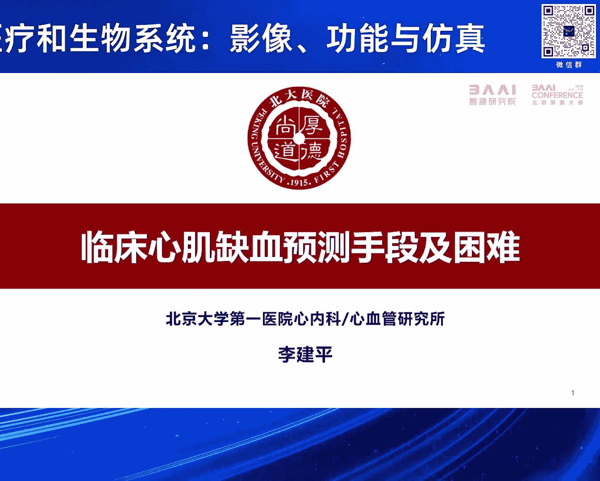

我们才去借助于这样一个新技术哈，解决临床的这个难点，卡点和痛点，那对于冠心病的诊断而言，其实呃大家都知道，我们冠心病呢其实简单跟大家科普，还因为有些人可能不是做我们有医学这个专业，我们两大类型。

一类呢是稳定的这个心脏病，另外一大类呢是不稳定心绞呃，心脏病我们叫急性冠脉综合征，其实最典型的例子就是急性心肌梗死，那从临床上对这两大类型的疾病的诊治过程中，其实第一对于急性冠脉综合征。

大家都知道急性心肌梗死它非常危重，它后续的临床的愈后哈，虽然经过我们抢救呃，也可能有不好的预后，但是对稳定的冠心病病人他不一样哈，他其实临床预后相对的是好的，但是从诊断来讲，这两类是不一样的。

那个最重的急性冠脉综合征，包括急性心肌梗死哈，不稳定心绞痛或者是叫非S段抬高心梗，他在临床上诊断非常容易哈，这个病人一目了然，只不过我们能不能给他治疗好，取得一个最好的结果。

但是对于稳定的临床预后相对好的，这些人在诊断上就非常的困难好，因为这些人目前诊断的方法有很多，我们大概可以分为无创的，还可以分为有创的，那怎么样选择最好的这个检查方法，给病人做出诊断。

那牵涉到很多的问题哈，包括这个病人的获益的问题，包括医疗费用的问题哈，因为非常大量的，其实临床我们给他诊断呃，带引号的冠心病哈，所以去做了好多可能没必要的这个有创的检查，所以这一块在我们临床上。

是个需要解决的问题哈，那无论是国外的指南呢，还是从国内的指南，都给了我们很多的这个从指南层面的建议，但是在操作起来却很困难哈，我给大家举个例子，这是来自于欧洲的，对于这个临床稳定的冠心病病人的。

一个诊断的一个流程哈，这个这个我们快速的过哈，实际上大家看到的第一步就先看症状，是不是典型，我们如果是一个典型的心绞痛的症状，我不给他做什么任何的检查，那我基本上七八十%的把握度。

我说你是有病或者是没病哈，这是从我们老师那学来的，过去没有那么多检查手段的时候，就靠问诊哈，就跟中医大夫要做基本功，要望闻问切，那我们对西医的时候，我上学的时候，老师给我们讲，如果你好好的问病人的症状。

是不是一个典型的心绞痛的症状，那你有起有80的把握好，告诉这个病人是不是后续要做检查哈，那当然典型的心绞痛的症状，我们有时间再讲哈，因为很多科普的这个场合呢，我们也给大家介绍，有些症状真的不是心脏病。

大家不用特别紧张，这点就提出来了，其实路径很清晰，但是操作起来有困难，大家看他是一步一步的推进，那刚才那个叫枕前的可能性，那根据你的症状，就判断你得这个后续的，真的有病的可能性有多大哈，15%以上。

5%到15%哈，我们会推荐接下来的路径，那你下一步该做什么检查了，大家听说过哈，心电图诊断冠心病，但一般的时候做心电图拿出来，我们体检，后来有些大夫就说你有有点心肌缺血，这个非常不科学哈。

我们要诱发病人犯病的时候，心电图才能发现问题，所以那个检查叫运动实验哈，运动的时候做心电图哎，在你心肌氧耗量增加的时候，如果你心电图出现了明显的缺血性的变化，我们就给你诊断，那如果你不运动了哈。

心率下来了，那马上心电图又恢复了，那这个诊断，我们也可以有80%以上的把握度，认为你是有问题的，那当然借助于这样一个负荷哈，包括运动和药物去诱发病人犯病，我们产生了一系列的技术，包括心电图。

包括超声心动图，也包括核素好，这都是在功能学检查，无创的功能学检查，那当然大家知道刚才呃张教授给大家介绍的哈，基于CTACTA是什么呢，是通过一个增强的呃c ct造影哈，也是一种无创。

相对于我们给病人做穿刺哈，穿刺动脉做冠状动脉造影，那这个检查呢，其实它也是一个通过CCTA，来看你的血管是不是有斑块有狭窄，但是有斑块有狭窄以后，他是不是引起缺血了，刚才张教授给大家介绍的CTFFR。

实际上就基于c ct影像的功能学评估好。

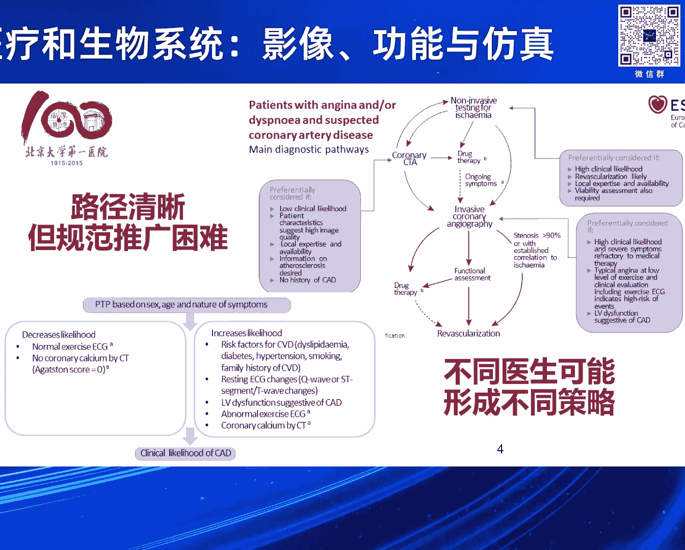

那功能学评估，可能张家张教授也给大家铺垫了，这部分的这个内容哈，呃呃我我等一会儿再简单跟大家说哈，那无创的检查方法有很多哈，大家这点把刚才我提到的运动试验哈，就是这个负荷的心电图。

包括冠状动脉CTA哈负荷的这个核磁哈，负荷的超声心动图，还有这种负荷的核素的心肌灌注显像哈，这个suspect，他对于诊断或者是排除。

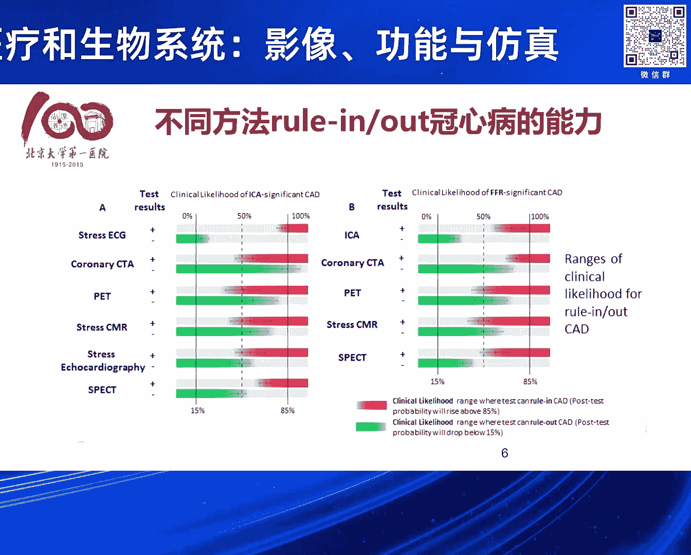

都有自己各自的一个这个呃准确性哈，所以呢，另外呢我们关注这个稳定性绞痛的病人呢，其实我们特别想把这个稳定的性绞痛的病人，给他诊断准确。

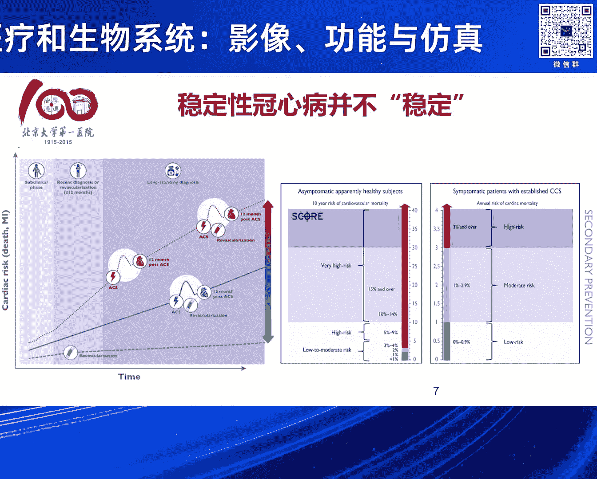

给他干预的准确，那提到了干预，那么大家都知道哈，这个冠心病的从治疗模式上，治疗手段大家都知道哈，我们有药物治疗是基础，那么接下来的治疗呢就是这个介入治疗哈，介入治疗是个微创的手术，那跟几十年相比。

有好多的冠心病病人，因为这项微创的手术而避免了开胸去做搭桥哈，这是一个这个治疗技术的一个一个，革命性的改变，但是新技术出现以后呢，又伴随着其他的问题，就是提到了我们真的是治疗一个病变呢。

还是治疗一个缺血呢，所以呢提出了功能学的评估啊，功能学评估是什么意思呢，就是你冠状动脉存在的狭窄的过程中。

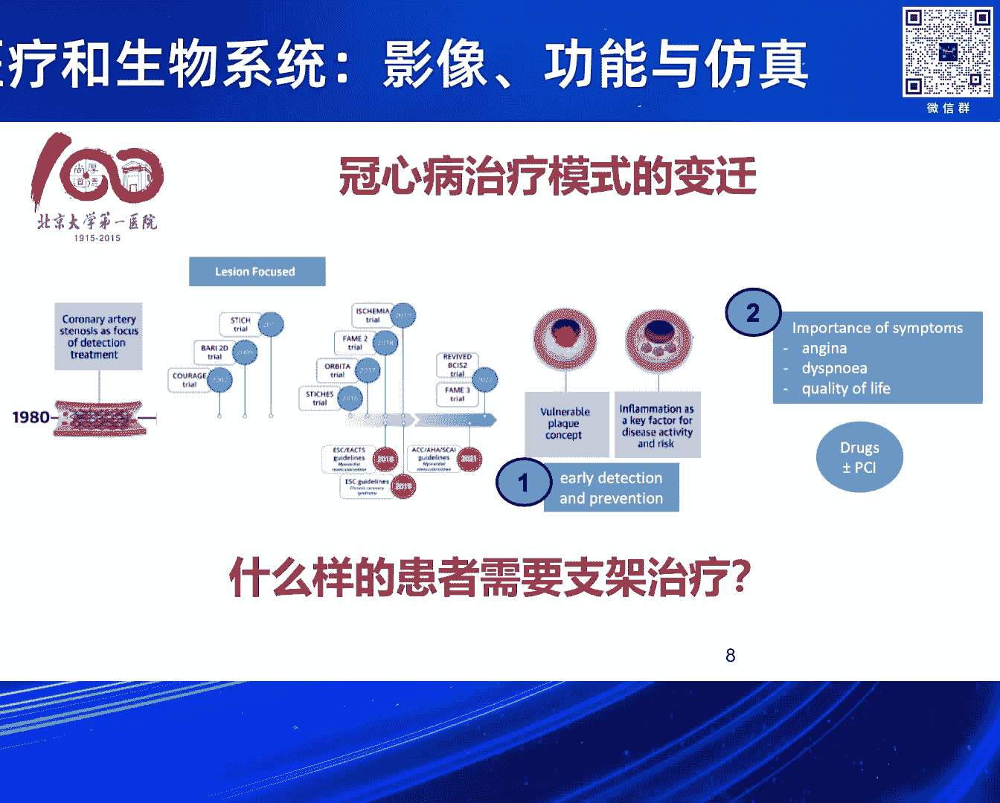

我们等会可能有一个图哈，呃还还还不是这哈。

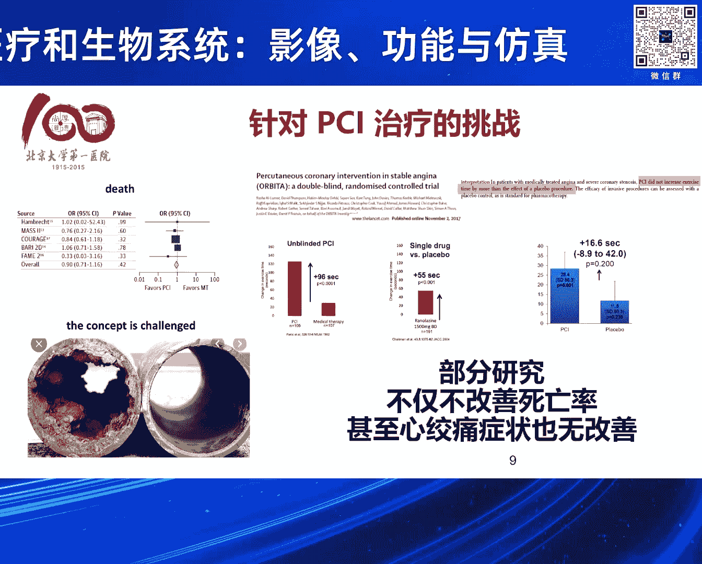

那么我们在这个冠状动脉呢，实际上它出现狭窄了以后呢，因为冠状动脉循环，它不止只是我们刚才呃，张教授给大家演示的那个冠状动脉的图形哈，那冠状动脉大家可能刚才那个图等会给大家看，我这可能也有那图形。

它实际上它冠状动脉更远端，连接的跟心肌细胞相接触的那那些微血管，它占到了90%以上，我们能够做CT或者做冠状动脉造影，看到的那个血管只占到了10%，不到10%，所以说这么庞大的血管床。

它有非常好的调节能力，你这边窄了，我远端扩张，那导致的结果就是你的心肌细胞并没有缺血，所以这就造成我们不精准的评估，不精准的治疗，就可能造成治疗过度或者是治疗不足。

造成治疗不恰当的问题，所以呢也就导致了我们在临床上，对于稳定的冠心病病人，再去评估介入治疗好还是单纯的吃药，好的时候我们没有得到阳性的结果，这个实际上跟我们临床的这个个人的经验，那完全是不一样的。

好那我们认为我们在临床上收治的病人，如果我判断他这个病人应该做冠状动脉造影，做支架治疗，那他的结果从我个人的感受，我们80%，90%以上病人都是明显获益，症状改善的，但是我们在看临床研究的时候。

他做这么一个大样本的随机对照研究，他却非常遗憾的没有显示出，在优化的药物治疗的基础上，我们给病人放一个支架，两个支架能够进一步的改善病人的获益，那这个获益既有硬指标，比如改善病人再发心梗呃。

再次死亡死亡，还有再次血运重建哈，这个再次血运重建，包括再做支架或者再做搭桥，他并没有在这些心血管事件上获益。

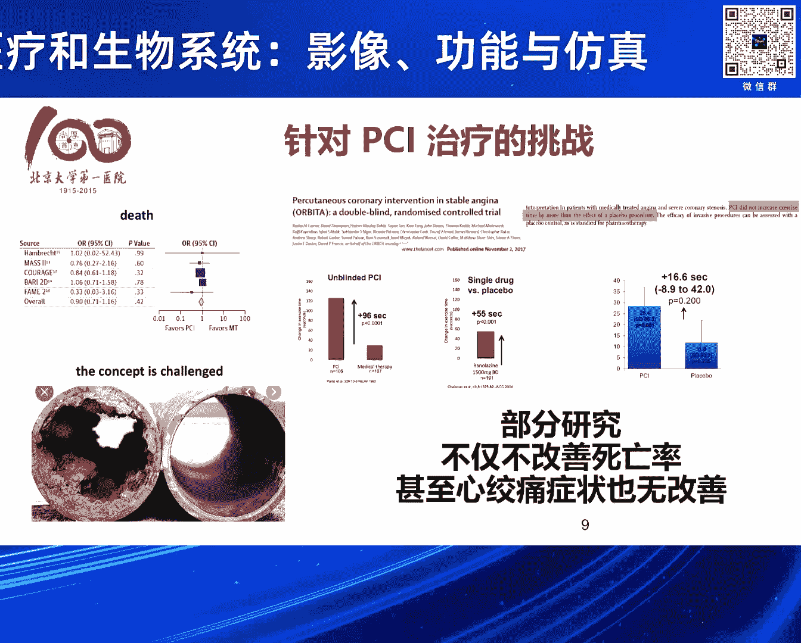

那当然可能在生活质量，在心绞痛的这个改善方面得到了一些改善哈，所以这并不是我们需要的，那根本的原因是什么呢，是我们没有对病人的冠状动脉缺血，做一个很好的功能学评估，那这就是刚才这个这个张教授介绍的哈。

我们通过CTA的影像去看，他是不是真的缺血了哈，那当然我们在过去呢，这是啊，我给大家显示的就是我们冠状动脉是从粗到细，那小的冠状动脉100个微米以下的，我们做冠状动脉造影的时候是看不到的哈。

但是那部分占到了更大的绝大部分的比例，那因此呢我们从冠状动脉上呢有了功能学，一个指导下的治疗，就是fame系列的研究哈，那他是通过一个压力导丝，把这个压力感受器放到你冠状动脉狭窄哈。

比如说我们在这个血管上有一个，70%的狭窄，那它把这压力感受器，那么放到这个病变远端以后呢，那通过对微循环的一个最大程度的扩张，你不是微循环可以有调节功能吗，那我就暴露出在最大的扩张。

你能够最大扩张的情况下，我暴露你这个病变导致的，你血血液在这个病变前后的一个压力的接差，这个如果压力结差大了，就提示他有缺血了哈，所以在过去呢。

我们是做了基于冠状动脉造影的，这个CAFFR，那CF8的好处也是不需要压力导丝了哈，不需要那个压力导丝，我们通过算法把这个功能学算出来了，那当然张教授介绍的CTFFR就更前一步哈，他没有去做造影的时候。

他就算出这个FFR了。

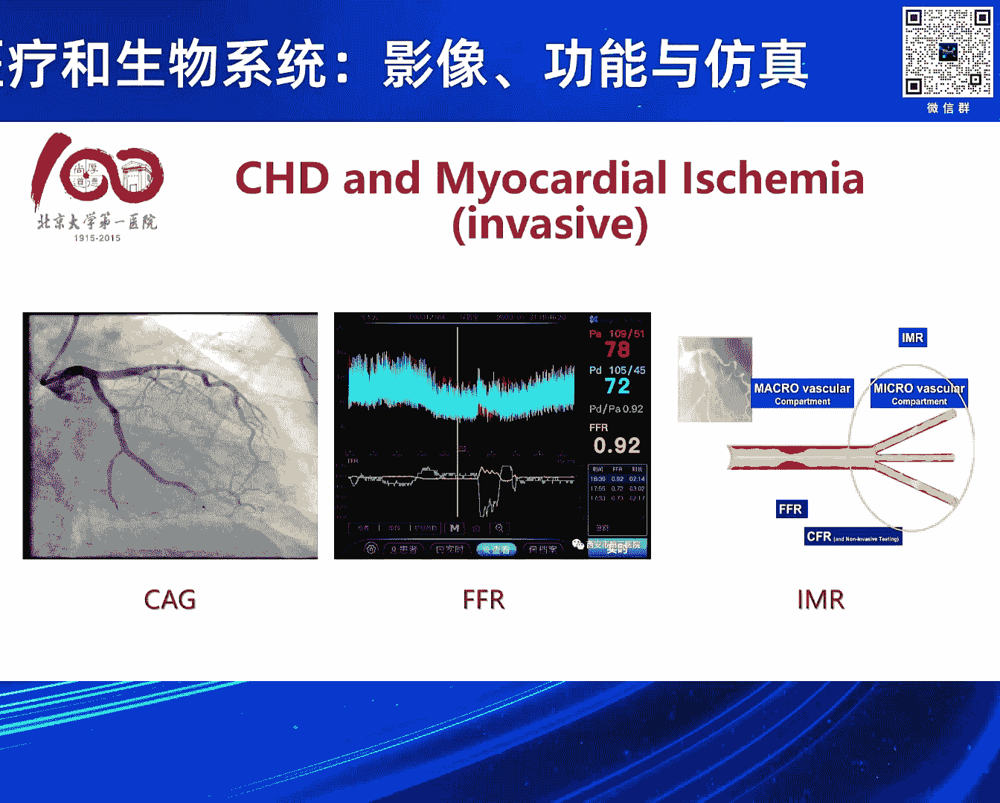

那这是我们跟企业呃合作哈，这个这个也是已经上市的一个这个产品呃。

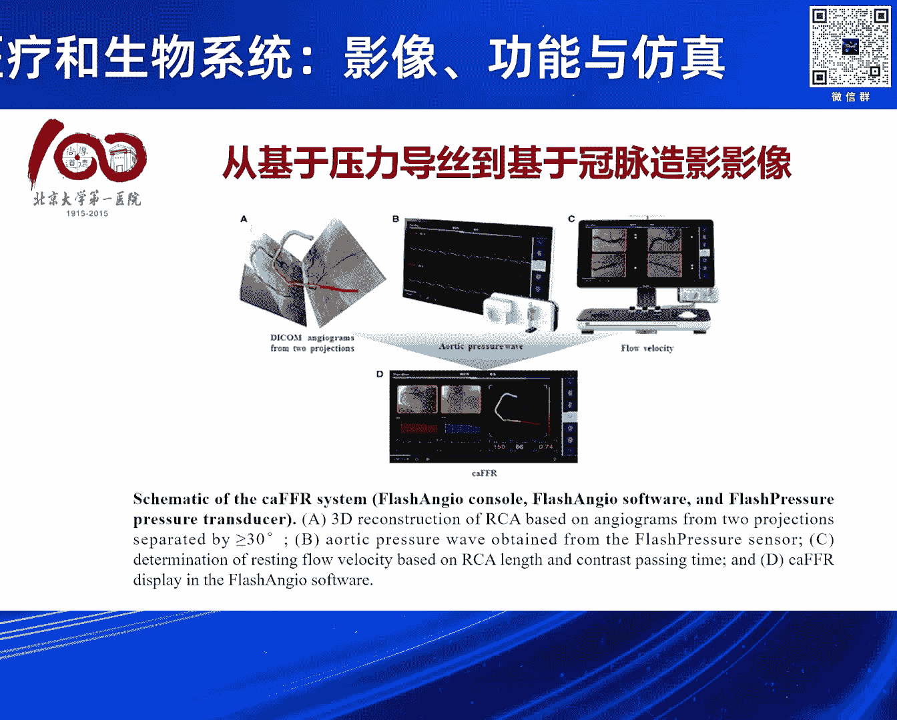

这个也是发表了很好的一个文章哈，我们看它的准确性，这个跟大家看那个呃跟FF2相比哈，它有很好的诊断的准确性，右边那个IMR哈。

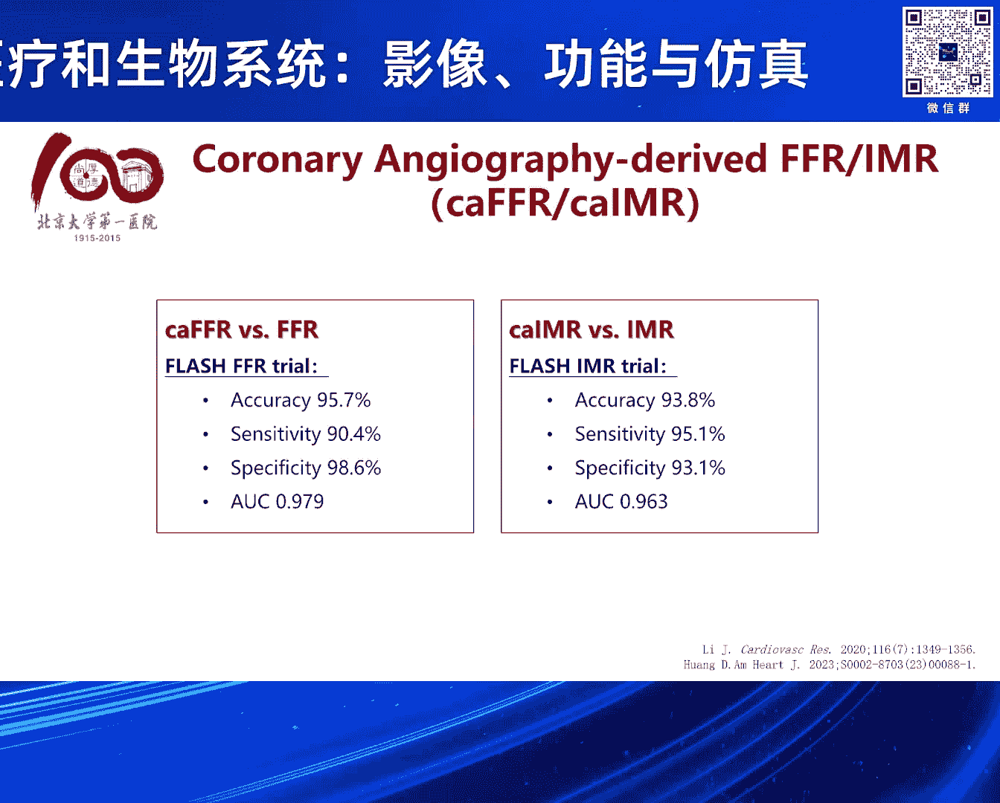

就是我们做微循环阻力指数哈，现在呢这个我们也是也就一个北京市的一个，这个呃首发基金的重点项目哈，在评估，这个基于我今天要给大家介绍的，这个心机应变的这个IM的评测评，那这个是心机应变哈。

我们这个朱天刚是我们国内的超声的专家哈，我们超声心动图会获得一些，这个，这个也是超声上面的，非常简便的一个这个这个数值哈，它叫心肌应变，它反映我们因为我们的心脏的这个数。

这个这个心脏的搏动不是一个气球一样的哈，吹起来缩回来，吹起来缩回来，它在收缩的过程中，这个多少亿个心肌细胞，它其实是一个非常复杂的力学的协调运动，那导致这个像拧毛巾一样的运动，它是一个最有效的去泵血。

好达到一个，那我们去测这样一个心肌应变，就可以反映你可能存在心肌缺血了，好，这是我们跟这个呃，呃，佐治亚大学和清华大学的人工智能的团队合作，那么基于我们自己的这个数据。

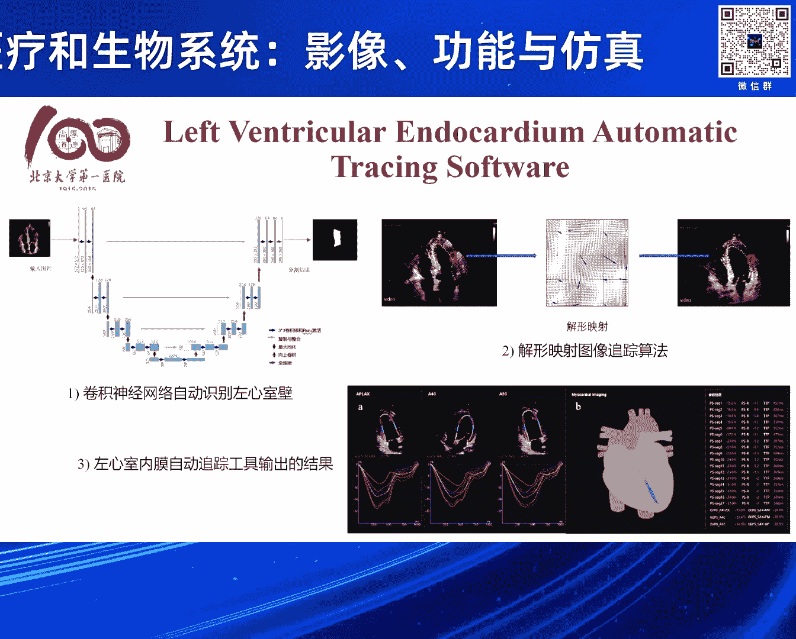

好做的一个初步的结果哈，这个我就不班门弄斧哈。

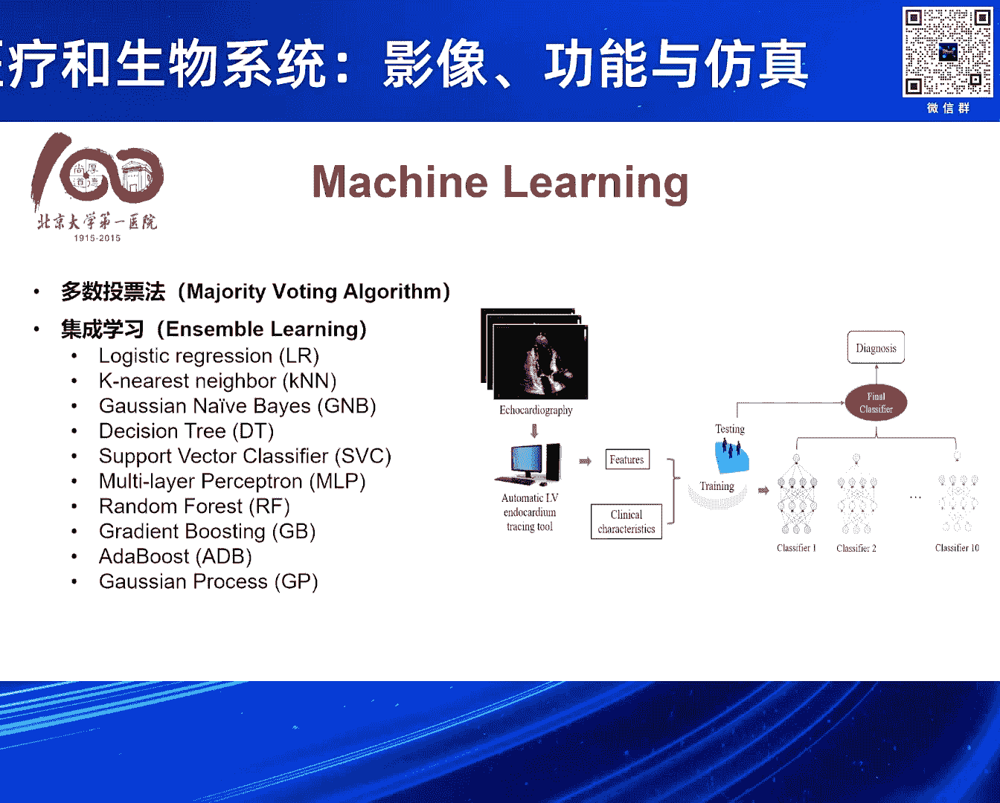

这是一些具体的方法，这是我们当时的一个这个研究的设计哈，最后呢我们最后也是呃，这个结果应该还是不错哈，通过一个呃最最大限度的一个一个学习的，能，这个可以通过呃这个心机应变呢。

达到一个啊非常呃比较理想的一个这个预测，心肌缺血，那么这个我也略过了哈。

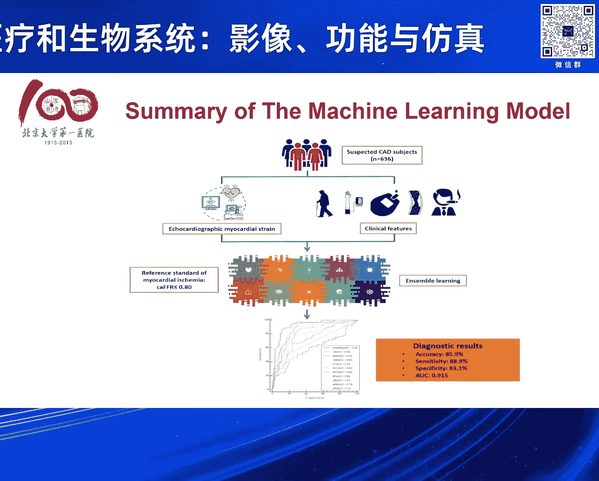

所以呢还是觉得等一会呢，我们还有关于这个缺血哈，我们从这个心脏去关注到肾脏哈，因为肾动脉也有狭窄的问题，肾动脉肾脏也有缺血的问题哈，所以我觉得呃确实这个有很多机会，也有很多挑战，那我个人感受哈。

其实我们需要跨学科的人才哈，我看现在有很多年轻人，我不知道大家的背景是什么，其跨学科的人才特别重要，虽然我们现在有了医工交叉融合，我们也跟智远成立了这个这个心脏的人工，心脏的这个联合实验室。

但是我们还是觉得现在临床医生，可能这个角度上摄入的还是不足哈，我们希我们希望能够跟我们这个呃专业的哈，这些人呢能有更深入的合作哈。

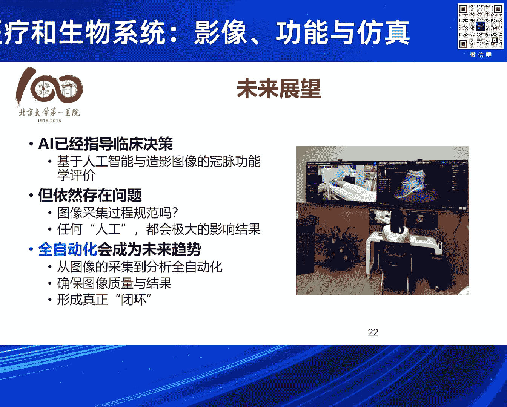

也更希望有这方面的人才，来到我们的这个医院里边来哈，呃这是我们跟张老师这边哈，北京大学第一医院和这个智源，成立的这个人工智能研究院，也希望能借我们今天这次大会哈，能够开展更多的合作。

那再次感谢张教授。