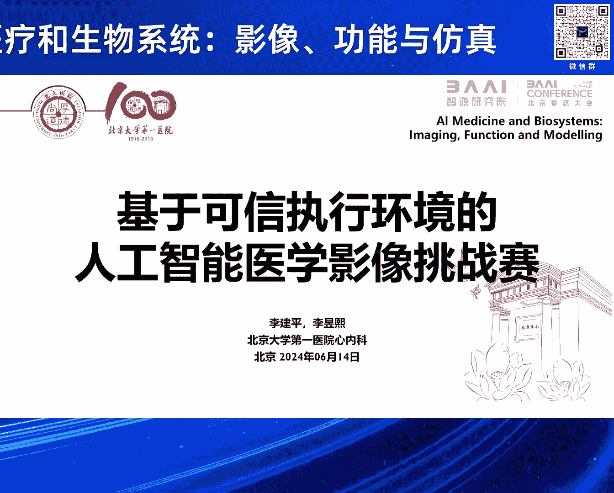
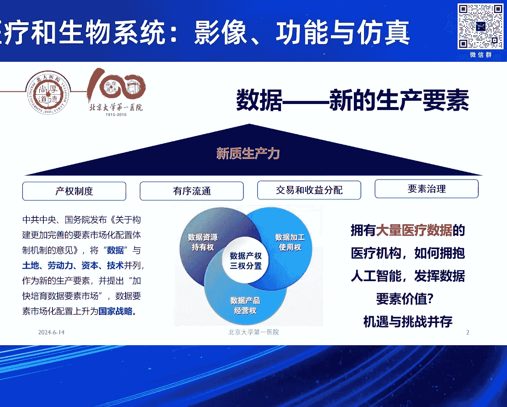
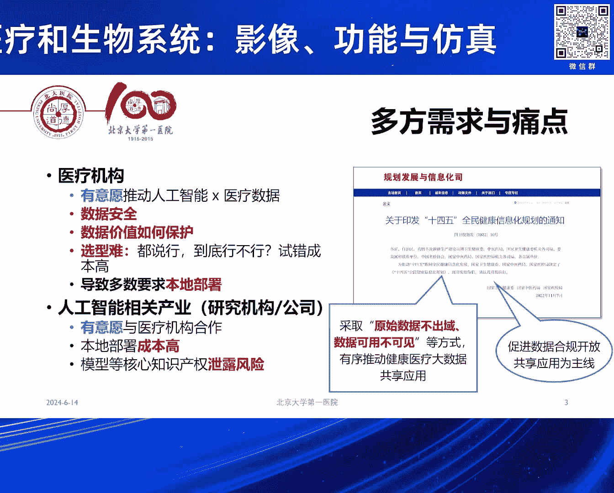
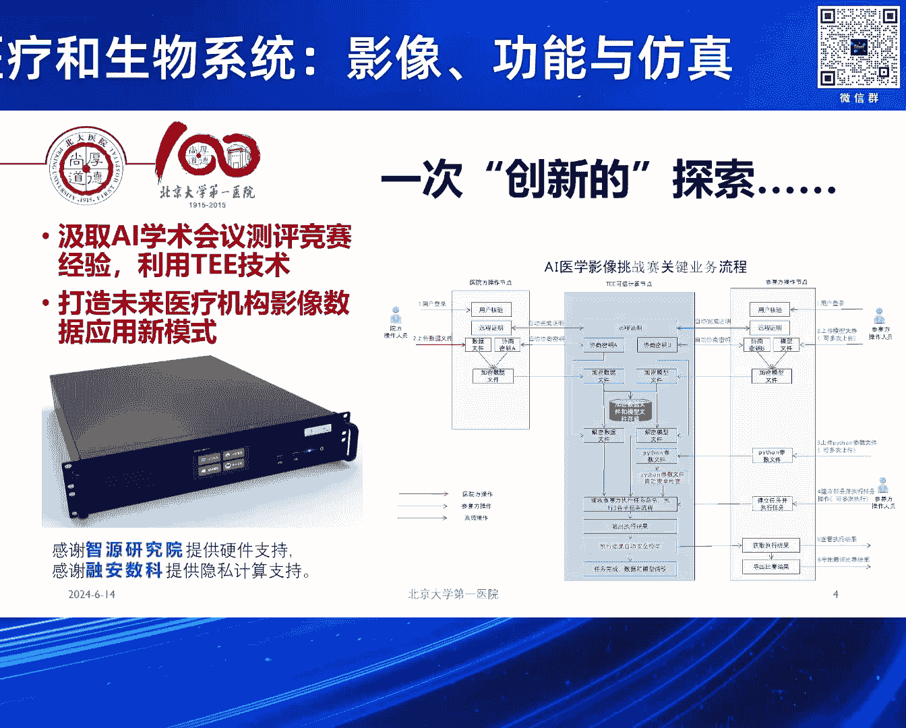
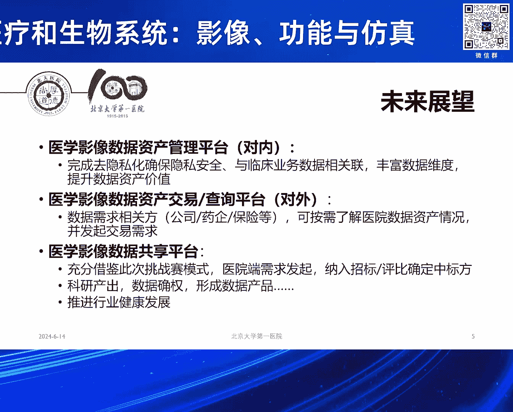
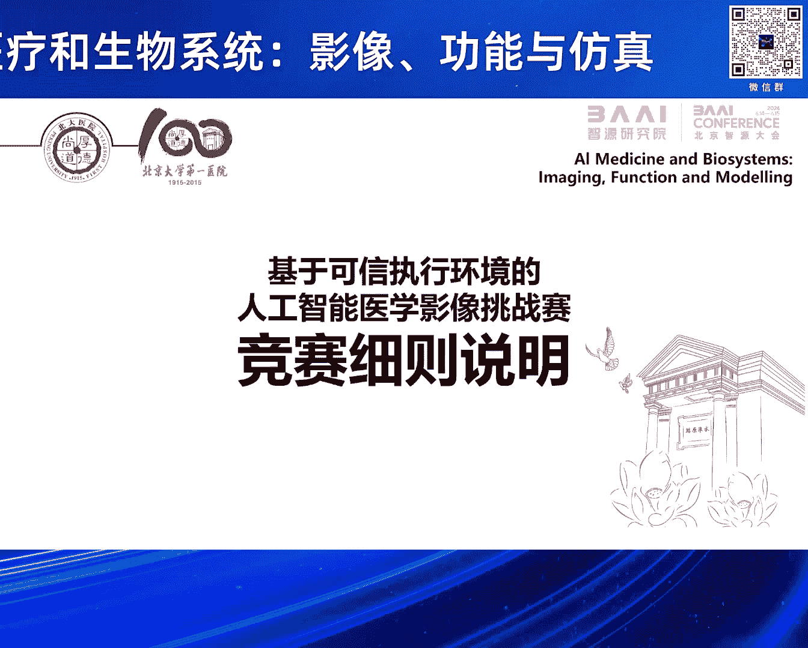
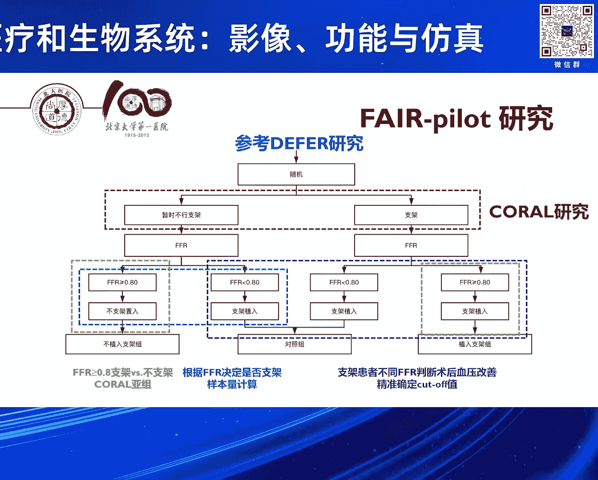
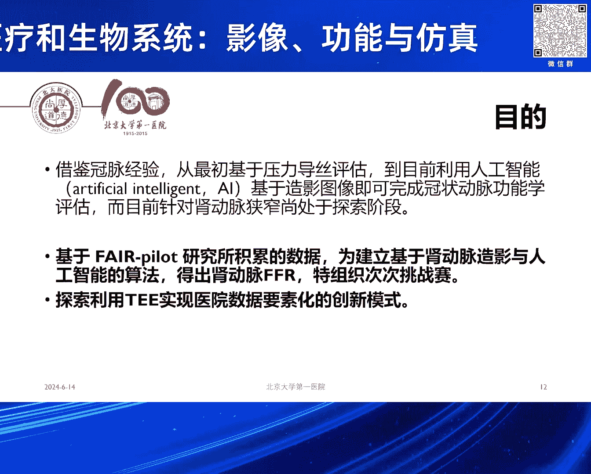
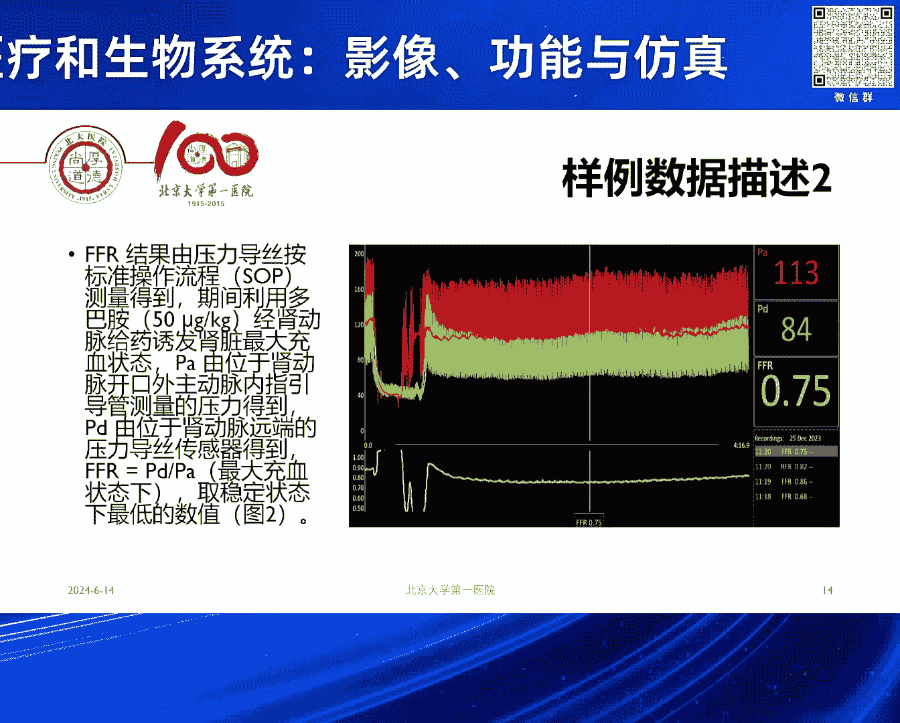

# 2024北京智源大会-智慧医疗和生物系统：影像、功能与仿真 - P5：基于可信执行环境的AI医学影像挑战赛发布：李建平-主持人：李昱熙 - 智源社区 - BV1VW421R7HV

感谢李主任的精彩报告，接下来由李玉溪主任介绍，基于可信执行环境的AI医学影像挑战赛，李玉溪是北京大学第一医院信息中心副主任，心内科副主任医师，擅长常见心血管疾病的临床评估与诊治。

尤其专注冠脉及高血压介入治疗，参与多篇心血管疾病大型临床研究项目，以第一作者发表sci论文十余篇，接下来有请李玉溪主任介绍挑战赛的背景，好的非常感谢呃张教授的邀请，然后也特别荣幸能有这么一个机会。

跟今天在座的各位专家，还有领导来汇报我们的这个设想，然后呢其实真的是一个非常呃胆大的设想，然后今天能够在这样一个场合呃。

逐步把它实现，那简单说一下，为什么我们要要做这件事，其实刚才金教授已经讲到了，呃，其实医院的这个数据非常的宝贵，可能中国的专家不没有这个感受，但如果你真的去欧美呃，像金教授肯定知道要跟医院去合作。

用这个数据真的是很难很难，所以国家整体的战略数据，肯定将来是咱们的这个新的生产要素，那在这里面我们拥有大量医疗数据的医疗机构，其实是有意愿来拥抱人工智能。

让这些数据真正发挥作用，但是这里面呢我们都有需求，但是也有痛点，比如说医院是很有意愿与人工智能的研究机构，公司合作，但是这里面数据安全，尤其中国的医疗机构，其实很缺乏数据安全的这种防范的能力。

那再有呢就是这里面数据价值如何去保护，因为一旦这些数据，哪怕是我脱敏的数据给到了任何的第三方，未来实际上我就失去了这份数据，本来可能有的价值，再有就是这中间我们到底怎么去合作啊，因为到底谁做得好。

其实很难有一个这种呃条件来证实，因为大家都说做得好，但是到底好不好，其实这里面的成本是很高的，所以导致的一个后果就是，医院会要求所有人必须来来我们医院合作啊，包括刚才那个张教授讲到。

我相信很多工作他们都必须到医院里面去做，那这个反过来对于我们的研究机构，还有公司，其实无疑就增加了大家的成本，而且我相信公司也会有顾虑，我把我的模型，我的核心的这个算法放在你的医院。

那又有其他的这个竞争者去，其实也是有这方面的风险，所以在这里面呢这样的一个背景下，那其实国家包括刚才这个金教授也提到的，有可能实现这种原始数据不出域数据是可用。

但是不可见，所以从这样的过程中，我们就提出这样一个非常胆大的呃想法，那好在有张教授，还有智源研究院的支持，那使得我们能够利用这样的一个机会，那我们最初的想法，其实就是想利用众多人工智能学会。

开展的这些测评的竞赛，因为这是一种很成熟的模式，我们提出一个任务，大家都来在同一个公平的平台上，看看到底谁做得好，但是这里面怎么解决刚才的这个痛点，那现在啊智源研究院。

包括我们提供技术支持的这个荣安数科公司，那达出了就是这个所谓TEE，可信执行环境的啊这样的一个技术路线，那在这个技术路线以上呢，其实我们希望的是通过这个小小的尝试，能够打造未来的啊一个生态的这种模式。

比如说我们医院将来就可以来对内建设，我们本身的医学影像数据的这个，资产管理的平台啊，因为这些数据是很好的，可以去隐私化，并且我们可以把它有哪些维度，这些病人有什么样的临床资料，随访了多长时间拿出来。

那这样呢对外我们就可以形成一个交易，或者说查询的平台，未来任何的第三方好比公司药厂，保险企业，你需要了解我医院的这些数据的时候，我可以告诉你啊，那之后其实就有可能进行，我们后续的这种数据的确权。

以及产生的这样的一个啊良性的合作，那最后呢，我们如果有这样的一个隐私计算的平台，那能够给大家提供一个更公平竞争和选型，甚至有可能改变未来我们很多的这种。

招标的流程和模式，那呃这次的竞赛呢其实前期特别感谢张教授，包括智源研究院啊，还有今天在座的像呃这个张鹤叶教授团队，然后像这个王宽泉教授团队，其实啊还有那个李帅教授团队，其实都给了我们大力的支持。

也很有意愿参与到我们未来的这个竞赛里面，那在这我再以一个简短的时间，跟大家汇报一下啊，我们这个竞赛的发起的初衷。

和一些简单的这个细则，那背景呢其实刚才各位专家也都讲到了啊，冠脉的这个功能学是很重要，那我们这次的这个竞赛呢其实是围绕在肾动脉，那肾动脉其实是我们，引起高血压和缺血性肾脏病，一个非常重要的病因。

那肾动脉狭窄呢其实治疗也就是药物和支架，但是介入治疗到目前为止，几个大规模的RCT研究也都是阴性，结果跟刚才李院长讲到的稳定性冠心病啊，如出一辙，那过去这些研究呢，我们回过头来分析。

他肯定是有一些可能的偏移的问题，比如说他纳入了很多狭窄程度并不重的患者，另外呢有那些非常严重的患者，因为是随机对照研究，其实医生和患者都不愿意参与到这个研究里面，因为你一旦参与。

你可能会被随机到药物治疗那组，但是医生和患者都觉得我其实应该放支架，那这些病人的数据，其实并没有进入到这样一个RCT，那导致的一个直接的后果，就是欧美现在基层的医生。

基本不再给大医院推荐做肾动脉支架的病人啊，所以最后一篇RCT研究是，2014年在新西兰杂志上发表，到现在已经过去了10年的时间，那在去年呢，实际上欧美的专家就认识到，这个RCT其实影响了很多病人。

很多病人可能耽误了最佳的救治的时机，所以在去年的HYPOTENSION，就发表了一篇最新的关于肾血管性高血压，血运重建的一个专家的立场声明，那其中就说明不是所有的病人都不该做。

而我们应该去挑选合适的病人，那问题来了，我们怎么去挑选，目前无论是中国美国欧洲的指南，其实都没有一个特别确定的，什么病人，我们该给他放支架，什么病人不该放，那我们就回想到。

其实冠脉是走过了这样一个循证的历程，最早我们就是基于造影超过70%放支架，70%以下不放，但是一系列的研究，甚至他们拿假手术对比的随机断研究，都没有看到阳性的结果。

那随着压力导丝到后续我们基于冠脉造影的啊，所谓这种人工智能的QFRCFCFF2，现在其实积累了大量的循证医学证据，就是基于功能学的支架治疗，是优于过去基于造诣，甚至要优于单纯的药物治疗。

所以我们这样的一个工作，就是希望看看能不能把同样的啊，这个功能学引入到我们的这个肾动脉，那在这个基础上，其实我们在临床中已经开始了探索，我们最早的一例病人是2019年开始做啊。

当时呢这个病人通过了功能学的评估，也获得了非常良好的预后，到现在随访超过5年的时间，他的血压肾功能都保护的很好，那我们就想把它转化成为一个循证的这种证据，那在这个李院长牵头下。

我们也是开展了所谓这个fire pilot的一个研究，那这个研究呢，完全是一个随机对照研究的设计啊，我们有很好的前期的这个研究的方法，然后中间我们也给病人进行了多模态的，这种影像的评估，有肾动脉的超声。

有磁共振啊，当然也有我们术中的造影和FFR测量的这个，肾动脉的压力的参数，那我们就是希望能够看看到底这样的一个方法，是不是可行，那在plot的研究。

目前我们已经完成了所有病人的入组啊，正在进行随访的过程，我们总共是随机了106例的患者，那这些患者呢，我们现在已经有了一些初步的这个数据的分析，那今年呢这个主要的研究。

可能也要在今年的欧洲心脏病学年会上，进行汇报，那在这个过程中呢，其实我们就希望能够开展这样的一个，临床的挑战赛，那他的背景和初衷，第一个就是我们将来一定像跟冠脉一样，是要跨过压力导丝。

进入到利用影像和人工智能算法，直接得出肾动脉的功能学的指标，那第二个其实就是刚才的背景，有没有可能通过这样一种隐私计算的方式，使得我们探索出来一个新的啊这种创新的模式。

那我们就把这个pilot的，106个病人的数据啊，全部进行了汇总，嗯我们提供了一批样例的数据，然后呢，希望大家能够在这个基础上来开展，我们人工智能算法的研发的工作，那这些数据呢我们提供了几类样例的数据。

第一个就是术中的肾脉造影的图像啊，一个动态的DECOM原始格式去隐私化的数据，并且呢在这里面我们进行了QCA软件的标注，由专业的医生啊，完成了他一个狭窄程度和狭窄的这个部位，的一个标注。

那第二部分呢就是我们在手术过程中，用压力导丝测得的肾动脉的这个FI阀，包括远端的平均压，这个病变，近端的平均压啊，以及它基线的这样一个压力的数据。

那在这个过程中呢，我们很遗憾，确实只能提供少量的数据，就像刚才金教授，还有前面几位教授讲到的，在医学领域可能很多场景下我们只有小数据，还没有大数据，但是我相信呃。

在咱们人工智能非常专业的这些专家团队的啊，这个带领下，我们即便用这些小数据，应该也能够探索出来我们未来的这个方法，所以我们初步计划会提供实例的这个标注好的，样例的数据。

每一例呢都有病人呢肾动脉的详细的这个直径，狭窄，病变的直径参考血管，还有FFR，包括当时术中的压力的这个结果，还有我们的影像，那最终我们希望呢得到啊三个任务拆分了，第一个任务呢。

其实就是识别我们血管狭窄的这个关键帧啊，因为一个造影的图像从一开始的空白，到我们填充了造影剂啊，其实里面有很多关键帧是可以识别它的狭窄，第二个任务呢就是根据关键帧的图像，完成图像狭窄的勾勒和分割。

那最后一个任务就是完成我们这个，圣盾曼FFR的一个啊人工智能算法的预测，那这里面呢智源研究院，包括我们合作的这个隐私计算的呃，团队给大家提供了运行的硬件和软件的环境啊。

所以呢呃后续也期待各位专家如果有兴趣的话，可以跟我们进一步的这个合作啊，呃那关于整个的这个挑战赛的背景，还有任务，我简单就汇报到这，那最后呢我们也是那个再次呃邀请张恒贵教授，然后邀请李建平副院长啊。

然后还有这个呃李亚聪老师，我们一起来进行一个简短的这个。

挑战赛的发布的仪式，有请几位专家，我们还是一个特别感谢哈，呃呃见证我们这个肾动脉的一个功能学的呃，计算的这个隐呃，基于隐私环境下的一个计算呃，挑战赛的一个正式的宣布启动，好，谢谢大家。

