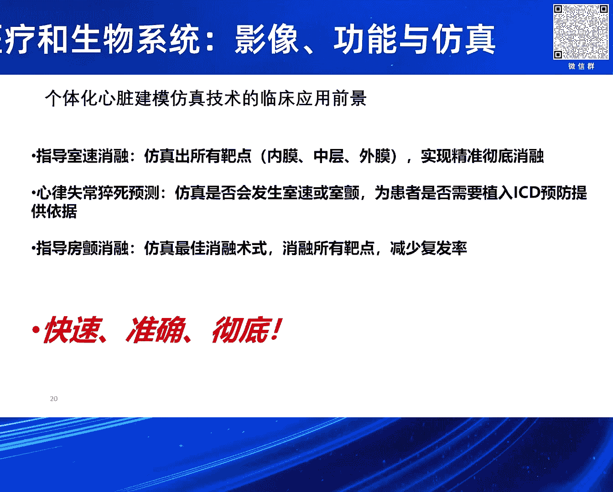

# 2024北京智源大会-智慧医疗和生物系统：影像、功能与仿真 - P6：个体化心脏建模仿真技术及其临床应用前景：夏灵-主持人：王宽全 - 智源社区 - BV1VW421R7HV

尊敬的各位专家，各位同仁，大家下午好啊，我是这个环节的主持人王宽全呃，来自哈尔滨工业大学计算学部，那么非常荣幸的介绍，我们这个环节的第一位讲者呃，夏琳，浙江大学教授博士生导师。

前任浙江大学生物医学工程研究所所长。

浙江大学生物医学工程，兼任中国生物医学工程学会理事，医学图像信息与控制分委会主任，国际生物医学工程杂志编委等学术职务，长期从事心脏电生理或磁共振成像系统方面的，科研和教学工作。

主持承担了七项国家资产科技基金，三项973计划项目子课题，一项国家支撑计划子课体，和一项863计划项目，夏教授的报告，题，为个体化心脏建模，仿真技术及其临床应用与前进，大家欢迎啊。

好非常感谢呃张教授的邀请，以及呃王教授的介绍，那么我那一辈子就做心脏期模仿真，那么近几年就是我就是重点，就是跟随欧美那个那个步伐，就是最近几年就是欧美国家，特别是美国约翰霍普金斯大学。

他们就说一个个体化心脏建模仿真技术就用，主要是对针对心律失常这个治疗，那我们知道心律失常是心脏疾病诊治的难点，因为其他心脏疾病呃，我们现在有相对来说好一些，因为有影像检查都看出来。

就是哪里有毛病就直接看出来了，但是心律失常它是跟电相关的，电相关的就是比较麻烦，看不到，就是影像范围看不到，所以我们左边这个图就是我们正常心脏比行驶，它的细分次序就非常有规律的。

你要比右边这个比如心尖上给他个刺激，他就紊乱掉了，那么就心跳速度非常快呃使行行行动过剩，甚至使颤，那么像右边这个要颤动的话，心呃心室颤抖的要死人了，就你立马的除颤，不吃蒜肯定就死掉了。

是关键是你我们怎么把它消融，把它就打停下来，那么就是你要是最最简单办法，就有个强电流刺激呃，呃让所有心肌细胞就是恢复到精哎呀静息状态，那么又恢复原来这个呃有规律的这个节制啊，节律跳动。

这是关键是我们消肿怎么消融的靶点，那我们知道就心脏，我们连着血管，所以我们嗯做心脏的医生都知道啊，就是德国医生护福特斯是吧，发明了就是自己导管进去，直直接升到心脏，那么就是设备消融。

那么这个这项技术就是推广之后，他还获得诺贝尔奖对吧，就是从此以后心内科医生确实很多手术，心内可以瞬间干掉，原来可能都要心心外科医生嗯，那么既然这个店看不到，那么现在临床有有有几种方法，就是心内标测对吧。

我们用的最多可能就是强韧公司的卡图系统，以及就是呃雅培的，就是这个inside的这个系统，那么就一点点去飙车，那飙车呢就是就是为了目的就找那个靶点，消融靶点，但是现在我认为就是这个这个心率。

飙车还存在一些问题，那比较费时，这一般是诱发诱发出心律失常，在飙车诱发飙车这么多次循环，那时间大部分时间都耗在这，那实际上第二个呢它看起来三维，实际上是二维，就是说那个壳是三维的。

但是实际上它就是标测心内膜对吧，实际上心内膜就但是呢心脏它是立体结构，它有新基层呃，它只能标这个心内膜对吧，他导管伸到心内膜去，那心外膜标测不到，特别中中间心基层就更标测不到。

这样就有些就说因为你这个靶点在心内，某个心外膜是不一样的，你特别中基层诶，你家用设备消耗能量的选择不一样对吧，或者你的心外膜的话，你的呃可能可能要穿刺过去，就是才能消融。

所以这样有时候就是呃会导致心理呃，消融这个失败嗯，另外就是还可以，就是容易漏掉这个这个这个潜在靶点，那一般临床医生就是说它诱发心律失常，可能就选几个点对吧，就是可能就是呃呃选择一个新电刺。

新建部刺激一下，或者是又是流出到二刺激下就完了，那很多其他地方它就不及诱发，那实际上可能还有潜在的靶点，所以漏掉，这样就导致它复发率要高，所以就是最近就是就欧美啊，欧洲有，特别是美国。

我们就是原霍普金斯，就是纳塔利的教授，那个克列组就用个体化心脏建模这个仿真技术，那么它就是我们对患者就少一个磁共振，特别是伽增强这个颜值强化的组织，这样就可以扫出来，就特别是比如说辛格啊。

以新梗就是心梗就救回来了，但是他也留下疤痕，有些疤痕留下来或这样的，有些心肌细细胞是死掉，但有的新型细胞呢还半死不活的，我们称为灰区，这样的就是死掉心肌细胞，它不会传传导电，那你半死不活的心肌诶。

它能传传导电，但是它传导速度慢，嗯这样才很容易形成1CP市场，那么这样模型我们通过就是呃构建这个模型，呃，这个当然这部分就是因为构建这个模型哈，哈很很费时，要手动的话就花非常啊，花了多少钱。

现在我们就用一个全自动用AI的呃，帮助下就是构建这个模型，这样就的三维模型构建出来，这样来我们这个算构建模型之后呢，就是我们不光光是结构模型，我们电生理参数都给它附上，包括心肌纤维选项。

因为他这个心肌纤维选项非常有规律的，我们得给他自动扶伤咳，然后包括动作定位啊，心肌细胞，包括就是你心内膜跟中间，心肌层跟心外膜动作电位不一样的这样一仿真，然后刺激我们按照美国心脏协会，那个几个点标准。

19个点对吧，17个点，19个点，那么刺激就相当于就是，我们给他去施加一个虚拟刺激，实际上我们也是心理上呢，他它诱发因素就是那早搏对吧，相当于给给相当于给他个电脉冲这么刺激。

那么这样就是我们我们心理失常，就是给算出来了，那包括就是这个我们的计算模型，包括左边的，右边的是实际的，实际上呢就是它标测到的模型，就是下面这个图更清楚点，那么这个模型算出来之后。

我们就是比这个灰的这个地方，就是我们消融那个右右边那个图哎，这样就是他的心率时代就就就可以消失掉了，那么这是第一个就是飙车点，就实际上还有就是飙车点，就是临川是嗯8。1是第一次手术标识的，后来8。

2是第二次手术了似的，它复发了，现在又飙升到我们模型，实际上就一次性就把所有就是潜在靶理，就是反认出来，那么就一次性就手术就就就可以结束了，就直到就是你再优化不出来，就是有些折返。

这样的话就是减少这个复发率嗯，那么这是就是使信心动过速对吧，这个是右边这个图，就是我们呃青色部分，就是我们算出来只要消融这么一点就行了，那个红色区域是呃，医生就说呃，实际手术中就是我们就吻合的非常好。

那实际上对心肌细胞，就是正常心肌细胞损伤还少，那么还有一个就是前面就是我们算是靶点，假如我们不管就算出靶点在什么地方，那就是猝死对吧，我们知道就是促使越来越多，越来越年年轻化，特别是有些心梗虽然救回来。

但是他有些疤痕留下来，有些扩张性心肌病或者肥厚性心肌病，特别是肥厚性心病呃，我看了个报道，就是年轻人呢就猝死，有1%都是肥厚性心肌病，在这呢就是我们现在呢就是装ICD，就是临床上了嗯。

就是没有很好的方法，就好像就只有就是左左心室射血分数，这个就是35%下，那么就建议植入RCD以上，还会不就是不植入，这样就是非常不准，这样就导致就是你该植入有时候不植入，不该植入的植入。

那就是有些浪费资源，有害有失并发症，所以所以这个就非常不不准，就是我估计这二三十%了不得了，所以我们吴主任说按这一个，那么就是我们做这个我们就算的非常准，比如这是一个典型的，比如说我们一个扩张性心肌病。

就是我们那上面这模型它有些一般痕，有些，然后我们算出来就是可诱发出了心律失常，就死速也我们又发出来170呃，一十一百七十八次每分钟每呃心跳，那么实际心电图算出来是180，这非常准。

这个事先我们医生就是没有告诉告诉我们，结果我们算出来他非常惊讶，非常吃惊，嗯你这个非常准，然后这个这个患者就是听说我们建议，就植入ICD了，那么过几个月唉确实确实放电，因为这个是可以检测的。

你ICTU放电，你某年某月某某日放电，它有记录的，这个做不了假对，所以这个这个就是非常准，就是这个我们写个例子，就当时就发在中华新闻新闻海平杂志上对吧，那另外一个例子呢是反向的，就是风险非常高。

一个51岁男性，而他治房颤，入院治疗，房颤治好了，我们看他心思好像是风险很大，建议治安息的，后来没植入过几个月就猝死了，就来不及抢救，这个你打120来不及，所以这个就是我们嗯这个预测。

就是你要不要植入除颤器是吧，ICT目前我们在安贞医院，就吴永泉教授那里做了100多例了，我们统计了96%，那另外他马上也给我们另外400例，就是呃在我们市就说，那么然后他要大量的跟随访。

就是从18年开始，有有磁共振的那个那些患者数据给我们，这样就是加上随访，就是这样算算的准不准，他就非常有数了，有些有些放电呃，他初步统计比如400例的只有100多例才放电。

那说明有些有些可能就是风险不高的，也植入了对吧，所以我们这项工资这样做，包括就是安贞医院有个重大科技创新，这个项目就是这个我们在做，包括浙江省的助力研发计划，要记住，那还有一个就是房颤。

我们房颤知道就是这个房颤这个病人越来越多，我听蒋丞杨主任说有2000万，那每年现在手数量只有二十二十万台，就100%分之99还得不到有效治疗，因为就是能看上电生理这个手术的医院不多，就来不及做。

所以说因为房颤它是很多并发症的心衰啊，包括特别是中风啊，这个东西都是都是他的后遗症对吧，所以这个房颤就说这个量非常大，那么就是我们房山呢就也也一样，就是就心脏磁共振就扫描这纤维化的，就取这个绿色的。

就纤维化去，这样我们可以算出来这个病例，就是我们学生在在美国做的这个非常典型的，就是这个房颤复发了多次，而最后也没办法就是找到娜塔里，他们就是作为志愿者去做，那然后我们给他算算出来就好几个。

又有有这反应，三个左心房，右一个在右心耳，然后然后完了之后我们就手术规划，这个玩飞机慢，那是必须的，要消融的，然后我们加上另外的几个几个几个消融线，哎这个完了之后一两年之内就不再复发了。

所以这个就是这个算的还是标准啊，标准的就是我是说就跟临床医生，我就跟他们讲说就万物算不准，你原来怎么飙车就怎么飙车，我不会影响你原来的手术对吧，我只是建议这样做了之后就是我们之后嗯。

然后我们就是可以导到，就是你卡通系统里面，就是你哎这么一生就是对着那个标出来，你你笑容就OK了，这样就是节省了你标测了，所以这个方法就是我们认为一个知道，就是此处消融就仿制出所有靶点。

就内膜中层就是外膜，就是你地方都能给你标好，那那那么这样可以我们精准的就是彻底的，就是这个消融就不会漏掉，因为就是我们在电脑上模拟，就是我19个点去19个区域都给你又发一遍，这样才不会漏掉对吧。

一个初始预测，那么这个就是要不然一会会发生史书或死颤，那假如风险非常高的话，那比如说我们19个区，好多区都能诱发出来，你说明这非常非常有风险，非常高，你不支持爱心的，恐怕呃可能由于猝死风险非常大。

所以这个我们就是做的就在安贞医院，就是温泉主任谈的就做了很多了，那另外就是第三个就房颤，就是最佳效能舒适对吧，这个就是所有靶点，这就是一次性给你就是消融掉，因为房颤其实临床最大问题是复发率比较高。

像安贞医院那水平比较高，那么就是复发率就少一点，有些小医院恐怕将近一半的复发，所以这个我们假设我们希望，就是我用我们的方法，就是呃降低这个复发率是吧，就是这个就是所以就快速准确，彻底就快速。

就是很多时间我们提前给你做掉了，对这么医生上来就你理想情况下，你不要去飙车，直接按按照提供，我们提供的是靶点消融，消肿完了之后，你去诱发再诱发不足的心理是啥，那就是这个手术完了，但就飙升了。

这一步就可以省掉了，你万一还能就是诱发出来，那就年龄怎么标，怎么标识，说明我们有也有漏掉，对吧嗯，那准确就是因为你能消掉，那肯定准确也彻底，就是我所有靶点就是都帮你找出来，一一台手术就是尽可能全消掉。

这样的将来就是说复发率肯定会降低，我希望将来跟跟龙主任就是能合作，这方面就是到底行不行，就是临床医生说了算，哎这个是个方法，Ok，那我们将来就是我们诶往这个方面就推进一步，对吧咳行。

我就介绍到这，谢谢嗯。