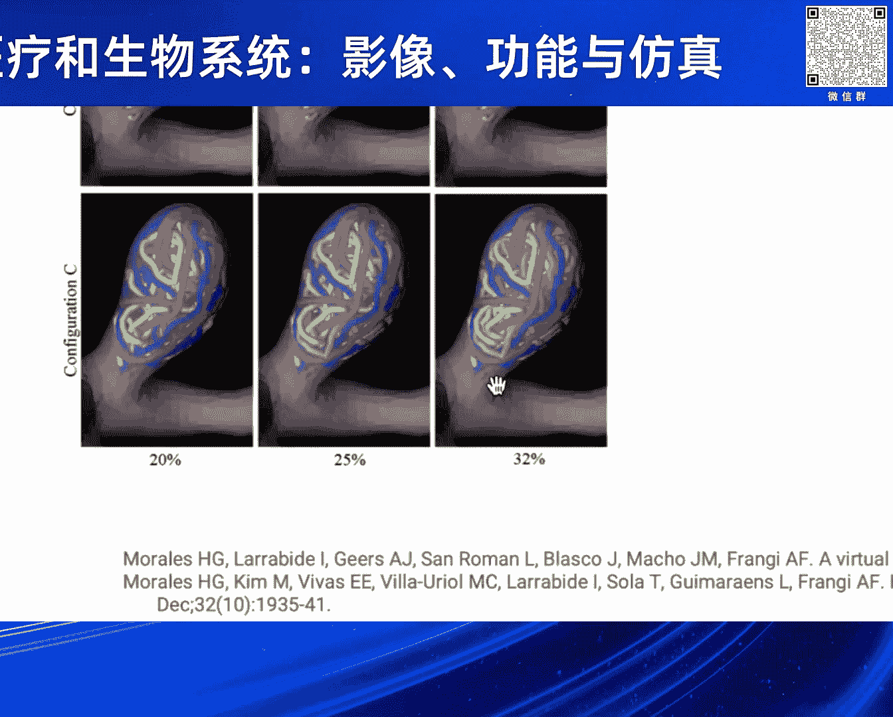
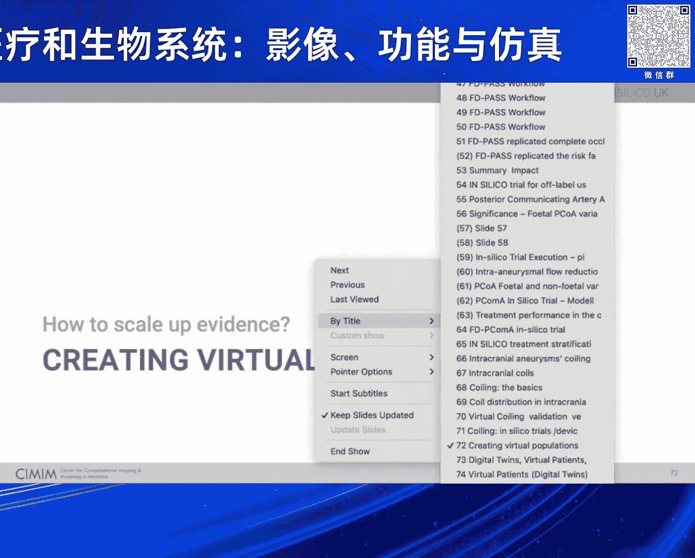

# 2024北京智源大会-智慧医疗和生物系统：影像、功能与仿真 - P7：On trials and tribulations ：Alejandro Frangi - 智源社区 - BV1VW421R7HV

现在是时候问你一个问题了，所以请转到下一位演讲者，franay教授，哈喽，你能听到我们吗，是呀，你可以，那太好了，好啦，所以早上好，好啦，所以我真的很感激，感激，所以你今天要在这里给我们做一个报告。

所以我用中文做了一个简短的介绍，我希望你不介意，让观众你更好，我喜金和尹伊，更快、更可持续，为更好和更公平的护理提供可持续医疗器械。

谢谢你，附件，我现在离开舞台给你，完美非常感谢，我可以拿到幻灯片，你现在应该能看到幻灯片了，如此正确，好啦，完美，所以呃，各位下午好，嗯，所以能够展示我们的一些作品是很好的。

并能够在这种情况下做到这一点，嗯，所以为了给一点上下文，我实际上是曼彻斯特克里斯汀潘古研究所的主任，它专注于健康技术，研究和创新，我们有许多感兴趣的领域，包括人工智能和数字健康，计算医学与生物学。

先进的干预措施和设备，而且你知道，当我们遇到挑战时，在许多领域，我们特别有兴趣解决或使用这些技术，特别是这次演讲与三个方面的挑战有关，它是关于以更快和可持续的方式带来更安全的干预措施。

如果你明年有兴趣来参观我们，你有一个很好的机会在医学上进行虚拟成像试验，六月份将在曼彻斯特竞选的老朋友们--大约这个时候，所以我今天要讲的主题是集中在一个非常重要的任务上，这是每个临床医生都应该关注的。

他们虚伪的誓言，这是关于减少你知道的不伤害病人作为第一步，如果我们看看我们在健康科学中进行医疗产品创新的方式，无论是药品还是医疗器械，我们都知道，这些都是非常漫长的过程，必须经历许多阶段。

以确保我们不做那部分，其根源是，有许多科学调查被用来产生证据，这是科学证据所必需的，也是为了改善医疗项目的生命周期，所以整个研发和那些应该是非常可信的来源，我们专注于自己，台架试验，论动物试验。

在人体测试中，所有这些都是为了确定安全性和有效性，嗯考虑，现在的问题是，他们有吗，还是它们真的像我们认为的那样有效，确保安全有效，所以我们知道这十种方法中的每一种都有许多局限性，我不打算把这些都看完。

但我们都知道那个板凳，动物和人体试验，毕竟，干预措施如何在普通人群中发挥作用的不同模型，现在如果我专注于今天，主要在医疗器械上，哪个是我个人工作更多的领域，生产一个新的数字装置平均大约五个，四百万。

但范围很广，这是你知道的一般复杂设备，正如您在这张幻灯片中所看到的，概念证明，一直到发布营销研究，没有几个阶段的损耗率和失败概率都很高，在每一个步骤中，我们也知道，呃，从一项研究中，最近的一项研究。

那个，嗯，五大最重要的根源，呃，对医疗器械的需求，根据食品和药物管理局，呃，在班级群里，一个设备超过50%是由于设计设备设计问题，在所有类别的召回中，近30%，或近两百款设备或款式。

所以我们确实有一个严重的问题，最后去结束这场音乐会，你知道的，美国的植入文件研究表明，在十年的时间里，在许多设备中，已经有非常多的死亡和严重的不良影响，所有通过FDA许可的设备和产品。

我们在英国也有类似的证据，所以这不仅仅是美国的问题，我敢打赌，你们在中国也有类似的问题，就在几周前，十一三，这个装置被从市场上撤下了，所以这是一个普通的设备，你知道的，嗯，两百多人受伤十四人死亡。

如果我给你一份所有回忆的清单，就在2424，只有在食品和药物管理局，我们还没走到一半，如果你今天跳上飞机，你知道你有一千万分之一，在车祸中死亡的机会，在一辆商用车里，在商用飞机中。

如果你做一个随机对照试验，你没有，暂时没有证据，不是很，在文献中没有很好的数字，这只是为了给你一个迹象，病人有什么风险，参加硅试验时，这应该是一个非常受控制的场景，所以我们需要思考以非常不同的方式做事。

用我的语言，嗯，我翻译这个想法，当然先不要伤害到模拟，这就是我想向你解释的，我们要做的是，我想这真是难以置信，在医疗保健方面，我们仍然这样做，嗯测试，物理测试作为主要证据来源，当在许多其他行业。

如汽车和航空航天，嗯，这是相反的，事实上，在我们真正去构建和测试之前，我们倾向于做大部分的模拟，你可能会争辩说，医疗保健是非常不同的，要复杂得多，我会挑战一下，我想如果你只是单纯地认为，例如。

在航空航天部门，这些都是多尺度的问题，高度监管，任务关键，有很多不确定性，在过去的二三十年里，他们经历了一场变革，从实体到虚拟，所以说，我的问题是为什么，我们不应该在医疗保健领域做同样的事情。

如果你希望在计算和医学领域有一个分支，更广泛地说，是有效地使用基于计算机的测试或tr，在高度受控的虚拟条件下，具有高度详细的预测模型，或者虚拟队列实际上试图在早期代表，我们稍后会发现的情况。

当我们进行人体测试时，所以这个情节很重要，如果你，如果你看看我们今天所做的，我们今天要做的基本上是我们把这里的情节做得很好，我们倾向于开发新技术，很快我们就想进行临床前测试和临床测试。

因为你知道如果你是一个小企业，你有投资者在你的脖子上，他们会想确切地知道，你知道什么是效率，您需要相当快地结束您的设计，并开始进行测试，以显示一些证据，现在呢，问题是如果你，如果你对不起。

我应该说如果这是生命周期，当然啦，水平和垂直是您识别的设计问题的数量，你需要解决，所以你倾向于在早期解决这些问题中的很少一部分，因为你测试不够，你的努力，你在管道里走得越深，如果你犯了一个错误。

你得回到起点，费用是，你知道的，越陷越深，所以我们在硅方法中提出的是，我们真的能找到以更便宜和计算的方式进行测试的方法吗，所以我们做了一个更多样化和详尽的测试，以及设计师空间Vicspace的探索。

对不起，所以当我们进行人体测试的时候，我们面临着这些创新失败的巨大风险，但我们需要以这种早期虚拟测试尽可能多地代表的方式来做到这一点，与人体试验或物理测试相同的复杂性和多样性。

所以我今天要给你们看一个例子，主要围绕着大脑异常，这是我们多年来一直在研究的领域，但如果我给你看你知道，三十多年的医疗器械发展本质上是一堆电线，仍有20％的并发症，近3%的死亡率。

我想知道为什么我们不能做类似的事情，就像航空航天，你知道的，计算测试，我们可以证明你知道差异，例如，来自相同的装置和不同的解剖结构，或以不同方式植入同一装置，了解我们的技术，你可以，我可能会问你自己。

你知道这些技术中哪一种是最好的，实际上，在所有这些硅胶方法中，重要的是要识别什么，其他的都只是模型，所有这些从根本上来说都是错误的，但其中一些可能有助于回答一个特定的问题，所以这并不是说硅将取代一切。

还是坚持人体随机对照试验，好像他们是完美的黄金标准，我们知道随机对照试验本身就充满了局限性，在偏见方面，你知道的，选择偏差，嗯，处理一些情况的复杂性，比如，例如罕见病，在儿科，在联合治疗中。

做一个随机对照试验，在某些方面是实际的、道德的或不可能的，所以我们提倡的，但是我们需要所有这些假证据，你不应该用三个，如果你有四个证据来源，并将它们结合在一起，你知道这是我的方式。

以减少回答和完善人体试验为目标，其他形式的试验也是可能的，例如，我们也许可以通过更好地理解，我们试图测量的影响的大小，所以我们可以做得更好，我们也许可以通过识别惊险和模拟来减少人体试验。

一种特定的技术永远不会成功，所以我们不需要做试验，病人的风险，但也有那些试图投资于这些技术的公司的资本，最后，在某些情况下，我们也可以替换，设备，但你也可以，然后呢，例如，更换电路板，监管委员会，例如。

在我们没有足够的布局信息的区域，现在给你一个例子，关于这可能产生的影响，这是一项由一家非常著名的制造商开发的医疗设备的研究，他们通过使用硅胶方法表明，他们可以提前两年上市，它们减少了对人体测试的需求。

大约250个不需要的病人，因为它们可以在没有它们的情况下显示效果，这减少了大约一千万美元的试验费用，并增加了可以获得这种生活的病人的数量，节省技术约一万，仅仅因为你有两年的时间，你知道的。

早期留置权开始用这种技术治疗病人，所以这种影响可能是巨大的，现在我们准备好黄金时段了吗，现在有很多活动，在澳大利亚，在美国，他们正在更新他们的指导方针，开始将硅方法纳入，也是一些新的指导意见即将出台。

嗯，也有机构在采取这两个步骤，就像需要，你知道的，多项监管程序未要求动物试验，在这种情况下是为了，正如我所说，有一些指南即将到来，FDA已于去年11月和7月提供医疗器械资质报告指南，工具。

用于医疗设备的，开发工具或用于产生医疗器械证据的工具，它们也为计算模型提供了框架的可信度，在愤世嫉俗的世界里，也有一个实践社区正在成长，在英国硅胶，我一会儿就会提到，他们中的一些人正在生产，你知道的。

试图生成良好的文档，良好的模拟实践，与良好的实验室做法类似，或良好的制造规范，如果你有兴趣了解更多的鸟类联盟，在欧洲和英国，更具体地说，在英国，他们有实践社区，他们也在制作文件，为片场提供思想领导。

就像英国的风景报告一样，在那里你可以找到十二个案例研究和一些建议，也是最近，基于世界工程院联合举办的一些活动，图片版权和硅酸盐英国网络，所有的证据都表明，例如，有，他们在采用监管方面的障碍。

监管和硅监管资源主要是该行业的不确定性，关于建模和仿真，还有一个事实是，有很多模型在那里，但并不是所有的公司都有很好的成熟度和可信度标准，你知道的，质量，受过更好训练和更多训练的人，因此。

拥有正确建模和仿真技能的人数不足，那个可以，你知道的，通过这些手段解释和评估证据，还有许多其他的事情，但这是前三名，所以我现在想展示，关于所有这些付诸实践的几个例子，我想完全展示的一个例子。

然后如果我有一点时间，我将展示其他几个较短的例子，是一个完整的端到端的硅试验经验，这表明你可以重现真实的审判，如何将物理学结合起来，生物学与生理学，以及这些试验如何开始产生新的行为。

意思是你的模型中的硬线，但实际上是有道理的，它们是由他们产生的全新发现，所以我将作为一个案例研究，一种分流装置，所以这是一个非常密集整齐的支架，就像你在习惯中加入的结构。

作用机制是将动脉瘤的血流转移到主流，动脉瘤，血液流动停滞，这就产生了绘图，你用，高度密集的街道，但你也允许他们有一些可能性，所以你去关闭穿孔动脉，这是非常重要的维持，嗯，你知道大脑的血液供应。

现在这些地块一旦形成就关闭了单位，关闭非理性，嗯，从血液会流入动脉瘤，最终从循环中恢复并照亮它，嗯，那是一种理论，设备和我要展示，是一种流动，在节拍器的血管装置上有个图标，它是在2011年推出的。

这里的橙色区域，你看到它是如何在短短几年内占据大部分市场的，嗯，在这个空间里，但是你可以看到还有很多其他的技术，它们的寿命不是很大，你仍然知道它是怎么运行的，嗯，每一个房客都要接受随机对照试验。

所以大量的测试，所以这个过程可能是七年，然后你可能只是在市场上，在一项新技术出现并取代你之前的五年，不仅仅是，你知道的，快速技术看这个表，你只知道这些，如果你没有深入到所有的细节。

每一排都是动脉瘤的不同装置，对许多人来说，很多班，他们都经历了同样的过程，想想就觉得很疯狂，那么当硅试验时我们该怎么办，假设我们有一个装置，所以我们谈话的每个人，假设我们有一个代表人口的解剖模型库。

所以在这里，例如，在英国，我们正试图在地区一级这样做，这样我们就可以接触到成千上万的解剖模型，所以对于这些模型中的每一个，我们要做的是，我们要把这个装置植入他们每个人体内，我们还将定义一个度量。

一个游戏，成功的衡量标准，在这种情况下，是所谓的最大时间减少，颈部平均速度，这告诉你现在有多少流经颈部的血液被消除了，你把你的设备，根据这个指标，你会争辩说这个装置是一个更好的深层形式。

在这个病人身上比在这个病人身上好，因为在这里需要百分之六十四的血液供应，而在这里只需要27%，你看这个数字将取决于病人，我们可以做的另一件事是，如果你有当设备，你可以生成生理条件的模型。

看看当这些病人经历休息和压力时会发生什么，运动，休息和压力条件，又是你，您将看到，在这种情况下或技术结果中，成功的度量取决于，你知道的，即使是同样的解剖结构，这取决于你是否在休息和锻炼同一设备，当然。

你可以把竞争的设备放在一起，开始看看你是否知道，在特定解剖结构中的设备a和设备b，或在某一特定群体中，所以说，实施这些二氧化硅试验之一，意味着您需要实现一个复杂的模拟管道，从路上的图像到三维模型。

设备本身的模型，生理边界条件模型，解决物理问题，然后解决生物化学，在这种密谋的情况下，我不打算多谈血块小组的模式，但这是一个相对复杂的模型，它模拟了血液相关性的生化途径，在底部。

只是在这个管道中使用的一些出版物，但可能是审判，一分钟后我将向你们展示大约50篇期刊论文，多年来，其中一些实际上没有在审判中使用，但它们被用来识别我们所做的假设，有效的，你也知道，在我们接管之前。

最大的问题是，硅试验能复制和扩展传统临床试验能给你的东西吗，我想让你相信答案是肯定的，所以大约两年前，我们在《自然通讯》上发表了一篇论文，论文的标题正是我们可以做到这一点，为了让你们了解这项研究是什么。

所以我们拿着那个设备向你解释了电源和主设备，嗯，你也知道，只是给你一个想法，的，那个装置的移交从科学出版物开始花了八年时间，招聘六年，只有110个病人，可能在3000万到4000万美元之间。

现在他们中的许多人，我等下再谈，但这就是Sincero试验的类型是如何实现的，所以我们选择了一组有相同纳入和排除标准的患者，和相似的特征，两个证明，这是第二次试验，他们从大动脉瘤变成了小动脉瘤。

所以他们想证明图书试验的结论是否从，有一种算法，然后是渴望，和一个完成的注册表，是营销来证明你知道这在后营销环境中再次被掩盖了，但是如果你把所有的病人加起来，他们为免费试用所做的，你不可能有五百个病人。

所以你就建立了一个生理边界条件的模型，你创造了我们所说的团队时代，即对于每一个几何学，在这项特殊的研究中，我们将产生许多不同的生理状态，我们要看看正常的，紧张和高血压表型，然后这些点代表你知道。

生理学与解剖学与设备的结合，给你一个虚拟实验或一个虚拟病人，对于其中的每一个，我们要做的是，我们要植入一个特殊的装置，如果我们有不止一个设备，我们可以把它们都植入，所以你不必担心这里的随机化。

然后你就可以解决模糊的斯托克斯方程的物理问题，看血流量，你可以解决，例如，你可以模拟嗯，粒子流，所以你可以在右边看到，在你搭好帐篷后，嗯，最终原因是停留时间增加，颗粒清晰，晚于颗粒十。

这意味着你实际上有一个更低的流量，一旦你这么做了，您可以针对不同的生理状态模拟这些场景，所以在上半部分，我给你们看的是一个前后分流植入的例子，对于正常重症患者，当病人高血压时会发生什么，好啦，你表现出。

呃，这个核磁共振，这是减少流量的措施，从五十七到四十四，所以实际上你有高血压患者，你往往对流量减少有更高的影响，然后你就可以解决你的化学反应，在这里你可以看到一些非常有趣的东西，同一个病人，同一设备。

一切都一样，除了右边那个高血压，左边那个是无张力的，你看在高血压的情况下，凝块开始形成，也进入了ANM的眼枝，这可能是灾难性的，因为这意味着你会损害那艘船的专利，并产生缺血性提取物。

你可能会看到说这只是在文学中得到了很好的发展，有一个，事实上，一些轶事案例不建议将这些设备放在这种情况下，但不是真正的人，我真的不明白，人们认为如果你有正弦，你应该输入，我们发现，在二十七个中的二十个。

在我们的硅试验中的82个案例中，其中27个有侧枝，在他们中的每一个人身上，当你有正常的高血压表型，你不会密谋进入飞船，如果你有一个高血压患者，你总是系统地创造一个情节，所以这可能是装置和解剖结构的结合。

导致这种新行为的生理学，有趣的是，也许我们不需要改进这些病人的设备，我们需要改进的地方，通过实际为病人提供，好让他们准备得更好，然后呢，当然啦，这些病人将不得不在他们的余生中保持高血压饮食。

这十个人中的大多数都没有，因为他们只有一百个病人，你没有控制高血压，在很多情况下，他们甚至没有报告这些患者的高血压范围，好啦，所以一旦你做了所有这些实验，这就像一个常规的审判。

你可以做你知道的任何你的选择，你可以用各种方式来想象这一点，那么我们的研究发生了什么，嗯，我们展示的是，这些是我在他们面前提到的三个试验的结果，所以记住他们每一个八年，二亿三千万。

所以我们在这项只花了大约三个月的研究中展示了，每个高血压患者的反应率都比正常张量低，但如果你把这两个加起来，你得到大约35%，与其他研究相同，不同的是，现在我们明白了70，百分之五是所有这些影响的综合。

这就是为什么，可能这些病人我们没有任何特定的高血压控制，并被赋予这种失常的表现，嗯不用吃很多披萨，因为我知道我现在时间很紧，但我们也展示了，你可以使用这些技术来理解标签，部分设备的使用。

所以这是为了后路交流，这些条目实际上不是我之前展示的设备批准的一部分，我们所展示的是，这些设备在，呃，后路交流的患者，但更重要的是，但对黑人和西班牙裔少数族裔有偏见。

所以你甚至可以开始考虑公平和公平的因素，在照顾中，通过了解你知道监管证据有多公平，首先要跳过这个，第三个例子是，你可以使用这些技术，不仅仅是批准这个装置，同时还要绘制一张分层图。

所以我要把它换成另一个设备，所以这是一个医学，它是它是一个，是个线圈，所以你在硬币里填一个字，他们往往有羞耻记忆，他们有时会有一些长生不老的材料，得到大量的长生不老的材料。

他们每个人都有他们的尝试和冷静的老练，你要做的就是把这些电话打到动脉瘤里，尽可能多地填充动脉瘤，有一种包装叫做包装密度或包装率，也就是金属的体积，所以音量，是啊，是啊，金属体积超过算法体积，如此有效。

你失败了多少，Gener，所以我们开发了虚拟卷取技术，并通过动物实验和虚拟成像技术来评估这些，但是在硅变换中你能用什么，所以如果你。

如果你看这个图，百分之二十，二五，三个，支持利率是百分之二，好啦，所以我们把线圈，每种颜色都是不同的颜色，我们知道它们的直径，我们知道他们的台词，所以我们基本上知道我们填充了多少体积，如果你把25。

32%的调用--你称之为配置A，因为这就像一个随机场。

你实际上可以把所有这些线圈拿出来再放回去，然后你会有配置b，然后你可以把它们拿出来再放回去，你可以有一个配置，所以你可以这样做，你想做多少次就做多少次，不只是三个，当然。

这就像用同样的疗法多次治疗同一个病人，但是由不同的运营商来做，在这种情况下，这很重要，因为对部署建模是如此复杂，但实际上这看起来更像是一个随机的随机表现，对呀，所以处理的一个方法是。

即通过观察低还原效应的表现，作为器件填料密度的函数，所以你说的是包装密度越高，有一点，但你不停地打电话已经不重要了，您已经实现了流减少的ytotic行为，您可以，如果你把更多的电话。

唯一能做的就是浪费钱，以每通电话一千英镑的价格，可能会给病人带来危险，因为你只能给动脉瘤加压使其破裂，如果你少吃一点，这个阈值，你会遇到的问题，你将有，让航向不够紧凑，动脉瘤最终会重新开放。

这是在现在的文献中观察到的，有趣的是，在我们发表的作品之前大约十年，另一个小组做了人体试验，显示有更大填充物的动脉瘤，一场，而且随着较低的包装率，因为我解释过的原因，他们表明。

这取决于原因是否是脖子小宽，这当然是合乎逻辑的，因为我们说的是你可以给一个病人，对干预措施进行具体规划，并给出最佳规划，这里有另一个例子，也许设备本身不需要改进，你需要改进的地方，你如何管理它。

所以你对它进行了最佳的管理，好啦，所以你可以得到世界上最好的建议，但如果你把它，你知道低于包装费，它就是不起作用，我现在要结束我的演讲了，得出一些结论。

我想说的是，我希望我让你相信医疗产品创新正处于拐点，法规需要现代化，以跟上技术的步伐，建模和模拟在未来的调节途径中是必不可少的，这既是一个技术问题，因为有正确的模型，但这也是一种文化转变。

建立对两个病人的信任，因此起点很小，很重要，在某些地区，也许在硅胶试验中最有可能首先对他人产生影响，我们不应该从那里开始，第一个TA在哪里，如果你是一家公司，为什么你在选择板凳之前没有走模拟路线。

动物和人体试验，只有当你不能通过模拟得出这些结论时，然后通过常规的其他途径，我希望你们中的一些人会对此感到兴奋，并试图加入我们的努力，如果你有兴趣，你知道的，通过Enlica英国网络加入工作组。

在那里我们有来自世界各地的人，谢谢你，非常感谢，ANX，我们真的很喜欢你的谈话，这次谈话很有趣，而且你做的事情真的很令人兴奋和刺激，好啦，非常感谢，祝你今天过得愉快，也是一个美好的星期五。

所以因为什一税的时间表，所以我们，呃，呃，我们毫无疑问地放你走，好啦，我希望观众稍后通过您发送电子邮件与您联系，非常感谢，Anax，好啦，再次感谢，掌声鼓励，是呀，罚款。

