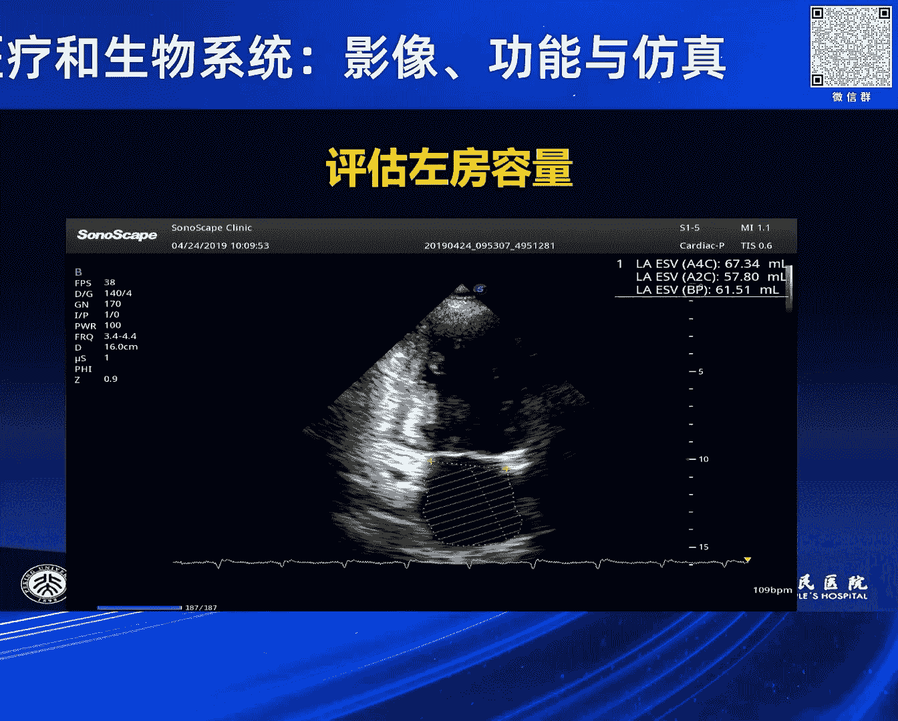
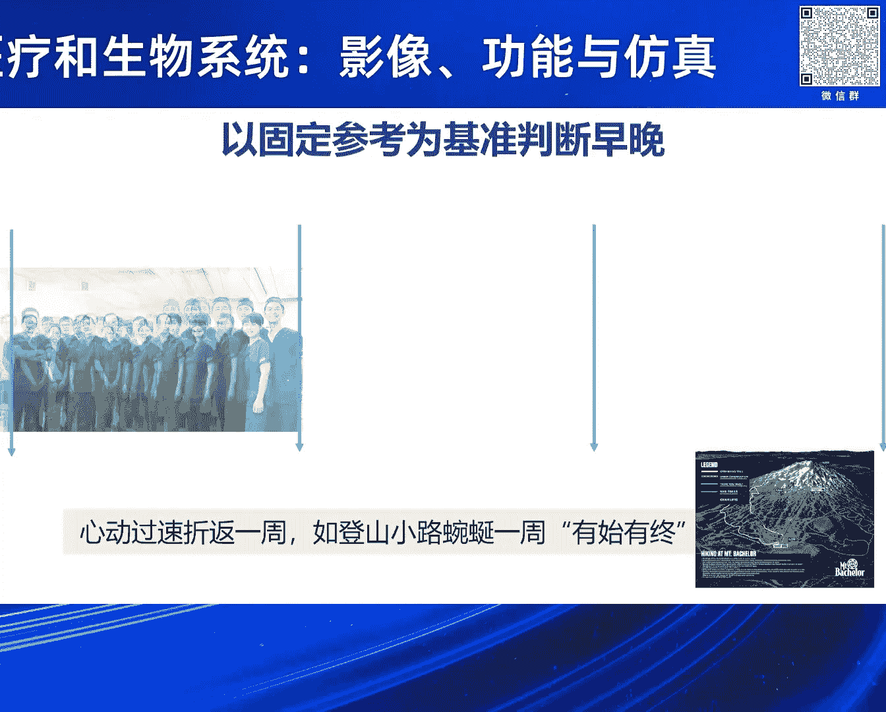
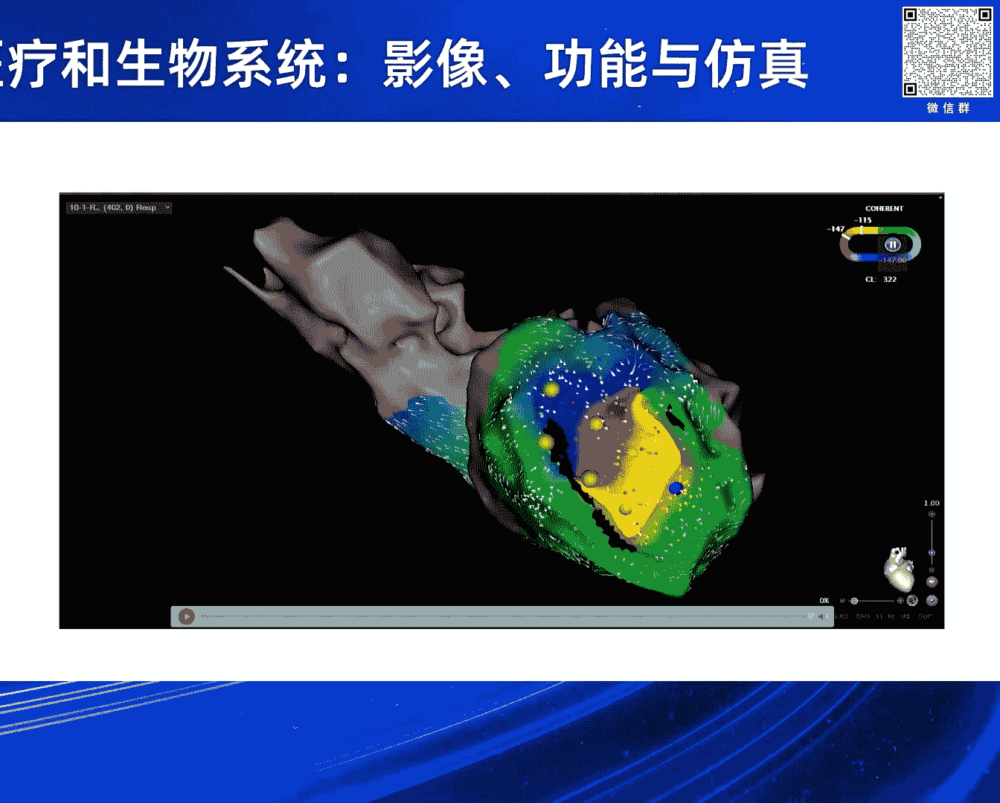
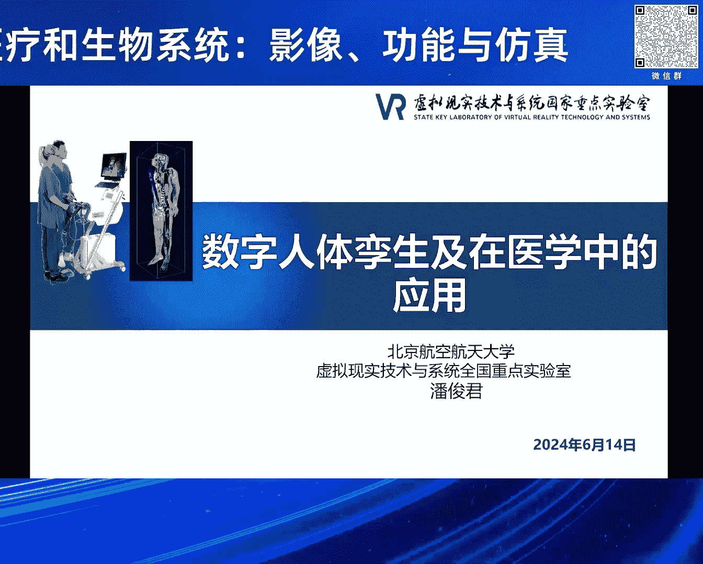
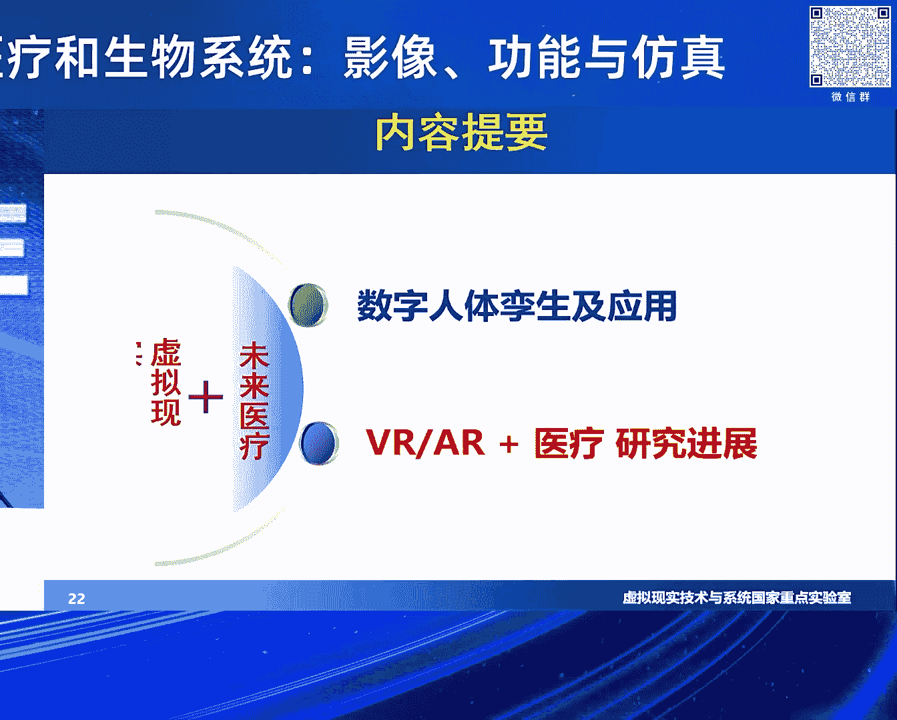

# 2024北京智源大会-智慧医疗和生物系统：影像、功能与仿真 - P8：智慧医学与生命系统目前挑战与应对策略 - 智源社区 - BV1VW421R7HV

尊敬的各位专家，接下来我们进入下一个专题，下一个专题是智慧医学与生命系统的挑，战与应对策略，我们的第一位讲者来自朱天刚教授，朱天刚教授是北京大学人民医院，心血管内科主任医师，超声心动图室主任。

长期从事心血管疾病的临床科研和教学工作，擅长先天性先先天性心脏病，心肌病，风心病和冠心病的诊断和治疗，现任美国超声心动图学会终身荣誉会员，亚太超声心动图协会执行理事，中国医疗保健国际交流促进会常务理事。

中国医师协会，超声心动图工作委员会副主任等职务，在european heart journal，heart regime等顶级期刊发表论文150余篇，朱教授的报告题目是超声医学。

人工辅助智能诊断的困惑与挑战，有请朱教授啊，谢谢啊，谢谢宏贵教授的邀请，呃，非常高兴啊，第一次参加人工智能这个大会，以前那个十几年前参参加过一次啊，医疗大数据的这个啊研讨会，当时我就啊。

觉得当时的医疗大数据是不是大数据，而是数据大啊，到现在目前我感觉仍然是数据大，没有大数据呃，因为我是今天刚刚收到呃，这个临汾市中心医院，他们一个体检中心4年的体检检查的结果，发给我的有16万。

结果是8000个人次的数据，结果筛查出来结果大概一半的人不能用啊，一般人不能用，所以这数据很大，那也用不了，我今天跟大家就一起来分享，就是啊什么人工智能在这个啊，这个呃心脏影像方面的应用啊。

我觉得人工智能在医学方面有很多热点啊，就是大家可能在这个啊跟医疗环境里面有关的，可能一个是做服务和管理层，比如说那个分诊，那问诊呢现在做的很好了，另外还有就是辅助辅助诊断这个层次，就诊断工具啊。

这个怎么去应用一些技术啊，做一些这个医疗规划和导航，还有一个就是啊智能知识的提升，这个也做的这个是比较好了，呃，这是班门弄斧了，大家都是这方面专家，我想就是咱们需要人工智能驱动的话，一个是要大数据。

第二个就是大模型，第三个是大算力啊，这个都是我们目前这个国家重点这个啊扶持的，大家可以看，就是说我们啊人工智能领域，在医学领域的应用呢是非常受到重视的，有医学影像智能诊断，又是语音的电子病例。

癌症的智能诊断，那个已经是非常热热门，但是呢就是人工智能加医学影像的话，现在目前就是说在放射科是已经非常好了啊，就做那个啊肺结节呀，还有就是这个大家经历过这个，3年的这个疫情啊，就是大家一到医院去。

可能就是给你做个胸片啊，做个胸片，然后查这个肺部有没有这个感染，同时的话在这个照胸片做ct的过程中，可能发现你的肺部一些病变，这样子的话就可以就是很快的给你进行诊断，目前呢有一些啊。

这个啊公司已经做了这方面的，很多的这种啊研究呃，大家可以看一看，就是说我们这个啊应用场景，假如说我们这个病人就像刚才啊李金铭呃，李李建平主任讲的一样，这个病人我胸痛来了之后，我们怎么样确认。

第一个就是问诊，就做影像检查，做化验啊，这是我们的医疗场景，那么如果是心脏病人的话，通常是第一个就是想到了要做个心电图，第二个想到要做一个心脏超声啊，那么做了心脏超声的时候发现有问题的时候。

哎接着可能就做一个ct啊，或者是做一个ct a就是冠状动脉血流呃，这个冠状动脉狭窄的这个评估，如果这个病有缺血的话，他就是做一个什么啊，做一个心肌灌注的评估，还有就是说或者做一个心肌核磁。

看看心肌有没有这个啊这个纤维化，那么这样子的话，就是大家可以看到这个医学影像，这是最后要到医院去，需不需要做支架，也要做一个光明照影，大家看看呢，就是说这是铁路警察各管一段啊，呃相互不干涉。

实际上心脏是一个整体呃，大家知道就是心脏的话，它是有自己的这个传导系统啊，它电传导就刚才很多专家讲讲，第二个他有机械系统，就是那瓣膜关闭，把那个血给他闭住，不让它出去，不让它反流啊，这是机械系统。

同时的话它又有什么呢，它有内分泌系统，它自己还可以分泌一些激素啊，另外一个他要是管道系统，大家可以看，那就是关动脉狭不狭窄啊，有没有这个，所以它是一个完整的一个独立系统，我们现在人为的把它分开了啊。

人为的把它分开了之后，你现在用的大数据来做它的话，你最好是能够把这些数据能给融合成一个，平台啊，这是我自己啊理解的啊，还有比如说心肌核素，看的心肌代谢是不是有异常，所以这些都是我们需要。

将来可能把它整合在一起的啊，所以影像医学影像就是贯穿了整个的诊疗过程，包括我们诊断之后治疗，治疗之后的这个啊，临床预后和评估都会什么都会跟这有关，所以带来医学AI的团队，可能这些专家的话都是啊。

这个第一位专家就是做放射的啊，这是院士，第二位专家的话是做了一个甲状腺啊，这个超声的这个AI的，后面两位专家都是做放射科的，专呃这个这个呃这个AI的呃，但是呢就是对人心脏超声。

这一块啊就是说很难去去涉足啊，以前跟呃王王光贤教授我们也试过啊，试过就是这个里面有很多的这个问题，所以今天想有这个机会，大家如果说是能一起合作，我觉得可能把它做得很好，但是有很多企业和很多的公司都在做。

这个医学影像，真正能够就是推到临床应用的，实际上还是极少数啊，极少数，那么就是说国内外的各种影像公，主要是集中在放射科，少数的公司呢是用于啊致力于病理的研究，另外隔壁的隔壁的公司呢都做心脏。

核医学的一种研究，有一些公司致力于超生，但是全都不在心脏啊，我们又至少我们国内的这个公司呢，但是美国的一些公司和欧洲的一些公司，它已经开始把人工智能，这个能够植入到机器里面去了。

就是说做一些简单的这种啊，所以分数的评估应该说是在十几年前，美国硅谷有一家公司曾经希望在中国跟我合作，来做一个这个人工智能的这种自动分析系统，实际上他那个系统非常好，最后没谈成啊。

就是让他就是有一个远见，我们只要把那个超人图像，把那一抓抓到那个photo里面去，它就自动的算出事业事业分数出来，他做了个颈动脉，那个颈动脉那个超神大概是从上从下往上扫查，你这样把所有的图像一抓。

那个photo里面去，他那个软件里面去，它就自动的给你三维重建，然后斑块给你切割什么东西呢，那个就是CD延线已经做的非常好了，但是可惜就是国内的公司，我跟很多的这个科研院所，比如北大的这个新科院啊。

以前是黄蓉院长，但是当年一当当当当校长，现在这个调到中南大学当校长去了，还有就是呃这个清华的，还有中科院的，但是一做起来几乎都是半路就停掉了啊，我遇到很多困难啊，那么现在困难在那个地方，就是为什么。

就是说我们这个超声心动这个影像，在国内的这个一些公司网宣布，第一个就是图像存储这个量比较大，呃，我就讲一讲为什么这个量大，就是说我们啊曾经就更新一个信息系统，电信任。

我们把超所有就是一天的检查的超人数据，直接传到我们医院的云平台，那个啊这个这个呃这个服务器上面去，结果不到一个礼拜，第五天，当了全村全院的这个服务器就停下来了啊，所以这个量特别大。

就是这一般服务器它成熟不了啊，另外一个就是标准化和规范化图像啊，这个流程不一样，各个老师教的不一样，有的是先打一个长轴，有的是先打一个短轴，有的先打心尖四枪，所以就是你每个医院都不一样啊。

就是另外就是获得数据的确定的啊，这个标化也不一致，另外就是结构化的数据不统一，我们曾经计划，就是把北京大学十家的这个教学医院啊，包括我们附属附属医院，曾经想把那个超声系统图的这个报告能够统一。

结果我们讨论了半天，最后我们北医三家自己都同意不了啊，为什么，因为不同的医院医院进来了，公司做这个工作站，做了服务器呃，做的那个啊，这个这个超声报告的这个服务器都是不一样的。

公司你要把三家公司统一把它弄到一起啊，基本是不可能的啊，所以就是说啊后来也没办法了，这个事不了了，之所以不同的疾病的话，获得的数据的再定义和结构化数据的变化，它也是不一样的，就像我们大家看的。

就是说你说你胸疼啊，胸疼的话，大家可以诊断可能是一个心肌缺血，但是还有可能不是心肌缺血的啊，比如食道有病问题的时候，他也胸疼，比如说我们这得了这个呃就是什么，就是那个嗯就是那个呃那个皮肌炎的时候。

也心胸疼呃，还有一个就是我们刚前三个礼拜，一个一个朋友的父亲呃，他那个呃老是心疼，半夜疼，然后就是做了一次关门照应，这个过两天还是疼，关门照影是阴性的，结果没办法，医生又去做一次关门造影。

所以这万分造影结果是什么呢，也是正常的，再把那个呃病人那就做个心电图的时候，那个呃做个超声，心动的超声仪拉起来时什么带状疱疹，就是一个病毒感染，做了两次冠脉造影，你说所以我就是说这个有些有些数据。

或者是什么呢，只能说明是一些啊是具体的数据，但是我们真的需要把所有的这个临床啊，和这个啊其他的数据都要整合在一起啊，就是还有就是我们就需要有算法上面有突破啊，就是不同的疾病可能需要不同的计算模型啊。

这样因为他们的数据是这个性质是不一样的啊，这个是还有就不同的医院的影像学的数据，同质性的这个差别比较大啊，我们就觉得这个超声心动图来讲嘛，呃三步啊三无，这是我老是跟他们讲，你们三无一个是什么呢。

没有心电图连接啊，不知道哪个是收缩期，哪个舒张期，有经验的，可能就拿来做舒张末期和收缩末期的定位，那一帧，这个如果不接心电图的话，也是有问题的，所以就是说啊不录郁之病人基本信息。

还有就是流程呢就是各行其道，随心所欲，基本测量参数不统一，重要的这个测量参数有缺失，还有这个啊缺乏统一的集结构化数据报告，这个超声报告的文字格式大家也不同意，所以描述起来也是五花八门啊。

所以另外就没有中国的这个专家共识，所以就是很多情况下，我们是借国际的一些经验，所以我们啊时不时遥望星空哀叹，还是我们要负负负重砥砺前行的，所以就说我们只能借借助国国际上的一些经验，来做这些什么。

我们想就是说我们自己是刚刚开始啊，真正有很多做的非常好的美国人，这是中国的这个清华大学王连英教授，他们曾经做了一些啊，这个图像的智能识别和这个深度学习，另外的话还有其他的专家也做了这些东西啊。

就是美国的一些专家被这个超星图，这个图像进行分类分隔，以及这个定啊，这个这个标注定位在这做的非常好，这次呃我们看他也用各种的这个啊，算法或者神经啊，深度学习的模型来进行这个啊，就是计算。

这都是做了很多的工作，但是这大部分都是在国外做的啊，所以我就想就是说这个是超声图像，它可能需要我们用不同的这个呃，这个技术来进行这个啊进行这个啊计算啊，所以我们的想的就是理想的话是比较丰满，现实很骨感。

就说我们能够做些什么，第一个就是说我们希望就是工程啊，工作流程的规范化，那么这个是可能跟咱们没关系，但是我觉得我们可以就是倒逼厂家，将来可能就是在这个做超声仪器的时候，把一些标准的图像怎么第一步。

第二步，这样，第二个数据存获取和定量分，析的这种标准化和规范化，还有图文报告的结构化和规范化，这个是需要我们将来去做的，所以我们期望就是说这个啊，图像这个获取和流程的这个标准化和规范化啊。

有利于统一的图像啊，但是呢现在的啧，有一些这个呃公司的话已经做出来，就是我们不需要心电图，就是我们自动识别收缩器和舒张器，来进行这个自动的这个内膜的勾画和标注，然后呢就是对这个啊这个心脏进行切割。

所以有可能我觉得就是将来可能这是最现实的，对中国人是最现实的，因为没美国人和欧洲人做一个超长线路图，是45分钟到一个小时，中国一个小时要做一个事，做一个做个超声心动图，你几乎就没活，没法活了啊。

医院就把你开掉了，你知道吗，咱们5分钟啊，做一个病人都算算快的了啊，算是算是慢的了，我们的病人下就散了，上了就散了，他走了就说两个词，一个是叫terrible，第二个词就是unbelievable。

所以嘿他觉得可怕，那个太可怕了，所以咱们就是现在医院的这个工作量非常大，所以临床医生基本不接心电图，为什么不接心呢，就是不接心电图，就是用于接新能耽误时间啊，所以我觉得就是可能。

我们可能就是说有一些新的突破啊，就是说我觉得就是可能，还有就是面临着一些问题，我们这是什么问题，一个是刚才就是很多老师也讲过，就是数据的隐私和安全，医院是对医学图像是有限制的，他不是说可以公开发给你。

发给你，还有一个就是缺乏高质量的图像，这个标注集啊，我们国内基本上没有啊，连法院都没有啊，我这个法院审稿的时候，我说你们怎么自己不建立这个数据库，他说我们得用美国的数据库，我就把那个文章给他K了。

就不能那么要缺乏这个解释的呃，这个透明度啊，也就是说我们医生不能对AI的结果来进行，解释的话，你将来可能很麻烦，还有就是个模型的泛化能力是有限的啊，就是这个体差异比较大，你要想普适性的话。

可能就是不同的疾病，我们要建立模型，我觉得就是说无论是对冠心病啊，线性病啊，肺胃心肌病啊，或者是什么其他病，所以就是说，还有一个就是有些新的技术在更新啊，这我们要适应，也就是多模态影像，我们综合评估。

我觉得将来这个啊，这个这个将是这个这个大的这个可能性啊，呃这是一个病人啊，我们看看这个病人的话，他的发现心肌梗死，然后就是啊后来也这个出现食欲嘛增多症，然后这个病人的话就是看大家看超生。

他这里面就这么多数据，那么入院检查的时候，心肌损伤标志物数据，血淋的数据啊，床旁超声的数据，还CCTA的数据，还有心肌核素的数据，还有超常性肿瘤数据，这些数据都是对我们诊断这个病，或治疗这个病有效的。

所以就是说这个病人肝一诊断十几个病，你说你AI怎么去算它，你怎么去评估它需要大模型，需要不同的模型，我们来进行这个评估，所以我们看看这个超声心动只是一个方面啊。

所以我觉得就是说可能我们这个关门就是关门，CT啊，这个关门造影的结果啊，我们怎么去读它，这个就是说我们看这个关门关他们超呃，超生的这个报告，还有就是这种评估这种描述，所以我也想。

就是说我们可能将来发展方向是超时加上AI啊，这个就是主要是的动态的连续的数据处理，另外一个就是啊，超声献图是超生里面的南上之南啊，就是所以我将来就是说银行有人借，现在研发机器人啊。

做这个机器臂来进行扫查，但是呢这个还很遥远，但我觉得就是云平台加上这个AI的大数据，或者大模型，不同大模型结合起来，我觉得将来是啊我们可以突破的好谢谢大家，好感谢朱教授的精彩报告。

接下来我们第二位讲者来自龙德勇教授，罗聪敏教授是首都医科大学附属北京安贞医院，主任医师，心律失常中心主任，兼任中国心律协会的副主任委员，青年委员会副主任委员，主要从事从事心房颤动等疑难病例的导管消融。

参与或者承担国家级科研课题20余项，发表SCI论文100余篇，获国家专利十余项，龙教授的报告，题目是，计算机模拟技术在心律失常诊疗中的应用，有请龙教授好，谢谢，非常感谢介绍。

也非常感谢张老师邀请来参加这个啊，关于嗯志源这个活动，那么对我们医学来说呢，我们现在特别流行去拥抱人工智能，因为我回顾人类的历史，最新的科技总是用于两个方面，一方面就是医学。

另一方面非常不幸都是用于战争是吧，一个是KINY，一个CV，那么其实我题目稍微变了一点，其实内容变化不大，我们心理市场是个什么专业呢，我们那个学名叫心脏电，生理上它就是电。

那么我们心脏其实跟这个房子是一样的啊，有门窗，有结构，有墙壁，那有下水管道，那也也有这个电线电灯，那我的专业就是管电电灯的，我们心脏的电跟大自然的生物电没有任何不同，我是完全一样。

只不过他这人体是个非常弱点，那么对于这个心肌常呢，其实人体获得关于心脏电的啊，很早的一些一些理解，比如说刚才有位教授讲了关于细胞电生理啊，细胞的每个电位，事实上，第一份获得心电图的个人叫是一个荷兰人。

叫ATHERINE，他通过自做了一个这样的一个心电图机，把心电图展示出来了，当然这些具体的方式我就不讲了，实际上在我们这个心电图它展示的是什么呢，我们诊断心肌市场，我们就靠心电图。

那么心电图实际上它展示的是一个两个方面，一个是时间的向量，因为在心脏的不同的部位，它收缩就是发电的时间是不一样的，它这个电是有顺序的，对于一个正常的人，他非常规整，非常有顺序的。

那么我们通过一个秒记的装置，可以把这个心电图给记录过来，我想我们每个人几乎每个家里边老人，他去医院的话，经常会做心电图，这是一个非常常见的检查，实际上我们心脏病最常见的是什么病吧，是心律失常嗯。

很多中国人都认为是高血压，实际上心率常的发病率要远远高于高血压，大家可能很多年轻人都有这种感觉，晚上熬夜了，比如说要啊做个毕业论文呢是吧，喝咖啡喝了很多咖啡，诶，觉得自己怦然心动一下是吧。

哎其实类就是早播，这个早播就是兴趣长，所以我们有时经常开玩笑说，怦然心动不一定全是爱情，那有可能是新剧场，就是这种，总之它是非常常见的，如果你要做一个筛查的话，那么心电图。

其实它除了反映这个时间的这个向量之外，它也反映一个空间的向量，为什么呢，因为他整个心脏的这个电学的初级方向，是有一定的固定的方向的，那么我们知道，我们要做心电图或者做体检的时候。

你要接胸前也接一些导联是吧，四个肢体要接些导联，像这个导联是一个立体空间的，反映了XYZ轴上不同的初级方向，它反映了这样一个概念，但是呢当你做完心电图之后，你最关心的是对一个非医学医学界的人来说。

你最关心的是啊，就是这一项内容哦，我的心电图是在正常范围之内是吧，但是实际上心电图机它看到的是什么呢，他看到的都是这些参数，这一参数就是什么，实际上是最简单的人工智能，那么它就根据心电图机。

就根据这些参数的是否正常，来判断你的心电图是否正常，当然对于我们医生来说，我们还要结合他的心电图的这个波形的移，这个变换呢是不是有微妙的改变呢，我们要结合它是由体型，是不是以往有什么心脏病史。

我们要结合去看一下，但是如果用人工智能的话，它或许它就能可以通过一份心电图，能读懂它背后的故事，这个背后的故事就是你是男的还是女的，你是高的还是矮的，你是胖的还是瘦的，你的体型是什么样的。

甚至它能根据这心电图微妙的改变来预测，在未来几年当中，你会出现什么状况，那么这就是人工智能在我们这个领域最显著，最那个显著的一个应用，另外我说过，我们只能心理市场诊断，最主要的一个诊断工具就是心电图了。

那么大家可以看出来，实际上对这种模型的识别，那么其实人工智能的能力是非常强大的，它远远超出了刚才几位老师讲的，关于在核磁在投入CT方面，这种它的能实际可实行性，它的能力会更强大，嗯其实今天你看看了。

有很多这个我们心呃关于对心脏的东西特别多，像我们心脏科也是个特别大的专业，在我们人体非常重要的器官，比如你经常听到说有人得肝病了，肝切一块肠子，得病了，肠子切一块是吧，甚至中枢得病了也可以。

毛一块也可以切掉，就知道他不是生命中枢都可以，但是我们心脏里很少说，听说哪个人把心脏切一块去治病的，心脏每每一块都不可或缺，它不能切的，所以说我关于心脏的研究总是非常啊。

就是占据了很大的临床医学的这个篇幅，那么人工智能它在我们的应用它有个什么好处，它让这种临床的合理推断变为现实，比如刚才呃朱天刚老师讲过，比如说一个人心脏肥厚了是吧，我们要通过超声去确定哦。

我的心肌是不是肥厚，因为超声它就能看这个墙壁一样的，是不是厚，是不是薄，尺寸多大，它看它结构，那么或许我们通过心电图，我们可以能预知到中间这个变化，我们可以越过这个中间的阶层，直接给他得一个临床结论。

这就是在通过一份心电图它能实现的这些目标，那么其实在我们国内，我们有一个团队啊在做曾经做过这种研究，就是通过人工智能来判断心电图，那么跟这个心电图医师进行对比，发现就是通过人工智能来读心电图。

还超过了这个心电图医师的这个水平，我们曾经有一年，在我们心血管专科会议上就搞这比赛啊，这这个让机器赌累张，让一帮博士们赌，最后是这博士们大败拜遇机器了，当然我想大家都能理解的这些东西。

就像当年那个齐盛跟那个阿尔法go败掉一样的，因为这些固定的这些模式啊，就像考医师证，说美国医师证考试啊，这个和医生怎么也考考不过，就真人怎么也考不过那个那个机器人，就这个原因。

因为对这种固定模式城市来说呢，我觉得机器它是可以非常大的优势的，那么在国内呃，在美澳呢，他们曾经有一个就是预测肥混性心肌病的，这个数据，就通过心电图来预和预测的肥混性心肌病，就像昨天刚老师。

他是做超声的，我们确定肥红心经病是肥后，我们要看超声，要看核磁，要看CT，但是他通过这个心电图来预测，发现它的负荷率和特异性都非常高的，尤其是对于年轻的患者，这个负荷率更高，因为特别强调这年轻患者。

因为他的意义就在于，很多年轻人他不知道自己心肌肥厚了，他参加各种活动，尤其是竞技性体育运动，他会发生猝死，刚才嗯夏老师曾经展了一个图片，那个图片不是一个运动员，足球运动员倒在场上吗。

大家知道那种叫拉塞尔森，他是丹麦队的10号，他当年在欧锦赛的时候，他倒到场上了，然后装了ACD，然后呃前年卡塔尔世界杯，他我发现他依然在场上带着队队长的袖标啊，这种比较极端的故事啊。

但说实话他或许他以前他要通过一些技术，因为一般的很多人体检，他不会去常规做这些细微的音微妙结构，如果我们有一种能力，通过他的常规体检的心电图，获取了它发生这种猝死的概率的话。

或许它在运动场上的悲剧就不会发生，是这样子，然后在我们新剧场领域呢，这几年因为有出现了一个特别大的一个进展，就是说我们知道新剧场有一种叫房颤，就是心房颤动，那北京的话就是叫什么啊，北京话叫心颤。

对心颤这种房颤它最大的危害就是脑中风了，因为很多人没有症状，它都以首脑中风为首发症状，而这个房产引起脑中风，致残率又非常高，那很多人你想一脑中风了，我想一个家里面只要有一个脑中风的。

整个家庭都不会幸福了，全家人都围着他转，因为他没有劳动能力了，没有生活能力了，会给家人带来很多痛苦，那么现在就是，但是我们给人群去筛查这个房颤又不太可能，你想想全国14亿人民。

每个人给他做份心电图筛查房颤，这样是非常痛苦的一件事情，但是我想大家现在都做体检，很多单位都会体检，甚至就入校是呃也要做体检，但是可以通过你体检心电图，预测你未来多少年中发生房颤的概率。

如果能通过一份单份心电图，来预测你房颤发生的概率的话，那么就可以提醒你，在啊以后的体检的密度要增加一点，比如不能像以前一年一次做的体检，我可三个月做一次体检，这样在房颤发作的时候，我可以及时发现呢。

可以避免这些啊老祖宗的这些悲剧，实际上在我们新剧场领域有个特别大的一个改，一个一个就是应用，就是我们知道我们很多新剧市场上，他的呃呃这个图视频它不动了，当然它其实啊在新剧场里面，有很多是新剧场的发发生。

它都跟折返有关，叫英文叫reentry in entry，就是什么就转圈，它围绕这个房，围绕这个呃跑道不停的转不停转，它其实第一个关于这个新商的这种折返的机制，它就来什么来自于计算机的模拟技术。

因为过去人们对这种新剧场的展示，不是很清楚机制，那么他们可以通过很多这种，把一些密集的电极放到心脏表面，然后通过计算机的方式来重建那个等视图，重建这个等式图重建什么重建的。

大家都知道这个这个地形图的等势图，比如说高度等视图，其实我后来发现啊，这个等视图不仅用于各领域，比如海拔之外，还用气压气象，就是你可以看到每天的天气图是吧，那也是一个等势图，比如哪儿下暴雨了。

那个地方红的，它它也是跟这个道理是一样的，那么我们通过这个等视图来分析，心脏的居动顺序来，你会发现它有优先的一些通道啊，就像就是说我们从出关中是吧，有些总有些必经之路，那么心脏也是这样的。

其心脏的这个电流的机动特别像流体力学，跟流体力学是非常呃特特别像的，就是非常遗憾的，这个不能动了的视频在这里，就是大家如果有机会去你看一下小溪那边水，你会经常发现有一个漩涡，为什么这水往下流。

这会有漩涡呢，漩涡的原因就是前面遇到阻力了，一阻力之后，它会回旋一下，像水或电的都是一样的，那电的流动是电压高的地方向电压低方流，那么电阻越小的地方，电流通过性越好，那水也是这样子是吧。

如果我这个河沟很平滑的话，那水流速度很快，如果这个河道有很多石头的话，砂纸的话或者河道很窄的话，它的阻力会很大是吧，都会同样的这种情况，所以它和流体血的一样的，我们新床这个特别像这种方式。

以至于我现在想是不是要用这种方式来研，研究一下我们房颤的这种这种存，这种波形的存在形式，因为房颤是特别乱的，它不是规则的电流，它非常紊乱的电流，不能动了，所以说没事，我就跳过了。

那么我们刚说到这个体表心电图是这样获取的，实际上我们获取这个心电图，在体表获取心电图，是成千上万个细胞积累在一起，形成了一个电源的变化，一个向量的变化，但实际上呢对我们心日常医生来说。

我们更关心在每一个心动瞬间，我们心脏的每一个地方它是如何跳动的，它的顺序是如何激动的，那么我们需要把电极放在心脏里边，一个电极，这个电极就像普通的电线是一模一样的，原理是一样的。

只不过是我们的设备的滤波范围也是不一样的，因为人都是弱电的，它的滤波范围是不一样，我们要滤掉这个这个交流电的的影响，我们要滤掉我们其他生物电的影响，是让你眼睛眨一下，你手动一下，你都会有电的。

我们也略有影响，但是每个地方的电流它包括两部分，一部分是真正的这个电极，下边覆盖这个细胞产生的电流，还有一个是宁静电细胞产生电流，实它是个叠加电流，如果你把电极直接放在这个地方，你是无法区分的。

那么对我们来说，我们就要想办法去区分它，如何区分这个激动的顺序或早晚。

但是我们在人体，在描述这个激动的顺序的时候呢，特别像我们照一张照片，那么比如说我们这个团队啊，这是我们我我就是好多年前，我是在这个团队里面，这是我的师傅，是我老老导师呃。

马教授说我们照照片会把老师放在中间是吧，以他为中心照个照片，但是实际上这个我刚说心理上的折返，就像照一张照片一样的，有始有终，那么我在做这个心脏顺序的描述的时候，我需要我描述的这个窗口。

要cover到我整个心脏激动的窗口，就像照一张照片一样的，我这个参考我可以以它为中心，实际上那以他为中心的话，就是前窗后窗各占一半，但实际上我也可以以他为中心，以对美女为中心，美女护士为中心。

那么以他为中心的话呢，就是啊就前一小辈，后一大辈，但是我cover的是同一帮人，但是其实实际上那这是这样一个情况，其实上我可以以我为中心，但是cover窗口可以是这样子，但是前后人数没变是吧。

这就是啊我们对这种新剧场，他这种折返机制它的理解的一个一个一个理解，如果你从一个你去hiking的话是吧，野外这个徒步的话，你从这个地方我们说诶，我们从这出发是要求沿着三角转一圈，要回到这个起始点。

因为速度不一样，我们要回到同一个路径，我们大家再汇合啊，它道理啊是一样的，那么我们把这些理念是付诸实施的，其实通过计算机技术，我们就可以重建出啊，心脏的每一个机动顺序，就像雨点落下有前有后。

但是这个雨点落下的有前有后，如果你不要以一个人为基准的话，那我们的海拔，测顶高低等视图都是以海平面为标准的，实跟这个道理啊是非常相似的，实际上我们在腔内的话，这是我们就心梗后死术的病人，刚刚夏老师讲过。

这是我们特别严重的一种死术，这个病人呢发心梗以后死出了他急性心给我发，第二周了，他心梗就发个不停，什么药物都没有效果，我们叫电风帽了，就是能卖的药物，世界上能卖的药物都没效了。

让他上人工的那种心脏替代的时候，这个时候我们刚做手术的时候，我们就发现我们把一个电极这个实际放到这上，我们呈现在我面前的第一直观是这个东西，你看这个电极有有，你看这是同一个时空时，电极的话，它有早有晚。

它是有顺序的，那么我们通过它自身的顺序的对照，通过相邻电解的对比，其实我可以把这个顺序描记出来，描记出来之后，我呈现在最后我面前，我就知道呃，因为它不能转，如果能转，大家都看的很明显。

我知道这个圈怎么转的哦。

这个圈是哪个地方是关键部分，那就需要我去阻断它，实际上对这个构建的过程，就如同是这是我们安贞医院里，比如说这个呃一个大楼的整个照片，像如果你构建的话，你知知识去某一瞬间的像素的话，就是一个像素的构成。

我构建的点越多的话，那么它整个顺序通过点构成一个面，然后再构成了整个的这样一个三维重建的啊，这样一个顺序其实过去也大，我们都很难实现的，我们现在通过这些技术的应用。

尽管尽管它不是说一个完整的一个三维重建，一个人工智能的方法，但是你会发现，我们用了很多很多这种算法的东西，来帮助我们去确定心理上的病因呐或诊断呐，所以说如果在心血管领域有一个特别大的应用，能开始的话。

我觉得一定是我们心智上的的呃，这个应用我最近也在申请一个课题啊，我不知道现在进入四四进一了，我申请的就是关于这个人工智能的，我就是我想做个什么东西呢，我想做一个跟我水平一样的一个医生。

他在急诊可以值守的医生，就是因为很多看朱老师可能也知道，其实很多心理常的人，好多猝死的人，80%都发生在院外，而他抢救成活率很低，而80%精神他都是基层医生，很多基层医生看到一个心电图。

他都无法确定这个到底是什么新成果素啊，他该怎么用药呀，他打他电话或者是怎么一转诊都延误时机，可能运到路上，病人就猝死了，其实我们要做一个这样的东西，就是让这个机器去读的话，它达到专科医生水平的话。

这样可以显著的降低心血管猝死率，因为心脑血管是我们中国人死为低位低位原因，而这个死亡心脑血管死亡当中，心脏死亡占了一半，就在我们国家，每年我们有200万，这200万人当中有100万都是猝死。

就是这都是呃，如果有这样的话呢，就是也会会有助于帮助我们刚才说的三维，这个三维重建，我们怎么去建它呢，其实我们基于GPS原理，大家可能都每个人都有这样玩过这个游戏，有的人喜欢，比如说200年。

2000 2008年或者2010年啊，今天早上跑步跑步的时候，他就拿着他那个跑步软件跑，跑出一个形状来，跑出一个数来是吧，有的向女朋友求婚就跑跑一个，沿着公园跑一个，I love you。

是我们经常听到微信上这样晒，对不对，上次我们这个重现的方式是一样的，我们有一个GPS原理，我们在体外模拟三个卫星，建三个磁场，然后一个导管的远端有有一个传感器，它可以感受三个磁场的位置。

就像你开车一样的，有发现是吧，你在打车软件一看诶，车开到哪了，地图上箱子位置都能看出来，如果你有机会让北京城转一圈的话，那北京城的形状不就出来了吗，像我们这个重建的方式跟这个是是一一样的。

然后我们就十一五的时候，我们作为一个国家的一个这样的，一个国产的这种sim设备，就是用于我们嗯，现在目前在已经在我们临床应用的一个设备，我们就是通过这种三维重建，过去我们心理厂医生要X线下做手术。

那么现在有了这三维系统的话呢，我们都是在这个三维系统下做手术，我们不用穿铅衣，你看就是都不用穿铅衣，这样对我们医生也是个很大的保护，其实我们也用了很多超声技术，但是我们的超声技术是腔内超声技术。

我们也借助超声就做做个三维重建，其实它当然我还不能未来的这个超声技术，它就可以完全自动重建了，现在还做不到，现在需要我去自己去辨别一下，唉这是哪个结构，这是哪个结构，未来它这个都是全自动的。

它可以全自动的做，我们跟苏州一家公司在合作做这个东西，就这个东西放在心上之后，它自己能识别是哪个结构，就是也当然也基于很多数据的学习，除此之外呀，这个就是未来对我们来说做手术的也不一样了。

方式也不一样了，以前我们都是手动做手术，未来可能就是鼠标做，因为我们刚说了个我们心脏导管放到心脏去，那它远端有传感器是吧，其实它原单它可以做一个有磁牵引力的东西，放到那里了。

一个体外磁场可以使它实现一个啊球面的运动，就是不是三百六十一百八十度是球面，这运动就是没有死掉全向量的这种这种运动，然后当然我们现在做这个东西做出来之后呢，就是还有一点缺点，就是还不能小型化。

就是放到屋里边，这个噪声比较大，耗电量也一小时的，耗60度电，这个现在还要克服一下这些啊缺点啊，总之我只想跟大家分析分享一下啊，其实从我们医生来讲，我们特别想拥抱这些计算机的，或者人工智能技术。

我也觉得在我们医疗领域，一定是有非常非常嗯大的应用前景，我想在未来将替代很多急诊门诊的工作，他一定会实现的，当然我们也希望在座的各位老师，还有啊各位同学，希望你们能啊跟我们医学多拥抱一下。

希望我们能碰撞出火花，哎促进我们国家在这个方面的发展，谢谢，好感谢龙教授的精彩报告，接下来第三个奖者是李清策研究员，李青松，研究员来自哈尔滨工业大学，计算机科学与技术学院，嗯主持参与了国家自然科学基金。

青年面上重点等多项科研任务，致力于利用数学和计算科学的方法，解决工程和生物医学的重大问题，研究主要方向是应用计算机，模拟人工智能等技术，更好地研究和治疗心血管疾病，已在嗯领域高水平。

国际期刊和会议发表论文60多篇，李李教授的报告是，多病理阶段，心肌缺血的多尺度建模与药物作用机制的研究，有请李教授，感谢非常感谢张教授的邀请啊，感谢李帅教授的这个介绍啊。

我今天的这个报告呢是做虚拟生理心脏建模，然后用它来研究这个呃心律市场，就是刚刚龙教授讲的这个折返，产生的这个机制啊，以及我们做这个做了一些药物，看看哪些可能是特定的靶点，对治疗这个心律失常有作用啊。

好我的报告分为以下四个部分啊，首先第一部分呢是研究背景啊，就是呃在心心脏病里面，有非常重要的一种心脏病啊，今天好多教授都从不同方面介绍过了，就是这个心呃心肌梗死和这个缺血，对吧啊。

这个心肌梗死和这个缺血，它也是有一个发展过程的啊，在这个血管狭窄的这个过程当中呢，整个人的这个心肌的细胞，它会有一个生理性的，缓慢的这种演化的这个过程啊，就在医学上呢大概分为这几个阶段，叫缺血EA阶段。

大概是缺血的零到15分钟，然后缺血一闭阶段大概在45分钟左右，然后短期心梗啊几天，然后还有长期心梗啊，那在医学上啊，就是这不同阶段的这些细胞啊，或者是这个心脏，它的这种生理功能其实是不同的啊。

然后这多种的病变啊，共同存在于人心脏里边的时候，为什么会引起这种更容易引起这种心律失常，就是在心心肌梗死，或者是急性这种心梗的情况下呃，这种多发心律失常的这种原因究竟是什么啊。

我们就希望通过这样的这个啊，计算机模拟的方式来研究这样的一个机制，然后看看啊，能不能找到它相应的一些治疗的靶点啊，那怎么样去构建这样的一个模型呢，啊整个模型构建的这样的一个呃这个方法论吧。

大概就是我们要从呃，底层的这个心肌细胞的这个生理功能啊，把它的这个产生电的整个过程给它描述出来，然后还要把整个缺血过程当中的这些病变的，这样的因素啊，同样给它描述出来。

然后把这些因素集成到一个细胞里面啊，然后再把一个细胞啊，通过这样的电扩散的这个过程，描述到整个组织以及整个心脏上啊，去仿真它这个病变过程啊，其实有很多很多这种啊，医学的数据来描述整个这个心肌功能发生的。

这个病变的这个过程啊，我在这个地方就简单的列了一下，这个缺血ea阶段啊，当然EB1嗯，1B心梗，短期心梗，长期心梗都有很多啊，然后基于这些数据呢，我们就可以对整个心脏这些离子通道。

大家可以看前面有很多这种离子通道啊，以及离子的这样的一些浓度等等啊，对于这些过程进行计算机模拟啊，当然这些计算机模拟背后涉及到一些这个，复杂的物理学知识，我就不在这简单介不在这详细介绍了啊。

通过这个仿真呢，我们就能够仿真出单个离子通道，和它的这种动力学变化，在正常以及这种地面的情况下的，这个变化机制啊，然后再把它整合到，把所有的这些东西整合到一个细胞当中。

就可以仿真出它的这个电的这个变化啊，当然你仿真出的你基于一个细胞，一个电流的这样的病变，然后呃把它们全部集合起来，能不能仿真出完整的细胞，整个层面的病变啊，需要做验证对吧啊。

需要再一再一次的用实验数据去论证，你的这个模型对还是不对啊，这是第二次的这个验证啊，经过这两盘验证之后呢，我们就可以构建出这样人在正常一节啊，多缺血阶段的病呃，多缺血阶段的这样的呃。

心肌细胞的这样电生理变化的这样的模型，大家可以看到左上面左上角的这个图啊，在短期缺血啊，或者是急性心梗阶段呢，啊这个心脏的这个细胞这个电动势都是变短的，而在长期性的阶段呢，细胞膜电动势是变长的啊。

然后有了这个心脏，有了这个一个比较完整的这样的模型啊，有一个solid模型之后呢，我们不光要构建出这个模型来，我们基于这个模型能够做到的是什么呢，就是我们能够分析出，在这个模型里面有这么多种离子通道。

有这么多种离子通道的控制参数啊，哪一些控制参数是对于我们心脏上，电信号的某一个功能是至关重要的，它的敏感度是有多少，这是我们计算机擅长做的啊，我们通过这个呢就分析了，这也简单举了一个例子。

就是EA阶段的细胞的，它的电声里变化的，这样的敏感度是跟哪些因素有关啊，就可以分析出来啊，分析出来之后呢，我们接下来就可以啊仿真出这样的心率市场啊，就是啊一旦发生了这个缺血啊，是不是能够引起心律失常。

为什么能够引起这样的心律失常啊，为了构建，为了就是做一个全面的仿真啊，我们做了这个两维和三维的这样的模型啊，两维的模型呢就是比较简单的啊，这种idealized的这样的组织方形的啊，包括了多病理阶段。

它水平分布以及这个扇面分布的啊，这是两种情况，我们后面为什么后面会讲到为什么这样的呃，这样设计啊，最后呢，再把我们的模型带到一个完整的，这种真实的这个心脏上，然后呢这个心脏的这个数据呢。

这个它是心肌缺血引起的，这种斑痕的数据呢，也是一个病人的这个真实数据好，有了这样的这个两维结构的这种设计，我们就可以仿真出两维组织上，这个心电传导的这个过程啊，我们可以看出通过不同的这种刺激方式啊。

我们给一次S1S2的这种加快刺激，或者是在这种动态的多快速的这种刺激之下，都可以引起上面就是折返啊，螺旋波的这个产生，下面呢就是螺旋波产生，导致波破裂的这个过程啊，然后呢呃下面是我们仿真的这种心电图。

大家可以看出，就是一个人的这种产生了这种心律失常啊，然后这是在第二种情况下啊，就是上面上面分布的病理状态的这种情况下啊，它也可以引起这种折返，从两边往回返的这样的一个呃过程啊，最终呢在三维心脏上也是啊。

我们在这样的一个刺激点上，给三次快速的刺激之后，也会引起心脏内部这种复杂的这样的一个，电风暴的，就是刚刚龙教授，龙医生讲的这个电风暴产生的这个过程啊，那仿真出来的这个过程。

大家可以想为什么会产生这种过程啊，在人产生了这个缺血，当然最为什么会产生这反，最直接的一种方法，就是龙教授说刚之前提到过的对吧，有不同的路径啊，路径不同就会引起这种折返，但是我们在仿真的这个过程当中。

会很多时候啊，在临床上也会发现，其实病人的这个心脏结构并没有发生变化，也没有产生纤维化，那它怎么样，为什么他会正常情况下我们就正常跳啊，那它怎么产生的这种折返啊，那我们就分析了不同的这种机制啊。

但可能在三维上分析非常复杂，但是我们的这个模型呢就有这个好处，可以把一些复杂的这个过程给它简单化啊，就是你在三维上这个传导再复杂，也可以分成两种两种情况啊，一种就是波从左往右传的时候。

你的那个不同的这个缺血组织，是从上往下分布的，所以说它就是垂直于波传导的这个方向啊，另外一只扇面呢，就是你从这个一个左上角给刺激它，波是均匀的往右侧进行扩散，那你这样扇面分布的话，你的这个波传导的过程。

跟你的这个呃病理组织分布的，它是一个平行的，这样的平平行这样传播的这种过程啊，第一种就就比较简单对吧，因为在你垂直的方向上，产生了这个不同的这样的一些，阶梯状的这种病理分布。

所以说它会在上下传播的速度不不一样对吧，就可能引起这种折返，但是第二种情况就就非常特殊了对吧，我在左上角给一个刺激，我扇面上都是均匀分布的啊，还可以看第二张图，它一最右下角的那张图它是非常均匀的。

在这个扇面上，那这么均匀的情况下，它为什么还能引起折返，对吧啊，我们就利用这个呃计算机仿真，做了一些相应的分析啊，分析的这个结果啊，这个过程比较复杂，我就不说了啊，就分析的这个结果呢。

就是虽然它在扇面上一开始是均匀的，但是到最后我们可以发现，它这个细胞的这个传播势能的这个驱动力啊，其实是在中心区域比在周围区域更强的啊，而我们的这个心脏它在传导的这个过程当中啊。

尤其是在心梗区域发展心梗的这个区域啊，它通常是需要更强的这种刺激能力，才能够把它刺激起来的，所以说在很快速的这样的这样的一个啊心跳的，心跳很快速的，也就是心动过速的这种情况之下啊，在心梗区域呢。

就会你需通常是需要一个非常强的这种刺激，才能够把它刺激起来，但是你在两边呢它那个刺激驱动力又不够啊，所以说很容易在两边就产生这个传导组织，然后在中心就产生这样的一个折返啊，这是分析其中的这个机制啊。

然后有了这样的一个机制，分析呢我们就想啊，那我们分析了缺血，它能够引起这个心脏这样的变化，那能不能够找找到一些相应的这种药物，来阻断这样的一些变化啊，治疗避免这个心律失常的产生啊。

首先我们考虑了就是呃非常常用的一种，这个辛酸类的抗心律失常药物，这个安检酮啊，安碘酮它是一个多靶点的药物，它作用于非常多的离子通道啊，我们也是用相应的方法对它，对每一种粒子通道的作用做了仿真啊。

集成之后我们仿真的这个结果呢，发现它确实是可以延长心率，延延长这个细胞的这种电动势来防震，它确实可以延长细胞的电动势啊，这也是它预防心律失常的这种机制，对吧啊，左上角的第一个图啊，是细胞确实电动是延长。

但是在缺血阶段呢，这个安检铜的这种作用呢，它就啊跟我们预想的就差了很多啊，在缺水的情况下，你用了N点头，反而使这个细胞这个电动势变得更短，这就导致了在这个两维组织上。

它引起折返的这个啊更容易引起折返了啊，一开始是正常的，没有折返，然后第二排是啊，这是缺血的啊，它产生了这种螺旋波折返啊，第三种呢是用了安电筒啊，这个折返并没有消失啊，好，那我们就想就是这这种安点铜。

只只考虑安点铜的话，不能啊有效的消除这个心律失常，那我们能不能找到一个非常有效的这种靶点，然后这就是我们刚刚提到的这个敏感性分析的，这样的主要原因哈，利用这样的敏感性分析呢。

我们就提取出来了哪一些离子通道，可能是对于我们消除心理失常非常有帮助的啊，在这个地方就总结了以下的这个几个因素啊，包括了钠钠通道，然后呃IKADP哦，I k 2k s，然后还有细胞外钾离子浓度。

然后还有钙锌离子通道，然后调研了几种，可能对这些离子通道和相关的离子有作用的，这样的一些药物，或者是康胖的，来测试了他们的这个抗心率失常的结果啊，发现了这个替米沙坦确实是可以呃。

它可以这个呃提升钠离子通道的这个通透性啊，然后让这个传导速度可以更快啊，可以可以确实看到让传导速度变快了，但是电动势并没有变化啊，它呢这个作用呢它消除了这个心率市场啊。

但是呃对于整个整个产生这种呃折返的，这个时间窗呢并没有很好的这种变化啊，然后相同的这样的这个实验，实验结果呢也在这个，啊在这个呃钾离子通道的这个组织机上啊，也得到了相同的这个结果啊。

然后最后一个呢我们做了一个这个格列苯尿，隔离，苯尿这个药物也挺特殊的啊，它其实不是一种抗心律失常的这种药物啊，但是它能够作用于这两个非常重要的这个点，一个是IKATP。

另外一个呢就是细胞外钾离子浓度可以降低啊，我们仿真了它这个作用，发现的，他对于这个心律失常的这个治疗效果，非常非常优秀啊，这个时候我们就觉得这个IKATP和外甲啊。

可能是呃心律失常的非常重要的一个靶点啊，然后在三维组织上和两维组织上啊，都做了类似的这种仿真啊，对于不同浓度的离子通道啊，就发现它的抗性率失常效果确实都比较优秀啊，以上呢就是我的网络，谢谢大家。

啊非常感谢李教授的精彩的报告，然后接下来的这个三个话题呃，很荣幸由我来主持哈，接下来第四位演讲嘉宾，是来自哈尔滨工业大学的王宽泉教授，王教授呢是哈工大感知计算研究中心的主任呃。

然后IE的高级会员曾在卡内基梅隆大学，曼彻斯特大学，香港理工大学访问学习呃，他主要从事计算，心脏学和医学图像分析相关的研究，主持国家自然科学基金等国家级项目十余项。

在领域权威期刊和会议发表文章200余篇，已经被引用超过1万次，那王教授给我们带来的题目是，心脏医学图像智能分析方法研究，有请王教授，呃咳要感谢这个李主任介绍啊，啊也感谢这个啊张教授的邀请。

那我有机会呢在这个地方呢给大家分享一下，我们团队最近几年所做的工作，那么我们主要是在啊心脏这个方面啊，做了很多方面，包括这个心脏仿真，就我们团队，包括刚才上一个报告清澈的老师，也是我们团队的教授。

所以说呢我这个地方呢就聚焦到图像这方面，因为AI嘛就是在图像里面做的比较多一些呃，那么我们实验室呢，主要是包括从心脏的几个方面哈，心室啊，心房冠脉，肺动脉，主动脉，肺静脉都都在做。

那今天下午呢我主要是啊讲一下这个新石，新房或关卖这个三个方面的一些工作，那研究意义呢刚才其实很多人已经讲了，我这个地方呢就不再重复啊，这个心脏这块，那心脏呢现在从影像来说有很多种模态对吧。

包括这个心脏的超声，刚才已经很多人讲到超声的这个超声，心动图也是非常常用的一个一些影像，像核磁是吧，核磁也是啊，c ct啊，CT还有OCT，最近就关于外卖这个OCT。

以及呢可能还有这个血管内的超声IOS，以及这个pd，这都都在应用啊，都在应用，那首先我介绍一下基于核磁共振图像的一些图，像分析的这方面的一些工作，那我们做这个个性化的心脏解剖结构建模，包括做仿真也好。

做其他也好，首先呢要在心脏的结构来做呃建模，那么结构建模呢我们拿到这个盒子图像呢，我们可能要对它进行啊分割，那在分割各个器官的时候呢，对于心脏的分割和其他器官的分割相比的话，它存在一些困难。

首先第一个困难就说他的心脏是在动哎，一直在运动，所以说呢它的运动呢它的几何形变也比较大，包括心脏在舒张期啊，收缩期还有边界也比较模糊，包括这个运动尾影啊，还有国过人体本身的差异，所以说它有一些难度啊。

有些难度，那首先呢要做的就是说啊，一般先做新式，比如做新式的话做检测，那拿到核磁图片呢，我们要把心室检测出来，这个大的图像里面，比如要检测左心室，右心室或者双线式，把它RY剪出来。

那这样的话对下一步分析呢可能会更好一些啊，效果会更好，那第一个工作呢就是说我们有一个简单的办法，那包括这个关键点的检测，那我们包括这个长轴的影像和短轴的影像，用几个平面，用几个点啊，比较简单的方法。

我们大概可以计算出左心室的一个中心点，那也可以算出呃右心室的一个中心点啊，这是做基本的一个检测方法，那如果要做进一步的检测呢，可能有很多种其他的方法，包括这个配准的方法，比如说我们要做图谱。

就把这个新式呢做很多的图谱，然后构造一个通用的图谱，那么我们拿到一个核磁图像，我们先做配准，配种完了以后呢，我们就基本上能够找到新式的这个位置做检测，还有呢，我们当然也可以做这个一般的深度卷积网络。

来检测新式，大家知道检测物体检测，现在已经研究很多年了对吧，有很多种方法，包括fast r n啊，这个优乐啊，现在已经很高十几版本了对吧，这个都是很多，当然自己也可以设计。

我们自己也设计了一些检测的方法，那下面介绍一个这个工作呢就是比较早期的啊，前几年发表的一个工作，那这个工作呢，就是说我们来计算这个新市的这个溶解，特别是左心室它的溶解，以及它的射血分数。

但一般情况下是先做分割，那这个工作呢就是不用做分割啊，不用做分割，那直接用这个神经网络来估计，这个新式的这些质量，包括它的摄学分数，那这个估计的话也不是用所有的数据，而是我们要挑啊，挑一些切片。

那做这个mari view fusion做一个融合，也就是说提出一种呢高表征能力切片的高效多，试图融合一个策略，那这个策略呢，就是说我们做到端到端的一个估计啊，那这样的话就是很速度呢。

也是很快能做到实时的啊，估计，所以说也要算新式的这个参数计算的啊，从不做分割，这种方法呢也算比较早的一个提出来一个方法，那在这个基础之上呢，我们也啊哎这个图，哎呀很抱歉啊，这个图不知道没了，哎后面。

哎呀不好意思，这个这个图不是乱哈哈，原来好像是有的，那这个工作呢，那就是提出了一种动态构建的一个，深度学习网络，那这个网络的话比刚才那个呢应该说呃，更加的准确啊，提出了一个矫正的网络。

这个网络呢一个是动态构建了这个网络框架，从单模型呢变成一个双模型，直接建立这个社区分数相关性，第二呢就是引入了一个错误矫正策略，通过随机配置残差节点，优化体积估计，三大形成端到端联合优化框架。

实现有效错误的矫正，是呢首次在自动新式体积估计中实现错误矫正，提升了临床应用这个潜力，多阶段优化策略，这个是在啊测试数据上呢，应该达到应该是最优哎出来了，嘿不知道是，啊这个反应有点慢啊。

可能是我再回个去啊，他这个是有点慢，那这一个工作呢我们等一会他会出来啊，这个就提出来一个啊新式的分割方法，刚才我们说不分割，那这个方法呢就是既有分割啊，也有直接古迹，那么这个合在一起的。

所以说呢这个叫做一个啊深度共生网络，将新式分割和直接面积估计呢，整合到一个深度学习的框架里面，那网络通过可微分的这个面积算子，实现端到端的一个优化，采用高效一致性推理方法和不确定性估计。

那么实验结果表明了，这个方法呢应该说是啊精度非常高，而且泛发性啊也是非常好啊，泛发性非常好，哎呀这个，这个图半天不出来，不知道是原来是好使的嗯，不好意思啊，不好意思，不好就不往下等了，下一个。

那下面呢我们看看这个新房的一个分割工作，那这个新房的方法呢，这是分割的结果，我看前面的这个方法，我这好像对不上啊，感，啊这个嗯跳，那么这个是做做的新房的分割，新房子分割呢比新市呢应该说是更复杂一些。

因为它的结构呢更加复杂一些，那这个工作呢是提出了一个对称的，一个多深度结构的一个网络，那么而且呢用一个这个不确定性的目标函数，来进行啊进行指导，那这个得到了非常好的一个结果。

我们在这个里面呢不仅仅是啊这个不确定性的，在上一个模型里面，我们对得到的这个不确定性的，可以给医生做参考，就是分割的结果，但这个模型里面呢不仅仅给医生做参考，主要拿来直接引导这个分割。

所以说它呢会得到一些更加准确的一些结果，好这是这个分割的一个呃一个展示啊，一个展示，那这个工作呢啊，这个好像好提出一种新的这个半监督的，一个左心房的一个分割框架，那我们说半监督，因为我们做数据。

现在数据是稀缺的，所以说呢半间中呢用的数据会少很多，那是把分割模型和分类模型呢融合到一起，利用这个标记为和未标记的数据来进行增强的，进行一种对比的学习，那么我们可以做到啊。

肋间啊距离就是扩大内内距离来缩小，这是大家知道搞膜识别的，这个一个基本的原则啊，就是做这个，那么我们把分类和分工呢搁在一起，这个的话能够得到啊一个非常好的一个结果，而且呢这个工作呢也是。

同时呢提供了一个不确定性的一个估计方法，这也是新房子方面做的一些工作啊，这是新房分割的这个结果，另外一个呢关于这个配准方面，那么我们做这个心脏的这个运动分析啊，做根据配种呢来做这个运动分析。

我们把这个配准的网络和分割网络，来进行联合用，通过上面呢是通过分割啊，然后呢来做配置，下面是配准，下面是分割，它互相促进，作为一个互相的优化，这个呀我们对于心脏的这个核磁运动的图像。

从啊收缩膜切到舒张末期，每个阶段进行配准，最后呢我们来看这个心脏的运动，那么我们可以看出正常的心脏和心梗的心脏，它的运动模式呢是有比较大的差异啊，啊这是这个一个配准的一个方法啊，配准的方法。

包括用的这个大家可能搞神经网络指导，这个teacher，student这个模型啊，就互相学习，那么一般说的是teacher教给student，那我们这块呢是互相学习，teacher教给student。

student的，也反过来再去教teacher，那这样的话可以得到更加的优化的一个结果，好下面呢我们再看看这个超声的一个结果，这个模型呢是提出了一个超声的一个分割，那超声也分割，这个分割工作呢。

早期还是在这个朱天刚老师在啊，鼓励下来做的这个工作，那么这个呢就是说提出了一个超声心动图的，三维的一个左心室的一个分割，半监督的一个学习框架，那么首次呢将左心室普这个图谱啊。

图谱呢这个鲜艳集成到一个学习框架里面去了，提升了有线标注的性能，提出了一种多级信息啊，多级信息一致性，约束增强模型在复杂的解剖模型中的表现，实现了端到端的一个优化，保证了高推理的效率。

在有限的一个少量的数据标识下，分割性呢是啊非常好，结合了对抗性啊，通过一个couple gun啊，一个双的一个干模型来做的，这是在不仅仅是在精度上比很高，然而是在效率上也是很高的啊，这样一个方法是新。

那这是这个结果的一个展示，那么很绿色的是这个ground truth啊，黄红色的是是预测的一个边界，那么可以看出来呢，我们的这个模型和已有的其他的这个模型，相比的话，应该是好了不少啊。

那讲了这个呃超声以后呢，我们再说一说这个ct啊，C t a，那CDA呢我们说呃在这个心脏啊疾病诊断，特别是冠心病诊断，它用的是很多的，刚才很多前面很多老师都讲到，这个CDS造影哈，那可以诊断这个斑块啊。

这方面的一些，那么我们可能说要对心脏的冠脉进行提取，而且呢对这个冠脉它的狭窄部分，特别是它的斑块进行追踪，而且呢在进行测量啊这样一些工作，那么早两年呢，我们提出了一个在这个米开这个会上。

发表了一个关于啊冠脉的中心线的一个提取，方法，一最终方法，那么这个呢是一个通过一个强化学习的方法，那么这个强化学习的方法呢，是直接用三维的一个数据啊，三维的数据，那么我们提出了一个自动的追踪冠脉分支啊。

主要工作呢包括DQ啊，提出了DDQ跟追踪器和分支感知啊，这个检测实现了准确的追踪，而是提出了基于向量点击的新奖励计算，和基于26个相邻提速的移动策略，提高了追踪的速度和准确性。

在公共数据集上达到一个最先进的一个性能，包括这个时间成本覆盖率，复合率，总体精度和平均距离等指标，都是当时是最好的啊，提供了工，而且呢这也前面讲的工作，包括这些工作呢，我们这个源代码啊都是可以下载啊。

再一个啊包括预训练模型都是有的啊，这些创新呢，这个可以说在这个冠脉的这个提取方面呢，还是比较好的，那在21年的时候呢，我们在米开上，我们又对冠脉狭窄程度的定量分析，又提出了一个工作。

那么这个工作呢是一个叫t r net的，一个transformer结构，前面呢我们说是强化学习，加上这个卷积神经网络，那这个呢transformer因为后来用的也比较多了。

在transformer下做了一个啊，自动检测冠脉c ct血管造影中的这个狭者啊，这些狭者充分利用了这个啊，transformer和卷积的融合啊一个优势啊，可以说比较好的检测到这个匣子。

而且效率呢也是非常不错啊，那这个工作呢是今年的啊，啊一个工作也是在米开上，那么提出了一种呢叫做啊时空啊，这个对比学习的这个新型的数据高效学习网络，那专门为这个CCTA的这个冠状动脉病啊。

诊断设计的这个这个工作呢，主要创新呢采用临床可信的一个是数据增强啊，一个数据增强技术解决样本不平衡的一个问题，其次呢通过这个时空的这个语义学习，布置到CPRT集中的空间和时间的关系。

实现全面的一个特征分析，最后呢利用双任务这个对比优化，促进和共享和误差，提高泛化能力，实验结果表明了这个减少训练样本的情况下，仍能够超越现有的一个最先进的一个方法，所以说呢展现出它的一个可能的。

临床应用的一个前景啊，这是最新的一个工作，那下面呢我们再看看这个OCT啊，OCT方面的一个工作，那OCT呢我们就要基于光学相干，断层成像一个技术，那这个是在血管里面。

导师送进去实时的这个在检测这个斑块啊，以及对斑块的性质来进行检测，那在幺九年的时候呢，我们提出了一种既强化学习的这个框架，包括血管内这个OCT图像呢，逐帧的这个斑块跟踪啊，主包括呢设计了八个变换动作。

时应的斑块变法，利用时空位置相关性实现进行连续的跟踪啊，支持全自动，有半自动模式来进行跟踪啊，在大规模的临床上，验证了这个跟踪的一个精度啊，这是在呃幺九年的时候，这篇论文，这是他的具体的方法。

那大家有兴趣的可以去看这个论文，我有时间了，我就不细讲，那这是在这个工作呢，其实在早在192017年的时候呢，我们在CCCCC位，就是中国计算机视觉大会上的，我们这个方法呢。

其实拿到当时这个啊比赛的一个冠军啊，当时是这个，那另外的一个工作呢，在2023年我们发表的这篇文章呢，对于这个OCT的这个好啊，不好意思，时间到了，我就快一点，这个呢是祛除这个胃炎哈，就是导师的胃炎。

提出这样一个工作，可以很好的去除这个导师啊，最后呢我们看看我们实验室做的一些系统，而研制啊啊，这些系统呢大家也有有有兴趣的可以去看，我们在购在云上面的，可以去用好，谢谢大家嗯，好非常感谢王教授的介绍。

可以看到确实呃，王教授团队，在整个心脏影像上做了非常多的工作，然后接下来给我们带来报告的是洪申达教授呃，我简单介绍一下洪教授，他是北京大学助理教授，副研究员，博士生导师呃。

研究方向呢是医疗时序数据的人工智能，算法研究及其在临床和智能可穿戴的应用，在领域顶级会议期刊发表论文50余篇嗯，担任science合作期刊health data science副编辑。

国家药品监督管理局，医疗器械技术审评中心外聘专家，中国心律学会，心脏人工智能学组的副组长等职务呃，那洪教授带来的题目是，医疗时序数据的人工智能算法研究，及其在临床和智能可穿戴的应用，有请洪教授。

诶这个怎么OK呃，呃非常感谢张老师的邀请啊，很高兴能在这里跟大家分享一下，我们做过去做了一些研究呃，然后呃对我的研究方向是呃time search data，然后我的背景也是人工智能的背景啊。

但我今天主要介绍的是一类啊，比较典型的这个实际数据就是新建信号数据啊，刚才有很多老师我大概看了一下，基本上每个专家的PPT中都提到了新建信号，然后呢也提到了这个新建信号的重要性，然后呢。

我主要是对这一块做了一个比较深入的探索，然后首先呃有一个小问题就是呃在座的各位，这个听众有多少，是曾经或者正在从事人工智能研究的啊，可以举个手吗，大概可以看一下，好的好的好的，谢谢谢。

OK呃那接下来开始我的介绍，然后我主要从四个方面开始讲，第一是数据算法呃，可穿戴设备以及临床应用呃，首先有一个小视频可以大概看一下，我们过去做了一些工作，看看能不能播放，明天视频都不太能播放。

那我就继续啊，呃简单来说就是我们呃最终呃，不管是算法还是数据还是这个这个模型啊，最终都汇集在一个小的一个片上面，然后呢我们希望做了人工智能算法的研究，真正能够解决临床问题，能够被所有人所触达到。

所以说啊，这个是我们呃最终所呃集成的一个功能啊，今天这个视频比较可惜不能播放，那就继续呃，首先呃花一小点点时间去介绍一下，心电图的背景知识，然后我这里面的总结是呃最熟悉的陌生人，刚才其实呃。

龙老师也非常呃详细的介绍一些背景，我这里面就非常班门弄斧，再简单过一下呃，我相信大家都看过自己的心电图哦，左边这个图是大家做体检或者去医院里面呃，做这个12点的心电图的时候，你需要躺在床上面。

实际上这一大堆导联所错出来的一个图，那右边这个图呢是哦，这个apple watch的一个查一个一个呃照片啊，这个人他的这个手表，他的背面有个电机，然后他的右边这个旋钮也是一个电机。

如果你把人的心脏想象成一个电池的话，那我其实就需要通过某种方式，把人的某个地方连成一个回路，这样就可以记录这个电池的一些电压的波动，那么手表就通过这种方式，把人的这个给连接了起来。

那么它的这个数据其实和心电图当中的这个，胰岛联是等价的，所以说这个是我们啊常见的两种心电图，那么为什么是心电图呢，啊现在几乎所有的呃AI health care领域的研究。

都是在大部分都是在关注于这个院内场景，那么你想想你的家里面，如果我们在不是在医院里面，在家里面想去检测自己的身体健康状况，我们能做什么，比如说家里面可能会有些血压计，可能会有些体温计，那去年新冠期间。

这个京东淘宝上面的这个血氧仪，已经被抢购一空，这些都是已经在家里面，或者未来即将进入家里面的场景，那么新电信号呢其实也是一类呃，我们觉得是下一个很有可能在呃，走进千家万户的这么一种数据。

那么它有这么几个好处，第一就是它是无创的，现在有一些比如说呃连续血糖检测的装置，它其实是需要在手上扎一个小孔，所以它其实是一种有创的，呃此外的话呢像刚才那个图里面展示的，不管是单导人还是12导人。

它这个采集的原理是一样的，所以它的图它这个数据也是非常的一致啊，最后呢就是它的相对比较稳定一点啊，如果说我们啊人体的电信号除了心脏之外，其实大脑也会产生电信号，但是脑电的检测会非常的困难。

你需要涂各种各样的导电胶，然后人也不能动，但是新电的话呢，你把两个电极放上去，基本上看到那个波形啊，就是一个新电的信号，所以这个是新电的一个特点，那么这里面有一些呃，非常这个是VPPT啊，上面一个图呃。

大概意思就是啊新房心室，然后初级负极，然后呢呃2×21共等于四个，然后呢就形成了P波啊，QS波和T波啊，这个新房的负极跟新室的初级是叠加在一起，形成QS波，所以我们可以看到因为心室的肌肉比较厚。

所以说它的这个电压的幅值也就比较高，这样的话呢，我们就可以通过一些算法，去分析出心脏的健康状况，那么这个图刚才罗老师也有了哈哈，这个也放了一个一样的图，就是说呃大概在100多年之前。

然后呢有一个荷兰的叫埃因托芬，然后他发明了心电图，然后也获得了诺贝尔学奖，那么在现在的话呢，呃我们心电图的检测，其实啊这个图也是看来非常相似的，有很多很多的导联，那么为什么这么多导联呢。

啊其实就是人的人体它是一个3D的结构嘛，就是像心脏，它本身也是个3D的结构，所以精电心电的信号在心脏里面传的时候，它也是一个立体的结构，就像我们拿着照片，拿着相机去拍一个人一样。

我每次只能拍到人的某一个侧面，那么新电信号的每一个导联，实际上也是有类似于这么原理，所以我们希望通过在心脏上拍摄多个照片，最后重构出整个心脏的一个状况，呃那么新建新号能干什么呢，在19年之前啊。

简单来说就是一个更快更准确的心电图机器，那么能够做房颤识别啊，刻磁波检测啊等等，那么在19年呃之前的时候呢，我们也是刚开始做了这个研究，当然这个就是我自己去做这个呃。

A i health care research，这个起点就是172017年的时候，我们参加了这个呃facial net的一个比赛啊，这个比赛是在呃computing cadiorigg会议上面的。

然后我们当时是提出了一个集成的，胜率学习算法，然后呢呃是得到了第一名，然后呢，这个主题是呃单导联心电信号的房颤分类，那么这个数据呢是一家叫做live call公司的提供的，L wal。

靠这家公司后来是帮苹果手表做了万代，就采集心电图的这个功能，后来两家公司闹掰了，然后他们自己做了一个新电检测的一个设备，呃那么现在能做什么呢，刚才龙老师也提了一些，然后呃简单来说就是在新建图集之外。

我们做更多的任务，比如说呃柳叶刀的主刊上面发的那篇呃，动力房颤，以及后续的这个RCT研究哎，再包括用通过心电图去识别呃，心室的这个收缩功能啊，包括甚至是做一些全新死亡风险的预测等等。

这些过去从来没有想过的任务，都可以作为一个实现，那么呃传统的分析方法的话呢，就是去提取刚才看到的PQ，ST等等一些波形的特征，然后把这些特征跟一些疾病之间做关联，比如说如果PR宽度大于0。2秒的话。

那就是新房到心室之间传递出现了阻滞，所以就可以被确诊为一度发生传导阻滞，那么现在的话呢，呃基于这个大数据和深度学习算法，我们通过很多很多的数据学习之外呢，我们就可以得到过去临床上面得不到的结果。

那么这个其实是呃突破了现有的医学知识体系，的这么一个基本的原理，呃，那么呃接下来我介绍一下呃，目前关于新店相关的一些数据集啊，简单来说就是有两个平台，一个叫做facebook net，一个叫PDSP啊。

B d s t，基本上就可以得到你所有的这个数据哦，那么从数据的角度来说，新建信号是一种哦波形数据是一种time series data啊，就是从这个computer science角度来说。

它不是image啊，这个非常强调一下，因为跟很多临床大夫合作的时候，他会拿出一张纸质版的图出来，说你们能不能做这个分析，所以这个我希望能够啊在这里再去澄清一下，那么呃作为一个数据而言呢。

呃它可以是我们关注新建信号的数值，也可以关注新建信号呃数值的一个变化，或者是一种叫做temple event的这么一种方式，那么总而言之呢，他们都是呃他们switch相关的一些视角。

那么在很早很早以前啊，早到1980年，那个时候心电图机都不是现在的样子，然后呢MIT的一帮人，他们就做了一个叫做MAT，BIH的一个数据集，这个数据集当时我下面画了一个圈，就是这个呃CD room啊。

据说他们现在的办公室里面还堆了很多的，C d room，因为那个时候没有什么互联网，数据都是通过光盘去传输的啊，这个历史也非常的有意思，然后我觉得大家如果对这一块，这个数据集相当相当呃。

我相信很多人都用过，但是可能关于背后的故事不是很了解，但我觉得这个还是挺有意思的，那么啊关于非送net平台呢，自己也进行了几次升级，目前比较大的几个数据集，比如说PDBXL，比如说这个mimic呃。

four e c g等等，这些都为我们现在做呃，各种相关的研究提供了非常好的丰富资源，那么还有一个新的平台呢，叫做呃brand data sci platform，它主要是关注于脑电数据比较多啊。

主要其实是sleep的数据比较多，但是上面也有些ECG的数据集，比如说这个数据集，就是哦我当时在做博士后的期间，我们去发布的一个数据集啊，它的特点就是超大，这个是简单来说。

就是把哈弗系统过去40年的所有的新建信号，全部给捞了出来，超过1000万例，我们有时候对说我们自己这个做AI研究的人，就像是一个厨子，就我们如果把训练模型像跟炒菜一样，我们这是个厨子。

我们正是有18般武艺，研究出了各种各样稀奇古怪的菜谱，但你如果去菜市场只能买到土豆跟茄子，那你最多也就只能做地三鲜对吧，但如果说你能买到红烧肉呃，买到猪肉，你随便炖一炖就是非常好吃的。

所以数据其实是个非常重要的基础资源，在这一块的话呢，我们希望不仅算法能够解决这些问题，我们希望数据也能够呃跟得上啊，那么我K这个是关于新电信号的特征，然后关于时间关系，我这里就不展开说了呃，方法方面呃。

我们做了一些研究呃，比较早期的就是关于这个骨干网络的研究，以及关于这个learning strategy的研究，最后我们把这个东西部署为一个服务呃，那么现在其实虽然transformer比较热。

但是现在其实你看到的所有，刚才那些top期刊的文章，它的方法还是比较基本的这个呃RESNET架构，所以说我们在比较早期的时候，也做了这么一个呃网络，当然我是把它给呃做了一个开源呃，这个特点就是我们可以。

通过这么简单的几行代码就去呃，建立一个可宽可窄，可深可浅，可厚可薄的一个卷积神经网络模型啊，这个模型的话呢也被很多呃，其他领域的人在做生理信号研究的呃，研究中给用到了，所以这个我觉得还是比较好的。

一个比较有意思的一个工作，那么除此之外呢，我们就考虑在数据量比较少的情况之下，或者说是我们怎么去结合过去已有的专家，特征啊，这种这里面就是也是比较早期的一些研究，把深度神经网络和专家特征做了个结合。

那么现在的话呢，这也是呃大概在两年到4年之前的一个尺度呃，这个比较热门的是自监督学习，那么我们希望不是说有以有监督学习的方式，同时得到数据和标注，而是说我们希望通过数据本身去构造一些标注。

做一个PRETRAIN，比如说做重构任务或者是做自监督学习任务，然后呢再把这个预先好的模型加上少量的标签，就可以得到比较好的效果啊，这个是自监督学习，那么在这一块的话呢。

我们是呃站在时间序列的角度做了一些工作，然后呢也发在呃机器学习的顶配SML啊，还有这个呃TNLS啊，以及呃AAA r i clear等等这些会议上啊，时间关系我就不去细说了。

呃在LINUXSTRATE方面呢，我们也是做了一些工作，比如说这个啊continue learning，然后呢，这篇工作是发在了cell的这个patter子刊上面，然后啊，当然现在的话呢。

这个做AI的人不去搞一些LIM，这个就不太能跟上的节奏，所以说我们也是做了些呃简单的探索啊，一个就是说我们把这个呃这是第一篇，就我们去年投在这个middle上面的。

是第一篇把新电信号跟大言模型结合的工作，我们通过呃e c g text的一个呃这个对齐，然后可以实现一个检索生成，和零样本学习的一个任务，然后呢呃大概是这么一个工作。

此外呢我们也是把这个time save data，和这个large language model做一个对齐，也就是说呃其实今年ACCLEAR上有很多文章呃，宣称是做这个呃GPT加time series。

但其实相对比较多的，还是把GPT的架构直接拿过来去建模，时间序列，数据并没有说呃，它只是用了它的架构而已，并没有跟这个呃LLM或者是fdation model等等，产生任何的关联。

但是我们这个里面是把它做了个对齐，然后也是比较有意思的，发现了这个word和一些这个time series s之间，一些有趣的关联，呃，当然的话我们也是把它部署了一个服务。

这个是我们啊这个一个比较早期的工作，是部署为一个云服务，然后可以给一些厂家提供一些呃，这个呃心电分析的自动接口啊，这些还是在心电图机的那个呃这个范畴下面啊，包括这个和讯飞和每年等等都有些合作。

那么后来的话呢因为遇到了很多大夫，他们手里只有心电图图片，所以我们也是没有办法也做了这么个工作啊，通过这个呃一个也有个微信小程序，然后呢通过拍摄一份纸质版的心电图，可以自动的给出一个啊现在读的诊断报告。

当然我们当时做这个工作非常不顺利，但是今年发现这个今天的CNC比赛，也办了这么一个这个主题，也是从纪念图片中去把信号给抠出来，然后做一个二分类，我觉得也很有意思呃，目前还有一些正在做的工作呃。

就是关于这个仿dation model，还有一些呃多模态等等，因为还没有进行完成，所以这里面就呃不给大家做一个详细的介绍呃，如果你对于这块工作更感兴趣的话呢，可以关注我们团队之前做了一些综述的工作呃。

第三部分是关于这个可穿戴设备，然后目前可穿戴设备还是相对比较多的，然后我们是做了两个呃，做一些比较有意思的东西，一个是刚才看到这个手持式的，这个单导的新电信号检测设备，就是这个东西。

然后我们现在也是已经拿到了医疗器械注册证，大家在京东和天猫上面搜搜信念仪，应该都能搜得着呃，然后右边是一个真实的用户的反馈，然后虽然很小，但是我觉得还是确确实实看到自己的研究。

解决了一些实际的问题还是比较好，然后呃其实呃发表一篇文章相对比较容易，但是如果你把你的算法真的让别人给用到，其实还是比较困难的，所以我们在这方面，在这个呃真的到，用户在使用过程中也是做了非常多的工作。

呃比如说呃这个设备经常会有人拿反，所以我们就得专门训练一个深度学习模型，去识别导人的倒置，比如说一台设备，它可能会给他的家人去使用，所以我们需要去做一个心电信号的身份识别，比如说关于心电图的检测报告。

虽然它已经很简单，足够简单到你是窦性心理，相信大家都看到这个这个结果，但是我觉得有很多一部分人觉得，窦性心律是个很可怕的疾病，所以我们也是把心电图的这个呃。

做了个augmentation和大语言模型做整合，然后使得普通人也能够读懂自己的新年报告呃，还有一个是这个pass版本的，这个是主要是检测长城的啊，新电信号啊，替代目前一个hotter呃。

大概是这么一个工作，当然还有一些比如说新电一呀，然后呢等等等等，包括甚至我们啊，前一段时间也看到，有人在nature的BM上发了篇文章，是做了一个马桶，然后也可以测心电信号对都很有意思。

然后呃现在的话呢，我们团队也在做一些深圳式模型的探索，所以我们也是做了啊PPG生成ECG，还有单导人的ECG，生成12的人ECG的工作等等啊，总而言说了就是全是围绕着新电信号。

希望能够做一个非常完善的一些，一些一些一些研究吧，真的能够使得算法去解决实际问题，那么最终啊到这个临床实践这一块儿，呃刚才也提到了，说新建信号已经突破了心理市场，诊断到了整个这个大的这个循环系统。

所以我们现在也是呃，把这一块的算法部署在我们的设备上面去，然后我们可以通过采集一份单导的新电信号，去计算这个人的左心室射血分数，右性射血分数啊，GLS啊等等，包括其他的血压值啊，呼吸频率等等。

这些都可以做的，然后以及我们也可以把单其二导人的生存经验，都放在这里啊，给医生做参考，不好意思啊，今天稍微有点这个超时啊，除此之外呢，我们做了这个，刚才荣教授也提到了这个心脏年龄。

所以我们去年在中华心理心上一杂志，也做了这么一个工作，这个功能目前在我们的设备上是有的，你可以采一份心电图，看一下他预测的年龄，跟你真实的年龄的差别是什么样的，如果他的年龄比你真实年龄大。

说明你可能最近心脏有点老化啊，此外你也在这个呃这个阵发性房颤的呃，健康管理呀，然后这个冠状微冠状动脉微循环的呃，这个筛查呀，包括血压的检测等等，这些其实我们并不希望呃，也我觉得也没有能力去真的替代医生。

更多的还是弥补院外那个场景，那么至少我能够提供60分的方案，那么给现有的很多医生，特别是比如说出了医院的患者，说明一台设备，让他能够去监测到自己的新电信号，让他能够分析自己的心电信号。

让他能够对自己的健康状况有一定程度的了解，从而一定程度上减轻医疗的压力，那么一句话总结就是说，我希望通过这一部分的研究，去使得已经有100多年历史的新建信号，能够重新焕焕发出这个生命活力啊。

Make e c g great again，OK然后呃这个是我们的团队哦，其实我们现在因为我现在是在医学医学，北大医学部里面工作，所以我们的团队里面，现在是呃计算机背景的同学也有，医学的同学也有啊。

甚至我们也会开一些这个课程，教一些对人工智能很感兴趣的，银行大夫去写Python代码，我觉得这个也是一个非常有意思的过程，然后如果各位这个临床背景的专家，对这个感兴趣的话，可以关注我们学院的这个啊官网。

然后这个是一些合作伙伴呃。

最后这个简单说一下我们学院办的期刊，这个是叫做hairstyle science，然后是呃science的pattern journal呃，然后明年预计会获得第一个影响，因此目前呃还是是一个OA的状态。

然后呢还不收这个版面费呃，我们会欢迎所有跟健康数据科学相关的投稿，所以各位专家如果有感兴趣的话，可以呃关注一下我们的期刊，好的啊，这个是我的微信，谢谢，好非常感谢洪教授的精彩的这个汇报，那最后呢就呃。

有请我们今天的最后一位这个演讲的嘉宾，来自北京航空航天大学，计算机学院的潘俊君教授呃，潘教授呢也是博士生导师，是国家万人计划青年拔尖人才，目前任职有中国仿真学会医疗专委会的秘书长，吴阶平。

医学基金会模拟医学部，虚拟技术专委会副主任委员等，他的主要研究方向是虚拟现实，计算机动画手术导航，那在国内外的顶级和知名期刊学术会议上，发表了80余篇的学术论文，授权16项国内外专利呃。

成果技术转化三项承担了多项的国家级课题，那潘教授今天给我们带来的报告的题目是，数字人体孪生即在医学中的应用啊，有请潘教授好的啊，首先呢感谢这个张教授的邀请，然后呢也感谢啊，主持人李老师这个介绍啊。

然后我今天的那个给大家分享的这个话题呢，是数字人体孪生及其在医学中的应用，我本来准准备了一个简单的那个自我介绍。

还有我们实验室的介绍，因为时间关系我就不讲了，然后呢，我我们实验室呢是那个北韩的那个，虚拟现实技术与系统，全国重点实验室，也是虚拟现实与增强现实国家工程实验室，刚才的第一位主持人李帅老师跟我是同事啊。

我们都在这个实验室工作，我们当时获得了一些奖，然后呢今天的两个话题呢，首先呢我想呃与大家来分享一下，就是数字人体孪生及其应用，其中呢这是科学美国人杂志啊，就发布的2020年全球十大新兴技术。

其中呢把虚拟病人啊入选其中，他们呢就希望以后就是我们通过AI，还有这种虚拟现实等技术，我们构造一个虚拟的病人，然后可以在上面进行各种的那种诊断学习，甚至是用来进行那种宏观的手术规划。

这样可以一定程度上呢，摆脱对动物和尸体的依赖，也不会拿人去做小白鼠，可以说呢，就说虚拟人体是虚拟现实的一个高级目标，这里的呢我们就是定义虚拟人体呢，就是对真实人体进行多元数据的采集。

并通过几何物理和生理建模，然后在计算机数字空间中呢，构建这样的一个数字化的这种人体，我们也把它叫做数字人体孪生，当然他这个是骗医用的，跟我们现在这个很多娱乐方面的，比如说数字人啊，那数字偶像啊。

那个虚拟偶像的还是有有一定的区别，这里呢我们从两个角度来看，一个是的，就是我们首先呢从这个抽象集上，比如对真实人体进行这种啊，比如说c ct啊，核磁构造这样的一个数字化的人体，这里都是一些点位数据。

如果说这个时候，我们对它进行一些矢量化的处理，就可以得到几何人体，这个时候就可以在上面进行，比如说做一些虚拟手术，比如说呃变形和切割，但是这个时候它并不是物理准确的，之后呢。

我们如果说我们对它进行一个物理的这种建模，比如有限元啊，或者是这种弹完这两模型对它进行构建，我们这可这个时候就可以得到物理人体，就是说这个时候他的器官人体是具有物理特性，可以体现出物理反应。

这个时候在上面进行这种呃虚体手术，比如说切缝，它就有比较准确的物理反应了，然后更高一级的就是生理建模，就是这就是生理人体，就是这个时候呢呃包括刚才几位专家介绍的，比如说跟这个心电有关系的。

就属于生理建模，这个时候就是器官人体具有生理特性，可以体现出生理反应，比如我们这个时候在上面做一个呃，比如说做一个虚拟手术，把一个重要的血管剪断了，那可能这个时候开始血压降低，然后那个心跳加快。

然后还有这种各种呃，激素水平会发生那种这种变化，这个时候其实就是体现出生理反应，而最高级的呢可能就是智能人体，就是这个时候呢，就是我们如果说我们通过这种，比如说对它进行这种呃行为建模，我们可以得到。

这时候可以反映出人脑的自由，这样的一种思维特性，跟脑科学可能结合起来，然后他具有喜怒哀乐，然后它具有这种智能特性，这是从这个抽象集上来去划分的，如果说我们从这个尺度上来看啊，比如从宏观到微观。

比如微观从原子级这个尺度的话，我们可以用，比如说用基因网络来进行这种哦模拟拟合，然后到蛋白质这个级别呢，我们可以用诺基模型到细胞这个级别的时候呢，吃素的时候我们可以用随机模型，然后再到组织。

比如说我们现在做虚拟手术，一般来说就是组织和器官这两个尺度，这种级别可以用，比如用非微分方程啊，用连续模型，然后宏观的时候就是到系统，比如说这种呼吸循环系统啊，消化系统我们可以用系统模型来来进行模拟。

就是我们如果说从宏观到微观，然后从这种数字人体到智能人体，都能做的非常的那种精确的话，其实我们可以构想就以后呃，假假如我们有个很强大的这种啊，比如说这种高性能计算机，比如说量子计算机。

把一个小孩刚他出生的时候，从微观到微观，从他的体重血型细胞，然后到他的这种整个的身体，都构造一个数字化的备份，我们可以把它叫做数字人体孪生吧，呃这个时候就比如说当他不断的成长，然后我们这个虚拟的小孩。

就是说他的一个可以说是一种数字化的克隆，也不断的成长，如果说这个真实的小孩，他遇到一种疑难杂症了，我们可以在这个数字化的人理上对他进行，比如说各种药物的研制，然后那种比如说手术的这种治疗，如果失败了。

我们再重启这样反复的进行演练，然后找到一种可以解决问题的一种方法，比如新的药物的研制啊，或者是手术技术，然后这个时候确保它成功之后，再作用到真实的人体里面去，这是它的最大的意义，甚至说当然这有点科幻。

就是当这个真实的这个人，他可能总有一天他会死亡对吧，但是他的所有的这种信息从微观到宏观，它的备份可以永久的保存下来，就达到有点像这种现在很多科幻电影里面的，这种永生的这种概念。

当然这个是我未来的这个一个终极目标吧，可以说呢就是数字化的虚拟人体呢，就是医学研究的一种呃新的这种技术平台，它可以用在比如说这种医学教学，比如说解剖教学呀，还有这种微观的这种。

比如说呃靶向药物的这种研制，比如通过分子动力学，分子生物学一些研究，还有这种新的手术器械的那种研发，这个里面都会涉及到这种，比如说虚拟的虚拟人体的平台，可以说呢，就说虚拟人体呢是为实验室道变长和变肠道。

实验室这种双向转化，医学呢提供了一种新的这种实验手段，呃比如说我们这种呃之前这个疫情的时候，比如我们这个研究疫苗，传统的都要通过比如活体的动物实验，然后呃到一期临床，二期临床，三期临床。

如果说我们有了这种虚拟人体，我们一定程度上可以在上面，比如说减少它的这种研发周期，还有降低它这种成本，然后之后呢缩短它的周期之后，我们再用到，比如说呃一定的动物啊，还有这种临床实验，再把它推向市场。

这样其其实是可以极大的这种啊，就是说啊促进这个科研的这种研发的，还有他的这个成本的降低的，这里的是一个药物的这个研究啊，他们就说这个是北卡的大学，就是北卡罗纳大学。

用这个group three这个具体反弹器呢，可以让研究人员看到感受一种药物分子，是如何与其他分子生物学分嗯，化学生呃物质进行相互作用的，然后这些先进的仪器呢，技术可以大大加快各种疾病的这种呃。

药物的研发，比如现在很火的那个人工智能，就是啊阿尔法food，也是把人工智能呢，用在这种药物的这种研制里面，因为我本人是研究这个虚拟手术，还有手术导航的，偏宏观一点。

所以说我这里想给大家就是重点稍微讲述一下，他这个虚拟手术的主要作用，第一个呢就是它可以做手术规划与设计，就是它可以提供高度真实感的，这种沉浸式的虚拟手术平台，然后呢进行手术规划，包括手术方式啊。

手术流程，通路怎么怎么样走，能够使他的这个损伤最小，然后根据不同的专家的不同意见呢，提供出各种方案，然后我们找到一种最合最合理，然后呢损伤最小的这样的一个方案，然后这个方案定下来之后呢。

我们可以做第二件事就是手术预演和决策，这时候呢我们依托这个虚拟手术平台，然后手术组可以呃，根据我们规划出来的这种方案进行手术预演，就是相当于呃这个手术小组在放上面，进行一个这种实际的这种战前的一个演练。

反复的操作，你熟练之后呢，再对真实的病人进行手术，它既可以对不同的手术方案进行评价，也可以使这个手术组成员的熟悉手术流程，极大的提高这个手术的精确性和成功率，提高医疗水平，这个是在三幺医院。

他们做这个肝脏切除手术，这个是有文献支撑的，就它确实改善了这个手术的质量效果，第三个呢就是手术研究与转化，这个呢稍微多说，因为这个当时其实这个我举的例子。

就当时我在美国这做research association的时候，就是一个NIH制的一个叫做note手术，这note手术呢，呃它就是说它是通过人体的自然腔道，比如说生殖道啊，肠道食道进去。

然后在体表上没有任何的疤痕啊，这个很多美国的这种富豪，他特别喜欢到海滩去度假，那个不希望肚皮上留疤痕的那种人，很希望这种手术，但是这个手术呢虽然流血少，住院时间短，但是他对医生的要求。

这个外科医生的要求特别高，因为他每次只能操纵一个手术器械，就相当于单手操作，原来传统的腹腔镜，比如说双手操作，现在变成单手操作了，而且它的这个呃通路也比较比较远，所以说如何对这种手术进行验证。

它的优缺点的验证，然后如何对它进行推广，我们不能拿拿拿动物去做这个练手，因为他动物解剖结果跟人还不一样，所以说我们当时就是在那个呃，但是哈佛大学医学院，就是我们我们那个大学呢，跟哈佛医学院一起合作。

就是开放这样的一个虚拟手术平台，然后就是验证它的优缺点，然后呢他的缺点优点验证之后，然后同时也用这种模拟器呢来训练外科医生，可以说它是一种新的手术技术的研究与转化，我们可以用这种虚拟手术平台来作为载体。

第四个作用呢可以说说是目前用的最多的，就是手术训练和评价，就是呢他呃，用于这种各种外科医生的这种手术训练，可以减少对动物和尸体的依赖，并尽可能的降低实际患者作为对象的这种风险。

最后就是可以用来做AR和MR手术导航，就是通过各种虚实融合，展现术中的一些关键目标，比如说血管啊，肿瘤啊，然后包括它的边缘，还有深度信息，这个时候引导外科医生进行精确的，这种手术操作。

并帮助医生呢解决这种解剖结构不清楚，而导致的手术视野下方向迷失的问题，这次呢我列举的一些这种手术模拟方面的，一些重要的一些技术挑战，也是我们这个方向的一些研究的，重要的一些研究领域吧。

我这个就不不展开讲了，然后这方面呢，就是也是我也列举了一些，目前已经商业化的一些黑科技，包括这个虚拟解剖台，它是用来进行这个，可以帮助外科医生进行这种解剖教学，还有比如说现在的很多手术的这种呃。

VR直播就多个角度，多个机位，然后可以全方位的去观察这个手术，光膜手术的，另外还有带力反馈的这种微创手术训练，这也是我本人呃，我还包括我们实验室一直在研究的，另外还有这个虚拟手术室。

虚拟手术室它其实是相当于一个手术模拟器，加上了一个VR头盔，这个时候医生在做手术训练的时候，他是进入了一个虚拟的这种手术手术室，这个感觉就跟他的那个真的做手术是最接近的，临在感最强。

他可能一紧张就容易犯错误，这个对他的这个提高，技能提高是非常有有帮助的，另外还有包括，比如说现在很火的那个达芬奇手术机器人，很多手术机器人造价非常高，但不可能一开始那一个外科医生就上手去做，要做坏了。

那就损失太大了，他都是用VR模拟器，让这个外科医生呢在这个模拟器上反复的演练，比如说学到多少个学时，两个月之后，你通过考核了才能去做真的这种机器人手术，另外还有比如基于AR的手术导航啊。

还有现在的很多康复，我们都可以把它设置成那种呃虚拟的那种，像游戏一样的这种形式，然后让那个病人能够更积极主动的，他觉得很有意思，更积极主动地配合医生去做这种康复训练，那接下来呢我想也讲一下我。

我本人，还有我们团队在这个VR，AR医疗方面做的一些成果吧，这些都是我当时在呃呃英国和美国，当时还在国外的时候做的，包括这个腹腔镜直肠癌的这个手术模拟，还有这个note就是胆囊切除的这个训练训练系统。

这个单词就是跟那个我们伦社理工大学，跟那个哈佛大学学院一起合作的，包括还有这个胃束带的手术，就是这个美国的重度肥胖病人，这个特别多，然后这个怎么去训练这个外科医生，做这种减重手术。

胃收带手术也是通过VR模拟器，那还有一些基本功的操作，这是当时的一些成果的报表啊，包括BBC的专访，还有一些呃医学的杂志的对他的一个采访，然后我回国之后呢，就是参与了我们实验室的这个呃叫做可交互。

人体数字器官及虚拟手术的，这样的一个重大项目的，这个研究是2000万那个课题，然后我本人呢主要是在负责这个呃，这个腹腔镜手术的虚拟仿真吧，就现在已经，目前这个技术目前已经也是属于商业化了。

就是我看这能不能播放，我不知道行行不行，希望他能够破防，啊还真不行，抱歉啊，我但是我带了U盘好像也不好播放，控制权不在我这里啊，这个是相关的一些专利啊，包括美国的专利，还有国内的专利，还有裸年制作权。

然后这个是当时的一些这个包括新闻联播啊，就是反映了这个社会媒体报道，还有还有这个社会影响力的一些一些报道，包括央视频道，还有财经频道，对他的一些那个报道，就是我们这个手术模拟器的，这都是一些这个报纸吧。

还有中国青年报，其实在谈到又说别担心这场手术可以重来，可以反复的让那个外科医生，来熟悉这个手术流程，另外我本人也做过一些呃，就是手术导航，就是VR手导航的一些项目，这个呢是当时跟北医三院一起合作的。

这个重点研发计划，想就是这个脊柱微创手术的这种多模态的，这样的一个手术引导，稍微说一下，就是现在很多种白领啊，这是他长期坐办公室，可能有腰椎间盘突出，比较严重的时候。

可能就要用这种呃叫做脊柱微创手术进行治疗，它就相当于用一个脊柱内镜，打到你的这个脊柱缝里面去，然后进行这种钙化组织的这种切除，但是这个穿刺的过程非常凶险，因为这个脊柱上面有很多那种血管神经。

你要是穿穿错了，那可能就是瘫痪啊，甚至是那种大出血，所以一般来说这种呃骨科的那个医生，或者疼痛外科医生都是每每次穿一点点，那就踩一次那个X光拍一下，照看他到什么地方了，这样其实吃射线吃的特别多。

对病人和医生都是有害的，所以我们这里呢就是通过，相当于我们通过术前拍摄X光，然后通过AR的这种叠加，然后把它叠加到这个这个病人的背部上面去，然后这个时候呢就是我们用术前的这种CT，两张片子，一个正位片。

应该侧位片，然后加上这些光学的跟踪设备，那我看到的这个穿刺针啊，就你这个穿刺到什么地步了，这样可以减少它这个次射线的这样的，一个度数呃，这个次射线的这个量目前呢也是完成了这个呃，就是这个灵呃。

这个动物实验，还有这个还有这个临床实验吧，可惜不能播放啊，这点确实有点遗憾，另外我们也做这个，还有眼角膜置换手术的这种啊，手术导航，这个是跟同仁医院一起合作的，就是现在很多这种比如眼眼眼角膜外伤。

很严重的外伤或感染，这是要进行这种人工角膜的置换，我们也是用深度学习的方法，主要是用unit，然后对他的这个轮廓呀进行一个跟踪，然后呢这时候在包括能够解决血液污染啊，遮挡的时候，器械遮挡的时候。

它都能够让他能够跟踪的特别好，然后提示出就是缝合线缝合点，因为医生在缝的时候特别要注意，就他要均匀的缝合，如果说缝的不均匀，它可能受力不均匀，就会造成严重的闪光，表面就是就是不不不光滑的，叫重新做。

那我们这个可以提示医生呢，就是进行均匀的缝合，O k，另外还有一些，我们这个也是参与的这个手术机器人的一个呃，呃项目啊，就是ERCP手术，这个我们也不说了，好然后另外我们实验室呢也做过这个手术呃。

心血管介入手术模拟器，这个就是李帅老师在负责啊，就是他们跟那个协和医院，还有第三军医大呀，还有那个长江大一起合作的，就是目前已经用在这个PCI手术，那个医那个医生放支架里面。

另外我们实验室也做过这个牙科手术模拟器，主要是用来训练这个亚洲的各种，比如说治疗，还有这个拔牙，目前也是产业化之后是卖的最好的，跟北大口腔，还有华西口腔，就是合作的特别多好。

这个是最后我们实验室的一个照片吧，然后这是我联系方式，有机会呢也请各位专家和主任，到我们实验室参观指导工作，谢谢，谢谢参加哥哥，那我得感谢哈，感谢各位专家，各位主持人，今天给我们就是带来一场学术盛宴啊。

大家也可以看到呢，就是说这个AI跟这个就是说医学之间的拥抱，能够拼出不一样的火花哈，然后我们现在呢做ARE的往往是在大模型上，语言模型，实际上呢医学方面哈是结构，影像方面是当我叫做结构语言啊。

功能呢心电图呢实际上是功能性语言，还有生化指标呢，实际上是一个生化语言，怎么样把这些语言融合起来啊，构成多模态的哈，多元的这个数据源，通过AI对我们这个心脏病的自动诊断哈，然后将我来来预测哈。

包括治疗能够提供比较大的帮助，我想呢在座的各位哈，将回来呢肯定有机会，然后在这方面做出你们的贡献，同时我要感谢呢就是说大会的这个工作人员，感谢你们的辛苦劳动哈，使得我们今天的这个会议呢特别的就是顺利哈。

然后最后呢我要十分感谢在座的各位听众啊，感谢你们的热情与积极支持哈，特别是现在呢就是说已经比较晚了，你们仍然在场哈，十分感谢，再次谢谢大家，谢谢各位专专家，各位主持人，各位听众，各位工作人员。

