# 2024北京智源大会-智能驾驶 - P2：AI深度赋能：长安智驾落地的实践与思考：梁锋华 - 智源社区 - BV1Ww4m1a7gr

啊尊敬的呃，黄院长还访问主任呃，各位各位领导，各位各位嘉宾，那么呃首先感谢组委会啊，给我们这样的一个机会，那么让我们把这个处于支架应该是最最前线的，是这样的一些实践的这个情况呃。

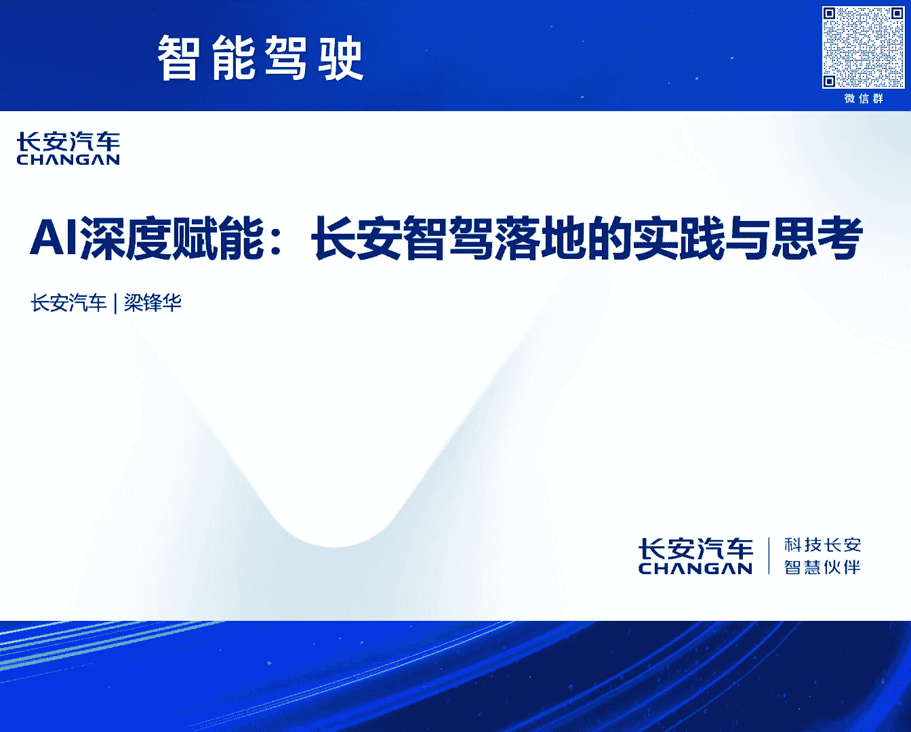

思考和实践的情况来给大家呃进行一个报告啊，哈总总共主要就是我分享的就两个部分，一个是这个趋势呃和挑战，这里面也同时会有呃，应该说很多的，这个我们在实践过程中的一些思考哎，另外一个就是我们实报也报告一下。

那么长安汽车。

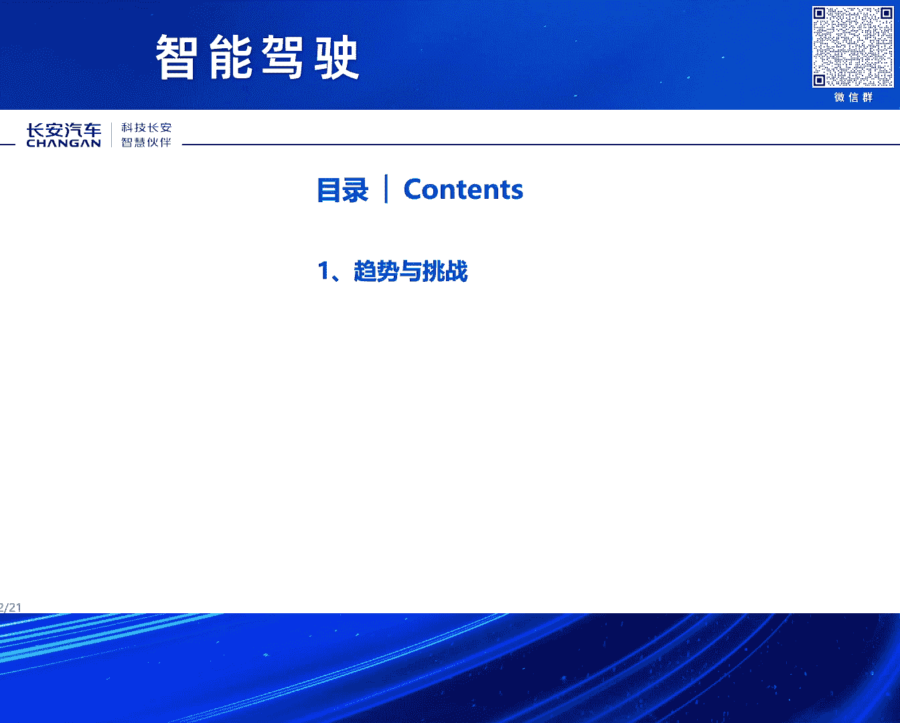

那么在这方面的这个实际的这个进展情况啊，那么总体上呃，我们认为这个支架整体上它还是一个场景的，一个持续的引进哎，同时这个这个呃，它是实际上还是从两个维度来持续的展开，那么一个维度。

那么就是场景的持续的覆盖啊，另外一个维度应该是这个等级呃，就说这个从这个功能的可用到体验的好用，以及呃等级的提升，那么这样的一个这这样的一个，三个大的一个步骤，那么持续的来进行这个提升。

哎当然这个场景的覆盖的话，这从目前整个行业来看，基本上就是从简单的场景到复杂的场景，那么从这个从这个大家这个高频使用的场景，那么到这个非高频的场景，那么这样的一个呃持续的这个覆盖的过程啊。

不过尤其是从呃单车道到高速，那么到城区到停车场到城区等等，哎好，同时这个行业呢，现在当前呢，应该说呃这个从场景覆盖的角度来讲，应该说这个大家逐步的，应该说接覆场景的覆盖的这个阶段，应该已经到了后期。

也尤其是以这个城区领航作为作为代表，当前呢呃更多的应该是进入一个，精耕细作的这样的一个阶阶段啊，那么这个精耕细作，那么主要还是围绕着两个大的方面，那么一个方面就是这个体验呃持续的呃提升啊。

那么让用户不断的建立这个对这个，对这个整个这个支架系统的的他的信心感啊，包括这个也在不断的提升，那么用户他的一些呃购买的医院啊，另外一个方面那么不断的提升安全性，因为这个安全毫无疑问。

那么是支架呃最关键的这个这个基础哎，因为这个安全，其实这个里面它有很多方面的这个这个安全，同时这个随着这些这些问题持续的解决，那么这个呃，我相信最终那么会实现这个呃等级的这个提升，而且等级。

那么它也会最终也会走向规模化的这个覆盖啊，但当当前呃，应该说我们处于一个这个这个等级呃，将来把这个高等级的这个这尤其是L3级以上，那么进行这个商业化的，应该是已经进入走进入了这个这样的一个前夜。

因为这个典型的代表就是呃，智能网联的这个准入的试点哎。

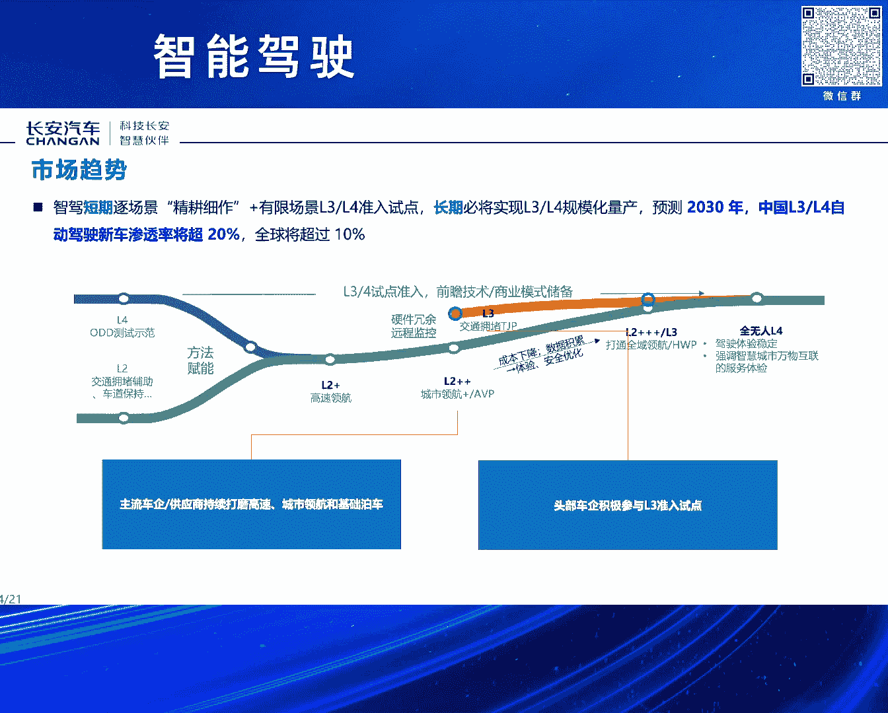

同时这个从呃实际的用户需求哎来看，因为这里面这个用户需求实际上很多，也来自于呃一些这个既有行业报告，那么也有这个实际的一些实际的一些，数据的统计等等，那么现在呃第一个就是渗透率，总体上还是在快速提升的。

那么这个渗透率从两个维度，一个是这个呃用户的基数在快速的这个扩展，因为尤其像L2啊等等，因为现在我们逐步都已经把L2呃，已经要作为这个标配，嗯另外一个就是用户的它的实际的使用的，这个呃时长啊。

月活哎等等，那么也都在啊快速的这个提升哎，那么从从这个我们呃，过去呃几年监测的情况来看，基本上就是单用户的这个平均月活，基本上应该是呃我目前已经翻了一倍啊，尤尤其像2021年的时候，可能像基础的I2。

那么很多可能月活也就是可能30%左右，那么现在实际来看，很多已经达到了可能60%以上，哎同时这个对于这个这个对于一个车企来讲，那么实际上从用户的总的这个，使用时长的这个视角来看。

对这个应该是更是一个数量级的这个变化，可能从21年到现在，可能作为一个车企所拥有的用户总量，基于这个呃基基盘来看，可能这个估计已应该是已经上涨了至少四倍，五倍啊，有些可能七八倍哎。

这样的一个这样的一个状态，实际上这样的话就是对对智能驾驶的，它的安全和体验应该说提出了更高的要求哎，同时这个其实作为作为整车厂及，应该说在这个这个智能驾驶开发的过程中呃。

应该说还是一个也是一个百感交集的过程啊，这个这个既有既有这个呃这个充满希望啊，那么这个同时也有这个呃战战兢兢哎，因为这个这么大的用户体量，而且智能驾驶，那么用户在使用过程中，它是一个持续作用的过程。

而很多问题的发生，可能就是呃，一瞬间的这个这个这个一瞬间的事情哎，所以这个非常这个事对我们来讲，一直也是一直非常这个，这个如履薄冰的这样的一个呃过程啊，啊同时智能驾驶。

那么在技术这个方面也存在非常多的挑战呃，尤其是我们当前的支架，那么还是以这个呃经典支架哎，这个作为主体的路线啊，当前几乎所有的呃这个这个投产的，包括有很多号称是，但实际上这个可能不一定哎。

所以这个这个里面这个哎包括这个呃，尤其像模模型的这个泛化能力等等，包括这个PNC的，传统PAC的这个维护的难度等等，因为这个很多case都是要一个一个呃去解对吧，那包括这个啊建图的成本啊。

哎包括支架本身，它的体验的这个拟人化程度等等，还包括还有数据啊，数据的这个成本呃，是采集的成本，这个标注的生产的成本等等啊，包括部署啊，哎包括整体研发效率等等，还有非常多的问题，那么需要呃。

需要这个在后面的这个持续的提升过程中，那么这个呃快速的解决哎，但这里面有很多也是需要行业那么共同努力啊，来解决一些呃一些问题。

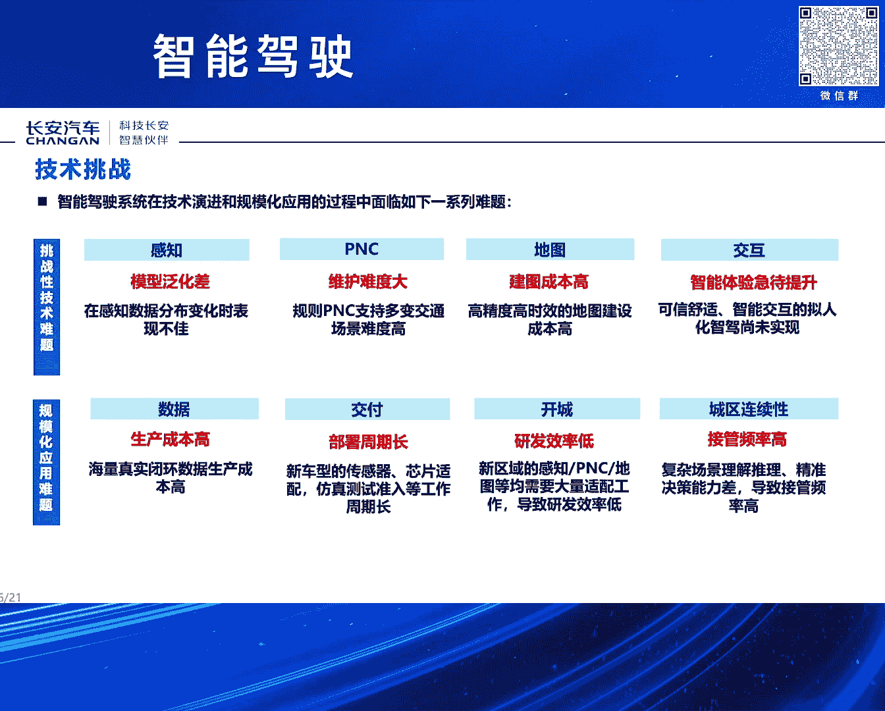

可能效率会效率会更高嗯，啊另外就是刚才也点到这个数据的问题，实际上数据现在这个应该说是呃，整个行业应该还是非常还是非常大的，这个痛点啊，其实这个数据也包括这个生产的效率低，包括重复的采集。

重复的这个标注啊等等，实际上数据我们一直在讲，数据也是资产，但是这个数据实际上当前它没有还没有，至少从我们所看到的情况，它实际上并没有成为资产，为什么第一个就是他没法。

很多时候他的这个就是没有很好的流动，为什么没有衡那段时间标准不统一，那么标准不统一，那导致可能各家数据之间它是很难去复用的，那不能复用它就大家又无法流动，无法流动，就成为就成为成为不了这个资产哎。

实际上这个是我觉得是个是个，是个挺大的一个问题，这个这一块的话啊，确实是需要呃，呃一方面是希望能够呃不断的呃建立健全完善，那么数据相关的一些一些法规，另外就是标准呃，采集方法等等，这个也希望统一啊。

同时啊，这里面也希望这个这个呃国家的数据平台，能够在这个方面也能够发挥更大的这个作用，哎因为这个尤其是数据，这个很多时候可能在前期的时候，可能这个数据有效性啊，那么它数据所采集的数据量。

那么对应的这个性能会快速提升，但是到了到了这个长尾阶段，那么这个时候这个仅仅靠一家或者是各自去做，实际上是代价呃，非是代价应该是巨大，甚甚至是无底洞，所以我们我们认为这个在这个时候。

国可能国家平台在这边没能够发挥这个呃，更大的作用，那么对整个行业应该是会会有巨大的，这个帮助哎，同时包括这个这个图啊，那么这个方面图这块，我们也认为应该还是要建立这个图商和整，车厂的这个新的协同模式。

因为传统的呃，这个图这块，如果呃还是继续采用传统的这种模式实现，效率是非常低的，不管是从鲜度，那么包括这个这个它的整个这个呃，图的成本等等，应该对都是非常高的，那么本来整车厂，那么它是有天然的。

那么尤其随着支架的那么持续的这个铺开，那么它是有天然的这个这个数据的这个基础，那我为什么不能把它很好的，把这个价值发挥出来。

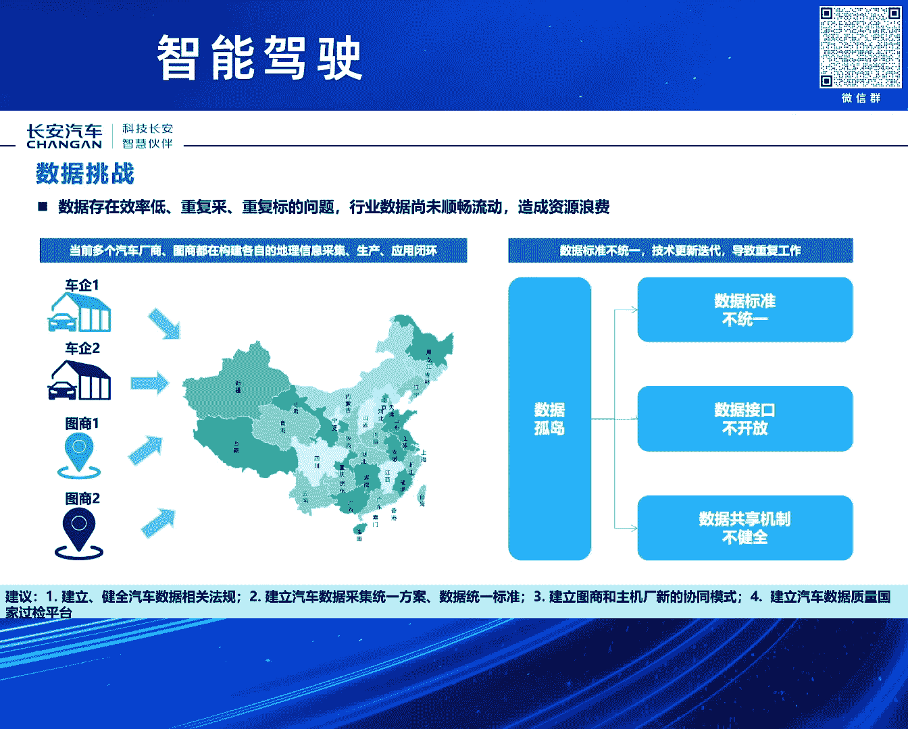

对吧啊，同时这个在这个成本这个方面，这个这个其实成本主要还就是，还是那那三个大的方面呃，但是结构在不停的变化，那个实际上就是说呃算力呃，就是数据算力呃，人力，但人力实际上就是对应的算法这三个方面哎。

那么这个三个方面，只不过是这个三个方面的成结构在不停的变化，那么我们呃从目前来看呃，毫无疑问，那么人力的成本实际上在这个比例里面，是在不断的这个下降的，呃，但是这个算力呃。

数据那么是在呃持续的呃持续的扩大，哎那么在这样的情况下，实际上这个呃确实还是需要，那么呃这个包括政府啊，包括行业能够推动，包括不管是数据呃，这个算力平台的这个呃呃这个共建啊等等。

包括还有就是目前这个算力本身的硬件成本，当前也是在尤其在中国这个市场上，它还是偏高的，那么也确实是需要在这个方面，这个也就专用的芯片啊等等这个方面，那么也能够这个进行这个攻坚哎。

同时这个也需要在这个算法，我们认为确实这个算法还它还有巨大的，持续的迭代的这个空间啊，因为当前这个这个其实行业里面，很多这个很多这个大佬也都在讲哎，那么这个你把当前的这个人工智能的算法。

和人本身的这个这个这个呃相比，那么它的效率不知道低多少对吧，那么这个这个我们认为这个这个将来的这个呃，这个算法这个方面还有巨大的这个提升的，这个空间嗯，需要这个行业，包括尤其像不管什么高校学术机构等等。

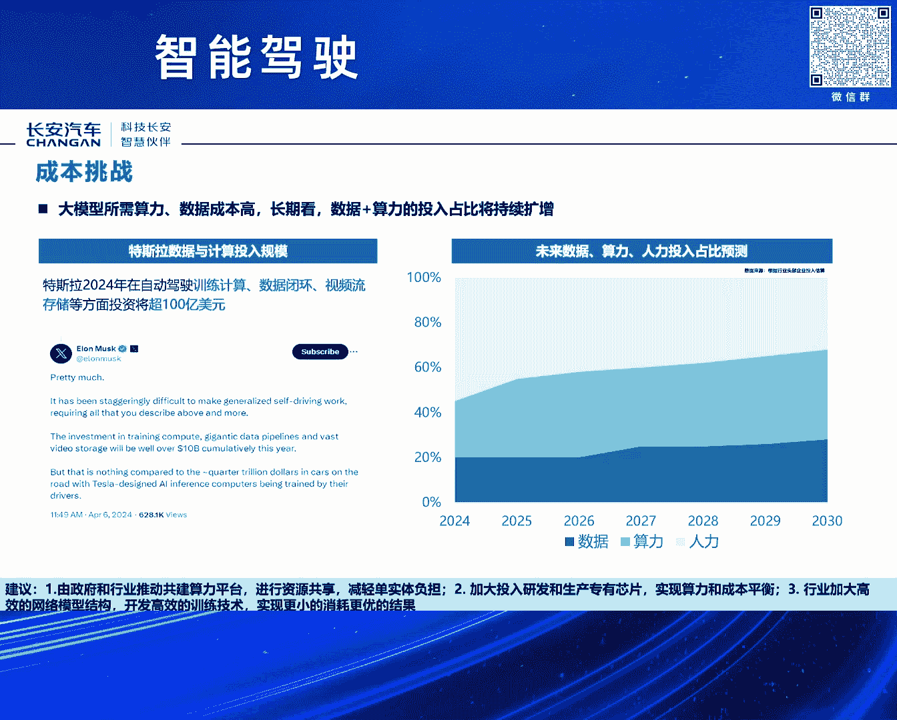

那么能够呃这个加快这个方面，一起能够加快这方面的这个研究嗯，好下面我也报告一下，那么长安在智能驾驶这个方面的，这个整整体的这个进展情况，那么长安汽车，那么毫无疑问，那么长安汽车，那么这个从2017年。

那我们开始了第三次的呃这个创业，我们叫创新创业计划，那么这个创新创业计划我们在内部，那么随着行业，然后和整个市场的持续的发展，我们也在不断的这个迭代，那么到目前为止，我们已已经迭代到了这个呃7。0哎。

这个同时这个整个创新创业计划，那么有三个大的这个战略，那么呃这个主要围绕着，比如说香格里拉的那么新能源战略，那么北斗天数的智能化的战略，和这个海纳百川的这个全球化的这个战略。

这个都是作为这个公司的这个三大，这个核心战略嗯，那么最终会构建那么新汽车。

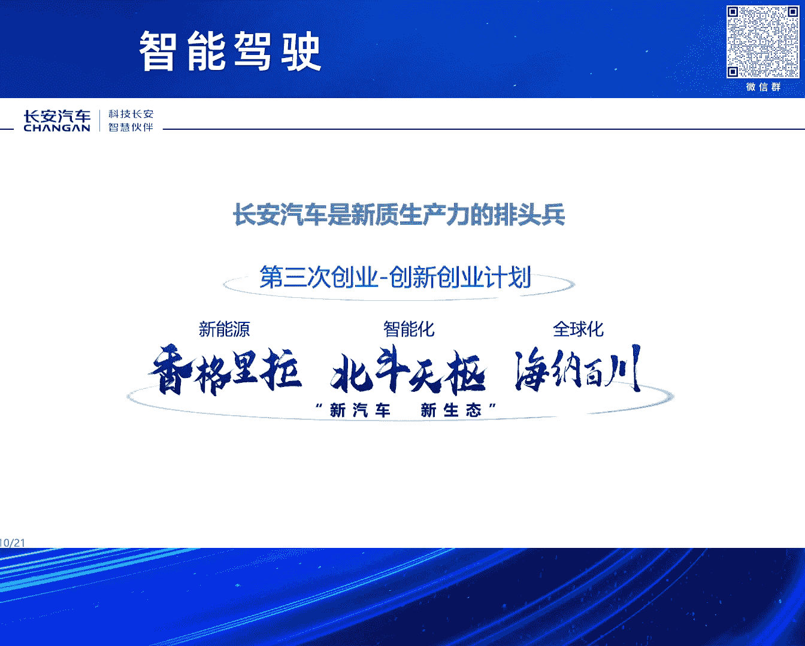

新汽车和新生态哎，那么在里程碑呃，节点这个方面，那么现在那当然加上这个呃最新的呃，呃那么这个我们进入长安汽车，那么进入首批的这个23级，这个智能网联汽车试点，那么这个是应该说是第17个吧。

哎那么这个呃同时，那么我们也也也这个牵头制定了呃，汽车驾驶自动化的这个分级的国家标准，那么这个是在21年进行了翻版，当然这个这个这个呃分级的标准呢，这个我相信因为这个这个作为这个底板。

那么后续应该还要一后面后续，那么随着这个我把这个，我们要把这个真正的L3真正要落地，那么要变成这个要变成这个这个市场化和，商品化的呃，这这样的一个这样的一个产品。

那么这里面还有非常非常多的这样的一些标准，那么具体的操作层面的这个标准可以衡，可以可以量化的这样的一个标准，那么也是需要呃持续的来进行这个完善嗯，同时这个在这个在这个支架的这个自研，这个方面。

那么呃长安汽车实际上现在已经完成，已经这个进行了四代的这个平台的这个支架，平台的这个自研，因为这个我记得前段时间这个呃，刚呃刚发布这个呃，呃长安汽车进入这个R3，这个呃准入试点的时候，诶。

突然发现行业内很多人说诶，他们用的不这个不这个不是自研的等等，哈哈我再给大家再再再进一步的呃，这个澄清一下，这个的确，那么是由长安这个自主这个研发呃这个完成，但同时是也同时和这个行业的合作伙伴。

那么也进行了这个大量的这个协同哎，这个目前我们的这个自研呢，那么已经进是进行了这个四代，那么最早就是2018年，那么那一代，那么是呃，更多的是以这个L2级的这个辅助驾驶，那么为主。

那么这个是典型的就是集成式的自动巡航和，呃这个遥控代客泊车哎，因为这个在2018年那个那个时代，我们是中国品牌，这两个都是中国品牌首发的嗯，同时在2020年的时候，那么我们又进一步的这个量产了呃。

我们内部叫NID1。0，实际上也也是围绕着高速公路辅助的呃，这样的一个系统，还有那个远程智能泊车的这个系统，那么这个我们也是这个尤其是远程智能泊车，也是取得了这个首发。

这个是应该说应该说还是应该是全球首发嗯，到目前为止仍然是长安汽车仍然是唯一的，那么具备这个这个真正在这个产品，这个方面进行这个量产的这个企业嗯，另外就是在2022年，那么我们进一步的有量产的高速领航呃。

这个和这个远程的这个代客代客泊车系统哎，那么这个是呃，同时那么这个这一代系统，那么同时也是我们作为这次准入准入试点的，这个呃这个系统哎，那么这个呃它本身是具备的，具备呃R3的这个能力的啊。

但这个同时我们在这个里面呃，不管是从架构的呃，从架构设计呃，那么包括这个各各项的这个安全设计，那么都是严格按照R3的这个要求啊来进行，同时我们在这里面也是，应该说也是呃这个创新性的使用了。

应该也是全球首发，创新性的使用了这个这个微碰的这样的一个，这样的一个系统，哎，那么这个是啊，为什么这么说，就是为什么要做这个做这个准备，就是因为这个支架肯定是做不到呃，绝对的呃不碰撞的这样的一个可能的。

因为这个支架它毕竟它是一个物理，它是物一个物理的实体，那么既然是物理的实体，它就有它就有这个呃它就有惯性，那么它的刹车，比如汽车最好的刹车，那么它百公里这个刹停，那么也需要30米的滑行的这个距离对吧。

所以这这个这个这个那么做我们做支架，那么一定是要围绕着这个最极限的这个工况啊，来做来做这个准备，嗯啊同时这个这个同时我们也研发了这个，也正在研发这个我们内部叫做唯一的高阶的，这个支架的平台。

那么这个核心就是最终把这个城城市领航，这些全部都解决掉，这个会在这个会在今年啊，那么实现这个量产哎，呃同时这个在这个自研这个方面，其实我们的整个从每一代这个，这个它的这个自研，那么在这个在整个系统里面。

那个战实际上是在呃持续的提升的，那么到目前为止，从这个尤其从第三代，那么应该说核心的算法，那么是全部由长安来开发完成的，从从系统的设计到核心算法，那么全部都是由长安呃设计完成，当然这个硬件啊等等。

那么这个很多是是会和行业那么来进行合作。

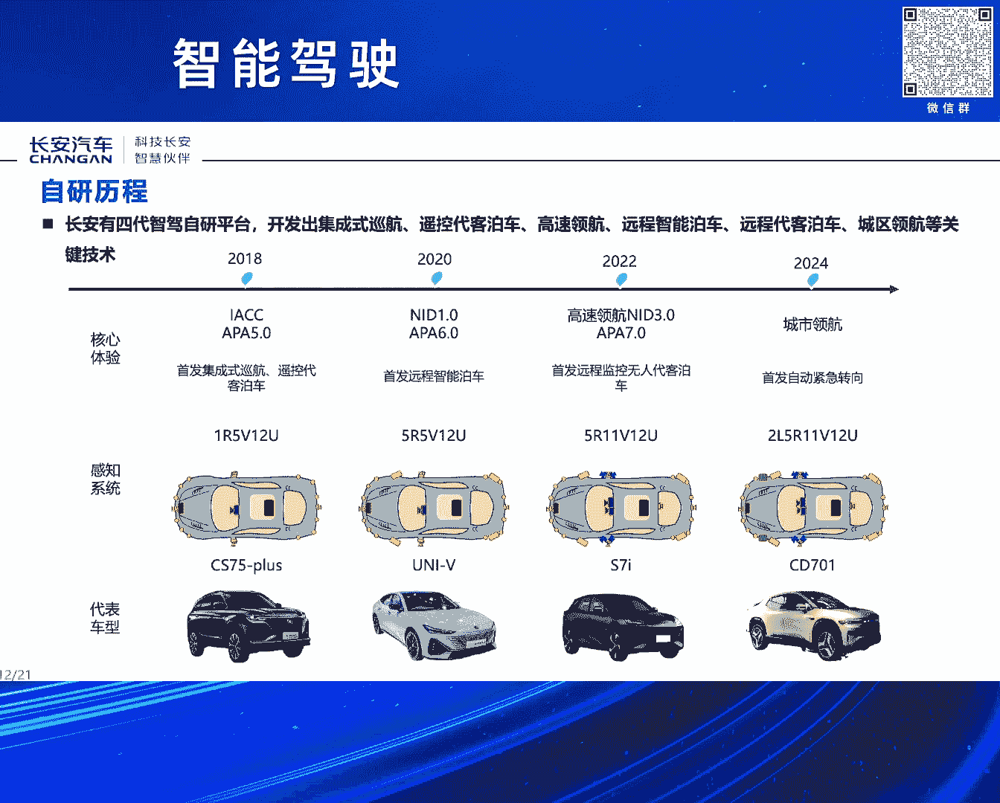

嗯啊那么既做好这个支架，那么有个非常呃关键的呃这个基础，因为支架它它仍然是一个整车的支架，它是无法单独存在的，那么这个支架那么要要获得比较好的作用，那么它一定是在一个好的整车的这个架构呃，基础上。

那么我们是打造了这个呃，呃，我们是基于而未来的智能机器人的，这样的一个呃这样的一个终极的思考，那么我们打造了六层的这个架构平台，那么这个六层的这个架构的平台，那么实际上很多时候也是对应呃跟人一样。

那么对应人的这个呃这个运动哎，人的这个手脚运动系统，对应人的这个呃这个比如神经的传输系统，包括这个呃通讯啊等等对吧，对应人的小脑大脑等等，那么总体上就是从L1，那么对应是机械层。

那么L2那么更多的是能源动力层，那么L3那么是一架构R4E架构和硬件，那么L4那么就是操作系统哎，那么R5的话，那么更多的是呃这个应用哎，包括算法应用等等都在L5。

那么L6那么就是实际上是云端和大数据哎。

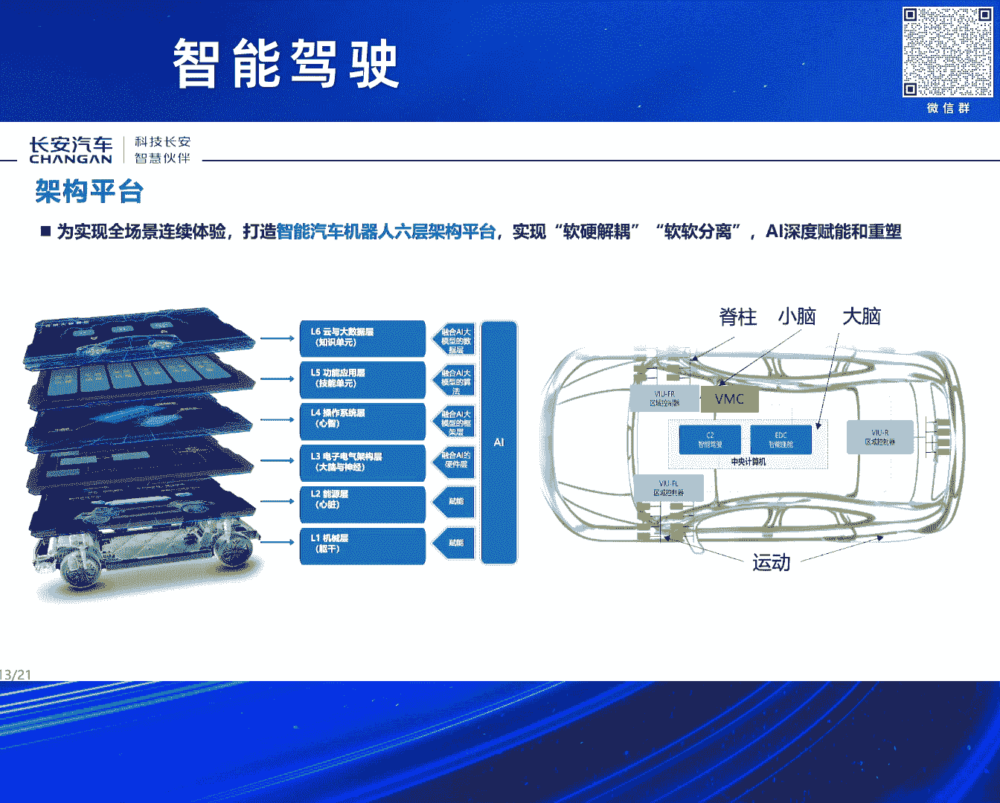

这是我们的整体的这个架构啊，最新的架构，这个实际上在我们新汽车都已经都已经应用，而且即将量产嗯，同时在支架算法这个呃这个方面，那么应该说我们现在已经掌握了这个经典支架，那么所需要的这些呃。

所有的这样的一些核心的算法能力呃，同时日也正在跨越式的构建，新一代的这个支架的这个算法嗯，那么同时这个这个新一代的支架算法，那么毫无疑问，那么就是以端到端支架，那么作为作为核心呃核心的特征。

但是但这个端到端的这个支架，其实大家应该说也还是有共识啊，总体上就是上限哎，可能大家认为可以无限的想象，但是下限呃有的时候可能也无法想象，所以所以说这个这个我们认为可能在很长。

我们所能够看得见的这样的一个呃时期内，可能这个经典的支架和端到端的支架，两个仍然会是一个呃并存的关系，那么经典的支架，那么后面的作用它就越来越呃集中在，那么解决这个下限呃，问题的。

这样的一个这样的一个关键的这个角色哎。

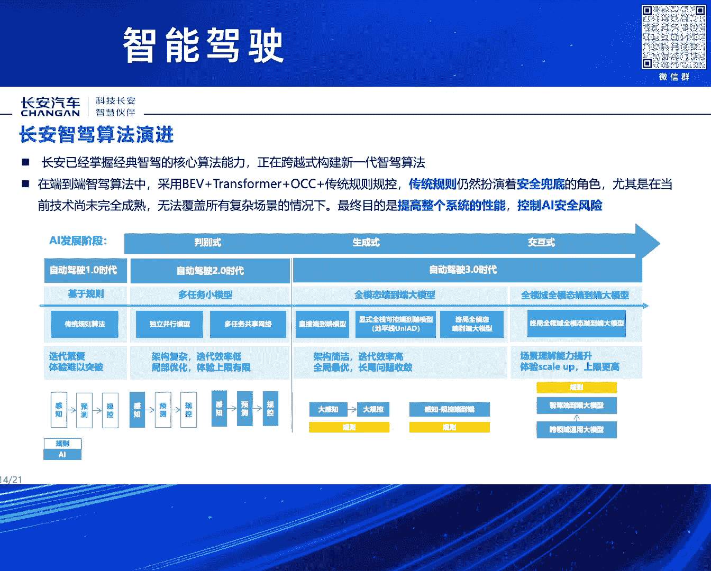

好同时这个这个关于这个算法这个方面啊，因为这里面还是需要由用两个例子来来特别呃，呃呃可以也可以叫证明吧，就是说我们确实是具备这方面的，这个算法能力啊，这里面有两个，一个是之前UCS的这个打榜。

那么长安也是得过这个打榜的这个呃，这个第一哎，这个是之前这个是有有明确的这个呃，成绩记录啊，另外一个方面就是也是最近，那么在这个端部动漫太的端到端大模型，这个方面，我们也获得了这个计算机视觉与模式识别。

那么CAPR的这个这个2024的这个，赛道创新奖哎，这个是应该也是这个会议的这个最高奖嗯，这个所以这个也也从这点上也是也希望，那么大家对这个呃，这个这个所谓的这个传统整车厂的。

这个实际上在算法这个方面的这个印象，能够有一定的转变啊，实际上确实这方面，我们的宣传还是做的也还是不太够嗯，同时在数据闭环这个方面，我们也建立建立了这个这个呃，应该说完比较相对比较完备的。

这个数据闭环的这个体系嗯，来持续的解决呃，数据的生产训练呃，包括采集生产训练等等各个环节的问题，那么持续的解决这些呃，那么同时也不也在不断的提升，整个这个数据闭环的这个自动化的这个效率啊。

这里面就包括在这个呃这个这个这个一些，比如数据挖掘的工具的研发呀，呃包括我们的整个这个4DBEV的，这个数据自动化的产线，包括我们的整个呃这个规模化的，持续BV的这个动作。

静态真值这个方面的这个自动化效率，那么这块它是提升提升了95%哎，但这个是一个持续而提升的过程，那么随着端到端，那么也会有对整个这个数据产线，会有新的这个要求，哎这个呃也要持续的进步啊。

另外一个就是关于这个这个新的测试体系啊，这个方面其实这个新的测试体系，一方面就是来确保这个，当然首先核心还是来确保这个，我们整个这个系统的这个呃安全可靠呃，和它的足足够的这个场景的这个适应能力哎。

那么同时那么这个围绕着我们最近，那么即将开展的这个试点的这个工作，那么它毫无疑问是试点工作呃，非常关键的这个保障，那么这里面核心的这里面包括多支柱的这个啊，多支柱协同的这个测试呃，测试策略。

还有系统性能安全的这个模型啊，同时最终是实现功能和性能测试内容的，这个百分之百，那么尤其是当这个长安汽车进行这个支架的，这个测试，有一个的确有一个天然的优势啊，这个实际上也是我们这个这个很多时候效率啊。

呃这个测试的效率为什么特别高，确实跟重庆的这种拔地的这个复杂的这样的，一个城市的这个交通环境，有有有巨大的这个关系啊，可能可能在很多其他城市，你出去可能跑得跑个十几公里，几10km才能才遇到的场景。

可能我们出去可能几公里就就可以，可以可以可以碰得到哎，这个也是给我们提供了一个天然的这个呃，天然的这样的一个高效的这个测试基地，那当然我们也建立了完整的这个呃，测试的这个体系。

同时这里面也引入了R157的这个，驾驶员的这个模型诶，那么来来进行自动驾驶的最终的这个性能，安全的这个评估，那么这个当这个这个模型呢，那么基于不同的场景，那么不同的等级。

那么它最终那么它的验收的这个标准，应该是有不同的这个指数嗯，同时也在构建这个新的安全体系，那么这个安全毫无疑问是支架这个稳健落地的，这个最关键的这个底座哎，那么总体上。

那么还是希望这个通过这个新的安全体系，能够实现全车和全生命周期的这种呃，管理的这种半生的这个安全，包括复杂人机耦合系统的这个业务安全呃，这个这个安全就说支架的安全，不是不仅仅包含支架系统本身的安全。

那么它更它同时是一个整车的这个安全，而且不仅仅是这个电子系统的安全，它同电子系统和软件系统的安全，它同时也是一个整车的这个呃结构安全，那么它是这个是一个完整的一个一体化的，这样的一个呃这样的一个体系嗯。

包括这个包括比如碰撞，实际上这个呃，这里面就是为什么整车厂那么做支架，可能最在安全兜底这个方面可以做得更好，因为其实我们在在做很多的这个，在在评估很多安全风险的时候，那么它都是要把这个碰撞安全。

和这个支架本身的这个安全，两个都要结合起来来来评估哎，包括比如说哎我们有的时候这个测试一些，这个哎有些极端场景，那么那么我们也要来看，那么它它实际假设，那么它最终发生碰撞之后，那么它实际的这个的伤害哎。

到底是一个什么样的一个什么样的一个状况，那么对应的我们要采取足够的这个，这个这个措施嗯来保障，当然这里面就是这个也是有对应的，这个一系列的这个体系啊，包括我们最早呃获得了针对自动驾驶的这个。

A4space的这个呃体系的这个认证啊，包括呃这个功能安全，ACUD级的针对自动驾驶的这个功能，功能安全的认证，包括还有预期功能安全，包括这个网络安全等等，那么都有对应的这个应该说很多。

这里面大部分应该都是应该是在国内，应该是最早拿到的这样的一些认证啊，嗯啊包括这个呃评价呃，体验的这个评价体系这个方面，因为支架的核心，那么最终是还是要安全高效舒适啊，和内啊，因为这个这个支架呃。

这个它是汽车的这个支架，那么这个而且是人承载人在车内的这样的一个，它不是一个呃，不能用传统的机器人的视角来看汽车的这个，这个这个支架，所以它一定是要整个这个这个智驾系统的，驾驶习惯。

一定是要跟人的这个习惯习惯，那么要很好的这个呃贴合起来嗯，那么这样的话或者是应该说比人要更安全啊，同时比人要更开的要要更好，那么才能获得这个用户的这个信任啊，可能我们如果长期使用支架的。

这个大家都会有都会有很有感触的，因为有的时候可能一个人就是有，有的可能就几秒的哎，他觉得你觉得他开的不像你，那么你可能对他的这个信任感，都会打非常大的折扣，嗯当这个这这些这个评价体系既是一一套指标。

那么我们也会把它呃，这个这个指标会把它客观化啊，同时也会把它逐步的工具化和自动化，可能这个支架系统自己出去开一圈，基本上同自己也会把把这个分数打出来，啊总体上，那么支架它仍然是一个呃呃超级巨大的超级长。

超级宽的这样的一个呃系统工程，那么需要行业这个各个方面，那么进行深度的这个合作，那么长安汽车始终坚持开放互信共赢的理念，那么积积极的和全球的合作伙伴，开展多多领域的深度合作。

我们这里面其实提出了提出了很多的这个合伙，产品，合伙技术合伙，前沿合伙，这些其实不都不是概念啊，其实我们每个方面都有足够多的这个案例呃，在进行落地啊，包括很多这个可能大家原来想象的很难想象的，这个。

这个可能大家是不是有些，可能直接进行互相合作哎，全白合的进行这个联合开发等等，那么这些实际上都在都在进行啊，包括数据呃，在数据方面，我我们现在时间还在跟跟我们有些合作伙伴，那么就是也是全部打开。

那么这个大家一起统一标准，那么一起这个进行这个数据的采标等等，嗯那么这样的工作，实际上这样的话就是可能大家成本呃，比较获得同样的效果，但成本减半是吧，那么和这个这个这样的话。

我相我相信这样的话才能更快的，那么呃一起来推动整个行业的这个发展。

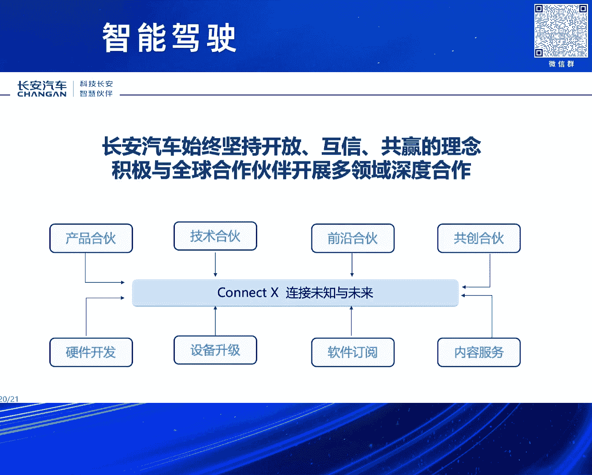

好以上是我分享的主要内容。