# 2024北京智源大会-智能驾驶 - P3：小鹏汽车AI大模型量产实践：马 君 - 智源社区 - BV1Ww4m1a7gr

那个感谢这个法王主任嗯，感谢黄院长黄教授，感谢各位嘉宾领导，还有各位朋友们能够在这里，大家怎么说呢，欢聚一堂吧，因为咱们做自动驾驶的，或者做汽车行业怎么说呢，今年的一个最热最热的词就是卷卷的，很辛苦的。

所以希望今天下午呢能利用这个场合，大家能够放开那些正在很着急，还在回的工作消息，能够不再受到什么各种各样，来自客户的领导的压力，我们能够在一起谋划下未来，就是看看现在大模型。

人工智能技术到底给我们支架行业，给我们汽车行业能够带来什么样的变化，所以在此呢有一些包括小鹏汽车的思考，一些我个人的思考，在这里跟大家集中报告一下呃，这篇报告的题目叫做，小鹏汽车AI大模型的量产实践。

后面我会有一部分呢，实际上就是紧扣我们小鹏汽车已经量产的技术，跟大家做一个报告，就是我们为什么要去把AI大模型和汽车，放在一起，那我们要做这个事情的原因是什么，其实有一个很明确的结论。

已经写在这个topic里面了，就是我认为AI大模型给汽车行业带来了一个，历史性的重大机遇，这页材料呢是之前咱们汽车工程学会，曾经组织过一个大模型的这个研讨会，当时我的一个引导发言。

在这里跟大家再同步一下，就是我们可以看到啊，现在AI大模型的成功，它的实质是什么，是技术驱动市场，技术使能行业这样的事情，我们回顾整个人类的科技发展史，我们总在讲工业革命，工业革命到来之前。

资本市场或者用户是毫无觉察的，而是用一些技术的驱动一些行业的革命，突然间就改天换日，就做了一个特别大的革新，目前呢，我认为爱戴模型有很明显的传递的这样的迹象，我们可以看到chat gbt问世，这才多久。

SORA问世才这这才多久，已经可以看到翻天覆地，每天都有大模型在各个行业的一些突破，现在基本上所有的巨头都已经进入了，AI大模型行业呃，我右边我在这页PPT，左边列了一下这个图标或者一些icon啊。

这个不重要，因为我知道这个与会的来自很多行业的朋友，很多公司朋友都有非常优秀大模型产品，这里要列可能得列上百个以上，这列不下来，我就只是举了几个，这个并没有任何排位的意思，指数我们可以看到这些大模型。

他们现在在各个行业的发展过程中，其实实质上他创造了从AI集群到整个行业，赋能的一个全链条，全行业的想象空间，尤其大家注意一个信号，之前AI大模型呢可能离普通用户还比较远，普通用户想的什么呢。

我产品经理能不能让AI大模型给我出一个PD，我是个designer，能不能帮我出一页的这个渲染图等等，大家对这个I大模型还有一个隔隔一个隔阂，这隔阂就终端之前的这个终端大，要靠浏览器再怎么去启动一个。

进一个网页或者微信打开一个助手很费劲，就是apple intelligence嗯，这个story大家都知道呃，包括现在可能网上有各种各样的评论，但我从另外一个视角去解读这个事情，就是AI大模型。

会真正的向用户可见的终端去touch，这意味着什么，每个人看到AI大模型和AI大模型，获得一些一手的直接交互的几率会不断增高，这种增高会不断传染到其他行业，那我们再去考虑用户手里的终端，什么是手机。

是电脑pad，尤其手机，那么用户个人或者涉及到一个家庭，或者一个组织最常使用的终端是什么，就是我们汽车，所以说现在整个AI大模型，在手机行业开始爆发，我们可以看到这样的事情。

我认为也会在我们汽车行业快速爆发并复制，第三点呢，刚才的包括像这个梁总经理啊，包括像这个法旺主任黄教授都提到了，现在整个国家呢对于爱大模型也非常关注，现在很多这种示范应用都已经跑起来了。

国家的标准体系已经已经开始启动建设，所以现在可能是一个场合，我们站在国家的角度，站在全行业的角度考虑一下，AI大型模型怎么去赋能，尤其爱大模型的核心，我刚才也说过，就是能够使技术真正把市场驱动起来。

那我们再来看一下爱达模型给我们汽车行业，尤其智能驾驶领域带来的赋能是什么，这个有一个有一句话吧，我放在这里，就是它带来了我们走向全人机，全场景无人驾驶的一个历史机遇，为什么呢，首先我们从技术特征。

I大模型的技术特征最重要是自回归，基于提示词和上下文这些技术特征，长序列的理解理解长序列的attention机制等等，这些其实和人类司机驾驶车辆的观测行为呢，他的行为模式是非常接近的。

它具备一个迁移到自动驾驶场景，的一个天然优势，第二点，大家都知道，所有的爱戴模型都具有一个非常神奇的涌现，智能涌现的能力，这个能力其实可以看到，现在智能驾驶行业上也有一定的体现。

所以我们可以看到后面在我的报告中也会讲到，我们小鹏也发现了，AI大模型上车之后会出现一些非常非常可能，我们现在用规则想象不到的，一些非常漂亮的操作，所以这样的话，那么这在我们整个这个智能驾驶的行业。

这个AI大模型已经有了一些优秀的论文成果，包括去年李教授的这个CVPR的best paper，包括现在包括小鹏在内，我们一些企业的一些量产探索，所以我们认为爱达模型在汽车行业落地。

已经具备了学术基础以及工程路径，尤其工程路径很重要，因为我一直是在小鹏汽车做自研做量产，所以说我们特别在乎任何一个技术，最终如何落地在汽车上面好，那么既然前景这么美好，那么肯定是有挑战。

那么爱达模型在汽车行业量产的挑战是什么，这里面我大概就讲了六个点吧，没有罗列很多文字，因为每一方面拿出来可能半个小时都讲不完，我个人认为，现在AI大模型在汽车强力前汽车上面去做呢，要有两点。

第一点呢必必须能做到前装量产，第二点必须能做到整个关工具链，所有链条的全场景应用，什么叫做前装量产，我们车上跑的并不是一个超级计算机，也不是一个什么什么的云，我们车上跑的是车规级的算力和芯片。

和它的域控制器，它的算力，其实目前来看还是非常有限的，现在AI大模型随便一个模型，一随便一个网络，它的参数就是多少多少个币，这个听起来是很吓人的，那么在汽车上如果想尽快落地。

一定要对AI大模型适配在汽车上的，车规级的算力和预控，芯片和预控，要做对应的裁剪，要做对应的优化，第二块呢就是先进网络在车端的部署适配，我们搞那么多的网络和结构，我们在车上去部署，那么第一个问题。

算子那些operator支不支持整个这个结构，支不支持这个车端上的硬件，它的各种各样的它的这个延迟，delay latency行不行，那么如何把它部署上去，其实里面有大量大量的工程诀窍。

有大量的大量的坑要去填，第三点就是有线系性能系统的总体调优，现在可能大家在多少年前，或者包括现在吧，一遇到一个算力问题，如果说是推理算力都会问多少多少个T，多少个T，这只是只是深度学习的推理算力。

所有人可能都忘掉了，我们还有CPU的算力，忘掉了我们还有内存带宽的限制，忘掉了我们还有传感器，忘掉了，我们还有各种各样的接口，我们的PCIE，我们的以太网，我们的这个网络写结构，节点发现等等。

这是一一整套的东西，所以说我们实质上来讲是在车上，一个性能有限的系统，要做一个总体调优，尤其对于我们主机厂，我们要做到前装量量产，我们还必须做到成本可控，不能把最昂贵的最理想的硬件全堆在车上。

一定要有取舍，这其实也在考验一个工程能力，那么它的全链条全场景应用呢主要有几块，这块就数据自动标注，以前在两地两地的这个世界的时候，当时就做了简单的分类，人工画个点，描个框，很简单，这个tag打完了。

当时成本也可接受，现在在大模型见到的全是长序列，既然是一个长序列的一个视频，那么就存在一个问题，我们的标注怎么办，所以我们必须有非常好的全自动标注能力，不然的话这是没有办法办法把它跑下去的。

我们小鹏内部有个实践，就我们之前在我们那个第一版，最早最早上transformer上x net的时候，我们当时做了一些全自动标注的尝试，可以把2000人年的标注量缩短到16。7人天。

标注效率提升了4万5000倍，所以如果后续我们还想消费海量的这些CLIPSE，这些AI大模型，我们的所有的全自动数据标注，必须做的非常的solid，非常的踏实，大家也知道，对于一个计算机深度学习系统。

Ground truth is everything，第二点呢，我们需要非常高效的计算训练的基础设施，其实我们可以看到现在智算中心，可能大家现在各种各样的原因，把一些地缘政治的原因卡都变得很火热。

但是呢说到底呢做AI大模型的训练，我们也需要一个有一定的算力支持，不管是所谓的万卡怎么样，但其实真正做钱他有时候不是那么夸张，就是同样是把多少张卡拿过来，你怎么让这张卡很好的集连在一起。

如何把它的网络的带宽放到最大，延迟达到最低，如何更好地训练你的AIINFA，这样认AIINFA做到最棒，这里面其实有大量的高校TU的措施，这就是我提的一个最重要点，就是我们制算基础设施，不要急。

总是去拼有多少张卡，还要看我们的效率有多高，最后一块，就是我们真正把这个I大模型推到汽车上，我们可能也需要有一个自动化的仿真验证，以及分步骤的工程验证，因为毕竟尤其对于小鹏来讲，我们是主机厂。

我们并不是一个算法公司，我们所有的一切都是奔着量产，好现在跟大家来报告一下，AI大模型在小鹏汽车的量产落地的情况呃。

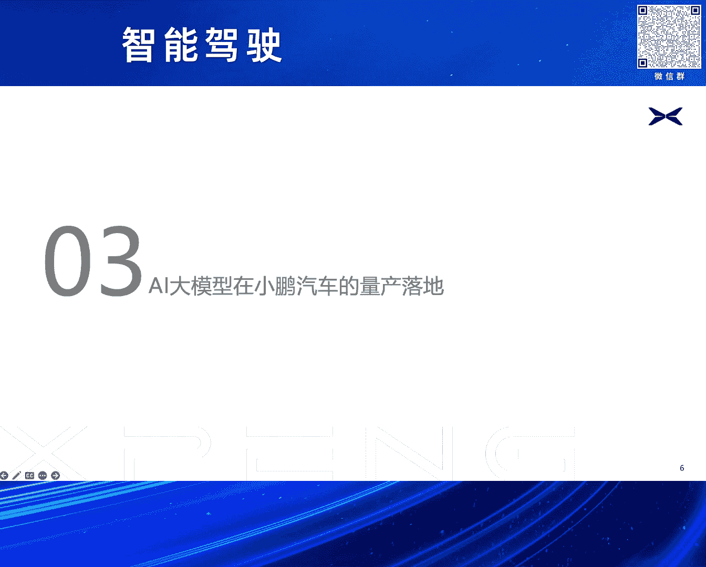

先说第一个，就大家可能也知道，我这也没有写啊，跟大家简单也报告一下，小鹏汽车的自动驾驶的一个量产过程，我们在2020年1月份的时候，就已经像当时全量的用户推送了高速自动，高速领航驾驶。

或者叫做高速自动导航辅助驾驶，就是我们的highway n g p功能，这个是在20202020年的1月份，就已经全量推送了，2022年的9月份就已经向广州，那已经是相当于两年前了。

广州推送了城市NOA功能，然后在2023年去年的Q4的时候，我们也向全量的用户去推送，我们的无图化的XN7P功能，在今年的1月1号，我们当时向243个城市嗯，开了我们的XNGB功能。

应该是当时整个业界开成最多的，然后在这开程的过程中，我们可以看到呃，刚才呃大家也都提到了，就说自动驾驶，总而言之需要考虑它的成本可控，它的节奏可控，我们总需要除了在不断的开开城拼工程，拼迭代的时候。

我们需要从一些本质上去解决自动驾驶的问题，现在随着这个技术的进展，我们也意识到，我们需要从手写的规则代码进化到AI大模型，所以我们把以前串联的感知规划，控制这样一个串联的传统线条。

现在小鹏汽车的量产汽车上，我们已经把它进化到了基于神经网络的经验，直觉就是我们的xnet x brain和EXPLANNER，那么先跟大家解构一下。

现在我们的整个x net expreme和x planner，这样的话我们一个大模型网络的一个情况，就是现在它其实是在一个并行，它在并行在一个网络里面，我们可以认为，这是一个端到端的三位一体的网络。

它仿生了司机的眼睛，大脑和小脑，他们这三个网络呢各司其职又协调一体，可以让这些复杂场景，就像我说的，体现出自动智能这这个大模型一些涌现能力，它可就像人的肌肉记忆一样。

它通过一些长序列的attention，可以得到一些最完美的路径，可以很自如的破解一些corner case，我们可以先看一下我们的x nex net呢，大家都知道这个BEV transformer。

现在都等，可能大家耳朵里面都快磨出茧子了，在去年3月31号的时候，我们就向全网的客户全量推送了OTA，推送了当时我们的XNGP1。0，当时我们的x net就已经上了车。

我们x net在去年3月底上车的时候，应该是国内第一个基于BE非加transformer，这里为什么要强调加transformer，因为当时有很多的BEV实现，包括我知道现在一些BEVV实现。

都通过LSS做的，当时能做到transformer的，应该只有小鹏汽车这一家做的一个量产，在当时硬件的很多算子可能支持还有限的时候，我们用了大量的工程手段把它做出来了，所以说我们的x net。

在有x net这样的一个基础之上，我们在今年对x net又做了更大更大的一个扩展，包括更长的感知距离，我们可以看到我们现在的感知的这个范围，已经提升到了两之前两倍以上，可以达到1。8个足球场面积那么大。

包括如果从分类来讲的话，我们有50家以上的目标物的分类，同时我们的占据网络也上车了，后面有个demo，大家也可以看到我们可以做通用障碍物的检测，所以它某种意义上我们做到了一个全知。

360度无死角大范围的一个视觉感知，深度基于大模型的深度视觉感知，然后我们的x planner现在来讲的话，就我们之前有很多大家知道PNC很难，conner case减不完，刚才梁总也提到了。

那么我们现在用x plan来上线，我们通过深度学习，通过大模型来做路径规划，所以通过我们x plant的现在上车效果来看，我们可以看到前后顿挫减少了50%，速度卡死的减少，减少了白速度，卡停。

这个违停或者各种各样的这种，导致次车被卡死的情况减少了40%，我们的安全接管减少了60%，再提一下这个我们这个x brain，就说这个其实是非常重要的一个点，就是场景识别和一些特定的语义识别。

因为我们现在在咱们尤其在咱们中国道路环境，可能是整个世界范围内最复杂道路环境，我们有常见的交通标志标线之外，除了常见的红绿灯之外，我们还有隧道，有高架桥，大家知道，其实做自动驾驶汽车以前在定位时候。

一个传统性难题，进入隧道的定位丢丢失隧道场景的不识别，高架桥上和高架桥下的不识别等等，这些我们都可以通过x brain做场景识别，可以把它找出来，同时我们还要注意，在中国。

现在很多城市我们的基建非常发达，我们有潮汐车道，有特殊车道，有待转区，还有各种各样的路牌，路牌文字，这些的话我们需要去做识别，所以我们就是通过像x spin，XNEX3的这样的一个三个这样的大模型。

都实现了一个端到端三位一体的网络，我目前就是做了一个评估，我们把我们现在整个的支架能力，可以提升两倍以上，当然这是一个很环子含糊的词，这里面要去拆，可以用很多指标去拆，但其实这个并不重要。

核心的就是通过我们的工程实践，也验证了之前我跟大家报告的一个推断，就是端到端的大模型给人工智自动，给整个自动驾驶或智能驾驶行业，带来一个非常非常强大的量产的技术，以呃机历史机遇，那我们再来看一下大模型。

上车就结束了吗，不结束，大家都知道所有的模型它都需要生长，就像我们训练小朋一样，从小要培养它所有的大模型，它都需要有一个迭代，小鹏汽车这边我们也是在努力做一个，整个就是这个自动驾驶或者支架一个迭代。

我们都可以，目前的可以做到两天迭代一次，如此算下来的话，我们支架能力在18个月可以提升30倍，包括我们现在对这三位一体的网络的联合训练，我们现在学习的人工人工的，人类驾驶的精华已经超过10亿公里。

然后我们的CLIPSE，包括我们每天新增的这样里程，都可以达到将将近10万公里的水平，这些数据都还是相对比较老的数据，这应该已经上个月的数据，或者上上个月的数据了，我们现在的数据还在每日这样增长之中。

同时之外呢我们除了做这种视频训练，这主要是把模型训练好，大家都知道我们需要进行推理啊，训练只是第一步，第二步推理推理怎么去检查，我们核心很明确，第一点是自动化的仿真测试，第二点就是叫做实车验证。

因为小鹏汽车我们是一个非常严肃的主机厂，我们所有东西一定要经过大量的实车验证，所以我们现在的实车验证已经超过了，646万公里，覆盖了全国1972个城市和区县，这样大面积的实车验证。

也得益于我们高度自动化或者高效的一些测试，工具链的支持，可以保障我们的泛化能力是经得起考验的，同时的仿真的就更不用说了，我们大量的这个仿真的系统自动化仿真，我们的仿真的积累已经超过2亿多公里等等。

我们包括我们对仿真的一些核心场景的模拟，包括我们对这种专业场景的模拟，这都是多少多少个万，这个我就这些数字，我就不冗余的念了嗯，然后这还有一个很有意思的东西，刚才讲的都是推理能力，其实大家都知道。

AI大模型还有一个特别有意思的，就是生成能力啊，生成式大模型生成是根本，那么就存在一个问题，我们有一些特别特殊的场景，路上很少的场景，我们怎么给它采出来，这经常是个问题，我们经常采不到，采不到怎么办。

那我们可以造啊，现在有I大模型，大家也可以看到像SARA这样能力说，在小鹏汽车我们有一个技术叫做anything，in anything的一个技术，这个近期应该应该这个应该在网上。

可能已经开源了他的一些research paper，然后应该也在投最近期的某一个会议，后续应该如果这个论录入呃，这个论文如果有正式的发表的话，大家可以进一步去check他的消息，它其实就是在生成。

通过这样生成式的模型，在动态视频中插入任意动，静态的强语义或者弱语义的问物体，包括像人，包括像突然出现的婴儿车或者一个垃圾袋等等，然后同时要真实模拟光照，阴影材质色调等元素。

密布罕见的counter case，所以这下面就是我们这个anything，anything的一个一个demo，可以看到，就说我们其实在这方面，我们这样的技术，我们也引入到我们整个的仿真工具链里面。

或者是在适时考虑引入到我们的训练流程等等，这也取决于这个项目的下一步的迭代和发展，我们希望把这个大模型的能力在除了在推理端，在真正实车的路径端，在实车自动驾驶的这个端到端的这方面，能够在整个生成方面嗯。

corner case和仿真方面也能够发挥作用，下面跟大家汇报一下，我们AI大模型在小鹏支架量产效果。

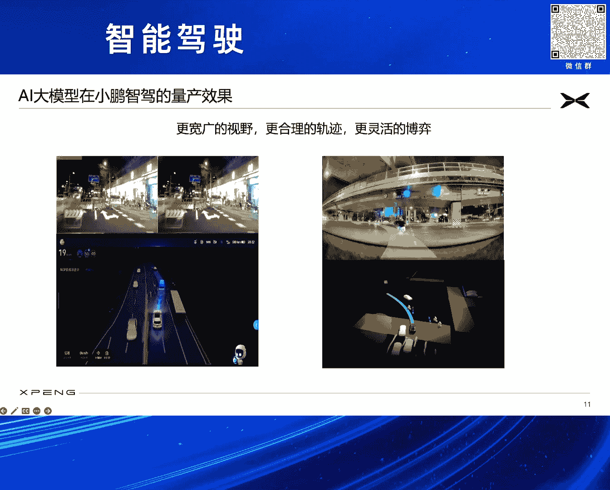

所以其实看到这是两个case，其实有很多这样的视频啊，因为这个太大了，我就不不拿过来浪费大家时间。

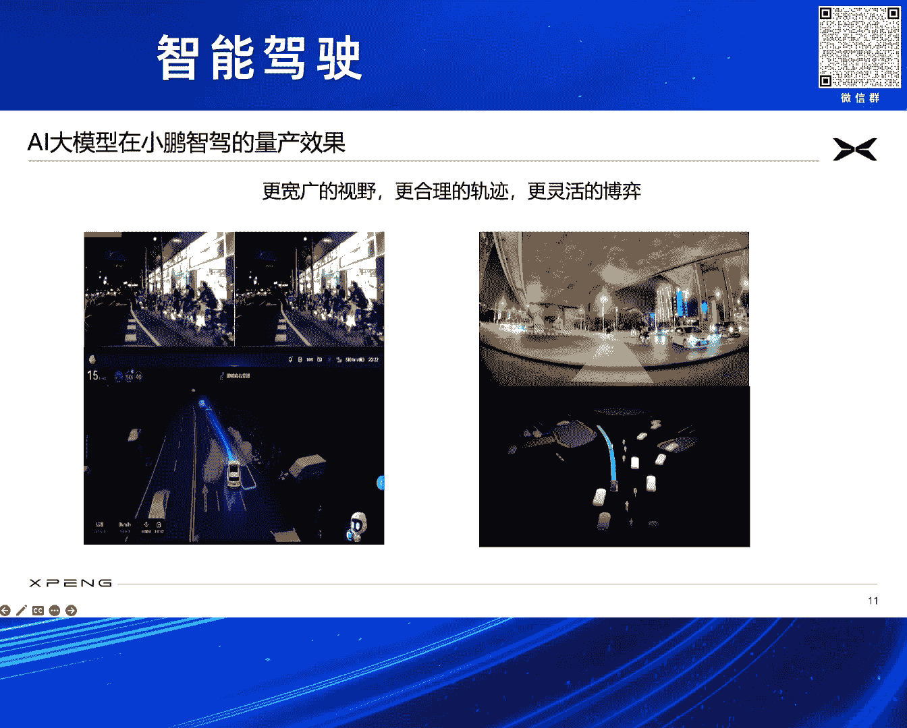

就可以看到我们的汽车。

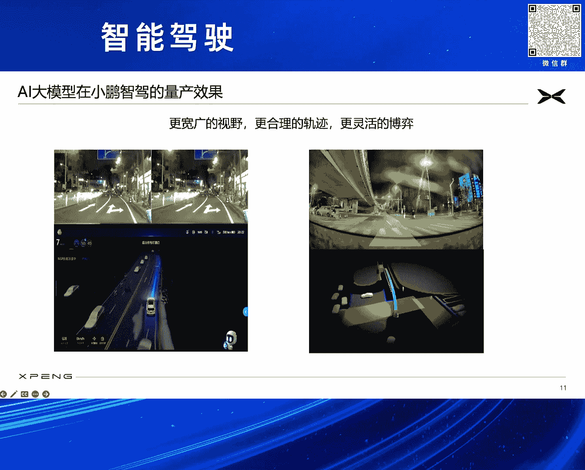

在这种复杂的夜间的环境中，这种窄路上面，可以360度无死角的去实时感知。

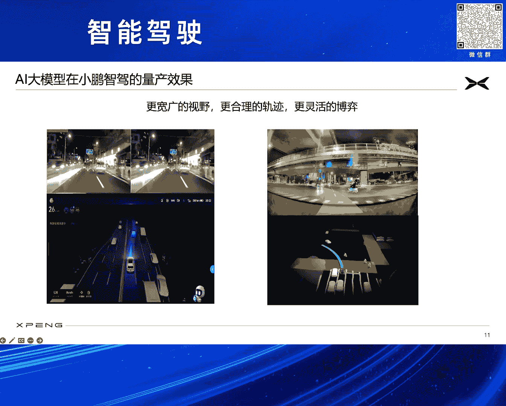

所有的运动物体，静态障碍物，还有这些通用障碍物，我们可以看到这里面有我们的占据网络。

比如像这左边这张图，这会就占据网络已经被检测出来，对我们整个自车的可行驶路径。

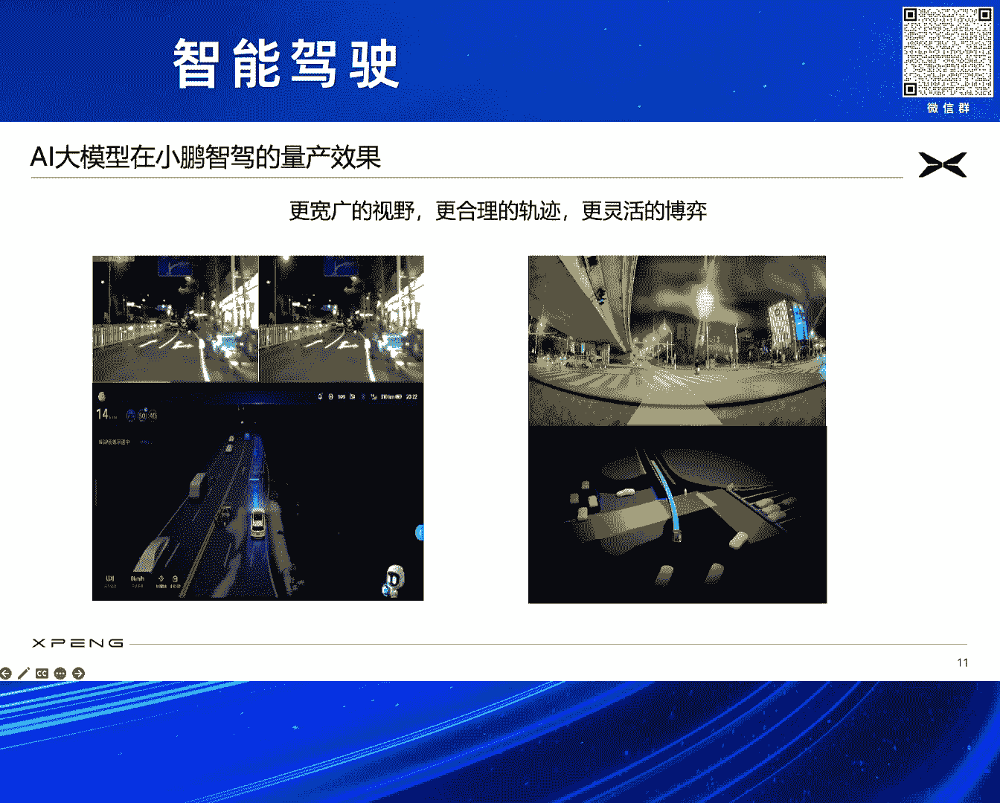

进行一感知层面的表达，同时我们的x planner。

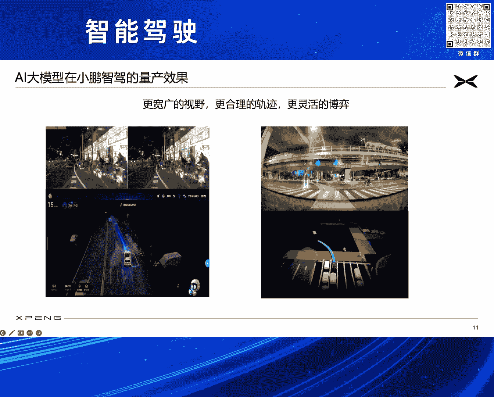

也可以规划出非常漂亮的路径，比如大家看右边这个图，我们再做一个左转左转。

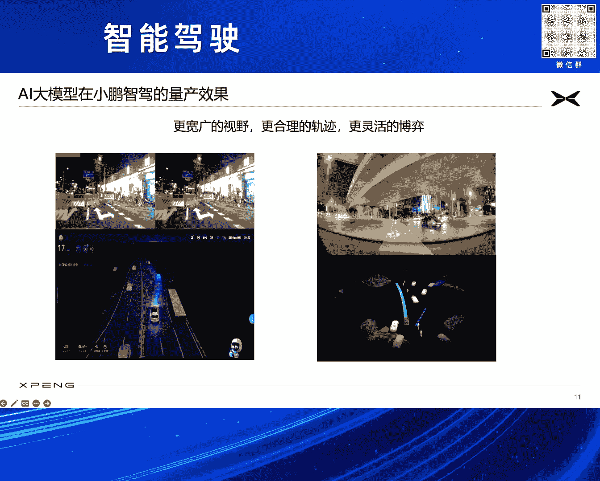

它是一个非常拟人化，拟人化，左转有大量的逆行的这种电动车呀，汽车呀。

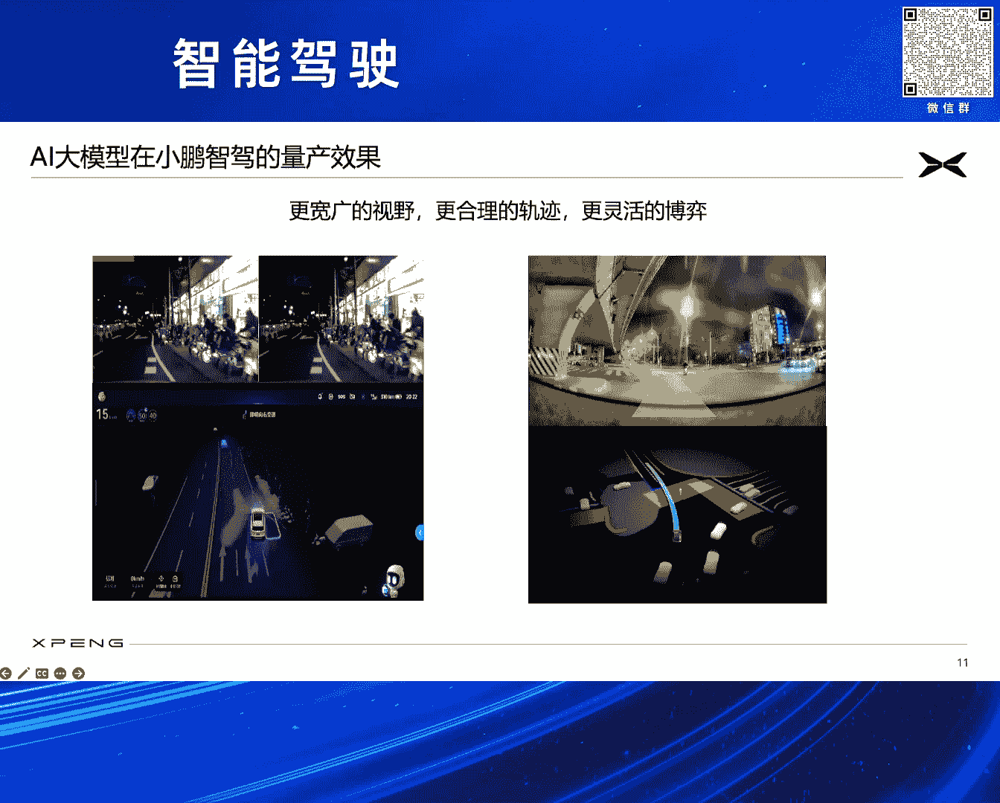

项目过来，我们还在一个立交桥下，场景非常复杂，但是我们通过大模型能力做出一个非常自然，非常流畅流畅的左转路径，所总结来说，爱达模型通过我们在实际实车量产，这都是已经我们经量产的技术。

可以看到它在感知的视野，轨迹的合理性以及博弈方面，都具有非常非常强大的一个优势，可以是一个跨越式的进展。

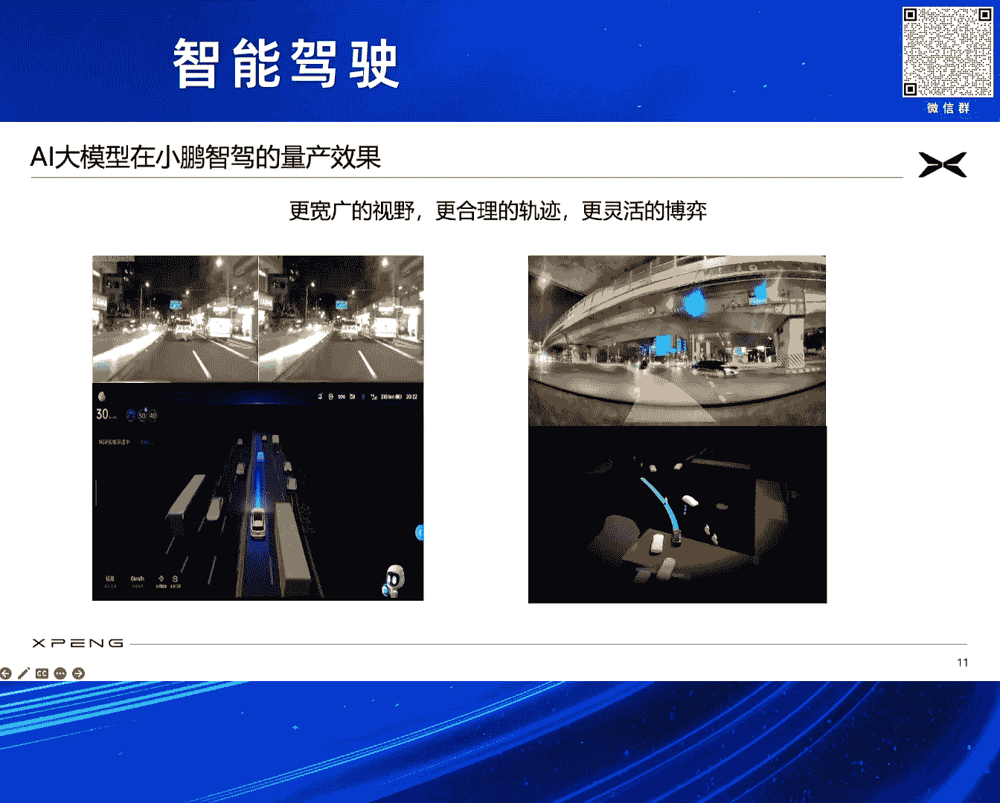

然后除了刚才提到的我们的行车之外，AI大模型其实现在全方位赋能，我们赋能我们小鹏的其他一些支架能力，比如说我们的AI泊车，我们现在也是做了全球首个量产的，离车薄入和迎宾出库。

我们对于一些通用障碍物的识别，如果你要离车泊入的话，那么如何去保证更好的安全性，嗯包括如何对车位更好的感知等等，对所有的路径的规划，泊车速度的提升，包括我们的AI代驾。

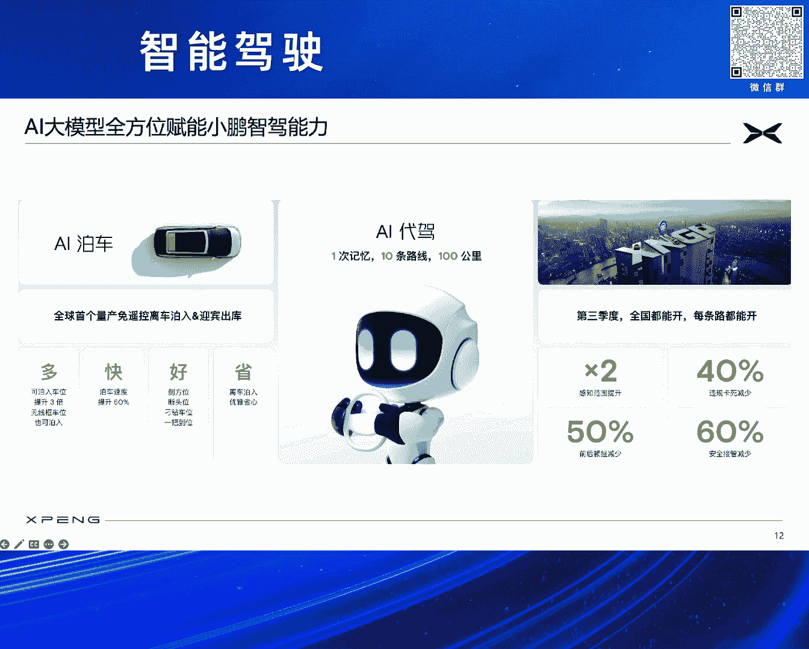

这里要讲一下AI代价，AI代驾呢是我们整个来讲的话，可能小鹏汽车现在唯一一个大规模量产的，在主机上面量产的技术，就现在很多很多的这个产业界的朋友友商，他们都是在做这样的呃城市NOA。

但我们小鹏除了我们XNGP之外，我们还保留了AI代价这样的一条线，它其实我们考虑到用户的习惯不一样，用户会千人千面，有千面有需求，尤其有些特别难的一些小路，可能客户的习惯怎么去选择。

他会做出一些可能通过深度学习，需要积累大量的数据才能学出来这些东西，所以这样通用化和泛化性其实是有挑战，所以我们允许让客户自己开一遍，然后把它记下来，通过一些云端的对客户习惯的学习。

通过一些大模型的加持，可以让这条路线走的漂很漂亮，我们现在已经可以知这爱代驾行为，每个客户可以允许它支持G10条路线，每条路线的长度可以达到100km，所以就意味着一个客户的一个旅程。

基本上可以由AI代价全部都付出起来了，同时我们现在基于现在我们大模型的加持，我们在未来的OTA也会对客户这个更新，我们无图XNGP的最新版本，会保证在全季第三季度时候，全国都能开，每条路都能开。

可以让我们的安全接管，我们的违规卡死，各种各样不被各种些其他车违规，导致我们的卡死，不是我们的违被卡死，就我们经常可以遇到他车停在那里成为障碍车，会保证这些方面的，整个的这个KPI都会有大幅度的提升嗯。

同时我们认为I大模型可以提高更大的机会，就像说我们刚才也跟大家报告过，我们的I大模型一直在迭代，一直在演进，那我们相信在2025年的时候，我们通在AI大模型的加持下。

我们可以在中国实现类L4级的智能驾驶体验，因为说到L级主目录，它有大量的规则，章程，安全考虑等等，就我们只说他的能力，可以达到一个非常拟人的一个地步，然后同时我们在海外再进行，对应的一些技术测试。

我们也希望因为我们小鹏汽车也在出海，希望我们能够，我们把这把我们的支架技术带到国外去，带到海外去，能够共同促进这个行业的发展和繁荣。

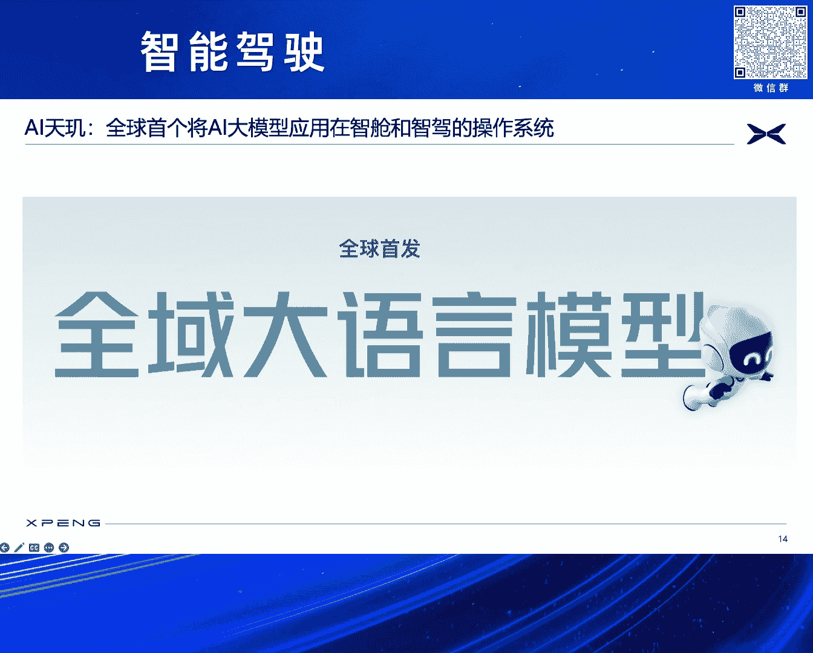

下面再跟大家快快速报告一下，就是我们I大模型的另外一个应用应用领域，就是AI天机，就是我们在最近的这个全量发布的OTA里面，已经把AI大模型应用在了智能座舱的领域。

所说已经实现了全球首发的全域的大语言模型，在智能座舱上的落地，我们可以看到呢，就说我们现在的AI天机小P，以前呢大家都知道小鹏汽车，我们的语音助手叫做小P，其实这个有点异曲同工之处吧，就是像苹果那边。

他的他把他的SIRI通过大模型进行加持，但这个事情，其实我们在之前520正式发布的时候错了，我们现在的小P里面，也经过了我们合作伙伴和我们一起共研的一些，在云端一些大模型，以及车端一些离线大模型的加持。

可以实现百科全书，用餐馆用车管家小批创作，包括对前方的目标物体识别，各种提醒等等，各种拟人动作等等方面的一个全方位的提升啊，这个的话也是我们在座舱领域的一个一个使用，这里面有一个小P的一个demo。

因为这不是说模式打开了，对我们并没有搞一个特别酷炫的东西，而说就是从客户的普通的场景来看，理解客户想要干什么，中关村再去望京，再去首都机场，再去国贸，再去北京西站，好，正在为你规划路线。

这样的话就是通过以上的这几块可以看到，我们在AI大模型，在我们的智能驾驶到智能座舱，都有了大量的这个量产，已经量产，它不是计划量产，已经量产的实践，那么可以看一下我们正在做的是什么，大家可以知道。

就最近小鹏也有我们一个新，带来了一个新的物种，就是我们的MONA03，MONA的M03这样的一个智能纯电的，非常漂亮的掀背轿跑，在这里其实也是借这个场合打一个广告，我们有一个新的车型马上要上市。

我们也希望通过这些车型能够做这个AI试驾，汽车的全球开创者及普及者，我们相信在大模型的加持之下，整个智能驾驶领域，会就是这个相当于获得了一个呃跃升，的一个非常重大历史机遇机遇。

我们愿意和产业行业的同仁一起共同携手努力，把我们这个国家，我们行业所有的科技发展水平和用户使用体验，再推上一个台阶。

