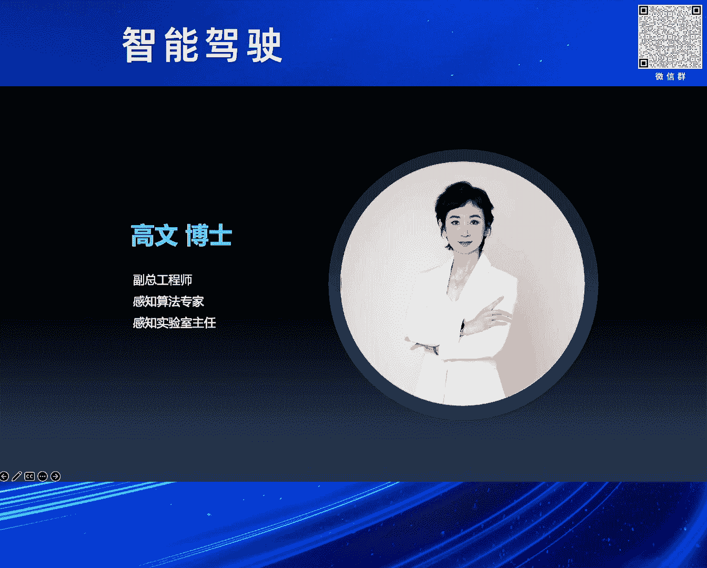
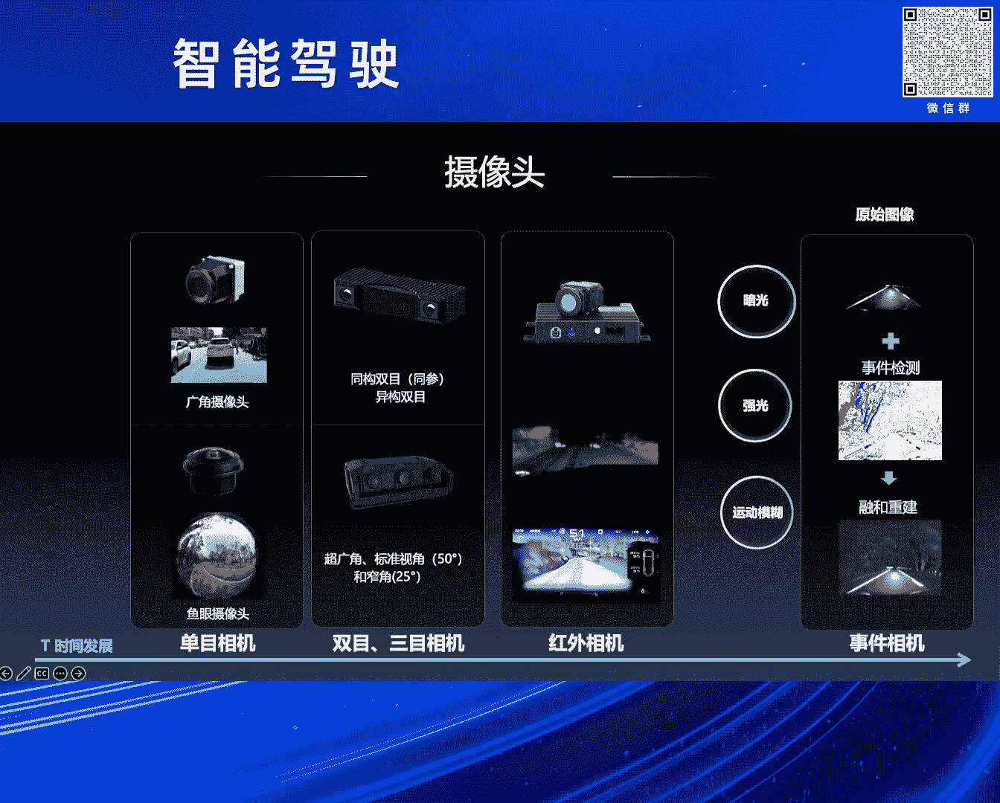
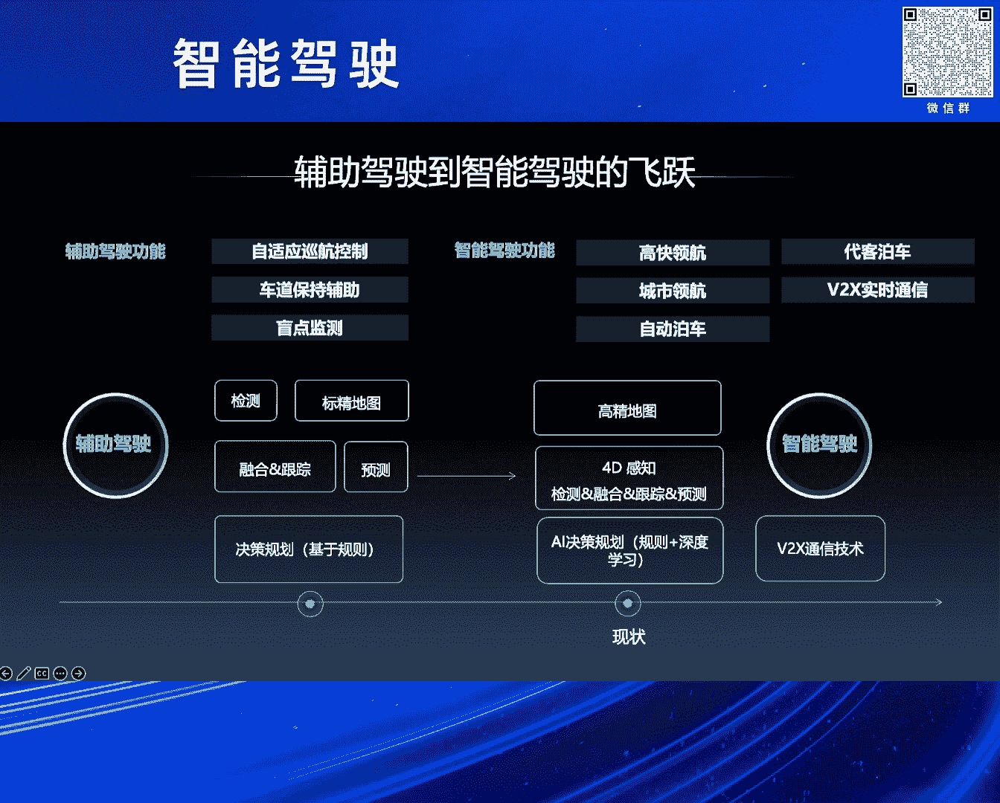
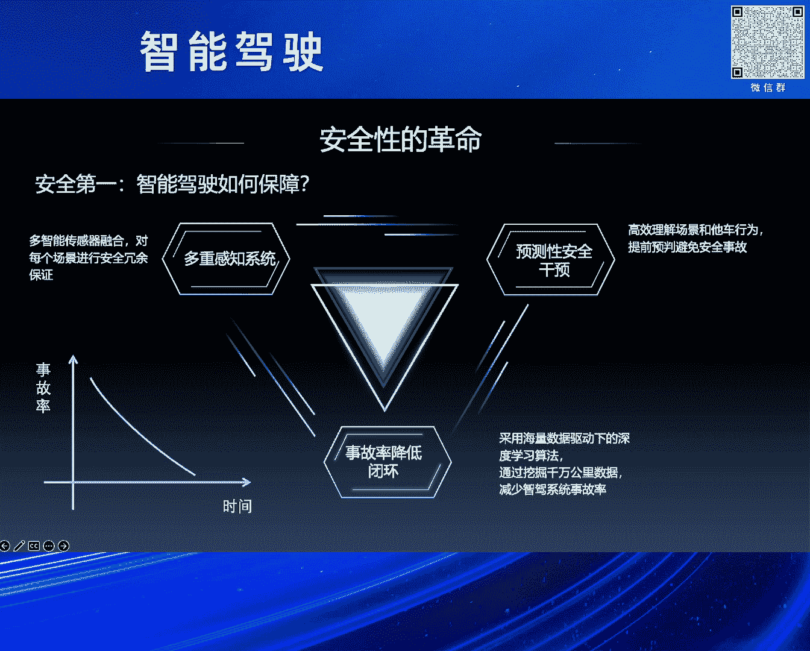
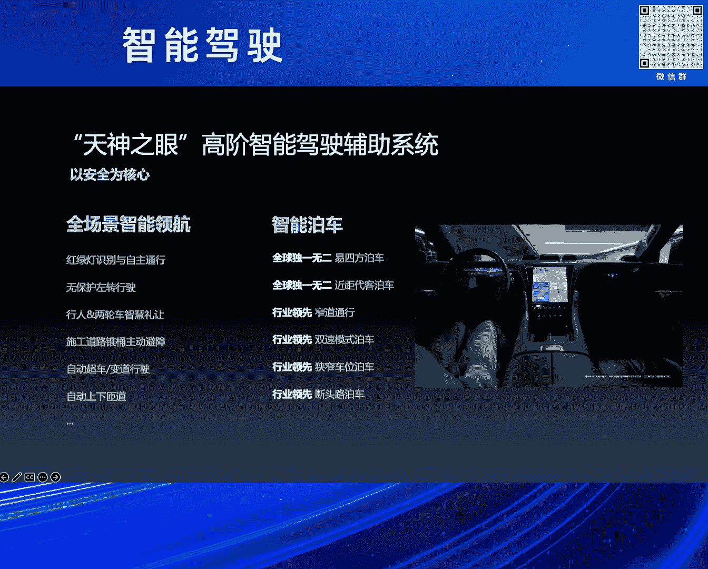

# 2024北京智源大会-智能驾驶 - P4：比亚迪智驾与智舱开发工作实践：高 文 - 智源社区 - BV1Ww4m1a7gr

呃首先感谢刘主任的介绍以及组委会的邀请，呃很高兴与大家相聚在致远，呃，刚才首先黄教授先讲了这个人类对于呃，驾驶任务的这个完成，刚才也说了，人类是先有了这个完整的一个认知，然后经过特殊的50小时的训练。

就可以在没有训练过的道路上完成驾驶的任务，然后同时又说了大模型思维在智驾的呃作用，以及对未来的展望，然后法旺主任呢，刚才也有对智能驾驶汽车的这个产业，应用的现状以及方向进行了同步，然后呃梁总和马总呢。

在呃长安汽车和这个小鹏的相关的支架，还有AI大模型的实践进行了分享，然后很高兴，今天由我带来，比亚迪在智驾和座舱开发工作方面的，这个实践分享。

呃从1876年，奥托发明了这个往复活塞式四冲程内燃机，到1985年，本次发明了世界上第一辆汽车，再到八六呃，1886年，戴姆勒成功发明了世界上第一辆四轮汽车，汽车从诞生之初，它的使命呢是代步工具。

那么经过了138年的发展，汽车的产品呢属性增加了很多，其中有两个最重要的就是安全和体验，那么它的使命也变成了兼具智慧的，有温度的伙伴，下面我将从三方面进行相应的分享，第一部分感知传感。

我们和车作为一个整体，要感知什么呢，大概分为三个方面，第一个是环境方面的感知，感知道路交通标识，障碍物，交通参与者动等动静态的这个目标，做到看得清环境，第二呢是自身的感知自车的位置，速度，方向位资。

以及驾驶员和乘用车乘车人的呃，生理和心理状态呃，动作手势，语音空气等，做到看得清自己，第三呢是物联感知实时的路况呃，道路信息，行人信息等等，车路云看得清交通，那么说到感知就不得不说一下传感器。

以摄像头为代表的视觉传感器呃，基纳斯还有v two x的定位传感器，以及激光雷达，毫米波，超声波雷达的这个雷达传感器以及麦克风压力，还有嗅觉的呃，感官传感器以及呃惯性测量呃单元，还有这个角编码器等等。

这些姿态传感器共同构成了感知传感链，呃车载摄像头从市场角，普段等多方面的多方向的发展，以提升探测距离，弱光环境的适应能力以及动态响应的速度，从单目的基础识别演进到了双目的立体测距。

在集成红外成像应对夜间的这个场景，到引入事件相机，快速捕捉动态变化，逐渐增强智能驾驶的感知能力。

毫米波的发展呢，从发展的里程碑和技术的里程碑，两个角度上来讲，发展的萌芽期可以从追溯到1940年，开始于实验室，主要应用于军工领域，呃，发开发期呢从上世纪80年代，各国呢积极投入研发。

尤其是欧美普及期呢，在呃毫米波雷达呢进入了这个应用阶段，中国起步虽然比较晚，但是现在已经逐渐的国产化技术里程碑，共经历了七代的这个迭代的过程，工艺上从碳化身到转化硅再到西茅斯的进化，性能越来越优。

集成度呢也更好，体积越来越小，重量越来越轻，从测距测速加上水平角的3D，再到测距测速水平和俯仰角的4D，再到测速测距水平俯仰角，再加上抗干扰的4。5D，角度的分辨率呢越来越高，抗干扰能力也越来越强。

呃激光雷达呢利用脉冲激光的飞行时间，进行物体距离的探测，从20世纪60年代，休斯实验室研制出了世界上第一台激光器，到80年代加入了这个扫描机构，一直到2005年，第二届无人无人车挑战大赛上。

参赛车辆上出现了360度的多线束，旋转式激光雷达，以及五个单线激光雷达的方案，七支完赛队伍中，有六支都搭载了64线的，这种旋转式的激光雷达，激光雷达自此一战成名，到2017年。

全球第一款车规级激光雷达量产交付，是一个四线的一维转镜的方案，2022年，国产的半固态激光雷达量产，价格呢也逐渐的走下了神坛，激光雷达正在向千元内迈进呃，同时呢功能上进行了相应的细分，有前视补盲。

然后还有这种呃像素级空间分辨率的呃，高线数呃，长距的激光雷达经过了这20年的发展，从光场生成方式到收发单元的这个技术路线呃，也也趋于收敛，但是flash固态还有OPA以及FMCW等技术。

也仍在蓬勃的发展，第二部分智能驾驶功能以及相应的趋势，智能驾驶从定位感知，规划到通信技术，都进行了全面的革新和技术的更迭，从减少驾驶负担到逐渐释放双手，技术的每一步进步。

都是向着更安全更智能的方向迈进了一大步，智能驾驶技术以预防为主，通过全天候监控和即时响应，为用户编织出一张无形的安全网。

DEPLOT智能驾驶辅助系统，以天神之眼为设计理念，安全为设计初衷，依托先进的电子电气架构和全站自研能力，为智驾提出整车系统及解决方案，实现整车全场景的陪伴，辅助和救助，以安全为核心。

结合电机云年等控制技术，做到起步制动更平稳，大曲流，弯道更丝滑，全场景的智能领航，全球独一无二的E4方泊车，行业领先的窄道通行，双速泊车模式，以及断头路泊车等，为用户带来了极致舒适和极致安全。

行业上普遍理解的L3有别于L2的功能要求，而安全要求是控制的冗余，仰望U8E4方，不但实现了控制冗余，而且还实现了机械冗余，E4方概念车是行业首款无制动装置，无转向柱结构，无转向电机的汽车。

实现了驱动制动和转向三合一，行业首次实现，车辆在传统制动和转向系统都失效的情况下，仍具备制动和转向的能力，体现了强大的E4方机械冗余能力，超越了L3级别的冗余要求，因此仰望U8。

成为全球首款具备L3技术底座的量产车，最后智能显示，为增强安全以及车内娱乐和人机交互，带来的新方式，舱内的显示屏从最开始的仪表演进到了中控，副驾后排呃空调，还有这个车门旋钮上面等等，这些是从体验出发的。

那么补充驾驶视野的盲区的透明A柱，以及减少视野遮挡，增强夜视感知效果的电子后视镜，以及避免驾驶员视线从前方行驶切换到中控，增加驾驶风险，以将显示信息投影到呃，驾驶员前市区的这个HUD显示与现实相结合。

带来的AI导航增强显示以及多功能补盲等，都是极致安全的体验呃，全息投影显示技术在紧急情况下，将虚拟方向盘和其他操作设备投影到必要位置，驾乘人员在全息空间操控汽车，确保车辆的安全。

让主驾副驾以及后排空间共享屏幕，让欢乐与喜悦在家庭之间传递，完美兼容手机生态，让车载应用不再困难，实现人车手机互联，让交互不再存在隔阂，通过3D显示技术打造沉浸体验，让汽车成为用户的第三生活空间。

混合实现呃技术打破现实和虚拟的边界，给用户带来前所未有的科幻感受，从未来科技驶入现实，1995年的译制片霹雳游侠，片中的这个cat不仅像很多电影里的车一样，无坚不摧，同时会说多国的方言和呃。

多国的语言和方言陪你悲伤和快乐，可以完全接管汽车，自动驾驶是一个兼具智慧和温度的伙伴，那段每周日两集的这个译制片，不仅打开了我们的想象和对未来的无尽憧憬，也教会了我们正义和勇敢创造。

霹雳游侠里面的KATE是很多人儿时的梦想，那时没有物联网，那么在霹雳游侠KATE的这个自动驾驶，有温度的人机交互，对环境的感知追踪，营造的立体的多维感官监测以及氛围提醒，与现在的物联网联相结合。

这将是梦想的升级版，汽车不再是以硬件为主的工业化产品，也是一个自学习，自进化，自成长的软硬兼备的智能化终端，心有所信方能远行，让我们汽车人一道共同努力，创造美好的明天。

