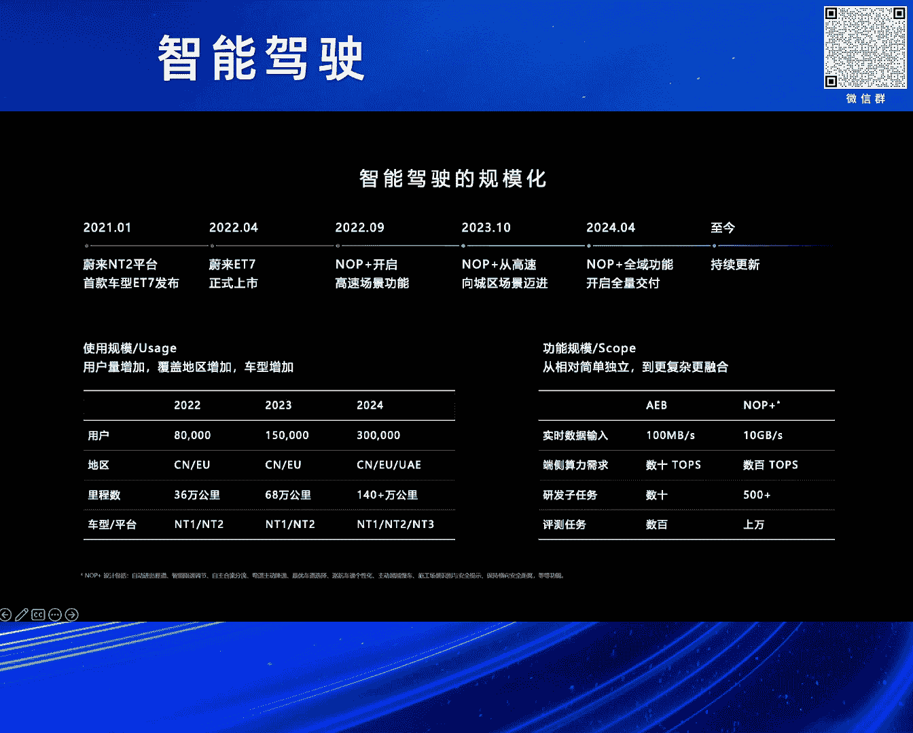
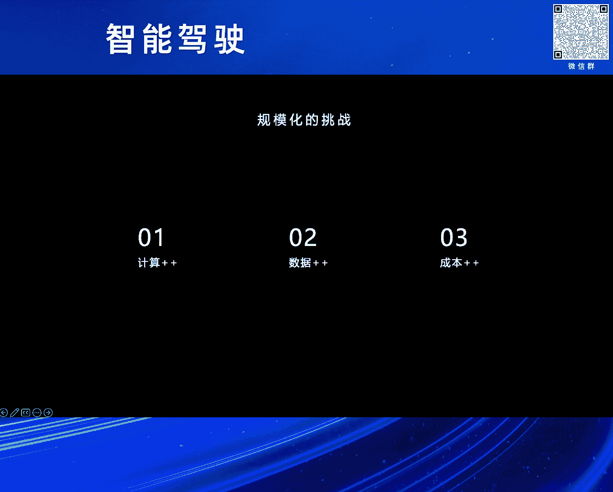
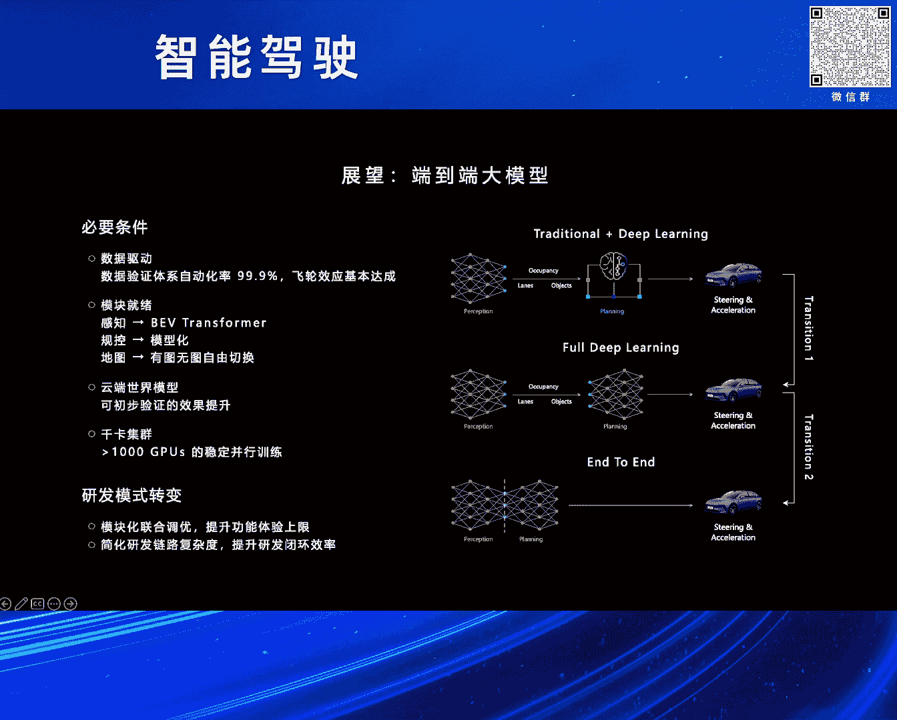
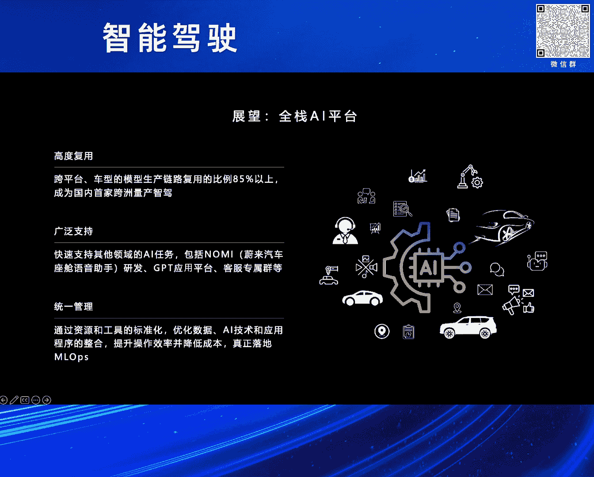
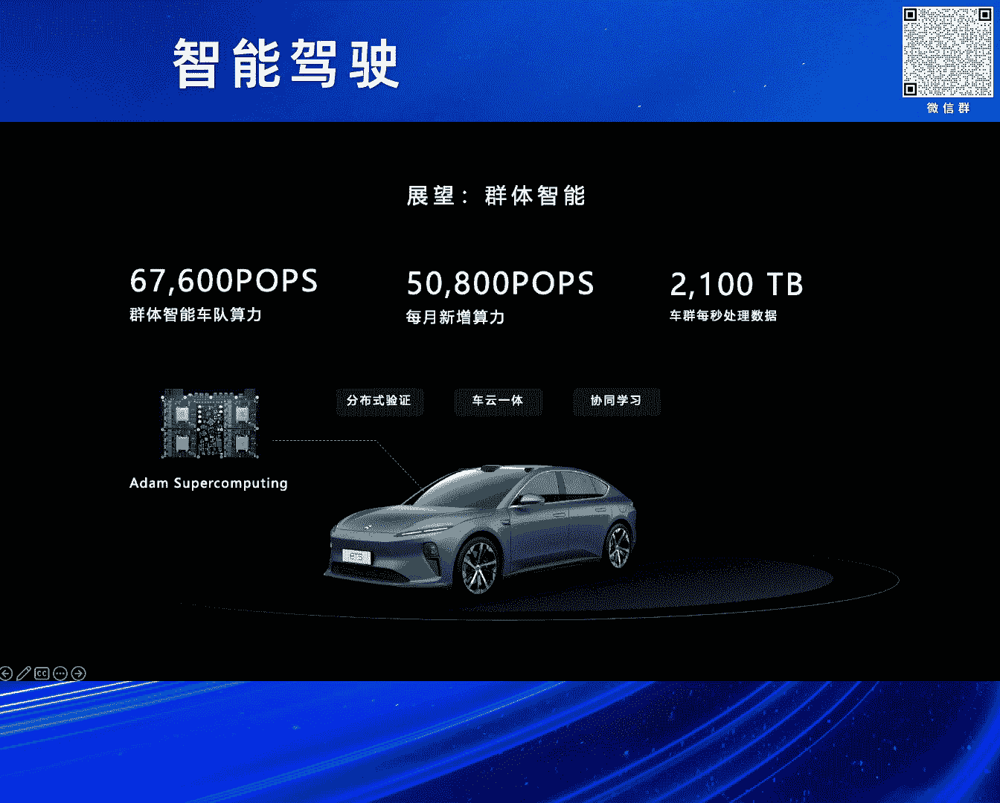

# 2024北京智源大会-智能驾驶 - P5：自动驾驶大规模应用的挑战及展望：白宇利 - 智源社区 - BV1Ww4m1a7gr

首先感谢那个组委会的邀请，然后也感谢刘主任的介绍，那呃各位下午好，然后我是来自未来人工智能平台的白羽丽，很开心呢，今天下午有机会跟大家一起交流呃，自动驾驶，聊一聊这个大规模应用下的这个呃挑战和展望，对。

可能我我这个这个风格，跟其他前面几位有点不太一样，然后还是比较偏向于说，这个量产的工程落地没有那么学术，然后时间也比较简短，然后呢，我先简单介绍一下未来汽车和未来智能驾驶。

那未来汽车是一家全球领先的电动汽车品牌，那我们致力于为用户创造愉悦的生活方式，对那未来智能驾驶的，当然我以下的时候称，就未来智驾旨在呃解放精力，减少事故，提供安全放松的点到点智能驾驶体验。

那在2023年，汽车界最权威的这个安全测试机构呃，un un cap启用了新规，其中主动安全新的百余项的这个场景之下呢，未来支架也表现出色，然后助力于未来，成为这个首个达成五星安全评评估的。

这个汽车品牌，那下面呢我也介绍一下整个未来支架的组成，主要包含里边四个部分，那包含感知系统，车单超算核心的算法以及整车平台，在这里边呢我们要首这个着重的时候介绍两块，一块是大家刚才也提到的这个感知系统。

那在未来的这个整个感知系统里边，是拥有33个高性能传感器，那分辨率是一个非常高的一个状态，而且全系标配了激光流激光雷达，另外呢是说在车端的超算，那未来也是第第一家在车上边时，全系标配了四颗奥瑞X的芯片。

然后算力总量是达到1016tops，那第二代整车平台NT2。0呢，我们全系标配了这个配置，那不光在当前，包括在现在，那都可以说是重新定义了量产车的，这个智能驾驶的系统，树立了高端支架新的标准。

那接下来呢我想呃介绍几个这个呃，未来支架的一些时间点啊，可能有些同事是并不太清楚对，那我们在2021年的1月，未来发布了NTR的首款车ET7，那其实标志着未来从这个呃走向了全站自研。

智能驾驶的一个新的时代，那2022年的4月，ET7上市，我们仅仅用了一年多的时间，就交付了智能驾驶的功能，同年的9月，然后我们在o p plus，在高速的场景里边是也开始了交付。

在2023年的呃10月份，NO p plus从高速拓展到城区嗯，到4月呢，那全域的领航辅助，我们就向所有的NTR的车主全量推送了，那所以从一个全量推送的过程呢，那我们仅仅花了六个月。

而特斯拉的FSD啊整整花费了3年的时间，当然我们还在这个持续的更新，也不断的在优化着我们智能驾驶的这个技术，和它功能体验，既然今天要讲这个大规模应用的挑战，那我们首先定义一下呢，大规模是什么。

那我在想大规模主要是有两个呃方面的含义啊，一个是说在使用规模上面，另外的呢就是在功能范围上，那首先说从用户量上边啊，那在我们第二大平台，用户量从2022年的8万，2023年的15万。

然后进而的时候到现在2024年的时候，预计的时候应该远远超于30万，基本上我们每年翻一番，那第二的话是说从这个覆盖的范围和区域上，那我们在2022年的话呢，ET7在中国交付。

同年其实我们即在欧洲完成了交付，那2324年我们进一步的时候，也拓展了欧洲多个国家，然后包括呃也有新增的中东的地区，对那再次的时候我们在聊的是里程，从22年呢高速成快，然后大概是36万公里。

那到23年10月份发这个，我们发布城区的时候呢，目标是六十六十八万公里，对那如今我们可以痊愈的领航辅助，这个可用里程已经超过了140万公里，最后呢那我们要讲的是车型和平台，那在2021年以前。

我们的n T1的平台，那也是经典的，在在未来的886的车型，到22年我们新增了n t two，对然后呢在这里边的时候，我们现在九款在售的全系车型，都已经更新到了第二代的车载平台上。

那24年我们搭载的NT3的自研平台的，这个第二未来第二品牌乐道也即将开始交付，对那这些都是从我们讲说这个呃量和维度上面，那我们说从功能上变未来支架体系，那我们也开在这里边开始支持多个车型。

然后新老平台的三代平台的同台，多个国家，多个公的这个多个区域上的功能交付，挑战其实非常大的，那我们去看说从呃功能规模，从最简单的功能独立功能，到我们后边复杂的更融合的系统，例如我们经常谈到的AEB。

就是自动紧急制动的这样的功能，当我们发展到现在的NO p plus，全域领航辅助的功能，那从最开始数据每秒钟的时候，百这个百兆B的这个大小到现在的时候，我们可以每秒产生的数据十十G大B对。

那10G大B每秒相当于什么呢，一秒钟看完两部4K的电影，那我们端测的算力也是呃急剧的在增长，从最开始的时候可能大家都知道的时候，比如说那可能都小于实实实这个实体套，这是10top4的这样的算力。

到现在那在整个未来的呃，未来的车车载上面是进有这个千体，这就是上千TOS对在这个算力规模之下，其实跑一个100B的大语言模型都绰绰有余，那我们的这个车载平台，是完全有能力来去支持的，那从研发任务。

那以前的时候研发任务可能小到几十项对吧，大到上现在大到上百项，从最开始那我们感知唱片的时候，在车辆行人障碍物的检测，到现在大家开始去聊这种GOAAES，然后MAI这种复杂的融合系统。

那其实从功能上面都是一个大幅的这个提升，对那从评测任务最开始的时候呢，小到几百，现在大到上万，总不光是这种评测的种类多，那验证的里程的时候也是要求的，逐渐的时候去增加，说到这里呢，大家可能会想说。

这么大的规模，这么多的场景，这背后需要有有有哪些挑战对吧，然后我们以及怎么来去支持，这么大的这个这个场景的变化，那接下来的时候，我刚我将跟大家一起的时候去深入探讨说。

那在未来我们再怎么应对这样的问题的，对咳，就我我给后边的时候分为这么几呃，这部分挑战的时候分为几块的值来去讨论啊，主要是分为计算啊，那数据和成本我们先说一下这个计算的挑战吧。

对那未来自动驾驶研发每天要进行数百个实验，数千次的构建，数10万次这个数10万个挖掘的任务的执行，那这些都与这些高并发的任务，都与说都需要一个非常强大的呃，计算平台来去支持。

那我们自己自研的高性能计算平台，能够支撑什么，200万次任任务的这个日间峰值的吞吐，并且可以支持说瞬时瞬时的并发的时候，超过1。5万个节点对，那大家也在讲说天下武功唯快不破。

从发现问题到解决问到解决问题，发布这个版本，那更短周期的迭代是我们一直优化的目标，那为了解决这个这个超大型任务的性能瓶颈，我们自己也设计并研发了一套大规模，分布式的集，这个训练集群，计算集群吧。

那在这个集群里边的时候，我们可以做到单任务量级的时候，是超过EFLOS的，那我觉得这个啊行业里边事大家也都可以知道，说具体的总量我就不讲了，但是这个集群一定是在支架行业里边，是top规模的。

当然在规模之外的话，我觉得前面的侄儿像小鹏同时也提到了，说那规模在规模之外，其性能和稳定性是这里边非常重要的，那我们在这里边的时候，整个训练集群性能也是非常好的，那以我们在云端这个空间大模型。

那我们能做到训练加速比的时候，达到91%，有效的训练时长的时候大于98%，当然为了支持这样高性能的训练集群，我们也需要上下游的组件上面的支持，为此的时候我们也啊有这样的自研的，我们认为说缓存的系统咳。

那以以缓存系统为例的话，那我们可以做到横向的扩展性能的时候，能超过同类商业的这样的存储软件的，这个将近四倍，那整整体在支架的研发任务差异是非常大的，然后又在不同的硬件上面跑。

如何让他们都能高效的合理的运行，也是需要花费巨大的时间来去优化的，那我们可以通过性能优化providing工具，然后包括这种协同优化，那我们可以通过实现这种异构的调度，任务的拆分和传输的优化。

包括这种流水线并行，然后多方面的努力，那我们都可以去动态的去，把这个这个负载均衡做好，大幅的提升整体的这个有效利用率，当然强大的算力的时候只是一方面啊，那没有大量的数据的支持计算。

其实就无从谈起，那支架的场景的话，我愿意给它简单分成三类的数据吧，那一类的时候我们称之为训练数据，然后那一部分时候我们称之为这个验证数据，还有一部分称之为反馈的数据嗯，对于训练的数据。

那随着这个自动驾驶的发展，每年对数据的需求都是几十倍的增长，那在三这3年以来的时候呢，我们就有近万倍的增长，那量产车上面的海量数据，海量高质量的数据呢，那我说在未来支架的是未来支架的这个护城河。

那每秒钟产生PB级的数据，让我们从来不担心这个数据的供应，但是如何通过自动化的产线，自动化的标注对吧，能使得这些数据参与到云端的模型的训，练和功能迭代之中，那是要面临的难题，对为此的时候。

我们其实在这里边也建立了，500多种标准化的标注工艺，然后100多条自动化的产线，通过云端的世界模型，参与到这个自动化流程之中，将整个标注的这个自动化效率，时候提升到三个九以上。

那第二块的时候我在讲的时候是验证数据呃，像刚才前面的同事也讲到说，那其实对于整车上边的测试是一个非常复杂的，那对于尤其对于软件测试，大家嗯传统的测试模式，最终功能还是要上实车验证的。

那方法大多数呢是通过这种自建车队，那而如今那我们认为说有多版本，快节奏的并行验证的需求之下，那区区的几百辆车的话是远远不能满足需求的，那为此的话我们NO p plus，我以这个为例吧。

就是我们在开城透路里边呃，那一般情况下是要一个城一个城的开，然后开完之后的时候用这车去验证，但是我们可以结合自有的车队车上边的时候，一块奥顿的芯片接，用这种群体智能的方式。

未来在未来在这里边时候用非常快，额外的这一颗芯片呢，用群体智能规模化优势的是，大批量验证了这些道路的可用性，原定于这种三个月要去验证的，NOP的开通透露的任务，那我们缩短到这个更短的这个时间就能完成。

在在这个之在这里呢，当然我们也要强调一下，说那在这个呃，我们认为说大规模，10万量级规模的这些种并行测测试任务，对于平台的压力是什么呢，那我们需要说能在小时级别，这在这这里面我们能做到四个小时级别。

这种10万规模的车辆，98%的任务下发的成功率，立刻能展开这种测试的任务，数据验证也无需回传到云端，那大幅的去提升这种验证的效率和数，这个数据成本，这个这个数据传输的成本降低，对。

那我们群体智能可以同时支持，150万的验证任务的并行并行测试，那每日可以验证的里程数超过1500万公里，最后要讲的是反馈数据，那量产车每天能产生数百万条的接管事件，潜在接管事件。

那但是如何去有效的时候去完成筛选和压缩，将最有价值的数据上传到云端，并且通过这种自动化的分析，然后是数据闭环里面时，其实最关键的一步啊，那我们通过车端复杂的这种价值筛选，算法和缓存机制。

将万分之一最有价值的数据上传到云端，进行分析，并且在这里边时候，我们去通过5%以上的自动的分拣率，然后能去促使反馈迭代的这个数据飞轮，真正的能去运转起来，当然行业总会调侃说这个未来的研发成本高。

但我们实际上在研发过程中的时候，还是非常在意这个成本效率的，因为我们知道说，长期主义需要这个建立在短期成本可行性上的，因此我们说在研发上的这个巨大投入，并不是无节制无节制的支出。

那而是说对长期技术布局的，这个重要的一个要求，那面对着说这种百倍的算力的需求，我们打通了说这个车端边缘计算的能力，使得端端云的总算力达到26000000000ops，这个算力规模相当于什么呢。

相当于100个分布式的千卡的计算集群，那通过我们车端的计算和筛选生命周期的管理，那我们通过车端的缓存和数据压缩的技术，可以大大的减少数据回传量，降低这里边的流量成本，另外呢我们在讲说呃。

支架的研发周期周期性很强，波动很大，碰到发版的时候，大家一定都遇到过说这种资源上的这个波峰，那未来人工智能平台在规划之初，就是一个混合云的架构，那我们在自研的支架这个智算中心之外。

也加设了多个这个混合云的节点，能通过弹性的上云，分时的定价来去优化这个调度，有效的将这个波峰波谷能控制到10%以下，对最后呢我们要讲说研发任务的种类多，节奏快，如何去平衡这种研发交付和资源的有效利用。

解决资源就占用高，但是利用低的这问题，那我们通过多维的成本分析的工具和运营机制，有效地将研发的价值和资源，利用率的时候去做了关联，通过运营机制，那我们每年能在这里边时优化运这个研发，运营成本是数千万元。

在这里面我要表达的是，就是很很大程度上，然后做相同的事情，用一倍的成本跟用一半的成本，那它是完全不一样的，研发体系，对于研发成本的在意，本质上是对技术上边的，我们认为更高的要求，谈完了这个挑战。

我们也可以展望未来，那用在脚踏实地的同时，我们也仰望星空，自动驾驶的发展也充满了无限的可能，接下来呢我愿意分享几个关键方向的一些看法，包括端到端的大模型，全站的AI平台以及群体智能技术。

就第一点的话呢，端到端大模型大家听得很多，但是呢呃它不是什么灵丹妙药，如果目以目前的这个模型架构上，只能做到70分，那你无法通过说把这个端到端大模型上了车，然后就能做到100分。

因为这说明说你现在的工程效率还远没有，使你的模型架构达到上限，问题还很多啊，其次呢现在的模型架构转换也无法实现，并不是一夜之间的事就能完成的任务，在我看来，要去做得到大大模型。

需要满足以下几个关键的先决条件咳，首先是说数据飞轮，大家讲这个数据飞轮讲的很多，但落地效果好的寥寥无几，飞轮真的转起来了吗，里面核心的就是说数据验证体系的自动化率，然后呢。

我认为说在这里边是至少要能达到三个九以上，才能飞吧对吧，在各个模块上边也是，那尤其大家在讲端到端之前的时候，硅控是不是能全面的模型化了对吧，然后感知是不是可以上BEV transformer，去量产了。

地图，是不是可以实现有图无图的全面，这个自由的切换，那另外的时候我们在讲大模型，我们更愿意给它定义为云端的环境模型，云端的世界模型，那在这里边模型架构和研发方式的转变，需要有初步能去初步验证。

并且把模型应用到研发和验证流程之中，发挥作用，最后的时候我们要讲千卡集群包，包括我刚才看说有有有同事引引用了，马斯克的一个一个推特，然后呢我最近也在看，在6月4号的时候。

马斯克在社交媒体里面讲讲了一件事情，就是特斯拉在部署英伟达芯片，想要部署英伟达芯片来去使用它，但是呢那没有地方，然后他们就放置在仓库里面，后来呢特斯拉也在这个新的德州的工厂里边，开了这个新的空间。

用于容纳5万片H100的芯片，用于FSD的训练，那5万片H100对大家来讲只是听起来很疯狂，那我们说如果想要去做端到端大模型，1万块100总是需要的，那在这里边，如果你不能做到千卡级别的并行训练。

那万卡的训练基本是不可能的，那举举我前边的例子，在我们优化之前，千卡的训练，千卡训练的有效时长的时候只有85%，加速比呢只有60%，那考虑考虑这种故障率和加速比，万卡的真实性能。

在这乘上去的时候就只有1200卡不到了，那但是有效的训练时长提升到98%，加速比提高提高到91%，这样才有可能扩展到万卡，大概的时候也能做到一个这个八九千卡的，这样的规模，我们才能才能去使用它。

那毋庸置疑，在数据量足够大的情况之下，算力也足够充足的情况之下，端到端模，端到端模块的联合优化，是有可能整体去提供系统功能和体验上限的，但是正如千卡和万卡的例子一样。

如果没有很好的工程化的这个效率和质量，端到端带来的这个研发链路的简化闭环，这个闭环效率的红利，其实都会被低效的工程效率去吃掉了，对。

那后边的时候第二块的时候要讲AI平台，那在呃不仅在这个智能驾驶的这个大背景之下，最近我们也看说大语言模型也出圈了，对那AI平台开始更多广泛的去关注和讨论，那随着这种基础模型的能力的通用化。

那我们也看到了一个机会，就是全站的AI研发平台的可能性，那全站的AI平台，我我理解，不不仅仅可以支持自动驾驶的研发任务，最近我们还支持了集团之内的那像NOI，也就是未来内部的智能座舱的助手。

还有内部的NEOGPT的应用平台，客服专属群，那正如我们可以跨平台，跨地区多车型的这种模型模型产线交付一样，那实现了85%以上的模块的复复用度，让我们也成为国内第一个，可以跨州量产支架的汽车企业。

在2022年的3月国产，我们在国内这个量产的ET7，交付了自研的NOP的功能，在同年的9月，然后我们智驾算法就上线了欧洲的这个ET7，并且建立了功能安全，智能安全等大规模的量产的能力。

这也得益于说我们有高度可以复用的，全站的AI能力，对咳全站AI的平台统一管理，去优化数据AI技术应用的整合，提升了效率，并且降低了它的整个研发成本，才能真正实现我们所谓的m l ops。

大家也应该知道说，m l off在绝大绝大多数企业落地的时候，其实并不是都不是特别好，因为一个好的研发工具，在我们看来，不仅仅要适应于企业内部的研发流程，还应该去适应于它的不同的阶段。

生搬硬套的去把这些工具强塞给，这个企业的AI研发里面是不太现实的，那在我们去设计AI的全站的AI平台，特别是注重它的灵活性和适应性能，确保说在满足各个阶段的需求，就像是说建一个高效的一个引擎。

各个部件可以完美的配合，可以有效的最大限度上面提升它的性能和效率。

在2023年9月，未来第一次的未来科技日，然后我们第一次介绍了群体智能的技术，那群体智能是未来智能驾驶技术，未来发展的重要的方向，未来群体智能具备强大的计算能力，达到6700000000offs。

那能够每秒处理2。1PB的数据，通过优化这种并发和实验，一定程度上我们实现了真正的车云一体化，进行分布式的验证和协同学习，也正如我前面提到的那，在AEB的道路验证NO p plus。

全这种全域领航开成拓路，包括世界大模型的数据迭代上，那群体智能都发挥了其强大优势，和无限的无限的潜力，它让我们量产的功能可以持续的高效的迭代，不断的为用户提供更安全，更舒适，更加个性化的支架功能体验。

就像说在赛车队的这个在赛道上，可以通过协同的作战实现最佳的战绩，那我们量产车队也可以通过这种协同学习，不断的进步和提升，我们也相信在不远的将来，那我们自己的自研芯片进一步的去整合，去定制这些功能和能力。

以推动智能驾驶和通用AI的技术的发展，让我们去设想，那智驾智能这个支架的汽车，在没有支架的同时候，其余时间也是可以进行推理计算的，那通过闲时复用，将算力共享给其他智能应用，就像分布式的云一样。

那将智能驾驶乃至这将为整个智能驾驶，乃至整个人工智能行业，带来巨大的这个算力的提升，那真正的实现车联网和云计算的结合，那我今天的分享就到这里结束，那感谢大家聆听，最后的时候。

我给大家这个一一部小小的影片，让大家感受一下，说我们在呃未来如何去做这个呃智能驾驶。

包括他们的结果是怎么样的，感谢大家，领航开始，即将开始领航换电。

