# 2024北京智源大会-智能驾驶 - P6：自动驾驶3.0时代，大模型重塑汽车智能化路线：贺 翔 - 智源社区 - BV1Ww4m1a7gr

感谢法王主任，感谢志源的邀请啊，今天有机会能给呃各位嘉宾分享一下，我们在那个自动驾驶大模型方面的，一些实践经验，我觉得刚刚访华主任有一点，所以我非常的赞同啊，前面几位数啊，主机厂侍卫讲了很多。

修了很多肌肉，做了很多牛逼的东西，但是好像讲的不够透彻是吧，我们作为供应商，我们就把最干货，最底层的东西全部抛出来了，尤其我们过去几年，在整个大模型方面探索中遇到的一些问题。

走过的一些弯路也一并贡献出来是吧，希望能对大家有一些呃启发或者帮助吧，对，我们根据过去几年，整个自动驾驶发展的这么一个历程，把整个自动驾驶的这个呃技术的演进路线，分为了三个阶段。

第一个阶段我们称之为一个硬件驱动是吧，大家主要是靠堆激光雷达，那第二个阶段，其实呃现在绝大部分公司可能处在第二个阶段，就是用一些小的数据，小的模型去解决感知啊，认知道决策规划的这么的问题。

那么接下来我们判断是说未来是一个3。0，我们称之为数据驱动，它的核心特点就是大数据，大数理大模型是吧，其实刚刚很多那个呃呃，前面的老师也讲到了这一块。

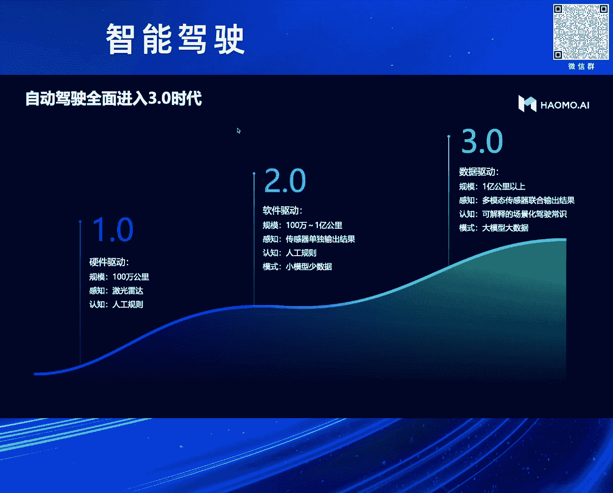

那么在3。0时代，我们更应该去做什么呢是吧，刚才讲到三个关键词，说大的数据，大的模型和大的算力，那么今天会主要跟大家分享一下，我们整个的大模型到到底是怎么做的，以及具体这个大模型我们怎样去做。

我们整个的数据系统，然后算力这块我们在这就不详细讲了，因为这个我们之前已经讲过很多次了，那么大模型这一块，其实去年也是在资源的会上。

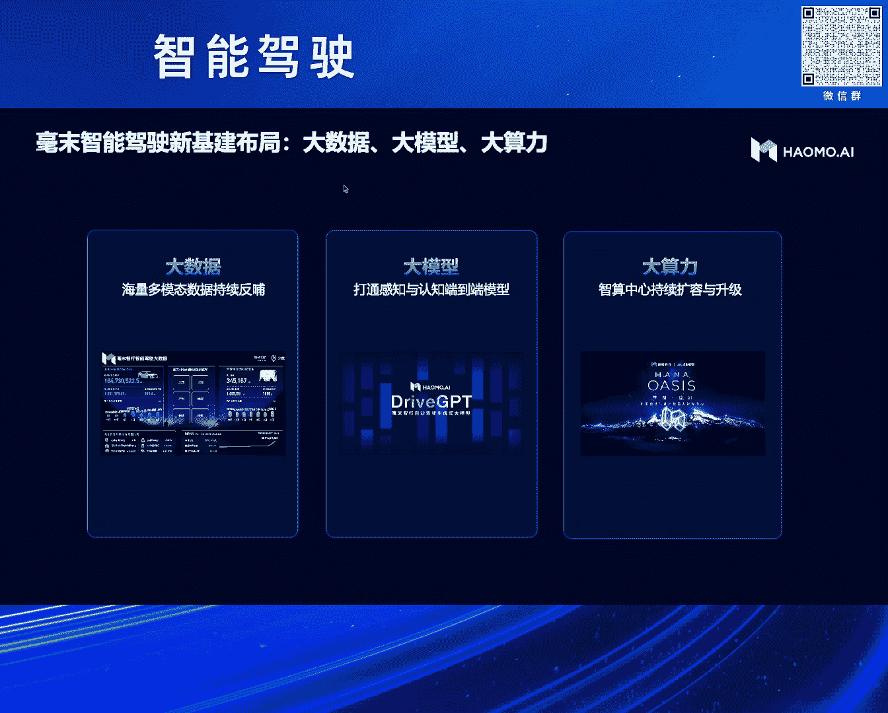

我们公布了，我们当时的那个自动驾驶的大模型的，我们称之为现在可以称之为1。0版本吧，当时我们是业界，应该是第一家，使用深层式技术来做自动驾驶大模型的，这么一个方案呃。

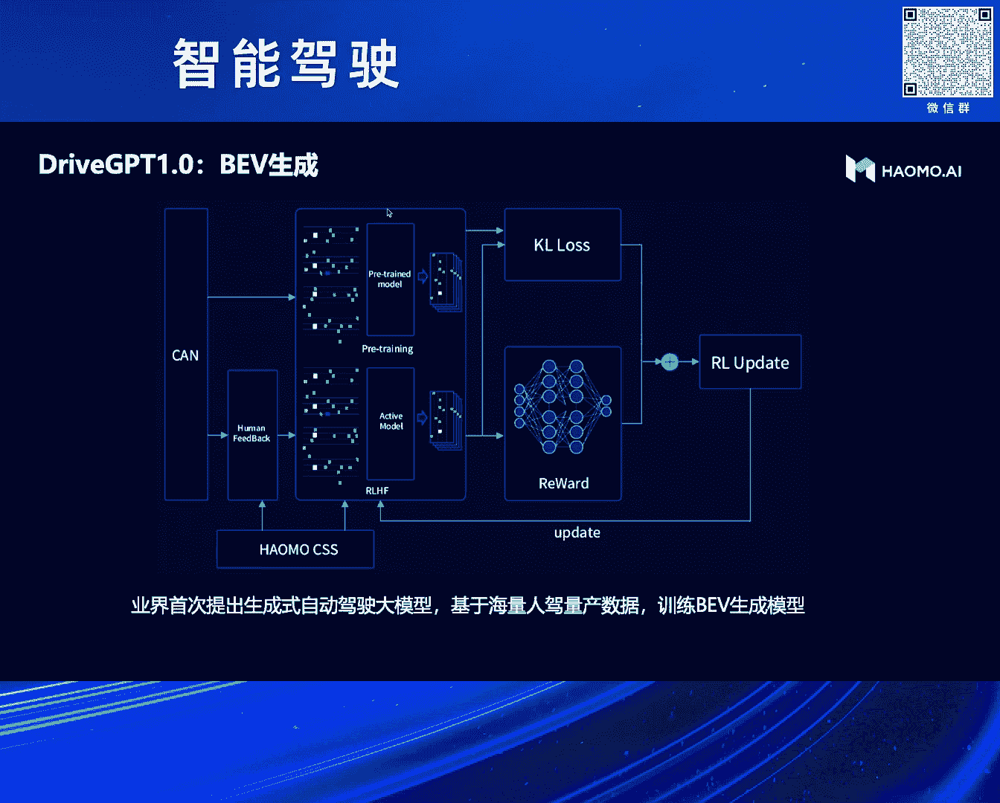

为什么我们会走到这条路呢，我们现在先呃留一个悬念啊，我们最后我们会给大家回顾一下，我们整个的研发的历史，以及我们怎么样是走上这条路来的，那么这条路我们选中了啊，通过深层式方式。

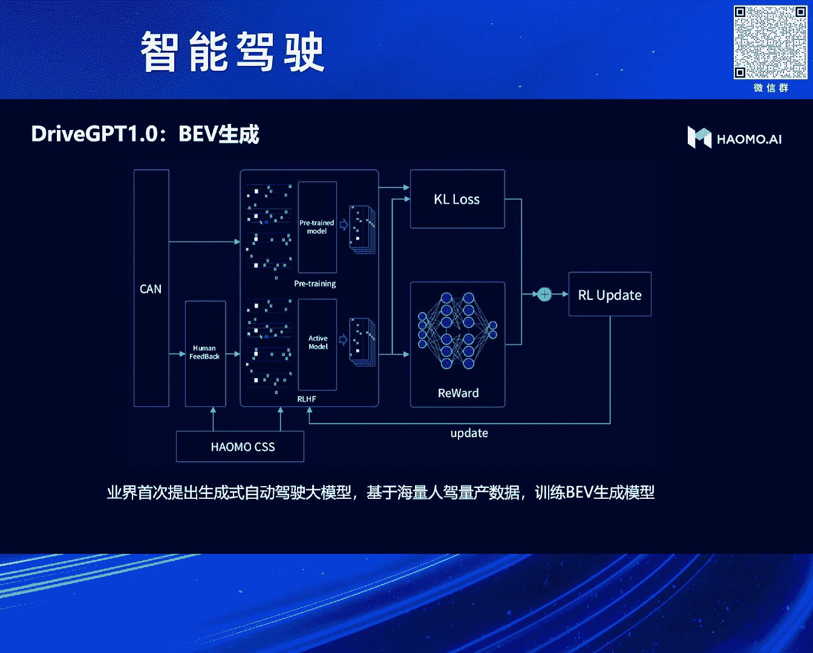

而且是通过BEV生产的方式来解决，自动驾驶问题，那么在研发的过程中，我们也发现了很多的问题对吧，开始我们可能把这个问题想的简单了，我们觉得因为我们大量的量产车在外面开，在全国各地开会。

传各种各样的数据是吧，我们天真的就以为说，我只要有大量的这样的数据，然后把它看到的世界表达成一个BEV的视图，然后通过深层次的大模型，把未来的BEV生成出来是吧，我只要能把未来的BEB预测出来。

我自动驾驶的任务就解决了。

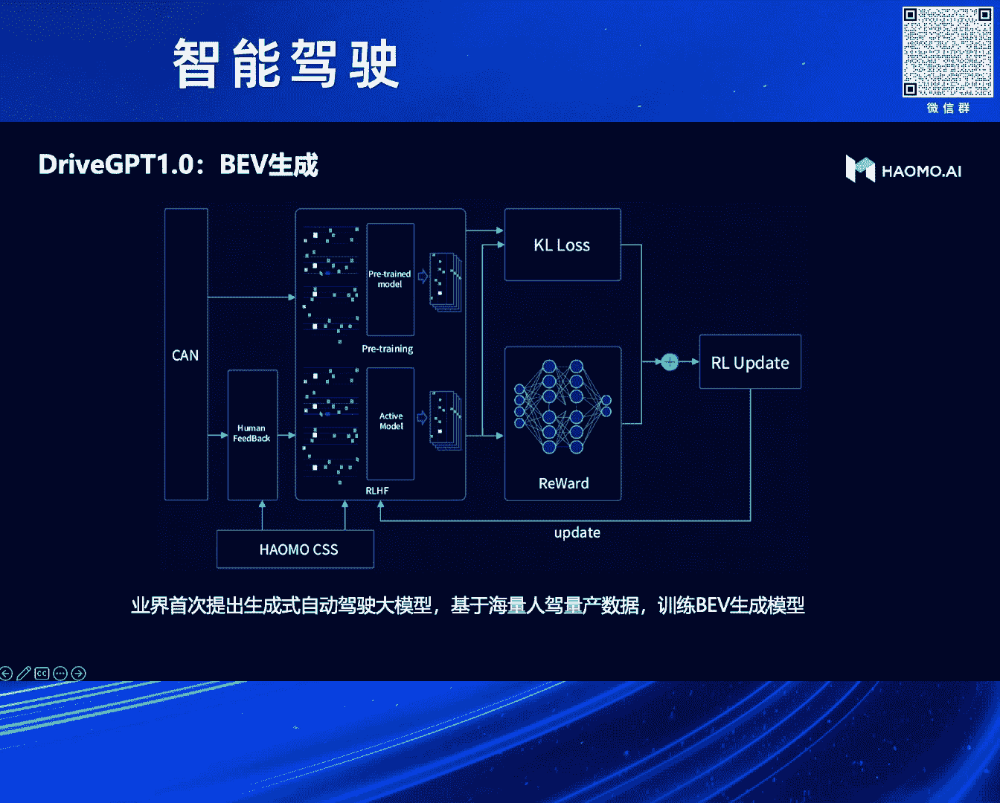

那么实际上在训练的过程中，我们花了大概有半年的时间吧，呃训练的过程中遇到了很多的问题，这些问题主要包括两个，第一个是说，因为你采用的数据是量产回传的数据，它有它先天的优势，就是右边的。

也有它先先天的弱势，就是左边的呃，它先天弱势在于说，因为你不可能用量产车来回传海量的视频数据，这个成本是比较高的，我们没有办法去承受这么高的成本，所以我们回传的是感知的结果，当然也会回传一些视频数据。

这些数据肯定是在特定的处罚条件下才会出来，所以我们回传的海量的数据，基本上是感知的结果，然后有了感知的结果，有了实际的驾驶动作之后，我们就可以把这两个合在一起，做那个深程师的学习。

但是我们很很很遗憾的发现，我们的量产车的数据，回传的感知结果其实并不完美，对于我们后面去做那种想要一学，一个非常牛的这种老司机的这种驾驶决策出来，是有很多的限制的，比如说我在举了一个非常非常常见的例子。

这基本上呃呃哪都能碰得到，就是我们在城里头车开到这种城，进入城市AA之后，我们会发现城里的车道线其实并不那么清晰，因为他经常磨来磨去是吧，都磨没了，尤其是在光照条件，比如逆光这样的环境下。

他根本就可能原传统的感知技术，可能做的不够好，它回收的车道线就不好是吧，那你基于这样不好的感知结果，再去虚拟后面的那支角色，其实就会有先天不足是吧，那么它的好处就是说右边确实我们看得到。

这是我们真实的数据，我们的车卖出去之后是在全国各地开的，也是它的数据的分布确实非常非常的好，有地域的分布，然后我们把这些数据拿出来，又重新看了一下它的场景的分布，其实也是非常非常好的。

就是各种各样的场景你都能遇得到，那么这个数据非常好的，是一个好事，同时我觉得也是一个巨大的挑战，刚才大家也讲到了，说呃特斯拉训这个呃DUANGDUANG的大模型，花了差不多100亿美金是吧。

那我们作为一家小公司，新西兰不可能干这样的事是吧，所以我们想到是说面对这么复杂的场景，你要训出来一个特别牛的老司机，你真正的降低成本的方式在哪里是吧，你人家花100亿美金，你能不能花1亿人民币是吧。

这个挑战是比较大的，那么具体怎么做的呢，我们先把这个任务定义清除出，我们到底要干嘛，这是我们训完1。0之后，遇到这些问题之后，我们重新去思考了一下，这个自动驾驶的大模型究竟应该去干什么事情。

我们把它分成了三个阶段，第一个阶段就说根据我们之前对量产车回传来，感知的效果不好的这么一个大的问题，我们觉得第一步，我们该先首先需要做一个通用的感知能力，为什么叫它这个通用的感知能力呢。

这个跟我们传统的，就是我们之前在车上已经卖出去的，这些量产的感知对比，它是一个完全不一样的东西，我们传统的感知大家都很清楚是吧，是基于标注来做的，我标了十类物体，那我就只能识别这十类是吧，没有标过的。

它就没有，那就也就不能回传是吧，所以我们希望通做的通用感知是说，它能跟我们的能量感知一样，它具备2D的能力，也就它能够看懂图片是吧，它具备3D的能力，它能够理解三维的空间。

同时它还能够加速时序变成一个4D的东西，最好它还能够识别万物，它不是一个只能够看懂图片纹理的，它能够识别弯，我知道这是什么东西是吧，跟我们人的感知是一样的，然后有了这样完美的感知之后。

你后面这个第二步我觉得做起来才是有价值的，那第二步我们希望做到什么什么的，我们希望是说在你有人类的感知之后，能够做到一个人类的驾驶决策，那么人类的价值角色，跟我们传统的价值角色有什么差异，它的差异。

我觉得最主要体现在说，我们大模型和小模型的一个很大的差异，我们希望这个认知决策是具备世界知识的，有时我们能够看懂或者理解，这个世界背后运作的规律是吧，这是个我们称之为世界知识。

能够看懂各种各样的驾驶场景，而不是人为的去定义各种各样的场景，以及定义各种各样的静态的规则是吧，能够具备这种推理的能力，我觉得这样才是真正具备一个老司机的，这么一个能力，然后这两个都做好了之后。

我们才有机会去把它们俩拼在一起，去做咚咚咚的训练，来提升整个全链条的这种全局的最最优先，所以我们在前面尝试过半年之后，就把我们整个的技术路线调整为这三个目标，那基于这样的目标，我们整体的那个架构的设计。

大概是分为这么一个阶段吧，的左边是我们的那个感知大模型，它实际上你可以简单的认为它是一个4D的，Encoder，就是为了把我是看到的事件，把它encode到一个4D的空间里头去。

然后右边是我们的那个内置决策对吧，这样我们只画了一个BEB的生成，就是我们有了这对这个世界的完美的认知之后，接下来就说我怎样能够把我这个看到的是，看到的信息，把它编码传递下去，让下游的那支角色。

能够知道我看到的世界长什么样子，并且我能够怎么样去利用好我看到的这些信息，来做出很好的驾驶决策是吧，这是我们整体的架构，那么刚才讲到，我们怎么样去降低我们整个的训练的成本呃。

我记得我们当时应该是在22年，我们去建我们的自创中心的时候，我们大致算了一下，如果我们要去做覆盖全国的，这种各种各样的场景，K4的训练，这种视频，比如100万个克利普，当时我们还不敢想。

有1000万个克利普啊，100万个克利普覆盖各种各样的场景，我们要去把它训练起来的话，我们当时算了一下，至少要1万卡，这个很显然我是要不到这么多钱的是吧，那怎么办，那还我们我们想到一个办法。

就是我们能不能去借助外界已经训练好的，这种大模型是吧，别人帮我们一把把，用他的卡，不把这个事情已经训练好了，我把它里面的东西挖出来就可以了嘛对吧，这是一条一条现实可行的，降低我们训练成本的这个道路。

所以我们在整个的这个自动驾驶大模型里面，引入了两个外挂，那么在感知大模型里面，我们有了一个多模态的大模型，它的目标就是实现刚才我们讲的识别万物，因为我们在这个呃图片编码的过程中。

可以很容易地借助外部的多模态大模型去对齐，我们的文本的特征，这样就相当于说我这个东西，不但能看懂图片纹理，也能够理解世界的万物，它是什么东西是吧，然后在后面那个我们讲到在内资决策里面，很重要的一点。

就是说，我们如果要训出一个像人类一样的老司机，他的必要条件就是它具备世界知识是吧，你能够看懂人类世界，你才能够像人类世界一样去开车是吧，你来个小狗小猫，你续再怎么训它也训不出老司机出来是吧。

小狗小猫也会开车，我觉得我前两天刷了个视频，就是个小狗在开车，我觉得挺有意思的，但他不可能像人类一样看懂人类的世界，他能够看懂交通报那个标志吗是吧，它能够看懂我们的路牌吗，很显然是不不行的。

那么这些信息在哪里，其实大语言模型里面都已经有了，我们的任务是说，能不能把这些信息从里面拽出来，我们利用好就可以了，那么通过这样的设计，我们就有信心说，我们只用几千块卡就能把这个事情搞定。

这也是我们我觉得国内的企业，在算力有限的前提下，可行的这么一条路线。

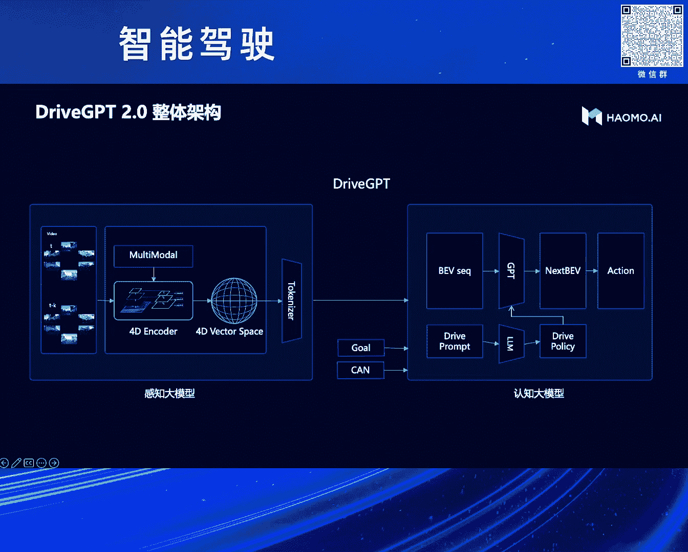

那么具体我们看一下左边整，我们整个的感知大模型大概是怎么做的啊，我们真的是把干货都给拉出来了是吧，左边是我们的那个最，左边是我们的那个呃，摄像头的数据直接输入进来，输入进来之后。

我们首先会有一个自监督的图片编码器，我们会把图片里面的纹理特征全部提取出来，也就这得到一个二维的编码，那么二维的编码之后，它是个图片的特征嘛，我们都会跟外界的那个动漫态大模型去对齐，也就是对齐完了之后。

那它就具备了那个识别万物的能力了，然后接下来我们会它会给它进行一个升维，变到变到三维空间，加上时序，实际上就是四维空间，那我们怎么去做这个事情呢，我们是用那个图片的下一帧预测啊，是视频的下一帧预测。

因为我们这个左边输入来的其实不是图片，是视频，它是一个序列是吧，我只要能够让这个模型去预测，我下一帧图片长什么样子，跟我的增值去对去做对比，如果他能够预测对的话，那这个模型一定是三维的。

因为在这个过程中，我这个车已经往前开了一段距离了是吧，所以通过这种方式来预测，我们通过乐福的方式，把图片的下一帧给渲染出来，然后跟我们的真实图片去做对比，那这强制的这个模型学会了我们的4G的空间。

那这样的话我们就真正做到了，像我们刚才讲的，像我们的人类一样，它具备能够看懂二维图片，看懂三维空间是吧，具备时序，而且能够识别万物，然后我们就通过这种方式，就得到了一个4D的编码的空间。

这个我们认为至少在现在看起来，是我达到我们所谓的完美感知的这么一个结果。

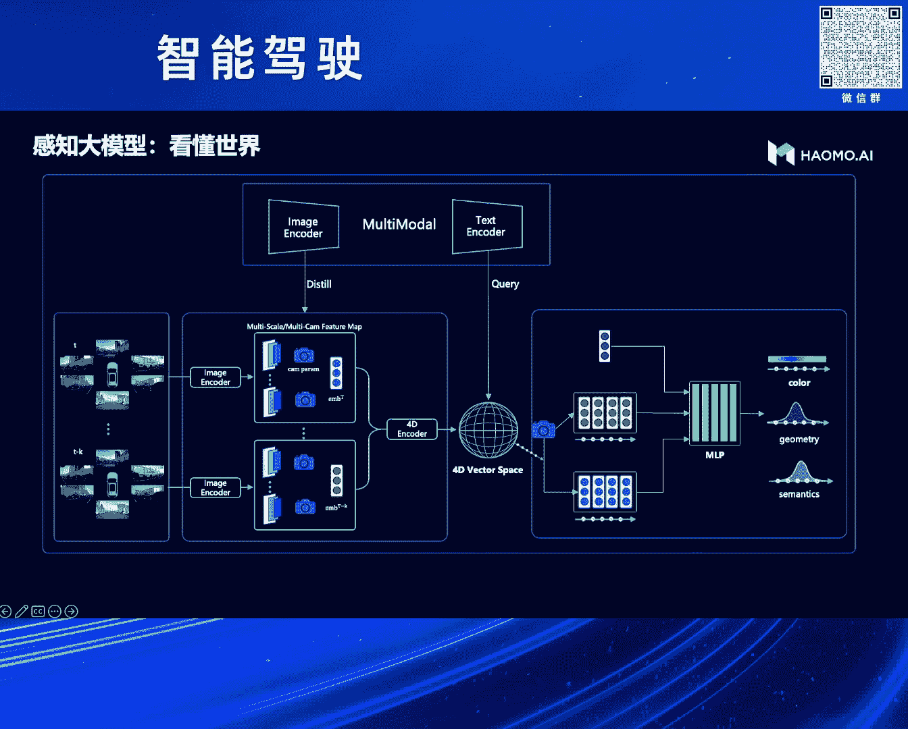

我们可以看一个我们的demo，这是我们实际的呃，车上回传的一个一一个数据，上面两个视频前面那个呃是上面那个是前四，下面那个是后视，因为呃地方有限啊，就就就放了两个，然后我们的模型可以输出这些东西呢。

左边是三维重建之后的结果，这里面是有两个图的，一个是上面那个是从上往下看，也就是两瞰图的视角把它拍扁了，其实就是B1B图，那么下面这个图是一个前视视角，有它在三维空间里，它是可以改变你的视角的。

然后当然也可以做语义的分割，也可以实现光流实现深度，如果跟雷达结合起来，就可以实现去做制度的标注了，4D的自动标注是吧，然后右边我们也给了一个非常常复杂的场景，这是一个绑定的。

应该绑定一个入口非常复杂的一个场景，我们可以看得到，我们在一个模型里面可以把分割语义光流是吧，那个深度全部搞定了。

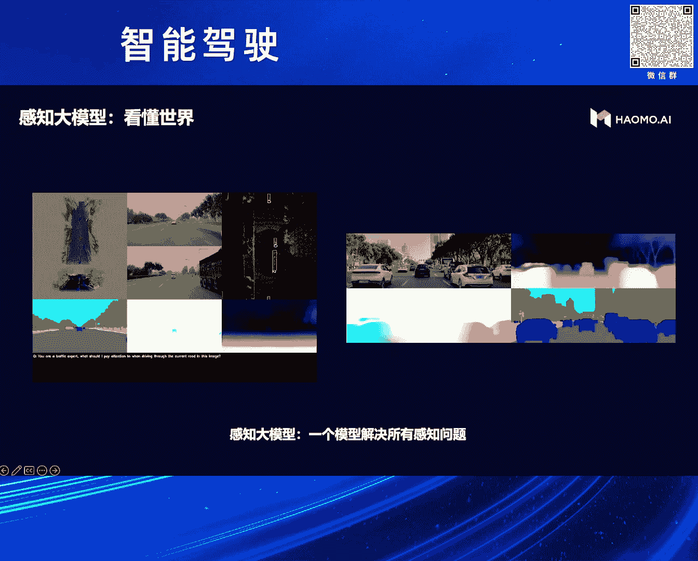

那刚才我们也讲到了，我们是呃交互GPT11。0是做的呃，BB的生成，我们还是沿用了这套思路，但是我们会把前面的那个输入换掉，之前我们训训练效果不好的原因，我们分析下来是说。

我们感知的结果是从量产车上回来的，而量产车的感知是基于传统的白名单的标注方，式来做的是吧，也就说它有世界上90%的东西，它是看不到的，它也当然无法回传是吧，所以我们把它换成了我们现在的完美感知。

然后有了这个完美感知之后，也就是我们把这个设计空间把它token换，也说刚才看到那个三维空间把它拍扁了，变成BEV，再把它token化，token化完了之后再丢进去，让它去生成未来的BEB。

那这样的话它生成的效果就会比原来好很多，同时我们刚才也讲到，我给它引入一个外挂，这个外挂就是大于大的语言模型，我们可以把我们感知模型看到的世世界，丢给这个大的语言模型。

那他来告诉我你看到的东西是什么是吧，然后你能不能给我一些驾驶的建议呃，相对于说我们的那个呃副驾驶坐了一个陪嫁，一个老司机，是吧，他可以给你去解释，你看到的世界是长什么样子，你应该采取什么样的决策。

通过这种方式，我们能够要大规模的降低我们训练的费用，就快速的使我们上面这个模型进行收敛。

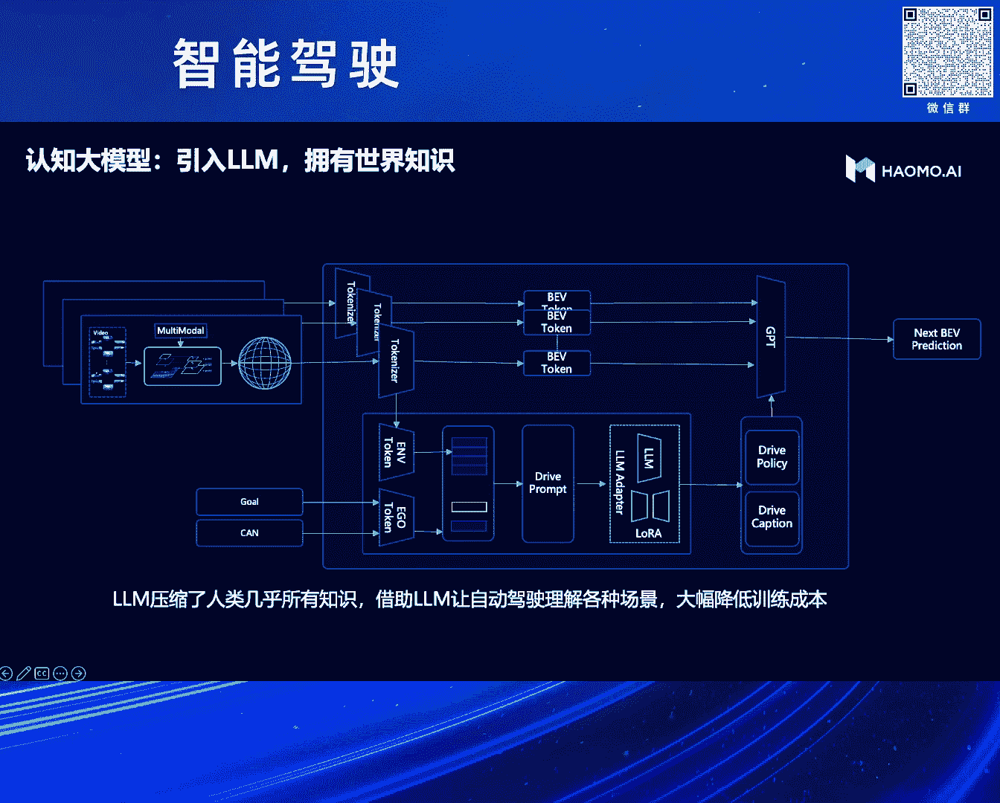

这也是我们一个实际的例子啊，我们找了一个比较复杂的路口，这些路口的标牌肯定都是人类世界的是吧，呃我们要看懂这些东西，如果纯粹采用自动驾驶的数据，这个讯起来是非常非常困难的，因为你没有人去标注。

上面这个标牌到底是个什么意思是吧，但是你借助大语言模型之后，你会发现这个事情很容易就拒绝了，呃当然这里面还是有一些问题啊，比如说他对汉字的理解可能不是特别好，但对于这种标牌的理解还是相当不错的。

各种各样的符号它的理解还是可以的，我觉得可能比很多的女士会懂得更多，呃我们今年又把这个任务进行了一些扩展啊，我们去年做了BEV呃，坦白讲这个思路我们走过了，有一定的效果，但是不够好是吧。

如果大家还想尝试，我觉得也可以，但是我觉得我们现在接下来，真正我们称之为这个自动驾驶基础模型脸，应该是下面两个，我们现在已经第二个已经做完了，我觉得就是刚才你讲，我们可以具具备图片生成的能力是吧。

我们主可以，现在是可以把这个中间的那个4G的空间，把它解码成图片的token，然后用这个GPT的方式去生成，我们下一帧的图片，而且是多V的，是个黄色的图片呃，这个任务看起来好像不难是吧。

但是实际上你真的去做，你就会发现很难，因为在呃那个我们跟收纳去对比，就发现了收纳为什么在自动驾驶好，你没办法用，首先它是单式的，它只有一个摄像头是吧，我们自动驾驶都是环视都一圈摄像头。

说他没有办法搞定这个事情，这是第一步，第二步是说他没有做到，没有办法做到时序，或者说物理空间上的三维空间上的一致性，这个问题我们留到了第三条路，我们现在正在呃做这个呃，难度是比较大的啊。

比如我们在生成图片之后，我们更希望的是说我们应该不是生成一个图片，图片是我们看到的一个表象而已，也就是这个现实世界，在我们眼睛里面一个投影而已，那我们真正的世界是怎么样呢，是个三维的是吧。

那我能不能直接把我们刚才编码的4G空间，把它变成3D的token，然后用GPT的方式来生成，未来世界的3D token，也是我们未来世界这个车往前开了2米之后，这个未来世界的3D脱口会变成什么样子。

这个才是我们真正要解决的核心问题，这个问题解决了之后，你才有可能去渲染出来多V的，保持空间一致性的，持续一致性的这种视频出来是吧，这个视频才对我们这种驾驶是有价值的，你可以用来做训练。

可以用来做测评是吧，如果没有这个东西，我觉得都是很困难的是吧，至少我目前没有看到，有合适的技术来解决这个问题。

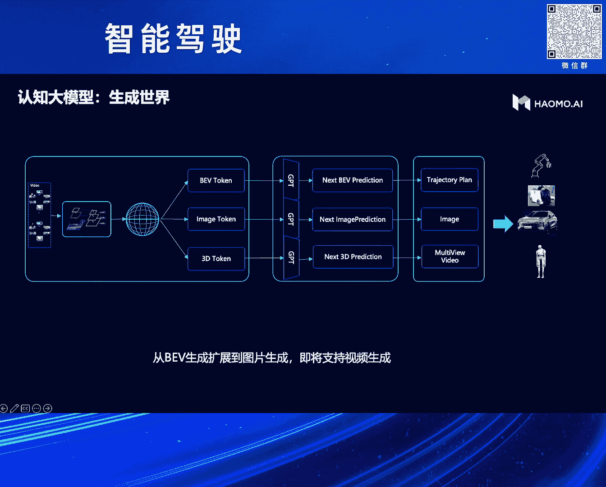

我们也可以来看一些，那个我们现在实际的一些demo，就这是我们早期做的那个BEV，生成的这么一个呃效果，就这是呃车上传回来的几个视频呃，左边是实际的BEV，就是我们感知的结果，把它拼成了一个BEV。

然后这个模型会把这个左边的BEB图输进去，那这个模型来预测未来的BEV会长什么样子，其实我觉得通过这种方式呃，已经可以解决自动驾驶的很多的问题了，然后这是我们多V的图片来生成的效果。

其实图片的生成效果已经非常的好了，嗯基本上如果不提示的话，是肉眼是很难分清楚哪些是生成的，哪些是假的是吧，那那那哪些是这真实的图片，其实只有文字在这里面是乱码，除了文字之外，别的我觉得你很难看出来。

就这里面生成的文字都是乱码，这个现在确确实还是一个一个，比较难以解决的问题，就内核的这种生存技术，目前在生成文字上，我目前还没有看到说能够生成一个交通标志牌，能够符合我们真正的像人写出来的汉字。

一样是吧，现在还没有，包括我们现在的那种交通标志牌啦，包括我们现在广告牌啦，生下来的文字其实都是乱码，这个目前还没有解决，我们还在呃公关中，然后视频那一块还没有啊，呃非常抱歉。

我们希望下一次能给大家带来多V的环视，视频的生成，那么接下来就讲到数据了是吧，我们刚才讲的是，我们整个的核心的大模型的制作，那么在这个大模型的呃，在上车之前，就目前而言。

我们现在大模型上车还是比较困难的，刚才也看到我们引入了多模态的大模型，说大语言模型，那参数量都很大，这个想放想要放到车上去，短期内还是比较困难的，那么在上车之前，我们主要是用这个大的模型来赋能。

我们云端的整个的工具链，这是我们整个的那个航母做的那个ma的呃，数据智能体系，我们从整个的数据的采集到数据的管理，数据的标注，数据的筛选是吧，数据的标签化等等，底层都是通过大模型来支持的。

有了大模型之后，你会发现传统的这种对数据的管理的工作，就会变得像我们跟ChatGPT交互一样，非常的简单轻松是吧，大幅度提高你的效率，我们可以看几个例子哈，这是呃我们去从我们的海量的那个图片里面。

比如110的图片，你要去找出一些collar case，比如六个灯走过斑马线是吧，你传统的方法你是很难去找的，比如传统我们打标签，你不可能打这样的标签是吧，那有了这种淡漠性之后。

因为他对可以对这些场景做一些文字的理解，那这样的话你可以输入输入任意文字，非常复杂的文字都它都可以去理解，然后非常精准的把你想要的那个图片找出来，比如这是呃有了大模型之后。

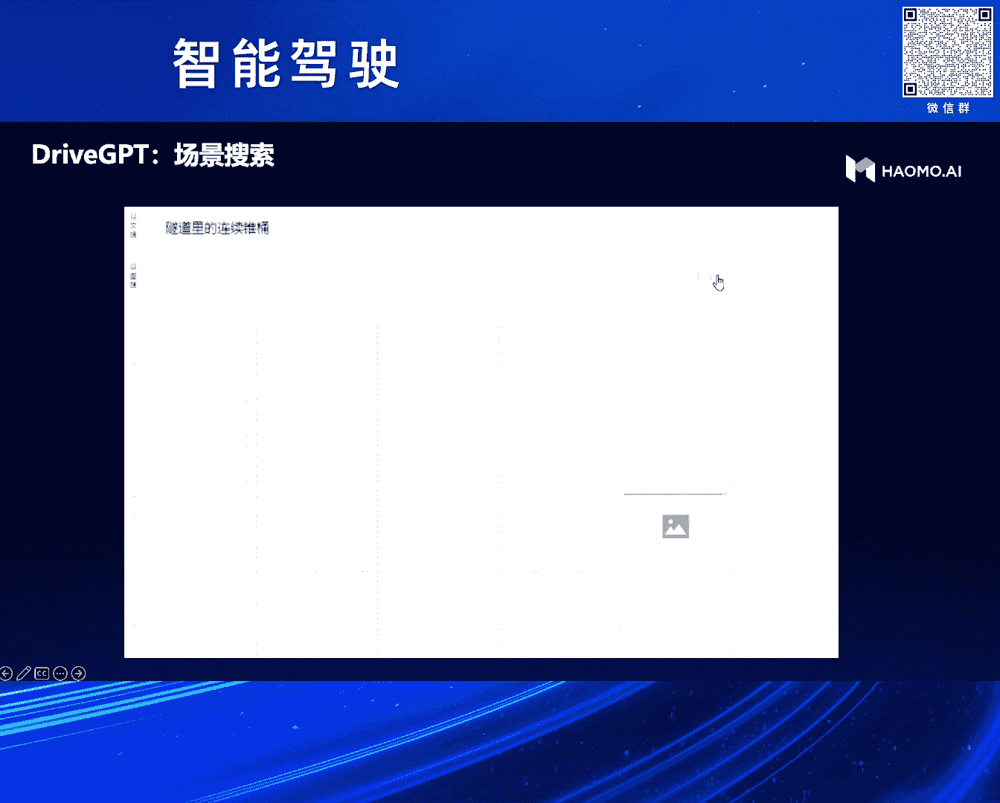

对整个数据筛选的这个这么一个体效，同样我们还可以去定向的生成数据，比如说我们可以任意画几条车道线，它就可以基于这条这几条车道线，来生成各种各样的数据，包括比如晴天的，雪天的，雨天的，雾天的都可以。

当然你也可以换，比如环岛可以换弯道都是可以的，那我们还可以对我们采集到的数据，做一些迁风格的迁移，比如说我们采到的一张数据，我们可以到可以把它变成不同的天气，不同的光照是吧，不同的纹理。

这样来丰富我们场景的数据，那这次引入大模型之后，我们可以对这个驾驶的场景做一些解释，我们可以看得出来就是说他对这种复杂的场景，他还是有一定的理解能力的，他可以告诉你。

虽然说这个呃呃可能还没有达到我们的预期啊，说实话还没有达到我们预期，但是它能够把几里面，交通里面的一些核心的元素已经告诉你了，通过这些它呃，呃从这个呃场景中提炼出来的一些价值的解释。

我们可以可以用这些价值解释来做很多的工作，比如说我们那个分丰富这个场景的那个特征，能够帮我们的PM去分析各种各样的场景是吧，能够对这些场景进行的聚类的筛选啊等等，啊这是我们一个实际的case。

就回到了最早我们看到的这个case，那么有了大模型之后，我们这个case是怎么去解决的，是吧啊，传统的感知肯定是这么差的，那么有了这个大毛蟹之后，我们首先会去检索同样的场景，比如说你输入一段话。

叫什么城市里面的这种模糊车道线，它它就会把所有的模糊车道线剪出来对吧，如果数据量够了，那没有问题，你直接去训就可以了，如果数据量不够，还我们还可以去做数据生成，你输入一个prompt就可以了。

它就可以按照你的方式来生成，各种各样类似场景的数据，然后用这些数据快速的去训练，就能够快速地解决这个问题，好了，最后我也给大家分享一下，我们整个的呃自动驾驶大模型的研发的历史，走过的一些弯路，呃。

其实我们从2022年就开始去做这个事情了，呃为什么我们会做这个事情呢，其实嗯也不是说什么呃，完全就是路径依赖，因为我们原来是干互联网的，在干互联网的过程中，其实这个东西已经用了很多了是吧。

互联网里面用这种强制风暴已经用了很多年了，那我们到了自动驾驶领域，自然也会想到是说这个自动驾驶领域，这个这个任务其实跟机器翻译没什么区别是吧，我输入的是一段一个序列图片序列是吧。

输出的实际上驾驶动作就是个机器翻译问题，所以我们最早就把乡村foo弄过来了，然后训练一个模型，训完之后发现，这个任务其实比机器翻译要难得多得多，所以我们就把这个任务稍微简化了一下。

就是我们把感知的结果就是把图片干掉了，我们能不能用感知的结果来训是吧，这样相对来说稍微简单一点，于是我们就引入了类似于BT这样的呃模型，就是我们把我们量产车回传的海量的数据，因为它是对齐的。

就它有感知的结果，也有司机的驾驶的动作，我们对齐之后就得到了天然的得到一个派对，那么我把司机的驾驶动作mask住，那这个bot来预测实际的驾驶动作，这个跟训练的模式跟bot是完全一样的，那训完了之后。

确实效果比那个原来我们直接用图片训，要好很多啊，但是这个模式其实也是有问题的，就是我们把这个驾驶的那个呃，动作的那个发生的那个原因，可能搞得稍微有有点错误吧，最后我们发现这个。

其实这个任务其实跟GPT是更像的，为什么这么说呢，因为我们真正的老司机，他是不是基于我现在看到的，也就不是基于我现在的感知结果，来做出驾驶决策的，它更多的是基于对未来的预测是吧。

我未来这个世界会可能会发生什么变化，比如我旁边那个车会不会出来加塞是吧，基于这些未来的预测来采取我驾驶动作的，所以这个预测就是个生成，所以我们很快的就把整个的那个技术站从bot，迁向了GPT。

通过这种生产的的方式，生成B1B的方式来解决驾驶决策的问题，这就是我们最开始讲到的，我们叫AGPT1。0，然后做完之后我们就会发现，在你的感知结果不够完美的前提下，你这个驾驶决策再怎么训都训不好是吧。

你不可能在你看不见的时候，做出一个好的驾驶动作，所以我们就提出来要做一个完美的感知，这个完美的感知，其实也是我们应该是在23年初的时候提的，当时这个任务也是相当的艰难的，但是经过我们一年左右的时间吧。

确实这个事情我们还是搞定了，就是我们通过一个模型就能够解决2D3D，4D包括呃识别万物这样的一些结果，那么今年我们会把这两个模型呃拼到一起，做一个咚咚咚的训练，真正是说从完美的感知到完美的认知决策。

能够让这个呃呃自动驾驶的大模型，像老司机一样去识别万物，去看懂我们各种各样的非常复杂的能力的世界，去理解各种各样的驾驶场景，然后做出像人类一样的价值的决策。

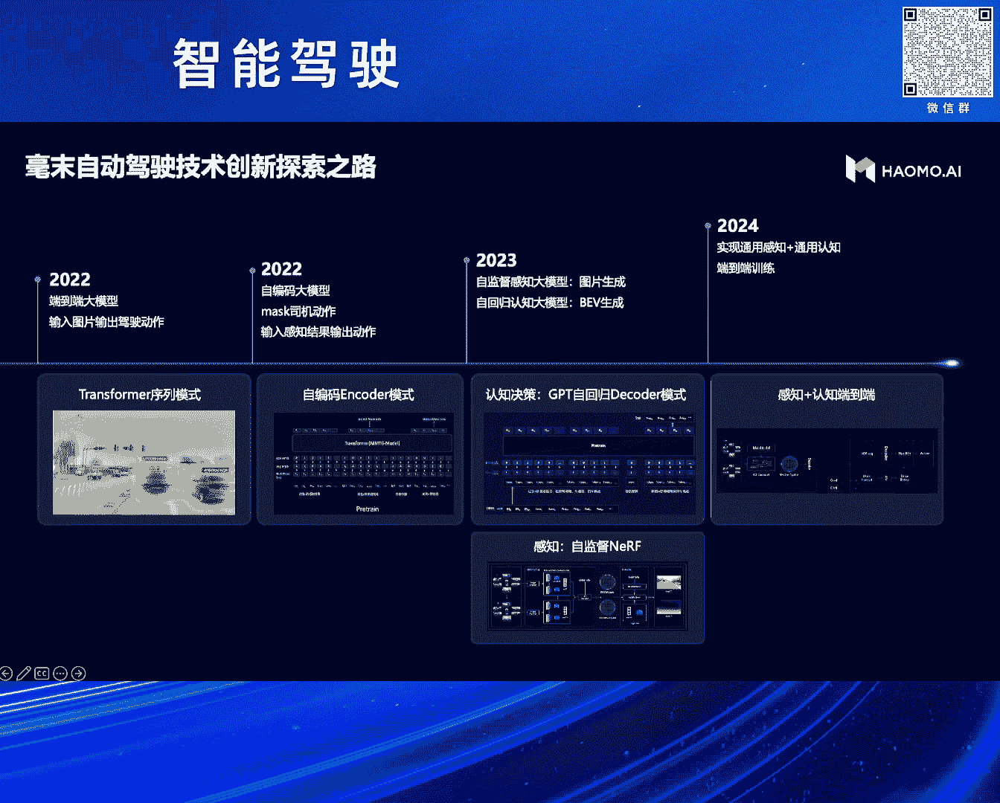

好我的分享就到这。