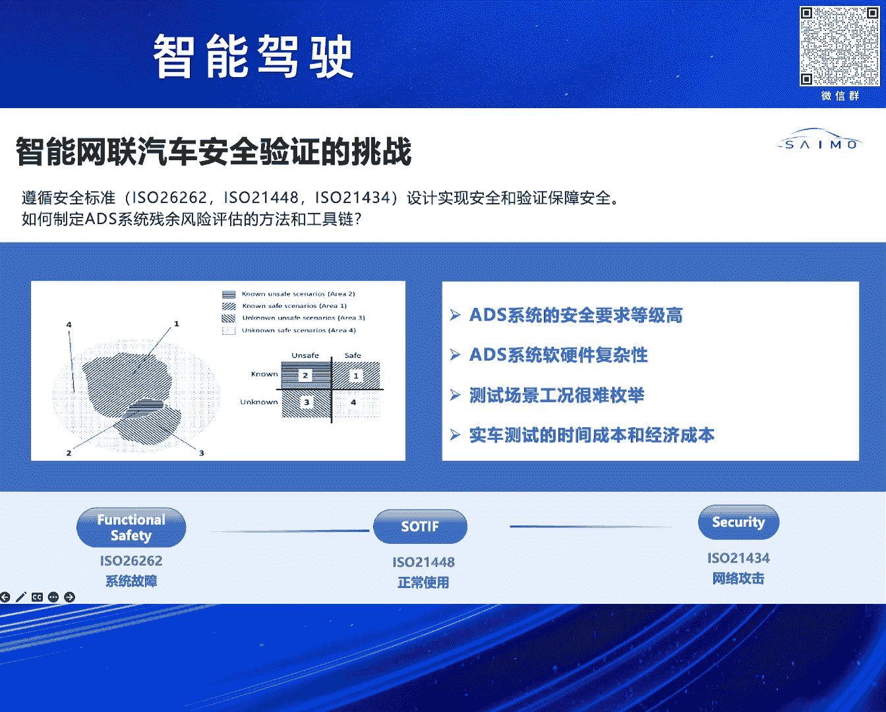
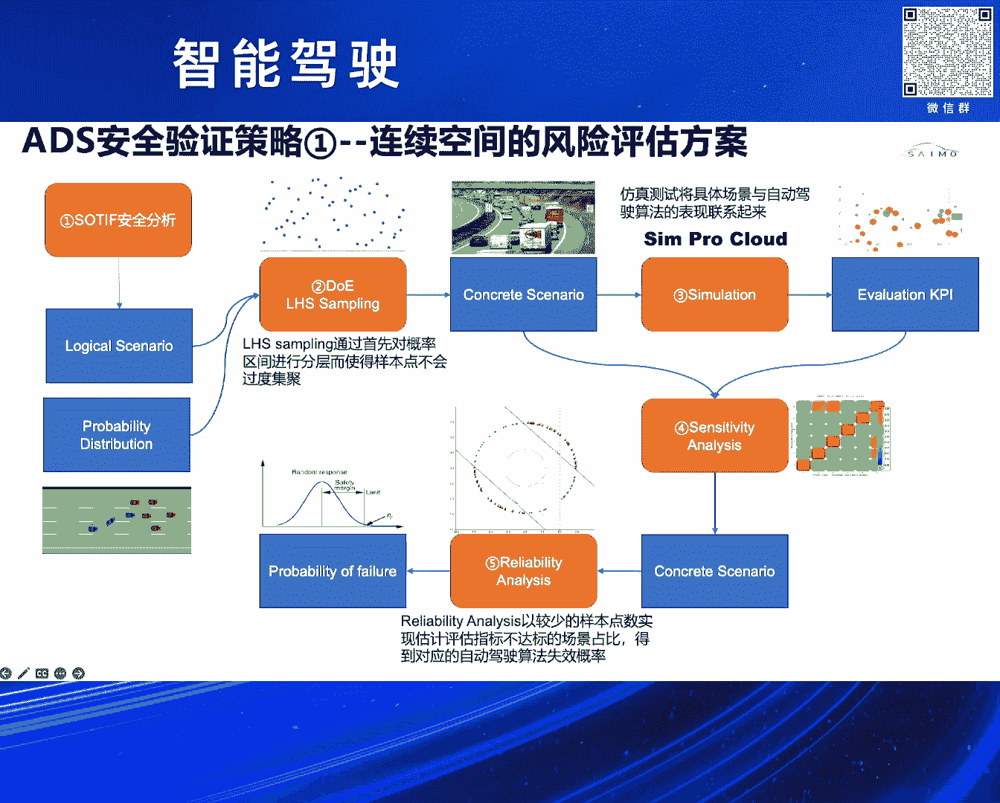
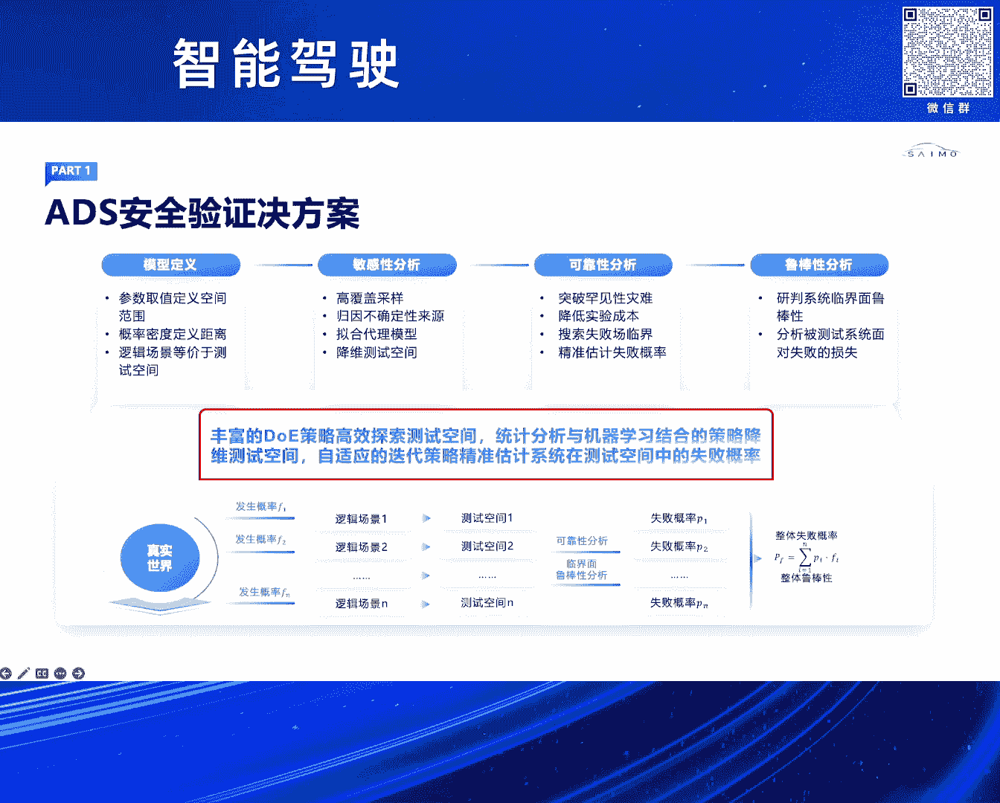
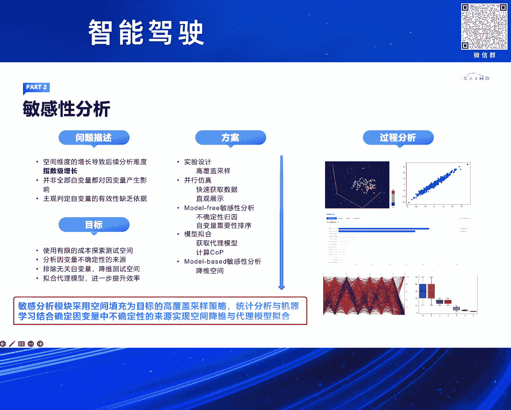
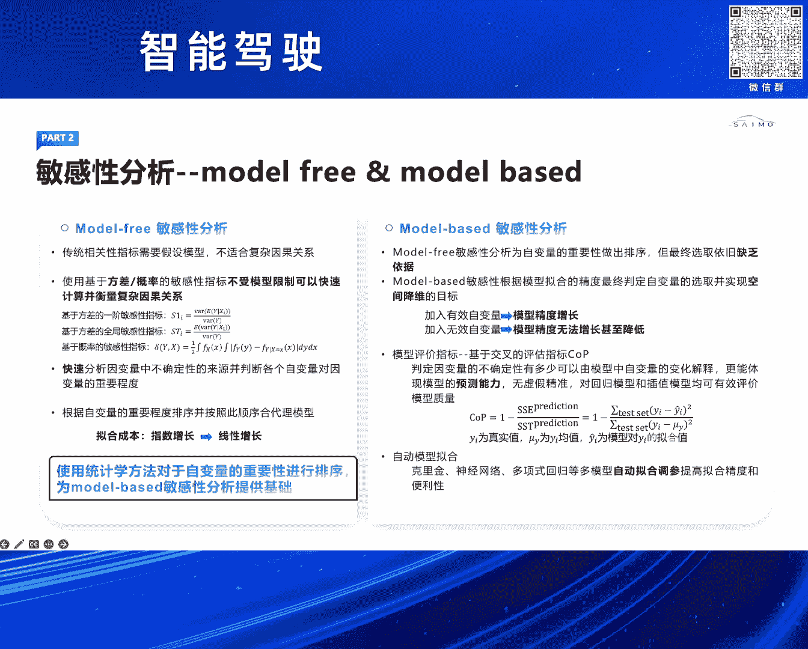
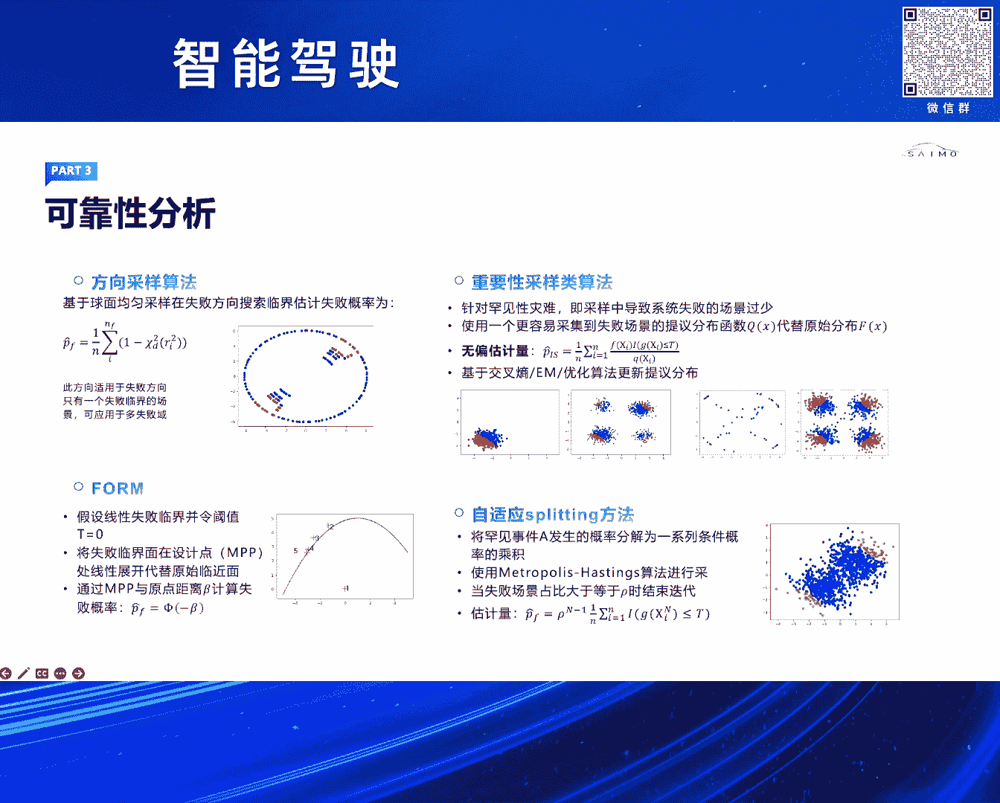
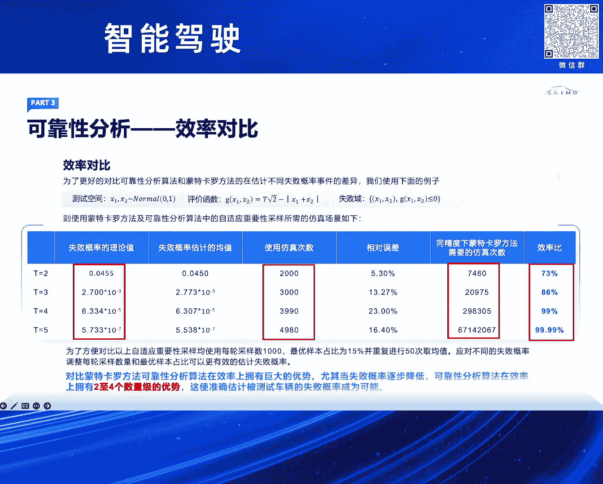
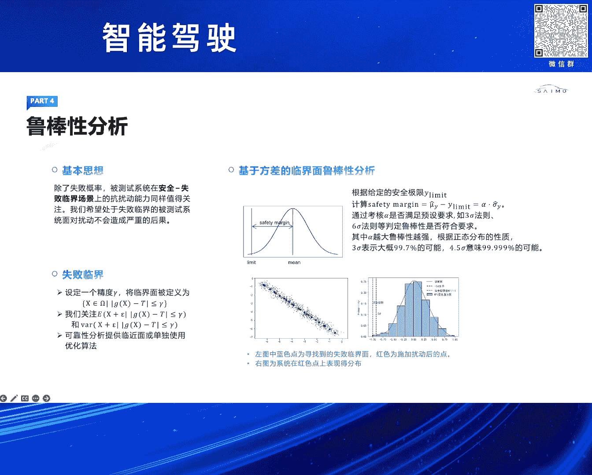
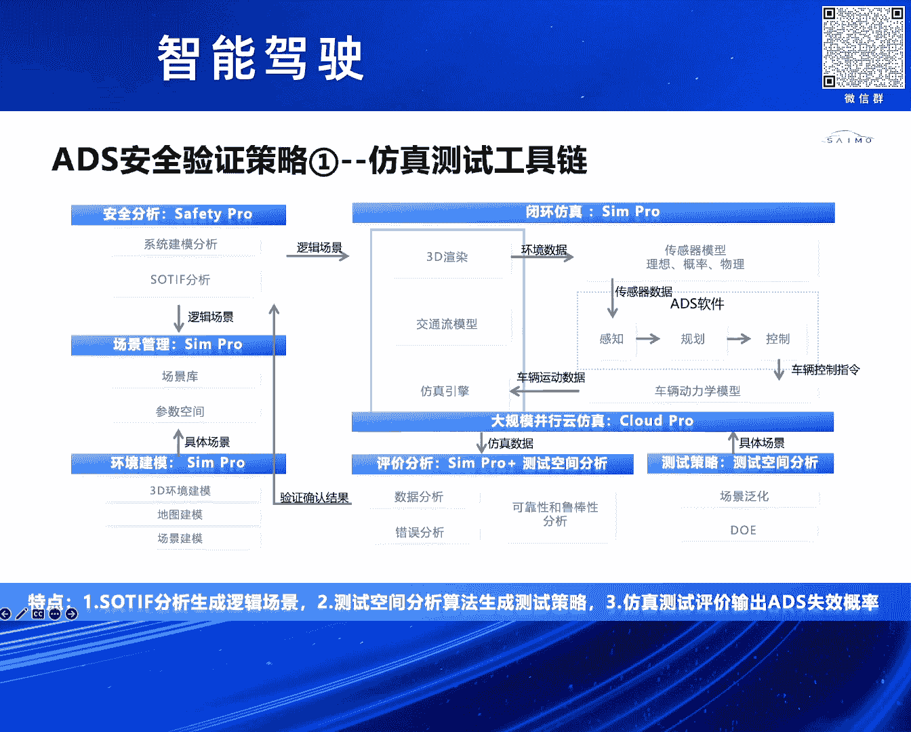
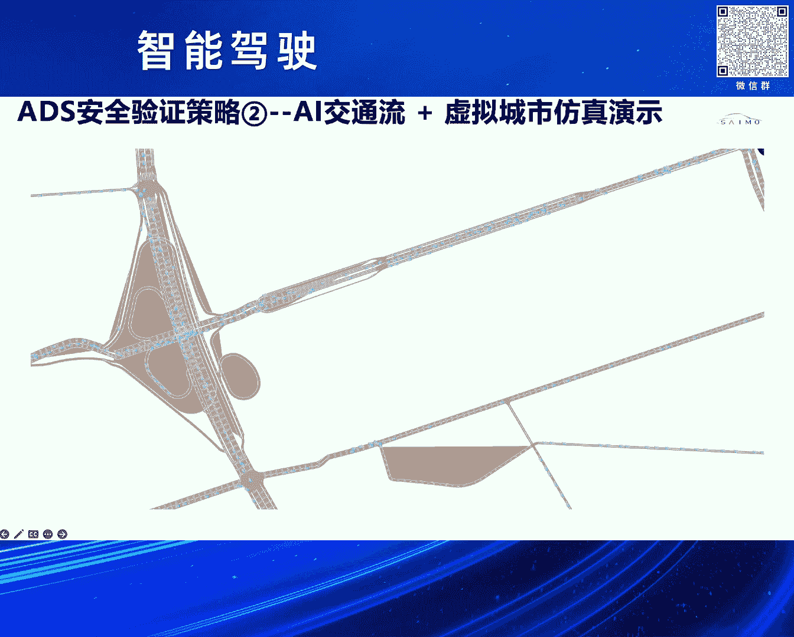

# 2024北京智源大会-智能驾驶 - P7：智能网联汽车安全验证策略和仿真工具链：杨 强 - 智源社区 - BV1Ww4m1a7gr

呃尊敬的法王主任，尊敬的各位嘉宾，大家下午好，呃刚才几位嘉宾呢讲了很多这个算法的迭代，包括引入大模型啊，来提高我们整个自驾系统的安全性，包括它的性能，那接下来接下来呢我要分享一下，赛木科技。

在自家系统的安全验证方面的一些思考，和我们解决方案，呃首先我要简单来谈一谈，这个自驾系统安全存在哪些方面的这个挑战啊，呃我们知道就是随着这个L3以上等级，这种价值对这个安全这个责任认定的不一样啊。

呃我们自驾系统如何去通过设计，实现我们的这个安全，包括通过这个验证保证我们的安全，有一系列这个要求啊，比如说我们说功能安全对吧，这个26262其实它解决什么问题啊，就是我们对于一个系统内部的。

这个据它哈纳分析，我们可以把它的这个硬件，硬件的随机性失效和这个系统性失效可以解决，它要解决的问题是，我们这个系统本身内部没有问题，那网络安全呢对吧，通过网络安全的话，我们通过相关的安全设计啊。

我们我们知道这个自家系统它是个联网的对吧，那么可能存在外部的攻击，距个IO448呀，我们要解决这个，不要受到外部这个攻击的这种风险，还有一个就是我们叫做预区功能安全，这个聚光安全。

它要这个呃安全分析和设计要解决问题，就是说当我们这个系统内部足够安全了，但是在我们系统设计层面，它有一些这个天然的，这一些这个系统的这个缺陷，比如我们一些感知传感器，它对一些这种光照。

或者说我们对一些这个识别的这个范围，有缺陷的话，那如何来这个验证这个领域的一个一个安全，同时我们这个自家系统啊，它的软硬件非常复杂，我们很难通过分解各个模块啊，把这个案件给一这个解决。

另外的话就是说我们知道这个支架，我们说它安全验证很难，一个很重要的就是说它的长尾问题，或者说我们很难通过一种有效的方法，我们去枚举这个测试场景，我们知道我们做这个软件或硬件测试啊。

我们很多这种测试都是可以，它是确定的，所以我们是非常好的，可以去确保它的安全性，那自驾这个系统的话，它一个很大的挑战，就是说工况不确定性很难枚举呃，呃我结合这个I14482对吧。

在里面在这个安全验证的领域啊，提出了一个非常重要的问题，就是说如何去制定这个ADS系统这残余风险，这个验证的方法和这个这个工具链。

呃这里呃来介绍一下我们SAM科技，在这个自驾系统和安全验证，这个策略方面的一些思考，我们都知道哈，基于场景的这个测试方法，是一种有效的验证自驾系统的安全性，但是如何去构建这个场景啊，变得至关重要。

我们我们讲这个AA大师的话，通过我们这种专家经验对吧，或者我们通过手工搭建的话，我们认为基本上是可以确保它L2，这种安全等级的，但是上升到L3以上的这种测试的话，我们很难通过手动大众主动搭建场景。

包括通过这种专家经验啊，能去呃制作一个非常这个全的有效局，所以我们需要寻找一套方法，如何去解决这个场景的问题，我们借助于这个SDF的这个四象限分析啊对吧，这里面就比较关注的就是对于这个危险场景的。

这个这个怎么来验证，我们如果对已知的危险这个场景，那我们认为我们可以把它放在一个二，要那个20202范畴里面，我们基本上可以确保的，但是对于这种未知的风险场景，怎么来验证它呢对吧。

其实他就很难去找到这些边界，那我们的一个思路就是说，我们把这个对自驾系统的测试验证啊，把它转化到一个测试空间探索的这个领域，其实这是空间参数，在我们很多，比如说航天航空这个领域的话，其实应用比较多的呃。

这测试空间呢对吧，我们也可以去再再细分一下，就是叫做连续空间和这个离散空间，怎么理解这两个概念对吧，这个连线空间的话，我们就是它是有边界的，举个例子，在我们今天这个当中对吧，虽然它很很这个很大。

但是我们总归能在一定的范围当中，这个去限定它的边界，那还有一种是离散的，就离散的话，你很难通过建模去找到这个系统的边界，对不对，那针对这两种不同的支持空间的话，就是我们的方案就是说针对连续的。

那我们要去通过我们的SDF安全分析，去定义一个这样的逻辑场景，这个逻辑场景呢我们认为它带边界，就是一个在一个这样的这个空间当中，然后再结合我们的这个安全，我们的这个测试空间分析工具及生成器。

具体的场景呃，后面我们会具体展展开来讲哈，最终的话基于我们这个在测试空间当中，我们会去找到我们关心的那一些这个样本点，然后通过统计来论证我们的这个这个这个风险，那我们的理解就是说在给定边界的条件下。

基于我们的方法的话，我们是可以有效的去量化的评估，我们整个系统的安全的，这第一个第二个就是离散的空间，就离散相对于我们这个呃连续来讲，就是无法去定义它的边界，那就你你很很难去通过这种建模的方式来做到。

这种呃风险评估，那我们的方案就是说，通过构建大规模的AI的交通流，来做这种随机测试，所以总结来讲，就我们把测试空间分为两大，这个这个这个这个方面来制定相应，相不那个对应的这个验证策略。

和我们的仿真工具链，我们先来看一看对离散空间，我们如何来进行这个风险的评估的方案呃，我们在我们的这个这张那个PP上讲的话，我们第一首先通过缩TIF安全分析，安全分析的话。

就是它可以构建一个这样的这个逻辑场景，呃，我们讲说那个锁屏分析的话，其实分为两大块啊，一个是我们的安全分析跟我们的验证，那有一些我们在安全阶段，比如说我的系统上有些这个性能的局限。

我们直接修改我们的系统，就可以去规避一些风，但是有一些我们是无法去调整系统方案的，这时候可能可能存在潜在的危险，这时候我们的安全工程师啊，就会把相应的这些我们做危害的话，给到我们仿真工程师。

但是呢我们在安全分析阶段，需要输出一个逻辑场景，你可以把它理解成一个有待边界的这个空间，呃，比如说我们它结合我们这个仿真领域的话，我们叫这个逻辑场景和我们的这个参数分布。

当我们拿到一个这样的这个呃逻辑场景以后，我们就要进行这个采样对吧，我们在统计当中，那采样的话，我们有很多种方法，我们知道像比比如比如说种均匀采样的话，蒙特卡罗它的这个采样的这个密度啊会很高。

它的覆盖率也很高，但是呢它有个问题，你要对一个高维度空间进行一个，非常好的覆盖的话，它的采样样本也是很高的，那即使我们基于你这种云端这种大脑，这种并发的这种仿真测试啊。

那我们的测试结果也是这个呃证明是不可行的，所以我们希望找到一种好的这个DOE，我们叫实验设计，我们通过少量的样本点来去对空间进行覆盖，同时呢我们可以通过这些样本点，对整个这个系统的这个我们叫失败概率啊。

进行估算呃，我们DAOE完了以后，我们就会基于逻辑场景生成我们的具体场景，这时候我们就会做我们的仿真测试，结合我们的云的仿真的这种大算力平台，当我们有了这些仿真的这些数据以后，我们会做参数的敏感性分析。

就我刚才提到了对吧，我们对一个这个高维的空间啊，你去采样就非非常在这个功能上是不可行的，我们要进行降维敏感性，就是消除那一些对我们自家系统影响不高的，一些因子敏感性分析完了以后。

我们会再进入到我们下一轮的这个，仿真测试迭代，这时候我们就是做我们的可靠性分析，可靠性分析它最终要解决的问题，就是说通过我们对系统的失败概率，你可以认为它是碰撞对吧，或者我们去TTC违反来。

去这个估算出我们这个自驾系统啊，它未来的失败的一个这个概率，我们知道从这个呃失败概率的角度，如果说我们一个系统，它的这个失败概率是个十的呃，十的四次方，五次方，我们认为它是不不够安全的，但如果一个系统。

它的这个失败概率是一个十的七次方，甚至更低，我们认为未来如果在仿真当中，我们可以达到这个级别的话，那我认为它未来在这个实车的这个路程当中啊，基本上这种工况也是不会发生的，那整个就是针对这个方案的话。

就是我们对于连续空间，我们认为我们是有一套，这个从我们数学上可以论证的，这些我们的工程应用上的话，可以去给出一个量化的这个。

风险的评估的一个指标，呃其实我们刚才讲的那个整个的一个，验证的思路，我们分为几大块，首先就是我们这模型的定义，模型的话，这个呃我们理解就是它它是一个逻辑场景对吧，借助于我们数据库分析的这个工具。

当我们有了这样的一个逻辑场景，定义好了，这样测试空间我们做敏感性分析，敏感性这是刚才讲的，我们高采样啊对吧，包括我们会去呃拟合一些代理模型，对我们这个参数进行一些这个分析，那么敏感性分析完了以后。

我们就会做这个可靠性分析，可靠性分析就是呃对，要对我们一个高维的连续空间下，我们要对所有的失败率，都要进行一个覆盖或者搜寻，那我们要做的事，就是要有效的去找到这些失败玉，对整个系统一个呃失败概率的估算。

那么我们做完可靠性分析以后，我们会再做一个这个叫鲁棒性分析，鲁邦先分是干嘛呢对吧，当我们在前一阶段，已经对这个系统的一些零界面，或者说就是说它可能存在这个，失败风险的区域啊，我们进行了这个测试验证。

那我们增加脑洞，看一看我们整个系统鲁棒性怎么样，所以通过我们这个敏感性可靠性呃，鲁棒性分析，来对整个呃给定的一个我们从ODD分析下来，给定的一个这个呃区域，一个空间啊，进行一个安全验证。

最后我们会有一个失败概率的一个这样的输出。

那具体展开来讲的话，我们敏感性它这个主要做什么，对不对，其实呃呃它通过我们这个，比如说我们首先要DOE这个实验的设计，那借助我们为仿真，那在我们用这个敏感性分析，其实分为两个阶段了。

我们第一个我们叫model free的一个，这样的这个敏感性分析，这个阶段的话，我们就是要去对呃，相关的这个敏感性的参数进行一个排序，但是它并不去决定呃，这个参数是否会影响。

我们对整个这个自驾系统的一些KPI的这个影响，那我们做完第一model fit这个敏感性分析以后，我们会进入到第二个环节，就是我们讲的model base的一个一个这个验证。

这个我们会结合我们这些机器学习的，这个算法呀，那最终会选取了一些，我们叫做对整个这个自驾这个行影响的，那些这个场景的因子，比如说我们这个前车的离我们的距离啊，我们的速度速度啊等等，呃这里我们重点强调。

就是说我们会基于我们的这个敏感性分析，算算法，我们通过比较低的这个样本点，那对我们整个空间进行填充，来结合这个基于统计和机器学习的方法呀，来确定这一些这个这个因变量当中，不确定的这个因子啊。

对我整个这个空间的一个影响。

呃这里讲了两个这个阶段，我刚才也讲到，对不对，我们第一阶段的话，就是通过我们统计的一些分析，来找到我们这些这个应变量。

它的一些这个优先级，第二个我们叫model base，model base的话，我们会去呃，他要解决的问题，就是说，当我去在增加我这些应变量的这个过程当中啊，它对我们整个结果影响的这个影响是多大。

如果我们认为当你去加入新的这个影响因子，或者是我们场景的这个一些这个定义的时候，它的这个模型的精度啊，在增长的话，我们认为这种参数是我们比较关注的，反过来，如果说我们再增加一些场景或者因子的时候啊。

它整个我们叫呃，基于我们CP这个呃呃定义这个模型，这个精度的这个指标啊，如果它是下降的话，我们认为这种指标是没有用的对吧，所以敏感性分析，就是说经经过这一轮的这个敏感性分析啊。

就是我们会去得到这个比较重要的，这些这个场景的参数，为我们后面的这个仿真测试啊，做一个降维的准备，可靠性分析，可靠性分析的话就是说呃刚才我们讲的对不对，就是我们希望就是说通过对这个测试空间，这个失败率。

这个失败与我们要强调的是，所有的失败与我们都要搜寻到，通过这是搜寻到这失败与后，我们通过我们样本点的设计，来通过这个呃呃我们的结合的仿真测试，对整个系统它的这个失败概率进行一个估算。

呃我们传统的方法我们可以居，比如说我们叫做蒙特卡洛采样，对不对啊，但这种采样的话，那我介绍了他这样本点比较多，呃，我们知道对于一个一个比较成熟的系统啊，我们认为他的这个失败概率，基本上在使得一个负。

这个呃六次方或者负七次方，只是这个还要比他小，但是如果说基于蒙特卡洛采样的话，基本上我们认为它是我们叫做这个呃呃维度，这个灾难，你很难去通过这个工程上去，通过这个测试验证啊。

得到一个这样的这么大的一个采样样本点，所以反过来就是我们如何来去解决，对这么低，这么低的失败概率的，一个这个这个数值的一个评估呢，对吧，我们叫做可靠性分析算法，这里我们罗列了几种。

就是说我们现在目前这个常用的这个，可靠性分析算法，第一个我们叫方向性采样对吧，就这个在这个左上角，我们进行采样，然后可以对各个维度进行这个，失败率的一个搜索，还有一种我们叫做重要性。

自适应的这个重要性产业，就是通过我们不断的迭代，通过我们上一轮的结果来搜寻，我们下一个它可能存在存在的一个失失败率，那这样的话我们就会对对整个前空间啊，进行一个这个呃全面的全面的覆盖。

这里我们可以看看我们这个做了一个实验啊，结果做了个对比，就我们做了一个这个测试函数啊，呃可以看就是说我们这个测试函数的话，它的失败概率是在一个十的这个负七次方呃，如果说我们看到这个表哈。

这个表格这个表格就是我们在前面的话，当然失败概率是比较，比如说我们在大概十的三次方的话，对不对，其实基本上就是基于我们的可靠性分析算法，和这个蒙德卡拉采样，那基本上这个维度啊大概在两个维度对吧。

但是也是也是比较大，来了我们看最下面的话对吧，如果说我们这个系统啊，它这个失败概率在一个十的七次方的话，我们可以看到，那我们的这个采样方法的话，就是可靠性分析算法的话，大概就是可以5000次左右仿真。

就可以把这个概率的给给给这个估算出来。

但是如果基于这个蒙特卡罗这种采样方法的话，它就要达到这个6700多万次，所以通过数字对比，我们知道我们在这种情况下，我们对于这个失败概率估算，我们可以达到四个数量级的这个提升，这个是非常非常高的。

非常高的，所以这个也是我们这个可靠性分析算法，非常重要的一个特点，就是它在我们既能去估算出我们整个系统，它未来可能这个失败的概率，同时我们这个效率还是非常高，鲁棒性，鲁棒性的话就是说我们去争。

在我们可靠性这个做完以后啊，我们已经搜寻到这个失败域的这些零界面，我们通过增加这一些脑洞啊，来看它的一个一个我们叫safety emergin，那如果他的这个safety min。

如果是如果落在一个比如说这个六西格玛对吧，我们认为它鲁棒性很好的呃，或者我们这三西格玛这样来对，我们这个整个系统，在未来就是可能存在的一些脑洞啊，它的安全域呃。

在这么一个什么范围，我们进行一个这样的统计分析，那基于我们刚才讲到的，我们这个呃我们叫测试空间分析工具啊，对吧，我们的敏感性分析，可靠性分析，还有我们鲁棒性分析这个理论的这个，那建立前提下。

我们制定了我们整套的仿真工具链，首先是我们的那个安全分析工具，那个safety pro，那这个的话就是说我们它一个很重要的输出，就是说当我分析完了以后的话，我们会输出一个逻辑场景。

这个场景的话会给到我们这个云，云端的仿真平台，云端防止平台的话，我们会结合我们的这个叫测试，测试空间分析工具，这个可以理解成它会制作我们这种测试策略，对吧呃包括我们说对他这种采样啊，DOE啊。

那当我们这个进行了这个采样DO以后的话，我们会生成很多具体场景，再给到我们云端的这个仿真平台，这是我们要大算力，我个人的理解，未来我们对这个L3以上的这个自家系统，安全了，这个大规模并发的。

这个云仿真平台是必不可少的，那一定要我们有这个呃，非常强大的这个仿真测试能力，那整个仿真测试云平台的话，基于我们这个simple自研的这个仿真引擎，我们这个仿真引擎的。

我们可以达到这个最高1000HZ的仿真，同时我们的传感器的话，我们能覆盖毫米波激光camera的物理传感器，对不同的光照，包括它的一些这个呃呃噪点等等，我们都可以去做，去做这个这个仿真测试。

然后再结合我们一个自研的这个，27自由度的动力学模型，做一个闭环的这个仿真测试，我们仿真测试会有输出一个这个仿真结果，这个结果待会给到我们的这个呃，测试空间分析工具来做。

我们这个刚才提到的这个可靠性跟鲁棒性分析，最终这个结果的话对吧，我们再返回到我们的安全分析阶段，看看我们这个结果，比如说我们这系统测下来呃，在这个ODD下，我们这个潜在的风险，我们评估下。

如果它是失败概率是十的负四次方，那说明我们还我们在安全阶段，还重新进行这个呃一个系统的设计对吧，但是如果我们说仿真的结果是一个十的，这个七次方，那我们认为在这个场景下，你是足够安全的。

所以整个这套这个工具链的话，就是说哎我们都已经在云端集成，也目前的话也是在我们呃多个主机厂客户的话。

商业落地使用，另外就是说我们两款核心的这个呃工具，我们的安全分析工具safety pro，包括我们的仿真引擎SYMPO，已经通过了我们这个功能安全，这个AHD等级的一个认证，那为什么要做这个事情呢。

就是我们知道这个整个仿真啊对吧，包括我们在做公共安全的时候啊，他对这个你的工具链的执行度是有要求的，我们通过采用车规级最高的这个距R62，AHD等级这个要求的这个流程啊，来去呃。

对我们整个系统的可靠性啊，包括这个执行度进行一个验证，好的就是刚才就是我们讲了，我们在第一个维度对于这个连续空间下，我们如何对系统啊，进行一个这个安全的这个评估呃，接下来我们来讲。

这个对于离散空间的这个风险评估，离散的话就是相比于我们这个这个呃，连续测试空间啊，它很难去通过我们数学的方式建立一个模型，对它进行求解对吧，那更多的就是说我们不知道它的边界在哪里呃。

那我们的一个一个这个解决方案的思路呢，我们要引入这个随机交通流对吧，随机交通流，那当当时我们在做整个方案的时候，我们也在思考，就是说这个随机交流应应该如何来构建，我们是采用这个传统的基于这种规则的。

这个模型来去生成这个交通流，还是说我们要通过这种数据驱动的，那我们的这个理解是基于传统的这一些这个，交通流模型啊，它是比如说有些这个是第三方国外的对吧，就是它很很少有我们中国内地的这个。

交通的一些这个规则，所以他们那些基于传统的这些变道啊对吧，我们跟车啊这种模型啊，是很难去跟我们真实的这个交通流模型，交通绿化进行一个这样的这个逼近的，所以我们认为基于这个实应该构建。

基于我们中国实际交通流数据的AI模型对吧，构建我们宏观交通流和微观交通流，那我们的方案呢对吧，就是首先我们要去采集这一些，宏观的交通流和微观交通流，那基于这些数据训练我们这AI模型。

那再结合我们这个呃云端的这个仿真平台，做一个闭环的测试验证呃，这可以看到对吧，首先我们是要去去采集，我们这一些宏观微观的这个数据，比如我们对某些城区也好，或者高速公路也好，对不对呀。

那具体的模型我们会对这个宏观交通流，数据做预处理，包括我们的微观交通这个做进行预处理，再给到我们这个AI交通流，那我们这个ARDUO的话其实也是包含两方面，一个是我们的宏观的，一个是微观的。

就简单讲一讲宏观微观有什么区别呢，就是宏观的话就对我们整个城区不同道路的，它的一些交通流，比如说我们车流的密度，车流的速度，包括我们的一些这个流量进行一个这样的预测，未来的预测。

那微观的话就是对我们一个单车，它的在这个一个复杂的这个工况下，他的一些表现对吧，当我们前车有前车的时候，你是要去变道，还是说要去超车，还是要减速呃，是要解决这个维度的问题，当我们把我们这个交通率这个。

确定出来以后的话，我们再结合我们在云端的这个解决方案，我们叫做加上我们虚拟城市，虚拟城市的话，就是它可以理解成跟我们这种数字孪生啊，是有点类似的，我们要采集这些高精度的这些这个呃地图对吧。

那在这个地图之上，我们要去构建这一些高拟真度的这三种模型，我们知道就是说对于R3以上的这种，支架的验证啊对吧，我们刚才我们在第一阶段，我们要做的是这个在给定区间下，它可能是一些这个片段式的这种仿真呃。

但是我们说对这个城区的这个这个，自驾系统的话对吧，它除了我们在那些比较这个确定的这工况下，测试，验证完理，我们还要在这种连续的空间下进行测试验证，那我们这个交通流模型啊，就是要解决这个问题的对吧。

当我们有了这个比较一个大的这个地图，那我们这个真实道路，是这个这个这个这个这个一致的同时，我们也引入了我们的这个AI交通流模型，再结合我们云端的仿真平台，来进行一个测试验证。

这时候我们就可以接入我们大量的这个，自家的算法，进行一个闭环闭闭环的这个仿真测试验证，呃这里可以介绍一下我们做的这个，AI的宏观交流模型啊对吧，它就是结合了我们基于这个道路拓扑信息的，交通流动态。

以及这个非线性的一个这样时空，这个图神经网络，我们为什么选择这样的一个实经，这个呃这个时空的图神经网络呢，首先就是说我们这个图神经的话，就对我们这个道路拓扑啊，是比较这个吻合的对吧。

第二就是我们在这个宏观交通流上，它有这种时间跟空间的概念，那通过构建一个这样的这个模型的话，我们会对未来的一个这个时间节点，某一个路段的宏观交通路进行模拟，整个模型的话可以看到对吧。

我们就我们的输入的话，就是说我们的地图信息，包括我们这个宏观交通流数据，那我们整个主干网络的话，就是基于时空的这个图神经网络，我们就引用了四个这个主干网络，因为它每个模型缺优缺点不一样对吧。

呃我们都会同时来确定他们，也同时他们会推理，然后在这个这个这个推理阶段的话，它会输出我们这个四个模型，不同的这个对宏观交通的预测数据，那结合我们这一个stacking算法。

这个算法的话其实就是一个后融合，那最终来给出我们这个宏观加重流，对我们特定道路的一些，这个它的交通流的一些流量密度，速度的一个预测，那微观交流流的话对吧，我们刚才讲的，其实就是要。

你可以把它理解成是一个驾驶员模型，但是它是一个数据驱动的，是我们一个本地数据驱动的一个训练出来的，这个模型，整个网络的话对吧，我们可以分为几大块，就是呃第一是我们我们叫光栅化，第二就是我们这个主干网络。

那整个这个主干网络的，我们也是基于这个BV加transform这样的，一个架构的，那后面就是我们这个呃呃呃，包括我们这个编码和解码器，最后我们会有一个多模态的一个输出。

这个模型我们输入的话就是我们这个地图，包括我们这个行车的一些数据，那光栅化，就是我们就是把这个把我们这个，比如说我们地图的拓扑，包括我们车辆的在车道线上的一些朝向，它的一些这个呃跟地图的一些夹角等等。

作为这种光栅化给到我们这个模型，那再到我们这个嗯，呃encoder这个这个这个encode器里面，这里面就是我们会提取我们的一些，比较重要的特征，那我们解码器呢，解码器。

我们这边加入了对于一些这个矢量的这些数据，比如说我们车辆的类型对吧，你是卡车啊，还是轿车，包括我们这个车辆的这个数一些数据比车辆，你的你的一些行驶的一些速度啊，加速度啊等等，那最后对吧。

我们会输出一个多模态的一个这样的这个预测，就动模态怎么理解，就是我们这辆车对吧，在这个交通路口，我们是要去直行还是左转还是右转，它会都会给出我一个概率，我们会找到一个这个最最高概率的这个预测。

我们认为是它比较好的一个呃行驶轨迹，那最终的话我们就发现这个模型啊，就是我们训练完了以后，他还是对有一些工况这个推理啊，是有些误差的，我们会加入加入一个这个后优化的，一个这样的呃模块。

来对我们整个呃微观交流模型来进行一个优化，基于我们这个AI交通流的模型的这个呃设计啊，我们针对这个我们讲这个离散空间的这设置，验证啊，我们整个房子工具链我们可以看到对吧，在我们图的这个左边的话。

结合了我们这个呃，基于我们真实采集数据训练的AI交通流模型，再结合我们这个虚拟城市对吧，虚拟城市我们对特定城区的一个测试验证，来给到把这个海量的交通流数据啊。

输入到我们的simple的一个这样的这个仿真节点，这个节点的话对吧，那我们重点强调一下，就是我们知道当你数量级很大的时候对吧，你这个你这个几千个几万个数据的时候，你用单引擎的话。

包括你的这个对于传感器的这个设置，这个计算你的性能是不够的，那我们采用了一种分布式的仿真，分布式绑定，我们把我们在传统意义上，传感器在我们仿真引擎内部，我们把它移到我们的节点上面对吧，呃在每个节点上面。

我们去计算我们主车周边的一些感知的信息，那再结合我们的评估，这样我们就可以达到，就是我们通过一个仿真引擎的节点，然后再把我们计算量比较大的，就是分分解到我们在并行仿真当中，每一个容器当中它的这个计算量。

这样我们会做到这个实时的仿真，同时的话对吧，我们可以去做呃，这个多任务的一个这样的这个并发，我们每一个任务的话，我们可以，目前的话我们的性能可以做到五千五千，5000加的交通车，加100的主车。

可能大家觉得哎，我怎么你们的性能交通流只能支持5000，对不对，有些传统的这个基于规则的话，它可能几万甚至10万的就这样数据，但是我们要强调的是，通过这种AI训练的这个模型的话，它在推理阶段还是有很多。

这种需要优化的地方呢，这也是我们目前重点在推进的，包括我们在这里面做了很多种，大量的这种并行计算的优化，那最终我们我们整个这个自驾平台，这个自驾这个系统安装验证的话，我们会做到实时的这个分析。

可以去提取这些关键的NG场景，这里有张图，可能有这个字，有有有有点小，就是我们把我们在线目录在云端部署的，这个结合我们AI交通流和虚拟城市啊，还有我们整个云仿真的一个并行的平台的，数据展示在里头。

我们就可以做到非常好的，这个连续的一些城区的这个测试验证，这对于我们在俄罗三以上的这个城区的验证，是非常重要的。

那总结一下，就是说我们就是对针对这个整个额预计公安全，提出的，对于这个未知的这个呃风位置的，危险场景的测试验证，我们通过对空间的划分来去进行这个测试验证，好的。

