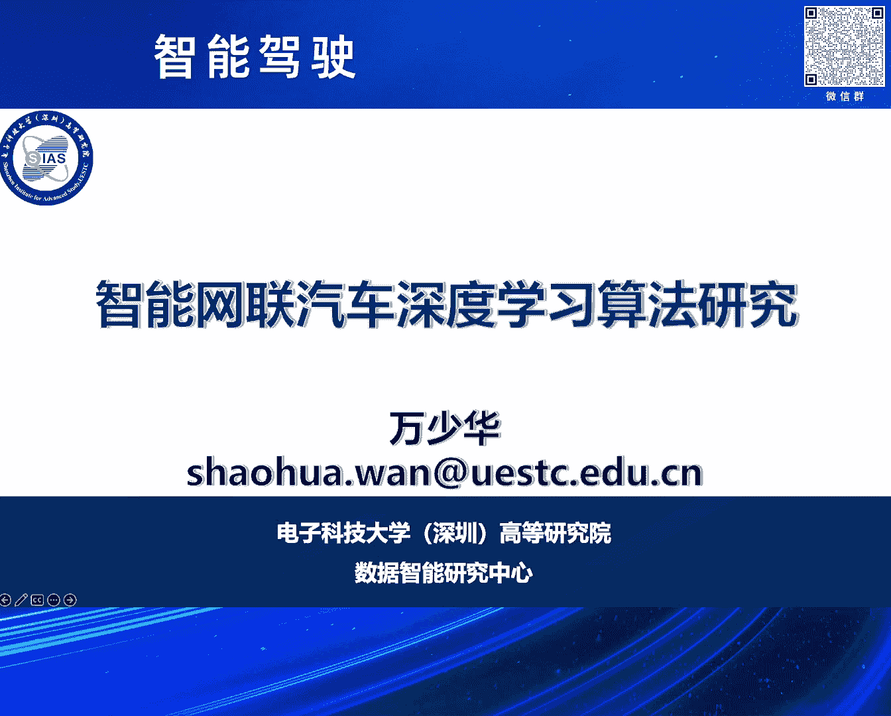
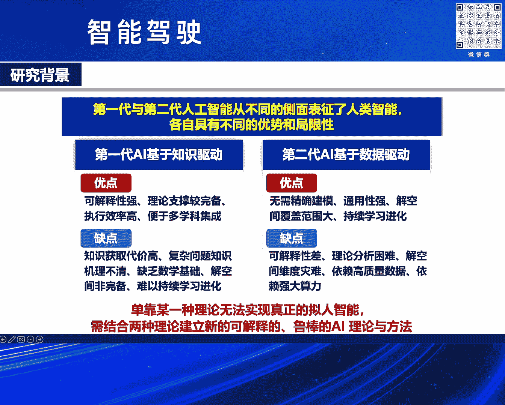
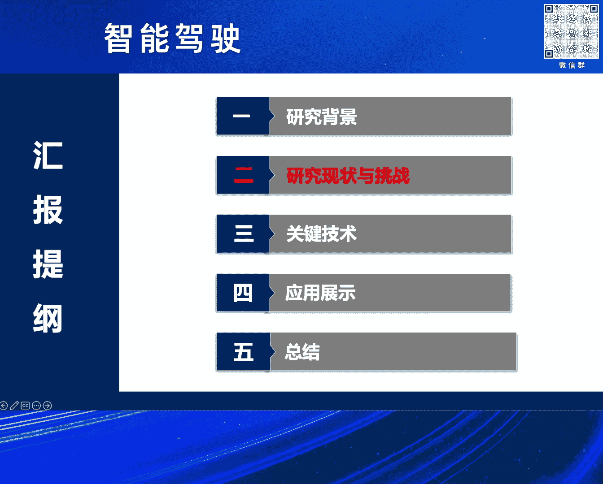
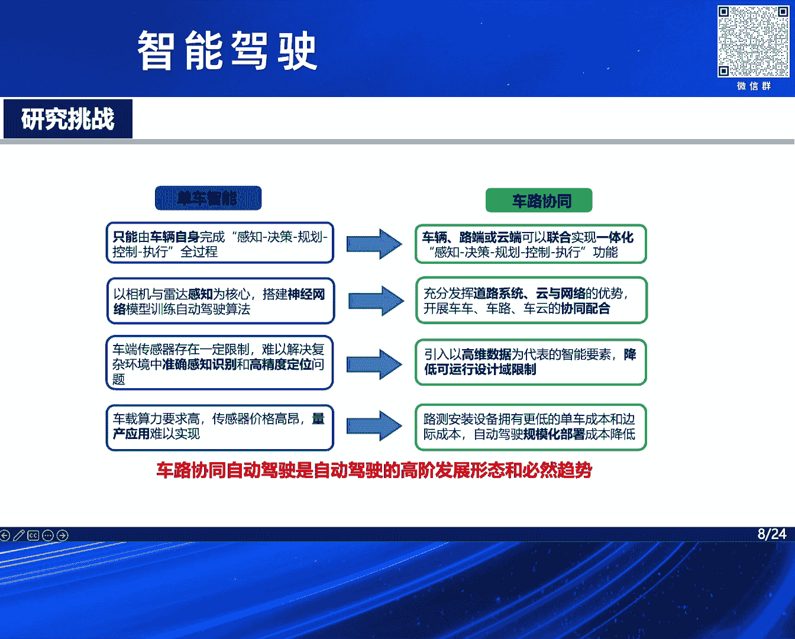
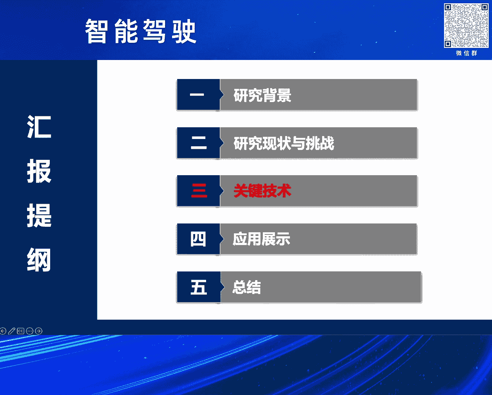
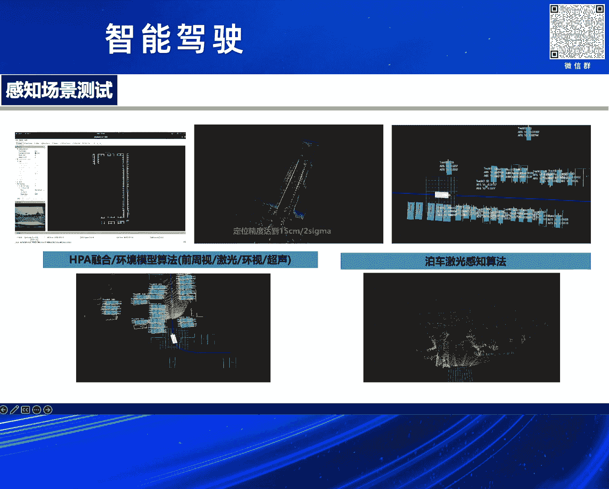
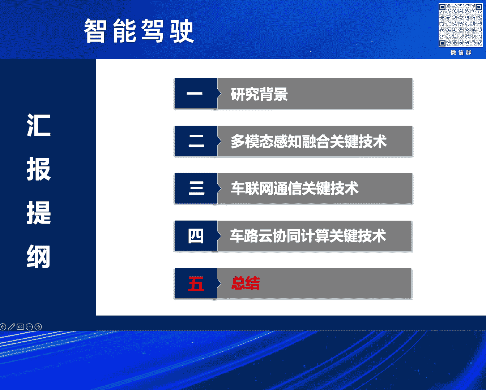
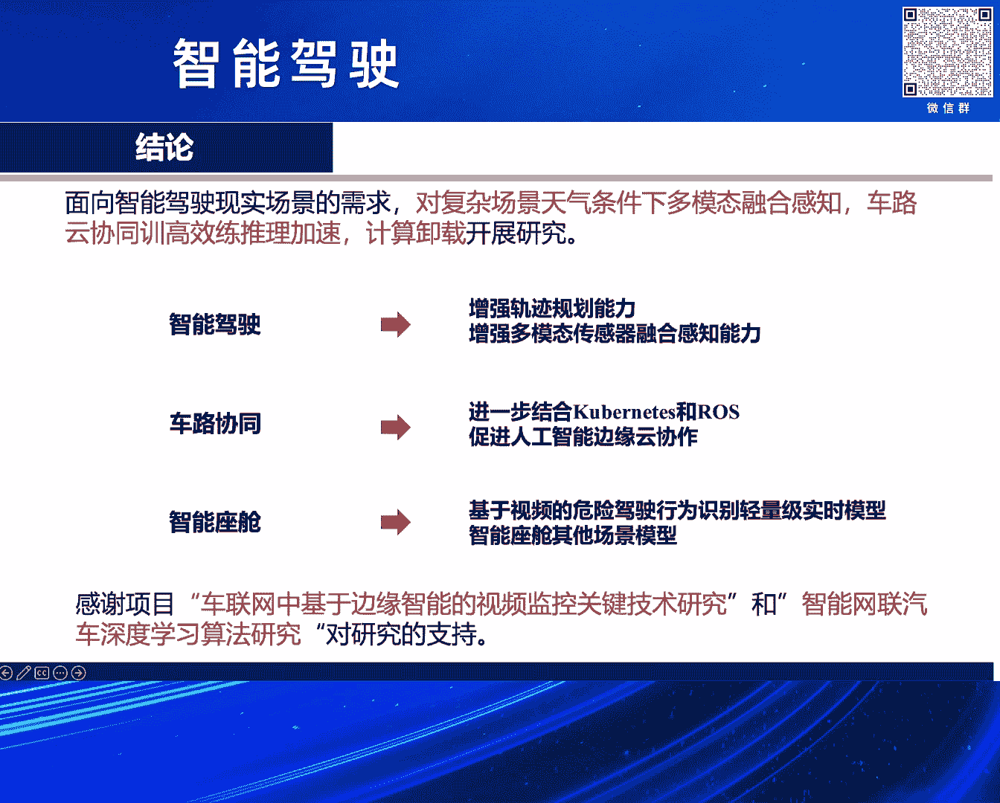

# 2024北京智源大会-智能驾驶 - P8：智能网联汽车深度学习算法：万少华 - 智源社区 - BV1Ww4m1a7gr

大家下午好啊，感谢法王主任的这一个邀请，感谢组委会，使得我们有这样的一个嗯交流学习的机会，向更多的这个企业界的朋友能够呃学习，以及能够产生更多的这一个碰撞的这个机，这个机会就产生一些一些火花。

然后我是来自电子科技大学的呃，万少华，然后先介绍下我们这一个高等研究院，我们是在这一个深圳也实验这一个呃，深圳的市的20+8就是低空经济，人工智能，还有这个立体化的发展而应运而生。

那么我们是对一个就是相当于电子科技大学的，二级学院，我们数据智能研究中心目前是从日本回来的啊，这个任福济工程院的院院士，然后是呃这一个带领我们，我们一共有这一个八个正高级的教授，然后六个国家级的人才。

然后有八名博士后，30名博士和130名的硕士，然后我们主要研究啊机器学习，人工智能，然后相位仍然是是做这一个数字人机器人，然后情感计算，我们也就希望这一个既做这一个理论的，这个研究。

也做这一个啊产学研啊。

好然后对一个跟大家汇报的这个提纲，就是包括这个研究背景，然后研究的现状和这一个挑战，然后我们的呃一些实践就是科学研究。

然后最后是一些应用展示和总结，然后这是这一个人工智能驱动车联网，通感算是实现智能驾驶等第一个根本保障，那么这个随着这个通感算技术的发展，那么这一个无线通信和网络，向更高的移动性。

和这一个更复杂的这一个场景去延伸，那么这一个像云计算和人工智能，使得这一个呃哦就是智能网联汽车的计算，就是走出这一个智能的座舱，然后这一个嗯像这一个就使得这一个啊提高，提供了更高的就是高可靠性。

这一个就是大带宽对一个低延迟的传输的通信，然后向B软计算呃，就是使得这一个降低了这个延迟，然后这一个使得我们的这个服务体验，能够做到这一个强实时，然后这最右边的是这一个车路协同。

我们我们最近也在讲这一个大模型，那么大模型呢车轮系，车漏轮协同的这一个部署是这一个必然的趋势，它能够就是说在这一个啊，这一个这一个就是把将预训练好的这些模型，卸载到这个冰原那里，降低这个延迟。

然后呢可以能够提供一些啊这一个定制化的，这种场景的微调的定制化的服务，和这一个个性化的这一个服务，以及和这个不需要把这些数据上传到这个云端，能够能够对一个降嗯，降低这个隐私泄露的风险。

那么这一个就是呃智能驾驶是一个必然的趋势，那么我们看看这一个人工智能的，第一代和第二代的人工智能，它都是从不同的侧面表征了这一个人类的智能，然后又有各自具有不同的这一个优势，也有不也有自己的一些局限性。

那么这一个单靠某一种理论，某一种这个无法实现真正的拟人的智能，我们需要结合这一个呃理论，建立新的可解释的，鲁邦的这个AI的理论和方法，我们下面一个我刚才注意到，我们下面一个要讲的。

刚好是这一个这一个数据驱动，加这个知识驱动的这个相结合。

那么这也看看这一个解决这个民生问题，就是交通的安全，我看这一个每年的就有交通的事故，以及交通的这个拥堵呃，我们我最近也也常也注意到，就是像这一个特斯拉，它把这一个就是白色的汽车，是就是判断为这一个啊。

就是蔚蓝的这个天空，所以导致这一个一些事故，还有这个骨谷歌的这一个啊这一个呃事故，那么这一个我们就是说更加可靠，更加安全，更加节能和更加这一个舒适的这一个智能驾驶，是这一个呃一个必然的趋势。

然后这一个啊全球也在积极的推荐，那么自动驾驶系统的核心和技术呢，已成为全球的这一个战略的制高点，像中国制造，2025和2035的这个远景规划，也也确定了，这一个就是呃，就是智能驾驶。

为这一个智能制造的核心的战略的内容，像这一个我最近也刚刚注意到，就是今年6月份，也这一个呃，就是说智能网联汽车的准入和这一个道路管理，规范的这一个试运行，也这个通知也刚刚发布。

然后好像这一个由我们在座的确定了，九个联合体，包括这个比亚迪这个还有这一个啊，这一个像这个长安呃，广汽还有这这这这些啊联合体，那么这一个呃，就是加加速推动这个智能网联汽车的这一个，高质量的发展。

然后像美国向欧盟和日本，都也在积极的这一个推推进，然后嗯。

我们下面是我们面临的一些研究的现状和挑战，那么百度它这个我们知道，它专注这一个路测的这个感知，用这一个啊，感知是这一个提供的信息的这个基础，我们要这个希望能够做到这一个全方位多角度。

多视角和这个多模态的这这种感知，像这个中国联通，它是基于这一个比这个移动变软计算是吧，这是我新用新的这个架构，像华为是基于这个veto x。

就是啊就vehicle to inin infrastructure，就是这包括这一个路人网络，还有这个这个路测的这个这个基础设施的，这一个啊这一个一种新的部署，实现了这一个多场景下的这一个呃应用。

然后那么车路协同它的这一个实现呢，需要分阶段的推进，它不可能这一个一蹴而就，其中感知任务，在这一个车轮系统中具有这一个重要的地位，因为它是提供这一个啊，一个一个信息的一个一个基础，就是协同感知。

车漏的协同感知，那么下面是我们我这见证我们学术界的，这一个就是关于这个系一些车路协同啊，协同感知啊，这一个一些research的一些研究，好看我看一下这一个就是单车智能。

它面临的这个安全性和运行设计与以及经济性，以及成本的方面的这个挑战和问题，就是首先说这安全性，因为这一个啊单车智能，它在一些比较特定的场景下，它有这一个，就是就是这这个这个辅助的驾驶系统。

它有这一个啊应对不足和失效的这个风险，就是安全性有待提升，然后这一个呃车辆锐写设计域，就是说将这一个在一些，就是我们刚才有同事也提到，就是呃雨天雾天，雪天的这个恶劣的天气的场景下的长尾场景。

鬼探头的这种现象，也这一个呃也是感知能力，有些人人是几代，这个提升，最后一个就是为了这个做到这个全方位，就是啊这一个多视角，这一个多模态的融合的感知，我们需要部署这一个更多的这个传感器。

和这一个嗯呃就是呃高高性能的这个通信设备，来增加这一个呃增加这个感知的性能，这样就自然导致这个呃，在车单的这个成本的增加，然后我们看一看这一个单车智能和车路协同，那么单车智能就是说在这个车辆本身。

用这个车自动的感知规划决策和控制，执行的这一个全过程，搭载这一个神经神经网络，进行一个自动驾驶的算法，然后这个车漏系统，它就是这一个实现车落影一体化，这一个啊就是实现感知决策的一体化。

然后充分发挥道路目测这个云和云计算，和这一个这一个的一个协同的配合，那么这一个关于这一个啊，单车智能和车路协同呢，它并不是一个就是完全的这一个非合，就彼此对立的二元的对立的，他们都有彼此的优势。

也彼此的这一个不也不足之之处，然后这一个他们是这两种技术的这一个，这种一一种融融合，应该是一个未来的一个趋势，像这一个啊车路协同呢，它呢是能够这一个实现啊，就是自动驾驶的一个上上限。

而这一个呃在自车轮系统中，仍然也需要这一个单车的智能。

然后这是我们就是啊研究的一些准备的，就是呃研讨的一个科学的问题，就是这一个啊高移动性，高动态性的这脱高动拖动态的拓扑，然后这一个呃车单的这一个，而是异构大海量的数据。

那么我需要适应这个通信计算的新型的一个，整体的一个体系架构，然后这一个我们需要这一个多模态，就是多视角，然后这一个准确的这个精准的这个这个感知，然后这一个嗯复杂的这一个是呃，就是深度学习模型的这一个。

它的一个可可可可解释性，比如说它的这个轻量化，它的这一个啊模型的分割模，还有模型的这个压缩这些知识，争六的这技术研究，第最后一个就是啊面向数据时效和缓存卸载，因为我们这要是要对一个低延迟，高可靠强实时。

我们希望把这一个就是一些一些服务，一些比如说一些这一个顺利好的，日顺利的模型能够卸载到这一个这一个路测，或者这一个啊比软的服务器来降低这个延迟。

然后我们下面就是我们的一些呃，一些研究的一些工作嗯，第一个工作就是关于感知的，就不良天气条件下的感知技术，就是基于多模态融合的这个未知天气条件下的，单到端的一个自动驾驶，那么我们针对什么问题呢。

就是主要是针对这一个呃，不良天气条件下的多元异构数据，难以这一个融合，然后这一个啊多阶段的这种自动驾驶，它有存在这些误差累计，那么我们我们提出了这一个单独单的，这个这个多模态的这个增强的。

这个是新的这一个架构，我们在这个最右侧可以看到它有这一个两个，就是一个输入，一个是这一个啊，这一个二维的这一个RGB的图像，一个BEV的这个这个图像的一个一个融合，然后我们我们呢用了这个这个。

然后经过这一个呃底人模式，通过灵活映射就是弹性解耦，这是我们提出两个方法，还多特的注意力机制，以及CN来融合多模态的数据，来获获得一个更加可靠的，一个驾驶的环境的感知，然后在这个右侧还有两个两个输入。

就是一个是这一个路点和速度，速度就是为了这一个感知这一个车辆的实际的，这个是这个速度的控制，车辆的这个这个这个轨轨迹嗯，以实现这个高阶段的导航导航引导，那么对于路点的路点的输入的话，我们我们这一个啊。

就是说啊，输入的它是一个一个一个这个控制的命令是吧，它输出的这个最后是一个，来对车辆进行一个控制，那么实现了这一个不同不呃，天气条件下的这一个各种的这里一个啊，这一个自动的一个驾驶。

然后这然后这个就是啊可以看到，就是说我们这里就是刚才提到的这个多，这一个啊灵活的这一个映射，和这一个就是这个弹性的解耦，就是来来这一个提高这种融合的这个，鲁棒性的表征。

就是避免这个在不良天气条件下的这个性能的，这个这个下降或者特征的这个丢失，来来来提高这种这种鲁棒性，然后这一个经过这一个就是联合映射这一，然后弹性结构还有一个这一个多层的规化机制，以及多层的注意力机制。

然后最后这一个形成一个灵活这个特征向量，分两部分向这一个呃，这个反馈就是RGB的feature，和这一个BEV的一个这个这个feature，然后第一嗯，我这是我们在这一个仿真系到。

担当当的自动驾驶性能的一个算法，的一个进行了评估，来这一个啊，就是在复变化的各种变化的场景下，来对模型进行一个验证呃，然后这是我们我们做的这一个哦，Sorry，这是我们做了这一个这一个实验。

就是我们这个baseline显示显示的是一个transfer，然后它也是两种传感器模式，就是一个是激光的这个底轮，和这个RGB的图像跟我们是非常的，这个方法是非常类似，我们有这您提到了三个性能的指标。

一个就是这一个driver school，就DS就是这一个啊嗯就是用来这一个呃，就是嗯后呃就是用了这个后面的就是root completion，就是呃完成了这一个距离和这一个呃完整距离。

这种级数和后面的这个每公里的违章数，的这一个一个几何的一个平均，然后这个RC就是这一个我们用自动驾驶的，这个这个完成了这个路线的距离，和这个总的这个路线的距离的一个百分比。

然后这一个IS就是每公里的这个违章违章数，比如说闯红灯，比如说这一个好人的车展的这个刮蹭等等等等，就是来来来做一个一个就是来做一个验证，再分别在这一个不同的这个区域，就是汤01~05的这个进行一个验证。

我们可以看到这个，就是我们的这个前面的这个数据，都有些性能的优势，这个细节我就不展开啊，然后第二个感知技术就是技术互学系列的语，无条件下就是技术知识的这一个呃，不良天气条件下的这个交通目标。

的一个强化识别方法，然后这一个又如在恶劣的天气条件下，这一个呃就是物体的检测不可避免，尤其是呃就是嗯就很多的研究，它集中在这个两个方向，一个就是啊就是区域的检测和这一个叫什么。

和这一个嗯和和这一个语义的风格，但是他们没有考虑到这两个任务之间的一个，相互的作用，我们提出了这一个就是CEMGN，就是互学系的这个直线度增强互图网络呃，来来来来，这一个就是相互的这个激励。

就是呃能够提高各自的任务的一个鲁棒性，然后我们的这一个可以看到就是在这个双任务，就是呃这个如意分割和加和这个边界的区域，这个检测，然后来这一个完成的一个直线度增强模块，它将特征图转化为图特征任务呃。

转换这个图空间，来提高这一个各自任务的这个这个鲁棒性，然后降低了欧几的已的空间的，这一个就是特征的一个一个一个损失，然后我们这个使用INTEGRAPH来推理了，估计任务之间的一个差异。

使用INTEGRAPH来推理来提取这个模块的高级特征，最后我们做了这一个，在city scape就开展数据集和这个forty six cape，数据集上来这一个做这个呃，现代的这个验证。

达到了大概IOU的交并比80%左右，而现在呢在这个物体的条件下，是它的扰动是低于1%，然后这大家可看到就是嗯，呃这是就是我们做的这个呃。

就是刚才提到的一个city cape和forty focus citiescape，的两个数据集上的一个呃一个印证，我们可以看到这个就是黑体字的，就是一个就是平均的这个呃准确率。

最后一个最后右边的就是这一个啊交并比，平均的一个交并比我们是都是占有这个优势的，下面呢就是我们这一个可在这一个city focugae，的数据的可视化效果就是有误的情况下，就是这个衰减系数。

然后我们看一看我们的这个性能的这个波动情，况呃，呃第四，第三个工作就是关于这个复杂城市，这种环境下来，就是交通因素，比如说车辆的一个这个识别，然后这个地方我们根据这一个城市的复杂环境。

就是有些比较这一个复杂，其实也我们这一个也是改进了这个，YOO这个模块，然后加入了这个通道的注意力机制，然后做这个实验，从右图可以看到，我们我们引入了这个就是high resolution。

这一个模块来代替这一个呃，这一个呃呃来加入到这个YOOYYELLOW中，然后我们可以看到低分辨率的这个网络特征，和高分辨率网络特征，它是并行的，这一个来来这一个并行的连接，来降低这个低分辨率网络特征的。

这一个特征的这个这个这个这个这个丢失，然后嗯我们的这个也是做了这个实验，这个呃就不不展开啊，然后这一个就是我们在这一个呃，city cape数据集，和我们自制的数据集上，做了一个性能的一个对比啊。

对比的就两个，一个一个是啊这一个误误解率，误诊率和一个是这一个和这一个漏漏检率啊，而第四个工作就是我们的一个关于交通流量的，一个一个一个一个预测，我们看了就是针对的问题，就是单一的深度学习方法。

面临着一个过拟合的风险，我们使用动态的权值以后呢，这个两种这个模型来提高模型的这个，预测精度和和这个发货能力，其中就是用到了这一个呃，这一个RSTM模型，和这一个SAE的这个这个，模型的这个这一个联合。

然后我们可以看到就是这一个做一个这一个呃，一个实验的验证，我们这边这个可以就可以知道就是MS1，它是一个越小，就表示我们的这个预测值，和真实值之间的差距是越小，所以可以看到我们的这个数据是最小的啊。

然后就是下面就是这一个啊，云边端协同的这个训练的这一个呃关键的技术，我们第一个提出来就是呃，呃就是联邦学习，就是带来的这一个高通信的开销，为高隐私数据带来一个巨大挑战。

主要就是为了这个压缩这个呃这个通信量，就是这一个呃，降低这一个就是呃模型更新的频率和这个size，来这个压缩这个通信的成本嗯，特别是跨中性的这个模型的这个，这个训练的时候，那我们可以看到联邦学习的。

他的这一个一轮的一个通信的轮次，包括了一个啊，这就是下行和上行这个完整的一个轮次，还有这个这个聚合，那么下行下行的话，就把把这个参数服务器的这个模型参数下，卸载到这一个就是啊车车单。

然后上行就是把这一个呃，这一个车单的这一个这个这个模型参数，上传到这一个啊参数服务器，这是个这是决定了通信的这个成本的这一个呃，这个大小，然后聚合的就就要等待所有的这一个车单，要需要等等。

等待所有的车单的这个参数的的这一个啊，这个这个这个参数的传传输完，才能进行进行进行融合，我们提出了这一个呃车载编码联播学习，然后在这个地方我们用到的几呃几个策略，就是本本地顺利的策略减少就是通信人次。

部分客户端参与规则，月输上传时间和一个聚合策略，最后我们我们验证了这一个就是啊，这个通信的这个成本，然后以及收敛的这一个啊收敛的这个快，这个这个速度快慢呃，第二个就是我们进入。

这也是计入增量训练的DNN的一个计算的，卸载，也是为了这一个呃，就是能够顺利的这个这个减少，这个顺顺利通信的这个这个这个成本提高，这就快速的梳理，然后这个地方我们提到的增增量顺利。

就是它有一个卸载的算法，的一个灾难性遗忘问题，那么模型需要重新顺利的提高这一个准确性，然后我们这里就提到一个一种增量，顺应的方法啊，啊这个就是我们在这个几个对比算法，就是关于这个random就是随机的。

就是随机的呃，卸载和这一个local的，就就是直接在这一个车单进行这一个计算，然后这个呃GRADY就是TANA的算法，就是说啊它是一个最好的输出，但是它有一个问题，就是它的这个执行时间非常的长。

然后我们这一个就像这个DDDTO，它是一个一个baseline，然后这一个我们在这个进行一个，优灵活的一个优化，既考虑到这一个啊这个延迟，也考虑到这个能能量，然后当这个贝塔等于零的时候。

那就是那那就是对这一个，对于这一个延迟的一个优化，当贝塔等于一的时候，就是对这一个哦能量的一个一个一个优化，第三个就是我们提出一个多尺度压缩的一个，DN推理的加速，因为这个冰软环节的动态线。

就是车辆的动态线和这个终端设备的多压线，对第一个模型的这个划分，提出了一个重大的挑战，我们希望将这个问题建模为一个混合整数，零零和优化的问题，灵活优化，这个有几个就是模型的选择，包括任务是延迟性的延迟。

敏感型的任务还是这一个呃，这就是计算计算比较重的这个任务，以及模型的分割点，以及以及带宽资源的这些资源的分配，来根据任务属性最大化的这一个推理，准确性和延迟之间的一个一个传一个一个权衡。

我们可以看到就是说呃有我们有这个在云端里，有个有一个cloud，有一个offline，一个离心的训练，还有在这个edge当的这个online这个顺序，然后edge n的这个进行这一个，好。

然后这个就是我们可以从这一个左图可以看出，就是不同的准确性和计算复杂度的，这个DNN的一个就是，就是深度神经网络的一个不同的版本，就是版本的选择，然后这个右边的这个123就是嗯。

就是我们要需要做出的一个具体的一些决策，比如说这一个版本的选择，这一个就是这一个呃呃资源的分配啊，然后然后456就是说在这些根据这些决策的，一个执行的一个一个结果，然后我们把它优化的。

第一个就是PE的这样一个问题，然后受到一些第一些约约束，如我们优化的问题，目标是考虑所有的这一个，它的这个服务员服务的请求，比如说我们刚才提到的，这是计算量重还是这一个延迟敏感型的，还是这个模型的选择。

还是这一个啊资源的分配等等，就是说做一个动态的一个灵活的一个优化。

还有带宽啊，然后这个实验就不说了啊，然后最后就是我们我们提出了这一个，就是一个模型的分割，因为在资源的这一个受限，我们讲大模型在这这个车单比软单，它的这个资源不管是计算还是存储都是受限的。

在这方面是部署大模型是吧，它这个密计算密集的这个DN是非常的困难，是那么我们对一个呃模型的划分已经卸载，受到广泛的关注，但是它并没，但是很多的研究，他没有考虑到这一个最优分割点。

和这个计算资源的分配而变化的这个问题，我们针对这个问题吧，考虑到第N模型的最优分割点，随资源计算资源的分配，而这一个变化的问题，我们提出第一个模型的划分的计算器载策略，然后针对这一个就是嗯这一个交。

针对这一个就是说啊，呃就是这个加这个迭代次数和这一个呃，就是这一个惯性权重，作为这个反馈参数，来改进这个离子粒子醇的这个算法，然后实验表明我们的这个和机器相比，我们的这个呃这个整体的延迟都有提高啊。

然后这这个是模型压缩，就是轻量化技术，轻量化技术是这个大模型的，这个我觉得这个呃，这一个它的这个落地的一个知识点啊，然后我们提出来，这一个就是改进了这个云宾纳的一个一种训，分布式训练架构。

然后我们改进了yo模型，就是用这个啊这一个dense block that residuo mock，Residuo block，然后在这个dance block之间加了这个两个。

这个这个MARKEPLIN就是池化层，然后呢这一个减减少特征的这个丢失，然后我们就将这个我们视频的分析任务来，来这一个啊转移到这一个B软端OK，然后我们可以通过这个实验结果可以看到。

就是说然后这个是IKOS，然后面是4spec speed，我们可以发现经过这个模型压缩后的这一个啊，这一个它的它这个准确率，它的准确率是这一个有所下降，但是他的这个就是它的这个呃，就是检测的这个速度。

它是它大家看到这个4speed，是有非常好的提高的啊，然后我们最后的就是呃深度学，强化学的计算卸载，这个我又是考虑到这一个呃，就是实定拓扑，高高高高动态性的，这车辆和这个卸载任务的这个数据依赖性。

它的高效率卸载带来一些巨大的挑战，我们构建了这个车流系统计算卸载模型，然后提出这一个考虑这个响应时间，和这个能耗的这个优化问题呢，提出这种移动移动感知和相关任务的卸载方案。

就进入深度度强化学习的这种这种需卸载的，这种这种策略呃，不展开说了啊，这个，然后第二个就是车轮系统计算，卸载的这个关键技术之二，就是深度强化学习，又是这个车辆的高移动性，和和这个可资源的可用性，可用性。

我们仍然缺乏，能够支持低延迟和这个这一个高可靠性的，这一个intelligent的，就是这个智能，那个网联系列的网络服务，的一个简单的解决方案，我们我们提出的这个就是呃，任务卸载和最佳任务卸载的方案。

表述为一个受约束的马尔科夫的这个决策过程，因为深度强化学习，它能够就能够对一个解决，就是感知决策顺序的这种问题，所以我们把它最后这一个呃，就是提出这种最优最优质任务的卸载策略，发现我们的实验就是说。

能够对延迟有26%的改进，然后这一个整体的这个可用性资源可提高，可以提高到42%啊，然后最后一个就是呃，基于计算卸载的这个资源分配，我们由于这个车内网的车道网，网络的这个资源的负载的不均衡。

然后自然又受限动态资源的需求，我们提出了这一个提出来，这一个就是多目标的这个这个资源分配，我们把它优化为这一个一个多目标的优化问题，然后我们开发一种这个非支配排序的遗传算法，的。

这个这个这种来解决这个多目标的资源分配的，优化方案不展开了，然后这一个呃可能是没时间是吧，还有5分钟是吧，呃可以这一个嗯就是看看可不可以放一下这些。

就是我们对于啊这个感知常见的这一个，做了一个一些一些一些测试啊，感知场景的一些一些嗯，然后这是在这个呃校园的，做了一个实车成果的一个一个一个一个展示，然后呃啊最后就是总结啊。

就是我们面向智能驾驶，驾驶这个现实场景的需求，我们啊就是对复杂场景天气条件不良，天气条件就是雪天雨雾天，多模态的融合感知，车路云协同训练的高效，就是高效训练和这个推理加速以及计算技术。

深度强化学习的计算，卸载这三个方面的关键技技术展开的这个研究，然后未来的智能驾驶是吧，能够希望能够这个多模态的融合，就是全视角，然后这个多多模态这一个还有这一个呃，多智能体的这个融合，提高这种更加精准。

更加的这更加精准的这种感知能力，然后车路协协同来进一步，就是大小模型的这个协同，就是然后包括大小模型这一个相互的一个一个，一个一个知识的这一个就是一个嗯协同吧，最后就是呃。

就是希望能够就是接受结合并软计算，能够能够就更加轻量级的实时的模型，能够这个这个部署和落地，最后我们就是啊，是在这一个我们的国家自然科学基金，和这个深圳市重点基金的，这个对本研究的支持哦。

谢谢各位。