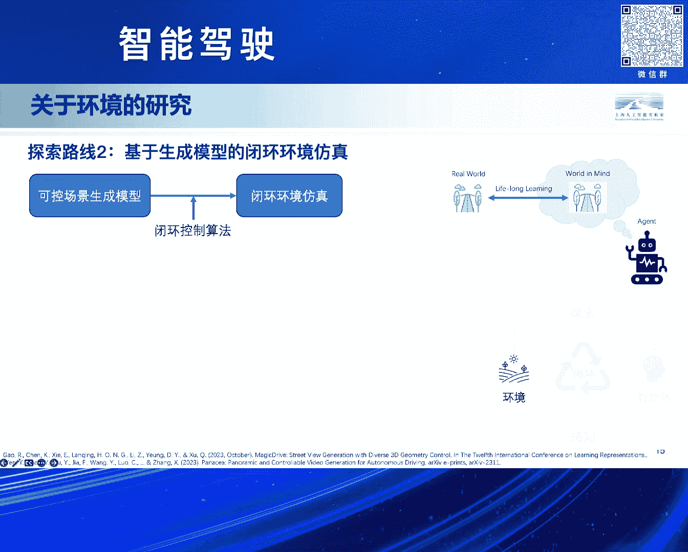
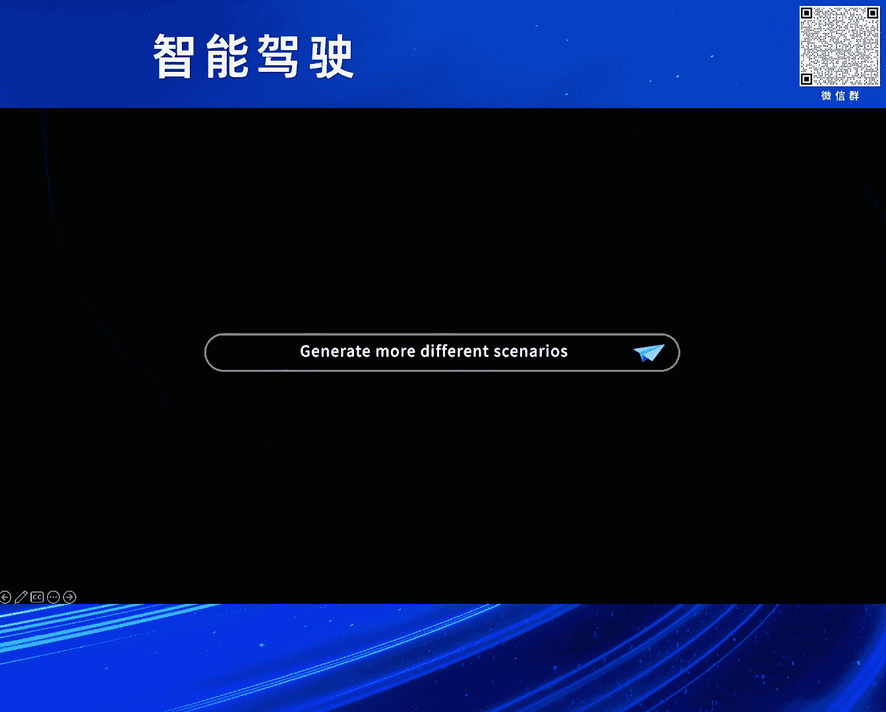
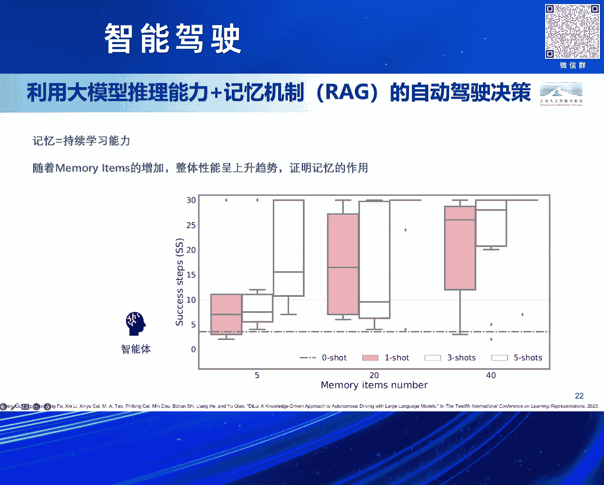
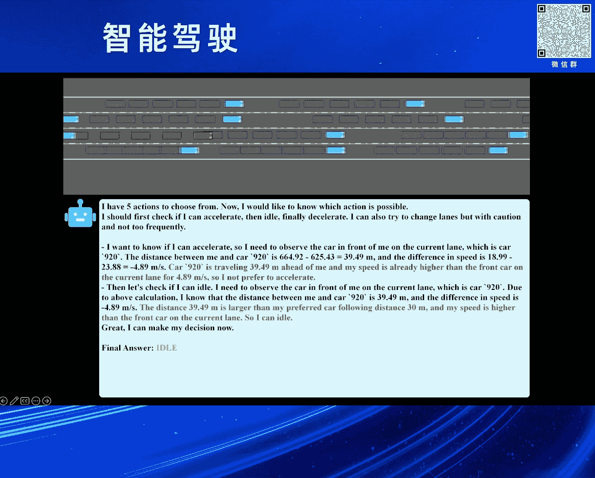
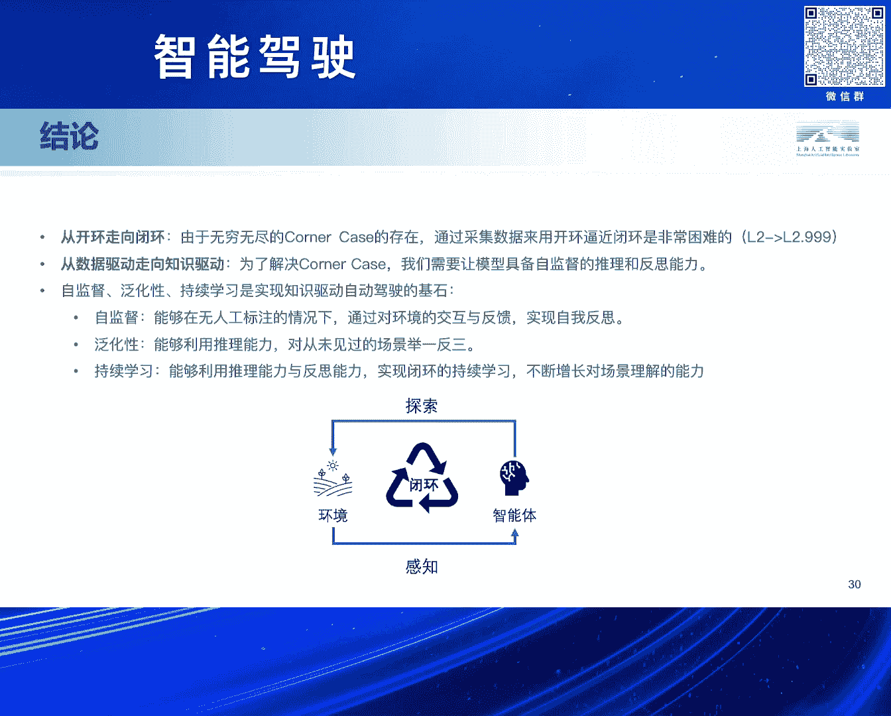

# 2024北京智源大会-智能驾驶 - P9：从数据驱动到知识驱动——自动驾驶新路径：石博天 - 智源社区 - BV1Ww4m1a7gr

啊好的呃，感谢刘主任，然后也感谢之前各位前辈带来的精彩的演讲，其实说我压轴绝着实是不敢当，因为我其实21年刚刚博士毕业，然后就加入到了上海人工智能实验室，然后其实我们本身是一个科研机构嘛。

所以我们研究的一些内容可能会偏发散，偏一些，不同于大家常见的一些技术路线，那我们可能会愿意做一些这种，初步的一些探索啊，那所以啊接下来就我来介绍啊，很荣幸介绍一下我们团队的一些研究工作啊。

那今天的主要的这个话题叫做动漫，台大模型和知识驱动的自动驾驶，其实这个故事早在38年前就已经展开了，其实自动驾驶呢在呃就大概快40年前，在86年的时候，这个CMU的NEVLAB。

他们其实推出了一款原型的系统，已经能够大概去实现一个由机器代替人类，驾驶员去开车的这样一套系统，那后来到了这个95年左右，那他们的第五代系统成功实现了一个壮举，就是完全由自动驾驶的系统操纵。

然后横跨了美国，但是呢其实整个的过程中，差不多有98%左右的这个路线，是由啊算法来去接管的，那当然其中有2%左右的场景，还是由人类的驾驶员来完成的，但其实直到了这个30年之后的今天，其实最后的这2%。

可能到现在也没有真正得到这个完全的解决啊，所以其实可能是呃我觉得一个原因吧，可能现在数据驱动的方法，也逐渐的去达到一个瓶颈，就是在预期大家的这个L1，L2这样的一个迭代的过程。

可能L1的阶段我通过啊加更多的传感器，然后达到了L2，我再通过增加更多的数据，然后实现L3，然后让它适应更多的场景，然后来达到这个L4，甚至L5的级别，但实际发生的情况呢，就是我在L2的阶段。

我可以通过增加更多的数据，但仿佛有一面墙一样，它能总是实现到这个L2。999，总感觉像是离L3啊，就是存在这样的一个瓶颈，那究其原因呢，其实之前很多前辈也都介绍了，那主要的一个原因。

就是因为呃存在各种各样的counter case，那这些corner case呢，它不但是一些我们在路上罕见的，甚至还有很多，是我们可能一辈子都不会见过一次的数据啊，比如说像像以下展示的这些。

其实甚至都是真实的路上发生的情况，所以我们啊作为一个研究的这个团队，所以我们在探索，是不是有一条新的技术路线，能够去缓解这个问题啊，所以我们在探索呃，是不是通过这种技术路线。

能够实现L4再到L5的这样的一个进化啊，所以我们呃主要是从这个，人类学习驾驶的一个角度出发，那我们认为可能如果这样，如果真的有这样的一条新路线，它一定具备这样的几个特征，就是泛化性。

自监督和持续学习的能力，那围绕着这几个观点，我们认为现在的这个巨神，智能技术和自动驾驶相结合，最终实现一个知识驱动自动驾驶，可能是我们为这个路线起的一个名字吧，对其实呃。

最开始其实呃好像铁军教授也介绍到了，这个人类学习开车的一个过程，其实这句话呢是这个LEQUEEN在20年左右，在他的一篇啊文章中提出的，说，为什么一个青少年呢，他只需要大概摸20个小时的方向盘。

就可以学会开车这件事，而且呢对于大部分人来说，他在很多这辈子从来没有遇到过的场景，他在第一次遇到的时候，也能有一定的能力去解决这个场景啊，所以其实这是一个很有意思的一个问题，那我们认为可能呃。

之前的很多方法可能遇到的这个困境，就是这种数据驱动它泛化性的一个难题，那对于知识呃数据驱动的方法来说，它通常是我在固定的一些场景上训练，我规定好了它的输入输出形式，那这个任务的定义就限制了这个啊。

整个的这个这个他的这个能力的上限，比如说如果是传统的感知模型，我在目标检测的阶段，我一般应该不会定义出一个目标检测模型，检测路上是不是有架飞机啊，但是呢知识驱动的方法就不太一样了。

因为它通常是用这种跨域的知识的能力，比如说现在这种多模态的大模型啊，或者是一些这种预训练的技术，它首先啊具备对某些通用场景的，这个通用的物体的理解能力，那并且这个能力可以通过比较低的成本。

迁移到一个真实的环境中，所以可能就能够完成一些之前数据驱动，很难想象的事情，那这个是我今天早上去这个用GPT4，试了试啊，就刚才的那张图片，我直接问这个GPT4，说。

描述一下这个图片到底发生在什么场景场景里，又有什么异常，如何避免出现危险，我应该怎么做，其实能看到这种结合了open doomman的这种知识的，经过预训练的这样的一个通用的视觉模型。

其实确实对这种特殊出现的场景，还是具备一定的理呃这个理解能力的，那所以其实我们呃如何去构建这样的一个知识，驱动自动驾驶呢，我们更多的是从一个呃呃这种具身智能的视角，来看待自动驾驶这件事情。

那所谓的均衡智能啊，其实很关键的就是两点了，一个是环境，一个智能体，一个智能体呢它在环境中去实现探索呃，呃然后呢去把这个呃从环境中去进行感知，然后呢，智能体会自主的在这个环境中去进行探索。

然后整个的过程呢其实很重要的一点，就是能够在一个闭环的环境下去完成的，它能够基于自己的好奇心，或者基于自己的这个知识积累的能力，能够在里面不断地运转，那所以其实我们团队的研究。

也基本上围绕着环境和智能体，这两个方面去展开的，那首先对于环境来说，我们现在想训练这种自动驾驶的算法，那最最最好用的环境就是真实的世界嘛，那所以呃在真实的世界中直接训练，要么不闭环，要么就不安全。

不闭环，就是我可以去预先采集好很多的数据，那这种方式它是一种开环的训练，或者测试的方式，它不一定能真实反映，你这个模型在现实的世界中，它的运转的这个效果啊，那要么就不安全，这个肯定的。

我一个没有任何训练经验的自动驾驶算法，扔到这个城市中，让他自己去积累驾驶经验，其实这是个非常危险的事情，那所以我们一直在去研究啊，有没有可能去构建一个这种虚拟的环境，构建一个对真实世界近似的刻画。

因为这种刻画的真实程度，其实决定了这个agent，他脑中形成的世界观的这样的一个知，认知的上限，那围绕着这块呢，我们又有两条不同的技术路线的探索，就是围绕这个虚拟的环境，那第一条技术路线呢。

就是我们基于神经渲染和结晶仿真啊，我了解到可能呃这个据我自己的认知吧，可能我们团队算是非常早期去从事这方面的，research的研究，就在这个NERF的，甚至在NERF刚出来的时候。

我们其实就有一些相关的布局和探索，那整个这套技术路线它大概就是三个部分，一个是重建，然后泛化，然后再生成所谓的重呃，重建呢就是我用真实世界的数据出发，我去对它，去用神经渲染的这个技术去做三维重建。

然后呢我能够把它前后景截，我开，我对里面的一些交通流，我可以利用一些交通流的生成工具，我可以编，让他创造出一些真实世界中不存在的交通流，但是呢这个交通流它也很逼真，它可能是一些counter case。

但可能更像是这种人开出来的corner case，然后我们再把它去用神经渲染的技术去渲染，生成出来啊，那这里其实展示了一些，我们这个中间的一些阶段性的成果嘛。

然后我们其实提出了一套叫做NEUROSEM的框，开源框架啊，目前也是在GITHUB上是开源的，它是一个前后景解耦的，其实这个里highlight一下就是很多呃，这个友商的这个算法其实很多。

它还是针对背景为主，对于前景甚至动态物体，其实都不是能非常好的处理，因为我们其实采用了一套不是NERF的技术，我们是用这种三呃这个SDF的表征，它的一个特色呢。

就是说NERF可能能做出这种视觉的三维重建，然后呢我渲染的相机可以比较真实，但是因为NERF并不并不能真实的去建模出，一个物体，它的表面，那我们现在有一套新的技术，然后来实现呃，那个它的表面的重建。

能够同时对这种动态，静态前后景的物体实现解耦和三维重建，那并且因为我们有这种表面渲染嘛，所以我们可以很容易的去把啊，用各种各样的传感器去进行仿真啊，比如说NERF可能仿个图像，仿个相机啊。

这个是可能是他的一个能力的上限了，但是我们还可以去仿出这种不同型号的激光，雷达等等这样一些线呃，这个功能，然后这块呢是我们的神经渲染的一块呃，就重建和神经渲染的研究。

那第二块呢我们也做了一个叫做这个LIMSIM的，一个开源的高一致性的交通流仿真工具，它也是一种从数据驱动的角度出发吧，然后从能够从真实数据中去学习到很多，不同驾驶风格的一些交通流仿真。

然后呢它能也能支持这个多车复杂的博弈，那最终呢我们将刚才的这个neuron sim，和这个lime sim两个平台相结合，我们就构造了我们一套基于神经渲染的，端到端的仿真引擎，叫做OESIM啊。

然后呢它其实能够使呃在右下角，其实我们展做了一个非常简单的界面啊，因为我们是一个研究机构，其实没有什么工程师，这个基本都是一些学生，大家自己写的一些简单的界面，然后我们也很少有这种非常真实的数据嘛。

所以我们从cola中仿真去get到了一份数据，然后我们从这份数据出发，我们可以去呃通过编辑出一些不同的交通流，并且让它仿真生成出来，而且这里展示的其实全是神经渲染重建和渲呃，这个泛化生成的结果对。

然后刚才介绍的呢，是这个是基于神经渲染的技术路线，它其实是一个相对比较长的技术路线，我先重建在泛化，在生成，其实这个技术路线，我们在探索的过程中发现有很多问题，比如说重建对于数据质量要求非常高。

那可能对于很多量产的实际的情况，你得到这个数据，可能能够用来重建的数据就非常少，然后再加上整个的这个链路太长了，然后呢我们所以也同时在探索第二条技术路线，就是我们有没有可能用啊生成模型的技术。

来实现这个闭环的仿真，本质上呢其实非常简单的一个架构图，就是我们可以用一款可控的生成模型，这个所谓可控生成模型就是我给定一个layout，比如说这个路网的结构加上自车踏车的结构啊。

然后呢我再结合这个生成模型呃，就把它作为输入，然后这个生成模型就可以给我生成一张图片，那同时呢我们再配合上我们刚才提出的这个，LIMSIM的这个闭环控制的算法，把这两个相结合。

我们就能够形成一个纯的纯粹的，基于这个生成模型的一个闭环仿真的引擎。

那这个可控的生成模型，其实不限制它到底用哪个，包括像现在比较热点这个magic drive啊，还有这个这个帕纳西亚等等，各各种就是研究上比较成功的一些，基于layout可控路网生成的这样的一些工具。

那围绕着这些工具呢，我们其实做了一些简单的尝试啊，比如说这个是一个连续帧的生成，那本身这个模型其实不是一个，基于视频生成的模型，还是基于单帧图像生成的模型，但是我们所给出的路网。

其实是由我们的仿真器仿出来的，像之前很多的这种生成的算法，然后他们更多的是基于一个ground truth的，这个路网路径，然后我去重新的再把它生成一遍，但是现在我们可以去编辑，生成出一些新的场景来对。

然后呢，呃这里有一个我们做的一个简单的一个demo吧，然后就是介绍了一下，我们之前的这样的一些结果。

就首先其实我们除了刚才介绍的那些以外，我们也有非常多的一些其他的研究，比如说4D的自动化标注，所以这里展示的完全就是算法真正标出来的，实际的跑出来的结果，所以可能会有些瑕疵，就是我们可以去实现啊。

完全自监督跨模跨模态的呃，跨域的就是这种啊，一个model free的一个4D自动标注的算法，然后他能真的去把这个场景中去进行，然后标注的同时，其实也是在做这个对应的三维重建，包括我们能获取到它的深度。

以及这个最重要的就是表面法向量，其实基于NERF的方法，它是很难绘制出一个表面光滑的，这种表面法向量，那我们把各种各样的序列去做三维重建之后，我们其实就能得到一些这种序列的场景库。

那我们可以比如说挑其中的一条一个场景库，我们去做一些编辑啊，这个是真实的这个数据，但是呢因为我们对它进行前后景结构的重建了，假如说我们现在可以删除场景中的一些某些，特定的类的物体，比如说把这个人删掉了。

或者去编辑一些车辆啊，增加或者删除一些车，那这个时候我还可以去啊，比如说增在这个路上增加更多的车辆，然后呢，创造出一些这种真实世界中，也不存在的一些场景，比如说要让这个场景变得更危险一些。

或者说有这种右边的一辆车去来来来别车，这种特殊的一种情况，那同时我们也做了一些简单的也探索吧，就是说改变一下他的这种daylight啊，然后呃其实后面这个就是展示的时候。

我们也具备一定的这种场景的生成能力啊，我们在给定这种情况下，我们可以去基于这个路网，去生成各种各样新的数据，那最终我们能够让这个数据变得越来越丰富，包括能够拿它用来去做自动驾驶算法的训练。

或者说去把它做成一个闭环仿真的测试的，这样的一个或者是一个闭环仿真的引擎啊，这个就是我们这两块的工呃，这个关于环境这一块的工作，那呃除了环境以外，我们还有一个很重重要的一个研究方向。

就是对于agent的研究，就是怎么去利用这种智能体，去实现自动驾驶的任务啊，那我认为可能自动驾驶的这个智能体，刚才提到的这三点，一个就自监督，高泛化性和持续学习，它为什么重要呢，呃自监督主要指的是。

他需要有这种自我反思的能力，而不是凭借一些外部信号去进行反馈，那这个其实对于这种大模型，或者说大规模的数据来说是非常重要的，因为现在有的开环的方法，我无论是自动标注还是人工标注。

本身本质上也都是需要有标注才能进行的，但如果我们有一套算法，它部署到这个模型中，自己跑自己发现自己哪里做的对，哪里做的错，那我可能就不再需要去有人工标注，是从而实现一个自监督的效果。

那第二点就是高泛化性，我们认为可能一个这种算法，需要具备一些推理的能力，它不是简单的去对所有我采集到的已知的场景，去做记忆，因为其实如果大家就是做这种啊优化了，或者说这是机器学习的一些呃有背景的同学。

大家应该都知道，就是呃任何这种optimization based model，他肯定会有这种遗忘灾难的问题，那所以大家想要去通过采集更多的。

corner case的数据来解决corner case的问题，那corner case呢它天然就是一，就是现在的这种基于学习的方法，天然的就要记那些常见的case。

我要忽略掉那些corner case，因为对于很多算法来说，conner case反而是一个异常，我conner case做好了，我可能common case做的就不一定好了。

所以其实这里面存在一个矛盾，所以我们认为可能如果简单的去记这些啊，input output的这个pair可能还不够，还需要让模型具备一定的推理能力，那第三点呢，就是我们可以基于前面介绍的这个啊。

反思和推理能力来克服这些遗忘的灾难，实现一个积经验的持续积累，其实整个的这个过程就跟人类开车的，这个或者说甚至不只是开车啊，就聚身智能在日常完成各种日学习任务过程中，很类似的这样的一种模式。

那我们管这个模式，其实叫叫做这种自动自动驾驶，然后这里其实我们呃介绍了一个这个闭环的呃，就是关于这个知识驱动自动驾驶，闭环训练的一个研究框架，是一个偏这种high level的一个一个框架。

那他首先能够从环境上去进行这个感知，然后呢感知到这个场景之后，我试图去理解这个场景，并且做出一个plan，然后呢这个plan呢它在执行之后，它可能会有两个结果，一个就是成功了，一个就是没成功。

那成功了呢，他就作为一个成功的经验，我有一种模式把它保存下来，失败了呢，那我要求有一个模型，自己或者一些外部的模型，能够自动化的去让它去进行一些反思，并且让它呃重新生成出一些这个成功的。

这个告诉他如果怎么做，有可能就能避免刚才的这些事故啊等等，这些信息呢也会被保存到这个memory中，那在下一次遇到每一次遇到这个场景，我先从我的memory库中，我去query说。

我是不是曾经遇到过类似的场景啊，如果遇到了，我当时是怎么做的，那我结合当前场景的一些特殊性，加上一些之前的这个经验的这个泛化性，结合到一起，让他做出一个决策，那这种方法其实就有可能会去进一步提升它的。

这个模型的性能啊，然后其实刚才有提到说，我们整个这个过程需要让agent，它具备一个这个能够去做推理，能够去做决策等等这方面能力的一个呃，这这方面的一个能力啊，呃其实之前我们有尝试过。

用一些传统的一些方法，那现在大模型呢其实出现了，我们发现大模型刚好是可以，作为这样的一个模块来嵌入进去，那这个的话是我们在这个ACCLEAR，二四的一个工作吧，那这个工作其实进行的比较早。

其实投的比较晚，然后它是以应该算是我们呃第一个，能够用知识驱动的方法，去把这个大模型跟自动驾驶相结合，去进行决策的啊，然后的这样的一个研究，那它本质上跟刚才说的这个架构是非常相似的。

只不过它中间所有的这个呃进行推理，进行决策的模块是由一个大圆模型来执行的，然后呢刚才有介绍的说哎这样的一套系统，它的一个重要的特色，其实是在于持续学习的能力，那我们认为可能记忆它就能体现。

它是不是具备持续学习的能力，比如说我们可以通过一些机制，人为地设置它记忆的这个上限，然后呢我们发现随着这个记忆的上限的增加，整体的性能其实是呈现一个上升的趋势的，也就是说明它在积累经验的过程中。

这个经验其实是切实有效的啊。

然后这里有一个简单的例子吧，因为我们这个其实做是一篇，非常早期的一个文章，那那个时候其实还没有很好的这种，甚至那个时候还没有VIM的一些工作，能用的VOM，所以我们更多的是呃。

只是关注于这个真基于这个绝对真实的这个，ground truth的这些这个呃感知的结果，然后加上我们一个简单的仿真引擎，然后去让大模型去针对现在的这个场景，去给出一个自己的评判。

并且最后给出给出一个final answer，就是决定我要加速减速还是换道，那目的就是想要在这个场景中，能够尽可能的不是不断的开下去，比如说我们的这个实验，最后发现模型刚开始放在这个环境中啊。

它可能跑靠开个这个几十帧就撞车了，然后呢当执行到一定程度之后，你会发现它可能开几个小时都不会撞车，那这个是我们做的一个，非常奶义务的一个探索对，然后呢其实在这个这个阶工作之后。

那很自然的就是我们可以对它有些改进，就是呃我们最新的一个工作，这个工作其实比较新，上个星期其实才挂到RK5上，然后呢，它是一个结合了现在的这个快慢系统的，自动驾驶闭环学习的框架呃。

它的一个主要的一个特色就在于，其实呃我们又进一步的去思考人啊，去进行决策的过程，会发现人的脑子中其实分成大概两个系统，那一个叫做这种heuristic process，就是啊这个这个直启发式的系统。

它更像是一个这个呃肌肉记忆，或者说这个那个叫什么呃，就是呃一个一个非常快的这样的一个系统啊，然后呢呃在遇到一些特殊的呃，遇到一些场景的时候，我很多的情况下，我可以下意识的就做出一个正确的决策。

但是呢有很多的时候，我可能是光靠下意识的决策还是不够的，肌肉记忆也是会出问题的，比如说在我们遇到一个从来没有遇到过场景，那这个时候人可能就会有一个，更加理性的一个系统，叫做分析系统。

然后呢这个系统它相对来说比较慢，但是它能够有比较强的推理的能力，那我们这篇工作的一个特色之一，就是把这种快慢系统结合到一起，去，实现一个呃，能够像人一样去对这个场景，去做知识积累的一个过程。

那除此之外呢，我们也弥补了之前那篇工作，只能基于这个绝对感知的结果来做啊，的这样的一个缺陷，然后我们也设计了一个VLM来去让他去进针，专门针对这个驾驶的场景去做一些理解的，这样的一些能力啊。

然后具体来说呢，就是我如果是在进行场景理解的话，其实很关注的一点就是我们要关注呃，专注于周围的重要事物，其实像普通的这种传统的一些方法，如果我只是去对场景做个描述，那它的描述可能会非常的广泛。

然后就是可能跟这个实际的，我想用的这个结果并不是非常的match，他可能你给他一个交通的场景，让他描述一下里面有啥，他可能说今天天气真好，然后天上有小鸟在飞之类的，跟交通没关系的场景。

所以我们用一小部分的数据去合成一个，专门针对自动驾驶场景很有价值的一个数据集，他会关注于这几类信息，比如说语义标签，就是啊关注这个场景中的危险场呃，这个危险的物体，比如说红绿灯，比如说基础设施。

交通标志牌，还有一些运动的这些物体，然后呢会对他们有一些特殊的标注，然后我们去用这样的一小份数据，去SFT一个开源的感知模型，其实我们就是用的一个千问的一个模型，其实几啊规模也非常小，然后呃在这个场呃。

呃然后呢我们甚至整个SFT的数据也非常少，其实只有差不多1万帧左右的，就是1万个这样的pair，11K的这样的一个pair，然后最后就能实现针对每一个感知的输入，我能给它产生一个跟我自动驾驶非常相关的。

这个场景描述的这样的一个功能对，然后就是关于刚才介绍的这个快慢系统的，这样一点，就是我们认为，可能首先呢就对于这个自动驾驶一个场景来说，我们先让快系统去做一次推理，在当前这一帧的场景做一次推理。

那这次推理因为它速度很快，但是它可能会出错，如果出错了，对应的这个系统我们会又给回到慢系统，让它去生成出一些你为什么出错，你下次怎么做，该正确的这样的一些决策，我们会不定期的去把这些慢系统生成出来的。

这些数据用来再去调整这个快系统，那然后呢最后就能够让呃发现哎在绝大情况下，我调用快系统都不会出错，只有在很少情况下，我需要调用main系统的时候，再来调用一次慢系统，然后再来生成新的经验。

整个这样的一套pipeline的一个最大的好处，就是它能够实现真正意义上的，我把这个模型部署到一个虚拟环境中，它就一直跑，它自己可以给自己积累经验，而不需要针对每一帧人去总结他哪里做对了，哪里做错了。

也同时也不存在像这种感知，像这种人工专编写规则啊，等等这样的一些非常麻烦的一些事情啊，那我们其实做了一些很简单的一些实验吧，然后主要就是这种在特定的数据集上，首先第一点就是左边这个表格呢。

我们尝试了在针对驾驶场景优化之后，我们其实超过了GPT4的，就是用GPT4来去做我们这个快慢系统，然后呢它本身没有对自动驾驶场景进行优化，但是我们大致拿了11K的数据，对自动驾驶场景去优化了一下。

发现只用一个千问，1。5这样的一个非常小规模的模型啊，不是千问，也就是千问一个小的一个模型，然后就能达到这跟GBD四一样的效果，然后同时呢，我们也探索了跟这个数据驱动的方法相比。

因为驾驶的经验是自监督这个闭环形成的，所以对于监督的数据要求是非常低的，比如说像这个表格中展示的上面的有些结果，其实它的性能是非常好的，但它是建立在海量的人工的标注的基础之上。

可能有几百万帧的这种数据来去训练，但我们其实整个系统真正拿来去训练，模型的数据其实是非常少的，那底下的这个表格呢，我们也验验证了另一个关键的点就是泛化性呃，我们有探索过说在这个呃呃我们实现这种跨域。

比如说像KALA这个仿真引擎中，我们用除了这个某一个城市以外的这个数据，去在这些城市里面让他跑去积累经验，得到的这个模型，我们直接把它放到一个全新的城市，它之前都没有跑过，然后让他来直接去运行。

发现它的性能是不会呃，虽然会有一有一些下降，但是这个性能不会一降到底，让它彻底的不work，说明我们学习到的这个知识，是具备一定的泛化性的，为什么呢，其实是因为我们整个知识的表征。

都是用这种类似于语言的这种方式来表征的，其实我们回过头来再去看我们学到的很多知识，它基本都是一些这种红灯停绿灯，行车离你太近了，你需要踩个刹车之类的这种级别的知识，那这种知识其实它是一种放之四海皆准的。

而不是去OVERFIT到某一个场景下，所以这个是我们认为啊，它能同时具备这个泛化性的这个和闭环测试，这个能力的一个主要的原因，然后还有就是我们也要验证一下，它是不是具备持续学习能力，就是我们可以发现啊。

比如说看右边这个图，就是我们随着反思的次数的增加，随着我们在这个场景中跑的轮数的增加，整体的平均的成功率，也是能够呈现一个不断上升的一个趋势的啊，对但是实际上在这个应用的场景中嘛。

因为也不能说完全达到百分之百的一个准确性，也是主要，也是因为我们现在的这种视觉的模型嘛，也是一个临时的方案，其实它没有非常完美的解决好，对于交通场景的这个感知理解能力啊，那后面有一个非常简单的case。

然后呃就是这个场景特殊是在于它是别的物，两个物体撞车了，然后呢，我们可以通过这个模型，让它能发现了别人撞车了，然后我们自己来做出一个判断，就是觉得我需要先减速暂停一下，看看是不是有什么问题。

然后当这个问题解决了之后，我再往前走，就是我我们觉得可能这种场景挑出来，是一个相对比较corner case的一个场景吧，对然后最后的话再介绍一下啊，这个今天的这个结论。

那我们认为可能现在是一个呃很关键的一点，就是从开环走向闭环的一个节点啊，因为有无穷无尽的corner case的存在，所以我们通想要通过采集海量的数据，用这种开环的方式来去逼近闭环的这个模式呢。

其实是比较困难的啊，那我呃所以我们提出了，可能现在可以从数据驱动的方法走向知识驱动，那因为为了解决这些control case，我们就需要让模型具备这种自监督的，推理和反思能力。

那所以它呃呃同时呢我也认为这个自监督，泛化性啊，持续学习是实现知识驱动自动驾驶的基石，包括自监督呢，它能够在无人工标注的情况下，来对环境实现一个交互和反馈，来实现最终的自我反思。

而泛化性呢就是利用它的推理能力，能够对未见的场景去举一反三，那最终持续学习呢，就是呃能够同时利用这个推理能力和反思能力，来实现闭环的这种持续学习，能够不断的对啊场景的理解去呃。

这个不断的去增长他对场景理解的能力对。

然后最后的最后就是做一页的广告吧，就是介绍一下我们团队，其实我们是上海人工智能实验室，智能交通平台组，我们目前的研究方向也都是专注于知识驱动的，自动驾驶的技术路线呃，的探索。

主要追求把AGI和聚神智能的一些相关场景，应用在自动驾驶的领域中，然后想要去探索这一些比较新的路线的，一些可能性啊，我们团队其实非常的年轻啊，就是21年7月刚刚成立，然后目前有30名左右的成员。

其实一大半还是实习生，然后呢，目前呢呃大概呃取得过七项的评测的冠军，包括像这个vivo open data家set，它的3D离线目标检测，其实我们差不多已经这个霸榜第一名啊，已经有一年多的时间了。

然后在一些学术的会议期刊上，发表了大概60多篇论文嘛，然后有30多项专利参与到了一些这种团标，国标国际标准的职称专家组的工作对，然后这个就是我今天主要介绍的内容，然后其实因为我呃。

如果大家对这个我们这边的研究方向，因为我了解可能今天来的有很多，也有一些学生或者有些老师，如果有一些优秀的学生啊，老师也愿意推荐到我们这边，因为我这边可能后面会有一些读博的名额。

也欢迎大家来跟我邮件的交流啊。