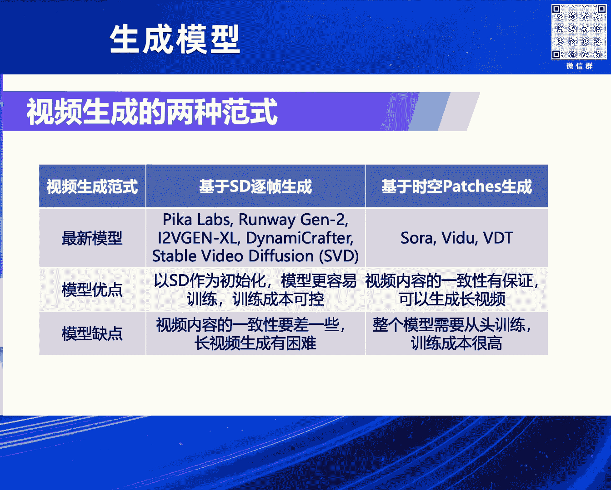
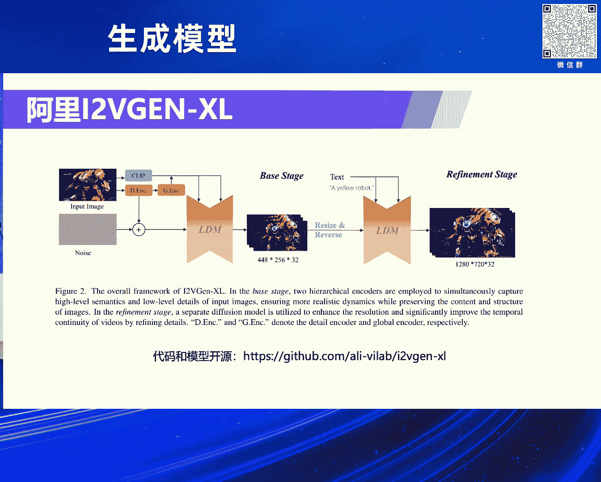
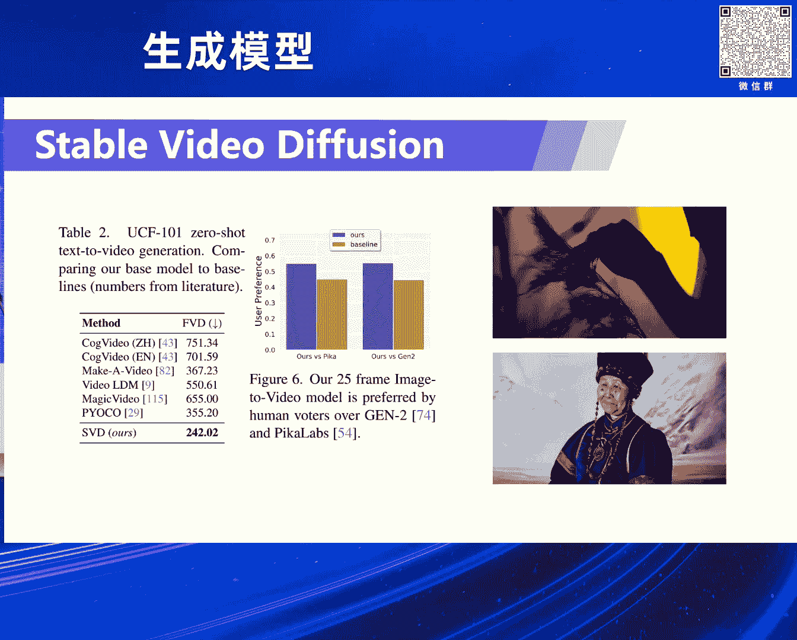
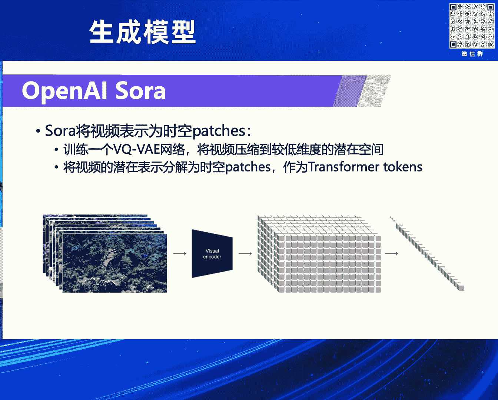
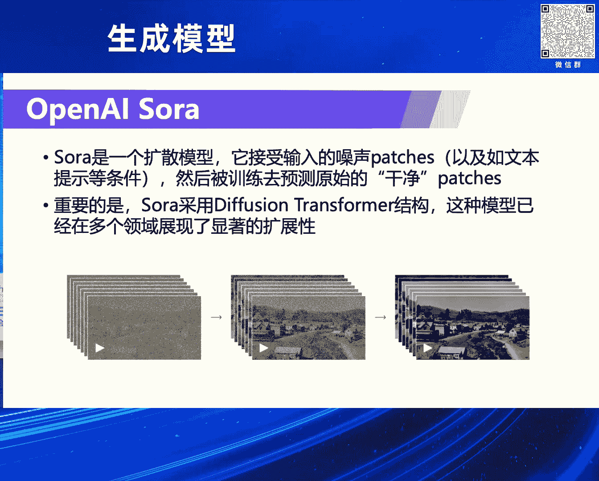
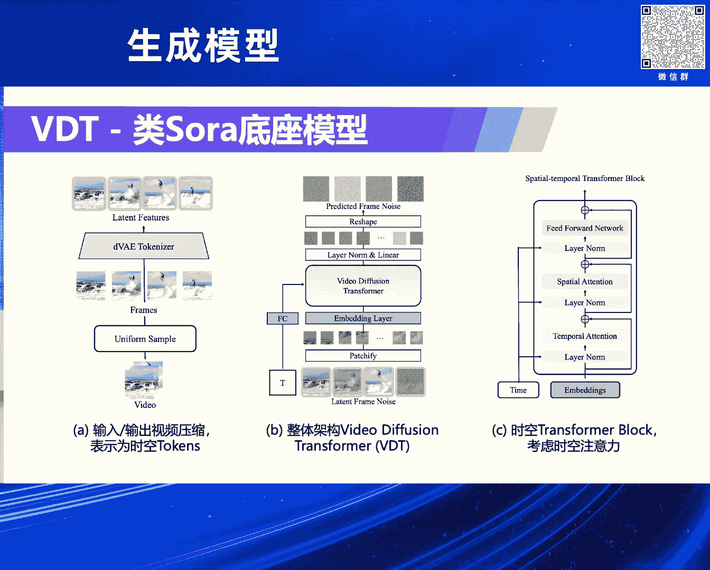
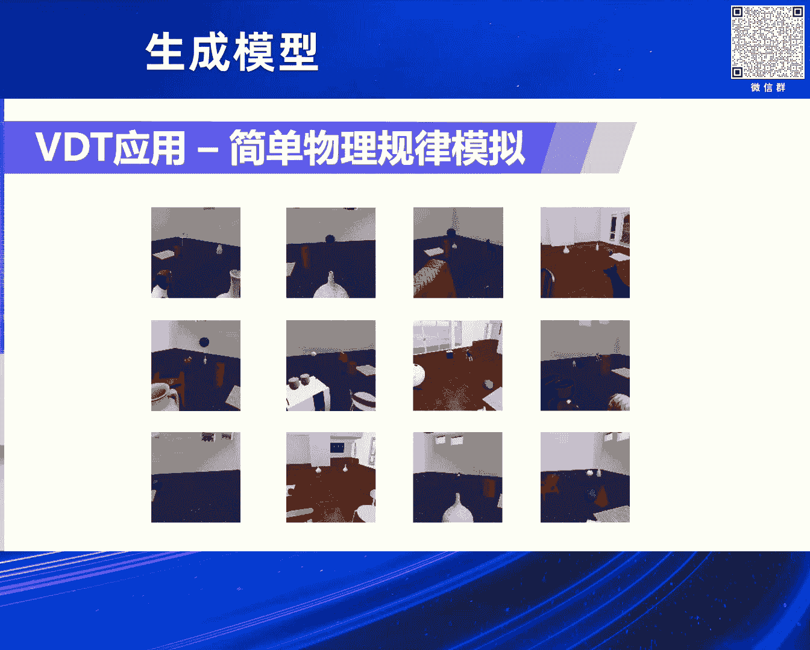
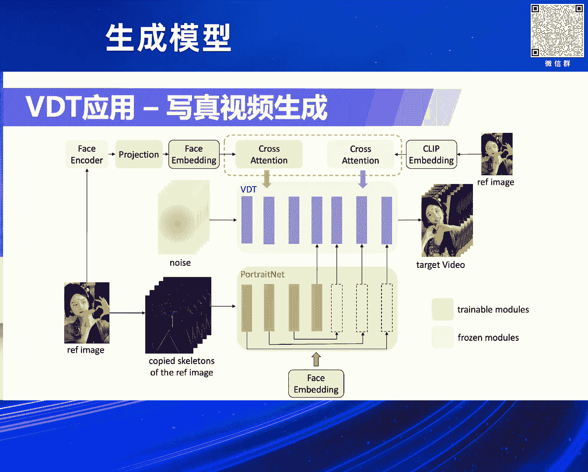

# 2024北京智源大会-生成模型 - P2：视频生成前沿进展：卢志武 - 智源社区 - BV1DS411w7hz

感谢李老师的介绍，也也非非常荣幸来这儿做一个报告的分享，我今天主要介绍一下我在视频生产上的，对自己的一些探索吧，或者一些思考哦，哦这个好这个好一点嗯，这是我今天报告的分四部分吧。

先讲一下视频生成为什么这么难啊是吧，它目前大家是有哪几种想法，是怎么去研究过他的，然后按照我我总结的有两种方法或者思路吧，分别介绍一下最新的进展，最后对未来一年是吧，他应该怎么去发展做一个预测。

下面我先介绍第一部分吧，视频生成相对于呃图像生成肯定困难很多，呃这个原因也是很显而易见的，因为什么呀，视频我们可以看成是什么呀，是多帧的是吧，图像生成它要考虑一个时间维度呃，所以从这个角度的话。

肯定视频生成比图像生成难得多，是他就说他最容易犯的，就是最容易出现的一个问题是什么呀，视频生成内容一致性没有保证啊，这个一致性又可以体现在很多方面啊，就是比如说他故事连不连贯。

或者里面的一个人他是不是同，就是一直是那个人的ID，或者那个人虽然ID是一样的，但是他的动作可能不连贯，也有可能嗯，这个是我用saver video defasion啊，这应该是目前比较好的开源模型。

生成的两个例子啊，大家可以看到这两个例子里面呃，比如说那个就右边那个男的是吧，他脚应该是一会三只脚，一会两只脚，这个肯定是有问题的，左边这个小女孩的脚也也是一会儿，有一会儿是没有的。

呃第二个我视频生成面临挑战肯定是什么呀，它消耗了资源实在太高了，嗯去深链资源肯定是消耗消耗特别高，呃就算说我们说推理的话，它其实自然也是相对很高，就比如说我们生成一张图片。

现在可以做到一秒之内就生成出来，比如说5+2乘五元二，是不是，但是如果你生成一个，比如说720P的一个高清的视频的话，门槛级到高清的视频，你生成比如说几秒，比如五秒不多吧，五秒乘以比如说24是吧。

乘以24，100多100多帧，是不是你要一下子把100多帧生产出来，一个是说时间长，另外一个主要是他耗的显存太多了，很多时候甚至你都装不下啊，所以我们很多时候为什么不能生成那么长，其实就是因为什么呀。

我们要保证它的连续性，所以一定要是吧，最好是一起就把一个视频一下子生成出来，但是你一下子生成出来的话，它占的显存又太多了，所以是一个矛盾的问题，第三个视频生成我觉得最难的就是什么呀。

它就是做可控生成方面的，是就是图像的可控生成，已经研究的特别透彻了，是不是特别是在control net的加持之下，我觉得已经几乎可以商用了呃，但是视频生成我觉得应该困难很多呃，原因也是显而易见的。

因为视频里面有很多额外的一些因素要考虑，比如说我们都知道视频有镜头的概念，就是我们的镜头从各个不同的角度去拍的话，这个画面是完全不一样的，然后还有什么呀，就是里面视频里面人物的角角色的动作。

是不是他从他做不同动作，这个人完全是不一样的，呃总之吧就是视频要做到的可控生成，考虑到额外的因素特别多，所以它也变得很困难，是不是很困难，呃当然了呃就说食品生产本身都没做好。

这个时候考虑可控生成是不是太遥远了，我觉得也不是啊，我后面会举个例子，其实也可以研究这个问题的，好我刚才讲了一下视频生成，我总结的三个主要的挑战啊，嗯虽然它很困难，但是我们作为学术协助穿的嘛。

肯定是一般的，是越困难我们就越要上，是不是越要上嗯，所以也是有特别多的研究者是去研究这个问题，嗯我个人的观点啊，我认为什么呢，就说把这把所有的这种研究啊，大概可以分两类啊，第一类是什么呀。

基于SD就是stable defusion呃，当一个底座嗯，用逐帧生成的思想来做，然后在生产的过程中间，后面再去考虑它的连续性的问题，还有一个就是说比较彻底了，我把整个视频当做一个整体，就是一起生成。

不是逐帧生成出来的，我是吧，我一把一个视频当做一个3D的表示，它一下子出来，这样他就是最大的好处就是什么呀，它生成的内容肯定连续性是没有问题的，但是他的好坏处就是什么呀，哦它没有一个预训练。

是不是没有一个预训练，你所有的训练都得从头开始，这样肯定对我们是吧，要求特别高啊，你的三力要求特别高是吧，然后第一个方式的比较有代表的新新脑啊，就是皮卡呀，Runway。

然后还有阿里腾讯的一些开源的模型，甚至slayer defection，这一家公司开源的视频的模型，是不是这个呃，这个至少有三个是开源是可以用的，还有基于第二个第二种方式。

我把它叫做时空patch或者整个视频啊，整个视频一起生成出来，我就这种方式的话，有比较比较有名的SORA，还有申诉的we do，还有我们自己的一个呃VDTR嗯，我我做这个报告的时候，可能是一个月之前啊。

一个月之前我尽量的已经把最新的包包进去，但是视频是发展实在太快了，比如说过去一周他一下子出来四五个，所以我我也没法加进来，感觉是吧，反正比如说那你下一周可能又出来了，没办法是吧，但是但是万变不离其宗吧。

就是他们的套路肯定是，要么是在前面这个方式里面，要么就在后面这个方式里面啊，好吧嗯，然后后面这个方式的话啊，也有两种啊，一种是就是结合DEFUSION加transformer的优点。

就是所谓的DIT的这种架构，还有一种是纯什么呀，transformer就是自回归的架构，呃，目前来就是目前就说发展的早的，或者是呃就是体现的效果好的，还是DIT架构啊，我觉得是吧。

然后就完全transformer自回归的架构嗯，就是就是目前就是我觉得不是那么多吧，虽然有一些，但是呃也不好说他以后能成主流吧，就是只是有个苗头啊，但是还没有证明他自己。

所以我主要还是都是介绍基于DIT架构的。

好我们先看第一个范式呃，基于SD逐帧生成它的一些最新的进展，我们看一下诶，第一个就是皮卡，皮卡当在去年是吧，我我不记得是不是去年也是曾经挺火的，他也融了，好像最近也融了一轮啊，就说明投资人还是认可他的。

呃因为它是个必然模型，它的技术报告都是很简洁，没有没有透露它的模型细节啊，我们就把它他做的一个纹身3D的一个加速器，我们列在这啊，呃大概的思想就是什么呀，嗯他跟纹身3D啊，3D模型的这样一个模型。

它设计了一个加速的办法，它把它就是在这个生产过程中间，引入了一个要滑滑动窗，然后滑动窗里面的计算是可以用多张显卡，并行计并行计算的，然后设计了一个阈值呃，就说怎么看这个滑动窗。

可以进到下一个iteration里面，这个阈值尽量的节省是吧，计算量呃，那回到视频生成本身啊，我们觉得就说我们推测啊，反正他自己大概也是这么默认的，它应该是基于一个预训练的SD模型啊。

然后加上额外的时间围上的建模，所以我们就觉得他应该还是基于逐帧，基于SD逐帧生成是吧，然后后面再补上时间维的建模，右边是它的一个效果，第二个比较好的模型就是run away的金兔GTO。

实际上他的技术细节也没有公开，我们这列的是他的金one的技术细节，jin one是呃，他的技术细节公开了呃，它本质上是一个视频编辑的模型，我们可以看到是不是是一个视频输入进来，然后我们可以输入一个图像。

或者输入一个一段文字去对它进行修改，它整体的架构还是一个DEFASION的架构，stable defusion的架构啊，只是他额外加了一个什么呀，我我的视频生成就是输入进来以后，我们会提取它的深度信息。

深度信息有我们觉得什么相当于是一个3D的，3D的信息吧，哎一这样我们就保证说我编辑以后的这个视频，跟原视频尽量的在深度信息是保持一致的好，因为什么呀，金兔的技术细节没公开。

我们就呃追究一下jm one的技术细节啊，这是里面它最重要的两个时间，为建模的一个改动啊，呃一个是什么呀，就是时空的这种就是就是残差模块吧，还有一个是attention的模块呃。

它的改动其实思想也特别简单，就是在传统的就是2D的，就是2D的转机后面跟紧接着一个什么呀，就是一维的时间的转机，红色的部分啊，那我看一下，这个地方这个就是时间为的，就是啊就是这个地方就是这个地方。

就是每个二维的转机，后面跟着一个一维的时间时间的转机，然后attention是什么呀，你是就是这是什么呀，这是视觉二维的attention，然后后面跟一个什么呀，时间维度的上的一维的attention。

这样他就是什么呀，我本来是一个SLIBDEFTION，只能生成图片的，但是我加上时间维度以后，它就可以对时间进行建模，这样就可以生成视频了，刚才两是两个必必然模型啊，是主要是去年提出来的嗯。

然后剩下我介绍三个开源模型，一个是阿里的这个模型啊，我觉得阿里还是很有诚意啊，他它不仅仅视频生成的模型，也开源了它那个多模态大模型啊，比如千万VL也开源了，我觉得这个是对整个领域的发展。

还是很大的促进作用，至少钱文为二，我知道很多人是在用的，然后呃阿里这个模视频生成模型，它其实本质上是一个图文生成视频的模型呃，它把整个视频生成分成两阶段，第一阶段是是一个什么呀，我们给一张图片。

它经过clip模型，经过一个detail的in encoder，然后一个general的encoder，反正就是各种encoder吧，尽量的把这张输入的图片的信息提取出来。

然后丢到我们的save deftion里面，当条件，然后生成什么呀，生成一个448×256就是分辨率，然后32帧的视频出来，但是这个是个低分辨率的，是不是，所以他加了第二阶段是个高分辨率的。

把刚才生成视频，当的是输入输入到我spring ption里面来，然后同时再加一段文本当条件是吧，继续把它的分辨率提升上来，比如到720P了，是不是这样就变成一个高清的一个视频了，然后他的论文里面说了。

它的底座是什么呀，是stable devotion，实实际上是SD2。1嗯。

这是他论文给的一个几个例子啊，通过他的例子，我觉得它的效果应该是，比前面两个模型要差一点，大家可以对着看一下，然后这就是腾讯的这个这个开源的，开源的模型啊，我觉得也应该对这个领域的发展也是很重要的。

呃它本质上是基于他们，他们前面有一个叫纹身视频，叫做video crafter这样一个模型，把它改造成一个图文声视频的模型，就是就是上上半截就是他的纹身，纹身视频的模型呃。

下面这个加的就是把图像能加进去，是不是图像多一个条件输进去，最后把它改造成一个图文声视频的模型，他的论文也说了，他的底座也是stable difference，2。1嗯，这是他在论文里给的一些例子啊。

至少在这个例子上，他说我感觉他应该是比呃皮卡呀，比jm two，比runway的要好啊，不不就是跟比阿里的那个模型也要好一些，好最后我们重点介绍一下。

就是stable defusion这一家公司提出的视频的模型，它把它叫做stable video defection，我们后面简称SVD啊，呃这个模型，他是有论文的，他是有论文的。

我我主要是讲他为什么呃，这个模型可以说是开软里面涂生视频，最好的模型啊，呃最好的开源模型呃，比腾讯那个也要好一些，我觉得呃它的原因主要有两点，一点是什么呀，我们都知道这种基于stable。

default的模型是什么呀，它其实都有一个什么一个VAE，就是所谓的就是压缩的一个模型啊，它是有个encoder decoder呃，压缩完了在引空间里面，我们是用SBDEFUSION做生成嘛。

所以呃SVD为了保证，为了保证尽可能的什么呀，把时间信息考虑到，所以他把VIE里面的一，就是decoder部分重新训练了，然后在这个训练的过程中间，把时间的因素已经考虑进去了。

这样它生成的视频的连续性会好一些，这是一个改动啊，另外一个改动它也跟runway一样，它也加了时间的模块和是吧，时间的模块一个是什么呀，那个残差的模块转机，一个就是attention模块。

它都把时间维加上去了，但是它跟run way的差别是什么呀，它是把整个模型从头训练的，从头从开始开头训练，但是其他的几个模型只是动了，它就说新加那一部分，就是刚才就是时间维上的那一点东西。

但是前面的东西都没动，所以从这个角度，我觉得它的效果肯定是会好一些，额这是我们用他的模型生成的两个例子啊，看他的人像的细节，然后他的动作我觉得都还可以，连续性也没问题呃，这是他的论文。

你给的一些评测的结果，他甚至比呃是通过人评价的啊，是比金兔和皮卡都要好，好，这是把我们第一种方式的最新进展都介绍完了。

我们现在介绍呃，第二种方式，我是觉得就是把它叫做时空patch生成也好，或者叫整个视频整体生成也好吧，嗯反正大家明白什么意思就行了，好，那这个里面最有代表性的工作，或者是大家为什么这么关注视频生成。

肯定是要归功于OpenAI，是他当时在1月份的1月份还是3月份，我不记得了，提出了那个SA模型呃，SA模型它里面很重要的几部啊，我们简单的介绍一下，他第一步就是把一整个视频啊。

就是因为我们要整个视频生成，所以他要把整个视频表示成什么呀，时空的patch要做压缩，所以他专门训练了一个V口VIE网络，把视频压缩到一个什么呀，低维度的就是这个里面啊，低维度的一个空间里面。

然后在这个低温的空间，把视频把它分解成3D的这种patch，那就是每一个小块，我们可以把它看成一个token了，所以就可以把它丢到transformer里面，是不是。

我们只要把这个视频表示成token序列的话，那当然可以把它喂到什么呀。

transformer里面去，第二个就是什么呀，它的架构到底是什么，它宏观上他他自己说的啊，他首先他肯定是一个cos模型，他可以接受输入带噪声的patch或者加上条件啊。

然后训练模型以后去预测干净的patch，就把它重构出来，他说最重要的是它采用了什么DIT的架构，就是defsion transformer的架构，这种模型其实也不是说就是什么呀，最近才出来的。

其实在前面嗯，当然李老师他们也做了一个类似的工作，后面也马上会讲呃，我觉得这个架构其实大家都想到了，我觉得是，然后这个架构他说在很多方面验，就验证了它的扩展性，这个事情也是很重要的。

嗯然后这儿给了三个例子啊，就是一个就是他说就是最基础的计算量，中间是一个四倍的计算量，然后右边是一个32乘的计算量，呃这个大概说的是什么意思呢，就是其实就是说的什么呀，这种大模型的可扩展性。

或者是我们所谓的什么呀，词skin la嗯，词根练度只是说他这是体现的角度不一样啊，嗯我们知道嘛，solar这个模型里面它肯定有很多模型上的设计，是不是你采用不同的设计，你到底依据是什么。

然后open还通过它呃，它的实验证明我的设计只有一一种做法，我只要什么呀，我这个模型的架构的设计，让他的训练的代价变高，或者计算量增大的话，他这种的效果就会好，所以我们可以看到随着它模型的架构的改动。

它号的计算量是吧，乘以四倍，乘以32倍，然后他的越来越清晰，然后这个狗的动作越来越连续，第二个工作就是申诉的维度，这个背后肯定是有，我觉得李老师是吧，应该是起到很重要的作用。

呃他我觉得应该是按李老师自己的说法，应该是比那个DID还早是吧，应该是嗯我给你宣传一下啊，就是这个工作这个工作呃，他思想我也讲一下，我讲的不对，你可以纠正嗯，他的思想就是什么呀。

我们都知道saber defasion，它背后很有很重要的一个模型叫you let，是不是，但是优菈里是一个转接的模式，模型，就是李老师他们想了，说能不能改成一个transformer的模型。

所以他们就说能不能设计一个UVIT，是不是let就是转机嘛是吧，let it它们u let Lt是一个CN的模型，他说能不能改成一个v it的模型，就是我们知道视觉表示里面很重要的两个模型，一个是CN。

一个是VIT是vision transformer嘛，呃最后李老师他们做了实验证明嗯，说类似优奈里的设计，他们说发现时间不以及就是就这个地方，时间部以及context就是文本输入啊。

这些这种东西如果当做token丢进来的话，这个效果会很好，同时类似unit有一些常，就是是我们知道嗯，深度学习里面很重要的一个模型叫RESNET，何凯明他们做的，它里面最重要的一个思想就是跳转连接。

是不是呃，就是说他们就会发现李老师他们证明，如果很合理的设计这个长的跳转连接的话，这个整体的效果也会很好，然后申诉他们基于这样一个UVT的模型，最后是在很大的一个数据集上。

生了一个叫ui defer的模型，然后后面我觉得应该是它基于这个unit defer模型，继续把它扩展到视频上去训练，最后都躲到vv do模型吧。

我觉得应该是这个思路啊，这是他们公开的，前面我记得是上一个月还是是吧，他们给的一些例子啊，我觉得效果还是挺不错的，好最后介绍一下我们自己的工作吧，嗯我们这个工作就说首首先我声明一下。

我们我我因为我是高校的老师嘛，嗯我们我们能做的啊，也很有的时候很很无奈的一个事情啊，就是类似前面所有这种做法，其实我们2022年底我们就想到了，所以我们就去我们就去做论文嘛。

因为高校老师三里都是特别有限啊，这是一定要理解啊，我们的情况就是这样，我们现其实完全想到类似的做法，所以我们就去做，但是我们因为算力有限嘛，只能在一些学术设计上去验证它，这是我们当时探索的一个过程啊。

嗯我们探索完了以后，把这整个工作，也就是把它放到一个很有名的，叫阿卡夫的网站上面，所以我们2023年5月份就放到网上去了，呃严格的来说，我们这个工作应该是比SA早很久了，是不是早很久呃。

回到我们的工作本身，他嗯我们当时可SA没出来啊，我们就想到了两个重要的事情，一个是什么呀，我们说能不能就说视频生成也是视觉生成嘛，当时比较主流的还是基于扩散模型来做，但是我们说能不能说结合扩散模型跟。

transfer模型的优点来做这个事情，所以我们说将transformer的技术，应用到基于cos的视频生成里面，第二个就是什么呀，我们提出了统一的时空掩码进行建模，这样保证它把视频生成里面。

所有的情况都能覆盖到，但这是举了很多例子啊，然后我们这个工作也很信任啊，就发表在我们这个所谓的，我们这个领会的顶会啊，叫埃克尼尔呃，呃如果再晚一点，我觉得就发不了是吧，三运气好一点，要是再晚。

比如说如果阿克里尔再中不了，那就那就完蛋了，那可能就是吧，就只能放在阿cf上了。

这是我们模型的一些细节啊，跟SARA类似，也做了视频的压缩，只是我们的压缩的模型，因为呃要考虑三力有限嘛，做了一些简化，然后中间的这个架构跟SA是一模一样的，然后里面的呃就是transformer模块。

跟SORA有一点点差异啊，呃就是什么呀，我们是把时空的attention是分开的，这个软音也是很简单，这样做的话，我们消耗消耗的散力会小很多，没有别的原因啊，我们其实知道放在一起肯定更好啊。

所以我们跟缩上的差异，一个就是在是就是什么呀，呃注意力机制的处理上，我们采用了通常呢把它分离的方法，这个时候很多是在显存三力有限下的一个，trade off呃，但是SORA是将时空合并。

是不是他直接用3D的注意力去做这个事情，所以它的效果肯定是要好一些吧。

当然耗到三里也会大，嗯另外一个我觉得这个倒不是本质的区别，我们当时因为也是3D有限，我们只考虑了图像生成视频，没有考虑文本，因为文本肯定是要需要的数据量更大，更不容易出效果，没有别的原因。

就是这一点点原因，因为呃图声视频跟纹身视频比，我觉得软体上没有什么差异，但是纹身视频它的需要的数据量要更大，才能出效果啊，呃我们当时就说在2023年，把那个论文放到网上的时候。

我们那个论文里面其实也有这些例子了，并且我们专门为这个论文做了一个网站，这些例子当时就放在那个网站上，你们可以去查得到，我们有一个gm github上的一个网站，呃，里面这些例子其实都放到里面去了啊。

并不是说后面索尔出来以后，我再补这个实验啊，没没有的，是当时就有的嗯，所以我们当时其实已经发现了类似这种什么呀，就说就用时空patch去生成视频，它其实真的是可以对简单的物理规律进行建模。

这里面其实包含很多种不同的什么呀，物理上的一些运动的模拟哈，它其实都不是线性的运动啊，是加速运动嗯。

那我刚才说了，我们因为是高校的团队嘛，其实手头的范例其实特别有限啊，那视频生成又是特别消耗算力的一个事情，有个工作，所以我们我们结合我们的实际情况是吧，做了一个折中，我们可以在一个全域上把它做好。

是不是全域上做的要做到什么呀，能能就是能to c其实特别难哦，to c的用户能接受是特别难的，所以我们在我们的模型上面继续加了一些东西，比如说我加了一些人脸的控制，可以保证它生产过程中间人脸不要动。

然后还加了一些人的骨架的控制，是保证他的动作生成比较自然，然后这些细节我们就不讲了，太邪术了。

大概就是加了这些人脸的控制，然后人的骨架的控制，最后我们生成了这样一个效果，是不是至少我们看他眨眼应该是比死背，就是stable s v t吧，或者是腾讯这个模型啊，我觉得是。

目前这两个是开软里面最好的两个模型啊，我们还是比它明显的要好一些的，我们这所有的条件都是一致啊，我跟我们跟就是爱什科技做了对比，跟那皮卡也做了对比，跟ram也做了对比，你们可以看到我们的效果是明显。

比他们要好一些的，嗯当然这个也不是特别公平啊，因为毕竟我们是专门针对全域优化过的是吧，但是也能看出一些问题吧。

这个就是我们继续优化以后，把它稍微做了一点后期处理啊，嗯这样我们尝试着把这些视频卖给普通的用户，呃，这两个视频应该是卖掉了，就是我们拿到这儿了，当然大家不要泄露出去啊，因为可能那个人要告我的话有问题。

呵呵对，呃我我主要是想证明什么呀，我们其实有的时候呃，虽然我们每个人都是可以一堆的抱怨啊，比如说算力有限啊，或者各种数据不够啊，呃你可以扯一堆理由啊，但是如果你坚定的选一个东西啊，其实可以做出来了。

也可以把这个事情打穿的，是至少我现在证明我我是吧，VDT我们我觉得我我们想到的比solo早多了，是不是，但是因为三点原因，我做不到它生成一分钟的视频，是不是我做不到。

但是我可以在这个人线视频生成上面写成，视频生成上，我可以做到效果很好，做到普通的用户都能接受，甚至他愿意付钱买这个视频，那这个就是很难啊，那不是solo那个模型就能解决的。

是不是那个还就是SORA虽然已经很惊艳了，但是离普通的用户愿意为他付钱，这个差了10万8000里是不，所以这个后面还有很大的gap，但是我们在有限的3D情况下，我把这个打穿了，其实还是很难哦。

最后给了一个长一点的例子嗯，这个视频是再早一点，刚才那两个是更新一点的，可以看到里面比如说是我呃，扇子遮脸啊，她都是可以把它恢复出来，甚至刚好最后那个女生，她背后的那个影子，她是可以生成出来呃。

他的人在动，影子也在动，就说明这些物理规律都是学到了，最后我就简单的嗯总结一下吧，就是其实跟我们刚才讲的三个挑战是对应的，那就是说未来一年我们视频生成呃，值不值得做啊，我刚才还跟李老师讨论。

他说他不想做了，是不是嗯嗯不管了，就是写书上总得说说说抛一些问题出来，大家还有得做吗，那一个肯定是什么呀，视频加速这个肯定要做嘛，嗯你不能说消耗那么多战力，或者要等一个小时，这个不太行啊是吧。

那太久了没法商用，当然我觉得这个事情实际上是最好解决的，嗯总能把他推理加速，至少把推理加速是可以的，第二个就是更长的视频能不能生成，是不是呃，虽然SA已经生成了一分钟的，那但是能不能2分钟啊。

能不能生成，是不是生成更长的视频，能不能生成，我觉得可能呃不能光靠数模型本身，可能后期有一些处理，第三个就是我觉得特别有就是普通人能做的，就是视频的可控生成呃，这个其实有的时候消耗了3年可能没有那么大。

我觉得在座的很多老师都有可能做这个方向，好呃，李老师我要做就介绍到这儿吧。

问问题啊，对有一个简短的QA环节，好感谢卢老师的这个精彩的报告，对这个视频生成模型，做了一个特别长的一个梳理，特别详细，同时呢也给我们有很多的启发，第一个是在学术上，我们怎么样有远见，做的很很靠前。

第二个事情就是说在比如说我们应用上，如果通用我没有那么大算力，怎么样去在垂域中找到一些新的机会，然后我们有大概一两个问题的时间，大家有问题的话，我们可以跟啊，卢老师有一个QA的环节啊。

好大家直接可以举手啊，有问题的话可以举手，好，哎老师你好，就是视频生成虽然非常火，但感觉从高校的学生角度来说，好像没有那么多资源去撬动了，然后对呀，然后就想就是沿着这条路去做一些工作。

或者做一些小的补丁的话，感觉有什么样的方向可以，值得建议高校学生去尝试呢，这个确实很难，就是说比如说你这个时候做出来，他们肯定会说你要不要跟SARA比一下，你要不要跟那个快手的可怜比下是吧。

你这怎么比得过呀，这个这确实很难哦，但是我觉得还是可以沿着这些，就是假设以后面可可能会有一些比较开，强的开源模型出来，你基于那些开源模型能不能做一些后续的，比如说刚才的一些可控生成呀，一些加速啊。

或者一些变速，把让它变成生成更长的视频啊，这个其实不需要那么多的三零，当然还有一些别的问题啊，我可能没想到的肯定有哦，好的好的。

